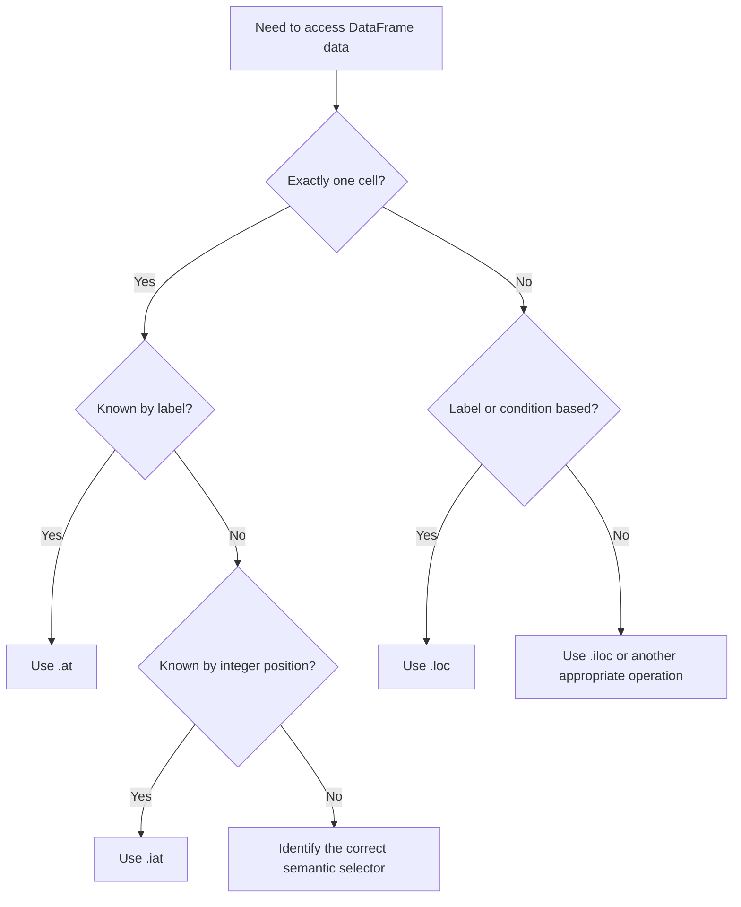

# 05- At And Iat

## Overview

`at` and `iat` are Pandas scalar indexers designed for accessing or assigning **a single cell** efficiently and explicitly.

They are specialized versions of the broader indexing interfaces:

```text
.loc
    → label-based general selection

.iloc
    → position-based general selection

.at
    → label-based scalar access

.iat
    → position-based scalar access
```

The core distinction is:

```text
.at → label
.iat → integer position
```

For example:

```python
amount = orders.at[
    "ORD-1003",
    "amount",
]
```

means:

```text
Find index label ORD-1003
+
Find column label amount
+
Return one scalar value
```

Whereas:

```python
amount = orders.iat[2, 3]
```

means:

```text
Find row position 2
+
Find column position 3
+
Return one scalar value
```

These accessors are useful when the application genuinely needs one cell rather than a Series or DataFrame.

## Why `at` and `iat` Exist

General indexers such as `.loc` and `.iloc` support many selection patterns:

```text
Single value
Single row
Multiple rows
Slices
Boolean filtering
Multiple columns
Conditional assignment
```

`at` and `iat` specialize the common case:

```text
Read or write exactly one scalar cell.
```

This gives code a clearer semantic contract and can avoid the overhead associated with more general selection paths.

Typical uses include:

```text
Reading one configuration value from a DataFrame
Inspecting one known record field
Updating one known cell
Fast scalar access inside a tightly controlled loop
```

They are not replacements for ordinary vectorized DataFrame operations.

## `at` Basics

Use `.at` for **label-based scalar access**.

The syntax is:

```python
df.at[row_label, column_label]
```

Example:

```python
orders = pd.DataFrame(
    {
        "order_id": [
            "ORD-1001",
            "ORD-1002",
            "ORD-1003",
        ],
        "status": [
            "completed",
            "pending",
            "completed",
        ],
        "amount": [
            1250.0,
            450.0,
            3200.0,
        ],
    }
).set_index("order_id")
```

Now:

```python
amount = orders.at[
    "ORD-1003",
    "amount",
]
```

returns the scalar:

```text
3200.0
```

The selection is based on:

```text
Row label → ORD-1003
Column label → amount
```

## `iat` Basics

Use `.iat` for **integer-position-based scalar access**.

The syntax is:

```python
df.iat[row_position, column_position]
```

Using the same data:

```python
orders = pd.DataFrame(
    {
        "order_id": [
            "ORD-1001",
            "ORD-1002",
            "ORD-1003",
        ],
        "status": [
            "completed",
            "pending",
            "completed",
        ],
        "amount": [
            1250.0,
            450.0,
            3200.0,
        ],
    }
)
```

Assuming `amount` is column position `2`:

```python
amount = orders.iat[2, 2]
```

returns:

```text
3200.0
```

The operation is entirely positional.

## `at` vs `iat`

The most important comparison is:

| Accessor | Row selector | Column selector | Intended use |
|---|---|---|---|
| `.at` | Label | Label | Single scalar |
| `.iat` | Position | Position | Single scalar |
| `.loc` | Label / boolean / slice | Label / boolean / slice | General selection |
| `.iloc` | Position / slice | Position / slice | General selection |

A useful rule is:

```text
Known labels?
    → at

Known positions?
    → iat

Anything more complex?
    → loc / iloc
```

## Return Type

The key property of both accessors is that they target a single scalar.

```python
value = df.at[row_label, column_label]
```

or:

```python
value = df.iat[row_position, column_position]
```

The result may be a Python scalar or a NumPy/Pandas scalar depending on the underlying dtype.

For example:

```python
value = orders.at[
    "ORD-1003",
    "amount",
]

print(type(value))
```

The exact scalar class depends on the DataFrame's dtype.

The important application-level contract is:

```text
One cell
```

rather than:

```text
Series
DataFrame
```

## `at` with a Unique Index

`.at` is most predictable when the row label is unique.

```python
orders = orders.set_index(
    "order_id"
)

amount = orders.at[
    "ORD-1003",
    "amount",
]
```

This assumes:

```text
order_id → unique row
```

If the index contains duplicate labels, scalar semantics no longer represent a unique record.

For production workflows where the index is intended to identify one entity:

```python
if not orders.index.is_unique:
    raise ValueError(
        "Expected unique order_id index."
    )
```

Index uniqueness is a data-integrity concern, not just an indexing preference.

## Duplicate Labels and `at`

Consider:

```python
events = pd.DataFrame(
    {
        "event_type": [
            "created",
            "updated",
        ],
    },
    index=[
        "ORD-1001",
        "ORD-1001",
    ],
)
```

The label:

```text
ORD-1001
```

identifies more than one row.

In such a DataFrame, an operation intended to address one scalar becomes ambiguous because the row label does not uniquely identify one cell.

This is why scalar label access should normally be paired with an appropriate uniqueness assumption.

The correct design is often:

```text
Business identifier
    ↓
Validated uniqueness
    ↓
Scalar access with .at
```

rather than assuming uniqueness because the column or index looks like an identifier.

## `at` for Conditional Lookup

`at` does not perform boolean filtering.

This is not valid:

```python
df.at[
    df["status"].eq("completed"),
    "amount",
]
```

A boolean condition identifies a set of rows, not one known label.

Use:

```python
df.loc[
    df["status"].eq("completed"),
    "amount",
]
```

When exactly one record is expected, the result can then be validated:

```python
matches = df.loc[
    df["order_id"].eq(order_id),
    "amount",
]

if len(matches) != 1:
    raise ValueError(
        "Expected exactly one order."
    )

amount = matches.iloc[0]
```

This is preferable when the lookup key is stored in an ordinary column rather than the index.

## `iat` for Positional Scalar Lookup

`.iat` is useful when the position is already known:

```python
value = df.iat[
    row_position,
    column_position,
]
```

For example:

```python
last_row = len(df) - 1

latest_amount = df.iat[
    last_row,
    2,
]
```

This is appropriate for structural operations where the location is known by position.

Do not convert a semantic requirement into a positional one merely to use `.iat`.

## Scalar Assignment with `at`

`at` can assign a single cell:

```python
orders.at[
    "ORD-1002",
    "status",
] = "completed"
```

This updates exactly one label-addressed cell.

The operation mutates the DataFrame in place.

Unlike methods that return transformed DataFrames:

```python
result = df.assign(...)
```

scalar assignment with `.at` is an explicit mutation operation.

## Scalar Assignment with `iat`

Use `.iat` for positional scalar assignment:

```python
orders.iat[
    1,
    1,
] = "completed"
```

The code means:

```text
Row position 1
+
Column position 1
+
Assign completed
```

This is useful when the position itself is known and stable.

## `at` vs `loc` for Scalar Access

These can both read a scalar:

```python
value = df.at[
    row_label,
    column_label,
]
```

and:

```python
value = df.loc[
    row_label,
    column_label,
]
```

When the requirement is specifically one scalar cell, `.at` communicates that intent more precisely.

Compare:

```python
customer_name = customers.at[
    customer_id,
    "name",
]
```

with:

```python
customer_name = customers.loc[
    customer_id,
    "name",
]
```

Both can express label-based scalar access, but `.at` tells the reader:

```text
This operation expects exactly one cell.
```

## `iat` vs `iloc` for Scalar Access

Similarly:

```python
value = df.iat[
    row_position,
    column_position,
]
```

is specialized scalar positional access.

The general alternative is:

```python
value = df.iloc[
    row_position,
    column_position,
]
```

Use `.iat` when the scalar nature of the operation is important to the code's intent.

## Why Scalar Specialization Matters

General-purpose indexers need to support many possible selection forms.

Scalar access has a narrower contract:

```text
one row
+
one column
=
one cell
```

This specialization can reduce indexing overhead in scalar-heavy code paths.

However, the important engineering lesson is not:

```text
"Always use at/iat because they are faster."
```

The important lesson is:

```text
Use the narrowest indexing API that matches the actual operation.
```

For most ETL pipelines, the major optimization is to operate on entire columns or DataFrames rather than repeatedly accessing individual cells.

## Avoid Scalar Access in Large Loops

This is usually a poor pattern:

```python
for row_position in range(len(df)):
    amount = df.iat[
        row_position,
        3,
    ]

    if amount > 1000:
        df.iat[
            row_position,
            4,
        ] = "high"
```

It performs Python-level iteration and repeated scalar indexing.

Prefer vectorized logic:

```python
df.loc[
    df["amount"].gt(1000),
    "priority",
] = "high"
```

The second approach expresses the entire transformation as a column operation.

The rule is:

```text
Scalar access
    → occasional single-cell operation

Vectorized operations
    → bulk DataFrame transformation
```

## Legitimate Scalar Loops

There are cases where scalar access is appropriate.

For example, if a loop is inherently external and each iteration needs one DataFrame value:

```python
for order_id in pending_order_ids:
    amount = orders.at[
        order_id,
        "amount",
    ]

    publish_order_amount(
        order_id,
        amount,
    )
```

Even here, consider whether the entire required column can be extracted once:

```python
amounts = orders["amount"]

for order_id in pending_order_ids:
    amount = amounts.at[
        order_id
    ]

    publish_order_amount(
        order_id,
        amount,
    )
```

Or better, whether the external API supports batch operations.

The broader optimization principle is:

```text
Reduce Python↔Pandas crossings.
```

## External Service Integration

Suppose a backend task sends selected order values to another service:

```python
for order_id in order_ids:
    amount = orders.at[
        order_id,
        "amount",
    ]

    send_to_service(
        order_id=order_id,
        amount=amount,
    )
```

This may be acceptable for a small bounded set, but it becomes problematic at scale because the bottleneck may now be:

```text
Python loop
+
Network request per record
```

A more scalable architecture is often:

```text
Pandas
    ↓
Prepare bounded batch
    ↓
Serialize batch
    ↓
One API / Kafka operation
```

`at` can be correct locally without making the overall workflow efficient.

## Missing Values

`at` and `iat` return the actual scalar stored in the selected cell.

If the cell is missing:

```python
value = df.at[
    row_label,
    "amount",
]
```

the result may be a Pandas missing-value representation appropriate to the dtype.

For example:

```python
if pd.isna(value):
    handle_missing_amount()
```

Do not assume:

```python
value is None
```

is sufficient.

Missing-value semantics depend on dtype and representation.

## Dtype Implications

Scalar access does not convert the entire column to another dtype.

For example:

```python
amount = df.at[
    order_id,
    "amount",
]
```

reads one scalar from the existing column.

The underlying DataFrame dtype still matters:

```python
df["amount"].dtype
```

For production financial data, be especially careful with:

```text
float64
Decimal values
integer minor units
database NUMERIC values
```

Scalar access does not solve numerical-precision problems.

If monetary exactness is required, the representation should be designed appropriately before scalar extraction.

## String and Nullable Dtypes

A scalar retrieved from:

```python
df.at[row_label, "customer_id"]
```

may reflect Pandas' nullable or string dtype semantics.

For example, a nullable integer column may return a Pandas missing scalar when the value is absent.

Code consuming scalar values should therefore handle:

```text
Expected Python values
+
Pandas scalar values
+
Missing values
```

rather than assuming every cell is an ordinary Python primitive.

## Setting a New Column with `at`

`.at` can populate an individual cell in a column that does not yet exist, depending on the assignment.

For example:

```python
orders.at[
    "ORD-1001",
    "review_status",
] = "pending"
```

This creates or updates the target column.

However, repeatedly growing a DataFrame cell by cell is generally inefficient.

Avoid patterns like:

```python
for order_id in order_ids:
    df.at[
        order_id,
        "review_status",
    ] = calculate_status(order_id)
```

for large workloads.

Prefer vectorized creation:

```python
df["review_status"] = (
    df["amount"]
    .gt(1000)
    .map(
        {
            True: "manual_review",
            False: "auto_approve",
        }
    )
)
```

Or construct the complete Series separately and assign it once.

## Index Requirements for `at`

Because `.at` is label-based, the specified label must match the DataFrame index.

Suppose:

```python
orders = orders.set_index(
    "order_id"
)
```

Then:

```python
orders.at[
    "ORD-1001",
    "amount",
]
```

works.

But:

```python
orders.at[
    0,
    "amount",
]
```

asks for index label `0`, not the first row.

If the index contains order identifiers, `.at` remains label-based.

## Position Requirements for `iat`

Similarly, `.iat` uses integer positions:

```python
df.iat[0, 2]
```

It does not care whether the index labels are:

```text
0
1
2
```

or:

```text
ORD-1001
ORD-1002
ORD-1003
```

The first row is still position `0`.

This makes `.iat` useful for structural operations but potentially dangerous if positions are treated as business identifiers.

## Bounds Errors

Invalid positions cause an indexing error.

For example:

```python
df.iat[100, 2]
```

fails when row position `100` does not exist.

Likewise:

```python
df.iat[0, 20]
```

fails when column position `20` does not exist.

This is generally desirable because invalid positional assumptions should be visible rather than silently selecting an unrelated cell.

For label-based access, missing labels similarly indicate that the lookup contract was not satisfied.

## `at` with Time-Based Indexes

`.at` is useful with a time-based index when exactly one timestamp and one column identify the target cell.

```python
metrics = metrics.set_index(
    "timestamp"
)

request_count = metrics.at[
    pd.Timestamp("2026-01-10 12:00:00"),
    "request_count",
]
```

This requires the timestamp label to be represented consistently.

Time-zone-aware systems require particular care:

```text
UTC vs local time
Naive vs timezone-aware timestamps
Duplicate timestamps
Timestamp precision
```

For time-series selection involving ranges or conditions, `.loc` is normally more appropriate.

## MultiIndex and `at`

`.at` can be used with index labels that represent multiple index levels.

For example:

```python
summary = (
    orders
    .set_index(
        [
            "customer_id",
            "order_id",
        ]
    )
)
```

A scalar lookup can use the combined row label:

```python
amount = summary.at[
    ("C-001", "ORD-1001"),
    "amount",
]
```

This can be useful when the MultiIndex combination uniquely identifies one record.

However, MultiIndex adds complexity and should be used intentionally.

For most ETL pipelines, explicit key columns are often easier to reason about than deeply hierarchical indexes.

## `at` with Duplicate Columns

Column labels can also be duplicated.

For reliable scalar access:

```text
Unique row label
+
Unique column label
```

is the cleanest assumption.

If duplicate column names exist, the notion of a single cell identified by one column label becomes ambiguous.

Production ingestion should generally normalize and validate column names before relying on scalar label access.

## Selection vs Mutation

It is important to distinguish:

```python
value = df.at[row_label, column_label]
```

from:

```python
df.at[
    row_label,
    column_label,
] = value
```

The first reads.

The second mutates.

This matters when DataFrames are shared across functions.

A helper function such as:

```python
def update_status(
    orders: pd.DataFrame,
    order_id: str,
) -> None:
    orders.at[
        order_id,
        "status",
    ] = "completed"
```

has an in-place mutation contract.

Document or name such functions clearly so callers know they should not expect an independent DataFrame.

## Production Design: Avoid Hidden Mutation

Scalar assignment can be useful but should not become an uncontrolled side effect.

Prefer:

```python
def mark_completed(
    orders: pd.DataFrame,
    order_id: str,
) -> None:
    orders.at[
        order_id,
        "status",
    ] = "completed"
```

over a vague helper such as:

```python
def update(
    df: pd.DataFrame,
    key: str,
) -> None:
    ...
```

The operation's business intent should be visible.

For large transformations, prefer returning a new DataFrame or using explicit pipeline stages rather than many scattered scalar mutations.

## Performance Characteristics

`at` and `iat` are specialized for scalar access and can be more appropriate than general indexing for that specific operation.

A simplified comparison:

```text
Single scalar
    → at / iat

Whole column
    → df["column"]

Many rows
    → loc / iloc

Bulk transformation
    → vectorized Pandas operations
```

Do not optimize one scalar lookup while ignoring a larger architectural inefficiency.

For example:

```text
10 million calls to .iat
```

are still usually a sign that the algorithm should be redesigned around vectorized or batched processing.

## Profiling Scalar Access

When scalar access occurs inside a performance-sensitive section, measure it rather than assuming.

For example, use Python profiling tools or application-level timing to determine whether:

```text
Index access
Python loop
Network call
Serialization
Database access
```

is actually the bottleneck.

Do not choose `.at` or `.iat` solely from microbenchmark assumptions detached from the real workload.

## Backend and Batch Processing

Suppose a Celery worker processes a bounded set of order identifiers:

```python
def process_orders(
    orders: pd.DataFrame,
    order_ids: list[str],
) -> None:
    for order_id in order_ids:
        amount = orders.at[
            order_id,
            "amount",
        ]

        process_order(
            order_id=order_id,
            amount=amount,
        )
```

This can be appropriate when:

```text
The batch is small
The external operation is inherently per-order
The index is unique
The DataFrame is bounded
```

For large batches, consider converting the required subset into a more appropriate structure once:

```python
batch = orders.loc[
    order_ids,
    [
        "amount",
        "status",
    ],
]
```

and then processing the resulting batch according to the downstream API's capabilities.

This reduces repeated DataFrame indexing.

## REST and API Payload Construction

If an API requires one specific scalar:

```python
customer_id = orders.at[
    order_id,
    "customer_id",
]
```

that is reasonable.

But if the API expects many records, do not repeatedly use `.at`:

```python
for order_id in order_ids:
    payload.append(
        {
            "order_id": order_id,
            "amount": orders.at[
                order_id,
                "amount",
            ],
        }
    )
```

Prefer selecting the required rows and columns first:

```python
payload_df = orders.loc[
    order_ids,
    [
        "order_id",
        "amount",
    ],
]
```

then serialize in an appropriate batch format.

This keeps the Pandas portion column-oriented.

## SQL Integration

A scalar lookup is sometimes better performed directly in SQL.

Instead of:

```text
SELECT thousands of rows
    ↓
Build DataFrame
    ↓
Use .at for one row
```

a service that genuinely needs one database value may be better served by:

```sql
SELECT amount
FROM orders
WHERE order_id = %(order_id)s;
```

Pandas is valuable when the DataFrame is already part of a larger bounded processing workflow.

The engineering principle is:

```text
Do the operation at the layer that can perform it most efficiently and correctly.
```

## Caching Considerations

If repeated scalar lookups are performed against the same DataFrame:

```python
for order_id in order_ids:
    amount = orders.at[
        order_id,
        "amount",
    ]
```

the DataFrame index lookup itself may not be the main problem.

If values are reused frequently, a dedicated mapping may be more appropriate:

```python
amount_by_order = (
    orders["amount"]
    .to_dict()
)
```

Then:

```python
for order_id in order_ids:
    amount = amount_by_order[order_id]
```

The right structure depends on the workload.

Use Pandas for table operations; use dictionaries when the problem has become repeated key-value lookup.

## Security Considerations

`.at` and `.iat` do not enforce authorization.

This is unsafe:

```python
amount = orders.at[
    requested_order_id,
    "amount",
]
```

when `requested_order_id` comes from an untrusted request and authorization has not been established.

A safer service flow is:

```text
Authenticate request
    ↓
Authorize tenant / resource
    ↓
Select authorized record
    ↓
Read scalar
    ↓
Return / process value
```

For example:

```python
authorized = orders.loc[
    orders["tenant_id"].eq(tenant_id)
]

amount = authorized.at[
    order_id,
    "amount",
]
```

Even then, source-level authorization should ideally be enforced in the database or service layer.

## Reliability Considerations

Scalar access should have explicit expectations.

For example:

```python
if not orders.index.is_unique:
    raise ValueError(
        "Order index must be unique."
    )

if order_id not in orders.index:
    raise KeyError(
        f"Unknown order_id: {order_id}"
    )

amount = orders.at[
    order_id,
    "amount",
]
```

Whether missing records should raise an exception or produce a default depends on the application's business contract.

For financial or operational processing, silently defaulting a missing record can be dangerous.

## Testing `at` and `iat`

Test both the addressing semantics and mutation behavior.

```python
def test_at_reads_by_label() -> None:
    orders = pd.DataFrame(
        {
            "order_id": [
                "ORD-1",
                "ORD-2",
            ],
            "amount": [
                100.0,
                200.0,
            ],
        }
    ).set_index("order_id")

    assert orders.at[
        "ORD-2",
        "amount",
    ] == 200.0
```

Test positional semantics:

```python
def test_iat_reads_by_position() -> None:
    orders = pd.DataFrame(
        {
            "order_id": [
                "ORD-1",
                "ORD-2",
            ],
            "amount": [
                100.0,
                200.0,
            ],
        },
        index=[101, 205],
    )

    assert orders.iat[
        1,
        1,
    ] == 200.0
```

Test assignment:

```python
def test_at_updates_single_cell() -> None:
    orders = pd.DataFrame(
        {
            "order_id": [
                "ORD-1",
            ],
            "status": [
                "pending",
            ],
        }
    ).set_index("order_id")

    orders.at[
        "ORD-1",
        "status",
    ] = "completed"

    assert orders.at[
        "ORD-1",
        "status",
    ] == "completed"
```

Also test:

```text
Missing labels
Out-of-range positions
Duplicate index labels
Missing scalar values
Duplicate column names
Incorrect dtypes
Unexpected empty input
Mutation expectations
```

## Common Mistakes

### Using `at` for Multiple Rows

Incorrect:

```python
df.at[
    ["ORD-1", "ORD-2"],
    "amount",
]
```

`.at` is for scalar access.

Use:

```python
df.loc[
    ["ORD-1", "ORD-2"],
    "amount",
]
```

### Using `iat` for Semantic Identifiers

Incorrect:

```python
df.iat[
    order_id,
    3,
]
```

when `order_id` is a business identifier.

Use:

```python
df.at[
    order_id,
    "amount",
]
```

if the identifier is the index label.

### Confusing `.at` with Column Access

This:

```python
df.at["ORD-1", "amount"]
```

requires:

```text
ORD-1 → index label
amount → column label
```

It does not look up `order_id` in an arbitrary column.

If `order_id` is a regular column, use:

```python
df.loc[
    df["order_id"].eq("ORD-1"),
    "amount",
]
```

### Using Scalar Access in Transformation Loops

Avoid:

```python
for i in range(len(df)):
    if df.iat[i, 2] > 1000:
        df.iat[i, 3] = "high"
```

Prefer vectorized assignment:

```python
df.loc[
    df["amount"].gt(1000),
    "priority",
] = "high"
```

### Assuming Labels Are Unique

A business key that appears unique in clean data may not actually be unique in a malformed batch.

Validate assumptions before relying on scalar label access.

### Assuming Missing Values Are `None`

Use:

```python
pd.isna(value)
```

rather than:

```python
value is None
```

when missing-value semantics matter.

### Creating DataFrame Rows Cell by Cell

Avoid repeated:

```python
df.at[index, column] = value
```

when constructing large outputs.

Build records or Series in batches and construct/assign them once.

### Treating `at` / `iat` as a Universal Performance Optimization

The performance benefit of specialized scalar indexing does not justify replacing vectorized operations with millions of scalar accesses.

Algorithmic design matters more than accessor micro-optimization.

## Production Pitfalls

| Pitfall | Why it happens | Better approach |
|---|---|---|
| `at` used with a non-unique index | Business identity assumed without validation | Enforce or validate uniqueness |
| `iat` used for business identifiers | Position confused with identity | Use labels or explicit business columns |
| Scalar loop over millions of rows | DataFrame treated like a Python list | Vectorize or batch |
| Cell-by-cell DataFrame construction | Convenient incremental assignment | Build complete Series/DataFrames |
| Authorization after scalar lookup | DataFrame treated as access-control boundary | Authorize before retrieval |
| Loading a full dataset for one scalar | Pandas used where SQL lookup is better | Push point lookup to source when appropriate |
| Ignoring missing scalars | `None` assumed to cover all missing values | Use `pd.isna()` |
| Hidden mutation | `.at` assignment changes shared DataFrame | Make mutation explicit in function design |
| Excessive accessor optimization | Microbenchmark focus | Profile the complete workload |

## Interview Traps

### What Is the Difference Between `at` and `loc`?

Both can perform label-based scalar access, but `at` is specifically intended for a single scalar value.

```python
df.at[row_label, column_label]
```

is more specialized than:

```python
df.loc[row_label, column_label]
```

### What Is the Difference Between `iat` and `iloc`?

`iat` is specialized for one scalar by integer position:

```python
df.iat[row_position, column_position]
```

while `iloc` supports general positional selection:

```python
df.iloc[row_selector, column_selector]
```

### Why Would You Use `at` Instead of `loc`?

When exactly one label-addressed cell is required and scalar semantics should be explicit.

### Why Would You Use `iat` Instead of `iloc`?

When exactly one position-addressed cell is required.

### Can `at` Select Multiple Rows?

No. It is intended for scalar access.

Use `.loc` for multiple rows.

### Does `at` Search an Arbitrary Column?

No. The first selector refers to the DataFrame's index label.

If the desired identifier is stored in a regular column, filter with `.loc` or move to an appropriate indexed representation.

### Why Should Scalar Access Usually Not Be Used in a Large Transformation?

Because repeated Python-level scalar operations are usually much less efficient and less expressive than vectorized column operations.

### Does `.at` Mutate the DataFrame?

Assignment through `.at` mutates the target DataFrame:

```python
df.at[row_label, column_label] = value
```

Reading does not mutate it.

### Is `.iat` Always Faster Than `.iloc`?

It is specialized for scalar access and can be appropriate for that use case, but performance should be evaluated in the context of the complete workload. It is not a reason to replace vectorized operations with scalar loops.

### What Happens If an `at` Lookup Uses a Duplicate Row Label?

The scalar uniqueness assumption is violated. The result is not guaranteed to represent one uniquely identified business record, so duplicate-index assumptions should be validated.

### When Might a Dictionary Be Better Than `at`?

When the workload is primarily repeated key-value lookup rather than table manipulation:

```python
amount_by_order = orders["amount"].to_dict()
```

Pandas is optimized for table-oriented operations; dictionaries are often more natural for repeated point lookups.

## Practical Reference

| Requirement | Recommended API |
|---|---|
| One cell by row label and column label | `df.at[row_label, column_label]` |
| One cell by row and column position | `df.iat[row_position, column_position]` |
| One row by label | `df.loc[row_label]` |
| One row by position | `df.iloc[row_position]` |
| Multiple rows by label | `df.loc[labels]` |
| Multiple rows by position | `df.iloc[positions]` |
| Boolean row filtering | `df.loc[mask]` |
| Scalar conditional lookup | Filter with `.loc`, then validate uniqueness |
| Conditional bulk assignment | `df.loc[mask, column] = value` |
| Bulk transformation | Vectorized Series/DataFrame operation |
| Repeated key-value lookup | Consider a dictionary or indexed Series |

## Recommended Decision Flow



The key design principle is:

```text
Choose the indexing API from the semantics of the operation.
```

Do not choose an accessor because it happens to be familiar.

## Production Pattern

A strong backend-oriented pattern is:

```python
def get_order_amount(
    orders: pd.DataFrame,
    order_id: str,
) -> float:
    if not orders.index.is_unique:
        raise ValueError(
            "Order index must be unique."
        )

    if order_id not in orders.index:
        raise KeyError(
            f"Order not found: {order_id}"
        )

    value = orders.at[
        order_id,
        "amount",
    ]

    if pd.isna(value):
        raise ValueError(
            f"Order has no amount: {order_id}"
        )

    return float(value)
```

This separates:

```text
Data integrity assumptions
    ↓
Existence validation
    ↓
Scalar access
    ↓
Business validation
```

It is more reliable than assuming that every `.at` lookup is automatically valid.

## Key Takeaways

- `.at` and `.iat` are specialized **scalar indexers**: `.at` uses labels, while `.iat` uses integer positions.
- Use scalar access when exactly one cell is required; use `.loc` or `.iloc` for rows, columns, slices, boolean filtering, and other general selection operations.
- Scalar access is not a substitute for vectorized processing; repeated `.at` or `.iat` calls inside large Python loops are usually a design smell.
- Production use requires explicit assumptions about index uniqueness, missing values, schema stability, mutation, and authorization.
- When the workload becomes repeated point lookup rather than table processing, consider whether a dictionary, indexed Series, database query, or batch-oriented design is more appropriate than repeated DataFrame scalar access.