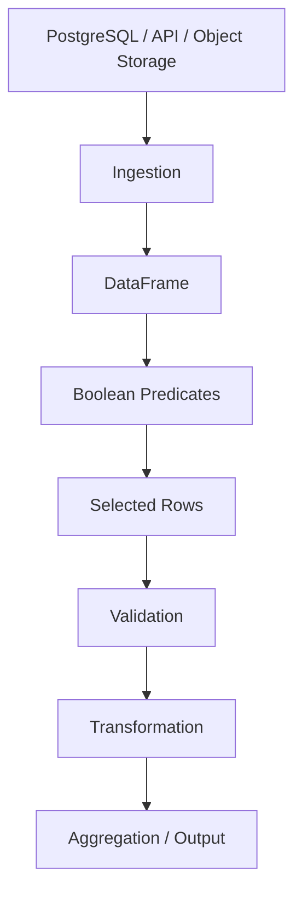

# 06- Boolean Filtering

## Overview

Boolean filtering is the core Pandas technique for selecting rows according to one or more conditions.

The general pattern is:

```python
result = df.loc[mask]
```

where `mask` is a boolean Series aligned with the DataFrame index:

```text
DataFrame
    ↓
Evaluate condition for each row
    ↓
True / False mask
    ↓
Keep rows where mask is True
```

For backend and data-engineering workloads, boolean filtering represents business rules such as:

```text
status == completed
amount > 1000
customer_id is present
region in allowed regions
created_at within processing window
event_type is supported
```

Boolean filtering matters because it provides a vectorized alternative to Python row-by-row iteration. It is used throughout:

```text
ETL pipelines
Data quality checks
Reporting
API processing
Batch jobs
Feature preparation
Database result processing
Operational analytics
```

The central engineering principle is:

> Express row-selection rules as vectorized boolean conditions, then apply them through `.loc`.

## What Boolean Filtering Is

A boolean filter is a boolean Series where each value corresponds to whether a DataFrame row should be retained.

For example:

```python
completed_mask = orders["status"].eq("completed")
```

The resulting mask is conceptually:

```text
Index    status      mask
0        completed   True
1        pending     False
2        cancelled   False
3        completed   True
```

Applying the mask:

```python
completed = orders.loc[
    completed_mask
]
```

produces only the rows where the mask is `True`.

## Why Boolean Filtering Exists

Real datasets are rarely processed in their entirety.

A pipeline usually needs a subset:

```text
All orders
    ↓
Only completed orders
```

or:

```text
All transactions
    ↓
Only failed transactions
```

or:

```text
All events
    ↓
Only events in the current processing window
```

Boolean filtering provides a declarative way to express those constraints without manually iterating through every record.

Compare:

```python
completed = orders.loc[
    orders["status"].eq("completed")
]
```

with a Python loop:

```python
completed_rows = []

for _, row in orders.iterrows():
    if row["status"] == "completed":
        completed_rows.append(row)
```

The boolean-filtering version is more idiomatic, generally more efficient, and easier to compose with other Pandas operations.

## Basic Syntax

The most common form is:

```python
df.loc[
    condition
]
```

For explicit row and column selection:

```python
df.loc[
    condition,
    columns,
]
```

Example:

```python
completed = orders.loc[
    orders["status"].eq("completed"),
    [
        "order_id",
        "customer_id",
        "amount",
    ],
]
```

This performs two operations:

```text
Row predicate
    ↓
status == completed

Column projection
    ↓
order_id
customer_id
amount
```

Combining these at the same boundary is often useful in production pipelines.

## Input and Output Behavior

A boolean filter expects a boolean array-like object with a length or index compatible with the target DataFrame.

Typical input:

```python
mask = orders["status"].eq("completed")
```

Typical output:

```python
filtered = orders.loc[mask]
```

The result is a DataFrame when selecting rows from a DataFrame.

Important behavior:

| Property | Behavior |
|---|---|
| Input | Boolean Series / array-like |
| Output | Usually a filtered DataFrame |
| Row order | Preserved unless later sorted |
| Columns | Preserved unless explicitly projected |
| Original DataFrame | Not directly mutated by filtering |
| Index | Original selected index labels are retained |
| Missing values in predicate | Require deliberate handling |

A filtered DataFrame does not automatically reset its index.

## Realistic Dataset

```python
import pandas as pd

orders = pd.DataFrame(
    {
        "order_id": [
            "ORD-1001",
            "ORD-1002",
            "ORD-1003",
            "ORD-1004",
        ],
        "customer_id": [
            "C-001",
            "C-002",
            "C-003",
            None,
        ],
        "status": [
            "completed",
            "pending",
            "completed",
            "cancelled",
        ],
        "amount": [
            1250.0,
            450.0,
            3200.0,
            100.0,
        ],
    }
)
```

The DataFrame contains multiple business states, making it suitable for demonstrating different predicates.

## Equality and Inequality

Boolean filtering commonly starts with comparisons.

### Equality

```python
completed = orders.loc[
    orders["status"] == "completed"
]
```

The method form is also useful:

```python
completed = orders.loc[
    orders["status"].eq("completed")
]
```

### Inequality

```python
non_completed = orders.loc[
    orders["status"].ne("completed")
]
```

### Greater Than

```python
high_value = orders.loc[
    orders["amount"].gt(1000)
]
```

### Greater Than or Equal

```python
minimum_value = orders.loc[
    orders["amount"].ge(1000)
]
```

### Less Than

```python
small_orders = orders.loc[
    orders["amount"].lt(500)
]
```

### Less Than or Equal

```python
small_or_equal = orders.loc[
    orders["amount"].le(500)
]
```

The operator and method forms are equivalent in typical cases:

```python
orders["amount"] > 1000
```

and:

```python
orders["amount"].gt(1000)
```

Choose the form that keeps the surrounding transformation readable.

## Comparison Operators

| Requirement | Operator | Method |
|---|---|---|
| Equal | `==` | `.eq()` |
| Not equal | `!=` | `.ne()` |
| Greater than | `>` | `.gt()` |
| Greater than or equal | `>=` | `.ge()` |
| Less than | `<` | `.lt()` |
| Less than or equal | `<=` | `.le()` |

Method forms can read naturally in a Pandas pipeline:

```python
eligible = (
    orders["amount"].ge(1000)
    & orders["status"].eq("completed")
)
```

## Boolean Operators

Multiple conditions are combined using element-wise operators.

| Meaning | Pandas operator |
|---|---|
| AND | `&` |
| OR | `|` |
| NOT | `~` |

Example:

```python
eligible = orders.loc[
    orders["status"].eq("completed")
    & orders["amount"].gt(1000)
]
```

The condition means:

```text
status == completed
AND
amount > 1000
```

## AND Conditions

Use `&` when every condition must be true.

```python
eligible = orders.loc[
    orders["status"].eq("completed")
    & orders["amount"].gt(1000)
    & orders["customer_id"].notna()
]
```

Conceptually:

```text
completed
    AND
high value
    AND
customer present
```

All three must hold.

## OR Conditions

Use `|` when any condition can qualify the row.

```python
attention_required = orders.loc[
    orders["status"].eq("failed")
    | orders["amount"].gt(10_000)
]
```

This means:

```text
failed
OR
high value
```

A record is retained when either condition is true.

## NOT Conditions

Use `~` to invert a boolean Series.

```python
non_cancelled = orders.loc[
    ~orders["status"].eq("cancelled")
]
```

This means:

```text
NOT(status == cancelled)
```

Negation can also be applied to more complex expressions:

```python
mask = (
    orders["status"].eq("completed")
    & orders["amount"].gt(1000)
)

not_eligible = orders.loc[
    ~mask
]
```

This is useful when the negative business set is easier to express as the complement of a positive rule.

## Parentheses Are Important

Pandas boolean expressions should generally wrap each condition in parentheses when combining them.

Preferred:

```python
result = orders.loc[
    (orders["status"] == "completed")
    & (orders["amount"] > 1000)
]
```

Also clear:

```python
result = orders.loc[
    orders["status"].eq("completed")
    & orders["amount"].gt(1000)
]
```

Do not write:

```python
result = orders.loc[
    orders["status"] == "completed"
    & orders["amount"] > 1000
]
```

Python operator precedence can cause this expression to be interpreted differently from the intended logic.

A reliable convention is:

```text
Parenthesize each comparison when using operators.
```

## Why `and` and `or` Are Wrong

A common error is:

```python
orders.loc[
    (orders["status"] == "completed")
    and (orders["amount"] > 1000)
]
```

This does not perform element-wise Series logic.

Python's:

```text
and
or
not
```

operate on scalar truth values, while Pandas boolean filtering needs element-wise operations.

Use:

```text
&
|
~
```

instead.

## Building Named Masks

Complex business rules are often easier to maintain when each predicate is named.

```python
is_completed = orders["status"].eq(
    "completed"
)

is_high_value = orders["amount"].gt(
    1000
)

has_customer = orders[
    "customer_id"
].notna()

eligible = orders.loc[
    is_completed
    & is_high_value
    & has_customer
]
```

Advantages include:

```text
Readable business rules
Easier debugging
Reusable predicates
Straightforward unit testing
Better observability
```

This approach is usually preferable to an excessively long one-liner.

## Predicate Composition

Think of masks as reusable predicates.

```python
is_active = customers["status"].eq(
    "active"
)

is_enterprise = customers["plan"].eq(
    "enterprise"
)

needs_review = (
    is_active
    & is_enterprise
)

result = customers.loc[
    needs_review
]
```

This style becomes valuable as business logic grows.

It also allows metrics such as:

```python
active_count = int(is_active.sum())
enterprise_count = int(is_enterprise.sum())
review_count = int(needs_review.sum())
```

The boolean Series becomes both:

```text
Selection logic
+
Operational measurement
```

## Membership Filtering with `isin`

For multiple accepted values, use `isin()`.

```python
processable = orders.loc[
    orders["status"].isin(
        [
            "pending",
            "completed",
        ]
    )
]
```

This is often clearer than:

```python
processable = orders.loc[
    (orders["status"] == "pending")
    | (orders["status"] == "completed")
]
```

Use `~` to exclude values:

```python
non_terminal = orders.loc[
    ~orders["status"].isin(
        [
            "completed",
            "cancelled",
        ]
    )
]
```

## Range Filtering

For numeric ranges, `between()` can improve readability.

```python
mid_value = orders.loc[
    orders["amount"].between(
        500,
        5000,
        inclusive="both",
    )
]
```

Equivalent explicit conditions:

```python
mid_value = orders.loc[
    (orders["amount"] >= 500)
    & (orders["amount"] <= 5000)
]
```

`between()` is particularly useful when the business rule is inherently a bounded interval.

## Boundary Semantics

Make range boundaries explicit.

For example:

```python
orders.loc[
    orders["amount"].between(
        1000,
        5000,
        inclusive="left",
    )
]
```

means:

```text
1000 <= amount < 5000
```

Explicit boundary semantics are important for:

```text
Billing thresholds
Date windows
Financial tiers
Pagination
Data partitioning
```

Avoid assumptions about whether the upper or lower bound is inclusive.

## Datetime Filtering

Boolean conditions are frequently used with timestamps.

First ensure the column has a datetime representation:

```python
orders["created_at"] = pd.to_datetime(
    orders["created_at"],
    errors="coerce",
    utc=True,
)
```

Then define an explicit interval:

```python
start = pd.Timestamp(
    "2026-01-01",
    tz="UTC",
)

end = pd.Timestamp(
    "2026-02-01",
    tz="UTC",
)

january_orders = orders.loc[
    orders["created_at"].ge(start)
    & orders["created_at"].lt(end)
]
```

The interval is:

```text
[start, end)
```

Using an exclusive end boundary is often easier to compose across recurring processing windows.

## String Filtering

String columns can also generate boolean masks.

For example:

```python
enterprise_orders = orders.loc[
    orders["customer_id"].str.startswith(
        "ENT-",
        na=False,
    )
]
```

Other examples:

```python
orders.loc[
    orders["customer_id"].str.contains(
        "VIP",
        na=False,
    )
]
```

For exact matching, prefer equality:

```python
orders.loc[
    orders["status"].eq("completed")
]
```

Do not use expensive string matching when a simple equality comparison expresses the actual requirement.

## Handling Missing Values

Boolean filtering must account for missing data.

For example:

```python
valid_customer = orders.loc[
    orders["customer_id"].notna()
]
```

Missing values can affect the result of comparisons and string operations, so predicates should explicitly define what missing means.

For example:

```python
eligible = orders.loc[
    orders["amount"].ge(0)
    & orders["customer_id"].notna()
]
```

This says:

```text
Amount must be non-negative
+
Customer ID must exist
```

Do not let missing-value behavior accidentally determine business policy.

## `na=False` in String Predicates

For string-based filtering:

```python
mask = orders["customer_id"].str.contains(
    "VIP",
    na=False,
)
```

Using `na=False` explicitly treats missing entries as non-matches.

This can be useful when the business rule is:

```text
Missing customer ID
    → does not satisfy the string predicate
```

The correct choice depends on the data contract.

## Nullable Boolean Results

Pandas supports nullable boolean semantics, so some operations can produce values representing:

```text
True
False
Missing
```

Do not assume every predicate necessarily produces only ordinary Python `True` and `False`.

When a filter requires strict inclusion or exclusion, define how missing predicate values should behave.

For example:

```python
mask = (
    orders["status"]
    .eq("completed")
    .fillna(False)
)

completed = orders.loc[
    mask
]
```

This makes the treatment of missing predicate results explicit.

## Boolean Filtering with `query`

An alternative syntax is `.query()`:

```python
result = orders.query(
    "status == 'completed' and amount > 1000"
)
```

For expression-heavy filters, this can improve readability.

External variables are referenced with `@`:

```python
minimum_amount = 1000

result = orders.query(
    "status == 'completed' "
    "and amount >= @minimum_amount"
)
```

Use `.query()` when its expression syntax improves maintainability.

For programmatically assembled predicates or explicit column projection, `.loc` is often more flexible:

```python
result = orders.loc[
    orders["status"].eq("completed")
    & orders["amount"].ge(minimum_amount),
    [
        "order_id",
        "amount",
    ],
]
```

## Boolean Filtering with Index Alignment

Pandas boolean filtering is closely tied to index alignment.

Consider:

```python
orders = pd.DataFrame(
    {
        "amount": [
            100,
            200,
            300,
        ],
    },
    index=[
        "a",
        "b",
        "c",
    ],
)
```

A mask created from the same DataFrame:

```python
mask = orders["amount"].gt(150)
```

has the same index:

```text
a → False
b → True
c → True
```

Then:

```python
orders.loc[mask]
```

selects rows by their corresponding labels.

The important concept is:

```text
Boolean Series
    +
DataFrame index
    =
Aligned row selection
```

## Why Alignment Matters

Suppose a mask is created independently:

```python
mask = pd.Series(
    [True, False, True],
    index=[
        "c",
        "a",
        "b",
    ],
)
```

The values are associated with labels:

```text
c → True
a → False
b → True
```

Pandas does not simply interpret this as:

```text
row 0 → True
row 1 → False
row 2 → True
```

This distinction is a major strength of Pandas but can also cause subtle bugs when independently constructed Series are combined.

A safe engineering rule is:

```text
Build masks directly from the DataFrame being filtered.
```

## Filtering with Derived Conditions

A predicate does not have to operate directly on one source column.

For example:

```python
order_value = (
    orders["amount"]
    * orders["quantity"]
)

high_value_orders = orders.loc[
    order_value.gt(5000)
]
```

This is useful when the business condition depends on derived values.

For example:

```text
line value = unit price × quantity
```

Then:

```python
high_value = orders.loc[
    (
        orders["unit_price"]
        * orders["quantity"]
    ).gt(5000)
]
```

For complex derived conditions, create an intermediate Series rather than repeating the calculation.

## Filtering with Multiple Business Rules

Consider an ingestion pipeline that should process only valid pending orders:

```python
is_pending = orders["status"].eq(
    "pending"
)

has_customer = orders[
    "customer_id"
].notna()

has_non_negative_amount = orders[
    "amount"
].ge(0)

processable = orders.loc[
    is_pending
    & has_customer
    & has_non_negative_amount,
    [
        "order_id",
        "customer_id",
        "amount",
    ],
]
```

This is preferable to embedding unrelated validation and transformation logic inside one expression.

The filter becomes a documented business rule:

```text
Pending
+
Customer present
+
Amount valid
=
Processable
```

## Valid and Invalid Partitions

Boolean masks can partition a dataset into accepted and rejected records.

```python
valid_mask = (
    orders["customer_id"].notna()
    & orders["amount"].ge(0)
)

valid = orders.loc[
    valid_mask
]

invalid = orders.loc[
    ~valid_mask
]
```

This is useful for ETL systems where invalid data should be quarantined rather than silently discarded.

A production pipeline can then maintain:

```text
processed records
rejected records
rejection metrics
```

## Multiple Validation Masks

For detailed quality reporting:

```python
missing_customer = orders[
    "customer_id"
].isna()

invalid_amount = orders[
    "amount"
].lt(0)

unknown_status = ~orders[
    "status"
].isin(
    [
        "pending",
        "completed",
        "cancelled",
    ]
)

valid = orders.loc[
    ~(
        missing_customer
        | invalid_amount
        | unknown_status
    )
]
```

Each predicate can be measured independently:

```python
missing_customer_count = int(
    missing_customer.sum()
)

invalid_amount_count = int(
    invalid_amount.sum()
)

unknown_status_count = int(
    unknown_status.sum()
)
```

This gives both:

```text
Selection
+
Data-quality observability
```

## Combining Filtering with Projection

A highly useful pattern is:

```python
result = orders.loc[
    orders["status"].eq("completed")
    & orders["amount"].gt(1000),
    [
        "order_id",
        "customer_id",
        "amount",
    ],
]
```

This should often be preferred to carrying unnecessary columns into later transformations.

Benefits include:

```text
Lower memory usage
Smaller intermediate objects
Less serialization
Reduced accidental exposure
Clearer downstream schema
```

This mirrors the database principle of:

```sql
SELECT required_columns
FROM table
WHERE predicate;
```

## SQL and Boolean Filtering

When data originates in PostgreSQL, use SQL to perform filters that the database can execute efficiently.

Preferred architecture:

```text
PostgreSQL
    ↓
WHERE predicates
    ↓
Required columns
    ↓
Pandas
    ↓
Additional application-specific filtering
```

For example:

```python
orders = pd.read_sql_query(
    """
    SELECT
        order_id,
        customer_id,
        status,
        amount,
        created_at
    FROM orders
    WHERE status IN (
        'pending',
        'completed'
    )
    AND created_at >= %(start_time)s
    """,
    connection,
    params={
        "start_time": "2026-01-01",
    },
)
```

Then apply logic that genuinely belongs in Python:

```python
high_value = orders.loc[
    orders["amount"].gt(1000)
]
```

This reduces:

```text
Database output
Network transfer
Pandas memory
```

## REST API Processing

Suppose a REST API returns events:

```python
events = pd.DataFrame(
    response.json()
)
```

Select only processable events:

```python
processable = events.loc[
    events["event_type"].isin(
        [
            "order.created",
            "order.updated",
        ]
    )
    & events["event_id"].notna(),
    [
        "event_id",
        "event_type",
        "order_id",
        "created_at",
    ],
]
```

This creates a narrower, controlled dataset before:

```text
Validation
Kafka publishing
Persistence
Aggregation
Reporting
```

When the source API supports server-side filtering or field selection, use it first.

## Filtering in Batch Processing

A batch job might receive a DataFrame containing multiple processing states:

```python
ready = records.loc[
    records["processing_status"].eq(
        "ready"
    )
]
```

If a maximum batch size is required:

```python
ready_batch = (
    records.loc[
        records["processing_status"].eq(
            "ready"
        )
    ]
    .sort_values(
        [
            "priority",
            "created_at",
            "record_id",
        ],
        kind="stable",
    )
    .iloc[:1000]
)
```

The separation is deliberate:

```text
.loc
    → determine eligibility

.sort_values()
    → establish deterministic order

.iloc
    → limit positional batch size
```

This is more robust than treating the first 1000 DataFrame rows as inherently meaningful.

## Large Dataset Filtering

Boolean filtering is vectorized, but Pandas remains an in-memory processing library.

This:

```python
filtered = df.loc[
    df["status"].eq("completed")
]
```

does not make an arbitrarily large dataset memory-safe.

For large inputs, the major optimization may be to filter before materialization:

```text
Database WHERE clause
API query parameters
Parquet partition / predicate filtering
Chunked CSV ingestion
```

For CSV data:

```python
for chunk in pd.read_csv(
    "orders.csv",
    chunksize=100_000,
):
    completed = chunk.loc[
        chunk["status"].eq("completed")
    ]

    process(completed)
```

Now memory is bounded approximately by the chunk and downstream working state rather than the entire file.

## Boolean Filtering and Vectorization

A major advantage of boolean filtering is avoiding Python-level row iteration.

Avoid:

```python
selected_rows = []

for _, row in orders.iterrows():
    if (
        row["status"] == "completed"
        and row["amount"] > 1000
    ):
        selected_rows.append(row)
```

Prefer:

```python
selected_rows = orders.loc[
    orders["status"].eq("completed")
    & orders["amount"].gt(1000)
]
```

The vectorized version expresses the operation over entire columns.

This generally improves:

```text
Performance
Readability
Composability
Maintainability
```

## Avoid `apply()` for Simple Predicates

Avoid:

```python
mask = orders.apply(
    lambda row: (
        row["status"] == "completed"
        and row["amount"] > 1000
    ),
    axis=1,
)
```

when a vectorized expression exists.

Prefer:

```python
mask = (
    orders["status"].eq("completed")
    & orders["amount"].gt(1000)
)
```

Use `apply(axis=1)` only when the logic genuinely cannot be expressed efficiently through vectorized operations or dedicated Pandas APIs.

## Filtering by Membership vs Repeated Comparisons

For multiple values:

```python
allowed_statuses = {
    "pending",
    "completed",
    "processing",
}

result = orders.loc[
    orders["status"].isin(
        allowed_statuses
    )
]
```

This is preferable to:

```python
result = orders.loc[
    (orders["status"] == "pending")
    | (orders["status"] == "completed")
    | (orders["status"] == "processing")
]
```

The `isin()` version communicates the business rule more directly.

## Filtering with Categoricals

Categorical columns can reduce memory and sometimes improve certain operations when the set of repeated values is small.

For example:

```python
orders["status"] = orders[
    "status"
].astype("category")
```

Filtering remains straightforward:

```python
completed = orders.loc[
    orders["status"].eq("completed")
]
```

Categorical conversion should be based on actual data characteristics.

Do not convert every string column to `category` automatically; high-cardinality columns may provide little benefit or add overhead.

## Filter Ordering

When several predicates exist, logical equivalence does not always mean identical operational cost.

For example:

```python
mask = (
    orders["status"].eq("completed")
    & orders["amount"].gt(1000)
    & orders["customer_id"].notna()
)
```

Think about the pipeline as:

```text
Read data
    ↓
Reduce rows
    ↓
Reduce columns
    ↓
Perform expensive transformations
```

However, do not manually micro-optimize predicate ordering without measurement. Pandas evaluates the expressions you construct, and the larger performance gain often comes from avoiding unnecessary data materialization altogether.

## Reusing Masks

If a predicate is reused:

```python
completed = orders["status"].eq(
    "completed"
)

completed_orders = orders.loc[
    completed
]

completed_amounts = orders.loc[
    completed,
    "amount",
]
```

This can make the transformation easier to read and avoid repeatedly expressing the same business rule.

For expensive derived predicates:

```python
high_value = (
    orders["amount"]
    * orders["quantity"]
).gt(5000)
```

reuse the mask rather than recreating the calculation.

## Empty Results

A boolean filter can legitimately produce zero rows:

```python
archived = orders.loc[
    orders["status"].eq("archived")
]
```

This is not automatically an error.

Determine whether the contract says:

```text
Zero rows → valid
Zero rows → warning
Zero rows → failure
```

For a batch that must contain work:

```python
if archived.empty:
    raise ValueError(
        "Expected at least one archived order."
    )
```

Do not silently substitute fallback data unless the business contract requires it.

## Row Order

Boolean filtering generally preserves the source DataFrame's row order.

For example:

```python
completed = orders.loc[
    orders["status"].eq("completed")
]
```

does not sort by amount or timestamp.

If deterministic ordering matters:

```python
completed = (
    orders.loc[
        orders["status"].eq("completed")
    ]
    .sort_values(
        "created_at",
        kind="stable",
    )
)
```

Selection and ordering should be treated as separate concerns.

## Duplicates

Boolean filtering does not deduplicate records.

```python
completed = orders.loc[
    orders["status"].eq("completed")
]
```

If a source can contain duplicate business records, handle them separately:

```python
completed = (
    orders.loc[
        orders["status"].eq("completed")
    ]
    .drop_duplicates(
        subset=["order_id"]
    )
)
```

The correct duplicate policy depends on the business identity and source contract.

## Filtering and Data Mutation

Filtering itself does not serve as a mutation operation.

For conditional assignment, use `.loc`:

```python
orders.loc[
    orders["amount"].lt(0),
    "status",
] = "invalid"
```

Avoid transforming through row iteration.

```python
for index, row in orders.iterrows():
    if row["amount"] < 0:
        orders.at[
            index,
            "status",
        ] = "invalid"
```

The vectorized version is clearer and typically much more efficient.

## Copy Semantics

If a filtered DataFrame becomes an independently transformed working object, make ownership explicit:

```python
completed = orders.loc[
    orders["status"].eq("completed")
].copy()
```

Then:

```python
completed["amount"] = (
    completed["amount"] * 1.05
)
```

Use `.copy()` when independent ownership is required.

Do not mechanically add `.copy()` after every boolean filter because unnecessary copies can increase memory usage.

## Security Considerations

Boolean filtering can enforce part of a data-minimization boundary, but it is not a substitute for authorization.

For a multi-tenant workload:

```python
tenant_orders = orders.loc[
    orders["tenant_id"].eq(
        tenant_id
    ),
    [
        "order_id",
        "status",
        "amount",
    ],
]
```

The system should still enforce tenant isolation at stronger boundaries where possible:

```text
Authentication
    ↓
Authorization
    ↓
Database / service isolation
    ↓
Pandas filtering
    ↓
Output
```

Do not rely on:

```python
df.iloc[:100]
```

or arbitrary DataFrame positions as an authorization mechanism.

## Logging and Sensitive Data

Boolean filtering can help reduce the amount of data passed into logs or diagnostics.

Avoid:

```python
logger.info(
    "Failed records: %s",
    invalid_records,
)
```

when the DataFrame may contain:

```text
Personal data
Financial information
Authentication data
Internal identifiers
```

Prefer:

```python
logger.info(
    "Rejected records count=%d",
    len(invalid_records),
)
```

and record structured metrics or sampled non-sensitive identifiers where required.

## Reliability and Observability

Selection rules are useful monitoring boundaries.

For example:

```python
eligible = (
    orders["status"].eq("pending")
    & orders["customer_id"].notna()
    & orders["amount"].ge(0)
)

selected_count = int(
    eligible.sum()
)

rejected_count = int(
    (~eligible).sum()
)
```

Track metrics such as:

```text
records_read
records_selected
records_rejected
missing_required_fields
invalid_records
```

A sudden selection-rate change can identify upstream incidents.

For example:

```text
Expected eligible rate: 98%
Observed eligible rate: 51%
```

may indicate:

```text
Source schema changes
Unexpected enum values
Missing identifiers
Broken ingestion
Upstream deployment defects
```

## Testing Boolean Filters

Boolean filters should be tested against business rules, not merely execution.

```python
import pandas as pd


def select_processable_orders(
    orders: pd.DataFrame,
) -> pd.DataFrame:
    mask = (
        orders["status"].eq("pending")
        & orders["customer_id"].notna()
        & orders["amount"].ge(0)
    )

    return orders.loc[
        mask,
        [
            "order_id",
            "customer_id",
            "amount",
        ],
    ].copy()
```

A meaningful test:

```python
def test_select_processable_orders() -> None:
    orders = pd.DataFrame(
        {
            "order_id": [
                "ORD-1",
                "ORD-2",
                "ORD-3",
                "ORD-4",
            ],
            "customer_id": [
                "C-1",
                None,
                "C-3",
                "C-4",
            ],
            "status": [
                "pending",
                "pending",
                "completed",
                "pending",
            ],
            "amount": [
                100.0,
                200.0,
                300.0,
                -10.0,
            ],
        }
    )

    result = select_processable_orders(
        orders
    )

    assert result["order_id"].tolist() == [
        "ORD-1",
    ]

    assert result.columns.tolist() == [
        "order_id",
        "customer_id",
        "amount",
    ]
```

Test at least:

```text
Matching records
No matching records
Missing values
Boundary values
Invalid values
Unexpected statuses
Duplicate records
Empty DataFrames
Unexpected dtypes
```

## Common Mistakes

### Using `and`, `or`, or `not`

Incorrect:

```python
df.loc[
    (df["status"] == "completed")
    and (df["amount"] > 1000)
]
```

Correct:

```python
df.loc[
    (df["status"] == "completed")
    & (df["amount"] > 1000)
]
```

### Forgetting Parentheses

Incorrect:

```python
df.loc[
    df["status"] == "completed"
    & df["amount"] > 1000
]
```

Correct:

```python
df.loc[
    (df["status"] == "completed")
    & (df["amount"] > 1000)
]
```

### Using `apply(axis=1)` for Simple Logic

Avoid:

```python
df.apply(
    lambda row: row["amount"] > 1000,
    axis=1,
)
```

when:

```python
df["amount"].gt(1000)
```

does the same job.

Vectorized operations are usually clearer and more efficient.

### Comparing Missing Values Directly

Avoid using:

```python
df["customer_id"] == None
```

as the general missing-value pattern.

Prefer:

```python
df["customer_id"].isna()
```

or:

```python
df["customer_id"].notna()
```

### Assuming Boolean Filters Sort Data

Filtering preserves current order.

If ordering matters:

```python
result = (
    df.loc[mask]
    .sort_values(
        "created_at",
        kind="stable",
    )
)
```

### Assuming Filtering Removes Duplicates

Filtering only selects rows.

Use explicit duplicate handling when required.

### Building Masks from Unrelated Series

Independently constructed masks can introduce index-alignment problems.

Prefer:

```python
mask = df["status"].eq("completed")
```

over building unrelated boolean Series without an explicit alignment model.

### Filtering Too Late

Avoid:

```text
Load huge dataset
↓
Perform expensive transformations
↓
Filter most rows away
```

Prefer early data reduction where the transformation does not contribute to the filter condition.

### Using Pandas as the Authorization Layer

Boolean filtering is not a replacement for service- or database-level access control.

Authorization should be explicit and enforced at the appropriate trust boundary.

## Production Pitfalls

| Pitfall | Why it happens | Better approach |
|---|---|---|
| `and` / `or` used with Series | Python scalar logic confused with Pandas vectorized logic | Use `&`, `|`, and `~` |
| Missing parentheses | Operator precedence overlooked | Parenthesize individual predicates |
| Row-by-row filtering | DataFrame treated like a list | Use vectorized masks |
| `apply(axis=1)` for simple predicates | Vectorized APIs overlooked | Use comparisons and boolean operators |
| Filtering after full extraction | Source-side reduction ignored | Push filtering to SQL/API when possible |
| Hidden missing-value semantics | Null behavior assumed | Define `.isna()` / `.notna()` behavior explicitly |
| Unstable ordering | Filter result treated as sorted | Sort explicitly |
| Boolean mask misalignment | External Series has different labels | Build masks from target DataFrame |
| Filtering used as authorization | Selection mistaken for security control | Enforce access control before processing |
| Logging filtered DataFrames | Debugging exposes sensitive data | Log counts and structured diagnostics |

## Performance Considerations

Boolean filtering is generally preferable to Python row iteration because it operates on complete columns.

Preferred:

```python
result = df.loc[
    df["amount"].gt(1000)
]
```

Avoid:

```python
for _, row in df.iterrows():
    if row["amount"] > 1000:
        ...
```

The most important performance optimizations are usually architectural:

```text
Reduce rows upstream
Reduce columns upstream
Use vectorized predicates
Avoid repeated scans
Avoid unnecessary copies
Process large files in chunks
Use appropriate storage formats
```

For database-backed workloads:

```text
SQL WHERE
    ↓
Reduced result set
    ↓
Pandas boolean filtering
```

is often substantially better than:

```text
SELECT *
    ↓
Pandas
    ↓
Discard most rows
```

## Memory Implications

A boolean mask itself consumes memory:

```python
mask = df["status"].eq("completed")
```

and filtering creates the resulting selection.

For very large datasets, avoid materializing unnecessary data.

Prefer:

```python
for chunk in pd.read_csv(
    "orders.csv",
    chunksize=100_000,
):
    completed = chunk.loc[
        chunk["status"].eq("completed")
    ]

    process(completed)
```

rather than:

```python
df = pd.read_csv(
    "orders.csv"
)

completed = df.loc[
    df["status"].eq("completed")
]
```

when the complete file is too large for comfortable in-memory processing.

## Scaling Limitations

Boolean filtering does not turn Pandas into a distributed system.

When the workload grows beyond the practical memory or CPU limits of one process, consider:

```text
SQL engines
Partitioned Parquet
Spark
Distributed query engines
Data warehouse execution
Cloud-native batch systems
```

The correct scaling strategy depends on:

```text
Dataset size
Transformation complexity
Latency requirements
Operational constraints
Cost
Team expertise
```

Use Pandas where its in-memory model is appropriate rather than forcing it to process data beyond its practical operating range.

## Backend Architecture

Boolean filtering usually belongs inside a bounded data-processing stage.



A well-structured filtering layer should be:

```text
Deterministic
Testable
Explicit
Reusable
Observable
```

For long-running jobs, it can be isolated into functions that are independently tested.

## Reusable Predicate Functions

For repeated business rules:

```python
import pandas as pd


def processable_mask(
    orders: pd.DataFrame,
) -> pd.Series:
    return (
        orders["status"].eq("pending")
        & orders["customer_id"].notna()
        & orders["amount"].ge(0)
    )


def select_processable_orders(
    orders: pd.DataFrame,
) -> pd.DataFrame:
    mask = processable_mask(orders)

    return orders.loc[
        mask,
        [
            "order_id",
            "customer_id",
            "amount",
        ],
    ].copy()
```

This design separates:

```text
Predicate definition
+
Row selection
+
Column projection
```

It also allows the predicate itself to be tested.

## Deterministic Processing Windows

For recurring jobs, explicit boolean time predicates are useful.

For example:

```python
window_mask = (
    events["created_at"].ge(window_start)
    & events["created_at"].lt(window_end)
)

window = events.loc[
    window_mask
]
```

This is safer than vague rules such as:

```python
events.loc[
    events["created_at"].dt.date
    == today
]
```

because explicit timestamp boundaries are easier to reason about across:

```text
Time zones
Day boundaries
Retries
Backfills
Partition windows
Incremental processing
```

## Idempotent Filtering

Filtering itself is deterministic, but the overall processing operation should consider retries.

For example:

```python
processable = events.loc[
    events["processed"].eq(False)
]
```

A production pipeline should also ensure that:

```text
Processed status is durable
Retries do not create duplicate outputs
Batch boundaries are reproducible
```

Boolean filtering identifies candidates; idempotency must be enforced by the broader workflow.

## Interview Traps

### Why Do Pandas Filters Use `&` Instead of `and`?

Because Pandas filtering operates element-wise over Series. `and` expects scalar truth values, while `&` performs element-wise boolean combination.

### Why Are Parentheses Required?

Python operator precedence can change how a mixed comparison and bitwise expression is interpreted. Parenthesizing each comparison makes the intended boolean expression explicit.

### What Does a Boolean Filter Return?

For a DataFrame, it generally returns a DataFrame containing rows where the mask evaluates to true, while preserving the selected rows' original index labels.

### Does Boolean Filtering Modify the Original DataFrame?

Filtering itself does not act as an in-place mutation operation.

### Why Is `.loc[mask]` Preferred Over a Python Loop?

It expresses the operation vectorially and avoids explicit Python-level iteration over rows.

### What Happens If the Mask Has a Different Index?

Pandas may align the boolean Series by index labels. Misaligned masks can therefore produce unexpected results or indexing errors. Build masks from the target DataFrame whenever possible.

### How Do You Combine Three Conditions?

```python
mask = (
    df["status"].eq("completed")
    & df["amount"].gt(1000)
    & df["customer_id"].notna()
)
```

### How Do You Express OR?

Use:

```python
df["status"].eq("failed")
| df["amount"].gt(10_000)
```

### How Do You Negate a Filter?

Use `~`:

```python
~df["status"].eq("cancelled")
```

### How Do You Filter for Several Allowed Values?

Use:

```python
df["status"].isin(
    [
        "pending",
        "completed",
    ]
)
```

### Should Filtering Be Done in Pandas or SQL?

For database-backed workloads, filter in SQL when practical and efficient, especially when the filter significantly reduces rows or columns transferred to the application.

### Can Boolean Filtering Handle Large Datasets?

It can operate efficiently on bounded in-memory datasets, but it does not remove Pandas' memory limitations. For large sources, use source-side filtering, chunking, partitioning, or a distributed processing system as appropriate.

### Is `apply(axis=1)` a Good Way to Build Boolean Filters?

Usually not for straightforward predicates. Prefer vectorized comparisons and boolean operators.

### Does Filtering Guarantee Record Order?

No. It generally preserves the current order. If ordering is part of the business requirement, sort explicitly.

## Practical Reference

| Requirement | Recommended pattern |
|---|---|
| Equality | `df["status"].eq("completed")` |
| Inequality | `df["status"].ne("cancelled")` |
| Greater than | `df["amount"].gt(1000)` |
| Greater or equal | `df["amount"].ge(1000)` |
| Less than | `df["amount"].lt(1000)` |
| Less or equal | `df["amount"].le(1000)` |
| AND | `condition_a & condition_b` |
| OR | `condition_a | condition_b` |
| NOT | `~condition` |
| Membership | `df["status"].isin(values)` |
| Exclude membership | `~df["status"].isin(values)` |
| Missing values | `df["column"].isna()` |
| Non-missing values | `df["column"].notna()` |
| Numeric range | `df["amount"].between(100, 1000)` |
| String prefix | `df["id"].str.startswith("ENT-", na=False)` |
| String search | `df["name"].str.contains("vip", na=False)` |
| Datetime range | `df["created_at"].ge(start) & df["created_at"].lt(end)` |
| General row filtering | `df.loc[mask]` |
| Row filtering + projection | `df.loc[mask, columns]` |
| Expression-based filtering | `df.query(...)` |
| Conditional assignment | `df.loc[mask, column] = value` |

## Recommended Engineering Pattern

For a production ETL workload, keep the predicate explicit and separate from expensive downstream operations:

```python
is_processable = (
    orders["status"].eq("pending")
    & orders["customer_id"].notna()
    & orders["amount"].ge(0)
)

processable_orders = orders.loc[
    is_processable,
    [
        "order_id",
        "customer_id",
        "amount",
        "created_at",
    ],
].copy()

processable_orders = (
    processable_orders
    .sort_values(
        [
            "created_at",
            "order_id",
        ],
        kind="stable",
    )
)
```

The pipeline now has clear stages:

```text
Predicate
    ↓
Row selection
    ↓
Column projection
    ↓
Independent working copy
    ↓
Deterministic ordering
    ↓
Downstream processing
```

This structure is easier to test, optimize, monitor, and modify than embedding all logic inside a single expression.

## Key Takeaways

- Boolean filtering is the foundation of Pandas row selection: build a vectorized boolean mask and apply it with `.loc`.
- Combine conditions with `&`, `|`, and `~`; use explicit parentheses and never substitute Python's `and`, `or`, or `not` for Series-based logic.
- Define missing-value, boundary, ordering, and duplicate behavior explicitly so filtering rules match the actual business contract.
- Filter and project as early as practical, preferably at the database or source system when appropriate, to reduce network transfer, memory usage, and downstream processing cost.
- Treat boolean predicates as production business logic: isolate reusable rules, test edge cases, measure selection rates, protect sensitive data, and avoid row-by-row Python loops.