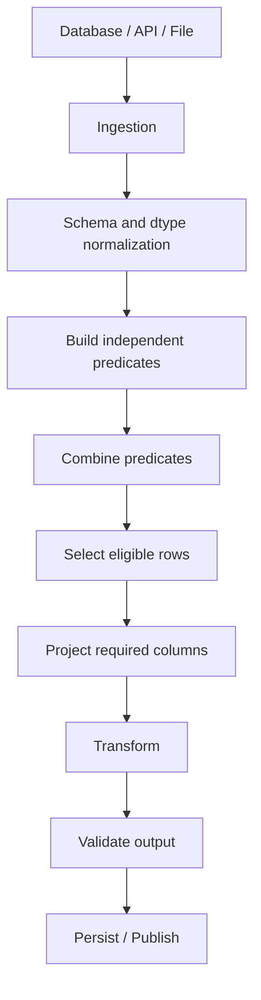

# 07- Multiple Conditions

## Overview

Real-world DataFrame filtering rarely depends on a single predicate. Production data workflows commonly require several conditions to be evaluated together:

```text
status is pending
AND
customer exists
AND
amount is non-negative
AND
created_at is inside the processing window
```

Pandas supports this through vectorized boolean expressions combined with:

```text
&  → element-wise AND
|  → element-wise OR
~  → element-wise NOT
```

A typical production filter looks like:

```python
eligible = orders.loc[
    orders["status"].eq("pending")
    & orders["customer_id"].notna()
    & orders["amount"].ge(0)
]
```

Multiple-condition filtering is more than syntax. Correctness depends on:

```text
Operator semantics
Parentheses
Missing-value behavior
Index alignment
Data types
Business-rule precedence
Deterministic boundaries
Performance
```

These details matter in:

```text
ETL pipelines
Data-quality validation
Batch processing
Reporting
API processing
Financial workflows
Event processing
Database result transformation
```

## What Multiple-Condition Filtering Is

Multiple-condition filtering combines two or more boolean Series into a final boolean mask.

For example:

```python
is_completed = orders["status"].eq(
    "completed"
)

is_high_value = orders["amount"].gt(
    1000
)

mask = is_completed & is_high_value

result = orders.loc[
    mask
]
```

Conceptually:

```text
Condition A
    ↓
True / False per row

Condition B
    ↓
True / False per row

A & B
    ↓
Final True / False mask

.loc[mask]
    ↓
Selected rows
```

The operation is vectorized across the DataFrame rather than implemented as a Python loop.

## Why Multiple Conditions Matter

Business rules are usually conjunctive or disjunctive.

Examples:

```text
Process orders that are pending AND have a customer.
```

```text
Alert when an order is failed OR exceeds a high-value threshold.
```

```text
Exclude records that are cancelled OR invalid.
```

```text
Select transactions where:
    amount >= minimum
    AND currency == expected currency
    AND created_at is inside window
```

Boolean composition allows these rules to be represented directly in code.

## Basic Syntax

The general pattern is:

```python
result = df.loc[
    condition_a
    & condition_b
]
```

With three conditions:

```python
result = df.loc[
    condition_a
    & condition_b
    & condition_c
]
```

Using OR:

```python
result = df.loc[
    condition_a
    | condition_b
]
```

Using negation:

```python
result = df.loc[
    ~condition_a
]
```

For production code, it is often clearer to define important predicates separately:

```python
condition_a = ...
condition_b = ...
condition_c = ...

result = df.loc[
    condition_a
    & condition_b
    & condition_c
]
```

## Why `&`, `|`, and `~` Exist

A Pandas Series contains multiple values:

```text
True
False
True
False
```

Python's scalar logical operators:

```text
and
or
not
```

expect a single truth value.

Pandas therefore uses element-wise bitwise operators for combining Series:

```text
& → compare row by row
| → compare row by row
~ → invert row by row
```

For example:

```python
a = pd.Series(
    [True, False, True]
)

b = pd.Series(
    [True, True, False]
)

a & b
```

produces:

```text
True
False
False
```

The operation is performed element by element.

## `&` for AND

Use `&` when all predicates must be true.

```python
eligible = orders.loc[
    orders["status"].eq("completed")
    & orders["amount"].gt(1000)
]
```

This means:

```text
status == completed
AND
amount > 1000
```

A row is selected only when both conditions are true.

## `|` for OR

Use `|` when at least one predicate may qualify the row.

```python
attention_required = orders.loc[
    orders["status"].eq("failed")
    | orders["amount"].gt(10_000)
]
```

This means:

```text
status == failed
OR
amount > 10000
```

A row is selected if either condition is true.

## `~` for NOT

Use `~` to invert a boolean condition.

```python
non_cancelled = orders.loc[
    ~orders["status"].eq("cancelled")
]
```

This means:

```text
NOT(status == cancelled)
```

Negation is especially useful when the positive condition is easier to define:

```python
terminal = orders["status"].isin(
    [
        "completed",
        "cancelled",
    ]
)

non_terminal = orders.loc[
    ~terminal
]
```

## Parentheses Are Mandatory in Practice

Multiple-condition expressions should explicitly parenthesize comparisons.

Preferred:

```python
result = orders.loc[
    (orders["status"] == "completed")
    & (orders["amount"] > 1000)
]
```

Method form:

```python
result = orders.loc[
    orders["status"].eq("completed")
    & orders["amount"].gt(1000)
]
```

Do not write:

```python
result = orders.loc[
    orders["status"] == "completed"
    & orders["amount"] > 1000
]
```

Python operator precedence can cause the expression to be parsed differently from the intended logic.

A reliable engineering convention is:

```text
Parenthesize each comparison when using
&, |, or ~.
```

## Operator Precedence

Consider:

```python
A | B & C
```

This is not generally equivalent to:

```python
(A | B) & C
```

because `&` and `|` have different precedence.

Do not depend on remembering the precedence rules.

Write the business logic explicitly:

```python
(A | B) & C
```

or:

```python
A | (B & C)
```

The parentheses become executable documentation of the rule.

## Common Logical Patterns

| Business rule | Pandas expression |
|---|---|
| A and B | `A & B` |
| A or B | `A | B` |
| Not A | `~A` |
| A and not B | `A & ~B` |
| A or B, and C | `(A | B) & C` |
| A and (B or C) | `A & (B | C)` |
| Not (A or B) | `~(A | B)` |
| Not (A and B) | `~(A & B)` |

The last two follow standard boolean algebra and can be useful for simplifying complex rules.

## Example: Order Eligibility

Suppose orders should be processed only when:

```text
status = pending
customer_id exists
amount >= 0
```

Define:

```python
is_pending = orders["status"].eq(
    "pending"
)

has_customer = orders[
    "customer_id"
].notna()

valid_amount = orders[
    "amount"
].ge(0)
```

Combine them:

```python
processable = orders.loc[
    is_pending
    & has_customer
    & valid_amount
]
```

This makes each business rule independently visible.

## Example: Risk Review

Suppose an order requires manual review when:

```text
high value
OR
failed payment
OR
international destination with high amount
```

Build the predicates:

```python
high_value = orders["amount"].gt(
    10_000
)

payment_failed = orders[
    "payment_status"
].eq("failed")

international_high_value = (
    orders["country"].ne("IN")
    & orders["amount"].gt(5000)
)

requires_review = (
    high_value
    | payment_failed
    | international_high_value
)

review_queue = orders.loc[
    requires_review
]
```

This is much easier to review than burying the entire business rule inside one large expression.

## Example: Combining AND and OR

Suppose the rule is:

```text
status is completed
AND
(
    amount > 5000
    OR
    customer tier is enterprise
)
```

Write the grouping explicitly:

```python
is_completed = orders["status"].eq(
    "completed"
)

is_high_value = orders["amount"].gt(
    5000
)

is_enterprise = orders[
    "customer_tier"
].eq("enterprise")

eligible = orders.loc[
    is_completed
    & (
        is_high_value
        | is_enterprise
    )
]
```

The parentheses around the OR group are essential to preserve the intended business logic.

## Example: Exclusions

Suppose records should exclude:

```text
cancelled
OR
fraud
```

Then:

```python
excluded = orders["status"].isin(
    [
        "cancelled",
        "fraud",
    ]
)

eligible = orders.loc[
    ~excluded
]
```

This is often cleaner than:

```python
eligible = orders.loc[
    (orders["status"] != "cancelled")
    & (orders["status"] != "fraud")
]
```

Both can be correct, but membership-based rules are usually clearer.

## Combining `.isin()` with Other Conditions

`isin()` works naturally with other predicates:

```python
processable = orders.loc[
    orders["status"].isin(
        [
            "pending",
            "processing",
        ]
    )
    & orders["customer_id"].notna()
    & orders["amount"].ge(0)
]
```

This is common in ETL pipelines because status/state filtering often combines with validation conditions.

## Range Conditions

Use `between()` when a value must fall within a range.

```python
eligible = transactions.loc[
    transactions["amount"].between(
        1000,
        5000,
        inclusive="both",
    )
    & transactions["currency"].eq("INR")
]
```

This expresses:

```text
1000 <= amount <= 5000
AND
currency == INR
```

For half-open intervals:

```python
transactions["amount"].between(
    1000,
    5000,
    inclusive="left",
)
```

means:

```text
1000 <= amount < 5000
```

Make boundaries explicit for billing, reporting, and batch logic.

## Datetime Conditions

Time-window filtering is a common multi-condition requirement.

```python
window_start = pd.Timestamp(
    "2026-01-01",
    tz="UTC",
)

window_end = pd.Timestamp(
    "2026-02-01",
    tz="UTC",
)

mask = (
    events["created_at"].ge(window_start)
    & events["created_at"].lt(window_end)
    & events["event_type"].isin(
        [
            "order.created",
            "order.updated",
        ]
    )
)

selected = events.loc[
    mask
]
```

This means:

```text
Inside processing window
AND
known event type
```

The half-open interval:

```text
[start, end)
```

is generally easier to compose across recurring windows.

## String Conditions

String predicates can be combined with ordinary boolean conditions.

```python
enterprise_orders = orders.loc[
    orders["customer_id"].str.startswith(
        "ENT-",
        na=False,
    )
    & orders["amount"].gt(5000)
    & orders["status"].eq("completed")
]
```

When using string accessors:

```text
Define missing-value behavior
Avoid regex when exact matching is sufficient
Normalize strings before comparison when required
```

For example:

```python
status = (
    orders["status"]
    .astype("string")
    .str.strip()
    .str.lower()
)

eligible = orders.loc[
    status.eq("completed")
    & orders["amount"].ge(0)
]
```

Normalization is often better handled in a dedicated cleaning stage rather than repeated in every filter.

## Missing Values in Multi-Condition Logic

Missing values require deliberate semantics.

Suppose:

```python
has_customer = orders[
    "customer_id"
].notna()

valid_amount = orders[
    "amount"
].ge(0)
```

Then:

```python
mask = (
    has_customer
    & valid_amount
)
```

A row with a missing customer does not satisfy `has_customer`.

A production rule should explicitly determine whether missing values mean:

```text
Reject
Unknown
Needs review
Default behavior
```

Do not rely on implicit null behavior for critical business rules.

## Nullable Boolean Logic

Pandas supports nullable boolean values, so a predicate can potentially contain:

```text
True
False
<NA>
```

For example, operations on nullable values may propagate missingness.

When a filtering policy requires missing to mean `False`, normalize explicitly:

```python
mask = (
    orders["status"]
    .eq("completed")
    .fillna(False)
)
```

Then combine it:

```python
result = orders.loc[
    mask
    & orders["amount"].gt(1000)
]
```

The correct policy depends on the business rule.

The important engineering principle is:

```text
Define what UNKNOWN means before filtering.
```

## Three-Valued Logic

Some data conditions are not strictly binary.

Conceptually:

```text
TRUE
FALSE
UNKNOWN
```

For example:

```text
customer_id exists?
```

can be:

```text
True
False
Unknown
```

When `NA` values participate in nullable boolean operations, the result can remain unknown.

This differs from an ordinary Python boolean model.

For production validation, decide whether unknown should:

```text
Pass
Fail
Be quarantined
Require manual review
```

This decision should be reflected explicitly in the mask.

## De Morgan's Laws

Boolean expressions can sometimes be simplified using:

```text
NOT(A OR B) = NOT A AND NOT B

NOT(A AND B) = NOT A OR NOT B
```

For example:

```python
not_terminal = ~(
    orders["status"].isin(
        [
            "completed",
            "cancelled",
        ]
    )
)
```

is clearer than separately negating every value comparison.

Understanding these relationships helps when reviewing complex filters and debugging unexpected exclusions.

## Short-Circuiting Is Not Python Short-Circuiting

Do not assume:

```python
A & B
```

behaves like Python:

```python
A and B
```

with short-circuit evaluation.

Pandas constructs and evaluates Series-level expressions rather than applying Python's scalar short-circuit semantics.

This matters when conditions contain:

```text
Expensive calculations
Methods that may fail
Functions with side effects
Potentially invalid operations
```

Do not rely on the left-hand condition protecting the right-hand condition.

Instead, structure the data and transformations so that each operation is valid independently.

## Safe Conditional Access

Suppose a numeric column may contain invalid strings.

Avoid assuming that:

```python
df["amount"] > 1000
```

is always valid.

Normalize the type first:

```python
amount = pd.to_numeric(
    df["amount"],
    errors="coerce",
)

mask = (
    amount.gt(1000)
    & df["status"].eq("completed")
)
```

This separates:

```text
Type normalization
+
Business filtering
```

and makes invalid values explicit.

## Derived Conditions

A condition can use a calculated Series.

```python
order_value = (
    orders["unit_price"]
    * orders["quantity"]
)

eligible = orders.loc[
    order_value.gt(5000)
    & orders["status"].eq("pending")
]
```

This is preferable to repeatedly calculating the same expression:

```python
eligible = orders.loc[
    (
        orders["unit_price"]
        * orders["quantity"]
    ).gt(5000)
    & orders["status"].eq("pending")
]
```

The longer expression may be valid, but naming the derived condition improves readability and allows independent validation.

## Reusable Predicates

For complex systems, predicate construction can be separated into functions.

```python
import pandas as pd


def processable_mask(
    orders: pd.DataFrame,
) -> pd.Series:
    return (
        orders["status"].eq("pending")
        & orders["customer_id"].notna()
        & orders["amount"].ge(0)
    )
```

Then:

```python
mask = processable_mask(orders)

processable = orders.loc[
    mask
]
```

Benefits:

```text
Testability
Reusability
Consistency
Separation of concerns
Clear business rules
```

This becomes particularly useful when the same eligibility rule is shared across:

```text
Batch jobs
Reports
APIs
Data validation
Reconciliation workflows
```

## Combining Independent Business Rules

For maintainability, each important business rule can have its own predicate:

```python
is_pending = orders["status"].eq(
    "pending"
)

has_customer = orders[
    "customer_id"
].notna()

valid_amount = orders[
    "amount"
].ge(0)

known_currency = orders[
    "currency"
].isin(
    [
        "INR",
        "USD",
        "EUR",
    ]
)
```

Then:

```python
eligible = orders.loc[
    is_pending
    & has_customer
    & valid_amount
    & known_currency
]
```

This style makes the business contract visible.

It also enables operational metrics:

```python
metrics = {
    "pending": int(is_pending.sum()),
    "missing_customer": int((~has_customer).sum()),
    "invalid_amount": int((~valid_amount).sum()),
    "known_currency": int(known_currency.sum()),
}
```

## Debugging Complex Filters

A complex filter should be decomposable.

Instead of:

```python
mask = (
    A
    & B
    & (C | D)
    & ~E
)
```

define:

```python
base_eligible = A & B
alternate_path = C | D
excluded = E

mask = (
    base_eligible
    & alternate_path
    & ~excluded
)
```

When the output count is wrong, measure each stage:

```python
print(base_eligible.sum())
print(alternate_path.sum())
print(excluded.sum())
print(mask.sum())
```

In production, use structured metrics rather than `print()`.

This makes complex business filtering observable.

## Filter Selectivity

For large datasets, the percentage of rows retained is an important operational characteristic.

Suppose:

```text
Input rows:      10,000,000
Selected rows:    100,000
Selectivity:          1%
```

Filtering early can significantly reduce downstream work.

Track:

```python
selected_count = int(mask.sum())
input_count = len(orders)

selection_rate = (
    selected_count / input_count
    if input_count
    else 0.0
)
```

Sudden changes can indicate:

```text
Upstream schema changes
Bad source data
Changed business rules
Incorrect deployment
```

## Filter Early

Prefer:

```text
Read
↓
Filter
↓
Project
↓
Transform
↓
Aggregate
```

over:

```text
Read
↓
Transform everything
↓
Aggregate
↓
Filter
```

when the later transformations are unnecessary for excluded records.

Example:

```python
eligible = orders.loc[
    orders["status"].eq("completed")
    & orders["customer_id"].notna(),
    [
        "order_id",
        "customer_id",
        "amount",
    ],
]
```

This creates a smaller working set.

## SQL Pushdown

For database-backed processing, many multiple-condition predicates should be applied in SQL.

Instead of:

```text
SELECT *
FROM orders
```

followed by:

```python
orders = orders.loc[
    ...
]
```

prefer:

```sql
SELECT
    order_id,
    customer_id,
    status,
    amount,
    created_at
FROM orders
WHERE status = 'completed'
  AND customer_id IS NOT NULL
  AND amount >= 0;
```

Then use Pandas for logic that belongs in the application or data-processing layer.

Benefits include:

```text
Less network traffic
Lower application memory
Less Pandas CPU
Better database-side execution
```

Do not blindly push every predicate into SQL. Keep source-specific and Python-specific responsibilities separated.

## API Query Pushdown

The same principle applies to APIs.

If the upstream service supports:

```text
status filters
date windows
field selection
pagination
```

use them.

Conceptually:

```text
API
    ↓
Server-side filter
    ↓
Only relevant records
    ↓
Pandas multi-condition filtering
    ↓
Additional local rules
```

Filtering locally should not compensate for an upstream API contract that already supports precise selection.

## Batch Processing

Multiple conditions are commonly used to define a processing queue:

```python
ready_mask = (
    events["processing_status"].eq("ready")
    & events["retry_count"].lt(5)
    & events["event_id"].notna()
)

ready = events.loc[
    ready_mask
]
```

Then apply deterministic ordering:

```python
ready_batch = (
    events.loc[ready_mask]
    .sort_values(
        [
            "priority",
            "created_at",
            "event_id",
        ],
        kind="stable",
    )
    .iloc[:1000]
)
```

The responsibilities are separated:

```text
Boolean conditions
    → eligibility

Sorting
    → deterministic priority

.iloc
    → bounded batch size
```

## Chunked Processing

For large CSV workloads:

```python
for chunk in pd.read_csv(
    "orders.csv",
    chunksize=100_000,
):
    eligible = chunk.loc[
        chunk["status"].eq("completed")
        & chunk["amount"].gt(1000)
    ]

    process(eligible)
```

Each chunk is filtered independently.

This controls memory more effectively than loading the entire dataset before filtering.

Be aware that chunk-level filtering does not automatically solve:

```text
Global uniqueness
Global sorting
Cross-chunk joins
Global aggregation
```

Those require additional state or a different architecture.

## Duplicate Records and Conditions

Multiple conditions do not prevent duplicate business records.

For example:

```python
eligible = orders.loc[
    orders["status"].eq("completed")
    & orders["amount"].gt(1000)
]
```

may still contain multiple records for the same `order_id`.

If business identity requires uniqueness:

```python
eligible = (
    orders.loc[
        orders["status"].eq("completed")
        & orders["amount"].gt(1000)
    ]
    .drop_duplicates(
        subset=["order_id"]
    )
)
```

The deduplication rule should be explicit.

Do not use filtering as an implicit duplicate-handling mechanism.

## Selection vs Validation

A filter answers:

```text
Which records should I keep?
```

Validation answers:

```text
Is the input valid according to the contract?
```

These are related but different.

For example:

```python
valid_customer = orders[
    "customer_id"
].notna()

processable = orders.loc[
    valid_customer
]
```

This selects valid records.

But the pipeline may also need to record:

```python
invalid_count = int(
    (~valid_customer).sum()
)
```

and perhaps quarantine invalid records.

A mature ETL pipeline distinguishes:

```text
Selection
Validation
Rejection
Observability
```

## Security Considerations

Multiple conditions can enforce data-minimization rules, but they should not be treated as the only access-control mechanism.

For example:

```python
tenant_orders = orders.loc[
    orders["tenant_id"].eq(tenant_id)
    & orders["status"].ne("deleted"),
    [
        "order_id",
        "status",
        "amount",
    ],
]
```

This is useful for downstream processing, but authorization should already have been established at a trusted boundary.

For multi-tenant systems:

```text
Authentication
    ↓
Authorization
    ↓
Database / service isolation
    ↓
Pandas filtering
    ↓
Output
```

Never rely on a DataFrame predicate alone to protect sensitive information.

## Avoid Dynamic Untrusted Expressions

Avoid constructing boolean expressions from untrusted input.

For example, do not directly assemble arbitrary code-like expressions from HTTP parameters.

Prefer validated application data:

```python
allowed_statuses = {
    "pending",
    "completed",
}

mask = orders["status"].isin(
    allowed_statuses
)
```

For expression-oriented APIs such as `query()`, treat user-controlled expressions as untrusted input and validate inputs before incorporating them into filtering logic.

## Monitoring Selection Rules

Complex filters are excellent candidates for metrics.

For example:

```python
is_completed = orders["status"].eq(
    "completed"
)

has_customer = orders[
    "customer_id"
].notna()

is_valid_amount = orders[
    "amount"
].ge(0)

eligible = (
    is_completed
    & has_customer
    & is_valid_amount
)
```

Expose metrics such as:

```text
orders.read
orders.completed
orders.missing_customer
orders.invalid_amount
orders.eligible
orders.rejected
```

This lets operators understand why records were excluded.

A single metric such as:

```text
eligible = 12%
```

is less useful than knowing which condition caused the loss.

## Production Architecture

A robust multi-condition filtering stage can look like:



Separating predicate construction from downstream transformations improves:

```text
Testability
Observability
Reusability
Debugging
Operational support
```

## Performance Considerations

### Vectorization

Prefer:

```python
mask = (
    df["status"].eq("completed")
    & df["amount"].gt(1000)
)
```

over:

```python
mask = df.apply(
    lambda row: (
        row["status"] == "completed"
        and row["amount"] > 1000
    ),
    axis=1,
)
```

The vectorized expression is generally the appropriate Pandas implementation for column-based conditions.

### Avoid Repeated Calculations

Instead of:

```python
df.loc[
    (
        df["unit_price"]
        * df["quantity"]
    ).gt(5000)
    & (
        df["unit_price"]
        * df["quantity"]
    ).lt(20_000)
]
```

calculate once:

```python
order_value = (
    df["unit_price"]
    * df["quantity"]
)

mask = (
    order_value.gt(5000)
    & order_value.lt(20_000)
)

result = df.loc[
    mask
]
```

This improves readability and avoids duplicating logic.

### Filter Before Expensive Work

Prefer:

```text
Filter
↓
Project
↓
Transform
↓
Aggregate
```

when filtering conditions do not depend on later transformations.

### Avoid Unnecessary Copies

A filter itself should not automatically be followed by:

```python
result = df.loc[mask].copy()
```

unless downstream code requires independent ownership.

Large unnecessary copies increase memory pressure.

## Memory Considerations

Multiple predicates may create several intermediate boolean Series:

```python
is_pending = ...
has_customer = ...
valid_amount = ...
known_currency = ...
```

Each can consume memory.

For very large DataFrames:

```text
Reduce input upstream
Project only required columns
Filter in SQL/API when appropriate
Use chunked ingestion
Avoid repeated derived Series
```

Do not optimize away readable predicates solely to save small temporary allocations without measuring the actual workload.

## Data Type Considerations

Comparisons assume meaningful dtypes.

For example:

```python
orders["amount"].gt(1000)
```

requires `amount` to be meaningfully numeric.

If raw data contains strings:

```text
"1000"
"2500"
"invalid"
```

normalize first:

```python
orders["amount"] = pd.to_numeric(
    orders["amount"],
    errors="coerce",
)
```

Then:

```python
high_value = orders.loc[
    orders["amount"].gt(1000)
]
```

The filtering rule should not silently depend on malformed source representation.

## Index Alignment

When combining multiple boolean Series, Pandas considers their indexes.

Masks built directly from the same DataFrame naturally align:

```python
status_ok = orders["status"].eq(
    "completed"
)

amount_ok = orders["amount"].gt(
    1000
)

mask = status_ok & amount_ok
```

Both Series share the DataFrame's index.

Problems can arise when combining masks from different sources with:

```text
Different indexes
Different row sets
Different labels
Unexpected reindexing
```

For production logic, derive related masks from the same DataFrame or make alignment explicit.

## Empty DataFrames

Multiple conditions against an empty DataFrame generally produce an empty result.

That can be valid:

```python
result = df.loc[
    mask
]
```

Determine whether an empty result is:

```text
Expected
Informational
Warning
Failure
```

before adding exception logic.

For batch processing:

```python
if result.empty:
    return
```

may be appropriate.

For a required reconciliation report:

```python
if result.empty:
    raise ValueError(
        "No records matched reconciliation criteria."
    )
```

may be more appropriate.

## Testing Multiple Conditions

Tests should verify logical combinations, not just one happy path.

```python
def test_multiple_conditions() -> None:
    orders = pd.DataFrame(
        {
            "order_id": [
                "ORD-1",
                "ORD-2",
                "ORD-3",
                "ORD-4",
            ],
            "status": [
                "completed",
                "completed",
                "pending",
                "completed",
            ],
            "customer_id": [
                "C-1",
                None,
                "C-3",
                "C-4",
            ],
            "amount": [
                2000.0,
                3000.0,
                4000.0,
                -20.0,
            ],
        }
    )

    mask = (
        orders["status"].eq("completed")
        & orders["customer_id"].notna()
        & orders["amount"].ge(0)
    )

    result = orders.loc[
        mask
    ]

    assert result["order_id"].tolist() == [
        "ORD-1",
    ]
```

A robust test suite should cover:

```text
A true, B true
A false, B true
A true, B false
A false, B false
Nested AND/OR conditions
Negation
Missing values
Boundary values
Empty DataFrames
Unexpected dtypes
Duplicate business keys
```

## Property-Oriented Testing

For complex predicates, tests can assert invariants.

For example:

```python
assert result["status"].eq(
    "completed"
).all()

assert result["customer_id"].notna().all()

assert result["amount"].ge(0).all()
```

This is useful because it checks the business rule directly rather than depending only on a particular set of expected identifiers.

It also makes tests more resilient when test fixtures grow.

## Common Mistakes

### Using `and` and `or`

Incorrect:

```python
df.loc[
    (df["status"] == "completed")
    and (df["amount"] > 1000)
]
```

Correct:

```python
df.loc[
    (df["status"] == "completed")
    & (df["amount"] > 1000)
]
```

### Forgetting Parentheses

Incorrect:

```python
df.loc[
    df["status"] == "completed"
    & df["amount"] > 1000
]
```

Correct:

```python
df.loc[
    (df["status"] == "completed")
    & (df["amount"] > 1000)
]
```

### Mixing Up Business Logic

Suppose the requirement is:

```text
A AND (B OR C)
```

but the implementation is:

```python
A & B | C
```

The expression does not necessarily represent the intended rule.

Make grouping explicit:

```python
A & (B | C)
```

### Using `apply(axis=1)` Unnecessarily

Avoid:

```python
df.apply(
    lambda row: (
        row["status"] == "completed"
        and row["amount"] > 1000
    ),
    axis=1,
)
```

when vectorized comparisons are available.

### Ignoring Missing-Value Semantics

A missing value may not behave like an ordinary `False`.

Define the intended behavior explicitly.

### Building Masks from Different DataFrames

Misaligned indexes can create confusing behavior.

Build masks from the DataFrame being filtered whenever possible.

### Repeating Expensive Expressions

Avoid repeatedly computing derived values in multiple predicates.

Create the derived Series once.

### Filtering Too Late

Perform expensive transformations on fewer rows whenever possible.

### Treating Filter Logic as Authorization

Boolean conditions do not replace application or database authorization.

### Logging Complete Filtered DataFrames

Filtered data may still contain sensitive values.

Prefer counts and structured diagnostics.

## Production Pitfalls

| Pitfall | Risk | Better approach |
|---|---|---|
| `and` / `or` with Series | Runtime errors or incorrect logic | Use `&` and `|` |
| Missing parentheses | Wrong predicate precedence | Explicitly group expressions |
| Implicit null behavior | Incorrect inclusion/exclusion | Define missing-value semantics |
| `apply(axis=1)` for simple rules | Poorer performance and readability | Use vectorized conditions |
| Masks from different indexes | Unexpected alignment | Build masks from one DataFrame |
| Repeated derived calculations | Extra CPU and duplicated logic | Compute derived Series once |
| Filter after expensive transformation | Unnecessary work | Filter earlier |
| Huge local dataset | Excessive memory usage | Push filters upstream |
| Positional ordering assumptions | Unstable batches | Sort explicitly |
| Complex one-line predicates | Hard to debug and review | Name predicates |
| Filter treated as security | Data exposure | Enforce authorization separately |
| Missing business-rule tests | Silent logic regressions | Test every logical branch |

## Interview Traps

### What Is the Difference Between `&` and `and`?

`&` performs element-wise boolean combination on Pandas Series. `and` is Python's scalar logical operator and is not appropriate for ordinary Series-based filtering.

### Why Do Pandas Conditions Usually Need Parentheses?

Because Python operator precedence can cause a mixed comparison and bitwise expression to be evaluated differently from the intended business logic.

### How Do You Represent `A AND (B OR C)`?

```python
A & (B | C)
```

### How Do You Represent `NOT(A OR B)`?

```python
~(A | B)
```

Equivalent by De Morgan's law:

```python
(~A) & (~B)
```

### How Do You Combine More Than Two Conditions?

```python
mask = (
    condition_a
    & condition_b
    & condition_c
)
```

### How Do You Filter for Several Accepted Statuses and a Minimum Amount?

```python
mask = (
    df["status"].isin(
        [
            "pending",
            "completed",
        ]
    )
    & df["amount"].ge(1000)
)

result = df.loc[
    mask
]
```

### Why Is Naming Predicates Useful?

It makes business rules explicit, simplifies debugging and testing, allows reuse, and provides reusable components for metrics.

### Does Pandas Short-Circuit `A & B` Like Python `A and B`?

No. Do not rely on scalar short-circuit semantics when building Series expressions.

### Where Should Large-Scale Filtering Happen?

Prefer SQL or upstream API filtering when it can reduce the amount of data transferred into the application. Pandas should handle bounded local transformations that belong in the processing layer.

### How Should Multiple Conditions Be Handled in a Chunked Pipeline?

Build and apply the predicate independently to each chunk, while separately accounting for any business rules that require global state across chunks.

### How Do You Debug a Complex Filter?

Break the predicate into named masks and measure the number of rows satisfying each rule and the final combined mask.

### Why Might a Filter Suddenly Select Far Fewer Rows in Production?

Possible causes include:

```text
Upstream schema changes
Unexpected enum values
Missing fields
Type conversion failures
Timezone mistakes
Changed business rules
Source data corruption
```

Selection-rate metrics can help detect this.

## Practical Reference

| Requirement | Pattern |
|---|---|
| A AND B | `A & B` |
| A OR B | `A \| B` |
| NOT A | `~A` |
| A AND (B OR C) | `A & (B \| C)` |
| (A OR B) AND C | `(A \| B) & C` |
| NOT (A OR B) | `~(A \| B)` |
| Multiple values | `df["status"].isin(values)` |
| Exclude values | `~df["status"].isin(values)` |
| Missing value condition | `df["column"].isna()` |
| Non-missing value condition | `df["column"].notna()` |
| Numeric range | `df["amount"].between(100, 1000)` |
| Date window | `df["created_at"].ge(start) & df["created_at"].lt(end)` |
| Combine filtering + projection | `df.loc[mask, columns]` |
| Reusable predicate | Named boolean Series or predicate function |
| Deterministic batch | `df.loc[mask].sort_values(...).iloc[:n]` |

## Recommended Engineering Pattern

For production pipelines, use independent predicates and make the final business rule explicit:

```python
is_processable_status = orders[
    "status"
].isin(
    [
        "pending",
        "processing",
    ]
)

has_customer = orders[
    "customer_id"
].notna()

has_valid_amount = orders[
    "amount"
].ge(0)

inside_processing_window = (
    orders["created_at"].ge(window_start)
    & orders["created_at"].lt(window_end)
)

processable_mask = (
    is_processable_status
    & has_customer
    & has_valid_amount
    & inside_processing_window
)

processable_orders = orders.loc[
    processable_mask,
    [
        "order_id",
        "customer_id",
        "amount",
        "created_at",
    ],
].copy()
```

This creates clear stages:

```text
Individual predicates
        ↓
Business-rule composition
        ↓
Row selection
        ↓
Column projection
        ↓
Independent working dataset
```

For a bounded processing batch:

```python
batch = (
    processable_orders
    .sort_values(
        [
            "created_at",
            "order_id",
        ],
        kind="stable",
    )
    .iloc[:1000]
)
```

The architecture remains understandable:

```text
Predicate
    → eligibility

.loc
    → selection

column projection
    → data minimization

.sort_values()
    → deterministic order

.iloc
    → bounded batch
```

## Key Takeaways

- Multiple Pandas conditions are composed with vectorized `&`, `|`, and `~`; Python's `and`, `or`, and `not` are not the correct tools for Series-based filtering.
- Parenthesize logical groups explicitly, especially for rules such as `A & (B | C)`, because executable grouping should match the business requirement.
- Name important predicates separately when rules become complex; this improves readability, testing, debugging, observability, and reuse.
- Define missing-value, datatype, range-boundary, ordering, and duplicate semantics explicitly rather than relying on implicit behavior.
- For production scale, filter and project as early as practical, push large filters into SQL or upstream APIs when appropriate, and use chunking or bounded processing when the full dataset cannot safely fit in memory.