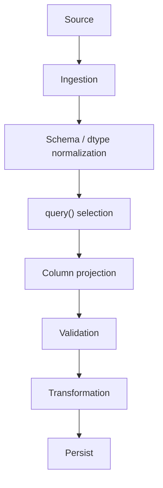

# 09- Query

## Overview

`DataFrame.query()` provides an expression-oriented way to filter rows in Pandas. It is particularly useful when a filter contains several column-based conditions and an expression syntax is easier to read than a long boolean-indexing statement.

The basic pattern is:

```python
result = df.query("condition")
```

For example:

```python
completed_orders = orders.query(
    "status == 'completed' and amount > 1000"
)
```

The equivalent `.loc` expression is:

```python
completed_orders = orders.loc[
    (orders["status"].eq("completed"))
    & (orders["amount"].gt(1000))
]
```

Both can be correct.

The important engineering decision is not whether `query()` is shorter. It is whether its expression syntax makes the filtering rule clearer, safer, and easier to maintain.

`query()` is most useful for:

```text
Expression-oriented filtering
Readable multi-column predicates
Interactive analysis
Reusable filtering expressions
Filters that naturally resemble business rules
```

It is less attractive when:

```text
The expression must be assembled dynamically
Column names are awkward or ambiguous
Complex Python logic is required
Explicit `.loc` selection is clearer
The operation belongs in SQL or another upstream system
```

## What `query()` Is

`query()` is a DataFrame method that evaluates a string expression against the DataFrame's columns and returns the rows that satisfy the expression.

The primary syntax is:

```python
df.query(expr)
```

Example:

```python
result = orders.query(
    "status == 'completed'"
)
```

Multiple conditions:

```python
result = orders.query(
    "status == 'completed' and amount > 1000"
)
```

The result is a DataFrame containing rows that satisfy the expression.

## Why `query()` Exists

Traditional boolean filtering can become visually dense:

```python
result = orders.loc[
    (orders["status"].eq("completed"))
    & (orders["amount"].gt(1000))
    & (orders["customer_id"].notna())
]
```

`query()` allows the same rule to be written more like a data expression:

```python
result = orders.query(
    """
    status == 'completed'
    and amount > 1000
    and customer_id.notna()
    """
)
```

This can improve readability when the filter is naturally expressed as a predicate over columns.

The trade-off is that `query()` introduces a string expression language, which is less explicit than ordinary Python code and requires its own syntax and quoting rules.

## Standard Syntax

The common forms are:

```python
df.query("column > 1000")
```

```python
df.query(
    "status == 'completed' and amount > 1000"
)
```

```python
df.query(
    """
    status == 'completed'
    and amount > 1000
    """
)
```

The method returns a filtered DataFrame.

It does not normally mutate the original DataFrame.

## Realistic Dataset

```python
import pandas as pd

orders = pd.DataFrame(
    {
        "order_id": [
            "ORD-1001",
            "ORD-1002",
            "ORD-1003",
            "ORD-1004",
            "ORD-1005",
        ],
        "customer_id": [
            "C-001",
            "C-002",
            "C-003",
            None,
            "C-005",
        ],
        "status": [
            "completed",
            "pending",
            "completed",
            "cancelled",
            "processing",
        ],
        "amount": [
            1250.0,
            450.0,
            3200.0,
            100.0,
            900.0,
        ],
        "region": [
            "IN",
            "US",
            "IN",
            "SG",
            "US",
        ],
    }
)
```

A simple query:

```python
completed = orders.query(
    "status == 'completed'"
)
```

A multi-condition query:

```python
high_value_completed = orders.query(
    """
    status == 'completed'
    and amount > 1000
    """
)
```

## Query Result Behavior

For a DataFrame:

```python
result = df.query(expr)
```

the important behavior is:

| Property | Behavior |
|---|---|
| Input | DataFrame and expression string |
| Output | Filtered DataFrame |
| Row order | Preserved unless subsequently changed |
| Columns | Retained unless later projected |
| Original DataFrame | Not directly mutated |
| Index | Selected rows retain original index labels |
| Missing values | Follow Pandas expression semantics |
| Assignment | `query()` itself is selection, not mutation |

A filtered result does not automatically reset its index.

## `query()` vs Boolean Indexing

The main comparison is:

```python
df.query(
    "status == 'completed' and amount > 1000"
)
```

versus:

```python
df.loc[
    (df["status"].eq("completed"))
    & (df["amount"].gt(1000))
]
```

| Consideration | `query()` | `.loc` + boolean mask |
|---|---|---|
| Syntax style | Expression string | Python expressions |
| Readability for simple predicates | Often good | Good |
| Explicit column projection | Requires separate operation | Natural |
| Programmatic predicate construction | Less convenient | Very flexible |
| External variables | Supported with `@` | Native Python variables |
| Complex Python logic | Less natural | Better |
| Scalar access | Not intended | `.loc`, `.at`, `.iloc`, `.iat` |
| Conditional assignment | Not the main use | Excellent |
| String-based dynamic input | Potentially risky | Easier to keep typed |
| Familiarity to Python developers | Requires learning query syntax | Native Python |

Neither is universally superior.

The decision should be based on:

```text
Readability
Maintainability
Expression complexity
Data source
Security
Team conventions
```

## Basic Comparisons

`query()` supports ordinary comparison expressions.

```python
orders.query(
    "amount > 1000"
)
```

Other examples:

```python
orders.query(
    "amount >= 1000"
)
```

```python
orders.query(
    "status != 'cancelled'"
)
```

```python
orders.query(
    "region == 'IN'"
)
```

The expression operates against DataFrame columns.

## Multiple Conditions

Use expression-level logical operators such as:

```text
and
or
not
```

For example:

```python
result = orders.query(
    """
    status == 'completed'
    and amount > 1000
    """
)
```

This differs from ordinary boolean indexing, where Pandas Series are generally combined with:

```text
&
|
~
```

The distinction is important:

```python
# query() expression
df.query(
    "status == 'completed' and amount > 1000"
)
```

versus:

```python
# boolean indexing
df.loc[
    (df["status"] == "completed")
    & (df["amount"] > 1000)
]
```

Do not mix the two syntaxes mentally.

## OR Conditions

Within a `query()` expression:

```python
result = orders.query(
    """
    status == 'failed'
    or amount > 10000
    """
)
```

The rule is:

```text
status == failed
OR
amount > 10000
```

With nested logic:

```python
result = orders.query(
    """
    status == 'completed'
    and (
        amount > 10000
        or region == 'SG'
    )
    """
)
```

Use parentheses when they make business-rule grouping explicit.

## NOT Conditions

Use `not` in a query expression:

```python
result = orders.query(
    "not status == 'cancelled'"
)
```

For membership exclusion:

```python
result = orders.query(
    "not status in ['completed', 'cancelled']"
)
```

For complex predicates, explicit grouping is clearer:

```python
result = orders.query(
    """
    not (
        status == 'cancelled'
        or amount < 0
    )
    """
)
```

## Membership with `in`

`query()` can express membership:

```python
result = orders.query(
    """
    status in [
        'pending',
        'processing',
    ]
    """
)
```

Equivalent `.loc`:

```python
result = orders.loc[
    orders["status"].isin(
        [
            "pending",
            "processing",
        ]
    )
]
```

For dynamically supplied collections, `.isin()` is usually easier to reason about because the values remain native Python data rather than being embedded into an expression string.

## External Variables with `@`

`query()` supports external Python variables using the `@` prefix.

```python
minimum_amount = 1000

result = orders.query(
    "amount >= @minimum_amount"
)
```

Multiple external values:

```python
minimum_amount = 1000
required_region = "IN"

result = orders.query(
    """
    amount >= @minimum_amount
    and region == @required_region
    """
)
```

This allows configuration or runtime values to remain outside the expression.

## External Collections

An external collection can be used with membership logic:

```python
allowed_statuses = [
    "pending",
    "processing",
]

result = orders.query(
    "status in @allowed_statuses"
)
```

This is generally preferable to interpolating values directly into the query string.

Avoid:

```python
result = orders.query(
    f"status in {allowed_statuses}"
)
```

because string interpolation makes expression construction harder to reason about and can become unsafe when inputs are not fully controlled.

Prefer:

```python
result = orders.query(
    "status in @allowed_statuses"
)
```

## Security: Do Not Treat Query Strings as Trusted Data

`query()` accepts an expression string.

Application code should not assume that arbitrary user-provided text is safe to place into that expression.

For example, avoid patterns where an HTTP request directly becomes part of the query expression:

```python
user_expression = request.query_params[
    "filter"
]

result = df.query(
    user_expression
)
```

This is a poor design because the expression language becomes an untrusted execution surface.

Prefer structured inputs:

```python
allowed_statuses = {
    "pending",
    "completed",
}

result = orders.loc[
    orders["status"].isin(
        allowed_statuses
    )
]
```

The broader principle is:

```text
Treat filters as typed application data,
not executable expression strings.
```

## Column Names

`query()` works most naturally with conventional column names:

```text
status
amount
customer_id
created_at
```

For example:

```python
orders.query(
    "amount > 1000 and status == 'completed'"
)
```

Unusual column names require additional syntax.

Suppose:

```python
df.columns = [
    "order id",
    "order amount",
]
```

Then:

```python
result = df.query(
    "`order amount` > 1000"
)
```

Backticks allow column names that are not valid Python identifiers to be referenced.

Despite this capability, production schemas should generally use stable, conventional column names.

Prefer:

```text
order_id
order_amount
```

over:

```text
order id
order amount
```

when you control the schema.

## Backticks in `query()`

Backticks are useful when column names contain:

```text
Spaces
Special characters
Reserved-looking names
Other characters that require escaping
```

Example:

```python
result = df.query(
    "`customer tier` == 'enterprise'"
)
```

This is useful for external datasets where the schema cannot immediately be normalized.

For internal systems, canonicalize column names earlier in the pipeline where practical.

## Reserved Names and Attribute-Like Expressions

Query expressions are not ordinary Python attribute access.

For example:

```python
df.query(
    "status == 'completed'"
)
```

references the column named `status` through query's expression environment.

Columns should therefore be named consistently and without unnecessary ambiguity.

If column names overlap with names used by the expression environment, use explicit techniques such as:

```text
Backticks for column names
@ for external Python variables
```

and test the expression against representative schemas.

## Missing Values

Missing values require explicit business semantics.

For example:

```python
result = orders.query(
    "customer_id != None"
)
```

is not a good general-purpose pattern for critical missing-value logic.

For robust missing-value checks, ordinary boolean filtering is often clearer:

```python
result = orders.loc[
    orders["customer_id"].notna()
]
```

Use `query()` where its expression semantics remain clear, but prefer explicit Pandas missing-value APIs when they communicate the rule more accurately.

## Querying Missing Values with `isna()` and `notna()`

DataFrame methods can sometimes be called within query expressions:

```python
result = orders.query(
    "customer_id.notna()"
)
```

or:

```python
result = orders.query(
    "customer_id.isna()"
)
```

This can be convenient, but `.loc` is often more explicit:

```python
result = orders.loc[
    orders["customer_id"].notna()
]
```

For team-maintained production code, select the form that produces the least ambiguity.

## Datetime Queries

Datetime filtering can be expressed in a query expression when the columns contain compatible datetime values.

For example:

```python
start = pd.Timestamp(
    "2026-01-01",
    tz="UTC",
)

result = events.query(
    "created_at >= @start"
)
```

For a half-open interval:

```python
end = pd.Timestamp(
    "2026-02-01",
    tz="UTC",
)

result = events.query(
    "created_at >= @start "
    "and created_at < @end"
)
```

Before querying, ensure the column has an appropriate datetime dtype:

```python
events["created_at"] = pd.to_datetime(
    events["created_at"],
    errors="coerce",
    utc=True,
)
```

Timezone consistency is important when production data crosses regions.

## Numeric Queries

`query()` is useful for threshold-based filtering:

```python
high_value = orders.query(
    "amount >= 5000"
)
```

Combined with multiple predicates:

```python
high_value_completed = orders.query(
    """
    amount >= 5000
    and status == 'completed'
    """
)
```

For a bounded range:

```python
mid_value = orders.query(
    "amount >= 1000 and amount < 5000"
)
```

When a range is semantically central and reused in many places, `.between()` can sometimes communicate intent more clearly.

## Derived Columns

A query can reference columns that already exist in the DataFrame.

For derived calculations, it may be cleaner to calculate the Series first:

```python
order_value = (
    orders["unit_price"]
    * orders["quantity"]
)

result = orders.loc[
    order_value.gt(5000)
]
```

Rather than embedding a complex calculation directly into a query:

```python
result = orders.query(
    "unit_price * quantity > 5000"
)
```

Both can be readable for simple expressions, but separating substantial business calculations from the filter often improves testability.

## Method Chaining

`query()` works well in a transformation pipeline:

```python
result = (
    orders
    .query(
        """
        status == 'completed'
        and amount > 1000
        """
    )
    .sort_values(
        "amount",
        ascending=False,
    )
)
```

A second query:

```python
result = (
    orders
    .query(
        """
        status == 'completed'
        and amount > 1000
        """
    )
    .query(
        "region == 'IN'"
    )
)
```

This is readable for small, independent stages.

For complex rules, combining everything into one query can reduce readability. Named predicates or separate stages may be preferable.

## Query Then Project Columns

`query()` handles row filtering, not explicit column projection.

For example:

```python
result = (
    orders
    .query(
        """
        status == 'completed'
        and amount > 1000
        """
    )
    [
        [
            "order_id",
            "customer_id",
            "amount",
        ]
    ]
)
```

An equivalent `.loc` expression is more compact:

```python
result = orders.loc[
    (
        orders["status"].eq("completed")
        & orders["amount"].gt(1000)
    ),
    [
        "order_id",
        "customer_id",
        "amount",
    ],
]
```

When row filtering and column projection naturally belong together, `.loc` may communicate the complete operation more clearly.

## Query and Conditional Assignment

`query()` is primarily for selection.

Do not use:

```python
orders.query(
    "status == 'pending'"
)["status"] = "processing"
```

as a mutation pattern.

For conditional assignment, use `.loc`:

```python
orders.loc[
    orders["status"].eq("pending"),
    "status",
] = "processing"
```

This makes the mutation boundary explicit.

A useful rule is:

```text
query()
    → selection

loc
    → selection and conditional assignment
```

## Query and Indexing

`query()` generally operates on columns and does not replace label-based index selection.

If a DataFrame uses:

```python
orders = orders.set_index(
    "order_id"
)
```

query expressions still primarily operate through the DataFrame's expression namespace.

For a direct index-label lookup:

```python
order = orders.loc[
    "ORD-1001"
]
```

is clearer.

Use each API for its intended abstraction:

```text
Index lookup → .loc
Boolean expression filtering → query()
```

## Query and the DataFrame Index

An index is not automatically exposed as an ordinary column in the same way as named columns.

If the index needs to participate naturally in filtering, reset it or make the condition explicit.

For example:

```python
orders = orders.reset_index()
```

Then:

```python
result = orders.query(
    "order_id == 'ORD-1001'"
)
```

The design decision should be based on whether `order_id` is:

```text
A business field
An indexing mechanism
Both by deliberate design
```

Do not restructure the index solely to force one particular filtering syntax.

## Query and Index Alignment

Unlike boolean masking with a Series, `query()` evaluates an expression directly against the DataFrame's columns.

This can make it attractive when the filtering logic is entirely local to the DataFrame:

```python
result = orders.query(
    "status == 'completed' and amount > 1000"
)
```

When conditions come from separate Series or external alignment-sensitive computations, `.loc` is generally more explicit.

## Query vs `isin()`

For static values:

```python
result = orders.query(
    """
    status in [
        'pending',
        'processing',
    ]
    """
)
```

or:

```python
result = orders.loc[
    orders["status"].isin(
        [
            "pending",
            "processing",
        ]
    )
]
```

For runtime collections, `.isin()` is usually cleaner:

```python
allowed_statuses = get_allowed_statuses()

result = orders.loc[
    orders["status"].isin(
        allowed_statuses
    )
]
```

The values remain structured data instead of becoming part of an expression string.

## Query vs `between()`

For numeric ranges:

```python
result = orders.query(
    "amount >= 1000 and amount < 5000"
)
```

versus:

```python
result = orders.loc[
    orders["amount"].between(
        1000,
        5000,
        inclusive="left",
    )
]
```

Use `between()` when the range itself is the important abstraction.

Use `query()` when the range is one part of a broader readable expression.

## Query vs String Accessors

String operations can sometimes be written inside a query expression:

```python
result = orders.query(
    "customer_id.str.startswith('ENT-')"
)
```

However, direct `.loc` often makes string semantics clearer:

```python
result = orders.loc[
    orders["customer_id"].str.startswith(
        "ENT-",
        na=False,
    )
]
```

For complex string normalization or regular expressions, ordinary Series operations are generally easier to read and test.

## Query Expressions and Python Functions

Avoid trying to turn arbitrary Python business logic into a query string.

For example, this is less maintainable:

```python
result = df.query(
    "custom_business_rule(amount, status)"
)
```

Prefer a normal Python predicate:

```python
mask = (
    df["status"].eq("completed")
    & df["amount"].ge(1000)
)

result = df.loc[
    mask
]
```

`query()` is strongest when the logic naturally maps to its expression language.

## Query as a Readability Tool

A good `query()` expression can make a business rule easy to review:

```python
eligible = orders.query(
    """
    status == 'completed'
    and amount >= 1000
    and region in @supported_regions
    """
)
```

The expression reads almost like a specification:

```text
completed
AND amount >= threshold
AND region ∈ supported regions
```

This can be valuable in reporting and analytical pipelines.

Do not force `query()` into code where the expression becomes harder to understand than normal Python.

## Query in ETL Pipelines

A practical ETL workflow can use `query()` for a readable local selection step:



Example:

```python
orders = pd.read_parquet(
    "s3://analytics/orders/"
)

supported_regions = {
    "IN",
    "SG",
}

eligible = (
    orders
    .query(
        """
        status in [
            'pending',
            'processing'
        ]
        and amount >= 0
        and customer_id.notna()
        and region in @supported_regions
        """
    )
    [
        [
            "order_id",
            "customer_id",
            "status",
            "amount",
            "created_at",
        ]
    ]
)
```

This can be readable for a bounded local dataset.

For very large data, the more important concern is whether the filtering can happen before materialization.

## SQL Pushdown

When the source is PostgreSQL, `query()` should not be treated as a replacement for SQL filtering.

For example:

```python
orders = pd.read_sql_query(
    """
    SELECT
        order_id,
        customer_id,
        status,
        amount,
        created_at
    FROM orders
    WHERE status IN (
        'pending',
        'processing'
    )
    AND amount >= 0
    """,
    connection,
)
```

is often preferable to:

```python
orders = pd.read_sql_query(
    "SELECT * FROM orders",
    connection,
)

eligible = orders.query(
    """
    status in [
        'pending',
        'processing'
    ]
    and amount >= 0
    """
)
```

The first approach reduces:

```text
Database output
Network transfer
Application memory
Pandas processing
```

Use `query()` for local filtering that belongs in the Pandas layer after source-side reduction.

## API Integration

If an API supports filtering:

```text
status
region
date range
pagination
field selection
```

use those capabilities before applying `query()` locally.

A sensible data flow is:

```text
REST API
    ↓
Server-side query parameters
    ↓
Bounded response
    ↓
Pandas normalization
    ↓
query() for local business rules
```

Do not download millions of records merely because `query()` can filter them afterward.

## Large Dataset Considerations

`query()` does not remove Pandas' in-memory processing model.

This:

```python
filtered = df.query(
    "status == 'completed'"
)
```

still assumes `df` is already materialized.

For large files:

```python
for chunk in pd.read_csv(
    "orders.csv",
    chunksize=100_000,
):
    completed = chunk.query(
        "status == 'completed'"
    )

    process(completed)
```

This can keep memory bounded by chunk size.

For databases, SQL pushdown is usually preferable to first loading the complete relation.

## Query and Copy Semantics

`query()` returns a filtered DataFrame result.

When the next stage needs an independently owned working object, make that requirement explicit:

```python
completed = orders.query(
    "status == 'completed'"
).copy()
```

Then:

```python
completed["amount"] = (
    completed["amount"] * 1.05
)
```

Do not add `.copy()` blindly to every query result. Large unnecessary copies can increase:

```text
Peak memory
CPU
Latency
```

The right question is:

```text
Does the next stage require independent ownership?
```

## Performance Considerations

`query()` can be convenient and can use Pandas' expression machinery for supported expressions.

However, do not choose it solely as a performance optimization.

A meaningful performance hierarchy is:

```text
Reduce data at source
        ↓
Select only needed columns
        ↓
Use vectorized local filtering
        ↓
Avoid unnecessary copies
        ↓
Profile before micro-optimizing
```

The difference between:

```python
df.query(...)
```

and:

```python
df.loc[...]
```

is often less important than:

```text
Whether the DataFrame was unnecessarily oversized
```

## Expression Evaluation

Pandas can evaluate supported expressions using its expression subsystem, which may use optimized evaluation paths for appropriate expressions.

However, the expression engine is not equivalent to a database query optimizer.

Do not assume:

```python
df.query(...)
```

will automatically:

```text
Push predicates to PostgreSQL
Partition S3 files
Execute distributed computation
Use database indexes
Stream arbitrary datasets
```

It only evaluates against the DataFrame available to the Pandas process.

This distinction is critical in production architecture.

## Complex Expressions

For a manageable expression:

```python
eligible = orders.query(
    """
    status == 'completed'
    and amount >= @minimum_amount
    and region in @supported_regions
    """
)
```

is readable.

As complexity grows:

```text
Many conditions
Derived expressions
Nested rules
Null handling
External calculations
Multiple business concepts
```

switch to named predicates:

```python
is_completed = orders["status"].eq(
    "completed"
)

meets_amount = orders["amount"].ge(
    minimum_amount
)

supported_region = orders[
    "region"
].isin(
    supported_regions
)

eligible = orders.loc[
    is_completed
    & meets_amount
    & supported_region
]
```

The transition point is maintainability, not a fixed number of conditions.

## Debugging Query Logic

Because the expression is represented as a string, debugging can be less direct than ordinary Python boolean expressions.

When diagnosing unexpected results, decompose the predicates:

```python
is_completed = orders["status"].eq(
    "completed"
)

meets_amount = orders["amount"].ge(
    minimum_amount
)

supported_region = orders[
    "region"
].isin(
    supported_regions
)
```

Then compare counts:

```python
metrics = {
    "completed": int(is_completed.sum()),
    "meets_amount": int(meets_amount.sum()),
    "supported_region": int(
        supported_region.sum()
    ),
    "eligible": int(
        (
            is_completed
            & meets_amount
            & supported_region
        ).sum()
    ),
}
```

This makes the business rule observable and easier to troubleshoot.

## Testing Query-Based Filters

Test business behavior rather than testing that `query()` itself executes.

For example:

```python
def select_high_value_orders(
    orders: pd.DataFrame,
    minimum_amount: float,
) -> pd.DataFrame:
    return orders.query(
        "status == 'completed' "
        "and amount >= @minimum_amount"
    )
```

Test the result:

```python
def test_select_high_value_orders() -> None:
    orders = pd.DataFrame(
        {
            "order_id": [
                "ORD-1",
                "ORD-2",
                "ORD-3",
            ],
            "status": [
                "completed",
                "completed",
                "pending",
            ],
            "amount": [
                2000.0,
                500.0,
                5000.0,
            ],
        }
    )

    result = select_high_value_orders(
        orders,
        minimum_amount=1000,
    )

    assert result["order_id"].tolist() == [
        "ORD-1",
    ]
```

Test:

```text
Matching rows
No matching rows
Boundary values
Missing values
Unexpected statuses
Empty DataFrame
External variable changes
Wrong dtypes
Unusual column names
```

## Production Validation

Query expressions assume the underlying data has suitable types.

For example:

```python
orders.query(
    "amount > 1000"
)
```

is meaningful when `amount` is numeric.

Normalize first:

```python
orders["amount"] = pd.to_numeric(
    orders["amount"],
    errors="coerce",
)
```

Then query:

```python
high_value = orders.query(
    "amount > 1000"
)
```

Do not make the filtering layer responsible for silently repairing arbitrary source corruption.

A strong pipeline separates:

```text
Ingestion
    ↓
Schema / dtype normalization
    ↓
Data cleaning
    ↓
Selection
    ↓
Transformation
```

## Empty Results

A query can return zero rows:

```python
result = orders.query(
    "status == 'archived'"
)
```

This is not automatically a failure.

Define the business contract:

```text
No matches → valid
No matches → warning
No matches → pipeline failure
```

For example:

```python
if result.empty:
    raise ValueError(
        "Expected archived orders."
    )
```

Only use this when an empty result violates the expected workflow.

## Deterministic Ordering

`query()` filters but does not establish business ordering.

If a later operation depends on record order:

```python
result = (
    orders
    .query(
        "status == 'pending'"
    )
    .sort_values(
        [
            "priority",
            "created_at",
            "order_id",
        ],
        kind="stable",
    )
)
```

Filtering and ordering should remain separate concerns.

This is particularly important before:

```text
Batch selection
head()
tail()
Exports
API responses
Reports
Incremental processing
```

## Duplicate Records

`query()` does not remove duplicate records.

```python
completed = orders.query(
    "status == 'completed'"
)
```

may still contain duplicate business identifiers.

If uniqueness is required:

```python
completed = (
    orders
    .query(
        "status == 'completed'"
    )
    .drop_duplicates(
        subset=["order_id"]
    )
)
```

The duplicate policy belongs to the data contract, not to `query()`.

## Security Considerations

`query()` should not become a security boundary.

For multi-tenant data:

```python
tenant_orders = orders.loc[
    orders["tenant_id"].eq(tenant_id)
]
```

Then optional local filtering:

```python
eligible = tenant_orders.query(
    """
    status == 'completed'
    and amount >= @minimum_amount
    """
)
```

Authorization should already be enforced through:

```text
Authentication
Authorization
Database access control
Tenant isolation
Service-level policy
```

Pandas filtering is a downstream defense-in-depth mechanism.

## Query and Sensitive Columns

`query()` selects rows, but it does not reduce the columns automatically.

For a report:

```python
report = (
    orders
    .query(
        "status == 'completed'"
    )
    [
        [
            "order_id",
            "customer_id",
            "amount",
        ]
    ]
)
```

This is preferable to carrying unnecessary sensitive columns such as:

```text
Internal notes
Payment metadata
Authentication-related fields
Personal information
Operational secrets
```

Data minimization should be explicit.

## Monitoring Query Results

Filtering rules are useful operational boundaries.

For example:

```python
eligible = orders.query(
    """
    status == 'pending'
    and customer_id.notna()
    and amount >= 0
    """
)

logger.info(
    "eligible_orders=%d",
    len(eligible),
)
```

Useful metrics include:

```text
records_read
records_selected
records_rejected
missing_customer_id
invalid_amount
unknown_status
```

For important pipelines, monitor selection-rate changes over time.

A sudden change from:

```text
98% selected
```

to:

```text
43% selected
```

may indicate:

```text
Upstream schema change
New enum value
Type conversion issue
Bad source data
Business-rule deployment
```

## Common Mistakes

### Confusing Query Syntax with Boolean Syntax

Incorrect:

```python
orders.query(
    "status == 'completed' "
    "& amount > 1000"
)
```

This mixes `.loc`-style boolean operators with query-expression syntax.

Prefer:

```python
orders.query(
    "status == 'completed' "
    "and amount > 1000"
)
```

Or use ordinary boolean indexing:

```python
orders.loc[
    (orders["status"] == "completed")
    & (orders["amount"] > 1000)
]
```

### Using User Input Directly as a Query Expression

Avoid:

```python
orders.query(
    request.query_params["filter"]
)
```

Treat user-provided filter syntax as untrusted.

Prefer structured parameters and typed predicates.

### Building Expressions with String Interpolation

Avoid:

```python
query = (
    f"status == '{status}'"
)

orders.query(query)
```

when `status` comes from external input.

Prefer:

```python
orders.query(
    "status == @status"
)
```

after validating the value.

Even better, for simple membership or equality rules:

```python
orders.loc[
    orders["status"].eq(status)
]
```

### Using `query()` for Conditional Assignment

Do not rely on:

```python
orders.query(
    "status == 'pending'"
)["status"] = "processing"
```

Use:

```python
orders.loc[
    orders["status"].eq("pending"),
    "status",
] = "processing"
```

### Using `query()` for Complex Python Logic

Avoid forcing arbitrary Python functions into query strings.

Use normal Python expressions and boolean masks instead.

### Ignoring Column Names

Awkward column names make query expressions harder to maintain.

Normalize schemas where possible or use backticks when external schemas cannot be changed.

### Filtering After Full Database Extraction

Do not treat `query()` as a substitute for SQL pushdown.

Reduce data before it enters Pandas when possible.

### Assuming `query()` Sorts Results

It does not.

Sort explicitly when order matters.

### Ignoring Missing-Value Semantics

Expressions involving missing data can produce results that do not match an assumed ordinary-Python boolean model.

Define null behavior explicitly.

### Adding `.copy()` Automatically

Unnecessary copies can increase memory consumption.

Copy when independent ownership is required.

## Production Pitfalls

| Pitfall | Why it happens | Better approach |
|---|---|---|
| Mixing `and` / `or` with `&` / `\|` | Query syntax confused with `.loc` syntax | Keep each expression style consistent |
| Dynamic string interpolation | Query expressions treated like ordinary formatted strings | Use `@` variables or structured `.loc` predicates |
| User-controlled query expressions | Filter syntax treated as trusted input | Validate structured filters |
| Complex query strings | Readability degrades as rules grow | Use named boolean predicates |
| Query used for assignment | Selection and mutation confused | Use `.loc` for assignment |
| Missing-value assumptions | Null semantics ignored | Normalize and define null policy |
| Full database extraction | Local filtering used instead of source filtering | Push predicates into SQL |
| Unnecessary copies | Defensive copying after every selection | Copy only when ownership requires it |
| Awkward column names | External schema passed directly into query logic | Canonicalize names or use backticks |
| Query result assumed ordered | Filtering confused with sorting | Sort explicitly |
| Query used as authorization | Local selection mistaken for access control | Authorize at trusted layers |

## Interview Traps

### What Is `DataFrame.query()`?

It is an expression-oriented DataFrame filtering method that evaluates a string expression against the DataFrame and returns matching rows.

### How Is `query()` Different from `.loc` Boolean Filtering?

`query()` uses a string expression language:

```python
df.query(
    "status == 'completed' and amount > 1000"
)
```

while `.loc` uses normal Python/Pandas boolean expressions:

```python
df.loc[
    (df["status"] == "completed")
    & (df["amount"] > 1000)
]
```

### Why Does `query()` Use `and` Instead of `&`?

The expression is interpreted by Pandas' query-expression syntax rather than as ordinary Python boolean indexing.

### How Do You Pass a Python Variable into `query()`?

Use `@`:

```python
minimum_amount = 1000

df.query(
    "amount >= @minimum_amount"
)
```

### How Do You Pass a Collection?

```python
allowed_statuses = {
    "pending",
    "processing",
}

df.query(
    "status in @allowed_statuses"
)
```

### Can `query()` Be Used for Assignment?

It is primarily a selection API. Use `.loc` for conditional mutation:

```python
df.loc[
    mask,
    "column",
] = value
```

### When Is `query()` More Readable Than `.loc`?

When a filter naturally reads as a compact expression involving several columns and conditions.

### When Is `.loc` Preferable?

When you need:

```text
Explicit row and column selection
Programmatic masks
Complex Python logic
Conditional assignment
Clear missing-value handling
```

### Is `query()` Faster Than `.loc`?

Not universally. Performance depends on the expression, DataFrame, dtypes, and workload. Larger architectural decisions such as source-side filtering and data reduction are usually more important.

### Can `query()` Filter Large Database Tables Efficiently?

Only after the data has entered Pandas. It does not push the expression into PostgreSQL.

### Can `query()` Be Used with Unusual Column Names?

Yes, backticks can reference column names containing spaces or other characters:

```python
df.query(
    "`order amount` > 1000"
)
```

### Does `query()` Modify the Original DataFrame?

Filtering with `query()` is not itself an in-place mutation operation.

### Does `query()` Reset the Index?

No. Selected rows generally retain their original index labels.

### How Should User-Provided Filters Be Handled?

Do not directly treat arbitrary user strings as query expressions. Validate structured filter parameters and construct typed Pandas predicates instead.

### When Should `isin()` Be Preferred?

When the business rule is value membership, especially with a runtime collection:

```python
df.loc[
    df["status"].isin(
        allowed_statuses
    )
]
```

### When Should `between()` Be Preferred?

When a requirement is fundamentally a numeric or ordered range and the range semantics should be explicit.

## Practical Reference

| Requirement | Recommended pattern |
|---|---|
| Single condition | `df.query("amount > 1000")` |
| Multiple AND conditions | `df.query("status == 'completed' and amount > 1000")` |
| OR conditions | `df.query("status == 'failed' or amount > 10000")` |
| Negation | `df.query("not status == 'cancelled'")` |
| Membership | `df.query("status in @allowed_statuses")` |
| External scalar | `df.query("amount >= @minimum_amount")` |
| External collection | `df.query("region in @regions")` |
| Unusual column name | `df.query("`order amount` > 1000")` |
| Missing-value condition | Prefer explicit `.loc` + `isna()` / `notna()` when clearer |
| Conditional assignment | Use `.loc`, not `query()` |
| Complex Python predicate | Use `.loc` and named masks |
| Runtime membership filtering | Prefer `.isin()` |
| Numeric range | Consider `.between()` |
| Large database filtering | Push into SQL |
| Large CSV processing | Query each chunk |
| Independent transformation | Add `.copy()` when ownership requires it |

## Recommended Engineering Pattern

A practical production use of `query()` is to keep the expression readable while keeping runtime values outside the expression:

```python
supported_regions = {
    "IN",
    "SG",
    "US",
}

minimum_amount = 1000

eligible = orders.query(
    """
    status in [
        'pending',
        'processing'
    ]
    and amount >= @minimum_amount
    and customer_id.notna()
    and region in @supported_regions
)
```

Then explicitly project the downstream schema:

```python
eligible = eligible[
    [
        "order_id",
        "customer_id",
        "status",
        "amount",
        "created_at",
    ]
]
```

If the business rule becomes more complex, move toward named predicates:

```python
processable_status = orders[
    "status"
].isin(
    {
        "pending",
        "processing",
    }
)

has_customer = orders[
    "customer_id"
].notna()

meets_amount = orders[
    "amount"
].ge(
    minimum_amount
)

supported_region = orders[
    "region"
].isin(
    supported_regions
)

eligible = orders.loc[
    processable_status
    & has_customer
    & meets_amount
    & supported_region,
    [
        "order_id",
        "customer_id",
        "status",
        "amount",
        "created_at",
    ],
].copy()
```

This gives a useful design boundary:

```text
Simple readable expression
    → query()

Complex or highly programmatic predicate
    → named boolean masks + .loc

Conditional mutation
    → .loc

Large source dataset
    → filter upstream where possible
```

## Key Takeaways

- `DataFrame.query()` provides an expression-oriented syntax for row filtering and can improve readability when business rules naturally map to compact predicates.
- `query()` uses its own expression semantics, including `and`, `or`, `not`, `in`, and `@` for external Python variables; do not mix these rules with `.loc`'s `&`, `|`, and `~` syntax.
- Use structured external values with `@` rather than interpolating runtime or user input into query strings, and never treat arbitrary user-supplied expressions as trusted authorization or filtering logic.
- `.loc` remains preferable for explicit column projection, programmatic predicates, conditional assignment, complex Python logic, and many missing-value scenarios.
- In production, `query()` is a local DataFrame filtering tool, not a database optimizer: push large filters into PostgreSQL or upstream APIs when possible, use chunked processing for large files, and keep complex business rules testable and observable.