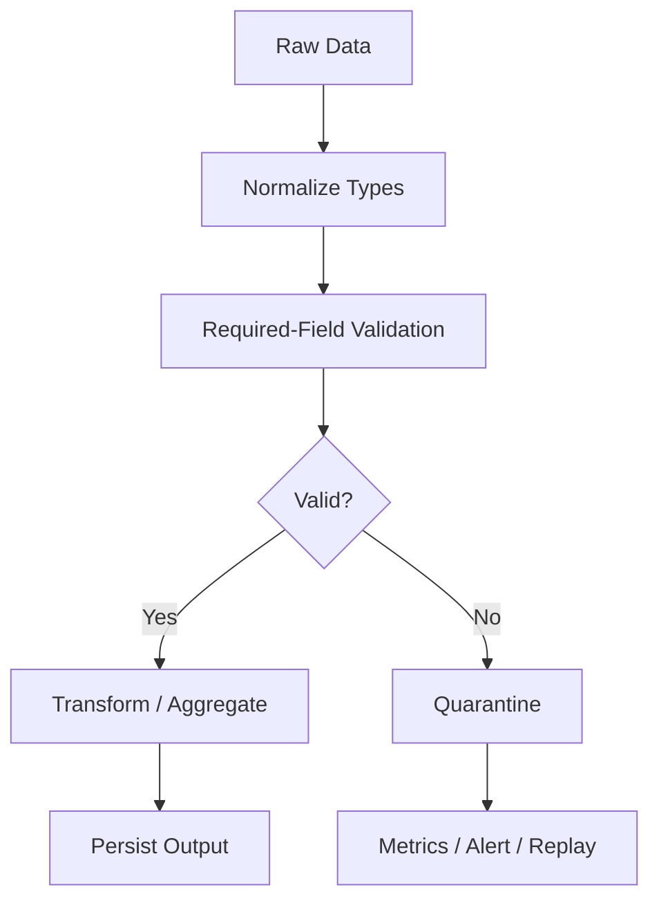

# 10- Filtering Missing Values

## Overview

Missing values are a normal part of production data. APIs omit fields, CSV exports contain empty cells, database queries return `NULL`, event payloads evolve, and upstream systems occasionally produce malformed records.

Pandas provides dedicated missing-value operations for identifying and filtering these records:

```text
isna()
notna()
```

Combined with `.loc`, they provide the standard filtering pattern:

```python
missing = df.loc[
    df["customer_id"].isna()
]
```

or:

```python
valid = df.loc[
    df["customer_id"].notna()
]
```

Missing-value filtering is not merely a syntax concern. Production correctness depends on deciding what a missing value means:

```text
Missing
    ↓
Unknown
    ↓
Reject?
Quarantine?
Default?
Manual review?
Accept?
```

That decision affects:

```text
ETL
Data quality
Validation
Reporting
Financial calculations
API behavior
Batch processing
Database writes
Monitoring
```

## What Is a Missing Value?

A missing value means the dataset does not contain a usable value for a field.

Common sources include:

```text
SQL NULL
CSV empty fields
JSON null
Missing JSON keys
NaN
pd.NA
NaT
```

Pandas supports several missing-value representations depending on the dtype and operation.

The important engineering principle is:

```text
Missing value
≠
Empty string
≠
Zero
≠
False
≠
Unknown domain value
```

For example:

```text
amount = 0
```

can be a valid transaction amount, while:

```text
amount = missing
```

means the amount was not supplied or could not be determined.

## Why Missing-Value Filtering Matters

A pipeline that ignores missing values may produce:

```text
Incorrect aggregates
Invalid joins
Broken API payloads
Incorrect reports
Failed database writes
Incorrect business decisions
```

For example, this filter:

```python
eligible = orders.loc[
    orders["amount"] > 1000
]
```

does not communicate what should happen to records where `amount` is missing.

A production pipeline should intentionally define that behavior.

## Core APIs

The primary APIs are:

```python
df["column"].isna()
```

and:

```python
df["column"].notna()
```

For a DataFrame:

```python
df.isna()
```

returns a boolean DataFrame.

```python
df.notna()
```

does the inverse.

| Operation | Meaning |
|---|---|
| `isna()` | Value is missing |
| `notna()` | Value is not missing |
| `df.loc[df["x"].isna()]` | Rows where `x` is missing |
| `df.loc[df["x"].notna()]` | Rows where `x` is present |

## Basic Missing-Value Filter

Consider:

```python
import pandas as pd

orders = pd.DataFrame(
    {
        "order_id": [
            "ORD-1001",
            "ORD-1002",
            "ORD-1003",
            "ORD-1004",
        ],
        "customer_id": [
            "C-001",
            None,
            "C-003",
            None,
        ],
        "amount": [
            1250.0,
            450.0,
            None,
            100.0,
        ],
    }
)
```

Find orders with missing customers:

```python
missing_customer = orders.loc[
    orders["customer_id"].isna()
]
```

Find orders with valid customers:

```python
valid_customer = orders.loc[
    orders["customer_id"].notna()
]
```

The original DataFrame is not mutated by these filters.

## `isna()` vs `notna()`

The two operations are complements:

```python
missing = df["customer_id"].isna()

present = df["customer_id"].notna()
```

For ordinary missingness semantics:

```python
missing == ~present
```

conceptually.

Using the dedicated methods is generally more readable than manually constructing negated expressions.

Prefer:

```python
df["customer_id"].notna()
```

over:

```python
~df["customer_id"].isna()
```

when the business rule is explicitly "value exists."

## Missing vs Empty String

These values are not necessarily equivalent:

```text
None
pd.NA
NaN
""
"   "
```

For example:

```python
df = pd.DataFrame(
    {
        "customer_id": [
            None,
            "",
            "   ",
            "C-001",
        ]
    }
)
```

Then:

```python
df["customer_id"].isna()
```

identifies actual missing values, but not necessarily empty or whitespace-only strings.

If the business rule treats blank strings as missing, normalize them separately:

```python
customer_id = (
    df["customer_id"]
    .astype("string")
    .str.strip()
)

missing_customer = (
    customer_id.isna()
    | customer_id.eq("")
)
```

This distinction is important in production data cleaning.

## Missing vs Zero

Do not treat zero as missing.

For example:

```python
transactions = pd.DataFrame(
    {
        "amount": [
            0.0,
            100.0,
            None,
        ]
    }
)
```

Then:

```python
transactions["amount"].isna()
```

selects only the missing value.

It does not select:

```text
0.0
```

Zero can be a valid business value.

## Missing vs False

Similarly:

```python
df["active"].isna()
```

does not mean:

```python
df["active"] == False
```

These represent different states:

```text
True
False
Missing / unknown
```

This matters for nullable boolean columns.

## Missing-Value Representations

Pandas can encounter several missing-value markers:

| Representation | Typical context |
|---|---|
| `None` | Python object values |
| `np.nan` | Floating-point missing value |
| `pd.NA` | Pandas nullable dtypes |
| `NaT` | Missing datetime / timedelta |
| `NaN`-like values | Numeric operations |

Application code should generally use:

```python
isna()
notna()
pd.isna()
pd.notna()
```

rather than checking for one specific representation.

## Nullable Dtypes

Modern Pandas supports nullable dtypes such as:

```python
pd.Series(
    [1, None, 3],
    dtype="Int64",
)
```

and:

```python
pd.Series(
    [True, None, False],
    dtype="boolean",
)
```

This allows missing values to be represented without relying exclusively on floating-point coercion or generic `object` dtype.

Inspect the dtype:

```python
df["amount"].dtype
```

before making assumptions about missing-value behavior.

## Filtering Multiple Missing Columns

A record may be valid only when several required fields are present.

```python
valid = orders.loc[
    orders["customer_id"].notna()
    & orders["amount"].notna()
    & orders["created_at"].notna()
]
```

This means:

```text
customer_id exists
AND
amount exists
AND
created_at exists
```

For complex pipelines, define named predicates:

```python
has_customer = orders[
    "customer_id"
].notna()

has_amount = orders[
    "amount"
].notna()

has_created_at = orders[
    "created_at"
].notna()

valid = orders.loc[
    has_customer
    & has_amount
    & has_created_at
]
```

This makes validation logic easier to inspect and test.

## Filtering Rows with Any Missing Values

To find rows with at least one missing value:

```python
rows_with_missing = orders.loc[
    orders.isna().any(axis=1)
]
```

This is useful for data-quality inspection.

Conceptually:

```text
Row
 ├── customer_id → present
 ├── amount      → missing
 └── created_at  → present
                 ↓
          Row has missing data
```

The boolean result from:

```python
orders.isna().any(axis=1)
```

contains one value per row.

## Filtering Rows with No Missing Values

Use:

```python
complete = orders.loc[
    orders.notna().all(axis=1)
]
```

This selects rows where every column is non-missing.

Be careful with wide DataFrames.

A reporting dataset may contain optional fields where missing values are valid. Requiring every column to be populated can accidentally reject legitimate records.

## Required Columns vs Optional Columns

Production schemas should distinguish:

```text
Required fields
Optional fields
Conditionally required fields
```

For example:

```python
required_columns = [
    "order_id",
    "customer_id",
    "amount",
]

complete_required = orders.loc[
    orders[required_columns]
    .notna()
    .all(axis=1)
]
```

This is better than:

```python
orders.loc[
    orders.notna().all(axis=1)
]
```

when optional columns are allowed to be missing.

## Filtering Based on Missing Count

Sometimes the rule is:

```text
Reject rows with more than two missing fields.
```

Calculate the missing count:

```python
missing_count = orders.isna().sum(
    axis=1
)

usable = orders.loc[
    missing_count.le(2)
]
```

This is useful for:

```text
Data-quality scoring
Record triage
Quarantine thresholds
Import validation
```

Do not use a generic missing-count threshold when individual fields have different business importance.

A missing primary key may be unacceptable even if only one field is missing.

## Required-Field Validation

Define a schema-level requirement:

```python
required_columns = [
    "order_id",
    "customer_id",
    "amount",
]
```

Then:

```python
missing_required = orders[
    required_columns
].isna()
```

Find affected records:

```python
invalid = orders.loc[
    missing_required.any(axis=1)
]
```

This provides a reusable pattern for ETL validation.

## Finding Which Columns Are Missing

To understand data quality:

```python
missing_by_column = (
    orders.isna()
    .sum()
    .sort_values(
        ascending=False
    )
)
```

This answers:

```text
Which fields are missing most often?
```

For operational monitoring:

```python
missing_rate = (
    orders.isna()
    .mean()
    .sort_values(
        ascending=False
    )
)
```

Because boolean values are treated numerically, the mean represents the fraction of missing values for each column.

For example:

```text
customer_id → 0.02
amount      → 0.01
region      → 0.34
```

A high rate can indicate an upstream contract problem.

## Filtering by a Specific Missing Field

A common ETL pattern:

```python
missing_amount = orders.loc[
    orders["amount"].isna(),
    [
        "order_id",
        "customer_id",
    ],
]
```

This both:

```text
Identifies invalid records
+
Limits the output to fields needed for remediation
```

Selecting only required diagnostic fields can reduce memory and sensitive-data exposure.

## Missing Values in Conditions

Consider:

```python
orders.loc[
    orders["amount"] > 1000
]
```

A missing amount does not represent a valid comparison result.

If the rule is:

```text
Keep only records with an amount greater than 1000.
```

then an explicit presence check can improve readability:

```python
orders.loc[
    orders["amount"].notna()
    & orders["amount"].gt(1000)
]
```

This communicates the business rule directly.

## Missing Values and Boolean Logic

Suppose:

```python
has_customer = orders[
    "customer_id"
].notna()

high_value = orders[
    "amount"
].gt(1000)
```

Then:

```python
eligible = (
    has_customer
    & high_value
)
```

The missing-value semantics of the underlying Series matter.

For critical business logic, make missing-value treatment explicit instead of relying on implicit propagation or assumptions.

## Nullable Boolean Conditions

Pandas nullable boolean operations can contain:

```text
True
False
<NA>
```

This is different from an ordinary two-state boolean model.

For filtering, decide how unknown predicate results should behave.

If unknown should mean "do not select":

```python
mask = (
    orders["status"]
    .eq("completed")
    .fillna(False)
)

result = orders.loc[
    mask
]
```

If unknown means "requires review", keep it as a separate category rather than silently converting it to `False`.

## Missing Values and `query()`

`query()` can be used for some missing-value expressions:

```python
result = orders.query(
    "customer_id.notna()"
)
```

However, `.loc` with explicit missing-value methods is often clearer:

```python
result = orders.loc[
    orders["customer_id"].notna()
]
```

For production code, prefer the form that makes null semantics immediately obvious.

## Missing Values and `isin()`

Membership rules should define how missing values behave.

For example:

```python
allowed_regions = {
    "IN",
    "US",
}

selected = orders.loc[
    orders["region"].isin(
        allowed_regions
    )
]
```

Missing regions will not normally satisfy the ordinary membership set.

If a missing region should be explicitly rejected:

```python
valid_region = (
    orders["region"].notna()
    & orders["region"].isin(
        allowed_regions
    )
)
```

This makes the intent clear.

## Missing Values and String Operations

String methods can encounter missing values.

Prefer explicit null handling:

```python
enterprise = orders.loc[
    orders["customer_id"]
    .astype("string")
    .str.startswith(
        "ENT-",
        na=False,
    )
]
```

The `na=False` setting means missing values do not satisfy the predicate.

For exact matching:

```python
orders.loc[
    orders["customer_id"].eq("ENT-001")
]
```

is simpler.

## Missing Datetimes

Datetime columns use `NaT` for missing datetime-like values.

Filter them with the same missing-value APIs:

```python
missing_dates = events.loc[
    events["created_at"].isna()
]
```

Non-missing dates:

```python
valid_dates = events.loc[
    events["created_at"].notna()
]
```

Do not rely on direct equality to `NaT`.

## Missing Values and Numeric Conversion

Raw files frequently contain invalid numeric values:

```text
1000
2000
N/A
unknown
-
```

Normalize the column:

```python
orders["amount"] = pd.to_numeric(
    orders["amount"],
    errors="coerce",
)
```

Invalid values become missing.

Then filter:

```python
valid_amounts = orders.loc[
    orders["amount"].notna()
]
```

or:

```python
invalid_amounts = orders.loc[
    orders["amount"].isna()
]
```

This separates:

```text
Parsing failure
+
Missing-value handling
```

from the business logic.

## Missing Values and Datetime Conversion

The same principle applies to timestamps:

```python
events["created_at"] = pd.to_datetime(
    events["created_at"],
    errors="coerce",
    utc=True,
)
```

Invalid timestamps become missing values.

Then:

```python
invalid_dates = events.loc[
    events["created_at"].isna()
]
```

A mature ETL pipeline can therefore distinguish:

```text
Valid timestamp
Missing timestamp
Malformed timestamp
```

depending on the preprocessing stage.

## Filtering Required Fields in ETL

A production ingestion stage might require:

```python
required = [
    "order_id",
    "customer_id",
    "amount",
    "created_at",
]

required_present = orders[
    required
].notna().all(axis=1)

valid_orders = orders.loc[
    required_present
]

invalid_orders = orders.loc[
    ~required_present
]
```

The result is two explicit data paths:

```text
Valid records
    ↓
Transformation

Invalid records
    ↓
Quarantine / reporting
```

This is generally better than silently dropping invalid rows.

## Quarantine Pattern

Invalid records can be preserved for remediation:

```python
invalid = orders.loc[
    ~required_present,
    [
        "order_id",
        "customer_id",
        "amount",
        "created_at",
    ],
].copy()
```

Depending on the system, write them to:

```text
S3 quarantine path
Error table
Dead-letter dataset
Validation report
Monitoring stream
```

The production goal is traceability:

```text
Input record
    ↓
Validation result
    ↓
Reason for rejection
    ↓
Remediation / replay
```

## Adding Rejection Reasons

A boolean mask identifies that a record failed, but not why.

Create separate predicates:

```python
missing_customer = orders[
    "customer_id"
].isna()

missing_amount = orders[
    "amount"
].isna()

missing_created_at = orders[
    "created_at"
].isna()
```

Then measure:

```python
metrics = {
    "missing_customer": int(
        missing_customer.sum()
    ),
    "missing_amount": int(
        missing_amount.sum()
    ),
    "missing_created_at": int(
        missing_created_at.sum()
    ),
}
```

For more detailed rejection outputs, construct a reason column in a dedicated validation stage.

## Conditional Requirements

Not every field is always required.

Suppose:

```text
refund_amount
```

is required only when:

```text
transaction_type == refund
```

Define:

```python
is_refund = orders[
    "transaction_type"
].eq("refund")

refund_amount_present = orders[
    "refund_amount"
].notna()

invalid_refund = (
    is_refund
    & ~refund_amount_present
)
```

This is more accurate than globally requiring `refund_amount` for every record.

Production schemas often contain these conditional constraints.

## Missing Values in Financial Data

Financial pipelines require particularly explicit semantics.

For example:

```text
amount = 0
```

may mean:

```text
Zero transaction
```

while:

```text
amount = missing
```

may mean:

```text
Unknown transaction amount
```

Do not blindly replace missing financial values with zero:

```python
orders["amount"] = orders[
    "amount"
].fillna(0)
```

unless the business contract explicitly says missing means zero.

For financial reporting, a missing amount may instead require:

```text
Record rejection
Reconciliation
Manual review
Source correction
```

## Missing Values in API Data

APIs can represent absence in several ways:

```json
{
  "order_id": "ORD-1001",
  "customer_id": null
}
```

or:

```json
{
  "order_id": "ORD-1001"
}
```

or:

```json
{
  "order_id": "ORD-1001",
  "customer_id": ""
}
```

These may be semantically different.

After normalization into Pandas, standardize the representation where appropriate:

```python
orders["customer_id"] = (
    orders["customer_id"]
    .astype("string")
    .str.strip()
)
```

Then explicitly define whether:

```text
Missing
Blank
Whitespace-only
```

should be treated identically.

## Missing Values from SQL

SQL `NULL` commonly becomes a Pandas missing representation during extraction.

For example:

```python
orders = pd.read_sql_query(
    """
    SELECT
        order_id,
        customer_id,
        amount
    FROM orders
    """,
    connection,
)
```

Then:

```python
orders.loc[
    orders["customer_id"].isna()
]
```

can identify SQL `NULL` values.

The database schema should still define constraints where possible.

Pandas validation should complement database integrity rather than replacing it.

## Database Constraints vs Pandas Validation

Use the database for invariants it should enforce:

```text
NOT NULL
UNIQUE
FOREIGN KEY
CHECK
```

Use Pandas for local processing validation such as:

```text
Conditional required fields
Source-specific normalization
Cross-file validation
Report-specific completeness
Data-quality scoring
```

A strong architecture is:

```text
Database constraints
    +
Source validation
    +
Pandas validation
    ↓
Reliable dataset
```

## Filtering Missing Values Before Joins

Missing join keys can create incorrect or incomplete relationships.

For example:

```python
orders_with_customer = orders.loc[
    orders["customer_id"].notna()
]
```

before joining to customers:

```python
enriched = orders_with_customer.merge(
    customers,
    on="customer_id",
    how="left",
    validate="many_to_one",
)
```

Whether rows with missing keys should be dropped, quarantined, or retained depends on the reporting and business requirements.

Do not blindly remove them if the missing relationship itself needs to be reported.

## Filtering Missing Values Before Aggregation

Aggregations often have operation-specific missing-value semantics.

For example:

```python
revenue = orders.loc[
    orders["amount"].notna()
].groupby(
    "customer_id"
)["amount"].sum()
```

This explicitly excludes records with missing amounts before aggregation.

However, do not assume missing and zero are interchangeable.

For reporting, it may be important to preserve the distinction:

```text
No transaction
vs
Transaction with zero amount
vs
Transaction with unknown amount
```

## Missing Values and Grouping

Suppose:

```python
summary = (
    orders
    .groupby(
        "customer_id",
        dropna=False,
    )["amount"]
    .sum()
)
```

Including missing group keys can preserve records that would otherwise be omitted from the grouping result.

This is useful when:

```text
Missing customer_id
```

is itself a reportable data-quality condition.

Whether missing groups should be included depends on the reporting contract.

## Missing Values and Sorting

Sorting can involve missing values.

For deterministic reporting, specify the intended placement:

```python
result = orders.sort_values(
    "amount",
    na_position="last",
)
```

This is useful when:

```text
Missing amounts
```

must consistently appear after valid values.

Do not assume the default missing-value ordering matches your business requirement.

## Missing Values in Reports

A reporting system may need to distinguish:

```text
Unknown
Not applicable
Not provided
Zero
```

Do not collapse all these states into one placeholder.

For example:

```python
report = orders.loc[
    orders["customer_id"].notna(),
    [
        "order_id",
        "customer_id",
        "amount",
    ],
]
```

may be appropriate for a customer-level report, while a data-quality report may need to retain the missing rows.

The correct filter depends on the output's purpose.

## Performance Considerations

Missing-value checks are vectorized and generally appropriate for column-based filtering:

```python
valid = df.loc[
    df["customer_id"].notna()
]
```

Avoid row-level loops:

```python
valid_rows = []

for _, row in df.iterrows():
    if pd.notna(row["customer_id"]):
        valid_rows.append(row)
```

Prefer vectorized operations.

For multiple required columns:

```python
required = [
    "order_id",
    "customer_id",
    "amount",
]

valid = df.loc[
    df[required]
    .notna()
    .all(axis=1)
]
```

## Memory Considerations

Wide DataFrames can make:

```python
df.isna()
```

materialize a large boolean DataFrame.

When only one column matters:

```python
df["customer_id"].isna()
```

is more targeted.

When validating required fields:

```python
df[required].notna().all(axis=1)
```

limits the operation to required columns rather than scanning unrelated fields.

For large datasets, avoid unnecessary whole-DataFrame missingness checks.

## Chunked Processing

For large CSVs:

```python
required = [
    "order_id",
    "customer_id",
    "amount",
]

for chunk in pd.read_csv(
    "orders.csv",
    chunksize=100_000,
):
    valid = chunk.loc[
        chunk[required]
        .notna()
        .all(axis=1)
    ]

    process(valid)
```

This keeps the input bounded.

If invalid records must also be retained:

```python
for chunk in pd.read_csv(
    "orders.csv",
    chunksize=100_000,
):
    valid_mask = (
        chunk[required]
        .notna()
        .all(axis=1)
    )

    valid = chunk.loc[
        valid_mask
    ]

    invalid = chunk.loc[
        ~valid_mask
    ]

    process(valid)
    quarantine(invalid)
```

Global quality statistics must still be accumulated across chunks.

## Missing-Value Filtering with Parquet

Parquet preserves typed columns better than many text formats, making null handling more predictable.

A production workflow may be:

```text
S3 Parquet
    ↓
Read required columns
    ↓
Null-aware filtering
    ↓
Transformation
    ↓
Output Parquet
```

Read only columns required for validation where practical.

For example:

```python
orders = pd.read_parquet(
    "s3://analytics/orders/",
    columns=[
        "order_id",
        "customer_id",
        "amount",
        "created_at",
    ],
)
```

Then:

```python
valid = orders.loc[
    orders[
        [
            "order_id",
            "customer_id",
            "amount",
        ]
    ]
    .notna()
    .all(axis=1)
]
```

## Data Quality Metrics

Missing-value filtering should often produce metrics.

```python
required = [
    "order_id",
    "customer_id",
    "amount",
]

missing_mask = (
    orders[required]
    .isna()
)

missing_by_column = (
    missing_mask
    .sum()
    .to_dict()
)

invalid_rows = int(
    missing_mask.any(axis=1).sum()
)
```

Useful metrics include:

```text
records_read
records_with_missing_fields
missing_customer_id
missing_amount
missing_created_at
records_quarantined
records_accepted
```

Monitoring these values helps detect upstream quality regressions.

## Reliability and Operational Handling

A production pipeline should define what happens to invalid rows.

Possible policies:

| Policy | Suitable when |
|---|---|
| Reject and fail job | Missing field makes the entire dataset unsafe |
| Quarantine | Individual records can be repaired or replayed |
| Drop silently | Rarely appropriate for auditable data |
| Default value | Missing semantically means a known default |
| Manual review | Missing data requires human resolution |
| Partial processing | Valid rows can be processed independently |

The correct policy depends on business criticality and recovery requirements.

For financial, compliance, and audit-sensitive workflows, silent dropping is usually a poor design.

## Disaster Recovery and Replay

If invalid records are quarantined, preserve enough information to replay them:

```text
Original record
Source identifier
Ingestion timestamp
Pipeline version
Validation failure
Source partition / file
```

For example:

```text
S3 raw input
    ↓
Validation
    ↓
Invalid
    ↓
Quarantine dataset
    ↓
Correct source data
    ↓
Replay
```

This supports operational recovery without requiring the original source to be queried again.

## Common Mistakes

### Using `== None`

Avoid:

```python
df.loc[
    df["customer_id"] == None
]
```

Prefer:

```python
df.loc[
    df["customer_id"].isna()
]
```

### Treating Empty Strings as Missing Automatically

`isna()` does not generally mean "blank text."

Handle blank values explicitly:

```python
blank = (
    df["customer_id"]
    .astype("string")
    .str.strip()
    .eq("")
)
```

### Treating Zero as Missing

Do not use:

```python
df["amount"].eq(0)
```

as a missing-value check.

Use:

```python
df["amount"].isna()
```

### Treating False as Missing

These represent different states:

```text
False
Missing
```

Use `isna()` for missingness.

### Dropping Every Row with Any Missing Value

Avoid:

```python
df.dropna()
```

without considering the schema.

Optional fields may legitimately be missing.

Prefer targeted validation:

```python
required = [
    "order_id",
    "customer_id",
    "amount",
]

valid = df.loc[
    df[required]
    .notna()
    .all(axis=1)
]
```

### Filling Missing Values with Zero Without a Contract

Avoid:

```python
df["amount"] = df[
    "amount"
].fillna(0)
```

unless missing amount truly means zero.

### Ignoring Missing Join Keys

Missing keys can cause records to disappear or remain unmatched.

Validate key completeness before joins when the relationship is mandatory.

### Filtering Away Invalid Rows Without Recording Them

Silent data loss makes debugging and auditing difficult.

Prefer:

```text
valid
invalid
metrics
```

and quarantine invalid data when appropriate.

### Using Whole-DataFrame `isna()` Unnecessarily

For a single-field check:

```python
df["customer_id"].isna()
```

is more targeted than:

```python
df.isna()["customer_id"]
```

For required-field validation, select only the necessary columns.

### Assuming All Missing Representations Are `None`

Use Pandas missing-value APIs rather than checking one representation.

## Production Pitfalls

| Pitfall | Why it happens | Better approach |
|---|---|---|
| `== None` used for null checks | Python intuition applied to Pandas | Use `isna()` / `notna()` |
| Blank strings treated as null automatically | Missingness and text normalization conflated | Normalize blanks explicitly |
| Zero treated as missing | Domain semantics ignored | Distinguish zero from missing |
| `dropna()` applied globally | Optional fields overlooked | Validate required columns explicitly |
| Missing values silently filled | Default value assumed without contract | Define business semantics first |
| Invalid rows silently dropped | Filtering mistaken for validation | Quarantine and measure rejects |
| Missing join keys ignored | Referential assumptions not checked | Validate keys before joins |
| Full `isna()` matrix on wide data | Unnecessary memory usage | Inspect required columns only |
| Missing-value logic duplicated everywhere | No canonical validation layer | Centralize schema rules |
| Null handling differs across services | Schemas not standardized | Define shared contracts |
| Missing data not monitored | Quality regression goes unnoticed | Track missing rates |
| Quarantine lacks metadata | Records cannot be replayed | Preserve source and validation context |

## Interview Traps

### How Do You Filter Rows with Missing Values?

```python
df.loc[
    df["column"].isna()
]
```

### How Do You Filter Non-Missing Values?

```python
df.loc[
    df["column"].notna()
]
```

### Why Not Use `== None`?

Pandas supports multiple missing-value representations and nullable dtypes. `isna()` and `notna()` provide the appropriate general-purpose missingness API.

### Does `isna()` Treat Empty Strings as Missing?

Not necessarily. Empty or whitespace-only strings require explicit text normalization if the business definition treats them as missing.

### Does `isna()` Treat Zero as Missing?

No. Zero is a valid value unless the domain explicitly says otherwise.

### How Do You Find Rows with Any Missing Value?

```python
df.loc[
    df.isna().any(axis=1)
]
```

### How Do You Find Rows with No Missing Values?

```python
df.loc[
    df.notna().all(axis=1)
]
```

### How Do You Validate Only Required Columns?

```python
required = [
    "order_id",
    "customer_id",
    "amount",
]

valid = df.loc[
    df[required]
    .notna()
    .all(axis=1)
]
```

### Why Might `dropna()` Be Dangerous in Production?

It can remove records because of missing optional fields that are not actually required for the business process.

### How Do You Separate Valid and Invalid Records?

```python
valid_mask = (
    df[required]
    .notna()
    .all(axis=1)
)

valid = df.loc[
    valid_mask
]

invalid = df.loc[
    ~valid_mask
]
```

### Should Missing Financial Values Be Replaced with Zero?

Only when the business contract explicitly defines missing as zero. Otherwise, replacing missing financial data can create incorrect reports and calculations.

### How Should Missing Join Keys Be Handled?

Validate whether the key is required. If required, reject or quarantine those rows; if optional, retain them according to the join/reporting contract.

### How Do You Monitor Missing Data?

Calculate missing counts or rates:

```python
missing_rate = (
    df.isna()
    .mean()
)
```

Then publish metrics for important columns.

### Can Missing-Value Filtering Work on Chunked Data?

Yes. Apply the same predicates to each chunk, while maintaining any global counts or validation state separately.

### Why Should Missing-Value Policy Be Part of the Schema Contract?

Because "missing" can mean different things operationally:

```text
invalid
unknown
not applicable
defaultable
pending
```

The processing behavior should not be inferred from the physical null representation alone.

## Practical Reference

| Requirement | Recommended pattern |
|---|---|
| Missing values in one column | `df["column"].isna()` |
| Non-missing values | `df["column"].notna()` |
| Rows with missing column | `df.loc[df["column"].isna()]` |
| Rows with valid column | `df.loc[df["column"].notna()]` |
| Any missing value in row | `df.isna().any(axis=1)` |
| No missing values in row | `df.notna().all(axis=1)` |
| Required columns present | `df[required].notna().all(axis=1)` |
| Missing count per row | `df.isna().sum(axis=1)` |
| Missing count per column | `df.isna().sum()` |
| Missing rate per column | `df.isna().mean()` |
| Missing string values | `isna()` |
| Blank string detection | `astype("string").str.strip().eq("")` |
| Missing datetimes | `df["created_at"].isna()` |
| Missing numeric values | `df["amount"].isna()` |
| Missing join keys | Validate with `notna()` before join |
| Invalid records | Filter with `~valid_mask` |
| Chunk-level validation | Apply masks per chunk |
| Query-style filtering | Prefer `.loc` when null semantics need to be explicit |

## Recommended Engineering Pattern

A production data-quality stage should explicitly define required fields, preserve invalid records, and expose useful metrics:

```python
import pandas as pd


REQUIRED_COLUMNS = [
    "order_id",
    "customer_id",
    "amount",
    "created_at",
]


def validate_required_fields(
    orders: pd.DataFrame,
) -> tuple[pd.DataFrame, pd.DataFrame]:
    required_present = (
        orders[REQUIRED_COLUMNS]
        .notna()
        .all(axis=1)
    )

    valid = orders.loc[
        required_present
    ].copy()

    invalid = orders.loc[
        ~required_present
    ].copy()

    return valid, invalid
```

A calling pipeline can then track:

```python
valid, invalid = validate_required_fields(
    orders
)

metrics = {
    "records_read": len(orders),
    "records_valid": len(valid),
    "records_invalid": len(invalid),
}
```

For more detailed diagnostics:

```python
missing_counts = (
    orders[REQUIRED_COLUMNS]
    .isna()
    .sum()
    .to_dict()
)
```

The operational flow becomes:



This is preferable to silently dropping incomplete records because it preserves:

```text
Correctness
Traceability
Observability
Replayability
```

## Key Takeaways

- Use `isna()` and `notna()` as the standard Pandas APIs for missing-value filtering; do not rely on `== None` or checks for a single physical null representation.
- Missing, zero, `False`, empty strings, and whitespace are distinct states unless the data contract explicitly defines them as equivalent.
- Validate required columns explicitly instead of applying `dropna()` to an entire DataFrame, because optional fields can legitimately be missing.
- Production pipelines should separate valid and invalid records, measure missing-data rates, and quarantine or replay rejected records when auditability and reliability matter.
- Missing-value policy is a business and schema decision, not merely a Pandas detail; define how missing fields affect joins, aggregation, financial calculations, API output, and downstream processing before filtering them.