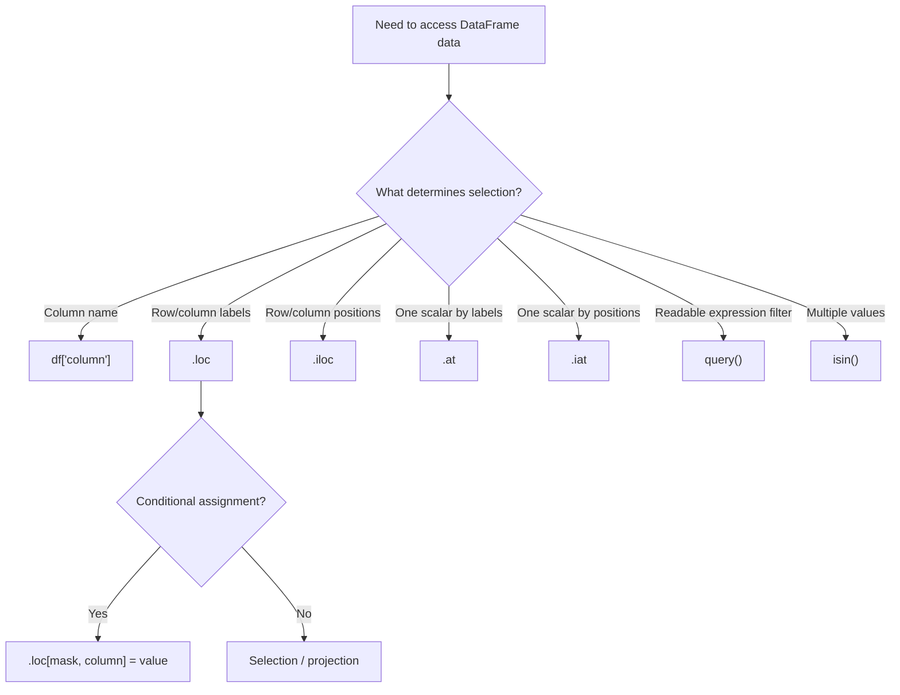

# 11- Indexing And Selection

## Overview

Indexing and selection are the mechanisms through which Pandas identifies specific rows, columns, cells, or subsets of a DataFrame.

The core APIs are:

```text
df["column"]
df.loc[...]
df.iloc[...]
df.at[...]
df.iat[...]
df.query(...)
```

Although these APIs overlap, they represent different selection semantics.

```text
Column label
    ↓
df["column"]

Row / column labels or conditions
    ↓
df.loc[...]

Row / column positions
    ↓
df.iloc[...]

One scalar by labels
    ↓
df.at[...]

One scalar by positions
    ↓
df.iat[...]

Expression-oriented row filtering
    ↓
df.query(...)
```

Understanding these differences is critical because selection determines:

```text
Which records enter a transformation
Which fields enter a downstream payload
Which records are updated
Which data is exposed
Which rows are included in reports
```

Incorrect indexing can therefore become a correctness, security, performance, or reliability problem rather than merely a syntax error.

## Selection Semantics

Pandas supports several fundamentally different ways to identify data.

| Selection concept | Example | Meaning |
|---|---|---|
| Column label | `df["amount"]` | Column named `amount` |
| Row label | `df.loc["ORD-1001"]` | Row with index label |
| Row position | `df.iloc[0]` | First row |
| Scalar label lookup | `df.at["ORD-1001", "amount"]` | One cell by labels |
| Scalar position lookup | `df.iat[0, 2]` | One cell by positions |
| Boolean condition | `df.loc[mask]` | Rows satisfying condition |
| Expression | `df.query("amount > 1000")` | Rows matching expression |

The most important rule is:

```text
Label
    ≠
Position
```

A DataFrame can have index labels that are completely different from row positions.

## DataFrame Index

Every DataFrame has an index.

```python
import pandas as pd

orders = pd.DataFrame(
    {
        "order_id": [
            "ORD-1001",
            "ORD-1002",
            "ORD-1003",
        ],
        "amount": [
            1250.0,
            450.0,
            3200.0,
    }
)
```

The default index is:

```text
0
1
2
```

But the index can be changed:

```python
orders = orders.set_index(
    "order_id"
)
```

Now:

```text
ORD-1001
ORD-1002
ORD-1003
```

are index labels.

This does not change the fact that the physical row positions are:

```text
0
1
2
```

The index provides labels and alignment semantics; it is not automatically a database primary key.

## Index Labels vs Positions

Consider:

```python
orders = pd.DataFrame(
    {
        "order_id": [
            "ORD-1001",
            "ORD-1002",
            "ORD-1003",
        ],
        "amount": [
            1250.0,
            450.0,
            3200.0,
        ],
    },
    index=[
        101,
        205,
        309,
    ],
)
```

Then:

```python
orders.loc[205]
```

means:

```text
Index label 205
```

while:

```python
orders.iloc[1]
```

means:

```text
Second row by position
```

They happen to identify the same record here, but the semantics are different.

After sorting, filtering, or reordering, those distinctions become even more important.

## Column Selection

The simplest indexing operation is selecting a column:

```python
amounts = orders["amount"]
```

This returns a Series.

Multiple columns:

```python
selected = orders[
    [
        "order_id",
        "amount",
    ]
]
```

This returns a DataFrame.

For most ordinary column access, bracket notation is concise and idiomatic.

`.loc` becomes more useful when row and column selection need to be expressed together:

```python
selected = orders.loc[
    orders["amount"].gt(1000),
    [
        "order_id",
        "amount",
    ],
]
```

## Row Selection

Rows can be selected through:

```text
Labels
Positions
Boolean conditions
Slices
```

Examples:

```python
df.loc["ORD-1001"]
```

```python
df.iloc[0]
```

```python
df.loc[
    df["status"].eq("completed")
]
```

```python
df.iloc[:100]
```

The correct API depends on what the requirement actually means.

## `.loc`

`.loc` is the general label-based selector.

The common syntax is:

```python
df.loc[
    row_selector,
    column_selector,
]
```

Examples:

```python
df.loc["ORD-1001"]
```

```python
df.loc[
    ["ORD-1001", "ORD-1003"]
]
```

```python
df.loc[
    df["status"].eq("completed")
]
```

```python
df.loc[
    df["status"].eq("completed"),
    [
        "order_id",
        "amount",
    ],
]
```

`.loc` is generally the best choice for semantic row filtering and conditional assignment.

## `.iloc`

`.iloc` is the general position-based selector.

Examples:

```python
df.iloc[0]
```

```python
df.iloc[:100]
```

```python
df.iloc[[0, 2, 5]]
```

```python
df.iloc[
    :100,
    [0, 2, 3],
]
```

Use `.iloc` when the position itself is the requirement.

For example:

```text
Take the first 100 records in the current in-memory ordering.
```

is positional.

By contrast:

```text
Take completed orders.
```

is semantic and should normally use `.loc`.

## `.at`

`.at` is specialized for one scalar value addressed by labels.

```python
amount = orders.at[
    "ORD-1001",
    "amount",
]
```

It is appropriate when:

```text
One row label
+
One column label
=
One scalar
```

For assignment:

```python
orders.at[
    "ORD-1001",
    "status",
] = "completed"
```

This explicitly mutates one cell.

## `.iat`

`.iat` is specialized for one scalar value addressed by positions.

```python
amount = orders.iat[
    0,
    1,
]
```

For assignment:

```python
orders.iat[
    0,
    1,
] = 1500.0
```

Use `.iat` only when positional semantics are intentional.

## `query()`

`query()` provides expression-oriented filtering:

```python
result = orders.query(
    "amount > 1000"
)
```

Multiple conditions:

```python
result = orders.query(
    """
    status == 'completed'
    and amount > 1000
    """
)
```

Use `query()` when expression syntax improves readability.

For programmatic predicates, explicit boolean masks with `.loc` are often more flexible.

## Comparison of Core Indexing APIs

| API | Row semantics | Column semantics | Typical result | Primary use |
|---|---|---|---|---|
| `df["column"]` | None | Label | Series | Single-column access |
| `df[["a", "b"]]` | None | Labels | DataFrame | Column projection |
| `.loc` | Labels / boolean | Labels / boolean | Series / DataFrame / scalar | General semantic selection |
| `.iloc` | Positions / boolean | Positions / boolean | Series / DataFrame / scalar | General positional selection |
| `.at` | Label | Label | Scalar | One-cell label access |
| `.iat` | Position | Position | Scalar | One-cell positional access |
| `.query()` | Expression | N/A | DataFrame | Expression filtering |

## Selecting Rows and Columns with `.loc`

One of the most useful patterns is:

```python
result = df.loc[
    row_condition,
    column_labels,
]
```

Example:

```python
completed = orders.loc[
    orders["status"].eq("completed"),
    [
        "order_id",
        "customer_id",
        "amount",
    ],
]
```

This creates an explicit processing boundary:

```text
Which rows?
    ↓
Which columns?
    ↓
Downstream operation
```

This can reduce both memory usage and accidental data exposure.

## Boolean Indexing

Boolean indexing uses a boolean Series:

```python
mask = orders["amount"].gt(1000)

high_value = orders.loc[
    mask
]
```

Multiple conditions:

```python
mask = (
    orders["status"].eq("completed")
    & orders["amount"].gt(1000)
    & orders["customer_id"].notna()
)

result = orders.loc[
    mask
]
```

The mask should usually be derived directly from the DataFrame being filtered so that its index aligns naturally.

## Index Alignment

Index alignment is a core Pandas behavior.

Consider:

```python
df = pd.DataFrame(
    {
        "amount": [
            100,
            200,
            300,
        ],
    },
    index=[
        "a",
        "b",
        "c",
    ],
)
```

A derived Series:

```python
threshold_met = df["amount"].gt(
    150
)
```

has:

```text
a → False
b → True
c → True
```

When used with:

```python
df.loc[
    threshold_met
]
```

Pandas associates the mask with the DataFrame through its index.

This is one reason Pandas is different from a simple list-of-lists data structure.

## Misaligned Series

Problems occur when boolean Series originate from unrelated data.

For example:

```python
mask = pd.Series(
    [True, False, True],
    index=["x", "y", "z"],
)
```

while the DataFrame uses:

```text
a
b
c
```

The labels do not correspond.

Do not assume:

```text
True → first row
False → second row
True → third row
```

when using a Series-based indexed selection.

Build masks from the target DataFrame whenever possible:

```python
mask = df["amount"].gt(1000)
```

## Reindexing and Selection

Reindexing changes labels and potentially introduces missing values:

```python
result = df.reindex(
    ["a", "b", "c", "d"]
)
```

This is different from `.loc`:

```python
result = df.loc[
    ["a", "b", "c"]
]
```

`.loc` asks for labels from the existing indexed object.

`reindex()` is designed to conform data to a requested new index and can introduce rows or columns filled with missing values.

This distinction matters in data alignment and ETL logic.

## Missing Labels

When exact labels are required, direct `.loc` selection expects them to be present.

For example:

```python
df.loc[
    ["ORD-1001", "ORD-9999"]
]
```

can fail if `ORD-9999` is absent.

If missing labels are expected and should produce missing rows instead, `reindex()` may be the more appropriate operation:

```python
result = df.reindex(
    [
        "ORD-1001",
        "ORD-9999",
    ]
)
```

The choice depends on the contract:

```text
Missing label = error
```

versus:

```text
Missing label = valid absent value
```

Do not silently convert an exceptional lookup into an absent value without considering business semantics.

## Duplicate Index Labels

Index labels do not have to be unique.

```python
events = pd.DataFrame(
    {
        "event_type": [
            "created",
            "updated",
        ],
    },
    index=[
        "ORD-1001",
        "ORD-1001",
    ],
)
```

Then:

```python
events.loc[
    "ORD-1001"
]
```

returns multiple rows.

This matters because code may assume:

```text
one label
=
one record
```

when the DataFrame does not guarantee that.

Validate uniqueness when required:

```python
if not events.index.is_unique:
    raise ValueError(
        "Expected unique event index."
    )
```

## Duplicate Column Labels

Columns can also be duplicated, which makes label-based selection less precise.

For example:

```text
amount
amount
status
```

A selection by `"amount"` may not represent one unique column.

Production ingestion should generally validate and normalize column names before downstream indexing logic relies on their uniqueness.

## Index as a Business Key

An index can be a convenient representation of a business key:

```python
orders = orders.set_index(
    "order_id"
)
```

This makes:

```python
orders.loc[
    "ORD-1001"
]
```

convenient.

However, the Pandas index is still not equivalent to a database primary key.

Database identity may depend on:

```text
Unique constraints
Composite keys
Foreign keys
Transactions
Durability
Concurrency
```

Pandas only provides in-memory indexing and alignment.

Do not use an index as a substitute for source-system integrity guarantees.

## Resetting the Index

After filtering:

```python
filtered = orders.loc[
    orders["status"].eq("completed")
]
```

the original index labels remain.

If a new sequential index is required:

```python
filtered = (
    orders.loc[
        orders["status"].eq("completed")
    ]
    .reset_index(drop=True)
)
```

Use `drop=True` when the old index is not needed as a column.

Resetting is useful when:

```text
Creating positional output
Exporting records
Building a user-facing table
Preparing a new processing stage
```

Do not reset indexes reflexively. The original labels may carry useful identity or alignment information.

## Selecting by Label Range

`.loc` supports label-based slicing:

```python
subset = df.loc[
    "ORD-1001":"ORD-1005"
]
```

For ordered index labels, the label slice semantics differ from ordinary Python positional slicing.

This is especially relevant for:

```text
DatetimeIndex
Ordered identifiers
Hierarchical indexes
```

Never assume:

```python
df.loc[a:b]
```

and:

```python
df.iloc[a:b]
```

mean the same thing.

## Selecting by Position Range

`.iloc` uses Python-style positional slicing:

```python
subset = df.iloc[
    10:20
]
```

This selects positions:

```text
10 through 19
```

The stop position is exclusive.

The contrast is:

```text
.loc → label semantics
.iloc → positional semantics
```

This difference should be obvious in production code.

## Scalar Access

For one cell by labels:

```python
value = df.at[
    row_label,
    column_label,
]
```

For one cell by positions:

```python
value = df.iat[
    row_position,
    column_position,
]
```

Use these when the result is explicitly one scalar.

Do not use scalar indexing to replace vectorized transformations.

## Scalar Access vs Vectorization

Avoid:

```python
for i in range(len(df)):
    if df.iat[i, 2] > 1000:
        df.iat[i, 3] = "high"
```

Prefer:

```python
df.loc[
    df["amount"].gt(1000),
    "priority",
] = "high"
```

The second approach expresses the complete operation over columns.

This is generally more efficient and much easier to maintain.

## Selecting After Filtering

Selection operations can be composed.

For example:

```python
result = (
    orders
    .loc[
        orders["status"].eq("completed")
    ]
    .iloc[:100]
)
```

This means:

```text
Filter completed records
    ↓
Take first 100 positions from the filtered result
```

By contrast:

```python
result = (
    orders
    .iloc[:100]
    .loc[
        lambda df: df["status"].eq(
            "completed"
        )
    ]
)
```

first limits the source dataset and then filters it.

These are not equivalent.

Order the operations according to the actual business requirement.

## Selection Before Transformation

A common efficient pattern is:

```python
result = (
    orders
    .loc[
        orders["status"].eq("completed"),
        [
            "order_id",
            "customer_id",
            "amount",
        ],
    ]
    .assign(
        tax=lambda df: df["amount"] * 0.18
    )
)
```

The expensive transformation is applied only to the selected working set.

The broader principle is:

```text
Filter
↓
Project
↓
Transform
```

when later operations do not affect filter eligibility.

## Selection and Data Minimization

Column selection is also a security control for downstream data movement.

For example:

```python
customer_report = orders.loc[
    orders["customer_id"].eq(customer_id),
    [
        "order_id",
        "status",
        "amount",
    ],
]
```

This prevents unrelated fields from entering:

```text
API responses
Logs
Reports
Message payloads
Exports
```

It does not replace authorization, but it reduces the data surface.

## Authorization and Selection

Consider a multi-tenant dataset:

```python
tenant_orders = orders.loc[
    orders["tenant_id"].eq(tenant_id)
]
```

Then:

```python
page = tenant_orders.iloc[:100]
```

The correct sequence is:

```text
Semantic authorization boundary
    ↓
Authorized rows
    ↓
Positional pagination / batching
```

Do not use:

```python
orders.iloc[:100]
```

as a substitute for authorization.

Positions have no inherent security meaning.

## SQL Integration

Suppose orders originate in PostgreSQL.

Avoid:

```text
SELECT *
    ↓
Load all rows
    ↓
Pandas filtering
```

when the database can perform the selection.

Prefer:

```python
orders = pd.read_sql_query(
    """
    SELECT
        order_id,
        customer_id,
        status,
        amount,
        created_at
    FROM orders
    WHERE status = %(status)s
      AND created_at >= %(start_time)s
    """,
    connection,
    params={
        "status": "completed",
        "start_time": "2026-01-01",
    },
)
```

Then use Pandas indexing for local processing:

```python
report = orders.loc[
    orders["amount"].gt(1000),
    [
        "order_id",
        "customer_id",
        "amount",
    ],
]
```

This reduces:

```text
Database output
Network transfer
Application memory
Pandas processing
```

## API Integration

For API responses:

```python
events = pd.DataFrame(
    response.json()
)
```

Then narrow the working set:

```python
events = events.loc[
    events["event_type"].isin(
        [
            "order.created",
            "order.updated",
        ]
    ),
    [
        "event_id",
        "order_id",
        "event_type",
        "created_at",
    ],
]
```

If the upstream REST API supports:

```text
Filtering
Field selection
Pagination
Time windows
```

apply those constraints upstream when they reduce transferred data.

## Chunked Processing

Indexing is also useful within chunked processing.

```python
for chunk in pd.read_csv(
    "orders.csv",
    chunksize=100_000,
):
    valid = chunk.loc[
        chunk["status"].eq("completed"),
        [
            "order_id",
            "customer_id",
            "amount",
        ],
    ]

    process(valid)
```

This keeps selection local to each bounded chunk.

Do not confuse:

```text
DataFrame slicing
```

with:

```text
Streaming ingestion
```

`iloc` can partition an already materialized DataFrame, but it does not make a full DataFrame memory-efficient by itself.

## Query vs `.loc`

The choice between:

```python
df.query(
    "status == 'completed' and amount > 1000"
)
```

and:

```python
df.loc[
    (df["status"].eq("completed"))
    & (df["amount"].gt(1000))
]
```

depends on context.

Prefer `query()` when:

```text
The filter reads naturally as an expression
The conditions are local to DataFrame columns
The expression is stable and readable
```

Prefer `.loc` when:

```text
The predicate is programmatically assembled
You need explicit column projection
You need conditional assignment
You use reusable boolean masks
You require ordinary Python expressions
```

Neither should be selected purely because it looks shorter.

## Indexing and Method Chaining

Selection APIs compose naturally with method chaining:

```python
result = (
    orders
    .loc[
        orders["status"].eq("completed"),
        [
            "order_id",
            "amount",
        ],
    ]
    .sort_values(
        "amount",
        ascending=False,
    )
    .head(100)
)
```

This reads as:

```text
Select eligible rows
    ↓
Project required columns
    ↓
Sort
    ↓
Take top 100
```

This is generally a good transformation pipeline because each stage has a single obvious purpose.

Avoid chains that become difficult to inspect. Use intermediate variables when business logic becomes complex.

## Copy Semantics

Selection and ownership are related.

For example:

```python
completed = orders.loc[
    orders["status"].eq("completed")
]
```

If the subset will become an independently transformed object, make that explicit:

```python
completed = orders.loc[
    orders["status"].eq("completed")
].copy()
```

Then:

```python
completed["priority"] = "normal"
```

The point is not to call `.copy()` everywhere.

The point is to answer:

```text
Does this variable represent an independent working dataset?
```

If yes, make ownership explicit.

## Performance Considerations

The main performance characteristics of indexing are usually determined by:

```text
Dataset size
Number of rows selected
Number of columns selected
Data types
Repeated operations
Copies
Source-system filtering
```

The biggest optimization is often to avoid materializing unnecessary data.

Prefer:

```text
SQL/API filter
    ↓
Required columns
    ↓
Pandas selection
```

over:

```text
Entire dataset
    ↓
Pandas discards most of it
```

## Avoid Python Row Loops

This:

```python
for _, row in df.iterrows():
    if row["status"] == "completed":
        ...
```

should generally not be the default selection strategy.

Prefer:

```python
completed = df.loc[
    df["status"].eq("completed")
]
```

The vectorized approach better matches Pandas' column-oriented execution model.

## Avoid Excessive Copies

This pattern:

```python
a = df.loc[mask].copy()
b = a.copy()
c = b.copy()
```

can create unnecessary memory pressure.

For large data:

```text
Original DataFrame
+
Intermediate copies
+
Temporary Series
+
Transformation outputs
```

can increase peak memory substantially.

Copy when independent ownership or a transformation boundary requires it.

## Select Only Required Columns

A common performance and security optimization is:

```python
result = df.loc[
    mask,
    [
        "order_id",
        "customer_id",
        "amount",
    ],
]
```

rather than:

```python
result = df.loc[
    mask
]
```

when downstream code does not need all fields.

This can reduce:

```text
Memory
Serialization
CPU
Accidental data exposure
```

## Large Dataset Strategy

For very large datasets, indexing strategy should be considered as part of the architecture.

```text
Database
    ↓
WHERE + SELECT
    ↓
Bounded dataset
    ↓
Pandas indexing
    ↓
Transformation
```

For file-based processing:

```text
Partitioned / chunked source
    ↓
Read bounded data
    ↓
Filter
    ↓
Project
    ↓
Transform
```

If the dataset is too large for a single Pandas process, consider:

```text
Database execution
Partitioned Parquet
Distributed query engines
Spark
Cloud data warehouses
```

Do not treat advanced indexing syntax as a replacement for architectural scaling.

## Indexing and Parquet

With Parquet-based data lakes:

```text
S3
 ↓
Parquet partitions
 ↓
Required columns
 ↓
Pandas
 ↓
Index / filter
```

read only necessary columns where practical:

```python
orders = pd.read_parquet(
    "s3://analytics/orders/",
    columns=[
        "order_id",
        "customer_id",
        "status",
        "amount",
    ],
)
```

Then:

```python
completed = orders.loc[
    orders["status"].eq("completed")
]
```

The earlier data reduction occurs, the less memory and CPU the local process consumes.

## Indexing and Datetime Data

Indexing becomes especially useful with a `DatetimeIndex`.

```python
events = events.set_index(
    "created_at"
)

daily_events = events.loc[
    "2026-01-01":"2026-01-31"
]
```

However, time-based production systems require explicit handling of:

```text
Timezone
Day boundaries
Inclusive / exclusive windows
Index ordering
Duplicate timestamps
```

For recurring jobs, explicit timestamp predicates may be easier to reason about:

```python
window = events.loc[
    events.index.ge(window_start)
    & events.index.lt(window_end)
]
```

## MultiIndex

Pandas can maintain multiple index levels:

```python
summary = (
    orders
    .set_index(
        [
            "customer_id",
            "status",
        ]
    )
)
```

Selection can then address combinations of labels.

MultiIndex can be useful for:

```text
Hierarchical reports
Time-series structures
Grouped outputs
Multi-dimensional labeling
```

But it also increases cognitive and operational complexity.

For production ETL code, ordinary columns are often easier to understand and integrate with:

```text
SQL
APIs
Parquet
Validation
Schema contracts
```

Use MultiIndex deliberately rather than treating it as the default representation of relational keys.

## Selection and Joins

Selection often precedes joins:

```python
active_orders = orders.loc[
    orders["status"].isin(
        [
            "pending",
            "processing",
        ]
    ),
    [
        "order_id",
        "customer_id",
        "amount",
    ],
]

enriched = active_orders.merge(
    customers,
    on="customer_id",
    how="left",
    validate="many_to_one",
)
```

This pattern reduces the dataset before the potentially expensive join.

The principle is:

```text
Filter / project
    ↓
Join
```

when excluded records do not need to participate in the join.

## Selection and Aggregation

Likewise, filter before aggregation when appropriate:

```python
revenue = (
    orders.loc[
        orders["status"].eq("completed"),
        [
            "customer_id",
            "amount",
        ],
    ]
    .groupby("customer_id")["amount"]
    .sum()
)
```

This can reduce the number of rows and columns entering the aggregation.

Do not filter out records before aggregation when the excluded records are required for the business metric.

Correctness always precedes micro-optimization.

## Reliability Considerations

Selection logic should be deterministic when downstream output must be reproducible.

For example:

```python
batch = (
    orders
    .loc[
        orders["status"].eq("pending")
    ]
    .sort_values(
        [
            "created_at",
            "order_id",
        ],
        kind="stable",
    )
    .iloc[:1000]
)
```

The roles are clear:

```text
.loc
    → eligibility

.sort_values()
    → deterministic ordering

.iloc
    → batch size
```

This is safer than:

```python
orders.iloc[:1000]
```

when batch membership has business consequences.

## Testing Indexing and Selection

Tests should verify semantics rather than just execution.

```python
def test_label_selection() -> None:
    orders = pd.DataFrame(
        {
            "order_id": [
                "ORD-1",
                "ORD-2",
            ],
            "amount": [
                100.0,
                200.0,
            ],
        },
        index=[
            101,
            205,
        ],
    )

    result = orders.loc[
        205,
        "amount",
    ]

    assert result == 200.0
```

Test positional semantics:

```python
def test_position_selection() -> None:
    orders = pd.DataFrame(
        {
            "order_id": [
                "ORD-1",
                "ORD-2",
            ],
        },
        index=[
            101,
            205,
        ],
    )

    result = orders.iloc[
        1
    ]

    assert result["order_id"] == "ORD-2"
```

Also test:

```text
Non-default indexes
Duplicate labels
Missing labels
Empty results
Boolean masks
Column projection
Index preservation
Reset-index behavior
Conditional assignment
Ordering before positional batching
```

## Common Mistakes

### Confusing `.loc` and `.iloc`

Incorrect assumption:

```python
df.loc[0]
```

always means the first row.

It means:

```text
Index label 0
```

The first row by position is:

```python
df.iloc[0]
```

### Using `.iloc` for Business Rules

Avoid:

```python
df.iloc[:100]
```

when the requirement is:

```text
Latest 100 orders
```

Sort by the intended business key first.

### Using `.at` for Multiple Values

`.at` is scalar-oriented.

Use `.loc` for multiple rows or columns.

### Using `.iat` with Business Identifiers

`.iat` requires integer positions.

Use `.at` or `.loc` when working with semantic labels.

### Using `and` or `or`

Incorrect:

```python
df.loc[
    (df["status"] == "completed")
    and (df["amount"] > 1000)
]
```

Correct:

```python
df.loc[
    (df["status"] == "completed")
    & (df["amount"] > 1000)
]
```

### Forgetting Parentheses

Use:

```python
(
    df["status"].eq("completed")
    & df["amount"].gt(1000)
)
```

rather than relying on operator precedence.

### Using `query()` with Untrusted User Input

Do not directly execute arbitrary user-provided filter expressions.

Use validated structured parameters and build explicit predicates.

### Assuming the Index Is a Primary Key

The index does not enforce database-style uniqueness or integrity by default.

Validate identity assumptions explicitly.

### Resetting the Index Unnecessarily

An index may contain useful identity or alignment information.

Do not reset it only because the values are not `0, 1, 2, ...`.

### Filtering After Expensive Transformations

If a transformation is unnecessary for excluded rows, filter first.

### Excessive Scalar Access

Repeated `.at` / `.iat` calls in large loops are usually less appropriate than vectorized operations.

### Logging Full Selected Data

Selection reduces rows but may still expose sensitive columns.

Log counts and non-sensitive diagnostics instead.

## Production Pitfalls

| Pitfall | Why it happens | Better approach |
|---|---|---|
| Label/position confusion | Default index hides semantic distinction | Use `.loc` and `.iloc` intentionally |
| Index treated as primary key | In-memory labels mistaken for DB integrity | Validate uniqueness and business identity |
| Positional batching without sorting | Current order assumed meaningful | Establish deterministic ordering |
| Column positions used in evolving schemas | Layout mistaken for schema contract | Prefer named columns |
| Boolean mask misalignment | External Series used without alignment checks | Build masks from target DataFrame |
| Chained assignment | Selection and mutation combined ambiguously | Use `.loc` assignment |
| Whole DataFrame selected unnecessarily | Projection omitted | Select required columns |
| Full source loaded before filtering | Pandas used instead of source pushdown | Filter in SQL/API/source where practical |
| Excessive `.copy()` calls | Copying used defensively everywhere | Copy only when ownership requires it |
| Scalar loop over large DataFrame | Table treated as list of records | Vectorize or batch |
| Arbitrary query strings | Expression language treated as trusted data | Use validated parameters |
| Missing-label errors ignored | Lookup contract unclear | Decide whether absence is error or valid missingness |

## Interview Traps

### What Is the Difference Between Indexing and Selection?

Indexing is the broader mechanism for addressing labels, positions, or cells. Selection is the act of retrieving a subset using those mechanisms.

### What Is the Difference Between `.loc` and `.iloc`?

`.loc` is primarily label-based; `.iloc` is position-based.

### What Is the Difference Between `.at` and `.loc`?

Both can perform label-based scalar access, but `.at` is specialized for one cell.

### What Is the Difference Between `.iat` and `.iloc`?

Both use integer positions, but `.iat` is specialized for a single scalar cell.

### Does `.loc[0]` Mean the First Row?

No. It means the row whose index label is `0`.

Use `.iloc[0]` for the first row by position.

### Why Does `.iloc` Preserve Non-Default Index Labels?

Selection by position does not replace the DataFrame's labels. The selected rows retain their original index unless the caller explicitly resets it.

### How Do You Select Rows and Columns Together?

```python
df.loc[
    row_condition,
    [
        "column_a",
        "column_b",
    ],
]
```

### How Do You Safely Assign to Rows Matching a Condition?

```python
df.loc[
    condition,
    "status",
] = "processed"
```

### What Is Index Alignment?

Pandas associates indexed objects by labels during many operations. This enables automatic alignment but can cause unexpected behavior if independently created Series have incompatible indexes.

### Why Is a Boolean Series from the Same DataFrame Usually Safer?

Because it naturally shares the DataFrame's index, making the intended row correspondence explicit.

### What Happens with Duplicate Index Labels?

A label can refer to multiple rows, so a lookup expected to identify one record may return multiple records.

### Why Is `.iloc[:100]` Not "Latest 100 Rows"?

It selects the first 100 current positions. "Latest" requires an explicit ordering key such as `created_at`.

### When Should You Use `reindex()` Instead of `.loc`?

Use `reindex()` when conforming data to a requested label set and allowing missing labels to produce missing rows is part of the desired behavior.

### When Should SQL Filtering Be Preferred?

When the source is a database and the predicate can efficiently execute there, especially when it substantially reduces rows or columns transferred into Pandas.

### Does Pandas Indexing Provide Authorization?

No. Indexing and filtering are data-manipulation mechanisms, not access-control systems.

### Why Can Too Much Indexing Hurt Performance?

The main problem is usually not the syntax itself but unnecessary scans, intermediate objects, large copies, and excessive data being materialized before selection.

### When Should MultiIndex Be Used?

Use it when hierarchical indexing materially improves the problem being solved. Avoid it merely because multiple business fields exist.

## Practical Reference

| Requirement | Recommended API |
|---|---|
| One column by name | `df["column"]` |
| Multiple columns by name | `df[["a", "b"]]` |
| Row by label | `df.loc[label]` |
| Rows by labels | `df.loc[labels]` |
| Row by position | `df.iloc[position]` |
| Rows by positions | `df.iloc[positions]` |
| Condition-based rows | `df.loc[mask]` |
| Conditions + columns | `df.loc[mask, columns]` |
| One scalar by labels | `df.at[row_label, column_label]` |
| One scalar by positions | `df.iat[row_position, column_position]` |
| Expression-based filtering | `df.query(expression)` |
| Missing-value filtering | `df.loc[df["column"].isna()]` |
| Non-missing filtering | `df.loc[df["column"].notna()]` |
| Multiple accepted values | `df.loc[df["column"].isin(values)]` |
| Conditional assignment | `df.loc[mask, column] = value` |
| Missing labels should yield rows | `df.reindex(labels)` |
| Positional batch | `df.iloc[start:end]` |
| Deterministic business batch | `df.loc[mask].sort_values(...).iloc[:n]` |
| Independent working subset | `df.loc[mask].copy()` when ownership requires it |

## Recommended Decision Flow



The goal is to make the semantics obvious from the API.

For example:

```text
Business rule
    → .loc

Position
    → .iloc

One labeled cell
    → .at

One positional cell
    → .iat

Expression-oriented filter
    → query()

Membership
    → isin()
```

## Recommended Production Pattern

A production ETL stage can deliberately combine the indexing APIs:

```python
processable_mask = (
    orders["status"].isin(
        [
            "pending",
            "processing",
        ]
    )
    & orders["customer_id"].notna()
    & orders["amount"].ge(0)
)

processable = orders.loc[
    processable_mask,
    [
        "order_id",
        "customer_id",
        "status",
        "amount",
        "created_at",
    ],
].copy()

batch = (
    processable
    .sort_values(
        [
            "created_at",
            "order_id",
        ],
        kind="stable",
    )
    .iloc[:1000]
)
```

Each API has a distinct role:

```text
isin()
    → membership rule

boolean predicates
    → eligibility

.loc
    → semantic row selection + projection

.copy()
    → explicit independent ownership

.sort_values()
    → deterministic ordering

.iloc
    → positional batch boundary
```

This separation improves:

```text
Correctness
Readability
Testing
Performance analysis
Operational debugging
```

## Key Takeaways

- Pandas indexing is fundamentally about **selection semantics**: distinguish column labels, row labels, row positions, scalar access, and boolean conditions rather than treating all indexers as interchangeable.
- Use `.loc` for semantic and condition-based selection, `.iloc` for intentional positional selection, `.at` for one labeled scalar, and `.iat` for one positional scalar.
- Index labels provide in-memory labeling and alignment; they are not automatically database primary keys, authorization boundaries, or guarantees of uniqueness.
- Production pipelines should select and project early, filter at the database or source when practical, establish deterministic ordering before positional batching, and avoid unnecessary scalar loops and DataFrame copies.
- Treat indexing as part of correctness and data-contract design: validate missing labels, duplicate indexes, dtypes, mask alignment, mutation ownership, security boundaries, and schema evolution explicitly.