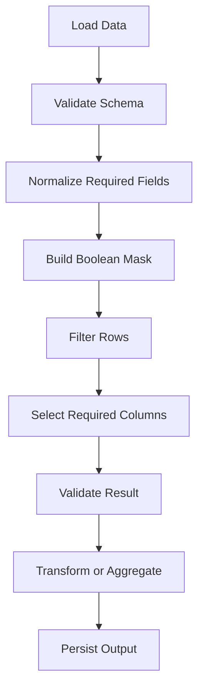

# README

## Overview

The **Selecting and Filtering** section covers how Pandas identifies, extracts, filters, and targets subsets of `Series` and `DataFrame` objects.

These operations form the foundation for almost every Pandas workflow:

```text
Load data
    ↓
Inspect schema
    ↓
Select required columns
    ↓
Filter required rows
    ↓
Set or transform values
    ↓
Continue with cleaning / aggregation / joins
```

## Navigation

| # | File | Description |
|---|---|---|
| 01 | [01- Selecting Columns](./01-%20Selecting%20Columns.md) | Extract one or more DataFrame columns |
| 02 | [02- Selecting Rows](./02-%20Selecting%20Rows.md) | Extract records by index or position |
| 03 | [03- Loc](./03-%20Loc.md) | Perform label-based selection |
| 04 | [04- Iloc](./04-%20Iloc.md) | Perform position-based selection |
| 05 | [05- At And Iat](./05-%20At%20And%20Iat.md) | Perform efficient scalar access |
| 06 | [06- Boolean Filtering](./06-%20Boolean%20Filtering.md) | Filter records with boolean masks |
| 07 | [07- Multiple Conditions](./07-%20Multiple%20Conditions.md) | Combine filtering rules safely |
| 08 | [08- Isin](./08-%20Isin.md) | Filter against a set of allowed values |
| 09 | [09- Query](./09-%20Query.md) | Use expression-based filtering |
| 10 | [10- Filtering Missing Values](./10-%20Filtering%20Missing%20Values.md) | Select records based on nullability |
| 11 | [11- Indexing And Selection](./11-%20Indexing%20And%20Selection.md) | Understand indexing behavior and selection strategy |
| 12 | [12- Setting Values](./12-%20Setting%20Values.md) | Mutate or derive values safely |

In production data-processing systems, selecting and filtering is not merely about syntax. The correctness of a pipeline depends on selecting the intended records, preserving the expected index and schema, handling missing values explicitly, and avoiding accidental mutation.

This section progresses from basic column and row selection to production-oriented filtering, conditional updates, and indexing semantics.

## Why Selecting and Filtering Matters

A typical backend data pipeline might process millions of customer or transaction records but only need a small subset:

```text
Orders
├── order_id
├── customer_id
├── status
├── amount
├── currency
├── created_at
└── payment_method
```

A reporting task might need only:

```python
orders[
    [
        "order_id",
        "customer_id",
        "amount",
    ]
]
```

An ETL validation step might require:

```python
orders.loc[
    orders["amount"].lt(0)
]
```

A business workflow might need:

```python
orders.loc[
    orders["status"].eq("pending"),
    [
        "order_id",
        "customer_id",
        "amount",
    ],
]
```

These operations determine which records enter subsequent processing stages.

Incorrect selection can therefore produce:

```text
Missing records
Extra records
Incorrect reports
Invalid aggregates
Incorrect database writes
Security or tenant-isolation failures
```

## Section Structure

| Topic | Purpose |
|---|---|
| [Selecting Columns](./01-Selecting%20Columns.md) | Extract one or more DataFrame columns |
| [Selecting Rows](./02-Selecting%20Rows.md) | Extract records by index or position |
| [Loc](./03-Loc.md) | Perform label-based selection |
| [Iloc](./04-Iloc.md) | Perform position-based selection |
| [At And Iat](./05-At%20And%20Iat.md) | Perform efficient scalar access |
| [Boolean Filtering](./06-Boolean%20Filtering.md) | Filter records with boolean masks |
| [Multiple Conditions](./07-Multiple%20Conditions.md) | Combine filtering rules safely |
| [Isin](./08-Isin.md) | Filter against a set of allowed values |
| [Query](./09-Query.md) | Use expression-based filtering |
| [Filtering Missing Values](./10-Filtering%20Missing%20Values.md) | Select records based on nullability |
| [Indexing And Selection](./11-Indexing%20And%20Selection.md) | Understand indexing behavior and selection strategy |
| [Setting Values](./12-Setting%20Values.md) | Mutate or derive values safely |

## The Core Selection Model

A DataFrame has two primary axes:

```text
                 Columns
        ┌─────────────────────────┐
Rows    │ order_id │ amount │ ... │
        ├─────────────────────────┤
        │ ORD-001  │ 125.00 │ ... │
        │ ORD-002  │ 900.00 │ ... │
        │ ORD-003  │  50.00 │ ... │
        └─────────────────────────┘
```

Selection generally answers two independent questions:

```text
Which rows?
    ↓
Which columns?
```

For example:

```python
orders.loc[
    orders["amount"].gt(500),
    [
        "order_id",
        "amount",
    ],
]
```

means:

```text
Rows:
    amount > 500

Columns:
    order_id
    amount
```

This mental model is more useful than memorizing individual APIs.

## Selection API Families

Pandas provides several indexing and filtering mechanisms.

| API | Primary semantics | Typical use |
|---|---|---|
| `df["column"]` | Column label | Select one column |
| `df[["a", "b"]]` | Column labels | Select multiple columns |
| `df.loc[...]` | Label-based | Business-rule selection and mutation |
| `df.iloc[...]` | Position-based | Positional slicing |
| `df.at[...]` | Scalar label-based | One cell |
| `df.iat[...]` | Scalar position-based | One cell |
| Boolean mask | True/False selection | Conditional filtering |
| `df.isin(...)` | Membership | Allowed-value filtering |
| `df.query(...)` | Expression-based | Readable filter expressions |

The most important distinction is:

```text
loc  → labels
iloc → positions
```

## Choosing the Correct API

A practical decision process:

```text
Need one column?
    ↓
df["column"]

Need multiple columns?
    ↓
df[["column_a", "column_b"]]

Need rows based on business conditions?
    ↓
df.loc[mask]

Need label-based row/column selection?
    ↓
df.loc[...]

Need positional selection?
    ↓
df.iloc[...]

Need one scalar by label?
    ↓
df.at[...]

Need one scalar by position?
    ↓
df.iat[...]

Need membership filtering?
    ↓
df["column"].isin(values)

Need expression-oriented filtering?
    ↓
df.query(...)
```

## Column Selection

Single-column selection:

```python
amounts = orders["amount"]
```

returns a `Series`.

Multiple-column selection:

```python
result = orders[
    [
        "order_id",
        "amount",
        "status",
    ]
]
```

returns a `DataFrame`.

This distinction matters because downstream APIs behave differently for `Series` and `DataFrame`.

For example:

```python
orders["amount"].mean()
```

operates on a Series, while:

```python
orders[
    [
        "amount",
    ]
].mean()
```

returns a Series containing the result for the selected DataFrame column.

## Row Selection

Rows can be selected using:

```python
orders.iloc[0]
```

or:

```python
orders.loc["ORD-001"]
```

depending on whether the intended semantics are positional or label-based.

For a backend data workflow, label-based selection is usually preferred when the row label has business meaning.

## Label-Based Selection with `loc`

`.loc` is the primary tool for semantic row and column selection.

Example:

```python
high_value_orders = orders.loc[
    orders["amount"].gt(1000),
    [
        "order_id",
        "customer_id",
        "amount",
    ],
]
```

This has an explicit and reviewable contract:

```text
Filter:
    amount > 1000

Project:
    order_id
    customer_id
    amount
```

`.loc` is also the preferred mechanism for conditional assignment:

```python
orders.loc[
    orders["amount"].lt(0),
    "status",
] = "invalid"
```

## Position-Based Selection with `iloc`

`.iloc` works with integer positions.

Examples:

```python
first_order = orders.iloc[0]
```

and:

```python
sample = orders.iloc[
    :100,
    [
        0,
        2,
        4,
    ],
]
```

Positional selection is useful when:

```text
Working with deterministic positional slices
Processing bounded batches
Interacting with arrays where position is intentionally meaningful
```

It is dangerous when used as a substitute for semantic identifiers.

Avoid:

```python
orders.iloc[0]
```

when the application actually means:

```text
Order with ID ORD-001
```

The first row can change after sorting, filtering, concatenation, or ingestion-order changes.

## Scalar Selection with `at` and `iat`

For one cell:

```python
status = orders.at[
    "ORD-001",
    "status",
]
```

For one positional cell:

```python
status = orders.iat[
    0,
    2,
]
```

These APIs are specialized for scalar operations.

Do not replace vectorized DataFrame operations with repeated scalar access.

## Boolean Filtering

Boolean filtering creates a boolean mask:

```python
mask = orders["amount"].gt(1000)
```

For example:

```text
ORD-001 → True
ORD-002 → False
ORD-003 → True
```

The mask can then be applied:

```python
high_value = orders.loc[mask]
```

This pattern is fundamental:

```text
Column expression
    ↓
Boolean Series
    ↓
DataFrame selection
```

## Combining Conditions

Pandas uses bitwise operators for combining boolean Series:

```python
mask = (
    orders["status"].eq("pending")
    & orders["amount"].gt(1000)
)
```

Use:

```text
&  → AND
|  → OR
~  → NOT
```

and parenthesize each comparison.

Correct:

```python
mask = (
    orders["amount"].gt(1000)
    & orders["status"].eq("pending")
)
```

Avoid relying on Python's:

```python
and
or
not
```

for element-wise Series conditions.

## Membership Filtering with `isin`

For a finite set of accepted values:

```python
statuses = {
    "pending",
    "processing",
}

result = orders.loc[
    orders["status"].isin(statuses)
]
```

This is clearer than a long series of equality comparisons:

```python
orders.loc[
    (
        orders["status"].eq("pending")
        | orders["status"].eq("processing")
    )
]
```

`isin()` is particularly useful for:

```text
Status filters
Region allowlists
Product categories
Customer segments
Known IDs
Configuration-driven filters
```

## Expression-Based Filtering with `query`

`query()` can make complex filter expressions more readable:

```python
result = orders.query(
    "status == 'pending' and amount > 1000"
)
```

External variables can be referenced with `@`:

```python
minimum_amount = 1000

result = orders.query(
    "status == 'pending' and amount > @minimum_amount"
)
```

Use `query()` when expression syntax improves readability.

Do not construct arbitrary query expressions directly from untrusted request input.

Instead, validate user-supplied parameters and build filtering logic explicitly.

## Filtering Missing Values

Missing-value filtering should use Pandas null-aware APIs.

Correct:

```python
missing_customer = orders.loc[
    orders["customer_id"].isna()
]
```

Non-missing:

```python
valid_customer = orders.loc[
    orders["customer_id"].notna()
]
```

Do not use:

```python
orders["customer_id"] == None
```

as a general-purpose null check.

Missing values can appear as:

```text
pd.NA
NaN
NaT
None
```

depending on the dtype and data source.

## Missing Does Not Mean Empty

These values are not automatically equivalent:

```text
missing
""
"   "
0
False
```

For example:

```python
orders.loc[
    orders["customer_id"].eq("")
]
```

selects an empty string, not all missing values.

A robust cleaning workflow may need separate rules:

```text
Null detection
    +
Whitespace normalization
    +
Empty-string detection
```

## Index Semantics

The DataFrame index is a labeling and alignment mechanism.

For example:

```python
orders = orders.set_index(
    "order_id"
)
```

Now:

```python
orders.loc["ORD-001"]
```

selects by the `order_id` label.

This can improve semantic selection and alignment.

However, the index is not automatically equivalent to:

```text
Database primary key
Authorization boundary
Distributed lock
Transactional identifier
```

Those guarantees belong to the underlying system.

## Index Alignment

Pandas operations frequently align by index labels.

For example:

```python
status_updates = pd.Series(
    ["completed", "processing"],
    index=[
        "ORD-002",
        "ORD-001",
    ],
)

orders["status"] = status_updates
```

Values are matched by label.

This behavior is powerful for data integration but can produce subtle bugs if developers expect positional assignment.

A production pipeline should make index semantics explicit before joining or assigning data.

## Selection and Mutation

There is an important distinction between:

```text
Selecting data
```

and:

```text
Changing data
```

For selection:

```python
result = orders.loc[
    orders["status"].eq("pending")
]
```

For mutation:

```python
orders.loc[
    orders["status"].eq("pending"),
    "priority",
] = "normal"
```

The mutation version changes the target DataFrame.

When an independent working dataset is required:

```python
pending = orders.loc[
    orders["status"].eq("pending")
].copy()
```

Use `.copy()` based on ownership requirements rather than reflexively copying every selection.

## Selection and Projection

A common ETL pattern combines:

```text
Filter rows
+
Select required columns
```

Example:

```python
report_orders = orders.loc[
    orders["status"].eq("completed"),
    [
        "order_id",
        "customer_id",
        "amount",
        "created_at",
    ],
]
```

This is effectively a DataFrame version of:

```sql
SELECT
    order_id,
    customer_id,
    amount,
    created_at
FROM orders
WHERE status = 'completed';
```

This similarity is useful when moving between SQL and Pandas.

## Push Filtering to the Database When Appropriate

When data originates in PostgreSQL, do not automatically load the complete table into Pandas:

```python
orders = pd.read_sql(
    "SELECT * FROM orders",
    connection,
)
```

and then:

```python
orders = orders.loc[
    orders["status"].eq("completed")
]
```

For large datasets, filtering can often be pushed to SQL:

```python
orders = pd.read_sql(
    """
    SELECT
        order_id,
        customer_id,
        amount,
        created_at
    FROM orders
    WHERE status = %s
    """,
    connection,
    params=["completed"],
)
```

This can reduce:

```text
Network transfer
Database result size
Python memory usage
Pandas processing time
```

The database should execute operations it is well positioned to execute.

## API Data Selection

REST APIs frequently return nested or wide payloads.

After normalization:

```python
events = pd.json_normalize(
    response_data
)
```

select only the fields required for processing:

```python
events = events.loc[
    :,
    [
        "event_id",
        "customer_id",
        "event_type",
        "created_at",
    ],
]
```

This reduces downstream complexity and makes the schema contract explicit.

## Filtering Event Data

A production event-processing workflow might use:

```python
recent_orders = events.loc[
    (
        events["event_type"].eq("order.created")
        & events["created_at"].notna()
    )
]
```

The resulting DataFrame can then move into:

```text
Validation
    ↓
Transformation
    ↓
Aggregation
    ↓
Kafka / database / Parquet
```

Filtering should occur as early as practical when it safely reduces downstream data volume.

## Filtering Before Joins

Filtering before a join can reduce the amount of data participating in the operation.

For example:

```python
recent_orders = orders.loc[
    orders["status"].eq("completed"),
    [
        "order_id",
        "customer_id",
        "amount",
    ],
]

customers_subset = customers.loc[
    :,
    [
        "customer_id",
        "segment",
    ],
]

result = recent_orders.merge(
    customers_subset,
    on="customer_id",
    how="left",
)
```

This is useful when unused records and columns can safely be eliminated before the join.

However, never filter away rows or columns required to preserve business semantics.

## Filtering Before Grouping

The same principle applies before aggregation:

```python
completed = orders.loc[
    orders["status"].eq("completed")
]

revenue = (
    completed
    .groupby("customer_id")["amount"]
    .sum()
)
```

Conceptually:

```text
Raw orders
    ↓
Filter relevant records
    ↓
Group
    ↓
Aggregate
```

This can reduce intermediate data volume and improve clarity.

## Performance Considerations

Selection is often cheaper than materializing unnecessary data, but the exact cost depends on:

```text
DataFrame size
Column count
Dtypes
Mask complexity
Copies created
Downstream operations
```

Useful principles include:

- Select only required columns when practical.
- Filter early when it preserves business semantics.
- Prefer vectorized boolean operations.
- Avoid row-by-row filtering with Python loops.
- Push filtering into SQL when the database is the better execution engine.
- Use chunked processing for datasets that do not fit comfortably in memory.

## Avoid Unnecessary Copies

This can create large intermediate objects:

```python
filtered = orders.loc[
    mask
].copy()

selected = filtered[
    [
        "order_id",
        "amount",
    ]
].copy()
```

Sometimes the copies are justified, especially when independent ownership is required.

But unnecessary copies increase:

```text
Memory consumption
Garbage-collection pressure
Execution time
Peak process memory
```

For large ETL jobs, understand where objects are materialized.

## Chained Selection

Avoid ambiguous patterns such as:

```python
orders[
    orders["status"].eq("pending")
][
    [
        "order_id",
        "amount",
    ]
]
```

This may work for reading, but it is harder to reason about when mutation is involved.

A clearer form is:

```python
orders.loc[
    orders["status"].eq("pending"),
    [
        "order_id",
        "amount",
    ],
]
```

Use `.loc` when row and column selection are performed together.

## Setting Values Safely

For conditional mutation:

```python
orders.loc[
    orders["amount"].lt(0),
    "status",
] = "invalid"
```

This is preferable to chained assignment.

The mutation should clearly define:

```text
Which rows
Which columns
What value
```

This makes code review and testing easier.

## Selection and Data Quality

Selection is frequently used to identify bad records:

```python
invalid = orders.loc[
    orders["amount"].lt(0)
    | orders["currency"].isna()
]
```

A robust validation pipeline can separate:

```text
Valid records
Invalid records
```

rather than silently dropping bad rows.

For example:

```python
valid_mask = (
    orders["amount"].ge(0)
    & orders["currency"].notna()
)

valid_orders = orders.loc[
    valid_mask
]

invalid_orders = orders.loc[
    ~valid_mask
]
```

This pattern is valuable in ETL systems because rejected records can be monitored or quarantined.

## Empty Result Sets

Filtering can legitimately return zero rows:

```python
completed = orders.loc[
    orders["status"].eq("completed")
]
```

An empty result is not necessarily an error.

Downstream code should define whether:

```text
0 records
```

means:

```text
No matching business data
Valid empty batch
Unexpected upstream condition
Pipeline failure
```

Avoid automatically treating every empty DataFrame as an exception.

## Deterministic Selection

Position-based selection depends on ordering.

For example:

```python
orders.iloc[:100]
```

means:

```text
First 100 rows in the current DataFrame order
```

It does not inherently mean:

```text
100 newest orders
```

For deterministic business semantics:

```python
latest_orders = (
    orders
    .sort_values(
        "created_at",
        ascending=False,
    )
    .iloc[:100]
)
```

Even better, define a stable tie-breaker when timestamps can collide:

```python
latest_orders = (
    orders
    .sort_values(
        [
            "created_at",
            "order_id",
        ],
        ascending=[
            False,
            True,
        ],
    )
    .iloc[:100]
)
```

## Security and Authorization

Filtering is not an authorization system.

This is unsafe:

```python
tenant_orders = orders.loc[
    orders["tenant_id"].eq(
        requested_tenant_id
    )
]
```

if `requested_tenant_id` comes directly from an untrusted caller and authorization is not independently enforced.

The application should establish:

```text
Authenticated principal
    ↓
Authorized tenant / resource scope
    ↓
Approved filter
    ↓
Data retrieval
```

For database-backed systems, tenant filtering should generally be enforced at the correct authorization and query boundary rather than relying solely on an in-memory Pandas filter.

## Monitoring and Observability

Production data pipelines should track selection behavior where it matters.

Useful metrics include:

```text
Rows read
Rows selected
Rows rejected
Rows with missing required fields
Rows after validation
Selection percentage
Unexpected empty results
```

Example:

```python
total_rows = len(orders)

selected_rows = len(
    orders.loc[
        orders["status"].eq("completed")
    ]
)

selection_rate = (
    selected_rows / total_rows
    if total_rows
    else 0.0
)
```

A major change in selection rate can indicate:

```text
Source schema change
Upstream outage
Bad filter logic
Unexpected status values
Data quality regression
```

Do not log complete DataFrames when they may contain sensitive or personal data. Prefer counts, schema metadata, and structured diagnostics.

## Testing Selection Logic

Selection logic should be tested as business logic.

Useful cases include:

```text
Matching rows
Non-matching rows
Boundary conditions
Missing values
Unexpected categories
Duplicate records
Empty input
All rows matching
No rows matching
```

Example:

```python
def select_completed_orders(
    orders: pd.DataFrame,
) -> pd.DataFrame:
    return orders.loc[
        orders["status"].eq("completed"),
        [
            "order_id",
            "amount",
        ],
    ]
```

Test the result:

```python
result = select_completed_orders(
    orders
)

assert result["order_id"].tolist() == [
    "ORD-001",
    "ORD-004",
]

assert result.columns.tolist() == [
    "order_id",
    "amount",
]
```

Tests should validate business behavior rather than merely asserting that the code executed.

## Common Mistakes

| Mistake | Problem | Preferred approach |
|---|---|---|
| Using `iloc` for business IDs | Position changes when ordering changes | Use label-based selection or explicit key filtering |
| Using `and` / `or` with Series | Scalar boolean operators do not perform element-wise filtering | Use `&`, `|`, `~` |
| Missing parentheses | Operator precedence can produce invalid logic | Parenthesize each condition |
| Chained assignment | Mutation target becomes ambiguous | Use `.loc` |
| Comparing with `None` | Not a robust null check | Use `isna()` / `notna()` |
| Loading all DB rows before filtering | Excessive memory and network usage | Push safe filters to SQL |
| Treating empty result as failure | Legitimate queries may match zero rows | Define empty-result semantics |
| Assuming index is a database key | Index has different semantics | Enforce database constraints separately |
| Using `.copy()` everywhere | Increased memory consumption | Copy only when ownership requires it |
| Iterating rows to filter | Python-level overhead | Use vectorized boolean masks |
| Filtering after expensive joins | Larger intermediate datasets | Filter early when semantically safe |
| Trusting user-provided filter expressions | Potential security and correctness issues | Validate inputs and use explicit filter logic |

## Interview Reference

### `loc` vs `iloc`

| Characteristic | `loc` | `iloc` |
|---|---|---|
| Selection model | Labels | Integer positions |
| Business-key friendly | Yes | No |
| Boolean filtering | Yes | Limited to positional semantics |
| Column names | Yes | Integer positions |
| Typical backend use | Business filters, mutation | Positional slices |
| Main risk | Incorrect labels | Incorrect assumptions about row order |

### `at` vs `iat`

| Characteristic | `at` | `iat` |
|---|---|---|
| Purpose | Scalar access | Scalar access |
| Row addressing | Label | Position |
| Column addressing | Label | Position |
| Typical use | One known record | One known position |

### `isin` vs `query`

| Requirement | Preferred tool |
|---|---|
| Membership in finite values | `isin()` |
| Simple readable expression | `query()` |
| Complex application logic | Explicit boolean masks |
| Dynamic user-controlled filters | Validated application logic |
| Very large DB-backed dataset | Push filtering into SQL when possible |

## Production Selection Workflow

A robust Pandas selection stage often looks like:



The important separation is:

```text
Schema validation
    ↓
Filtering
    ↓
Projection
    ↓
Validation
    ↓
Downstream processing
```

This prevents selection code from becoming an unstructured collection of ad hoc expressions.

## Recommended Engineering Pattern

For reusable pipeline code:

```python
import pandas as pd


def select_completed_orders(
    orders: pd.DataFrame,
) -> pd.DataFrame:
    required_columns = {
        "order_id",
        "customer_id",
        "status",
        "amount",
    }

    missing = required_columns.difference(
        orders.columns
    )

    if missing:
        raise ValueError(
            f"Missing required columns: {sorted(missing)}"
        )

    mask = (
        orders["status"].eq("completed")
        & orders["customer_id"].notna()
        & orders["amount"].ge(0)
    )

    return orders.loc[
        mask,
        [
            "order_id",
            "customer_id",
            "amount",
        ],
    ].copy()
```

This design provides:

```text
Explicit schema requirements
    ↓
Explicit business filter
    ↓
Explicit output projection
    ↓
Independent result ownership
```

The function is deterministic, testable, and easy to incorporate into a larger ETL pipeline.

## Practical Mental Model

When working with Pandas selection, think in this order:

```text
What records do I need?
        ↓
What columns do I need?
        ↓
Should selection use labels or positions?
        ↓
Are missing values meaningful?
        ↓
Should filtering happen in Pandas or upstream?
        ↓
Will the result be mutated?
        ↓
Do I need an independent copy?
        ↓
What should happen if zero rows match?
        ↓
How will I validate and monitor the result?
```

This approach prevents API memorization from replacing engineering reasoning.

## Key Takeaways

- Treat selection as two separate concerns: **which rows** and **which columns**, with `.loc` as the primary tool for semantic and conditional selection.
- Use `loc` for labels and business rules, `iloc` for intentional positional operations, and `at`/`iat` for genuinely scalar access.
- Build filters with vectorized boolean expressions, `isin()`, null-aware methods, and explicit parentheses; avoid row loops and ambiguous chained assignment.
- For production pipelines, filter and project as early as safely possible, push work into SQL when the database is the appropriate execution layer, and explicitly handle empty results, missing data, schema changes, and memory usage.
- Selection logic is business logic: validate it with tests, monitor record-selection rates, and never treat an in-memory Pandas filter as an authorization, transaction, or concurrency boundary.