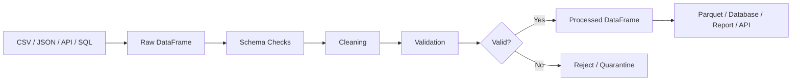
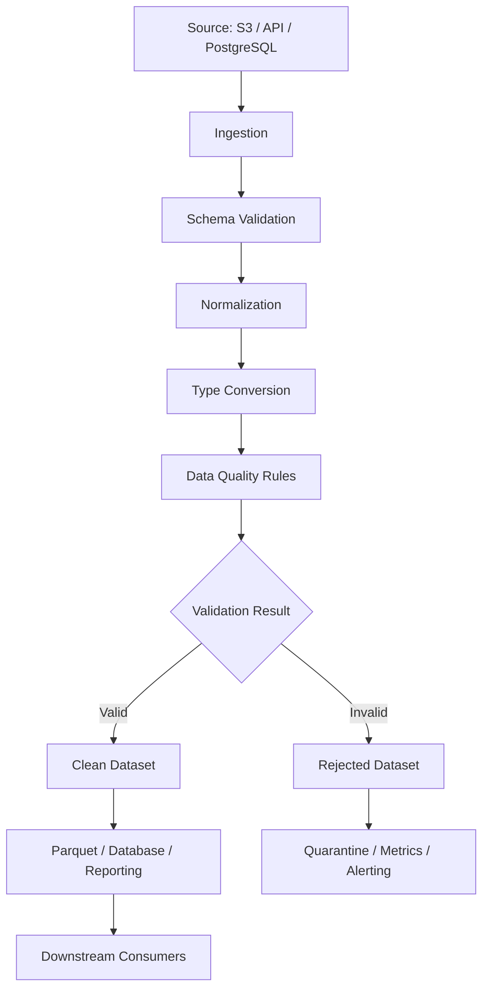

# README

## Overview

The **Data Cleaning** section covers the processes required to turn inconsistent, incomplete, duplicated, incorrectly typed, and invalid raw data into a reliable dataset suitable for transformation, analysis, reporting, and downstream systems.

Data cleaning is not simply the removal of nulls or duplicates. In production systems, it is a controlled data-quality process:

```text
Raw Data
   ↓
Schema Validation
   ↓
Type Validation
   ↓
Missing-Value Analysis
   ↓
Duplicate Detection
   ↓
Value Normalization
   ↓
Invalid-Value Detection
   ↓
Business Rule Validation
   ↓
Clean Dataset
   ↓
Transformation / Aggregation / Persistence
```

The goal is not to make every dataset perfectly uniform. The goal is to establish and enforce explicit data-quality rules appropriate for the downstream consumer.

This section builds from general data-quality reasoning to concrete Pandas techniques for handling missing values, duplicates, inconsistent values, type errors, strings, datetimes, numeric fields, outliers, and validation rules.

## Why Data Cleaning Matters

Most production data does not arrive in a perfectly normalized form.

Typical inputs can contain:

```text
Missing customer IDs
Duplicated transactions
Invalid dates
Negative financial amounts
Inconsistent status values
Unexpected whitespace
Wrong numeric types
Malformed API fields
Invalid enum values
Timezone inconsistencies
```

For example, the same business status may appear as:

```text
"completed"
"Completed"
" COMPLETE "
"done"
"closed"
```

These are technically different values but may represent the same or related business states.

Without explicit cleaning, downstream operations become unreliable:

```text
Incorrect groupby results
Incorrect joins
Wrong reports
Failed database writes
Broken validation
Unexpected API behavior
Incorrect financial calculations
```

## Data Cleaning as a Pipeline Boundary

A useful architecture separates raw input from cleaned output:



The important principle is:

> Do not silently convert invalid data into apparently valid data without defining the business rule that justifies the conversion.

For example, replacing a missing `customer_id` with `"UNKNOWN"` may make a column look complete while creating incorrect relationships.

## Section Structure

| Topic | Purpose |
|---|---|
| [Data Quality](./01-Data%20Quality.md) | Establish data-quality concepts, dimensions, and cleaning strategy |
| [Missing Values](./02-Missing%20Values.md) | Understand and manage incomplete data |
| [Isna And Notna](./03-Isna%20And%20Notna.md) | Detect missing values reliably |
| [Fillna](./04-Fillna.md) | Replace missing values using explicit rules |
| [Dropna](./05-Dropna.md) | Remove records or columns based on missingness |
| [Duplicate Data](./06-Duplicate%20Data.md) | Detect duplicate records and understand their impact |
| [Drop Duplicates](./07-Drop%20Duplicates.md) | Remove duplicates using deterministic rules |
| [Inconsistent Values](./08-Inconsistent%20Values.md) | Normalize inconsistent categorical and textual values |
| [Type Conversion](./09-Type%20Conversion.md) | Convert raw values into appropriate Pandas dtypes |
| [Numeric Cleaning](./10-Numeric%20Cleaning.md) | Clean malformed and invalid numeric data |
| [String Cleaning](./11-String%20Cleaning.md) | Normalize text and string-based fields |
| [Datetime Cleaning](./12-Datetime%20Cleaning.md) | Parse, normalize, and validate timestamps and dates |
| [Outlier Handling](./13-Outlier%20Handling.md) | Detect and handle anomalous values appropriately |
| [Validation Rules](./14-Validation%20Rules.md) | Encode business and structural quality checks |

## Data Quality Dimensions

Data quality should be evaluated against explicit dimensions.

| Dimension | Question | Example |
|---|---|---|
| Completeness | Are required values present? | `customer_id` cannot be missing |
| Validity | Do values satisfy expected rules? | `amount >= 0` |
| Accuracy | Does the data represent reality? | Correct customer email |
| Consistency | Do related fields agree? | `completed_at` exists when status is completed |
| Uniqueness | Are duplicate records present? | Unique `order_id` |
| Timeliness | Is the data sufficiently current? | Events arrive within expected delay |
| Integrity | Are relationships preserved? | Order references an existing customer |
| Conformity | Does data match the defined format? | ISO timestamp format |

Pandas can directly help with many structural and conformance checks.

Accuracy and business truth often require external systems or domain-specific validation.

## Cleaning vs Validation

These concepts are related but should not be treated as identical.

### Cleaning

Cleaning changes representation or values according to an approved rule.

Example:

```python
customers["email"] = (
    customers["email"]
    .astype("string")
    .str.strip()
    .str.lower()
)
```

### Validation

Validation determines whether data satisfies a rule.

Example:

```python
valid_email = (
    customers["email"].notna()
    & customers["email"].str.contains(
        "@",
        regex=False,
    )
)
```

A useful mental model is:

```text
Cleaning
    → make data conform to an expected representation

Validation
    → determine whether the resulting data is acceptable
```

Some pipelines should intentionally retain invalid records for quarantine rather than correcting them automatically.

## Raw, Cleaned, and Rejected Data

A production ETL pipeline should distinguish between:

```text
Raw
    → source representation

Cleaned
    → transformed into the required representation

Rejected
    → records that fail non-recoverable validation rules
```

This improves:

```text
Traceability
Debugging
Replayability
Auditing
Data-quality monitoring
```

For example:

```text
S3 raw/
    orders_2026-09-10.json

S3 processed/
    orders_2026-09-10.parquet

S3 rejected/
    orders_2026-09-10_invalid.parquet
```

Do not destroy raw inputs merely because the cleaned dataset is available.

## Schema-First Cleaning

Before changing values, establish the expected schema.

Example:

```python
import pandas as pd

expected_columns = {
    "order_id",
    "customer_id",
    "status",
    "amount",
    "created_at",
}

missing_columns = expected_columns.difference(
    orders.columns
)

if missing_columns:
    raise ValueError(
        f"Missing columns: {sorted(missing_columns)}"
    )
```

Schema validation should happen before downstream transformations that assume those columns exist.

A schema contract may define:

```text
order_id        → string, required, unique
customer_id     → string, required
status          → controlled vocabulary
amount          → non-negative numeric
created_at      → timezone-aware datetime
```

## Data Cleaning Workflow

A reliable workflow often follows this order:

```text
1. Preserve raw input
2. Validate required schema
3. Normalize obvious representations
4. Normalize dtypes
5. Detect missing values
6. Detect duplicates
7. Validate domain values
8. Validate cross-column constraints
9. Separate valid and rejected records
10. Persist cleaned output
```

The exact order can change depending on the source.

For example, type conversion may need to occur before numeric range validation.

## Typical Cleaning Pattern

A reusable pipeline can look like:

```python
import pandas as pd


def clean_orders(
    orders: pd.DataFrame,
) -> pd.DataFrame:
    result = orders.copy()

    result["order_id"] = (
        result["order_id"]
        .astype("string")
        .str.strip()
    )

    result["status"] = (
        result["status"]
        .astype("string")
        .str.strip()
        .str.lower()
    )

    result["amount"] = pd.to_numeric(
        result["amount"],
        errors="coerce",
    )

    result["created_at"] = pd.to_datetime(
        result["created_at"],
        errors="coerce",
        utc=True,
    )

    result = result.drop_duplicates(
        subset=["order_id"],
        keep="last",
    )

    return result
```

This function performs representation cleanup but does not necessarily establish that every record is valid.

Validation should remain explicit.

## Missing Values

Missing values are one of the most important data-quality concerns.

Do not treat all missingness as equivalent.

A missing value may mean:

```text
Unknown
Not provided
Not applicable
Not yet calculated
Temporarily unavailable
Invalid source value
```

For example, a missing `shipped_at` may be perfectly valid for an order that has not shipped yet.

The correct treatment depends on business semantics.

## Detecting Missing Values

Use:

```python
orders["customer_id"].isna()
```

or:

```python
orders["customer_id"].notna()
```

For a complete DataFrame:

```python
missing_counts = orders.isna().sum()
```

This produces a column-level missing-value profile.

A useful report is:

```python
missing_report = (
    orders.isna()
    .mean()
    .sort_values(ascending=False)
)
```

This expresses missingness as a fraction of rows.

## Missing-Value Policy

A production pipeline should explicitly define policies for important fields.

| Field | Missing allowed? | Typical action |
|---|---|---|
| `order_id` | No | Reject |
| `customer_id` | Usually no | Reject or quarantine |
| `status` | No | Reject or apply trusted default |
| `amount` | Usually no | Reject |
| `description` | Often yes | Preserve missing |
| `shipped_at` | Depends on state | Allow for unshipped orders |
| `discount_code` | Yes | Preserve missing |
| `currency` | Depends on contract | Infer only when authoritative |

Never choose a fill strategy solely because it removes nulls.

## Missing Data and Statistics

Missing values affect aggregation.

For example:

```python
orders["amount"].mean()
```

typically excludes missing observations under Pandas' default aggregation behavior.

This can be useful, but the resulting statistic may represent:

```text
Mean of available values
```

rather than:

```text
Mean across all expected records
```

Production reporting should make the denominator and missing-value policy explicit.

## Duplicates

Duplicate data can originate from:

```text
API retries
At-least-once message delivery
Database joins
File concatenation
Manual exports
Pipeline retries
Upstream defects
```

A duplicate is not automatically an error.

For example:

```text
Two identical event payloads
```

may be duplicates.

But:

```text
Two legitimate transactions with the same customer and amount
```

are not necessarily duplicates.

Define the business key before deduplicating.

## Business Keys vs Entire-Row Equality

These are different concepts.

Entire-row duplicate detection:

```python
orders.duplicated()
```

Business-key duplicate detection:

```python
orders.duplicated(
    subset=["order_id"]
)
```

The second is generally more important when a domain defines a unique identifier.

For transactional data, consider:

```text
order_id
event_id
transaction_id
external_reference
```

rather than comparing every field.

## Deduplication Strategy

Deduplication requires an explicit retention rule.

Example:

```python
orders = (
    orders
    .sort_values("updated_at")
    .drop_duplicates(
        subset=["order_id"],
        keep="last",
    )
)
```

This encodes:

```text
Sort by update time
    ↓
Group by business key
    ↓
Keep most recent record
```

Without deterministic ordering, `keep="last"` means last in the current DataFrame order, not necessarily the most recent business record.

## Inconsistent Categorical Values

Controlled vocabularies should be normalized before validation.

Example:

```python
orders["status"] = (
    orders["status"]
    .astype("string")
    .str.strip()
    .str.lower()
)
```

Then validate:

```python
allowed_statuses = {
    "pending",
    "processing",
    "completed",
    "cancelled",
}

invalid_status = ~orders[
    "status"
].isin(allowed_statuses)
```

Do not silently map unknown states to an arbitrary valid state.

An unexpected `"refunded"` status may indicate a legitimate new business state rather than a typo.

## Mapping Legacy Values

When the mapping is explicitly defined:

```python
status_mapping = {
    "done": "completed",
    "complete": "completed",
    "in progress": "processing",
}

orders["status"] = (
    orders["status"]
    .replace(status_mapping)
)
```

After normalization, validate the remaining values.

This creates an important pattern:

```text
Normalize known variants
    ↓
Validate resulting vocabulary
    ↓
Reject unknown values
```

## Whitespace Normalization

Whitespace can create invisible inconsistencies.

Example:

```python
customers["email"] = (
    customers["email"]
    .astype("string")
    .str.strip()
    .str.lower()
)
```

For names:

```python
customers["name"] = (
    customers["name"]
    .astype("string")
    .str.strip()
)
```

Avoid aggressive transformations that change legitimate business content.

For example, removing all internal whitespace from a human name could corrupt data.

## Numeric Cleaning

External systems commonly represent numbers as:

```text
"123.45"
"1,234.56"
"$1,234.56"
""
None
"not available"
```

A controlled cleaning process may first remove known formatting:

```python
amount = (
    orders["amount"]
    .astype("string")
    .str.replace(
        ",",
        "",
        regex=False,
    )
    .str.replace(
        "$",
        "",
        regex=False,
    )
)

orders["amount"] = pd.to_numeric(
    amount,
    errors="coerce",
)
```

Then validate:

```python
invalid_amount = (
    orders["amount"].isna()
    | orders["amount"].lt(0)
)
```

Do not assume that every non-numeric value should become zero.

## Financial Data

Financial values deserve stricter treatment.

Consider whether the pipeline needs:

```text
Decimal semantics
Currency normalization
Scale / precision validation
Rounding policy
Negative-value rules
Exchange-rate provenance
```

Pandas can process monetary data, but the authoritative financial model may belong in a database or domain service.

Do not silently round financial data just to make values fit a report.

## Type Conversion

Raw data often arrives with inferred or inconsistent dtypes.

Explicit conversion improves predictability.

Examples:

```python
orders["quantity"] = pd.to_numeric(
    orders["quantity"],
    errors="coerce",
)
```

```python
orders["created_at"] = pd.to_datetime(
    orders["created_at"],
    errors="coerce",
    utc=True,
)
```

```python
orders["customer_id"] = (
    orders["customer_id"]
    .astype("string")
)
```

Type normalization should happen before business validation that depends on those types.

## Nullable Dtypes

Pandas provides nullable dtypes such as:

```text
Int64
boolean
string
```

These are often useful when the dataset contains both valid values and missing values.

For example:

```python
orders["quantity"] = (
    pd.to_numeric(
        orders["quantity"],
        errors="coerce",
    )
    .astype("Int64")
)
```

This is preferable to designing a pipeline around accidental dtype coercion.

## Datetime Cleaning

Timestamps are particularly error-prone because of:

```text
Different formats
Timezone offsets
Naive timestamps
Invalid values
Day/month ambiguity
Mixed timezone data
```

A common normalization pattern is:

```python
orders["created_at"] = pd.to_datetime(
    orders["created_at"],
    errors="coerce",
    utc=True,
)
```

This establishes a timezone-aware UTC representation.

Always understand the source timezone before interpreting naive timestamps.

A timestamp without timezone information is not automatically UTC.

## Date Validation

After parsing:

```python
invalid_dates = orders.loc[
    orders["created_at"].isna()
]
```

You may also enforce domain rules:

```python
future_orders = orders.loc[
    orders["created_at"]
    > pd.Timestamp.now(tz="UTC")
]
```

Whether future timestamps are invalid depends on the data source and business context.

## Cross-Column Validation

Some quality rules cannot be evaluated from one column.

Example:

```text
status = completed
→ completed_at must exist
```

Implementation:

```python
invalid_completion = (
    orders["status"].eq("completed")
    & orders["completed_at"].isna()
)
```

Another example:

```text
shipped_at must not be before created_at
```

```python
invalid_timeline = (
    orders["shipped_at"].notna()
    & orders["created_at"].notna()
    & orders["shipped_at"].lt(
        orders["created_at"]
    )
)
```

These are often more valuable than simple null checks because they validate business invariants.

## Data Quality Rules

A data-quality rule should be explicit and testable.

Example:

```python
quality_rules = {
    "order_id_required": orders[
        "order_id"
    ].notna(),
    "amount_non_negative": orders[
        "amount"
    ].ge(0),
    "status_valid": orders[
        "status"
    ].isin(
        {
            "pending",
            "processing",
            "completed",
            "cancelled",
        }
    ),
}
```

A combined validation mask can then be created:

```python
valid_mask = (
    quality_rules["order_id_required"]
    & quality_rules["amount_non_negative"]
    & quality_rules["status_valid"]
)
```

This makes the rules inspectable and testable.

## Rejecting Invalid Records

A robust pipeline may split the dataset:

```python
valid_orders = orders.loc[
    valid_mask
].copy()

rejected_orders = orders.loc[
    ~valid_mask
].copy()
```

This is often preferable to immediately dropping invalid records because rejected data can be:

```text
Stored
Counted
Inspected
Retried
Corrected
Reprocessed
```

For production systems, add rejection reasons.

## Rejection Reasons

Instead of a single boolean:

```python
rejected = orders.loc[
    ~valid_mask
].copy()
```

create explicit quality flags:

```python
rejected["rejection_reason"] = np.select(
    [
        orders["order_id"].isna(),
        orders["amount"].lt(0),
        ~orders["status"].isin(allowed_statuses),
    ],
    [
        "missing_order_id",
        "negative_amount",
        "invalid_status",
    ],
    default="unknown_validation_failure",
)
```

For records that can fail multiple independent rules, separate boolean columns may be better:

```text
invalid_order_id
invalid_amount
invalid_status
invalid_timeline
```

This improves diagnostics.

## Outliers

An outlier is an unusually large or small value, but an outlier is not automatically invalid.

For transaction data:

```text
₹500,000 transaction
```

may be:

```text
A legitimate enterprise purchase
A duplicate
A corrupted amount
A fraudulent transaction
```

Do not delete outliers solely because they are statistically uncommon.

Outlier detection should distinguish:

```text
Statistically unusual
```

from:

```text
Business-invalid
```

The appropriate action may be:

```text
Flag
Investigate
Route to manual review
Keep unchanged
Reject
```

## Cleaning Strategy by Data Source

Different sources require different controls.

| Source | Typical issues | Cleaning focus |
|---|---|---|
| CSV | Types, delimiters, encodings, missing fields | Parsing and schema validation |
| JSON API | Missing keys, nested structures, inconsistent representations | Normalization and schema checks |
| PostgreSQL | Query semantics, nullability, timezone behavior | Query contracts and dtype normalization |
| Excel | Formatting, merged cells, implicit types | Explicit parsing and validation |
| Parquet | Schema evolution, nullable types | Schema compatibility |
| Kafka events | Duplicates, ordering, retries | Idempotency and event validation |
| User input | Untrusted and inconsistent values | Validation and security |

## SQL Integration

Cleaning is often most effective when responsibility is split correctly.

For example:

```text
PostgreSQL
    → filtering
    → joins
    → constraints
    → transactional updates

Pandas
    → in-memory transformation
    → normalization
    → reporting
    → batch processing
```

Do not pull enormous volumes into Pandas simply because the next operation is a DataFrame operation.

Where SQL can safely and efficiently enforce constraints, use the database.

## API Integration

API responses should be considered untrusted input even when they come from internal services.

Example workflow:

```text
REST API / gRPC
    ↓
Schema validation
    ↓
Normalization
    ↓
Type conversion
    ↓
Business validation
    ↓
Pandas processing
```

Do not assume internal APIs are immune to schema drift.

Track:

```text
Unknown fields
Missing required fields
Unexpected enum values
Malformed timestamps
Unexpected nulls
```

## Parquet and Schema Preservation

Parquet is useful for cleaned datasets because it preserves typed columns more reliably than many text formats.

A typical workflow:

```python
cleaned_orders.to_parquet(
    "processed/orders.parquet",
    index=False,
)
```

Parquet is often a better intermediate storage format than repeatedly writing CSV because it supports typed columns and efficient columnar access.

When publishing datasets, define schema compatibility expectations.

## Large Dataset Cleaning

Pandas is in-memory, so cleaning strategy must account for dataset size.

For large files:

```python
for chunk in pd.read_csv(
    "orders.csv",
    chunksize=100_000,
):
    chunk["status"] = (
        chunk["status"]
        .astype("string")
        .str.strip()
        .str.lower()
    )

    process_clean_chunk(chunk)
```

The pipeline becomes:

```text
Read bounded chunk
    ↓
Clean
    ↓
Validate
    ↓
Persist
    ↓
Release memory
    ↓
Read next chunk
```

Avoid concatenating every processed chunk back into one enormous DataFrame unless the resulting object fits comfortably in memory.

## Cleaning and Distributed Processing

When data size exceeds practical Pandas limits, alternatives may include:

```text
SQL / PostgreSQL
AWS Athena
AWS Glue
Spark
PySpark
DuckDB
Polars
Data warehouse
```

The appropriate choice depends on:

```text
Dataset size
Transformation complexity
Latency requirements
Team expertise
Infrastructure cost
Operational requirements
```

Pandas remains highly effective for bounded datasets and many batch workloads.

## Memory Considerations

Cleaning can increase memory usage because operations may materialize intermediate Series or DataFrames.

For example:

```python
cleaned = (
    orders[
        [
            "order_id",
            "status",
            "amount",
        ]
    ]
    .copy()
)
```

The explicit copy may be justified, but it is still a memory allocation.

Monitor large pipelines with:

```python
memory_usage = (
    cleaned
    .memory_usage(deep=True)
    .sum()
)
```

Consider:

```text
Selecting only required columns
Using appropriate dtypes
Processing in chunks
Avoiding unnecessary copies
Writing intermediate results to Parquet
```

## Cleaning Functions and Separation of Concerns

Avoid placing every operation in one giant function:

```python
def clean_everything(df):
    ...
```

Prefer separable responsibilities:

```python
def normalize_strings(df):
    ...

def normalize_types(df):
    ...

def remove_duplicates(df):
    ...

def validate_orders(df):
    ...
```

Then compose them:

```python
def clean_orders(df):
    result = df.copy()
    result = normalize_strings(result)
    result = normalize_types(result)
    result = remove_duplicates(result)
    return result
```

This improves:

```text
Testability
Maintainability
Debugging
Reuse
Code review
```

## Reproducibility

Cleaning should be deterministic whenever possible.

Given the same input and configuration:

```text
Same raw dataset
+
Same cleaning rules
+
Same reference data
=
Same cleaned output
```

Avoid depending on:

```text
Current time
Random values
Unstable row ordering
External mutable state
```

unless those dependencies are intentionally part of the processing contract.

## Configuration-Driven Cleaning

Rules such as allowed statuses should not always be hardcoded.

For example:

```yaml
allowed_statuses:
  - pending
  - processing
  - completed
  - cancelled

minimum_order_amount: 0
```

The Python layer can load and validate this configuration.

This makes deployments more manageable when business rules change independently of implementation.

Do not allow configuration to bypass security or schema validation.

## Monitoring Data Quality

Production pipelines should expose measurable quality metrics.

Useful metrics include:

```text
Input row count
Cleaned row count
Rejected row count
Duplicate row count
Missing required-field count
Invalid-type count
Invalid-enum count
Outlier count
Processing duration
Output row count
```

For example:

```python
metrics = {
    "input_rows": len(orders),
    "output_rows": len(valid_orders),
    "rejected_rows": len(rejected_orders),
}
```

These metrics can be exported to systems such as:

```text
Prometheus
CloudWatch
Datadog
OpenTelemetry-based pipelines
```

A sudden increase in rejection rate may indicate an upstream schema or data-quality regression.

## Alerting

Not every quality issue should trigger the same response.

A useful classification is:

| Condition | Typical response |
|---|---|
| Missing optional field | Metric only |
| Small increase in invalid records | Warning |
| Large rejection-rate increase | Alert |
| Missing required column | Fail pipeline |
| Schema-breaking change | Stop ingestion |
| Financial integrity violation | High-priority alert |
| Unexpected new enum value | Review / quarantine |

Quality thresholds should reflect business impact.

## Security Considerations

Data cleaning often processes sensitive information.

Potentially sensitive fields include:

```text
Names
Emails
Phone numbers
Addresses
Financial records
Customer identifiers
Authentication metadata
```

Avoid logging raw records indiscriminately:

```python
logger.info(
    "Invalid rows: %s",
    invalid_orders,
)
```

Prefer structured diagnostics:

```python
logger.warning(
    "Order validation failed",
    extra={
        "invalid_count": len(invalid_orders),
        "dataset": "orders",
    },
)
```

Redact or hash sensitive identifiers when operational debugging requires record correlation.

Data cleaning should also enforce input validation before values become query parameters, file paths, SQL fragments, or external requests.

## Failure Handling

Cleaning failures should distinguish between:

```text
Bad record
```

and:

```text
Pipeline failure
```

For example:

```text
One malformed order
    → reject record

Missing required input column
    → fail pipeline

Cannot read source file
    → fail pipeline

Unexpected schema version
    → fail or quarantine batch
```

Do not catch broad exceptions and continue silently:

```python
try:
    clean_orders(df)
except Exception:
    pass
```

This converts observable failures into silent data corruption.

## Testing Data Cleaning

Tests should cover both normal and malformed inputs.

Important scenarios include:

```text
Missing required columns
Missing required values
Unexpected enum values
Wrong dtypes
Whitespace
Case differences
Duplicates
Invalid numbers
Invalid timestamps
Boundary values
Cross-column inconsistencies
Empty DataFrames
All-invalid batches
Mixed-validity batches
```

Example:

```python
def test_normalizes_status() -> None:
    orders = pd.DataFrame(
        {
            "status": [
                " Pending ",
                "COMPLETED",
            ]
        }
    )

    result = (
        orders["status"]
        .astype("string")
        .str.strip()
        .str.lower()
    )

    assert result.tolist() == [
        "pending",
        "completed",
    ]
```

The test verifies transformation behavior rather than merely checking that no exception occurred.

## Testing Validation Rules

Example:

```python
def test_negative_amount_is_invalid() -> None:
    orders = pd.DataFrame(
        {
            "amount": [
                100.0,
                -1.0,
            ]
        }
    )

    valid = orders["amount"].ge(0)

    assert valid.tolist() == [
        True,
        False,
    ]
```

For DataFrame outputs, use Pandas testing helpers when structure and dtype are important:

```python
from pandas.testing import assert_frame_equal

assert_frame_equal(
    actual,
    expected,
    check_dtype=True,
)
```

## Idempotency

Cleaning functions should ideally be idempotent.

For example:

```python
def normalize_status(
    orders: pd.DataFrame,
) -> pd.DataFrame:
    result = orders.copy()

    result["status"] = (
        result["status"]
        .astype("string")
        .str.strip()
        .str.lower()
    )

    return result
```

Running this transformation twice should not progressively damage the value.

A useful property is:

```text
clean(clean(data)) == clean(data)
```

where equality is interpreted according to the dataset's ordering and schema contract.

Idempotency matters for:

```text
Retries
Backfills
Celery jobs
Kubernetes jobs
Scheduled ETL
Incremental processing
```

## Data Lineage

A cleaned record should remain traceable to its source where the system requires lineage.

Possible metadata includes:

```text
source_file
source_system
ingestion_time
batch_id
schema_version
pipeline_version
```

For example:

```python
orders["source_batch_id"] = batch_id
```

Lineage can make production debugging dramatically easier:

```text
Incorrect report
    ↓
Incorrect cleaned record
    ↓
Cleaning batch
    ↓
Raw source
```

Do not store excessive operational metadata inside business tables without a clear schema strategy.

## Recovery and Disaster Handling

Raw data preservation supports recovery.

A resilient ETL architecture often stores:

```text
Immutable raw input
    ↓
Versioned cleaning code
    ↓
Versioned configuration
    ↓
Processed output
```

This makes it possible to replay a failed or incorrectly transformed batch.

For AWS-based systems, a common pattern is:

```text
S3 raw
    ↓
ECS / Kubernetes / Glue / Batch
    ↓
Pandas processing
    ↓
S3 processed Parquet
    ↓
Athena / warehouse / reporting
```

The exact platform is less important than preserving replayability and clear stage boundaries.

## Production Checklist

Before considering a cleaning stage production-ready, verify:

- Required columns are validated.
- Data types are normalized intentionally.
- Missing-value semantics are documented.
- Duplicate keys are defined explicitly.
- Known representation variants are normalized.
- Unknown values are rejected or quarantined.
- Business invariants are checked.
- Invalid records are observable.
- Cleaning is deterministic where possible.
- Processing is safe to retry.
- Raw input is preserved when replayability matters.
- Sensitive data is not unnecessarily logged.
- Large datasets are processed within memory constraints.
- Output schema is validated before persistence.
- Automated tests cover malformed and boundary cases.
- Monitoring captures input, output, rejection, and quality metrics.

## Common Production Pitfalls

| Pitfall | Why it is dangerous | Better approach |
|---|---|---|
| Filling every null | Creates false data | Define field-specific missing semantics |
| Dropping every duplicate | Can delete legitimate transactions | Define business keys |
| Converting invalid numbers to zero | Hides bad data | Use coercion plus validation |
| Treating outliers as errors | Legitimate high-value records may be lost | Flag and investigate |
| Lowercasing all text | May corrupt case-sensitive data | Normalize only fields where appropriate |
| Assuming naive timestamps are UTC | Can shift events by hours | Confirm source timezone |
| Silently accepting unknown enum values | Upstream changes become invisible | Quarantine or fail according to contract |
| Mutating input DataFrames unpredictably | Creates hidden side effects | Define ownership and return contracts |
| Loading all raw data into memory | Can crash workers | Filter upstream or process in chunks |
| Logging invalid records | Can expose sensitive information | Log structured quality metrics |
| Catching all exceptions | Hides real pipeline failures | Handle expected failures explicitly |
| Making cleaning dependent on current time | Makes retries non-deterministic | Inject explicit processing timestamps |
| Cleaning without validation | Produces data that looks cleaner but is still wrong | Separate normalization from validation |
| Dropping rejected rows without metrics | Makes data loss invisible | Track and persist rejection statistics |

## Interview Reference

### What Is Data Cleaning?

Data cleaning is the controlled normalization and correction of data representations and values so the resulting dataset satisfies an explicit downstream quality contract.

It includes:

```text
Missing-value handling
Type normalization
Duplicate handling
Value normalization
Invalid-value detection
Business-rule validation
```

### Is Removing Nulls Always Correct?

No. Missingness can have valid business meaning.

### Should Duplicates Always Be Removed?

No. Define the business key and determine whether repeated records represent duplicates, retries, or legitimate transactions.

### What Is the Difference Between Cleaning and Validation?

Cleaning changes data according to known rules. Validation determines whether the resulting data satisfies the required contract.

### Why Use `errors="coerce"` with Numeric or Datetime Conversion?

It converts invalid representations into missing values, allowing the pipeline to identify malformed records explicitly.

It should be combined with validation rather than used to silently discard errors.

### Why Is `drop_duplicates()` Not Enough?

Because deduplication needs a business key and usually a deterministic retention rule.

For example:

```python
(
    orders
    .sort_values("updated_at")
    .drop_duplicates(
        subset=["order_id"],
        keep="last",
    )
)
```

### How Should Invalid Records Be Handled?

Depending on business requirements:

```text
Reject
Quarantine
Flag
Route to manual review
Correct using authoritative mappings
```

The important requirement is that the decision is observable and explicit.

### Should Cleaning Happen in Pandas or SQL?

Use the system that is best positioned for the operation.

SQL is often preferable for:

```text
Large-scale filtering
Joins
Constraints
Database-native updates
```

Pandas is often preferable for:

```text
In-memory transformations
Batch processing
Reporting
Complex DataFrame operations
File/API normalization
```

### Why Is Idempotency Important?

Retryable jobs may execute the same cleaning logic more than once. Idempotent transformations avoid progressively changing already-cleaned data.

### How Do You Handle a New Unexpected Status?

Do not automatically map it to `"unknown"` or another valid state unless that is a defined business rule.

Prefer:

```text
Detect
Measure
Quarantine or fail
Investigate
Update the schema contract
```

### How Do You Clean Very Large CSV Files?

Use techniques such as:

```text
Source-side filtering
Required-column projection
Chunked reads
Appropriate dtypes
Incremental writes
Parquet
```

If the workload exceeds Pandas' practical memory limits, move the processing to a more appropriate execution engine.

## Practical Architecture

A production-oriented Pandas cleaning service can be structured as:



This architecture separates:

```text
Representation cleanup
        from
Business validation
        from
Persistence
        from
Operational monitoring
```

That separation becomes increasingly important as datasets and pipeline ownership grow.

## Recommended Engineering Pattern

A clean production implementation should expose explicit stages:

```python
import pandas as pd


def normalize_orders(
    orders: pd.DataFrame,
) -> pd.DataFrame:
    result = orders.copy()

    result["order_id"] = (
        result["order_id"]
        .astype("string")
        .str.strip()
    )

    result["status"] = (
        result["status"]
        .astype("string")
        .str.strip()
        .str.lower()
    )

    result["amount"] = pd.to_numeric(
        result["amount"],
        errors="coerce",
    )

    result["created_at"] = pd.to_datetime(
        result["created_at"],
        errors="coerce",
        utc=True,
    )

    return result


def validate_orders(
    orders: pd.DataFrame,
) -> pd.Series:
    allowed_statuses = {
        "pending",
        "processing",
        "completed",
        "cancelled",
    }

    return (
        orders["order_id"].notna()
        & orders["amount"].notna()
        & orders["amount"].ge(0)
        & orders["status"].isin(
            allowed_statuses
        )
        & orders["created_at"].notna()
    )


def split_valid_orders(
    orders: pd.DataFrame,
) -> tuple[
    pd.DataFrame,
    pd.DataFrame,
]:
    valid_mask = validate_orders(
        orders
    )

    valid = orders.loc[
        valid_mask
    ].copy()

    rejected = orders.loc[
        ~valid_mask
    ].copy()

    return valid, rejected
```

The overall flow becomes:

```python
normalized = normalize_orders(raw_orders)

valid_orders, rejected_orders = (
    split_valid_orders(normalized)
)
```

This design makes each responsibility independently testable:

```text
Normalization
    ↓
Validation
    ↓
Classification
    ↓
Persistence
```

## Section Progression

The topics in this section should be studied in this order:

```text
Data Quality
    ↓
Missing Values
    ↓
Isna / Notna
    ↓
Fillna / Dropna
    ↓
Duplicate Detection
    ↓
Duplicate Removal
    ↓
Value Normalization
    ↓
Type Conversion
    ↓
Numeric Cleaning
    ↓
String Cleaning
    ↓
Datetime Cleaning
    ↓
Outlier Handling
    ↓
Validation Rules
```

The progression moves from identifying quality problems to implementing reusable controls.

## Key Takeaways

- Data cleaning is a **data-quality pipeline**, not simply null removal; separate normalization, validation, rejection, and persistence responsibilities.
- Define explicit contracts for required fields, dtypes, uniqueness, controlled vocabularies, missing-value semantics, and cross-column business rules before modifying data.
- Preserve raw data, make cleaning deterministic and retry-safe where possible, and quarantine invalid records rather than silently deleting or inventing values.
- Treat performance and operational quality as part of cleaning: filter early, use appropriate dtypes, process large datasets in chunks when necessary, and monitor input, output, rejection, and quality metrics.
- Production-grade cleaning must be testable, observable, security-aware, and integrated correctly with SQL, APIs, Parquet, batch processing, and downstream persistence systems.