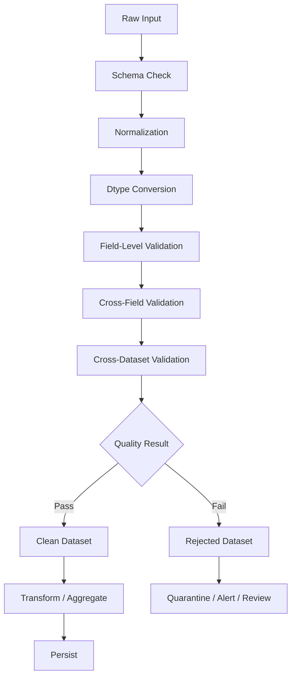

# 01- Data Quality

## Overview

Data quality is the discipline of determining whether data is complete, valid, consistent, unique, timely, and suitable for its intended use.

In Pandas workflows, data quality sits between ingestion and downstream processing:

```text
CSV / JSON / API / SQL / Parquet
                ↓
            Ingestion
                ↓
         Schema Validation
                ↓
        Data Normalization
                ↓
        Data Quality Checks
                ↓
       ┌────────┴────────┐
       ↓                 ↓
   Valid Data       Invalid Data
       ↓                 ↓
 Transformation     Quarantine / Reject
       ↓                 ↓
   Persistence       Monitoring
```

The objective is not to make data look clean. The objective is to establish a reliable contract between the input dataset and its downstream consumers.

For backend and data-engineering systems, this means answering questions such as:

```text
Are required columns present?
Are required values populated?
Are dtypes correct?
Are identifiers unique?
Are categorical values valid?
Are dates parseable?
Are numeric values within valid ranges?
Do related columns satisfy business rules?
Can invalid records be identified and recovered?
```

Data cleaning and data quality are closely related but not identical:

```text
Cleaning
    → changes data into an expected representation

Validation
    → determines whether the resulting data is acceptable

Quality monitoring
    → measures whether quality remains within operational expectations
```

## Why Data Quality Matters

A DataFrame can be syntactically valid while being operationally wrong.

For example:

```python
orders = pd.DataFrame(
    {
        "order_id": ["1001", "1002"],
        "amount": ["100.00", "-50.00"],
        "status": ["completed", "complete"],
    }
)
```

The DataFrame exists successfully, but it contains several quality concerns:

```text
amount → string instead of numeric
amount → negative value
status → inconsistent representation
```

If this dataset is used directly for reporting:

```python
orders["amount"].sum()
```

the result may not behave as intended.

If it is joined:

```python
orders.merge(
    customers,
    on="customer_id",
)
```

missing or malformed identifiers can create incomplete relationships.

If it is written to PostgreSQL, validation may happen too late and fail at the persistence boundary.

Poor data quality propagates:

```text
Source defect
    ↓
Cleaning defect
    ↓
Transformation defect
    ↓
Reporting defect
    ↓
Business decision defect
```

The earlier the defect is detected, the cheaper it generally is to diagnose and correct.

## Data Quality Dimensions

Data quality is multidimensional.

| Dimension | Definition | Example |
|---|---|---|
| Completeness | Required information is present | `order_id` is not missing |
| Validity | Values satisfy defined constraints | `amount >= 0` |
| Consistency | Related values agree | Completed orders have completion timestamps |
| Uniqueness | Values expected to be unique are unique | `order_id` occurs once |
| Accuracy | Data represents the intended real-world value | Correct customer address |
| Timeliness | Data is sufficiently current | Event arrives within expected SLA |
| Conformity | Data follows the required format | Valid ISO timestamp |
| Integrity | Relationships between entities are preserved | Every order references a valid customer |

Pandas is particularly useful for structural validation, conformity checks, uniqueness checks, and many business-rule validations.

Accuracy and timeliness often require external systems, source-of-truth comparisons, or operational metadata.

## Data Quality Contract

A useful production approach is to define an explicit contract for each dataset.

For an orders dataset:

| Field | Type | Required | Constraint |
|---|---|---:|---|
| `order_id` | `string` | Yes | Unique and non-empty |
| `customer_id` | `string` | Yes | Must reference a customer |
| `status` | `string` | Yes | Controlled vocabulary |
| `amount` | numeric | Yes | `>= 0` |
| `currency` | `string` | Yes | Supported currency |
| `created_at` | datetime | Yes | Valid timestamp |
| `completed_at` | datetime | No | Required when status is completed |

This turns vague statements such as:

```text
"The data should be clean."
```

into testable rules.

## Schema Validation

The first quality check should usually be structural.

```python
required_columns = {
    "order_id",
    "customer_id",
    "status",
    "amount",
    "currency",
    "created_at",
}

missing_columns = required_columns.difference(
    orders.columns
)

if missing_columns:
    raise ValueError(
        f"Missing required columns: "
        f"{sorted(missing_columns)}"
    )
```

This prevents downstream code from failing unpredictably.

Schema validation should happen before logic that assumes the presence of required columns.

### Exact vs Minimum Schema

Not every pipeline should require an exact column set.

A dataset contract can be:

```text
Minimum schema
    → required columns must exist
```

or:

```text
Exact schema
    → required columns must exist and unexpected columns are rejected
```

or:

```text
Compatible schema
    → required columns plus explicitly tolerated additions
```

The correct choice depends on the interface contract.

Strict schemas are useful for tightly controlled pipelines. More permissive schemas can reduce unnecessary breakage when upstream systems evolve compatibly.

## Dtype Validation

Column names alone do not define a usable schema.

For example:

```python
orders["amount"].dtype
```

may indicate that numeric data was loaded as `object` or `string`.

Normalize explicitly:

```python
orders["amount"] = pd.to_numeric(
    orders["amount"],
    errors="coerce",
)
```

For identifiers:

```python
orders["order_id"] = (
    orders["order_id"]
    .astype("string")
    .str.strip()
)
```

For timestamps:

```python
orders["created_at"] = pd.to_datetime(
    orders["created_at"],
    errors="coerce",
    utc=True,
)
```

Type normalization should occur before rules that depend on the resulting type.

## Type Correctness vs Value Correctness

These are different checks.

Consider:

```text
amount = "-100"
```

Before conversion:

```text
Representation problem
→ string instead of numeric
```

After conversion:

```text
Value problem
→ negative amount
```

A useful validation sequence is:

```text
Raw representation
    ↓
Type normalization
    ↓
Structural validation
    ↓
Business validation
```

Do not stop after successfully converting the dtype.

## Missing Values

Missingness is a quality concern only when the field has an expectation around completeness.

For example:

```python
missing_customer_ids = orders[
    "customer_id"
].isna()
```

But a missing `completed_at` may be valid when:

```text
status != completed
```

Therefore, avoid simplistic rules such as:

```python
orders.notna().all()
```

for the entire dataset.

Instead, define field-specific expectations.

## Required Fields

For required identifiers:

```python
valid_order_id = (
    orders["order_id"].notna()
    & orders["order_id"].ne("")
)
```

For required numeric fields:

```python
valid_amount = orders[
    "amount"
].notna()
```

For required timestamps:

```python
valid_created_at = orders[
    "created_at"
].notna()
```

Combine these into a quality mask:

```python
valid_required_fields = (
    valid_order_id
    & valid_amount
    & valid_created_at
)
```

## Empty Strings and Whitespace

These values are different from nulls:

```text
None
pd.NA
NaN
""
"   "
```

For text fields, normalize first:

```python
orders["customer_id"] = (
    orders["customer_id"]
    .astype("string")
    .str.strip()
)
```

Then validate:

```python
valid_customer_id = (
    orders["customer_id"].notna()
    & orders["customer_id"].ne("")
)
```

Without normalization, strings containing only whitespace may incorrectly pass a non-null check.

## Null, Zero, and False Are Different

Do not replace or classify these as equivalent:

```text
missing
0
False
""
```

For example:

```python
amount.isna()
```

means something different from:

```python
amount.eq(0)
```

and:

```python
enabled.eq(False)
```

Quality rules should reflect actual business semantics.

## Uniqueness

If a field is required to be unique:

```python
duplicate_order_ids = orders[
    orders["order_id"].duplicated(
        keep=False
    )
]
```

A simpler validation condition:

```python
unique_order_ids = (
    orders["order_id"].is_unique
)
```

Use `duplicated()` when you need the actual offending rows.

Uniqueness constraints often apply to business keys such as:

```text
order_id
transaction_id
event_id
invoice_number
external_reference
```

Do not assume that every repeated value indicates a bad record.

## Duplicate Records vs Duplicate Keys

Two records can share the same business key but still represent different states.

For example:

```text
order_id = 1001
status = processing

order_id = 1001
status = completed
```

These are not necessarily duplicate events.

The correct handling depends on the source model.

Possible interpretations include:

```text
Duplicate record
Latest-state record
Event history
Retry
Versioned record
```

Quality rules must understand the source semantics.

## Controlled Vocabularies

Categorical fields should usually have an explicit allowed set.

```python
allowed_statuses = {
    "pending",
    "processing",
    "completed",
    "cancelled",
}

valid_status = orders[
    "status"
].isin(allowed_statuses)
```

Invalid values:

```python
invalid_status = orders.loc[
    ~valid_status
]
```

This is especially important for:

```text
Statuses
Regions
Payment methods
Event types
Customer segments
Currency codes
Environment identifiers
```

Do not automatically convert unknown values to a catch-all state unless the contract defines that behavior.

## Normalize Before Validating

Source systems may contain representation differences:

```text
"Completed"
" completed "
"COMPLETED"
```

Normalize:

```python
orders["status"] = (
    orders["status"]
    .astype("string")
    .str.strip()
    .str.lower()
)
```

Then validate:

```python
invalid_status = ~orders[
    "status"
].isin(allowed_statuses)
```

The sequence is:

```text
Normalize known representation differences
                    ↓
Validate against the canonical domain
```

This avoids rejecting known equivalent representations while still detecting unknown states.

## Range Validation

Numeric values often have domain constraints.

Example:

```python
valid_amount = orders[
    "amount"
].ge(0)
```

For a percentage:

```python
valid_discount = orders[
    "discount_pct"
].between(
    0,
    100,
)
```

For quantity:

```python
valid_quantity = orders[
    "quantity"
].gt(0)
```

Range constraints should come from the business domain, not arbitrary statistical assumptions.

## Cross-Column Validation

Some of the most important rules involve multiple fields.

Example:

```text
Completed order
→ completed_at must exist
```

```python
invalid_completion = (
    orders["status"].eq("completed")
    & orders["completed_at"].isna()
)
```

Another rule:

```text
completed_at >= created_at
```

```python
invalid_timeline = (
    orders["created_at"].notna()
    & orders["completed_at"].notna()
    & orders["completed_at"].lt(
        orders["created_at"]
    )
)
```

These rules catch inconsistencies that single-column validation cannot detect.

## Referential Integrity

When one dataset references another, validate the relationship.

For example:

```text
orders.customer_id
        ↓
customers.customer_id
```

A basic membership check:

```python
known_customers = set(
    customers["customer_id"]
    .dropna()
)

valid_customer_reference = (
    orders["customer_id"]
    .isin(known_customers)
)
```

For large datasets, consider whether the validation should happen in SQL instead.

A relational database can often enforce referential integrity more reliably with foreign keys.

## Data Quality Rules as Boolean Masks

A practical pattern is to represent each rule as a boolean Series.

```python
allowed_statuses = {
    "pending",
    "processing",
    "completed",
    "cancelled",
}

rules = {
    "order_id_present": orders[
        "order_id"
    ].notna(),
    "customer_id_present": orders[
        "customer_id"
    ].notna(),
    "amount_valid": orders[
        "amount"
    ].ge(0),
    "status_valid": orders[
        "status"
    ].isin(allowed_statuses),
    "created_at_present": orders[
        "created_at"
    ].notna(),
}
```

A complete validity mask:

```python
valid_mask = (
    rules["order_id_present"]
    & rules["customer_id_present"]
    & rules["amount_valid"]
    & rules["status_valid"]
    & rules["created_at_present"]
)
```

This approach makes the validation model inspectable and testable.

## Row-Level vs Dataset-Level Rules

Not all quality rules operate on individual rows.

### Row-Level Rule

```text
amount >= 0
```

```python
orders["amount"].ge(0)
```

### Dataset-Level Rule

```text
order_id must be unique
```

```python
orders["order_id"].is_unique
```

### Cross-Dataset Rule

```text
customer_id must exist in customers
```

```python
orders["customer_id"].isin(
    customers["customer_id"]
)
```

A robust validation framework should distinguish these categories.

## Validation Results

Rather than returning only:

```python
True
False
```

production pipelines often need diagnostic information.

For example:

```python
quality_report = {
    "input_rows": len(orders),
    "missing_order_id": int(
        orders["order_id"].isna().sum()
    ),
    "negative_amount": int(
        orders["amount"].lt(0).sum()
    ),
    "invalid_status": int(
        (~orders["status"].isin(
            allowed_statuses
        )).sum()
    ),
}
```

This provides observability without exposing complete records.

## Row-Level Rejection Reasons

When invalid records are retained for investigation, create explicit reasons.

```python
import numpy as np

orders["rejection_reason"] = np.select(
    [
        orders["order_id"].isna(),
        orders["amount"].lt(0),
        ~orders["status"].isin(allowed_statuses),
    ],
    [
        "missing_order_id",
        "negative_amount",
        "invalid_status",
    ],
    default="",
)
```

This is useful when one primary reason is sufficient.

When multiple violations must be preserved, use separate quality flags:

```python
orders["invalid_order_id"] = (
    orders["order_id"].isna()
)

orders["invalid_amount"] = (
    orders["amount"].lt(0)
)

orders["invalid_status"] = (
    ~orders["status"].isin(
        allowed_statuses
    )
)
```

Separate flags provide richer diagnostics.

## Valid and Rejected Datasets

After validation:

```python
valid_orders = orders.loc[
    valid_mask
].copy()

rejected_orders = orders.loc[
    ~valid_mask
].copy()
```

This creates two explicit processing paths:

```text
Valid records
    ↓
Business transformation
    ↓
Persistence

Rejected records
    ↓
Quarantine
    ↓
Diagnostics
    ↓
Correction / replay
```

Do not simply do:

```python
orders = orders.loc[valid_mask]
```

and discard evidence of the rejected records when operational traceability matters.

## Cleaning vs Rejection

A quality pipeline should decide whether a defect is:

```text
Recoverable normalization
```

or:

```text
Non-recoverable validation failure
```

Examples:

| Input problem | Typical handling |
|---|---|
| Leading/trailing whitespace | Normalize |
| Status casing | Normalize |
| Known legacy status | Map using explicit rule |
| Missing required ID | Reject |
| Malformed timestamp | Reject or quarantine |
| Unknown status | Reject or quarantine |
| Negative amount | Reject unless domain allows it |
| Optional description missing | Preserve |
| Duplicate retry event | Deduplicate according to event semantics |

The key is to avoid treating every anomaly as a correction opportunity.

## Data Quality Pipeline

A robust pipeline can be organized as:



This structure prevents validation logic from being scattered throughout unrelated transformation code.

## Data Quality in ETL

Consider an e-commerce pipeline:

```text
S3 / API
    ↓
Raw orders
    ↓
Schema validation
    ↓
Type normalization
    ↓
Missing-value checks
    ↓
Duplicate checks
    ↓
Business-rule validation
    ↓
Valid orders
    ↓
Revenue aggregation
    ↓
Parquet / PostgreSQL
```

Rejected records should be preserved independently where replay and troubleshooting matter.

A common AWS architecture is:

```text
S3 raw bucket
    ↓
Batch worker / ECS / EKS / Glue
    ↓
Pandas validation and cleaning
    ├── valid → S3 processed
    └── invalid → S3 quarantine
```

The same design works without AWS using local files, PostgreSQL, or other object storage.

## Database Integration

Data quality responsibilities should be divided between Pandas and the database.

PostgreSQL is generally the stronger enforcement layer for:

```text
NOT NULL
UNIQUE
PRIMARY KEY
FOREIGN KEY
CHECK constraints
Transactions
Concurrency
Durability
```

Pandas is useful for:

```text
Batch normalization
External file cleanup
API response processing
Reporting transformations
Pre-ingestion validation
Data profiling
```

A production pipeline may use both:

```text
Pandas validation
    +
PostgreSQL constraints
```

Neither should be treated as a replacement for the other.

## SQL Pushdown

Do not process unnecessary database rows in Pandas.

Instead of:

```python
orders = pd.read_sql(
    "SELECT * FROM orders",
    connection,
)

orders = orders.loc[
    orders["status"].eq("completed")
]
```

prefer source-side filtering where appropriate:

```python
orders = pd.read_sql(
    """
    SELECT
        order_id,
        customer_id,
        amount,
        created_at
    FROM orders
    WHERE status = %s
    """,
    connection,
    params=["completed"],
)
```

This reduces:

```text
Database result size
Network traffic
Python memory consumption
Pandas processing cost
```

Push work to the system best positioned to perform it.

## API Data Quality

API responses are external inputs even when the API is internal.

Typical problems include:

```text
Missing fields
Unexpected nulls
New enum values
Malformed timestamps
Schema evolution
Wrong numeric representations
Unexpected nested structures
```

A robust workflow is:

```text
HTTP response
    ↓
Schema validation
    ↓
Normalization
    ↓
Type conversion
    ↓
Business validation
    ↓
Pandas processing
```

Do not let malformed API data reach downstream systems merely because the response was HTTP `200`.

## Data Quality and Kafka

Event-driven systems often have additional concerns:

```text
At-least-once delivery
Duplicate events
Out-of-order events
Schema evolution
Replay
Consumer retries
```

Pandas can validate a batch of events:

```python
valid_events = (
    events["event_id"].notna()
    & events["event_type"].isin(
        allowed_event_types
    )
)
```

But exactly-once semantics, ordering guarantees, and durable offsets belong to the messaging architecture, not the DataFrame.

## Idempotency

Cleaning operations should be safe to retry whenever possible.

For example:

```python
orders["status"] = (
    orders["status"]
    .astype("string")
    .str.strip()
    .str.lower()
)
```

is naturally idempotent.

Running it repeatedly does not progressively change valid values.

By contrast:

```python
orders["retry_count"] = (
    orders["retry_count"] + 1
)
```

is not idempotent.

This matters for:

```text
Celery tasks
Kubernetes Jobs
Scheduled ETL
Backfills
Batch retries
Event replay
```

A retry should not create different business results unless the operation intentionally depends on execution count.

## Data Quality and Observability

Production quality systems should measure data-quality behavior.

Recommended metrics include:

```text
Input rows
Valid rows
Rejected rows
Duplicate rows
Missing required values
Invalid enum values
Invalid numeric values
Invalid timestamps
Referential-integrity failures
Processing duration
Quality failure rate
```

For example:

```python
metrics = {
    "input_rows": len(orders),
    "valid_rows": int(valid_mask.sum()),
    "rejected_rows": int((~valid_mask).sum()),
}
```

A useful metric is rejection rate:

```python
rejection_rate = (
    metrics["rejected_rows"]
    / metrics["input_rows"]
    if metrics["input_rows"]
    else 0.0
)
```

Large deviations from historical behavior can indicate:

```text
Upstream deployment
Schema drift
Source outage
Business-rule change
Data corruption
```

## Quality Thresholds

Not every defect should stop a pipeline.

For example:

| Condition | Possible response |
|---|---|
| Optional field missing | Metric |
| Small increase in malformed records | Warning |
| Rejection rate exceeds threshold | Alert |
| Required column missing | Fail |
| Unknown schema version | Fail or quarantine |
| Major referential-integrity failure | Stop downstream publication |
| Financial integrity violation | Escalate immediately |

Thresholds should reflect business impact, not arbitrary percentages.

## Schema Drift

Upstream systems change.

A new field:

```text
customer_segment
```

may be harmless.

A renamed field:

```text
customer_id → client_id
```

may break the pipeline.

An enum change:

```text
completed → fulfilled
```

may silently alter reporting.

Monitor for:

```text
Missing expected columns
Unexpected columns
Dtype changes
New categorical values
Changes in missingness
Changes in row volume
```

Schema compatibility should be treated as an operational concern.

## Statistical Profiling

For exploratory data-quality analysis:

```python
orders.describe(
    include="all"
)
```

can reveal unexpected distributions.

Additional checks:

```python
orders["status"].value_counts(
    dropna=False
)
```

and:

```python
orders["amount"].quantile(
    [0.01, 0.5, 0.99]
)
```

These are useful for identifying anomalies.

However, descriptive statistics are not substitutes for business validation.

A value being statistically unusual does not mean it is invalid.

## Outliers and Data Quality

Consider:

```python
orders["amount"].gt(100_000)
```

A large transaction could be:

```text
Valid enterprise order
Duplicate record
Corrupted value
Fraudulent activity
```

The correct quality process may be:

```text
Detect
    ↓
Flag
    ↓
Investigate
```

rather than:

```text
Detect
    ↓
Delete
```

Outlier treatment belongs to the business domain.

## Quality Gates

A data-quality gate is a point where downstream processing is allowed only if defined quality requirements pass.

For example:

```python
if rejection_rate > 0.10:
    raise RuntimeError(
        "Order batch exceeded the rejection threshold."
    )
```

A more complete pipeline might distinguish:

```text
Hard failures
    → stop pipeline

Soft failures
    → continue with alert

Warnings
    → continue and observe
```

Quality gates are particularly useful before:

```text
Publishing a dataset
Updating a warehouse
Generating financial reports
Sending events
Loading production tables
```

## Data Lineage

Quality failures are easier to resolve when records retain source context.

Useful metadata includes:

```text
source_system
source_file
batch_id
ingestion_timestamp
schema_version
pipeline_version
```

For example:

```python
orders["source_batch_id"] = batch_id
```

This can connect:

```text
Incorrect output
    ↓
Processing batch
    ↓
Source file / API response
    ↓
Original record
```

Lineage is especially valuable during backfills and incident investigation.

## Reproducibility

A quality result should ideally be reproducible from:

```text
Raw input
+
Cleaning code version
+
Validation rules
+
Configuration
+
Reference data version
```

Avoid hidden dependencies on:

```text
Current environment
Current wall-clock time
Mutable global state
Untracked lookup tables
Unstable row ordering
```

unless those dependencies are intentional.

This is one reason immutable raw storage and versioned processing code are valuable.

## Configuration-Driven Rules

Business rules can be externalized.

Example:

```yaml
allowed_statuses:
  - pending
  - processing
  - completed
  - cancelled

minimum_order_amount: 0
maximum_order_amount: 1000000
```

Application code can load this configuration and build validation rules.

This is useful when:

```text
Business rules change frequently
Multiple environments use different policies
Reference values are managed outside code
```

However, configuration should itself be validated and version-controlled.

Do not allow a configuration change to silently bypass critical safety or integrity constraints.

## Security Considerations

Data-quality processing frequently touches sensitive information.

Examples include:

```text
Customer names
Emails
Phone numbers
Addresses
Financial records
Transaction identifiers
Internal event payloads
```

Do not log complete invalid records by default.

Avoid:

```python
logger.warning(
    "Rejected records: %s",
    rejected_orders,
)
```

Prefer:

```python
logger.warning(
    "Order quality validation failed",
    extra={
        "dataset": "orders",
        "rejected_rows": len(
            rejected_orders
        ),
        "batch_id": batch_id,
    },
)
```

When record-level diagnostics are necessary, minimize and protect the data.

Quality validation is not an authorization boundary. Tenant isolation and access control must be enforced by the application and database layers.

## Failure Handling

Distinguish between data defects and infrastructure failures.

### Record-Level Failure

```text
One malformed timestamp
    → reject or quarantine the record
```

### Batch-Level Failure

```text
Required schema column missing
    → fail the batch
```

### Infrastructure Failure

```text
S3 unavailable
Database unavailable
Network timeout
    → retry according to system policy
```

These failures should not all be handled with the same exception strategy.

Avoid:

```python
try:
    ...
except Exception:
    return df
```

This can convert a pipeline failure into silent data corruption.

## Performance Considerations

Quality checks can be expensive on large datasets.

Prefer vectorized checks:

```python
valid_amount = orders["amount"].ge(0)
```

over:

```python
for _, row in orders.iterrows():
    ...
```

Other performance considerations include:

```text
Project only required columns
Avoid unnecessary DataFrame copies
Use appropriate dtypes
Filter early where semantically safe
Process large files in chunks
Push database-native checks into SQL
Avoid constructing huge temporary Python lists
```

## Chunked Quality Validation

For large CSV files:

```python
for chunk in pd.read_csv(
    "orders.csv",
    chunksize=100_000,
):
    chunk["amount"] = pd.to_numeric(
        chunk["amount"],
        errors="coerce",
    )

    valid = (
        chunk["amount"].notna()
        & chunk["amount"].ge(0)
    )

    valid_orders = chunk.loc[
        valid
    ]

    rejected_orders = chunk.loc[
        ~valid
    ]

    persist_valid(valid_orders)
    persist_rejected(rejected_orders)
```

This keeps memory bounded compared with loading the entire file.

When global rules depend on the complete dataset, such as global uniqueness, chunking requires additional state or a different execution strategy.

## Global vs Chunk-Local Validation

This distinction is important.

### Chunk-Local

```text
amount >= 0
status in allowed values
```

Each chunk can be validated independently.

### Global

```text
order_id is unique across the entire batch
```

A duplicate may appear in two different chunks.

Global validation therefore may require:

```text
State tracking
External key store
Database constraint
Sort / partition strategy
Two-pass processing
```

Do not assume chunking preserves all validation semantics automatically.

## Data Quality Testing

Tests should verify the quality contract.

Example:

```python
import pandas as pd


def validate_orders(
    orders: pd.DataFrame,
) -> pd.Series:
    allowed_statuses = {
        "pending",
        "processing",
        "completed",
        "cancelled",
    }

    return (
        orders["order_id"].notna()
        & orders["customer_id"].notna()
        & orders["amount"].notna()
        & orders["amount"].ge(0)
        & orders["status"].isin(
            allowed_statuses
        )
        & orders["created_at"].notna()
    )
```

Test expected behavior:

```python
def test_rejects_negative_amount() -> None:
    orders = pd.DataFrame(
        {
            "order_id": ["ORD-1"],
            "customer_id": ["CUS-1"],
            "amount": [-10.0],
            "status": ["completed"],
            "created_at": [
                pd.Timestamp(
                    "2026-09-10",
                    tz="UTC",
                )
            ],
        }
    )

    result = validate_orders(orders)

    assert result.tolist() == [False]
```

Test business conditions rather than implementation details.

## Testing Edge Cases

At minimum, quality tests should cover:

```text
Valid records
Missing required fields
Empty strings
Whitespace
Invalid dtypes
Malformed dates
Negative amounts
Unknown enum values
Duplicate business keys
Cross-column inconsistencies
Empty datasets
All-valid datasets
All-invalid datasets
Mixed-validity batches
Unexpected schema changes
```

These cases represent the boundaries where production failures often appear.

## Quality Testing with Pandas Utilities

For expected DataFrame results:

```python
from pandas.testing import assert_frame_equal

assert_frame_equal(
    actual,
    expected,
    check_dtype=True,
)
```

When dtype is part of the contract, test it explicitly.

Do not over-constrain tests around implementation-specific details that do not matter to downstream behavior.

## Common Mistakes

| Mistake | Why it happens | Better approach |
|---|---|---|
| Treating null removal as data quality | Nulls are easy to detect | Define field-specific missing-value semantics |
| Using `notna()` as the only validation | Non-null values can still be invalid | Add domain and format checks |
| Converting bad values to zero | Avoids missing values | Preserve the defect and reject or quarantine |
| Removing all duplicates | Duplicate semantics are misunderstood | Define business keys and retention rules |
| Validating before type normalization | Raw representations are inconsistent | Normalize types first where required |
| Accepting unknown enum values | Pipeline is optimized for continuity | Detect and handle schema drift explicitly |
| Ignoring cross-column rules | Each column is validated independently | Validate business invariants |
| Logging complete rejected data | Easier debugging | Log counts and protected diagnostics |
| Dropping invalid rows silently | Keeps pipeline running | Track rejected records and reasons |
| Using Python row loops | Familiar imperative approach | Use vectorized Pandas operations |
| Loading everything into memory | Simpler implementation | Chunk, filter upstream, or change execution engine |
| Assuming statistical outliers are invalid | Distribution is confused with correctness | Separate anomaly detection from validity |
| Treating HTTP 200 as valid data | Transport success is confused with data quality | Validate response schema and values |
| Relying only on Pandas validation | Persistence constraints are ignored | Combine Pandas checks with database constraints |

## Production Pitfalls

### Silent Data Loss

This pattern:

```python
orders = orders.loc[
    valid_mask
]
```

may discard invalid records with no audit trail.

Prefer:

```python
valid_orders = orders.loc[
    valid_mask
].copy()

rejected_orders = orders.loc[
    ~valid_mask
].copy()
```

when rejected-data traceability matters.

### Over-Cleaning

Replacing every anomaly creates false confidence.

For example:

```python
orders["status"] = (
    orders["status"]
    .replace(
        {
            "refunded": "cancelled",
        }
    )
)
```

is dangerous unless the business explicitly defines those statuses as equivalent.

### Late Validation

If malformed data is validated only immediately before database persistence, the pipeline may already have performed expensive or incorrect transformations.

Validate important assumptions as early as practical.

### Unbounded Reference Data

A membership validation such as:

```python
orders["customer_id"].isin(
    customers["customer_id"]
)
```

may be expensive when both datasets are very large.

For large relational datasets, consider performing referential checks in SQL or using a more appropriate distributed execution strategy.

## Quality Monitoring

A useful operational dashboard may contain:

| Metric | Purpose |
|---|---|
| Input rows | Detect volume changes |
| Valid rows | Measure accepted data |
| Rejected rows | Measure data loss |
| Rejection rate | Detect quality regressions |
| Duplicate rows | Detect replay or source defects |
| Missing required fields | Detect completeness problems |
| Invalid enum count | Detect schema drift |
| Invalid date count | Detect parsing/source failures |
| Processing duration | Detect performance regressions |
| Output rows | Verify pipeline publication |

Trend metrics are often more informative than one-off measurements.

For example:

```text
Rejection rate
2.1% → 2.4% → 2.7%
```

may be more actionable than a single:

```text
2.7%
```

because the trend can indicate progressive upstream degradation.

## Data Quality and CI/CD

Quality rules should be treated as code.

Recommended practices include:

```text
Unit tests
Integration tests
Fixture datasets
Schema contracts
Code review
Version-controlled configuration
Automated pipeline checks
Regression tests
```

A change to:

```text
Allowed status
Numeric constraint
Datetime interpretation
Deduplication rule
```

can change business outcomes and should therefore be reviewed like application logic.

## Data Quality and Deployment

Before deploying a new transformation to production:

```text
Run against representative historical data
        ↓
Measure row counts
        ↓
Compare rejection rates
        ↓
Compare key aggregates
        ↓
Review schema differences
        ↓
Deploy
```

For critical datasets, consider shadow or backfill validation before changing the primary production output.

## Data Quality Governance

As systems grow, quality rules become shared contracts between teams.

A mature organization may define:

```text
Dataset owner
Schema owner
Data-quality owner
SLA
Quality thresholds
Retention policy
Lineage
Change-management process
```

Pandas code then becomes one implementation layer within that broader contract.

This matters when multiple services publish and consume the same dataset.

## Recommended Data Quality Pattern

A practical implementation separates normalization from validation:

```python
import pandas as pd


def normalize_orders(
    orders: pd.DataFrame,
) -> pd.DataFrame:
    result = orders.copy()

    result["order_id"] = (
        result["order_id"]
        .astype("string")
        .str.strip()
    )

    result["customer_id"] = (
        result["customer_id"]
        .astype("string")
        .str.strip()
    )

    result["status"] = (
        result["status"]
        .astype("string")
        .str.strip()
        .str.lower()
    )

    result["amount"] = pd.to_numeric(
        result["amount"],
        errors="coerce",
    )

    result["created_at"] = pd.to_datetime(
        result["created_at"],
        errors="coerce",
        utc=True,
    )

    return result


def validate_orders(
    orders: pd.DataFrame,
) -> pd.Series:
    allowed_statuses = {
        "pending",
        "processing",
        "completed",
        "cancelled",
    }

    completed_requires_timestamp = (
        ~orders["status"].eq("completed")
        | orders["completed_at"].notna()
    )

    timeline_is_valid = (
        orders["completed_at"].isna()
        | orders["created_at"].isna()
        | orders["completed_at"].ge(
            orders["created_at"]
        )
    )

    return (
        orders["order_id"].notna()
        & orders["order_id"].ne("")
        & orders["customer_id"].notna()
        & orders["customer_id"].ne("")
        & orders["amount"].notna()
        & orders["amount"].ge(0)
        & orders["status"].isin(
            allowed_statuses
        )
        & orders["created_at"].notna()
        & completed_requires_timestamp
        & timeline_is_valid
    )
```

Then:

```python
normalized = normalize_orders(
    raw_orders
)

valid_mask = validate_orders(
    normalized
)

valid_orders = normalized.loc[
    valid_mask
].copy()

rejected_orders = normalized.loc[
    ~valid_mask
].copy()
```

The stages are explicit:

```text
Raw
 ↓
Normalize
 ↓
Validate
 ↓
Split
 ├── Valid
 └── Rejected
```

This makes the pipeline easier to test, monitor, retry, and maintain.

## Key Takeaways

- Data quality is broader than cleaning: define explicit contracts for schema, dtypes, completeness, uniqueness, validity, consistency, integrity, and business rules.
- Normalize representations before validation when appropriate, but never silently convert unknown or invalid business values into apparently valid ones.
- Separate valid and rejected records when traceability matters, and preserve enough diagnostics to explain why records failed quality checks.
- Treat data quality as an operational concern: monitor rejection rates, schema drift, missingness, duplicates, processing behavior, and quality thresholds in production.
- Use Pandas for appropriate in-memory validation and transformation, while relying on databases, messaging systems, and infrastructure services for transactional integrity, concurrency, durability, and distributed guarantees.