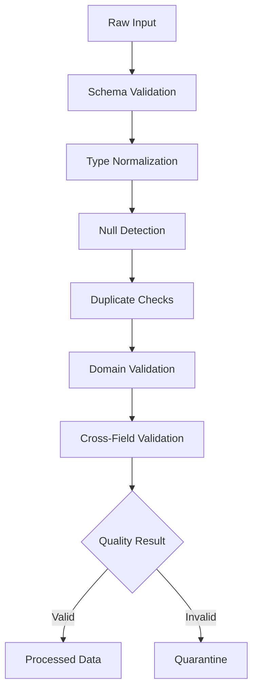

# 03- Isna And Notna

## Overview

`isna()` and `notna()` are Pandas' primary null-detection operations. They identify missing values without requiring the caller to know which underlying representation is present.

They are foundational for data cleaning because real datasets can represent missingness as:

```text
None
NaN
NaT
pd.NA
```

The exact representation depends on the column's dtype and the source data, but application code should generally use Pandas' null-aware APIs rather than checking individual sentinel values.

The core patterns are:

```python
df["column"].isna()
df["column"].notna()

df.isna()
df.notna()
```

The result is a boolean `Series` or `DataFrame` with the same shape and labels as the input.

In a production pipeline:

```text
Raw Data
    ↓
Type Normalization
    ↓
isna() / notna()
    ↓
Quality Rules
    ↓
Valid / Missing / Rejected
    ↓
Transformation
    ↓
Persistence
```

The important engineering question is not simply:

> Is this value missing?

It is:

> Is missingness valid for this field and this business state?

## Why `isna()` and `notna()` Exist

Different Python and data-source representations make direct null comparison unreliable.

For example:

```python
value is None
```

only detects `None`.

This does not provide a general DataFrame-level missing-value strategy.

Instead:

```python
orders["customer_id"].isna()
```

works across Pandas' supported missing-value representations for the relevant dtype.

Similarly:

```python
orders["customer_id"].notna()
```

identifies values that are not missing.

These methods provide a consistent abstraction for missing-data detection.

## Basic Syntax

### `isna()`

```python
missing_mask = orders["customer_id"].isna()
```

### `notna()`

```python
present_mask = orders["customer_id"].notna()
```

The output is a boolean `Series`:

```text
index       customer_id    isna()
0           CUS-001        False
1           <missing>      True
2           CUS-003        False
```

The original data is not modified.

## Series vs DataFrame

On a Series:

```python
orders["customer_id"].isna()
```

returns a boolean `Series`.

On a DataFrame:

```python
orders.isna()
```

returns a boolean `DataFrame`.

Example:

```python
missing = orders.isna()
```

Conceptually:

```text
             order_id   customer_id   amount
ORD-001        False       False       False
ORD-002        False       True        False
ORD-003        False       False       True
```

The shape, index, and columns of the result correspond to the source DataFrame.

## `isnull()` and `notnull()`

Pandas also provides:

```python
df.isnull()
df.notnull()
```

These are aliases for:

```python
df.isna()
df.notna()
```

For new code, prefer:

```python
isna()
notna()
```

because they align naturally with the terminology used throughout modern data-processing code.

## Detecting Missing Values in a Column

A common validation pattern is:

```python
missing_customer_ids = orders.loc[
    orders["customer_id"].isna()
]
```

This returns only rows where `customer_id` is missing.

For non-missing records:

```python
valid_customer_ids = orders.loc[
    orders["customer_id"].notna()
]
```

This can feed later transformations:

```text
Missing records
    → reject / quarantine / default according to policy

Present records
    → continue processing
```

## Counting Missing Values

To count missing values in one column:

```python
missing_count = int(
    orders["customer_id"].isna().sum()
)
```

For every column:

```python
missing_counts = orders.isna().sum()
```

This produces a Series:

```text
order_id       0
customer_id    12
status         3
amount         1
created_at     0
dtype: int64
```

This is a simple and useful data-quality profile.

## Calculating Missingness Rate

Counts alone are not always enough.

Calculate a missingness ratio:

```python
missing_rate = orders.isna().mean()
```

For example:

```text
customer_id    0.012
status         0.003
amount         0.001
```

This means:

```text
customer_id → 1.2% missing
status      → 0.3% missing
amount      → 0.1% missing
```

The exact threshold that is acceptable must come from the dataset contract.

## Missingness by Column

A production profiling report can combine count and percentage:

```python
missing_report = pd.DataFrame(
    {
        "missing_count": orders.isna().sum(),
        "missing_rate": orders.isna().mean(),
    }
)
```

This creates a compact quality report:

```text
             missing_count  missing_rate
order_id                 0         0.000
customer_id             12         0.012
status                   3         0.003
amount                   1         0.001
created_at               0         0.000
```

For operational systems, this report can be exported as metrics rather than logging raw records.

## Why Missingness Is a Data-Model Concern

A missing value does not inherently mean bad data.

Consider:

```text
status = pending
completed_at = missing
```

This can be valid.

But:

```text
status = completed
completed_at = missing
```

may violate a business invariant.

Therefore, null detection is usually a building block:

```text
isna()
    ↓
Business rule
```

not the final validation itself.

## Required Fields

For a required field:

```python
valid_customer_id = orders[
    "customer_id"
].notna()
```

A complete validity rule may also need to reject empty strings:

```python
customer_id = (
    orders["customer_id"]
    .astype("string")
    .str.strip()
)

valid_customer_id = (
    customer_id.notna()
    & customer_id.ne("")
)
```

This matters because:

```text
<missing>
""
"   "
```

are different representations.

## Missing vs Empty String

Consider:

```python
orders["customer_id"].isna()
```

This detects missing values.

It does not necessarily detect:

```python
orders["customer_id"].eq("")
```

To handle both:

```python
customer_id = (
    orders["customer_id"]
    .astype("string")
    .str.strip()
)

missing_or_empty = (
    customer_id.isna()
    | customer_id.eq("")
)
```

This is a common pattern for external text data.

## Missing vs Whitespace

A value such as:

```text
"   "
```

is not automatically missing.

Normalize first:

```python
customer_id = (
    orders["customer_id"]
    .astype("string")
    .str.strip()
)

missing_or_empty = (
    customer_id.isna()
    | customer_id.eq("")
)
```

This avoids incorrectly treating non-null whitespace as valid data.

## Missing vs Zero

Do not confuse:

```text
NaN
0
```

For a transaction amount:

```python
orders["amount"].isna()
```

asks:

```text
Is amount missing?
```

while:

```python
orders["amount"].eq(0)
```

asks:

```text
Is amount exactly zero?
```

These have different business meanings.

For example:

```text
amount = 0
    → legitimate zero-value transaction

amount = missing
    → source did not provide an amount
```

The validation policy must distinguish them.

## Missing vs False

Likewise:

```python
df["active"].isna()
```

is not equivalent to:

```python
df["active"].eq(False)
```

A boolean field may have three meaningful states:

```text
True
False
Missing
```

This is common for data from partially populated systems.

Do not collapse these states without an explicit business rule.

## Missing Value Semantics by State

A field can legitimately be missing depending on another field.

Example:

```text
shipment_status = pending
shipped_at      = missing
```

is valid.

But:

```text
shipment_status = shipped
shipped_at      = missing
```

may be invalid.

Implementation:

```python
invalid_shipment_state = (
    orders["shipment_status"].eq("shipped")
    & orders["shipped_at"].isna()
)
```

This demonstrates the correct use of null detection in business validation.

## `isna()` with Boolean Filtering

Missing-value masks can be combined with other conditions.

For example:

```python
missing_amounts = orders.loc[
    orders["amount"].isna()
    & orders["status"].eq("completed")
]
```

This finds:

```text
Completed orders
AND
Missing amount
```

For multiple conditions:

```python
invalid_orders = orders.loc[
    orders["amount"].isna()
    | orders["customer_id"].isna()
]
```

Use:

```text
& → AND
| → OR
~ → NOT
```

with parenthesized conditions.

## Negating a Missing Mask

These are equivalent:

```python
orders["customer_id"].notna()
```

and:

```python
~orders["customer_id"].isna()
```

Prefer `.notna()` when the business meaning is:

```text
Value must be present
```

Prefer `~isna()` when composing a larger expression that naturally starts from missingness logic.

## Selecting Columns with Missing Values

To find columns containing at least one missing value:

```python
columns_with_missing = (
    orders.isna()
    .any()
)
```

Then:

```python
columns_with_missing = (
    columns_with_missing[
        columns_with_missing
    ]
)
```

A compact version:

```python
columns_with_missing = (
    orders.columns[
        orders.isna().any()
    ]
)
```

This is useful during schema profiling.

## Selecting Completely Populated Columns

To identify columns with no missing values:

```python
complete_columns = (
    orders.columns[
        orders.notna().all()
    ]
)
```

This can help profile a dataset before designing transformations.

Do not interpret a complete column as necessarily valid. Non-missing values can still be malformed or outside the allowed domain.

## Selecting Rows with Any Missing Values

To find rows with at least one missing value:

```python
rows_with_missing = orders.loc[
    orders.isna().any(axis=1)
]
```

This is useful for inspection and debugging.

For large production datasets, avoid materializing all invalid rows merely for logging. Count and classify them first when possible.

## Selecting Rows with No Missing Values

```python
complete_rows = orders.loc[
    orders.notna().all(axis=1)
]
```

This means every column in the selected DataFrame is non-missing.

It does not necessarily mean every record is valid.

For example:

```text
amount = -10
```

is non-missing but potentially invalid.

## Checking Required Columns for Missing Values

Suppose only some fields are mandatory:

```python
required_columns = [
    "order_id",
    "customer_id",
    "amount",
]

has_required_values = (
    orders[
        required_columns
    ]
    .notna()
    .all(axis=1)
)
```

Now:

```python
valid_orders = orders.loc[
    has_required_values
]
```

This is usually more meaningful than:

```python
orders.notna().all(axis=1)
```

because optional fields can legitimately be null.

## Column-Level Quality Checks

A common production validation pattern:

```python
required_columns = [
    "order_id",
    "customer_id",
    "amount",
]

missing_required = (
    orders[
        required_columns
    ]
    .isna()
    .sum()
)
```

This gives counts per required field.

A quality gate can then inspect those counts:

```python
if missing_required.any():
    raise ValueError(
        "Required fields contain missing values."
    )
```

For more mature pipelines, return detailed diagnostics rather than raising a generic exception immediately.

## `isna()` After Type Conversion

Type conversion often turns invalid values into missing values.

Example:

```python
orders["amount"] = pd.to_numeric(
    orders["amount"],
    errors="coerce",
)
```

A malformed source value such as:

```text
"not available"
```

can become missing.

Then:

```python
invalid_amount = orders[
    "amount"
].isna()
```

can identify records that failed conversion.

This pattern is powerful:

```text
Parse
    ↓
Coerce invalid representations
    ↓
Detect resulting missing values
    ↓
Reject / quarantine
```

Do not confuse this with silently accepting the invalid input.

## Datetime Parsing

A similar pattern applies to timestamps:

```python
orders["created_at"] = pd.to_datetime(
    orders["created_at"],
    errors="coerce",
    utc=True,
)
```

Invalid timestamps can become `NaT`.

Then:

```python
invalid_created_at = orders[
    "created_at"
].isna()
```

This allows malformed dates to enter a controlled validation path.

## `isna()` and Nullable Dtypes

Modern Pandas supports nullable types such as:

```text
string
Int64
boolean
```

These can represent missing values explicitly.

Example:

```python
orders["quantity"] = (
    pd.to_numeric(
        orders["quantity"],
        errors="coerce",
    )
    .astype("Int64")
)
```

Then:

```python
orders["quantity"].isna()
```

reliably identifies missing quantities.

The important point is that missing-value detection remains separate from the underlying dtype representation.

## Missing Values in `object` Columns

Object-dtype columns can contain mixed Python objects:

```text
None
strings
numbers
timestamps
```

Null detection should still use:

```python
df["column"].isna()
```

rather than relying on one specific Python sentinel.

However, object-heavy schemas can be harder to reason about and may consume more memory than appropriate nullable or native dtypes.

Normalize types during ingestion where practical.

## Missing Values in Datetime Columns

Datetime columns may represent missing values as `NaT`.

Use:

```python
orders["created_at"].isna()
```

rather than checking for `NaT` directly.

This keeps the validation logic consistent with other nullable columns.

## Missing Values in Indexes

`isna()` also works with an Index:

```python
missing_index = orders.index.isna()
```

This can be useful when indexes are imported from external data or constructed from nullable identifiers.

In most application datasets, however, an index should have deliberate semantics and should not be relied upon as a substitute for explicit business-key validation.

## Missing Values and Index Alignment

`isna()` returns a mask aligned with the original Series index.

For example:

```python
mask = orders["customer_id"].isna()

result = orders.loc[
    mask
]
```

The mask matches rows using Pandas' indexing semantics.

This is one reason boolean masks are safer and more expressive than manually constructing positional lists.

## Missing Values After a Join

Joins are a common source of missing values.

For example:

```python
orders_with_customers = orders.merge(
    customers,
    on="customer_id",
    how="left",
)
```

If an order has no matching customer, customer-side columns may become missing.

Detect unmatched records:

```python
unmatched = orders_with_customers.loc[
    orders_with_customers["customer_name"].isna()
]
```

For data-quality workflows, this can detect referential-integrity failures.

## SQL Analogy

The Pandas pattern:

```python
orders["customer_id"].isna()
```

is conceptually similar to SQL:

```sql
customer_id IS NULL
```

Likewise:

```python
orders["customer_id"].notna()
```

corresponds conceptually to:

```sql
customer_id IS NOT NULL
```

This analogy is useful when moving between PostgreSQL and Pandas, but the execution model differs:

```text
SQL
    → database query engine

Pandas
    → in-memory Python process
```

For large database datasets, prefer filtering in SQL when appropriate.

## SQL Pushdown

Instead of:

```python
orders = pd.read_sql(
    "SELECT * FROM orders",
    connection,
)

orders = orders.loc[
    orders["customer_id"].notna()
]
```

prefer source-side filtering when the DataFrame does not need the missing records:

```python
orders = pd.read_sql(
    """
    SELECT
        order_id,
        customer_id,
        amount
    FROM orders
    WHERE customer_id IS NOT NULL
    """,
    connection,
)
```

This reduces:

```text
Rows transferred
Memory usage
Pandas processing
Network overhead
```

However, retain missing records in Pandas when the purpose of the pipeline is to measure or diagnose data quality.

## API Data Validation

Suppose a REST API returns orders.

After normalization:

```python
orders["customer_id"] = (
    orders["customer_id"]
    .astype("string")
    .str.strip()
)
```

you can validate:

```python
missing_customer = orders[
    "customer_id"
].isna()
```

This separates:

```text
Transport success
```

from:

```text
Data validity
```

An HTTP `200` response does not imply that all required fields are populated.

## ETL Quality Gate

A typical ETL stage might use:

```python
required_fields = [
    "order_id",
    "customer_id",
    "amount",
]

valid_mask = (
    orders[
        required_fields
    ]
    .notna()
    .all(axis=1)
)

valid_orders = orders.loc[
    valid_mask
].copy()

rejected_orders = orders.loc[
    ~valid_mask
].copy()
```

This creates an explicit quality boundary:

```text
Input
  ↓
Required-field validation
  ├── valid → downstream processing
  └── invalid → quarantine
```

## Distinguishing Missingness Reasons

A missing value may have different causes:

```text
Unknown
Not applicable
Not received
Failed parsing
Not yet available
Deleted source value
```

Pandas only identifies the resulting missing state.

The reason must come from:

```text
Source metadata
Business logic
Pipeline state
Validation diagnostics
```

For example, a failed numeric conversion can be flagged separately:

```python
raw_amount = orders["amount"]

orders["amount"] = pd.to_numeric(
    raw_amount,
    errors="coerce",
)

conversion_failed = (
    raw_amount.notna()
    & orders["amount"].isna()
)
```

This distinguishes:

```text
Already missing
```

from:

```text
Previously present but malformed
```

## Missingness Introduced by Cleaning

Cleaning operations themselves can create missing values.

For example:

```python
orders["amount"] = pd.to_numeric(
    orders["amount"],
    errors="coerce",
)
```

can introduce missing values from invalid input.

Therefore, profile quality both:

```text
before cleaning
```

and:

```text
after cleaning
```

Example:

```python
before_missing = (
    orders["amount"]
    .isna()
    .sum()
)

orders["amount"] = pd.to_numeric(
    orders["amount"],
    errors="coerce",
)

after_missing = (
    orders["amount"]
    .isna()
    .sum()
)
```

The difference can reveal parsing failures.

## Missingness Introduced by Joins

A left join can create missing values on the right side:

```python
result = orders.merge(
    customers,
    on="customer_id",
    how="left",
)
```

Post-join validation:

```python
unmatched_customers = result.loc[
    result["customer_name"].isna()
]
```

Do not assume every missing value in a post-join column existed in the original source.

Track pipeline boundaries when diagnosing quality changes.

## Missingness and Duplicate Detection

Missing values can complicate uniqueness checks.

For example:

```python
orders["customer_id"].is_unique
```

answers a specific Pandas-level question about the Series, but business uniqueness rules may exclude or specially handle missing identifiers.

A typical rule might be:

```text
order_id
    → required and unique

customer_id
    → required but not unique
```

Do not apply one generic uniqueness policy to every column.

## Missingness and Aggregation

Aggregations often have null-aware behavior.

Example:

```python
total = orders["amount"].sum()
```

and:

```python
average = orders["amount"].mean()
```

typically operate without treating missing observations as ordinary numeric values.

However, business reporting still needs an explicit policy.

For example:

```text
Average amount across transactions with known amounts
```

is not necessarily the same metric as:

```text
Average amount across all expected transactions
```

Always document the denominator for quality-sensitive reporting.

## Missingness in Grouping

Grouping can expose data-quality issues:

```python
orders.groupby(
    "customer_id",
    dropna=False,
).size()
```

Using `dropna=False` can retain a missing group when supported by the relevant operation.

This is useful during diagnostics because otherwise missing keys may be excluded from the grouped result.

For production reports, decide explicitly whether missing keys should be:

```text
Grouped as unknown
Rejected
Excluded
```

## Performance Considerations

`isna()` and `notna()` are vectorized operations and are generally preferable to Python-level iteration.

Prefer:

```python
missing = orders["customer_id"].isna()
```

over:

```python
missing = []

for value in orders["customer_id"]:
    missing.append(value is None)
```

Vectorized operations reduce Python-level overhead and integrate naturally with Pandas' execution model.

For large DataFrames, the main performance concerns are usually downstream operations and materialized copies rather than the boolean null check itself.

## Avoid Repeated Full-Frame Scans

This pattern can repeatedly scan large datasets:

```python
if orders["a"].isna().any():
    ...

if orders["b"].isna().any():
    ...

if orders["c"].isna().any():
    ...
```

When profiling many columns, a single calculation may be more efficient and easier to reason about:

```python
missing = orders.isna()

column_has_missing = missing.any()
column_missing_count = missing.sum()
```

For very wide or very large datasets, avoid retaining a large boolean DataFrame longer than necessary if only aggregate diagnostics are required.

## Memory Considerations

`orders.isna()` produces a boolean DataFrame when applied to the entire DataFrame.

For a very large dataset:

```python
missing_matrix = orders.isna()
```

can create a substantial temporary object.

If you only need one column:

```python
missing = orders["customer_id"].isna()
```

is more targeted.

If you need aggregate quality metrics:

```python
missing_counts = orders.isna().sum()
```

may be simpler, but understand the intermediate memory behavior for very large datasets.

## Chunked Processing

For large CSV inputs:

```python
for chunk in pd.read_csv(
    "orders.csv",
    chunksize=100_000,
):
    missing_customer_count = int(
        chunk["customer_id"]
        .isna()
        .sum()
    )

    process_chunk_quality(
        missing_customer_count
    )
```

This keeps quality checks bounded to the current chunk.

Global quality metrics should be accumulated rather than retaining all rows.

For example:

```python
total_rows = 0
missing_customers = 0

for chunk in pd.read_csv(
    "orders.csv",
    chunksize=100_000,
):
    total_rows += len(chunk)
    missing_customers += int(
        chunk["customer_id"]
        .isna()
        .sum()
    )

missing_rate = (
    missing_customers / total_rows
    if total_rows
    else 0.0
)
```

## Empty DataFrames

Null checks work correctly on empty DataFrames:

```python
empty = orders.iloc[:0]

missing = empty.isna()
```

The result is also empty.

Similarly:

```python
empty["customer_id"].isna().sum()
```

produces zero.

However, zero missing values in an empty dataset does not imply that the pipeline succeeded.

Empty input should be handled according to the workflow's business semantics.

## Missing Columns

Attempting:

```python
orders["customer_id"].isna()
```

fails if `customer_id` does not exist.

A missing column and a missing value are different quality failures:

```text
Missing column
    → schema failure

Present column with missing values
    → completeness failure
```

Validate schema first:

```python
required_columns = {
    "order_id",
    "customer_id",
}

missing_columns = (
    required_columns
    - set(orders.columns)
)

if missing_columns:
    raise ValueError(
        f"Missing columns: {sorted(missing_columns)}"
    )
```

Then perform null validation.

## Data Quality Architecture

A production pipeline can use null detection as one stage in a broader validation system:



`isna()` and `notna()` are therefore low-level primitives inside a larger quality-control process.

## Production Monitoring

Missingness should be observable over time.

Track:

```text
Missing count
Missing rate
Rows processed
Rows rejected
Missingness by field
Missingness by source
Missingness by batch
```

Example:

```python
metrics = {
    "rows_processed": len(orders),
    "missing_customer_ids": int(
        orders["customer_id"]
        .isna()
        .sum()
    ),
    "missing_amounts": int(
        orders["amount"]
        .isna()
        .sum()
    ),
}
```

A monitoring system such as CloudWatch or Prometheus can use these metrics to detect upstream regressions.

## Missingness Thresholds

Quality checks can become operational gates:

```python
missing_rate = (
    orders["customer_id"]
    .isna()
    .mean()
)

if missing_rate > 0.05:
    raise RuntimeError(
        "customer_id missingness exceeded 5%."
    )
```

Thresholds should reflect actual business tolerance.

For a financial transaction identifier, even a small number of missing values might be unacceptable.

For an optional marketing attribute, a much higher missingness rate may be normal.

## Security Considerations

Null checks themselves are low-risk, but the resulting diagnostics can reveal sensitive information.

Avoid logging entire records:

```python
logger.warning(
    "Missing customer records: %s",
    orders.loc[
        orders["customer_id"].isna()
    ],
)
```

Prefer aggregate metrics:

```python
logger.warning(
    "Orders missing customer_id",
    extra={
        "count": int(
            orders["customer_id"]
            .isna()
            .sum()
        ),
    },
)
```

When record-level investigation is necessary, protect identifiers and follow the application's data-retention and access-control requirements.

## Testing `isna()` and `notna()`

Test both the detection logic and its business use.

Example:

```python
import pandas as pd


def test_detects_missing_customer_ids() -> None:
    orders = pd.DataFrame(
        {
            "order_id": [
                "ORD-1",
                "ORD-2",
            ],
            "customer_id": [
                "CUS-1",
                pd.NA,
            ],
        }
    )

    missing = orders[
        "customer_id"
    ].isna()

    assert missing.tolist() == [
        False,
        True,
    ]
```

Test the complementary result:

```python
def test_detects_present_customer_ids() -> None:
    orders = pd.Series(
        [
            "CUS-1",
            pd.NA,
        ],
        dtype="string",
    )

    present = orders.notna()

    assert present.tolist() == [
        True,
        False,
    ]
```

## Testing Business Rules

A more useful test verifies the actual rule:

```python
def test_completed_order_requires_completion_time() -> None:
    orders = pd.DataFrame(
        {
            "status": [
                "completed",
                "pending",
            ],
            "completed_at": [
                pd.NaT,
                pd.NaT,
            ],
        }
    )

    invalid = (
        orders["status"].eq("completed")
        & orders["completed_at"].isna()
    )

    assert invalid.tolist() == [
        True,
        False,
    ]
```

This verifies that null detection participates correctly in the domain rule.

## Common Mistakes

| Mistake | Why it happens | Better approach |
|---|---|---|
| Checking only `None` | Python-level null handling is assumed to cover Pandas | Use `isna()` / `notna()` |
| Comparing with `== None` | Null semantics are misunderstood | Use `isna()` |
| Treating `""` as null automatically | Empty string is not necessarily missing | Normalize and validate explicitly |
| Treating whitespace as valid | `.notna()` only checks missingness | Strip and then validate emptiness |
| Treating zero as missing | Business semantics are confused | Use separate numeric rules |
| Treating `False` as missing | Boolean state is collapsed | Preserve nullable boolean semantics |
| Assuming non-null means valid | Presence is mistaken for correctness | Add domain validation |
| Ignoring missing columns | Schema and completeness are conflated | Validate schema first |
| Dropping all null rows | Optional fields may legitimately be missing | Define required fields |
| Logging complete invalid records | Debugging convenience | Log aggregate diagnostics |
| Recomputing full-frame masks repeatedly | Quality checks are written independently | Reuse masks or aggregate profiling |
| Ignoring join-introduced nulls | Pipeline stages are treated independently | Profile before and after joins |
| Treating `NaT` separately | Datetime missingness is handled manually | Use `isna()` / `notna()` |
| Assuming zero missing values means good data | Completeness is only one dimension | Validate type, domain, uniqueness, and integrity |

## Interview Traps

### What Is the Difference Between `isna()` and `notna()`?

```python
df["column"].isna()
```

returns `True` for missing values.

```python
df["column"].notna()
```

returns `True` for non-missing values.

They are complementary.

### Are `isna()` and `isnull()` Different?

For normal Pandas usage, no. `isnull()` is an alias of `isna()`.

### Does `isna()` Modify the DataFrame?

No. It returns a boolean `Series` or `DataFrame`.

### What Does `notna()` Return?

For a Series, it returns a boolean Series with the same index. For a DataFrame, it returns a boolean DataFrame with the same index and columns.

### Why Not Use `value == None`?

Pandas supports several missing-value representations, and direct Python equality is not the correct general-purpose null-detection mechanism.

Use:

```python
value_series.isna()
```

### Does `isna()` Detect Empty Strings?

No.

```python
pd.Series([""]).isna()
```

does not treat an empty string as a missing value.

Handle empty strings separately when they are invalid for the domain.

### Does `isna()` Detect Zero?

No.

Zero is a valid numeric value unless the business rule says otherwise.

### Does `isna()` Detect `NaT`?

Yes. `NaT` is the missing-value representation commonly used for datetime-like data.

### How Do You Find Rows with Any Missing Values?

```python
df.loc[
    df.isna().any(axis=1)
]
```

### How Do You Find Rows with No Missing Values?

```python
df.loc[
    df.notna().all(axis=1)
]
```

### How Do You Count Missing Values per Column?

```python
df.isna().sum()
```

### How Do You Calculate Missingness Percentage?

```python
df.isna().mean()
```

### How Do You Validate Required Columns Only?

```python
required = [
    "order_id",
    "customer_id",
    "amount",
]

valid = (
    df[required]
    .notna()
    .all(axis=1)
)
```

### Can a Non-Missing Value Still Be Invalid?

Yes.

For example:

```text
amount = -100
status = "unknown"
customer_id = " "
```

All can be non-null while violating business rules.

### Why Can Missing Values Appear After a Join?

A left or outer join can produce unmatched rows, causing fields from the other side to become missing.

### Why Might Missingness Increase After Type Conversion?

Using:

```python
pd.to_numeric(
    values,
    errors="coerce",
)
```

or:

```python
pd.to_datetime(
    values,
    errors="coerce",
)
```

can convert malformed values into missing values so they can be detected and handled explicitly.

## Recommended Engineering Pattern

For a production dataset, combine null detection with normalization and business validation:

```python
import pandas as pd


def validate_orders(
    orders: pd.DataFrame,
) -> tuple[
    pd.DataFrame,
    pd.DataFrame,
]:
    required_columns = {
        "order_id",
        "customer_id",
        "status",
        "amount",
        "created_at",
    }

    missing_columns = (
        required_columns
        - set(orders.columns)
    )

    if missing_columns:
        raise ValueError(
            f"Missing columns: "
            f"{sorted(missing_columns)}"
        )

    result = orders.copy()

    result["order_id"] = (
        result["order_id"]
        .astype("string")
        .str.strip()
    )

    result["customer_id"] = (
        result["customer_id"]
        .astype("string")
        .str.strip()
    )

    result["status"] = (
        result["status"]
        .astype("string")
        .str.strip()
        .str.lower()
    )

    result["amount"] = pd.to_numeric(
        result["amount"],
        errors="coerce",
    )

    result["created_at"] = pd.to_datetime(
        result["created_at"],
        errors="coerce",
        utc=True,
    )

    allowed_statuses = {
        "pending",
        "processing",
        "completed",
        "cancelled",
    }

    valid_order_id = (
        result["order_id"].notna()
        & result["order_id"].ne("")
    )

    valid_customer_id = (
        result["customer_id"].notna()
        & result["customer_id"].ne("")
    )

    valid_amount = (
        result["amount"].notna()
        & result["amount"].ge(0)
    )

    valid_status = result[
        "status"
    ].isin(allowed_statuses)

    valid_created_at = result[
        "created_at"
    ].notna()

    valid_mask = (
        valid_order_id
        & valid_customer_id
        & valid_amount
        & valid_status
        & valid_created_at
    )

    valid_orders = result.loc[
        valid_mask
    ].copy()

    rejected_orders = result.loc[
        ~valid_mask
    ].copy()

    return valid_orders, rejected_orders
```

This demonstrates the intended role of `isna()` and `notna()`:

```text
Normalize representation
        ↓
Detect missing values
        ↓
Apply business constraints
        ↓
Classify records
        ↓
Continue / quarantine
```

The null check is simple; the engineering value comes from how that check participates in a larger quality contract.

## Key Takeaways

- Use `isna()` and `notna()` as the standard Pandas primitives for missing-value detection; they work across Pandas' supported missing-value representations.
- Missingness is not automatically invalid: distinguish required fields, optional fields, state-dependent fields, and malformed values that become missing during parsing.
- `isna()` does not mean empty string, whitespace, zero, or `False`; normalize and validate those representations separately when the domain requires it.
- Treat null checks as one layer of data-quality validation alongside schema, dtype, uniqueness, range, cross-field, and referential-integrity rules.
- In production pipelines, use vectorized null checks, monitor missingness rates, account for nulls introduced by joins or type coercion, avoid logging sensitive records, and handle large datasets without unnecessary full-frame copies.