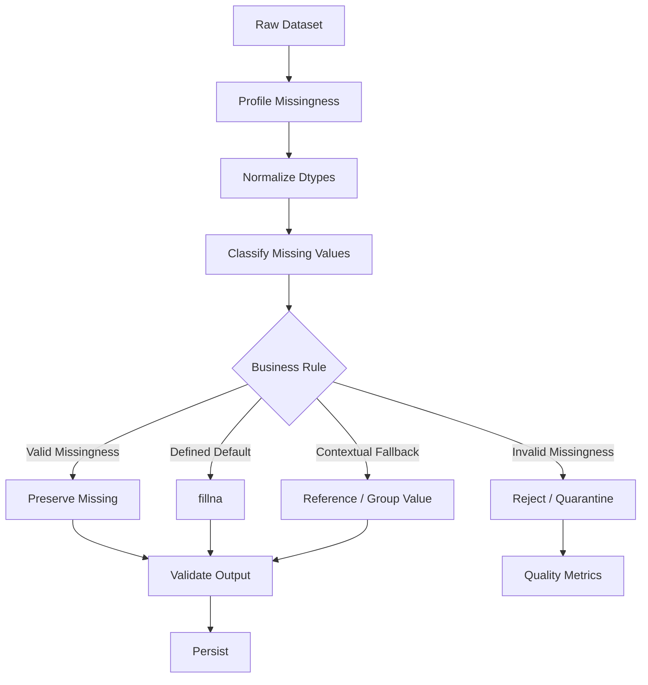

# 04- Fillna

## Overview

`fillna()` replaces missing values in a Pandas `Series` or `DataFrame` with a specified value or values derived from another source.

It is one of the primary tools for handling incomplete data:

```text
Missing value
     ↓
Understand why it is missing
     ↓
Decide whether filling is valid
     ↓
Choose replacement strategy
     ↓
Validate resulting data
```

The critical engineering principle is:

> `fillna()` is a data transformation, not automatically a data-quality fix.

Filling a missing value can improve downstream processing, but an inappropriate replacement can silently introduce incorrect business data.

For example:

```python
orders["currency"] = (
    orders["currency"]
    .fillna("INR")
)
```

is only correct when the business contract explicitly says that a missing currency should be interpreted as INR.

If the missing value means "unknown", filling it with a real currency creates false information.

## Why `fillna()` Exists

Real datasets often contain incomplete fields because of:

```text
Optional attributes
Partial API responses
Legacy records
Failed parsing
Database NULL values
Missing user input
Delayed processing
Schema differences
```

Without explicit handling, missing values can complicate:

```text
Filtering
Arithmetic
Grouping
Serialization
Validation
Database writes
Reporting
```

`fillna()` provides a controlled way to replace missing values while keeping the transformation explicit.

## Core Syntax

The most common form is:

```python
df["column"] = df["column"].fillna(value)
```

Example:

```python
orders["discount_code"] = (
    orders["discount_code"]
    .fillna("NO_DISCOUNT")
)
```

A DataFrame can also be filled:

```python
orders = orders.fillna(0)
```

However, applying one replacement to an entire DataFrame is often too broad for production datasets.

Prefer field-specific rules when columns have different semantics.

## Important Behavior

| Property | Behavior |
|---|---|
| Input | `Series` or `DataFrame` |
| Output | Same general Pandas object type |
| Default behavior | Returns a new object rather than requiring mutation |
| Original object | Normally unchanged unless assigned back or explicitly modified |
| Row labels | Preserved |
| Column labels | Preserved |
| Target values | Missing values are candidates for replacement |
| Non-missing values | Preserved |
| Dtypes | May change depending on replacement value and dtype compatibility |

Typical usage:

```python
orders["priority"] = (
    orders["priority"]
    .fillna("normal")
)
```

The original `priority` values remain unchanged except where they were missing.

## Scalar Filling

The simplest approach replaces all missing values with one scalar.

```python
orders["priority"] = (
    orders["priority"]
    .fillna("normal")
)
```

For numeric data:

```python
orders["quantity"] = (
    orders["quantity"]
    .fillna(0)
)
```

For timestamps:

```python
orders["processed_at"] = (
    orders["processed_at"]
    .fillna(pd.Timestamp("1970-01-01", tz="UTC"))
)
```

The replacement must have valid business semantics.

## Missing Does Not Always Mean Zero

Consider:

```python
orders["discount"] = (
    orders["discount"]
    .fillna(0)
)
```

This is correct only if:

```text
missing discount
=
no discount
```

It is not correct if:

```text
missing discount
=
discount was not calculated
```

These states are different:

```text
0
missing
unknown
not applicable
```

Data models should preserve those distinctions whenever they matter.

## Column-Specific Filling

A safer production pattern is to provide different rules for different columns.

```python
fill_defaults = {
    "priority": "normal",
    "discount_code": "NO_DISCOUNT",
    "retry_count": 0,
}

orders = orders.fillna(
    fill_defaults
)
```

This communicates the business policy more clearly than:

```python
orders = orders.fillna(0)
```

The broad rule can still be inappropriate for columns such as:

```text
customer_id
created_at
status
currency
```

where a fabricated value could be harmful.

## Filling Multiple Columns with Different Values

A dictionary is useful when each column has its own default:

```python
customers = customers.fillna(
    {
        "country": "IN",
        "marketing_opt_in": False,
        "credit_limit": 0,
    }
)
```

Only missing values in the specified columns are replaced.

This is appropriate when the replacement semantics are explicit for each field.

## Filling a Series from Another Series

Missing values can also be filled from aligned data.

For example:

```python
orders["currency"] = (
    orders["currency"]
    .fillna(
        customer_defaults["currency"]
    )
)
```

Because Pandas operations are index-aware, the indexes should be validated.

This pattern is useful when:

```text
Primary source missing
        ↓
Use authoritative fallback source
```

It is safer than hardcoding a default when the fallback comes from trusted reference data.

## Index Alignment During Filling

Consider:

```python
defaults = pd.Series(
    ["INR", "USD"],
    index=[
        "ORD-1002",
        "ORD-1001",
    ],
)
```

If the orders DataFrame is indexed by `order_id`:

```python
orders["currency"] = (
    orders["currency"]
    .fillna(defaults)
)
```

the values are matched by index labels.

Conceptually:

```text
ORD-1001 → USD
ORD-1002 → INR
```

This is powerful, but an incorrect index can produce missing or incorrect replacements.

Validate alignment before relying on it in critical processing.

## Forward Fill

`fillna()` supports forward propagation:

```python
series = series.fillna(
    method="ffill"
)
```

However, modern Pandas code should generally use the dedicated method:

```python
series = series.ffill()
```

Forward fill means:

```text
Use the most recent previous non-missing value.
```

For time-series data:

```text
09:00 → 100
10:00 → missing
11:00 → missing
12:00 → 150
```

forward fill produces:

```text
09:00 → 100
10:00 → 100
11:00 → 100
12:00 → 150
```

This is appropriate only when the previous value is semantically valid for later rows.

## Backward Fill

Backward fill uses the next available non-missing value:

```python
series = series.bfill()
```

For example:

```text
09:00 → missing
10:00 → missing
11:00 → 100
```

becomes:

```text
09:00 → 100
10:00 → 100
11:00 → 100
```

This can be useful when data is expected to remain constant until the next known value.

Do not use forward or backward filling merely because it removes nulls.

## Limiting Propagation

Forward or backward propagation can be limited.

```python
series = series.ffill(
    limit=2
)
```

This allows at most two consecutive missing values to be filled from previous observations.

This is useful when:

```text
Short gaps are acceptable
Long gaps should remain missing
```

The limit should reflect the domain rather than an arbitrary number.

## DataFrame-Wide Forward Fill

Forward fill can be applied across a DataFrame:

```python
df = df.ffill()
```

This can be dangerous when unrelated columns represent independent entities or when row order does not define a valid temporal relationship.

For time-series data, group-specific filling is often more appropriate.

## Group-Specific Filling

Suppose each customer has independent state:

```python
events["balance"] = (
    events
    .groupby("customer_id")["balance"]
    .ffill()
)
```

This prevents one customer's value from leaking into another customer's records.

The conceptual rule becomes:

```text
Group by customer
    ↓
Order records correctly
    ↓
Forward-fill within customer
```

Sorting should be explicit when temporal order matters:

```python
events = events.sort_values(
    [
        "customer_id",
        "event_time",
    ]
)

events["balance"] = (
    events
    .groupby("customer_id")["balance"]
    .ffill()
)
```

## Filling from the Previous Business State

Forward filling is appropriate for stateful data only when the domain says the state persists until changed.

For example:

```text
Customer plan
    ├── basic
    ├── missing
    ├── missing
    └── premium
```

Forward filling can represent:

```text
basic
basic
basic
premium
```

But this assumes the missing records mean "unchanged state", which must be established by the source semantics.

## Filling with Aggregates

Missing values can be filled with a statistical aggregate:

```python
orders["amount"] = (
    orders["amount"]
    .fillna(
        orders["amount"].median()
    )
)
```

Possible choices include:

```text
mean
median
minimum
maximum
mode
group-specific aggregate
```

This is common in analytical workflows but requires caution in financial or operational data.

Imputation should not automatically be used for authoritative transactional records.

## Group-Specific Aggregate Imputation

A more contextual strategy:

```python
orders["amount"] = (
    orders["amount"]
    .fillna(
        orders
        .groupby("product_id")["amount"]
        .transform("median")
    )
)
```

This fills missing values using the median amount for the same product.

The distinction is important:

```text
Global median
    → one replacement value for everyone

Group median
    → replacement based on relevant context
```

Group-based imputation can be more meaningful but also more computationally expensive and more dependent on sufficient group data.

## Filling with `mode()`

For categorical fields:

```python
default_status = (
    orders["status"]
    .mode()
    .iloc[0]
)

orders["status"] = (
    orders["status"]
    .fillna(default_status)
)
```

This fills missing values with the most frequent observed category.

However, frequency does not determine business correctness.

For example, if a missing status means "unknown", the most common status is not necessarily a valid replacement.

## Filling Based on Business Rules

Instead of blindly filling values, derive the replacement from domain logic.

For example:

```python
orders["currency"] = (
    orders["currency"]
    .fillna(orders["account_currency"])
)
```

This is preferable to:

```python
orders["currency"] = (
    orders["currency"]
    .fillna("INR")
)
```

when account currency is authoritative.

The rule becomes:

```text
Primary currency
    ↓ missing
Account currency
    ↓ missing
Validation failure
```

rather than inventing a universal default.

## Conditional Filling

Sometimes the replacement depends on another field.

For example:

```text
Pending order
    → completed_at remains missing

Completed order with missing completed_at
    → invalid record
```

Do not use:

```python
orders["completed_at"] = (
    orders["completed_at"]
    .fillna(pd.Timestamp.now(tz="UTC"))
)
```

because it converts invalid state into apparently valid data.

Instead, validate first:

```python
invalid_completed = (
    orders["status"].eq("completed")
    & orders["completed_at"].isna()
)
```

Then route invalid records appropriately.

## `fillna()` vs `replace()`

Use `fillna()` when the target condition is:

```text
value is missing
```

Use `replace()` when the target condition is:

```text
value equals a specific known value
```

Example:

```python
orders["status"] = (
    orders["status"]
    .fillna("pending")
)
```

versus:

```python
orders["status"] = (
    orders["status"]
    .replace(
        {
            "done": "completed",
            "complete": "completed",
        }
    )
)
```

They solve different transformation problems.

## `fillna()` vs `where()`

`fillna()` is specifically focused on missing values.

`where()` provides conditional replacement:

```python
orders["amount"] = (
    orders["amount"]
    .where(
        orders["amount"].ge(0),
        pd.NA,
    )
)
```

The distinction is:

```text
fillna()
    → replace missing values

where()
    → keep values satisfying a condition

mask()
    → replace values satisfying a condition
```

Choose the API that best communicates the business rule.

## `fillna()` vs `ffill()` / `bfill()`

Use scalar or mapping-based `fillna()` when the replacement is a defined default.

Use:

```python
series.ffill()
```

when the replacement should come from the previous valid observation.

Use:

```python
series.bfill()
```

when the replacement should come from the next valid observation.

Do not use propagation when observations are independent.

## Filling Entire DataFrames

This works:

```python
orders = orders.fillna(0)
```

but is usually too broad for production schemas.

Consider:

```text
order_id      → should remain missing/rejected
customer_id   → should remain missing/rejected
amount        → maybe 0, depending on semantics
status        → maybe "pending", if explicitly defined
description   → maybe empty string
created_at    → usually should remain invalid
```

One universal replacement often hides important business distinctions.

## Fill Strategy by Data Type

| Data type / field | Possible strategy | Main caution |
|---|---|---|
| Numeric metric | `0`, median, group median | Zero may have different semantics |
| Boolean flag | `False` | Missing may represent unknown |
| Category | Explicit domain default | Do not invent valid categories |
| String | Explicit sentinel or preserve missing | Empty string is not always equivalent |
| Datetime | Rarely fill automatically | Synthetic timestamps can corrupt chronology |
| Identifier | Usually reject | Fake IDs corrupt joins |
| Financial value | Usually strict validation | Imputation can change financial meaning |
| State field | Business-specific | State transitions may be invalidated |
| Optional description | Preserve or empty string | Preserve distinction if useful |

## Filling Identifiers

Avoid:

```python
orders["customer_id"] = (
    orders["customer_id"]
    .fillna("UNKNOWN")
)
```

unless `"UNKNOWN"` is explicitly part of the data model.

Identifiers generally represent relationships.

A synthetic placeholder can cause:

```text
Incorrect joins
Incorrect aggregation
Incorrect customer counts
Incorrect authorization scope
```

A safer pattern is often:

```python
missing_customer = (
    orders["customer_id"]
    .isna()
)

rejected_orders = orders.loc[
    missing_customer
]
```

## Filling Boolean Fields

Nullable booleans deserve particular care.

Suppose:

```text
True  → opted in
False → opted out
NA    → preference unknown
```

Replacing NA with `False` changes:

```text
unknown
```

into:

```text
explicitly opted out
```

That can have privacy and business consequences.

Only fill boolean missing values when the domain defines the semantic equivalence.

## Filling Financial Data

Financial missingness requires strong controls.

Do not automatically:

```python
transactions["amount"] = (
    transactions["amount"]
    .fillna(0)
)
```

unless:

```text
Missing amount
=
zero-value transaction
```

is explicitly guaranteed.

For financial data, missingness may instead indicate:

```text
Incomplete settlement
Pending calculation
Source defect
Failed ingestion
```

These should remain distinguishable.

## Filling Datetime Values

Datetime defaults are particularly dangerous.

Avoid arbitrary values such as:

```python
orders["created_at"] = (
    orders["created_at"]
    .fillna(
        pd.Timestamp("1970-01-01")
    )
)
```

This makes the dataset appear complete while introducing a false event timestamp.

A better approach is usually:

```text
Keep missing
    ↓
Validate required timestamps
    ↓
Reject or quarantine when required
```

A default timestamp is only appropriate when it represents a real, explicitly defined business state.

## Dtype Implications

The replacement value must be compatible with the target dtype.

For example:

```python
orders["quantity"] = (
    orders["quantity"]
    .astype("Int64")
    .fillna(0)
)
```

produces a nullable integer column with zeros for missing values.

For strings:

```python
orders["status"] = (
    orders["status"]
    .astype("string")
    .fillna("pending")
)
```

Explicit dtypes make transformations more predictable.

## Nullable Integer Example

A conventional Python integer dtype cannot represent missing values in the same way as Pandas' nullable `Int64` dtype.

Use:

```python
orders["retry_count"] = (
    pd.to_numeric(
        orders["retry_count"],
        errors="coerce",
    )
    .astype("Int64")
)

orders["retry_count"] = (
    orders["retry_count"]
    .fillna(0)
)
```

This produces an integer-oriented nullable column.

If missingness is intentionally removed, validate that replacing it with zero matches the domain.

## In-Place Behavior

Modern Pandas code should generally prefer explicit assignment:

```python
orders["priority"] = (
    orders["priority"]
    .fillna("normal")
)
```

rather than relying on:

```python
orders["priority"].fillna(
    "normal",
    inplace=True,
)
```

Explicit reassignment makes the transformation easier to reason about and avoids ambiguity around intermediate objects and copy behavior.

The important engineering pattern is:

```text
Calculate transformed result
    ↓
Explicitly assign result
```

## Filling a DataFrame During a Pipeline

`fillna()` works well in method chains:

```python
cleaned = (
    orders
    .assign(
        status=lambda df: (
            df["status"]
            .astype("string")
            .str.strip()
            .str.lower()
            .fillna("pending")
        ),
        retry_count=lambda df: (
            df["retry_count"]
            .astype("Int64")
            .fillna(0)
        ),
    )
)
```

This is readable when each replacement rule is simple.

Use intermediate variables when the cleaning logic becomes difficult to review.

## Method Chaining vs Intermediate Variables

Readable:

```python
cleaned = (
    orders
    .assign(
        status=lambda df: (
            df["status"]
            .astype("string")
            .str.strip()
            .str.lower()
            .fillna("pending")
        )
    )
)
```

Better to split when rules become complex:

```python
cleaned = orders.copy()

status = (
    cleaned["status"]
    .astype("string")
    .str.strip()
    .str.lower()
    .fillna("pending")
)

cleaned["status"] = status
```

Production code should optimize for correctness and reviewability rather than minimum line count.

## Missingness Before and After Filling

Quality monitoring should measure how much missingness was removed.

```python
before = int(
    orders["priority"]
    .isna()
    .sum()
)

orders["priority"] = (
    orders["priority"]
    .fillna("normal")
)

after = int(
    orders["priority"]
    .isna()
    .sum()
)
```

Expected invariant:

```text
after <= before
```

But a zero remaining missing count is not automatically evidence that the transformation is correct.

## Validating the Fill

Suppose:

```python
orders["priority"] = (
    orders["priority"]
    .fillna("normal")
)
```

You may verify:

```python
remaining_missing = int(
    orders["priority"]
    .isna()
    .sum()
)
```

But also verify the business rule.

For example:

```python
assert (
    orders["priority"]
    .isin(
        {
            "low",
            "normal",
            "high",
        }
    )
    .all()
)
```

The quality check should validate both:

```text
Completeness
+
Validity
```

## Filling After Type Conversion

A common production pattern is:

```python
orders["amount"] = (
    pd.to_numeric(
        orders["amount"],
        errors="coerce",
    )
    .fillna(0)
)
```

This is concise but can be dangerous.

It combines:

```text
Malformed input
    ↓
Missing
    ↓
Zero
```

and loses the distinction between:

```text
Originally missing
Malformed source value
Actual zero
```

For quality-sensitive data, separate those states:

```python
raw_amount = orders["amount"]

parsed_amount = pd.to_numeric(
    raw_amount,
    errors="coerce",
)

conversion_failed = (
    raw_amount.notna()
    & parsed_amount.isna()
)

orders["amount"] = parsed_amount
```

Then decide explicitly whether remaining missing amounts can be filled.

## Imputation vs Defaulting

These are conceptually different.

### Defaulting

A known domain default exists:

```text
Missing retry_count → 0
```

### Imputation

The system estimates a value:

```text
Missing amount → product-group median
```

Defaulting is generally simpler and easier to audit.

Imputation introduces assumptions that should be documented and validated.

## Production Data Flow

A robust missing-value workflow is:



The key decision happens before `fillna()`:

```text
Why is the value missing?
```

## ETL Example

Consider an orders pipeline:

```python
import pandas as pd


def clean_orders(
    orders: pd.DataFrame,
) -> pd.DataFrame:
    result = orders.copy()

    result["status"] = (
        result["status"]
        .astype("string")
        .str.strip()
        .str.lower()
        .fillna("pending")
    )

    result["retry_count"] = (
        pd.to_numeric(
            result["retry_count"],
            errors="coerce",
        )
        .astype("Int64")
        .fillna(0)
    )

    result["currency"] = (
        result["currency"]
        .astype("string")
        .str.strip()
        .str.upper()
    )

    return result
```

This is only production-safe when the contracts explicitly establish:

```text
Missing status → pending
Missing retry count → zero
Missing currency → remain missing
```

That last distinction is important.

Not every column should receive a default.

## Fallback Values from Reference Data

Suppose an order's currency can safely fall back to its customer's account currency.

```python
orders = orders.merge(
    customers[
        [
            "customer_id",
            "account_currency",
        ]
    ],
    on="customer_id",
    how="left",
)

orders["currency"] = (
    orders["currency"]
    .fillna(orders["account_currency"])
)
```

Now the transformation is:

```text
Order currency
    ↓ missing
Customer account currency
    ↓ missing
Validation failure
```

After filling, remove temporary columns if they are not part of the output schema:

```python
orders = orders.drop(
    columns=["account_currency"]
)
```

The fallback source should be authoritative and the join should be validated.

## Filling After API Ingestion

An API response might contain:

```json
{
  "order_id": "ORD-1001",
  "status": null,
  "retry_count": null
}
```

After normalization:

```python
orders["status"] = (
    orders["status"]
    .astype("string")
    .fillna("pending")
)

orders["retry_count"] = (
    pd.to_numeric(
        orders["retry_count"],
        errors="coerce",
    )
    .astype("Int64")
    .fillna(0)
)
```

This is safe only when the receiving system's contract defines these defaults.

Never infer business defaults solely because an API field is nullable.

## Database Interaction

SQL commonly represents missing values as `NULL`.

A PostgreSQL query may return:

```python
orders = pd.read_sql(
    """
    SELECT
        order_id,
        customer_id,
        status,
        amount
    FROM orders
    """,
    connection,
)
```

Then:

```python
orders["status"] = (
    orders["status"]
    .fillna("pending")
)
```

can apply a Pandas-side default.

However, if the default is an authoritative database rule, consider whether it should instead be enforced at the database layer using:

```sql
DEFAULT
NOT NULL
CHECK
```

Pandas should not compensate for missing database constraints indefinitely.

## Database Defaults vs Pandas Defaults

| Requirement | Better location |
|---|---|
| Every inserted row must have a default value | Database schema |
| Batch-specific transformation | Pandas |
| Reporting-only fallback | Pandas |
| Data ingestion normalization | Pandas |
| Transactional integrity | Database |
| Referential integrity | Database |
| Historical raw-data correction | ETL |
| Source-specific normalization | ETL |

Use the layer that owns the rule.

## Security Considerations

Missing-value handling can affect authorization and privacy logic.

For example:

```python
users["tenant_id"] = (
    users["tenant_id"]
    .fillna("default")
)
```

can be dangerous if `tenant_id` controls access boundaries.

A missing tenant identifier should generally cause:

```text
Validation failure
```

rather than assigning users to a default tenant.

Similarly, a missing consent field should not automatically become `False` unless that interpretation is legally and operationally appropriate.

## Performance Considerations

`fillna()` is vectorized and generally preferable to Python loops.

Prefer:

```python
orders["priority"] = (
    orders["priority"]
    .fillna("normal")
)
```

over:

```python
for index in orders.index:
    if pd.isna(
        orders.at[index, "priority"]
    ):
        orders.at[
            index,
            "priority",
        ] = "normal"
```

For large datasets, watch for unnecessary copies and temporary objects.

Avoid:

```python
df1 = orders.copy()
df2 = df1.copy()
df3 = df2.fillna(0)
```

unless those ownership boundaries are actually required.

## Large Dataset Processing

For chunked CSV processing:

```python
for chunk in pd.read_csv(
    "orders.csv",
    chunksize=100_000,
):
    chunk["retry_count"] = (
        pd.to_numeric(
            chunk["retry_count"],
            errors="coerce",
        )
        .astype("Int64")
        .fillna(0)
    )

    process_chunk(chunk)
```

This keeps the working set bounded.

For very large datasets, consider whether missing-value filling should instead happen in:

```text
SQL
Spark / PySpark
AWS Glue
Data warehouse
DuckDB
Polars
```

depending on the workload.

## Forward Fill in Chunked Processing

Be careful when using:

```python
chunk.ffill()
```

across chunks.

The first row of a chunk may depend on the final valid value from the previous chunk.

For stateful forward filling, maintain the necessary boundary state between chunks or use an execution strategy that preserves the complete ordering context.

This is an important distinction between:

```text
Chunk-local operation
```

and:

```text
Globally sequential operation
```

## Memory Considerations

Filling can require allocation of replacement values or transformed arrays, depending on dtype and execution path.

For large datasets:

```text
Select required columns
    ↓
Normalize types
    ↓
Fill only required fields
    ↓
Persist
```

rather than performing broad DataFrame-wide operations unnecessarily.

Monitor memory where appropriate:

```python
memory_bytes = (
    orders
    .memory_usage(deep=True)
    .sum()
)
```

## Testing `fillna()`

Tests should verify both replacement behavior and preservation behavior.

```python
import pandas as pd


def test_fill_missing_priority() -> None:
    priorities = pd.Series(
        [
            "high",
            pd.NA,
            "low",
        ],
        dtype="string",
    )

    result = priorities.fillna(
        "normal"
    )

    assert result.tolist() == [
        "high",
        "normal",
        "low",
    ]
```

This verifies that:

```text
Missing value → replaced
Existing values → preserved
```

## Testing Business Semantics

A more important test:

```python
def test_completed_at_is_not_filled_for_pending_orders() -> None:
    orders = pd.DataFrame(
        {
            "status": [
                "pending",
                "completed",
            ],
            "completed_at": [
                pd.NaT,
                pd.Timestamp(
                    "2026-09-10",
                    tz="UTC",
                ),
            ],
        }
    )

    pending_mask = orders[
        "status"
    ].eq("pending")

    orders.loc[
        pending_mask,
        "completed_at",
    ] = orders.loc[
        pending_mask,
        "completed_at",
    ].fillna(
        pd.NaT
    )

    assert orders.loc[
        0,
        "completed_at",
    ] is pd.NaT
```

The larger point is that tests should protect the domain semantics around missingness, not merely confirm that `fillna()` executes.

## Testing Dtypes

When the replacement affects downstream schema:

```python
result = (
    orders["retry_count"]
    .astype("Int64")
    .fillna(0)
)

assert str(
    result.dtype
) == "Int64"
```

For DataFrame-level comparisons:

```python
from pandas.testing import assert_frame_equal

assert_frame_equal(
    actual,
    expected,
    check_dtype=True,
)
```

Test dtype when downstream processing depends on it.

## Testing No-Op Behavior

When there are no missing values:

```python
values = pd.Series(
    [1, 2, 3],
    dtype="Int64",
)

result = values.fillna(0)

assert result.tolist() == [
    1,
    2,
    3,
]
```

This confirms that existing values are preserved.

## Empty DataFrames

`fillna()` works on an empty DataFrame:

```python
empty = pd.DataFrame(
    {
        "status": pd.Series(
            dtype="string"
        )
    }
)

result = empty.fillna(
    {
        "status": "pending",
    }
)
```

The result remains empty.

For production pipelines, however, distinguish:

```text
Empty valid dataset
```

from:

```text
Missing upstream data
```

`fillna()` does not solve that distinction.

## Common Mistakes

| Mistake | Why it happens | Better approach |
|---|---|---|
| Filling every null with `0` | Simple and convenient | Define field-specific semantics |
| Filling IDs with `"UNKNOWN"` | Desire to remove nulls | Reject or preserve missing identifiers |
| Filling timestamps with arbitrary dates | Need for complete columns | Preserve missing or reject invalid records |
| Treating missing boolean as `False` | Assumes binary state | Preserve unknown state unless contract says otherwise |
| Using mean/median for transactional data | Statistical imputation seems convenient | Use only when domain permits |
| Forward-filling unordered data | Propagation appears useful | Sort and verify state semantics |
| Forward-filling across entities | State leaks between groups | Group before filling |
| Filling after joins without checking provenance | Missing values may indicate broken relationships | Validate join semantics |
| Using `inplace=True` on chained expressions | Mutability appears convenient | Use explicit assignment |
| Ignoring dtype changes | Fill value seems harmless | Validate resulting dtype |
| Coercing malformed values and immediately filling | Invalid and missing states become identical | Track conversion failures separately |
| Removing all missingness | Completeness is mistaken for quality | Preserve meaningful missing states |

## Production Pitfalls

### Filling Invalid Data Instead of Missing Data

This pattern is dangerous:

```python
orders["amount"] = (
    pd.to_numeric(
        orders["amount"],
        errors="coerce",
    )
    .fillna(0)
)
```

If the source contains:

```text
""
"not available"
"abc"
```

all can become `0`.

This destroys the distinction between:

```text
Actual zero
Missing value
Malformed input
```

For quality-sensitive pipelines, track parsing failures before applying defaults.

### Filling Before Understanding the Source

Do not start a cleaning pipeline with:

```python
df = df.fillna(0)
```

without knowing what nulls mean.

The correct sequence is:

```text
Profile
    ↓
Classify missingness
    ↓
Define business policy
    ↓
Fill selected fields
    ↓
Validate
```

### Forward-Filling Without Sorting

This:

```python
events["balance"] = (
    events["balance"].ffill()
)
```

uses the DataFrame's current row order.

For temporal data, sort first:

```python
events = events.sort_values(
    [
        "customer_id",
        "event_time",
    ]
)
```

and then fill within groups.

### Filling Across Logical Boundaries

Never assume adjacent rows belong to the same entity.

For customer state:

```python
events.groupby(
    "customer_id"
)["status"].ffill()
```

is generally safer than:

```python
events["status"].ffill()
```

when customer state is independent.

## Interview Traps

### What Does `fillna()` Do?

It replaces missing values in a Series or DataFrame with a specified scalar, mapping, Series, or supported propagation strategy.

### Does `fillna()` Modify the Original DataFrame?

By default, the transformation returns a result that should be assigned back when you want the original variable updated:

```python
df["column"] = (
    df["column"].fillna(value)
)
```

### What Is the Difference Between `fillna()` and `dropna()`?

```text
fillna()
    → keep rows and replace missing values

dropna()
    → remove rows or columns containing missing values
```

The choice depends on whether the missing record remains semantically useful.

### What Is the Difference Between `fillna()` and `replace()`?

`fillna()` targets missing values.

`replace()` targets specified existing values.

### What Is Forward Fill?

Forward fill uses the most recent preceding non-missing value:

```python
series.ffill()
```

It is appropriate only when previous state is valid for subsequent missing observations.

### What Is Backward Fill?

Backward fill uses the next available non-missing value:

```python
series.bfill()
```

### Why Should You Group Before Forward Filling?

Because state should generally propagate only within the correct entity:

```python
events.groupby(
    "customer_id"
)["status"].ffill()
```

Otherwise, a value from one customer can incorrectly propagate into another customer's records.

### Can `fillna()` Introduce Incorrect Data?

Yes.

For example:

```python
df["tenant_id"] = (
    df["tenant_id"]
    .fillna("default")
)
```

can violate tenant isolation if the missing identifier represents an invalid or unknown tenant.

### Should Missing Transaction Amounts Be Filled with Zero?

Only if the domain explicitly defines missing amount as zero. Otherwise, preserve or reject the record.

### Can `fillna()` Be Used After `to_numeric(errors="coerce")`?

Yes:

```python
df["amount"] = (
    pd.to_numeric(
        df["amount"],
        errors="coerce",
    )
    .fillna(...)
)
```

but distinguish malformed source values from originally missing values when data quality and auditability matter.

### Does `fillna()` Preserve Existing Non-Missing Values?

Yes. Its purpose is to replace missing values while retaining existing non-missing values.

### Can `fillna()` Change a Column's Dtype?

Yes. Replacement values must be compatible with the target representation, and dtype behavior depends on the existing dtype and values.

### Is `fillna()` Appropriate for Database Integrity?

It can normalize batch data, but it should not replace database-level constraints such as `NOT NULL`, `CHECK`, `UNIQUE`, or foreign keys.

## Recommended Engineering Pattern

A production cleaning function should apply defaults selectively:

```python
import pandas as pd


def clean_orders(
    orders: pd.DataFrame,
) -> pd.DataFrame:
    result = orders.copy()

    result["status"] = (
        result["status"]
        .astype("string")
        .str.strip()
        .str.lower()
    )

    result["retry_count"] = (
        pd.to_numeric(
            result["retry_count"],
            errors="coerce",
        )
        .astype("Int64")
    )

    result["status"] = (
        result["status"]
        .fillna("pending")
    )

    result["retry_count"] = (
        result["retry_count"]
        .fillna(0)
    )

    return result
```

Then validate the resulting contract:

```python
allowed_statuses = {
    "pending",
    "processing",
    "completed",
    "cancelled",
}

assert (
    result["status"]
    .isin(allowed_statuses)
    .all()
)
```

A stricter production pipeline can explicitly identify fields that must remain missing:

```python
required_fields = [
    "order_id",
    "customer_id",
    "amount",
]

invalid_required_fields = (
    result[required_fields]
    .isna()
    .any(axis=1)
)
```

This preserves the distinction between:

```text
Legitimate defaultable missingness
```

and:

```text
Missing data that should cause rejection
```

## Operational Quality Pattern

A reliable ETL job can expose metrics before and after filling:

```python
before_missing = int(
    orders["retry_count"]
    .isna()
    .sum()
)

cleaned = clean_orders(
    orders
)

after_missing = int(
    cleaned["retry_count"]
    .isna()
    .sum()
)

metrics = {
    "retry_count_missing_before": before_missing,
    "retry_count_missing_after": after_missing,
}
```

For production monitoring, also track:

```text
Rows processed
Fields filled
Rows rejected
Conversion failures
Missingness before cleaning
Missingness after cleaning
Defaulting rate
Processing duration
```

Unexpected changes in defaulting rate can reveal upstream data-quality regressions.

## Key Takeaways

- Use `fillna()` only after defining what missingness means for the specific field; removing nulls is not the same as improving data quality.
- Prefer field-specific defaults, mappings, or authoritative fallback values over broad DataFrame-wide replacements such as `fillna(0)`.
- Use `ffill()` and `bfill()` only when propagation is semantically valid, and preserve entity and time boundaries with explicit sorting and grouping.
- Keep malformed values distinguishable from genuinely missing values when parsing external data; avoid turning every conversion failure into a business-valid default.
- In production ETL, validate dtypes and business rules after filling, monitor missingness/defaulting rates, avoid unnecessary copies, and preserve database and authorization guarantees outside the DataFrame layer.