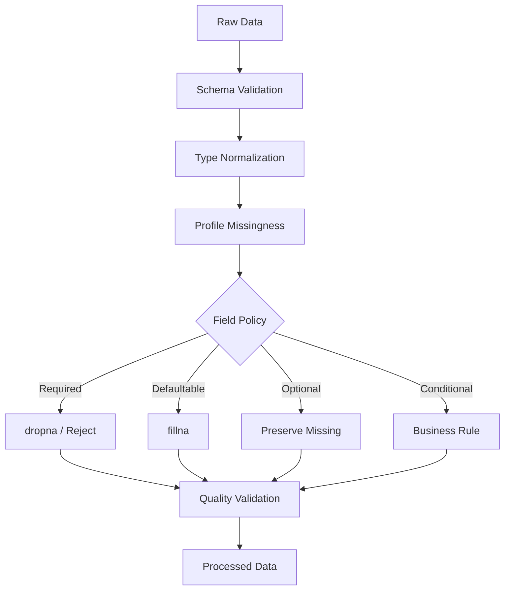

# 05- Dropna

## Overview

`dropna()` removes rows or columns containing missing values from a Pandas `Series` or `DataFrame`.

It is one of the simplest missing-data operations, but production use requires more reasoning than:

```python
df = df.dropna()
```

The important question is:

> Under what conditions does missing data make a record unusable?

For example, removing an order because its optional `coupon_code` is missing may be incorrect, while removing an order with no `order_id` may be necessary.

The typical decision flow is:

```text
Missing value detected
        ↓
Is the field required?
        ↓
    ┌───┴───┐
    ↓       ↓
   Yes      No
    ↓       ↓
Can record   Preserve /
be repaired? fill / continue
    ↓
 ┌──┴──┐
 ↓     ↓
Yes    No
 ↓     ↓
Fill   Reject
       ↓
     dropna()
```

Therefore, `dropna()` should be treated as a deliberate data-quality operation, not a universal cleanup step.

## Why `dropna()` Exists

Missing values can make records unusable for:

```text
Joins
Calculations
Aggregations
Database insertion
Reporting
Machine-readable exports
Business-rule evaluation
```

For example:

```python
orders = orders.dropna(
    subset=["order_id"]
)
```

is reasonable when `order_id` is mandatory.

By contrast:

```python
orders = orders.dropna()
```

removes any row containing any missing value, including rows with optional fields.

That can result in substantial and often silent data loss.

## Core Syntax

The most common form is:

```python
df.dropna()
```

This removes rows containing at least one missing value.

Common parameters:

```python
df.dropna(
    axis=0,
    how="any",
    subset=None,
    thresh=None,
)
```

The exact behavior depends on the parameters supplied.

## Important Parameters

| Parameter | Purpose |
|---|---|
| `axis=0` | Drop rows |
| `axis=1` | Drop columns |
| `how="any"` | Drop if any targeted value is missing |
| `how="all"` | Drop only if all targeted values are missing |
| `subset=...` | Restrict the null check to specific labels |
| `thresh=N` | Keep only rows/columns with at least `N` non-missing values |
| `ignore_index=True` | Reset the resulting row index in supported modern Pandas versions |
| `inplace=True` | Request mutation of the target object; explicit reassignment is generally clearer |

## Row-Based Dropping

The default operation:

```python
cleaned = orders.dropna()
```

removes any row containing at least one missing value.

Consider:

```text
order_id  customer_id  amount  coupon
1001      CUS-1        500     SAVE10
1002      CUS-2        200     NaN
1003      CUS-3        NaN     VIP
```

With:

```python
cleaned = orders.dropna()
```

only:

```text
1001
```

remains.

That is often too aggressive for real-world datasets.

## `subset` for Required Fields

The most useful production pattern is usually:

```python
cleaned = orders.dropna(
    subset=["order_id", "customer_id"]
)
```

Only the specified columns are considered when deciding whether to remove a row.

For example:

```text
order_id   customer_id   amount
1001       CUS-1         500
1002       CUS-2         NaN
1003       NaN           200
```

With:

```python
orders.dropna(
    subset=["order_id", "customer_id"]
)
```

the second row remains because `amount` is not part of the required-field check.

## Why `subset` Is Important

Production schemas commonly contain a mixture of:

```text
Required fields
Optional fields
Conditionally required fields
Derived fields
Operational metadata
```

Using:

```python
df.dropna()
```

ignores these distinctions.

Prefer:

```python
df.dropna(
    subset=required_columns
)
```

when the rule is specifically:

> Reject records missing required columns.

## `how="any"`

`how="any"` means:

```text
Drop if at least one selected value is missing.
```

Example:

```python
cleaned = orders.dropna(
    subset=[
        "order_id",
        "customer_id",
        "amount",
    ],
    how="any",
)
```

A row is retained only when all selected fields are non-missing.

This is useful for strict required-field validation.

## `how="all"`

`how="all"` means:

```text
Drop only if every targeted value is missing.
```

Example:

```python
cleaned = orders.dropna(
    subset=[
        "phone",
        "email",
        "alternate_email",
    ],
    how="all",
)
```

This can express:

```text
At least one contact method must exist.
```

For a row:

```text
phone            → missing
email            → present
alternate_email  → missing
```

the row is retained.

For:

```text
phone            → missing
email            → missing
alternate_email  → missing
```

the row is dropped.

## `thresh`

`thresh` specifies the minimum number of non-missing values required.

Example:

```python
cleaned = orders.dropna(
    thresh=4
)
```

This retains rows containing at least four non-missing values.

With a subset:

```python
cleaned = orders.dropna(
    subset=[
        "phone",
        "email",
        "address",
    ],
    thresh=2,
)
```

the row must contain at least two non-missing values among those columns.

This is useful for flexible completeness rules.

## `thresh` vs `how`

Use `how` for binary logic:

```text
any missing
all missing
```

Use `thresh` when the requirement is:

```text
At least N values must be present.
```

Example:

```text
At least one contact method
```

can be expressed with:

```python
df.dropna(
    subset=[
        "email",
        "phone",
    ],
    thresh=1,
)
```

This may be clearer than using a more complex boolean expression.

## Dropping Columns

`dropna()` can operate along the column axis:

```python
cleaned = df.dropna(
    axis=1
)
```

This removes columns containing missing values.

That is appropriate for specific exploratory workflows, but usually dangerous for production schemas.

One missing value in a large dataset would be enough to remove an otherwise valuable column.

A safer approach is to use `thresh`:

```python
cleaned = df.dropna(
    axis=1,
    thresh=100_000,
)
```

This keeps columns with at least the required number of non-missing observations.

## Column-Level Thresholds

Suppose a DataFrame has 1,000,000 rows and you require at least 95% completeness:

```python
minimum_non_null = int(
    len(df) * 0.95
)

cleaned = df.dropna(
    axis=1,
    thresh=minimum_non_null,
)
```

This is useful during exploratory profiling.

However, for production systems, removing columns dynamically can break downstream schemas.

Schema contracts should generally determine whether a column is allowed to disappear.

## Dropping on `Series`

`dropna()` also works on a Series:

```python
amounts = orders["amount"].dropna()
```

This produces a Series containing only non-missing values.

The original index is preserved by default.

For example:

```text
index   amount
0       100
1       NaN
2       300
```

becomes:

```text
index   amount
0       100
2       300
```

Index preservation matters when the filtered Series is later aligned with another object.

## Index Preservation

By default, dropping rows does not renumber the remaining index.

Example:

```python
cleaned = orders.dropna(
    subset=["customer_id"]
)
```

If rows `1` and `4` were removed, the resulting index may be:

```text
0
2
3
5
```

This is usually correct because the original labels still identify the original rows.

Do not reset the index automatically unless the downstream consumer expects a new positional index.

## Resetting the Index

If a clean sequential index is desired:

```python
cleaned = orders.dropna(
    subset=["customer_id"],
).reset_index(
    drop=True
)
```

In supported modern Pandas versions, an equivalent form can be:

```python
cleaned = orders.dropna(
    subset=["customer_id"],
    ignore_index=True,
)
```

The important distinction is:

```text
Preserve source row labels
```

versus:

```text
Create a new result index
```

Make that choice deliberately.

## `dropna()` Does Not Drop Empty Strings

This is a common mistake.

For example:

```python
df = pd.DataFrame(
    {
        "customer_id": [
            "CUS-1",
            "",
            None,
        ]
    }
)

cleaned = df.dropna(
    subset=["customer_id"]
)
```

The empty string remains because:

```text
""
```

is not the same as a Pandas missing value.

Normalize first when empty strings or whitespace should be treated as invalid:

```python
df["customer_id"] = (
    df["customer_id"]
    .astype("string")
    .str.strip()
)

df = df.loc[
    df["customer_id"].ne("")
    & df["customer_id"].notna()
].copy()
```

## `dropna()` Does Not Validate Values

This:

```python
orders.dropna(
    subset=["amount"]
)
```

does not guarantee that `amount` is valid.

The dataset can still contain:

```text
-100
0
"invalid"
1e20
```

depending on the dtype and prior normalization.

A robust pipeline separates:

```text
Missingness validation
+
Type validation
+
Domain validation
```

## `dropna()` and Data Types

`dropna()` generally removes rows or columns rather than replacing values.

This usually makes it less likely to alter the surviving values' types directly.

However, removing columns can change downstream schema, and dropping rows can change how subsequent operations behave.

Always validate output schema when `dropna()` is part of a reusable data pipeline.

## `dropna()` vs `fillna()`

The fundamental distinction:

| Operation | Effect |
|---|---|
| `dropna()` | Remove rows/columns containing missing values |
| `fillna()` | Replace missing values |
| `isna()` | Detect missing values |
| `notna()` | Detect non-missing values |

Example:

```python
orders = orders.dropna(
    subset=["order_id"]
)
```

versus:

```python
orders["status"] = (
    orders["status"]
    .fillna("pending")
)
```

Use `dropna()` when the record should not proceed without the required value.

Use `fillna()` when a valid replacement exists.

## `dropna()` vs Boolean Filtering

For simple null checks:

```python
orders.dropna(
    subset=["customer_id"]
)
```

is concise.

An equivalent explicit filter is:

```python
orders.loc[
    orders["customer_id"].notna()
]
```

The choice depends on intent.

Use `dropna()` when the operation is explicitly:

```text
Remove records because of missing values.
```

Use boolean filtering when null handling is part of a larger business rule:

```python
orders.loc[
    orders["customer_id"].notna()
    & orders["amount"].ge(0)
]
```

## `dropna()` vs `query()`

`query()` is useful for value-based conditions but is not the most direct tool for null removal.

Prefer:

```python
orders.dropna(
    subset=["customer_id"]
)
```

over attempting to express simple null filtering through a string query.

For mixed conditions, explicit boolean masks are generally clearer.

## Conditional Missingness

Some fields are required only under specific conditions.

For example:

```text
status = completed
→ completed_at required
```

`dropna(subset=["completed_at"])` would incorrectly remove valid pending orders.

Instead:

```python
invalid_completed = (
    orders["status"].eq("completed")
    & orders["completed_at"].isna()
)

valid_orders = orders.loc[
    ~invalid_completed
].copy()
```

This illustrates an important limitation of `dropna()`:

> It cannot express state-dependent business rules by itself.

Use boolean validation logic when requirements depend on other columns.

## At Least One Required Field

Suppose a customer must provide one of:

```text
email
phone
```

Use:

```python
customers = customers.dropna(
    subset=[
        "email",
        "phone",
    ],
    how="all",
)
```

This is concise and expresses the rule directly:

```text
Drop only if both are missing.
```

## Required Group of Fields

Suppose a shipping address requires:

```text
street
city
postal_code
```

You can require all three:

```python
orders = orders.dropna(
    subset=[
        "street",
        "city",
        "postal_code",
    ],
    how="any",
)
```

This means:

```text
Any missing address component
    → reject row
```

This is appropriate only if partial addresses are unusable.

## Selective Dropping with `subset`

Consider:

```python
orders.dropna(
    subset=[
        "order_id",
        "status",
    ]
)
```

Pandas checks those fields but retains other missing optional columns.

This is often the safest production use of `dropna()`.

## Multiple Missing-Value Rules

Different fields may need different policies.

For example:

```python
orders = orders.dropna(
    subset=["order_id", "customer_id"]
)

orders["priority"] = (
    orders["priority"]
    .fillna("normal")
)
```

The pipeline expresses:

```text
Identifiers
    → mandatory

Priority
    → defaultable
```

Avoid attempting to solve the entire dataset's missingness with one operation.

## Data Quality Workflow

A production cleaning flow may look like:



`dropna()` is one branch of the overall decision system rather than the entire missing-data strategy.

## Rejected Records

Do not discard rejected rows blindly.

Instead:

```python
valid_mask = (
    orders["order_id"].notna()
    & orders["customer_id"].notna()
)

valid_orders = orders.loc[
    valid_mask
].copy()

rejected_orders = orders.loc[
    ~valid_mask
].copy()
```

This is often preferable to:

```python
valid_orders = orders.dropna(
    subset=[
        "order_id",
        "customer_id",
    ]
)
```

when the pipeline needs to preserve rejected data for:

```text
Monitoring
Quarantine
Correction
Replay
Audit
```

The latter is excellent when only the cleaned result is required.

## Rejection Reasons

For production quality systems, add a reason before dropping.

```python
rejected = orders.loc[
    orders["order_id"].isna()
    | orders["customer_id"].isna()
].copy()

rejected["rejection_reason"] = (
    rejected["order_id"]
    .isna()
    .map(
        {
            True: "missing_order_id",
            False: "",
        }
    )
)
```

For multiple possible failures, use explicit flags or a classification step.

This creates an important distinction:

```text
dropna()
    → transformation

quality diagnostics
    → observability
```

## Database Analogy

In SQL, a similar operation might be:

```sql
SELECT
    order_id,
    customer_id,
    amount
FROM orders
WHERE customer_id IS NOT NULL;
```

Pandas:

```python
orders = orders.dropna(
    subset=["customer_id"]
)
```

The semantics are similar, but the execution environment differs:

```text
SQL
    → database engine

Pandas
    → in-memory Python process
```

If the source is PostgreSQL and the dataset is large, it may be better to push the filter down to SQL:

```python
orders = pd.read_sql(
    """
    SELECT
        order_id,
        customer_id,
        amount
    FROM orders
    WHERE customer_id IS NOT NULL
    """,
    connection,
)
```

This reduces data transferred into the application.

## Database Constraints

If a field is fundamentally mandatory, the database should ideally enforce it:

```sql
customer_id TEXT NOT NULL
```

Pandas-side `dropna()` is useful for:

```text
Batch preprocessing
Historical cleanup
External source normalization
Reporting
Pre-ingestion validation
```

It should not become a substitute for authoritative database constraints.

## API Data

An API response may contain incomplete records.

For example:

```python
orders = pd.DataFrame(
    response_data
)

orders = orders.dropna(
    subset=[
        "order_id",
        "customer_id",
    ]
)
```

Before dropping, determine whether the missing fields indicate:

```text
Recoverable source issue
Optional data
Invalid API response
Version incompatibility
```

For internal APIs, schema validation should ideally detect contract violations before data reaches downstream processing.

## Parquet and Data Publication

A cleaned dataset may be written to Parquet:

```python
cleaned.to_parquet(
    "processed/orders.parquet",
    index=False,
)
```

Before publication, validate that `dropna()` did not remove a surprising proportion of records.

Example:

```python
input_rows = len(orders)
output_rows = len(cleaned)

dropped_rows = (
    input_rows - output_rows
)

drop_rate = (
    dropped_rows / input_rows
    if input_rows
    else 0.0
)
```

A sudden drop-rate increase can indicate an upstream regression rather than simply "better cleaning."

## Monitoring Drop Rates

Dropping records is data loss by design, so it should be measurable.

Track:

```text
Input rows
Output rows
Rows dropped
Drop rate
Drops by field
Drops by source
Drops by batch
```

Example:

```python
before = len(orders)

cleaned = orders.dropna(
    subset=[
        "order_id",
        "customer_id",
    ]
)

after = len(cleaned)

metrics = {
    "input_rows": before,
    "output_rows": after,
    "dropped_rows": before - after,
}
```

For production, export these metrics to CloudWatch, Prometheus, Datadog, or another observability platform.

## Quality Thresholds

A pipeline can stop publication if too many rows are dropped:

```python
drop_rate = (
    (before - after) / before
    if before
    else 0.0
)

if drop_rate > 0.10:
    raise RuntimeError(
        "Excessive row rejection rate."
    )
```

This prevents a source-system regression from silently producing a dramatically smaller dataset.

The threshold should be based on historical behavior and business impact.

## Performance Considerations

`dropna()` is vectorized and generally preferable to manual row iteration.

Prefer:

```python
cleaned = orders.dropna(
    subset=["customer_id"]
)
```

over:

```python
rows = []

for _, row in orders.iterrows():
    if pd.notna(row["customer_id"]):
        rows.append(row)
```

The Pandas operation is clearer and avoids Python-level row processing.

## Memory Considerations

Dropping rows creates a result that may require additional memory depending on the operation and surrounding pipeline.

Avoid unnecessary copies:

```python
filtered = orders.dropna(
    subset=["customer_id"]
)

result = filtered.copy()
```

when the second copy provides no ownership benefit.

For large datasets, focus on:

```text
Required-column projection
Chunking
Source-side filtering
Appropriate dtypes
Avoiding unnecessary intermediate DataFrames
```

## Dropping Columns and Memory

When removing a column:

```python
df = df.drop(
    columns=["unused_field"]
)
```

you may reduce the retained dataset width, but creating intermediate DataFrames still has memory implications.

If the column is not needed downstream, it is often better to avoid loading it in the first place:

```python
pd.read_csv(
    "orders.csv",
    usecols=[
        "order_id",
        "customer_id",
        "amount",
    ],
)
```

Source projection is generally better than loading unnecessary columns and deleting them later.

## Chunked Processing

For large CSV files:

```python
for chunk in pd.read_csv(
    "orders.csv",
    chunksize=100_000,
):
    cleaned = chunk.dropna(
        subset=[
            "order_id",
            "customer_id",
        ]
    )

    persist_chunk(cleaned)
```

This keeps the active DataFrame bounded.

However, global rules must be considered separately.

For example:

```text
Drop rows missing customer_id
```

is chunk-local.

But:

```text
Drop duplicate order_id across the entire file
```

requires global state or a different execution strategy.

## `dropna()` and Global Quality Rules

Chunking does not eliminate the need for global validation.

For example:

```text
Chunk 1
ORD-1001

Chunk 2
ORD-1001
```

Each chunk individually has no duplicate.

The combined dataset does.

A mature pipeline distinguishes:

```text
Chunk-local validation
```

from:

```text
Dataset-global validation
```

## Order of Operations

The order of cleaning operations matters.

For example:

```python
orders["amount"] = pd.to_numeric(
    orders["amount"],
    errors="coerce",
)

orders = orders.dropna(
    subset=["amount"]
)
```

This means malformed numeric values become missing and are then removed.

If you drop before conversion:

```python
orders = orders.dropna(
    subset=["amount"]
)

orders["amount"] = pd.to_numeric(
    orders["amount"],
    errors="coerce",
)
```

malformed strings remain and may later become missing.

This illustrates a broader principle:

```text
Normalize representation
    ↓
Detect resulting invalidity
    ↓
Apply rejection policy
```

## `dropna()` and Duplicate Handling

Missing values can interact with deduplication.

A pipeline might:

```python
orders = orders.dropna(
    subset=["order_id"]
)

orders = (
    orders
    .sort_values("updated_at")
    .drop_duplicates(
        subset=["order_id"],
        keep="last",
    )
)
```

This means:

```text
First reject rows without business keys
Then deduplicate valid business records
```

The order can be important because records without valid keys should not influence business-key deduplication.

## `dropna()` and Joins

Removing null keys before a join can be useful:

```python
orders = orders.dropna(
    subset=["customer_id"]
)

orders = orders.merge(
    customers,
    on="customer_id",
    how="left",
)
```

This prevents records without customer IDs from entering the join.

But whether they should be dropped depends on the purpose.

For data-quality reporting, retaining and counting them may be more useful.

## Empty DataFrames

`dropna()` behaves safely on empty DataFrames:

```python
empty = orders.iloc[:0]

cleaned = empty.dropna(
    subset=["customer_id"]
)
```

The result remains empty.

Production systems should still distinguish:

```text
No records
```

from:

```text
All records rejected
```

These can have completely different operational meanings.

For example:

```text
Input rows = 0
    → upstream source returned no data

Input rows = 10,000
Output rows = 0
    → catastrophic quality failure
```

## All Rows Dropped

A strict rule can remove everything:

```python
cleaned = orders.dropna(
    subset=[
        "order_id",
        "customer_id",
        "amount",
    ]
)
```

Always monitor the result size.

A quality gate can prevent publication:

```python
if len(orders) > 0 and len(cleaned) == 0:
    raise RuntimeError(
        "All input records were rejected."
    )
```

Whether this should fail depends on the pipeline contract.

## Security Considerations

`dropna()` should never be used to resolve authorization or tenant-isolation problems.

For example:

```python
users = users.dropna(
    subset=["tenant_id"]
)
```

does not establish secure tenant isolation.

Access control should be enforced through:

```text
Application authorization
Database constraints
Query scoping
Identity context
```

Dropping records with missing security metadata is a quality action, not an authorization mechanism.

Similarly, do not populate or infer sensitive identifiers merely to avoid `dropna()`.

## Privacy and Data Retention

Dropping records can be part of privacy workflows, but deletion requirements should be handled according to the system's data-retention policies.

Pandas transformations do not establish:

```text
Deletion guarantees
Database retention policies
Object-store lifecycle rules
Legal holds
Audit controls
```

For regulated systems, the authoritative retention and deletion mechanisms belong to the storage and governance layers.

## Testing `dropna()`

Test the exact rejection policy.

```python
import pandas as pd


def test_drops_orders_missing_required_customer() -> None:
    orders = pd.DataFrame(
        {
            "order_id": [
                "ORD-1",
                "ORD-2",
            ],
            "customer_id": [
                "CUS-1",
                pd.NA,
            ],
            "amount": [
                100.0,
                200.0,
            ],
        }
    )

    result = orders.dropna(
        subset=["customer_id"]
    )

    assert result["order_id"].tolist() == [
        "ORD-1",
    ]
```

This verifies the business rule:

```text
customer_id is required
```

## Testing Optional Missing Fields

Make sure optional fields do not cause unintended row removal:

```python
def test_optional_field_does_not_cause_rejection() -> None:
    orders = pd.DataFrame(
        {
            "order_id": ["ORD-1"],
            "customer_id": ["CUS-1"],
            "coupon_code": [pd.NA],
        }
    )

    result = orders.dropna(
        subset=[
            "order_id",
            "customer_id",
        ]
    )

    assert len(result) == 1
```

This protects against accidental use of:

```python
dropna()
```

without `subset`.

## Testing `how="all"`

```python
def test_drops_rows_when_all_contact_fields_are_missing() -> None:
    customers = pd.DataFrame(
        {
            "customer_id": [
                "CUS-1",
                "CUS-2",
            ],
            "email": [
                "user@example.com",
                pd.NA,
            ],
            "phone": [
                pd.NA,
                pd.NA,
            ],
        }
    )

    result = customers.dropna(
        subset=[
            "email",
            "phone",
        ],
        how="all",
    )

    assert result["customer_id"].tolist() == [
        "CUS-1",
    ]
```

## Testing `thresh`

```python
def test_requires_minimum_non_missing_values() -> None:
    customers = pd.DataFrame(
        {
            "email": [
                "user@example.com",
                pd.NA,
            ],
            "phone": [
                pd.NA,
                pd.NA,
            ],
            "country": [
                "IN",
                "IN",
            ],
        }
    )

    result = customers.dropna(
        subset=[
            "email",
            "phone",
        ],
        thresh=1,
    )

    assert len(result) == 1
```

This verifies the "at least one value" requirement.

## Testing Drop Rate

For ETL pipelines, test that expected record counts are preserved.

```python
before = len(orders)

cleaned = orders.dropna(
    subset=["customer_id"]
)

after = len(cleaned)

assert after == before - 1
```

For production systems, row-count assertions should reflect deterministic fixture data rather than real-time expectations.

## Common Mistakes

| Mistake | Why it happens | Better approach |
|---|---|---|
| Calling `dropna()` on the entire DataFrame | Fastest-looking cleanup | Use `subset` for required fields |
| Treating every null as invalid | Missingness is assumed to be a defect | Define field-specific policies |
| Dropping empty strings | Empty string is not a null value | Normalize and validate explicitly |
| Dropping on optional columns | Schema semantics are ignored | Restrict `subset` |
| Using `dropna()` for conditional rules | Business state is ignored | Use boolean masks |
| Dropping without measuring | Data loss becomes invisible | Track drop counts and rates |
| Assuming non-null means valid | Completeness is confused with validity | Add type and domain checks |
| Dropping before parsing | Invalid strings survive | Normalize types before rejection |
| Deduplicating before validating keys | Invalid keys can affect deduplication | Validate required keys first |
| Using Pandas filtering for database-wide cleanup | Wrong execution layer | Push large relational operations into SQL |
| Dropping records without quarantine | Rejected data is unrecoverable | Persist invalid records when required |
| Resetting index automatically | Source identity is lost | Reset only when required |
| Dropping columns dynamically in production | Downstream schema can break | Enforce schema contracts |

## Production Pitfalls

### Silent Data Loss

This is risky:

```python
orders = orders.dropna()
```

It may remove large numbers of legitimate records because unrelated optional fields are missing.

Prefer:

```python
orders = orders.dropna(
    subset=[
        "order_id",
        "customer_id",
    ]
)
```

when those are the actual required fields.

### Quality Regression Hidden by Successful Job

A batch can complete successfully while dropping 40% of records.

Track:

```python
drop_rate = (
    (len(orders) - len(cleaned))
    / len(orders)
    if len(orders)
    else 0.0
)
```

Then alert or fail according to the pipeline contract.

### Losing Rejected Records

If the source cannot be reproduced, discarded rows may be unrecoverable.

Prefer a split:

```python
valid_mask = (
    orders["order_id"].notna()
    & orders["customer_id"].notna()
)

valid = orders.loc[
    valid_mask
].copy()

rejected = orders.loc[
    ~valid_mask
].copy()
```

when auditability or replay matters.

### Misusing `how="all"`

This:

```python
df.dropna(
    subset=["email", "phone"],
    how="all",
)
```

means:

```text
Drop if both are missing.
```

It does not mean:

```text
Require both values.
```

For both required:

```python
df.dropna(
    subset=["email", "phone"],
    how="any",
)
```

The distinction is an interview and production trap.

## Interview Traps

### What Does `dropna()` Do?

It removes rows or columns containing missing values according to the specified axis and rules.

### What Is the Default Behavior?

Conceptually:

```python
df.dropna(
    axis=0,
    how="any",
)
```

removes rows containing at least one missing value.

### Why Is `dropna()` Often Dangerous Without `subset`?

Because one missing optional field can remove an otherwise valid record.

### What Does `how="any"` Mean?

Drop when at least one targeted value is missing.

### What Does `how="all"` Mean?

Drop only when all targeted values are missing.

### What Does `thresh=3` Mean?

Retain only rows or columns containing at least three non-missing values along the selected axis.

### What Does `subset` Do?

It restricts which columns or index labels are examined for missingness.

For example:

```python
df.dropna(
    subset=["customer_id"]
)
```

checks only `customer_id`.

### Does `dropna()` Detect Empty Strings?

No.

```text
""
```

is not automatically a missing value.

### Does `dropna()` Validate Data?

Only missingness.

It does not determine whether non-missing values satisfy business rules.

### Does `dropna()` Reset the Index?

Not by default. Remaining row labels are preserved unless the result is explicitly reindexed or `ignore_index=True` is used where supported.

### When Should You Use `dropna()` Instead of a Boolean Mask?

Use `dropna()` when the rule is fundamentally:

```text
Remove rows or columns because selected values are missing.
```

Use a boolean mask when the rule depends on:

```text
Multiple conditions
Ranges
Categories
Cross-column state
Business invariants
```

### Should Missing IDs Be Filled or Dropped?

Usually, validate whether the record can be processed without the identifier. Synthetic IDs should not be invented merely to avoid dropping records.

### Is `dropna()` an Appropriate Replacement for SQL `NOT NULL`?

No. Pandas can enforce a preprocessing rule, but the database should enforce authoritative persistence constraints.

### Can `dropna()` Be Used with Large Datasets?

Yes, but Pandas remains in-memory. For very large data, consider source-side filtering, chunk processing, SQL, Spark, or another scalable execution engine.

## Recommended Engineering Pattern

For a production orders pipeline, explicitly define the required fields:

```python
import pandas as pd


def split_valid_orders(
    orders: pd.DataFrame,
) -> tuple[
    pd.DataFrame,
    pd.DataFrame,
]:
    required_columns = [
        "order_id",
        "customer_id",
    ]

    missing_columns = [
        column
        for column in required_columns
        if column not in orders.columns
    ]

    if missing_columns:
        raise ValueError(
            "Missing required columns: "
            f"{missing_columns}"
        )

    valid_mask = (
        orders[required_columns]
        .notna()
        .all(axis=1)
    )

    valid_orders = orders.loc[
        valid_mask
    ].copy()

    rejected_orders = orders.loc[
        ~valid_mask
    ].copy()

    return valid_orders, rejected_orders
```

This is often better than immediately calling:

```python
orders.dropna(
    subset=required_columns
)
```

when the pipeline needs to retain rejected records.

When only the cleaned dataset is required, the concise form is appropriate:

```python
valid_orders = orders.dropna(
    subset=[
        "order_id",
        "customer_id",
    ]
).copy()
```

## Recommended Decision Framework

Before using `dropna()`, ask:

```text
What field is missing?
        ↓
Is missingness allowed?
        ↓
If not, can it be safely repaired?
        ↓
If it cannot be repaired, should the record be rejected?
        ↓
Do rejected rows need to be retained?
        ↓
What percentage of records may be rejected?
        ↓
What should happen if the drop rate changes unexpectedly?
```

This turns `dropna()` from a convenience method into an explicit quality-control operation.

## Key Takeaways

- Use `dropna()` to remove records or columns because of missing values, but prefer `subset` so optional fields do not cause accidental data loss.
- Understand `how="any"`, `how="all"`, and `thresh` precisely; these parameters express different completeness rules and are common sources of bugs.
- `dropna()` handles missingness only—it does not detect empty strings, malformed values, invalid business states, or incorrect dtypes.
- In production ETL, measure rows dropped and rejection rates, preserve rejected records when replay or auditing matters, and distinguish chunk-local from global quality rules.
- Use Pandas `dropna()` for appropriate in-memory preprocessing, while relying on SQL constraints and database-side filtering for authoritative integrity and large-scale relational workloads.