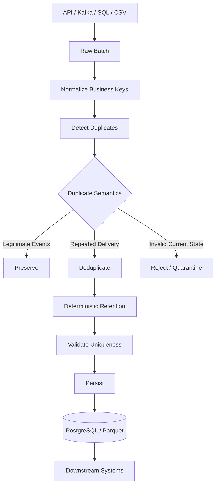

# 06- Duplicate Data

## Overview

Duplicate data occurs when multiple records represent the same logical entity, event, transaction, or state when the dataset expects uniqueness.

Duplicates are a data-quality problem, but they are not automatically errors.

For example:

```text
order_id   status       amount
ORD-1001   processing   500
ORD-1001   completed    500
```

These two records may represent:

```text
A duplicate row
A retry
Two versions of the same order
An event history
A state transition
```

The correct treatment depends on the source's data model.

In Pandas, duplicate analysis is primarily built around:

```python
df.duplicated()
df.drop_duplicates()
```

The difficult part is not learning these methods. The difficult part is defining:

```text
What makes two records the same?
Which fields form the business key?
Which record should survive?
Are repeated events valid?
Can the operation be safely retried?
```

A production duplicate-handling workflow is therefore:

```text
Raw data
    ↓
Identify business key
    ↓
Detect duplicates
    ↓
Understand duplicate semantics
    ↓
Choose retention strategy
    ↓
Deduplicate or preserve history
    ↓
Validate uniqueness
    ↓
Measure rejected records
    ↓
Persist result
```

## Why Duplicate Data Matters

Duplicates can distort almost every downstream operation.

Consider:

```python
orders["amount"].sum()
```

If the same transaction appears twice, revenue is overstated.

Grouping can also become incorrect:

```python
orders.groupby(
    "customer_id"
)["amount"].sum()
```

Joins can multiply records:

```text
Orders
    ↓
duplicate order_id
    ↓
Customer join
    ↓
unexpected row multiplication
```

Duplicates can therefore cause:

```text
Incorrect revenue
Incorrect counts
Incorrect customer metrics
Incorrect inventory calculations
Duplicate API responses
Repeated event processing
Incorrect database writes
```

## Common Sources of Duplicates

Duplicates are commonly introduced by:

| Source | Typical cause |
|---|---|
| REST API | Retry or repeated pagination |
| Kafka | At-least-once delivery |
| Celery | Task retry |
| Batch jobs | Reprocessing the same partition |
| CSV exports | Multiple exports concatenated |
| SQL joins | One-to-many relationship misunderstood |
| Manual data entry | Repeated submissions |
| CDC pipelines | Replay or checkpoint errors |
| Database replication | Incorrect extraction logic |
| Historical snapshots | Same entity represented across versions |

The source mechanism often determines the correct deduplication strategy.

## Duplicate Definitions

There are several distinct kinds of duplicates.

### Exact-Row Duplicate

Every relevant field is identical:

```text
order_id   status       amount
ORD-1001   completed    500
ORD-1001   completed    500
```

This may indicate:

```text
Repeated ingestion
Duplicate export
Message retry
```

Detect with:

```python
duplicates = orders[
    orders.duplicated()
]
```

### Business-Key Duplicate

Two rows share the same domain identifier:

```text
order_id   status
ORD-1001   processing
ORD-1001   completed
```

These are duplicates only if the dataset is expected to contain one current row per order.

Detect with:

```python
duplicates = orders[
    orders.duplicated(
        subset=["order_id"],
        keep=False,
    )
]
```

### Event Duplicate

Two records contain the same event identifier:

```text
event_id   event_type
EVT-1001   order.created
EVT-1001   order.created
```

This usually indicates duplicate delivery and may be safely deduplicated if the event ID is globally unique.

### Versioned Record

Multiple rows may intentionally represent different versions:

```text
order_id   updated_at             status
ORD-1001   2026-09-10 09:00 UTC  pending
ORD-1001   2026-09-10 10:00 UTC  completed
```

These are not necessarily duplicates.

Deleting one row could destroy legitimate state history.

## Business Key

The business key defines the identity of a record for a specific dataset.

Examples:

```text
Orders
    → order_id

Transactions
    → transaction_id

Events
    → event_id

Customer snapshot
    → customer_id

Daily customer snapshot
    → customer_id + snapshot_date
```

Composite keys are common:

```python
duplicates = snapshots[
    snapshots.duplicated(
        subset=[
            "customer_id",
            "snapshot_date",
        ],
        keep=False,
    )
]
```

The right key is a domain decision, not a Pandas decision.

## Why Entire-Row Deduplication Is Often Insufficient

Consider:

```text
order_id   customer_id   status
ORD-1      CUS-1         pending
ORD-1      CUS-1         completed
```

The rows are not identical, so:

```python
orders.drop_duplicates()
```

will not remove either row.

But:

```python
orders.drop_duplicates(
    subset=["order_id"]
)
```

will.

Whether that is correct depends on whether the dataset represents:

```text
Current state
```

or:

```text
Historical state transitions
```

Always identify the data model before choosing the key.

## Detecting Duplicates with `duplicated()`

The standard syntax:

```python
df.duplicated()
```

returns a boolean Series.

Example:

```python
duplicate_mask = orders.duplicated(
    subset=["order_id"],
    keep=False,
)
```

Then:

```python
duplicate_orders = orders.loc[
    duplicate_mask
]
```

This gives all records participating in duplicate groups.

Using `keep=False` is particularly useful for investigation because it marks every member of the duplicate group.

## `keep` Behavior

`duplicated()` supports:

```text
keep="first"
keep="last"
keep=False
```

Example:

```python
orders.duplicated(
    subset=["order_id"],
    keep="first",
)
```

The first occurrence is treated as the original, and later occurrences are marked duplicate.

With:

```python
orders.duplicated(
    subset=["order_id"],
    keep="last",
)
```

the last occurrence is retained as the non-duplicate.

With:

```python
orders.duplicated(
    subset=["order_id"],
    keep=False,
)
```

every record in a duplicated group is marked `True`.

## Detecting Only Duplicate Records

To inspect duplicates:

```python
duplicates = orders.loc[
    orders.duplicated(
        subset=["order_id"],
        keep=False,
    )
].copy()
```

This is useful for:

```text
Data-quality reports
Incident investigation
Duplicate profiling
Quarantine workflows
```

## Counting Duplicate Records

Count rows marked duplicate:

```python
duplicate_count = int(
    orders.duplicated(
        subset=["order_id"],
    ).sum()
)
```

Note the default:

```text
keep="first"
```

means the first occurrence is not counted as a duplicate.

If you want the number of rows involved in duplicate groups:

```python
duplicate_group_rows = int(
    orders.duplicated(
        subset=["order_id"],
        keep=False,
    ).sum()
)
```

These metrics answer different questions.

## Counting Duplicate Keys

Sometimes the more useful metric is:

```text
How many distinct keys have duplicates?
```

For example:

```python
duplicate_keys = (
    orders.loc[
        orders.duplicated(
            subset=["order_id"],
            keep=False,
        ),
        "order_id",
    ]
    .nunique()
)
```

This distinguishes:

```text
Duplicate rows
```

from:

```text
Duplicate business entities
```

## Duplicate Frequency

To understand the severity:

```python
duplicate_counts = (
    orders["order_id"]
    .value_counts()
)

duplicate_keys = (
    duplicate_counts[
        duplicate_counts.gt(1)
    ]
)
```

This can reveal:

```text
ORD-1 → 2 records
ORD-8 → 5 records
ORD-9 → 20 records
```

A key occurring 20 times may indicate a fundamentally different source problem from a single two-row duplicate.

## Grouping Duplicate Records

For detailed profiling:

```python
duplicate_summary = (
    orders
    .groupby("order_id")
    .size()
    .reset_index(
        name="record_count"
    )
    .query("record_count > 1")
)
```

This can be useful for reporting:

```text
order_id   record_count
ORD-1001   2
ORD-1045   3
ORD-2001   7
```

## `drop_duplicates()`

To remove duplicates:

```python
cleaned = orders.drop_duplicates(
    subset=["order_id"]
)
```

By default:

```text
keep="first"
```

is used.

This means the first row for each duplicate key is retained.

That is only safe when the DataFrame order already represents the intended retention policy.

## Deterministic Deduplication

A common mistake is:

```python
cleaned = orders.drop_duplicates(
    subset=["order_id"],
    keep="last",
)
```

and assuming "last" means:

```text
Most recent record
```

It does not.

It means:

```text
Last occurrence in the current DataFrame order
```

For latest-record semantics, sort explicitly:

```python
cleaned = (
    orders
    .sort_values(
        [
            "order_id",
            "updated_at",
        ]
    )
    .drop_duplicates(
        subset=["order_id"],
        keep="last",
    )
)
```

Now the retention rule is:

```text
For each order_id
    ↓
sort by updated_at
    ↓
keep latest row
```

## Stable Tie-Breaking

If two records have the same timestamp:

```text
order_id   updated_at             status
ORD-1      10:00                  processing
ORD-1      10:00                  completed
```

then sorting only by `updated_at` may not fully define which row survives.

Use a deterministic secondary key where possible:

```python
cleaned = (
    orders
    .sort_values(
        [
            "order_id",
            "updated_at",
            "event_id",
        ],
        ascending=[
            True,
            True,
            True,
        ],
    )
    .drop_duplicates(
        subset=["order_id"],
        keep="last",
    )
)
```

A deterministic tie-breaker improves:

```text
Reproducibility
Retry behavior
Testing
Incident investigation
Backfills
```

## Sorting Before Deduplication

The general pattern for latest-record selection is:

```python
latest_orders = (
    orders
    .sort_values(
        [
            "order_id",
            "updated_at",
        ]
    )
    .drop_duplicates(
        subset=["order_id"],
        keep="last",
    )
)
```

This is one of the most important production deduplication patterns.

## Deduplication by Multiple Columns

Composite uniqueness:

```python
orders = orders.drop_duplicates(
    subset=[
        "customer_id",
        "product_id",
        "order_date",
    ]
)
```

This means the combination is treated as the identity.

A composite key is useful for data such as:

```text
Customer + Date
Product + Warehouse
Account + Currency
Device + Event Timestamp
Employee + Effective Date
```

The key should match the actual business uniqueness constraint.

## Exact Duplicate Removal

For exact duplicate records:

```python
cleaned = orders.drop_duplicates()
```

This compares the relevant row values.

Use this when the data model says:

```text
Two rows with identical data represent the same record.
```

Do not use it as a substitute for business-key deduplication.

## Duplicate Detection Before Deduplication

Production workflows should usually measure first:

```python
duplicate_mask = orders.duplicated(
    subset=["order_id"],
    keep=False,
)

duplicate_count = int(
    duplicate_mask.sum()
)
```

Then decide whether:

```text
Zero duplicates
Expected small number
Unexpected spike
Unacceptable volume
```

Deduplicating without measurement hides upstream problems.

## Duplicate Rate

Calculate duplicate participation:

```python
duplicate_rate = (
    duplicate_count / len(orders)
    if len(orders)
    else 0.0
)
```

For example:

```text
Input rows:       1,000,000
Duplicate rows:      5,000
Duplicate rate:       0.5%
```

Track this over time.

A sudden increase can indicate:

```text
API retries
Kafka consumer issues
Pipeline replay
Broken partitioning
Source-system regression
```

## Duplicate Data as an Operational Signal

Duplicates are often symptoms rather than the underlying problem.

For example:

```text
Duplicate event rate increases
        ↓
Consumer retry rate increased
        ↓
Downstream API latency increased
        ↓
Task processing exceeded timeout
```

Therefore, a deduplication stage should often be accompanied by source-level monitoring.

Deduplication can protect downstream correctness while still allowing the team to investigate the root cause.

## Deduplication and Idempotency

Deduplication is closely related to idempotency.

Suppose a Celery task processes:

```text
event_id = EVT-1001
```

and retries.

Without idempotency:

```text
EVT-1001
    ↓
process
    ↓
write output

retry
    ↓
process again
    ↓
write duplicate output
```

With deterministic deduplication:

```text
EVT-1001
    ↓
detect existing event
    ↓
skip / update
```

Pandas can deduplicate an in-memory batch, but durable idempotency should generally be enforced in the persistence layer.

## Database Uniqueness

For authoritative uniqueness, use database constraints where appropriate.

PostgreSQL:

```sql
CREATE UNIQUE INDEX
    orders_order_id_unique
ON orders (order_id);
```

Pandas:

```python
orders = orders.drop_duplicates(
    subset=["order_id"]
)
```

These serve different roles:

```text
Pandas
    → preprocessing / batch normalization

Database
    → authoritative persistence constraint
```

Do not rely solely on Pandas to protect a database from duplicate writes.

## Upsert Workflows

A common backend pattern is:

```text
Extract records
    ↓
Deduplicate batch
    ↓
Validate
    ↓
Upsert into PostgreSQL
```

Pandas can prepare the batch:

```python
batch = (
    orders
    .sort_values("updated_at")
    .drop_duplicates(
        subset=["order_id"],
        keep="last",
    )
)
```

The database should enforce the final uniqueness constraint and perform the transactional write.

## Duplicate Joins

Joins are a major source of unexpected duplicates.

Suppose:

```text
customers
    customer_id → unique

orders
    customer_id → many
```

Joining orders to customers is expected to increase row count according to the one-to-many relationship.

But if `customers` unexpectedly contains duplicate `customer_id` values:

```text
orders
    ↓
merge
    ↓
customer duplicates
    ↓
row multiplication
```

Pandas provides merge validation:

```python
orders.merge(
    customers,
    on="customer_id",
    how="left",
    validate="many_to_one",
)
```

This can detect an unexpected relationship violation.

## Duplicate Detection Before Joins

Before joining, validate the intended uniqueness:

```python
if not customers["customer_id"].is_unique:
    raise ValueError(
        "customer_id must be unique in customers"
    )
```

Then:

```python
result = orders.merge(
    customers,
    on="customer_id",
    how="left",
    validate="many_to_one",
)
```

This is safer than discovering duplicated output after aggregation.

## Duplicate Events from Kafka

Kafka commonly operates with at-least-once delivery patterns.

A consumer may receive the same event more than once.

Pandas can detect duplicates in a batch:

```python
events = events.drop_duplicates(
    subset=["event_id"],
    keep="last",
)
```

However, batch deduplication does not provide global deduplication across consumer restarts.

For durable idempotency, use:

```text
Unique database key
Idempotency store
Redis with appropriate semantics
Kafka consumer state
Compaction strategy
```

depending on the architecture.

## Redis and Deduplication

Redis can be used as an idempotency or deduplication aid:

```text
event_id
    ↓
Redis SETNX / equivalent
    ↓
first consumer → process
duplicate      → skip
```

The exact atomic operation and expiry policy matter.

Pandas should not be expected to provide distributed deduplication across workers.

## Duplicate API Records

An API may return repeated objects because of:

```text
Pagination bugs
Retries
Overlapping time windows
Eventual consistency
Repeated polling
```

A typical ingestion pipeline can normalize and deduplicate:

```python
orders = (
    orders
    .sort_values("updated_at")
    .drop_duplicates(
        subset=["order_id"],
        keep="last",
    )
)
```

But always measure the duplicate rate and investigate unexpected changes.

## Duplicate Data and Pagination

Pagination can produce overlaps.

For example:

```text
Request 1
offset=0
    → rows 1–100

Request 2
offset=100
    → rows 101–200
```

If the API changes between requests, records may shift and overlap.

Cursor-based pagination can reduce some classes of duplication, but the correct approach depends on the API contract.

Pandas can clean the final combined dataset:

```python
all_orders = pd.concat(
    pages,
    ignore_index=True,
)

all_orders = all_orders.drop_duplicates(
    subset=["order_id"],
    keep="last",
)
```

The source-pagination strategy should still be designed correctly.

## Exact Duplicates vs Near Duplicates

Exact duplicate detection:

```python
orders.duplicated()
```

does not find near duplicates such as:

```text
"Aranya Majumdar"
"Aranya  Majumdar"
" aranya majumdar "
```

or:

```text
"Customer@example.com"
"customer@example.com"
```

These require normalization first:

```python
customers["email"] = (
    customers["email"]
    .astype("string")
    .str.strip()
    .str.lower()
)
```

Then duplicate detection:

```python
duplicates = customers[
    customers.duplicated(
        subset=["email"],
        keep=False,
    )
]
```

This is a data-cleaning problem, not merely a duplicate API problem.

## Duplicate Detection After Normalization

The sequence matters:

```text
Raw values
    ↓
Normalize representation
    ↓
Define business key
    ↓
Detect duplicates
    ↓
Deduplicate
```

For example:

```python
customers["email"] = (
    customers["email"]
    .astype("string")
    .str.strip()
    .str.lower()
)

customers = customers.drop_duplicates(
    subset=["email"],
    keep="last",
)
```

Without normalization, logically identical values may remain separate.

## Missing Values and Duplicates

Missing keys need explicit treatment.

For example:

```python
orders.duplicated(
    subset=["customer_id"]
)
```

may identify repeated missing-key values according to Pandas' duplicate semantics.

But the business rule should be:

```text
customer_id required
```

or:

```text
customer_id optional
```

before deduplication decisions are made.

A common pattern is:

```python
orders = orders.dropna(
    subset=["order_id"]
)

orders = orders.drop_duplicates(
    subset=["order_id"]
)
```

This validates the business key before using it for deduplication.

## Duplicate Data and Ordering

Deduplication depends on row order when using:

```python
keep="first"
```

or:

```python
keep="last"
```

Therefore:

```python
orders.drop_duplicates(
    subset=["order_id"],
    keep="last",
)
```

is not fully deterministic unless the current ordering is deterministic.

For production pipelines:

```text
Sort explicitly
    ↓
Apply deterministic tie-breaker
    ↓
Deduplicate
```

## Duplicate Handling Strategies

| Strategy | Use case | Risk |
|---|---|---|
| Keep first | First record is authoritative | Wrong if source order is unstable |
| Keep last | Last record is authoritative | Wrong if not sorted |
| Keep latest by timestamp | Current-state records | Requires reliable timestamp |
| Aggregate duplicates | Multiple rows represent additive facts | Can double-count if semantics are wrong |
| Preserve all | Event history | No deduplication |
| Quarantine | Duplicate indicates source defect | Requires operational handling |
| Upsert | Current-state persistence | Requires database uniqueness |

## Aggregating Duplicates

Sometimes duplicate-looking rows should be combined.

For example:

```text
customer_id   date        amount
CUS-1         2026-09-10  100
CUS-1         2026-09-10  50
```

If each row is a legitimate transaction, removing one would be wrong.

Instead:

```python
daily_totals = (
    transactions
    .groupby(
        [
            "customer_id",
            "date",
        ],
        as_index=False,
    )["amount"]
    .sum()
)
```

This is not deduplication.

It is aggregation.

The distinction is important:

```text
Duplicate
    → represents the same logical fact

Multiple facts
    → represent independent events
```

## Snapshot vs Event Data

The same `order_id` can have different meanings depending on the dataset.

### Snapshot Table

```text
One row per order
```

Duplicate `order_id` is usually invalid.

### Event Table

```text
Many events per order
```

Repeated `order_id` is expected.

The correct key may instead be:

```text
event_id
```

or:

```text
order_id + event_type + event_time
```

This is why business-key design must happen before deduplication.

## Duplicate Data in Reporting

Reporting pipelines should define whether metrics operate on:

```text
Rows
Transactions
Unique entities
Events
Latest state
```

For example:

```python
orders["customer_id"].nunique()
```

measures unique customers, while:

```python
len(orders)
```

measures rows.

Duplicate records can cause these metrics to diverge unexpectedly.

## Data Quality Report

A production duplicate-quality report can include:

```python
duplicate_mask = orders.duplicated(
    subset=["order_id"],
    keep=False,
)

report = {
    "total_rows": len(orders),
    "duplicate_rows": int(
        duplicate_mask.sum()
    ),
    "duplicate_keys": int(
        orders.loc[
            duplicate_mask,
            "order_id",
        ].nunique()
    ),
}
```

Additional metrics may include:

```text
Maximum duplicate frequency
Average duplicate group size
Duplicates by source
Duplicates by processing batch
Duplicates by partition
```

## Maximum Duplicate Frequency

```python
duplicate_frequency = (
    orders["order_id"]
    .value_counts()
)

max_duplicates = int(
    duplicate_frequency.max()
)
```

This can reveal severe replay conditions.

For example:

```text
Maximum duplicate frequency = 1
    → no duplicate keys

Maximum duplicate frequency = 2
    → likely occasional retries

Maximum duplicate frequency = 1000
    → likely systemic ingestion or replay problem
```

Interpretation depends on the workload.

## Duplicate Handling in Batch Pipelines

A batch pipeline can use:

```python
def deduplicate_orders(
    orders: pd.DataFrame,
) -> pd.DataFrame:
    result = (
        orders
        .sort_values(
            [
                "order_id",
                "updated_at",
            ]
        )
        .drop_duplicates(
            subset=["order_id"],
            keep="last",
        )
    )

    return result
```

Then:

```python
before = len(orders)

cleaned = deduplicate_orders(
    orders
)

after = len(cleaned)

deduplicated_rows = before - after
```

This produces a measurable result.

## Duplicate Data and Reprocessing

Reprocessing the same source file should ideally produce the same cleaned output.

If:

```text
Source batch A
+
Source batch A
```

is processed twice, an idempotent pipeline should avoid producing duplicate business records.

A common strategy is:

```text
Deterministic business key
    ↓
Batch deduplication
    ↓
Database uniqueness
    ↓
Idempotent upsert
```

Each layer protects against different failure modes.

## Duplicate Handling and Reliability

A reliable pipeline does not merely eliminate duplicates.

It should also answer:

```text
Why did duplicates occur?
How many occurred?
Which records were affected?
Can the source be replayed?
Will retries create more duplicates?
Does the database enforce uniqueness?
```

This turns deduplication into an operational control rather than a hidden cleanup step.

## Performance Considerations

Duplicate detection is generally vectorized, but it can still be expensive on large DataFrames because Pandas must examine the selected values and maintain state for duplicate detection.

For large datasets:

```text
Reduce columns
    ↓
Normalize keys
    ↓
Detect duplicates on the smallest useful key
    ↓
Avoid unnecessary DataFrame copies
```

For example:

```python
duplicate_mask = orders[
    ["order_id"]
].duplicated(
    keep=False
)
```

may avoid some unnecessary work compared with processing unrelated columns for a business-key duplicate check.

## Memory Considerations

`duplicated()` creates a boolean mask.

For a large DataFrame:

```python
mask = orders.duplicated(
    subset=["order_id"],
    keep=False,
)
```

the mask itself consumes memory.

Avoid retaining several large masks unnecessarily.

For example:

```python
duplicate_mask = ...

duplicate_count = int(
    duplicate_mask.sum()
)

del duplicate_mask
```

can be reasonable in memory-sensitive batch processing, although Python memory management should be measured rather than optimized blindly.

## Chunked Processing

Exact or key-based duplicate detection becomes more complex with chunks.

This works independently:

```python
for chunk in pd.read_csv(
    "orders.csv",
    chunksize=100_000,
):
    duplicates = chunk.duplicated(
        subset=["order_id"],
    )
```

but it only detects duplicates within each chunk.

A duplicate split across chunks will not be detected.

Global deduplication requires state:

```text
Chunk 1
    ORD-1001 → seen

Chunk 2
    ORD-1001 → duplicate
```

Possible strategies include:

```text
External key store
Database uniqueness
Pre-sorting / partitioning
Two-pass processing
Distributed execution
```

## Global Deduplication State

For chunked processing, maintain a set only when its size is practical:

```python
seen_order_ids: set[str] = set()

for chunk in pd.read_csv(
    "orders.csv",
    chunksize=100_000,
):
    chunk["is_duplicate"] = (
        chunk["order_id"]
        .isin(seen_order_ids)
    )

    seen_order_ids.update(
        chunk["order_id"]
        .dropna()
        .tolist()
    )
```

This can work for bounded datasets.

For millions or billions of keys, a Python set may consume excessive memory. Use an external or database-backed strategy when appropriate.

## SQL-Based Deduplication

For database-scale data, SQL may be a better execution layer.

For example, PostgreSQL can use window functions:

```sql
SELECT *
FROM (
    SELECT
        orders.*,
        ROW_NUMBER() OVER (
            PARTITION BY order_id
            ORDER BY updated_at DESC, event_id DESC
        ) AS row_number
    FROM orders
) ranked
WHERE row_number = 1;
```

This can be more appropriate when:

```text
Data already resides in PostgreSQL
Dataset is large
Database indexes support the operation
Transactional consistency matters
```

Pandas should not automatically become the execution engine for a database-scale deduplication problem.

## Duplicate Data and Parquet

For Parquet datasets, partitioning can affect deduplication strategy.

If duplicate keys can occur across partitions:

```text
partition=2026-09-09
    ORD-1001

partition=2026-09-10
    ORD-1001
```

partition-local deduplication is insufficient.

Global uniqueness may require:

```text
Partition-aware processing
Global index
External state
Periodic compaction
Database-backed validation
```

Do not assume physical file partitioning equals business-key partitioning.

## Validation After Deduplication

After deduplication, validate the intended uniqueness:

```python
assert orders[
    "order_id"
].is_unique
```

For composite keys:

```python
assert not orders.duplicated(
    subset=[
        "customer_id",
        "snapshot_date",
    ]
).any()
```

This should be part of the quality gate when uniqueness is a required contract.

## Common Mistakes

| Mistake | Why it happens | Better approach |
|---|---|---|
| Calling `drop_duplicates()` without defining a key | Exact-row equality is assumed to equal business identity | Define the business key |
| Using `keep="last"` without sorting | "Last" is assumed to mean newest | Sort by authoritative timestamp and tie-breaker |
| Removing repeated `order_id` values from event data | Snapshot and event models are confused | Deduplicate on the event key |
| Deduplicating before normalization | Equivalent values remain different | Normalize key representation first |
| Dropping duplicates without measuring | Upstream defects become invisible | Record counts and duplicate rates |
| Treating duplicate-looking transactions as duplicates | Business facts are confused with identical keys | Understand event semantics |
| Deduplicating each chunk independently | Global duplicates span chunks | Maintain global state or use a scalable strategy |
| Relying on Pandas for database uniqueness | In-memory state is mistaken for persistence guarantees | Use database constraints |
| Ignoring duplicate joins | Relationship cardinality is misunderstood | Validate merge relationships |
| Filling missing keys before deduplication | Fake identifiers create collisions | Validate or quarantine missing keys |
| Using row order as authority | Source order is unstable | Use explicit ordering and tie-breakers |
| Assuming `duplicated()` returns duplicate groups by default | Only later occurrences are marked | Use `keep=False` for all group members |

## Production Pitfalls

### `keep="last"` Does Not Mean Latest

This:

```python
df.drop_duplicates(
    subset=["order_id"],
    keep="last",
)
```

keeps the last row in the current DataFrame ordering.

It does not inspect timestamps.

Correct latest-record selection:

```python
df = (
    df
    .sort_values(
        [
            "order_id",
            "updated_at",
        ]
    )
    .drop_duplicates(
        subset=["order_id"],
        keep="last",
    )
)
```

### Deduplicating the Wrong Entity

Suppose an event dataset contains:

```text
order_id
event_id
event_type
```

Multiple `event_id` values for one `order_id` may be completely valid.

Do not deduplicate by `order_id` just because it looks unique in another table.

### Hiding Source Failures

A pipeline may show:

```text
1,000,000 input rows
990,000 output rows
```

and appear successful.

The 10,000 removed records may actually indicate:

```text
Producer retry storm
Broken pagination
Kafka replay
Bad source join
```

Always monitor the duplicate rate.

### Non-Deterministic Backfills

If deduplication depends on arbitrary DataFrame order, rerunning the same batch can produce different survivors.

Use explicit sorting and stable tie-breaking.

## Security Considerations

Duplicate handling can affect authorization and tenant isolation.

For example:

```text
tenant_id
resource_id
```

may form a security-sensitive composite key.

Do not deduplicate using only:

```python
subset=["resource_id"]
```

if resource IDs are only unique within tenants.

Use the correct composite business key:

```python
subset=[
    "tenant_id",
    "resource_id",
]
```

This prevents records from different security domains from being incorrectly collapsed.

Pandas deduplication is also not an authorization control. Access restrictions must be enforced by the application and data-access layers.

## Auditability

Deduplication is destructive unless the original records are preserved.

For sensitive or important pipelines, retain enough metadata to answer:

```text
Which records were removed?
Why were they considered duplicates?
Which record was retained?
Which batch performed the operation?
Which rule version was used?
```

A quarantine dataset might contain:

```text
order_id
updated_at
duplicate_group
retained_record_id
batch_id
rejection_reason
```

This is especially useful for financial and compliance-sensitive processing.

## Testing Duplicate Handling

Tests should verify:

```text
Exact duplicates
Business-key duplicates
Composite-key duplicates
Latest-record retention
Tie-breaking
No duplicate case
All records duplicated
Missing keys
Empty DataFrames
Cross-chunk duplicates
```

Example:

```python
import pandas as pd


def deduplicate_orders(
    orders: pd.DataFrame,
) -> pd.DataFrame:
    return (
        orders
        .sort_values(
            [
                "order_id",
                "updated_at",
            ]
        )
        .drop_duplicates(
            subset=["order_id"],
            keep="last",
        )
    )


def test_keeps_latest_order() -> None:
    orders = pd.DataFrame(
        {
            "order_id": [
                "ORD-1",
                "ORD-1",
            ],
            "status": [
                "processing",
                "completed",
            ],
            "updated_at": [
                pd.Timestamp(
                    "2026-09-10T09:00:00Z"
                ),
                pd.Timestamp(
                    "2026-09-10T10:00:00Z"
                ),
            ],
        }
    )

    result = deduplicate_orders(
        orders
    )

    assert len(result) == 1
    assert result.iloc[0]["status"] == (
        "completed"
    )
```

The test verifies the business rule, not just that `drop_duplicates()` executed.

## Testing Idempotency

A strong deduplication test is:

```python
first = deduplicate_orders(
    orders
)

second = deduplicate_orders(
    first
)
```

Then compare:

```python
pd.testing.assert_frame_equal(
    first.reset_index(drop=True),
    second.reset_index(drop=True),
)
```

This verifies that applying the deduplication process again does not continue changing the result.

## Testing Uniqueness

After deduplication:

```python
assert result[
    "order_id"
].is_unique
```

For composite keys:

```python
assert not result.duplicated(
    subset=[
        "customer_id",
        "snapshot_date",
    ]
).any()
```

This protects the output contract.

## Testing Rejection Metrics

For a batch that should contain two duplicate records:

```python
duplicate_mask = orders.duplicated(
    subset=["order_id"],
    keep=False,
)

assert int(
    duplicate_mask.sum()
) == 2
```

Metrics should be deterministic in tests so regressions in duplicate behavior are detected.

## Testing Missing Keys

A missing business key should usually be validated before deduplication:

```python
orders = orders.dropna(
    subset=["order_id"]
)

assert orders[
    "order_id"
].notna().all()
```

This avoids accidentally using missing identifiers as part of the deduplication model.

## Interview Traps

### What Is the Difference Between `duplicated()` and `drop_duplicates()`?

```text
duplicated()
    → identifies duplicate rows

drop_duplicates()
    → removes duplicate rows
```

### What Does `keep=False` Do?

It marks every row belonging to a duplicate group as duplicated.

```python
df.duplicated(
    subset=["order_id"],
    keep=False,
)
```

### Does `drop_duplicates()` Use the Index?

The default duplicate comparison concerns row values, not arbitrary business semantics encoded in the index. When business uniqueness is required, specify the relevant `subset`.

### What Does `keep="last"` Mean?

It retains the last occurrence according to the current DataFrame order.

It does not mean the record with the latest timestamp.

### How Do You Keep the Latest Record?

Sort using the authoritative ordering:

```python
result = (
    df
    .sort_values(
        [
            "order_id",
            "updated_at",
        ]
    )
    .drop_duplicates(
        subset=["order_id"],
        keep="last",
    )
)
```

Use a deterministic tie-breaker when timestamps can collide.

### How Do You Find All Rows Participating in Duplicate Groups?

```python
df.loc[
    df.duplicated(
        subset=["order_id"],
        keep=False,
    )
]
```

### Should You Deduplicate an Event Table by `order_id`?

Usually not. Event tables often contain multiple legitimate events for the same business entity. Use the event's unique identifier or the correct event-level key.

### Why Can a Join Create Duplicates?

A join can multiply rows when the actual relationship is different from the assumed relationship.

For example:

```text
Expected:
orders many → customers one

Actual:
customers contain duplicate customer_id

Result:
one order → multiple joined rows
```

Use merge validation:

```python
validate="many_to_one"
```

when that relationship is expected.

### How Do You Deduplicate Across Chunks?

Chunk-local `duplicated()` is insufficient for global uniqueness. Maintain external state, use database constraints, partition by key, or use an execution engine capable of global deduplication.

### Is Pandas Enough for Distributed Deduplication?

No. Pandas operates on in-memory DataFrames. Distributed uniqueness requires coordination through a database, external state store, distributed processing engine, or other suitable architecture.

### Why Is Deduplication Related to Idempotency?

Retrying the same input can produce repeated records. Idempotent processing ensures repeated execution does not create additional business effects.

### Should Duplicate Data Always Be Deleted?

No. Duplicates may represent legitimate history, multiple events, or independent transactions.

## Recommended Engineering Pattern

For a current-state orders dataset:

```python
import pandas as pd


def deduplicate_orders(
    orders: pd.DataFrame,
) -> pd.DataFrame:
    required_columns = {
        "order_id",
        "updated_at",
    }

    missing = (
        required_columns
        - set(orders.columns)
    )

    if missing:
        raise ValueError(
            f"Missing required columns: "
            f"{sorted(missing)}"
        )

    result = orders.copy()

    result["order_id"] = (
        result["order_id"]
        .astype("string")
        .str.strip()
    )

    result["updated_at"] = pd.to_datetime(
        result["updated_at"],
        errors="coerce",
        utc=True,
    )

    valid_key = (
        result["order_id"].notna()
        & result["order_id"].ne("")
    )

    result = result.loc[
        valid_key
    ].copy()

    result = (
        result
        .sort_values(
            [
                "order_id",
                "updated_at",
            ],
            kind="stable",
        )
        .drop_duplicates(
            subset=["order_id"],
            keep="last",
        )
    )

    return result
```

The transformation expresses a clear contract:

```text
Validate schema
    ↓
Normalize business key
    ↓
Reject missing keys
    ↓
Normalize ordering field
    ↓
Sort deterministically
    ↓
Keep latest record per key
```

The result should then be validated:

```python
assert result["order_id"].is_unique
```

## Duplicate Quality Metrics

A production wrapper can capture operational metrics:

```python
duplicate_mask = orders.duplicated(
    subset=["order_id"],
    keep=False,
)

metrics = {
    "input_rows": len(orders),
    "duplicate_rows": int(
        duplicate_mask.sum()
    ),
    "duplicate_keys": int(
        orders.loc[
            duplicate_mask,
            "order_id",
        ].nunique()
    ),
}
```

After deduplication:

```python
cleaned = deduplicate_orders(
    orders
)

metrics["output_rows"] = len(
    cleaned
)

metrics["rows_removed"] = (
    metrics["input_rows"]
    - metrics["output_rows"]
)
```

These metrics can be emitted to:

```text
CloudWatch
Prometheus
Datadog
OpenTelemetry
```

without logging complete records.

## Duplicate Handling Architecture

A production pipeline can use multiple layers:



This separates:

```text
Detection
```

from:

```text
Business interpretation
```

which is the most important design decision.

## Production Checklist

Before deploying duplicate handling:

- Define the business key explicitly.
- Distinguish current-state, snapshot, and event datasets.
- Normalize key values before duplicate detection where appropriate.
- Measure duplicate counts and rates.
- Use `keep=False` when investigating complete duplicate groups.
- Sort explicitly before latest-record retention.
- Add deterministic tie-breakers.
- Validate expected join cardinality.
- Enforce authoritative uniqueness in PostgreSQL or another persistence system where appropriate.
- Preserve rejected or removed records when auditability matters.
- Test duplicate, non-duplicate, missing-key, and tie-breaking cases.
- Verify idempotency for retryable pipelines.
- Handle global deduplication explicitly when processing chunks or distributed data.

## Key Takeaways

- Duplicate data is a **domain problem first and a Pandas problem second**; define the business key and determine whether repeated records are invalid, retried, versioned, or legitimate events.
- Use `duplicated()` to detect and investigate duplicates, and `drop_duplicates()` only after the retention policy is explicit.
- `keep="last"` means the last row in current DataFrame order, not the newest record; sort by authoritative timestamps and deterministic tie-breakers before deduplication.
- In production pipelines, measure duplicate rates, preserve evidence when necessary, validate join cardinality, and enforce authoritative uniqueness and idempotency at the database or distributed-system layer.
- Large or distributed datasets require global deduplication strategies beyond chunk-local Pandas operations, such as database constraints, external state, partition-aware processing, or distributed execution engines.