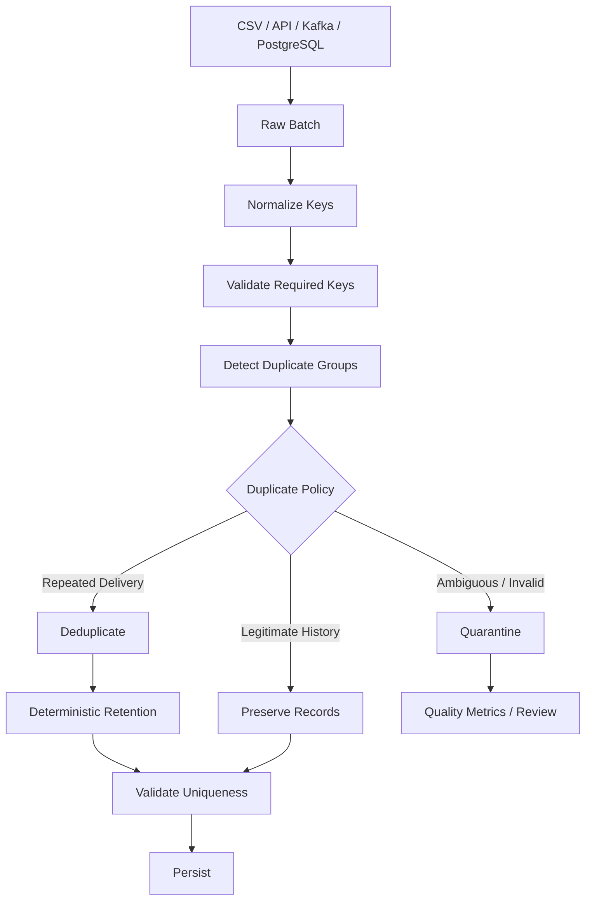

# 07- Drop Duplicates

## Overview

`drop_duplicates()` removes duplicate rows from a Pandas `DataFrame` based on the columns that define record identity.

It is the mutation-oriented counterpart to duplicate detection with `duplicated()`:

```text
duplicated()
    → identify duplicate records

drop_duplicates()
    → remove duplicate records
```

The API is simple:

```python
cleaned = orders.drop_duplicates()
```

The engineering problem is not the method itself. It is defining what a duplicate means and which record should survive.

A production deduplication workflow should therefore be:

```text
Raw data
    ↓
Normalize identifying fields
    ↓
Define business key
    ↓
Detect duplicates
    ↓
Choose retention policy
    ↓
Sort deterministically
    ↓
drop_duplicates()
    ↓
Validate uniqueness
    ↓
Persist
```

Incorrect deduplication can silently remove valid transactions, historical events, or different versions of the same business entity.

## Why `drop_duplicates()` Matters

Duplicate records can distort:

```text
Revenue calculations
Row counts
Customer counts
Inventory totals
Aggregations
Reports
API payloads
Database writes
Event processing
```

Consider:

```text
order_id   amount
ORD-1001   500
ORD-1001   500
```

If both rows represent the same transaction, revenue is overstated:

```python
orders["amount"].sum()
```

But consider:

```text
order_id   status
ORD-1001   processing
ORD-1001   completed
```

These may represent legitimate state history rather than duplicate data.

`drop_duplicates()` cannot determine the business meaning automatically.

## Core Syntax

Remove exact duplicate rows:

```python
cleaned = orders.drop_duplicates()
```

Remove duplicates based on a key:

```python
cleaned = orders.drop_duplicates(
    subset=["order_id"]
)
```

Keep the last occurrence:

```python
cleaned = orders.drop_duplicates(
    subset=["order_id"],
    keep="last",
)
```

Remove every member of a duplicate group:

```python
cleaned = orders.drop_duplicates(
    subset=["order_id"],
    keep=False,
)
```

The last form is useful when the requirement is:

```text
Discard every key that appears more than once.
```

It is much more destructive than ordinary deduplication.

## Important Parameters

| Parameter | Purpose |
|---|---|
| `subset` | Columns used to determine duplicate identity |
| `keep="first"` | Keep first occurrence |
| `keep="last"` | Keep last occurrence |
| `keep=False` | Remove every row in duplicated groups |
| `ignore_index=True` | Reset the output index |
| `inplace=True` | Request mutation of the original object |

The default behavior is conceptually:

```python
df.drop_duplicates(
    subset=None,
    keep="first",
    ignore_index=False,
)
```

For production pipelines, `subset` and `keep` should usually be explicit when business identity matters.

## Exact Duplicate Rows

Without `subset`, Pandas evaluates duplicate rows based on their values.

Example:

```python
orders = pd.DataFrame(
    {
        "order_id": [
            "ORD-1",
            "ORD-1",
            "ORD-2",
        ],
        "status": [
            "completed",
            "completed",
            "pending",
        ],
        "amount": [
            500,
            500,
            200,
        ],
    }
)

cleaned = orders.drop_duplicates()
```

The second `ORD-1` row is removed because the row values are identical.

This is useful for:

```text
Repeated file rows
Duplicate exports
Exact API repetitions
Repeated ingestion
```

It does not solve business-key deduplication when rows differ in other columns.

## Business-Key Deduplication

Suppose:

```text
order_id   status       amount
ORD-1      processing   500
ORD-1      completed    500
```

If the dataset represents current order state, deduplicate by `order_id`:

```python
cleaned = orders.drop_duplicates(
    subset=["order_id"]
)
```

However, the default `keep="first"` retains:

```text
processing
```

That may be wrong.

If the intended record is the latest state, determine ordering first.

## The Meaning of `keep`

### `keep="first"`

```python
cleaned = orders.drop_duplicates(
    subset=["order_id"],
    keep="first",
)
```

Retains the first occurrence in the current DataFrame order.

### `keep="last"`

```python
cleaned = orders.drop_duplicates(
    subset=["order_id"],
    keep="last",
)
```

Retains the last occurrence in the current DataFrame order.

### `keep=False`

```python
cleaned = orders.drop_duplicates(
    subset=["order_id"],
    keep=False,
)
```

Removes all records whose key is duplicated.

This is useful when duplicates indicate invalid business entities and none should be trusted automatically.

## `keep="last"` Does Not Mean Latest

This is one of the most common production mistakes.

Consider:

```text
order_id   updated_at
ORD-1      2026-09-10 10:00
ORD-1      2026-09-10 09:00
```

This:

```python
orders.drop_duplicates(
    subset=["order_id"],
    keep="last",
)
```

keeps the 09:00 record if that row happens to occur last.

It does not inspect `updated_at`.

The correct pattern is:

```python
latest = (
    orders
    .sort_values(
        [
            "order_id",
            "updated_at",
        ]
    )
    .drop_duplicates(
        subset=["order_id"],
        keep="last",
    )
)
```

Now the retention rule is explicit.

## Deterministic Tie-Breaking

Suppose two records have identical timestamps:

```text
order_id   updated_at             event_id   status
ORD-1      2026-09-10 10:00 UTC   EVT-1     processing
ORD-1      2026-09-10 10:00 UTC   EVT-2     completed
```

Timestamp alone does not establish which row should survive.

Use a deterministic tie-breaker:

```python
latest = (
    orders
    .sort_values(
        [
            "order_id",
            "updated_at",
            "event_id",
        ],
        kind="stable",
    )
    .drop_duplicates(
        subset=["order_id"],
        keep="last",
    )
)
```

This improves:

```text
Reproducibility
Retry safety
Backfill consistency
Testing
Incident analysis
```

## Defining the Business Key

The `subset` parameter should represent the identity of a record.

Examples:

| Dataset | Typical key |
|---|---|
| Orders | `order_id` |
| Transactions | `transaction_id` |
| Events | `event_id` |
| Customer snapshot | `customer_id` |
| Daily customer snapshot | `customer_id + snapshot_date` |
| Product inventory | `product_id + warehouse_id` |
| Tenant resource | `tenant_id + resource_id` |

A business key may be composite:

```python
cleaned = snapshots.drop_duplicates(
    subset=[
        "customer_id",
        "snapshot_date",
    ]
)
```

Do not assume a field is globally unique merely because it is unique within one table.

## Composite Keys

Consider:

```text
tenant_id   resource_id
TENANT-A    100
TENANT-B    100
```

Using:

```python
df.drop_duplicates(
    subset=["resource_id"]
)
```

would incorrectly merge two separate resources.

Use:

```python
df.drop_duplicates(
    subset=[
        "tenant_id",
        "resource_id",
    ]
)
```

when the identifier is tenant-scoped.

This is particularly important for multi-tenant systems.

## Normalize Before Deduplication

Values that are logically identical may appear differently:

```text
"customer@example.com"
" Customer@example.com "
"CUSTOMER@EXAMPLE.COM"
```

Normalize first:

```python
customers["email"] = (
    customers["email"]
    .astype("string")
    .str.strip()
    .str.lower()
)
```

Then:

```python
customers = customers.drop_duplicates(
    subset=["email"]
)
```

The general sequence is:

```text
Normalize
    ↓
Define key
    ↓
Deduplicate
```

Otherwise, formatting differences can prevent duplicate detection.

## Deduplicating Identifiers

Identifiers should generally be normalized as strings before deduplication when the source is inconsistent.

For example:

```python
customers["customer_id"] = (
    customers["customer_id"]
    .astype("string")
    .str.strip()
)
```

Be careful with numeric conversion of identifiers.

For example:

```text
001234
```

is not always equivalent to:

```text
1234
```

Leading zeros can be part of the identifier.

## Missing Business Keys

A missing business key should usually be handled before deduplication.

For example:

```python
orders = orders.dropna(
    subset=["order_id"]
)
```

Then:

```python
orders = orders.drop_duplicates(
    subset=["order_id"]
)
```

This establishes:

```text
Valid identity
    ↓
Deduplication
```

Do not invent fake identifiers simply to make deduplication easier.

## Empty Strings and Missing Keys

This:

```python
orders.dropna(
    subset=["order_id"]
)
```

does not remove:

```text
""
"   "
```

Normalize first:

```python
orders["order_id"] = (
    orders["order_id"]
    .astype("string")
    .str.strip()
)

orders = orders.loc[
    orders["order_id"].notna()
    & orders["order_id"].ne("")
].copy()
```

Then deduplicate.

## Deduplicating Current-State Data

For a current-state table:

```text
One row per order
```

the pattern is commonly:

```python
orders = (
    orders
    .sort_values(
        [
            "order_id",
            "updated_at",
        ]
    )
    .drop_duplicates(
        subset=["order_id"],
        keep="last",
    )
)
```

This implements:

```text
For each order:
    retain the most recently updated record.
```

The correctness depends on `updated_at` being authoritative.

## Deduplicating Event Data

An event stream may legitimately contain multiple records for the same order:

```text
order_id   event_id   event_type
ORD-1      EVT-1      created
ORD-1      EVT-2      paid
ORD-1      EVT-3      shipped
```

Do not deduplicate by `order_id`.

Use:

```python
events = events.drop_duplicates(
    subset=["event_id"]
)
```

if `event_id` is the event identity.

This distinction prevents accidental deletion of valid history.

## Snapshot vs Event Models

The correct `drop_duplicates()` strategy depends on the dataset model.

| Dataset model | Repeated business ID | Typical deduplication key |
|---|---|---|
| Current state | Usually invalid | Entity ID |
| Snapshot | Potentially expected across dates | Entity ID + snapshot date |
| Event history | Expected | Event ID |
| CDC stream | Expected across state changes | Source event / transaction identity |
| Periodic export | Often accidental | Source business key |

Understanding the model is more important than choosing the Pandas method.

## Deduplication After API Ingestion

An API may return repeated records due to:

```text
Retries
Overlapping pagination
Repeated polling
Eventual consistency
Client-side replay
```

After collecting pages:

```python
orders = pd.concat(
    pages,
    ignore_index=True,
)
```

a batch can be deduplicated:

```python
orders = (
    orders
    .sort_values(
        [
            "order_id",
            "updated_at",
        ]
    )
    .drop_duplicates(
        subset=["order_id"],
        keep="last",
    )
)
```

The API ingestion logic should still be designed correctly; deduplication should be a safety layer, not a substitute for correct pagination.

## Deduplication and Joins

Joins often reveal existing uniqueness problems.

Suppose:

```text
orders
    many → one
customers
```

The intended relationship is:

```python
orders.merge(
    customers,
    on="customer_id",
    how="left",
    validate="many_to_one",
)
```

If `customers` has duplicate `customer_id` values, the merge can multiply rows.

Do not immediately use:

```python
drop_duplicates()
```

after the join to hide the problem.

Validate the relationship at the join boundary.

## Deduplication Before Joins

When a dimension table should have one row per key:

```python
customers = (
    customers
    .sort_values(
        "updated_at"
    )
    .drop_duplicates(
        subset=["customer_id"],
        keep="last",
    )
)
```

Then:

```python
orders_with_customers = orders.merge(
    customers,
    on="customer_id",
    how="left",
    validate="many_to_one",
)
```

This produces a clearer contract:

```text
Normalize dimension
    ↓
Enforce unique key
    ↓
Validate join relationship
```

## Do Not Deduplicate Legitimate Transactions

Consider:

```text
customer_id   order_date   amount
CUS-1         2026-09-10   100
CUS-1         2026-09-10   100
```

These records look identical but may represent:

```text
Two separate purchases
```

Removing one would understate revenue.

The absence of a unique identifier does not prove that records are duplicates.

When the source lacks a proper business key, investigate the domain instead of guessing.

## Duplicate Rows vs Duplicate Facts

A duplicate row means:

```text
Same logical fact represented multiple times.
```

Two identical-looking rows can still represent different facts if the source lacks fields that distinguish them.

For example:

```text
timestamp precision
source transaction ID
device ID
line item ID
sequence number
```

may be omitted from a reporting dataset.

Deduplication should operate on the authoritative source identity whenever possible.

## Deduplication with `keep=False`

Sometimes duplicated keys should cause every record in that group to be rejected.

Example:

```python
deduplicated = orders.drop_duplicates(
    subset=["order_id"],
    keep=False,
)
```

For:

```text
ORD-1
ORD-1
ORD-2
```

the result contains only:

```text
ORD-2
```

Use this when:

```text
Any duplicate business key makes the entire group untrustworthy.
```

Do not use it simply because duplicates exist.

## `ignore_index`

By default, `drop_duplicates()` preserves the original index.

Example:

```python
cleaned = orders.drop_duplicates(
    subset=["order_id"]
)
```

The resulting index may contain gaps.

If a fresh sequential index is desired:

```python
cleaned = orders.drop_duplicates(
    subset=["order_id"],
    ignore_index=True,
)
```

This is useful when the output is treated as a newly materialized dataset.

Preserve the original index when it carries useful source-row identity.

## `inplace=True`

Pandas supports:

```python
orders.drop_duplicates(
    subset=["order_id"],
    inplace=True,
)
```

For production code, explicit reassignment is often easier to reason about:

```python
orders = orders.drop_duplicates(
    subset=["order_id"]
)
```

The reassignment style makes the data flow clearer and is easier to compose with transformations.

If a function owns the DataFrame and mutation is part of its documented contract, in-place behavior can be acceptable. It should not be accidental.

## Method Chaining

`drop_duplicates()` fits naturally into transformation pipelines:

```python
cleaned = (
    orders
    .assign(
        order_id=lambda df: (
            df["order_id"]
            .astype("string")
            .str.strip()
        )
    )
    .dropna(
        subset=["order_id"]
    )
    .sort_values(
        [
            "order_id",
            "updated_at",
        ]
    )
    .drop_duplicates(
        subset=["order_id"],
        keep="last",
    )
)
```

This expresses the cleaning flow clearly:

```text
Normalize
    ↓
Reject missing keys
    ↓
Order records
    ↓
Deduplicate
```

Split the chain when business logic becomes difficult to review.

## Measuring Deduplicated Rows

Always measure the effect of destructive transformations.

```python
before = len(orders)

cleaned = orders.drop_duplicates(
    subset=["order_id"]
)

after = len(cleaned)

removed = before - after
```

Then calculate:

```python
deduplication_rate = (
    removed / before
    if before
    else 0.0
)
```

A sudden jump in this metric can indicate:

```text
Source replay
API pagination failure
Kafka retry storm
Pipeline duplication
Incorrect key definition
Schema change
```

## Duplicate Quality Metrics

Useful metrics include:

```text
Input rows
Output rows
Rows removed
Duplicate rows
Duplicate keys
Maximum duplicate frequency
Deduplication rate
Duplicates by source
Duplicates by batch
```

Example:

```python
duplicate_rows = int(
    orders.duplicated(
        subset=["order_id"],
        keep=False,
    ).sum()
)

duplicate_keys = int(
    orders.loc[
        orders.duplicated(
            subset=["order_id"],
            keep=False,
        ),
        "order_id",
    ].nunique()
)
```

These metrics help distinguish:

```text
Few keys duplicated repeatedly
```

from:

```text
Large percentage of dataset affected.
```

## Duplicate Frequency

A useful diagnostic:

```python
frequencies = (
    orders["order_id"]
    .value_counts()
)

problematic = frequencies[
    frequencies.gt(1)
]
```

This can reveal severe source behavior:

```text
ORD-1   → 2
ORD-2   → 3
ORD-3   → 50
```

A key appearing 50 times may require a different investigation from a single duplicate pair.

## Idempotent Deduplication

`drop_duplicates()` itself is naturally suitable for idempotent deduplication:

```python
first = orders.drop_duplicates(
    subset=["order_id"]
)

second = first.drop_duplicates(
    subset=["order_id"]
)
```

The second operation should not remove additional rows.

For latest-record workflows, idempotency also requires deterministic ordering.

Use:

```python
result = (
    orders
    .sort_values(
        [
            "order_id",
            "updated_at",
            "event_id",
        ],
        kind="stable",
    )
    .drop_duplicates(
        subset=["order_id"],
        keep="last",
    )
)
```

The complete transformation should produce the same result across retries.

## Database Uniqueness

Pandas deduplication is not a replacement for database constraints.

For PostgreSQL:

```sql
ALTER TABLE orders
ADD CONSTRAINT orders_order_id_unique
UNIQUE (order_id);
```

Then Pandas can prepare clean batches:

```python
batch = (
    orders
    .sort_values("updated_at")
    .drop_duplicates(
        subset=["order_id"],
        keep="last",
    )
)
```

The database provides the final persistence-level guarantee.

This creates layered protection:

```text
Pandas
    → batch normalization

Database
    → authoritative uniqueness
```

## Upserts

A typical backend pipeline:

```text
Extract
    ↓
Normalize
    ↓
Deduplicate batch
    ↓
Validate
    ↓
Database upsert
```

Pandas:

```python
batch = (
    orders
    .sort_values(
        [
            "order_id",
            "updated_at",
        ]
    )
    .drop_duplicates(
        subset=["order_id"],
        keep="last",
    )
)
```

PostgreSQL then performs an upsert according to the application's transaction and uniqueness model.

This is safer than assuming the in-memory DataFrame alone prevents duplicates.

## Kafka and Retry Semantics

For event consumers, duplicates can arise from at-least-once processing.

A batch may contain:

```text
EVT-1
EVT-2
EVT-1
```

Use:

```python
events = events.drop_duplicates(
    subset=["event_id"]
)
```

to normalize the current batch.

However, another worker or a future retry may contain `EVT-1` again.

Global idempotency requires a durable mechanism such as:

```text
Database unique key
Idempotency store
Redis-based coordination
Consumer state
```

depending on system design.

## Redis-Based Deduplication

A common pattern is:

```text
event_id
    ↓
atomic "first-seen" operation
    ↓
┌───────────────┬───────────────┐
↓                               ↓
first occurrence               duplicate
↓                               ↓
process                         skip
```

Pandas can still deduplicate within a batch, but it cannot replace distributed coordination.

## Chunked Processing

For large CSV files:

```python
for chunk in pd.read_csv(
    "orders.csv",
    chunksize=100_000,
):
    chunk = chunk.drop_duplicates(
        subset=["order_id"]
    )

    persist(chunk)
```

This only deduplicates within each chunk.

A duplicate can span chunks:

```text
Chunk 1
    ORD-1001

Chunk 2
    ORD-1001
```

Both survive chunk-local deduplication.

Global deduplication therefore requires:

```text
External state
Database uniqueness
Partitioning by business key
Two-pass processing
Distributed execution
```

## Global Deduplication with External State

For bounded workloads, external state can track already-seen keys.

Conceptually:

```python
seen_order_ids: set[str] = set()

for chunk in pd.read_csv(
    "orders.csv",
    chunksize=100_000,
):
    chunk = chunk.loc[
        ~chunk["order_id"].isin(
            seen_order_ids
        )
    ].copy()

    seen_order_ids.update(
        chunk["order_id"]
        .dropna()
        .tolist()
    )

    persist(chunk)
```

This can work when the key space fits comfortably in memory.

For very large datasets, a Python set can become expensive. Use a database, distributed state store, partition-aware strategy, or another execution engine.

## Parquet and Partitioning

Parquet files are often partitioned by fields such as:

```text
date
region
tenant
```

A business key may span partitions.

For example:

```text
date=2026-09-09
    order_id=ORD-1

date=2026-09-10
    order_id=ORD-1
```

Deduplicating each partition independently does not guarantee global uniqueness.

Physical partitioning and business-key partitioning are different concepts.

## SQL Window Functions for Large Datasets

When records are already in PostgreSQL, latest-record deduplication can often be performed in SQL:

```sql
SELECT *
FROM (
    SELECT
        orders.*,
        ROW_NUMBER() OVER (
            PARTITION BY order_id
            ORDER BY updated_at DESC, event_id DESC
        ) AS row_number
    FROM orders
) ranked
WHERE row_number = 1;
```

This may be preferable to extracting the complete dataset into Pandas when:

```text
Dataset is large
Data is already in the database
Database indexes are appropriate
Transactional consistency matters
```

Pandas should not become the execution layer simply because it can express the transformation.

## Performance Considerations

`drop_duplicates()` is optimized for bulk DataFrame operations, but large deduplication jobs can still consume significant:

```text
CPU
Memory
Temporary working state
```

Cost increases with:

```text
Number of rows
Number of columns participating in deduplication
Key width
Data types
Number of duplicate groups
```

If only a business key is required to detect duplicates, specify `subset`:

```python
orders.drop_duplicates(
    subset=["order_id"]
)
```

rather than comparing every column unnecessarily.

## Column Projection

If the deduplication logic only needs a subset of columns, avoid carrying unrelated data through expensive intermediate operations when practical.

For example:

```python
keys = orders.loc[
    :,
    [
        "order_id",
        "updated_at",
        "event_id",
    ],
]
```

can be used for diagnostics.

However, when retaining complete surviving rows, the final operation must still preserve the required output columns.

## Avoid Unnecessary Copies

This can create unnecessary memory use:

```python
cleaned = (
    orders.copy()
    .drop_duplicates(
        subset=["order_id"]
    )
    .copy()
)
```

Copying may be justified at explicit ownership boundaries, but it should not be automatic.

For large ETL jobs, unnecessary copies increase peak memory and may cause worker instability.

## Sorting Cost

Latest-record deduplication often requires:

```python
orders.sort_values(
    [
        "order_id",
        "updated_at",
    ]
)
```

Sorting can be expensive for large datasets.

When the source database can perform the operation efficiently, SQL window functions or indexed queries may be preferable.

When Pandas is appropriate, keep the sort deterministic and minimize unnecessary columns and repeated sorting.

## Missing and Duplicate Keys

Missing keys should generally be handled before deduplication.

Example:

```python
orders = orders.loc[
    orders["order_id"].notna()
].copy()

orders = orders.drop_duplicates(
    subset=["order_id"]
)
```

This creates a clear contract:

```text
No identity
    → record cannot participate in current-state uniqueness
```

Whether such records should be rejected or quarantined depends on the pipeline.

## Empty DataFrames

`drop_duplicates()` works with an empty DataFrame:

```python
empty = pd.DataFrame(
    columns=[
        "order_id",
        "status",
    ]
)

cleaned = empty.drop_duplicates(
    subset=["order_id"]
)
```

The result remains empty.

Production systems should still distinguish:

```text
Input contains zero records
```

from:

```text
All records were removed during deduplication
```

These represent different operational states.

## Schema Validation

Before deduplication, verify that the key exists:

```python
required = {
    "order_id",
    "updated_at",
}

missing = required.difference(
    orders.columns
)

if missing:
    raise ValueError(
        f"Missing required columns: {sorted(missing)}"
    )
```

A missing key column is a schema failure.

It should not be treated as equivalent to rows containing missing key values.

## Data Quality Gate

A production pipeline can enforce a duplicate threshold:

```python
duplicate_mask = orders.duplicated(
    subset=["order_id"],
    keep=False,
)

duplicate_rate = (
    duplicate_mask.mean()
    if len(orders)
    else 0.0
)

if duplicate_rate > 0.05:
    raise RuntimeError(
        "Duplicate rate exceeded threshold."
    )
```

The exact threshold should come from historical and business expectations.

A high duplicate rate may indicate a source-system incident rather than normal cleanup.

## Auditability

Deduplication can be destructive.

For important datasets, preserve enough information to answer:

```text
Which records were removed?
Which key caused the duplicate?
Which record was retained?
Why was it retained?
Which batch performed the operation?
Which rule version was used?
```

A quarantine or audit dataset may include:

```text
business_key
removed_record_id
retained_record_id
retention_rule
batch_id
processed_at
```

This is especially important for financial or compliance-sensitive data.

## Security Considerations

The business key may be scoped by tenant or security boundary.

Do not deduplicate across tenants accidentally:

```python
df.drop_duplicates(
    subset=["resource_id"]
)
```

may be wrong if `resource_id` is only unique within a tenant.

Use:

```python
df.drop_duplicates(
    subset=[
        "tenant_id",
        "resource_id",
    ]
)
```

when those fields together define identity.

Deduplication should also not be used as an authorization mechanism.

## Testing Deduplication

Tests should verify the retention policy, not just row count.

Example:

```python
import pandas as pd


def deduplicate_orders(
    orders: pd.DataFrame,
) -> pd.DataFrame:
    return (
        orders
        .sort_values(
            [
                "order_id",
                "updated_at",
            ]
        )
        .drop_duplicates(
            subset=["order_id"],
            keep="last",
        )
    )
```

Test latest-record retention:

```python
def test_keeps_latest_order_state() -> None:
    orders = pd.DataFrame(
        {
            "order_id": [
                "ORD-1",
                "ORD-1",
            ],
            "status": [
                "processing",
                "completed",
            ],
            "updated_at": [
                pd.Timestamp(
                    "2026-09-10T09:00:00Z"
                ),
                pd.Timestamp(
                    "2026-09-10T10:00:00Z"
                ),
            ],
        }
    )

    result = deduplicate_orders(
        orders
    )

    assert len(result) == 1
    assert result.iloc[0]["status"] == (
        "completed"
    )
```

## Testing Idempotency

A useful test:

```python
first = deduplicate_orders(
    orders
)

second = deduplicate_orders(
    first
)

pd.testing.assert_frame_equal(
    first.reset_index(drop=True),
    second.reset_index(drop=True),
)
```

This confirms that retries do not continue changing the result.

## Testing Composite Keys

```python
def test_deduplicates_by_tenant_and_resource() -> None:
    resources = pd.DataFrame(
        {
            "tenant_id": [
                "TENANT-A",
                "TENANT-A",
                "TENANT-B",
            ],
            "resource_id": [
                "100",
                "100",
                "100",
            ],
        }
    )

    result = resources.drop_duplicates(
        subset=[
            "tenant_id",
            "resource_id",
        ]
    )

    assert len(result) == 2
```

This protects multi-tenant identity semantics.

## Testing `keep=False`

```python
def test_removes_entire_duplicate_group() -> None:
    orders = pd.DataFrame(
        {
            "order_id": [
                "ORD-1",
                "ORD-1",
                "ORD-2",
            ]
        }
    )

    result = orders.drop_duplicates(
        subset=["order_id"],
        keep=False,
    )

    assert result["order_id"].tolist() == [
        "ORD-2",
    ]
```

This verifies the strict duplicate-rejection policy.

## Common Mistakes

| Mistake | Why it happens | Better approach |
|---|---|---|
| Calling `drop_duplicates()` without `subset` | Entire-row equality is assumed to represent identity | Define the business key |
| Using `keep="last"` to mean latest | Current row order is confused with business chronology | Sort by authoritative timestamp |
| Deduplicating event data by entity ID | Event and snapshot models are confused | Deduplicate by event identity |
| Deduplicating before normalization | Equivalent keys have different representations | Normalize first |
| Dropping duplicate keys without measuring | Source problems become invisible | Track duplicate counts and rates |
| Removing repeated transactions | Same-looking rows are assumed to be duplicates | Verify transaction identity |
| Deduplicating every chunk independently | Global duplicates span chunks | Use global state or scalable execution |
| Ignoring tenant scope | IDs may only be unique within a tenant | Use composite keys |
| Hiding join multiplication with `drop_duplicates()` | Relationship cardinality is wrong | Validate joins |
| Filling missing IDs before deduplication | Fake values can collide | Reject or quarantine invalid keys |
| Sorting by a non-authoritative field | Wrong record survives | Use source-of-truth ordering |
| Relying only on Pandas for persistence uniqueness | In-memory state is not authoritative | Enforce database constraints |

## Production Pitfalls

### Incorrect Record Retention

This:

```python
orders.drop_duplicates(
    subset=["order_id"],
    keep="first",
)
```

can retain an outdated record.

Always define the retention policy before removing duplicates.

### Silent Source-System Failures

A sudden duplicate rate increase may indicate:

```text
API retry storm
Kafka replay
Broken checkpoint
Pagination bug
Pipeline retry loop
```

Do not automatically normalize away the signal.

Deduplicate to protect downstream correctness while monitoring the upstream cause.

### Non-Deterministic Deduplication

If two candidate rows have equivalent ordering values, the retained record may depend on input order.

Use a deterministic tie-breaker.

### Destroying Historical State

A current-state deduplication policy should never be applied to an event-history dataset without confirming the data model.

### Deduplicating After Expensive Processing

When safe, normalize and deduplicate before:

```text
Large joins
Complex aggregations
Serialization
Database writes
```

This can reduce downstream work.

The exception is when deduplication depends on fields that are produced later.

## Interview Traps

### What Does `drop_duplicates()` Do?

It removes duplicate rows based on all columns or on the columns specified by `subset`.

### What Is the Default `keep` Behavior?

```python
keep="first"
```

The first occurrence survives.

### What Does `keep="last"` Mean?

The last occurrence in the current DataFrame order survives.

It does not mean the most recent record by timestamp.

### What Does `keep=False` Mean?

Every row belonging to a duplicated group is removed.

### How Do You Keep the Latest Record Per ID?

```python
result = (
    df
    .sort_values(
        [
            "order_id",
            "updated_at",
        ]
    )
    .drop_duplicates(
        subset=["order_id"],
        keep="last",
    )
)
```

### How Do You Deduplicate Using a Composite Key?

```python
df.drop_duplicates(
    subset=[
        "tenant_id",
        "resource_id",
    ]
)
```

### Does `drop_duplicates()` Reset the Index?

No, not by default. Use:

```python
ignore_index=True
```

when a fresh sequential index is desired.

### Should You Deduplicate an Event Stream by `order_id`?

Usually no. Multiple events for one order can be legitimate. Use the event-level identity such as `event_id`.

### Why Can a Join Create Duplicate Rows?

The join relationship may not match the assumed cardinality. Duplicate dimension keys can multiply fact rows.

Use:

```python
validate="many_to_one"
```

or another appropriate relationship declaration.

### How Do You Deduplicate Across CSV Chunks?

Calling `drop_duplicates()` inside each chunk only handles duplicates within that chunk. Cross-chunk uniqueness requires shared state, database constraints, key partitioning, or a different execution strategy.

### Should Pandas Be Used to Enforce Database Uniqueness?

No. Pandas can prepare a clean batch, but the database should enforce authoritative uniqueness.

### Why Is Sorting Important Before Deduplication?

Because `keep="first"` and `keep="last"` depend on the DataFrame's current ordering.

### Is Removing Duplicate Rows Always Correct?

No. Two identical-looking rows can represent independent business facts.

### How Do You Test Deduplication?

Test:

```text
Key selection
Retention policy
Latest-record behavior
Tie-breaking
Composite keys
Missing keys
No-duplicate input
Duplicate input
Idempotency
```

## Recommended Engineering Pattern

A production current-state deduplication function should explicitly define:

```python
import pandas as pd


def deduplicate_orders(
    orders: pd.DataFrame,
) -> pd.DataFrame:
    required_columns = {
        "order_id",
        "updated_at",
        "event_id",
    }

    missing = (
        required_columns
        - set(orders.columns)
    )

    if missing:
        raise ValueError(
            f"Missing required columns: "
            f"{sorted(missing)}"
        )

    result = orders.copy()

    result["order_id"] = (
        result["order_id"]
        .astype("string")
        .str.strip()
    )

    result["updated_at"] = pd.to_datetime(
        result["updated_at"],
        errors="coerce",
        utc=True,
    )

    valid_key = (
        result["order_id"].notna()
        & result["order_id"].ne("")
    )

    result = result.loc[
        valid_key
    ].copy()

    result = (
        result
        .sort_values(
            [
                "order_id",
                "updated_at",
                "event_id",
            ],
            kind="stable",
        )
        .drop_duplicates(
            subset=["order_id"],
            keep="last",
        )
    )

    if not result["order_id"].is_unique:
        raise ValueError(
            "Deduplication failed to produce "
            "unique order IDs."
        )

    return result
```

The processing contract is explicit:

```text
Validate schema
    ↓
Normalize identity
    ↓
Reject invalid identity
    ↓
Normalize ordering fields
    ↓
Sort deterministically
    ↓
Keep latest record
    ↓
Validate uniqueness
```

## Measuring the Transformation

Wrap deduplication with quality metrics:

```python
def deduplicate_with_metrics(
    orders: pd.DataFrame,
) -> tuple[
    pd.DataFrame,
    dict[str, float],
]:
    before = len(orders)

    duplicate_mask = orders.duplicated(
        subset=["order_id"],
        keep=False,
    )

    cleaned = deduplicate_orders(
        orders
    )

    after = len(cleaned)

    removed = before - after

    metrics = {
        "input_rows": float(before),
        "output_rows": float(after),
        "rows_removed": float(removed),
        "duplicate_rows": float(
            duplicate_mask.sum()
        ),
        "duplicate_rate": (
            float(duplicate_mask.mean())
            if before
            else 0.0
        ),
    }

    return cleaned, metrics
```

This supports production observability without requiring raw-record logging.

## Data Flow in a Production ETL Pipeline



The key design principle is:

```text
Detect first
    ↓
Interpret according to domain
    ↓
Remove only when the retention policy is known
```

## When to Use `drop_duplicates()`

Use it when:

```text
A record-identity rule is defined
Repeated records are known to be duplicates
A deterministic retention policy exists
The output is expected to be unique
```

Avoid using it as a generic final cleanup step when:

```text
The data model is unclear
Rows may represent legitimate events
The source lacks a reliable identity key
Duplicates indicate an upstream incident
Historical state must be preserved
```

## Key Takeaways

- `drop_duplicates()` is a **record-identity operation**, not a generic cleanup command; define the business key before removing anything.
- `keep="first"` and `keep="last"` depend on current DataFrame order, so latest-record retention requires explicit sorting and deterministic tie-breaking.
- Do not deduplicate event histories or legitimate transactions using an entity ID; distinguish current-state, snapshot, event, and transactional data models.
- In production pipelines, normalize keys first, measure duplicate rates, preserve evidence when necessary, and enforce authoritative uniqueness and idempotency at the database or distributed-system layer.
- For large or chunked datasets, remember that `drop_duplicates()` is local to the current DataFrame; global deduplication requires shared state, database constraints, partition-aware processing, or a scalable distributed execution strategy.