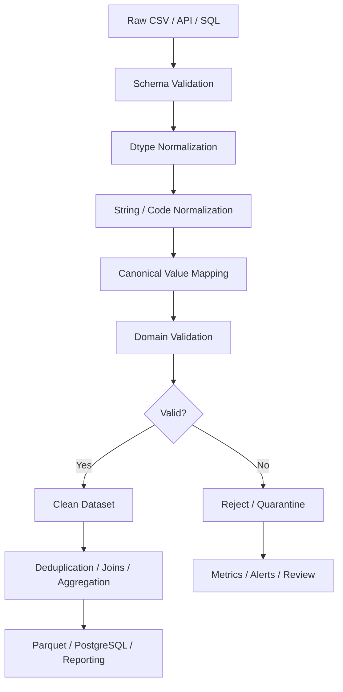

# 08- Inconsistent Values

## Overview

Inconsistent values occur when logically equivalent data is represented in different forms across records or sources.

Typical examples include:

```text
"Completed"
"completed"
" COMPLETED "
"complete"
"done"
```

or:

```text
"IN"
"India"
"IND"
"india"
```

or identifiers such as:

```text
"CUS-001"
" CUS-001 "
"cus-001"
```

These differences may be syntactic, semantic, or both.

A production data-cleaning pipeline should distinguish:

```text
Representation inconsistency
        ↓
Normalize known variants
        ↓
Validate canonical values
        ↓
Reject or quarantine unknown values
```

The goal is not to make every value identical. The goal is to establish a canonical representation that preserves business meaning.

## Why Inconsistent Values Matter

Inconsistent values can break downstream operations without causing obvious exceptions.

Consider:

```python
orders.groupby("status").size()
```

If the source contains:

```text
completed
Completed
COMPLETED
```

Pandas treats them as different groups.

The consequences can include:

```text
Incorrect counts
Incorrect aggregations
Broken joins
Incorrect filtering
Duplicate categories
Unexpected dashboard results
Failed validation
Incorrect API payloads
```

For example:

```python
orders.loc[
    orders["status"].eq("completed")
]
```

does not select:

```text
"Completed"
" COMPLETE "
"done"
```

unless they have first been normalized or explicitly mapped.

## Types of Inconsistency

| Type | Example | Typical solution |
|---|---|---|
| Whitespace | `" completed "` | `.str.strip()` |
| Case | `"Completed"` vs `"completed"` | `.str.lower()` / `.str.upper()` |
| Spelling | `"cancelled"` vs `"canceled"` | Explicit mapping |
| Abbreviation | `"IN"` vs `"India"` | Canonical mapping |
| Legacy code | `"done"` vs `"completed"` | Business mapping |
| Formatting | `"CUS001"` vs `"CUS-001"` | Explicit normalization |
| Numeric representation | `"1,000"` vs `1000` | Numeric parsing |
| Boolean representation | `"yes"` vs `True` | Controlled conversion |
| Datetime format | Multiple timestamp formats | Explicit parsing |
| Currency representation | `"INR"` vs `"₹"` | Canonical currency code |
| Null-like strings | `"N/A"`, `"null"`, `"-"` | Controlled missing-value normalization |

Not every inconsistency should be normalized automatically.

## Canonical Representation

A canonical value is the representation that downstream systems agree to use.

For statuses:

```text
pending
processing
completed
cancelled
```

For currency:

```text
INR
USD
EUR
```

For booleans:

```text
True
False
```

For identifiers:

```text
CUS-000123
```

The canonical representation should be defined by the data contract.

## Normalization vs Validation

These are separate concerns.

### Normalization

Change a known alternate representation into the canonical form:

```python
orders["status"] = (
    orders["status"]
    .astype("string")
    .str.strip()
    .str.lower()
)
```

### Validation

Check whether the resulting values belong to the allowed domain:

```python
allowed_statuses = {
    "pending",
    "processing",
    "completed",
    "cancelled",
}

invalid_status = ~orders[
    "status"
].isin(allowed_statuses)
```

The preferred sequence is:

```text
Normalize known variants
        ↓
Validate canonical domain
        ↓
Reject unknown values
```

## Whitespace Inconsistencies

Leading and trailing whitespace is common in:

```text
CSV exports
Excel files
Manual data entry
External APIs
Legacy systems
```

Normalize:

```python
customers["email"] = (
    customers["email"]
    .astype("string")
    .str.strip()
)
```

For categorical text:

```python
orders["status"] = (
    orders["status"]
    .astype("string")
    .str.strip()
)
```

This should generally be performed before exact comparisons or duplicate detection.

## Internal Whitespace

Do not automatically remove all whitespace.

For example:

```text
"New Delhi"
```

contains meaningful internal whitespace.

This is usually safe:

```python
value.str.strip()
```

but this can corrupt legitimate values:

```python
value.str.replace(
    " ",
    "",
    regex=False,
)
```

Use internal-whitespace normalization only when the field's contract requires it.

## Case Normalization

For case-insensitive categorical fields:

```python
orders["status"] = (
    orders["status"]
    .astype("string")
    .str.strip()
    .str.lower()
)
```

For standardized codes:

```python
orders["currency"] = (
    orders["currency"]
    .astype("string")
    .str.strip()
    .str.upper()
)
```

The choice between lowercasing and uppercasing is a schema convention, not a technical requirement.

## Case Sensitivity Depends on Domain

Do not normalize every string field to lowercase.

Examples:

```text
Email address
    → often normalized to lowercase in application workflows

Currency code
    → usually uppercase

Human name
    → preserve intended representation unless a specific canonicalization policy exists

Case-sensitive API token
    → never normalize

SKU
    → depends on product-system contract
```

Normalization must respect the semantics of the field.

## Explicit Value Mapping

When different values have the same business meaning:

```python
status_mapping = {
    "done": "completed",
    "complete": "completed",
    "finished": "completed",
}

orders["status"] = (
    orders["status"]
    .replace(status_mapping)
)
```

This is preferable to a large chain of independent assignments.

The mapping becomes an explicit transformation contract.

## Unknown Values Should Remain Visible

Suppose:

```python
status_mapping = {
    "done": "completed",
    "complete": "completed",
}
```

and the dataset contains:

```text
refunded
```

Do not automatically map it to:

```text
cancelled
```

unless the domain explicitly defines that relationship.

Instead:

```python
allowed_statuses = {
    "pending",
    "processing",
    "completed",
    "cancelled",
    "refunded",
}

invalid_status = ~orders[
    "status"
].isin(allowed_statuses)
```

Unknown values may indicate:

```text
New business state
Source-system change
Data corruption
Misspelling
Schema drift
```

They should be observable.

## Controlled Vocabulary

A controlled vocabulary defines all accepted values.

Example:

```python
allowed_payment_methods = {
    "card",
    "upi",
    "netbanking",
    "wallet",
    "bank_transfer",
}

valid_payment_method = orders[
    "payment_method"
].isin(
    allowed_payment_methods
)
```

This should normally happen after representation normalization:

```python
orders["payment_method"] = (
    orders["payment_method"]
    .astype("string")
    .str.strip()
    .str.lower()
)
```

Then validate.

## Normalization and `replace()`

`replace()` is particularly useful for explicit value-level normalization:

```python
customers["country"] = (
    customers["country"]
    .replace(
        {
            "IND": "IN",
            "India": "IN",
            "india": "IN",
        }
    )
)
```

This works well when:

```text
Input value
    →
Canonical value
```

is deterministic and documented.

## `map()` for Canonicalization

When every known value should map to another representation:

```python
status_codes = {
    "pending": "P",
    "processing": "P",
    "completed": "C",
    "cancelled": "X",
}

orders["status_code"] = (
    orders["status"]
    .map(status_codes)
)
```

An unmapped value becomes missing.

This can be useful as a validation signal:

```python
unknown_status = (
    orders["status_code"].isna()
    & orders["status"].notna()
)
```

Use `map()` when the operation is conceptually a lookup.

## `replace()` vs `map()`

| Requirement | Preferred approach |
|---|---|
| Replace a few known values while preserving others | `replace()` |
| Convert every known value through a lookup | `map()` |
| Normalize using string operations | `.str.*` |
| Conditional rule based on multiple columns | Boolean mask / `np.select()` |
| Validate membership | `isin()` |

For example:

```python
orders["status"] = (
    orders["status"]
    .replace(
        {
            "done": "completed",
        }
    )
)
```

preserves values not present in the mapping.

By contrast:

```python
orders["status_code"] = (
    orders["status"]
    .map(status_codes)
)
```

returns missing values for unmapped keys.

## Null-Like Strings

External systems may represent missing values as text:

```text
""
"N/A"
"NA"
"NULL"
"null"
"None"
"-"
"unknown"
```

These are not automatically equivalent to Pandas missing values.

A controlled normalization can be:

```python
null_tokens = {
    "",
    "n/a",
    "na",
    "null",
    "none",
}

customers["email"] = (
    customers["email"]
    .astype("string")
    .str.strip()
    .str.lower()
    .replace(
        list(null_tokens),
        pd.NA,
    )
)
```

Do not globally convert words such as `"unknown"` to missing unless the domain explicitly defines that semantics.

For some datasets, `"unknown"` is a legitimate category.

## Normalization Ordering

The order of normalization operations matters.

For example:

```python
orders["status"] = (
    orders["status"]
    .astype("string")
    .str.strip()
    .str.lower()
    .replace(
        {
            "done": "completed",
            "complete": "completed",
        }
    )
)
```

This gives:

```text
Raw
    ↓
String type
    ↓
Trim whitespace
    ↓
Normalize case
    ↓
Map known legacy values
```

If the mapping is performed before stripping whitespace:

```text
" done "
```

may not match:

```text
"done"
```

## Identifier Normalization

Identifiers often need special treatment.

Example:

```python
customers["customer_id"] = (
    customers["customer_id"]
    .astype("string")
    .str.strip()
)
```

Do not casually convert identifiers to numeric types.

For example:

```text
"000123"
```

may represent a different canonical identifier than:

```text
"123"
```

Leading zeros can be meaningful.

## Identifier Case

Case normalization should depend on the identifier contract.

For case-insensitive IDs:

```python
customers["external_id"] = (
    customers["external_id"]
    .astype("string")
    .str.strip()
    .str.upper()
)
```

For case-sensitive IDs, preserve the original case.

Never infer case-insensitivity from convenience.

## Email Normalization

A common practical pattern:

```python
customers["email"] = (
    customers["email"]
    .astype("string")
    .str.strip()
    .str.lower()
)
```

Then validate:

```python
valid_email = (
    customers["email"].notna()
    & customers["email"].ne("")
)
```

Do not implement provider-specific email canonicalization rules without a clear domain requirement. For example, assumptions about aliasing or dot removal can alter legitimate addresses.

## Phone Number Normalization

Phone numbers can have different representations:

```text
+91 98765 43210
+919876543210
091-9876543210
```

Do not simply remove every non-digit character without understanding:

```text
Country codes
Extensions
Leading trunk prefixes
International formats
```

For production systems, use a domain-appropriate phone normalization library or service when available.

Pandas can still provide the batch-processing layer after canonicalization rules are established.

## Currency Normalization

Currency symbols and names may be inconsistent:

```text
₹
Rs
INR
Indian Rupee
```

Map only known representations:

```python
currency_mapping = {
    "₹": "INR",
    "RS": "INR",
    "INR": "INR",
    "USD$": "USD",
    "$": "USD",
}

orders["currency"] = (
    orders["currency"]
    .astype("string")
    .str.strip()
    .str.upper()
    .replace(currency_mapping)
)
```

Then validate the canonical codes.

Do not infer currency merely from a numeric amount or geographic location.

## Boolean Normalization

Boolean data often arrives as:

```text
true
TRUE
yes
Y
1
false
NO
N
0
```

A mapping can establish canonical values:

```python
boolean_mapping = {
    "true": True,
    "yes": True,
    "y": True,
    "1": True,
    "false": False,
    "no": False,
    "n": False,
    "0": False,
}

raw = (
    customers["marketing_opt_in"]
    .astype("string")
    .str.strip()
    .str.lower()
)

customers["marketing_opt_in"] = (
    raw.replace(boolean_mapping)
)
```

Then validate that all non-null values are actual booleans.

Be careful with missing values:

```text
missing
```

is not automatically equivalent to:

```text
False
```

## Numeric Representation Inconsistency

Numbers can arrive as:

```text
"1000"
"1,000"
"1,000.00"
1000
1000.0
```

Normalize known formatting:

```python
amount = (
    orders["amount"]
    .astype("string")
    .str.strip()
    .str.replace(
        ",",
        "",
        regex=False,
    )
)

orders["amount"] = pd.to_numeric(
    amount,
    errors="coerce",
)
```

Then validate:

```python
invalid_amount = (
    orders["amount"].isna()
    | orders["amount"].lt(0)
)
```

Keep malformed-value detection separate from valid zero values.

## Datetime Representation Inconsistency

Sources can provide:

```text
2026-09-10
2026-09-10T12:30:00Z
10/09/2026
09/10/2026
```

Parse explicitly:

```python
orders["created_at"] = pd.to_datetime(
    orders["created_at"],
    errors="coerce",
    utc=True,
)
```

Be especially careful with ambiguous date formats such as:

```text
10/09/2026
```

because this can represent different dates depending on the source convention.

Do not infer a timezone or date interpretation without understanding the source contract.

## Datetime Timezone Consistency

A mixture of:

```text
naive timestamps
UTC timestamps
local timestamps
```

can lead to incorrect comparisons.

Normalize to a defined timezone:

```python
orders["created_at"] = pd.to_datetime(
    orders["created_at"],
    errors="coerce",
    utc=True,
)
```

The crucial requirement is knowing what timezone a naive input actually represents before treating it as UTC.

## Category Normalization

Categorical values often need canonicalization:

```python
employees["department"] = (
    employees["department"]
    .astype("string")
    .str.strip()
    .str.lower()
    .replace(
        {
            "hr department": "hr",
            "human resources": "hr",
            "people ops": "hr",
        }
    )
)
```

Then validate:

```python
allowed_departments = {
    "engineering",
    "finance",
    "hr",
    "sales",
    "operations",
}

invalid_departments = ~employees[
    "department"
].isin(
    allowed_departments
)
```

The mapping should reflect the organization's actual canonical taxonomy.

## Avoid Over-Normalization

Normalization can destroy distinctions that matter.

For example:

```python
products["sku"] = (
    products["sku"]
    .str.lower()
)
```

may be wrong if SKUs are case-sensitive.

Likewise:

```python
customers["name"] = (
    customers["name"]
    .str.replace(
        " ",
        "",
        regex=False,
    )
)
```

would corrupt human-readable names.

Before normalizing, establish:

```text
Is this field case-sensitive?
Are spaces significant?
Are punctuation characters significant?
Are aliases valid?
Is the mapping reversible?
```

## Normalization and Duplicate Detection

Inconsistent values can prevent duplicate detection.

Consider:

```text
customer@example.com
 Customer@example.com
CUSTOMER@EXAMPLE.COM
```

Before normalization:

```python
customers.duplicated(
    subset=["email"]
)
```

may not identify all logical duplicates.

Normalize:

```python
customers["email"] = (
    customers["email"]
    .astype("string")
    .str.strip()
    .str.lower()
)
```

Then:

```python
duplicates = customers[
    customers.duplicated(
        subset=["email"],
        keep=False,
    )
]
```

The pipeline becomes:

```text
Normalize identity
    ↓
Detect duplicate identity
```

not:

```text
Detect duplicates first
    ↓
Normalize later
```

## Normalization and Joins

Inconsistent keys can cause failed joins.

Suppose:

```text
orders.customer_id
CUS-001

customers.customer_id
 CUS-001
```

A direct merge may fail to match the records.

Normalize both sides:

```python
orders["customer_id"] = (
    orders["customer_id"]
    .astype("string")
    .str.strip()
)

customers["customer_id"] = (
    customers["customer_id"]
    .astype("string")
    .str.strip()
)
```

Then:

```python
result = orders.merge(
    customers,
    on="customer_id",
    how="left",
    validate="many_to_one",
)
```

Key normalization should happen before relational operations.

## Source-Specific Normalization

Different systems may represent the same field differently.

For example:

```text
CRM
    → "Completed"

Payment service
    → "success"

Legacy database
    → "done"
```

Do not necessarily normalize all three directly into one value.

Instead, define a source-to-canonical mapping:

```python
source_status_mapping = {
    "completed": "completed",
    "success": "completed",
    "done": "completed",
}
```

This creates a clear boundary:

```text
Source vocabulary
    ↓
Canonical domain vocabulary
```

## Data Contracts

Canonical values should ideally be documented as part of the dataset contract.

For example:

```yaml
status:
  type: string
  required: true
  allowed:
    - pending
    - processing
    - completed
    - cancelled
```

This allows:

```text
Ingestion
    → normalize
    → validate
    → publish canonical representation
```

Consumers can then depend on the canonical vocabulary instead of understanding every upstream representation.

## Schema Drift

Unknown values often indicate schema drift.

Suppose the allowed set is:

```python
{
    "pending",
    "processing",
    "completed",
    "cancelled",
}
```

and a new value arrives:

```text
refunded
```

Do not silently map it to:

```text
cancelled
```

Investigate whether:

```text
The business domain changed
The source contract changed
The new value is invalid
The mapping is incomplete
```

A useful production response is:

```text
Detect
    ↓
Measure
    ↓
Quarantine or alert
    ↓
Update contract if legitimate
    ↓
Deploy revised normalization
```

## Quality Metrics

Track the effect of normalization.

For example:

```python
raw_status_counts = (
    orders["status"]
    .value_counts(
        dropna=False
    )
)

orders["status"] = (
    orders["status"]
    .astype("string")
    .str.strip()
    .str.lower()
    .replace(
        {
            "done": "completed",
            "complete": "completed",
        }
    )
)

canonical_status_counts = (
    orders["status"]
    .value_counts(
        dropna=False
    )
)
```

Comparing before and after distributions can reveal unexpected transformations.

## Mapping Coverage

Measure how many values were transformed.

```python
raw_status = (
    orders["status"]
    .astype("string")
    .str.strip()
    .str.lower()
)

normalized_status = raw_status.replace(
    {
        "done": "completed",
        "complete": "completed",
    }
)

changed_count = int(
    raw_status.ne(
        normalized_status
    ).sum()
)
```

For quality monitoring:

```text
Raw distinct values
Canonical distinct values
Mapped values
Unknown values
Missing values
```

These metrics help detect source behavior changes.

## Unknown-Value Detection

A robust pattern:

```python
orders["status"] = (
    orders["status"]
    .astype("string")
    .str.strip()
    .str.lower()
    .replace(
        {
            "done": "completed",
            "complete": "completed",
        }
    )
)

allowed_statuses = {
    "pending",
    "processing",
    "completed",
    "cancelled",
}

unknown_status = (
    orders["status"].notna()
    & ~orders["status"].isin(
        allowed_statuses
    )
)
```

Then:

```python
unknown_orders = orders.loc[
    unknown_status
]
```

This preserves the distinction between:

```text
Known canonical value
Known legacy value
Unknown value
Missing value
```

## Rejection vs Normalization

A useful rule:

| Situation | Action |
|---|---|
| Known harmless formatting difference | Normalize |
| Known legacy synonym | Map |
| Known source-specific representation | Normalize |
| Unknown value | Validate / quarantine |
| Ambiguous value | Reject or manual review |
| Security-sensitive identifier anomaly | Reject |
| Financial ambiguity | Preserve and investigate |
| Optional missing value | Preserve or fill according to contract |

Avoid aggressive transformations simply to maximize the percentage of "clean" rows.

## ETL Integration

A typical ETL flow:



Normalization should generally occur before:

```text
Duplicate detection
Joins
Grouping
Filtering
Aggregation
```

when those operations depend on canonical values.

## SQL Integration

SQL may already contain normalization logic:

```sql
LOWER(TRIM(status))
```

or:

```sql
CASE
    WHEN status IN ('done', 'complete')
        THEN 'completed'
    ELSE status
END
```

The decision of where to normalize depends on ownership.

Use SQL when:

```text
The transformation belongs to the relational query layer
The database processes the majority of the dataset
Indexes / database execution provide an advantage
```

Use Pandas when:

```text
Batch transformation occurs outside the database
The source is CSV / JSON / API
Data is already in a DataFrame
The processing is part of an ETL stage
```

Avoid maintaining conflicting canonicalization rules in multiple systems without versioned contracts.

## API Integration

API consumers should not assume that an internal API always returns one stable representation.

For example:

```python
orders["status"] = (
    orders["status"]
    .astype("string")
    .str.strip()
    .str.lower()
    .replace(
        {
            "done": "completed",
        }
    )
)
```

Then validate.

If an API contract is formally versioned, prefer fixing the producer contract rather than allowing normalization logic to grow indefinitely downstream.

## Kafka and Event Data

Event pipelines commonly have:

```text
schema evolution
versioned event formats
legacy producers
retries
multiple producers
```

Canonicalization can help consumers process different producer representations:

```text
Producer A
    "completed"

Producer B
    "done"

Producer C
    "COMPLETE"

        ↓

Consumer normalization

        ↓

"completed"
```

However, schema compatibility should be handled at the event-contract level wherever possible.

Pandas normalization is a consumer-side defensive control, not a replacement for schema governance.

## Performance Considerations

Most normalization operations are vectorized:

```python
orders["status"] = (
    orders["status"]
    .astype("string")
    .str.strip()
    .str.lower()
)
```

Prefer this over:

```python
orders["status"] = [
    normalize_status(value)
    for value in orders["status"]
]
```

Python-level row loops generally add overhead and make the transformation harder to compose.

For large datasets, reduce unnecessary intermediate copies and perform normalization only on fields needed downstream.

## Memory Considerations

String normalization can allocate transformed arrays.

For large DataFrames:

```text
Wide DataFrame
    ↓
Project required columns
    ↓
Normalize selected fields
    ↓
Validate
    ↓
Persist
```

rather than transforming every text column indiscriminately.

Use:

```python
orders["status"] = ...
```

instead of copying unrelated columns unless independent ownership is required.

## Categorical Data

High-cardinality categorical normalization should be evaluated carefully.

For repeated low-cardinality values such as:

```text
status
country
department
payment_method
```

a `category` dtype can reduce memory usage in appropriate datasets.

Example:

```python
orders["status"] = (
    orders["status"]
    .astype("string")
    .str.strip()
    .str.lower()
    .astype("category")
)
```

Do this only after canonicalization.

The category vocabulary should remain compatible with downstream operations and serialization requirements.

## Chunked Processing

For large CSV files:

```python
for chunk in pd.read_csv(
    "orders.csv",
    chunksize=100_000,
):
    chunk["status"] = (
        chunk["status"]
        .astype("string")
        .str.strip()
        .str.lower()
        .replace(
            {
                "done": "completed",
                "complete": "completed",
            }
        )
    )

    process_chunk(chunk)
```

Normalization is generally well suited to chunk-local processing.

However, global mappings and reference data should be consistent across all chunks.

## Reference-Data Normalization

For complex canonicalization, maintain a reference mapping:

```text
source_value
    ↓
canonical_value
```

For example:

```python
status_mapping = pd.DataFrame(
    {
        "source_status": [
            "done",
            "complete",
            "completed",
        ],
        "canonical_status": [
            "completed",
            "completed",
            "completed",
        ],
    }
)
```

A merge can then perform the mapping.

This becomes useful when:

```text
Mappings are large
Mappings are maintained externally
Mappings change independently
Mappings require metadata
```

For small static mappings, a Python dictionary is often simpler.

## Configuration-Driven Normalization

Canonical mappings may be configuration rather than code.

Example:

```yaml
status_mapping:
  done: completed
  complete: completed

payment_method_mapping:
  net banking: netbanking
  bank_transfer_old: bank_transfer
```

Configuration should be:

```text
Version-controlled
Validated
Reviewed
Environment-aware when necessary
```

Do not allow arbitrary mappings to bypass domain constraints.

## Testing Inconsistent Values

Tests should verify canonicalization behavior.

```python
import pandas as pd


def normalize_status(
    status: pd.Series,
) -> pd.Series:
    return (
        status
        .astype("string")
        .str.strip()
        .str.lower()
        .replace(
            {
                "done": "completed",
                "complete": "completed",
            }
        )
    )
```

Test:

```python
def test_normalizes_known_status_variants() -> None:
    raw = pd.Series(
        [
            " Completed ",
            "DONE",
            "complete",
        ],
        dtype="string",
    )

    result = normalize_status(
        raw
    )

    assert result.tolist() == [
        "completed",
        "completed",
        "completed",
    ]
```

## Testing Unknown Values

```python
def test_preserves_unknown_status_for_validation() -> None:
    raw = pd.Series(
        [
            "completed",
            "refunded",
        ],
        dtype="string",
    )

    result = normalize_status(
        raw
    )

    assert result.tolist() == [
        "completed",
        "refunded",
    ]
```

The important behavior is:

```text
Known variants
    → canonicalized

Unknown values
    → preserved for validation
```

Do not silently collapse unknown data.

## Testing Case and Whitespace

```python
def test_normalizes_case_and_whitespace() -> None:
    raw = pd.Series(
        [
            " completed ",
            "PROCESSING",
        ],
        dtype="string",
    )

    result = normalize_status(
        raw
    )

    assert result.tolist() == [
        "completed",
        "processing",
    ]
```

## Testing Join Compatibility

A normalization test can protect downstream relationships:

```python
def test_normalized_customer_id_matches() -> None:
    orders = pd.DataFrame(
        {
            "customer_id": [
                " CUS-001 ",
            ]
        }
    )

    customers = pd.DataFrame(
        {
            "customer_id": [
                "CUS-001",
            ]
        }
    )

    orders["customer_id"] = (
        orders["customer_id"]
        .astype("string")
        .str.strip()
    )

    customers["customer_id"] = (
        customers["customer_id"]
        .astype("string")
        .str.strip()
    )

    result = orders.merge(
        customers,
        on="customer_id",
        how="inner",
        validate="many_to_one",
    )

    assert len(result) == 1
```

This protects against normalization regressions that would otherwise create missing join results.

## Common Mistakes

| Mistake | Why it happens | Better approach |
|---|---|---|
| Lowercasing every string | Case normalization looks universally useful | Normalize only fields with case-insensitive semantics |
| Removing all whitespace | Whitespace is assumed to be noise | Strip boundaries; preserve meaningful internal spaces |
| Mapping unknown values to a default | Desire for complete canonical data | Preserve and validate unknown values |
| Treating synonyms as equivalent without domain confirmation | Text similarity is mistaken for business equivalence | Use explicit approved mappings |
| Normalizing after duplicate detection | Logical duplicates remain split | Normalize identity fields first |
| Normalizing after joins | Equivalent keys fail to match | Canonicalize join keys before joining |
| Converting IDs to integers | IDs look numeric | Preserve identifiers as strings when formatting matters |
| Treating `"unknown"` as null | Generic placeholder is assumed to be missing | Follow source/domain semantics |
| Converting missing booleans to `False` | Binary state is assumed | Preserve unknown state when meaningful |
| Parsing dates without source rules | Format ambiguity is ignored | Define parsing and timezone conventions |
| Using row loops | Imperative normalization feels intuitive | Use vectorized string and mapping operations |
| Hardcoding large mutable mappings | Small examples scale poorly | Use controlled reference data or configuration |
| Maintaining conflicting mappings | Multiple teams normalize differently | Define one canonical contract |
| Normalizing financial values aggressively | Clean appearance is prioritized | Preserve ambiguity and validate strictly |

## Production Pitfalls

### Over-Normalization

A cleaning pipeline can become dangerous when it changes values that were already semantically valid.

For example:

```python
customers["name"] = (
    customers["name"]
    .str.replace(
        " ",
        "",
        regex=False,
    )
)
```

could convert:

```text
"Mary Jane"
```

into:

```text
"MaryJane"
```

The field is now consistently formatted but semantically damaged.

### Mapping Based on Assumptions

Avoid:

```python
orders["status"] = (
    orders["status"]
    .replace(
        {
            "refunded": "cancelled",
        }
    )
)
```

unless the domain explicitly defines equivalence.

A new status may represent a distinct business state.

### Silent Schema Drift

This pattern:

```python
orders["status"] = (
    orders["status"]
    .replace(
        status_mapping
    )
)
```

can make known variants look correct while hiding the appearance of new values.

Always validate the canonical result.

### Different Canonical Rules in Different Pipelines

One service may define:

```text
done → completed
```

while another defines:

```text
done → closed
```

This creates cross-system inconsistency.

Canonical vocabularies should be documented and version-controlled.

### Normalizing Before Understanding the Source

Never assume:

```text
uppercase = canonical
```

or:

```text
trim = safe
```

without understanding the field.

Normalization is a domain operation, not a formatting reflex.

## Security Considerations

Inconsistent values can create security bugs when authorization-critical fields are normalized incorrectly.

For example:

```text
tenant_id
role
permission
resource_id
```

must follow an explicit canonicalization policy.

Do not perform broad transformations on authorization-sensitive values:

```python
user["role"] = (
    user["role"]
    .str.lower()
)
```

and assume the result is safe.

Authorization should be based on validated, canonical values defined by the security model.

For multi-tenant systems, identifiers should preserve tenant scope:

```python
df.drop_duplicates(
    subset=[
        "tenant_id",
        "resource_id",
    ]
)
```

Normalization must not cause identifiers from separate security domains to collide.

## Auditability

Mappings can change business data irreversibly.

For important transformations, retain:

```text
Source value
Canonical value
Mapping version
Batch ID
Processing timestamp
Source system
```

For example:

```text
source_status = "done"
canonical_status = "completed"
mapping_version = "2026-09-10"
```

This supports incident analysis:

```text
Incorrect report
    ↓
Canonical value
    ↓
Mapping rule
    ↓
Source representation
```

For regulated pipelines, transformation lineage may be as important as the final cleaned dataset.

## Reliability and Idempotency

Canonicalization should ideally be idempotent:

```text
normalize(
    normalize(value)
)
=
normalize(value)
```

For example:

```python
def normalize_status(
    status: pd.Series,
) -> pd.Series:
    return (
        status
        .astype("string")
        .str.strip()
        .str.lower()
        .replace(
            {
                "done": "completed",
                "complete": "completed",
            }
        )
    )
```

Running it repeatedly should not progressively modify canonical values.

This matters for:

```text
Celery retries
Kubernetes Jobs
Backfills
Batch reprocessing
Kafka replay
```

## Monitoring Canonicalization

Useful production metrics include:

```text
Raw distinct value count
Canonical distinct value count
Values normalized
Values mapped
Unknown values
Missing values
Rows rejected
Mapping coverage
Normalization failure rate
```

Example:

```python
unknown_count = int(
    unknown_status.sum()
)

mapping_change_count = int(
    raw_status.ne(
        orders["status"]
    ).sum()
)
```

Track trends rather than relying only on one execution.

## Quality Thresholds

A sudden increase in unknown values can indicate upstream change:

```python
unknown_rate = (
    unknown_status.mean()
    if len(orders)
    else 0.0
)

if unknown_rate > 0.01:
    raise RuntimeError(
        "Unknown status rate exceeded threshold."
    )
```

The threshold should reflect business impact.

For critical financial states, even a very small unknown rate may justify stopping publication.

## Recommended Engineering Pattern

A production normalization stage should separate:

```text
Source representation
    ↓
Canonicalization
    ↓
Validation
```

Example:

```python
import pandas as pd


ALLOWED_STATUSES = {
    "pending",
    "processing",
    "completed",
    "cancelled",
}

STATUS_MAPPING = {
    "done": "completed",
    "complete": "completed",
    "in progress": "processing",
}


def normalize_status(
    status: pd.Series,
) -> pd.Series:
    return (
        status
        .astype("string")
        .str.strip()
        .str.lower()
        .replace(STATUS_MAPPING)
    )


def validate_status(
    status: pd.Series,
) -> pd.Series:
    return (
        status.notna()
        & status.isin(
            ALLOWED_STATUSES
        )
    )


def clean_orders(
    orders: pd.DataFrame,
) -> tuple[
    pd.DataFrame,
    pd.DataFrame,
]:
    result = orders.copy()

    result["status"] = normalize_status(
        result["status"]
    )

    valid = validate_status(
        result["status"]
    )

    clean = result.loc[
        valid
    ].copy()

    rejected = result.loc[
        ~valid
    ].copy()

    return clean, rejected
```

This produces a clear pipeline:

```text
Raw status
    ↓
String normalization
    ↓
Whitespace normalization
    ↓
Case normalization
    ↓
Known legacy mapping
    ↓
Canonical validation
    ↓
Valid / rejected
```

## Source-to-Canonical Mapping Pattern

For multiple upstream systems, keep the source context explicit.

```python
source_mappings = {
    "crm": {
        "done": "completed",
        "in progress": "processing",
    },
    "legacy_db": {
        "complete": "completed",
        "working": "processing",
    },
}
```

The pipeline can select the mapping according to the source system.

This avoids applying a mapping intended for one producer to unrelated data.

## Production Checklist

Before deploying inconsistent-value normalization:

- Define canonical values for important fields.
- Document case and whitespace semantics.
- Normalize identifying fields before duplicate detection and joins.
- Use explicit mappings for known legacy values.
- Preserve unknown values for validation.
- Distinguish nulls, empty strings, placeholders, and real categories.
- Avoid modifying fields whose formatting is semantically significant.
- Validate the canonical vocabulary after normalization.
- Measure mapping coverage and unknown-value rates.
- Keep mappings version-controlled.
- Test idempotency.
- Test downstream join and grouping behavior.
- Monitor schema drift.
- Protect sensitive and authorization-related identifiers.
- Preserve transformation lineage where required.

## Key Takeaways

- Inconsistent values should be handled through a deliberate **normalize → canonicalize → validate** workflow rather than broad string manipulation.
- Normalize identity and categorical fields before duplicate detection, joins, grouping, and filtering when those operations depend on canonical representations.
- Use explicit mappings for known legacy or source-specific values, but preserve unknown values so schema drift and new business states remain visible.
- Avoid over-normalization: case, whitespace, punctuation, and formatting can be semantically meaningful for identifiers, names, SKUs, financial data, and security-sensitive fields.
- Production normalization should be deterministic, idempotent, version-controlled, testable, and observable through mapping coverage, unknown-value rates, rejection counts, and downstream data-quality metrics.