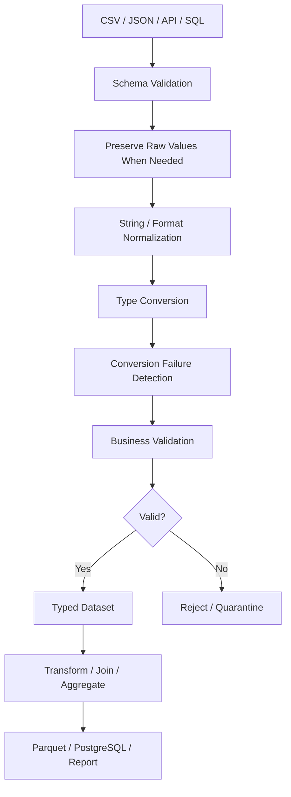

# 09- Type Conversion

## Overview

Type conversion is the process of converting DataFrame or Series values into explicit, predictable Pandas dtypes that match the dataset's contract.

Raw data frequently arrives with types that are unsuitable for reliable processing:

```text
CSV
    "1000"      → string

API
    "2026-09-10T12:30:00Z" → string

Excel
    mixed numeric / text cells

SQL
    nullable integer / decimal / timestamp semantics

JSON
    values with inconsistent representations
```

A production pipeline should therefore treat type normalization as an explicit stage:

```text
Raw Input
    ↓
Schema Validation
    ↓
Type Inspection
    ↓
Type Conversion
    ↓
Conversion Validation
    ↓
Business Validation
    ↓
Transformation
    ↓
Persistence
```

The primary Pandas tools are:

```python
astype()
pd.to_numeric()
pd.to_datetime()
convert_dtypes()
```

The important engineering principle is:

> Successful conversion does not prove that the data is valid.

For example:

```python
orders["amount"] = pd.to_numeric(
    orders["amount"],
    errors="coerce",
)
```

can successfully produce a numeric Series while silently converting malformed values into missing values.

Those conversion failures must then be detected and handled explicitly.

## Why Type Conversion Matters

Pandas operations depend heavily on dtype.

Consider:

```python
orders["amount"].sum()
```

If `amount` is numeric, Pandas performs numeric aggregation.

If it contains strings:

```text
"100"
"200"
"300"
```

the intended numeric semantics may not be preserved.

Likewise, sorting:

```python
orders["order_id"].sort_values()
```

is not the same operation semantically as sorting:

```python
orders["created_at"].sort_values()
```

when the latter has been converted to a proper datetime dtype.

Incorrect dtypes can cause:

```text
Incorrect calculations
Unexpected comparisons
Broken filtering
Poor memory efficiency
Failed database writes
Incorrect joins
Incorrect sorting
Invalid serialization
```

## Data Types in a Production DataFrame

Common Pandas dtypes include:

| Logical type | Typical Pandas dtype |
|---|---|
| Text | `string` |
| Integer with missing values | `Int64` |
| Integer without missing values | `int64` |
| Floating point | `float64` |
| Boolean with missing values | `boolean` |
| Datetime | `datetime64[ns]` or timezone-aware datetime |
| Category | `category` |
| Generic mixed values | `object` |

Dtype choice should reflect:

```text
Source semantics
Missing-value requirements
Downstream operations
Memory requirements
Serialization format
Database schema
```

## Inspecting Types

Before conversion:

```python
orders.dtypes
```

For deeper memory information:

```python
orders.info(
    memory_usage="deep"
)
```

For one column:

```python
orders["amount"].dtype
```

A type-normalization stage should usually begin by understanding what was actually ingested rather than assuming the parser inferred the desired schema.

## `astype()`

`astype()` is the standard tool for explicit dtype conversion when values are already compatible with the target type.

Example:

```python
orders["customer_id"] = (
    orders["customer_id"]
    .astype("string")
)
```

Integer conversion:

```python
orders["quantity"] = (
    orders["quantity"]
    .astype("Int64")
)
```

Boolean conversion:

```python
orders["is_active"] = (
    orders["is_active"]
    .astype("boolean")
)
```

`astype()` is useful when:

```text
The target dtype is known
Values are already structurally compatible
Conversion should fail rather than silently coerce malformed data
```

## `astype()` Failure Behavior

A direct conversion can raise an exception when values cannot be represented.

For example:

```python
orders["quantity"] = (
    orders["quantity"]
    .astype("Int64")
)
```

may fail if incompatible string values exist.

This can be desirable in strict pipelines because invalid source data becomes a visible failure.

The alternative is often:

```python
pd.to_numeric(
    ...,
    errors="coerce",
)
```

when the pipeline needs to classify malformed values instead of immediately failing.

## `astype("string")`

For text-oriented columns:

```python
orders["status"] = (
    orders["status"]
    .astype("string")
)
```

This gives the column consistent string semantics.

It is generally preferable to leaving arbitrary text data as `object` when the field is logically textual.

Then string operations can be applied:

```python
orders["status"] = (
    orders["status"]
    .astype("string")
    .str.strip()
    .str.lower()
)
```

This is a common normalization pattern.

## `astype("Int64")`

Pandas nullable integer dtype:

```python
orders["retry_count"] = (
    orders["retry_count"]
    .astype("Int64")
)
```

is useful when:

```text
Integer semantics
+
Missing values
```

must coexist.

For example:

```text
1
2
<NA>
4
```

can be represented without converting the logical field into a floating-point column simply because of missingness.

## `astype("boolean")`

Nullable boolean data can use:

```python
customers["marketing_opt_in"] = (
    customers["marketing_opt_in"]
    .astype("boolean")
)
```

This supports:

```text
True
False
<NA>
```

The three-state distinction may be important:

```text
True
    → explicitly enabled

False
    → explicitly disabled

<NA>
    → unknown / not provided
```

Do not collapse `NA` into `False` merely to obtain a binary column.

## `astype("category")`

Categorical dtype can be useful for low-cardinality repeated values:

```python
orders["status"] = (
    orders["status"]
    .astype("string")
    .str.strip()
    .str.lower()
    .astype("category")
)
```

Typical candidates include:

```text
status
country
department
payment_method
environment
region
```

Benefits can include:

```text
Lower memory usage
More efficient categorical operations
Explicit category semantics
```

The trade-off is that categorical behavior introduces a category vocabulary that downstream code must understand.

Canonicalize values before converting to `category`.

## `pd.to_numeric()`

`pd.to_numeric()` converts values to numeric types.

Example:

```python
orders["amount"] = pd.to_numeric(
    orders["amount"]
)
```

This is particularly useful when input arrives as:

```text
"1000"
"250.50"
```

rather than actual numeric values.

## `errors="raise"`

The default behavior is to raise when conversion fails.

```python
orders["amount"] = pd.to_numeric(
    orders["amount"],
    errors="raise",
)
```

This is appropriate when:

```text
Input must be valid
Malformed records indicate a batch-level contract violation
Strict failure is preferable to partial processing
```

Strict mode is often appropriate for critical financial or schema-controlled pipelines.

## `errors="coerce"`

With:

```python
orders["amount"] = pd.to_numeric(
    orders["amount"],
    errors="coerce",
)
```

invalid values become missing.

Example:

```text
"100"          → 100
"250.50"       → 250.50
"invalid"      → <NA/NaN>
```

This is useful when the pipeline wants to:

```text
Convert valid values
    ↓
Identify conversion failures
    ↓
Quarantine invalid records
```

It is dangerous if followed immediately by:

```python
.fillna(0)
```

because malformed values and genuinely missing values become indistinguishable.

## Detecting Conversion Failures

Preserve the raw representation before coercion:

```python
raw_amount = orders["amount"]

parsed_amount = pd.to_numeric(
    raw_amount,
    errors="coerce",
)

conversion_failed = (
    raw_amount.notna()
    & parsed_amount.isna()
)
```

This distinguishes:

```text
Originally missing
```

from:

```text
Originally present but malformed
```

This distinction is valuable for:

```text
Data-quality metrics
Error reporting
Source-system debugging
Quarantine workflows
```

## Cleaning Numeric Strings

External inputs often contain formatting:

```text
"1,000"
"$250.50"
" ₹1,500 "
```

Normalize known formatting first:

```python
amount = (
    orders["amount"]
    .astype("string")
    .str.strip()
    .str.replace(
        ",",
        "",
        regex=False,
    )
    .str.replace(
        "$",
        "",
        regex=False,
    )
)

orders["amount"] = pd.to_numeric(
    amount,
    errors="coerce",
)
```

Only remove symbols that are part of a defined source contract.

Do not apply generic character stripping to financial values without understanding currency and locale semantics.

## `downcast`

`pd.to_numeric()` can optionally reduce numeric representation:

```python
quantity = pd.to_numeric(
    orders["quantity"],
    errors="coerce",
    downcast="integer",
)
```

Downcasting can reduce memory usage when the smaller dtype safely represents the values.

For production pipelines, verify the resulting dtype and range requirements before relying on downcasting.

## `pd.to_datetime()`

`pd.to_datetime()` converts values to Pandas datetime representations.

Example:

```python
orders["created_at"] = pd.to_datetime(
    orders["created_at"]
)
```

This enables:

```text
Date filtering
Time arithmetic
Resampling
Time-series grouping
Datetime component extraction
Ordering
Timezone-aware processing
```

## Datetime Parsing with `errors="coerce"`

For external data:

```python
orders["created_at"] = pd.to_datetime(
    orders["created_at"],
    errors="coerce",
)
```

Malformed timestamps become missing datetime values such as `NaT`.

As with numeric conversion, track parsing failures when data quality matters.

## UTC Normalization

For event and backend systems, a common pattern is:

```python
orders["created_at"] = pd.to_datetime(
    orders["created_at"],
    errors="coerce",
    utc=True,
)
```

This produces timezone-aware UTC timestamps when parsing succeeds.

UTC normalization is useful for:

```text
Distributed systems
Kafka events
Microservices
Cross-region processing
Cloud ETL
Database integration
```

However, never assume a naive timestamp is UTC without knowing what timezone the source represents.

## Explicit Datetime Format

When the source contract is fixed, an explicit format can improve predictability:

```python
orders["created_at"] = pd.to_datetime(
    orders["created_at"],
    format="%Y-%m-%d %H:%M:%S",
    errors="coerce",
)
```

This is useful when:

```text
Source format is known
Input should conform to one specific representation
Malformed formats should be easy to detect
```

Do not specify an overly narrow format when the source legitimately contains multiple formats without first normalizing the input.

## Mixed Datetime Formats

External data may contain different representations.

A robust pipeline should decide whether to:

```text
Normalize source format before parsing
```

or:

```text
Use a parser capable of handling the accepted formats
```

Then validate unexpected values.

Do not make date interpretation dependent on machine locale.

## Ambiguous Dates

Consider:

```text
10/09/2026
```

This can represent:

```text
10 September 2026
```

or:

```text
October 9, 2026
```

depending on the source convention.

Never rely on local machine settings for business-critical date interpretation.

The source contract should define the format.

## Timezone-Aware vs Naive Datetimes

A naive datetime contains no timezone information:

```text
2026-09-10 10:00:00
```

A timezone-aware datetime includes timezone context:

```text
2026-09-10 10:00:00+00:00
```

Mixing these representations can cause:

```text
Comparison errors
Incorrect ordering
Incorrect intervals
Cross-region reporting errors
```

For distributed backend systems, standardize timezone handling.

## Converting Numeric Columns

A common pipeline:

```python
orders["quantity"] = (
    pd.to_numeric(
        orders["quantity"],
        errors="coerce",
    )
    .astype("Int64")
)
```

Then validate:

```python
invalid_quantity = (
    orders["quantity"].isna()
    | orders["quantity"].le(0)
)
```

This separates:

```text
Type conversion
```

from:

```text
Business validation
```

## Type Conversion and Missing Values

Conversion and missing-value handling often interact.

Example:

```python
orders["quantity"] = (
    pd.to_numeric(
        orders["quantity"],
        errors="coerce",
    )
    .astype("Int64")
)
```

The resulting column can contain:

```text
5
10
<NA>
```

This allows downstream validation to ask:

```python
orders["quantity"].isna()
```

without relying on an accidental float representation.

## Type Conversion and Inconsistent Values

Normalization often precedes conversion.

For example:

```python
orders["status"] = (
    orders["status"]
    .astype("string")
    .str.strip()
    .str.lower()
)
```

For numeric text:

```python
orders["amount"] = (
    orders["amount"]
    .astype("string")
    .str.strip()
)
```

Then:

```python
orders["amount"] = pd.to_numeric(
    orders["amount"],
    errors="coerce",
)
```

The general pattern is:

```text
Normalize representation
    ↓
Convert dtype
    ↓
Validate
```

## Type Conversion and Duplicate Detection

Canonicalize keys before deduplication.

For example:

```python
customers["customer_id"] = (
    customers["customer_id"]
    .astype("string")
    .str.strip()
)
```

Then:

```python
customers = customers.drop_duplicates(
    subset=["customer_id"]
)
```

Without consistent type and formatting, logically identical identifiers can remain separated.

## Type Conversion and Joins

Type mismatches can prevent joins.

For example:

```text
orders.customer_id → int64
customers.customer_id → string
```

Normalize both:

```python
orders["customer_id"] = (
    orders["customer_id"]
    .astype("string")
    .str.strip()
)

customers["customer_id"] = (
    customers["customer_id"]
    .astype("string")
    .str.strip()
)
```

Then:

```python
result = orders.merge(
    customers,
    on="customer_id",
    how="left",
    validate="many_to_one",
)
```

Schema compatibility should be established before joining.

## Database Types and Pandas Types

A PostgreSQL schema might contain:

```text
BIGINT
NUMERIC
BOOLEAN
TIMESTAMPTZ
TEXT
```

The DataFrame representation should preserve the intended logical semantics:

```text
BIGINT     → integer dtype
NUMERIC    → appropriate numeric representation
BOOLEAN    → boolean dtype
TIMESTAMPTZ → timezone-aware datetime
TEXT       → string dtype
```

Do not assume that the database driver will produce exactly the dtype desired for every downstream transformation.

Inspect and normalize explicitly where necessary.

## Financial Data and Precision

Financial fields require special consideration.

Standard floating-point values can introduce binary representation differences.

For example:

```python
orders["amount"] = pd.to_numeric(
    orders["amount"],
    errors="coerce",
)
```

is appropriate for many analytical workflows, but an authoritative financial system may require:

```text
Decimal semantics
Fixed precision
Currency-specific scale
Database NUMERIC
```

Do not use type conversion as an excuse to discard monetary precision.

For financial persistence, establish the numeric contract with the database and application layer.

## Boolean Conversion Pitfalls

Avoid blindly converting arbitrary strings with:

```python
astype(bool)
```

because non-empty strings are truthy in Python:

```text
"false" → True
"no"    → True
```

That is usually incorrect business behavior.

Use explicit mapping:

```python
raw = (
    customers["marketing_opt_in"]
    .astype("string")
    .str.strip()
    .str.lower()
)

mapping = {
    "true": True,
    "false": False,
    "yes": True,
    "no": False,
    "y": True,
    "n": False,
}

customers["marketing_opt_in"] = (
    raw.replace(mapping)
    .astype("boolean")
)
```

Then validate unknown values before relying on the result.

## Safe Boolean Normalization

For stricter validation:

```python
raw = (
    customers["marketing_opt_in"]
    .astype("string")
    .str.strip()
    .str.lower()
)

allowed = {
    "true",
    "false",
    "yes",
    "no",
    "y",
    "n",
}

unknown = (
    raw.notna()
    & ~raw.isin(allowed)
)
```

Then map only known values.

This prevents:

```text
"maybe"
"enabled"
"not sure"
```

from silently becoming a valid boolean.

## Type Conversion from JSON

JSON does not carry all of the schema semantics required by a production DataFrame.

For example:

```json
{
  "quantity": "10",
  "active": "true",
  "created_at": "2026-09-10T12:30:00Z"
}
```

may be ingested as strings.

Normalize explicitly:

```python
orders["quantity"] = (
    pd.to_numeric(
        orders["quantity"],
        errors="coerce",
    )
    .astype("Int64")
)

orders["active"] = (
    orders["active"]
    .astype("string")
    .str.strip()
    .str.lower()
    .replace(
        {
            "true": True,
            "false": False,
        }
    )
    .astype("boolean")
)

orders["created_at"] = pd.to_datetime(
    orders["created_at"],
    errors="coerce",
    utc=True,
)
```

Treat API data as input that requires validation even when the HTTP request succeeded.

## Type Conversion from CSV

CSV has no native schema.

Values are inferred from textual representation.

For example:

```python
orders = pd.read_csv(
    "orders.csv"
)
```

may not produce the desired logical dtypes.

A post-ingestion schema stage can normalize:

```python
orders["order_id"] = (
    orders["order_id"]
    .astype("string")
)

orders["amount"] = pd.to_numeric(
    orders["amount"],
    errors="coerce",
)

orders["created_at"] = pd.to_datetime(
    orders["created_at"],
    errors="coerce",
    utc=True,
)
```

When the schema is known in advance, prefer declaring as much as possible during ingestion with parser options to reduce unnecessary inference and post-processing.

## Type Conversion from Excel

Excel frequently contains mixed cells:

```text
100
"100"
blank
"pending"
```

Excel also stores dates in representations that require careful interpretation.

After reading:

```python
orders = pd.read_excel(
    "orders.xlsx"
)
```

normalize critical fields explicitly.

Do not rely on formatting visible in Excel as proof that the underlying values satisfy the data contract.

## Type Conversion to Parquet

Parquet preserves typed column data better than text formats.

After normalization:

```python
orders.to_parquet(
    "processed/orders.parquet",
    index=False,
)
```

This makes dtype consistency important before publication.

A pipeline should validate:

```text
Column presence
Logical types
Nullability
Key fields
Expected ranges
```

before writing the processed dataset.

## `convert_dtypes()`

`convert_dtypes()` attempts to convert columns to more appropriate nullable dtypes.

Example:

```python
orders = orders.convert_dtypes()
```

This can be useful when:

```text
Input data has inconsistent inferred representations
A broad normalization pass is appropriate
Nullable extension dtypes are preferred
```

However, it is not a replacement for a dataset-specific schema contract.

It does not know that:

```text
amount must be numeric and non-negative
status must belong to a specific vocabulary
customer_id must be unique
```

Those remain business-level rules.

## `convert_dtypes()` vs Explicit Conversion

| Requirement | Preferred approach |
|---|---|
| Broad nullable dtype cleanup | `convert_dtypes()` |
| Explicit known dtype | `astype()` |
| Numeric parsing | `pd.to_numeric()` |
| Datetime parsing | `pd.to_datetime()` |
| Domain-specific parsing | Explicit normalization + validation |

Use `convert_dtypes()` as a general dtype normalization tool, not as a substitute for schema validation.

## `dtype` vs `object`

`object` is often a warning sign when a column is expected to contain one logical type.

For example:

```python
orders["status"].dtype
```

returning:

```text
object
```

does not tell you enough about the actual values.

Inspect:

```python
orders["status"].map(type).value_counts()
```

when diagnosing unexpected mixed content.

Prefer explicit logical dtypes after cleaning.

## Mixed-Type Columns

A column like:

```text
100
200
"300"
None
"unknown"
```

does not have one consistent business type.

Do not immediately force it into a numeric column without deciding what `"unknown"` means.

A controlled process is:

```text
Identify representations
    ↓
Normalize known valid values
    ↓
Convert
    ↓
Detect failures
    ↓
Validate
```

## Type Conversion and Validation Errors

Different failures should be classified separately.

### Schema Failure

```text
Required column does not exist.
```

### Conversion Failure

```text
"abc" cannot be converted to numeric.
```

### Domain Failure

```text
amount = -100
```

### Integrity Failure

```text
customer_id does not exist in customers.
```

Type conversion handles only part of this pipeline.

## Conversion Failure Reporting

A reusable helper can expose failed conversions:

```python
def parse_numeric(
    values: pd.Series,
) -> tuple[
    pd.Series,
    pd.Series,
]:
    raw = values.copy()

    parsed = pd.to_numeric(
        raw,
        errors="coerce",
    )

    failed = (
        raw.notna()
        & parsed.isna()
    )

    return parsed, failed
```

Usage:

```python
orders["amount"], failed = parse_numeric(
    orders["amount"]
)

conversion_failures = orders.loc[
    failed
]
```

This makes conversion errors observable.

## Strict vs Lenient Conversion

Choose conversion behavior according to pipeline requirements.

| Strategy | Behavior | Best for |
|---|---|---|
| Strict | Fail immediately | Critical schemas |
| Coerce | Convert invalid values to missing | Batch quality classification |
| Normalize then convert | Clean known representations first | External sources |
| Preserve raw + converted | Keep source value and parsed value | Audit-sensitive pipelines |

For high-value data, preserving the raw representation can make troubleshooting much easier.

## Preserving Raw Values

When conversion may fail:

```python
orders["amount_raw"] = orders["amount"]

orders["amount"] = pd.to_numeric(
    orders["amount"],
    errors="coerce",
)
```

Now the pipeline retains:

```text
amount_raw
    → original source representation

amount
    → normalized numeric representation
```

This pattern is valuable when records may be quarantined or audited.

Be aware that retaining raw columns increases memory usage and should be removed or persisted according to the lineage requirements.

## Data Quality Pipeline

A production type-normalization flow can be represented as:



Type conversion should occur before operations that rely on the target logical type.

## Type Conversion in Batch ETL

A practical batch cleaning function:

```python
import pandas as pd


def normalize_orders(
    orders: pd.DataFrame,
) -> tuple[
    pd.DataFrame,
    pd.DataFrame,
]:
    result = orders.copy()

    result["order_id"] = (
        result["order_id"]
        .astype("string")
        .str.strip()
    )

    result["customer_id"] = (
        result["customer_id"]
        .astype("string")
        .str.strip()
    )

    result["status"] = (
        result["status"]
        .astype("string")
        .str.strip()
        .str.lower()
    )

    result["amount_raw"] = result["amount"]

    result["amount"] = pd.to_numeric(
        result["amount"],
        errors="coerce",
    )

    result["quantity"] = (
        pd.to_numeric(
            result["quantity"],
            errors="coerce",
        )
        .astype("Int64")
    )

    result["created_at"] = pd.to_datetime(
        result["created_at"],
        errors="coerce",
        utc=True,
    )

    allowed_statuses = {
        "pending",
        "processing",
        "completed",
        "cancelled",
    }

    valid = (
        result["order_id"].notna()
        & result["order_id"].ne("")
        & result["customer_id"].notna()
        & result["customer_id"].ne("")
        & result["amount"].notna()
        & result["amount"].ge(0)
        & result["quantity"].notna()
        & result["quantity"].gt(0)
        & result["created_at"].notna()
        & result["status"].isin(
            allowed_statuses
        )
    )

    valid_orders = result.loc[
        valid
    ].copy()

    rejected_orders = result.loc[
        ~valid
    ].copy()

    return valid_orders, rejected_orders
```

The stages are explicit:

```text
Normalize identifiers
    ↓
Normalize categorical values
    ↓
Parse numeric fields
    ↓
Parse integer fields
    ↓
Parse timestamps
    ↓
Validate business constraints
    ↓
Split valid / rejected
```

## Performance Considerations

Vectorized conversion should be preferred:

```python
orders["amount"] = pd.to_numeric(
    orders["amount"],
    errors="coerce",
)
```

over:

```python
orders["amount"] = [
    float(value)
    for value in orders["amount"]
]
```

Vectorized operations integrate better with Pandas and avoid Python-level loops.

For large datasets:

```text
Convert only required columns
Avoid repeated conversions
Avoid unnecessary copies
Project source columns early
Use chunked reads when required
Push suitable conversion/filtering into SQL when appropriate
```

## Avoid Repeated Conversions

Do not repeatedly perform:

```python
orders["amount"] = pd.to_numeric(
    orders["amount"],
    errors="coerce",
)

orders["amount"] = pd.to_numeric(
    orders["amount"],
    errors="coerce",
)
```

unless there is a clear stage boundary.

A clean pipeline should normally establish the dtype once and rely on the normalized representation downstream.

## Chunked Numeric Conversion

For large CSV files:

```python
for chunk in pd.read_csv(
    "orders.csv",
    chunksize=100_000,
):
    chunk["amount"] = pd.to_numeric(
        chunk["amount"],
        errors="coerce",
    )

    process_chunk(chunk)
```

This keeps processing bounded by chunk size.

However, global validation and schema consistency still need to be maintained across chunks.

## Chunked Datetime Conversion

Likewise:

```python
for chunk in pd.read_csv(
    "events.csv",
    chunksize=100_000,
):
    chunk["event_time"] = pd.to_datetime(
        chunk["event_time"],
        errors="coerce",
        utc=True,
    )

    process_chunk(chunk)
```

Ensure every chunk uses the same parsing and timezone policy.

## Memory Considerations

Type conversion may change memory usage substantially.

Examples:

```text
object strings
    ↓
string / category

object numeric strings
    ↓
numeric dtype

object booleans
    ↓
boolean dtype
```

Use:

```python
orders.memory_usage(
    deep=True
)
```

to inspect memory usage.

Categorical conversion can be valuable for low-cardinality dimensions, while converting high-cardinality identifiers to categories may not provide the expected benefits.

## Type Conversion and Copy Semantics

Be explicit about ownership when transforming a subset:

```python
subset = orders.loc[
    orders["status"].eq("pending")
].copy()

subset["amount"] = pd.to_numeric(
    subset["amount"],
    errors="coerce",
)
```

Use `.copy()` when the subset should be independently owned.

Avoid copying entire large DataFrames simply because a dtype conversion is occurring.

## Conversion Before Filtering

Convert before filtering on the target type.

Bad:

```python
orders.loc[
    orders["amount"].gt(1000)
]
```

when `amount` is actually textual data.

Better:

```python
orders["amount"] = pd.to_numeric(
    orders["amount"],
    errors="coerce",
)

orders = orders.loc[
    orders["amount"].gt(1000)
]
```

Otherwise, comparisons may have incorrect semantics or fail.

## Conversion Before Aggregation

Likewise:

```python
orders["amount"] = pd.to_numeric(
    orders["amount"],
    errors="coerce",
)

revenue = (
    orders
    .groupby("customer_id")["amount"]
    .sum()
)
```

The aggregate should operate on a controlled numeric representation.

## Conversion Before Joins

Keys should be compatible before joining:

```python
orders["customer_id"] = (
    orders["customer_id"]
    .astype("string")
)

customers["customer_id"] = (
    customers["customer_id"]
    .astype("string")
)

result = orders.merge(
    customers,
    on="customer_id",
    how="left",
    validate="many_to_one",
)
```

Type mismatches in join keys are a common source of unexpected empty or incomplete joins.

## Conversion Before Duplicate Detection

The same applies to deduplication:

```python
customers["customer_id"] = (
    customers["customer_id"]
    .astype("string")
    .str.strip()
)

customers = customers.drop_duplicates(
    subset=["customer_id"]
)
```

A key should have one canonical representation before uniqueness is evaluated.

## Type Conversion and Reporting

Reports depend on data types for:

```text
Sorting
Formatting
Aggregation
Date grouping
Calculations
Null handling
```

For example:

```python
report["revenue"] = pd.to_numeric(
    report["revenue"],
    errors="coerce",
)

report["report_date"] = pd.to_datetime(
    report["report_date"],
    errors="coerce",
    utc=True,
)
```

Do type normalization before the reporting transformation rather than embedding conversions in every report calculation.

## Security Considerations

Type conversion often processes untrusted external input.

Do not treat successful parsing as proof that the value is safe for another system.

For example:

```python
amount = pd.to_numeric(
    request_value,
    errors="coerce",
)
```

does not by itself establish that:

```text
amount >= 0
amount is within a business maximum
currency is valid
user is authorized to submit the value
```

Those checks belong to the validation and authorization layers.

Never use DataFrame values directly as SQL fragments, file paths, shell commands, or query expressions without proper validation and parameterization.

## Database Persistence

Before writing to PostgreSQL:

```python
orders.to_sql(
    "orders",
    connection,
    if_exists="append",
    index=False,
)
```

validate the output schema and constraints.

The database should still enforce:

```text
NOT NULL
CHECK
UNIQUE
FOREIGN KEY
Numeric precision
```

Pandas type conversion should prepare data for persistence, not replace database integrity constraints.

## Type Conversion and REST APIs

A FastAPI or Django service receiving data from external sources may use Pandas for batch processing:

```text
HTTP request
    ↓
API schema validation
    ↓
Pandas ingestion
    ↓
Type normalization
    ↓
Business validation
    ↓
Database / Parquet
```

API-layer validation and Pandas validation can complement each other.

Do not assume that one validation layer makes downstream data contracts unnecessary.

## Type Conversion and Kafka

For Kafka event batches:

```text
JSON event
    ↓
DataFrame
    ↓
Type normalization
    ↓
Schema validation
    ↓
Deduplication
    ↓
Transformation
    ↓
Persistence
```

Event schema evolution should be managed explicitly.

Pandas can defensively normalize payloads, but it does not provide distributed schema governance or exactly-once delivery.

## Testing Type Conversion

Tests should verify actual dtypes and values.

Example:

```python
import pandas as pd


def test_converts_quantity_to_nullable_integer() -> None:
    raw = pd.Series(
        [
            "10",
            "20",
            None,
        ]
    )

    result = (
        pd.to_numeric(
            raw,
            errors="coerce",
        )
        .astype("Int64")
    )

    assert result.tolist() == [
        10,
        20,
        pd.NA,
    ]

    assert str(result.dtype) == "Int64"
```

This protects both:

```text
Value semantics
Dtype semantics
```

## Testing Conversion Failures

```python
def test_identifies_invalid_numeric_values() -> None:
    raw = pd.Series(
        [
            "100",
            "invalid",
            None,
        ],
        dtype="string",
    )

    parsed = pd.to_numeric(
        raw,
        errors="coerce",
    )

    failed = (
        raw.notna()
        & parsed.isna()
    )

    assert failed.tolist() == [
        False,
        True,
        False,
    ]
```

This verifies that malformed values are distinguishable from original missingness.

## Testing Datetime Conversion

```python
def test_parses_timestamps_as_utc() -> None:
    raw = pd.Series(
        [
            "2026-09-10T10:00:00Z",
        ],
        dtype="string",
    )

    result = pd.to_datetime(
        raw,
        errors="coerce",
        utc=True,
    )

    assert (
        str(result.dtype)
        == "datetime64[ns, UTC]"
    )
```

The exact dtype string can vary with future Pandas implementation details, so tests should focus on timezone awareness and expected values when portability across versions matters.

## Testing Boolean Conversion

```python
def test_normalizes_boolean_strings() -> None:
    raw = (
        pd.Series(
            [
                "YES",
                "no",
            ],
            dtype="string",
        )
        .str.strip()
        .str.lower()
    )

    result = (
        raw
        .replace(
            {
                "yes": True,
                "no": False,
            }
        )
        .astype("boolean")
    )

    assert result.tolist() == [
        True,
        False,
    ]
```

## Testing Join Compatibility

A useful integration test verifies that converted keys actually join:

```python
def test_type_normalization_enables_join() -> None:
    orders = pd.DataFrame(
        {
            "customer_id": [1001],
        }
    )

    customers = pd.DataFrame(
        {
            "customer_id": ["1001"],
            "name": ["Customer A"],
        }
    )

    orders["customer_id"] = (
        orders["customer_id"]
        .astype("string")
    )

    customers["customer_id"] = (
        customers["customer_id"]
        .astype("string")
    )

    result = orders.merge(
        customers,
        on="customer_id",
        how="inner",
        validate="many_to_one",
    )

    assert len(result) == 1
```

The test protects a real downstream dependency rather than just testing `astype()` in isolation.

## Common Mistakes

| Mistake | Why it happens | Better approach |
|---|---|---|
| Using `astype(bool)` on `"false"` | Python truthiness is misunderstood | Explicitly map accepted boolean strings |
| Using `astype(int)` with missing values | Nullable integer semantics are ignored | Use `Int64` when missing integers are valid |
| Using `errors="coerce"` without checking failures | Invalid values silently become missing | Track conversion failures |
| Converting IDs to numbers | IDs are mistaken for measurements | Preserve identifiers as strings |
| Filling conversion failures with zero | Parsing errors are hidden | Separate malformed and missing values |
| Parsing dates without timezone policy | Local time assumptions are ignored | Define source timezone and normalize appropriately |
| Comparing dates before conversion | Strings are compared lexically | Parse to datetime first |
| Joining before type normalization | Key dtypes differ | Normalize join keys first |
| Deduplicating before key normalization | Equivalent IDs remain distinct | Canonicalize keys first |
| Applying `convert_dtypes()` as schema validation | Generic dtype inference is mistaken for business validation | Use explicit schema checks |
| Assuming database driver dtypes are final | Driver output is treated as authoritative | Inspect and normalize |
| Converting every column blindly | DataFrame-wide normalization seems convenient | Apply field-specific schema rules |
| Using floating point for all money | Numeric simplicity is prioritized | Define financial precision explicitly |

## Production Pitfalls

### Silent Coercion

This pattern is dangerous:

```python
orders["amount"] = (
    pd.to_numeric(
        orders["amount"],
        errors="coerce",
    )
    .fillna(0)
)
```

It can turn:

```text
"invalid"
None
""
```

into:

```text
0
```

The pipeline has now lost the distinction between:

```text
Valid zero
Missing value
Malformed source value
```

For quality-sensitive processing, detect conversion failures first.

### Converting Identifiers to Numbers

Avoid:

```python
customers["customer_id"] = (
    customers["customer_id"]
    .astype(int)
)
```

if identifiers can contain:

```text
Leading zeros
Letters
Composite formats
Large values
```

Use:

```python
customers["customer_id"] = (
    customers["customer_id"]
    .astype("string")
)
```

when the field is an identifier rather than a measurement.

### Boolean Truthiness

This is wrong for textual boolean data:

```python
df["active"] = df["active"].astype(bool)
```

because:

```text
"false" → True
"no"    → True
```

Map approved representations explicitly.

### Ambiguous Date Interpretation

Never let machine locale determine the meaning of:

```text
10/09/2026
```

Define the source convention and normalize deterministically.

### Type Conversion Without Validation

A successful conversion only proves representability.

For example:

```python
orders["amount"] = pd.to_numeric(
    orders["amount"],
    errors="coerce",
)
```

does not prove:

```text
amount >= 0
amount <= maximum
currency is valid
transaction is authorized
```

Validate after conversion.

### Global `convert_dtypes()`

This:

```python
df = df.convert_dtypes()
```

can be useful as a general cleanup pass, but should not replace explicit dataset contracts for production interfaces.

## Interview Traps

### What Is the Difference Between `astype()` and `pd.to_numeric()`?

`astype()` performs explicit dtype conversion and typically raises when values are incompatible with the target dtype.

`pd.to_numeric()` is designed specifically for parsing numeric values and provides `errors="raise"`, `errors="coerce"`, and `errors="ignore"` behavior depending on the operation and version context.

For new production code, prefer explicit failure or coercion semantics over suppressing errors.

### Why Use `Int64` Instead of `int64`?

`Int64` is Pandas' nullable integer extension dtype and can represent:

```text
integer
+
pd.NA
```

without forcing the logical field into floating-point representation.

### What Does `errors="coerce"` Mean?

Invalid values are converted to missing values rather than raising immediately.

Use it when the pipeline needs to identify malformed records explicitly.

### Why Preserve the Raw Value Before Conversion?

It allows the pipeline to distinguish:

```text
Originally missing
```

from:

```text
Originally present but invalid
```

This improves data-quality diagnostics and auditability.

### Why Can `astype(bool)` Be Dangerous?

Because Python treats any non-empty string as truthy:

```python
bool("false") is True
```

Therefore textual booleans need explicit mappings.

### Why Normalize IDs as Strings?

An identifier is not necessarily a number.

Numeric conversion can remove leading zeros or reject valid non-numeric identifiers.

### What Is `convert_dtypes()` For?

It attempts to convert columns to appropriate nullable Pandas dtypes. It is useful for broad dtype cleanup but does not encode business rules.

### Should Every Column Be Converted with `astype()`?

No. Dtype decisions should follow the dataset schema and downstream requirements.

### Why Convert Before Filtering?

Filtering and comparisons depend on logical type.

For example, numeric filtering should operate on a numeric dtype, not textual representations.

### Why Convert Before Joining?

Join keys must have compatible representations. A string `"1001"` and integer `1001` are different values unless normalized into a common representation.

### What Is the Difference Between Type Validation and Business Validation?

Type validation asks:

```text
Can this value be represented as the expected type?
```

Business validation asks:

```text
Is this value acceptable under the domain rules?
```

For example:

```text
"-100"
    ↓
numeric conversion succeeds

amount = -100
    ↓
business validation fails
```

### Should Financial Values Always Use `float64`?

No. Financial systems often require explicit decimal or fixed-precision semantics. The appropriate representation depends on the storage and calculation contract.

### Does Successful Datetime Parsing Mean the Timestamp Is Correct?

No. The timestamp may still have:

```text
Wrong timezone
Wrong business date
Future value
Invalid state relationship
```

Parsing and validation are separate concerns.

## Recommended Engineering Pattern

A robust type-normalization layer should make conversions explicit:

```python
import pandas as pd


def normalize_order_schema(
    orders: pd.DataFrame,
) -> pd.DataFrame:
    required = {
        "order_id",
        "customer_id",
        "status",
        "amount",
        "quantity",
        "created_at",
    }

    missing = (
        required
        - set(orders.columns)
    )

    if missing:
        raise ValueError(
            f"Missing columns: {sorted(missing)}"
        )

    result = orders.copy()

    result["order_id"] = (
        result["order_id"]
        .astype("string")
        .str.strip()
    )

    result["customer_id"] = (
        result["customer_id"]
        .astype("string")
        .str.strip()
    )

    result["status"] = (
        result["status"]
        .astype("string")
        .str.strip()
        .str.lower()
    )

    result["amount"] = pd.to_numeric(
        result["amount"],
        errors="coerce",
    )

    result["quantity"] = (
        pd.to_numeric(
            result["quantity"],
            errors="coerce",
        )
        .astype("Int64")
    )

    result["created_at"] = pd.to_datetime(
        result["created_at"],
        errors="coerce",
        utc=True,
    )

    return result
```

Then validate separately:

```python
def validate_orders(
    orders: pd.DataFrame,
) -> pd.Series:
    allowed_statuses = {
        "pending",
        "processing",
        "completed",
        "cancelled",
    }

    return (
        orders["order_id"].notna()
        & orders["order_id"].ne("")
        & orders["customer_id"].notna()
        & orders["customer_id"].ne("")
        & orders["status"].isin(
            allowed_statuses
        )
        & orders["amount"].notna()
        & orders["amount"].ge(0)
        & orders["quantity"].notna()
        & orders["quantity"].gt(0)
        & orders["created_at"].notna()
    )
```

Finally:

```python
normalized = normalize_order_schema(
    raw_orders
)

valid_mask = validate_orders(
    normalized
)

valid_orders = normalized.loc[
    valid_mask
].copy()

rejected_orders = normalized.loc[
    ~valid_mask
].copy()
```

This keeps responsibilities separate:

```text
Schema
    ↓
Type normalization
    ↓
Business validation
    ↓
Valid / rejected
```

## Conversion Audit Metrics

A production pipeline should measure conversion quality.

Example:

```python
raw_amount = raw_orders["amount"]

parsed_amount = pd.to_numeric(
    raw_amount,
    errors="coerce",
)

conversion_failed = (
    raw_amount.notna()
    & parsed_amount.isna()
)

metrics = {
    "rows": len(raw_orders),
    "amount_conversion_failures": int(
        conversion_failed.sum()
    ),
    "amount_conversion_failure_rate": (
        float(conversion_failed.mean())
        if len(raw_orders)
        else 0.0
    ),
}
```

Similar metrics can be produced for:

```text
Quantity
Dates
Boolean fields
Identifiers
Categorical mappings
```

These measurements make upstream regressions visible.

## Production Checklist

Before deploying type conversion:

- Define the logical dtype for every important field.
- Distinguish identifiers from numeric measurements.
- Normalize strings before explicit string comparisons or joins.
- Use nullable dtypes where missing values are valid.
- Normalize and validate boolean representations explicitly.
- Parse numeric fields with explicit error handling.
- Parse datetimes with an explicit timezone policy.
- Preserve raw values when conversion failures require investigation.
- Detect coercion failures instead of silently accepting them.
- Validate business constraints after conversion.
- Normalize join and deduplication keys before relational operations.
- Measure conversion failures in production.
- Avoid unnecessary DataFrame copies and repeated conversions.
- Use chunked processing for data that does not fit comfortably in memory.
- Let PostgreSQL enforce authoritative schema and integrity constraints.

## Key Takeaways

- Type conversion establishes predictable Pandas dtypes, but **successful conversion is not the same as valid data**; business validation must follow.
- Use `astype()` for explicit compatible dtype changes, `pd.to_numeric()` for numeric parsing, `pd.to_datetime()` for datetime parsing, and `convert_dtypes()` for broad nullable-dtype cleanup.
- Preserve identifiers as identifiers, use nullable dtypes where appropriate, normalize boolean and datetime representations explicitly, and protect financial precision according to the system's contract.
- Treat `errors="coerce"` as a controlled error-classification mechanism, not a silent cleanup strategy; track conversion failures before filling or discarding the resulting missing values.
- Normalize types before filtering, joins, deduplication, aggregation, and persistence, and combine Pandas schema handling with database constraints and production-quality monitoring.