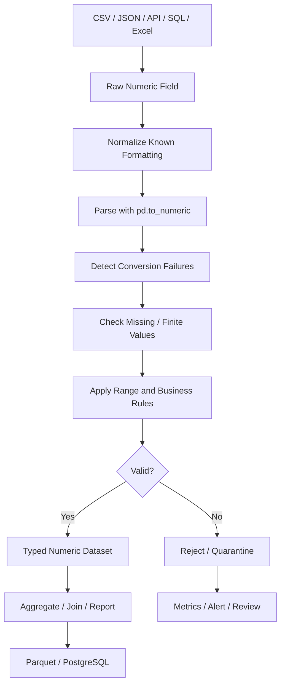

# 10- Numeric Cleaning

## Overview

Numeric cleaning is the process of converting inconsistent numeric representations into reliable numeric values and enforcing the business rules that determine whether those values are usable.

Real-world numeric fields rarely arrive perfectly formed. CSV files, APIs, Excel exports, databases, and event streams may contain:

```text
"100"
"1,000.50"
"$250.00"
"₹1,500"
""
"unknown"
"10%"
None
-50
0
```

A production Pandas pipeline should treat numeric cleaning as a staged process:

```text
Raw numeric field
        ↓
Profile representations
        ↓
Normalize known formatting
        ↓
Parse to numeric dtype
        ↓
Detect conversion failures
        ↓
Apply business constraints
        ↓
Handle missing / invalid values
        ↓
Validate output
        ↓
Persist typed data
```

The critical distinction is:

```text
Parsing
    → Can the representation be interpreted as a number?

Validation
    → Is the resulting number acceptable for the business?
```

For example:

```text
"-100"
    ↓
numeric parsing succeeds
    ↓
business validation may fail
```

A successful numeric conversion does not establish that the value is valid.

## Why Numeric Cleaning Matters

Incorrect numeric representations cause failures in:

```text
Aggregations
Comparisons
Sorting
Filtering
Joins
Financial calculations
Reporting
Database persistence
Threshold checks
```

Consider a revenue column:

```text
"100"
"900"
"1,000"
```

If these remain strings, operations expecting numeric semantics can behave incorrectly or fail.

After normalization:

```text
100
900
1000
```

the DataFrame can safely perform:

```python
orders["amount"].sum()
orders["amount"].mean()
orders["amount"].gt(500)
```

Numeric cleaning is therefore a schema-normalization task, not merely string manipulation.

## Numeric Cleaning vs Numeric Validation

These should be separated.

### Numeric Cleaning

Convert:

```text
"1,000.50"
```

into:

```text
1000.50
```

### Numeric Validation

Check:

```text
amount >= 0
amount <= configured maximum
quantity > 0
discount_pct between 0 and 100
```

The preferred workflow is:

```text
Normalize representation
    ↓
Convert
    ↓
Detect parsing failures
    ↓
Validate business constraints
```

## Common Numeric Problems

| Input problem | Example | Typical handling |
|---|---|---|
| String number | `"1000"` | `pd.to_numeric()` |
| Thousands separator | `"1,000"` | Remove known separator |
| Currency symbol | `"$100"` | Strip known symbol |
| Whitespace | `" 100 "` | `.str.strip()` |
| Empty string | `""` | Convert to missing if domain says so |
| Null | `None` | Preserve or handle with missing-value policy |
| Invalid text | `"unknown"` | Reject / quarantine |
| Percentage | `"15%"` | Normalize to agreed representation |
| Negative value | `"-50"` | Parse, then validate |
| Decimal comma | `"1.234,56"` | Locale-aware parsing |
| Scientific notation | `"1e6"` | Numeric parser |
| Boolean-like number | `"0"` / `"1"` | Explicit domain conversion |
| Overflow / extreme value | Very large numeric | Range validation |

Not every formatting difference should be removed automatically.

## Inspecting Numeric Columns

Before cleaning:

```python
orders["amount"].dtype
```

Inspect representative values:

```python
orders["amount"].head()
```

Profile distinct representations:

```python
orders["amount"].value_counts(
    dropna=False
).head(20)
```

For deeper diagnosis:

```python
orders["amount"].map(type).value_counts()
```

This can reveal mixed inputs such as:

```text
str
int
float
NoneType
```

## Preserving Raw Values

For important pipelines, preserve the source representation before parsing:

```python
orders["amount_raw"] = (
    orders["amount"]
)
```

Then:

```python
orders["amount"] = pd.to_numeric(
    orders["amount"],
    errors="coerce",
)
```

This provides:

```text
amount_raw
    → original source representation

amount
    → normalized numeric representation
```

The raw value is especially useful for:

```text
Quality diagnostics
Quarantine records
Auditing
Source-system debugging
Backfills
```

Preserving raw columns increases memory usage, so retain them only when the lineage or audit requirement justifies it.

## `pd.to_numeric()`

`pd.to_numeric()` is the primary Pandas tool for parsing numeric values.

```python
orders["amount"] = pd.to_numeric(
    orders["amount"]
)
```

It supports:

```python
errors="raise"
errors="coerce"
errors="ignore"
```

For new production code, prefer explicit behavior rather than suppressing conversion failures.

## Strict Numeric Parsing

The default behavior is appropriate when malformed values should fail visibly:

```python
orders["amount"] = pd.to_numeric(
    orders["amount"],
    errors="raise",
)
```

This is useful when:

```text
The upstream contract is strict
Every record must have valid numeric input
A malformed batch should not be published
```

The advantage is fail-fast behavior.

The limitation is that one malformed record can prevent processing of an otherwise recoverable batch.

## Coercing Invalid Values

For classification-oriented pipelines:

```python
orders["amount"] = pd.to_numeric(
    orders["amount"],
    errors="coerce",
)
```

invalid values become missing.

Example:

```text
"100"       → 100
"250.50"    → 250.50
"invalid"   → missing
None        → missing
```

This allows the pipeline to separate:

```text
Valid numeric values
```

from:

```text
Unparseable values
```

The important production step is to inspect conversion failures rather than immediately filling them.

## Detecting Parsing Failures

Preserve the original Series:

```python
raw = orders["amount"]

parsed = pd.to_numeric(
    raw,
    errors="coerce",
)

conversion_failed = (
    raw.notna()
    & parsed.isna()
)
```

This distinguishes:

```text
Original missing value
```

from:

```text
Originally present but malformed value
```

Inspect failures:

```python
failed_rows = orders.loc[
    conversion_failed,
    ["order_id", "amount"],
]
```

This is more operationally useful than simply calling `isna()` after conversion.

## Empty Strings

An empty string is not automatically a numeric zero.

Consider:

```text
""
```

It may mean:

```text
Missing
Not applicable
Not provided
Malformed source
```

If the source contract says empty strings represent missing values:

```python
amount = (
    orders["amount"]
    .astype("string")
    .str.strip()
    .replace("", pd.NA)
)

orders["amount"] = pd.to_numeric(
    amount,
    errors="coerce",
)
```

Do not automatically replace empty numeric values with zero unless the business semantics define that equivalence.

## Whitespace

Normalize surrounding whitespace:

```python
amount = (
    orders["amount"]
    .astype("string")
    .str.strip()
)

orders["amount"] = pd.to_numeric(
    amount,
    errors="coerce",
)
```

This handles inputs such as:

```text
" 100 "
" 250.50"
```

while leaving meaningful numeric content intact.

## Thousands Separators

A common CSV representation is:

```text
"1,234.56"
```

Normalize known separators:

```python
amount = (
    orders["amount"]
    .astype("string")
    .str.strip()
    .str.replace(
        ",",
        "",
        regex=False,
    )
)

orders["amount"] = pd.to_numeric(
    amount,
    errors="coerce",
)
```

This works for a source using:

```text
1,234.56
```

It is not universally correct for all locales.

For:

```text
1.234,56
```

a different parsing strategy is required.

## Locale-Specific Numeric Formats

Numeric formatting can vary by locale.

Examples:

```text
1,234.56
1.234,56
1 234,56
```

These do not mean the same textual representation.

Do not globally remove both `.` and `,`.

Instead, define the source locale:

```text
Source contract
    ↓
Locale-specific normalization
    ↓
Numeric parsing
```

For important financial data, use a dedicated parser or explicit locale-aware transformation rather than heuristics.

## Currency Symbols

Values may contain symbols:

```text
$1,000.00
₹1,500.00
€750.00
```

If the source format is known:

```python
amount = (
    orders["amount"]
    .astype("string")
    .str.strip()
    .str.replace(
        "$",
        "",
        regex=False,
    )
    .str.replace(
        ",",
        "",
        regex=False,
    )
)

orders["amount"] = pd.to_numeric(
    amount,
    errors="coerce",
)
```

Do not treat currency symbols as sufficient evidence of currency identity.

A robust financial schema should normally keep:

```text
amount
currency
```

as separate fields.

## Currency and Amount Should Be Separate

Avoid storing:

```text
"$1,000.00"
```

as the canonical numeric field.

Prefer:

```text
amount = 1000.00
currency = USD
```

This enables:

```text
Aggregation by currency
Currency validation
Exchange-rate processing
Database numeric columns
```

For example:

```python
orders["amount"] = pd.to_numeric(
    orders["amount"],
    errors="coerce",
)

orders["currency"] = (
    orders["currency"]
    .astype("string")
    .str.strip()
    .str.upper()
)
```

Then validate both independently.

## Percentage Values

Percentages can be represented as:

```text
15
15%
0.15
```

These representations are not interchangeable unless the contract defines them.

If the source uses `"15%"` and the canonical representation is decimal `0.15`:

```python
discount = (
    orders["discount"]
    .astype("string")
    .str.strip()
    .str.rstrip("%")
)

orders["discount"] = (
    pd.to_numeric(
        discount,
        errors="coerce",
    )
    / 100
)
```

Then validate:

```python
valid_discount = orders[
    "discount"
].between(
    0,
    1,
)
```

Do not mix percentage conventions in the same column.

## Negative Values

Parsing:

```python
orders["amount"] = pd.to_numeric(
    orders["amount"],
    errors="coerce",
)
```

does not determine whether negative values are acceptable.

For an order amount:

```python
valid_amount = orders[
    "amount"
].ge(0)
```

For a financial ledger, negative values may be legitimate:

```text
Debit
Credit
Refund
Adjustment
Chargeback
```

The validation rule must come from the data model.

## Zero Values

Zero is a valid numeric value in many datasets.

Do not confuse:

```python
orders["amount"].eq(0)
```

with:

```python
orders["amount"].isna()
```

For example:

```text
amount = 0
    → actual zero-value transaction

amount = missing
    → unknown / unavailable amount
```

These states should remain distinct unless the business contract explicitly equates them.

## Numeric Range Validation

After parsing:

```python
orders["amount"] = pd.to_numeric(
    orders["amount"],
    errors="coerce",
)
```

apply range checks:

```python
valid_amount = orders[
    "amount"
].between(
    0,
    1_000_000,
)
```

This can detect:

```text
Negative values
Unrealistically large values
Corrupted magnitudes
Unit conversion errors
```

The limits should be business-defined.

## Quantity Validation

For product quantities:

```python
orders["quantity"] = (
    pd.to_numeric(
        orders["quantity"],
        errors="coerce",
    )
    .astype("Int64")
)

valid_quantity = orders[
    "quantity"
].gt(0)
```

If zero quantity is a valid state for a specific domain, change the rule accordingly.

## Decimal Precision

Floating-point values are convenient for many analytical workloads, but financial systems often require explicit precision semantics.

For example:

```text
100.10
```

should not automatically be treated as a generic binary floating-point value when exact monetary arithmetic is required.

A production design should establish:

```text
Storage type
Calculation type
Currency precision
Rounding policy
Serialization format
```

For PostgreSQL, authoritative financial storage often belongs in an appropriate fixed-precision numeric column rather than relying solely on a Pandas floating dtype.

## `Decimal` Considerations

Python's `decimal.Decimal` supports decimal arithmetic, but using object-dtype Decimal values in Pandas can have performance costs compared with native numeric arrays.

For large analytical datasets:

```text
float64
    → fast numeric operations

Decimal/object
    → stronger decimal semantics, higher overhead
```

Choose according to the workload.

For systems where exact monetary persistence is critical, coordinate the Pandas representation with the database and service-layer financial model.

## Scientific Notation

Values such as:

```text
1e6
2.5e3
```

can be valid numeric representations.

`pd.to_numeric()` can parse them:

```python
values = pd.Series(
    [
        "1e6",
        "2.5e3",
    ]
)

parsed = pd.to_numeric(
    values
)
```

Do not reject scientific notation merely because it looks unfamiliar if the source contract permits it.

## Infinite Values

Numeric data can contain:

```python
float("inf")
float("-inf")
```

These are not ordinary missing values.

Detect them explicitly:

```python
import numpy as np

finite = np.isfinite(
    orders["amount"]
)
```

For a Pandas Series:

```python
invalid_numeric = (
    ~np.isfinite(
        orders["amount"]
    )
)
```

Whether infinity should be rejected depends on the domain, but it should generally be identified before financial or reporting calculations.

## NaN vs Infinite

These are different:

```text
NaN
    → missing / undefined numeric result

+inf
-inf
    → infinite numeric result
```

A missing-value check such as:

```python
orders["amount"].isna()
```

does not automatically replace a general finite-value validation rule.

For critical numeric fields:

```python
valid_amount = (
    orders["amount"].notna()
    & np.isfinite(
        orders["amount"]
    )
)
```

## Numeric Cleaning with NumPy

Pandas relies heavily on NumPy for native numeric operations.

For example:

```python
import numpy as np

valid = np.isfinite(
    orders["amount"]
)
```

This is useful when numeric validation must identify:

```text
NaN
positive infinity
negative infinity
```

Use Pandas operations for DataFrame-oriented logic and NumPy where lower-level numeric predicates are appropriate.

## Downcasting Numeric Data

For large datasets, smaller numeric dtypes can reduce memory usage.

```python
quantity = pd.to_numeric(
    orders["quantity"],
    errors="coerce",
    downcast="integer",
)
```

Downcasting is safe only when the resulting type can represent every value correctly.

Do not optimize dtype size before understanding:

```text
Value range
Missingness
Downstream arithmetic
Database schema
Serialization constraints
```

## Nullable Numeric Dtypes

For integers containing missing values:

```python
orders["quantity"] = (
    pd.to_numeric(
        orders["quantity"],
        errors="coerce",
    )
    .astype("Int64")
)
```

This preserves:

```text
Integer semantics
+
Missing values
```

instead of relying on a floating-point fallback.

For numeric values that legitimately contain fractions, an appropriate floating or decimal-oriented representation is required instead.

## Cleaning Numeric Strings Safely

A reusable helper can separate normalization from parsing:

```python
def parse_amount(
    values: pd.Series,
) -> tuple[
    pd.Series,
    pd.Series,
]:
    raw = (
        values
        .astype("string")
        .str.strip()
        .replace("", pd.NA)
        .str.replace(
            ",",
            "",
            regex=False,
        )
        .str.replace(
            "$",
            "",
            regex=False,
        )
    )

    parsed = pd.to_numeric(
        raw,
        errors="coerce",
    )

    failed = (
        values.notna()
        & parsed.isna()
    )

    return parsed, failed
```

Usage:

```python
orders["amount"], failures = (
    parse_amount(
        orders["amount"]
    )
)
```

Then:

```python
rejected = orders.loc[
    failures
].copy()
```

This preserves the distinction between valid parsing and invalid source input.

## Avoid Generic Character Stripping

This is risky:

```python
orders["amount"] = (
    orders["amount"]
    .astype("string")
    .str.replace(
        r"[^0-9.-]",
        "",
        regex=True,
    )
)
```

It may transform malformed values into misleading numbers.

Examples:

```text
"abc100xyz" → "100"
"12-34"     → "12-34"
"--100"     → "--100"
```

The result can appear numeric-looking while being semantically corrupted.

Prefer explicit transformations for known source formats.

## Cleaning Parenthesized Negatives

Some accounting exports represent negative values as:

```text
(1,250.00)
```

If this format is explicitly defined by the source:

```python
amount = (
    orders["amount"]
    .astype("string")
    .str.strip()
    .str.replace(
        ",",
        "",
        regex=False,
    )
    .str.replace(
        "$",
        "",
        regex=False,
    )
)

negative = amount.str.match(
    r"^\(.*\)$",
    na=False,
)

amount = (
    amount.str.replace(
        "(",
        "",
        regex=False,
    )
    .str.replace(
        ")",
        "",
        regex=False,
    )
)

orders["amount"] = pd.to_numeric(
    amount,
    errors="coerce",
)

orders.loc[
    negative,
    "amount",
] = -orders.loc[
    negative,
    "amount",
]
```

This is appropriate only when the source convention is known and tested.

## Locale-Aware Cleaning

For international datasets, consider:

```text
decimal separator
thousands separator
currency
negative-number notation
locale
```

A value such as:

```text
1.234,56
```

should not be parsed using the same rules as:

```text
1,234.56
```

Locale-specific parsing should be explicit and tested against representative fixtures.

## Numeric Cleaning Before Filtering

Convert before applying numeric predicates:

```python
orders["amount"] = pd.to_numeric(
    orders["amount"],
    errors="coerce",
)

high_value_orders = orders.loc[
    orders["amount"].gt(10_000)
]
```

Do not rely on textual comparison such as:

```python
orders["amount"] > "10000"
```

when the field is logically numeric.

## Numeric Cleaning Before Sorting

String sorting:

```text
1
10
100
2
20
```

does not represent numeric ordering.

Convert first:

```python
orders["amount"] = pd.to_numeric(
    orders["amount"],
    errors="coerce",
)

orders = orders.sort_values(
    "amount"
)
```

Now values are ordered numerically.

## Numeric Cleaning Before Aggregation

Always establish numeric semantics before aggregation:

```python
orders["amount"] = pd.to_numeric(
    orders["amount"],
    errors="coerce",
)

revenue = (
    orders
    .groupby("customer_id")["amount"]
    .sum()
)
```

Otherwise, aggregation can operate on unsuitable representations.

## Numeric Cleaning Before Joins

Numeric keys are not always measurements.

If an ID is numeric-looking:

```text
"100001"
100001
```

do not automatically convert one side to integer merely to make a join work.

If the field is an identifier, prefer a canonical identifier dtype:

```python
orders["customer_id"] = (
    orders["customer_id"]
    .astype("string")
)

customers["customer_id"] = (
    customers["customer_id"]
    .astype("string")
)
```

The correct data type follows semantic meaning.

## Numeric Cleaning and Duplicate Detection

For measurement fields:

```text
1000
1000.0
```

may represent equivalent numeric values after type normalization.

For identifiers:

```text
001000
1000
```

may not be equivalent.

Normalize according to the field's semantics before deduplication.

## Numeric Cleaning and Missing Values

A robust pipeline should distinguish:

```text
Original missing
Parsing failure
Valid numeric zero
Valid numeric negative
Infinite value
```

Example:

```python
raw = orders["amount"]

normalized = (
    raw
    .astype("string")
    .str.strip()
    .replace("", pd.NA)
)

parsed = pd.to_numeric(
    normalized,
    errors="coerce",
)

original_missing = raw.isna()

conversion_failed = (
    ~original_missing
    & parsed.isna()
)

orders["amount"] = parsed
```

Now the pipeline can classify quality problems instead of collapsing them into one missing state.

## Business Validation After Conversion

Example:

```python
import numpy as np

valid_amount = (
    orders["amount"].notna()
    & np.isfinite(
        orders["amount"]
    )
    & orders["amount"].ge(0)
    & orders["amount"].le(
        1_000_000
    )
)
```

This validates:

```text
Present
Finite
Non-negative
Within maximum
```

The rules should be tailored to the dataset.

## Conditional Numeric Rules

Some constraints depend on other fields.

For example:

```text
Refund amount cannot exceed order amount.
```

```python
invalid_refund = (
    orders["refund_amount"].notna()
    & orders["amount"].notna()
    & orders["refund_amount"].gt(
        orders["amount"]
    )
)
```

Or:

```text
Tax must be between zero and subtotal.
```

```python
invalid_tax = (
    orders["tax"].notna()
    & orders["subtotal"].notna()
    & (
        (orders["tax"] < 0)
        | orders["tax"].gt(
            orders["subtotal"]
        )
    )
)
```

These are business invariants, not numeric-format checks.

## Unit Consistency

Numeric values can be syntactically valid but use the wrong unit.

For example:

```text
temperature_c = 100
temperature_f = 100
```

Both are valid numbers but represent different units.

Likewise:

```text
amount in rupees
amount in paise
quantity in kilograms
quantity in grams
```

A numeric dtype does not encode units.

Production schemas should define:

```text
Field
Unit
Scale
Precision
Currency
Timezone where relevant
```

## Scaling and Unit Conversion

If a source reports currency in paise:

```text
150000 paise
```

and the canonical representation is rupees:

```python
orders["amount_rupees"] = (
    orders["amount_paise"]
    / 100
)
```

This conversion should be explicit and documented.

Do not infer unit from magnitude alone.

## Numeric Quality and APIs

A REST API may return:

```json
{
  "amount": "1,250.50",
  "quantity": "3"
}
```

Normalize:

```python
orders["amount"] = pd.to_numeric(
    orders["amount"]
    .astype("string")
    .str.replace(
        ",",
        "",
        regex=False,
    ),
    errors="coerce",
)

orders["quantity"] = (
    pd.to_numeric(
        orders["quantity"],
        errors="coerce",
    )
    .astype("Int64")
)
```

Then validate.

An HTTP success response does not mean numeric fields satisfy the downstream contract.

## Numeric Quality and CSV

CSV has no native numeric schema beyond textual representation.

Prefer controlled parsing at ingestion where practical:

```python
orders = pd.read_csv(
    "orders.csv",
)
```

Then normalize the fields that require domain-specific parsing.

For source files with stable schemas, parser-level dtype options can reduce inference surprises.

## Numeric Quality and Excel

Excel exports may contain:

```text
numeric cells
formatted numeric cells
text-formatted numbers
currency-formatted values
empty strings
```

Do not rely solely on visible spreadsheet formatting.

Read the file:

```python
orders = pd.read_excel(
    "orders.xlsx"
)
```

then inspect and normalize critical fields explicitly.

## Numeric Quality and PostgreSQL

A PostgreSQL source may expose:

```text
INTEGER
BIGINT
NUMERIC
REAL
DOUBLE PRECISION
```

Pandas may represent these with different or nullable dtypes depending on the extraction path.

After loading:

```python
orders.dtypes
```

should be inspected where exact downstream schema matters.

For persistence, align the DataFrame representation with the target database contract.

## Financial Systems

Financial pipelines require additional controls:

```text
Currency
Precision
Scale
Rounding
Sign semantics
Exchange-rate source
Accounting state
Auditability
```

A financial amount should not be considered "clean" merely because:

```python
pd.to_numeric(...)
```

succeeds.

A more mature validation model may include:

```text
Numeric parse
    ↓
Finite check
    ↓
Scale / precision check
    ↓
Currency validation
    ↓
Range validation
    ↓
Cross-field accounting rules
    ↓
Persistence constraints
```

## Reporting Data

Reporting pipelines often need consistent numeric types because metrics may be combined across datasets.

Example:

```python
sales["revenue"] = pd.to_numeric(
    sales["revenue"],
    errors="coerce",
)

sales["units"] = (
    pd.to_numeric(
        sales["units"],
        errors="coerce",
    )
    .astype("Int64")
)
```

Then:

```python
report = (
    sales
    .groupby("region", as_index=False)
    .agg(
        revenue=("revenue", "sum"),
        units=("units", "sum"),
    )
)
```

This prevents type normalization from being repeated across every reporting query.

## Performance Considerations

Use vectorized numeric cleaning:

```python
orders["amount"] = pd.to_numeric(
    orders["amount"],
    errors="coerce",
)
```

rather than:

```python
orders["amount"] = [
    float(value)
    for value in orders["amount"]
]
```

Vectorized operations are generally more efficient and integrate naturally with Pandas.

For large data:

```text
Project required columns
    ↓
Normalize only relevant fields
    ↓
Use vectorized parsing
    ↓
Avoid repeated conversion
    ↓
Validate in batches
```

## Avoid Repeated Parsing

Do not repeatedly convert the same field:

```python
for _ in range(3):
    orders["amount"] = pd.to_numeric(
        orders["amount"],
        errors="coerce",
    )
```

Normalize once at the pipeline boundary and treat the result as typed data.

## Chunked Numeric Cleaning

For large CSV files:

```python
for chunk in pd.read_csv(
    "orders.csv",
    chunksize=100_000,
):
    chunk["amount"] = pd.to_numeric(
        chunk["amount"],
        errors="coerce",
    )

    chunk["quantity"] = (
        pd.to_numeric(
            chunk["quantity"],
            errors="coerce",
        )
        .astype("Int64")
    )

    process_chunk(chunk)
```

This keeps memory bounded by chunk size.

Global quality metrics should be accumulated separately.

## Global Numeric Quality Checks

Some checks are chunk-local:

```text
amount >= 0
quantity > 0
```

Others require global state:

```text
Global maximum
Global percentile
Global duplicate business key
Total sum reconciliation
```

For example, finding a global maximum:

```python
global_max = None

for chunk in pd.read_csv(
    "orders.csv",
    chunksize=100_000,
):
    chunk["amount"] = pd.to_numeric(
        chunk["amount"],
        errors="coerce",
    )

    chunk_max = chunk["amount"].max()

    if pd.notna(chunk_max):
        global_max = (
            chunk_max
            if global_max is None
            else max(
                global_max,
                chunk_max,
            )
        )
```

Do not assume a chunk-local statistic is a dataset-global statistic.

## Memory Optimization

For large numeric datasets:

```python
orders["quantity"] = pd.to_numeric(
    orders["quantity"],
    errors="coerce",
    downcast="integer",
)
```

can reduce memory when the resulting dtype is sufficiently small.

Inspect actual memory:

```python
memory_bytes = (
    orders
    .memory_usage(
        deep=True
    )
    .sum()
)
```

Optimization should be measured rather than assumed.

## Numeric Cleaning and Parquet

Once numeric fields are correctly typed:

```python
orders.to_parquet(
    "processed/orders.parquet",
    index=False,
)
```

Parquet preserves typed column metadata more effectively than text formats.

A production pipeline should validate the final schema before publication.

## Quality Metrics

Track conversion and numeric-quality metrics:

```text
Input rows
Numeric conversion failures
Missing numeric values
Negative values
Out-of-range values
Infinite values
Rows rejected
Rows retained
Average / distribution changes
Processing duration
```

Example:

```python
invalid_amount = (
    orders["amount"].isna()
    | ~np.isfinite(
        orders["amount"]
    )
    | orders["amount"].lt(0)
)

metrics = {
    "input_rows": len(orders),
    "invalid_amount_rows": int(
        invalid_amount.sum()
    ),
}
```

These metrics should be exported to the production observability system rather than relying exclusively on application logs.

## Reconciliation Checks

For financial and operational pipelines, numeric cleaning should often include reconciliation.

For example:

```text
Raw total
    ↓
Cleaned valid total
    ↓
Rejected amount total
    ↓
Expected source total
```

If the source system provides authoritative totals, compare them:

```python
clean_total = (
    valid_orders["amount"]
    .sum()
)
```

A significant reconciliation difference may indicate:

```text
Parsing failure
Unit conversion error
Duplicate data
Dropped records
Currency mismatch
```

## Security Considerations

Numeric cleaning itself does not establish authorization.

Do not derive security decisions from unvalidated numeric values:

```python
user["account_limit"] = pd.to_numeric(
    user["account_limit"],
    errors="coerce",
)
```

A parsed numeric value still requires:

```text
Authorization
Range validation
Tenant scoping
Business-rule validation
```

Similarly, do not use user-controlled numeric values to construct SQL fragments or shell commands.

Use parameterized database queries and appropriate application-layer validation.

## Failure Handling

Separate:

```text
Malformed record
```

from:

```text
Pipeline failure
```

Example:

```text
One invalid amount
    → quarantine record

Required numeric column absent
    → fail batch

Source file unreadable
    → retry / fail job

Numeric conversion failure above threshold
    → alert / stop publication
```

Do not catch and ignore conversion exceptions:

```python
try:
    ...
except Exception:
    pass
```

This can convert a visible data-quality defect into silent corruption.

## Testing Numeric Cleaning

Tests should cover:

```text
Valid integer
Valid decimal
Whitespace
Thousands separator
Currency symbol
Empty string
Missing value
Malformed text
Negative value
Zero
Infinity
Out-of-range value
Percentage representation
Locale-specific input
```

Example:

```python
import pandas as pd


def parse_amount(
    values: pd.Series,
) -> pd.Series:
    normalized = (
        values
        .astype("string")
        .str.strip()
        .replace("", pd.NA)
        .str.replace(
            ",",
            "",
            regex=False,
        )
        .str.replace(
            "$",
            "",
            regex=False,
        )
    )

    return pd.to_numeric(
        normalized,
        errors="coerce",
    )


def test_parses_formatted_amounts() -> None:
    raw = pd.Series(
        [
            "$1,000.50",
            "250",
            pd.NA,
        ],
        dtype="string",
    )

    result = parse_amount(raw)

    assert result.tolist() == [
        1000.50,
        250.0,
        pd.NA,
    ]
```

## Testing Conversion Failures

```python
def test_identifies_malformed_amount() -> None:
    raw = pd.Series(
        [
            "100",
            "invalid",
            None,
        ],
        dtype="string",
    )

    parsed = pd.to_numeric(
        raw,
        errors="coerce",
    )

    conversion_failed = (
        raw.notna()
        & parsed.isna()
    )

    assert conversion_failed.tolist() == [
        False,
        True,
        False,
    ]
```

This is stronger than simply testing for missing output because it verifies the failure classification.

## Testing Business Constraints

```python
def test_rejects_negative_order_amount() -> None:
    orders = pd.DataFrame(
        {
            "amount": [
                100.0,
                -25.0,
                0.0,
            ]
        }
    )

    valid = orders[
        "amount"
    ].ge(0)

    assert valid.tolist() == [
        True,
        False,
        True,
    ]
```

This verifies:

```text
Positive → valid
Negative → invalid
Zero → valid
```

## Testing Finite Values

```python
import numpy as np


def test_rejects_infinite_amounts() -> None:
    amounts = pd.Series(
        [
            100.0,
            float("inf"),
            float("-inf"),
            np.nan,
        ]
    )

    valid = (
        amounts.notna()
        & np.isfinite(amounts)
    )

    assert valid.tolist() == [
        True,
        False,
        False,
        False,
    ]
```

This prevents infinity from passing a numeric-looking validation rule.

## Testing Type Contracts

```python
def test_quantity_is_nullable_integer() -> None:
    raw = pd.Series(
        [
            "1",
            "2",
            None,
        ]
    )

    result = (
        pd.to_numeric(
            raw,
            errors="coerce",
        )
        .astype("Int64")
    )

    assert str(result.dtype) == "Int64"
    assert result.tolist() == [
        1,
        2,
        pd.NA,
    ]
```

Dtype assertions are important when downstream processing depends on integer or nullable semantics.

## Common Mistakes

| Mistake | Why it happens | Better approach |
|---|---|---|
| Calling `pd.to_numeric()` and stopping there | Parsing is mistaken for validation | Apply domain rules afterward |
| Converting malformed values to zero | Desire to eliminate missingness | Track conversion failures separately |
| Removing every non-numeric character | Generic cleanup seems convenient | Normalize only known source formats |
| Ignoring locale | One numeric convention is assumed globally | Define source locale explicitly |
| Treating zero as missing | Numeric semantics are misunderstood | Keep zero distinct from null |
| Treating negative values as universally invalid | Domain assumptions are generalized | Validate according to the business model |
| Storing currency symbols in numeric fields | Display representation is confused with data | Store amount and currency separately |
| Using `float` for every financial calculation | Native numeric type is convenient | Define precision and rounding requirements |
| Using `astype(bool)` for numeric strings | Boolean semantics are confused with parsing | Map approved representations explicitly |
| Converting IDs to numeric types | IDs look like numbers | Preserve identifiers as strings |
| Parsing before whitespace normalization | Raw formatting is ignored | Normalize representation first |
| Removing punctuation heuristically | Malformed values can become fake valid numbers | Use explicit source-specific parsing |
| Ignoring infinity | Numeric dtype is mistaken for valid numeric domain | Check finiteness where required |
| Repeatedly converting the same field | Cleaning stages are not defined | Normalize once at the pipeline boundary |
| Validating only each chunk | Global properties are overlooked | Separate chunk-local and global validation |
| Logging complete rejected records | Debugging convenience | Log structured metrics and protected diagnostics |

## Production Pitfalls

### Silent Coercion

This pattern is dangerous:

```python
orders["amount"] = (
    pd.to_numeric(
        orders["amount"],
        errors="coerce",
    )
    .fillna(0)
)
```

It can collapse:

```text
missing
malformed
invalid
```

into:

```text
0
```

which can materially alter financial and operational results.

Separate conversion from defaulting.

### Unit Mismatch

Both of these are numerically valid:

```text
100
10000
```

But one might represent:

```text
₹100
```

and the other:

```text
10000 paise
```

Always define units explicitly.

### Locale Corruption

Applying:

```python
.str.replace(",", "")
```

to a dataset containing:

```text
1.234,56
```

can produce the wrong number.

Source locale must be part of the data contract.

### Wrong Financial Precision

Converting financial values to arbitrary floating-point types can introduce representation and rounding concerns.

Coordinate:

```text
Pandas dtype
Application calculation model
Database type
Report formatting
```

rather than deciding at one layer independently.

### Over-Aggressive Cleaning

A malformed value can sometimes be "cleaned" into a plausible number.

For example:

```text
"12abc34"
```

becoming:

```text
1234
```

is worse than rejecting the record because the resulting number looks valid.

Never optimize for conversion success at the expense of provenance and correctness.

## Interview Traps

### What Does `pd.to_numeric(..., errors="coerce")` Do?

It parses numeric representations and converts values that cannot be parsed into missing values.

### Does Numeric Conversion Validate Business Rules?

No.

This:

```python
pd.to_numeric(
    values,
    errors="coerce",
)
```

does not determine whether:

```text
amount >= 0
amount <= maximum
quantity > 0
```

Those require separate validation.

### Why Preserve the Raw Value?

To distinguish:

```text
Original missing
```

from:

```text
Malformed but present
```

and to support debugging and auditing.

### Why Is `1,234.56` Difficult?

Because commas can be either:

```text
Thousands separator
```

or:

```text
Decimal separator
```

depending on locale.

### Should Currency Symbols Be Stored in a Numeric Column?

Normally no.

Prefer:

```text
amount
currency
```

as separate logical fields.

### Is Zero the Same as Missing?

No.

```python
series.eq(0)
```

and:

```python
series.isna()
```

represent different states.

### Are Negative Values Invalid?

Not universally.

They may be legitimate for:

```text
Refunds
Credits
Debits
Adjustments
Ledger entries
```

Validation depends on domain semantics.

### Should Financial Values Use `float64`?

Not automatically. Exact decimal semantics may be required for financial systems.

### What Is the Difference Between `NaN` and Infinity?

`NaN` represents an undefined/missing floating-point value, while positive and negative infinity are finite-domain violations that need explicit handling when infinity is not permitted.

### Why Convert Before Filtering?

Numeric comparisons should operate on numeric semantics rather than lexical string ordering.

### Why Can Numeric Cleaning Affect Joins?

If a field is actually an identifier, converting it from a string to an integer can remove leading zeros and change identity semantics.

### How Do You Handle Numeric Cleaning for Large Files?

Use:

```text
Required-column projection
Chunked reads
Vectorized parsing
Controlled dtypes
Incremental validation
```

and use global state only for rules that actually require whole-dataset context.

### How Do You Test Numeric Cleaning?

Test:

```text
Representation normalization
Successful parsing
Conversion failures
Dtype
Missingness
Domain ranges
Infinity
Boundary values
Financial precision requirements
```

## Recommended Engineering Pattern

A production numeric-cleaning function should separate:

```text
Normalization
Parsing
Conversion diagnostics
Business validation
```

Example:

```python
import numpy as np
import pandas as pd


def normalize_amount(
    values: pd.Series,
) -> tuple[
    pd.Series,
    pd.Series,
]:
    raw = values.copy()

    normalized = (
        raw
        .astype("string")
        .str.strip()
        .replace("", pd.NA)
        .str.replace(
            ",",
            "",
            regex=False,
        )
        .str.replace(
            "$",
            "",
            regex=False,
        )
    )

    parsed = pd.to_numeric(
        normalized,
        errors="coerce",
    )

    conversion_failed = (
        raw.notna()
        & parsed.isna()
    )

    return parsed, conversion_failed


def validate_amount(
    amount: pd.Series,
) -> pd.Series:
    return (
        amount.notna()
        & np.isfinite(amount)
        & amount.ge(0)
        & amount.le(1_000_000)
    )


def clean_orders(
    orders: pd.DataFrame,
) -> tuple[
    pd.DataFrame,
    pd.DataFrame,
]:
    result = orders.copy()

    result["amount"], conversion_failed = (
        normalize_amount(
            result["amount"]
        )
    )

    valid_amount = validate_amount(
        result["amount"]
    )

    valid = (
        ~conversion_failed
        & valid_amount
    )

    clean = result.loc[
        valid
    ].copy()

    rejected = result.loc[
        ~valid
    ].copy()

    return clean, rejected
```

The pipeline contract becomes:

```text
Raw numeric representation
        ↓
Known-format normalization
        ↓
Numeric parsing
        ↓
Conversion failure detection
        ↓
Finite / range validation
        ↓
Valid / rejected
```

## Reconciliation and Monitoring

A production pipeline can capture numeric-quality metrics:

```python
def numeric_quality_metrics(
    raw: pd.Series,
    parsed: pd.Series,
    valid: pd.Series,
) -> dict[str, float]:
    conversion_failed = (
        raw.notna()
        & parsed.isna()
    )

    return {
        "input_rows": float(len(raw)),
        "conversion_failures": float(
            conversion_failed.sum()
        ),
        "invalid_rows": float(
            (~valid).sum()
        ),
        "conversion_failure_rate": (
            float(conversion_failed.mean())
            if len(raw)
            else 0.0
        ),
        "invalid_rate": (
            float((~valid).mean())
            if len(raw)
            else 0.0
        ),
    }
```

These metrics can feed:

```text
CloudWatch
Prometheus
Datadog
OpenTelemetry
```

A sudden increase in conversion failures should be treated as a potential upstream contract change.

## Production Numeric Data Flow



## When to Clean in Pandas vs Upstream

Use Pandas when:

```text
Processing external CSV or JSON
Normalizing batch data
Preparing reports
Cleaning API responses
Preparing a controlled dataset for persistence
```

Consider SQL when:

```text
Data already resides in PostgreSQL
Filtering and conversion are database-native
The dataset is too large for efficient in-memory processing
```

Consider distributed processing when:

```text
Data exceeds practical Pandas memory limits
Global numeric statistics are required at scale
Processing is naturally partitioned
```

Potential platforms include:

```text
Spark / PySpark
AWS Glue
Athena
Warehouse engines
DuckDB
Polars
```

The appropriate system is determined by workload size, latency, cost, and operational requirements.

## Production Checklist

Before deploying numeric cleaning:

- Define the logical meaning and unit of every numeric field.
- Distinguish identifiers from measurements.
- Normalize known source formatting before parsing.
- Define locale rules for international numeric representations.
- Use `pd.to_numeric()` with explicit error handling.
- Preserve raw representations when auditability matters.
- Distinguish original missing values from conversion failures.
- Check finite values when infinity is invalid.
- Apply business-specific range and sign constraints.
- Keep currency and amount separate.
- Define precision, scale, and rounding for financial data.
- Normalize numeric types before filtering, sorting, aggregation, joins, and deduplication.
- Use nullable integer dtypes where integer fields can be missing.
- Avoid heuristic character stripping that turns malformed values into plausible numbers.
- Track conversion failures and invalid-value rates.
- Use chunked processing for large files.
- Separate chunk-local checks from global quality rules.
- Enforce authoritative database constraints at the persistence layer.

## Key Takeaways

- Numeric cleaning is a **parse → validate → classify** workflow; successful conversion with `pd.to_numeric()` does not prove that a value is business-valid.
- Normalize known formatting such as whitespace, separators, and currency representation before parsing, but avoid heuristic character stripping and locale assumptions.
- Preserve the distinction between missing values, conversion failures, zero, negative values, infinity, and out-of-range numbers because they have different operational and business meanings.
- Treat financial data, units, precision, scale, and currency as explicit schema concerns rather than relying on a generic numeric dtype.
- In production ETL, use vectorized conversion, appropriate dtypes, chunked processing for large inputs, measurable quality gates, and database-level constraints for authoritative integrity.