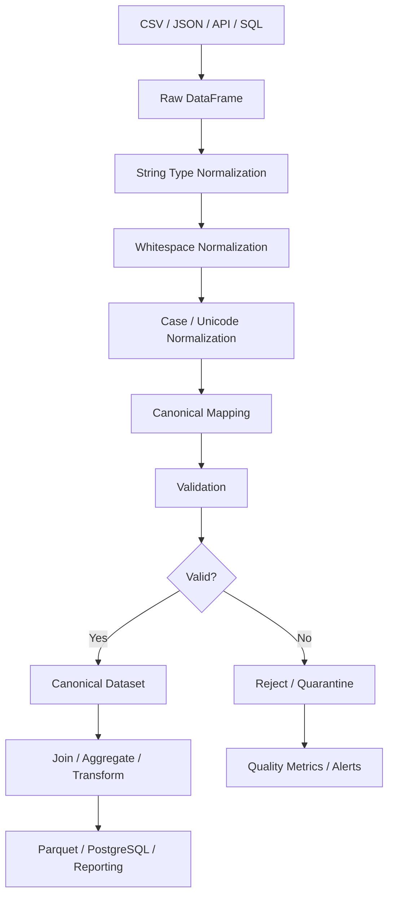

# 11- String Cleaning

## Overview

String cleaning in Pandas is the process of normalizing, validating, and transforming text fields so that values become consistent enough for filtering, joins, grouping, deduplication, storage, and downstream business logic.

Production datasets commonly contain variations such as:

```text
" John Doe "
"JOHN DOE"
"john doe"
"john.doe@example.com "
"+91 98765-43210"
" Mumbai "
"N/A"
"unknown"
""
None
```

These values may represent the same logical entity while differing syntactically.

A reliable string-cleaning workflow is:

```text
Raw text
   ↓
Profile values
   ↓
Normalize missing representations
   ↓
Trim / normalize whitespace
   ↓
Normalize case where appropriate
   ↓
Normalize known formatting
   ↓
Canonicalize known values
   ↓
Validate structure and domain rules
   ↓
Deduplicate / join / aggregate
   ↓
Persist canonical data
```

String cleaning should not be confused with indiscriminate string modification. The objective is to make values **semantically consistent without destroying information**.

## Why String Cleaning Matters

Inconsistent strings can cause:

```text
Failed joins
Duplicate entities
Incorrect grouping
Incorrect filtering
Broken uniqueness constraints
Poor reporting
Invalid API payloads
Database constraint failures
```

For example:

```python
customers.groupby("city").size()
```

may treat:

```text
Mumbai
mumbai
 Mumbai
MUMBAI
```

as four different groups.

After controlled normalization:

```text
Mumbai
```

they can represent one canonical value.

String cleaning is therefore a data-quality and schema-normalization concern.

## String Cleaning vs String Validation

These are separate responsibilities.

### Cleaning

Transforms:

```text
"  mumbai "
```

into:

```text
"mumbai"
```

### Validation

Determines whether:

```text
"mumbai"
```

is an accepted value according to the application or data contract.

For an email address:

```text
Cleaning:
    " User@Example.COM "
        ↓
    "user@example.com"

Validation:
    Does the value satisfy the system's accepted email format?
```

Do not assume that a cleaned string is automatically valid.

## Common String Problems

| Problem | Example | Typical approach |
|---|---|---|
| Leading/trailing spaces | `" Mumbai "` | `.str.strip()` |
| Repeated internal spaces | `"New   Delhi"` | Explicit whitespace normalization |
| Case inconsistency | `"MUMBAI"` | `.str.lower()` / `.str.upper()` where semantics allow |
| Empty string | `""` | Convert to missing when appropriate |
| Placeholder values | `"N/A"` | Canonicalize to missing |
| Punctuation variation | `"98765-43210"` | Normalize known format |
| Unicode variation | visually identical text with different code points | Unicode normalization |
| Inconsistent categories | `"Admin"`, `"admin"` | Canonical mapping |
| Mixed data types | `str`, `int`, `None` | Normalize dtype |
| Hidden characters | tabs/newlines | Remove or normalize explicitly |
| Duplicate delimiters | `"a,,b"` | Validate rather than blindly rewrite |
| Free-text corruption | `"John123"` | Domain-specific validation |

## Inspecting String Columns

Before transforming a field, inspect its dtype:

```python
customers["email"].dtype
```

Profile values:

```python
customers["email"].value_counts(
    dropna=False
).head(20)
```

Inspect examples:

```python
customers["email"].head(20)
```

For mixed Python objects:

```python
customers["email"].map(type).value_counts()
```

This can reveal:

```text
str
NoneType
int
float
```

A string-cleaning pipeline should establish a consistent representation before using string methods.

## Pandas String Accessor

Pandas provides `.str` for vectorized string operations:

```python
customers["email"].str.strip()
```

Common operations include:

```text
.str.strip()
.str.lower()
.str.upper()
.str.casefold()
.str.replace()
.str.contains()
.str.startswith()
.str.endswith()
.str.split()
.str.extract()
.str.len()
```

The accessor operates element-wise across a Series without requiring an explicit Python loop.

## String Dtype

For text columns, prefer Pandas' string dtype when appropriate:

```python
customers["email"] = (
    customers["email"]
    .astype("string")
)
```

Compared with generic `object` storage, `string` makes text intent explicit and integrates naturally with Pandas' nullable semantics.

Example:

```python
emails = pd.Series(
    [
        "alice@example.com",
        None,
    ],
    dtype="string",
)

print(emails.dtype)
```

The expected dtype is:

```text
string
```

## Why Convert to String Explicitly?

This can fail:

```python
customers["email"].str.strip()
```

when a column unexpectedly contains non-string objects.

A safer boundary normalization is:

```python
customers["email"] = (
    customers["email"]
    .astype("string")
)
```

This provides predictable string operations while retaining missing values as nullable values.

Do not convert identifiers or numeric values to strings merely because `.str` exists. The field's semantic type should determine the representation.

## Leading and Trailing Whitespace

Use:

```python
customers["name"] = (
    customers["name"]
    .astype("string")
    .str.strip()
)
```

This handles:

```text
" Alice "
"Bob  "
"  Charlie"
```

and produces:

```text
"Alice"
"Bob"
"Charlie"
```

Whitespace normalization should usually happen before:

```text
Comparisons
Joins
Deduplication
Validation
Canonicalization
```

## Left and Right Trimming

Use `.str.lstrip()` when only leading whitespace is unwanted:

```python
customers["name"] = (
    customers["name"]
    .astype("string")
    .str.lstrip()
)
```

Use `.str.rstrip()` for trailing whitespace:

```python
customers["name"] = (
    customers["name"]
    .astype("string")
    .str.rstrip()
)
```

In most ingestion pipelines, `.str.strip()` is the appropriate default.

## Normalizing Internal Whitespace

`.str.strip()` does not change repeated spaces inside a value:

```text
"New   Delhi"
```

remains:

```text
"New   Delhi"
```

A controlled normalization can use:

```python
customers["city"] = (
    customers["city"]
    .astype("string")
    .str.strip()
    .str.replace(
        r"\s+",
        " ",
        regex=True,
    )
)
```

This converts repeated whitespace to one space.

Be cautious with free-form text because intentional formatting may need to be preserved.

## Newlines and Tabs

Data from files and APIs may contain:

```text
"John\tDoe"
"Address\nLine 2"
```

For fields where whitespace has no semantic value:

```python
customers["name"] = (
    customers["name"]
    .astype("string")
    .str.replace(
        r"\s+",
        " ",
        regex=True,
    )
    .str.strip()
)
```

For address or document fields, do not blindly flatten all whitespace because line breaks may be meaningful.

## Lowercase Normalization

For case-insensitive identifiers such as email addresses:

```python
customers["email"] = (
    customers["email"]
    .astype("string")
    .str.strip()
    .str.lower()
)
```

This provides a canonical representation for systems that explicitly define the field as case-normalized.

Do not lowercase every text field automatically.

For example:

```text
Product display name
Legal company name
User-provided free text
```

may need original casing.

## `lower()` vs `casefold()`

`.str.lower()` performs lowercase conversion.

`.str.casefold()` is more aggressive and is designed for caseless text matching.

```python
customers["email"] = (
    customers["email"]
    .astype("string")
    .str.strip()
    .str.casefold()
)
```

For fields where international Unicode case handling matters, `casefold()` can be preferable for comparisons.

The correct choice depends on the field contract.

## Uppercase Normalization

For controlled codes:

```python
orders["currency"] = (
    orders["currency"]
    .astype("string")
    .str.strip()
    .str.upper()
)
```

This can normalize:

```text
usd
Usd
USD
```

into:

```text
USD
```

This is appropriate for standardized codes, not arbitrary display text.

## Converting Placeholder Values to Missing

Operational datasets frequently contain:

```text
N/A
NA
Unknown
None
null
-
Not Available
```

These can be canonicalized:

```python
missing_tokens = {
    "n/a",
    "na",
    "unknown",
    "none",
    "null",
    "-",
    "",
}

status = (
    customers["status"]
    .astype("string")
    .str.strip()
)

customers["status"] = (
    status.mask(
        status.str.lower().isin(
            missing_tokens
        )
    )
)
```

This produces Pandas missing values for known placeholders.

Do not assume that every string such as `"unknown"` means missing in every domain.

## `replace()` for Exact Canonicalization

When the input set is known:

```python
city_mapping = {
    "bombay": "Mumbai",
    "mumbai": "Mumbai",
    "new delhi": "Delhi",
}

customers["city"] = (
    customers["city"]
    .astype("string")
    .str.strip()
    .str.lower()
    .replace(city_mapping)
)
```

Explicit mappings are preferable to ambiguous fuzzy transformations.

They provide:

```text
Predictability
Auditability
Testability
Reviewability
```

## Mapping Unknown Values Safely

Avoid:

```python
customers["city"] = (
    customers["city"]
    .map(city_mapping)
)
```

unless dropping or nulling unmapped values is intentional.

`Series.map()` can introduce missing values for keys not in the mapping.

A safer pattern is:

```python
customers["city"] = (
    customers["city"]
    .astype("string")
    .str.strip()
    .str.lower()
    .replace(city_mapping)
)
```

Known values are canonicalized while unknown values remain available for further review.

## Normalization Before Deduplication

Consider:

```text
"John Doe"
" john doe "
"JOHN DOE"
```

Without normalization:

```python
customers["name"].duplicated()
```

may fail to identify these as equivalent.

A controlled normalization:

```python
customers["name_normalized"] = (
    customers["name"]
    .astype("string")
    .str.strip()
    .str.casefold()
    .str.replace(
        r"\s+",
        " ",
        regex=True,
    )
)
```

can provide a comparison key.

Preserve the original field if display or audit semantics require it.

## Canonical vs Display Values

A mature data model often separates:

```text
Original value
Canonical value
```

For example:

```text
name
name_normalized
```

This supports:

```text
User-facing display
Search
Deduplication
Matching
Auditing
```

Example:

```python
customers["email_normalized"] = (
    customers["email"]
    .astype("string")
    .str.strip()
    .str.casefold()
)
```

Do not overwrite valuable source data unless the source representation itself has no required business value.

## Email Normalization

A basic normalization:

```python
customers["email"] = (
    customers["email"]
    .astype("string")
    .str.strip()
    .str.casefold()
)
```

can remove common formatting inconsistencies.

Validation remains separate:

```python
valid_email = (
    customers["email"].notna()
    & customers["email"].str.contains(
        r"^[^@\s]+@[^@\s]+\.[^@\s]+$",
        regex=True,
        na=False,
    )
)
```

This is a basic structural check, not full email-address validation.

Do not apply provider-specific email canonicalization rules unless they are explicitly supported by the business requirements.

## Phone Number Cleaning

Phone fields commonly contain:

```text
+91 98765 43210
+91-98765-43210
09876543210
9876543210
```

If the application's canonical format is defined, normalize toward that format.

For example, removing formatting characters:

```python
phones = (
    customers["phone"]
    .astype("string")
    .str.strip()
    .str.replace(
        r"[\s()-]+",
        "",
        regex=True,
    )
)
```

This does not establish that the result is a valid phone number.

Canonical phone representation should ideally be based on an explicit country/region policy and standardized format such as E.164.

## Phone Numbers Should Usually Remain Strings

Do not convert phone numbers to integers:

```python
pd.to_numeric(customers["phone"])
```

Phone numbers are identifiers, not quantities.

Converting them to integers can:

```text
Remove leading zeros
Lose formatting semantics
Create numeric overflow concerns
Prevent international representations
```

Prefer:

```python
customers["phone"] = (
    customers["phone"]
    .astype("string")
)
```

## Postal Codes Should Usually Remain Strings

Likewise:

```text
00123
```

should not become:

```text
123
```

when leading zeros are meaningful.

Use:

```python
customers["postal_code"] = (
    customers["postal_code"]
    .astype("string")
    .str.strip()
)
```

Validate according to the country-specific postal-code rules.

## Identifier Normalization

Identifiers such as:

```text
customer_id
account_id
order_id
sku
employee_id
```

often benefit from:

```python
customers["customer_id"] = (
    customers["customer_id"]
    .astype("string")
    .str.strip()
)
```

Additional case normalization may be appropriate when the identifier contract is case-insensitive.

Do not assume numeric-looking identifiers should use numeric dtypes.

## SKU Cleaning

A product SKU may arrive as:

```text
" sku-001 "
"SKU-001"
"sku001"
```

Only perform transformations defined by the SKU specification.

For example:

```python
products["sku"] = (
    products["sku"]
    .astype("string")
    .str.strip()
    .str.upper()
)
```

Do not remove punctuation merely to make visually different SKUs match unless the source contract defines punctuation as insignificant.

## Category Cleaning

Controlled categorical values benefit from normalization:

```python
orders["status"] = (
    orders["status"]
    .astype("string")
    .str.strip()
    .str.casefold()
)
```

Then canonicalize:

```python
status_mapping = {
    "paid": "paid",
    "payment received": "paid",
    "complete": "completed",
    "completed": "completed",
}

orders["status"] = (
    orders["status"]
    .replace(status_mapping)
)
```

Unknown values should remain identifiable.

## Unknown Category Detection

After canonicalization:

```python
allowed_statuses = {
    "pending",
    "paid",
    "completed",
    "cancelled",
}

invalid_status = (
    orders["status"].notna()
    & ~orders["status"].isin(
        allowed_statuses
    )
)
```

This is a validation step.

Do not silently map unknown categories to a generic value without recording that transformation.

## Regex-Based Cleaning

Regular expressions are appropriate when the format is structured and well-defined.

For example, extracting an order number:

```python
orders["order_number"] = (
    orders["reference"]
    .astype("string")
    .str.extract(
        r"ORDER-(\d+)",
        expand=False,
    )
)
```

This produces a Series containing the captured order number.

Use regex to express known structure, not as a generic "remove everything unexpected" mechanism.

## Regex Replacement

A controlled normalization:

```python
customers["phone"] = (
    customers["phone"]
    .astype("string")
    .str.replace(
        r"[\s()-]+",
        "",
        regex=True,
    )
)
```

Regex replacement should be accompanied by validation when malformed source values could otherwise become plausible-looking output.

## Avoid Over-Cleaning with Regex

This pattern is risky:

```python
customers["name"] = (
    customers["name"]
    .astype("string")
    .str.replace(
        r"[^A-Za-z]",
        "",
        regex=True,
    )
)
```

It destroys valid information such as:

```text
O'Connor
Jean-Luc
José
李明
```

Production normalization must account for Unicode and legitimate punctuation.

## Unicode Normalization

Visually identical Unicode strings can have different underlying representations.

Python's `unicodedata` module can normalize them:

```python
import unicodedata


def normalize_unicode(value: str) -> str:
    return unicodedata.normalize(
        "NFKC",
        value,
    )
```

Applied to a Series:

```python
customers["name"] = (
    customers["name"]
    .astype("string")
    .map(
        lambda value: (
            unicodedata.normalize(
                "NFKC",
                value,
            )
            if value is not None
            else None
        )
    )
)
```

For large datasets, benchmark custom Python-level functions because they can be materially slower than native vectorized Pandas operations.

Use Unicode normalization where interoperability and matching justify it.

## Case, Unicode, and Equality

String equality may fail even when values appear visually identical.

For matching:

```text
strip
→ Unicode normalization where required
→ case normalization where required
→ domain-specific canonicalization
```

Do not normalize more aggressively than the business semantics allow.

## Handling Null Values

String operations generally propagate missing values:

```python
values = pd.Series(
    ["Alice", None],
    dtype="string",
)

result = values.str.strip()
```

The missing value remains missing.

Use:

```python
.str.contains(
    pattern,
    na=False,
)
```

when the desired filtering semantics treat missing values as non-matches.

Example:

```python
customer_mask = (
    customers["email"]
    .str.contains(
        "@example.com",
        na=False,
    )
)
```

Be explicit about null behavior when filtering.

## Empty DataFrames

String-cleaning functions should work predictably with empty input.

Example:

```python
def clean_email(
    values: pd.Series,
) -> pd.Series:
    return (
        values
        .astype("string")
        .str.strip()
        .str.casefold()
    )
```

Applying this to an empty Series should not require special-case branching.

Pipeline stages should preserve expected schema even when there are zero rows.

## String Cleaning Before Joins

A common production failure is joining raw keys from different sources:

```python
merged = orders.merge(
    customers,
    on="customer_id",
)
```

when one source contains:

```text
" C001 "
```

and the other:

```text
"C001"
```

Normalize keys first:

```python
def normalize_key(
    values: pd.Series,
) -> pd.Series:
    return (
        values
        .astype("string")
        .str.strip()
        .str.casefold()
    )


orders["customer_id"] = normalize_key(
    orders["customer_id"]
)

customers["customer_id"] = normalize_key(
    customers["customer_id"]
)

merged = orders.merge(
    customers,
    on="customer_id",
    how="left",
)
```

This should be part of the ingestion or schema-normalization layer rather than duplicated throughout application code.

## String Cleaning Before Grouping

Normalize before grouping:

```python
orders["region"] = (
    orders["region"]
    .astype("string")
    .str.strip()
    .str.casefold()
)

report = (
    orders
    .groupby("region", as_index=False)
    .agg(
        order_count=("order_id", "count"),
        revenue=("amount", "sum"),
    )
)
```

Otherwise, equivalent categories can split into separate groups.

## String Cleaning Before Deduplication

Normalize the comparison key:

```python
customers["email_key"] = (
    customers["email"]
    .astype("string")
    .str.strip()
    .str.casefold()
)
```

Then:

```python
deduplicated = (
    customers
    .sort_values(
        "updated_at"
    )
    .drop_duplicates(
        "email_key",
        keep="last",
    )
)
```

Sorting first makes the retention policy explicit.

## Copying and Mutation

Most Pandas string operations return a new Series:

```python
cleaned = (
    customers["name"]
    .astype("string")
    .str.strip()
)
```

The original column is unchanged until reassigned:

```python
customers["name"] = cleaned
```

For complex pipelines:

```python
result = customers.copy()

result["name"] = (
    result["name"]
    .astype("string")
    .str.strip()
)
```

This avoids accidental modifications to a DataFrame still needed elsewhere.

## Method Chaining

String normalization often benefits from a readable chain:

```python
customers["email"] = (
    customers["email"]
    .astype("string")
    .str.strip()
    .str.casefold()
    .replace(
        "",
        pd.NA,
    )
)
```

Use chaining when each step expresses a clear transformation.

Avoid deeply nested chains that obscure business rules.

## Separate Cleaning Stages

For production pipelines, explicit intermediate variables can improve observability:

```python
email = (
    customers["email"]
    .astype("string")
    .str.strip()
)

email = email.mask(
    email.eq(""),
)

email = email.str.casefold()

customers["email"] = email
```

This makes it easier to:

```text
Measure changes
Debug failures
Test each transformation
Explain business behavior
```

## Data Quality Metrics

String normalization should produce measurable quality signals.

Useful metrics include:

```text
Input row count
Missing values
Empty strings
Placeholder tokens
Normalization changes
Invalid values
Unknown categories
Duplicate keys
Join mismatches
```

Example:

```python
raw = customers["email"]

cleaned = (
    raw
    .astype("string")
    .str.strip()
    .str.casefold()
)

changed = (
    raw.notna()
    & cleaned.notna()
    & raw.ne(cleaned)
)

metrics = {
    "rows": len(customers),
    "missing": int(
        cleaned.isna().sum()
    ),
    "changed": int(
        changed.sum()
    ),
}
```

These metrics can reveal upstream source changes.

## Auditing Transformations

For high-value datasets, consider keeping:

```text
raw field
normalized field
validation result
rejection reason
```

Example:

```python
customers["email_raw"] = (
    customers["email"]
)

customers["email"] = (
    customers["email"]
    .astype("string")
    .str.strip()
    .str.casefold()
)
```

For very large datasets, retaining both columns can increase memory significantly, so use it selectively or store rejected/source records separately.

## String Cleaning in ETL

A typical ETL pipeline may use:



String normalization usually belongs close to ingestion because downstream stages should operate on a predictable schema.

## API Data Processing

API payloads commonly contain inconsistent text:

```json
{
  "customer_id": " CUST-001 ",
  "email": " User@Example.COM ",
  "status": " completed "
}
```

Normalize at ingestion:

```python
customers["customer_id"] = (
    customers["customer_id"]
    .astype("string")
    .str.strip()
)

customers["email"] = (
    customers["email"]
    .astype("string")
    .str.strip()
    .str.casefold()
)

customers["status"] = (
    customers["status"]
    .astype("string")
    .str.strip()
    .str.casefold()
)
```

Then validate and persist canonical data.

## FastAPI and Pydantic Boundaries

Pandas should not be the only validation layer.

A FastAPI service can enforce schema at the request boundary:

```text
HTTP request
    ↓
Pydantic validation
    ↓
Application logic
    ↓
Pandas transformation
    ↓
Database / storage
```

Pandas remains useful for batch normalization, reporting, and ETL.

For critical identifiers and user-provided strings, validate as early as practical.

## Django and Database Models

Django model constraints should remain authoritative for persisted business data.

Pandas can normalize:

```text
CSV import
Batch update
Reporting dataset
Migration data
```

but database constraints should still enforce:

```text
Uniqueness
Nullability
Foreign keys
Length
Allowed values where appropriate
```

Do not rely on Pandas cleaning alone to protect database integrity.

## PostgreSQL and Case-Insensitive Data

When a field is used as a uniqueness or lookup key, define case-sensitivity deliberately.

Example:

```text
Email matching
SKU matching
Tenant identifiers
External IDs
```

The application, Pandas pipeline, and database should agree on canonicalization semantics.

Otherwise:

```text
Pandas sees values as equal
PostgreSQL sees values as different
```

or the reverse.

## Kafka and Event Data

Kafka consumers may process text fields from multiple producer versions.

A robust consumer pipeline should consider:

```text
Schema version
Field presence
String normalization
Canonical values
Unknown enum values
Producer compatibility
```

For example:

```python
events["event_type"] = (
    events["event_type"]
    .astype("string")
    .str.strip()
    .str.casefold()
)
```

But producer contracts should ideally prevent uncontrolled variations rather than requiring consumers to compensate indefinitely.

## Batch and Incremental Processing

String cleaning should be deterministic.

Given the same input:

```text
same input
+
same configuration
=
same normalized output
```

This supports:

```text
Retries
Reprocessing
Backfills
Idempotency
Debugging
```

Avoid transformations that depend on mutable external state unless versioning is explicit.

## Large Datasets

For large datasets:

```text
Project only required columns
Normalize only required fields
Use vectorized `.str` operations
Avoid repeated copies
Process in chunks where necessary
Persist efficient formats
```

Example:

```python
for chunk in pd.read_csv(
    "customers.csv",
    usecols=[
        "customer_id",
        "email",
        "city",
    ],
    chunksize=100_000,
):
    chunk["customer_id"] = (
        chunk["customer_id"]
        .astype("string")
        .str.strip()
    )

    chunk["email"] = (
        chunk["email"]
        .astype("string")
        .str.strip()
        .str.casefold()
    )

    process_chunk(chunk)
```

Chunking controls memory usage but does not automatically solve global deduplication or cross-file matching.

## Performance Considerations

Prefer:

```python
customers["city"].str.strip()
```

over:

```python
customers["city"].apply(
    lambda value: value.strip()
    if value
    else value
)
```

The vectorized string API generally provides better Pandas integration and avoids explicit Python-level loops.

However, some operations, especially custom Python functions and Unicode transformations, may still execute through Python-level logic.

Benchmark the actual pipeline when performance is important.

## Avoid Repeated String Conversion

Do not repeatedly do:

```python
customers["email"] = (
    customers["email"]
    .astype("string")
)

customers["email"] = (
    customers["email"]
    .astype("string")
)

customers["email"] = (
    customers["email"]
    .astype("string")
)
```

Normalize the dtype once at the transformation boundary.

Repeated conversions increase CPU work and can make pipelines harder to reason about.

## Avoid Unnecessary Copies

This can increase memory pressure:

```python
df1 = customers.copy()
df2 = df1.copy()
df3 = df2.copy()
```

Prefer a pipeline that minimizes full DataFrame copies while maintaining clear ownership.

For large datasets, copying a wide DataFrame solely to clean one string column can be expensive.

## Categorical String Columns

If a column contains a small, stable set of repeated categories:

```text
status
country
region
event_type
```

a categorical dtype can reduce memory usage:

```python
orders["status"] = (
    orders["status"]
    .astype("string")
    .str.strip()
    .str.casefold()
    .astype("category")
)
```

Categoricals are useful when cardinality is relatively low compared with row count.

Do not use categorical dtype blindly for high-cardinality fields such as:

```text
email
request_id
UUID
free-form description
```

## String Normalization and Memory

A rough production hierarchy is:

```text
raw object/string column
    ↓
normalized string column
    ↓
categorical when low-cardinality
```

Every additional column can increase memory.

For large datasets:

```python
customers.memory_usage(
    deep=True
)
```

helps identify expensive text columns.

## Security Considerations

String cleaning must not become a security boundary by itself.

### SQL Injection

Never construct SQL by interpolating cleaned strings.

Unsafe:

```python
query = (
    "SELECT * FROM customers "
    f"WHERE email = '{email}'"
)
```

Use parameterized queries through the database driver or ORM.

### Log Injection

Raw strings can contain:

```text
newlines
tabs
control characters
```

when inserted into logs.

Structured logging should encode values safely rather than concatenating untrusted text into log lines.

### CSV Formula Injection

If cleaned strings are later exported to CSV and opened in spreadsheet software, values beginning with characters interpreted as formulas can create security concerns.

For reporting exports, apply an explicit output-encoding policy appropriate to the consumer.

### Sensitive Data

Fields such as:

```text
Email
Phone
Address
National identifiers
Financial account identifiers
```

may be sensitive.

Do not log complete raw values unnecessarily.

Apply:

```text
Access controls
Redaction
Encryption
Data retention
Audit logging
```

according to the system's requirements.

## Reliability and Failure Policies

A production pipeline should define what happens when string validation fails.

Possible policies:

| Failure | Example | Typical response |
|---|---|---|
| Formatting issue | Extra whitespace | Normalize |
| Known alias | `"bombay"` | Canonicalize |
| Unknown category | `"completed-v2"` | Reject or quarantine |
| Missing required ID | `None` | Reject |
| Invalid email | `"abc"` | Reject / quarantine |
| Unexpected Unicode | Non-ASCII name | Preserve unless contract forbids it |
| Malformed key | Broken identifier format | Reject |
| Source-wide anomaly | 40% of emails suddenly invalid | Stop publication and alert |

The correct policy depends on business criticality.

## Error Thresholds

For batch processing, it is useful to define thresholds.

Example:

```text
Conversion failure rate <= 0.1%
    → continue

0.1% < failure rate <= 1%
    → continue with warning

failure rate > 1%
    → quarantine / fail batch
```

These values are examples, not universal standards.

The important engineering principle is to make quality gates explicit and observable.

## Idempotency

A cleaning function should ideally be idempotent:

```text
clean(clean(x)) == clean(x)
```

For example:

```python
def normalize_city(
    values: pd.Series,
) -> pd.Series:
    return (
        values
        .astype("string")
        .str.strip()
        .str.casefold()
    )
```

Applying it twice should produce the same result as applying it once.

Idempotent normalization simplifies:

```text
Retries
Backfills
Incremental processing
Recovery
Testing
```

## Common Mistakes

| Mistake | Why it happens | Better approach |
|---|---|---|
| Using `.str.lower()` on every field | Case normalization seems universally useful | Normalize only case-insensitive fields |
| Treating `strip()` as complete cleaning | Whitespace is confused with broader normalization | Define all required transformations |
| Converting identifiers to numeric | IDs look like numbers | Keep identifiers as strings |
| Treating empty string as zero | Missing and zero are confused | Preserve null semantics |
| Mapping unknown values to `"unknown"` | Validation failures are hidden | Keep unknown values visible and measure them |
| Removing all punctuation | Regex cleanup seems convenient | Remove only explicitly irrelevant formatting |
| Ignoring Unicode | ASCII-only assumptions | Support legitimate Unicode data |
| Using `map()` with incomplete mappings | Unmapped values become missing | Use explicit handling for unknown keys |
| Validating after deduplication only | Bad records disappear silently | Validate before destructive transformations |
| Overwriting raw values | Canonical fields are easier to use | Preserve source data where auditability matters |
| Using `.apply()` for simple cleanup | Python loops are familiar | Prefer vectorized `.str` operations |
| Repeating normalization at every stage | No canonicalization boundary exists | Normalize once near ingestion |
| Assuming cleaned means valid | Transformation and validation are mixed | Keep them as separate stages |
| Ignoring source contracts | Cleaning is treated as generic text processing | Define field-specific normalization rules |
| Logging sensitive raw strings | Debugging convenience | Redact or structure sensitive diagnostics |

## Production Pitfalls

### Cleaning Too Aggressively

A transformation can make invalid data look valid.

For example:

```text
"12abc34"
```

should generally not become:

```text
"1234"
```

unless the source specification explicitly defines which characters are formatting noise.

### Destroying Original Data

Replacing:

```python
customers["name"] = cleaned_name
```

may be appropriate for a disposable staging DataFrame.

It may be inappropriate when:

```text
Auditability
Legal retention
Source reconciliation
Debugging
```

matter.

Keep raw and canonical representations when required.

### Assuming Case Insensitivity

Lowercasing a value changes semantics for some systems.

A backend service must define whether:

```text
ABC123
abc123
```

represent the same identifier.

### Treating Whitespace Equally Everywhere

Whitespace in:

```text
name
address
free-text comment
SKU
identifier
```

does not necessarily have the same meaning.

Use field-specific policies.

### Ignoring Unknown Values

A source-system change may introduce:

```text
"completed_v2"
```

into a previously stable category.

Blindly replacing it with:

```text
"unknown"
```

can hide a contract change.

Prefer quality metrics and alerts.

## Testing String Cleaning

Tests should verify transformation behavior, not merely that the function executes.

Important test cases include:

```text
Leading/trailing whitespace
Repeated internal whitespace
Mixed casing
Empty strings
Null values
Known placeholders
Unicode text
Known aliases
Unknown categories
Invalid identifiers
Valid identifiers
Duplicate normalization keys
Idempotency
```

## Testing Normalization

```python
import pandas as pd


def normalize_email(
    values: pd.Series,
) -> pd.Series:
    return (
        values
        .astype("string")
        .str.strip()
        .str.casefold()
        .replace(
            "",
            pd.NA,
        )
    )


def test_normalize_email() -> None:
    values = pd.Series(
        [
            " Alice@Example.COM ",
            "",
            None,
        ],
        dtype="string",
    )

    result = normalize_email(values)

    expected = pd.Series(
        [
            "alice@example.com",
            pd.NA,
            pd.NA,
        ],
        dtype="string",
    )

    pd.testing.assert_series_equal(
        result,
        expected,
    )
```

## Testing Canonicalization

```python
def test_city_aliases_are_canonicalized() -> None:
    values = pd.Series(
        [
            " Bombay ",
            "Mumbai",
            "Unknown City",
        ],
        dtype="string",
    )

    mapping = {
        "bombay": "Mumbai",
        "mumbai": "Mumbai",
    }

    result = (
        values
        .str.strip()
        .str.casefold()
        .replace(mapping)
    )

    expected = pd.Series(
        [
            "Mumbai",
            "Mumbai",
            "Unknown City",
        ],
        dtype="string",
    )

    pd.testing.assert_series_equal(
        result,
        expected,
    )
```

This verifies that known aliases change while unknown values remain visible.

## Testing Null Semantics

```python
def test_missing_values_remain_missing() -> None:
    values = pd.Series(
        [
            " Alice ",
            None,
        ],
        dtype="string",
    )

    result = (
        values
        .str.strip()
        .str.casefold()
    )

    assert result.iloc[0] == "alice"
    assert pd.isna(result.iloc[1])
```

Missing-value behavior is part of the transformation contract.

## Testing Idempotency

```python
def test_normalization_is_idempotent() -> None:
    values = pd.Series(
        [
            " Alice ",
            "BOB",
            None,
        ],
        dtype="string",
    )

    first = normalize_email(values)
    second = normalize_email(first)

    pd.testing.assert_series_equal(
        first,
        second,
    )
```

Idempotency is particularly valuable for retryable ETL jobs.

## Testing Production Schemas

A stronger test can verify:

```text
Column names
Dtypes
Expected row counts
Nullability
Allowed categories
Normalization behavior
```

Example:

```python
def test_customer_cleaning_schema(
    customers: pd.DataFrame,
) -> None:
    cleaned = clean_customers(
        customers
    )

    assert list(cleaned.columns) == [
        "customer_id",
        "email",
        "status",
    ]

    assert str(
        cleaned["email"].dtype
    ) == "string"
```

Tests should reflect the actual contract of the pipeline.

## Recommended Cleaning Pattern

A maintainable production function should separate:

```text
Type normalization
Formatting normalization
Canonicalization
Validation
Metrics / rejection handling
```

Example:

```python
import pandas as pd


def clean_customer_data(
    customers: pd.DataFrame,
) -> tuple[
    pd.DataFrame,
    pd.DataFrame,
]:
    result = customers.copy()

    result["customer_id"] = (
        result["customer_id"]
        .astype("string")
        .str.strip()
    )

    result["email"] = (
        result["email"]
        .astype("string")
        .str.strip()
        .str.casefold()
        .replace(
            "",
            pd.NA,
        )
    )

    result["status"] = (
        result["status"]
        .astype("string")
        .str.strip()
        .str.casefold()
    )

    allowed_statuses = {
        "pending",
        "active",
        "inactive",
    }

    valid = (
        result["customer_id"].notna()
        & result["customer_id"].ne("")
        & result["email"].notna()
        & result["status"].isin(
            allowed_statuses
        )
    )

    clean = result.loc[
        valid
    ].copy()

    rejected = result.loc[
        ~valid
    ].copy()

    return clean, rejected
```

This structure makes the pipeline behavior explicit and testable.

## When to Clean in Pandas vs the Database

Use Pandas when:

```text
Ingesting CSV / JSON / Excel
Cleaning API responses
Building batch datasets
Preparing reports
Running ETL transformations
```

Use SQL when:

```text
Data already resides in PostgreSQL
Normalization can be expressed efficiently in SQL
The database should enforce canonicalization or uniqueness
```

Use both when appropriate:

```text
Pandas
    → staging transformation

PostgreSQL
    → authoritative constraints and persistence
```

Avoid implementing the same canonicalization logic independently in many services unless the contract is centralized or shared.

## When Pandas Is Not the Right Tool

Pandas is appropriate for many batch and analytical workloads, but not every string-processing problem.

Consider alternatives when:

```text
Dataset exceeds practical memory limits
Processing is highly distributed
Transformation is simple SQL-native logic
Workload is low-latency request handling
```

Potential alternatives include:

```text
PostgreSQL
Polars
PyArrow
Spark / PySpark
AWS Glue
Warehouse SQL
```

The right architecture depends on data volume, latency, cost, and operational constraints.

## String Cleaning Architecture

A production backend/data platform can structure string handling as:

```text
                    ┌──────────────────┐
                    │ Source Systems   │
                    │ CSV / API / SQL  │
                    └────────┬─────────┘
                             │
                             ▼
                  ┌──────────────────────┐
                  │ Ingestion Boundary   │
                  │ Schema + Raw Data    │
                  └──────────┬───────────┘
                             │
                             ▼
                  ┌──────────────────────┐
                  │ String Normalization │
                  │ - strip              │
                  │ - case               │
                  │ - Unicode            │
                  │ - canonical mapping  │
                  └──────────┬───────────┘
                             │
                             ▼
                  ┌──────────────────────┐
                  │ Validation           │
                  │ - format             │
                  │ - allowed values     │
                  │ - required fields    │
                  └──────────┬───────────┘
                             │
                   ┌─────────┴─────────┐
                   │                   │
                   ▼                   ▼
          ┌─────────────────┐   ┌─────────────────┐
          │ Canonical Data  │   │ Rejected Data   │
          └────────┬────────┘   └────────┬────────┘
                   │                     │
                   ▼                     ▼
          ┌─────────────────┐   ┌─────────────────┐
          │ PostgreSQL /    │   │ Metrics /       │
          │ Parquet / BI    │   │ Quarantine      │
          └─────────────────┘   └─────────────────┘
```

The key architectural principle is that downstream stages should consume canonicalized data wherever possible.

## Interview Questions

### Why use `.str` instead of a Python loop?

The `.str` accessor provides Pandas-oriented vectorized string operations and typically avoids explicit Python loops for standard transformations.

### Does `.str.strip()` remove all whitespace everywhere?

No.

It removes leading and trailing whitespace. Internal whitespace requires a separate transformation.

### Why should phone numbers remain strings?

They are identifiers rather than numeric quantities, and converting them to numbers can remove leading zeros and create representation problems.

### Why should unknown categories not automatically become `"unknown"`?

Because that can hide upstream schema changes and silently reduce data quality.

### What is the difference between cleaning and validation?

Cleaning changes representation. Validation determines whether the resulting value satisfies structural or business rules.

### Why normalize before joins?

Equivalent keys represented differently will not match reliably.

### Why normalize before deduplication?

Duplicate detection relies on equality. Equivalent strings must first have a common canonical representation.

### Why preserve raw and canonical values?

Raw values support auditability and debugging; canonical values support consistent downstream processing.

### When should `casefold()` be preferred over `lower()`?

When robust Unicode-aware caseless matching is required. The decision still depends on the field semantics.

### What is an idempotent string transformation?

A transformation where applying it more than once produces the same result:

```text
clean(clean(x)) == clean(x)
```

This is valuable for retries and reprocessing.

### Why can aggressive regex cleaning be dangerous?

Because malformed values can be converted into plausible but incorrect values, and valid Unicode or punctuation can be destroyed.

### How do you handle string normalization for large CSV files?

Use:

```text
Required columns
Chunked reads
Vectorized `.str` operations
Controlled dtypes
Incremental validation
```

while handling global requirements separately.

### Should Pandas be responsible for database integrity?

No. Pandas can prepare and validate data, but authoritative database constraints should remain at the persistence layer.

### How would you monitor string quality in production?

Track:

```text
Missing-rate
Normalization-change rate
Invalid-value rate
Unknown-category rate
Duplicate-key rate
Join mismatch rate
```

and alert when they exceed defined thresholds.

## Key Takeaways

- Treat string cleaning as a **normalization → canonicalization → validation** workflow rather than indiscriminate text modification.
- Use Pandas `.str` operations for vectorized transformations, but preserve field semantics: identifiers, phone numbers, postal codes, display names, and free text should not be normalized identically.
- Normalize strings before joins, grouping, filtering, and deduplication so logically equivalent values use a consistent representation.
- Preserve raw values and measure rejected or changed records when auditability, reconciliation, or upstream-contract monitoring matters.
- Make cleaning deterministic, idempotent, tested, observable, and aligned with application and database constraints before publishing canonical data.