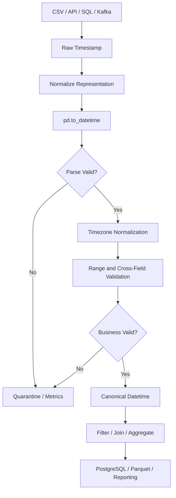

# 12- Datetime Cleaning

## Overview

Datetime cleaning is the process of converting inconsistent date and time representations into a reliable, explicit, and business-correct temporal representation.

Production systems commonly receive values such as:

```text
2026-09-10
2026/09/10
10-09-2026
09/10/2026
2026-09-10 14:30:00
2026-09-10T14:30:00Z
2026-09-10T14:30:00+05:30
2026-09-10 14:30
10 Sep 2026
```

The same field may also contain:

```text
"unknown"
""
None
invalid dates
different timezone offsets
mixed date formats
```

Datetime cleaning is more than parsing strings. A production-quality temporal pipeline must establish:

```text
Representation
Timezone semantics
Missing-value behavior
Validity rules
Precision
Business timezone
Ordering
Range constraints
```

A reliable workflow is:

```text
Raw datetime field
        ↓
Inspect source formats
        ↓
Normalize known representations
        ↓
Parse with pd.to_datetime()
        ↓
Detect parsing failures
        ↓
Establish timezone semantics
        ↓
Validate business ranges
        ↓
Normalize precision if required
        ↓
Sort / filter / aggregate
        ↓
Persist canonical timestamps
```

The most important distinction is:

```text
Parsing
    → Can this value be interpreted as a timestamp?

Validation
    → Is this timestamp valid for the business domain?

Normalization
    → Is this timestamp represented consistently across systems?
```

A timestamp can successfully parse and still be operationally incorrect.

## Why Datetime Cleaning Matters

Datetime fields drive:

```text
Ordering
Filtering
Scheduling
SLA calculations
Retry windows
Event processing
Time-series aggregation
Partitioning
Incremental loads
Reporting
Auditing
Retention policies
```

An incorrect timestamp can produce subtle failures.

For example:

```text
09/10/2026
```

could represent:

```text
September 10, 2026
```

or:

```text
October 9, 2026
```

depending on locale.

Likewise:

```text
2026-09-10 10:00
```

does not fully identify a point in global time unless its timezone semantics are known.

## Datetime Data Types in Pandas

The common Pandas temporal types are:

| Type | Meaning | Typical use |
|---|---|---|
| `datetime64[ns]` | Naive timestamps | Data with no timezone semantics |
| `datetime64[ns, UTC]` | UTC-aware timestamps | Canonical distributed-system time |
| `datetime64[ns, <tz>]` | Timezone-aware timestamps | Business-local temporal workflows |
| `timedelta64[ns]` | Duration | Time differences |
| `Period` | Period representation | Calendar periods |
| Python `datetime` | Scalar Python datetime | Interoperability |
| `date` | Calendar date | Date-only business fields |

For backend and distributed systems, timezone-aware timestamps are often preferable when the source represents an actual instant.

## Date vs Timestamp

These are different concepts.

A date:

```text
2026-09-10
```

represents a calendar day.

A timestamp:

```text
2026-09-10T14:30:00Z
```

represents a specific point in time.

Do not arbitrarily convert:

```text
date
```

into:

```text
timestamp at midnight
```

unless the business model explicitly defines that interpretation.

For example:

```text
birthday
    → date

order_created_at
    → timestamp

billing_period
    → period / start-end boundaries
```

## `pd.to_datetime()`

`pd.to_datetime()` is the primary Pandas function for converting values into datetime representations.

Basic usage:

```python
orders["created_at"] = pd.to_datetime(
    orders["created_at"],
    errors="raise",
)
```

For ingestion pipelines where invalid values should be classified:

```python
orders["created_at"] = pd.to_datetime(
    orders["created_at"],
    errors="coerce",
)
```

Malformed values become missing datetime values.

## Parsing Errors

`pd.to_datetime()` supports explicit error behavior.

| Setting | Behavior | Typical use |
|---|---|---|
| `errors="raise"` | Fail on invalid input | Strict source contracts |
| `errors="coerce"` | Invalid values become `NaT` | Data-quality classification |
| `errors="ignore"` | Preserve original input where conversion fails | Generally avoid for canonical pipelines |

For production data cleaning, prefer explicit failure handling instead of silently preserving mixed datetime types.

## `NaT`

Pandas uses `NaT` to represent missing datetime values.

Example:

```python
values = pd.Series(
    [
        "2026-09-10",
        None,
        "invalid",
    ],
    dtype="string",
)

parsed = pd.to_datetime(
    values,
    errors="coerce",
)
```

Conceptually:

```text
2026-09-10  → valid timestamp
None        → NaT
invalid     → NaT
```

As with numeric cleaning, do not immediately assume every `NaT` means the same thing.

A `NaT` could represent:

```text
Original missing value
Parsing failure
Businessually unavailable value
```

## Detecting Parsing Failures

Preserve the original values:

```python
raw = orders["created_at"]

parsed = pd.to_datetime(
    raw,
    errors="coerce",
)

conversion_failed = (
    raw.notna()
    & parsed.isna()
)
```

Now the pipeline can distinguish:

```text
Original missing
```

from:

```text
Present but invalid
```

Inspect failures:

```python
rejected = orders.loc[
    conversion_failed,
    ["order_id", "created_at"],
]
```

This is essential for operational debugging.

## Explicit Format Parsing

When the source format is known and stable:

```python
orders["created_at"] = pd.to_datetime(
    orders["created_at"],
    format="%Y-%m-%d %H:%M:%S",
    errors="coerce",
)
```

Explicit formats provide:

```text
Clear source contract
Predictable interpretation
Better failure diagnostics
Potentially better parsing performance
```

Use them when the input format is genuinely fixed.

## Mixed Input Formats

Some real-world sources contain multiple valid representations:

```text
2026-09-10
2026-09-10T14:30:00Z
2026/09/10 14:30
```

Avoid assuming one format when the source contract does not guarantee one.

A pipeline should first determine whether the data is:

```text
Uniform
```

or:

```text
Mixed
```

Then choose an explicit parsing strategy.

For mixed formats:

```python
orders["created_at"] = pd.to_datetime(
    orders["created_at"],
    errors="coerce",
)
```

followed by quality checks is generally preferable to guessing based on a single sample.

## ISO 8601

ISO 8601 is a strong interchange format for backend systems.

Examples:

```text
2026-09-10T14:30:00Z
2026-09-10T20:00:00+05:30
```

A REST API, event stream, or microservice should preferably use an explicit ISO-compatible representation.

When ingesting:

```python
events["occurred_at"] = pd.to_datetime(
    events["occurred_at"],
    errors="coerce",
    utc=True,
)
```

This can normalize timezone-aware inputs to UTC.

## Timezone Awareness

A naive timestamp:

```text
2026-09-10 14:30:00
```

contains no timezone information.

An aware timestamp:

```text
2026-09-10 14:30:00+05:30
```

contains an offset.

A UTC timestamp:

```text
2026-09-10 09:00:00+00:00
```

represents the same instant.

For distributed backend systems, timezone-aware timestamps are generally safer for actual events.

## Naive vs Aware Datetimes

Avoid mixing:

```text
timezone-naive
```

and:

```text
timezone-aware
```

timestamps in the same logical field.

Comparisons can fail or produce incorrect business behavior.

A canonical backend strategy is:

```text
Store event instants in UTC
↓
Perform cross-system comparisons in UTC
↓
Convert to business timezone only for presentation or business-local logic
```

This is not universal; scheduling and business-calendar rules may intentionally require local timezone semantics.

## Parsing to UTC

Use:

```python
events["occurred_at"] = pd.to_datetime(
    events["occurred_at"],
    errors="coerce",
    utc=True,
)
```

This is especially useful when input contains:

```text
2026-09-10T10:00:00Z
2026-09-10T15:30:00+05:30
```

Both become timezone-aware UTC values.

The result can then be safely compared across sources.

## Converting Timezones

To convert an already timezone-aware Series:

```python
events["occurred_at_ist"] = (
    events["occurred_at"]
    .dt.tz_convert(
        "Asia/Kolkata"
    )
)
```

This changes the displayed/localized representation while preserving the instant.

Example conceptually:

```text
UTC:        2026-09-10 10:00:00+00:00
Asia/Kolkata:
            2026-09-10 15:30:00+05:30
```

## `tz_localize()` vs `tz_convert()`

These are frequently confused.

### `tz_localize()`

Assigns a timezone to a naive timestamp without changing the represented clock time.

```python
events["occurred_at"] = (
    pd.to_datetime(
        events["occurred_at"],
        errors="coerce",
    )
    .dt.tz_localize(
        "Asia/Kolkata"
    )
)
```

Use this when the source clock values are known to already be expressed in a specific local timezone.

### `tz_convert()`

Converts an already timezone-aware timestamp to another timezone.

```python
events["occurred_at"] = (
    events["occurred_at"]
    .dt.tz_convert("UTC")
)
```

Use this when the source already identifies an actual instant.

### Comparison

| Operation | Input | Effect |
|---|---|---|
| `tz_localize()` | Naive datetime | Assign timezone semantics |
| `tz_convert()` | Aware datetime | Convert instant to another timezone |

Using the wrong operation can shift business times incorrectly.

## Daylight Saving Time

Timezone handling becomes more complex for regions with daylight saving time.

A local time may be:

```text
Ambiguous
Non-existent
```

For example, during a clock transition, a local clock may repeat or skip an hour.

Pandas supports explicit handling when localizing timezone-naive timestamps.

Do not implement timezone rules manually with fixed offsets such as:

```text
UTC-5
UTC-4
```

for regions with daylight-saving transitions.

Use an IANA timezone such as:

```text
America/New_York
Europe/London
Asia/Kolkata
```

where appropriate.

## Fixed Offset vs Named Timezone

These are not always equivalent.

```text
+05:30
```

is a fixed offset.

```text
Asia/Kolkata
```

is a named timezone containing timezone rules.

For historical and future business-local scheduling, named IANA timezones are generally more expressive.

## Date-Only Fields

A date-only field should not necessarily be localized.

Example:

```text
2026-09-10
```

could represent:

```text
Billing date
Birth date
Contract date
Settlement date
```

For date-only semantics:

```python
orders["order_date"] = pd.to_datetime(
    orders["order_date"],
    errors="coerce",
).dt.date
```

However, converting to Python `date` objects can lead to object-dtype storage.

For analytical workloads, keeping a normalized datetime-like representation and treating it as a date semantically can be more efficient.

Choose according to downstream requirements.

## Parsing Dates from Strings

A stable source:

```python
customers["signup_date"] = (
    pd.to_datetime(
        customers["signup_date"],
        format="%Y-%m-%d",
        errors="coerce",
    )
)
```

For values such as:

```text
2026-09-10
```

this creates a datetime64-compatible Series.

## Day-First and Month-First Ambiguity

Values such as:

```text
10/09/2026
```

are ambiguous.

Do not rely on implicit assumptions.

If the source contract explicitly uses day-first parsing:

```python
orders["order_date"] = pd.to_datetime(
    orders["order_date"],
    dayfirst=True,
    errors="coerce",
)
```

The correct interpretation should come from the source specification rather than guessing from data.

## Normalizing Separators

A source may contain:

```text
2026/09/10
2026-09-10
```

When the format is otherwise consistent:

```python
normalized = (
    events["occurred_at"]
    .astype("string")
    .str.strip()
)

events["occurred_at"] = pd.to_datetime(
    normalized,
    errors="coerce",
)
```

Do not rewrite separators blindly when doing so could transform ambiguous dates incorrectly.

## Whitespace in Datetimes

Whitespace is common in CSV and spreadsheet exports:

```text
" 2026-09-10 14:30:00 "
```

Normalize before parsing:

```python
events["occurred_at"] = pd.to_datetime(
    events["occurred_at"]
    .astype("string")
    .str.strip(),
    errors="coerce",
)
```

This makes source normalization explicit.

## Placeholder Date Values

Common placeholders include:

```text
N/A
unknown
none
null
0000-00-00
-
```

Treat them according to the source contract.

Example:

```python
missing_tokens = {
    "n/a",
    "unknown",
    "none",
    "null",
    "",
    "-",
}

raw = (
    events["occurred_at"]
    .astype("string")
    .str.strip()
)

normalized = raw.mask(
    raw.str.casefold().isin(
        missing_tokens
    )
)

events["occurred_at"] = pd.to_datetime(
    normalized,
    errors="coerce",
)
```

Do not blindly interpret every suspicious string as missing.

## Invalid Calendar Dates

Values may look structurally correct but be impossible:

```text
2026-02-30
2026-13-10
```

With:

```python
pd.to_datetime(
    values,
    errors="coerce",
)
```

invalid dates can become `NaT`.

This is useful for quality classification.

Strict pipelines may instead use:

```python
pd.to_datetime(
    values,
    errors="raise",
)
```

when invalid source data should fail the batch.

## Detecting Future Dates

Parsing does not establish whether a timestamp is logically valid.

For an order creation timestamp:

```python
now = pd.Timestamp.now(
    tz="UTC"
)

future_orders = orders.loc[
    orders["created_at"].gt(now)
]
```

A small amount of clock skew may be acceptable in distributed systems.

Business validation should define an appropriate tolerance.

## Detecting Implausibly Old Dates

For customer records:

```python
minimum_date = pd.Timestamp(
    "2000-01-01",
    tz="UTC",
)

invalid = (
    customers["created_at"].notna()
    & customers["created_at"].lt(
        minimum_date
    )
)
```

Range validation can catch:

```text
Epoch conversion errors
Unit mistakes
Corrupt source data
Incorrect historical assumptions
```

## Epoch Timestamps

APIs and event systems may represent timestamps as Unix epoch values:

```text
1725955200
```

Convert explicitly:

```python
events["occurred_at"] = pd.to_datetime(
    events["epoch_seconds"],
    unit="s",
    utc=True,
    errors="coerce",
)
```

Possible units include:

```text
s
ms
us
ns
```

The unit is critical.

## Epoch Unit Mistakes

Suppose milliseconds are incorrectly interpreted as seconds:

```python
pd.to_datetime(
    values,
    unit="s",
)
```

when the source actually contains milliseconds.

The resulting timestamps may be far outside the expected range.

Always establish:

```text
Source unit
Timezone
Epoch origin
Expected range
```

before parsing.

## Unix Epoch and Range Validation

After conversion:

```python
events["occurred_at"] = pd.to_datetime(
    events["timestamp_ms"],
    unit="ms",
    utc=True,
    errors="coerce",
)

valid = (
    events["occurred_at"].ge(
        pd.Timestamp(
            "2020-01-01",
            tz="UTC",
        )
    )
    & events["occurred_at"].le(
        pd.Timestamp.now(tz="UTC")
    )
)
```

This can expose unit or source-contract errors.

## Datetime Precision

Pandas commonly represents timestamps at nanosecond precision for datetime64-based data.

The source may only have:

```text
seconds
milliseconds
microseconds
```

Do not infer greater precision than the source actually provides.

For example:

```text
2026-09-10T10:30:00Z
```

does not contain nanosecond-level information merely because Pandas can represent it.

## Normalizing Precision

If a downstream system requires second-level precision:

```python
events["occurred_at"] = (
    events["occurred_at"]
    .dt.floor("s")
)
```

Other operations include:

```python
.dt.floor("min")
.dt.floor("h")
```

Use truncation or rounding only when the business semantics support it.

## Rounding vs Flooring

These produce different results.

```python
timestamp.dt.floor("min")
```

truncates toward the beginning of the minute.

```python
timestamp.dt.round("min")
```

rounds to the nearest minute.

For billing, event ordering, and SLA logic, this difference can matter.

## Separating Date and Time Components

When reporting requires separate fields:

```python
orders["order_date"] = (
    orders["created_at"]
    .dt.date
)

orders["order_hour"] = (
    orders["created_at"]
    .dt.hour
)
```

For analytical workloads, prefer datetime-derived columns where practical instead of storing redundant fields unless they improve downstream access patterns.

## Extracting Datetime Components

Datetime Series support:

```python
orders["created_at"].dt.year
orders["created_at"].dt.month
orders["created_at"].dt.day
orders["created_at"].dt.hour
orders["created_at"].dt.minute
orders["created_at"].dt.dayofweek
```

Example:

```python
orders["weekday"] = (
    orders["created_at"]
    .dt.dayofweek
)
```

These operations are vectorized.

## Datetime Filtering

After canonical parsing:

```python
start = pd.Timestamp(
    "2026-09-01",
    tz="UTC",
)

end = pd.Timestamp(
    "2026-10-01",
    tz="UTC",
)

monthly_orders = orders.loc[
    orders["created_at"].ge(start)
    & orders["created_at"].lt(end)
]
```

Using a half-open interval:

```text
[start, end)
```

is often safer for time-window processing.

## Why Half-Open Intervals Matter

Prefer:

```text
2026-09-01 <= timestamp < 2026-10-01
```

over:

```text
2026-09-01 <= timestamp <= 2026-09-30 23:59:59
```

because the latter depends on timestamp precision.

Half-open intervals avoid:

```text
Microsecond boundary bugs
Nanosecond boundary bugs
Precision assumptions
Adjacent-window overlap
```

This is particularly useful in batch jobs and SQL queries.

## Filtering by Calendar Date

For date boundaries:

```python
orders["created_at"].dt.date.eq(
    pd.Timestamp(
        "2026-09-10"
    ).date()
)
```

For timezone-aware event systems, be careful because "calendar date" depends on the intended timezone.

An event at:

```text
2026-09-10 23:30 UTC
```

may belong to:

```text
2026-09-11
```

in another timezone.

## Business Timezone

Suppose a report is defined by:

```text
Asia/Kolkata
```

Convert first:

```python
report_time = (
    orders["created_at"]
    .dt.tz_convert(
        "Asia/Kolkata"
    )
)
```

Then derive the calendar date:

```python
orders["report_date"] = (
    report_time.dt.date
)
```

Do not derive local business dates directly from UTC timestamps without applying the required timezone.

## Datetime Cleaning Before Sorting

Canonical timestamps should be established before ordering:

```python
orders["created_at"] = pd.to_datetime(
    orders["created_at"],
    errors="coerce",
    utc=True,
)

orders = orders.sort_values(
    "created_at"
)
```

Sorting strings can produce incorrect chronological order.

## Datetime Cleaning Before Deduplication

When retaining the latest version of a record:

```python
customers["updated_at"] = pd.to_datetime(
    customers["updated_at"],
    errors="coerce",
    utc=True,
)

customers = (
    customers
    .sort_values("updated_at")
    .drop_duplicates(
        "customer_id",
        keep="last",
    )
)
```

This only works correctly when:

```text
timestamp semantics
sort order
duplicate key
```

are all well-defined.

## Datetime Cleaning Before Joins

When joining time-based data, ensure both timestamp columns use compatible semantics.

For example:

```python
orders["created_at"] = pd.to_datetime(
    orders["created_at"],
    errors="coerce",
    utc=True,
)

payments["created_at"] = pd.to_datetime(
    payments["created_at"],
    errors="coerce",
    utc=True,
)
```

This avoids mismatches caused by mixing:

```text
naive timestamps
```

with:

```text
UTC-aware timestamps
```

## Datetime Cleaning Before Aggregation

Once the timestamp is canonical:

```python
daily_sales = (
    orders
    .assign(
        order_date=(
            orders["created_at"]
            .dt.tz_convert(
                "Asia/Kolkata"
            )
            .dt.date
        )
    )
    .groupby(
        "order_date",
        as_index=False,
    )
    .agg(
        revenue=("amount", "sum"),
        order_count=("order_id", "count"),
    )
)
```

This is a common reporting pattern.

## Parsing SQL Results

Database drivers often return native datetime objects, but the resulting DataFrame should still be inspected.

```python
orders = pd.read_sql(
    query,
    connection,
)

orders["created_at"] = pd.to_datetime(
    orders["created_at"],
    errors="coerce",
    utc=True,
)
```

Do not assume every query path produces identical timezone behavior.

Different drivers, database types, and query expressions can affect the resulting dtype.

## PostgreSQL Timestamps

PostgreSQL commonly distinguishes between:

```text
timestamp without time zone
timestamp with time zone
```

A senior engineer should treat this as a schema contract rather than a Pandas parsing detail.

When the database column represents an absolute event instant, align the extraction, Pandas representation, and service-layer handling around a consistent UTC policy.

## REST API Datetimes

A well-designed API should emit explicit timestamps such as:

```json
{
  "created_at": "2026-09-10T14:30:00Z"
}
```

Then:

```python
events["created_at"] = pd.to_datetime(
    events["created_at"],
    errors="coerce",
    utc=True,
)
```

This is significantly safer than ambiguous representations such as:

```text
09/10/2026 14:30
```

## Django and FastAPI

Pandas often appears behind application boundaries rather than as the primary request-validation layer.

Typical flow:

```text
REST request
    ↓
FastAPI / Django validation
    ↓
Database / event source
    ↓
Pandas batch processing
    ↓
Canonical timezone handling
    ↓
Reporting / ETL / storage
```

The application boundary should establish timestamp requirements early.

Pandas should not compensate indefinitely for an unclear API contract.

## Kafka Event Processing

Kafka events commonly use:

```text
event_time
created_at
processed_at
ingested_at
```

These fields should not automatically be treated as interchangeable.

A useful distinction is:

```text
event_time
    → when the business event occurred

ingested_at
    → when the platform received it

processed_at
    → when processing completed
```

All may be valid timestamps but have different meanings.

## Event Time vs Processing Time

This distinction is critical in data engineering.

```text
Event time:
    when something happened

Processing time:
    when your system handled it
```

For late-arriving Kafka or API events:

```text
event_time
```

is often the correct basis for business reporting.

Using:

```text
processing time
```

instead can shift events into the wrong reporting window.

## Late-Arriving Data

A batch might process:

```text
Event time: 2026-09-09
Processing time: 2026-09-10
```

Do not automatically assign it to the September 10 business period if reporting is defined by event time.

Canonicalize both fields separately:

```python
events["event_time"] = pd.to_datetime(
    events["event_time"],
    errors="coerce",
    utc=True,
)

events["processed_at"] = pd.to_datetime(
    events["processed_at"],
    errors="coerce",
    utc=True,
)
```

## Duration Calculations

Use Pandas timedeltas for time differences:

```python
orders["processing_time"] = (
    orders["completed_at"]
    - orders["created_at"]
)
```

This produces a duration rather than another timestamp.

For example:

```python
orders["processing_seconds"] = (
    orders["processing_time"]
    .dt.total_seconds()
)
```

This is useful for:

```text
SLA measurement
Latency reporting
Queue processing time
Order fulfillment time
```

## Negative Durations

A negative duration often indicates bad data:

```python
invalid_duration = (
    orders["completed_at"]
    < orders["created_at"]
)
```

Possible causes include:

```text
Timezone mismatch
Incorrect source ordering
Clock skew
Bad event data
Wrong timestamp field
```

Do not simply take the absolute value:

```python
abs_duration = (
    orders["completed_at"]
    - orders["created_at"]
).abs()
```

unless negative values are explicitly expected and semantically meaningful.

## Clock Skew and Distributed Systems

Different services can have slightly different clocks.

For example:

```text
Service A
    10:00:00.100 UTC

Service B
    09:59:59.900 UTC
```

A small negative duration may therefore reflect clock skew rather than corruption.

Production systems should define a tolerance appropriate to the environment.

This is one reason timestamp validation should be contextual rather than mechanically strict.

## Timestamp Ordering

For event streams, ordering may require:

```text
event_time
ingestion offset
sequence number
event ID
```

Do not assume timestamps alone provide a total ordering.

Two events may legitimately share:

```text
2026-09-10T10:00:00Z
```

If deterministic ordering matters, define a secondary key.

## Datetime and Incremental Processing

A common incremental ETL pattern is:

```python
watermark = pd.Timestamp(
    "2026-09-10T00:00:00Z"
)

batch = events.loc[
    events["event_time"].ge(watermark)
]
```

In production, the watermark must be managed carefully.

Important concerns include:

```text
Late-arriving events
Clock skew
Duplicate events
Replay
Boundary semantics
Checkpoint persistence
```

A timestamp-only watermark may be insufficient for exactly-once-like business semantics.

## Watermark Boundaries

Use explicit intervals:

```python
start = pd.Timestamp(
    "2026-09-10T00:00:00Z"
)

end = pd.Timestamp(
    "2026-09-11T00:00:00Z"
)

batch = events.loc[
    events["event_time"].ge(start)
    & events["event_time"].lt(end)
]
```

This prevents adjacent batches from overlapping.

## Datetime and Idempotency

A retryable pipeline should produce deterministic results for the same input window.

A robust incremental design might use:

```text
event_id
+
event_time
+
source partition / offset
```

rather than timestamp alone.

Datetime cleaning enables reliable temporal comparison, but timestamps should not be treated as unique identifiers unless the domain guarantees uniqueness.

## Resampling and Reporting

Once timestamps are clean and indexed appropriately, time-series operations become reliable.

Example:

```python
daily = (
    orders
    .set_index("created_at")
    .resample("D")["amount"]
    .sum()
)
```

The correctness of this report depends on:

```text
Datetime dtype
Timezone semantics
Index semantics
Missing values
Expected timezone for the report
```

A UTC-based resampling may produce different calendar boundaries from a business-local report.

## Timezone-Aware Resampling

For business-local daily reporting:

```python
local_orders = orders.copy()

local_orders["created_at"] = (
    local_orders["created_at"]
    .dt.tz_convert(
        "Asia/Kolkata"
    )
)

daily = (
    local_orders
    .set_index("created_at")
    .resample("D")["amount"]
    .sum()
)
```

This ensures daily boundaries are based on the business timezone.

## Missing Datetimes

Do not always fill missing timestamps with:

```python
pd.Timestamp.now()
```

This converts:

```text
unknown event time
```

into:

```text
current event time
```

which creates false historical information.

Prefer:

```text
Preserve missing
Reject if required
Derive from another authoritative timestamp
```

according to the business contract.

## Forward Filling Datetimes

Forward filling can be appropriate in state-oriented time-series data:

```python
states["status"] = (
    states["status"]
    .ffill()
)
```

But blindly filling event timestamps is usually incorrect.

For event data:

```text
missing event timestamp
```

is not equivalent to:

```text
previous event timestamp
```

Never use `ffill()` merely to eliminate missing values.

## Datetime Validation Rules

Common production validation rules include:

```text
Timestamp is present
Timestamp is timezone-aware when required
Timestamp is finite / valid
Timestamp is within expected range
Completed time >= created time
Event time is not excessively in the future
Date belongs to supported business period
Timezone is supported
```

Example:

```python
now = pd.Timestamp.now(
    tz="UTC"
)

valid = (
    orders["created_at"].notna()
    & orders["created_at"].le(now)
    & orders["created_at"].ge(
        pd.Timestamp(
            "2020-01-01",
            tz="UTC",
        )
    )
)
```

## Source-Specific Validation

Different fields require different policies.

| Field | Typical validation |
|---|---|
| `created_at` | Required, UTC-aware, reasonable range |
| `updated_at` | `>= created_at` where semantics require |
| `birth_date` | Date-only, not future, reasonable age range |
| `payment_date` | Valid date, compatible with transaction lifecycle |
| `event_time` | UTC-aware, not excessively future-dated |
| `processed_at` | `>= ingestion start` |
| `settlement_date` | Business-calendar rules |
| `timezone` | Valid IANA timezone |

Datetime validation should be field-specific.

## Birth Dates and Date-Only Semantics

A birth date is usually not an instant in UTC.

Avoid:

```python
birth_date = (
    pd.to_datetime(
        customers["birth_date"],
        errors="coerce",
        utc=True,
    )
)
```

unless the data contract explicitly defines the source as an instant.

Instead, retain date semantics:

```python
customers["birth_date"] = pd.to_datetime(
    customers["birth_date"],
    errors="coerce",
)
```

Then apply date-specific rules.

## Business Calendars

Financial and operational workflows may depend on:

```text
Weekdays
Weekends
Public holidays
Settlement days
Fiscal periods
Timezone-specific business hours
```

A timestamp parser cannot infer these rules.

Datetime cleaning should establish reliable temporal values first; business-calendar logic belongs in a separate validation or scheduling layer.

## Datetime and Strings

Once a column has become datetime-like, use `.dt` rather than string manipulation.

Prefer:

```python
orders["created_at"].dt.year
```

over:

```python
orders["created_at"].astype(str).str[:4]
```

The datetime representation preserves semantic operations and avoids brittle positional assumptions.

## Avoid String-Based Date Comparisons

Do not rely on:

```python
orders["created_at"] > "2026-09-01"
```

for complex timezone-sensitive logic.

Convert explicitly:

```python
orders["created_at"] = pd.to_datetime(
    orders["created_at"],
    errors="coerce",
    utc=True,
)

cutoff = pd.Timestamp(
    "2026-09-01",
    tz="UTC",
)

orders = orders.loc[
    orders["created_at"].gt(cutoff)
]
```

Typed comparisons are safer and clearer.

## Performance Considerations

Datetime parsing can be expensive, especially for:

```text
Large CSV files
Millions of API records
Mixed-format strings
Custom parsing functions
```

Prefer parsing once:

```python
events["event_time"] = pd.to_datetime(
    events["event_time"],
    errors="coerce",
    utc=True,
)
```

and reuse the typed column.

Avoid repeatedly parsing the same field in downstream functions.

## Parse at the Ingestion Boundary

A good pipeline architecture is:

```text
Raw source
    ↓
Typed ingestion DataFrame
    ↓
Cleaning / validation
    ↓
Canonical dataset
    ↓
Transformations
    ↓
Storage / reporting
```

Do not make every downstream transformation responsible for reparsing timestamps.

## Large Dataset Processing

For large files, combine:

```text
usecols
dtype controls for adjacent fields
chunked reads
vectorized datetime parsing
early validation
efficient output formats
```

Example:

```python
for chunk in pd.read_csv(
    "events.csv",
    usecols=[
        "event_id",
        "event_time",
        "event_type",
    ],
    chunksize=100_000,
):
    chunk["event_time"] = pd.to_datetime(
        chunk["event_time"],
        errors="coerce",
        utc=True,
    )

    process_chunk(chunk)
```

For very large event datasets, consider whether Pandas is still the appropriate execution engine.

## Parquet and Datetime Types

Parquet is generally better suited than CSV for retaining typed datetime information.

Example:

```python
events.to_parquet(
    "processed/events.parquet",
    index=False,
)
```

This avoids reinterpreting text timestamps every time the dataset is loaded.

For high-volume pipelines, typed columnar storage can reduce repeated parsing cost.

## Avoid Custom Python Parsers

This is usually less desirable:

```python
events["event_time"] = (
    events["event_time"]
    .apply(custom_parse_function)
)
```

when a native Pandas parsing path can express the same behavior.

Custom functions may be justified for complex, source-specific formats, but benchmark them before using them at large scale.

## Datetime Memory Considerations

A typed datetime column is generally more memory-efficient and computationally useful than storing equivalent timestamps as Python strings.

For example:

```python
events.memory_usage(
    deep=True
)
```

can reveal the impact of raw string storage.

Converting large datasets early to typed datetime representations can reduce downstream parsing and enable efficient vectorized operations.

## Security Considerations

Datetime handling can affect security-sensitive workflows.

### Token Expiration

Do not compute expiration using mismatched timezones:

```python
expires_at > datetime.now()
```

when the stored value is timezone-aware.

Use a consistent timezone policy.

### Audit Events

Audit timestamps should be canonical and trustworthy.

Avoid generating a synthetic timestamp simply because the source value is missing.

### User-Provided Date Filters

Validate date range inputs before using them to query databases.

Do not construct SQL with string interpolation.

Use parameterized queries or ORM filters.

### Retention Policies

Datetime fields can control data deletion:

```text
event_time
created_at
expires_at
```

Incorrect timezone or parsing behavior can cause premature or delayed deletion.

Treat retention timestamps as high-integrity fields.

## Reliability Considerations

Timestamp corruption can be harder to detect than schema failures because the resulting values may still be technically valid.

A value such as:

```text
1970-01-01
```

can parse successfully while being operationally wrong.

Therefore validation should include:

```text
Format
Timezone
Range
Ordering
Cross-field relationships
Expected distribution
```

## Monitoring Datetime Quality

Useful metrics include:

```text
Parsing failure rate
Missing timestamp rate
Naive timestamp rate
Future timestamp rate
Out-of-range timestamp rate
Negative duration rate
Timezone distribution
Event-time vs processing-time lag
Late-arrival rate
```

Example:

```python
now = pd.Timestamp.now(
    tz="UTC"
)

metrics = {
    "rows": len(events),
    "missing_event_time": int(
        events["event_time"].isna().sum()
    ),
    "future_event_time": int(
        events["event_time"].gt(now).sum()
    ),
}
```

A sudden increase in parsing failures can indicate:

```text
Producer schema change
API version change
CSV format change
Timezone configuration regression
```

## Event-Time Lag Monitoring

For event systems:

```python
events["event_time"] = pd.to_datetime(
    events["event_time"],
    errors="coerce",
    utc=True,
)

events["processed_at"] = pd.to_datetime(
    events["processed_at"],
    errors="coerce",
    utc=True,
)

events["event_lag_seconds"] = (
    events["processed_at"]
    - events["event_time"]
).dt.total_seconds()
```

Then inspect:

```python
lag_metrics = (
    events["event_lag_seconds"]
    .describe()
)
```

Large changes can indicate ingestion delays or upstream clock problems.

## Deployment Considerations

Containerized services should not rely on the host's local timezone for business logic.

In Docker and Kubernetes:

```text
Application timezone policy
    ↓
Explicit timestamp parsing
    ↓
Canonical UTC processing
    ↓
Explicit business-local conversion
```

This reduces environment-specific behavior.

Avoid code that silently depends on:

```text
developer laptop timezone
container timezone
node timezone
Kubernetes worker timezone
```

## Timezone Configuration

For most backend/data pipelines:

```text
UTC
```

is a strong default for system-level event processing.

Business-local reporting should convert to the required IANA timezone at the reporting boundary.

This creates a useful separation:

```text
Storage / transport:
    UTC

Business-local presentation:
    IANA timezone conversion
```

## CI/CD and Testing

Datetime behavior should be deterministic across environments.

Tests should explicitly provide timezone-aware timestamps rather than relying on:

```python
datetime.now()
```

Example:

```python
reference_time = pd.Timestamp(
    "2026-09-10T12:00:00Z"
)
```

This avoids tests that pass on one machine and fail on another.

## Testing Parsing

```python
import pandas as pd


def parse_event_time(
    values: pd.Series,
) -> pd.Series:
    return pd.to_datetime(
        values
        .astype("string")
        .str.strip(),
        errors="coerce",
        utc=True,
    )


def test_parse_event_time() -> None:
    values = pd.Series(
        [
            "2026-09-10T10:00:00Z",
            "2026-09-10T15:30:00+05:30",
            "invalid",
            None,
        ],
        dtype="string",
    )

    result = parse_event_time(values)

    assert str(result.dtype) == (
        "datetime64[ns, UTC]"
    )

    assert result.notna().tolist() == [
        True,
        True,
        False,
        False,
    ]
```

The test verifies:

```text
Parsing
Timezone normalization
Invalid-value handling
Missing-value handling
```

## Testing Timezone Conversion

```python
def test_timezone_conversion() -> None:
    values = pd.Series(
        [
            pd.Timestamp(
                "2026-09-10T10:00:00Z"
            )
        ]
    )

    localized = (
        values
        .dt.tz_convert(
            "Asia/Kolkata"
        )
    )

    assert localized.iloc[0] == pd.Timestamp(
        "2026-09-10T15:30:00+05:30"
    )
```

This verifies that timezone conversion preserves the instant.

## Testing `tz_localize()` Semantics

```python
def test_localize_assigns_source_timezone() -> None:
    values = pd.Series(
        [
            pd.Timestamp(
                "2026-09-10 10:00:00"
            )
        ]
    )

    localized = (
        values
        .dt.tz_localize(
            "Asia/Kolkata"
        )
    )

    assert localized.iloc[0] == pd.Timestamp(
        "2026-09-10T10:00:00+05:30"
    )
```

The local clock time remains:

```text
10:00
```

while timezone semantics are added.

## Testing Parsing Failures

```python
def test_invalid_datetime_is_detected() -> None:
    raw = pd.Series(
        [
            "2026-09-10",
            "not-a-date",
            None,
        ],
        dtype="string",
    )

    parsed = pd.to_datetime(
        raw,
        errors="coerce",
        utc=True,
    )

    failed = (
        raw.notna()
        & parsed.isna()
    )

    assert failed.tolist() == [
        False,
        True,
        False,
    ]
```

This ensures malformed values do not get confused with original missing values.

## Testing Date Boundaries

```python
def test_half_open_time_window() -> None:
    values = pd.Series(
        pd.to_datetime(
            [
                "2026-09-01T00:00:00Z",
                "2026-09-30T23:59:59Z",
                "2026-10-01T00:00:00Z",
            ],
            utc=True,
        )
    )

    start = pd.Timestamp(
        "2026-09-01T00:00:00Z"
    )
    end = pd.Timestamp(
        "2026-10-01T00:00:00Z"
    )

    selected = values.loc[
        values.ge(start)
        & values.lt(end)
    ]

    assert len(selected) == 2
```

Half-open intervals are a useful invariant for batch windows.

## Testing Cross-Field Constraints

```python
def test_completed_at_cannot_precede_created_at() -> None:
    orders = pd.DataFrame(
        {
            "created_at": pd.to_datetime(
                [
                    "2026-09-10T10:00:00Z",
                    "2026-09-10T11:00:00Z",
                ],
                utc=True,
            ),
            "completed_at": pd.to_datetime(
                [
                    "2026-09-10T12:00:00Z",
                    "2026-09-10T10:00:00Z",
                ],
                utc=True,
            ),
        }
    )

    invalid = (
        orders["completed_at"]
        < orders["created_at"]
    )

    assert invalid.tolist() == [
        False,
        True,
    ]
```

This verifies a business invariant rather than merely testing parsing.

## Testing Idempotency

A canonical datetime transformation should ideally be stable:

```python
def normalize_datetime(
    values: pd.Series,
) -> pd.Series:
    return pd.to_datetime(
        values,
        errors="coerce",
        utc=True,
    )


def test_datetime_normalization_is_stable() -> None:
    values = pd.Series(
        [
            "2026-09-10T10:00:00Z",
            None,
        ],
        dtype="string",
    )

    first = normalize_datetime(values)
    second = normalize_datetime(first)

    pd.testing.assert_series_equal(
        first,
        second,
    )
```

Deterministic transformations improve retryability and backfills.

## Common Mistakes

| Mistake | Why it happens | Better approach |
|---|---|---|
| Treating every datetime as UTC | UTC is a convenient default | Establish source timezone semantics |
| Mixing naive and aware timestamps | Parsing paths differ | Normalize to one explicit policy |
| Using `tz_convert()` on naive timestamps | `tz_localize()` semantics are misunderstood | Localize first when source clock time is local |
| Using `tz_localize()` on aware timestamps | APIs are confused | Convert an existing instant with `tz_convert()` |
| Parsing ambiguous dates implicitly | Source locale is ignored | Define day-first/month-first semantics |
| Filling missing timestamps with `now()` | Missing values are treated as inconvenient | Preserve or reject missing values |
| Comparing datetime strings | Values are treated as text | Convert to typed datetime |
| Parsing an epoch with the wrong unit | Source metadata is ignored | Explicitly define `s`, `ms`, `us`, or `ns` |
| Ignoring date boundaries | Inclusive end timestamps are used | Prefer half-open intervals |
| Treating `event_time` as `processed_at` | Temporal meanings are mixed | Preserve each timestamp's semantics |
| Removing timezone information | Naive values seem simpler | Preserve timezone semantics for instants |
| Assuming timestamps uniquely order events | Same-time events occur | Add sequence / offset / event ID |
| Silently coercing everything to `NaT` | Pipeline convenience | Measure conversion failures |
| Converting date-only fields to UTC timestamps | Date and instant semantics are confused | Preserve date semantics where appropriate |
| Using Python loops for parsing | Familiar imperative style | Prefer vectorized Pandas parsing |
| Re-parsing timestamps repeatedly | No canonicalization boundary | Parse once near ingestion |

## Production Pitfalls

### Naive Timestamps in Distributed Systems

This is one of the most common causes of temporal bugs.

A service may produce:

```text
2026-09-10 10:00:00
```

while another assumes:

```text
2026-09-10 10:00:00 UTC
```

and another assumes:

```text
2026-09-10 10:00:00 Asia/Kolkata
```

The text is identical, but the represented instant differs.

Establish an explicit timezone contract.

### Localizing the Wrong Clock

This:

```python
timestamp.tz_localize("Asia/Kolkata")
```

means:

```text
The existing clock value is already an Asia/Kolkata local time.
```

It does not mean:

```text
Convert this instant to Asia/Kolkata.
```

Use `tz_convert()` for the latter.

### Incorrect Epoch Units

A milliseconds timestamp interpreted as seconds can produce obviously incorrect dates.

Always treat the epoch unit as part of the schema.

### Reporting in UTC When the Business Uses Local Time

A "daily sales" report can be wrong around timezone boundaries even when every underlying UTC timestamp is perfectly correct.

Define the reporting timezone explicitly before deriving calendar days.

### Future Timestamp Alerts

Future events are not always invalid.

Possible causes include:

```text
Clock skew
Incorrect timezone conversion
Delayed processing
Bad producer clocks
```

Use a tolerance and investigate the source before rejecting all future-dated events.

## Recommended Datetime Cleaning Pattern

A production-oriented normalization function can separate:

```text
Raw representation
Normalization
Parsing
Conversion failure detection
Timezone normalization
Business validation
```

Example:

```python
import numpy as np
import pandas as pd


def clean_event_timestamps(
    events: pd.DataFrame,
) -> tuple[
    pd.DataFrame,
    pd.DataFrame,
]:
    result = events.copy()

    raw = (
        result["event_time"]
        .astype("string")
        .str.strip()
        .replace("", pd.NA)
    )

    parsed = pd.to_datetime(
        raw,
        errors="coerce",
        utc=True,
    )

    conversion_failed = (
        raw.notna()
        & parsed.isna()
    )

    result["event_time"] = parsed

    now = pd.Timestamp.now(
        tz="UTC"
    )

    minimum = pd.Timestamp(
        "2020-01-01T00:00:00Z"
    )

    valid = (
        ~conversion_failed
        & result["event_time"].notna()
        & result["event_time"].ge(
            minimum
        )
        & result["event_time"].le(
            now
        )
    )

    clean = result.loc[
        valid
    ].copy()

    rejected = result.loc[
        ~valid
    ].copy()

    return clean, rejected
```

The function is deterministic except for the deliberately time-dependent upper bound.

For reproducible tests, inject a reference clock instead of calling the current time directly.

## Injectable Reference Time

A more testable design:

```python
def clean_event_timestamps(
    events: pd.DataFrame,
    *,
    now: pd.Timestamp,
) -> tuple[
    pd.DataFrame,
    pd.DataFrame,
]:
    result = events.copy()

    raw = (
        result["event_time"]
        .astype("string")
        .str.strip()
        .replace("", pd.NA)
    )

    parsed = pd.to_datetime(
        raw,
        errors="coerce",
        utc=True,
    )

    failed = (
        raw.notna()
        & parsed.isna()
    )

    result["event_time"] = parsed

    minimum = pd.Timestamp(
        "2020-01-01T00:00:00Z"
    )

    valid = (
        ~failed
        & result["event_time"].notna()
        & result["event_time"].ge(
            minimum
        )
        & result["event_time"].le(now)
    )

    return (
        result.loc[valid].copy(),
        result.loc[~valid].copy(),
    )
```

Tests can now use:

```python
reference_time = pd.Timestamp(
    "2026-09-10T12:00:00Z"
)
```

This improves determinism.

## Production Data Flow



A useful architectural rule is:

```text
Parse once
Normalize once
Validate explicitly
Reuse typed timestamps downstream
```

## Datetime Contract

For critical fields, document:

| Attribute | Example |
|---|---|
| Field | `event_time` |
| Semantic type | Timestamp |
| Meaning | Time business event occurred |
| Wire format | ISO 8601 |
| Timezone | UTC |
| Nullability | Required |
| Minimum | `2020-01-01T00:00:00Z` |
| Maximum | Current time + approved skew |
| Precision | Millisecond |
| Source | Kafka event |
| Consumer usage | Reporting and incremental ETL |

This turns datetime handling from implicit convention into an explicit interface contract.

## Datetime Cleaning Checklist

Before deploying a datetime transformation:

- Determine whether the field represents a date, local time, duration, or global instant.
- Establish the source format and locale.
- Establish the source timezone semantics.
- Use `pd.to_datetime()` with explicit error handling.
- Distinguish missing input from parsing failures.
- Normalize actual event instants to UTC where appropriate.
- Use `tz_localize()` only when assigning known local timezone semantics to naive values.
- Use `tz_convert()` when converting already-aware timestamps.
- Treat date-only fields differently from event timestamps.
- Validate reasonable ranges and cross-field relationships.
- Use half-open intervals for time windows.
- Validate epoch units explicitly.
- Preserve event time and processing time as separate concepts.
- Account for late events, clock skew, and duplicate processing.
- Prefer typed datetime operations over string slicing.
- Parse once near ingestion and reuse the canonical column.
- Test timezone, boundary, missing-value, parsing, and business-rule behavior.
- Monitor parsing failures, missing timestamps, future timestamps, and event-time lag.
- Keep application, database, event, and reporting timezone contracts consistent.

## Key Takeaways

- Datetime cleaning is a **parsing → timezone normalization → validation** workflow; a timestamp that parses successfully can still be semantically wrong.
- Distinguish **date-only values, naive local times, and timezone-aware instants** because they represent different concepts and require different handling.
- Use `pd.to_datetime()` with explicit error behavior, `tz_localize()` to assign known local timezone semantics, and `tz_convert()` to convert existing instants between timezones.
- Prefer UTC for distributed event processing, explicit business timezones for local reporting, and half-open time intervals for reliable batch and incremental processing.
- Treat timestamp quality as an observable data contract by monitoring parsing failures, missing values, future dates, invalid durations, timezone consistency, and event-time lag.