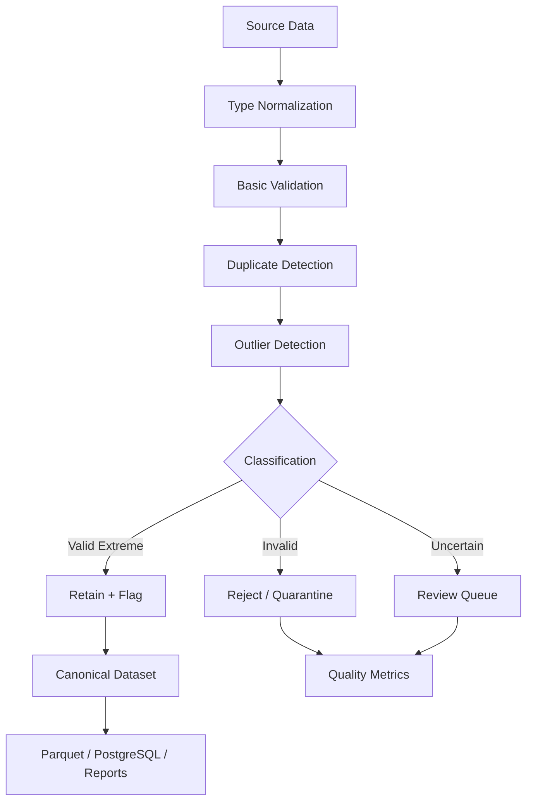
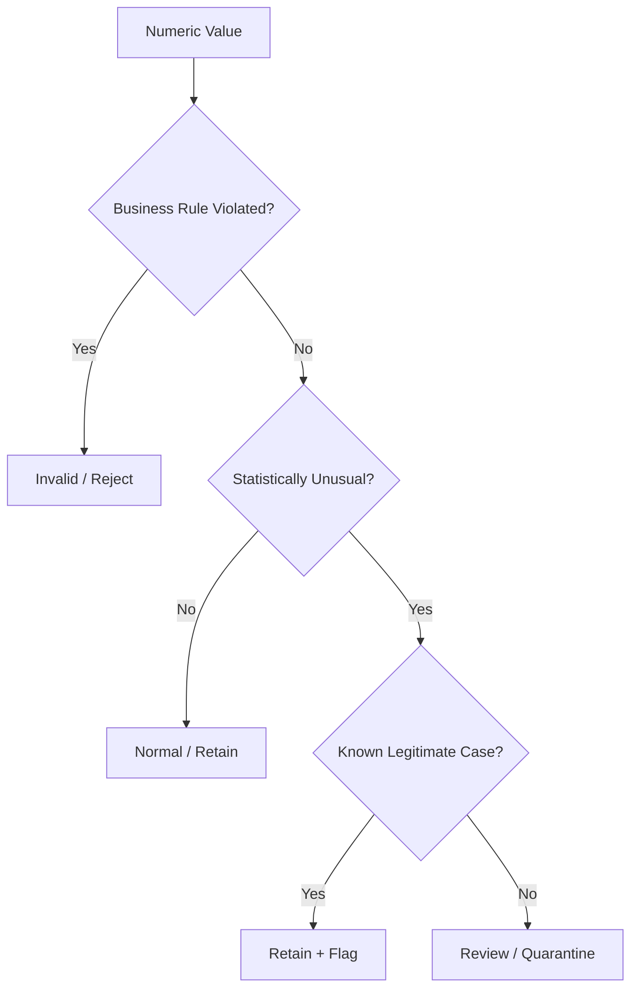

# 13- Outlier Handling

## Overview

Outlier handling is the process of identifying observations that are unusually distant from the expected distribution or business range of a dataset and deciding how they should be treated.

An outlier is not automatically bad data.

A value can be unusual because it is:

```text
A legitimate extreme event
A valid high-value customer
A large financial transaction
A system incident
A measurement error
A data-entry error
A unit-conversion bug
A duplicate record
A corrupted source value
```

For production Pandas pipelines, the important question is not:

> "Is this value far from the others?"

It is:

> "Is this value valid according to the statistical and business semantics of the field?"

A reliable workflow is:

```text
Raw data
   ↓
Profile distribution
   ↓
Define business validity
   ↓
Select detection method
   ↓
Flag potential outliers
   ↓
Investigate context
   ↓
Classify
   ├── Valid extreme
   ├── Invalid value
   ├── Data-quality issue
   └── Requires review
   ↓
Apply business-approved action
   ↓
Monitor outlier rates
   ↓
Persist clean / flagged data
```

Outlier handling belongs to **data quality and validation**, not simply data deletion.

## Why Outlier Handling Matters

Uncontrolled outliers can distort:

```text
Mean and standard deviation
Aggregations
Dashboards
Forecasting inputs
Percentiles
Threshold-based decisions
Model features
Capacity calculations
Financial reports
Operational alerts
```

For example:

```python
orders["amount"].mean()
```

can change significantly because of a single corrupted value:

```text
100
200
250
300
999999999
```

But removing the large value without investigation can be equally dangerous if it represents a legitimate transaction.

## Outlier Detection vs Validation

These concepts should remain separate.

### Outlier Detection

Identifies unusual observations:

```text
amount = 150000
```

may be unusual relative to the rest of the dataset.

### Validation

Determines whether the value is allowed:

```text
maximum transaction amount = 100000
```

The value is therefore invalid according to a business rule.

A useful distinction is:

```text
Statistical anomaly
    ≠
Invalid data
```

A production pipeline should normally **detect first and decide second**.

## Types of Outliers

| Type | Example | Interpretation |
|---|---|---|
| Legitimate extreme | High-value enterprise order | Valid |
| Measurement error | Temperature = 999°C | Invalid |
| Data-entry error | Quantity = 1000000 instead of 100 | Possibly invalid |
| Unit error | 5000 cents treated as dollars | Invalid |
| Duplicate event | Same transaction ingested twice | Data-quality issue |
| Distribution shift | Entire source changes behavior | Possible upstream change |
| Rare legitimate event | Fraud event | Potentially important signal |
| Boundary violation | Negative quantity | Invalid if domain forbids it |

Outlier handling should preserve the ability to distinguish these cases.

## Common Detection Approaches

Common approaches include:

```text
Business rules
Percentiles / quantiles
IQR
Z-score
Modified Z-score
Rolling statistics
Group-relative thresholds
Domain-specific thresholds
```

No single method is universally correct.

For backend and ETL workloads, business constraints should generally take priority over purely statistical heuristics.

## Business Rule Validation

The strongest outlier rule is often an explicit domain constraint.

Example:

```python
invalid_quantity = (
    orders["quantity"].le(0)
    | orders["quantity"].gt(1000)
)
```

This is preferable to statistical detection when the business explicitly defines:

```text
1 <= quantity <= 1000
```

The rule is:

```text
Deterministic
Auditable
Testable
Explainable
Stable
```

## Why Business Rules Come First

Suppose normal order quantities are:

```text
1
2
3
4
5
```

A quantity of:

```text
50
```

may be statistically unusual but perfectly valid for a wholesale customer.

A statistical rule might incorrectly remove it.

A business rule can distinguish:

```text
Retail order:
quantity <= 20

Wholesale order:
quantity <= 1000
```

This is why context matters.

## Quantile-Based Detection

Quantiles can identify extreme values.

For example:

```python
upper = orders["amount"].quantile(0.99)

outliers = orders.loc[
    orders["amount"].gt(upper)
]
```

This flags approximately the largest 1% of values.

Useful for:

```text
Exploratory analysis
Monitoring
Investigation queues
Distribution analysis
```

But quantile-based detection does not prove that observations are invalid.

## Lower and Upper Quantiles

```python
lower = orders["amount"].quantile(0.01)
upper = orders["amount"].quantile(0.99)

outliers = orders.loc[
    orders["amount"].lt(lower)
    | orders["amount"].gt(upper)
]
```

This is useful when both tails matter.

For one-sided domains such as revenue or latency, a one-sided threshold may be more appropriate.

## Advantages of Quantiles

Quantiles are useful because they:

```text
Are easy to compute
Do not require normality
Work well for exploratory profiling
Can adapt to changing distributions
Are easy to communicate
```

Limitations:

```text
Always classify a chosen percentage as extreme
Can hide distribution shifts
Can flag legitimate tail behavior
Can be unstable on small samples
Can be expensive or approximate at very large scale
```

## Interquartile Range

The IQR method uses:

```text
Q1 = 25th percentile
Q3 = 75th percentile
IQR = Q3 - Q1
```

A common rule is:

```text
Lower bound = Q1 - 1.5 × IQR
Upper bound = Q3 + 1.5 × IQR
```

Values outside these bounds are flagged as statistical outliers.

In Pandas:

```python
q1 = orders["amount"].quantile(0.25)
q3 = orders["amount"].quantile(0.75)

iqr = q3 - q1

lower = q1 - 1.5 * iqr
upper = q3 + 1.5 * iqr

outlier_mask = (
    orders["amount"].lt(lower)
    | orders["amount"].gt(upper)
)
```

## Why IQR Is Useful

IQR is less sensitive to extreme values than mean and standard deviation.

It is useful for:

```text
Right-skewed operational data
Transaction amounts
Order quantities
Response times
```

However, it still assumes that points outside the calculated range deserve attention rather than automatically being deleted.

## IQR and Skewed Data

Financial and operational data often have heavy right tails:

```text
1
2
3
4
5
10
50
1000
```

In such datasets, a mean-based threshold can be misleading.

IQR often provides a more robust initial screening mechanism.

For strongly skewed distributions, also inspect:

```text
log-transformed distribution
percentiles
business thresholds
segment-specific distributions
```

## Z-Score

The traditional z-score is:

```text
z = (x - mean) / standard_deviation
```

For example:

```python
mean = orders["amount"].mean()
std = orders["amount"].std()

z_score = (
    orders["amount"] - mean
) / std

outlier_mask = z_score.abs().gt(3)
```

A common heuristic is:

```text
|z| > 3
```

for potential outliers.

## Limitations of Z-Score

Z-score-based detection assumes the mean and standard deviation are useful summaries of the distribution.

It can perform poorly when:

```text
Data is heavily skewed
Distribution is multimodal
Extreme values already distort mean/std
Sample size is small
```

For backend datasets, blindly applying `abs(z) > 3` is rarely sufficient.

## Modified Z-Score

For robust anomaly screening, median and median absolute deviation can be more resistant to extreme values.

Conceptually:

```text
center = median
scale = median absolute deviation
```

A modified z-score can be calculated using:

```python
median = orders["amount"].median()

mad = (
    orders["amount"] - median
).abs().median()

if mad == 0:
    outlier_mask = pd.Series(
        False,
        index=orders.index,
    )
else:
    modified_z = (
        0.6745
        * (orders["amount"] - median)
        / mad
    )

    outlier_mask = (
        modified_z.abs().gt(3.5)
    )
```

This is more robust to extreme observations but still requires domain interpretation.

## When to Use Each Method

| Method | Best use | Main limitation |
|---|---|---|
| Business rule | Known domain boundaries | Requires domain knowledge |
| Quantile | Monitoring tails | Always flags selected percentile |
| IQR | Robust distribution screening | Can misclassify legitimate tails |
| Z-score | Roughly symmetric numeric data | Sensitive to skew/outliers |
| Modified Z-score | Robust anomaly detection | Requires careful implementation |
| Rolling threshold | Time-series drift | Depends on window design |
| Group-relative rule | Different segment distributions | Requires stable grouping |

A strong production system can combine methods.

## Group-Relative Outliers

Global thresholds can be misleading when populations have different distributions.

Suppose:

```text
Retail customer order: ₹500
Enterprise order: ₹500,000
```

A global rule might classify the enterprise value as an outlier.

Instead, calculate statistics within a meaningful segment:

```python
group_stats = (
    orders
    .groupby("customer_segment")["amount"]
    .agg(
        q1="quantile",
        q3="quantile",
    )
)
```

For more practical control, calculate the thresholds explicitly per group.

## Group-Specific IQR

```python
def add_iqr_flags(
    group: pd.DataFrame,
) -> pd.DataFrame:
    q1 = group["amount"].quantile(0.25)
    q3 = group["amount"].quantile(0.75)
    iqr = q3 - q1

    group = group.copy()

    group["outlier"] = (
        group["amount"].lt(
            q1 - 1.5 * iqr
        )
        | group["amount"].gt(
            q3 + 1.5 * iqr
        )
    )

    return group


orders = (
    orders
    .groupby(
        "customer_segment",
        group_keys=False,
    )
    .apply(add_iqr_flags)
)
```

This can better reflect heterogeneous populations.

For large datasets, avoid expensive Python-level `groupby.apply()` implementations when a vectorized or aggregation-based strategy can express the same logic more efficiently.

## Time-Series Outliers

Outlier detection for time-series data should account for:

```text
Trend
Seasonality
Day of week
Hour of day
Business calendar
Recent baseline
```

For example, traffic at:

```text
02:00
```

should not necessarily be compared with:

```text
10:00
```

using the same threshold.

## Rolling Statistics

A basic rolling threshold:

```python
rolling_mean = (
    metrics["request_count"]
    .rolling(
        window=24,
        min_periods=12,
    )
    .mean()
)

rolling_std = (
    metrics["request_count"]
    .rolling(
        window=24,
        min_periods=12,
    )
    .std()
)

metrics["anomaly"] = (
    metrics["request_count"]
    .gt(
        rolling_mean
        + 3 * rolling_std
    )
)
```

This can detect unusual changes relative to recent observations.

However, rolling mean/std can also be distorted by the anomaly itself.

## Grouping by Time Window

For operational data, first establish the desired granularity:

```text
1 minute
5 minutes
1 hour
1 day
```

Then detect anomalies at that level.

Example:

```python
hourly = (
    events
    .set_index("event_time")
    .resample("h")
    .size()
    .rename("event_count")
    .to_frame()
)
```

Then apply anomaly logic to the aggregated series.

## Seasonal Baselines

A senior production design often compares a value to an appropriate baseline.

For example:

```text
Monday 10:00
```

should be compared against:

```text
Previous Mondays around 10:00
```

rather than:

```text
Sunday 02:00
```

Pandas provides the grouping and resampling primitives, but the correct baseline is a business/system design decision.

## Outliers in API Data

API responses may contain values such as:

```json
{
  "latency_ms": 25,
  "request_count": 1000000
}
```

An unusually high value may indicate:

```text
Legitimate traffic spike
Provider incident
Retry storm
Duplicate ingestion
Unit change
Upstream bug
```

Do not automatically remove it.

First classify the event.

## Outliers in Financial Data

Financial outliers require particularly careful treatment.

A large transaction may be:

```text
Valid enterprise purchase
Quarter-end settlement
Refund
Chargeback
Fraud
Duplicate transaction
Data corruption
```

Deleting it can destroy financial truth.

Prefer:

```text
Flag
Investigate
Reconcile
Classify
```

before modification.

## Outlier Flagging

A strong production pattern is to add a flag rather than immediately removing records:

```python
orders["amount_outlier"] = (
    orders["amount"].gt(upper)
)
```

This preserves:

```text
Original data
Detection result
Audit trail
```

You can then derive subsets:

```python
review_queue = orders.loc[
    orders["amount_outlier"]
].copy()
```

## Flag vs Remove

Prefer flagging when:

```text
Outlier may be legitimate
Manual review exists
Auditability matters
The dataset is used for financial reporting
The anomaly itself is operationally important
```

Removal may be appropriate when:

```text
The business contract explicitly defines the value as invalid
The source has a known corruption rule
The record cannot safely participate in downstream calculations
```

Even then, retain rejection information when operationally required.

## Clipping / Winsorization

Instead of removing values, some analytical workloads cap extremes.

Example:

```python
lower = orders["amount"].quantile(0.01)
upper = orders["amount"].quantile(0.99)

orders["amount_capped"] = (
    orders["amount"]
    .clip(
        lower=lower,
        upper=upper,
    )
)
```

This is useful for certain analytical calculations.

It is dangerous as a general data-cleaning strategy because it changes real values.

Never use clipping for authoritative transaction records unless the business explicitly defines such behavior.

## Outlier Replacement

Replacing outliers with:

```text
median
mean
boundary value
```

is sometimes used in statistical preprocessing.

Example:

```python
median_amount = (
    orders["amount"]
    .median()
)

orders["amount_adjusted"] = (
    orders["amount"]
    .where(
        ~orders["amount_outlier"],
        median_amount,
    )
)
```

This is generally an analytical transformation, not a safe default for operational data.

Preserve the original value when using replacement.

## Missing Values and Outliers

Missing values should normally be handled before statistical detection.

For example:

```python
amount = orders["amount"].dropna()
```

or use Pandas statistics that naturally skip missing values.

Do not convert missing values to zero merely to make an outlier calculation easier.

That changes the distribution.

## Invalid Numeric Types

Outlier detection requires numeric semantics.

Normalize first:

```python
orders["amount"] = pd.to_numeric(
    orders["amount"],
    errors="coerce",
)
```

Then:

```python
upper = orders["amount"].quantile(0.99)
```

Do not calculate statistical thresholds on strings.

## Infinite Values

Infinity can distort statistical calculations.

Clean or classify it first:

```python
import numpy as np

finite_amount = orders["amount"].where(
    np.isfinite(orders["amount"])
)
```

Then calculate statistics from finite values.

A common validation flow is:

```python
orders["amount"] = pd.to_numeric(
    orders["amount"],
    errors="coerce",
)

orders.loc[
    ~np.isfinite(
        orders["amount"]
    ),
    "amount",
] = np.nan
```

If preserving the raw value matters, classify rather than overwrite it.

## Duplicate Records vs Outliers

A duplicated transaction can look like an extreme numeric value when aggregated.

For example:

```text
Actual order:
amount = 1000

Duplicate ingested 100 times:
reported total = 100000
```

An apparent numeric outlier may therefore be a deduplication problem.

Always consider:

```text
Duplicates
Aggregation bugs
Join multiplication
Unit errors
```

before concluding that the numeric value itself is anomalous.

## Join Multiplication and Outliers

Incorrect many-to-many joins can produce inflated metrics:

```text
orders
    ×
duplicate customer rows
```

can multiply revenue.

If an aggregate suddenly becomes extreme, inspect the transformation pipeline, not only the final numeric value.

## Outlier Detection After Aggregation

Choose the stage deliberately.

For example:

```text
Raw transaction outlier
```

is different from:

```text
Daily revenue outlier
```

and:

```text
Customer lifetime value outlier
```

The same detection rule may not apply at each level.

## Outliers and Data Distribution

Before selecting a detector, inspect:

```python
orders["amount"].describe()
```

Useful indicators include:

```text
count
mean
std
min
25%
50%
75%
max
```

Also inspect:

```python
orders["amount"].quantile(
    [
        0.90,
        0.95,
        0.99,
        0.999,
    ]
)
```

This often reveals more than relying on a single statistical rule.

## Distribution Shift vs Outlier

A major production distinction is:

```text
One unusual record
```

versus:

```text
The entire distribution changed
```

Suppose request volume changes from:

```text
10,000/hour
```

to:

```text
50,000/hour
```

for every hour after a deployment.

Those values are not necessarily individual outliers.

The likely issue may be:

```text
Traffic growth
Instrumentation change
Duplicate events
Retry storm
Feature launch
Source migration
```

Statistical detection should therefore be paired with aggregate monitoring.

## Detecting Outliers with Quantiles

A practical reusable helper:

```python
def flag_upper_quantile(
    df: pd.DataFrame,
    column: str,
    quantile: float = 0.99,
) -> pd.Series:
    threshold = df[column].quantile(
        quantile
    )

    return df[column].gt(
        threshold
    )
```

Usage:

```python
orders["high_amount"] = (
    flag_upper_quantile(
        orders,
        "amount",
        quantile=0.99,
    )
)
```

The function should be paired with validation that:

```text
column exists
column is numeric
quantile is between 0 and 1
empty input is handled
missing values are handled
```

## Handling Empty Data

Outlier functions should behave predictably with an empty DataFrame.

Example:

```python
if orders.empty:
    return orders.assign(
        amount_outlier=pd.Series(
            dtype="boolean",
        )
    )
```

However, prefer designs that naturally support empty input where practical.

Pipelines should preserve schema even when there are zero rows.

## Handling Small Samples

Statistical outlier detection can be unstable with small datasets.

For example:

```text
3 records
```

is not a strong basis for estimating a meaningful 99th percentile.

A production rule may require:

```text
Minimum sample size
```

before enabling a particular statistical detector.

Otherwise:

```text
Use business rules
Flag for review
Skip statistical detection
```

## Robust Threshold Configuration

Do not hard-code thresholds throughout the pipeline:

```python
orders["amount"].gt(100000)
```

unless the value is genuinely part of the source-level contract.

Prefer configuration:

```yaml
outlier_rules:
  order_amount:
    max_value: 100000
    quantile: 0.99
```

Then:

```python
MAX_ORDER_AMOUNT = config[
    "outlier_rules"
]["order_amount"]["max_value"]
```

This improves:

```text
Change management
Testing
Deployment
Auditability
Environment-specific configuration
```

## Data Quality Configuration

A mature pipeline may define:

```yaml
validation:
  quantity:
    min: 1
    max: 1000

  amount:
    min: 0
    max: 100000

  statistical_detection:
    enabled: true
    method: iqr
    multiplier: 1.5
```

The configuration should still be validated before use.

Do not allow arbitrary runtime configuration from untrusted users to directly control sensitive processing behavior.

## Outlier Detection in ETL

A robust ETL pipeline can structure outlier processing as:



This avoids treating outlier detection as an isolated cleanup operation.

## Outlier Handling in Batch Processing

For a batch pipeline:

```text
Read batch
    ↓
Normalize types
    ↓
Validate basic schema
    ↓
Detect duplicates
    ↓
Calculate outlier thresholds
    ↓
Flag anomalies
    ↓
Apply business rules
    ↓
Write valid + rejected outputs
    ↓
Publish metrics
```

Be careful when calculating thresholds independently per batch.

A batch-specific percentile can move significantly from one run to another.

## Global vs Batch Thresholds

Consider:

```text
Daily batch A:
99th percentile = 10,000

Daily batch B:
99th percentile = 50,000
```

This could indicate:

```text
True distribution change
Different customer mix
A corrupted batch
Business growth
Threshold instability
```

For production systems, thresholds may come from:

```text
Static business rules
Historical baseline
Versioned configuration
Central monitoring service
Reference distribution
```

rather than being recomputed blindly on every batch.

## Incremental Processing

For incremental pipelines, avoid letting recent anomalies redefine the baseline immediately.

Otherwise:

```text
Anomalous spike
    ↓
Baseline recalculated
    ↓
Spike becomes "normal"
```

A more robust approach can use:

```text
Previous trusted baseline
+
Controlled update policy
```

This is particularly important for operational monitoring.

## Outliers in Distributed Systems

In microservice or Kafka environments, outlier behavior can originate from many layers:

```text
Producer
Network
Retry logic
Consumer
Transformation
Database
Join
Aggregation
```

A huge metric may therefore be an application-level artifact rather than a source-level outlier.

Trace the data flow:

```text
Source event
    ↓
Transport
    ↓
Ingestion
    ↓
Pandas transform
    ↓
Aggregation
    ↓
Persistence
    ↓
Dashboard
```

Validate assumptions at each stage.

## Observability

Outlier processing should produce operational metrics.

Useful measurements include:

```text
Rows processed
Rows flagged
Rows rejected
Outlier rate
Outlier rate by field
Outlier rate by source
Outlier rate by customer segment
Threshold values
Processing duration
Batch-to-batch distribution changes
```

Example:

```python
outlier_rate = (
    orders["amount_outlier"]
    .mean()
)

metrics = {
    "rows_processed": len(orders),
    "amount_outliers": int(
        orders["amount_outlier"].sum()
    ),
    "amount_outlier_rate": float(
        outlier_rate
    ),
}
```

A spike in the outlier rate should trigger investigation rather than silent cleanup.

## Alerting

Alert when:

```text
Outlier rate exceeds baseline
A field's maximum changes unexpectedly
Multiple independent fields become anomalous
Source-specific anomalies appear
Outlier rate changes immediately after deployment
```

For example:

```text
amount_outlier_rate > 2%
```

might trigger an alert if historical rate is normally:

```text
0.05% - 0.2%
```

The threshold should be configured based on actual system behavior.

## Security Considerations

Outlier handling can have security implications.

### Fraud Detection

Large or unusual values may indicate fraud.

Do not automatically discard them.

Instead:

```text
Flag
Preserve
Enrich
Investigate
```

### Abuse Detection

Request-volume outliers can indicate:

```text
DDoS-like activity
Credential attacks
Retry storms
Scraping
Misconfigured clients
```

Pandas may support offline analysis, while real-time protection should remain in systems designed for low-latency enforcement such as:

```text
Nginx
API gateway
WAF
Redis-based rate limiting
Streaming systems
```

### Sensitive Data in Diagnostics

Do not log complete sensitive records solely because they are outliers.

Use:

```text
Record IDs
Hashed identifiers where appropriate
Aggregated metrics
Redacted fields
```

## Reliability Considerations

Outlier processing should not make the pipeline silently destructive.

Prefer:

```text
Flag
Quarantine
Fail
```

based on severity.

For example:

| Condition | Action |
|---|---|
| Small number of suspicious rows | Retain + flag |
| Known invalid values | Quarantine |
| High anomaly rate | Fail or stop publication |
| Source-wide distribution shift | Alert and investigate |
| Critical financial anomaly | Require reconciliation |

This creates explicit failure semantics.

## Disaster Recovery and Reprocessing

Outlier rules change over time.

For reproducible reprocessing, version:

```text
Cleaning code
Outlier thresholds
Configuration
Source schema
Business rules
```

A historical dataset processed with today's rules may produce a different result than the same dataset processed six months ago.

Store rule versions where auditability matters.

## Performance Considerations

Most basic outlier techniques are vectorizable:

```python
orders["amount"].gt(
    orders["amount"].quantile(0.99)
)
```

This is preferable to a Python loop.

For large datasets, watch for:

```text
Repeated quantile calculations
Repeated groupby operations
Large temporary DataFrames
Expensive groupby.apply()
Unnecessary copies
High-cardinality grouping
```

Compute shared thresholds once.

## Avoid Recalculating Thresholds

Avoid:

```python
for row in orders.itertuples():
    threshold = orders["amount"].quantile(0.99)
```

This repeatedly performs the same expensive calculation.

Instead:

```python
threshold = orders["amount"].quantile(
    0.99
)

orders["outlier"] = (
    orders["amount"]
    .gt(threshold)
)
```

Compute once, reuse many times.

## Memory Considerations

Adding multiple diagnostic columns increases memory:

```text
amount_outlier
amount_zscore
amount_percentile
amount_capped
amount_original
```

For large datasets, retain only the fields required for:

```text
Decision making
Auditing
Reporting
Debugging
```

Persist detailed diagnostics separately when necessary.

## Quantile Performance at Scale

Exact quantiles can become expensive on very large datasets.

For data volumes beyond practical Pandas memory limits, consider:

```text
Database percentile functions
Approximate quantiles
Distributed processing
Warehouse analytics
Streaming anomaly detection
```

Pandas should not be forced into a distributed-scale workload simply because the transformation is conceptually simple.

## SQL and Database Pushdown

If the data is already in PostgreSQL, some outlier calculations may be better performed in SQL.

For example, percentile calculations can be delegated to the database when appropriate.

The decision should consider:

```text
Data volume
Network transfer cost
Database load
Query complexity
Reuse
Latency
```

A useful architecture may be:

```text
PostgreSQL
    → filter / aggregate / percentile calculation
        ↓
Pandas
    → deeper transformation / reporting
```

rather than loading all raw rows into Pandas.

## Parquet and Outlier Processing

For repeated batch analysis:

```text
CSV
    → typed cleaning
    → outlier classification
    → Parquet
```

can avoid repeated parsing.

Example:

```python
orders.to_parquet(
    "processed/orders.parquet",
    index=False,
)
```

Persisting a canonical dataset can make downstream outlier analysis significantly cheaper.

## Testing Outlier Logic

Tests should validate business behavior, not merely code execution.

Test:

```text
Boundary values
Valid extremes
Invalid extremes
Missing values
Infinite values
Small samples
Empty input
Equal-valued data
Skewed distributions
Group-specific thresholds
```

## Testing Business Thresholds

```python
def flag_amount_outliers(
    amounts: pd.Series,
    maximum: float,
) -> pd.Series:
    return amounts.gt(maximum)


def test_amount_boundary_is_valid() -> None:
    amounts = pd.Series(
        [
            100.0,
            1000.0,
            1000.01,
        ]
    )

    result = flag_amount_outliers(
        amounts,
        maximum=1000.0,
    )

    assert result.tolist() == [
        False,
        False,
        True,
    ]
```

This verifies exact boundary behavior.

## Testing Quantile Detection

```python
def test_upper_quantile_flags_high_values() -> None:
    amounts = pd.Series(
        [
            10,
            20,
            30,
            40,
            1000,
        ],
        dtype="float64",
    )

    threshold = amounts.quantile(0.8)

    result = amounts.gt(threshold)

    assert result.iloc[-1]
    assert result.iloc[:-1].sum() == 0
```

The purpose is to verify the intended behavior of the selected heuristic.

## Testing Missing Values

```python
def test_missing_amount_is_not_marked_as_outlier() -> None:
    amounts = pd.Series(
        [
            100.0,
            None,
            200.0,
        ],
        dtype="Float64",
    )

    threshold = amounts.quantile(0.9)

    result = amounts.gt(threshold)

    assert pd.isna(result.iloc[1])
```

Missingness should not silently become an outlier unless that is part of the design.

## Testing Infinite Values

```python
import numpy as np
import pandas as pd


def test_infinite_values_are_classified() -> None:
    amounts = pd.Series(
        [
            100.0,
            np.inf,
            -np.inf,
        ]
    )

    finite = np.isfinite(amounts)

    assert finite.tolist() == [
        True,
        False,
        False,
    ]
```

Infinite values should be handled explicitly before statistical calculations where appropriate.

## Testing Empty Input

```python
def test_empty_input_preserves_schema() -> None:
    amounts = pd.Series(
        [],
        dtype="float64",
    )

    threshold = amounts.quantile(0.99)

    result = amounts.gt(threshold)

    assert result.empty
```

For production functions, also test that expected output columns exist.

## Testing Idempotent Classification

If the outlier operation only creates a flag:

```python
def add_outlier_flag(
    df: pd.DataFrame,
    threshold: float,
) -> pd.DataFrame:
    result = df.copy()

    result["outlier"] = (
        result["amount"]
        .gt(threshold)
    )

    return result
```

Applying the same rule should produce the same flag.

Deterministic behavior simplifies:

```text
Retries
Backfills
Unit tests
Audits
```

## Common Mistakes

| Mistake | Why it happens | Better approach |
|---|---|---|
| Removing every outlier | Statistical anomaly is confused with invalid data | Flag and classify first |
| Using a global threshold for heterogeneous data | Segments are ignored | Use business or group-specific rules |
| Using z-score on highly skewed data | Mean/std are assumed to be robust | Consider IQR, quantiles, or domain rules |
| Filling missing values before detection | Missingness is treated as noise | Handle missing values separately |
| Ignoring infinite values | Numeric dtype is assumed valid | Check finiteness |
| Detecting before deduplication | Duplicates distort distributions | Consider duplicate effects first |
| Ignoring join multiplication | Aggregates become inflated | Validate joins and row counts |
| Calculating thresholds per batch blindly | Baselines become unstable | Use versioned or trusted baselines |
| Capping financial values | Analytical preprocessing is confused with source correction | Preserve authoritative transaction values |
| Replacing outliers with the median | Statistical convenience | Keep original values and treat replacement as a separate analytical transformation |
| Using tiny samples for statistical detection | Percentiles become unstable | Require minimum sample sizes |
| Recomputing thresholds repeatedly | Performance is ignored | Compute once and reuse |
| Using `groupby.apply()` for everything | It is easy to express | Prefer vectorized group statistics where possible |
| Logging entire outlier records | Debugging convenience | Redact sensitive data |
| Hard-coding thresholds | Configuration is embedded in code | Externalize versioned rules |

## Production Pitfalls

### "Outlier" Does Not Mean "Bad"

An enterprise purchase of:

```text
₹10,000,000
```

might be exactly correct.

Deleting it because it exceeds the 99th percentile can corrupt revenue reporting.

### Statistical Rules Can Hide Distribution Changes

Suppose every new record is 10× larger after a producer change.

A fresh percentile calculation may treat the new values as normal.

Monitor:

```text
Distribution
Threshold movement
Outlier rate
Source version
Deployment events
```

together.

### Detection Can Be Affected by Earlier Transformations

Outlier thresholds can change because of:

```text
Duplicate removal
Join behavior
Missing-value treatment
Unit conversion
Aggregation
Filtering
```

The detection stage must have a well-defined position in the pipeline.

### Business Rules Can Become Stale

A fixed threshold may be correct today and wrong after:

```text
Business expansion
Pricing changes
New customer segments
Currency changes
Product launches
```

Version thresholds and review them periodically.

### Cleaning Can Destroy Evidence

Replacing:

```text
999999
```

with:

```text
median
```

removes evidence that the source produced the original value.

Preserve source evidence when auditability matters.

## Recommended Production Pattern

A maintainable implementation separates:

```text
Detection
Classification
Action
Metrics
```

Example:

```python
import numpy as np
import pandas as pd


def detect_amount_outliers(
    orders: pd.DataFrame,
    *,
    maximum_amount: float,
    quantile: float = 0.99,
) -> pd.Series:
    amount = pd.to_numeric(
        orders["amount"],
        errors="coerce",
    )

    finite = (
        amount.notna()
        & np.isfinite(amount)
    )

    business_invalid = (
        amount.lt(0)
        | amount.gt(maximum_amount)
    )

    threshold = amount.loc[
        finite
        & ~business_invalid
    ].quantile(quantile)

    statistical_outlier = (
        finite
        & amount.gt(threshold)
    )

    return (
        business_invalid
        | statistical_outlier
    )


def classify_orders(
    orders: pd.DataFrame,
) -> pd.DataFrame:
    result = orders.copy()

    result["amount_outlier"] = (
        detect_amount_outliers(
            result,
            maximum_amount=100_000,
            quantile=0.99,
        )
    )

    result["outlier_type"] = (
        "none"
    )

    amount = pd.to_numeric(
        result["amount"],
        errors="coerce",
    )

    business_invalid = (
        amount.lt(0)
        | amount.gt(100_000)
    )

    result.loc[
        business_invalid,
        "outlier_type",
    ] = "business_rule"

    result.loc[
        result["amount_outlier"]
        & ~business_invalid,
        "outlier_type",
    ] = "statistical"

    return result
```

This distinction is valuable because:

```text
business_rule
    → known invalid

statistical
    → requires investigation
```

The statistical result should not automatically trigger destructive cleaning.

## Outlier Classification Model



This is a more reliable model than:

```text
outlier → delete
```

## Production Checklist

Before deploying outlier handling:

- Define whether the rule is statistical, business-based, or both.
- Establish field semantics and valid ranges.
- Normalize numeric types before detection.
- Handle missing and infinite values explicitly.
- Consider duplicate and join effects before interpreting extreme aggregates.
- Inspect the distribution before selecting a statistical method.
- Use business rules when explicit domain boundaries exist.
- Use IQR or quantile methods when robust statistical screening is appropriate.
- Avoid blindly applying z-scores to skewed data.
- Consider customer, product, region, or time-based segmentation.
- Flag suspicious values before deleting them.
- Preserve authoritative source values for audit-sensitive datasets.
- Define minimum sample sizes for statistical detection.
- Version thresholds and detection configuration.
- Monitor outlier rates and threshold movement.
- Distinguish individual anomalies from distribution-wide shifts.
- Test boundaries, nulls, infinities, empty inputs, skewed distributions, and small samples.
- Reconsider Pandas when the workload exceeds practical memory or requires distributed anomaly processing.

## Key Takeaways

- An outlier is **an unusual observation, not automatically bad data**; classify it using business semantics before removing or modifying it.
- Prefer deterministic **business validation rules** when valid ranges are known, and use quantiles, IQR, or robust statistical methods for anomaly screening rather than automatic deletion.
- Handle missing values, infinite values, duplicates, joins, units, and aggregation effects before interpreting an extreme value.
- In production ETL, **flag first, preserve evidence, measure anomaly rates, and quarantine or reject only according to explicit policies**.
- Treat outlier rules as versioned, testable, observable configuration and monitor distribution shifts so statistical thresholds do not silently redefine abnormal data as normal.