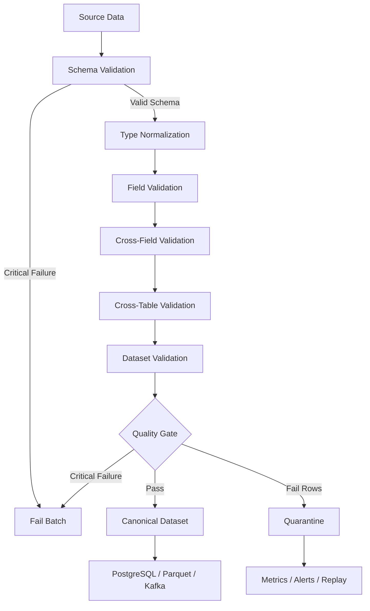

# 14- Validation Rules

## Overview

Validation rules define the conditions that determine whether cleaned Pandas data is structurally correct, semantically valid, and safe for downstream processing.

Cleaning changes representation:

```text
" 100 "
    ↓
100
```

Validation determines whether the result is acceptable:

```text
100 >= 0
100 <= configured maximum
```

A production data pipeline should therefore separate:

```text
Ingestion
    ↓
Type normalization
    ↓
Cleaning
    ↓
Validation
    ↓
Classification
    ├── Valid
    ├── Invalid
    └── Review / Warning
    ↓
Transformation
    ↓
Persistence / Reporting
```

Validation is not limited to checking individual columns. Mature validation includes:

```text
Schema rules
Type rules
Nullability
Domain constraints
Cross-field relationships
Uniqueness
Referential integrity
Temporal constraints
Distribution checks
Source-level quality thresholds
```

The goal is not to make every dataset error-free. The goal is to establish an explicit and observable contract for what the pipeline considers usable data.

## Why Validation Rules Matter

Without validation, data problems can propagate into:

```text
PostgreSQL
Parquet
Kafka
Redis
REST APIs
Reports
Financial calculations
Analytics dashboards
Downstream microservices
```

A malformed record discovered after publication is significantly more expensive to correct than one rejected at the processing boundary.

For example:

```text
Raw API payload
    ↓
Pandas
    ↓
No validation
    ↓
Database
    ↓
Incorrect reporting
```

A stronger pipeline is:

```text
Raw API payload
    ↓
Pandas normalization
    ↓
Validation
    ↓
Invalid rows quarantined
    ↓
Valid rows persisted
```

## Validation vs Cleaning vs Transformation

These responsibilities should remain distinct.

| Responsibility | Purpose | Example |
|---|---|---|
| Cleaning | Normalize representation | `" Mumbai "` → `"Mumbai"` |
| Validation | Determine whether data is acceptable | `quantity > 0` |
| Transformation | Change structure or derive values | Revenue by region |
| Enrichment | Add external/contextual data | Customer segment lookup |

A useful rule is:

```text
Clean to make data consistent.
Validate to determine whether it is acceptable.
Transform only after required validation has passed.
```

## Validation Layers

Production validation commonly operates at multiple levels:

```text
Schema
  ↓
Field
  ↓
Row
  ↓
Cross-row
  ↓
Cross-table
  ↓
Dataset
  ↓
Pipeline
```

For example:

```text
Schema:
required columns exist

Field:
amount is numeric

Row:
quantity > 0

Cross-field:
completed_at >= created_at

Cross-row:
order_id is unique

Cross-table:
customer_id exists in customers

Dataset:
row count is within expected range

Pipeline:
rejected records stay below configured threshold
```

## Schema Validation

Before applying business rules, verify that the expected columns exist.

```python
required_columns = {
    "order_id",
    "customer_id",
    "amount",
    "created_at",
}

missing_columns = (
    required_columns
    - set(orders.columns)
)

if missing_columns:
    raise ValueError(
        f"Missing required columns: "
        f"{sorted(missing_columns)}"
    )
```

This should usually happen early in the pipeline.

Missing schema elements are different from invalid field values.

## Schema Expectations

A production data contract may define:

| Column | Type | Nullable | Rule |
|---|---|---:|---|
| `order_id` | string | No | Unique |
| `customer_id` | string | No | Must reference customer |
| `amount` | numeric | No | `>= 0` |
| `quantity` | integer | No | `> 0` |
| `currency` | string | No | Allowed currency code |
| `created_at` | UTC datetime | No | Reasonable range |

This gives the pipeline an explicit contract.

## Column Type Validation

Pandas types should be checked after normalization:

```python
expected = {
    "order_id": "string",
    "customer_id": "string",
    "currency": "string",
    "quantity": "Int64",
}

for column, dtype in expected.items():
    if str(orders[column].dtype) != dtype:
        raise TypeError(
            f"{column}: expected {dtype}, "
            f"got {orders[column].dtype}"
        )
```

In production, prefer schema-aware validation libraries or explicit centralized validators when the number of rules grows.

## Required Columns

A required column is one whose absence should usually fail the batch.

Example:

```python
required = [
    "order_id",
    "amount",
    "created_at",
]

missing = [
    column
    for column in required
    if column not in orders.columns
]

if missing:
    raise ValueError(
        f"Required columns missing: {missing}"
    )
```

Do not silently create missing columns with default values unless the schema explicitly defines such behavior.

## Nullability Validation

A required field should have an explicit null policy.

```python
required_fields = [
    "order_id",
    "customer_id",
    "created_at",
]

invalid = orders[
    required_fields
].isna().any(axis=1)
```

Then:

```python
invalid_rows = orders.loc[
    invalid
].copy()
```

Nullable fields require a different policy.

For example:

```text
discount_code:
    nullable

order_id:
    non-nullable
```

## Empty Strings vs Missing Values

These are often different representations of the same logical missing state.

Normalize first:

```python
orders["customer_id"] = (
    orders["customer_id"]
    .astype("string")
    .str.strip()
    .replace("", pd.NA)
)
```

Then validate:

```python
invalid_customer_id = (
    orders["customer_id"].isna()
)
```

Do not validate raw strings before normalization if the source can contain whitespace-only values.

## Allowed Values

Controlled fields should have explicit valid values.

```python
allowed_statuses = {
    "pending",
    "paid",
    "completed",
    "cancelled",
}

invalid_status = (
    orders["status"].notna()
    & ~orders["status"].isin(
        allowed_statuses
    )
)
```

This catches upstream changes such as:

```text
"complete"
"completed-v2"
"PAID_NOW"
```

when they are not part of the contract.

## Enum Validation

Normalize before enum validation:

```python
orders["status"] = (
    orders["status"]
    .astype("string")
    .str.strip()
    .str.casefold()
)

allowed_statuses = {
    "pending",
    "paid",
    "completed",
    "cancelled",
}

invalid_status = ~orders[
    "status"
].isin(
    allowed_statuses
)
```

The order matters:

```text
normalize
    ↓
validate
```

not:

```text
validate raw source values
    ↓
normalize later
```

## Numeric Validation

Numeric fields should be validated after conversion.

```python
orders["amount"] = pd.to_numeric(
    orders["amount"],
    errors="coerce",
)

invalid_amount = (
    orders["amount"].isna()
    | orders["amount"].lt(0)
)
```

Do not conflate:

```text
parsing failure
```

with:

```text
business-rule violation
```

Track them separately where diagnostics matter.

## Numeric Range Rules

Example:

```python
valid_amount = (
    orders["amount"].notna()
    & orders["amount"].between(
        0,
        100_000,
    )
)
```

Range validation catches:

```text
Negative values
Unexpected magnitudes
Unit mistakes
Corrupted source values
```

The limits should come from domain requirements rather than arbitrary defaults.

## Integer Validation

For quantities:

```python
orders["quantity"] = (
    pd.to_numeric(
        orders["quantity"],
        errors="coerce",
    )
    .astype("Int64")
)

valid_quantity = (
    orders["quantity"].notna()
    & orders["quantity"].gt(0)
)
```

If fractional quantities are allowed, use an appropriate numeric type instead.

## Finite Numeric Validation

A numeric dtype can still contain infinity.

```python
import numpy as np

finite_amount = (
    orders["amount"].notna()
    & np.isfinite(
        orders["amount"]
    )
)
```

For financial and reporting datasets, explicitly determine whether infinity is acceptable. In many domains it is not.

## String Format Validation

Use structural validation for fields with defined formats.

Example:

```python
valid_email = (
    customers["email"].notna()
    & customers["email"].str.contains(
        r"^[^@\s]+@[^@\s]+\.[^@\s]+$",
        regex=True,
        na=False,
    )
)
```

This is a basic structural rule, not complete email validation.

The same principle applies to:

```text
Phone numbers
Postal codes
SKU values
External IDs
Account identifiers
```

Do not make regex more permissive or restrictive than the actual contract.

## Identifier Validation

Identifiers should generally be validated as strings.

```python
valid_customer_id = (
    customers["customer_id"].notna()
    & customers["customer_id"].str.match(
        r"^CUST-\d+$",
        na=False,
    )
)
```

Do not convert identifiers to integers merely because they contain digits.

This can remove:

```text
Leading zeros
Prefixes
Formatting semantics
```

## Datetime Validation

Parse first:

```python
orders["created_at"] = pd.to_datetime(
    orders["created_at"],
    errors="coerce",
    utc=True,
)
```

Then validate:

```python
valid_created_at = (
    orders["created_at"].notna()
    & orders["created_at"].ge(
        pd.Timestamp(
            "2020-01-01T00:00:00Z"
        )
    )
)
```

Datetime validation should also consider:

```text
Timezone awareness
Future values
Business windows
Cross-field ordering
Event-time semantics
```

## Cross-Field Validation

Some rules depend on multiple columns.

Example:

```python
invalid_order_lifecycle = (
    orders["completed_at"].notna()
    & orders["created_at"].notna()
    & orders["completed_at"].lt(
        orders["created_at"]
    )
)
```

This catches impossible order lifecycles.

Other examples:

```text
refund_amount <= amount
shipped_at >= paid_at
closed_at >= opened_at
discount <= subtotal
start_date <= end_date
```

Cross-field validation is often more valuable than checking individual columns independently.

## Conditional Validation

Some rules depend on another field.

Example:

```text
Refund amount must be present when status = refunded.
```

```python
invalid_refund = (
    orders["status"].eq("refunded")
    & orders["refund_amount"].isna()
)
```

Another rule:

```text
Cancellation timestamp is required for cancelled orders.
```

```python
invalid_cancelled = (
    orders["status"].eq("cancelled")
    & orders["cancelled_at"].isna()
)
```

These rules encode the business state model.

## State Transition Validation

Status fields often represent state machines.

Example:

```text
pending → paid → shipped → completed
pending → cancelled
paid → refunded
```

A simple value check does not guarantee the lifecycle is valid.

For event/state data, validate:

```text
Allowed states
Required timestamps
Timestamp ordering
Allowed transitions
```

When transition complexity grows, represent the state machine explicitly rather than embedding dozens of unrelated boolean expressions.

## Uniqueness Validation

A business key can be validated with:

```python
duplicate_order_id = (
    orders["order_id"]
    .duplicated(
        keep=False
    )
)
```

For required uniqueness:

```python
if duplicate_order_id.any():
    raise ValueError(
        "Duplicate order_id values detected"
    )
```

Do not assume the DataFrame is unique because the source system claims uniqueness.

## Composite Uniqueness

Sometimes uniqueness belongs to multiple columns:

```text
tenant_id + order_id
```

Validate:

```python
duplicate_keys = (
    orders[
        [
            "tenant_id",
            "order_id",
        ]
    ]
    .duplicated(
        keep=False
    )
)
```

A composite business key is often necessary in multi-tenant systems.

## Uniqueness vs Duplicate Data

These are related but not identical.

```text
Duplicate row
    → entire records are repeated

Duplicate key
    → multiple records use the same logical identifier
```

A source may legitimately have multiple events for one:

```text
order_id
```

while still requiring uniqueness for:

```text
order_id + event_id
```

The validation key must reflect the business model.

## Referential Integrity

If orders reference customers:

```text
orders.customer_id
    ↓
customers.customer_id
```

validate the relationship.

```python
customer_ids = customers[
    "customer_id"
].dropna().unique()

invalid_reference = ~orders[
    "customer_id"
].isin(
    customer_ids
)
```

For large data, prefer a controlled join or database constraint where appropriate.

## Referential Integrity with a Join

```python
reference = (
    customers[
        ["customer_id"]
    ]
    .drop_duplicates()
    .assign(
        customer_exists=True
    )
)

orders_checked = orders.merge(
    reference,
    on="customer_id",
    how="left",
    validate="many_to_one",
)

invalid_reference = (
    orders_checked[
        "customer_exists"
    ].isna()
)
```

The `validate` option is valuable because it checks the expected relationship instead of allowing accidental join multiplication.

## Foreign Key Validation

For persisted data, Pandas validation does not replace database constraints.

A strong design is:

```text
Pandas:
    pre-persistence data quality

PostgreSQL:
    authoritative foreign-key enforcement
```

This provides both early diagnostics and final integrity guarantees.

## Row-Level Validation

A row-level validation mask can combine multiple independent rules:

```python
valid_rows = (
    orders["order_id"].notna()
    & orders["customer_id"].notna()
    & orders["amount"].notna()
    & orders["amount"].ge(0)
    & orders["quantity"].notna()
    & orders["quantity"].gt(0)
)
```

Then:

```python
clean = orders.loc[
    valid_rows
].copy()

rejected = orders.loc[
    ~valid_rows
].copy()
```

This is appropriate for simple rules.

For complex pipelines, build named masks so each failure can be diagnosed.

## Named Validation Masks

Prefer:

```python
required_fields_valid = (
    orders["order_id"].notna()
    & orders["customer_id"].notna()
)

amount_valid = (
    orders["amount"].notna()
    & orders["amount"].ge(0)
)

quantity_valid = (
    orders["quantity"].notna()
    & orders["quantity"].gt(0)
)

lifecycle_valid = (
    orders["completed_at"].isna()
    | orders["completed_at"].ge(
        orders["created_at"]
    )
)

valid_rows = (
    required_fields_valid
    & amount_valid
    & quantity_valid
    & lifecycle_valid
)
```

This is easier to test and monitor than one large opaque expression.

## Validation Failure Reasons

Do not return only:

```python
valid = False
```

when operational diagnosis matters.

Instead, classify failures:

```python
result["validation_error"] = pd.Series(
    pd.NA,
    index=result.index,
    dtype="string",
)

result.loc[
    ~required_fields_valid,
    "validation_error",
] = "missing_required_field"

result.loc[
    required_fields_valid
    & ~amount_valid,
    "validation_error",
] = "invalid_amount"

result.loc[
    required_fields_valid
    & amount_valid
    & ~quantity_valid,
    "validation_error",
] = "invalid_quantity"
```

This supports:

```text
Quarantine workflows
Metrics
Debugging
Source-owner feedback
```

## Multiple Failure Reasons

A single row can fail several rules.

A richer design can retain multiple reasons:

```python
result["validation_errors"] = [[] for _ in result.index]

for mask, reason in [
    (
        ~required_fields_valid,
        "missing_required_field",
    ),
    (
        ~amount_valid,
        "invalid_amount",
    ),
    (
        ~quantity_valid,
        "invalid_quantity",
    ),
]:
    for index in result.index[mask]:
        result.at[
            index,
            "validation_errors",
        ].append(reason)
```

This uses Python objects and may be expensive for very large datasets.

For high-volume pipelines, consider separate boolean flags or a normalized error table.

## Boolean Validation Columns

For large datasets:

```python
result["invalid_amount"] = (
    ~amount_valid
)

result["invalid_quantity"] = (
    ~quantity_valid
)

result["invalid_lifecycle"] = (
    ~lifecycle_valid
)
```

These are more memory-efficient and easier to aggregate than nested Python lists.

## Error Tables

For production pipelines, a separate validation-error DataFrame can be more scalable:

```text
record_id
rule_id
field
severity
message
batch_id
```

Conceptually:

```text
orders
    ↓
validation
    ↓
valid orders
    +
validation_errors
```

This avoids embedding large diagnostics inside every data row.

## Severity Levels

Not every validation failure should stop processing.

A useful model is:

| Severity | Meaning | Typical action |
|---|---|---|
| Error | Record cannot safely proceed | Reject |
| Warning | Suspicious but usable | Retain + flag |
| Info | Observational condition | Record metric |
| Critical | Dataset contract broken | Fail batch |

For example:

```text
Missing order_id:
    Error

Unusually large amount:
    Warning

Rare category:
    Info

Missing required column:
    Critical
```

Severity should be explicit rather than inferred from implementation behavior.

## Fail Fast vs Quarantine

Two common strategies are:

### Fail Fast

Stop processing immediately when a critical rule fails.

Use for:

```text
Missing schema
Corrupt source
Invalid deployment configuration
Critical financial integrity issue
```

### Quarantine

Remove invalid rows from the publishable dataset while retaining them separately.

Use for:

```text
Malformed records
Individual data-quality defects
Known invalid events
```

A mature pipeline often uses both.

## Validation Thresholds

A batch can be invalid even when individual rows are mostly valid.

Example:

```text
1,000,000 rows
```

with:

```text
1,000 rejected
```

may be acceptable.

But:

```text
400,000 rejected
```

almost certainly indicates a source or pipeline issue.

Example:

```python
rejection_rate = (
    (~valid_rows).mean()
)

if rejection_rate > 0.05:
    raise RuntimeError(
        "Validation failure rate exceeds 5%"
    )
```

The threshold is domain-specific.

## Dataset-Level Validation

Dataset-level rules include:

```text
Minimum row count
Maximum row count
Expected distribution
Null-rate thresholds
Rejected-row thresholds
Aggregate reconciliation
Duplicate rate
Schema version
```

Example:

```python
if orders.empty:
    raise ValueError(
        "Input dataset is unexpectedly empty"
    )
```

An empty dataset is not necessarily invalid. The correct behavior depends on the pipeline contract.

## Empty Dataset Semantics

Possible meanings include:

```text
No records legitimately exist
Source returned no data
Query window is empty
Source failed silently
Authentication/filter bug
```

Do not automatically fail every empty DataFrame.

Define:

```text
Expected empty behavior
```

for each workflow.

## Aggregate Validation

Some datasets have expected totals.

Example:

```python
source_total = 10_000.00

clean_total = (
    orders["amount"]
    .sum()
)

difference = (
    clean_total
    - source_total
)

if abs(difference) > 0.01:
    raise ValueError(
        "Financial reconciliation failed"
    )
```

For financial systems, reconciliation should account for:

```text
Currency
Rounding
Precision
Excluded records
Refunds
Adjustments
Duplicate prevention
```

## Distribution Validation

Monitor fields such as:

```text
status distribution
currency distribution
country distribution
amount distribution
null rates
```

Example:

```python
status_distribution = (
    orders["status"]
    .value_counts(
        normalize=True,
        dropna=False,
    )
)
```

A sudden change may reveal an upstream contract problem even when every individual row technically passes validation.

## Schema Drift Detection

Schema drift can occur when a producer:

```text
Adds a field
Removes a field
Renames a field
Changes a dtype
Changes enum values
Changes timestamp format
```

Compare actual columns with the expected contract:

```python
expected_columns = {
    "order_id",
    "customer_id",
    "amount",
    "status",
}

actual_columns = set(
    orders.columns
)

unexpected = (
    actual_columns
    - expected_columns
)

missing = (
    expected_columns
    - actual_columns
)
```

Whether unexpected columns are acceptable depends on the schema policy.

## Strict vs Compatible Schema Policies

| Policy | Behavior | Use |
|---|---|---|
| Strict | Extra/missing fields fail | Critical regulated pipelines |
| Required-only | Required fields enforced | Flexible ingestion |
| Versioned | Contract selected by schema version | Event/API systems |
| Backward-compatible | New optional fields accepted | Evolving producers |

The correct strategy depends on how the data contract is managed.

## API Schema Validation

For REST APIs:

```text
HTTP payload
    ↓
API schema validation
    ↓
Pandas normalization
    ↓
Pandas data-quality validation
```

Application-level validation and batch-level validation solve different problems.

Pydantic, Django serializers/forms, or equivalent boundary validation can catch malformed requests before they reach Pandas.

Pandas remains valuable when validating:

```text
Large API extracts
Batch responses
Historical backfills
Reporting datasets
```

## SQL and Database Validation

If data originates from PostgreSQL, move validation closer to the database when that is more efficient and authoritative.

Examples:

```text
NOT NULL
CHECK
UNIQUE
FOREIGN KEY
PRIMARY KEY
```

For example:

```sql
CREATE TABLE orders (
    order_id TEXT PRIMARY KEY,
    amount NUMERIC(12, 2)
        CHECK (amount >= 0),
    quantity INTEGER
        CHECK (quantity > 0)
);
```

Pandas should complement these constraints rather than attempting to replace them.

## Validation Before Database Writes

For batch writes:

```python
valid_orders = orders.loc[
    valid_rows
].copy()

valid_orders.to_sql(
    "orders",
    connection,
    if_exists="append",
    index=False,
)
```

Invalid records should be persisted separately when audit or remediation requires it.

Do not write invalid rows first and assume the database will always provide sufficient diagnostics.

## Database Constraints as the Final Boundary

A strong architecture is:

```text
Source
  ↓
Pandas cleaning
  ↓
Pandas validation
  ↓
Rejected rows → quarantine
  ↓
Valid rows
  ↓
PostgreSQL constraints
  ↓
Durable data
```

This provides defense in depth.

## Kafka and Event Validation

For event processing:

```text
Producer
    ↓
Kafka
    ↓
Consumer
    ↓
Schema validation
    ↓
Pandas transformation
    ↓
Business validation
    ↓
Valid topic / storage
    +
Dead-letter / quarantine
```

Consider validating:

```text
event_id
event_type
event_time
producer version
schema version
required payload fields
```

A bad event should not necessarily halt an entire topic consumer unless the violation indicates a systemic contract failure.

## Dead-Letter and Quarantine Data

Invalid records can be stored separately:

```text
s3://bucket/quarantine/
```

or:

```text
PostgreSQL validation_errors
```

A quarantine record should ideally contain:

```text
Source identifier
Batch ID
Record ID
Validation rule
Failure reason
Original payload where permitted
Processing timestamp
Rule version
```

This makes remediation and replay possible.

## Versioning Validation Rules

Validation rules evolve.

For example:

```text
v1:
amount <= 100000

v2:
amount <= 500000
```

If historical records need reproducibility, persist:

```text
validation_rule_version
```

alongside batch metadata.

This matters for:

```text
Auditing
Backfills
Regulatory reporting
Reconciliation
Incident analysis
```

## Configuration-Driven Rules

Rules can be externalized:

```yaml
validation:
  amount:
    required: true
    min: 0
    max: 100000

  quantity:
    required: true
    min: 1
    max: 1000

  status:
    allowed:
      - pending
      - paid
      - completed
      - cancelled
```

A validator can consume this configuration.

Configuration validation itself is important.

Do not allow malformed configuration to silently disable critical checks.

## Reusable Validation Functions

Keep validation logic reusable:

```python
def validate_order_amount(
    amount: pd.Series,
    *,
    minimum: float = 0,
    maximum: float = 100_000,
) -> pd.Series:
    return (
        amount.notna()
        & np.isfinite(amount)
        & amount.ge(minimum)
        & amount.le(maximum)
    )
```

Then:

```python
amount_valid = validate_order_amount(
    orders["amount"]
)
```

This makes rules:

```text
Reusable
Testable
Centralized
Reviewable
```

## Validation Result Objects

For larger systems, return structured validation results.

```python
from dataclasses import dataclass
import pandas as pd


@dataclass(frozen=True)
class ValidationResult:
    valid: pd.Series
    errors: pd.DataFrame
```

This creates a clean interface between:

```text
Validation layer
```

and:

```text
Pipeline orchestration
```

## A Practical Validation Framework

A reusable validator can execute named checks:

```python
from collections.abc import Callable

ValidationRule = Callable[
    [pd.DataFrame],
    pd.Series,
]


def validate_orders(
    orders: pd.DataFrame,
) -> dict[str, pd.Series]:
    return {
        "required_fields": (
            orders[
                [
                    "order_id",
                    "customer_id",
                ]
            ]
            .notna()
            .all(axis=1)
        ),
        "amount_valid": (
            orders["amount"].notna()
            & orders["amount"].ge(0)
        ),
        "quantity_valid": (
            orders["quantity"].notna()
            & orders["quantity"].gt(0)
        ),
        "status_valid": (
            orders["status"].isin(
                {
                    "pending",
                    "paid",
                    "completed",
                    "cancelled",
                }
            )
        ),
    }
```

Then:

```python
rules = validate_orders(orders)

valid_rows = pd.concat(
    rules,
    axis=1,
).all(axis=1)
```

This design provides a structured rule set that can be expanded without creating one massive boolean expression.

## Validation Reports

Create a compact report:

```python
validation_report = {
    name: int((~mask).sum())
    for name, mask in rules.items()
}
```

For example:

```text
required_fields: 12
amount_valid: 3
quantity_valid: 8
status_valid: 1
```

This is more actionable than:

```text
"Validation failed"
```

## Validation Rule Naming

Use stable identifiers:

```text
ORDER_REQUIRED_FIELDS
ORDER_AMOUNT_RANGE
ORDER_QUANTITY_POSITIVE
ORDER_STATUS_ALLOWED
ORDER_LIFECYCLE_ORDER
```

Stable rule IDs support:

```text
Metrics
Dashboards
Alerts
Quarantine
Auditing
Source-owner communication
```

## Severity and Ownership

A mature rule definition may include:

```text
rule_id
description
severity
owner
field
failure_action
threshold
version
```

Example:

```yaml
- rule_id: ORDER_AMOUNT_RANGE
  field: amount
  severity: error
  action: quarantine
  min: 0
  max: 100000
  owner: payments-data
```

This moves validation toward an explicit data-quality contract.

## Data Quality Gates in CI/CD

Validation rules can also protect deployments.

A CI pipeline can run:

```text
Unit tests
    ↓
Fixture-based data tests
    ↓
Schema tests
    ↓
Validation tests
    ↓
Integration tests
```

This catches changes such as:

```text
Renamed field
Changed dtype
New enum value
Changed normalization behavior
```

before production.

## Testing Validation Rules

Tests should verify:

```text
Valid records pass
Invalid records fail
Boundary values behave correctly
Missing values follow policy
Unknown categories fail
Cross-field rules work
Duplicate keys are detected
Empty inputs are handled
Failure reasons are correct
```

Validation tests should test business behavior rather than simply line coverage.

## Testing Required Fields

```python
def validate_required_fields(
    orders: pd.DataFrame,
) -> pd.Series:
    required = [
        "order_id",
        "customer_id",
        "created_at",
    ]

    return orders[
        required
    ].notna().all(axis=1)


def test_required_fields() -> None:
    orders = pd.DataFrame(
        {
            "order_id": [
                "ORD-1",
                None,
            ],
            "customer_id": [
                "CUST-1",
                "CUST-2",
            ],
            "created_at": [
                "2026-09-10",
                "2026-09-10",
            ],
        }
    )

    result = validate_required_fields(
        orders
    )

    assert result.tolist() == [
        True,
        False,
    ]
```

## Testing Boundary Conditions

```python
def test_amount_boundaries() -> None:
    amounts = pd.Series(
        [
            0.0,
            100_000.0,
            100_000.01,
            -0.01,
        ]
    )

    valid = (
        amounts.ge(0)
        & amounts.le(100_000)
    )

    assert valid.tolist() == [
        True,
        True,
        False,
        False,
    ]
```

Boundary tests are essential because off-by-one and inclusive/exclusive errors are common.

## Testing Cross-Field Rules

```python
def test_order_timestamps() -> None:
    orders = pd.DataFrame(
        {
            "created_at": pd.to_datetime(
                [
                    "2026-09-10T10:00:00Z",
                    "2026-09-10T12:00:00Z",
                ],
                utc=True,
            ),
            "completed_at": pd.to_datetime(
                [
                    "2026-09-10T11:00:00Z",
                    "2026-09-10T11:00:00Z",
                ],
                utc=True,
            ),
        }
    )

    valid = (
        orders["completed_at"]
        .ge(orders["created_at"])
    )

    assert valid.tolist() == [
        True,
        False,
    ]
```

This validates business lifecycle semantics.

## Testing Duplicate Constraints

```python
def test_order_id_must_be_unique() -> None:
    orders = pd.DataFrame(
        {
            "order_id": [
                "ORD-1",
                "ORD-2",
                "ORD-1",
            ]
        }
    )

    duplicated = (
        orders["order_id"]
        .duplicated(
            keep=False
        )
    )

    assert duplicated.tolist() == [
        True,
        False,
        True,
    ]
```

## Testing Referential Integrity

```python
def test_customer_reference_exists() -> None:
    customers = pd.DataFrame(
        {
            "customer_id": [
                "CUST-1",
                "CUST-2",
            ]
        }
    )

    orders = pd.DataFrame(
        {
            "customer_id": [
                "CUST-1",
                "CUST-999",
            ]
        }
    )

    valid = orders[
        "customer_id"
    ].isin(
        customers["customer_id"]
    )

    assert valid.tolist() == [
        True,
        False,
    ]
```

For production systems, this should complement database-level foreign keys.

## Testing Empty Inputs

```python
def test_empty_dataframe() -> None:
    orders = pd.DataFrame(
        columns=[
            "order_id",
            "amount",
        ]
    )

    result = (
        orders["amount"]
        .notna()
    )

    assert result.empty
```

Also verify that empty inputs preserve the expected schema and output columns.

## Testing Missing Columns

```python
def require_columns(
    df: pd.DataFrame,
    columns: set[str],
) -> None:
    missing = columns - set(df.columns)

    if missing:
        raise ValueError(
            f"Missing columns: "
            f"{sorted(missing)}"
        )


def test_missing_required_column() -> None:
    orders = pd.DataFrame(
        {
            "order_id": [
                "ORD-1"
            ]
        }
    )

    try:
        require_columns(
            orders,
            {
                "order_id",
                "amount",
            },
        )
    except ValueError as exc:
        assert "amount" in str(exc)
    else:
        raise AssertionError(
            "Expected validation failure"
        )
```

In a test suite using Pytest, `pytest.raises()` is usually cleaner.

## Common Mistakes

| Mistake | Why it happens | Better approach |
|---|---|---|
| Treating cleaning as validation | Both are called "data cleanup" | Separate normalization and acceptance rules |
| Validating before normalization | Raw values contain formatting noise | Normalize first |
| Using one huge boolean expression | Fast to write initially | Use named validation masks |
| Returning only pass/fail | Diagnostics are ignored | Record rule IDs and failure reasons |
| Treating all failures as fatal | Severity is not defined | Use error/warning/critical policies |
| Silently dropping invalid rows | Rejection is hidden | Quarantine and measure rejected records |
| Relying only on Pandas validation | DataFrame is treated as source of truth | Keep database constraints authoritative |
| Ignoring cross-field rules | Columns are validated independently | Validate business relationships |
| Ignoring cross-table rules | Joins are assumed correct | Validate referential integrity |
| Treating unknown enum values as missing | Source changes are hidden | Detect and report unknown values |
| Using current time directly in tests | Tests become nondeterministic | Inject a reference timestamp |
| Ignoring boundary values | Happy-path tests dominate | Test exact min/max and just-outside values |
| Assuming empty input is invalid | Empty and failed source are confused | Define empty-input semantics |
| Recomputing expensive reference data | Performance is ignored | Cache/reference once per batch |
| Logging raw invalid records | Debugging leaks sensitive data | Redact and use structured diagnostics |
| Embedding rules across many files | Validation semantics drift | Centralize rule definitions |

## Production Pitfalls

### Silent Row Dropping

This pattern is dangerous:

```python
orders = orders.loc[
    valid_rows
]
```

when there is no record of how many rows were removed.

Prefer:

```python
rejected = orders.loc[
    ~valid_rows
].copy()

clean = orders.loc[
    valid_rows
].copy()
```

and track:

```text
input_rows
valid_rows
rejected_rows
rejection_rate
```

### Overly Strict Validation

Rejecting every unexpected value can make pipelines brittle.

For example, an API may introduce a new optional status:

```text
partially_refunded
```

A rigid consumer may stop processing completely.

Use versioned contracts and appropriate compatibility policies.

### Overly Permissive Validation

The opposite problem is worse for critical data.

A rule such as:

```python
amount.notna()
```

does not establish that the amount is:

```text
finite
non-negative
within business limits
correctly denominated
```

Validation should match the actual domain contract.

### Validation at the Wrong Stage

If you validate after a many-to-many join, row duplication may already have distorted metrics.

Prefer:

```text
Validate source
    ↓
Normalize
    ↓
Validate keys
    ↓
Join
    ↓
Validate resulting assumptions
```

### Validating Only Individual Rows

Some failures are dataset-level:

```text
Entire file is empty
95% of rows rejected
Revenue total does not reconcile
A new enum value appears in 80% of records
```

Row-level validation alone will not detect these effectively.

## Monitoring Validation Quality

Track:

```text
Total rows
Valid rows
Rejected rows
Rejected percentage
Failures by rule
Failures by source
Failures by producer version
Failures by batch
Failures by tenant
Schema drift
Aggregate reconciliation
```

Example:

```python
metrics = {
    "input_rows": len(orders),
    "valid_rows": int(
        valid_rows.sum()
    ),
    "rejected_rows": int(
        (~valid_rows).sum()
    ),
}

metrics["rejection_rate"] = (
    metrics["rejected_rows"]
    / metrics["input_rows"]
    if metrics["input_rows"]
    else 0.0
)
```

These metrics should be sent to the application's monitoring platform.

## Alerting on Validation Failures

Alert when:

```text
Critical schema rule fails
Rejection rate exceeds threshold
A previously unseen rule failure appears
Aggregate reconciliation fails
A distribution changes significantly
```

Do not alert on every single invalid row individually.

Prefer aggregation:

```text
1,000 invalid records
```

instead of:

```text
1,000 separate alerts
```

## Source Attribution

Include source metadata in validation reports:

```text
source_system
file_name
batch_id
schema_version
producer_version
ingestion_time
```

This makes it possible to answer:

```text
Which producer introduced this failure?
Which deployment changed the rejection rate?
Which file contained the malformed values?
```

## Reliability and Recovery

Validation failures should support recovery.

A robust pipeline should retain enough metadata to:

```text
Identify failed batch
Identify failed records
Understand rule failure
Correct source or rule
Replay affected records
Verify corrected output
```

Do not make quarantine a dead end.

## Replay and Idempotency

When invalid records are corrected:

```text
Quarantine
    ↓
Fix source / transformation
    ↓
Replay
    ↓
Validate
    ↓
Publish
```

Validation logic should be deterministic and versioned so replay behavior can be understood.

## Disaster Recovery

For important datasets, retain:

```text
Input snapshot or source reference
Rule version
Code version
Configuration version
Output batch identifier
Validation report
Rejected-record reference
```

This makes historical reconstruction possible after:

```text
Pipeline failure
Bad deployment
Incorrect rule
Source corruption
Database recovery
```

## Security Considerations

Validation systems frequently process sensitive values.

Do not include complete records in logs simply because validation failed.

Prefer:

```text
record_id
rule_id
field
severity
sanitized diagnostic
```

For sensitive fields:

```text
email
phone
financial identifiers
authentication metadata
personal information
```

use redaction or hashing where appropriate.

Validation configuration can also be security-sensitive when it controls:

```text
Data retention
Access scopes
Financial limits
Tenant boundaries
```

Protect configuration from unauthorized modification.

## Validation and Multi-Tenancy

In multi-tenant systems, validation may depend on tenant-specific rules.

Example:

```text
Tenant A:
    amount <= 100000

Tenant B:
    amount <= 500000
```

Do not mix tenant rules implicitly.

Validation context should include:

```text
tenant_id
schema version
rule version
```

and the selected rule set should be explicit.

## Performance Considerations

Prefer vectorized validation:

```python
valid = (
    orders["amount"].ge(0)
    & orders["quantity"].gt(0)
)
```

over row-wise functions:

```python
orders.apply(
    validate_row,
    axis=1,
)
```

Row-wise Python functions can become a major bottleneck on large DataFrames.

Use `apply(axis=1)` only when the validation genuinely cannot be expressed efficiently using vectorized operations.

## Efficient Validation Ordering

Order checks from:

```text
Cheap / structural
    ↓
Type
    ↓
Field-level
    ↓
Cross-field
    ↓
Cross-table
    ↓
Expensive statistical / reconciliation
```

This can reduce wasted work.

For example:

```text
Missing required ID
```

should be detected before expensive matching or statistical validation.

## Reference Data Efficiency

For referential checks, avoid rebuilding large reference structures repeatedly.

For example:

```python
customer_ids = set(
    customers["customer_id"]
    .dropna()
)
```

may be useful for membership testing when the reference set fits comfortably in memory.

However, for very large datasets, database-side validation or join strategies may be more appropriate.

## Chunked Validation

For large files:

```python
for chunk in pd.read_csv(
    "orders.csv",
    chunksize=100_000,
):
    chunk["amount"] = pd.to_numeric(
        chunk["amount"],
        errors="coerce",
    )

    valid = (
        chunk["amount"].notna()
        & chunk["amount"].ge(0)
    )

    process_valid_rows(
        chunk.loc[valid]
    )

    process_rejected_rows(
        chunk.loc[~valid]
    )
```

Chunk-local validation works well for row-level rules.

Global rules require aggregation across chunks.

## Global Validation with Chunks

For example:

```text
Total row count
Global sum
Global unique keys
Overall rejection rate
```

cannot always be inferred independently from each chunk.

Maintain cumulative state:

```python
total_rows = 0
rejected_rows = 0
amount_sum = 0.0

for chunk in pd.read_csv(
    "orders.csv",
    chunksize=100_000,
):
    total_rows += len(chunk)

    chunk["amount"] = pd.to_numeric(
        chunk["amount"],
        errors="coerce",
    )

    valid = (
        chunk["amount"].notna()
        & chunk["amount"].ge(0)
    )

    rejected_rows += int(
        (~valid).sum()
    )

    amount_sum += (
        chunk.loc[
            valid,
            "amount",
        ].sum()
    )
```

After processing:

```python
rejection_rate = (
    rejected_rows / total_rows
    if total_rows
    else 0.0
)
```

Global duplicate and uniqueness checks may require additional state or an external system.

## Validation and Parquet

After validation:

```python
valid_orders.to_parquet(
    "processed/orders.parquet",
    index=False,
)
```

The validated dataset can then become the canonical input for later transformations.

This avoids repeating expensive validation on every downstream report.

## Validation and AWS

For AWS-based pipelines, a typical architecture may be:

```text
S3
 ↓
AWS Glue / Batch Job
 ↓
Pandas validation
 ├── valid → S3 Parquet
 └── invalid → S3 quarantine
 ↓
Athena / PostgreSQL / Redshift
```

Validation metrics can be exported to:

```text
CloudWatch
```

or an external observability platform.

The architecture should be selected based on data volume and operational requirements.

## Validation in CI/CD

Data contracts should be tested during deployment.

Typical flow:

```text
Code change
    ↓
Unit tests
    ↓
Fixture validation
    ↓
Schema compatibility tests
    ↓
Integration tests
    ↓
Deploy
```

A transformation that accidentally changes:

```text
dtype
column name
allowed enum
nullability
```

should fail before production.

## Recommended Production Pattern

A production validation module can separate:

```text
Schema checks
Field rules
Cross-field rules
Reference checks
Dataset checks
Metrics
Failure actions
```

Example:

```python
import numpy as np
import pandas as pd


def validate_orders(
    orders: pd.DataFrame,
) -> tuple[
    pd.DataFrame,
    pd.DataFrame,
]:
    required_columns = {
        "order_id",
        "customer_id",
        "amount",
        "quantity",
        "status",
        "created_at",
    }

    missing_columns = (
        required_columns
        - set(orders.columns)
    )

    if missing_columns:
        raise ValueError(
            "Missing required columns: "
            f"{sorted(missing_columns)}"
        )

    result = orders.copy()

    result["order_id"] = (
        result["order_id"]
        .astype("string")
        .str.strip()
    )

    result["customer_id"] = (
        result["customer_id"]
        .astype("string")
        .str.strip()
    )

    result["status"] = (
        result["status"]
        .astype("string")
        .str.strip()
        .str.casefold()
    )

    result["amount"] = pd.to_numeric(
        result["amount"],
        errors="coerce",
    )

    result["quantity"] = (
        pd.to_numeric(
            result["quantity"],
            errors="coerce",
        )
        .astype("Int64")
    )

    result["created_at"] = pd.to_datetime(
        result["created_at"],
        errors="coerce",
        utc=True,
    )

    required_valid = (
        result["order_id"].notna()
        & result["customer_id"].notna()
        & result["amount"].notna()
        & result["quantity"].notna()
        & result["status"].notna()
        & result["created_at"].notna()
    )

    amount_valid = (
        np.isfinite(result["amount"])
        & result["amount"].ge(0)
        & result["amount"].le(100_000)
    )

    quantity_valid = (
        result["quantity"].gt(0)
        & result["quantity"].le(1000)
    )

    status_valid = result[
        "status"
    ].isin(
        {
            "pending",
            "paid",
            "completed",
            "cancelled",
        }
    )

    valid = (
        required_valid
        & amount_valid
        & quantity_valid
        & status_valid
    )

    clean = result.loc[
        valid
    ].copy()

    rejected = result.loc[
        ~valid
    ].copy()

    return clean, rejected
```

This function establishes a predictable boundary:

```text
Raw DataFrame
    ↓
Canonical types
    ↓
Validation
    ↓
Clean output
+
Rejected output
```

## Validation Architecture



This architecture makes validation a first-class pipeline stage rather than a collection of ad hoc checks.

## Validation Rule Design Principles

A strong validation rule should be:

```text
Explicit
Deterministic
Testable
Observable
Versioned
Business-meaningful
Cheap enough for its execution layer
```

Avoid rules that depend on:

```text
Hidden global state
Current time without an injected reference
Uncontrolled external APIs
Environment-specific assumptions
Implicit timezone behavior
```

When external state is unavoidable, capture enough context to make the validation decision explainable.

## Validation Rule Documentation

Each important rule should document:

| Attribute | Example |
|---|---|
| Rule ID | `ORDER_AMOUNT_RANGE` |
| Field | `amount` |
| Purpose | Prevent invalid monetary amounts |
| Condition | `0 <= amount <= 100000` |
| Severity | Error |
| Action | Quarantine |
| Owner | Payments data team |
| Version | `v2` |
| Metrics | Failure count and rate |

This is particularly useful in larger engineering organizations.

## Production Validation Checklist

Before deploying a Pandas validation pipeline:

- Define the schema contract explicitly.
- Validate required columns before row-level processing.
- Normalize values before validating their business meaning.
- Separate cleaning from validation.
- Distinguish field, row, cross-field, cross-table, and dataset-level rules.
- Use named boolean masks for maintainability.
- Define nullability explicitly.
- Validate numeric ranges, finite values, and appropriate dtypes.
- Validate string formats and controlled vocabularies.
- Validate timestamps and temporal relationships.
- Validate uniqueness using actual business keys.
- Validate referential integrity before persistence.
- Define severity and failure actions.
- Quarantine invalid records when recovery or auditability matters.
- Track validation failures by rule and source.
- Define dataset-level quality thresholds.
- Use vectorized operations for high-volume validation.
- Keep global validation state separate from chunk-local validation.
- Version important validation rules and configuration.
- Complement Pandas checks with PostgreSQL constraints and API/schema validation.
- Test valid, invalid, boundary, empty, missing, duplicate, and cross-field cases.
- Protect sensitive values in logs and validation diagnostics.
- Make validation deterministic and replayable.

## Key Takeaways

- Validation is a distinct pipeline responsibility: **clean the representation first, then determine whether the data satisfies explicit structural and business rules**.
- Production validation should operate at multiple levels, including **schema, field, row, cross-field, cross-table, and dataset-level constraints**.
- Prefer named vectorized validation masks, explicit failure reasons, severity levels, and quarantine workflows over silent row dropping or opaque pass/fail logic.
- Treat Pandas validation as one layer of defense; use **API schemas, PostgreSQL constraints, Kafka contracts, and deployment tests** to enforce integrity across system boundaries.
- Make rules deterministic, observable, versioned, tested, and recoverable so validation failures can be diagnosed, replayed, and safely evolved.