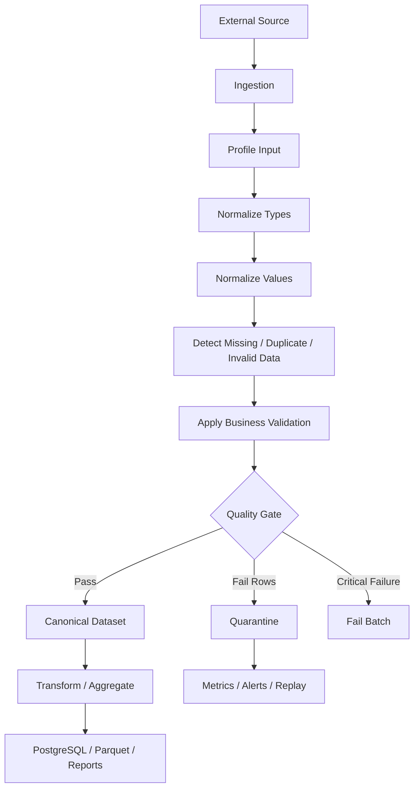

# README

## Overview

The **Data Cleaning** section covers the techniques required to turn inconsistent, incomplete, malformed, and unreliable input data into a predictable dataset suitable for transformation, aggregation, reporting, persistence, and downstream services.

In production systems, data cleaning is not simply:

```text
find bad values
    ↓
replace bad values
```

A reliable cleaning pipeline is closer to:

```text
Raw Data
   ↓
Profile
   ↓
Normalize
   ↓
Detect Invalid Data
   ↓
Clean / Correct
   ↓
Validate
   ↓
Quarantine Failures
   ↓
Canonical Dataset
   ↓
Transformation / Storage
```

The section builds from general data-quality principles into missing values, duplicates, inconsistent representations, numeric and string normalization, datetime handling, outlier detection, and explicit validation rules.

The emphasis is on preserving data meaning while making downstream processing predictable.

## Navigation

| # | File | Description |
|---|---|---|
| 01 | [01- Data Quality](./01-%20Data%20Quality.md) | Overall quality model completeness, correctness, consistency, validity, uniqueness, timeliness |
| 02 | [02- Missing Values](./02-%20Missing%20Values.md) | Missing-data model understanding, detection, and policy selection |
| 03 | [03- Isna And Notna](./03-%20Isna%20And%20Notna.md) | Missing-data detection and semantics |
| 04 | [04- Fillna](./04-%20Fillna.md) | Controlled filling of missing values |
| 05 | [05- Dropna](./05-%20Dropna.md) | Removal of missing values with defined business rules |
| 06 | [06- Duplicate Data](./06-%20Duplicate%20Data.md) | Detection and removal of repeated records |
| 07 | [07- Drop Duplicates](./07-%20Drop%20Duplicates.md) | Duplicate business key handling with retention rules |
| 08 | [08- Inconsistent Values](./08-%20Inconsistent%20Values.md) | Value canonicalization and normalization |
| 09 | [09- Type Conversion](./09-%20Type%20Conversion.md) | Reliable dtype before further cleaning |
| 10 | [10- Numeric Cleaning](./10-%20Numeric%20Cleaning.md) | Handling malformed numeric values |
| 11 | [11- String Cleaning](./11-%20String%20Cleaning.md) | Canonicalization of textual fields |
| 12 | [12- Datetime Cleaning](./12-%20Datetime%20Cleaning.md) | Reliable temporal semantics establishment |
| 13 | [13- Outlier Handling](./13-%20Outlier%20Handling.md) | Anomaly detection and flagging versus invalid record removal |
| 14 | [14- Validation Rules](./14-%20Validation%20Rules.md) | Explicit data contract validation |

## Role in the Pandas Learning Path

Data cleaning sits after:

```text
Fundamentals
        ↓
Reading and Writing Data
        ↓
Selecting and Filtering
        ↓
Data Cleaning
        ↓
Data Transformation
        ↓
Grouping and Aggregation
```

The earlier sections establish how Pandas represents and accesses data. Data Cleaning uses those capabilities to establish a reliable input contract for later transformation and analytics.

The progression is:

```text
Understand DataFrame structure
        ↓
Load external data
        ↓
Select relevant data
        ↓
Clean and validate data
        ↓
Transform canonical data
        ↓
Aggregate / combine / report
```

A common production mistake is to begin transformation before establishing data quality. This causes assumptions about types, nullability, uniqueness, and representations to spread throughout the pipeline.

## What Data Cleaning Covers

The section addresses several classes of data-quality problems:

| Area | Typical problems | Primary Pandas tools |
|---|---|---|
| Data quality | Unexpected structure and values | Inspection, boolean masks |
| Missing values | `NaN`, `NaT`, empty values | `isna()`, `fillna()`, `dropna()` |
| Duplicates | Repeated rows or keys | `duplicated()`, `drop_duplicates()` |
| Inconsistent values | Case, whitespace, aliases | `.str`, `replace()` |
| Numeric values | Strings, separators, invalid values | `to_numeric()` |
| Strings | Formatting and canonicalization | `.str`, regex |
| Datetimes | Mixed formats, timezone issues | `to_datetime()`, `.dt` |
| Outliers | Extreme or anomalous observations | Quantiles, IQR, domain rules |
| Validation | Business and structural constraints | Boolean masks, schema checks |

## Section Structure

```text
04- Data Cleaning/
│
├── 01- Data Quality.md
├── 02- Missing Values.md
├── 03- Isna And Notna.md
├── 04- Fillna.md
├── 05- Dropna.md
├── 06- Duplicate Data.md
├── 07- Drop Duplicates.md
├── 08- Inconsistent Values.md
├── 09- Type Conversion.md
├── 10- Numeric Cleaning.md
├── 11- String Cleaning.md
├── 12- Datetime Cleaning.md
├── 13- Outlier Handling.md
├── 14- Validation Rules.md
└── README.md
```

The topics are intentionally ordered so that later cleaning techniques build on earlier concepts.

## Data Cleaning Progression

### Data Quality

`01- Data Quality.md` establishes the overall quality model.

It introduces:

```text
Completeness
Correctness
Consistency
Validity
Uniqueness
Timeliness
```

The key engineering idea is that data quality should be measured against an explicit contract rather than a vague assumption that the data "looks correct."

### Missing Values

`02- Missing Values.md`, `03- Isna And Notna.md`, `04- Fillna.md`, and `05- Dropna.md` establish the missing-data model.

The progression is:

```text
Understand missing data
        ↓
Detect missing data
        ↓
Choose an appropriate policy
        ↓
Fill or remove values when justified
```

The important distinction is:

```text
Missing
    ≠
Zero
    ≠
Empty string
    ≠
Unknown
    ≠
Not applicable
```

These states should not be collapsed without a business reason.

### Duplicate Data

`06- Duplicate Data.md` and `07- Drop Duplicates.md` cover detection and removal of repeated records.

The section distinguishes:

```text
Duplicate row
```

from:

```text
Duplicate business key
```

and emphasizes that duplicate handling requires a defined business identity.

For example:

```text
order_id
```

may be unique in a snapshot table but not unique in an event table.

Retention rules such as:

```python
keep="first"
keep="last"
```

must therefore be tied to an explicit ordering strategy.

### Inconsistent Values

`08- Inconsistent Values.md` focuses on values that are logically equivalent but represented differently.

Examples:

```text
Mumbai
mumbai
 Mumbai
MUMBAI
```

The preferred flow is:

```text
Normalize
    ↓
Canonicalize
    ↓
Validate
```

Explicit mappings are generally safer than uncontrolled transformations because they preserve unknown values and make business rules auditable.

### Type Conversion

`09- Type Conversion.md` establishes reliable dtypes before further cleaning.

Important tools include:

```python
pd.to_numeric()
pd.to_datetime()
Series.astype()
DataFrame.convert_dtypes()
```

The main principle is:

```text
Semantic type
    >
appearance of the value
```

For example:

```text
Phone number
    → string

Customer ID
    → string

Quantity
    → integer

Amount
    → numeric

Created timestamp
    → timezone-aware datetime
```

Converting everything based on how the value looks can corrupt identifiers and business semantics.

### Numeric Cleaning

`10- Numeric Cleaning.md` handles numeric values that are syntactically inconsistent or malformed.

Examples include:

```text
"1,000"
"$1,250.50"
" 500 "
"unknown"
"15%"
```

The recommended workflow is:

```text
Normalize representation
        ↓
Parse numeric value
        ↓
Detect conversion failures
        ↓
Validate numeric domain
```

Parsing success does not imply business validity.

For example:

```text
-100
```

can be successfully parsed as a number while still being invalid for a field that requires:

```text
amount >= 0
```

### String Cleaning

`11- String Cleaning.md` covers canonicalization of textual fields.

Typical operations include:

```python
.str.strip()
.str.lower()
.str.casefold()
.str.replace()
.str.contains()
.str.extract()
```

The section also covers:

```text
Whitespace
Identifiers
Emails
Phone numbers
Postal codes
Categories
Unicode
Regex
Canonical values
```

The central engineering principle is:

```text
Clean only according to field semantics.
```

An identifier, display name, free-text comment, and category should not be normalized using the same rules.

### Datetime Cleaning

`12- Datetime Cleaning.md` establishes reliable temporal semantics.

The major concerns are:

```text
Parsing
Timezone awareness
UTC normalization
Date-only values
Epoch timestamps
Ambiguous formats
Invalid dates
Business timezones
Temporal boundaries
```

For distributed systems, an important policy is often:

```text
System event time
    → UTC

Business-local reporting
    → explicit IANA timezone
```

The distinction between:

```python
tz_localize()
```

and:

```python
tz_convert()
```

is particularly important.

### Outlier Handling

`13- Outlier Handling.md` explains how to identify unusual observations without assuming that every extreme value is invalid.

The section covers:

```text
Business thresholds
Quantiles
IQR
Z-score
Modified z-score
Time-series anomalies
Group-specific thresholds
Flagging
Quarantine
Distribution shifts
```

The key principle is:

```text
Outlier
    ≠
Invalid record
```

A large financial transaction, enterprise order, or traffic spike may be perfectly legitimate.

### Validation Rules

`14- Validation Rules.md` turns cleaning into an explicit data contract.

Validation operates at multiple levels:

```text
Schema
    ↓
Field
    ↓
Row
    ↓
Cross-field
    ↓
Cross-table
    ↓
Dataset
    ↓
Pipeline
```

Examples:

```text
Required column exists
amount >= 0
quantity > 0
completed_at >= created_at
order_id is unique
customer_id exists
rejection rate < threshold
```

This is the final control layer before canonical data enters later pipeline stages.

## Cleaning vs Validation

These concepts should remain separate throughout the section.

```text
Cleaning
    ↓
Changes representation

Validation
    ↓
Determines whether representation is acceptable
```

Example:

```python
orders["amount"] = pd.to_numeric(
    orders["amount"],
    errors="coerce",
)
```

This performs conversion.

Then:

```python
valid_amount = (
    orders["amount"].notna()
    & orders["amount"].ge(0)
)
```

This performs validation.

A mature pipeline should not hide business decisions inside generic cleaning helpers.

## Recommended Data Cleaning Pipeline

A production Pandas workflow generally follows:



The exact architecture varies by application, but the boundary between raw, cleaned, and validated data should remain explicit.

## Canonical Data

A canonical dataset is a dataset where important representations have been standardized.

For example:

```text
Raw:
" 100 "
"1,000"
"01"
" Mumbai "
"User@Example.COM"

Canonical:
100
1000
"01"
"Mumbai"
"user@example.com"
```

Canonicalization should not mean aggressive data destruction.

Prefer preserving:

```text
raw value
canonical value
```

when auditability or traceability matters.

## Example: E-Commerce Orders

Consider a source dataset:

```text
order_id | customer_id | amount    | quantity | status       | created_at
---------|-------------|-----------|----------|--------------|------------------------
ORD-001  | CUST-1      | "$1,250"  | "2"      | " PAID "     | "2026-09-10T10:00:00Z"
ORD-002  | CUST-2      | "unknown" | "3"      | "completed"  | "invalid"
ORD-003  | CUST-1      | "500"     | ""       | "paid"       | "2026-09-10T11:00:00Z"
```

A cleaning pipeline may perform:

```text
amount
    → numeric

quantity
    → nullable integer

status
    → canonical enum

created_at
    → UTC datetime

empty quantity
    → missing

invalid created_at
    → validation failure

unknown amount
    → conversion failure
```

Only after these operations should the pipeline decide which records are publishable.

## Reusable Cleaning Pattern

A practical implementation separates stages:

```python
import pandas as pd


def normalize_orders(
    orders: pd.DataFrame,
) -> pd.DataFrame:
    result = orders.copy()

    result["order_id"] = (
        result["order_id"]
        .astype("string")
        .str.strip()
    )

    result["customer_id"] = (
        result["customer_id"]
        .astype("string")
        .str.strip()
    )

    result["status"] = (
        result["status"]
        .astype("string")
        .str.strip()
        .str.casefold()
    )

    result["amount"] = pd.to_numeric(
        result["amount"],
        errors="coerce",
    )

    result["quantity"] = (
        pd.to_numeric(
            result["quantity"],
            errors="coerce",
        )
        .astype("Int64")
    )

    result["created_at"] = pd.to_datetime(
        result["created_at"],
        errors="coerce",
        utc=True,
    )

    return result
```

Validation then operates on the normalized result:

```python
def validate_orders(
    orders: pd.DataFrame,
) -> pd.Series:
    return (
        orders["order_id"].notna()
        & orders["customer_id"].notna()
        & orders["amount"].notna()
        & orders["amount"].ge(0)
        & orders["quantity"].notna()
        & orders["quantity"].gt(0)
        & orders["status"].isin(
            {
                "pending",
                "paid",
                "completed",
                "cancelled",
            }
        )
        & orders["created_at"].notna()
    )
```

This separation improves testing, debugging, and maintainability.

## Invalid Rows and Quarantine

Do not silently discard rejected rows.

Prefer:

```python
valid = validate_orders(
    normalized_orders
)

clean = normalized_orders.loc[
    valid
].copy()

rejected = normalized_orders.loc[
    ~valid
].copy()
```

The rejected dataset can be stored separately:

```text
S3 quarantine
PostgreSQL validation table
Dead-letter workflow
Operational review queue
```

A quarantine dataset should contain enough metadata to support replay and diagnosis.

## Data Quality Metrics

A production cleaning pipeline should expose metrics such as:

```text
input_rows
clean_rows
rejected_rows
missing_field_rate
conversion_failure_rate
duplicate_rate
invalid_enum_rate
invalid_datetime_rate
outlier_rate
```

Example:

```python
metrics = {
    "input_rows": len(normalized_orders),
    "valid_rows": int(valid.sum()),
    "rejected_rows": int((~valid).sum()),
}

metrics["rejection_rate"] = (
    metrics["rejected_rows"]
    / metrics["input_rows"]
    if metrics["input_rows"]
    else 0.0
)
```

These metrics can be sent to:

```text
CloudWatch
Prometheus
Datadog
OpenTelemetry-compatible systems
```

## Integration with Backend Systems

Data cleaning commonly sits between external systems and authoritative storage.

### REST APIs

Typical flow:

```text
REST API
    ↓
JSON payload
    ↓
Pandas DataFrame
    ↓
String / numeric / datetime cleaning
    ↓
Validation
    ↓
Canonical dataset
```

### PostgreSQL

Typical flow:

```text
PostgreSQL
    ↓
SQL extraction
    ↓
Pandas cleaning
    ↓
Transformation / reporting
```

For persistence:

```text
Pandas validation
    +
PostgreSQL constraints
```

provide defense in depth.

### Kafka

Event processing may look like:

```text
Kafka
    ↓
Consumer
    ↓
Pandas batch
    ↓
Schema + datetime + string validation
    ↓
Valid events
    +
Quarantine / dead-letter records
```

Event timestamps should distinguish:

```text
event_time
ingested_at
processed_at
```

rather than treating all timestamps as interchangeable.

### Django and FastAPI

Pandas typically belongs in:

```text
Batch imports
ETL jobs
Reporting
Data migrations
Analytics preparation
Backfills
```

while Django/FastAPI handles request-bound schema validation.

A useful boundary is:

```text
Application validation
    ↓
Persistent / batch validation
```

rather than making Pandas the only validation layer.

## Performance and Scalability

Data cleaning can become one of the most expensive stages of a pipeline because it often touches every row.

Prefer:

```text
Vectorized operations
Controlled dtypes
Required-column projection
Single-pass normalization
Minimal copying
Chunked processing
Parquet for repeated downstream reads
```

Example:

```python
for chunk in pd.read_csv(
    "orders.csv",
    usecols=[
        "order_id",
        "customer_id",
        "amount",
        "quantity",
        "status",
    ],
    chunksize=100_000,
):
    chunk["amount"] = pd.to_numeric(
        chunk["amount"],
        errors="coerce",
    )

    process_chunk(chunk)
```

For datasets that exceed practical Pandas memory limits, consider moving more processing into:

```text
PostgreSQL
DuckDB
Polars
Spark / PySpark
AWS Glue
Data warehouse SQL
```

The goal is not to use Pandas for every workload, but to use it where its in-memory DataFrame model provides an appropriate engineering trade-off.

## Common Anti-Patterns

### Cleaning Everything with `apply()`

Avoid:

```python
orders["amount"] = orders[
    "amount"
].apply(
    lambda value: clean_amount(value)
)
```

when a native vectorized operation can express the same transformation.

Prefer:

```python
orders["amount"] = pd.to_numeric(
    orders["amount"],
    errors="coerce",
)
```

### Filling Every Missing Value

Avoid:

```python
orders = orders.fillna(0)
```

This can corrupt semantics for:

```text
IDs
timestamps
financial fields
categorical values
optional relationships
```

### Dropping Every Invalid Row

Avoid:

```python
orders = orders.loc[
    valid
]
```

without tracking what was removed.

Prefer:

```text
valid dataset
+
rejected dataset
+
validation metrics
```

### Treating Statistical Outliers as Errors

Avoid deleting every value above a percentile or IQR threshold.

First determine whether the value is:

```text
Valid extreme
Invalid record
Source corruption
Business anomaly
```

### Converting Identifiers to Numeric Types

Avoid:

```python
pd.to_numeric(
    customers["customer_id"]
)
```

for identifier fields.

Identifiers should preserve:

```text
Leading zeros
Prefix
Exact representation
Case semantics
```

## Testing Strategy

Data cleaning tests should validate behavior rather than merely successful execution.

Recommended coverage includes:

```text
Valid inputs
Missing values
Empty strings
Malformed inputs
Unexpected dtypes
Duplicate records
Duplicate business keys
Boundary values
Invalid categories
Invalid timestamps
Timezone behavior
Out-of-range values
Cross-field constraints
Empty DataFrames
Large-input behavior where relevant
```

For example:

```python
def test_invalid_amount_is_rejected() -> None:
    orders = pd.DataFrame(
        {
            "amount": [
                100.0,
                -10.0,
            ]
        }
    )

    valid = (
        orders["amount"].ge(0)
    )

    assert valid.tolist() == [
        True,
        False,
    ]
```

The test verifies a business rule rather than only exercising the code path.

## Maintainability Principles

A maintainable cleaning layer should:

```text
Normalize at clear boundaries
Use reusable functions
Prefer explicit business rules
Avoid hidden mutations
Preserve source lineage where required
Use named validation masks
Record rejection reasons
Keep configuration external where appropriate
Test edge cases
Measure quality metrics
```

Avoid creating a single giant cleaning function that:

```text
Reads files
Calls APIs
Cleans values
Validates records
Writes the database
Sends alerts
```

Separate responsibilities so that each stage can be tested independently.

## Relationship to Later Sections

Data Cleaning prepares the data for the rest of the Pandas playbook.

```text
Data Cleaning
      ↓
Data Transformation
      ↓
Grouping and Aggregation
      ↓
Combining Data
      ↓
Sorting / Ranking / Statistics
      ↓
Strings and Datetime
      ↓
Performance and Memory
      ↓
Backend and Data Engineering
```

Examples:

```text
Clean types
    → enables reliable filtering

Normalize strings
    → enables reliable joins

Clean datetimes
    → enables reliable time-series operations

Remove or classify duplicates
    → protects aggregates

Validate numeric values
    → protects reports

Establish canonical data
    → simplifies ETL
```

The quality of later operations is constrained by the quality of the data entering them.

## Recommended Learning Order

Use the following order when studying this section:

```text
Data Quality
    ↓
Missing Values
    ↓
Isna / Notna
    ↓
Fillna
    ↓
Dropna
    ↓
Duplicate Data
    ↓
Drop Duplicates
    ↓
Inconsistent Values
    ↓
Type Conversion
    ↓
Numeric Cleaning
    ↓
String Cleaning
    ↓
Datetime Cleaning
    ↓
Outlier Handling
    ↓
Validation Rules
```

The progression moves from basic quality concepts toward production-grade data contracts.

## Production Checklist

Before considering a cleaning pipeline production-ready, verify:

- Raw input assumptions are documented.
- Required columns are checked.
- Dtypes are normalized explicitly.
- Missing-value semantics are defined.
- Duplicate semantics are defined using business keys.
- Numeric parsing failures are measurable.
- String normalization follows field-specific rules.
- Datetime timezone semantics are explicit.
- Business constraints are separated from formatting cleanup.
- Outliers are investigated or flagged rather than automatically deleted.
- Invalid records can be quarantined and replayed.
- Rejection rates and rule failures are observable.
- Transformations are deterministic and preferably idempotent.
- Tests cover boundaries and failure conditions.
- Large datasets use vectorization, efficient dtypes, or chunk processing where appropriate.
- PostgreSQL constraints remain authoritative for persisted data.
- API and event schemas are aligned with the cleaning contract.
- Sensitive rejected data is handled securely.

## Key Takeaways

- Data cleaning establishes the **canonical, trustworthy input contract** required by later Pandas transformations and production data workflows.
- Separate **normalization, cleaning, validation, and transformation** so that data-quality decisions remain explicit and testable.
- Treat missing values, duplicates, numeric values, strings, datetimes, and outliers according to their **business semantics**, not generic cleanup rules.
- Production cleaning should preserve traceability through **rejected records, validation reasons, quality metrics, and versioned rules** where required.
- Use vectorized Pandas operations and explicit schemas at moderate scale, but move to database or distributed processing when the workload exceeds Pandas' practical execution model.