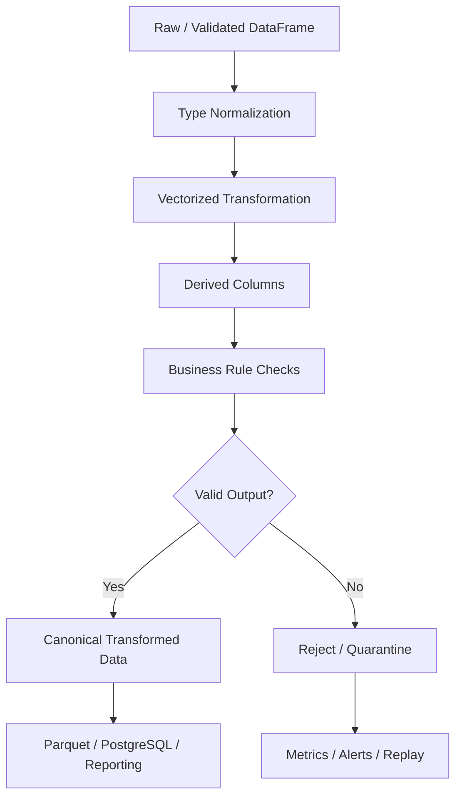

# 01- Assignment And Transformation

## Overview

Pandas transformation is the process of deriving, modifying, or restructuring DataFrame and Series values to produce the dataset required by the next stage of a workflow.

The most fundamental transformation mechanism is assignment:

```python
orders["total_amount"] = (
    orders["quantity"]
    * orders["unit_price"]
)
```

This operation takes existing columns, computes a vectorized result, and assigns the result to a new or existing column.

Assignment and transformation are foundational because nearly every Pandas pipeline eventually needs to:

```text
Create derived columns
Normalize values
Overwrite incorrect representations
Apply business calculations
Create flags
Prepare data for joins
Prepare data for reporting
```

The broader transformation model is:

```text
Input DataFrame
      ↓
Select required columns
      ↓
Compute / transform values
      ↓
Assign results
      ↓
Validate output
      ↓
Pass canonical DataFrame to next stage
```

This topic establishes the mechanics and engineering principles used by the later transformation topics such as `rename`, `astype`, `map`, `apply`, `replace`, `where`, `assign`, `melt`, `pivot`, and `explode`.

## What Assignment Means in Pandas

Pandas assignment associates a value with:

```text
A column
A row
A scalar cell
A selected subset
The entire DataFrame
```

Examples:

```python
orders["status"] = "pending"
```

```python
orders["total"] = (
    orders["quantity"]
    * orders["unit_price"]
)
```

```python
orders.loc[
    orders["status"].eq("cancelled"),
    "refund_amount",
] = 0
```

Assignment is not merely Python variable assignment. Pandas must align the incoming value with the target DataFrame's index and shape.

That alignment behavior is one of the most important concepts for reliable DataFrame transformations.

## Column Assignment

The most common pattern is:

```python
orders["total_amount"] = (
    orders["quantity"]
    * orders["unit_price"]
)
```

If `total_amount` does not exist, Pandas creates it.

If it already exists, its values are replaced.

The result is a DataFrame mutation.

## Creating Derived Columns

Derived columns should generally use vectorized expressions:

```python
orders["subtotal"] = (
    orders["quantity"]
    * orders["unit_price"]
)

orders["discount_amount"] = (
    orders["subtotal"]
    * orders["discount_rate"]
)

orders["total_amount"] = (
    orders["subtotal"]
    - orders["discount_amount"]
)
```

This is preferable to explicit Python loops because Pandas can operate on the entire Series efficiently.

## Assignment with Constants

A constant can be assigned to an entire column:

```python
orders["source"] = "erp"
```

Every row receives the same value.

This is useful for:

```text
Source-system identifiers
Pipeline batch labels
Environment metadata
Schema versions
Processing flags
```

For example:

```python
orders["pipeline_version"] = "2026-09"
```

Avoid embedding mutable operational metadata directly into business columns unless it is intentionally part of the output schema.

## Assigning a Series

A Series can be assigned:

```python
orders["risk_score"] = risk_scores
```

The important detail is that Pandas can align the Series by index.

Consider:

```python
risk_scores = pd.Series(
    [0.8, 0.2],
    index=[101, 100],
)
```

If:

```python
orders.index = [100, 101]
```

assignment aligns by labels rather than blindly taking positional values.

This is a major difference from many list-based operations.

## Index Alignment

Consider:

```python
orders = pd.DataFrame(
    {
        "order_id": ["ORD-1", "ORD-2"],
        "amount": [100, 200],
    },
    index=[10, 20],
)

discounts = pd.Series(
    [10, 20],
    index=[20, 10],
)
```

Then:

```python
orders["discount"] = discounts
```

produces:

```text
index  amount  discount
10     100     20
20     200     10
```

The values are aligned by index labels.

This is one of the most important behaviors to understand before assigning Series objects.

## Assignment from NumPy Arrays and Lists

Lists and NumPy arrays are generally interpreted positionally when their length matches the target axis.

```python
orders["priority"] = [
    "high",
    "normal",
]
```

The values are assigned by row position.

Unlike a Series, a plain list has no index labels to align against.

Use this distinction deliberately.

## Assignment Behavior Comparison

| Input | Alignment behavior | Typical risk |
|---|---|---|
| Scalar | Broadcast to all rows | Usually low |
| List | Positional | Length mismatch |
| NumPy array | Positional | Length mismatch |
| Series | Index-aligned | Unexpected index alignment |
| DataFrame | Column/index aligned | Shape and label mismatch |

A common production bug is assuming every assignment is positional.

## Shape Requirements

For positional assignment:

```python
orders["priority"] = [
    "high",
    "normal",
    "low",
]
```

the list length must match the number of rows.

Otherwise Pandas raises an error instead of silently truncating or expanding the data.

This is desirable because a silent shape mismatch could corrupt row-level data.

## Assigning Multiple Columns

Multiple columns can be assigned from a DataFrame:

```python
orders[
    [
        "net_amount",
        "tax_amount",
    ]
] = calculated_amounts
```

The number and structure of columns must be compatible.

For maintainability, explicitly naming derived columns often makes the transformation contract easier to understand.

## Tuple Assignment

For calculations producing multiple aligned columns:

```python
orders[
    [
        "subtotal",
        "tax_amount",
    ]
] = pd.DataFrame(
    {
        "subtotal": (
            orders["quantity"]
            * orders["unit_price"]
        ),
        "tax_amount": orders["tax"],
    },
    index=orders.index,
)
```

Explicit index assignment is useful when the source DataFrame can have a non-default index.

## Row-Level Assignment with `loc`

Use `.loc` for conditional assignment:

```python
orders.loc[
    orders["amount"].gt(10_000),
    "review_required",
] = True
```

This is preferable to trying to assign through an independently filtered intermediate object.

It clearly expresses:

```text
Condition
+
Target column
+
New value
```

## Conditional Assignment

Example:

```python
orders["risk_level"] = "low"

orders.loc[
    orders["amount"].ge(10_000),
    "risk_level",
] = "medium"

orders.loc[
    orders["amount"].ge(100_000),
    "risk_level",
] = "high"
```

Order matters.

The more specific condition should be evaluated after the broader one when later assignments intentionally override earlier values.

For maintainability, `np.select()` can be cleaner when many mutually exclusive conditions exist.

## `np.select()` for Multiple Conditions

```python
import numpy as np

conditions = [
    orders["amount"].ge(100_000),
    orders["amount"].ge(10_000),
]

choices = [
    "high",
    "medium",
]

orders["risk_level"] = np.select(
    conditions,
    choices,
    default="low",
)
```

This makes the rule structure explicit.

Use it when multiple categories can be derived from mutually prioritized conditions.

## Boolean Flags

A common transformation is a boolean feature:

```python
orders["is_high_value"] = (
    orders["amount"].ge(10_000)
)
```

This produces a boolean Series aligned with the DataFrame.

Boolean flags are useful for:

```text
Validation
Filtering
Reporting
Feature derivation
Operational metrics
```

## Missing Values During Assignment

Derived calculations may produce missing values:

```python
orders["total_amount"] = (
    orders["quantity"]
    * orders["unit_price"]
)
```

If either input is missing, the resulting value may also be missing.

Do not automatically fill derived values with zero.

For example:

```text
missing unit price
    →
unknown total

not:

unknown unit price
    →
zero total
```

Missing-value semantics should be established before assigning derived fields.

## Dtype Implications

Assignment can change a column's dtype.

For example:

```python
orders["quantity"] = (
    orders["quantity"]
    .astype("Int64")
)
```

Later:

```python
orders.loc[
    orders["quantity"].isna(),
    "quantity",
] = 0
```

The resulting dtype depends on the values and the Pandas dtype system being used.

For predictable pipelines, explicitly define dtypes at the normalization boundary rather than assuming assignment will always preserve the intended schema.

## Assigning Incompatible Values

Consider:

```python
orders["quantity"] = (
    orders["quantity"]
    .astype("Int64")
)

orders.loc[
    orders["quantity"].eq(0),
    "quantity",
] = "unknown"
```

This conflicts with integer semantics and can cause dtype changes or failures depending on the Pandas version and dtype involved.

Do not mix fundamentally different semantic types in one column.

Prefer:

```text
quantity → numeric nullable field

quantity_status → categorical explanation
```

## Transforming Existing Columns

Assignment can normalize an existing column:

```python
customers["email"] = (
    customers["email"]
    .astype("string")
    .str.strip()
    .str.casefold()
)
```

This replaces the existing representation with the canonical representation.

When source preservation matters:

```python
customers["email_raw"] = (
    customers["email"]
)

customers["email"] = (
    customers["email"]
    .astype("string")
    .str.strip()
    .str.casefold()
)
```

## Assignment vs `assign()`

Both can derive columns.

Direct assignment:

```python
orders["subtotal"] = (
    orders["quantity"]
    * orders["unit_price"]
)
```

`assign()`:

```python
orders = orders.assign(
    subtotal=(
        orders["quantity"]
        * orders["unit_price"]
    )
)
```

The practical difference is usually style and pipeline structure.

| Approach | Behavior | Best use |
|---|---|---|
| Direct assignment | Mutates existing DataFrame | Step-by-step ETL |
| `assign()` | Returns a DataFrame with new/updated columns | Method chains and functional-style pipelines |

Use one consistently within a codebase.

## Method Chaining

`assign()` is particularly useful when transformations naturally form a pipeline:

```python
clean_orders = (
    orders
    .assign(
        subtotal=(
            orders["quantity"]
            * orders["unit_price"]
        )
    )
    .assign(
        total_amount=lambda df: (
            df["subtotal"]
            - df["discount_amount"]
        )
    )
)
```

The lambda receives the DataFrame produced by the previous step.

This is useful when later expressions depend on columns created earlier in the chain.

## Avoiding Repeated DataFrame Names

A chain can make a transformation pipeline easier to read:

```python
processed = (
    orders
    .assign(
        subtotal=lambda df: (
            df["quantity"]
            * df["unit_price"]
        ),
    )
    .loc[
        lambda df: df["subtotal"].gt(0)
    ]
)
```

This can improve readability when the operations form one logical transformation.

Do not use method chaining simply to make code shorter.

## Transformation Ordering

Transformation order can change results.

For example:

```text
clean
    ↓
filter
    ↓
derive
```

can differ from:

```text
derive
    ↓
filter
    ↓
clean
```

A useful pipeline rule is:

```text
Normalize input
    ↓
Validate required data
    ↓
Filter invalid records
    ↓
Derive business fields
    ↓
Publish transformed data
```

The correct ordering depends on the business semantics.

## Overwriting Columns

This:

```python
orders["amount"] = (
    orders["amount"] * 1.18
)
```

replaces the original values.

That may be inappropriate if:

```text
amount is an authoritative source field
```

Prefer:

```python
orders["amount_with_tax"] = (
    orders["amount"] * 1.18
)
```

when the original field has independent business meaning.

Overwriting should be intentional.

## Derived Columns vs Canonical Columns

A useful naming distinction is:

```text
amount
    → source/canonical business field

tax_amount
    → derived business field

is_valid_amount
    → validation field

amount_raw
    → source representation
```

This makes transformation lineage easier to understand.

## Conditional Replacement with `where()`

Conditional assignment can also use `where()`:

```python
orders["amount"] = (
    orders["amount"]
    .where(
        orders["amount"].ge(0)
    )
)
```

Values failing the condition are replaced with missing values.

This is useful when the transformation can be expressed as:

```text
keep if condition
otherwise missing/replacement
```

The operation returns a new Series.

## Conditional Replacement with `mask()`

`mask()` is the conceptual inverse:

```python
orders["amount"] = (
    orders["amount"]
    .mask(
        orders["amount"].lt(0)
    )
)
```

Values where the condition is `True` are replaced.

These operations are useful for controlled transformations without explicit loops.

## `map()` for Element-Wise Mapping

For one-to-one categorical mapping:

```python
status_mapping = {
    "paid": "completed",
    "complete": "completed",
    "pending": "pending",
}

orders["status"] = (
    orders["status"]
    .map(status_mapping)
)
```

Be aware that unmapped values become missing.

If unknown values should remain unchanged:

```python
orders["status"] = (
    orders["status"]
    .replace(status_mapping)
)
```

The distinction becomes important in data-cleaning pipelines.

## `apply()` for Custom Transformations

`apply()` can be used when the transformation cannot be expressed naturally with existing vectorized APIs.

Example:

```python
def normalize_reference(value: str) -> str:
    return value.strip().upper()


orders["reference"] = (
    orders["reference"]
    .astype("string")
    .apply(normalize_reference)
)
```

For standard string operations, prefer `.str`.

For numerical calculations, prefer vectorized arithmetic.

`apply()` should not be the default solution for every transformation.

## Assignment with Datetime Transformations

Example:

```python
orders["created_at"] = pd.to_datetime(
    orders["created_at"],
    errors="coerce",
    utc=True,
)

orders["order_date"] = (
    orders["created_at"]
    .dt.tz_convert("Asia/Kolkata")
    .dt.date
)
```

This creates a canonical timestamp and a derived business date.

## Assignment with Numeric Transformations

```python
orders["amount"] = pd.to_numeric(
    orders["amount"],
    errors="coerce",
)

orders["amount_with_tax"] = (
    orders["amount"]
    * 1.18
)
```

Explicit normalization before calculation keeps the transformation predictable.

## Assignment with String Transformations

```python
customers["email"] = (
    customers["email"]
    .astype("string")
    .str.strip()
    .str.casefold()
)

customers["email_domain"] = (
    customers["email"]
    .str.rsplit(
        "@",
        n=1,
    )
    .str[-1]
)
```

Derived string fields can be useful for:

```text
Segmentation
Reporting
Validation
Routing
```

## Assignment and Data Validation

A transformation often creates the values required for validation.

Example:

```python
orders["total_amount"] = (
    orders["quantity"]
    * orders["unit_price"]
)

orders["valid_total"] = (
    orders["total_amount"].notna()
    & orders["total_amount"].ge(0)
)
```

Do not hide validation inside calculations that silently convert invalid values.

Keep:

```text
derived value
```

and:

```text
validation status
```

conceptually separate.

## Assignment and Business Rules

Suppose a shipping fee depends on subtotal:

```python
orders["shipping_fee"] = 0.0

orders.loc[
    orders["subtotal"].lt(100),
    "shipping_fee",
] = 10.0

orders.loc[
    orders["subtotal"].ge(100),
    "shipping_fee",
] = 0.0
```

This expresses business logic directly.

For complex business rules, consider isolating the rule in a named function rather than embedding dozens of conditions in one DataFrame expression.

## Transformation Functions

A reusable transformation function can encapsulate a business stage:

```python
def calculate_order_amounts(
    orders: pd.DataFrame,
) -> pd.DataFrame:
    result = orders.copy()

    result["subtotal"] = (
        result["quantity"]
        * result["unit_price"]
    )

    result["discount_amount"] = (
        result["subtotal"]
        * result["discount_rate"]
    )

    result["total_amount"] = (
        result["subtotal"]
        - result["discount_amount"]
    )

    return result
```

This provides:

```text
Clear inputs
Clear outputs
Testability
Isolation
Reusability
```

## Avoiding Accidental Mutation

A function should make its ownership semantics obvious.

Prefer:

```python
def transform_orders(
    orders: pd.DataFrame,
) -> pd.DataFrame:
    result = orders.copy()

    result["total"] = (
        result["quantity"]
        * result["unit_price"]
    )

    return result
```

This protects the caller's DataFrame.

For very large DataFrames, copying the entire structure may be expensive. In such cases, define an explicit mutation contract instead of accidentally relying on either behavior.

## Copy Cost

A DataFrame copy can consume significant memory:

```python
result = orders.copy()
```

especially when the DataFrame contains:

```text
Millions of rows
Many columns
Large strings
Object data
```

Use copies deliberately.

Transformation architecture should balance:

```text
Safety
Memory
Performance
Ownership clarity
```

## Assignment and View Semantics

Filtered operations can produce objects whose relationship to the source is not something production code should rely on.

Avoid patterns such as:

```python
high_value = orders[
    orders["amount"].gt(10_000)
]

high_value["priority"] = "high"
```

Prefer:

```python
high_value = orders.loc[
    orders["amount"].gt(10_000)
].copy()

high_value["priority"] = "high"
```

This makes the ownership explicit.

## Avoiding Chained Assignment

Avoid:

```python
orders[
    orders["status"].eq("pending")
]["priority"] = "high"
```

Use:

```python
orders.loc[
    orders["status"].eq("pending"),
    "priority",
] = "high"
```

The `.loc` form explicitly identifies the target rows and target column.

## Assignment in a Pipeline

A production ETL function might look like:

```python
def transform_orders(
    orders: pd.DataFrame,
) -> pd.DataFrame:
    result = orders.copy()

    result["amount"] = pd.to_numeric(
        result["amount"],
        errors="coerce",
    )

    result["quantity"] = (
        pd.to_numeric(
            result["quantity"],
            errors="coerce",
        )
        .astype("Int64")
    )

    result["subtotal"] = (
        result["quantity"]
        * result["amount"]
    )

    result["is_high_value"] = (
        result["subtotal"].ge(10_000)
    )

    return result
```

The transformation stages are clear:

```text
normalize
    ↓
derive
    ↓
classify
```

## Transformation Lineage

For important pipelines, identify where derived values came from.

Example:

```text
total_amount
    ← subtotal
    ← quantity × unit_price
```

This can be represented in documentation or code naming.

For complicated transformations, keep intermediate columns temporarily rather than compressing all logic into one expression.

## Avoid Overly Clever One-Liners

This is technically concise:

```python
orders["total"] = orders["q"] * orders["p"] * (1 - orders["d"]) + orders["tax"]
```

but readability can suffer.

Prefer:

```python
orders["subtotal"] = (
    orders["quantity"]
    * orders["unit_price"]
)

orders["discount_amount"] = (
    orders["subtotal"]
    * orders["discount_rate"]
)

orders["total_amount"] = (
    orders["subtotal"]
    - orders["discount_amount"]
    + orders["tax_amount"]
)
```

Intermediate columns make business logic visible and easier to test.

## Transformation with Null-Aware Logic

Consider:

```python
orders["discount_amount"] = (
    orders["subtotal"]
    * orders["discount_rate"]
)
```

If either field is missing, the result is typically missing.

If missing discount means "no discount" according to the business model, normalize that assumption explicitly:

```python
discount_rate = (
    orders["discount_rate"]
    .fillna(0)
)

orders["discount_amount"] = (
    orders["subtotal"]
    * discount_rate
)
```

This decision should be documented because it changes business semantics.

## Assignment and Duplicate Rows

Transformation does not resolve duplicate business records.

If:

```text
order_id
```

is duplicated, assigning:

```python
orders["total_amount"] = ...
```

calculates a value for every row.

It does not establish whether the dataset contains the correct number of orders.

Duplicate validation should remain a separate concern.

## Transformation Before or After Deduplication

The correct order depends on semantics.

For a current-state customer table:

```text
deduplicate latest record
    ↓
transform canonical customer
```

For event data:

```text
transform each event
    ↓
aggregate events
```

Do not apply a universal rule to every dataset.

## Assignment and Grouped Data

Group-level metrics can be assigned back to rows using `transform()`:

```python
orders["customer_total"] = (
    orders
    .groupby("customer_id")["amount"]
    .transform("sum")
)
```

Every order receives its customer's total.

This is different from `agg()`:

```python
customer_totals = (
    orders
    .groupby("customer_id", as_index=False)
    .agg(
        customer_total=(
            "amount",
            "sum",
        )
    )
)
```

`transform()` preserves the original row structure, which makes it useful for row-level feature creation.

## Assignment and Aggregation

A common pattern is:

```python
orders["customer_total"] = (
    orders
    .groupby("customer_id")["amount"]
    .transform("sum")
)

orders["customer_share"] = (
    orders["amount"]
    / orders["customer_total"]
)
```

This enables per-row calculations while preserving the original DataFrame granularity.

## Assignment and SQL

When transforming data extracted from PostgreSQL:

```python
orders = pd.read_sql_query(
    query,
    connection,
)

orders["amount"] = pd.to_numeric(
    orders["amount"],
    errors="coerce",
)
```

Use SQL pushdown when the transformation is naturally expressed in SQL and moving large raw datasets into Pandas would be wasteful.

Use Pandas when the transformation is better handled in Python or is part of a larger DataFrame-oriented pipeline.

## Assignment and REST APIs

API payloads commonly need normalization before derived fields are calculated:

```python
orders["amount"] = pd.to_numeric(
    orders["amount"],
    errors="coerce",
)

orders["quantity"] = (
    pd.to_numeric(
        orders["quantity"],
        errors="coerce",
    )
    .astype("Int64")
)

orders["subtotal"] = (
    orders["quantity"]
    * orders["amount"]
)
```

The transformation stage should assume that the ingestion stage has already established the basic schema.

## Assignment and Kafka

For event-processing workloads:

```python
events["event_time"] = pd.to_datetime(
    events["event_time"],
    errors="coerce",
    utc=True,
)

events["processing_lag_seconds"] = (
    events["processed_at"]
    - events["event_time"]
).dt.total_seconds()
```

This is useful for monitoring event latency.

Do not use transformed fields to replace authoritative event-time data unless the data contract explicitly allows it.

## Transformation and Persistence

Before writing to PostgreSQL or Parquet, validate the transformed schema:

```python
required_columns = {
    "order_id",
    "customer_id",
    "subtotal",
    "total_amount",
}

missing = (
    required_columns
    - set(orders.columns)
)

if missing:
    raise ValueError(
        f"Missing output columns: "
        f"{sorted(missing)}"
    )
```

Persistence should operate on a known output contract.

## Production Transformation Contract

A transformation stage should ideally define:

```text
Input columns
Input dtypes
Required columns
Output columns
Output dtypes
Nullability
Business assumptions
Side effects
Mutation contract
```

For example:

```text
Input:
    quantity: Int64
    unit_price: float64

Output:
    subtotal: float64
    total_amount: float64
    is_high_value: boolean
```

This makes transformations easier to maintain across services and teams.

## Performance Considerations

Prefer vectorized expressions:

```python
orders["total"] = (
    orders["quantity"]
    * orders["unit_price"]
)
```

over:

```python
orders["total"] = orders.apply(
    lambda row: (
        row["quantity"]
        * row["unit_price"]
    ),
    axis=1,
)
```

The vectorized expression avoids Python-level row iteration and is typically much faster.

## When `apply(axis=1)` Is Acceptable

`apply(axis=1)` can be appropriate when the logic genuinely requires complex row-level control that cannot reasonably be expressed with vectorized Pandas or NumPy operations.

Even then:

```text
Measure
    ↓
Profile
    ↓
Confirm bottleneck
    ↓
Consider alternative
```

Do not treat `apply(axis=1)` as the default transformation mechanism.

## Memory Considerations

Every derived column consumes memory.

For example:

```python
orders["subtotal"] = ...
orders["discount_amount"] = ...
orders["total_amount"] = ...
```

adds three more columns.

For wide, large datasets, avoid retaining temporary columns after their purpose is complete:

```python
orders["subtotal"] = ...

orders["total_amount"] = (
    orders["subtotal"]
    - orders["discount_amount"]
)

orders = orders.drop(
    columns=["subtotal"]
)
```

Only do this when the intermediate field is not required downstream.

## Assignment and Large Datasets

For large CSV inputs, transform chunks:

```python
for chunk in pd.read_csv(
    "orders.csv",
    chunksize=100_000,
):
    chunk["amount"] = pd.to_numeric(
        chunk["amount"],
        errors="coerce",
    )

    chunk["subtotal"] = (
        chunk["quantity"]
        * chunk["amount"]
    )

    process_chunk(chunk)
```

This avoids loading the complete raw dataset into memory.

Global calculations still require careful handling across chunks.

## Avoid Repeated DataFrame Copies

Avoid:

```python
df1 = orders.copy()
df2 = df1.copy()
df3 = df2.copy()
```

when each stage does not need an independent full DataFrame.

Prefer a deliberate ownership model:

```text
Input
    ↓
Transformation function
    ↓
Owned output
```

and document whether functions mutate or return new objects.

## Assignment and Categorical Data

When transforming low-cardinality labels:

```python
orders["status"] = (
    orders["status"]
    .astype("string")
    .str.strip()
    .str.casefold()
    .astype("category")
)
```

This can reduce memory usage.

Do not force high-cardinality values such as:

```text
UUID
email
request_id
```

into categoricals without measuring whether the memory model is beneficial.

## Testing Transformations

Transformation tests should verify:

```text
Expected columns
Expected values
Dtypes
Missing-value behavior
Boundary cases
Business rules
Index behavior
Empty input
Invalid input
```

Example:

```python
import pandas as pd


def calculate_total(
    orders: pd.DataFrame,
) -> pd.DataFrame:
    result = orders.copy()

    result["total"] = (
        result["quantity"]
        * result["unit_price"]
    )

    return result


def test_calculate_total() -> None:
    orders = pd.DataFrame(
        {
            "quantity": pd.Series(
                [2, 3],
                dtype="Int64",
            ),
            "unit_price": [
                100.0,
                50.0,
            ],
        }
    )

    result = calculate_total(
        orders
    )

    assert result[
        "total"
    ].tolist() == [
        200.0,
        150.0,
    ]
```

## Testing Index Alignment

```python
def test_series_assignment_aligns_by_index() -> None:
    orders = pd.DataFrame(
        {
            "amount": [100, 200],
        },
        index=[10, 20],
    )

    discounts = pd.Series(
        [20, 10],
        index=[20, 10],
    )

    orders["discount"] = discounts

    assert orders[
        "discount"
    ].tolist() == [
        10,
        20,
    ]
```

This test captures a behavior that can otherwise produce subtle production bugs.

## Testing Positional Assignment

```python
def test_list_assignment_is_positional() -> None:
    orders = pd.DataFrame(
        {
            "order_id": [
                "ORD-1",
                "ORD-2",
            ]
        },
        index=[20, 10],
    )

    orders["priority"] = [
        "high",
        "normal",
    ]

    assert orders[
        "priority"
    ].tolist() == [
        "high",
        "normal",
    ]
```

The list follows row position, not the DataFrame index labels.

## Testing Missing Inputs

```python
def test_missing_input_produces_missing_derived_value() -> None:
    orders = pd.DataFrame(
        {
            "quantity": pd.Series(
                [2, 3],
                dtype="Int64",
            ),
            "unit_price": [
                100.0,
                None,
            ],
        }
    )

    result = calculate_total(
        orders
    )

    assert result[
        "total"
    ].iloc[0] == 200.0

    assert pd.isna(
        result[
            "total"
        ].iloc[1]
    )
```

This verifies null propagation rather than silently assuming missing price means zero.

## Testing Empty DataFrames

```python
def test_transformation_handles_empty_input() -> None:
    orders = pd.DataFrame(
        {
            "quantity": pd.Series(
                [],
                dtype="Int64",
            ),
            "unit_price": pd.Series(
                [],
                dtype="float64",
            ),
        }
    )

    result = calculate_total(
        orders
    )

    assert result.empty
    assert "total" in result.columns
```

Empty datasets should preserve the expected schema.

## Testing Business Rules

```python
def add_high_value_flag(
    orders: pd.DataFrame,
) -> pd.DataFrame:
    result = orders.copy()

    result["is_high_value"] = (
        result["amount"].ge(10_000)
    )

    return result


def test_high_value_boundary() -> None:
    orders = pd.DataFrame(
        {
            "amount": [
                9_999.99,
                10_000.00,
                10_000.01,
            ]
        }
    )

    result = add_high_value_flag(
        orders
    )

    assert result[
        "is_high_value"
    ].tolist() == [
        False,
        True,
        True,
    ]
```

Boundary testing is essential for business transformations.

## Common Mistakes

| Mistake | Why it happens | Better approach |
|---|---|---|
| Assuming all assignments are positional | Series and lists are treated similarly | Understand index alignment |
| Assigning a misaligned Series | Index semantics are ignored | Validate indexes before assignment |
| Using chained assignment | Filtered objects appear writable | Use `.loc` or explicit `.copy()` |
| Replacing authoritative columns unnecessarily | Transformation is confused with derivation | Create a derived column when appropriate |
| Using `apply(axis=1)` for arithmetic | Row-wise logic feels intuitive | Prefer vectorized expressions |
| Ignoring null propagation | Derived values are assumed complete | Define missing-value semantics |
| Mixing types in one column | Convenience overrides schema | Keep semantic types consistent |
| Using `map()` with incomplete mappings | Unmapped values become `NaN` | Use `replace()` when unknown values must remain |
| Creating many temporary columns | Intermediate calculations accumulate | Remove temporary columns when safe |
| Recomputing the same expression | Pipeline logic is duplicated | Reuse derived columns |
| Relying on implicit dtype conversion | Assignment appears harmless | Validate output dtypes |
| Mutating caller-owned DataFrames unexpectedly | Ownership is unclear | Define mutation contracts explicitly |

## Production Pitfalls

### Misaligned Series Assignment

This can silently produce unexpected results:

```python
orders["discount"] = discounts
```

when the two objects contain different indexes.

Pandas aligns Series values by label.

For row-order semantics, ensure the Series index is intentionally aligned or use a positional representation.

### Chained Assignment

Avoid:

```python
orders[
    orders["status"].eq("pending")
]["priority"] = "high"
```

This makes the ownership and assignment target ambiguous.

Use:

```python
orders.loc[
    orders["status"].eq("pending"),
    "priority",
] = "high"
```

### Silent Business Semantics

This is risky:

```python
orders["total"] = (
    orders["subtotal"].fillna(0)
    + orders["tax"].fillna(0)
)
```

It implicitly turns missing values into zero.

For authoritative financial data, that may produce false totals.

Define the business rule explicitly.

### Data Leakage Through Derived Fields

When creating reporting or feature columns, ensure that a derived field does not accidentally incorporate information unavailable at the required point in time.

This matters for:

```text
Fraud detection
Operational forecasting
Machine-learning features
Time-sensitive reports
```

Transformation correctness includes temporal correctness.

## Security Considerations

Assignment itself is not a security boundary, but transformations frequently process untrusted input.

Validate:

```text
Types
Ranges
String formats
Allowed values
Tenant boundaries
```

before using derived values for security-sensitive decisions.

Do not construct SQL from transformed strings:

```python
query = (
    f"SELECT * FROM orders "
    f"WHERE customer_id = '{customer_id}'"
)
```

Use parameterized queries or an ORM.

Sensitive transformations should also avoid unnecessarily retaining:

```text
PII
Tokens
Credentials
Financial identifiers
Authentication metadata
```

in intermediate DataFrames.

## Reliability Considerations

A reliable transformation stage should be:

```text
Deterministic
Tested
Schema-aware
Explicit about nulls
Explicit about ownership
Observable
Replayable
```

Given the same:

```text
Input
Code
Configuration
Reference data
```

the transformation should produce the same result wherever practical.

This supports:

```text
Retries
Backfills
Incident recovery
Auditing
CI/CD
```

## Transformation Observability

Track metrics where transformation quality matters:

```text
Input row count
Output row count
Rows rejected
New columns
Unexpected null rates
Invalid derived values
Processing duration
Memory usage
```

Example:

```python
metrics = {
    "input_rows": len(orders),
    "output_rows": len(transformed),
    "new_null_totals": int(
        transformed["total_amount"]
        .isna()
        .sum()
    ),
}
```

For large production pipelines, send these metrics to the monitoring platform rather than relying solely on application logs.

## Production Data Flow



Transformation should generally operate on validated and typed data rather than raw external representations.

## Interview Questions

### How does assigning a Series differ from assigning a list?

A Series is aligned by index labels. A list is assigned positionally.

### What happens when assigning a scalar?

The scalar is broadcast to every row in the target column.

### Why is `.loc` preferred for conditional assignment?

It explicitly identifies the rows and columns being modified and avoids ambiguous chained assignment.

### Why should you avoid `apply(axis=1)` for simple arithmetic?

It performs Python-level row iteration and is generally much slower than vectorized column operations.

### What happens when a Series assigned to a DataFrame has a different index?

Pandas aligns values by index labels, potentially producing missing values where labels do not match.

### When should you use `assign()`?

Use it when a transformation benefits from returning a new DataFrame and especially when building readable method chains.

### What is the difference between `map()` and `replace()` for mappings?

`map()` can turn unmapped values into missing values; `replace()` preserves values that do not match the supplied replacements.

### Why use `.copy()` after filtering before assignment?

It makes ownership explicit and avoids ambiguous writes to an intermediate object.

### When should a transformation overwrite an existing column?

Only when the existing column is intentionally being canonicalized or recalculated and the original representation no longer needs to be retained at that stage.

### How can assignment create subtle data bugs?

Common causes include:

```text
Index misalignment
Wrong row order
Implicit dtype changes
Null propagation
Incorrect conditional masks
Chained assignment
```

### How do you make transformations production-safe?

Define:

```text
Input schema
Output schema
Null behavior
Mutation contract
Business rules
Tests
Metrics
Failure handling
```

### When should a derived column remain temporary?

When it is only an intermediate calculation and retaining it increases memory or creates an ambiguous output schema.

## Recommended Engineering Pattern

A production transformation stage should generally follow:

```text
1. Accept a known input schema.
2. Normalize required dtypes.
3. Calculate derived values with vectorized operations.
4. Use explicit conditional assignments for business rules.
5. Validate derived fields.
6. Return a predictable output schema.
7. Emit quality and processing metrics.
```

Example:

```python
import numpy as np
import pandas as pd


def transform_orders(
    orders: pd.DataFrame,
) -> pd.DataFrame:
    result = orders.copy()

    result["quantity"] = (
        pd.to_numeric(
            result["quantity"],
            errors="coerce",
        )
        .astype("Int64")
    )

    result["unit_price"] = pd.to_numeric(
        result["unit_price"],
        errors="coerce",
    )

    result["discount_rate"] = (
        pd.to_numeric(
            result["discount_rate"],
            errors="coerce",
        )
        .clip(
            lower=0,
            upper=1,
        )
    )

    result["subtotal"] = (
        result["quantity"]
        * result["unit_price"]
    )

    result["discount_amount"] = (
        result["subtotal"]
        * result["discount_rate"]
    )

    result["total_amount"] = (
        result["subtotal"]
        - result["discount_amount"]
    )

    result["is_high_value"] = (
        result["total_amount"]
        .ge(10_000)
    )

    result["has_valid_total"] = (
        result["total_amount"].notna()
        & np.isfinite(
            result["total_amount"]
        )
        & result["total_amount"].ge(0)
    )

    return result
```

This provides clear transformation stages without hiding the business logic inside one large expression.

## Transformation Contract Example

A project can document the transformation contract like this:

| Input | Output | Rule |
|---|---|---|
| `quantity` | `Int64` | Numeric, nullable |
| `unit_price` | `float64` | Numeric |
| `discount_rate` | `float64` | Clamped to `[0, 1]` only if contract permits |
| `subtotal` | `float64` | `quantity × unit_price` |
| `discount_amount` | `float64` | `subtotal × discount_rate` |
| `total_amount` | `float64` | `subtotal − discount_amount` |
| `is_high_value` | boolean | `total_amount >= 10000` |

The contract should be agreed with downstream consumers.

## Practical Checklist

Before committing a transformation:

- Confirm the input columns and dtypes.
- Decide whether assignment should mutate or return a new DataFrame.
- Understand whether values are aligned by index or position.
- Prefer vectorized operations.
- Use `.loc` for conditional assignment.
- Handle nulls explicitly.
- Keep semantic types consistent.
- Avoid chained assignment.
- Preserve source values when auditability requires them.
- Validate derived columns.
- Test exact boundaries.
- Test missing and empty inputs.
- Measure performance on realistic data volumes.
- Avoid unnecessary copies and temporary columns.
- Define output schema before persistence.
- Track transformation quality metrics for production pipelines.

## Key Takeaways

- Pandas assignment is a core transformation mechanism, but **Series assignment is index-aligned while list/array assignment is positional**; misunderstanding this can corrupt row-level data.
- Prefer vectorized column expressions and explicit `.loc` assignments over row-wise loops and chained assignment.
- Keep **normalization, derivation, validation, and persistence contracts** separate so business logic remains explicit and testable.
- Treat null propagation, dtype changes, DataFrame ownership, temporary columns, and memory usage as production engineering concerns rather than implementation details.
- Build transformations as deterministic, schema-aware stages with meaningful tests, observable quality metrics, and explicit failure behavior.