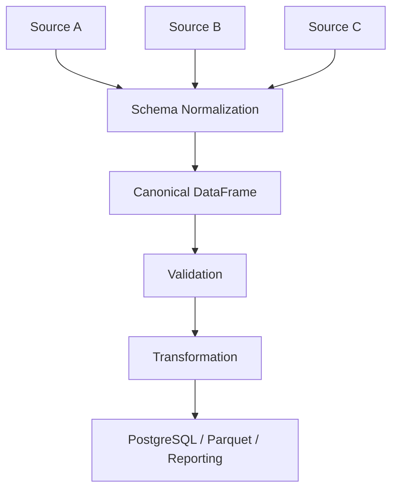
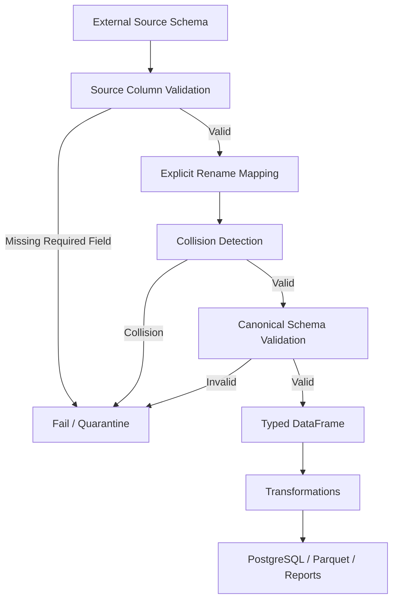

# 02- Rename

## Overview

Renaming is a structural transformation used to change DataFrame or Series labels without changing the underlying business values.

In production Pandas pipelines, labels are part of the data contract. A column named:

```text
customerId
```

may need to become:

```text
customer_id
```

before the dataset is passed to:

```text
ETL transformations
PostgreSQL
Parquet
REST responses
Reporting layers
Data validation
```

Pandas provides several ways to rename:

```text
Columns
Index labels
Multiple labels
Entire axes
```

The most common API is:

```python
df.rename(...)
```

Renaming should be treated as an explicit schema transformation rather than cosmetic formatting.

A typical pipeline is:

```text
External Source
      ↓
Raw DataFrame
      ↓
Rename / Schema Normalization
      ↓
Type Normalization
      ↓
Validation
      ↓
Transformation
      ↓
Persistence / Reporting
```

## Why Renaming Matters

Inconsistent column names create friction across systems.

For example:

```text
customerId
customer_id
Customer ID
customer-id
```

may all refer to the same logical field.

Without canonical naming, downstream code becomes vulnerable to:

```text
KeyError
Incorrect joins
Duplicate mappings
Broken SQL queries
Schema drift
Inconsistent APIs
Difficult debugging
```

A canonical naming convention makes the DataFrame easier to reason about and safer to integrate.

## What `rename()` Does

`DataFrame.rename()` returns a DataFrame with selected labels changed.

Basic syntax:

```python
df.rename(
    columns={
        "customerId": "customer_id",
        "orderAmount": "order_amount",
    }
)
```

The original DataFrame is not modified unless the result is assigned back or `inplace=True` is used.

Preferred production style:

```python
orders = orders.rename(
    columns={
        "customerId": "customer_id",
        "orderAmount": "order_amount",
    }
)
```

This makes the transformation explicit.

## Renaming Columns

The most common use is column renaming:

```python
orders = orders.rename(
    columns={
        "customerId": "customer_id",
        "orderDate": "order_date",
        "totalAmount": "total_amount",
    }
)
```

Only the specified columns are changed.

Unspecified columns remain unchanged.

## Renaming the Index

`rename()` can also rename index labels:

```python
orders = orders.rename(
    index={
        101: 1001,
        102: 1002,
    }
)
```

This changes labels, not row positions.

In most backend pipelines, explicit index labels are less important than canonical column names, but index renaming matters when the index represents meaningful identifiers.

## Column Rename vs Index Rename

| Operation | Parameter | Changes |
|---|---|---|
| Rename columns | `columns=` | Column labels |
| Rename index labels | `index=` | Index labels |
| Rename all axis labels | `axis=` | Selected axis |
| Rename using function | callable | Computed labels |

Prefer `columns=` and `index=` when clarity matters.

They communicate intent better than generic `axis=`.

## Renaming One Column

```python
orders = orders.rename(
    columns={
        "amt": "amount",
    }
)
```

This is preferable to rebuilding the entire column list when only one field changes.

It minimizes unintended schema modifications.

## Renaming Multiple Columns

```python
orders = orders.rename(
    columns={
        "cust_id": "customer_id",
        "ord_id": "order_id",
        "amt": "amount",
        "created": "created_at",
    }
)
```

This is common during ingestion from legacy systems.

A mapping makes the source-to-canonical relationship explicit.

## Why Explicit Mappings Are Valuable

An explicit rename mapping provides:

```text
Auditability
Reviewability
Predictability
Testability
```

For example:

```python
SOURCE_TO_CANONICAL = {
    "custId": "customer_id",
    "orderId": "order_id",
    "createdAt": "created_at",
}

orders = orders.rename(
    columns=SOURCE_TO_CANONICAL
)
```

This can become part of the source schema adapter.

## Source Adapter Pattern

Different upstream systems may use different naming conventions.

```text
Source A
    customerId
        ↓
    customer_id

Source B
    customer_id
        ↓
    customer_id

Source C
    Customer ID
        ↓
    customer_id
```

A canonical ingestion boundary can normalize all sources into one internal schema.



This prevents source-specific names from spreading through downstream code.

## Renaming Before Validation

Suppose the validator expects:

```python
required_columns = {
    "order_id",
    "customer_id",
    "amount",
}
```

but the source contains:

```text
orderId
customerId
amt
```

Rename first:

```python
orders = orders.rename(
    columns={
        "orderId": "order_id",
        "customerId": "customer_id",
        "amt": "amount",
    }
)
```

Then validate:

```python
missing = (
    required_columns
    - set(orders.columns)
)
```

Schema normalization should generally occur before canonical-schema validation.

## Renaming and Dtypes

Renaming changes labels, not data values or dtypes.

For example:

```python
orders = orders.rename(
    columns={
        "amt": "amount",
    }
)
```

does not convert:

```text
string → float
```

or:

```text
object → numeric
```

Therefore:

```text
rename
    ↓
type normalization
```

are separate concerns.

## Renaming and Missing Data

Renaming does not change missing-value behavior.

If:

```python
orders["amt"]
```

contains missing values, renaming it:

```python
orders = orders.rename(
    columns={
        "amt": "amount",
    }
)
```

preserves those missing values.

This separation is useful because schema changes should not unexpectedly alter data semantics.

## Renaming and Duplicated Columns

A rename can create duplicate column labels.

Example:

```python
df = df.rename(
    columns={
        "amount_usd": "amount",
        "amount_eur": "amount",
    }
)
```

The result contains duplicate column names.

This is usually undesirable for production datasets.

Always verify column uniqueness after schema normalization:

```python
if not df.columns.is_unique:
    raise ValueError(
        "Duplicate column names detected"
    )
```

## Duplicate Column Names

Duplicate labels make downstream code ambiguous:

```python
df["amount"]
```

may no longer represent a single unambiguous field.

Problems can occur in:

```text
Joins
Serialization
SQL persistence
Validation
Column selection
Reporting
```

Canonical schemas should normally enforce unique column names.

## Renaming with a Function

`rename()` also accepts a callable:

```python
orders = orders.rename(
    columns=str.lower
)
```

This transforms every column name through the supplied function.

For example:

```text
CUSTOMER_ID
```

becomes:

```text
customer_id
```

when the function includes the appropriate normalization steps.

## Lowercasing Column Names

A common ingestion transformation:

```python
orders.columns = (
    orders.columns
    .str.strip()
    .str.lower()
)
```

This modifies every column label.

It can be useful for controlled source normalization.

However, lowercasing alone does not convert:

```text
Customer ID
```

into:

```text
customer_id
```

unless spaces and separators are also normalized.

## Canonical Snake Case

For backend systems, snake_case is often convenient:

```text
customer_id
order_id
created_at
total_amount
```

A simple transformation:

```python
orders.columns = (
    orders.columns
    .str.strip()
    .str.lower()
    .str.replace(
        r"[^a-z0-9]+",
        "_",
        regex=True,
    )
    .str.strip("_")
)
```

This is useful for controlled source data, but aggressive normalization can create collisions.

For example:

```text
customer-id
customer_id
Customer ID
```

could all normalize to:

```text
customer_id
```

A production pipeline should detect collisions after normalization.

## Detecting Rename Collisions

Before applying automated normalization:

```python
original = orders.columns.copy()

normalized = (
    original
    .str.strip()
    .str.lower()
    .str.replace(
        r"[^a-z0-9]+",
        "_",
        regex=True,
    )
    .str.strip("_")
)

if normalized.duplicated().any():
    raise ValueError(
        "Column normalization creates "
        "duplicate column names"
    )

orders.columns = normalized
```

This is safer than silently creating ambiguous columns.

## Explicit Rename vs Automatic Normalization

| Approach | Best use | Main risk |
|---|---|---|
| Explicit mapping | Stable source contract | Mapping maintenance |
| Callable transformation | Uniform naming convention | Unexpected collisions |
| Full column reassignment | Known complete schema | Easy to accidentally reorder/rename incorrectly |
| `set_axis()` | Complete controlled labels | Requires exact label count |

For external sources, explicit mappings are often the safer default.

## Renaming with `axis`

This is valid:

```python
orders = orders.rename(
    {
        "amt": "amount",
    },
    axis="columns",
)
```

However, this is usually clearer:

```python
orders = orders.rename(
    columns={
        "amt": "amount",
    }
)
```

Explicit axis names reduce ambiguity in production code.

## Renaming vs Direct Column Assignment

You can rename by rebuilding the columns:

```python
orders.columns = [
    "order_id",
    "customer_id",
    "amount",
]
```

This is appropriate only when the complete expected schema is known.

For partial renaming:

```python
orders = orders.rename(
    columns={
        "amt": "amount",
    }
)
```

is safer because unrelated columns remain unchanged.

## Renaming with `set_axis()`

`set_axis()` is useful when replacing the complete set of labels:

```python
orders = orders.set_axis(
    [
        "order_id",
        "customer_id",
        "amount",
    ],
    axis="columns",
)
```

The number of labels must match the number of columns.

Use it when the entire output schema is controlled.

Use `rename()` when only selected labels need to change.

## Renaming the Index with a Callable

```python
orders = orders.rename(
    index=str
)
```

This can normalize index labels when required.

However, most production DataFrames benefit from treating the index as an implementation structure unless the index has deliberate business meaning.

## `rename_axis()` vs `rename()`

These APIs solve different problems.

`rename()` changes labels:

```python
df.rename(
    columns={
        "amt": "amount",
    }
)
```

`rename_axis()` changes the name of an axis:

```python
df = df.rename_axis(
    "order_id"
)
```

This distinction matters when working with:

```text
MultiIndex
Series
Grouped outputs
Pivot tables
Reshaped data
```

## Column Labels vs Column Names

Pandas treats column labels as part of the DataFrame's axis metadata.

For a normal DataFrame:

```python
df.columns
```

is an Index containing the labels.

Therefore:

```python
df.columns
```

is not merely formatting metadata. It determines how columns are selected:

```python
df["customer_id"]
```

and referenced throughout the pipeline.

## Renaming and Selection

After renaming:

```python
orders = orders.rename(
    columns={
        "customerId": "customer_id",
    }
)
```

downstream selection should use the canonical name:

```python
orders["customer_id"]
```

Do not continue supporting multiple aliases indefinitely unless backward compatibility requires it.

## Renaming and Joins

Column names directly affect join code:

```python
orders.merge(
    customers,
    on="customer_id",
)
```

If one source uses:

```text
customerId
```

and another:

```text
customer_id
```

the canonical schema should normalize both before the join.

For one-off mappings, `left_on` and `right_on` can handle different names:

```python
merged = orders.merge(
    customers,
    left_on="customerId",
    right_on="customer_id",
    how="left",
)
```

But for reusable pipelines, canonicalizing source schemas is usually easier to maintain.

## Renaming After Joins

Some joins intentionally create duplicate semantic names:

```text
amount_x
amount_y
```

Rename them explicitly:

```python
merged = merged.rename(
    columns={
        "amount_x": "order_amount",
        "amount_y": "payment_amount",
    }
)
```

This is preferable to leaving suffix-generated names in a production dataset.

## Renaming and Aggregation

Grouped results may produce names that need canonicalization:

```python
summary = (
    orders
    .groupby("customer_id", as_index=False)
    .agg(
        total=("amount", "sum"),
        count=("order_id", "count"),
    )
)
```

Explicit named aggregation often reduces the need for post-aggregation renaming.

However, if legacy code produces generic names, `rename()` can clean them:

```python
summary = summary.rename(
    columns={
        "total": "total_amount",
        "count": "order_count",
    }
)
```

## Renaming MultiIndex Columns

Aggregations can create MultiIndex columns.

Example:

```python
summary = (
    orders
    .groupby("customer_id")
    .agg(
        {
            "amount": [
                "sum",
                "mean",
            ]
        }
    )
)
```

This can produce hierarchical column labels.

Rather than immediately flattening every MultiIndex, first determine whether the hierarchy is useful.

When a flat schema is required:

```python
summary.columns = [
    f"{column}_{metric}"
    for column, metric
    in summary.columns
]
```

This is a structural transformation and should be done deliberately.

## Renaming Columns After `reset_index()`

Grouped operations can move index values back into columns:

```python
summary = (
    orders
    .groupby("customer_id")["amount"]
    .sum()
    .reset_index()
)
```

Then rename if needed:

```python
summary = summary.rename(
    columns={
        "amount": "total_amount",
    }
)
```

Whenever possible, named aggregation produces a cleaner schema directly.

## Renaming and `read_csv()`

Source-specific schema normalization can happen immediately after ingestion:

```python
orders = pd.read_csv(
    "orders.csv"
)

orders = orders.rename(
    columns={
        "Order ID": "order_id",
        "Customer ID": "customer_id",
        "Order Amount": "amount",
    }
)
```

This establishes the canonical schema near the ingestion boundary.

## Renaming and `read_sql()`

SQL queries often already support aliases:

```sql
SELECT
    id AS order_id,
    customer_id,
    amount
FROM orders;
```

This can be preferable when the canonical schema is known and the database query is under your control.

If multiple sources exist, Pandas can still provide a common normalization layer.

## SQL Alias vs Pandas Rename

| Approach | Best use |
|---|---|
| SQL `AS` alias | Database query fully controls schema |
| `rename()` | Multiple source formats or post-query normalization |
| Both | Complex pipelines with multiple ingestion paths |

Avoid renaming the same field repeatedly across layers without a clear reason.

## Renaming and REST APIs

An API might return:

```json
{
  "customerId": "CUST-1001",
  "orderAmount": 1250.50
}
```

Normalize after ingestion:

```python
orders = orders.rename(
    columns={
        "customerId": "customer_id",
        "orderAmount": "order_amount",
    }
)
```

Downstream transformations can then use one naming convention independent of the API contract.

## Renaming and FastAPI

For API integrations, a Pydantic model can handle aliasing at the application boundary.

Pandas is more appropriate when normalizing:

```text
Bulk API extracts
Batch data
Historical responses
Reporting datasets
```

Avoid duplicating alias rules across application and ETL layers without documenting the canonical contract.

## Renaming and PostgreSQL

Database schemas benefit from stable canonical names:

```text
customer_id
created_at
updated_at
total_amount
```

A Pandas DataFrame intended for:

```python
to_sql(...)
```

should generally use column names compatible with the target schema.

Explicit renaming before persistence reduces coupling between source naming conventions and database naming conventions.

## Renaming and Parquet

Parquet preserves column names and types.

Therefore:

```python
orders = orders.rename(
    columns={
        "Order ID": "order_id",
    }
)

orders.to_parquet(
    "processed/orders.parquet",
    index=False,
)
```

means downstream readers receive the canonical column name.

Schema consistency matters because many downstream systems depend on exact column labels.

## Renaming and Serialization

Column names affect output contracts in:

```text
JSON
CSV
Parquet
SQL
API responses
Data warehouse tables
```

Do not casually rename fields in established datasets.

A column rename can be a breaking change for downstream consumers.

## Schema Evolution

Changing:

```text
customerId
```

to:

```text
customer_id
```

may be logically harmless inside a DataFrame but operationally significant when the dataset is consumed by external systems.

Treat schema renames as versioned interface changes when downstream consumers are involved.

Possible strategies:

```text
Version the dataset
Provide migration period
Support old and new fields temporarily
Update consumers first
Use compatibility adapters
```

Do not assume a DataFrame-local change has only local consequences.

## Backward Compatibility

A service or pipeline may need to support:

```text
legacy_column
canonical_column
```

temporarily.

One pattern is:

```python
if "customer_id" not in df.columns:
    if "customerId" in df.columns:
        df = df.rename(
            columns={
                "customerId": "customer_id",
            }
        )
```

After migration:

```text
legacy alias
    ↓
remove compatibility code
```

Do not preserve aliases forever without an explicit migration plan.

## Rename Validation

After renaming:

```python
expected_columns = {
    "order_id",
    "customer_id",
    "amount",
}

if not expected_columns.issubset(
    orders.columns
):
    missing = (
        expected_columns
        - set(orders.columns)
    )

    raise ValueError(
        f"Missing canonical columns: "
        f"{sorted(missing)}"
    )
```

This verifies that the intended target schema exists.

## Detecting Unexpected Source Columns

Depending on the source contract:

```python
unexpected = (
    set(orders.columns)
    - expected_columns
)
```

Whether this should fail the pipeline depends on the compatibility strategy.

A strict schema may reject unexpected fields.

A tolerant schema may allow additive fields.

The policy should be explicit.

## Rename Mapping Validation

A rename mapping should be checked before applying it.

```python
rename_map = {
    "customerId": "customer_id",
    "orderId": "order_id",
}

missing_sources = set(
    rename_map
) - set(orders.columns)

if missing_sources:
    raise ValueError(
        "Rename sources missing: "
        f"{sorted(missing_sources)}"
    )
```

Whether missing source fields are fatal depends on whether those fields are required.

## Rename Mapping Collisions

Check whether targets collide with existing columns:

```python
existing = set(
    orders.columns
)

targets = set(
    rename_map.values()
)

collisions = (
    (existing & targets)
    - set(rename_map.keys())
)

if collisions:
    raise ValueError(
        "Rename target conflicts with "
        f"existing columns: {sorted(collisions)}"
    )
```

This becomes important when standardizing legacy schemas.

## Renaming and Index Semantics

Renaming column labels does not affect the row index.

Example:

```python
orders = orders.rename(
    columns={
        "customerId": "customer_id",
    }
)
```

The index remains unchanged.

If row identity matters, test index behavior explicitly after transformations.

## Non-Mutation Behavior

By default:

```python
renamed = orders.rename(
    columns={
        "amt": "amount",
    }
)
```

returns a new DataFrame object.

The original:

```python
orders
```

remains unchanged.

This is generally easier to reason about in pipeline code.

## `inplace=True`

Pandas supports:

```python
orders.rename(
    columns={
        "amt": "amount",
    },
    inplace=True,
)
```

This mutates the DataFrame.

In production code, prefer assignment:

```python
orders = orders.rename(
    columns={
        "amt": "amount",
    }
)
```

because it makes the data-flow transition explicit and avoids mixing mutation conventions.

## Method Chaining

Renaming fits naturally into transformation chains:

```python
processed = (
    orders
    .rename(
        columns={
            "Customer ID": "customer_id",
            "Order Amount": "amount",
        }
    )
    .assign(
        amount=lambda df: pd.to_numeric(
            df["amount"],
            errors="coerce",
        )
    )
)
```

This can be useful when schema normalization and transformation belong to one clear pipeline.

## Readability Over Cleverness

Avoid:

```python
df.columns = (
    df.columns.str.lower()
    .str.replace(...)
)
```

when the source has a small number of important legacy columns and explicit mappings would be clearer.

Prefer:

```python
df = df.rename(
    columns={
        "Customer ID": "customer_id",
        "Order Amount": "amount",
    }
)
```

Explicit code communicates business intent better.

## Naming Conventions

A production project should choose a naming convention and apply it consistently.

Common backend-friendly convention:

```text
snake_case
```

Examples:

```text
customer_id
order_id
created_at
updated_at
total_amount
payment_status
```

Avoid mixing:

```text
camelCase
PascalCase
snake_case
spaces
hyphens
abbreviations
```

in the same canonical schema.

## Abbreviations

Avoid ambiguous abbreviations:

```text
amt
qty
cust
ord
```

when readability matters.

Prefer:

```text
amount
quantity
customer
order
```

unless the abbreviated form is part of an established external contract.

## Semantic Naming

Good column names communicate meaning.

Prefer:

```text
created_at
```

over:

```text
created
```

Prefer:

```text
amount_usd
```

over:

```text
amount
```

when currency is intentionally fixed.

Prefer:

```text
event_time
```

over:

```text
timestamp
```

when multiple timestamps exist.

Renaming is therefore also a schema-clarification mechanism.

## Renaming and Data Contracts

A canonical schema may be defined as:

```text
order_id
customer_id
amount
currency
created_at
updated_at
```

A source adapter converts:

```text
OrderID
CustomerId
OrderValue
CurrencyCode
Created
Updated
```

into the contract.

The rest of the pipeline should then operate exclusively on canonical names.

## Production Schema Adapter

A reusable adapter:

```python
SOURCE_COLUMNS = {
    "OrderID": "order_id",
    "CustomerId": "customer_id",
    "OrderValue": "amount",
    "CurrencyCode": "currency",
    "Created": "created_at",
    "Updated": "updated_at",
}


def normalize_order_schema(
    orders: pd.DataFrame,
) -> pd.DataFrame:
    result = orders.rename(
        columns=SOURCE_COLUMNS
    )

    required = {
        "order_id",
        "customer_id",
        "amount",
        "currency",
        "created_at",
        "updated_at",
    }

    missing = (
        required
        - set(result.columns)
    )

    if missing:
        raise ValueError(
            "Canonical columns missing: "
            f"{sorted(missing)}"
        )

    if not result.columns.is_unique:
        raise ValueError(
            "Duplicate column names after "
            "schema normalization"
        )

    return result
```

This creates a controlled boundary between:

```text
Source schema
```

and:

```text
Internal schema
```

## Testing Rename Logic

Rename tests should verify:

```text
Expected source mappings
Canonical target names
Unchanged unrelated columns
No collisions
Required columns
Unique output schema
```

Example:

```python
def test_order_schema_normalization() -> None:
    orders = pd.DataFrame(
        {
            "OrderID": ["ORD-1"],
            "CustomerId": ["CUST-1"],
            "OrderValue": [100.0],
        }
    )

    result = orders.rename(
        columns={
            "OrderID": "order_id",
            "CustomerId": "customer_id",
            "OrderValue": "amount",
        }
    )

    assert list(result.columns) == [
        "order_id",
        "customer_id",
        "amount",
    ]
```

## Testing Unchanged Columns

```python
def test_unmapped_columns_are_preserved() -> None:
    orders = pd.DataFrame(
        {
            "OrderID": ["ORD-1"],
            "Source": ["erp"],
        }
    )

    result = orders.rename(
        columns={
            "OrderID": "order_id",
        }
    )

    assert "order_id" in result.columns
    assert "Source" in result.columns
```

This protects against accidental full-schema replacement.

## Testing Rename Collisions

```python
import pandas as pd
import pytest


def test_duplicate_columns_after_rename() -> None:
    df = pd.DataFrame(
        {
            "amount_usd": [100.0],
            "amount_eur": [90.0],
        }
    )

    result = df.rename(
        columns={
            "amount_usd": "amount",
            "amount_eur": "amount",
        }
    )

    assert not result.columns.is_unique
```

A production validator should reject such a schema.

## Testing Index Preservation

```python
def test_column_rename_preserves_index() -> None:
    orders = pd.DataFrame(
        {
            "OrderID": ["ORD-1"],
        },
        index=[42],
    )

    result = orders.rename(
        columns={
            "OrderID": "order_id",
        }
    )

    assert result.index.tolist() == [42]
```

Renaming column labels should not alter row identity.

## Testing Non-Mutation

```python
def test_rename_does_not_mutate_original() -> None:
    orders = pd.DataFrame(
        {
            "amt": [100.0],
        }
    )

    renamed = orders.rename(
        columns={
            "amt": "amount",
        }
    )

    assert "amt" in orders.columns
    assert "amount" not in orders.columns
    assert "amount" in renamed.columns
```

This verifies the default non-mutating behavior.

## Testing Method Chains

```python
def test_rename_integrates_with_transformations() -> None:
    orders = pd.DataFrame(
        {
            "Order Value": ["100"],
        }
    )

    result = (
        orders
        .rename(
            columns={
                "Order Value": "amount",
            }
        )
        .assign(
            amount=lambda df: pd.to_numeric(
                df["amount"],
                errors="coerce",
            )
        )
    )

    assert result["amount"].iloc[0] == 100
```

This ensures the canonical name is available to subsequent pipeline stages.

## Performance Considerations

Renaming is usually inexpensive compared with operations such as:

```text
Large joins
Groupby
Sorting
String parsing
Datetime parsing
```

The main performance concerns are not the label change itself but surrounding operations such as:

```text
Repeated DataFrame copies
Repeated schema normalization
Unnecessary full-column rewrites
Expensive custom normalization functions
```

Rename once near the ingestion boundary and use canonical labels afterward.

## Avoid Repeated Renaming

Do not repeatedly rename:

```python
df = df.rename(
    columns={
        "cust_id": "customer_id",
    }
)

df = df.rename(
    columns={
        "customer_id": "customer",
    }
)
```

unless the schema genuinely evolves between distinct stages.

Multiple rename layers make lineage harder to understand.

Prefer:

```text
source schema
    ↓
canonical schema
    ↓
stable downstream schema
```

## Memory Considerations

Column-label changes generally do not imply copying all underlying cell data, but creating additional transformed DataFrames may still contribute to memory pressure depending on the broader pipeline.

Avoid:

```python
df1 = df.rename(...)
df2 = df1.rename(...)
df3 = df2.rename(...)
```

for large DataFrames when one normalization step is sufficient.

## Large DataFrames

With very large datasets:

```text
Rename required labels once
Avoid unnecessary full DataFrame copies
Project required columns early
Persist canonical schema
```

If reading from CSV:

```python
orders = pd.read_csv(
    "orders.csv",
    usecols=[
        "OrderID",
        "CustomerId",
        "OrderValue",
    ],
)

orders = orders.rename(
    columns={
        "OrderID": "order_id",
        "CustomerId": "customer_id",
        "OrderValue": "amount",
    }
)
```

This reduces the amount of data carried through later stages.

## Rename and Chunk Processing

For large files:

```python
for chunk in pd.read_csv(
    "orders.csv",
    chunksize=100_000,
):
    chunk = chunk.rename(
        columns={
            "OrderID": "order_id",
            "CustomerId": "customer_id",
        }
    )

    process_chunk(chunk)
```

The mapping should be centralized so every chunk receives identical schema treatment.

## Rename and Idempotency

A canonical rename operation should ideally be idempotent with respect to its intended source state.

For example:

```python
mapping = {
    "CustomerId": "customer_id",
}
```

If the source is already canonical:

```text
customer_id
```

the mapping has no additional effect.

Do not build pipelines that repeatedly oscillate:

```text
customer_id
    ↓
customerId
    ↓
customer_id
```

This creates unnecessary complexity.

## Security Considerations

Renaming does not sanitize data.

Changing:

```text
passwordHash
```

to:

```text
password_hash
```

does not make the underlying value safe to expose.

Security-sensitive fields should still have:

```text
Access controls
Redaction
Encryption
Minimal retention
Safe serialization
```

Also avoid logging complete DataFrame schemas when column names themselves could expose sensitive internal system details.

## Reliability Considerations

Schema renaming is often part of an ingestion contract.

Reliability depends on:

```text
Deterministic mappings
Schema validation
Collision detection
Versioned source contracts
Clear failure behavior
```

A rename failure should generally be visible.

Do not silently ignore a required source field disappearing because:

```python
df.rename(...)
```

leaves unrelated columns untouched.

Validate the canonical output afterward.

## Schema Drift Monitoring

Track:

```text
Missing source columns
Unexpected source columns
Rename collision count
Schema version
Canonical schema mismatch
```

A sudden rename failure often indicates:

```text
Upstream deployment
API version change
CSV export change
Database migration
Producer schema evolution
```

Treat it as an operational signal.

## Production Failure Policies

Possible policies:

| Condition | Action |
|---|---|
| Optional source column missing | Continue |
| Required source column missing | Fail batch |
| Rename target collision | Fail |
| Unexpected additive column | Warn or accept based on contract |
| Canonical column missing after rename | Fail |
| Duplicate canonical labels | Fail |
| Legacy alias encountered | Normalize and monitor |
| Source schema version unsupported | Reject |

The exact policy should be defined by the contract.

## Rename and Deployment

Column renames can be breaking changes.

For a shared Parquet dataset:

```text
Version 1:
customerId

Version 2:
customer_id
```

Downstream readers expecting the old field can fail.

For shared interfaces, use a migration strategy:

```text
Introduce new field
    ↓
Update consumers
    ↓
Monitor usage
    ↓
Remove legacy field
```

Avoid changing contracts atomically across independently deployed services unless the deployment model guarantees compatibility.

## Rename and CI/CD

Schema mappings should be tested in CI.

Useful checks include:

```text
Source fixture
    ↓
Rename
    ↓
Canonical schema assertion
    ↓
Dtype validation
    ↓
Business validation
```

This catches accidental changes before deployment.

## Interview Questions

### What does `DataFrame.rename()` change?

It changes labels such as column names or index labels without changing the underlying values.

### Does `rename()` modify the original DataFrame?

Not by default. It returns a new DataFrame unless `inplace=True` is used.

### Why prefer `columns=` over `axis="columns"`?

`columns=` is more explicit and immediately communicates the intended target axis.

### What happens to columns not included in the mapping?

They remain unchanged.

### What happens if two columns are renamed to the same name?

Pandas can produce duplicate column labels. A production schema validator should detect and reject this when uniqueness is required.

### Why use `rename()` instead of assigning `df.columns`?

`rename()` is safer for partial schema changes. Direct `df.columns = [...]` replaces the entire label set and requires the complete ordered schema.

### When should SQL aliases be preferred over Pandas `rename()`?

When the database query is under your control and the canonical naming can be established efficiently at the database boundary.

### Why normalize names before joins?

Different labels can make equivalent fields harder to join and can cause inconsistent transformation code across sources.

### Does renaming affect dtypes?

No. Renaming changes labels, not the underlying data values or dtypes.

### Can renaming be a breaking change?

Yes. Column names are part of data contracts for APIs, Parquet datasets, SQL tables, reports, and downstream services.

### What is the difference between `rename()` and `rename_axis()`?

`rename()` changes labels on an axis. `rename_axis()` changes the name of the axis itself.

### Why can automatic column normalization be dangerous?

Different source fields can normalize to the same canonical name, causing collisions and ambiguous schemas.

### How should a production pipeline handle schema renames?

Use:

```text
Explicit mapping
Validation
Collision detection
Versioned contracts
Migration strategy
Monitoring
```

### Is renaming expensive?

Compared with most DataFrame transformations, label renaming is relatively inexpensive. The larger concerns are unnecessary surrounding copies and repeated normalization.

## Recommended Production Pattern

A strong schema-normalization function should:

```text
1. Receive source DataFrame.
2. Validate required source columns.
3. Apply explicit rename mapping.
4. Detect duplicate canonical labels.
5. Validate required canonical columns.
6. Return the normalized DataFrame.
```

Example:

```python
import pandas as pd


SOURCE_TO_CANONICAL = {
    "OrderID": "order_id",
    "CustomerID": "customer_id",
    "OrderAmount": "amount",
    "CreatedAt": "created_at",
}


REQUIRED_CANONICAL_COLUMNS = {
    "order_id",
    "customer_id",
    "amount",
    "created_at",
}


def normalize_order_schema(
    orders: pd.DataFrame,
) -> pd.DataFrame:
    source_columns = set(
        orders.columns
    )

    missing_sources = (
        set(SOURCE_TO_CANONICAL)
        - source_columns
    )

    if missing_sources:
        raise ValueError(
            "Missing required source columns: "
            f"{sorted(missing_sources)}"
        )

    result = orders.rename(
        columns=SOURCE_TO_CANONICAL
    )

    if not result.columns.is_unique:
        raise ValueError(
            "Duplicate columns after "
            "schema normalization"
        )

    missing_canonical = (
        REQUIRED_CANONICAL_COLUMNS
        - set(result.columns)
    )

    if missing_canonical:
        raise ValueError(
            "Missing canonical columns: "
            f"{sorted(missing_canonical)}"
        )

    return result
```

This creates a clean schema boundary:

```text
External naming
    ↓
Explicit mapping
    ↓
Canonical naming
    ↓
Validation
    ↓
Transformation
```

## Production Schema Flow



This structure prevents source-specific naming conventions from contaminating the rest of the application.

## Practical Checklist

Before introducing a rename step:

- Identify whether the rename is a source adapter, internal transformation, or external schema change.
- Prefer explicit mappings for important source fields.
- Validate required source columns before applying the mapping.
- Detect duplicate target names and canonical-schema collisions.
- Verify required canonical columns afterward.
- Keep naming conventions consistent across the pipeline.
- Prefer `columns=` over a generic axis argument when renaming columns.
- Use `rename()` for partial changes and `set_axis()` or full assignment only when replacing the complete schema intentionally.
- Do not assume renaming changes dtypes or values.
- Rename near the ingestion boundary and use canonical names downstream.
- Avoid repeated or reversible rename layers.
- Treat shared schema renames as potentially breaking interface changes.
- Version and test schema contracts when multiple services or datasets depend on them.
- Monitor schema drift and upstream naming changes.
- Preserve compatibility aliases only for a defined migration period.
- Test canonical names, uniqueness, index preservation, and non-mutation behavior.
- Avoid logging sensitive schema or data details unnecessarily.

## Key Takeaways

- `DataFrame.rename()` is a **schema transformation** that changes column or index labels without changing the underlying values or dtypes.
- Prefer explicit column mappings at ingestion boundaries so external source schemas are converted into a stable canonical schema before validation and transformation.
- Always detect **duplicate target labels and rename collisions**, because Pandas permits duplicate column names even though they are usually unsafe for production data contracts.
- Treat column names as interface contracts: renaming fields in SQL, Parquet, APIs, or shared datasets can be a breaking change that requires versioning or a compatibility migration.
- Keep renaming deterministic, centralized, tested, and infrequent; normalize once near ingestion and use the canonical schema throughout the rest of the pipeline.