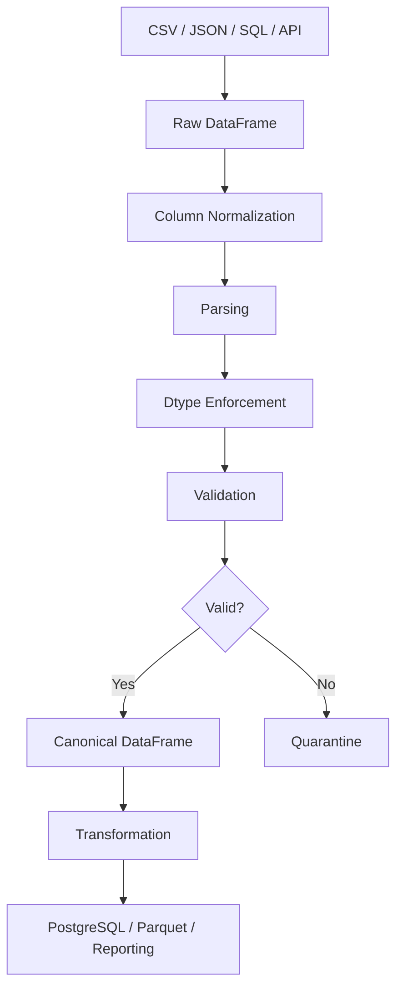
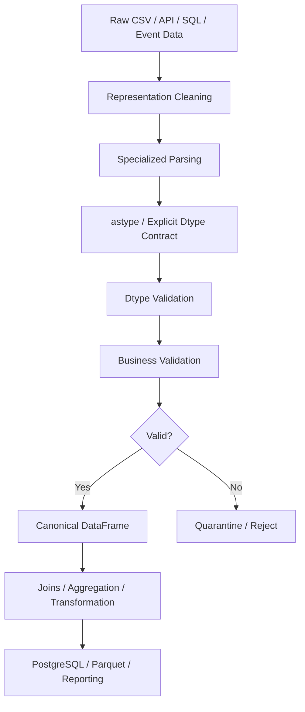

# 03- Astype

## Overview

`Series.astype()` and `DataFrame.astype()` are Pandas mechanisms for explicitly changing the dtype of data.

In production data pipelines, dtype is part of the data contract. The same-looking values can behave very differently depending on whether Pandas stores them as:

```text
string
integer
floating-point
boolean
datetime
categorical
object
nullable extension dtype
```

For example:

```python
orders["quantity"] = orders[
    "quantity"
].astype("Int64")
```

establishes that `quantity` should use Pandas' nullable integer dtype.

This matters because dtype influences:

```text
Memory usage
Arithmetic behavior
Missing-value handling
Comparisons
Sorting
Grouping
Serialization
Database interoperability
Performance
```

A reliable type-conversion workflow is:

```text
Raw source
    ↓
Inspect current dtype
    ↓
Understand field semantics
    ↓
Clean representation if required
    ↓
Convert explicitly
    ↓
Validate values
    ↓
Validate dtype
    ↓
Transform / aggregate / persist
```

`astype()` is powerful, but it is not a universal parsing or validation mechanism. In many cases, specialized functions such as:

```python
pd.to_numeric()
pd.to_datetime()
DataFrame.convert_dtypes()
```

are safer or more expressive.

## Why Dtypes Matter

Consider:

```text
quantity = "10"
quantity = 10
```

Both may display similarly, but they have different semantics.

With strings:

```python
orders["quantity"] > "5"
```

comparison is lexical rather than numeric.

With an integer dtype:

```python
orders["quantity"] > 5
```

comparison uses numeric semantics.

Similarly:

```text
"2026-09-10"
```

is not equivalent to a true datetime value.

Correct dtypes provide the foundation for reliable operations.

## What `astype()` Does

`astype()` attempts to convert values to a specified dtype.

Basic syntax:

```python
series.astype(dtype)
```

For a DataFrame:

```python
df.astype(dtype)
```

Example:

```python
orders["quantity"] = (
    orders["quantity"]
    .astype("int64")
)
```

The operation returns a converted object unless the result is reassigned.

## Common Syntax

Convert one Series:

```python
orders["quantity"] = (
    orders["quantity"]
    .astype("int64")
)
```

Convert multiple columns:

```python
orders = orders.astype(
    {
        "quantity": "int64",
        "status": "string",
    }
)
```

Convert an entire DataFrame:

```python
orders = orders.astype(
    "string"
)
```

The last form is usually too broad for heterogeneous production datasets.

## Series `astype()`

For a Series:

```python
amount = pd.Series(
    [100, 200, 300],
    dtype="int64",
)

amount = amount.astype(
    "float64"
)
```

The resulting Series has floating-point semantics.

Use Series-level conversion when a field has a clearly defined semantic type.

## DataFrame `astype()`

For a DataFrame:

```python
orders = orders.astype(
    {
        "quantity": "Int64",
        "currency": "string",
    }
)
```

Each specified column receives its own dtype.

Unspecified columns remain unchanged.

This is usually the safest DataFrame-level pattern because it documents intent explicitly.

## Converting Strings to Numbers

If strings contain clean numeric values:

```python
values = pd.Series(
    [
        "10",
        "20",
        "30",
    ]
)

values = values.astype(
    "int64"
)
```

This works when every value is compatible with the target dtype.

It fails when malformed values exist.

For example:

```text
"10"
"20"
"unknown"
```

is not a valid `int64` conversion as-is.

## `astype()` vs `pd.to_numeric()`

These APIs solve related but different problems.

| Operation | Best use |
|---|---|
| `astype()` | Explicit dtype enforcement |
| `pd.to_numeric()` | Numeric parsing and conversion |
| `pd.to_datetime()` | Datetime parsing |
| `convert_dtypes()` | Inferring better nullable Pandas dtypes |

For messy external input:

```python
orders["amount"] = pd.to_numeric(
    orders["amount"],
    errors="coerce",
)
```

is generally preferable to:

```python
orders["amount"] = orders[
    "amount"
].astype("float64")
```

because `to_numeric()` explicitly supports conversion-error handling.

## Cleaning Before `astype()`

For formatted strings:

```text
"1,250"
```

first normalize:

```python
amount = (
    orders["amount"]
    .astype("string")
    .str.strip()
    .str.replace(
        ",",
        "",
        regex=False,
    )
)
```

then convert:

```python
orders["amount"] = amount.astype(
    "float64"
)
```

The important pattern is:

```text
Representation cleanup
    ↓
Type conversion
```

not attempting to make `astype()` perform unrelated cleaning.

## Nullable Integer Dtypes

Standard NumPy integer dtypes cannot represent missing values directly.

This is problematic:

```python
values = pd.Series(
    [1, 2, None]
)

values.astype("int64")
```

A nullable Pandas integer dtype is appropriate:

```python
values = values.astype(
    "Int64"
)
```

Now the column can represent:

```text
1
2
<NA>
```

without converting the entire column to floating-point merely because one value is missing.

## `int64` vs `Int64`

| dtype | Missing values | Typical use |
|---|---|---|
| `int64` | No | Fully populated integer data |
| `Int64` | Yes | Nullable integer fields |
| `float64` | Yes, via `NaN` | Fractional or compatibility-oriented numeric data |
| `Float64` | Yes, via `pd.NA` | Nullable floating-point data |
| `string` | Yes | Text and identifiers |

The capitalized `Int64` is a Pandas nullable extension dtype, not the NumPy `int64` dtype.

## Nullable Floating-Point Dtypes

Pandas also provides nullable floating-point types:

```python
orders["amount"] = (
    orders["amount"]
    .astype("Float64")
)
```

This supports Pandas' nullable `pd.NA` semantics.

Use it when nullable floating-point behavior is preferable to traditional `float64` `NaN` semantics.

## Nullable Boolean

For boolean fields that can also be unknown:

```python
customers["verified"] = (
    customers["verified"]
    .astype("boolean")
)
```

This allows:

```text
True
False
<NA>
```

which is often more accurate than forcing missing values into `False`.

## Boolean Conversion Pitfall

Avoid:

```python
values.astype(bool)
```

for string representations such as:

```text
"False"
"False"
"0"
"no"
```

String values are truthy in Python even when their content says `"false"`.

Prefer explicit mapping:

```python
mapping = {
    "true": True,
    "false": False,
    "1": True,
    "0": False,
    "yes": True,
    "no": False,
}

values = (
    values
    .astype("string")
    .str.strip()
    .str.casefold()
    .map(mapping)
    .astype("boolean")
)
```

This makes the accepted representation explicit.

## String Dtype

Use:

```python
customers["email"] = (
    customers["email"]
    .astype("string")
)
```

rather than assuming every text column should remain generic `object`.

The `string` dtype provides explicit string semantics and nullable behavior.

It is particularly useful for:

```text
IDs
Emails
Phone numbers
Categories
External references
```

## `object` vs `string`

Historically, many Pandas text columns were stored as:

```text
object
```

which can contain arbitrary Python objects.

A string dtype communicates the intended type more clearly:

```python
df["email"] = df[
    "email"
].astype("string")
```

This is generally preferable for canonical text columns.

## Converting to Category

For low-cardinality repeated labels:

```python
orders["status"] = (
    orders["status"]
    .astype("string")
    .astype("category")
)
```

This can reduce memory usage and make categorical semantics explicit.

Good candidates include:

```text
status
country
region
event_type
customer_segment
```

Poor candidates generally include:

```text
email
UUID
request_id
free-form description
```

because high cardinality reduces the benefit.

## Category Semantics

Categorical data represents values from a finite or controlled set.

For example:

```text
pending
paid
completed
cancelled
```

This can be useful for:

```text
Memory optimization
Grouping
Sorting with defined category order
Validation
```

Do not confuse categorical dtype with validation. A category column still needs a defined business contract.

## Converting to Datetime

Do not generally use `astype()` for parsing arbitrary datetime strings.

Prefer:

```python
orders["created_at"] = pd.to_datetime(
    orders["created_at"],
    errors="coerce",
    utc=True,
)
```

`pd.to_datetime()` is designed for datetime parsing and supports:

```text
Invalid-value handling
Format specification
Timezone normalization
```

Use `astype()` primarily when converting an already well-defined dtype representation.

## Converting Already-Typed Datetimes

If a DataFrame already contains datetime-compatible values and the intended timezone-aware dtype is known, explicit Pandas datetime operations are clearer than using generic `astype()`.

For example:

```python
orders["created_at"] = (
    pd.to_datetime(
        orders["created_at"],
        utc=True,
        errors="coerce",
    )
)
```

This communicates parsing intent.

## Numeric Downcasting

`astype()` can intentionally reduce a numeric dtype:

```python
orders["quantity"] = (
    orders["quantity"]
    .astype("int32")
)
```

This can reduce memory if the data fits within the smaller range.

However, verify the possible value range before doing so.

For large pipelines, use:

```python
pd.to_numeric(
    values,
    downcast="integer",
)
```

when automatic safe downcasting is appropriate.

## Precision and Range

Changing:

```python
float64
```

to:

```python
float32
```

reduces precision.

Likewise:

```python
int64
```

to:

```python
int32
```

reduces the representable range.

Memory optimization is not free.

Always consider:

```text
Value range
Precision requirements
Aggregation behavior
Database schema
Serialization
```

## Copy Semantics

`astype()` returns a converted object.

Example:

```python
normalized = orders[
    "quantity"
].astype("Int64")
```

The original column is not replaced until assigned:

```python
orders["quantity"] = normalized
```

This makes the conversion suitable for explicit transformation pipelines.

## `copy` Considerations

Pandas can optimize certain internal operations, and implementation details vary by dtype and version.

Do not build application logic around assumptions about whether the converted result shares memory with the original.

If independent ownership is important:

```python
converted = (
    orders["amount"]
    .astype("float64")
    .copy()
)
```

Use this deliberately rather than copying every intermediate result.

## DataFrame `astype()` and Partial Conversion

Prefer:

```python
orders = orders.astype(
    {
        "quantity": "Int64",
        "customer_id": "string",
    }
)
```

over:

```python
orders = orders.astype(
    "string"
)
```

for heterogeneous DataFrames.

The first approach preserves the semantic types of unrelated columns.

## Converting an Entire DataFrame to String

This is valid:

```python
orders = orders.astype(
    "string"
)
```

but usually inappropriate for a production typed dataset.

It can turn:

```text
numeric
datetime
boolean
```

into text and break later operations.

Use it only when a downstream system explicitly requires a string representation.

## `astype()` with a Mapping

A mapping is one of the most useful forms:

```python
orders = orders.astype(
    {
        "order_id": "string",
        "customer_id": "string",
        "quantity": "Int64",
        "currency": "string",
    }
)
```

It makes the schema visible in code.

For stable production datasets, this can act as lightweight schema documentation.

## Missing Columns

If a required column does not exist:

```python
orders.astype(
    {
        "quantity": "Int64"
    }
)
```

raises a `KeyError`.

This is desirable when the missing column indicates a broken input contract.

Do not catch and ignore the error unless the field is intentionally optional.

## Invalid Values

`astype()` does not generally provide the same flexible malformed-input handling as specialized parsing APIs.

For example:

```python
pd.Series(
    ["100", "invalid"]
).astype("int64")
```

fails because `"invalid"` cannot be converted.

For ingestion:

```python
values = pd.to_numeric(
    values,
    errors="coerce",
)
```

then inspect and validate the resulting missing values.

## `errors` Parameter

`astype()` supports error handling options in supported conversion scenarios:

```python
values.astype(
    "int64",
    errors="ignore",
)
```

However, silently retaining the original representation can result in a column that is still not in the intended dtype.

For production schema enforcement, prefer explicit failure or specialized parsing with controlled error classification rather than using `errors="ignore"` as a generic escape hatch.

## Why `errors="ignore"` Can Be Dangerous

Consider:

```python
orders["quantity"] = (
    orders["quantity"]
    .astype(
        "int64",
        errors="ignore",
    )
)
```

If conversion cannot happen, the original values may remain unchanged.

The code appears to have enforced the dtype even though it has not.

For a canonical data pipeline, silent non-conversion is often worse than a visible failure.

## Explicit Failure vs Coercion

Choose based on pipeline semantics.

### Fail Fast

Use explicit conversion when:

```text
All values must be valid
Source contract is strict
Batch cannot safely continue
```

### Coerce and Classify

Use:

```python
pd.to_numeric(
    values,
    errors="coerce",
)
```

when:

```text
Individual bad rows can be quarantined
Pipeline should continue
Conversion failures are measurable
```

The conversion policy should be explicit.

## Converting Numeric Strings with Missing Values

Example:

```python
orders["quantity"] = (
    pd.to_numeric(
        orders["quantity"],
        errors="coerce",
    )
    .astype("Int64")
)
```

This two-stage approach is robust for:

```text
"10"
"20"
None
"invalid"
```

The final column uses nullable integer semantics.

The malformed value becomes missing and should then be classified or rejected according to the pipeline policy.

## Cleaning and Conversion Pipeline

A practical pattern:

```python
raw = (
    orders["quantity"]
    .astype("string")
    .str.strip()
    .replace("", pd.NA)
)

parsed = pd.to_numeric(
    raw,
    errors="coerce",
)

orders["quantity"] = (
    parsed.astype("Int64")
)
```

This explicitly separates:

```text
String normalization
    ↓
Numeric parsing
    ↓
Dtype enforcement
```

## Dtype Enforcement After Parsing

Specialized parsers often establish a usable numeric representation, but explicit final dtype enforcement can still be useful.

Example:

```python
orders["quantity"] = (
    pd.to_numeric(
        orders["quantity"],
        errors="coerce",
    )
    .astype("Int64")
)
```

This gives a predictable downstream schema.

## Type Conversion and Business Semantics

A dtype says:

```text
How the value is represented
```

It does not say:

```text
Whether the value is correct
```

For example:

```python
orders["amount"] = (
    orders["amount"]
    .astype("float64")
)
```

does not establish:

```text
amount >= 0
amount <= maximum
currency is valid
amount is in the correct unit
```

Validation remains a separate stage.

## Identifiers Are Not Measurements

A field such as:

```text
customer_id = "000123"
```

may look numeric.

Do not convert it to:

```python
123
```

because that changes the identifier.

Prefer:

```python
customers["customer_id"] = (
    customers["customer_id"]
    .astype("string")
    .str.strip()
)
```

Use semantic meaning to determine dtype.

## Phone Numbers

Phone numbers should generally remain strings:

```python
customers["phone"] = (
    customers["phone"]
    .astype("string")
    .str.strip()
)
```

Numeric conversion can remove:

```text
Leading zero
Plus sign
Country prefix formatting
```

and may introduce incorrect semantics.

## Postal Codes

Likewise:

```python
customers["postal_code"] = (
    customers["postal_code"]
    .astype("string")
)
```

is often safer than:

```python
.astype("int64")
```

because:

```text
00123
```

must remain distinct from:

```text
123
```

when the leading zeros are meaningful.

## Financial Values

Do not choose a dtype solely based on convenience.

For financial pipelines, consider:

```text
Precision
Scale
Currency
Rounding
Database representation
Serialization
```

Example:

```python
orders["amount"] = (
    pd.to_numeric(
        orders["amount"],
        errors="coerce",
    )
)
```

The Pandas representation should align with the system's broader financial model.

For authoritative financial persistence, coordinate with the PostgreSQL `NUMERIC` schema and application-level decimal semantics.

## Boolean Conversion and Three-State Logic

A boolean field can have three logical states:

```text
True
False
Unknown
```

Use:

```python
customers["verified"] = (
    customers["verified"]
    .astype("boolean")
)
```

when missingness must remain distinct.

This is especially useful for data imported from:

```text
APIs
CSV
SQL
Excel
```

where a missing flag does not necessarily mean `False`.

## DataFrame Schema Conversion

A production schema normalization stage can be explicit:

```python
def normalize_order_dtypes(
    orders: pd.DataFrame,
) -> pd.DataFrame:
    result = orders.copy()

    result = result.astype(
        {
            "order_id": "string",
            "customer_id": "string",
            "currency": "string",
            "status": "string",
        }
    )

    result["quantity"] = (
        pd.to_numeric(
            result["quantity"],
            errors="coerce",
        )
        .astype("Int64")
    )

    result["amount"] = pd.to_numeric(
        result["amount"],
        errors="coerce",
    )

    result["created_at"] = pd.to_datetime(
        result["created_at"],
        errors="coerce",
        utc=True,
    )

    return result
```

The specialized parsers are used where parsing semantics matter; `astype()` is used for explicit dtype enforcement.

## `convert_dtypes()` vs `astype()`

`convert_dtypes()` attempts to infer better Pandas dtypes:

```python
orders = orders.convert_dtypes()
```

This is useful for cleaning mixed object columns and moving toward nullable dtypes.

`astype()` is more explicit:

```python
orders = orders.astype(
    {
        "quantity": "Int64",
        "status": "string",
    }
)
```

| Tool | Strength |
|---|---|
| `astype()` | Explicit dtype contract |
| `convert_dtypes()` | Automatic nullable dtype inference |
| `to_numeric()` | Numeric parsing |
| `to_datetime()` | Datetime parsing |

For production contracts, explicit dtype enforcement is usually easier to reason about.

## `convert_dtypes()` in Ingestion

A dataset imported from CSV may contain generic object columns:

```python
orders = pd.read_csv(
    "orders.csv"
)

orders = orders.convert_dtypes()
```

This can improve dtype quality.

However, inferred dtype does not necessarily equal business-required dtype.

For critical fields:

```python
orders = orders.astype(
    {
        "customer_id": "string",
        "quantity": "Int64",
    }
)
```

provides a stronger contract.

## Type Conversion Before Joins

Join keys must use compatible semantic types.

Bad:

```text
orders.customer_id → int64
customers.customer_id → string
```

Potentially safer:

```python
orders["customer_id"] = (
    orders["customer_id"]
    .astype("string")
)

customers["customer_id"] = (
    customers["customer_id"]
    .astype("string")
)
```

Then:

```python
orders.merge(
    customers,
    on="customer_id",
    how="left",
)
```

Do not solve an identifier mismatch by converting identifiers to numbers unless numeric semantics are genuinely correct.

## Type Conversion Before Grouping

Grouping behavior depends on the dtype and representation.

For categorical fields:

```python
orders["status"] = (
    orders["status"]
    .astype("string")
    .str.casefold()
    .astype("category")
)
```

Then:

```python
summary = (
    orders
    .groupby(
        "status",
        observed=True,
    )
    .size()
)
```

This can reduce memory and make category semantics more explicit.

## Type Conversion Before Sorting

Numeric or datetime sorting requires typed values.

Prefer:

```python
orders["amount"] = pd.to_numeric(
    orders["amount"],
    errors="coerce",
)

orders = orders.sort_values(
    "amount"
)
```

rather than sorting raw strings.

## Type Conversion Before Aggregation

Aggregation should operate on meaningful numeric types:

```python
orders["amount"] = pd.to_numeric(
    orders["amount"],
    errors="coerce",
)

revenue = (
    orders
    .groupby("customer_id")["amount"]
    .sum()
)
```

Otherwise, downstream results can be incorrect or fail.

## Type Conversion and Persistence

Before writing:

```python
orders.to_parquet(
    "processed/orders.parquet",
    index=False,
)
```

or:

```python
orders.to_sql(
    "orders",
    connection,
    if_exists="append",
    index=False,
)
```

validate the DataFrame schema.

The target system may impose stricter requirements than Pandas.

## PostgreSQL Interoperability

A useful correspondence is:

| Pandas dtype | Typical PostgreSQL target |
|---|---|
| `Int64` | `INTEGER` / `BIGINT` |
| `Float64` / `float64` | `DOUBLE PRECISION` where appropriate |
| `string` | `TEXT` / `VARCHAR` |
| `boolean` | `BOOLEAN` |
| timezone-aware datetime | `TIMESTAMPTZ` |
| categorical | Usually explicit text/domain representation |

The mapping is not universal.

Database schema, precision requirements, nullability, and application semantics must determine the final design.

## API Schema Interoperability

REST APIs frequently serialize values as:

```text
JSON strings
JSON numbers
ISO timestamps
null
```

After ingestion:

```python
orders["amount"] = pd.to_numeric(
    orders["amount"],
    errors="coerce",
)

orders["created_at"] = pd.to_datetime(
    orders["created_at"],
    errors="coerce",
    utc=True,
)
```

The internal DataFrame should use semantic types rather than retaining transport-specific representations.

## Kafka and Event Schemas

Event streams benefit from stable schemas.

For example:

```text
event_id → string
event_type → string/category
event_time → UTC datetime
quantity → Int64
amount → numeric
```

Pandas can normalize batches of events, but schema evolution should ideally be managed by the event-platform contract rather than relying exclusively on consumer-side conversions.

## Performance Considerations

`astype()` operates across the target values and may require allocation of a converted representation.

Repeated conversions are wasteful.

Avoid:

```python
for _ in range(5):
    orders["quantity"] = (
        orders["quantity"]
        .astype("Int64")
    )
```

Prefer one canonical conversion near ingestion.

## Avoid Repeated Dtype Inference

Repeatedly calling:

```python
df.convert_dtypes()
```

throughout the pipeline can add unnecessary work.

Prefer:

```text
Ingestion
    ↓
Canonical dtype normalization
    ↓
Stable downstream dtype assumptions
```

## Memory Optimization Through Dtypes

Choosing the right dtype can materially reduce memory usage.

For example:

```text
int64
```

uses more memory than:

```text
int32
```

when the smaller type is sufficient.

Low-cardinality strings can often benefit from:

```text
category
```

However, optimize based on measured workload rather than blindly minimizing dtype size.

## Benchmarking Dtype Changes

Inspect memory:

```python
memory = (
    orders
    .memory_usage(
        deep=True
    )
    .sort_values(
        ascending=False
    )
)
```

Measure before and after changes.

A dtype optimization is worthwhile only if the memory reduction and operational benefits outweigh the complexity and possible precision/range trade-offs.

## Large Dataset Processing

For large datasets:

```text
Read only required columns
    ↓
Normalize dtypes once
    ↓
Use vectorized conversion
    ↓
Avoid repeated copies
    ↓
Process in chunks when necessary
```

Example:

```python
for chunk in pd.read_csv(
    "orders.csv",
    usecols=[
        "order_id",
        "quantity",
        "amount",
    ],
    chunksize=100_000,
):
    chunk["quantity"] = (
        pd.to_numeric(
            chunk["quantity"],
            errors="coerce",
        )
        .astype("Int64")
    )

    chunk["amount"] = pd.to_numeric(
        chunk["amount"],
        errors="coerce",
    )

    process_chunk(chunk)
```

## Copy and Memory Trade-Offs

A defensive pattern:

```python
result = orders.copy()

result = result.astype(
    {
        "quantity": "Int64",
    }
)
```

is easy to reason about but can increase memory usage.

For high-volume processing, define clear ownership boundaries and avoid unnecessary full DataFrame copies.

## Type Conversion in ETL

A production ETL pipeline commonly establishes a canonical schema early:



The objective is to prevent every later transformation from reinterpreting the source values independently.

## Schema Validation After `astype()`

Converting without checking the result is insufficient.

Example:

```python
orders = orders.astype(
    {
        "order_id": "string",
        "quantity": "Int64",
    }
)

assert str(
    orders["order_id"].dtype
) == "string"

assert str(
    orders["quantity"].dtype
) == "Int64"
```

In production, structured schema validation is preferable to bare assertions.

## Missing Values After Conversion

A common pattern:

```python
orders["quantity"] = (
    pd.to_numeric(
        orders["quantity"],
        errors="coerce",
    )
    .astype("Int64")
)
```

Then:

```python
invalid_quantity = (
    orders["quantity"].isna()
)
```

But missingness alone is not enough to determine why conversion failed.

Keep track of:

```text
Original missing
Conversion failure
Business invalidity
```

when diagnostics matter.

## Conversion Failure Tracking

```python
raw = (
    orders["quantity"]
    .astype("string")
    .str.strip()
)

parsed = pd.to_numeric(
    raw,
    errors="coerce",
)

conversion_failed = (
    raw.notna()
    & parsed.isna()
)

orders["quantity"] = (
    parsed.astype("Int64")
)
```

Now:

```text
conversion_failed == True
```

means:

```text
Original value was present but could not be parsed.
```

This is a stronger quality signal than checking the final nulls alone.

## Type Conversion and Validation Rules

After conversion:

```python
orders["quantity"] = (
    pd.to_numeric(
        orders["quantity"],
        errors="coerce",
    )
    .astype("Int64")
)

valid_quantity = (
    orders["quantity"].notna()
    & orders["quantity"].gt(0)
    & orders["quantity"].le(1000)
)
```

This separates:

```text
Representation correctness
```

from:

```text
Business correctness
```

## Common Mistakes

| Mistake | Why it happens | Better approach |
|---|---|---|
| Using `astype()` as a universal parser | One API seems sufficient for every conversion | Use `to_numeric()` and `to_datetime()` when parsing is involved |
| Converting IDs to numbers | IDs look numeric | Preserve identifier semantics as strings |
| Using `astype(bool)` on strings | Boolean values appear simple | Explicitly map accepted representations |
| Using `errors="ignore"` for critical conversions | Exceptions are inconvenient | Fail visibly or use specialized coercion |
| Converting everything to `string` | It appears safe and uniform | Preserve numeric, datetime, and boolean types |
| Using `int64` for nullable integers | NumPy dtype is familiar | Use nullable `Int64` when missing values exist |
| Ignoring precision | Smaller dtype saves memory | Check precision and range requirements |
| Assuming conversion equals validation | Type correctness is confused with business correctness | Validate domain rules separately |
| Repeatedly calling `astype()` | Schema boundary is unclear | Normalize once near ingestion |
| Using `category` on high-cardinality data | Categoricals are known to save memory | Measure cardinality and memory impact |
| Ignoring index/column semantics | Dtype is treated as the whole schema | Validate labels, dtypes, and relationships |
| Converting timestamps with `astype()` | Generic conversion is preferred | Use `pd.to_datetime()` |
| Suppressing conversion errors | Pipeline should continue at all costs | Quarantine malformed values and monitor failure rates |

## Production Pitfalls

### Silent Non-Conversion

Using:

```python
errors="ignore"
```

can leave data in its original representation.

A pipeline may appear successful while its schema remains incorrect.

### Semantic Misclassification

The most damaging dtype errors often involve confusing:

```text
Identifier
```

with:

```text
Measurement
```

For example:

```text
"001234"
```

is not necessarily the number:

```text
1234
```

### Financial Precision

A generic floating dtype may be insufficient for exact monetary semantics.

Dtype selection must align with:

```text
Currency
Scale
Precision
Rounding
Database schema
```

### Timezone Loss

Datetime conversion can introduce subtle bugs when a source timestamp's timezone semantics are unclear.

For actual instants, establish:

```text
Timezone-aware representation
```

before performing comparisons and aggregations.

### Over-Optimization

Using the smallest possible dtype can create:

```text
Overflow
Precision loss
Unexpected arithmetic behavior
Database incompatibility
```

Optimize only after understanding the data domain.

## Security Considerations

Type conversion is not input sanitization.

A value converted to:

```text
string
integer
datetime
boolean
```

can still be malicious or inappropriate for the consuming system.

Validate:

```text
Length
Range
Format
Allowed values
Tenant context
Authorization
```

before using derived values in security-sensitive operations.

Do not construct SQL using converted or "safe-looking" values through string interpolation.

Use:

```text
Parameterized queries
ORMs
Prepared statements
```

instead.

## Reliability Considerations

A reliable dtype-normalization layer should be:

```text
Deterministic
Explicit
Schema-aware
Observable
Tested
Idempotent
```

Given the same source representation and schema rules, repeated conversion should produce the same result.

This supports:

```text
Retries
Backfills
Data replay
Disaster recovery
Incident analysis
```

## Monitoring Type Quality

Monitor:

```text
Conversion failures
Unexpected dtypes
Null-rate changes
Schema drift
Unexpected categories
Numeric range violations
Datetime parsing failures
```

Example:

```python
metrics = {
    "rows": len(orders),
    "quantity_nulls": int(
        orders["quantity"].isna().sum()
    ),
    "amount_nulls": int(
        orders["amount"].isna().sum()
    ),
}
```

In production, unexpected increases should be correlated with:

```text
Source version
Deployment
API changes
CSV format changes
Database migrations
```

## Testing `astype()`

Test:

```text
Valid conversions
Nullable values
Invalid values
Dtype output
Missing columns
Boundary values
Schema integrity
Identifier preservation
```

Example:

```python
import pandas as pd


def test_nullable_integer_conversion() -> None:
    values = pd.Series(
        [
            "1",
            "2",
            None,
        ],
        dtype="string",
    )

    result = (
        pd.to_numeric(
            values,
            errors="coerce",
        )
        .astype("Int64")
    )

    assert str(result.dtype) == "Int64"
    assert result.tolist() == [
        1,
        2,
        pd.NA,
    ]
```

## Testing Invalid Numeric Input

```python
def test_invalid_numeric_input_becomes_missing() -> None:
    values = pd.Series(
        [
            "100",
            "invalid",
        ],
        dtype="string",
    )

    result = pd.to_numeric(
        values,
        errors="coerce",
    )

    assert result.iloc[0] == 100
    assert pd.isna(result.iloc[1])
```

This tests parsing behavior rather than `astype()` alone.

## Testing Identifier Preservation

```python
def test_identifier_keeps_leading_zero() -> None:
    customer_id = pd.Series(
        ["00123"],
        dtype="string",
    )

    result = customer_id.astype(
        "string"
    )

    assert result.iloc[0] == "00123"
```

This verifies that identifier semantics are preserved.

## Testing Boolean Mapping

```python
def test_boolean_mapping_preserves_unknown() -> None:
    values = pd.Series(
        [
            "true",
            "false",
            None,
        ],
        dtype="string",
    )

    mapping = {
        "true": True,
        "false": False,
    }

    result = (
        values
        .str.casefold()
        .map(mapping)
        .astype("boolean")
    )

    assert result.tolist() == [
        True,
        False,
        pd.NA,
    ]
```

## Testing Schema Conversion

```python
def test_order_schema_conversion() -> None:
    orders = pd.DataFrame(
        {
            "order_id": [
                "ORD-1",
            ],
            "quantity": [
                "2",
            ],
        }
    )

    result = orders.astype(
        {
            "order_id": "string",
        }
    )

    result["quantity"] = (
        pd.to_numeric(
            result["quantity"],
            errors="coerce",
        )
        .astype("Int64")
    )

    assert str(
        result["order_id"].dtype
    ) == "string"

    assert str(
        result["quantity"].dtype
    ) == "Int64"
```

## Testing Missing Columns

```python
import pytest


def test_missing_column_fails() -> None:
    orders = pd.DataFrame(
        {
            "order_id": [
                "ORD-1",
            ]
        }
    )

    with pytest.raises(
        KeyError
    ):
        orders.astype(
            {
                "quantity": "Int64",
            }
        )
```

A missing required field should be visible rather than silently ignored.

## Testing Dtype Contracts

For production schemas, assertions should cover the fields that materially affect behavior:

```python
expected_dtypes = {
    "order_id": "string",
    "quantity": "Int64",
}

for column, expected in expected_dtypes.items():
    assert str(
        orders[column].dtype
    ) == expected
```

For reusable validation frameworks, use schema-aware validation rather than manually duplicating dtype assertions everywhere.

## Interview Questions

### What is `astype()` used for?

It explicitly converts a Series or DataFrame column to a requested dtype.

### When should `pd.to_numeric()` be preferred?

When parsing potentially messy numeric values, especially when conversion failures need explicit handling through options such as `errors="coerce"`.

### When should `pd.to_datetime()` be preferred?

When parsing datetime values, especially when timezone and invalid-input semantics matter.

### Why use `Int64` instead of `int64`?

`Int64` is Pandas' nullable integer dtype and supports missing values represented by `pd.NA`.

### Why should identifiers often remain strings?

Because identifiers can contain:

```text
Leading zeros
Prefixes
Non-numeric characters
Case-sensitive components
```

and are not quantities.

### What is the danger of `astype(bool)` on strings?

Non-empty strings are truthy, so values such as `"false"` can become `True`.

### What does `errors="ignore"` risk?

It can leave values unconverted, creating a false impression that the dtype contract was successfully enforced.

### Does `astype()` validate business rules?

No. It changes representation but does not establish domain validity.

### What is the difference between `astype()` and `convert_dtypes()`?

`astype()` applies an explicit target dtype, while `convert_dtypes()` attempts to infer more appropriate Pandas nullable dtypes.

### Why not convert an entire DataFrame to strings?

It destroys semantic numeric, datetime, and boolean types and can break downstream operations.

### Can dtype optimization improve performance?

Yes, appropriate dtypes can reduce memory usage and sometimes improve processing efficiency, especially for numeric and categorical columns.

### What is the main production risk of aggressive downcasting?

Overflow, precision loss, or incompatibility with downstream calculations and storage schemas.

### How should conversion failures be handled?

Separate:

```text
Parsing
    ↓
Failure classification
    ↓
Validation
    ↓
Quarantine / reject / continue
```

rather than silently replacing bad values.

### Why does dtype consistency matter for joins?

Join keys with incompatible or inconsistent semantic types can fail to match or require unsafe conversions.

## Recommended Production Pattern

Use specialized parsers for messy external values and `astype()` for explicit final dtype enforcement.

```python
import pandas as pd


def normalize_order_types(
    orders: pd.DataFrame,
) -> pd.DataFrame:
    result = orders.copy()

    result = result.astype(
        {
            "order_id": "string",
            "customer_id": "string",
            "status": "string",
            "currency": "string",
        }
    )

    result["quantity"] = (
        pd.to_numeric(
            result["quantity"],
            errors="coerce",
        )
        .astype("Int64")
    )

    result["amount"] = pd.to_numeric(
        result["amount"],
        errors="coerce",
    )

    result["created_at"] = pd.to_datetime(
        result["created_at"],
        errors="coerce",
        utc=True,
    )

    result["is_gift"] = (
        result["is_gift"]
        .astype("boolean")
    )

    return result
```

This creates a clear boundary:

```text
External representation
        ↓
Parsing
        ↓
Explicit dtype enforcement
        ↓
Validation
        ↓
Canonical DataFrame
```

## Type Contract Example

A production pipeline can define its expected output schema:

| Field | Representation | Reason |
|---|---|---|
| `order_id` | `string` | Identifier |
| `customer_id` | `string` | Identifier |
| `quantity` | `Int64` | Nullable integer quantity |
| `amount` | `float64` / appropriate numeric | Monetary analysis |
| `currency` | `string` / category | ISO currency code |
| `status` | `string` / category | Controlled state |
| `created_at` | UTC datetime | Event instant |
| `is_gift` | `boolean` | Nullable flag |

The final implementation should use the precise dtype required by the workload and storage contract.

## Production Data Flow



The principle is:

```text
Parse appropriately
→ enforce explicitly
→ validate separately
```

## Practical Checklist

Before using `astype()` in a production Pandas pipeline:

- Determine the semantic type of the field before choosing a dtype.
- Use `astype()` for explicit dtype enforcement.
- Use `pd.to_numeric()` for messy numeric parsing.
- Use `pd.to_datetime()` for datetime parsing.
- Use nullable dtypes such as `Int64`, `Float64`, and `boolean` when missing values are legitimate.
- Preserve identifiers such as phone numbers, postal codes, SKUs, and IDs as strings when appropriate.
- Do not use `astype(bool)` for textual boolean representations without explicit mapping.
- Avoid `errors="ignore"` for critical schema enforcement.
- Separate type conversion from business validation.
- Validate the resulting dtype after conversion.
- Normalize join keys to compatible semantic types before merging.
- Define precision, range, currency, and rounding requirements before optimizing numeric dtypes.
- Use categorical dtype selectively for low-cardinality repeated values.
- Avoid converting heterogeneous DataFrames wholesale to one dtype.
- Normalize types once near the ingestion boundary.
- Minimize unnecessary copies and repeated conversions.
- Test valid, invalid, missing, boundary, and identifier-preservation cases.
- Monitor conversion failures and schema drift in production.

## Key Takeaways

- `astype()` is primarily an **explicit dtype-enforcement tool**, while `pd.to_numeric()` and `pd.to_datetime()` are better suited to parsing messy numeric and datetime input.
- Choose dtypes according to **business semantics**, not visual appearance; identifiers such as IDs, phone numbers, and postal codes should generally remain strings.
- Use Pandas nullable dtypes such as `Int64`, `Float64`, `boolean`, and `string` when missing values are part of the legitimate data model.
- Type conversion does not equal validation; after conversion, separately enforce **ranges, allowed values, nullability, precision, temporal rules, and cross-field constraints**.
- Establish and monitor a canonical dtype contract near ingestion so downstream joins, aggregation, storage, and reporting operate on predictable, memory-efficient representations.