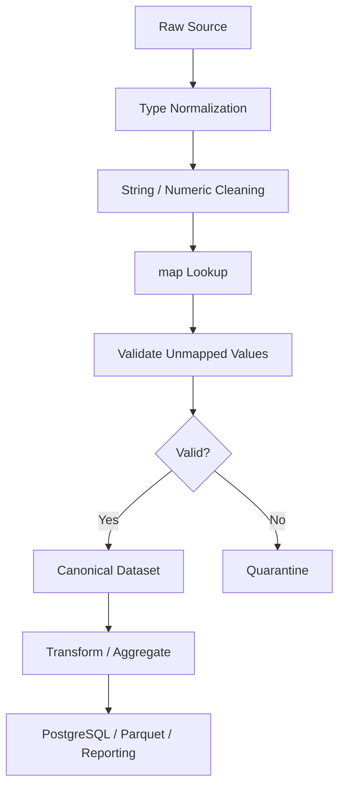

# 04- Map

## Overview

`Series.map()` is a Pandas transformation method used to replace each value in a Series according to a mapping or callable.

It is particularly useful when one input value should produce one corresponding output value:

```text
pending   → Pending
paid      → Paid
cancelled → Cancelled
```

The core abstraction is:

```text
Series
  ↓
map
  ↓
one output value per input value
```

Typical production uses include:

```text
Status normalization
Code-to-label conversion
Category mapping
Boolean normalization
Reference-data enrichment
Lookup-table transformations
Derived categorical fields
```

The important limitation is that `map()` is a **Series operation**. It transforms individual values but does not directly express row-level business logic across multiple columns.

For example:

```python
orders["status_label"] = (
    orders["status"].map(
        {
            "pending": "Pending",
            "paid": "Paid",
            "cancelled": "Cancelled",
        }
    )
)
```

This is appropriate because each `status` value independently determines one output value.

## Why `map()` Exists

Many transformations are lookup problems rather than arithmetic problems.

Suppose a source system sends:

```text
P
C
R
```

while the canonical system expects:

```text
P → pending
C → completed
R → rejected
```

An explicit mapping is clearer than a long conditional chain:

```python
status_map = {
    "P": "pending",
    "C": "completed",
    "R": "rejected",
}
```

Then:

```python
orders["status"] = (
    orders["status"]
    .map(status_map)
)
```

This makes the transformation:

```text
Explicit
Reviewable
Testable
Deterministic
```

## Basic Syntax

Dictionary mapping:

```python
series.map(mapping)
```

Callable mapping:

```python
series.map(function)
```

Example:

```python
orders["status_label"] = (
    orders["status"].map(
        {
            "pending": "Pending",
            "paid": "Paid",
            "cancelled": "Cancelled",
        }
    )
)
```

The output is a Series aligned with the original Series index.

## Input and Output Behavior

For:

```python
result = series.map(mapping)
```

the operation:

```text
Input:
    Series

Output:
    Series

Index:
    Preserved

Length:
    Preserved

Typical transformation:
    One input value → one output value
```

When mapping with a dictionary, a value not found in the mapping generally becomes missing.

Example:

```python
statuses = pd.Series(
    [
        "pending",
        "paid",
        "unknown",
    ],
    dtype="string",
)

result = statuses.map(
    {
        "pending": "PENDING",
        "paid": "PAID",
    }
)
```

Conceptually:

```text
pending → PENDING
paid    → PAID
unknown → missing
```

This behavior is critical when processing external data.

## Mapping with a Dictionary

The most common use is explicit lookup:

```python
status_mapping = {
    "pending": "PENDING",
    "paid": "PAID",
    "cancelled": "CANCELLED",
}

orders["status_code"] = (
    orders["status"]
    .map(status_mapping)
)
```

This is preferable when:

```text
Input domain is known
Output values are fixed
Business mapping is stable
```

## Mapping Categories

Example:

```python
segment_mapping = {
    "enterprise": "ENT",
    "business": "B2B",
    "consumer": "B2C",
}

customers["segment_code"] = (
    customers["segment"]
    .map(segment_mapping)
)
```

This is useful for:

```text
Reporting codes
Warehouse dimensions
API values
Database enums
Downstream system identifiers
```

## Mapping Numeric Codes

Legacy systems frequently use numeric codes:

```text
1 → active
2 → suspended
3 → deleted
```

Map them explicitly:

```python
account_status = {
    1: "active",
    2: "suspended",
    3: "deleted",
}

accounts["status"] = (
    accounts["status_code"]
    .map(account_status)
)
```

Be careful with missing and unexpected codes.

## Mapping to Boolean

A controlled boolean mapping:

```python
verification_mapping = {
    "Y": True,
    "N": False,
}

customers["is_verified"] = (
    customers["verified_flag"]
    .map(verification_mapping)
    .astype("boolean")
)
```

This is safer than:

```python
customers["is_verified"] = (
    customers["verified_flag"]
    .astype(bool)
)
```

because string values such as `"N"` are non-empty and therefore truthy in Python.

## `map()` and Missing Values

Unmapped values can become missing:

```python
mapping = {
    "paid": "settled",
}

orders["status_group"] = (
    orders["status"].map(mapping)
)
```

If the source contains:

```text
pending
```

the result can become:

```text
missing
```

This may be desirable when an incomplete mapping represents invalid source data.

It can also be dangerous if unmapped values should remain untouched.

## `map()` vs `replace()`

This is one of the most important comparisons.

### `map()`

```python
orders["status"] = (
    orders["status"].map(
        {
            "P": "pending",
            "C": "completed",
        }
    )
)
```

Unmapped values become missing.

### `replace()`

```python
orders["status"] = (
    orders["status"].replace(
        {
            "P": "pending",
            "C": "completed",
        }
    )
)
```

Values not present in the replacement mapping remain unchanged.

| Requirement | Prefer |
|---|---|
| Complete lookup table | `map()` |
| Unknown values should become missing | `map()` |
| Replace only known values | `replace()` |
| Partial canonicalization | `replace()` |
| Explicit detection of unmapped values | `map()` + validation |

The choice should be intentional.

## Detecting Unmapped Values

If every source value must map:

```python
status_mapping = {
    "P": "pending",
    "C": "completed",
    "R": "rejected",
}

mapped = (
    orders["status"]
    .map(status_mapping)
)

unmapped = (
    orders["status"].notna()
    & mapped.isna()
)
```

Then:

```python
invalid_rows = orders.loc[
    unmapped
].copy()
```

This turns missing mapping results into an explicit quality signal.

## Mapping with a Callable

`map()` can also apply a function to each value.

Example:

```python
orders["status"] = (
    orders["status"]
    .map(
        lambda value: (
            value.strip().casefold()
            if isinstance(value, str)
            else value
        )
    )
)
```

This is useful for custom element-level logic.

However, for standard string operations, prefer vectorized `.str` methods:

```python
orders["status"] = (
    orders["status"]
    .astype("string")
    .str.strip()
    .str.casefold()
)
```

Vectorized operations are generally clearer and more efficient.

## Callable Mapping with Named Functions

A named function is preferable when logic is non-trivial:

```python
def normalize_reference(
    value: str | None,
) -> str | None:
    if value is None:
        return None

    return value.strip().upper()


orders["reference"] = (
    orders["reference"]
    .map(normalize_reference)
)
```

This improves:

```text
Readability
Unit testing
Reuse
Debugging
```

For very large Series, benchmark custom callable mapping because Python-level execution can become a bottleneck.

## `map()` Is Element-Wise

`map()` conceptually processes values independently:

```text
input value
    ↓
mapping
    ↓
output value
```

It does not naturally express:

```text
quantity * unit_price
```

or:

```text
completed_at >= created_at
```

Those require vectorized expressions or other DataFrame operations.

## `map()` vs Vectorized Arithmetic

Prefer:

```python
orders["total"] = (
    orders["quantity"]
    * orders["unit_price"]
)
```

not:

```python
orders["total"] = (
    orders["quantity"]
    .map(...)
)
```

when the operation is arithmetic.

`map()` is primarily for value-level lookup or callable transformation.

## `map()` vs `apply()`

Both can perform element-level transformations.

```python
series.map(function)
```

is naturally suited to Series value mapping.

```python
series.apply(function)
```

is more general and supports broader callable behavior.

For a simple one-value-to-one-value transformation:

```python
series.map(function)
```

is usually the clearer choice.

For standard vectorized operations, both may be inferior to native Pandas or NumPy methods.

## Comparison

| Operation | Typical purpose |
|---|---|
| `map()` | Series element mapping |
| `apply()` | General Series/DataFrame callable operations |
| `.str` | Vectorized string operations |
| Arithmetic operators | Vectorized numerical transformations |
| `replace()` | Partial replacement |
| `merge()` | Relational lookup across DataFrames |
| `join()` | Index/key-based combination |

The right tool depends on the transformation's semantics.

## `map()` with a Series

A Series can act as the mapping source:

```python
country_codes = pd.Series(
    {
        "India": "IN",
        "United States": "US",
        "Germany": "DE",
    }
)

customers["country_code"] = (
    customers["country"]
    .map(country_codes)
)
```

This is useful when mapping data already exists as a Series keyed by source values.

## `map()` with a Dictionary-Like Object

A mapping can come from:

```text
dict
Series
dictionary-like object
```

The key represents the input value and the associated value becomes the output.

This is effectively a lookup operation.

## Reference Data and `map()`

Consider a static mapping:

```python
tier_discount = {
    "bronze": 0.00,
    "silver": 0.05,
    "gold": 0.10,
    "enterprise": 0.15,
}

customers["discount_rate"] = (
    customers["tier"]
    .map(tier_discount)
)
```

This is appropriate when the mapping is:

```text
Small
Stable
Configuration-like
```

For large or dynamic reference data, a join is often more appropriate.

## `map()` vs `merge()`

Suppose customer IDs need a segment:

```text
customer_id → segment
```

A small lookup mapping:

```python
segment_map = {
    "CUST-1": "gold",
    "CUST-2": "silver",
}

orders["segment"] = (
    orders["customer_id"]
    .map(segment_map)
)
```

is concise.

If the lookup contains millions of rows:

```text
orders
+
customer_reference
```

prefer:

```python
orders = orders.merge(
    customer_reference,
    on="customer_id",
    how="left",
    validate="many_to_one",
)
```

A join makes the relational operation explicit and is generally more appropriate for substantial reference datasets.

## Lookup Size Considerations

Use `map()` when:

```text
Lookup is small
Mapping fits naturally in memory
One key maps to one value
Only one or a few columns are required
```

Use `merge()` when:

```text
Reference table is large
Multiple output columns are required
Relationship validation matters
Reference data has relational semantics
```

## Mapping Multiple Attributes

`map()` normally produces one output Series.

If a lookup needs:

```text
segment
region
account_manager
credit_limit
```

a merge is generally clearer:

```python
orders = orders.merge(
    customers[
        [
            "customer_id",
            "segment",
            "region",
            "account_manager",
            "credit_limit",
        ]
    ],
    on="customer_id",
    how="left",
    validate="many_to_one",
)
```

Do not force a multi-column relationship into repeated `map()` operations when a relational join better represents the data model.

## Preserving Unknown Values

Suppose known status codes should be normalized but unknown values should remain visible.

Use `replace()`:

```python
orders["status"] = (
    orders["status"]
    .replace(
        {
            "P": "pending",
            "C": "completed",
        }
    )
)
```

Using `map()` would turn an unknown code into missing.

## Mapping and Data Cleaning

`map()` is particularly useful after initial normalization:

```python
orders["status"] = (
    orders["status"]
    .astype("string")
    .str.strip()
    .str.casefold()
)

status_mapping = {
    "p": "pending",
    "paid": "paid",
    "complete": "completed",
}

orders["status_canonical"] = (
    orders["status"]
    .map(status_mapping)
)
```

This gives:

```text
Raw representation
    ↓
String normalization
    ↓
Canonical lookup
    ↓
Validation
```

## Mapping and Validation

A strong pattern is:

```python
mapped_status = (
    orders["status"]
    .map(status_mapping)
)

invalid_status = (
    orders["status"].notna()
    & mapped_status.isna()
)

orders["status"] = mapped_status
```

Now unknown source values can be handled explicitly:

```python
rejected = orders.loc[
    invalid_status
].copy()
```

This is safer than silently allowing missing mapped values into the next stage.

## Mapping and Missing Input

Missing input should normally remain missing:

```python
values = pd.Series(
    [
        "A",
        None,
    ],
    dtype="string",
)

result = values.map(
    {
        "A": "active",
    }
)
```

The result for the original missing value should remain missing.

This is different from an unmapped non-null value, even if both appear missing after mapping.

## Distinguishing Missing from Unmapped

```python
raw = orders["status"]

mapped = raw.map(
    status_mapping
)

original_missing = (
    raw.isna()
)

unmapped = (
    raw.notna()
    & mapped.isna()
)
```

This distinction is valuable for data-quality reporting.

## Mapping and Index Preservation

`map()` preserves the original Series index.

Example:

```python
statuses = pd.Series(
    ["P", "C"],
    index=[100, 200],
)

mapped = statuses.map(
    {
        "P": "pending",
        "C": "completed",
    }
)
```

The result retains:

```text
100
200
```

This is important when assigning back to the source DataFrame.

## Mapping and Alignment

Because the result preserves the input Series index:

```python
orders["status"] = (
    orders["status"]
    .map(status_mapping)
)
```

the transformed values naturally align with the DataFrame rows.

This is one reason `map()` is convenient for Series-level enrichment.

## Mapping and Duplicate Inputs

Duplicate source values are not a problem for `map()`:

```text
gold
gold
silver
gold
```

each value is transformed independently.

The mapping keys must be unique conceptually.

If a business key maps to multiple possible outputs, a dictionary lookup is not sufficient.

Use relational data and `merge()` with appropriate cardinality validation.

## Mapping with Duplicate Reference Keys

A dictionary cannot naturally represent:

```text
customer_id
→ multiple rows
```

For example:

```text
CUST-1 → region A
CUST-1 → region B
```

If multiple reference rows are possible, `map()` hides the relational problem.

Use a DataFrame join with explicit cardinality checks and resolve duplicates according to business rules.

## Mapping and Categorical Data

Mapped output can often be converted to category when the resulting domain is small:

```python
orders["status_group"] = (
    orders["status"]
    .map(status_mapping)
    .astype("category")
)
```

This can reduce memory for large Series with repeated values.

Only use categorical dtype when the cardinality and downstream behavior justify it.

## Mapping and Nullable Dtypes

Mapping can introduce missing values, which may affect dtype inference.

For booleans:

```python
orders["is_priority"] = (
    orders["priority_code"]
    .map(
        {
            "Y": True,
            "N": False,
        }
    )
    .astype("boolean")
)
```

Explicitly enforce the desired nullable dtype when downstream code depends on it.

## Mapping and Numeric Dtypes

Suppose:

```python
priority_map = {
    "low": 1,
    "medium": 2,
    "high": 3,
}
```

Then:

```python
orders["priority_rank"] = (
    orders["priority"]
    .map(priority_map)
)
```

If some values are unmapped, missing values may influence the resulting dtype.

If a nullable integer is required:

```python
orders["priority_rank"] = (
    orders["priority"]
    .map(priority_map)
    .astype("Int64")
)
```

## Mapping and Data Types

The mapping can change the semantic type.

Examples:

```text
string → string
string → boolean
string → integer
string → category
integer → string
```

After mapping, inspect or enforce the expected dtype.

Do not assume the output automatically matches the target schema.

## Mapping Functions and Null Values

When using a callable, account for missing values where necessary:

```python
def normalize_code(
    value: str | None,
) -> str | None:
    if value is None:
        return None

    return value.strip().upper()
```

A callable that assumes every input is a string can fail on null or unexpected types.

If input dtype is already Pandas `string`, missing values may be represented by `pd.NA`, so functions should be written with the actual input semantics in mind.

## Prefer Vectorized Operations for Strings

Instead of:

```python
orders["status"] = (
    orders["status"]
    .map(
        lambda value: (
            value.strip().lower()
            if isinstance(value, str)
            else value
        )
    )
)
```

prefer:

```python
orders["status"] = (
    orders["status"]
    .astype("string")
    .str.strip()
    .str.casefold()
)
```

This is:

```text
Clearer
More idiomatic
Generally faster
Easier to optimize
```

## Mapping for Derived Labels

`map()` is well suited for turning internal codes into reporting labels:

```python
channel_labels = {
    "web": "Web",
    "app": "Mobile App",
    "store": "Retail Store",
}

orders["channel_label"] = (
    orders["channel"]
    .map(channel_labels)
)
```

This keeps reporting presentation logic separate from source codes.

## Mapping for Priority

```python
priority_rank = {
    "critical": 4,
    "high": 3,
    "medium": 2,
    "low": 1,
}

tickets["priority_rank"] = (
    tickets["priority"]
    .map(priority_rank)
)
```

This supports:

```python
tickets.sort_values(
    "priority_rank",
    ascending=False,
)
```

The original semantic category remains available.

## Mapping for Currency Metadata

A small static lookup can be appropriate:

```python
currency_decimals = {
    "JPY": 0,
    "INR": 2,
    "USD": 2,
    "EUR": 2,
}

orders["currency_decimals"] = (
    orders["currency"]
    .map(currency_decimals)
)
```

For a larger currency reference table containing:

```text
currency
country
symbol
minor_unit
numeric_code
```

a relational join is generally more appropriate.

## Mapping and Configuration

Small lookup mappings can come from application configuration:

```python
STATUS_MAPPING = {
    "P": "pending",
    "C": "completed",
    "R": "rejected",
}
```

This is useful when the mapping is:

```text
Stable
Version-controlled
Small
Reviewed
```

Do not use application configuration as a substitute for a proper reference table when mapping data changes frequently.

## Mapping and External Reference Data

For dynamic lookup data:

```text
Database
S3 reference file
Configuration service
Data warehouse
```

load the reference dataset and use a merge where appropriate.

Example:

```python
product_reference = pd.read_parquet(
    "reference/products.parquet"
)

orders = orders.merge(
    product_reference[
        [
            "product_id",
            "category",
        ]
    ],
    on="product_id",
    how="left",
    validate="many_to_one",
)
```

A relational join provides stronger integrity guarantees than a large dictionary.

## Mapping and ETL

`map()` often belongs in the canonicalization stage:



This is especially useful for small, stable code-to-value mappings.

## Mapping and REST APIs

An API may return:

```json
{
  "status_code": "P",
  "channel": "M"
}
```

Normalize with explicit mappings:

```python
status_map = {
    "P": "pending",
    "C": "completed",
    "R": "rejected",
}

channel_map = {
    "W": "web",
    "M": "mobile",
}

orders["status"] = (
    orders["status_code"]
    .map(status_map)
)

orders["channel"] = (
    orders["channel"]
    .map(channel_map)
)
```

Then validate unknown codes before persistence.

## Mapping and PostgreSQL

If the reference mapping already exists in PostgreSQL, consider doing the lookup in SQL.

For example:

```sql
SELECT
    o.order_id,
    o.status_code,
    s.status_name
FROM orders AS o
LEFT JOIN status_reference AS s
    ON o.status_code = s.status_code;
```

The choice between SQL and Pandas depends on:

```text
Data volume
Reference size
Network transfer
Reuse
Database load
Transformation complexity
```

Do not extract a large lookup table into Python unnecessarily.

## Mapping and Kafka

Event systems often contain versioned codes:

```text
event_type = "PAYMENT_CAPTURED"
```

or compact numeric codes.

Use `map()` for a small, versioned lookup:

```python
event_labels = {
    "PAYMENT_CAPTURED": "payment_captured",
    "PAYMENT_FAILED": "payment_failed",
}

events["event_name"] = (
    events["event_type"]
    .map(event_labels)
)
```

Unknown event types should be observable because they may indicate producer schema evolution.

## Mapping and Batch Processing

A batch pipeline should apply the same mapping consistently to every chunk:

```python
status_map = {
    "P": "pending",
    "C": "completed",
    "R": "rejected",
}

for chunk in pd.read_csv(
    "orders.csv",
    chunksize=100_000,
):
    chunk["status"] = (
        chunk["status"]
        .map(status_map)
    )

    process_chunk(chunk)
```

The mapping should be immutable for the duration of the batch where reproducibility matters.

## Performance Considerations

Dictionary-based mapping is generally efficient for small lookup tables.

For large datasets, performance depends on:

```text
Number of rows
Mapping size
Value dtype
Callable vs dictionary
Memory allocation
Downstream transformations
```

A dictionary lookup is usually preferable to a Python loop.

Avoid:

```python
[
    mapping.get(value)
    for value in orders["status"]
]
```

when:

```python
orders["status"].map(mapping)
```

expresses the same operation.

## Callable Performance

A Python function:

```python
orders["code"].map(
    custom_function
)
```

may execute Python code for every element.

If the transformation can be written as:

```python
orders["code"].str.strip()
```

or:

```python
orders["amount"] * 1.18
```

prefer the vectorized form.

## Memory Considerations

Mapping creates a result Series.

If you keep both:

```python
orders["status_code"]
orders["status"]
```

memory usage increases.

Retain both only when:

```text
Raw lineage
Auditability
Debugging
External reconciliation
```

justify the additional memory.

For large datasets, consider storing raw source fields separately from the canonical dataset if appropriate.

## Avoid Repeated Mapping

Do not repeatedly transform the same field:

```python
orders["status"] = (
    orders["status"].map(status_map)
)

orders["status"] = (
    orders["status"].map(status_map)
)
```

After the first transformation, the values may no longer match the mapping keys.

Normalize once and treat the result as canonical.

## Idempotency

A mapping is idempotent only when the mapping's output domain is also stable under another application.

For example:

```python
mapping = {
    "P": "pending",
    "C": "completed",
}
```

Applying it twice:

```text
P
↓
pending
↓
missing
```

is not idempotent.

A production pipeline should therefore clearly distinguish:

```text
raw code field
```

from:

```text
canonical field
```

rather than repeatedly mapping the same column.

## Mapping Output to a New Column

Prefer:

```python
orders["status"] = (
    orders["status_code"]
    .map(status_map)
)
```

when the original source code is no longer required.

Prefer:

```python
orders["status"] = (
    orders["status_code"]
    .map(status_map)
)
```

with both columns retained when auditability requires the raw code.

Naming should make lineage clear:

```text
status_code
status
```

## Mapping Unknown Values to a Default

Sometimes the business explicitly requires a default:

```python
orders["risk_group"] = (
    orders["risk_code"]
    .map(risk_map)
    .fillna("unknown")
)
```

This should only be used when:

```text
Unknown input
    → "unknown"
```

is a valid business rule.

Do not use `fillna()` merely to eliminate validation failures.

A better pattern for strict pipelines is:

```python
mapped = orders[
    "risk_code"
].map(risk_map)

unmapped = (
    orders["risk_code"].notna()
    & mapped.isna()
)

if unmapped.any():
    raise ValueError(
        "Unknown risk codes detected"
    )

orders["risk_group"] = mapped
```

## Mapping and Data Quality Thresholds

Monitor:

```text
Mapped rows
Unmapped rows
Mapping failure rate
New source codes
Unknown categories
```

Example:

```python
mapping_failure_rate = (
    unmapped.mean()
)

if mapping_failure_rate > 0.01:
    raise ValueError(
        "Mapping failure rate exceeds 1%"
    )
```

This can identify upstream contract changes.

## Mapping and Schema Evolution

An upstream API or Kafka producer may introduce:

```text
new_status
```

without warning.

A strict mapping can expose this immediately:

```python
mapped = (
    events["status"]
    .map(status_map)
)

unknown = (
    events["status"].notna()
    & mapped.isna()
)
```

This is often preferable to silently treating the new value as an existing category.

## Security Considerations

Mapping is not input sanitization.

Never assume that a mapped label is safe to interpolate into:

```text
SQL
shell commands
file paths
HTML
logs
```

Use appropriate encoding and parameterization at the destination.

For sensitive lookup keys, avoid logging complete values unnecessarily.

## Reliability Considerations

A production mapping layer should be:

```text
Deterministic
Versioned
Tested
Observable
Explicit about unknown values
```

If a mapping comes from configuration, version the configuration alongside the pipeline when reproducibility matters.

For dynamic reference data, record the reference-data version or effective date when historical reproducibility matters.

## Testing `map()`

Tests should verify:

```text
Known values map correctly
Unknown values behave according to policy
Missing values remain distinguishable
Output dtype is correct
Index is preserved
Mapping is complete when required
```

Example:

```python
import pandas as pd


def test_status_mapping() -> None:
    values = pd.Series(
        [
            "P",
            "C",
            "UNKNOWN",
            None,
        ],
        dtype="string",
    )

    mapping = {
        "P": "pending",
        "C": "completed",
    }

    result = values.map(mapping)

    assert result.iloc[0] == "pending"
    assert result.iloc[1] == "completed"
    assert pd.isna(result.iloc[2])
    assert pd.isna(result.iloc[3])
```

## Testing Complete Mapping Coverage

```python
def test_all_non_null_status_codes_are_mapped() -> None:
    values = pd.Series(
        [
            "P",
            "C",
            "R",
        ],
        dtype="string",
    )

    mapping = {
        "P": "pending",
        "C": "completed",
        "R": "rejected",
    }

    result = values.map(mapping)

    unmapped = (
        values.notna()
        & result.isna()
    )

    assert not unmapped.any()
```

This test protects the source-to-canonical contract.

## Testing Unknown Values

```python
def test_unknown_status_is_detected() -> None:
    values = pd.Series(
        [
            "P",
            "NEW_CODE",
        ],
        dtype="string",
    )

    mapping = {
        "P": "pending",
    }

    result = values.map(mapping)

    unknown = (
        values.notna()
        & result.isna()
    )

    assert unknown.tolist() == [
        False,
        True,
    ]
```

## Testing Nullable Boolean Output

```python
def test_boolean_mapping_preserves_missing() -> None:
    values = pd.Series(
        [
            "Y",
            "N",
            None,
        ],
        dtype="string",
    )

    result = (
        values
        .map(
            {
                "Y": True,
                "N": False,
            }
        )
        .astype("boolean")
    )

    assert result.tolist() == [
        True,
        False,
        pd.NA,
    ]
```

## Testing Index Preservation

```python
def test_map_preserves_index() -> None:
    values = pd.Series(
        [
            "P",
            "C",
        ],
        index=[
            101,
            205,
        ],
        dtype="string",
    )

    result = values.map(
        {
            "P": "pending",
            "C": "completed",
        }
    )

    assert result.index.tolist() == [
        101,
        205,
    ]
```

This protects against accidental positional assumptions.

## Testing Mapping vs Replacement Behavior

```python
def test_replace_preserves_unknown_values() -> None:
    values = pd.Series(
        [
            "P",
            "UNKNOWN",
        ],
        dtype="string",
    )

    result = values.replace(
        {
            "P": "pending",
        }
    )

    assert result.tolist() == [
        "pending",
        "UNKNOWN",
    ]
```

The test demonstrates why `replace()` may be preferable for partial canonicalization.

## Common Mistakes

| Mistake | Why it happens | Better approach |
|---|---|---|
| Using `map()` for row-level logic | Every transformation looks like a lookup | Use vectorized expressions or `apply()` where appropriate |
| Forgetting unmapped values become missing | Mapping behavior is assumed to be like replacement | Explicitly inspect unmapped values |
| Using `map()` when unknown values must remain unchanged | `map()` is mistaken for `replace()` | Prefer `replace()` |
| Using `apply()` for simple mappings | Python functions feel familiar | Use dictionary mapping |
| Mapping large reference tables repeatedly | Lookup appears simpler than a join | Use `merge()` for relational reference data |
| Mapping identifiers after normalization without preserving raw values | Canonical data replaces source evidence | Preserve source keys when required |
| Applying a mapping twice | Transformation stages are unclear | Map raw fields once into canonical fields |
| Using `fillna("unknown")` without a business rule | Missing mapped values are inconvenient | Detect unmapped values explicitly |
| Ignoring output dtype | Mapping changes semantic type | Validate or enforce the dtype |
| Treating missing and unmapped values as identical | Both may appear null afterward | Compare raw and mapped Series |
| Using callable mapping for standard string operations | `.str` API is overlooked | Prefer vectorized string methods |
| Assuming dictionary mappings represent one-to-many relationships | Relational semantics are ignored | Use a DataFrame and `merge()` |

## Production Pitfalls

### Silent Unknown Values

This is dangerous:

```python
orders["status"] = (
    orders["status"].map(
        status_mapping
    )
)
```

when the source can introduce new codes.

A new source value can silently become missing.

For strict pipelines, calculate the unmapped mask first.

### Mapping the Wrong Field

If:

```text
status
```

already contains canonical values:

```text
pending
completed
```

but the mapping expects source codes:

```text
P
C
```

applying the mapping again produces missing values.

Keep source and canonical fields distinct where practical.

### Large Dictionary as a Database Substitute

A giant in-memory mapping:

```python
customer_map = {
    ...
}
```

can consume significant memory and make freshness difficult to manage.

If the reference data is large or dynamic, a relational join is usually a better architecture.

### Hidden Many-to-One Assumptions

A mapping assumes:

```text
one source value
    →
one output value
```

If the business relationship is more complex, `map()` can hide the underlying data-model problem.

### Defaulting Unknown Values

This:

```python
.map(mapping)
.fillna("unknown")
```

may be valid for a reporting dimension but dangerous for an operational pipeline because it hides source-contract changes.

Use the default only when it is an explicit business requirement.

## Recommended Production Pattern

For a controlled source-to-canonical transformation:

```python
import pandas as pd


STATUS_MAPPING = {
    "P": "pending",
    "C": "completed",
    "R": "rejected",
}


def normalize_status(
    values: pd.Series,
) -> tuple[
    pd.Series,
    pd.Series,
]:
    raw = (
        values
        .astype("string")
        .str.strip()
        .str.upper()
    )

    mapped = raw.map(
        STATUS_MAPPING
    )

    unknown = (
        raw.notna()
        & mapped.isna()
    )

    return mapped, unknown


def transform_orders(
    orders: pd.DataFrame,
) -> tuple[
    pd.DataFrame,
    pd.DataFrame,
]:
    result = orders.copy()

    result["status"], unknown = (
        normalize_status(
            result["status_code"]
        )
    )

    valid = ~unknown

    clean = result.loc[
        valid
    ].copy()

    rejected = result.loc[
        ~valid
    ].copy()

    return clean, rejected
```

This provides a clear production boundary:

```text
Raw code
    ↓
String normalization
    ↓
Explicit map
    ↓
Unknown-code detection
    ↓
Valid / rejected
```

## Choosing Between `map()`, `replace()`, and `merge()`

| Requirement | Preferred operation |
|---|---|
| Small complete lookup | `map()` |
| Known-value replacement with unknowns preserved | `replace()` |
| Large lookup table | `merge()` |
| Multiple reference attributes | `merge()` |
| Element-level custom function | `map()` / `apply()` |
| Vectorized string transformation | `.str` |
| Vectorized numeric calculation | Arithmetic / NumPy |

Choosing the correct abstraction improves both readability and performance.

## Production Checklist

Before using `map()` in a production Pandas pipeline:

- Confirm that the transformation is genuinely one-value-to-one-value.
- Use an explicit dictionary for stable code-to-value mappings.
- Normalize source values before applying the mapping.
- Decide whether unknown values should become missing or remain unchanged.
- Detect unmapped non-null values when completeness is required.
- Distinguish original missing values from mapping failures.
- Use `replace()` when partial replacement is the intended behavior.
- Use `merge()` for large or relational reference datasets.
- Preserve raw source values when auditability matters.
- Validate the output dtype when the mapped type is important.
- Avoid applying the same mapping repeatedly to canonical values.
- Prefer vectorized `.str` or arithmetic operations over callable `map()` when available.
- Keep static mappings version-controlled.
- Monitor mapping failure rates and newly observed source codes.
- Test known values, unknown values, nulls, output dtype, and index preservation.
- Treat mapping rules as part of the data contract when they affect persisted or shared datasets.

## Key Takeaways

- `Series.map()` is best for **element-level lookup transformations** where one input value maps to one output value.
- Dictionary mapping is explicit and predictable, but **unmapped non-null values become missing**, so completeness must be validated when required.
- Choose `map()` for small lookups, `replace()` for partial substitutions, and `merge()` for large or relational reference data.
- Keep raw and canonical fields distinct when necessary, avoid remapping canonical values, and preserve mapping versions for reproducible ETL.
- Prefer native vectorized Pandas operations over callable `map()` when the transformation is fundamentally a string, numeric, datetime, or multi-column operation.