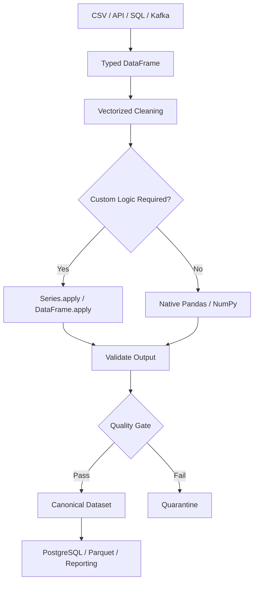

# 05- Apply

## Overview

`apply()` allows Pandas to execute a Python callable across a Series, DataFrame, row, or column.

It exists for transformations that are difficult or impractical to express with Pandas' native vectorized operations.

Typical use cases include:

```text
Custom business rules
Complex parsing
Reusable domain-specific functions
Multi-column row logic
Column-wise custom transformations
```

The important engineering principle is:

```text
Use native vectorized Pandas operations first.
Use apply() when the logic genuinely requires custom Python execution.
```

For example, this is a good use of vectorization:

```python
orders["total_amount"] = (
    orders["quantity"]
    * orders["unit_price"]
)
```

Using `apply(axis=1)` for the same calculation would add unnecessary Python-level row processing.

A typical transformation decision is:

```text
Can Pandas / NumPy express the operation?
        │
        ├── Yes → Vectorized operation
        │
        └── No
             ↓
        Can Series.map() express it?
             │
             ├── Yes → map()
             │
             └── No → apply()
```

## Why `apply()` Exists

Data transformations are not always simple arithmetic, string operations, or direct lookups.

For example:

```text
amount + tax
```

is naturally vectorized.

But a complex business rule such as:

```text
priority depends on customer segment,
order amount,
payment status,
and delivery region
```

may require logic that is easier to express as a Python function.

`apply()` provides an escape hatch from the built-in vectorized API.

It should therefore be viewed as a **flexibility mechanism**, not the default transformation mechanism.

## Forms of `apply()`

Pandas supports `apply()` on both Series and DataFrames.

### Series

```python
series.apply(function)
```

The callable typically receives one Series element at a time.

### DataFrame

```python
df.apply(function, axis=0)
```

The callable receives one column at a time.

```python
df.apply(function, axis=1)
```

The callable receives one row at a time.

This distinction is critical for both correctness and performance.

## Series `apply()`

Example:

```python
def normalize_reference(
    value: str | None,
) -> str | None:
    if value is None:
        return None

    return value.strip().upper()


orders["reference"] = (
    orders["reference"]
    .apply(normalize_reference)
)
```

Each value is passed to the function independently.

The output is another Series aligned with the original index.

## When Series `apply()` Is Appropriate

Use Series `apply()` when:

```text
Logic is genuinely custom
No suitable vectorized operation exists
The function is naturally element-oriented
The dataset size makes Python execution acceptable
```

Example:

```python
def classify_amount(
    amount: float | None,
) -> str:
    if amount is None:
        return "missing"

    if amount >= 100_000:
        return "enterprise"

    if amount >= 10_000:
        return "high"

    return "standard"


orders["amount_class"] = (
    orders["amount"]
    .apply(classify_amount)
)
```

However, if the classification can be expressed with vectorized comparisons and `np.select()`, that may be preferable.

## Series `apply()` vs `map()`

Both can process Series values.

| Operation | Best fit |
|---|---|
| `map()` | Lookup or element-wise mapping |
| `apply()` | General custom element-level logic |
| `.str` | Vectorized string operations |
| Arithmetic | Vectorized numerical operations |

For a dictionary:

```python
orders["status"] = (
    orders["status"]
    .map(
        {
            "P": "pending",
            "C": "completed",
        }
    )
)
```

prefer `map()`.

For a custom function:

```python
orders["label"] = (
    orders["amount"]
    .apply(classify_amount)
)
```

`apply()` may be appropriate.

## DataFrame `apply()`

A DataFrame `apply()` can execute a function across columns or rows.

Default behavior:

```python
orders.apply(function)
```

is equivalent to:

```python
orders.apply(
    function,
    axis=0,
)
```

The function receives each column as a Series.

With:

```python
axis=1
```

the function receives each row as a Series.

## `axis=0`

Example:

```python
summary = orders[
    [
        "quantity",
        "amount",
    ]
].apply(
    lambda column: column.mean()
)
```

The callable receives:

```text
quantity Series
amount Series
```

and returns one result per column.

This can be useful for:

```text
Column-wise statistics
Custom column profiling
Generic schema operations
```

For standard aggregation, prefer:

```python
orders[
    [
        "quantity",
        "amount",
    ]
].mean()
```

because the built-in operation is clearer and generally faster.

## `axis=1`

With:

```python
orders.apply(
    function,
    axis=1,
)
```

the callable receives one row at a time.

Example:

```python
def calculate_total(
    row: pd.Series,
) -> float:
    return (
        row["quantity"]
        * row["unit_price"]
        + row["tax"]
    )


orders["total_amount"] = (
    orders.apply(
        calculate_total,
        axis=1,
    )
)
```

This works, but it is slower than:

```python
orders["total_amount"] = (
    orders["quantity"]
    * orders["unit_price"]
    + orders["tax"]
)
```

Use row-wise `apply()` only when the transformation genuinely requires row-level custom logic.

## Why `axis=1` Is Expensive

A DataFrame is column-oriented.

For:

```python
df.apply(
    function,
    axis=1,
)
```

Pandas constructs a Series-like representation for each row and invokes Python code repeatedly.

For a large DataFrame:

```text
1,000,000 rows
    ↓
potentially 1,000,000 Python function calls
```

This can become a major bottleneck.

Vectorized operations instead operate over entire arrays/Series.

## Internal Execution Model

Conceptually:

```text
Vectorized operation:

Series → array operation → Series

apply(axis=1):

DataFrame
   ↓
row 1 → Python function
row 2 → Python function
row 3 → Python function
...
row N → Python function
   ↓
result Series
```

The second path introduces substantial Python-level dispatch overhead.

This is why `apply(axis=1)` should be considered a deliberate performance trade-off.

## Vectorization First

Suppose:

```python
orders["risk"] = orders.apply(
    lambda row: (
        "high"
        if row["amount"] >= 10_000
        else "low"
    ),
    axis=1,
)
```

Prefer:

```python
orders["risk"] = np.where(
    orders["amount"].ge(10_000),
    "high",
    "low",
)
```

For multiple conditions:

```python
conditions = [
    orders["amount"].ge(100_000),
    orders["amount"].ge(10_000),
]

choices = [
    "critical",
    "high",
]

orders["risk"] = np.select(
    conditions,
    choices,
    default="normal",
)
```

This keeps the transformation vectorized.

## `.apply()` vs `np.select()`

Use `np.select()` when:

```text
Conditions are columnar
Rules are mutually prioritized
Output depends on multiple boolean masks
```

Example:

```python
conditions = [
    (
        orders["status"].eq("cancelled")
        | orders["amount"].lt(0)
    ),
    orders["amount"].ge(100_000),
]

choices = [
    "review",
    "high_value",
]

orders["classification"] = np.select(
    conditions,
    choices,
    default="normal",
)
```

This is often preferable to row-wise `apply()`.

## `.apply()` vs `map()`

Consider:

```text
P → pending
C → completed
```

Use:

```python
orders["status"] = (
    orders["status_code"]
    .map(
        {
            "P": "pending",
            "C": "completed",
        }
    )
)
```

not:

```python
orders["status"] = (
    orders["status_code"]
    .apply(
        lambda value: {
            "P": "pending",
            "C": "completed",
        }.get(value)
    )
)
```

The `map()` version communicates that this is a lookup and avoids reconstructing the mapping repeatedly.

## `.apply()` vs `.str`

For string cleanup:

```python
orders["customer_name"] = (
    orders["customer_name"]
    .astype("string")
    .str.strip()
    .str.casefold()
)
```

This is preferable to:

```python
orders["customer_name"] = (
    orders["customer_name"]
    .apply(
        lambda value: (
            value.strip().casefold()
            if isinstance(value, str)
            else value
        )
    )
)
```

Use the vectorized `.str` API for supported string operations.

## `.apply()` vs Arithmetic

Avoid:

```python
orders["total"] = orders.apply(
    lambda row: (
        row["quantity"]
        * row["unit_price"]
    ),
    axis=1,
)
```

Prefer:

```python
orders["total"] = (
    orders["quantity"]
    * orders["unit_price"]
)
```

The vectorized version is simpler and generally much faster.

## `.apply()` vs Datetime Operations

Avoid:

```python
orders["year"] = (
    orders["created_at"]
    .apply(
        lambda value: value.year
    )
)
```

Prefer:

```python
orders["year"] = (
    orders["created_at"]
    .dt.year
)
```

The `.dt` accessor expresses datetime semantics directly.

## `.apply()` vs Aggregation

Avoid:

```python
orders["amount"].apply(
    lambda x: x.sum()
)
```

for a Series-level aggregate.

Prefer:

```python
orders["amount"].sum()
```

Similarly:

```python
orders.groupby("customer_id")[
    "amount"
].sum()
```

should be preferred over custom `apply()` logic when standard aggregation is sufficient.

## Row-Wise Business Logic

There are legitimate cases for `axis=1`.

For example:

```python
def shipping_zone(
    row: pd.Series,
) -> str:
    if row["country"] != "IN":
        return "international"

    if row["postal_code"] in {
        "400001",
        "400002",
    }:
        return "metro"

    return "domestic"


orders["shipping_zone"] = (
    orders.apply(
        shipping_zone,
        axis=1,
    )
)
```

This can be reasonable if the logic cannot be cleanly expressed through vectorized boolean masks or lookup operations.

Before adopting it, evaluate:

```text
Dataset size
Execution frequency
Latency requirements
Alternative vectorized design
```

## Custom Business Rules

`apply()` is useful when business logic is genuinely procedural.

Example:

```python
def determine_review_status(
    row: pd.Series,
) -> str:
    if row["payment_status"] != "paid":
        return "payment_review"

    if row["amount"] >= 100_000:
        return "manual_review"

    if row["customer_tenure_days"] < 30:
        return "new_customer_review"

    return "approved"


orders["review_status"] = (
    orders.apply(
        determine_review_status,
        axis=1,
    )
)
```

For production, this logic should be documented and tested like ordinary backend business logic.

## Extract Business Logic from Lambdas

Avoid large inline lambdas:

```python
orders["risk"] = orders.apply(
    lambda row: (
        ...
    ),
    axis=1,
)
```

Prefer a named function:

```python
def determine_risk(
    row: pd.Series,
) -> str:
    ...


orders["risk"] = orders.apply(
    determine_risk,
    axis=1,
)
```

This improves:

```text
Readability
Testing
Debugging
Code review
Reuse
```

## Callable Return Types

The callable passed to `apply()` determines the output shape.

A function returning a scalar:

```python
def row_total(
    row: pd.Series,
) -> float:
    return (
        row["quantity"]
        * row["unit_price"]
    )
```

produces one result per row.

A function returning a Series:

```python
def row_features(
    row: pd.Series,
) -> pd.Series:
    return pd.Series(
        {
            "subtotal": (
                row["quantity"]
                * row["unit_price"]
            ),
            "is_high_value": (
                row["quantity"]
                * row["unit_price"]
                >= 10_000
            ),
        }
    )
```

can expand into multiple output columns when used appropriately.

However, this is usually more expensive than constructing each column with vectorized operations.

## Returning Multiple Values

If custom row logic genuinely needs to derive multiple fields:

```python
def classify_order(
    row: pd.Series,
) -> pd.Series:
    total = (
        row["quantity"]
        * row["unit_price"]
    )

    return pd.Series(
        {
            "total_amount": total,
            "is_high_value": total >= 10_000,
        }
    )


derived = orders.apply(
    classify_order,
    axis=1,
)

orders[
    [
        "total_amount",
        "is_high_value",
    ]
] = derived
```

This is readable but potentially expensive on large datasets.

Prefer separate vectorized calculations when possible.

## `result_type`

For DataFrame `apply(axis=1)`, `result_type` can influence how list-like return values are handled.

For example:

```python
result = orders.apply(
    lambda row: [
        row["quantity"],
        row["unit_price"],
    ],
    axis=1,
    result_type="expand",
)
```

This can expand returned values into columns.

Use this intentionally because output shape becomes part of the transformation contract.

## Applying Across Columns

Example:

```python
numeric_summary = orders[
    [
        "amount",
        "quantity",
    ]
].apply(
    lambda column: column.max()
    - column.min()
)
```

The callable receives one column at a time.

For standard operations, direct vectorized APIs are generally clearer:

```python
numeric_summary = (
    orders[
        [
            "amount",
            "quantity",
        ]
    ].max()
    - orders[
        [
            "amount",
            "quantity",
        ]
    ].min()
)
```

## `raw=True`

DataFrame `apply()` supports `raw=True`.

```python
result = orders[
    [
        "quantity",
        "unit_price",
    ]
].apply(
    np.sum,
    axis=1,
    raw=True,
)
```

With `raw=True`, the callable receives an ndarray instead of a Series.

This can reduce some overhead when the function works naturally with NumPy arrays.

However:

```text
No column labels
No row Series metadata
More positional logic
```

Use it only when the callable is designed for array input.

## `raw=True` Trade-Off

Compare:

```python
def calculate_total(
    row: pd.Series,
) -> float:
    return (
        row["quantity"]
        * row["unit_price"]
    )
```

with:

```python
def calculate_total(
    row: np.ndarray,
) -> float:
    return row[0] * row[1]


result = orders[
    [
        "quantity",
        "unit_price",
    ]
].apply(
    calculate_total,
    axis=1,
    raw=True,
)
```

The second form loses label-based readability.

Only use it when profiling shows the optimization matters and the positional contract is stable.

## `args` and Additional Parameters

A callable can receive additional positional parameters:

```python
def apply_tax(
    amount: float,
    rate: float,
) -> float:
    return amount * rate


orders["tax"] = (
    orders["amount"]
    .apply(
        apply_tax,
        args=(0.18,),
    )
)
```

Keyword arguments can often make configuration more readable when supported by the callable structure.

## Prefer Closures or Named Configuration Carefully

For configurable business rules:

```python
def classify_amount(
    amount: float,
    threshold: float,
) -> str:
    return (
        "high"
        if amount >= threshold
        else "normal"
    )


threshold = 10_000

orders["amount_class"] = (
    orders["amount"]
    .apply(
        classify_amount,
        args=(threshold,),
    )
)
```

For complex configuration, a named callable object or function with explicit parameters can be easier to test than deeply nested lambdas.

## Null Handling

A custom function must explicitly consider missing values.

Example:

```python
def normalize_code(
    value: object,
) -> str | None:
    if pd.isna(value):
        return None

    return str(value).strip().upper()


orders["code"] = (
    orders["code"]
    .apply(normalize_code)
)
```

For standard string operations, use:

```python
orders["code"] = (
    orders["code"]
    .astype("string")
    .str.strip()
    .str.upper()
)
```

when possible.

## Unexpected Types

External data may contain:

```text
str
int
float
None
pd.NA
```

A custom function should not blindly assume a single type unless the schema guarantees it.

Prefer normalizing the input type before `apply()`:

```python
orders["reference"] = (
    orders["reference"]
    .astype("string")
)
```

Then custom logic operates on a predictable representation.

## Exceptions Inside `apply()`

If a function raises:

```python
ValueError
KeyError
TypeError
```

the `apply()` operation usually fails.

This is often desirable for strict pipelines.

Avoid hiding exceptions:

```python
def unsafe_transform(value):
    try:
        return transform(value)
    except Exception:
        return None
```

unless converting failures to missing values is explicitly part of the data contract.

Otherwise, malformed records can disappear silently.

## Error Classification

For ingestion pipelines, consider returning a structured result or separating validation from transformation.

Instead of:

```python
def normalize(value):
    try:
        return parse(value)
    except Exception:
        return None
```

prefer:

```text
raw value
    ↓
parse
    ↓
success / failure classification
    ↓
canonical value / quarantine
```

This preserves operational visibility.

## Applying Functions to Columns

Example:

```python
def missing_rate(
    column: pd.Series,
) -> float:
    return column.isna().mean()


quality = orders[
    [
        "customer_id",
        "amount",
        "created_at",
    ]
].apply(
    missing_rate,
)
```

This is a reasonable use of `DataFrame.apply(axis=0)` because the function operates on each column as a whole.

## Profiling with `apply()`

Custom profiling functions can be useful:

```python
def profile_column(
    column: pd.Series,
) -> pd.Series:
    return pd.Series(
        {
            "dtype": str(column.dtype),
            "null_count": int(
                column.isna().sum()
            ),
            "unique_count": int(
                column.nunique(dropna=True)
            ),
        }
    )
```

For:

```text
Schema profiling
Data-quality reports
Exploratory diagnostics
```

`apply()` can be appropriate.

It should still be benchmarked for very wide or very large datasets.

## `apply()` and Index Preservation

The result of `Series.apply()` generally retains the original Series index.

Example:

```python
values = pd.Series(
    [1, 2, 3],
    index=[100, 200, 300],
)

result = values.apply(
    lambda value: value * 2
)

assert result.index.tolist() == [
    100,
    200,
    300,
]
```

This makes direct assignment back to an aligned DataFrame column straightforward.

## Assignment After `apply()`

A common pattern:

```python
orders["risk_score"] = (
    orders["amount"]
    .apply(calculate_risk)
)
```

The resulting Series aligns with the original index.

When using more complex DataFrame-level operations, verify shape and index behavior before assigning.

## `apply()` and Dtypes

The returned values determine the resulting dtype.

For example:

```python
orders["priority_rank"] = (
    orders["priority"]
    .apply(
        {
            "low": 1,
            "medium": 2,
            "high": 3,
        }.get
    )
)
```

Missing mappings can result in a floating or nullable representation depending on the values.

If an exact dtype is required:

```python
orders["priority_rank"] = (
    orders["priority"]
    .apply(
        {
            "low": 1,
            "medium": 2,
            "high": 3,
        }.get
    )
    .astype("Int64")
)
```

## `apply()` and Missing Output

If a custom function returns:

```text
None
np.nan
pd.NA
```

Pandas may infer a nullable or floating/object representation depending on the result.

For production schemas, explicitly enforce the target dtype after the transformation.

## Side Effects Are a Bad Fit

Avoid functions with side effects:

```python
def transform(
    value: str,
) -> str:
    send_email(value)
    return value.upper()
```

Using side-effecting functions inside `apply()` makes pipelines:

```text
Hard to retry
Hard to test
Hard to reason about
Potentially non-idempotent
```

Treat `apply()` as a data transformation mechanism, not an orchestration engine.

## API Calls Inside `apply()`

Avoid:

```python
orders["exchange_rate"] = (
    orders["currency"]
    .apply(
        fetch_exchange_rate
    )
)
```

if `fetch_exchange_rate()` makes a network request.

This creates:

```text
one row
    ↓
one HTTP request
```

which is slow, failure-prone, difficult to retry, and potentially expensive.

Prefer:

```text
Batch reference lookup
    ↓
DataFrame
    ↓
merge()
```

or a dedicated service/client layer with caching and controlled concurrency.

## Database Queries Inside `apply()`

Avoid:

```python
orders["customer_tier"] = (
    orders["customer_id"]
    .apply(
        load_customer_from_db
    )
)
```

This can create an N+1 query pattern:

```text
1,000 rows
    ↓
1,000 database queries
```

Instead:

```text
Load reference table once
    ↓
merge
    ↓
vectorized transformation
```

For example:

```python
customer_reference = pd.read_sql_query(
    """
    SELECT
        customer_id,
        tier
    FROM customers
    """,
    connection,
)

orders = orders.merge(
    customer_reference,
    on="customer_id",
    how="left",
    validate="many_to_one",
)
```

This is a major production rule.

## Distributed and Backend Systems

`apply()` belongs primarily inside batch data processing.

It is generally not a substitute for:

```text
Celery task orchestration
Kafka stream processing
REST API request handling
Database query execution
Network concurrency
```

A Pandas transformation should remain CPU/data oriented.

## Performance Benchmarking

Never assume that `apply()` is fast enough.

Benchmark realistic inputs:

```python
import time

start = time.perf_counter()

result = orders.apply(
    calculate_risk,
    axis=1,
)

elapsed = (
    time.perf_counter()
    - start
)

print(
    f"Transformation time: "
    f"{elapsed:.3f}s"
)
```

For production performance work, use proper profiling and representative datasets rather than ad hoc timing alone.

## Typical Performance Hierarchy

For common transformations, a useful mental model is:

```text
Native vectorized Pandas / NumPy
        ↓
Built-in aggregation / transformation
        ↓
map()
        ↓
Series.apply()
        ↓
DataFrame.apply(axis=1)
        ↓
Python loops with repeated DataFrame access
        ↓
Network/database calls inside apply()
```

This is a heuristic, not an absolute benchmark.

The actual performance depends on:

```text
Operation
Data type
Data size
Function complexity
Pandas version
Hardware
Memory behavior
```

## Avoid Repeated Function Work

If a custom transformation depends only on one field:

```python
orders["segment"] = (
    orders["amount"]
    .apply(classify_amount)
)
```

do not calculate the same classification independently inside multiple columns.

Compute once and reuse the result.

## Memoization for Repeated Pure Calculations

If a custom Python function is expensive and many repeated inputs exist, caching can sometimes help:

```python
from functools import lru_cache


@lru_cache(maxsize=10_000)
def normalize_country(
    country: str,
) -> str:
    return country.strip().casefold()


orders["country_normalized"] = (
    orders["country"]
    .astype("string")
    .apply(normalize_country)
)
```

Only use this when:

```text
Function is pure
Input cardinality benefits from caching
Cache size is controlled
Memory overhead is acceptable
```

For standard string normalization, native `.str` methods remain preferable.

## Chunked Processing

For large datasets:

```python
for chunk in pd.read_csv(
    "orders.csv",
    chunksize=100_000,
):
    chunk["classification"] = (
        chunk["amount"]
        .apply(classify_amount)
    )

    process_chunk(chunk)
```

This bounds DataFrame memory.

However, `apply()` still executes Python code for every element or row within each chunk.

Chunking controls memory, not CPU complexity.

## When `apply()` Becomes a Bottleneck

Signs include:

```text
CPU saturation
Long batch execution time
Large Python profiler overhead
Low throughput
Increasing processing latency as rows grow
```

Potential remedies:

```text
Vectorize
Use NumPy
Use categorical mappings
Use merge
Push computation into SQL
Use specialized libraries
Move to distributed processing
```

## SQL Pushdown

If a transformation can be expressed efficiently in PostgreSQL:

```sql
SELECT
    order_id,
    quantity * unit_price AS subtotal
FROM orders;
```

it may be better to perform the calculation in SQL when:

```text
Data already lives in the database
The result is needed for filtering
The operation is database-native
Moving raw rows to Pandas is expensive
```

Do not use Pandas `apply()` simply because the data can technically be loaded into Python.

## Specialized Libraries

For larger workloads, consider:

```text
NumPy
Polars
PyArrow
DuckDB
Spark
AWS Glue
Warehouse SQL
```

when Pandas `apply()` becomes the dominant bottleneck.

The correct choice depends on:

```text
Data volume
Latency
Memory
Operational complexity
Cost
Existing platform
```

## Testing `apply()` Functions

Test the function independently when possible.

Example:

```python
def classify_amount(
    amount: float | None,
) -> str:
    if amount is None:
        return "missing"

    if amount >= 100_000:
        return "enterprise"

    if amount >= 10_000:
        return "high"

    return "standard"


def test_classify_amount() -> None:
    assert classify_amount(None) == (
        "missing"
    )

    assert classify_amount(100) == (
        "standard"
    )

    assert classify_amount(10_000) == (
        "high"
    )

    assert classify_amount(100_000) == (
        "enterprise"
    )
```

This isolates business logic from Pandas mechanics.

## Testing DataFrame Integration

```python
def test_apply_classification() -> None:
    orders = pd.DataFrame(
        {
            "amount": [
                100,
                10_000,
                100_000,
            ]
        }
    )

    orders["classification"] = (
        orders["amount"]
        .apply(classify_amount)
    )

    assert orders[
        "classification"
    ].tolist() == [
        "standard",
        "high",
        "enterprise",
    ]
```

Both levels are valuable:

```text
Unit test
    → custom business function

Integration-style test
    → DataFrame transformation
```

## Testing Null Handling

```python
def test_apply_handles_missing_values() -> None:
    orders = pd.DataFrame(
        {
            "amount": pd.Series(
                [
                    100,
                    None,
                ],
                dtype="Float64",
            )
        }
    )

    orders["classification"] = (
        orders["amount"]
        .apply(classify_amount)
    )

    assert orders[
        "classification"
    ].tolist() == [
        "standard",
        "missing",
    ]
```

Explicit null tests prevent accidental exceptions.

## Testing Unexpected Values

```python
def classify_status(
    value: object,
) -> str:
    if value is None:
        return "missing"

    normalized = (
        str(value)
        .strip()
        .casefold()
    )

    mapping = {
        "p": "pending",
        "pending": "pending",
        "c": "completed",
        "completed": "completed",
    }

    return mapping.get(
        normalized,
        "unknown",
    )
```

Test unknown inputs:

```python
def test_unknown_status() -> None:
    assert classify_status(
        "new_status"
    ) == "unknown"
```

This is important when processing evolving external schemas.

## Testing Empty DataFrames

```python
def test_apply_on_empty_series() -> None:
    values = pd.Series(
        [],
        dtype="float64",
    )

    result = values.apply(
        classify_amount
    )

    assert result.empty
```

For DataFrame transformations, verify that required output columns are still created when the input is empty.

## Testing Index Preservation

```python
def test_apply_preserves_series_index() -> None:
    values = pd.Series(
        [100, 200],
        index=[101, 205],
    )

    result = values.apply(
        lambda value: value * 2
    )

    assert result.index.tolist() == [
        101,
        205,
    ]
```

This helps prevent alignment bugs when the output is assigned back to a DataFrame.

## Common Mistakes

| Mistake | Why it happens | Better approach |
|---|---|---|
| Using `apply()` for simple arithmetic | Row-wise logic feels natural | Use vectorized arithmetic |
| Using `apply()` for string cleanup | Custom functions seem flexible | Use `.str` operations |
| Using `apply()` for dictionary lookup | Mapping seems generic | Use `map()` |
| Using `apply(axis=1)` on large DataFrames | It is easy to write | Use vectorization or `np.select()` |
| Calling APIs inside `apply()` | Each row needs a lookup | Batch requests or join reference data |
| Querying databases inside `apply()` | Row-level lookup feels convenient | Load reference data once and `merge()` |
| Ignoring nulls | Callable assumes valid input | Define missing-value behavior |
| Swallowing exceptions | Pipeline must keep running | Classify or quarantine failures explicitly |
| Using large lambdas | Code is kept in one place | Extract named functions |
| Ignoring output dtype | Function output determines dtype implicitly | Validate or enforce dtype |
| Returning variable-length results | Output shape is unpredictable | Define a fixed transformation contract |
| Treating `apply()` as vectorized | Pandas syntax hides Python execution | Profile and understand execution cost |
| Adding side effects | Transformation function can technically perform them | Keep orchestration outside Pandas |
| Repeating expensive calculations | Function is called independently | Cache or compute once where appropriate |
| Assuming chunking makes `apply()` fast | Chunking only controls memory | Optimize the transformation itself |

## Production Pitfalls

### N+1 Queries

This pattern is one of the most dangerous:

```python
orders["customer_tier"] = (
    orders["customer_id"]
    .apply(
        load_customer_tier
    )
)
```

If `load_customer_tier()` accesses PostgreSQL, the pipeline performs one database operation per row.

The correct architecture is generally:

```text
Load reference data once
        ↓
DataFrame merge
        ↓
Vectorized processing
```

### N+1 HTTP Requests

Similarly:

```python
orders["exchange_rate"] = (
    orders["currency"]
    .apply(fetch_rate)
)
```

can generate one network request per record.

This creates:

```text
High latency
Rate-limit risk
Partial failures
Retry complexity
Cost
```

Batch or cache the lookup instead.

### Hidden Python Bottlenecks

An operation may look like Pandas code:

```python
df.apply(...)
```

while actually performing millions of Python function calls.

Always understand the execution model before using it on large data.

### Silent Exception Handling

Returning `None` from every exception:

```python
try:
    ...
except Exception:
    return None
```

can turn data corruption into missing values.

Prefer explicit failure classification.

### Business Logic Hidden in Lambdas

Large lambdas are difficult to:

```text
Test
Review
Debug
Reuse
Profile
```

Use named functions for meaningful business rules.

## Security Considerations

Custom functions can process untrusted strings and values.

Avoid:

```python
df.apply(
    eval
)
```

or dynamically executing source-derived Python expressions.

Never use `eval()` or `exec()` as a data transformation shortcut.

For database interactions:

```text
Do not construct SQL strings from DataFrame values.
```

For network calls:

```text
Validate external URLs and parameters.
Use allowlists where applicable.
Use authenticated clients.
Apply timeouts and retries outside the row-wise transformation layer.
```

Do not log sensitive values simply because a row caused a transformation failure.

## Reliability Considerations

`apply()` transformations should be:

```text
Deterministic
Pure where possible
Idempotent where practical
Explicit about failures
Testable
```

For example:

```python
orders["normalized_status"] = (
    orders["status"]
    .apply(normalize_status)
)
```

should return the same value for the same input and configuration.

Avoid functions that depend on:

```text
Current time
Randomness
Mutable global state
External API state
Database state
```

unless those dependencies are explicit and controlled.

## Observability

Track transformation quality when custom functions can fail or classify records.

Useful metrics include:

```text
Rows processed
Transformation failures
Unknown classifications
Missing outputs
Execution duration
Rows per second
```

Example:

```python
orders["classification"] = (
    orders["amount"]
    .apply(classify_amount)
)

metrics = {
    "rows_processed": len(orders),
    "missing_classification": int(
        orders["classification"]
        .isna()
        .sum()
    ),
}
```

For performance-sensitive jobs, monitor execution duration and throughput by batch.

## Reproducibility

If a transformation depends on configuration:

```python
threshold = 10_000
```

make the configuration explicit:

```python
def classify_amount(
    amount: float | None,
    *,
    threshold: float,
) -> str:
    if amount is None:
        return "missing"

    return (
        "high"
        if amount >= threshold
        else "normal"
    )


orders["classification"] = (
    orders["amount"]
    .apply(
        classify_amount,
        threshold=10_000,
    )
)
```

Version the rule when historical reproducibility matters.

## `apply()` in ETL Architecture

A production ETL flow may be:



The key is to keep `apply()` inside the transformation layer and away from external side effects.

## Recommended Decision Framework

Before writing `apply()`:

```text
Can arithmetic solve it?
    ↓
Use vectorized arithmetic

Can .str solve it?
    ↓
Use .str

Can .dt solve it?
    ↓
Use .dt

Can map solve it?
    ↓
Use map

Can np.where / np.select solve it?
    ↓
Use NumPy

Can merge solve the lookup?
    ↓
Use merge

Only then:
    ↓
Use apply()
```

This prevents `apply()` from becoming the default escape hatch for every transformation.

## Recommended Production Pattern

A maintainable custom transformation should isolate business logic:

```python
import pandas as pd


def determine_order_priority(
    row: pd.Series,
) -> str:
    amount = row["amount"]
    status = row["status"]
    customer_segment = (
        row["customer_segment"]
    )

    if status == "cancelled":
        return "none"

    if (
        customer_segment == "enterprise"
        and amount >= 50_000
    ):
        return "critical"

    if amount >= 10_000:
        return "high"

    return "normal"


def transform_orders(
    orders: pd.DataFrame,
) -> pd.DataFrame:
    result = orders.copy()

    result["priority"] = result.apply(
        determine_order_priority,
        axis=1,
    )

    return result
```

This is acceptable when the row-level rules genuinely require multiple fields and cannot be expressed cleanly with vectorized conditions.

If performance becomes a concern, rewrite the logic using vectorized masks:

```python
import numpy as np


def transform_orders(
    orders: pd.DataFrame,
) -> pd.DataFrame:
    result = orders.copy()

    conditions = [
        result["status"].eq(
            "cancelled"
        ),
        (
            result["customer_segment"].eq(
                "enterprise"
            )
            & result["amount"].ge(50_000)
        ),
        result["amount"].ge(10_000),
    ]

    choices = [
        "none",
        "critical",
        "high",
    ]

    result["priority"] = np.select(
        conditions,
        choices,
        default="normal",
    )

    return result
```

The vectorized implementation is usually the better choice for large datasets.

## Performance Decision Table

| Situation | Preferred approach |
|---|---|
| Numeric arithmetic | Vectorized arithmetic |
| String normalization | `.str` |
| Datetime extraction | `.dt` |
| Static lookup | `map()` |
| Large reference lookup | `merge()` |
| Simple conditions | Boolean masks |
| Multiple conditions | `np.select()` |
| Standard aggregation | `groupby()` / `agg()` |
| Complex column-level custom profiling | `apply(axis=0)` |
| Complex row-level custom logic | `apply(axis=1)` |
| External API lookup | Batch client / cache / merge |
| Database lookup | Query once + `merge()` |
| Very large distributed workload | SQL / Polars / Spark / warehouse |

## Interview Questions

### What is `apply()` used for?

It applies a Python callable to Series elements or DataFrame rows/columns when native vectorized operations do not adequately express the transformation.

### Why is `apply(axis=1)` often slow?

It invokes Python logic once per row and constructs row-level Series objects, creating substantial overhead compared with vectorized operations.

### When should `map()` be preferred over `apply()`?

When the transformation is a direct Series-level lookup or simple element mapping.

### When should `np.select()` be preferred?

When a transformation depends on multiple columnar conditions and can be represented as ordered boolean masks.

### Why should API calls not be placed inside `apply()`?

They create one network call per row, leading to poor latency, rate-limit risk, retry complexity, and operational fragility.

### Why should database lookups not be placed inside `apply()`?

They create an N+1 query pattern.

### What is `axis=0`?

The function is applied column-by-column.

### What is `axis=1`?

The function is applied row-by-row.

### What does `raw=True` do?

For DataFrame `apply()`, it passes an ndarray to the callable instead of a Series, which can reduce overhead but removes label-based access.

### Does `apply()` mutate the DataFrame?

The `apply()` operation returns a result; it does not inherently mutate the original DataFrame. Mutation occurs only when that result is assigned back or another operation explicitly modifies the DataFrame.

### How should exceptions inside `apply()` be handled?

Do not blindly suppress them. Either allow critical failures to stop the pipeline or explicitly classify malformed records according to the data-quality contract.

### When is `apply(axis=1)` justified?

When the logic genuinely requires custom row-level interaction across multiple columns and a clear vectorized alternative is unavailable or significantly less maintainable.

### How do you optimize a slow `apply()` transformation?

Start by checking whether it can be rewritten with:

```text
Vectorized Pandas
NumPy
map()
merge()
groupby()
SQL pushdown
```

and benchmark the alternatives on realistic data.

### How do you test an `apply()` transformation?

Test both:

```text
The standalone business function
```

and:

```text
Its integration with the DataFrame
```

including nulls, unexpected values, boundaries, empty input, and output dtype/shape.

## Practical Checklist

Before using `apply()` in production:

- Confirm that native Pandas or NumPy operations cannot express the transformation cleanly.
- Check whether `map()`, `merge()`, `np.where()`, or `np.select()` is a better abstraction.
- Prefer Series-level `apply()` over DataFrame row-wise `apply()` when only one field is required.
- Use named functions instead of large lambdas for meaningful business logic.
- Define null and unexpected-input behavior explicitly.
- Keep transformation functions pure and free from external side effects.
- Never perform one database or HTTP request per DataFrame row.
- Validate output dtype and shape when they are part of the contract.
- Benchmark `apply()` on realistic row counts.
- Use `raw=True` only when the callable benefits from ndarray input and positional semantics are acceptable.
- For large datasets, prefer vectorized alternatives or push computation into SQL/other execution engines.
- Process large files in chunks when memory requires it, while recognizing that chunking does not remove Python-level execution cost.
- Record transformation failures and quality metrics.
- Test standalone business logic and DataFrame integration.
- Keep rule configuration explicit and versioned when reproducibility matters.

## Key Takeaways

- `apply()` is a **custom-transformation escape hatch**, not the default Pandas transformation mechanism; native vectorized operations should be preferred whenever they express the required logic.
- `axis=1` performs row-wise Python execution and can become a major performance bottleneck as DataFrame size grows.
- Prefer `map()` for lookups, `.str` for string operations, `.dt` for datetime logic, `np.select()` for conditional rules, and `merge()` for relational reference data.
- Never put database calls, HTTP requests, orchestration, or other side effects inside `apply()`; those patterns create N+1 behavior and make pipelines slow and unreliable.
- Keep custom `apply()` functions deterministic, null-aware, testable, observable, and isolated from external state, and replace them with vectorized or pushdown implementations when profiling shows they limit throughput.