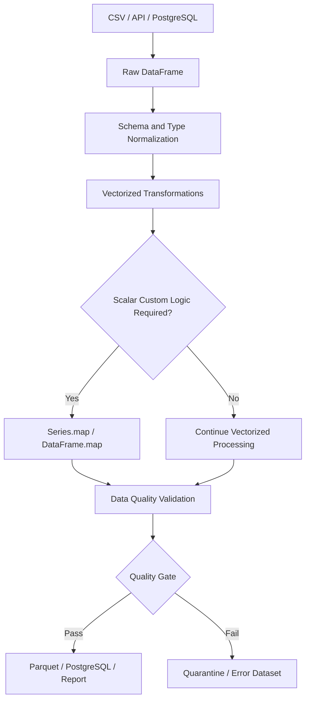

# 06- Applymap And Elementwise Operations

## Overview

Pandas provides several ways to perform element-by-element transformations:

- `Series.map()` for mapping or transforming each value in a Series.
- `Series.map()` with a callable for custom element-wise logic.
- `DataFrame.map()` for applying a function independently to every scalar value in a DataFrame.
- Native vectorized operations and NumPy ufuncs for efficient element-wise computation.

Historically, `DataFrame.applymap()` was used for DataFrame-wide element-wise functions. In modern Pandas, `DataFrame.map()` is the preferred API; `DataFrame.applymap()` is deprecated in current Pandas releases.

The distinction matters because element-wise Python execution is usually slower than vectorized operations.

A practical decision tree is:

```text
Single Series?
    │
    ├── Lookup / mapping → Series.map()
    │
    ├── Supported vectorized operation → Vectorized Series operation
    │
    └── Custom scalar function → Series.map()

Whole DataFrame?
    │
    ├── Supported vectorized operation → Vectorized DataFrame operation
    │
    └── Scalar-by-scalar custom function → DataFrame.map()
```

The engineering rule is straightforward:

> Use the highest-level vectorized operation that correctly expresses the transformation, and reserve element-wise Python functions for logic that genuinely requires them.

## Element-Wise Operations

An element-wise operation treats every scalar value independently.

For a Series:

```text
value 1 → function → result 1
value 2 → function → result 2
value 3 → function → result 3
```

For a DataFrame:

```text
cell 1 → function → result 1
cell 2 → function → result 2
cell 3 → function → result 3
...
```

This differs from:

- row-wise `DataFrame.apply(axis=1)`, where the function receives an entire row;
- column-wise `DataFrame.apply(axis=0)`, where the function receives an entire column;
- `groupby().transform()`, where operations are performed within groups;
- vectorized operations, where Pandas/NumPy operates on arrays of values rather than repeatedly calling Python code for individual values.

## `Series.map()`

`Series.map()` is designed for element-wise mapping of a Series.

Typical syntax:

```python
result = series.map(mapping)
```

or:

```python
result = series.map(function)
```

Example with a mapping:

```python
import pandas as pd

orders = pd.DataFrame(
    {
        "order_id": [1001, 1002, 1003],
        "status_code": ["P", "C", "P"],
    }
)

status_mapping = {
    "P": "pending",
    "C": "completed",
}

orders["status"] = (
    orders["status_code"]
    .map(status_mapping)
)
```

Result:

```text
   order_id status_code     status
0      1001           P    pending
1      1002           C  completed
2      1003           P    pending
```

`map()` returns a Series aligned to the original Series index.

## `Series.map()` with a Callable

A callable receives one scalar value at a time.

```python
def normalize_status(value: object) -> str:
    if pd.isna(value):
        return "unknown"

    return str(value).strip().casefold()


orders["normalized_status"] = (
    orders["status"]
    .map(normalize_status)
)
```

This is useful when:

```text
The logic is scalar and deterministic.
No suitable vectorized operation exists.
The transformation is naturally expressed as a single-value function.
```

For standard string transformations, prefer `.str` methods when possible:

```python
orders["normalized_status"] = (
    orders["status"]
    .astype("string")
    .str.strip()
    .str.casefold()
)
```

## `Series.map()` with a Dictionary

Dictionary mapping is one of the most common uses.

```python
priority_mapping = {
    "P1": "critical",
    "P2": "high",
    "P3": "normal",
}

tickets["priority_label"] = (
    tickets["priority_code"]
    .map(priority_mapping)
)
```

This is preferable to:

```python
tickets["priority_label"] = (
    tickets["priority_code"]
    .apply(
        lambda value: priority_mapping.get(value)
    )
)
```

because the intent is explicit: this is a value lookup.

## Missing Values in `Series.map()`

When mapping with a dictionary-like object, values that do not have a corresponding key become missing.

Example:

```python
statuses = pd.Series(
    ["P", "C", "X", None],
    dtype="string",
)

mapped = statuses.map(
    {
        "P": "pending",
        "C": "completed",
    }
)
```

Conceptually:

```text
P     → pending
C     → completed
X     → missing
None  → missing
```

This distinction is operationally important.

An unknown value such as `"X"` and an original missing value are not necessarily the same business condition.

For strict ETL pipelines, validate unknown codes explicitly rather than allowing them to silently become null.

## `map()` vs `replace()`

`map()` and `replace()` can both perform value substitutions, but their behavior differs.

| Operation | Unknown value behavior | Primary use |
|---|---|---|
| `Series.map(dict)` | Usually becomes missing | Explicit mapping |
| `Series.replace(dict)` | Usually preserved | Substitution while retaining unknowns |
| `Series.map(function)` | Function processes each value | Custom scalar transformation |

Example:

```python
values = pd.Series(
    ["P", "C", "X"],
    dtype="string",
)

mapped = values.map(
    {
        "P": "pending",
        "C": "completed",
    }
)

replaced = values.replace(
    {
        "P": "pending",
        "C": "completed",
    }
)
```

`mapped` treats `"X"` as unmapped, while `replaced` preserves it.

Choose based on the desired data contract.

## `DataFrame.map()`

`DataFrame.map()` applies a scalar function to every element in the DataFrame.

Typical syntax:

```python
result = dataframe.map(function)
```

Example:

```python
orders = pd.DataFrame(
    {
        "quantity": [2, 5, 10],
        "discount": [0.10, 0.20, 0.00],
    }
)

formatted = orders.map(
    lambda value: round(value, 2)
)
```

Each scalar cell is processed independently.

The resulting DataFrame preserves the original index and columns.

## `DataFrame.applymap()` and Modern Pandas

Historically, the DataFrame-wide element-wise API was:

```python
orders.applymap(function)
```

Modern Pandas provides:

```python
orders.map(function)
```

as the preferred replacement.

For new code:

```python
orders.map(function)
```

should be preferred over:

```python
orders.applymap(function)
```

Migration is generally straightforward:

```python
# Older code
cleaned = df.applymap(clean_value)

# Modern code
cleaned = df.map(clean_value)
```

The important production consideration is that codebases using deprecated APIs should be migrated before dependency upgrades turn deprecations into compatibility failures.

## `DataFrame.map()` vs `DataFrame.apply()`

The APIs operate at different granularities.

| API | Function receives | Typical purpose |
|---|---|---|
| `Series.map()` | One scalar | Series element mapping |
| `DataFrame.map()` | One scalar | Every DataFrame cell |
| `DataFrame.apply(axis=0)` | One column | Column-wise custom logic |
| `DataFrame.apply(axis=1)` | One row | Row-wise custom logic |
| Vectorized operation | Arrays/Series/DataFrame | Efficient bulk transformation |

Example:

```python
def normalize_value(value: object) -> object:
    if pd.isna(value):
        return value

    if isinstance(value, str):
        return value.strip().casefold()

    return value


cleaned = df.map(normalize_value)
```

Here the function receives one cell at a time.

With:

```python
df.apply(normalize_value)
```

the function receives an entire Series, not an individual cell.

These are different contracts.

## Choosing the Correct Granularity

Use the transformation granularity that matches the problem.

```text
Scalar value
    ↓
Series.map() / DataFrame.map()

Column
    ↓
DataFrame.apply(axis=0)

Row
    ↓
DataFrame.apply(axis=1)

Whole array / column
    ↓
Vectorized Pandas / NumPy
```

A common mistake is using row-wise or cell-wise Python functions when an array-level operation already exists.

## Vectorized Element-Wise Operations

Pandas and NumPy can perform many element-wise operations without explicitly invoking a Python function for every value.

For example:

```python
orders["total_amount"] = (
    orders["quantity"]
    * orders["unit_price"]
)
```

This is element-wise mathematically, but it is implemented using vectorized operations.

Prefer it over:

```python
orders["total_amount"] = (
    orders["quantity"]
    .map(
        lambda quantity: quantity
        * orders["unit_price"]
    )
)
```

The vectorized expression is both clearer and more efficient.

## NumPy Ufuncs

NumPy universal functions operate element-wise across array-like inputs.

Example:

```python
import numpy as np

orders["log_amount"] = np.log1p(
    orders["amount"]
)
```

Other common ufunc-style operations include:

```python
np.abs(series)
np.sqrt(series)
np.exp(series)
np.floor(series)
np.ceil(series)
```

When a NumPy ufunc expresses the transformation, it is typically preferable to invoking Python code per element.

## Scalar Function vs Vectorized Function

Consider:

```python
def normalize_amount(value: float) -> float:
    return round(value, 2)


orders["amount"] = (
    orders["amount"]
    .map(normalize_amount)
)
```

This executes Python logic for every value.

For a suitable numeric transformation, prefer a vectorized operation:

```python
orders["amount"] = (
    orders["amount"]
    .round(2)
)
```

The second implementation communicates the operation more directly and avoids unnecessary Python dispatch.

## DataFrame-Wide Element-Wise Cleaning

`DataFrame.map()` is useful when the same scalar-level rule must be applied across multiple columns.

Example:

```python
def clean_scalar(value: object) -> object:
    if pd.isna(value):
        return value

    if isinstance(value, str):
        return value.strip()

    return value


cleaned = orders.map(clean_scalar)
```

This can be useful for:

```text
Imported tabular files
Legacy exports
Mixed-type staging tables
Schema inspection
Generic scalar normalization
```

However, applying the same function to every cell can also destroy information if the columns have different semantics.

A customer ID, currency amount, and date should generally not be normalized using the exact same business rule.

## Column-Specific Transformation Is Usually Better

Instead of:

```python
cleaned = df.map(
    normalize_scalar
)
```

prefer schema-aware transformations:

```python
cleaned = df.copy()

cleaned["customer_name"] = (
    cleaned["customer_name"]
    .astype("string")
    .str.strip()
)

cleaned["amount"] = pd.to_numeric(
    cleaned["amount"],
    errors="coerce",
)

cleaned["created_at"] = pd.to_datetime(
    cleaned["created_at"],
    errors="coerce",
    utc=True,
)
```

This makes the data contract explicit.

## Data Type Preservation

Element-wise transformations can affect dtypes.

Example:

```python
values = pd.Series(
    [1, 2, 3],
    dtype="int64",
)

result = values.map(
    lambda value: value * 2
)
```

The result can retain a numeric dtype when all returned values are compatible.

But if a function returns heterogeneous Python objects:

```python
def transform(value: int) -> object:
    if value == 1:
        return "one"

    return value


result = values.map(transform)
```

the resulting dtype may become less specific.

For production pipelines, inspect or explicitly enforce the expected dtype after custom transformations.

## Nullable Dtypes

Pandas nullable dtypes are useful when element-wise logic can produce missing values.

Example:

```python
values = pd.Series(
    [1, 2, None],
    dtype="Int64",
)

result = values.map(
    lambda value: (
        value * 10
        if pd.notna(value)
        else pd.NA
    )
)
```

When a transformation has a defined schema, verify the resulting dtype:

```python
result = result.astype("Int64")
```

Avoid assuming that a Python `None` or `np.nan` will automatically produce the dtype you intended.

## Handling Missing Values

Custom functions should define what missing values mean.

Example:

```python
def normalize_code(
    value: object,
) -> object:
    if pd.isna(value):
        return pd.NA

    return str(value).strip().upper()


codes = (
    codes.map(normalize_code)
)
```

However, for string columns, prefer native vectorized operations when possible:

```python
codes = (
    codes
    .astype("string")
    .str.strip()
    .str.upper()
)
```

The latter is both more expressive and usually more efficient.

## Mixed-Type Data

External systems frequently produce mixed values:

```text
"100"
100
100.0
None
"unknown"
```

A generic element-wise function may hide schema problems.

Prefer explicit parsing:

```python
orders["amount"] = pd.to_numeric(
    orders["amount"],
    errors="coerce",
)
```

Then separately validate values that could not be parsed:

```python
invalid_amounts = orders[
    orders["amount"].isna()
]
```

Parsing and validation should not be conflated with generic cell transformation.

## Invalid Values

Element-wise functions should not silently convert invalid records into plausible values.

Avoid:

```python
def parse_amount(value: object) -> float:
    try:
        return float(value)
    except Exception:
        return 0.0
```

This turns invalid data into a legitimate-looking amount.

Prefer:

```python
def parse_amount(
    value: object,
) -> float | None:
    try:
        return float(value)
    except (TypeError, ValueError):
        return None
```

Then validate and quarantine invalid records separately.

## Idempotent Transformations

A production cleaning function should ideally be idempotent.

For example:

```python
def normalize_code(value: object) -> object:
    if pd.isna(value):
        return pd.NA

    return str(value).strip().upper()
```

Applying it twice should produce the same result:

```text
" abc " → "ABC"
"ABC"   → "ABC"
```

Idempotence matters for retries and reruns in ETL pipelines.

## Pure Functions

An element-wise transformation should generally be a pure function:

```python
def normalize_country(
    value: object,
) -> str | None:
    if pd.isna(value):
        return None

    return str(value).strip().casefold()
```

Avoid functions that:

```text
Perform database queries
Make HTTP requests
Publish Kafka messages
Write files
Send emails
Modify global state
Depend on mutable external state
```

Element-wise Pandas operations are transformation primitives, not workflow orchestration mechanisms.

## Avoid External I/O

This is a production anti-pattern:

```python
def lookup_customer_tier(
    customer_id: int,
) -> str:
    return customer_service.get_tier(
        customer_id
    )


orders["tier"] = (
    orders["customer_id"]
    .map(lookup_customer_tier)
)
```

With one request per row, the operation effectively creates an N+1 network pattern.

Prefer:

```text
Fetch required reference data
        ↓
Create reference DataFrame
        ↓
merge()
        ↓
Continue vectorized processing
```

For example:

```python
customer_reference = pd.DataFrame(
    {
        "customer_id": [101, 102, 103],
        "tier": [
            "enterprise",
            "standard",
            "premium",
        ],
    }
)

orders = orders.merge(
    customer_reference,
    on="customer_id",
    how="left",
    validate="many_to_one",
)
```

## Element-Wise Processing and PostgreSQL

If the transformation is naturally relational or SQL-native, consider pushing it into PostgreSQL.

For example:

```sql
SELECT
    amount,
    ROUND(amount, 2) AS rounded_amount
FROM transactions;
```

This can be preferable when:

```text
The source is already in PostgreSQL.
The operation reduces data before transfer.
The database can execute it efficiently.
The result is needed for SQL filtering or joins.
```

Do not automatically move every transformation into Pandas.

The correct processing boundary depends on data locality, cost, latency, and workload size.

## Element-Wise Processing in ETL

A production pipeline might look like:



Element-wise functions belong in the transformation layer and should have predictable behavior.

## Performance Characteristics

Element-wise Python execution has a fundamental cost:

```text
DataFrame
    ↓
iterate through values
    ↓
Python callable
    ↓
Python result
    ↓
construct output
```

For a large DataFrame, millions of Python-level function invocations can be expensive.

By comparison:

```text
DataFrame
    ↓
vectorized Pandas / NumPy operation
    ↓
array-level computation
```

is generally more efficient.

The precise performance difference depends on the operation, dtype, data shape, hardware, and Pandas version, so benchmarks should be based on the actual workload.

## Performance Comparison

| Pattern | Typical performance profile | Preferred use |
|---|---|---|
| Vectorized Pandas operation | Usually best | Standard transformations |
| NumPy ufunc | Usually very efficient | Numerical array operations |
| `Series.map()` with Python callable | Python-level execution | Custom scalar logic |
| `DataFrame.map()` | Python-level execution per cell | Generic DataFrame scalar logic |
| `DataFrame.apply(axis=1)` | Python-level row execution | Multi-column custom logic |
| Python loop over DataFrame rows | Usually poor | Avoid |

These are engineering guidelines rather than absolute guarantees.

## Avoid `DataFrame.map()` for Large Numeric Transformations

Avoid:

```python
orders[
    [
        "quantity",
        "unit_price",
        "discount",
    ]
].map(
    lambda value: round(value, 2)
)
```

Prefer:

```python
numeric_columns = [
    "quantity",
    "unit_price",
    "discount",
]

orders[numeric_columns] = (
    orders[numeric_columns]
    .round(2)
)
```

The second approach operates on the DataFrame using a native vectorized operation.

## Use Vectorized Masks for Conditional Logic

Avoid:

```python
orders["risk"] = (
    orders["amount"]
    .map(
        lambda amount: (
            "high"
            if amount >= 10_000
            else "normal"
        )
    )
)
```

Prefer:

```python
orders["risk"] = np.where(
    orders["amount"].ge(10_000),
    "high",
    "normal",
)
```

For multiple conditions:

```python
conditions = [
    orders["amount"].ge(100_000),
    orders["amount"].ge(10_000),
]

choices = [
    "critical",
    "high",
]

orders["risk"] = np.select(
    conditions,
    choices,
    default="normal",
)
```

## Element-Wise String Processing

For strings, the `.str` accessor is usually the preferred abstraction.

Avoid:

```python
customers["email"] = (
    customers["email"]
    .map(
        lambda value: (
            value.strip().casefold()
            if isinstance(value, str)
            else value
        )
    )
)
```

Prefer:

```python
customers["email"] = (
    customers["email"]
    .astype("string")
    .str.strip()
    .str.casefold()
)
```

This also communicates the expected data domain more clearly.

## Element-Wise Datetime Processing

Avoid:

```python
orders["year"] = (
    orders["created_at"]
    .map(
        lambda value: (
            value.year
            if pd.notna(value)
            else pd.NA
        )
    )
)
```

Prefer:

```python
orders["created_at"] = pd.to_datetime(
    orders["created_at"],
    errors="coerce",
    utc=True,
)

orders["year"] = (
    orders["created_at"]
    .dt.year
)
```

The datetime accessor makes the intended operation explicit.

## Generic DataFrame Sanitization

There are situations where a generic scalar function is useful.

For example, imported text fields may contain surrounding whitespace:

```python
def strip_text(
    value: object,
) -> object:
    if isinstance(value, str):
        return value.strip()

    return value


text_normalized = raw_data.map(strip_text)
```

This may be appropriate during a generic staging step, particularly when the schema is dynamic.

It should not replace column-aware normalization in a canonical dataset.

## Dynamic Schemas

`DataFrame.map()` can be useful when:

```text
The schema is dynamic.
The same scalar rule applies to all columns.
Column names are not known ahead of time.
The transformation is genuinely type-agnostic.
```

For example, processing vendor exports where every string field may contain unnecessary surrounding whitespace can justify a generic scalar function.

Even then, validate the output schema after processing.

## Empty DataFrames

Element-wise operations generally preserve the DataFrame shape for empty inputs.

Example:

```python
empty_orders = pd.DataFrame(
    columns=[
        "order_id",
        "status",
    ]
)

result = empty_orders.map(
    normalize_status,
)

assert result.empty
assert result.columns.tolist() == [
    "order_id",
    "status",
]
```

Production code should still distinguish:

```text
Expected empty batch
```

from:

```text
Unexpected empty input
```

The Pandas operation itself cannot determine whether an empty dataset is valid for the business workflow.

## Duplicate Records

Element-wise operations do not remove duplicates.

For example:

```python
orders["status"] = (
    orders["status"]
    .map(normalize_status)
)
```

does not change row cardinality.

If duplicate handling is required, make it an explicit pipeline step:

```python
orders = orders.drop_duplicates(
    subset=["order_id"],
    keep="last",
)
```

Do not expect transformations to enforce entity uniqueness.

## Index Behavior

`Series.map()` preserves the Series index.

Example:

```python
values = pd.Series(
    ["A", "B"],
    index=[10, 20],
)

result = values.map(
    {
        "A": "active",
        "B": "blocked",
    }
)

assert result.index.tolist() == [
    10,
    20,
]
```

`DataFrame.map()` preserves the DataFrame's index and columns.

This makes assignment back into the original structure predictable.

## Mutation Behavior

Element-wise mapping returns a transformed object.

It does not inherently mutate the original Series or DataFrame.

For example:

```python
cleaned = orders.map(
    normalize_scalar,
)
```

The original `orders` remains unchanged.

Mutation occurs when you explicitly assign:

```python
orders = orders.map(
    normalize_scalar,
)
```

or:

```python
orders["status"] = (
    orders["status"]
    .map(normalize_status)
)
```

For complex ETL transformations, explicit assignment makes mutation boundaries easier to reason about.

## Copy Strategy

When modifying a selected DataFrame, use an explicit copy when isolation is important:

```python
result = orders[
    [
        "order_id",
        "status",
    ]
].copy()

result["status"] = (
    result["status"]
    .map(normalize_status)
)
```

This makes ownership clear and reduces ambiguity around chained assignment or unintended downstream changes.

## Memory Considerations

Element-wise transformations can temporarily require memory for:

```text
Input object
Intermediate results
Output object
```

The impact becomes significant when processing large object-heavy DataFrames.

For example:

```python
cleaned = raw_data.map(
    normalize_scalar,
)
```

can temporarily keep both the original and transformed DataFrames alive.

For large workloads:

```text
Select only required columns
Use efficient dtypes
Process in chunks when necessary
Avoid unnecessary full-DataFrame copies
Prefer vectorized operations
Write efficient formats such as Parquet
```

## Chunked Processing

For large CSV inputs:

```python
for chunk in pd.read_csv(
    "orders.csv",
    chunksize=100_000,
):
    chunk["normalized_status"] = (
        chunk["status"]
        .map(normalize_status)
    )

    process_chunk(chunk)
```

Chunking limits peak memory usage.

It does not make the Python callable itself vectorized.

If the transformation is CPU-bound, replacing the element-wise Python function may provide a larger performance improvement than simply reducing chunk size.

## Avoid Generic Object Conversion

This pattern can be expensive and semantically risky:

```python
df = df.astype("object")

df = df.map(
    generic_transform,
)
```

Converting many columns to `object` can increase memory consumption and reduce opportunities for efficient native operations.

Prefer preserving:

```text
Int64 / int64
Float64 / float64
boolean
string
datetime64
category
```

where the schema allows it.

## Category Data

For repeated finite labels, categorical data can improve memory usage.

Example:

```python
orders["status"] = (
    orders["status"]
    .astype("category")
)
```

If a mapping operation is applied afterward, validate the resulting dtype rather than assuming it will remain categorical.

For large datasets with low-cardinality repeated strings, dtype design can matter more than micro-optimizing a scalar function.

## Mapping Reference Data

When element-wise logic is actually a lookup against a large reference dataset, `merge()` is usually a better abstraction.

Instead of:

```python
orders["customer_segment"] = (
    orders["customer_id"]
    .map(customer_segments)
)
```

where `customer_segments` may be manageable as a Series or dictionary, use a merge when the reference data contains multiple attributes:

```python
customer_reference = pd.DataFrame(
    {
        "customer_id": [101, 102, 103],
        "segment": [
            "enterprise",
            "standard",
            "premium",
        ],
        "region": [
            "IN",
            "US",
            "EU",
        ],
    }
)

orders = orders.merge(
    customer_reference,
    on="customer_id",
    how="left",
    validate="many_to_one",
)
```

Use:

```text
map()
    → one key → one value

merge()
    → key-based relational enrichment
```

## Observability

For production pipelines, monitor element-wise transformations when they can produce invalid or unknown outputs.

Useful metrics include:

```text
Rows processed
Unknown mappings
Missing outputs
Transformation failures
Execution duration
Rows per second
```

Example:

```python
orders["status"] = (
    orders["status_code"]
    .map(status_mapping)
)

unknown_status_count = int(
    orders["status"].isna().sum()
)
```

For strict pipelines, compare the unknown count with expected quality thresholds before publishing the dataset.

## Error Handling

Do not use broad exception suppression:

```python
def normalize(value):
    try:
        return transform(value)
    except Exception:
        return None
```

This can hide programming defects.

Prefer precise handling:

```python
def normalize_amount(
    value: object,
) -> float | None:
    if pd.isna(value):
        return None

    try:
        return float(value)
    except (TypeError, ValueError):
        return None
```

For critical ETL systems, consider recording invalid values separately rather than silently discarding them.

## Testing Element-Wise Functions

Test custom scalar functions independently.

```python
def normalize_status(
    value: object,
) -> str:
    if pd.isna(value):
        return "unknown"

    return str(value).strip().casefold()


def test_normalize_status() -> None:
    assert normalize_status(
        " Pending "
    ) == "pending"

    assert normalize_status(None) == (
        "unknown"
    )

    assert normalize_status(
        "COMPLETED"
    ) == "completed"
```

This isolates business logic from Pandas.

## Testing Series Mapping

```python
def test_status_mapping() -> None:
    statuses = pd.Series(
        ["P", "C", "P"],
        dtype="string",
    )

    result = statuses.map(
        {
            "P": "pending",
            "C": "completed",
        }
    )

    expected = pd.Series(
        [
            "pending",
            "completed",
            "pending",
        ],
        dtype="string",
    )

    pd.testing.assert_series_equal(
        result,
        expected,
    )
```

Test unknown and missing codes separately.

## Testing DataFrame Mapping

```python
def test_dataframe_map() -> None:
    data = pd.DataFrame(
        {
            "customer_name": [
                " Alice ",
                " Bob ",
            ],
            "region": [
                " IN ",
                " US ",
            ],
        }
    )

    result = data.map(
        lambda value: (
            value.strip()
            if isinstance(value, str)
            else value
        )
    )

    expected = pd.DataFrame(
        {
            "customer_name": [
                "Alice",
                "Bob",
            ],
            "region": [
                "IN",
                "US",
            ],
        }
    )

    pd.testing.assert_frame_equal(
        result,
        expected,
    )
```

Tests should verify actual transformation behavior rather than simply checking that execution succeeds.

## Testing Edge Cases

At minimum, custom element-wise transformations should consider:

```text
None / pd.NA
Empty strings
Whitespace
Unexpected strings
Unexpected numeric values
Invalid input types
Boundary values
Empty Series
Empty DataFrame
Duplicate records where applicable
```

For data pipelines, add tests for malformed external input because production failures often originate outside your service boundary.

## Security Considerations

Treat DataFrame values as untrusted input when they originate from:

```text
REST APIs
CSV uploads
Excel files
External vendors
Kafka events
Database imports
User-submitted content
```

Never evaluate values as Python source:

```python
df.map(eval)
```

Avoid `eval()` and `exec()` entirely for data transformation.

Also avoid constructing shell commands, SQL statements, or URLs directly from raw cell values without proper validation and parameterization.

Element-wise functions should transform data, not interpret untrusted data as executable instructions.

## Reliability Considerations

Production element-wise functions should be:

```text
Deterministic
Idempotent where practical
Null-aware
Explicit about invalid input
Free of external side effects
Covered by tests
```

This supports safe retries in:

```text
Celery batch jobs
Kubernetes CronJobs
AWS Batch
Airflow-style workflows
CI data validation jobs
```

A retry should not cause duplicated external side effects simply because the transformation is executed again.

## Cost Considerations

Pandas element-wise Python functions consume CPU in the application process.

For large datasets, this can increase:

```text
Batch duration
Container runtime
CPU utilization
Cloud compute cost
Operational latency
```

Before scaling infrastructure, check whether the transformation can be redesigned using:

```text
Vectorized Pandas
NumPy
map()
merge()
SQL pushdown
Parquet-oriented processing
A more suitable execution engine
```

More compute is often a less effective solution than eliminating unnecessary Python-level work.

## Common Mistakes

| Mistake | Why it happens | Better approach |
|---|---|---|
| Using `DataFrame.map()` for arithmetic | Every cell can be transformed with one function | Use vectorized arithmetic |
| Using `DataFrame.map()` for string normalization | Generic functions feel reusable | Use `.str` methods |
| Using `Series.map()` for a relational lookup | Mapping feels simpler | Use `merge()` for multi-column enrichment |
| Using `map()` for multi-column logic | Scalar functions are easy to write | Use vectorized masks or `apply(axis=1)` when necessary |
| Using deprecated `applymap()` in new code | Legacy examples are common | Use `DataFrame.map()` |
| Ignoring unknown mappings | Missing outputs are easy to miss | Validate unknown categories explicitly |
| Swallowing exceptions | Pipeline appears more resilient | Handle expected exceptions precisely |
| Making network calls inside `map()` | Each value appears independent | Batch, cache, or prefetch reference data |
| Querying PostgreSQL inside `map()` | Lookup logic feels natural | Load reference data once and join |
| Converting everything to `object` | Mixed data seems easier | Preserve appropriate native dtypes |
| Returning heterogeneous types | Python allows it | Define and validate an output dtype |
| Treating generic cell cleaning as schema validation | It feels convenient | Validate fields according to their business semantics |
| Assuming element-wise means vectorized | Both process values independently conceptually | Understand Python-level execution overhead |

## `map()` vs `apply()` vs `DataFrame.map()`

| Requirement | Preferred operation |
|---|---|
| Dictionary lookup on one Series | `Series.map()` |
| Callable on one Series | `Series.map()` |
| Replace known values while preserving unknowns | `Series.replace()` |
| Vectorized string transformation | `.str` |
| Vectorized datetime transformation | `.dt` |
| Vectorized numeric transformation | Pandas / NumPy operations |
| Scalar function across every DataFrame cell | `DataFrame.map()` |
| Column-wise custom logic | `DataFrame.apply(axis=0)` |
| Row-wise multi-column custom logic | `DataFrame.apply(axis=1)` |
| Multi-column reference enrichment | `merge()` |
| Standard group aggregation | `groupby()` / `agg()` |

## Production Decision Framework

Before selecting an element-wise operation, ask:

```text
Is there a native vectorized Pandas operation?
        │
        ├── Yes → Use it
        │
        └── No
             ↓
Is there a NumPy ufunc?
             │
             ├── Yes → Use it
             │
             └── No
                  ↓
Is this a Series lookup?
                  │
                  ├── Yes → Series.map()
                  │
                  └── No
                       ↓
Does this require relational reference data?
                       │
                       ├── Yes → merge()
                       │
                       └── No
                            ↓
Does the function operate on one scalar?
                            │
                            ├── Yes → Series.map()
                            │           or DataFrame.map()
                            │
                            └── No → DataFrame.apply()
```

This keeps the transformation aligned with the data granularity.

## Production Pattern

A maintainable transformation pipeline separates generic scalar logic from schema-specific logic.

```python
import numpy as np
import pandas as pd


def normalize_text(value: object) -> object:
    if pd.isna(value):
        return pd.NA

    if isinstance(value, str):
        return value.strip()

    return value


def transform_orders(
    orders: pd.DataFrame,
) -> pd.DataFrame:
    result = orders.copy()

    result["customer_name"] = (
        result["customer_name"]
        .astype("string")
        .str.strip()
    )

    result["amount"] = pd.to_numeric(
        result["amount"],
        errors="coerce",
    )

    result["risk"] = np.select(
        [
            result["amount"].ge(100_000),
            result["amount"].ge(10_000),
        ],
        [
            "critical",
            "high",
        ],
        default="normal",
    )

    return result
```

Notice that no generic `DataFrame.map()` is required. Each field uses the most appropriate abstraction.

Use `DataFrame.map()` only where a scalar-level transformation across arbitrary or genuinely homogeneous columns is useful.

## Key Takeaways

- `Series.map()` is the primary Pandas API for element-wise Series mapping; `DataFrame.map()` is the modern API for applying a scalar function to every DataFrame cell.
- `DataFrame.applymap()` is a legacy API and should not be used for new code; migrate existing usage to `DataFrame.map()`.
- Prefer vectorized Pandas operations, NumPy ufuncs, `.str`, `.dt`, boolean masks, and `merge()` whenever they express the transformation more directly and efficiently.
- Keep element-wise functions deterministic, null-aware, side-effect free, and explicit about invalid values; never use them as a mechanism for per-row database or HTTP requests.
- For large datasets, treat Python-level element-wise execution as a potential CPU bottleneck and validate performance, memory usage, output dtypes, and data-quality behavior before deploying it in production.