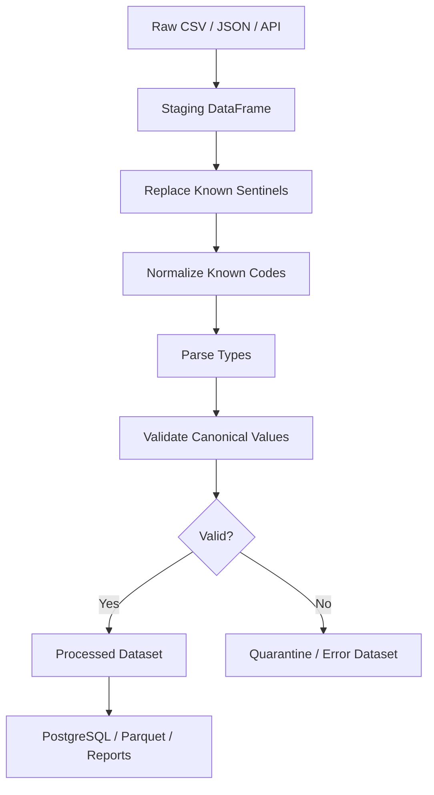

# 07- Replace

## Overview

`replace()` performs controlled value substitution in Pandas Series and DataFrames.

It is primarily used when existing values need to be replaced with other values while preserving the surrounding structure of the data. Unlike `map()`, `replace()` is designed to leave values that are not explicitly targeted unchanged.

Typical production use cases include:

- Normalizing status or category codes.
- Replacing known sentinel values such as `"N/A"` or `"unknown"`.
- Standardizing inconsistent source-system labels.
- Cleaning imported data before type conversion.
- Replacing invalid or legacy codes.
- Applying different replacement rules to selected columns.

The central distinction from `map()` is:

```text
map()
    → explicit mapping
    → unmapped values can become missing

replace()
    → targeted substitution
    → non-targeted values are preserved
```

That difference makes `replace()` particularly useful during data-cleaning stages where only known bad or legacy values should change.

## What `replace()` Does

The basic form is:

```python
result = series.replace(
    old_value,
    new_value,
)
```

Example:

```python
import pandas as pd

orders = pd.DataFrame(
    {
        "order_id": [1001, 1002, 1003],
        "status": [
            "pending",
            "in_progress",
            "completed",
        ],
    }
)

orders["status"] = (
    orders["status"]
    .replace(
        {
            "in_progress": "processing",
        }
    )
)
```

Result:

```text
   order_id       status
0      1001      pending
1      1002   processing
2      1003    completed
```

Only the targeted value changed.

## Why `replace()` Exists

Real-world data frequently contains controlled inconsistencies rather than completely arbitrary invalid data.

For example:

```text
pending
PENDING
Pending
in_progress
processing
N/A
unknown
```

A cleaning pipeline may need to replace only known variants:

```text
in_progress → processing
N/A         → missing
```

while leaving already-correct values untouched.

`replace()` expresses that intent directly.

## `Series.replace()`

`Series.replace()` operates on the values of a Series.

Common syntax:

```python
series.replace(
    {
        "old": "new",
    }
)
```

Multiple replacements:

```python
series.replace(
    {
        "old_a": "new_a",
        "old_b": "new_b",
    }
)
```

Single replacement:

```python
series.replace(
    "old",
    "new",
)
```

The operation returns a new Series unless the result is explicitly assigned back.

## `DataFrame.replace()`

`replace()` can also operate on an entire DataFrame.

```python
cleaned = df.replace(
    {
        "N/A": pd.NA,
        "unknown": pd.NA,
        "-": pd.NA,
    }
)
```

Every matching value across the DataFrame is replaced.

This can be useful for a staging DataFrame where these sentinel values have the same meaning across columns.

However, indiscriminate DataFrame-wide replacement can be dangerous when the same string has different semantics in different columns.

## Column-Specific Replacement

For production datasets, column-specific cleaning is often safer:

```python
orders["status"] = (
    orders["status"]
    .replace(
        {
            "P": "pending",
            "C": "completed",
        }
    )
)

orders["payment_method"] = (
    orders["payment_method"]
    .replace(
        {
            "CC": "credit_card",
            "DC": "debit_card",
        }
    )
)
```

This makes the schema contract explicit.

## Dictionary Replacement

Dictionary replacement is one of the most common patterns.

```python
status_mapping = {
    "P": "pending",
    "C": "completed",
    "F": "failed",
}

orders["status"] = (
    orders["status"]
    .replace(status_mapping)
)
```

Values not included in the mapping remain unchanged.

For example:

```text
P              → pending
C              → completed
F              → failed
cancelled      → cancelled
```

That preservation behavior is often desirable during incremental cleanup.

## `replace()` vs `map()`

This distinction is important in interviews and production code.

```python
values = pd.Series(
    ["P", "C", "X"],
    dtype="string",
)

mapping = {
    "P": "pending",
    "C": "completed",
}
```

Using `replace()`:

```python
replaced = values.replace(mapping)
```

conceptually produces:

```text
P → pending
C → completed
X → X
```

Using `map()`:

```python
mapped = values.map(mapping)
```

conceptually produces:

```text
P → pending
C → completed
X → missing
```

Use `replace()` when unknown or non-targeted values should remain unchanged.

Use `map()` when the mapping defines the complete expected value domain and unmapped values should be treated as missing or invalid.

## `replace()` vs `map()` Decision Table

| Requirement | Preferred operation |
|---|---|
| Replace known values only | `replace()` |
| Preserve all non-targeted values | `replace()` |
| Lookup one value from a complete mapping | `map()` |
| Unmapped values should become missing | `map()` |
| Scalar custom transformation | `Series.map()` |
| Relational enrichment | `merge()` |
| Regex-based substitutions | `replace(..., regex=True)` |
| Standard string normalization | `.str` methods |

## Replacing Sentinel Values

External data frequently uses placeholders for missing data:

```text
N/A
NA
NULL
null
unknown
-
?
```

A staging transformation might normalize known sentinels:

```python
sentinel_values = [
    "N/A",
    "NA",
    "NULL",
    "null",
    "-",
    "?",
]

orders = orders.replace(
    sentinel_values,
    pd.NA,
)
```

This can simplify subsequent type conversion and validation.

For example:

```python
orders["amount"] = pd.to_numeric(
    orders["amount"],
    errors="coerce",
)
```

The key production consideration is defining which sentinel strings genuinely mean missing rather than converting legitimate business values accidentally.

## Replacing Multiple Values with One Value

You can replace several source values with one canonical value.

```python
orders["status"] = (
    orders["status"]
    .replace(
        [
            "P",
            "pending",
            "PENDING",
        ],
        "pending",
    )
)
```

This is useful when multiple source-system representations mean the same thing.

For larger normalization rules, an explicit mapping dictionary may be easier to audit:

```python
status_mapping = {
    "P": "pending",
    "pending": "pending",
    "PENDING": "pending",
}

orders["status"] = (
    orders["status"]
    .replace(status_mapping)
)
```

## Replacing One Value with Multiple Values

`replace()` is primarily a scalar substitution API.

For transformations where one input produces multiple output columns or requires complex logic, use a more appropriate transformation mechanism such as:

```text
map()
apply()
vectorized masks
merge()
```

Do not force complex business rules into `replace()`.

## Regex Replacement

`replace()` supports regular-expression replacement.

Example:

```python
customers["phone"] = (
    customers["phone"]
    .replace(
        r"\D+",
        "",
        regex=True,
    )
)
```

This removes non-digit runs.

A more explicit string-oriented alternative is often:

```python
customers["phone"] = (
    customers["phone"]
    .astype("string")
    .str.replace(
        r"\D+",
        "",
        regex=True,
    )
)
```

For string columns, `.str.replace()` usually communicates the intent more clearly.

Use `replace(regex=True)` when replacement needs to operate at the Series/DataFrame value-replacement level rather than as a string-specific transformation.

## Regular Expression Dictionary

Multiple regex substitutions can be defined:

```python
patterns = {
    r"^\s+": "",
    r"\s+$": "",
}

customers["name"] = (
    customers["name"]
    .replace(
        patterns,
        regex=True,
    )
)
```

For complex string-cleaning pipelines, chaining explicit `.str` operations is often easier to reason about.

## `regex=True` Trade-Offs

Regex replacement is flexible but introduces additional considerations:

```text
Higher CPU cost
Harder-to-review patterns
Potential accidental matches
More difficult debugging
```

Avoid broad patterns such as:

```python
df.replace(
    ".*",
    pd.NA,
    regex=True,
)
```

unless every matching value is intentionally being removed.

Regex patterns are data-transformation logic and should be tested like application code.

## Replacement Ordering

When multiple replacement rules can match the same value, rule ordering can affect the result, particularly for regex-based replacements and overlapping patterns.

Prefer explicit, non-overlapping rules when possible.

Example:

```python
patterns = {
    r"^pending$": "open",
    r"^processing$": "open",
}

orders["state"] = (
    orders["state"]
    .replace(
        patterns,
        regex=True,
    )
)
```

Avoid ambiguous rules that can transform data through multiple unintended stages.

## Replacing Missing Values

`replace()` can target missing values, but missing-value-specific operations are often clearer with `fillna()`.

For example:

```python
orders["discount"] = (
    orders["discount"]
    .fillna(0)
)
```

rather than treating missing values as just another replacement case.

Use:

```text
replace()
    → targeted value substitution

fillna()
    → missing-value imputation

dropna()
    → row/column removal based on missingness
```

This separation improves pipeline readability.

## Replacing Invalid Codes

Suppose an API uses:

```text
A → active
I → inactive
D → deleted
X → invalid legacy code
```

A migration step might replace the legacy value:

```python
users["status"] = (
    users["status"]
    .replace(
        {
            "X": "inactive",
        }
    )
)
```

However, replacing an invalid value should be a deliberate business decision.

Do not silently convert malformed data merely to make downstream validation pass.

## Replacement vs Validation

These are different responsibilities.

Replacement asks:

```text
"What should this known source value become?"
```

Validation asks:

```text
"Is this value acceptable at all?"
```

A production pipeline should usually perform:

```text
Raw input
   ↓
Normalize known variants
   ↓
Validate canonical values
   ↓
Accept / reject / quarantine
```

For example:

```python
status_mapping = {
    "P": "pending",
    "C": "completed",
    "F": "failed",
}

orders["status"] = (
    orders["status"]
    .replace(status_mapping)
)

allowed_statuses = {
    "pending",
    "completed",
    "failed",
    "cancelled",
}

invalid_rows = orders[
    ~orders["status"].isin(
        allowed_statuses
    )
]
```

Replacement should not replace the validation step.

## Replacement Before Type Conversion

Cleaning sentinel values before numeric parsing is often useful.

Example:

```python
orders["amount"] = (
    orders["amount"]
    .replace(
        {
            "N/A": pd.NA,
            "unknown": pd.NA,
        }
    )
)

orders["amount"] = pd.to_numeric(
    orders["amount"],
    errors="coerce",
)
```

This makes the intended parsing contract clearer.

For large pipelines, distinguish:

```text
Known missing sentinel
```

from:

```text
Unexpected malformed value
```

because both may otherwise become missing during coercion.

## Replacement and Datetimes

Suppose an external system sends:

```text
"0000-00-00"
""
"unknown"
```

as invalid date placeholders.

Normalize them before parsing:

```python
orders["created_at"] = (
    orders["created_at"]
    .replace(
        {
            "0000-00-00": pd.NA,
            "": pd.NA,
            "unknown": pd.NA,
        }
    )
)

orders["created_at"] = pd.to_datetime(
    orders["created_at"],
    errors="coerce",
    utc=True,
)
```

Parsing should remain responsible for date conversion; `replace()` only handles known source representations.

## Replacement and String Normalization

Do not use `replace()` for every possible string transformation.

For example:

```python
customers["email"] = (
    customers["email"]
    .astype("string")
    .str.strip()
    .str.casefold()
)
```

This is preferable to enumerating every possible casing or whitespace variant:

```python
customers["email"] = (
    customers["email"]
    .replace(
        {
            " Alice@EXAMPLE.COM ": "alice@example.com",
            "ALICE@EXAMPLE.COM": "alice@example.com",
        }
    )
)
```

Use `replace()` for known values, not for transformations that should operate consistently across arbitrary input.

## Replacement Across Selected Columns

You can restrict replacement by selecting columns first:

```python
columns = [
    "status",
    "payment_status",
]

orders[columns] = (
    orders[columns]
    .replace(
        {
            "N/A": pd.NA,
            "unknown": pd.NA,
        }
    )
)
```

This avoids modifying unrelated fields where the same literal might have a legitimate meaning.

## DataFrame Replacement by Column

A DataFrame can also use column-aware mappings.

For example:

```python
orders = orders.replace(
    {
        "status": {
            "P": "pending",
            "C": "completed",
        },
        "payment_method": {
            "CC": "credit_card",
            "DC": "debit_card",
        },
    }
)
```

This is useful when replacement rules are strongly tied to specific columns.

It also makes the transformation contract easier to review.

## Nested Replacement Rules

Column-specific mappings are often safer than global replacement:

```python
normalization_rules = {
    "status": {
        "P": "pending",
        "C": "completed",
    },
    "region": {
        "IN": "India",
        "US": "United States",
    },
}
```

Apply them:

```python
orders = orders.replace(
    normalization_rules,
)
```

This is especially useful for controlled source-system normalization.

## Replacement and Indexes

`replace()` operates primarily on data values, not labels.

If you need to change:

```text
column names
index labels
```

use APIs such as:

```python
rename()
set_axis()
```

Do not use `replace()` as a schema-label operation.

For example:

```python
orders = orders.rename(
    columns={
        "cust_id": "customer_id",
    }
)
```

while:

```python
orders["status"] = (
    orders["status"]
    .replace(
        {
            "P": "pending",
        }
    )
)
```

addresses different concerns.

## Mutation Behavior

`replace()` returns a transformed object.

It does not require in-place mutation.

Prefer:

```python
cleaned = df.replace(
    replacement_rules,
)
```

or explicit assignment:

```python
df["status"] = (
    df["status"]
    .replace(status_mapping)
)
```

Rather than:

```python
df.replace(
    replacement_rules,
    inplace=True,
)
```

For production pipelines, returning transformed objects makes data flow easier to reason about and test.

## `inplace=True`

Although Pandas supports:

```python
df.replace(
    replacement_rules,
    inplace=True,
)
```

the explicit-return style is often clearer:

```python
df = df.replace(
    replacement_rules,
)
```

Advantages of explicit assignment include:

```text
Clearer transformation boundaries
Easier functional composition
Easier testing
Less hidden mutation
```

Do not assume `inplace=True` makes operations significantly more memory-efficient in every situation.

## Data Type Implications

Replacement can affect the dtype when replacement values are incompatible with the original dtype.

For example:

```python
values = pd.Series(
    [1, 2, 3],
    dtype="int64",
)

result = values.replace(
    {
        2: "unknown",
    }
)
```

The resulting dtype may no longer be a standard integer dtype because the Series now contains mixed types.

For production schemas, decide whether such a replacement is appropriate.

Often a better design is:

```text
Keep numeric column numeric
Create a separate quality/status field
```

rather than mixing strings and numbers in the same field.

## Preserve Semantic Types

Avoid:

```python
transactions["amount"] = (
    transactions["amount"]
    .replace(
        {
            -1: "unknown",
        }
    )
)
```

This corrupts the semantic type of the amount column.

Prefer:

```python
transactions["amount"] = (
    transactions["amount"]
    .replace(-1, pd.NA)
    .astype("Float64")
)

transactions["amount_quality"] = (
    transactions["amount"]
    .isna()
    .map(
        {
            True: "missing_or_invalid",
            False: "valid",
        }
    )
)
```

The canonical numeric field remains numeric.

## Replacement and Duplicates

`replace()` does not remove duplicate records.

For example:

```python
orders["status"] = (
    orders["status"]
    .replace(
        {
            "P": "pending",
        }
    )
)
```

does not alter row count.

Duplicate handling remains an explicit operation:

```python
orders = orders.drop_duplicates(
    subset=["order_id"],
)
```

This separation is important in ETL design.

## Replacement and Large DataFrames

For large DataFrames, replacement cost depends on:

```text
Number of cells processed
Number of rules
Regex complexity
Dtype
Memory pressure
```

DataFrame-wide replacement may process many cells that do not need modification.

Prefer targeted columns:

```python
orders["status"] = (
    orders["status"]
    .replace(status_mapping)
)
```

over:

```python
orders = orders.replace(
    status_mapping,
)
```

when only one column should change.

## Performance Considerations

For exact substitutions, `replace()` is generally appropriate and readable.

However, do not use it as a substitute for vectorized transformations.

For example, to add a percentage:

```python
orders["amount"] = (
    orders["amount"] * 1.18
)
```

is preferable to constructing a custom replacement operation.

For string transformations:

```python
orders["customer_name"] = (
    orders["customer_name"]
    .astype("string")
    .str.strip()
)
```

is preferable to enumerating possible source values.

The goal is to use `replace()` when the operation is fundamentally **substitution**, not merely because it can modify values.

## Regex Performance

Regex replacement can be expensive on large object/string columns.

For millions of values:

```python
df["value"] = (
    df["value"]
    .replace(
        pattern,
        replacement,
        regex=True,
    )
)
```

may become CPU-intensive.

For performance-sensitive pipelines:

```text
Avoid unnecessarily broad regex patterns
Restrict transformations to required columns
Use vectorized string operations where appropriate
Benchmark realistic datasets
Prefer simpler exact replacement when possible
```

## Large Dataset Strategy

For large files, combine replacement with chunked ingestion:

```python
for chunk in pd.read_csv(
    "transactions.csv",
    chunksize=100_000,
):
    chunk = chunk.replace(
        {
            "N/A": pd.NA,
            "unknown": pd.NA,
        }
    )

    process_chunk(chunk)
```

This controls memory.

It does not eliminate CPU cost from replacement.

If the workload becomes too large for a single-process Pandas pipeline, consider:

```text
SQL pushdown
DuckDB
Polars
Spark
AWS Glue
Warehouse processing
```

based on the operational environment.

## ETL Data Flow

A practical data-cleaning pipeline might be:



`replace()` should be one explicit transformation stage rather than becoming a catch-all cleaning mechanism.

## Production Data Normalization

Suppose an order feed arrives as:

```text
status
------
P
pending
PENDING
C
completed
```

A normalization mapping can convert known variants:

```python
status_mapping = {
    "P": "pending",
    "pending": "pending",
    "PENDING": "pending",
    "C": "completed",
    "completed": "completed",
}

orders["status"] = (
    orders["status"]
    .replace(status_mapping)
)
```

Then validate the canonical domain:

```python
allowed_statuses = {
    "pending",
    "completed",
    "failed",
    "cancelled",
}

invalid_statuses = (
    orders.loc[
        ~orders["status"].isin(
            allowed_statuses
        ),
        "status",
    ]
    .dropna()
    .unique()
)
```

This creates an explicit boundary between normalization and validation.

## Versioned Business Rules

Replacement mappings can represent business rules.

For example:

```python
STATUS_MAPPING_V2 = {
    "P": "pending",
    "PROC": "processing",
    "C": "completed",
    "F": "failed",
}
```

In production ETL, version such mappings when historical reproducibility matters.

This is particularly important for:

```text
Financial reporting
Regulatory datasets
Historical backfills
Audit-sensitive transformations
```

The output of a historical pipeline should not unexpectedly change because a mapping dictionary changed in source code.

## Database Reference Tables

A hard-coded replacement dictionary is appropriate for small, stable mappings.

For larger or frequently changing reference data, use a database-backed reference table.

For example:

```text
source_status_code
        ↓
PostgreSQL reference table
        ↓
DataFrame merge
        ↓
canonical_status
```

This is generally better than embedding hundreds of business rules into Python source code.

Example:

```python
status_reference = pd.read_sql_query(
    """
    SELECT
        source_code,
        canonical_status
    FROM status_reference
    WHERE source_system = %(source_system)s
    """,
    connection,
    params={
        "source_system": "vendor_a",
    },
)

orders = orders.merge(
    status_reference,
    left_on="status",
    right_on="source_code",
    how="left",
    validate="many_to_one",
)
```

Use `replace()` for small, stable substitution rules; use reference data and joins when the mapping is relational and operationally managed.

## Reliability Considerations

A reliable replacement stage should be:

```text
Deterministic
Explicit
Idempotent where possible
Tested
Observable
Schema-aware
```

A replacement should ideally satisfy:

```text
normalize(normalize(value))
=
normalize(value)
```

For example:

```python
mapping = {
    "P": "pending",
    "pending": "pending",
}

value = pd.Series(
    ["P", "pending"],
    dtype="string",
)

normalized = value.replace(mapping)
```

Both inputs converge on the same canonical representation.

Idempotence is particularly useful for retries and backfills.

## Monitoring

Track unexpected source values rather than silently replacing everything.

Example:

```python
known_values = {
    "P",
    "pending",
    "C",
    "completed",
}

unknown_values = (
    orders.loc[
        ~orders["status"].isin(
            known_values
        ),
        "status",
    ]
    .dropna()
    .value_counts()
)
```

Useful operational metrics include:

```text
Rows processed
Replacement count
Unknown source values
Validation failures
Rows quarantined
Transformation duration
```

A sudden increase in unknown values may indicate an upstream schema or vendor change.

## Security Considerations

Replacement itself is not generally a security boundary, but data transformation pipelines frequently process untrusted external input.

Avoid dynamic execution based on replacement values.

Do not construct executable code from DataFrame values:

```python
df.replace(
    ...
).map(eval)
```

Never use `eval()` or `exec()` as part of data normalization.

For SQL-backed reference data:

```text
Use parameterized queries.
Validate source-system identifiers.
Restrict database credentials.
Do not expose raw sensitive records in logs.
```

Replacement should sanitize data, not become a mechanism for interpreting it.

## Common Mistakes

| Mistake | Why it happens | Better approach |
|---|---|---|
| Using `map()` when unknown values should be preserved | `map()` looks similar | Use `replace()` |
| Using `replace()` for general string normalization | It can substitute values | Use `.str` operations |
| Replacing values across the entire DataFrame | Convenient one-liner | Restrict to relevant columns |
| Converting invalid values to valid business values | Makes validation pass | Preserve/quarantine invalid data unless a canonical mapping exists |
| Mixing numbers and strings in one numeric column | Sentinel replacement is easy | Use `pd.NA` and preserve numeric dtype |
| Treating missing values like ordinary substitutions | Same API seems convenient | Use `fillna()` for imputation |
| Using broad regex patterns | Regex is flexible | Use exact rules or narrow patterns |
| Hard-coding large dynamic mappings | Dictionaries are simple | Use reference tables and `merge()` |
| Forgetting that `replace()` does not deduplicate rows | Transformation is confused with validation | Use `drop_duplicates()` explicitly |
| Assuming replacement validates data | Known values are normalized | Run a separate validation step |
| Hiding upstream schema changes | Unknown values are replaced or ignored | Monitor unknown categories |
| Using deprecated or legacy patterns without checking versions | Old examples remain online | Keep Pandas APIs current and test dependency upgrades |

## Testing Replacement Rules

Test both expected replacements and values that should remain unchanged.

```python
def test_status_replacement() -> None:
    statuses = pd.Series(
        [
            "P",
            "C",
            "cancelled",
        ],
        dtype="string",
    )

    result = statuses.replace(
        {
            "P": "pending",
            "C": "completed",
        }
    )

    expected = pd.Series(
        [
            "pending",
            "completed",
            "cancelled",
        ],
        dtype="string",
    )

    pd.testing.assert_series_equal(
        result,
        expected,
    )
```

The third value is important because it verifies the preservation behavior.

## Testing Missing Values

```python
def test_sentinel_replacement() -> None:
    values = pd.Series(
        [
            "active",
            "N/A",
            "unknown",
            None,
        ],
        dtype="string",
    )

    result = values.replace(
        {
            "N/A": pd.NA,
            "unknown": pd.NA,
        }
    )

    assert result.iloc[0] == "active"
    assert pd.isna(result.iloc[1])
    assert pd.isna(result.iloc[2])
    assert pd.isna(result.iloc[3])
```

Test both source sentinels and existing nulls.

## Testing Idempotence

```python
def test_status_normalization_is_idempotent() -> None:
    mapping = {
        "P": "pending",
        "pending": "pending",
    }

    values = pd.Series(
        ["P", "pending"],
        dtype="string",
    )

    first = values.replace(mapping)
    second = first.replace(mapping)

    pd.testing.assert_series_equal(
        first,
        second,
    )
```

This protects retry and backfill behavior.

## Testing Column-Specific Rules

```python
def test_column_specific_replacements() -> None:
    orders = pd.DataFrame(
        {
            "status": ["P", "C"],
            "payment_method": ["CC", "DC"],
        }
    )

    result = orders.replace(
        {
            "status": {
                "P": "pending",
                "C": "completed",
            },
            "payment_method": {
                "CC": "credit_card",
                "DC": "debit_card",
            },
        }
    )

    assert result["status"].tolist() == [
        "pending",
        "completed",
    ]

    assert result[
        "payment_method"
    ].tolist() == [
        "credit_card",
        "debit_card",
    ]
```

This verifies that replacement rules remain scoped correctly.

## Testing Data Types

When replacement affects a canonical schema, test dtypes explicitly.

```python
def test_numeric_dtype_after_replacement() -> None:
    values = pd.Series(
        [100, -1, 200],
        dtype="int64",
    )

    result = (
        values
        .replace(-1, pd.NA)
        .astype("Int64")
    )

    assert str(result.dtype) == "Int64"
```

A transformation that returns the correct values but the wrong dtype can still break downstream systems.

## Interview Questions

### What is `replace()` used for?

`replace()` performs controlled value substitution, allowing targeted values to be changed while non-targeted values are generally preserved.

### What is the difference between `replace()` and `map()`?

`replace()` preserves values that are not explicitly targeted, while `map()` with a mapping treats unmapped values as missing.

### When should `replace()` be preferred?

Use it for known substitutions such as legacy codes, status normalization, sentinel values, or source-system variants.

### When should `map()` be preferred?

Use it when a Series value must be translated through an explicit mapping and unmapped values should be considered missing or invalid.

### When should `fillna()` be used instead?

Use `fillna()` when the transformation specifically concerns missing values rather than arbitrary existing values.

### Can `replace()` operate on a DataFrame?

Yes. It can replace matching values across the DataFrame or use column-specific replacement mappings.

### Does `replace()` modify the original DataFrame?

Not unless you explicitly assign the returned object back or use mutation-oriented behavior.

### Can `replace()` use regular expressions?

Yes, through regex-enabled replacement.

### Why can DataFrame-wide replacement be dangerous?

The same literal may have different business meanings in different columns. Column-specific replacement rules are safer when semantics differ.

### Can `replace()` change a column's dtype?

Yes. If replacement values are incompatible with the existing dtype, Pandas may produce a different dtype.

### Should invalid values always be replaced?

No. Only replace invalid values when there is a well-defined canonical representation. Otherwise preserve or quarantine them and let validation identify the problem.

### When should a mapping be moved from Python code to a database table?

When the mapping is large, frequently changing, managed by operations/business teams, or contains multiple attributes requiring relational enrichment.

### Why is idempotence useful for replacement rules?

It ensures that retries, reruns, and backfills produce the same result rather than repeatedly changing already-normalized data.

## Practical Checklist

Before deploying a replacement transformation:

- Confirm that substitution, rather than general transformation, is the actual requirement.
- Choose `replace()` when non-targeted values must remain unchanged.
- Use `map()` when unmapped values should become missing.
- Scope replacements to relevant columns whenever possible.
- Use `.str`, `.dt`, or vectorized numeric operations for general transformations.
- Normalize known source variants before validation and type conversion.
- Distinguish known sentinel values from unexpected malformed input.
- Preserve semantic dtypes instead of mixing business values with string error markers.
- Use `pd.NA` rather than values such as `"unknown"` when the canonical field is genuinely missing.
- Keep replacement rules deterministic and idempotent where possible.
- Test both replacement behavior and preservation of untouched values.
- Monitor unknown source values to detect upstream schema changes.
- Use reference tables and `merge()` for large or operationally managed mappings.
- Avoid broad regex patterns unless they are well tested and required.
- Do not use replacement functions as a mechanism for database, HTTP, or other external side effects.
- Benchmark large transformations and restrict DataFrame-wide processing when only a few columns require replacement.

## Key Takeaways

- `replace()` is a **targeted substitution operation**: it changes specified values while generally preserving values that are not targeted.
- Use `replace()` for known source-system variants, legacy codes, sentinel values, and controlled normalization; use `map()` when unmapped values should become missing.
- Keep replacement schema-aware: restrict rules to relevant columns, preserve semantic dtypes, and use `pd.NA` instead of contaminating numeric or datetime columns with strings.
- Replacement is not validation, parsing, deduplication, or general string transformation; keep those responsibilities in explicit pipeline stages.
- Treat large or frequently changing mappings as reference data and use `merge()` rather than embedding extensive business rules in Python dictionaries.