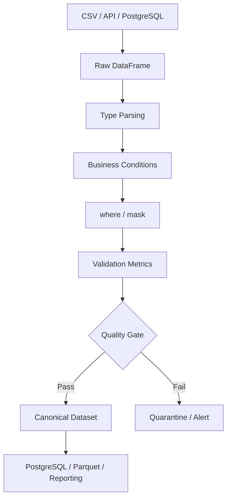

# 08- Where And Mask

## Overview

`where()` and `mask()` provide conditional value replacement in Pandas.

They are useful when a transformation needs to preserve values that satisfy a condition while replacing values that do not, or the inverse:

```text
where(condition)
    → keep values where condition is True
    → replace values where condition is False

mask(condition)
    → replace values where condition is True
    → keep values where condition is False
```

This makes them useful for:

- Conditional data normalization.
- Replacing invalid or out-of-range values.
- Applying data-quality rules.
- Protecting values outside an allowed domain.
- Creating sanitized datasets.
- Implementing conditional transformations without explicit Python loops.

The key mental model is:

```text
where()
    condition == True
        → keep original value
    condition == False
        → replace value

mask()
    condition == True
        → replace value
    condition == False
        → keep original value
```

They are particularly valuable in production ETL pipelines because they let you express conditional transformations in a vectorized form.

## Why `where()` and `mask()` Exist

Many data-cleaning rules can be expressed as:

```text
If value is valid:
    keep it

Otherwise:
    replace it
```

For example:

```text
amount >= 0
    → keep amount

amount < 0
    → missing
```

This can be expressed with `where()`:

```python
orders["amount"] = (
    orders["amount"]
    .where(
        orders["amount"].ge(0),
        pd.NA,
    )
)
```

The alternative is a row-by-row Python function:

```python
orders["amount"] = (
    orders["amount"]
    .apply(
        lambda value: (
            value
            if value >= 0
            else pd.NA
        )
    )
)
```

The `where()` implementation is generally preferable because the condition is expressed as a vectorized boolean mask.

## Basic Syntax

### `Series.where()`

```python
result = series.where(
    condition,
    other,
)
```

The value is preserved where `condition` is `True`.

### `Series.mask()`

```python
result = series.mask(
    condition,
    other,
)
```

The value is replaced where `condition` is `True`.

### DataFrame Usage

Both operations also work on DataFrames:

```python
result = df.where(
    condition,
    other,
)
```

and:

```python
result = df.mask(
    condition,
    other,
)
```

## Basic Example

```python
import pandas as pd

orders = pd.DataFrame(
    {
        "order_id": [1001, 1002, 1003],
        "amount": [100.0, -25.0, 250.0],
    }
)

orders["amount"] = (
    orders["amount"]
    .where(
        orders["amount"].ge(0),
        pd.NA,
    )
)
```

Result:

```text
   order_id  amount
0      1001   100.0
1      1002    <NA>
2      1003   250.0
```

The business rule is explicit:

```text
Non-negative amount → preserve
Negative amount     → missing
```

## `where()` Semantics

`where()` keeps the original value when the condition is true.

Conceptually:

```python
series.where(
    condition,
    replacement,
)
```

means:

```text
condition == True
    → original value

condition == False
    → replacement
```

Example:

```python
values = pd.Series(
    [10, 20, 30, 40],
)

result = values.where(
    values.ge(25),
    0,
)
```

Result:

```text
0     0
1     0
2    30
3    40
dtype: int64
```

## `mask()` Semantics

`mask()` performs the inverse conditional replacement.

```python
values = pd.Series(
    [10, 20, 30, 40],
)

result = values.mask(
    values.ge(25),
    0,
)
```

Result:

```text
0    10
1    20
2     0
3     0
dtype: int64
```

Here:

```text
condition == True
    → replacement

condition == False
    → original value
```

## `where()` vs `mask()`

| Requirement | Preferred operation |
|---|---|
| Keep values satisfying a condition | `where()` |
| Replace values satisfying a condition | `mask()` |
| Keep valid values and null invalid ones | `where()` |
| Null or replace values matching a forbidden condition | `mask()` |
| Replace based on multiple explicit choices | `np.where()` / `np.select()` |
| Conditional assignment to selected rows | `.loc[]` |

The two operations are logical inverses for the same condition:

```python
series.where(condition, replacement)
```

is conceptually equivalent to:

```python
series.mask(~condition, replacement)
```

and:

```python
series.mask(condition, replacement)
```

is conceptually equivalent to:

```python
series.where(~condition, replacement)
```

Choose whichever expresses the business rule more naturally.

## `where()` for Data Validation

A common production use case is enforcing valid ranges.

For example:

```python
transactions["quantity"] = (
    transactions["quantity"]
    .where(
        transactions["quantity"].gt(0),
        pd.NA,
    )
)
```

This converts zero and negative quantities to missing.

A stronger pipeline would then validate how many values were rejected:

```python
invalid_quantity_count = int(
    transactions["quantity"]
    .isna()
    .sum()
)
```

Do not rely on `where()` alone as the data-quality system. It performs the transformation; separate validation should determine whether the input quality is acceptable.

## Replacing Invalid Financial Values

Financial datasets should generally retain valid numeric dtypes.

Avoid:

```python
transactions["amount"] = (
    transactions["amount"]
    .where(
        transactions["amount"].ge(0),
        "invalid",
    )
)
```

This introduces a string into a numeric column.

Prefer:

```python
transactions["amount"] = (
    transactions["amount"]
    .where(
        transactions["amount"].ge(0),
        pd.NA,
    )
    .astype("Float64")
)
```

Then keep invalidity information separately when needed:

```python
transactions["amount_invalid"] = (
    transactions["amount"]
    .isna()
)
```

For audit-sensitive workloads, retain the original raw value or route invalid records to a quarantine dataset rather than silently discarding the information.

## `mask()` for Forbidden Conditions

`mask()` is useful when the business rule is naturally phrased as:

```text
If a value violates a condition:
    replace it
```

Example:

```python
users["age"] = (
    users["age"]
    .mask(
        users["age"].lt(0),
        pd.NA,
    )
)
```

The condition directly describes the invalid state:

```text
age < 0
    → replace
```

This can be more readable than writing the inverse condition with `where()`.

## Multiple Conditions

Conditions can be combined with Pandas boolean operations.

```python
orders["amount"] = (
    orders["amount"]
    .where(
        orders["amount"].ge(0)
        & orders["amount"].le(1_000_000),
        pd.NA,
    )
)
```

The valid range is:

```text
0 <= amount <= 1,000,000
```

For multiple conditions, use parentheses because Pandas boolean operators require explicit precedence.

Prefer:

```python
(
    orders["amount"].ge(0)
    & orders["amount"].le(1_000_000)
)
```

over:

```python
orders["amount"].ge(0) and orders["amount"].le(1_000_000)
```

The latter is invalid for Series because Python's `and` does not operate element-wise.

## `where()` vs `np.where()`

Both express conditional selection, but they have different APIs and use cases.

### Pandas `where()`

```python
orders["status"] = (
    orders["status"]
    .where(
        orders["status"].notna(),
        "unknown",
    )
)
```

`where()` is naturally integrated with Pandas objects and their index/column alignment.

### NumPy `where()`

```python
orders["status"] = np.where(
    orders["status"].notna(),
    orders["status"],
    "unknown",
)
```

`np.where()` is useful for array-oriented conditional selection.

For a Pandas Series or DataFrame transformation, `where()` can be clearer because it preserves the Pandas object semantics directly.

## `where()` vs `.loc[]`

These can express similar conditional updates.

Using `.loc[]`:

```python
mask = orders["amount"].lt(0)

orders.loc[
    mask,
    "amount",
] = pd.NA
```

Using `where()`:

```python
orders["amount"] = (
    orders["amount"]
    .where(
        orders["amount"].ge(0),
        pd.NA,
    )
)
```

The distinction is useful:

```text
.loc[]
    → conditional assignment to selected locations

where()
    → conditional preservation/replacement of values
```

Use whichever makes the transformation boundary clearer.

## `mask()` vs `.loc[]`

Equivalent logic can be written with `.loc[]`:

```python
mask = orders["amount"].lt(0)

orders.loc[
    mask,
    "amount",
] = pd.NA
```

or:

```python
orders["amount"] = (
    orders["amount"]
    .mask(
        orders["amount"].lt(0),
        pd.NA,
    )
)
```

`mask()` is often convenient inside method chains.

For procedural transformations where several columns must be changed together, `.loc[]` may be easier to read.

## Method Chaining

`where()` and `mask()` integrate well with method chains.

```python
orders = (
    orders
    .assign(
        amount=pd.to_numeric(
            orders["amount"],
            errors="coerce",
        )
    )
)

orders["amount"] = (
    orders["amount"]
    .where(
        orders["amount"].ge(0),
        pd.NA,
    )
)
```

For complex pipelines, explicit intermediate variables may be preferable when they make validation or debugging easier.

## Conditional Normalization

Suppose an API uses an empty string to represent a missing value.

```python
customers["email"] = (
    customers["email"]
    .astype("string")
    .mask(
        customers["email"].eq(""),
        pd.NA,
    )
)
```

A more robust version can normalize whitespace first:

```python
email = (
    customers["email"]
    .astype("string")
    .str.strip()
)

customers["email"] = (
    email
    .mask(
        email.eq(""),
        pd.NA,
    )
)
```

This separates:

```text
String normalization
    ↓
Missing-value normalization
```

## Conditional Replacement Without Losing Valid Values

Suppose an upstream service sends:

```text
0
-1
100
250
```

where `-1` is a sentinel for unavailable data.

Use:

```python
metrics["value"] = (
    metrics["value"]
    .mask(
        metrics["value"].eq(-1),
        pd.NA,
    )
)
```

This is preferable to:

```python
metrics["value"] = (
    metrics["value"]
    .replace(-1, None)
)
```

when the semantic requirement is specifically:

```text
Only replace values satisfying a condition.
```

`replace()` is better when the transformation is known-value substitution; `mask()` is better when the transformation is condition-driven.

## Conditional Clipping

`where()` and `mask()` can implement simple bounds, but Pandas also provides `clip()`.

For example:

```python
prices["discount"] = (
    prices["discount"]
    .clip(
        lower=0,
        upper=1,
    )
)
```

Prefer `clip()` when the requirement is specifically to cap values to a numerical range.

Using:

```python
prices["discount"] = (
    prices["discount"]
    .where(
        prices["discount"].between(0, 1),
        0,
    )
)
```

has different semantics because out-of-range values are replaced rather than clamped.

The distinction is:

```text
clip()
    → move out-of-range values to a boundary

where()
    → replace out-of-range values with another value
```

## Conditional Replacement vs `fillna()`

These APIs solve different problems.

```python
orders["discount"] = (
    orders["discount"]
    .fillna(0)
)
```

means:

```text
Replace existing missing values.
```

Whereas:

```python
orders["discount"] = (
    orders["discount"]
    .where(
        orders["discount"].ge(0),
        pd.NA,
    )
)
```

means:

```text
Replace values that violate the condition.
```

A production pipeline may use both:

```text
Parse
   ↓
Validate
   ↓
where/mask invalid values
   ↓
fillna according to business policy
```

Do not confuse invalidity with missingness.

## Conditional Replacement vs `replace()`

Use `replace()` when the rule is value-driven:

```text
"P" → "pending"
"C" → "completed"
```

Use `where()` or `mask()` when the rule is condition-driven:

```text
amount < 0 → missing
age > 120 → missing
```

Example:

```python
orders["status"] = (
    orders["status"]
    .replace(
        {
            "P": "pending",
            "C": "completed",
        }
    )
)

orders["amount"] = (
    orders["amount"]
    .mask(
        orders["amount"].lt(0),
        pd.NA,
    )
)
```

This distinction makes transformation code easier to maintain.

## DataFrame `where()`

`DataFrame.where()` can conditionally preserve or replace cells.

```python
metrics = pd.DataFrame(
    {
        "cpu": [30.0, 85.0, 120.0],
        "memory": [50.0, 90.0, 150.0],
    }
)

valid = metrics.le(100)

cleaned = metrics.where(
    valid,
    pd.NA,
)
```

Each cell is evaluated independently.

Result:

```text
    cpu  memory
0  30.0    50.0
1  85.0    90.0
2   NaN     NaN
```

This is useful when the same validity condition can be applied consistently across a set of homogeneous columns.

## DataFrame `mask()`

The inverse can be expressed with `mask()`:

```python
cleaned = metrics.mask(
    metrics.gt(100),
    pd.NA,
)
```

This directly describes:

```text
values greater than 100 are invalid
    → replace
```

## Column-Specific Conditions

When columns have different business rules, avoid a generic DataFrame-wide condition.

Prefer:

```python
orders["quantity"] = (
    orders["quantity"]
    .where(
        orders["quantity"].gt(0),
        pd.NA,
    )
)

orders["discount"] = (
    orders["discount"]
    .where(
        orders["discount"].between(0, 1),
        pd.NA,
    )
)

orders["amount"] = (
    orders["amount"]
    .where(
        orders["amount"].ge(0),
        pd.NA,
    )
)
```

Each transformation is tied to the semantics of its column.

## Alignment Behavior

Pandas aligns condition objects by labels.

Example:

```python
values = pd.Series(
    [100, 200, 300],
    index=["a", "b", "c"],
)

condition = pd.Series(
    [True, False, True],
    index=["a", "b", "c"],
)

result = values.where(
    condition,
    0,
)
```

The condition is aligned to the Series index.

This is one reason Pandas conditional operations are safer than raw positional array manipulation when labels are meaningful.

## Misaligned Conditions

Be careful when the condition comes from another object.

```python
condition = pd.Series(
    [True, False],
    index=["b", "c"],
)
```

The condition does not represent a simple positional mask for:

```text
a, b, c
```

Pandas applies label-based alignment semantics.

For production transformations, verify:

```python
assert values.index.equals(
    condition.index
)
```

when exact alignment is part of the contract.

## DataFrame Alignment

For DataFrames, both index and columns can participate in alignment.

Example:

```python
condition = pd.DataFrame(
    {
        "amount": [True, False],
        "quantity": [True, True],
    },
    index=[0, 1],
)

result = orders[
    [
        "amount",
        "quantity",
    ]
].where(
    condition,
    0,
)
```

If the condition is generated separately, ensure that its labels correspond exactly to the target DataFrame.

## `other` Parameter

The replacement value can be a scalar:

```python
orders["amount"].where(
    orders["amount"].ge(0),
    pd.NA,
)
```

or another Series/DataFrame-like object:

```python
orders["adjusted_amount"] = (
    orders["amount"]
    .where(
        orders["currency"].eq("USD"),
        orders["amount_usd"],
    )
)
```

The second argument can therefore provide a row-aligned replacement.

This is useful when each record has its own fallback value.

## Series as Replacement

Example:

```python
orders["effective_amount"] = (
    orders["amount"]
    .where(
        orders["amount"].notna(),
        orders["estimated_amount"],
    )
)
```

This means:

```text
amount exists
    → use amount

amount missing
    → use estimated_amount
```

This is a powerful pattern for fallback data.

## DataFrame as Replacement

For DataFrame-level transformations:

```python
result = sales.where(
    valid_mask,
    fallback_values,
)
```

Both the condition and replacement DataFrame should have compatible labels and shape.

This is useful for applying row/column-specific fallbacks without writing Python loops.

## Missing Condition Values

The condition itself can contain missing values.

For example:

```python
condition = pd.Series(
    [True, False, pd.NA],
    dtype="boolean",
)
```

When using nullable boolean conditions, behavior involving `pd.NA` should be treated explicitly rather than assuming ordinary Python `True`/`False` semantics.

For critical transformations:

```python
condition = (
    condition
    .fillna(False)
)
```

can make the intended policy explicit before applying the mask.

Whether missing conditions should mean:

```text
keep original
replace
reject record
```

depends on the business rule.

Do not let that behavior remain implicit in a quality-critical pipeline.

## `inplace`

`where()` and `mask()` support mutation-oriented usage in relevant APIs, but explicit assignment is generally easier to reason about:

```python
orders["amount"] = (
    orders["amount"]
    .mask(
        orders["amount"].lt(0),
        pd.NA,
    )
)
```

rather than relying on hidden mutation.

Explicit assignment makes data-flow boundaries clearer.

## Dtype Changes

Replacing values with `pd.NA`, `None`, or incompatible values can change dtype behavior.

Example:

```python
values = pd.Series(
    [10, 20, -1],
    dtype="int64",
)

result = values.mask(
    values.eq(-1),
    pd.NA,
)
```

For a production schema, explicitly enforce the expected nullable dtype when necessary:

```python
result = (
    values
    .mask(
        values.eq(-1),
        pd.NA,
    )
    .astype("Int64")
)
```

Nullable extension dtypes are often preferable when missing values are expected in integer or boolean fields.

## Dtype-Aware Validation

A reliable pipeline should distinguish:

```text
Representation problem
    → wrong dtype or parse failure

Business validity problem
    → valid dtype but invalid value

Missingness problem
    → missing value requiring policy
```

For example:

```python
orders["amount"] = pd.to_numeric(
    orders["amount"],
    errors="coerce",
)

orders["amount"] = (
    orders["amount"]
    .where(
        orders["amount"].ge(0),
        pd.NA,
    )
    .astype("Float64")
)
```

This establishes:

```text
Parsing
    ↓
Business validity
    ↓
Canonical dtype
```

## Null and Empty Inputs

`where()` and `mask()` generally behave naturally with empty Series and DataFrames.

Example:

```python
empty = pd.Series(
    [],
    dtype="Float64",
)

result = empty.where(
    empty.ge(0),
    pd.NA,
)

assert result.empty
```

The operation itself does not determine whether an empty dataset is acceptable.

That belongs in pipeline validation:

```text
Expected empty batch
    → success

Unexpected empty batch
    → pipeline failure or alert
```

## Duplicate Records

`where()` and `mask()` do not alter row cardinality.

For example:

```python
orders["amount"] = (
    orders["amount"]
    .mask(
        orders["amount"].lt(0),
        pd.NA,
    )
)
```

does not remove duplicate orders.

Deduplication remains an explicit concern:

```python
orders = orders.drop_duplicates(
    subset=["order_id"],
    keep="last",
)
```

Do not combine unrelated data-quality responsibilities into the same transformation.

## Performance

`where()` and `mask()` are designed for vectorized conditional transformations.

They are generally preferable to:

```python
Series.apply(...)
```

or:

```python
for index, row in df.iterrows():
    ...
```

for simple conditional logic.

Example:

```python
orders["risk"] = (
    orders["risk"]
    .mask(
        orders["amount"].ge(100_000),
        "high",
    )
)
```

The condition is evaluated across the Series rather than invoking a Python function for every row.

## Avoid Python Loops

Avoid:

```python
for index, row in orders.iterrows():
    if row["amount"] < 0:
        orders.loc[
            index,
            "amount",
        ] = pd.NA
```

Prefer:

```python
orders["amount"] = (
    orders["amount"]
    .mask(
        orders["amount"].lt(0),
        pd.NA,
    )
)
```

The vectorized implementation is shorter, easier to reason about, and generally more scalable.

## `where()` vs `apply()`

Suppose the rule is:

```text
amount < 0 → missing
```

Prefer:

```python
orders["amount"] = (
    orders["amount"]
    .mask(
        orders["amount"].lt(0),
        pd.NA,
    )
)
```

instead of:

```python
orders["amount"] = (
    orders["amount"]
    .apply(
        lambda value: (
            pd.NA
            if value < 0
            else value
        )
    )
)
```

Use `apply()` when the transformation requires custom Python logic that cannot be naturally expressed through vectorized conditions.

## `where()` vs `np.select()`

When multiple conditions produce different categorical outputs:

```python
conditions = [
    orders["amount"].ge(100_000),
    orders["amount"].ge(10_000),
]

choices = [
    "critical",
    "high",
]

orders["risk"] = np.select(
    conditions,
    choices,
    default="normal",
)
```

This is typically better than repeatedly nesting `where()`:

```python
orders["risk"] = (
    orders["risk"]
    .where(
        ...
    )
)
```

Use:

```text
where/mask
    → preserve or invalidate existing values

np.where/np.select
    → construct a new value from conditions
```

## Conditional Fallbacks

One useful production pattern is selecting a preferred value and falling back to another column.

```python
orders["effective_email"] = (
    orders["customer_email"]
    .where(
        orders["customer_email"].notna()
        & orders["customer_email"].ne(""),
        orders["billing_email"],
    )
)
```

This expresses:

```text
Valid customer email
    → use customer email

Otherwise
    → use billing email
```

A reusable validity condition can make the logic clearer:

```python
customer_email_valid = (
    orders["customer_email"].notna()
    & orders["customer_email"].ne("")
)

orders["effective_email"] = (
    orders["customer_email"]
    .where(
        customer_email_valid,
        orders["billing_email"],
    )
)
```

## Conditional Data Masking

The APIs can also support data protection workflows where values need to be hidden based on a rule.

For example:

```python
customers["phone_masked"] = (
    customers["phone"]
    .where(
        customers["is_internal"],
        "***REDACTED***",
    )
)
```

This is appropriate only for generating a derived presentation dataset.

Do not treat Pandas masking as an authorization mechanism. Access control must happen at the application, database, storage, or service boundary.

## Security Considerations

Conditional replacement can be useful for producing safer reporting datasets, but it does not provide security by itself.

For sensitive data:

```text
Database authorization
    ↓
Application authorization
    ↓
Data minimization
    ↓
Pandas transformation
    ↓
Controlled output
```

Do not load sensitive data into Pandas merely to hide it later if the source system can enforce the required restrictions earlier.

Prefer SQL-level filtering or column selection where practical:

```sql
SELECT
    customer_id,
    country
FROM customers;
```

instead of:

```text
SELECT all sensitive columns
    ↓
Load into Pandas
    ↓
Mask them
    ↓
Discard them
```

Data minimization reduces exposure and memory footprint.

## ETL Architecture

A production transformation stage can incorporate `where()` and `mask()` as explicit data-quality operations:



The important architectural principle is that conditional replacement should not silently hide systemic data-quality problems.

## Monitoring Conditional Replacements

When `where()` or `mask()` removes or invalidates data, measure how much was changed.

Example:

```python
invalid_mask = (
    orders["amount"].lt(0)
)

invalid_count = int(
    invalid_mask.sum()
)

orders["amount"] = (
    orders["amount"]
    .mask(
        invalid_mask,
        pd.NA,
    )
)
```

You can then emit:

```text
rows_processed
invalid_amount_count
invalid_amount_rate
```

For a recurring AWS batch job, Kubernetes CronJob, or Celery task, these metrics can feed operational dashboards and alerts.

## Detecting Upstream Changes

Suppose an API historically guarantees:

```text
amount >= 0
```

A sudden increase in:

```python
invalid_count
```

may indicate:

```text
Upstream schema change
Vendor integration problem
Source-system corruption
Unit mismatch
Parsing bug
Business-rule change
```

Do not treat data invalidation as routine cleanup without monitoring its rate.

## Reliability and Idempotence

A conditional transformation should ideally be idempotent.

For example:

```python
orders["amount"] = (
    orders["amount"]
    .mask(
        orders["amount"].lt(0),
        pd.NA,
    )
)
```

Once negative values have become missing, rerunning the operation does not change valid values again.

This is useful for:

```text
Job retries
Backfills
Incremental processing
Reprocessing failed batches
```

Idempotent transformations reduce the risk of inconsistent retry behavior.

## Transactional Boundaries

Pandas transformations happen in process memory.

If the output eventually writes to PostgreSQL:

```text
Read
    ↓
Transform
    ↓
Validate
    ↓
Write
```

consider the database transaction boundary separately from the Pandas transformation.

Do not assume:

```python
df.mask(...)
```

provides transactional guarantees.

For critical pipelines, validate the transformed DataFrame before committing the downstream write.

## Incremental Processing

For batch data:

```python
for chunk in pd.read_csv(
    "orders.csv",
    chunksize=100_000,
):
    invalid_mask = chunk["amount"].lt(0)

    invalid_count = int(
        invalid_mask.sum()
    )

    chunk["amount"] = (
        chunk["amount"]
        .mask(
            invalid_mask,
            pd.NA,
        )
    )

    process_chunk(chunk)
```

Chunked processing controls peak memory usage.

However, make sure validation metrics are aggregated across chunks so that invalid records are not hidden by per-chunk processing.

## Error Quarantine

For high-quality ETL, invalid rows may need to be quarantined instead of merely replaced.

Example:

```python
invalid_mask = (
    orders["amount"].lt(0)
)

invalid_orders = orders.loc[
    invalid_mask
].copy()

valid_orders = orders.loc[
    ~invalid_mask
].copy()

valid_orders["amount"] = (
    valid_orders["amount"]
    .astype("Float64")
)
```

This preserves operational evidence.

A common architecture is:

```text
Raw input
    ↓
Validation
    ├── valid → processed dataset
    └── invalid → quarantine dataset
```

This is preferable to silently converting every invalid value to `NA` when auditability matters.

## Testing `where()`

Test values that satisfy and violate the condition.

```python
def test_where_replaces_invalid_amounts() -> None:
    amounts = pd.Series(
        [100, -25, 200],
        dtype="Int64",
    )

    result = amounts.where(
        amounts.ge(0),
        pd.NA,
    )

    expected = pd.Series(
        [100, pd.NA, 200],
        dtype="Int64",
    )

    pd.testing.assert_series_equal(
        result,
        expected,
    )
```

This verifies both branches of the rule.

## Testing `mask()`

```python
def test_mask_replaces_forbidden_values() -> None:
    ages = pd.Series(
        [25, 40, 130],
        dtype="Int64",
    )

    result = ages.mask(
        ages.gt(120),
        pd.NA,
    )

    expected = pd.Series(
        [25, 40, pd.NA],
        dtype="Int64",
    )

    pd.testing.assert_series_equal(
        result,
        expected,
    )
```

The test makes the forbidden condition explicit.

## Testing Fallback Values

```python
def test_where_uses_fallback_series() -> None:
    primary = pd.Series(
        ["a", None, "c"],
        dtype="string",
    )

    fallback = pd.Series(
        ["x", "y", "z"],
        dtype="string",
    )

    result = primary.where(
        primary.notna(),
        fallback,
    )

    expected = pd.Series(
        ["a", "y", "c"],
        dtype="string",
    )

    pd.testing.assert_series_equal(
        result,
        expected,
    )
```

This verifies both alignment and fallback behavior.

## Testing Empty Input

```python
def test_where_handles_empty_series() -> None:
    values = pd.Series(
        [],
        dtype="Float64",
    )

    result = values.mask(
        values.lt(0),
        pd.NA,
    )

    assert result.empty
    assert str(result.dtype) == "Float64"
```

Empty input tests are useful for scheduled batch pipelines where an empty result may be either valid or exceptional depending on the business process.

## Testing Index Alignment

```python
def test_where_preserves_index() -> None:
    values = pd.Series(
        [10, 20, 30],
        index=[101, 205, 309],
        dtype="Int64",
    )

    condition = pd.Series(
        [True, False, True],
        index=[101, 205, 309],
        dtype="boolean",
    )

    result = values.where(
        condition,
        pd.NA,
    )

    assert result.index.tolist() == [
        101,
        205,
        309,
    ]
```

Index alignment is part of Pandas semantics and should be verified when conditions are generated separately.

## Common Mistakes

| Mistake | Why it happens | Better approach |
|---|---|---|
| Reversing `where()` semantics | Condition is read as replacement condition | Remember `where` keeps `True` values |
| Reversing `mask()` semantics | Similar API names are confusing | Remember `mask` replaces `True` values |
| Using `and` / `or` with Series | Python boolean operators seem natural | Use `&` / `|` with parentheses |
| Using `apply()` for simple conditional logic | Python functions are familiar | Use `where()` / `mask()` |
| Using `replace()` for condition-based rules | Both change values | Use `mask()` / `where()` for predicates |
| Mixing strings into numeric columns | Easy invalid-value marker | Use `pd.NA` and preserve numeric dtype |
| Treating invalid values as ordinary missing data | Replacement hides the source problem | Measure or quarantine invalid records |
| Applying a DataFrame-wide condition to heterogeneous columns | Generic transformations are convenient | Use column-specific rules |
| Ignoring condition alignment | Boolean Series looks positional | Verify index/column alignment |
| Assuming masking is authorization | Masked output appears safe | Enforce access control before Pandas |
| Using broad conditions without tests | Logic seems obvious | Test boundary and edge values |
| Assuming chunking solves CPU cost | Memory improves | Optimize the transformation itself |

## Interview Traps

### What does `where()` do?

It keeps the original value where the condition is true and uses the `other` value where the condition is false.

### What does `mask()` do?

It replaces values where the condition is true and keeps the original values where the condition is false.

### How are `where()` and `mask()` related?

They are logical inverses for the same condition:

```python
series.where(condition, other)
```

is equivalent in intent to:

```python
series.mask(~condition, other)
```

### How is `where()` different from `replace()`?

`where()` is condition-based; `replace()` is value-based.

### How is `where()` different from `apply()`?

`where()` expresses vectorized conditional preservation/replacement, while `apply()` executes custom Python logic.

### Why is `where()` useful for data validation?

It lets a pipeline invalidate values that violate a predicate while retaining vectorized execution.

### Does `where()` remove rows?

No. It changes values. Row filtering requires operations such as boolean selection or `.loc[]`.

### Does `mask()` remove rows?

No. It replaces matching values.

### Can `other` be another Series?

Yes. The replacement can come from another aligned Series or DataFrame.

### Why can dtype change after masking?

Replacing values with missing or incompatible values can require a different dtype representation, especially for non-nullable numeric dtypes.

### When should `clip()` be preferred?

Use `clip()` when out-of-range numerical values should be moved to a boundary rather than replaced with missing or another arbitrary value.

### When should `np.select()` be preferred?

Use it when multiple conditions generate different categorical outputs rather than simply preserving or invalidating an existing value.

## Practical Decision Framework

Use the operation that matches the transformation semantics:

```text
Known exact value?
    │
    └── Yes → replace()

Condition determines validity?
    │
    ├── Keep valid values → where()
    │
    └── Replace invalid/forbidden values → mask()

Standard string transformation?
    │
    └── .str

Standard datetime transformation?
    │
    └── .dt

Simple numerical calculation?
    │
    └── Vectorized arithmetic / NumPy

Multiple conditions produce categories?
    │
    └── np.select()

Need to modify selected DataFrame locations?
    │
    └── .loc[]

Need a relational lookup?
    │
    └── merge()
```

## Production Example

A realistic order-cleaning stage can combine parsing, validation, conditional replacement, and observability.

```python
import pandas as pd


def clean_orders(
    orders: pd.DataFrame,
) -> tuple[pd.DataFrame, pd.DataFrame, dict[str, int]]:
    result = orders.copy()

    result["amount"] = pd.to_numeric(
        result["amount"],
        errors="coerce",
    )

    invalid_amount_mask = (
        result["amount"].lt(0)
    )

    invalid_orders = result.loc[
        invalid_amount_mask
    ].copy()

    result["amount"] = (
        result["amount"]
        .mask(
            invalid_amount_mask,
            pd.NA,
        )
        .astype("Float64")
    )

    metrics = {
        "rows_processed": len(result),
        "invalid_amounts": len(
            invalid_orders
        ),
    }

    return (
        result,
        invalid_orders,
        metrics,
    )
```

This separates:

```text
Parsing
    ↓
Condition
    ↓
Invalid-record extraction
    ↓
Conditional replacement
    ↓
Canonical dtype
    ↓
Metrics
```

For high-value or audit-sensitive data, this is safer than simply replacing invalid values and discarding the evidence.

## Key Takeaways

- `where()` preserves values where a condition is `True` and replaces values where it is `False`; `mask()` performs the inverse by replacing values where the condition is `True`.
- Use `where()` and `mask()` for **condition-driven vectorized transformations**, especially data-quality rules, validity checks, and conditional fallbacks.
- Prefer `replace()` for exact value substitution, `clip()` for numeric bounds, `.loc[]` for conditional assignment, and `np.select()` for constructing outputs from multiple conditions.
- Preserve canonical dtypes and treat invalid data separately from ordinary missing data; measure or quarantine values invalidated by transformation when data quality and auditability matter.
- Respect Pandas alignment semantics, test boundary and null cases, and monitor replacement rates in production pipelines so upstream data-quality regressions are visible rather than silently hidden.