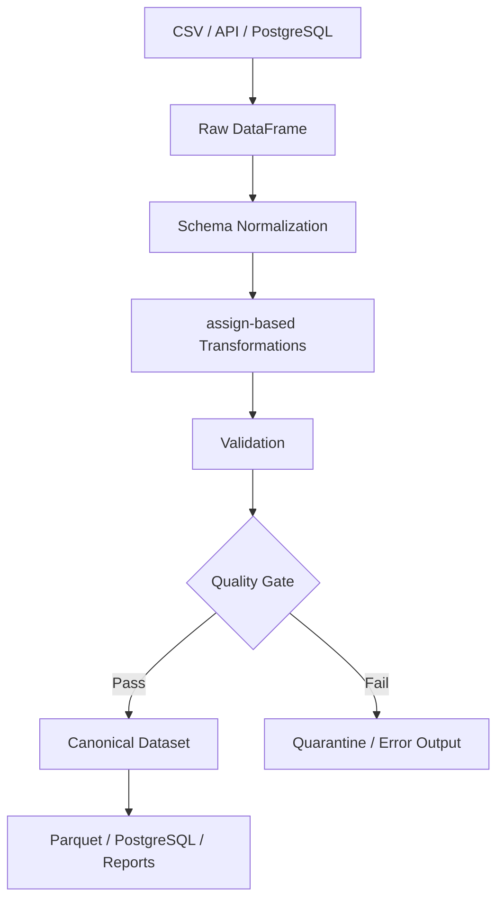

# 09- Assign

## Overview

`DataFrame.assign()` is a Pandas transformation method for creating new columns and replacing existing columns while returning a DataFrame that can be composed into a method chain.

Its primary value is not that it makes operations possible that cannot otherwise be performed. The same columns can usually be created through direct assignment:

```python
orders["total_amount"] = (
    orders["quantity"]
    * orders["unit_price"]
)
```

With `assign()`:

```python
orders = orders.assign(
    total_amount=(
        orders["quantity"]
        * orders["unit_price"]
    )
)
```

The important difference is **data-flow style**.

`assign()` encourages transformations that:

- Return a DataFrame.
- Compose naturally with method chaining.
- Keep transformation steps together.
- Make derived columns explicit.
- Allow later assignments to depend on columns created earlier in the same call.

This makes `assign()` particularly useful in ETL pipelines, reporting transformations, and reusable DataFrame-processing functions.

## Why `assign()` Exists

Complex Pandas transformations often involve several sequential steps:

```text
Read data
    ↓
Normalize columns
    ↓
Create derived fields
    ↓
Filter records
    ↓
Aggregate
    ↓
Write output
```

Without `assign()`, method chaining can become awkward:

```python
orders = orders.copy()

orders["subtotal"] = (
    orders["quantity"]
    * orders["unit_price"]
)

orders["tax"] = (
    orders["subtotal"] * 0.18
)

orders["total"] = (
    orders["subtotal"]
    + orders["tax"]
)
```

With `assign()`:

```python
orders = (
    orders
    .assign(
        subtotal=(
            orders["quantity"]
            * orders["unit_price"]
        ),
        tax=(
            lambda frame:
            frame["subtotal"] * 0.18
        ),
        total=(
            lambda frame:
            frame["subtotal"]
            + frame["tax"]
        ),
    )
)
```

The entire transformation remains part of a DataFrame pipeline.

## Basic Syntax

The basic form is:

```python
result = dataframe.assign(
    new_column=expression,
)
```

Multiple columns can be assigned:

```python
result = dataframe.assign(
    subtotal=...,
    tax=...,
    total=...,
)
```

A callable can be used:

```python
result = dataframe.assign(
    total=lambda frame: (
        frame["quantity"]
        * frame["unit_price"]
    ),
)
```

The method returns a DataFrame.

## Simple Example

```python
import pandas as pd

orders = pd.DataFrame(
    {
        "order_id": [1001, 1002, 1003],
        "quantity": [2, 5, 3],
        "unit_price": [100.0, 50.0, 200.0],
    }
)

result = orders.assign(
    subtotal=(
        orders["quantity"]
        * orders["unit_price"]
    )
)
```

Result:

```text
   order_id  quantity  unit_price  subtotal
0      1001         2       100.0     200.0
1      1002         5        50.0     250.0
2      1003         3       200.0     600.0
```

The original `orders` DataFrame is not changed by this expression.

## Return Semantics

`assign()` returns a DataFrame.

This makes it different from operations such as:

```python
orders["amount"]
```

which returns a Series.

It also differs from direct assignment:

```python
orders["amount"] = ...
```

which mutates the existing DataFrame.

A useful mental model is:

```text
Direct assignment
    → mutate a DataFrame

assign()
    → return a transformed DataFrame
```

The resulting DataFrame can immediately participate in another operation:

```python
result = (
    orders
    .assign(
        subtotal=(
            orders["quantity"]
            * orders["unit_price"]
        )
    )
    .query("subtotal >= 500")
)
```

## Non-Mutation and Practical Immutability

`assign()` does not mutate the original DataFrame's column set simply because a new DataFrame is returned.

Example:

```python
orders = pd.DataFrame(
    {
        "amount": [100, 200],
    }
)

result = orders.assign(
    tax=orders["amount"] * 0.18,
)

assert "tax" not in orders.columns
assert "tax" in result.columns
```

This makes `assign()` useful for transformation functions that should avoid modifying their caller's DataFrame.

However, this should not be interpreted as a guarantee of deep copying every underlying object. Pandas may reuse underlying data where safe. The important API-level behavior is that the original DataFrame is not updated with the newly assigned column.

## Adding Multiple Columns

Multiple columns can be created in one call:

```python
result = orders.assign(
    subtotal=(
        orders["quantity"]
        * orders["unit_price"]
    ),
    tax=(
        orders["quantity"]
        * orders["unit_price"]
        * 0.18
    ),
)
```

This is useful for related derived fields.

However, repeating an expression can be undesirable:

```python
orders["quantity"] * orders["unit_price"]
```

is calculated twice.

A callable-based approach can avoid that repetition.

## Referencing Columns Created Earlier

One of the most useful features of `assign()` is that later expressions can depend on columns created earlier in the same call.

Example:

```python
result = orders.assign(
    subtotal=lambda frame: (
        frame["quantity"]
        * frame["unit_price"]
    ),
    tax=lambda frame: (
        frame["subtotal"] * 0.18
    ),
    total=lambda frame: (
        frame["subtotal"]
        + frame["tax"]
    ),
)
```

The conceptual execution order is:

```text
subtotal
    ↓
tax
    ↓
total
```

This makes multi-step derived-column pipelines much easier to express.

## Assignment Order Matters

Consider:

```python
result = orders.assign(
    subtotal=lambda frame: (
        frame["quantity"]
        * frame["unit_price"]
    ),
    total=lambda frame: (
        frame["subtotal"]
        + frame["tax"]
    ),
    tax=lambda frame: (
        frame["subtotal"] * 0.18
    ),
)
```

This is problematic because `total` attempts to use `tax` before `tax` has been created.

Keep dependent assignments in logical order:

```python
result = orders.assign(
    subtotal=lambda frame: (
        frame["quantity"]
        * frame["unit_price"]
    ),
    tax=lambda frame: (
        frame["subtotal"] * 0.18
    ),
    total=lambda frame: (
        frame["subtotal"]
        + frame["tax"]
    ),
)
```

For production pipelines, treat assignment order as part of the transformation contract.

## Callable Assignments

A callable receives the DataFrame being constructed by `assign()`.

Example:

```python
orders = orders.assign(
    total=lambda frame: (
        frame["quantity"]
        * frame["unit_price"]
    )
)
```

The callable should generally be written as:

```python
lambda frame: ...
```

rather than referencing a separate outer variable when the purpose is to consume the current DataFrame state.

This makes dependencies explicit.

## Why Callables Matter

Compare:

```python
orders = orders.assign(
    subtotal=(
        orders["quantity"]
        * orders["unit_price"]
    )
)
```

with:

```python
orders = orders.assign(
    subtotal=lambda frame: (
        frame["quantity"]
        * frame["unit_price"]
    )
)
```

The second form becomes more valuable when chained:

```python
orders = (
    orders
    .assign(
        subtotal=lambda frame: (
            frame["quantity"]
            * frame["unit_price"]
        )
    )
    .assign(
        tax=lambda frame: (
            frame["subtotal"] * 0.18
        )
    )
)
```

or:

```python
orders = orders.assign(
    subtotal=lambda frame: (
        frame["quantity"]
        * frame["unit_price"]
    ),
    tax=lambda frame: (
        frame["subtotal"] * 0.18
    ),
)
```

## `assign()` in Method Chains

`assign()` is particularly useful when several DataFrame operations form one transformation pipeline.

Example:

```python
report = (
    orders
    .query("status == 'completed'")
    .assign(
        subtotal=lambda frame: (
            frame["quantity"]
            * frame["unit_price"]
        ),
        total=lambda frame: (
            frame["quantity"]
            * frame["unit_price"]
            * 1.18
        ),
    )
    .loc[
        :,
        [
            "order_id",
            "subtotal",
            "total",
        ],
    ]
)
```

This reads as a sequence:

```text
filter
  ↓
derive columns
  ↓
select output schema
```

That is often easier to review than a sequence of disconnected mutation statements.

## When to Prefer Explicit Intermediate Variables

Method chaining is not automatically better.

This:

```python
result = (
    orders
    .assign(
        subtotal=lambda frame: (
            frame["quantity"]
            * frame["unit_price"]
        )
    )
    .query("subtotal > 1000")
)
```

is concise and readable.

But a complicated pipeline may be easier to debug as:

```python
result = orders.copy()

result["subtotal"] = (
    result["quantity"]
    * result["unit_price"]
)

high_value_orders = result[
    result["subtotal"] > 1000
]
```

Use `assign()` when it improves the transformation structure, not simply because method chaining is available.

## Replacing Existing Columns

`assign()` can create new columns or replace existing columns.

Example:

```python
orders = orders.assign(
    amount=lambda frame: (
        frame["amount"]
        .round(2)
    )
)
```

This replaces the existing `amount` column in the returned DataFrame.

Treat this differently from adding a derived field.

For production data pipelines, avoid overwriting raw source columns unless the transformation contract explicitly requires it.

Prefer:

```python
orders = orders.assign(
    normalized_amount=lambda frame: (
        frame["amount"].round(2)
    )
)
```

when preserving the original value improves auditability.

## Schema Transformation

`assign()` is often useful for constructing a canonical schema.

Example:

```python
canonical_orders = (
    raw_orders
    .assign(
        customer_id=lambda frame: pd.to_numeric(
            frame["customer_id"],
            errors="coerce",
        ).astype("Int64"),
        amount=lambda frame: pd.to_numeric(
            frame["amount"],
            errors="coerce",
        ).astype("Float64"),
        status=lambda frame: (
            frame["status"]
            .astype("string")
            .str.strip()
            .str.casefold()
        ),
    )
)
```

The operation combines:

```text
Type normalization
String normalization
Canonical field creation
```

For high-quality pipelines, follow this with explicit validation.

## Column Names That Are Not Valid Python Keywords

Keyword-style arguments work naturally for standard Python identifiers:

```python
result = df.assign(
    total_amount=...,
)
```

For column names that are not valid keyword identifiers, use a dictionary with `**`.

Example:

```python
result = df.assign(
    **{
        "order-total": df["quantity"]
        * df["unit_price"]
    }
)
```

This is useful for legacy or externally defined schemas.

Nevertheless, canonical backend datasets should generally use predictable column names.

## Assigning from Existing Series

A Series can be supplied directly:

```python
tax = orders["amount"] * 0.18

result = orders.assign(
    tax=tax,
)
```

Pandas aligns the Series by index when assigning it to the DataFrame.

This is useful when a calculation is performed separately.

## Index Alignment

Consider:

```python
tax = pd.Series(
    [18.0, 36.0],
    index=[1001, 1002],
)

orders = orders.set_index(
    "order_id"
)

result = orders.assign(
    tax=tax,
)
```

The Series aligns by index rather than simply assuming positional correspondence.

This is one of the important reasons Pandas assignment differs from raw NumPy positional operations.

For production systems, verify that indexes represent the expected entities before relying on alignment.

## Positional vs Label Alignment

A list or NumPy array is interpreted positionally:

```python
result = orders.assign(
    priority=[1, 2, 3],
)
```

A Series is aligned by index:

```python
priority = pd.Series(
    [1, 2, 3],
    index=orders.index,
)

result = orders.assign(
    priority=priority,
)
```

These are different contracts.

When correctness depends on entity identity, an explicitly indexed Series is usually safer than an unlabelled array.

## Missing Values

`assign()` itself does not impose missing-value behavior.

The expression you provide determines what happens.

Example:

```python
orders = orders.assign(
    total=lambda frame: (
        frame["quantity"]
        * frame["unit_price"]
    )
)
```

If either operand is missing, the derived value will generally also be missing according to the underlying dtype semantics.

For explicit handling:

```python
orders = orders.assign(
    total=lambda frame: (
        frame["quantity"].fillna(0)
        * frame["unit_price"].fillna(0)
    )
)
```

Do this only when treating missing values as zero is part of the business rule.

Do not use `fillna(0)` merely to suppress missing-value propagation.

## Incorrect Data Types

Validate or normalize dtypes before deriving columns.

For API or CSV data:

```python
orders = (
    orders
    .assign(
        quantity=lambda frame: pd.to_numeric(
            frame["quantity"],
            errors="coerce",
        ),
        unit_price=lambda frame: pd.to_numeric(
            frame["unit_price"],
            errors="coerce",
        ),
    )
    .assign(
        subtotal=lambda frame: (
            frame["quantity"]
            * frame["unit_price"]
        )
    )
)
```

This establishes:

```text
Raw values
    ↓
Numeric parsing
    ↓
Derived calculation
```

A calculation performed before parsing can produce incorrect results or object-dtype behavior.

## Duplicate Records

`assign()` does not deduplicate data.

For example:

```python
orders = orders.assign(
    normalized_status=lambda frame: (
        frame["status"]
        .astype("string")
        .str.strip()
        .str.casefold()
    )
)
```

does not alter row count.

If unique orders are required, use an explicit data-quality operation:

```python
orders = orders.drop_duplicates(
    subset=["order_id"],
    keep="last",
)
```

Keep schema transformation separate from entity deduplication.

## Invalid Values

`assign()` can construct validation flags alongside transformed values.

Example:

```python
orders = orders.assign(
    amount_invalid=lambda frame: (
        frame["amount"].lt(0)
    ),
)
```

Then:

```python
invalid_orders = orders.loc[
    orders["amount_invalid"]
].copy()
```

This is often safer than silently replacing invalid data.

A production pipeline can then choose:

```text
valid → continue
invalid → quarantine / reject / alert
```

## Conditional Derived Columns

Use vectorized expressions inside `assign()`.

Example:

```python
import numpy as np

orders = orders.assign(
    risk=lambda frame: np.select(
        [
            frame["amount"].ge(100_000),
            frame["amount"].ge(10_000),
        ],
        [
            "critical",
            "high",
        ],
        default="normal",
    )
)
```

This combines well with other transformations.

Avoid using row-wise `apply()` simply because a derived column is being created.

## Using `where()` and `mask()` with `assign()`

These operations compose naturally.

```python
orders = orders.assign(
    amount=lambda frame: (
        frame["amount"]
        .mask(
            frame["amount"].lt(0),
            pd.NA,
        )
        .astype("Float64")
    )
)
```

The pipeline explicitly says:

```text
Identify invalid values
    ↓
Replace them
    ↓
Enforce canonical dtype
```

## Creating Quality Flags

A useful production pattern is to preserve both the transformed field and the validation state.

```python
orders = orders.assign(
    amount_invalid=lambda frame: (
        pd.to_numeric(
            frame["amount"],
            errors="coerce",
        ).isna()
    ),
    amount_numeric=lambda frame: pd.to_numeric(
        frame["amount"],
        errors="coerce",
    ),
)
```

For larger pipelines, avoid repeating expensive parsing expressions. Create normalized fields once and build subsequent flags from those fields.

```python
orders = (
    orders
    .assign(
        amount_numeric=lambda frame: pd.to_numeric(
            frame["amount"],
            errors="coerce",
        )
    )
    .assign(
        amount_invalid=lambda frame: (
            frame["amount_numeric"].isna()
            & frame["amount"].notna()
        )
    )
)
```

## Data Type Enforcement

Derived columns can be explicitly typed:

```python
orders = orders.assign(
    customer_id=lambda frame: (
        pd.to_numeric(
            frame["customer_id"],
            errors="coerce",
        )
        .astype("Int64")
    ),
    amount=lambda frame: (
        pd.to_numeric(
            frame["amount"],
            errors="coerce",
        )
        .astype("Float64")
    ),
)
```

This is particularly useful before writing to PostgreSQL, Parquet, or other systems where schema expectations matter.

## Financial Calculations

Use appropriate numeric representations for the workload.

Example:

```python
orders = orders.assign(
    subtotal=lambda frame: (
        frame["quantity"]
        * frame["unit_price"]
    ),
    tax=lambda frame: (
        frame["subtotal"] * 0.18
    ),
    total=lambda frame: (
        frame["subtotal"]
        + frame["tax"]
    ),
)
```

For financial systems requiring exact decimal semantics, do not assume binary floating-point arithmetic is sufficient merely because Pandas calculations execute successfully.

Where exact monetary representation is required, define the system-wide numeric contract before choosing the Pandas dtype and downstream storage format.

## Method Chaining with Filtering

A realistic reporting transformation:

```python
report = (
    orders
    .query("status == 'completed'")
    .assign(
        subtotal=lambda frame: (
            frame["quantity"]
            * frame["unit_price"]
        ),
        tax=lambda frame: (
            frame["subtotal"] * 0.18
        ),
        total=lambda frame: (
            frame["subtotal"]
            + frame["tax"]
        ),
    )
    .loc[
        :,
        [
            "order_id",
            "customer_id",
            "subtotal",
            "tax",
            "total",
        ],
    ]
)
```

This structure makes the pipeline easy to scan:

```text
filter
    ↓
derive
    ↓
project
```

## `assign()` with `query()`

Because both methods return DataFrames, they compose naturally:

```python
high_value = (
    orders
    .assign(
        total=lambda frame: (
            frame["quantity"]
            * frame["unit_price"]
        )
    )
    .query("total >= 10000")
)
```

This is particularly useful for temporary derived fields used only for subsequent filtering or projection.

## `assign()` with `pipe()`

For larger transformations, `pipe()` can separate major processing stages.

```python
def normalize_orders(
    orders: pd.DataFrame,
) -> pd.DataFrame:
    return (
        orders
        .assign(
            status=lambda frame: (
                frame["status"]
                .astype("string")
                .str.strip()
                .str.casefold()
            )
        )
    )


def build_order_metrics(
    orders: pd.DataFrame,
) -> pd.DataFrame:
    return (
        orders
        .assign(
            subtotal=lambda frame: (
                frame["quantity"]
                * frame["unit_price"]
            )
        )
    )


result = (
    orders
    .pipe(normalize_orders)
    .pipe(build_order_metrics)
)
```

This creates explicit transformation stages without forcing every step into one large expression.

## Reusable ETL Functions

`assign()` works well inside pure transformation functions.

```python
def transform_orders(
    orders: pd.DataFrame,
) -> pd.DataFrame:
    return (
        orders
        .assign(
            quantity=lambda frame: pd.to_numeric(
                frame["quantity"],
                errors="coerce",
            ),
            unit_price=lambda frame: pd.to_numeric(
                frame["unit_price"],
                errors="coerce",
            ),
        )
        .assign(
            subtotal=lambda frame: (
                frame["quantity"]
                * frame["unit_price"]
            )
        )
    )
```

The function:

```text
Accepts a DataFrame
    ↓
Produces a transformed DataFrame
```

This makes unit testing and pipeline composition straightforward.

## Production ETL Architecture

A typical workflow can use `assign()` as the transformation layer:



`assign()` should remain focused on deterministic transformation logic.

External orchestration, retries, networking, and persistence belong outside the DataFrame transformation itself.

## SQL and Database Workflows

Suppose data originates from PostgreSQL:

```python
orders = pd.read_sql_query(
    """
    SELECT
        order_id,
        customer_id,
        quantity,
        unit_price,
        status
    FROM orders
    WHERE created_at >= %(start_date)s
    """,
    connection,
    params={
        "start_date": start_date,
    },
)
```

Then:

```python
transformed = (
    orders
    .assign(
        subtotal=lambda frame: (
            frame["quantity"]
            * frame["unit_price"]
        )
    )
)
```

The database handles relational filtering while Pandas handles DataFrame-level transformation.

For transformations that are more efficiently executed in PostgreSQL, consider SQL pushdown instead.

## API Processing

API responses often contain strings that need normalization:

```python
orders = pd.DataFrame(
    api_response["orders"]
)

orders = (
    orders
    .assign(
        status=lambda frame: (
            frame["status"]
            .astype("string")
            .str.strip()
            .str.casefold()
        ),
        amount=lambda frame: pd.to_numeric(
            frame["amount"],
            errors="coerce",
        ),
    )
)
```

This provides a clear boundary:

```text
HTTP response
    ↓
DataFrame construction
    ↓
Canonical transformation
    ↓
Validation
```

Network calls should not occur inside `assign()` expressions.

## Kafka and Batch Processing

For Kafka-derived batches, `assign()` can be part of the transformation stage after messages have already been deserialized.

```text
Kafka messages
    ↓
Consumer
    ↓
Batch DataFrame
    ↓
assign()
    ↓
Validation
    ↓
Sink
```

Do not use `assign()` to publish messages, commit offsets, or perform external orchestration.

Those responsibilities belong to the Kafka consumer and job orchestration layer.

## Chunked Processing

For large CSV inputs:

```python
for chunk in pd.read_csv(
    "orders.csv",
    chunksize=100_000,
):
    processed = (
        chunk
        .assign(
            subtotal=lambda frame: (
                frame["quantity"]
                * frame["unit_price"]
            )
        )
    )

    write_chunk(processed)
```

`assign()` does not solve memory constraints itself.

The chunking strategy determines the amount of data resident in memory at one time.

## Performance Characteristics

`assign()` is mainly an API and code-organization feature rather than a fundamentally faster computation engine.

This:

```python
df["total"] = (
    df["quantity"]
    * df["unit_price"]
)
```

and:

```python
df = df.assign(
    total=(
        df["quantity"]
        * df["unit_price"]
    )
)
```

use similar underlying vectorized operations for the expression itself.

Performance depends much more on:

```text
The expression
Data size
Dtypes
Number of intermediate objects
Memory pressure
Copies
```

Do not use `assign()` expecting a transformation to become faster simply because it is expressed as a method chain.

## Avoid Repeated Computation

This is inefficient:

```python
orders = orders.assign(
    subtotal=lambda frame: (
        frame["quantity"]
        * frame["unit_price"]
    ),
    tax=lambda frame: (
        frame["quantity"]
        * frame["unit_price"]
        * 0.18
    ),
    total=lambda frame: (
        frame["quantity"]
        * frame["unit_price"]
        * 1.18
    ),
)
```

The same calculation is repeated.

Prefer:

```python
orders = orders.assign(
    subtotal=lambda frame: (
        frame["quantity"]
        * frame["unit_price"]
    ),
    tax=lambda frame: (
        frame["subtotal"] * 0.18
    ),
    total=lambda frame: (
        frame["subtotal"]
        + frame["tax"]
    ),
)
```

This can improve both readability and computational efficiency.

## Memory Considerations

A long transformation chain can create intermediate DataFrame objects.

For example:

```python
result = (
    orders
    .assign(...)
    .assign(...)
    .query(...)
)
```

The exact memory behavior depends on the operations and Pandas internals.

For large data:

```text
Select only required columns
Avoid unnecessary intermediate full-dataframe copies
Prefer vectorized operations
Use efficient dtypes
Process large files in chunks
Write efficient output formats
```

For extremely large workloads, consider moving computation into SQL, DuckDB, Polars, Spark, or another suitable execution engine.

## `assign()` and Copy/View Concerns

A major advantage of `assign()` is that it encourages explicit returned transformations instead of chained mutation on potentially ambiguous views.

Prefer:

```python
result = (
    orders
    .assign(
        total=lambda frame: (
            frame["quantity"]
            * frame["unit_price"]
        )
    )
)
```

over complicated mutation against a filtered object:

```python
filtered = orders[
    orders["status"] == "completed"
]

filtered["total"] = (
    filtered["quantity"]
    * filtered["unit_price"]
)
```

When isolation matters, explicitly copy:

```python
filtered = orders.loc[
    orders["status"].eq("completed")
].copy()
```

Then either assign directly or use `assign()`.

## Production Reliability

Transformation functions built with `assign()` should ideally be:

```text
Deterministic
Idempotent where possible
Side-effect free
Schema-aware
Testable
```

For example:

```python
def transform_orders(
    orders: pd.DataFrame,
) -> pd.DataFrame:
    return orders.assign(
        normalized_status=lambda frame: (
            frame["status"]
            .astype("string")
            .str.strip()
            .str.casefold()
        )
    )
```

Running this transformation repeatedly should not continually alter already-normalized values.

## Avoid Side Effects

Do not do this:

```python
orders.assign(
    customer_tier=lambda frame: (
        customer_service.lookup(
            frame["customer_id"]
        )
    )
)
```

Apart from the fact that the expression shape may not match the expected scalar/Series transformation, network access inside transformation code creates poor separation of concerns.

Avoid transformations that:

```text
Call REST services
Query PostgreSQL per record
Publish Kafka events
Write files
Send notifications
Mutate global state
```

Instead:

```text
Fetch external data
    ↓
Load reference DataFrame
    ↓
merge()
    ↓
assign()
```

## Security Considerations

`assign()` does not provide data isolation or authorization.

Sensitive data should be minimized before entering the transformation pipeline.

Prefer:

```text
Database authorization
    ↓
Column selection
    ↓
DataFrame transformation
    ↓
Controlled output
```

rather than:

```text
Load all sensitive columns
    ↓
Mask later
```

When building derived fields from untrusted values, avoid dynamic code execution such as:

```python
df.assign(
    result=lambda frame: eval(
        frame["expression"]
    )
)
```

Never use `eval()` or `exec()` on external data.

## Monitoring

`assign()` itself does not provide metrics.

Production pipelines should instrument the surrounding transformation stage.

Useful metrics include:

```text
Rows processed
Transformation duration
Rows with missing derived values
Validation failures
Invalid input count
Output row count
Output schema version
```

Example:

```python
result = (
    orders
    .assign(
        subtotal=lambda frame: (
            frame["quantity"]
            * frame["unit_price"]
        )
    )
)

metrics = {
    "input_rows": len(orders),
    "output_rows": len(result),
    "missing_subtotal": int(
        result["subtotal"]
        .isna()
        .sum()
    ),
}
```

A sudden increase in missing derived values may indicate an upstream schema or data-quality regression.

## Testing `assign()` Transformations

Test actual transformation behavior, not merely that the function executes.

```python
def test_transform_orders() -> None:
    orders = pd.DataFrame(
        {
            "quantity": [2, 5],
            "unit_price": [100.0, 50.0],
        }
    )

    result = orders.assign(
        subtotal=lambda frame: (
            frame["quantity"]
            * frame["unit_price"]
        )
    )

    expected = pd.Series(
        [200.0, 250.0],
        name="subtotal",
    )

    pd.testing.assert_series_equal(
        result["subtotal"],
        expected,
    )
```

## Testing Original Data Preservation

Because `assign()` is commonly used as a non-mutating transformation boundary, test that behavior when it matters.

```python
def test_assign_does_not_add_column_to_original() -> None:
    orders = pd.DataFrame(
        {
            "amount": [100.0, 200.0],
        }
    )

    result = orders.assign(
        tax=orders["amount"] * 0.18,
    )

    assert "tax" not in orders.columns
    assert "tax" in result.columns
```

## Testing Dependent Assignments

```python
def test_dependent_assignments() -> None:
    orders = pd.DataFrame(
        {
            "quantity": [2],
            "unit_price": [100.0],
        }
    )

    result = orders.assign(
        subtotal=lambda frame: (
            frame["quantity"]
            * frame["unit_price"]
        ),
        tax=lambda frame: (
            frame["subtotal"] * 0.18
        ),
        total=lambda frame: (
            frame["subtotal"]
            + frame["tax"]
        ),
    )

    assert result["subtotal"].tolist() == [
        200.0
    ]

    assert result["tax"].tolist() == [
        36.0
    ]

    assert result["total"].tolist() == [
        236.0
    ]
```

This protects the dependency order between derived fields.

## Testing Missing Values

```python
def test_assign_handles_missing_values() -> None:
    orders = pd.DataFrame(
        {
            "quantity": pd.Series(
                [2, pd.NA],
                dtype="Int64",
            ),
            "unit_price": pd.Series(
                [100.0, 50.0],
                dtype="Float64",
            ),
        }
    )

    result = orders.assign(
        subtotal=lambda frame: (
            frame["quantity"]
            * frame["unit_price"]
        )
    )

    assert result["subtotal"].iloc[0] == 200.0
    assert pd.isna(
        result["subtotal"].iloc[1]
    )
```

## Testing Empty Input

```python
def test_assign_handles_empty_dataframe() -> None:
    orders = pd.DataFrame(
        {
            "quantity": pd.Series(
                [],
                dtype="Int64",
            ),
            "unit_price": pd.Series(
                [],
                dtype="Float64",
            ),
        }
    )

    result = orders.assign(
        subtotal=lambda frame: (
            frame["quantity"]
            * frame["unit_price"]
        )
    )

    assert result.empty
    assert "subtotal" in result.columns
```

This is especially important for scheduled ETL jobs that may legitimately receive empty batches.

## Testing Dtypes

When the output schema is part of the contract:

```python
def test_assign_preserves_expected_dtype() -> None:
    orders = pd.DataFrame(
        {
            "quantity": pd.Series(
                [2, 3],
                dtype="Int64",
            ),
            "unit_price": pd.Series(
                [100.0, 50.0],
                dtype="Float64",
            ),
        }
    )

    result = orders.assign(
        subtotal=lambda frame: (
            frame["quantity"]
            * frame["unit_price"]
        )
    )

    assert str(
        result["subtotal"].dtype
    ) == "Float64"
```

The exact dtype should be treated as part of the transformation contract when downstream systems depend on it.

## Testing Schema

For pipeline stages that guarantee a canonical output:

```python
expected_columns = {
    "order_id",
    "quantity",
    "unit_price",
    "subtotal",
}

assert set(result.columns) == (
    expected_columns
)
```

For stricter contracts, use ordered column assertions when column order matters to downstream consumers.

## Common Mistakes

| Mistake | Why it happens | Better approach |
|---|---|---|
| Assuming `assign()` is faster than direct assignment | Method chaining looks optimized | Choose based on clarity; profile actual expressions |
| Referencing a later assigned column too early | Assignment order is overlooked | Define dependencies in order |
| Repeating expensive expressions | Every keyword looks independent | Build dependent columns from earlier assignments |
| Overusing method chains | Chaining feels elegant | Use intermediate variables when readability suffers |
| Overwriting raw columns unnecessarily | Derived fields are convenient | Preserve source fields when auditability matters |
| Ignoring index alignment | Series assignment appears positional | Verify Series indexes |
| Using Python loops inside assignments | Complex logic feels easier procedurally | Prefer vectorized expressions |
| Calling APIs inside `assign()` | External enrichment looks convenient | Fetch in a separate layer and merge |
| Querying databases per row | Lookup is embedded in transformation | Batch-load reference data |
| Treating `assign()` as validation | Derived flags look like validation | Keep validation as an explicit stage |
| Ignoring dtype changes | Values look correct | Validate output dtypes |
| Assuming `assign()` performs a deep copy | Returned DataFrame feels isolated | Understand that Pandas may reuse underlying data |

## `assign()` vs Direct Assignment

Both approaches are valid.

| Situation | Preferred style |
|---|---|
| One-off local mutation | Direct assignment |
| Several related transformations | `assign()` |
| Method chaining | `assign()` |
| Reusable pure transformation function | `assign()` or explicit copy + assignment |
| Interactive debugging of one step | Direct assignment |
| Complex conditional multi-step pipeline | Either; optimize for readability |

Example direct assignment:

```python
orders["subtotal"] = (
    orders["quantity"]
    * orders["unit_price"]
)
```

Equivalent `assign()`:

```python
orders = orders.assign(
    subtotal=(
        orders["quantity"]
        * orders["unit_price"]
    )
)
```

Neither is universally superior.

The choice is primarily about:

```text
Mutation semantics
Readability
Composition
Testability
Pipeline structure
```

## `assign()` vs `pipe()`

The two methods solve different problems.

| API | Primary responsibility |
|---|---|
| `assign()` | Add or replace DataFrame columns |
| `pipe()` | Pass the DataFrame through a function |
| `query()` | Filter rows using an expression |
| `loc[]` | Select or assign by labels |
| `transform()` | Apply aligned group/column transformations |

Example:

```python
result = (
    orders
    .pipe(normalize_orders)
    .assign(
        subtotal=lambda frame: (
            frame["quantity"]
            * frame["unit_price"]
        )
    )
)
```

This separates major transformation stages from individual derived-column creation.

## `assign()` vs `apply()`

`assign()` controls DataFrame structure.

`apply()` defines custom computation.

For example:

```python
orders = orders.assign(
    total=lambda frame: (
        frame["quantity"]
        * frame["unit_price"]
    )
)
```

is preferable to:

```python
orders = orders.apply(
    lambda row: ...,
    axis=1,
)
```

when the transformation is naturally columnar.

`assign()` and `apply()` can also be combined when custom logic is genuinely necessary:

```python
orders = orders.assign(
    priority=lambda frame: (
        frame.apply(
            determine_priority,
            axis=1,
        )
    )
)
```

However, first check whether the business rule can be expressed with vectorized masks.

## `assign()` with `merge()`

A common production pattern is:

```python
orders = orders.merge(
    customer_reference,
    on="customer_id",
    how="left",
    validate="many_to_one",
).assign(
    is_high_value=lambda frame: (
        frame["amount"].ge(10_000)
    )
)
```

This expresses:

```text
Reference enrichment
    ↓
Derived classification
```

It is cleaner than attempting a database lookup for every row.

## Production Transformation Contract

A robust `assign()` stage should define:

```text
Input columns
Input dtypes
Derived columns
Output dtypes
Null behavior
Invalid-value behavior
Index expectations
Row-count expectations
```

For example:

```text
Input:
    quantity: Int64
    unit_price: Float64

Output:
    subtotal: Float64

Rules:
    missing inputs → missing subtotal
    negative quantity → invalid
    row count unchanged
```

This contract should be testable and documented alongside the pipeline.

## Practical ETL Pattern

A realistic transformation stage:

```python
def transform_orders(
    raw_orders: pd.DataFrame,
) -> pd.DataFrame:
    normalized = (
        raw_orders
        .assign(
            quantity=lambda frame: (
                pd.to_numeric(
                    frame["quantity"],
                    errors="coerce",
                )
                .astype("Int64")
            ),
            unit_price=lambda frame: (
                pd.to_numeric(
                    frame["unit_price"],
                    errors="coerce",
                )
                .astype("Float64")
            ),
            status=lambda frame: (
                frame["status"]
                .astype("string")
                .str.strip()
                .str.casefold()
            ),
        )
        .assign(
            subtotal=lambda frame: (
                frame["quantity"]
                * frame["unit_price"]
            ),
            amount_invalid=lambda frame: (
                frame["quantity"].isna()
                | frame["unit_price"].isna()
            ),
        )
    )

    return normalized
```

This is a strong pattern because:

```text
Normalization
    ↓
Derived calculations
    ↓
Quality flags
```

are visible as separate logical stages.

## Key Takeaways

- `assign()` returns a transformed DataFrame and is primarily valuable for composing readable, deterministic DataFrame transformations.
- Later `assign()` expressions can reference columns created earlier in the same call, so dependent transformations should be ordered explicitly.
- Prefer vectorized expressions inside `assign()` and avoid using it as a reason to introduce row-wise `apply()`, loops, database calls, or HTTP requests.
- Treat dtype, null behavior, index alignment, invalid values, and raw-versus-derived columns as explicit parts of the transformation contract.
- Use `assign()` when it improves pipeline composition and clarity; direct assignment remains appropriate for simple local mutations and debugging-oriented code.