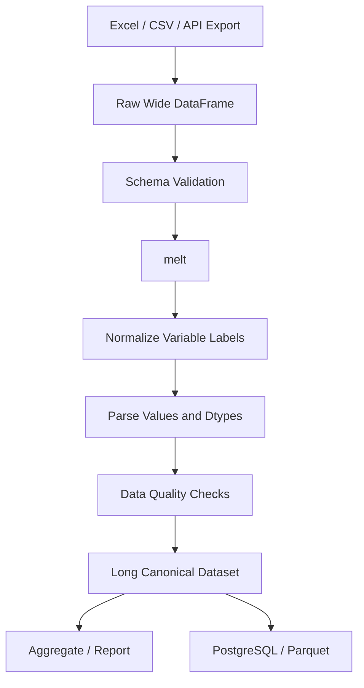

# 10- Melt

## Overview

`DataFrame.melt()` reshapes data from a **wide format** into a **long format**.

Wide data stores multiple measurements as separate columns:

```text
order_id | jan_sales | feb_sales | mar_sales
```

Long data stores the same information as rows:

```text
order_id | month | sales
```

This transformation is commonly called **unpivoting**.

`melt()` is useful when downstream processing expects:

- One observation per row.
- A stable set of identifier columns.
- Measurement names stored as data.
- Measurement values stored in a single value column.
- Data suitable for grouping, filtering, aggregation, plotting, or warehouse loading.

A typical transformation is:

```text
Wide operational/reporting data
        ↓
        melt()
        ↓
Normalized long-form data
        ↓
Validation / aggregation / storage
```

This is especially useful when integrating reporting exports, spreadsheets, API payloads, or denormalized datasets into ETL pipelines.

## Why `melt()` Exists

Operational systems and business reports frequently produce wide datasets because they are convenient for humans to read.

For example:

```text
customer_id | jan_revenue | feb_revenue | mar_revenue
```

is readable in Excel, but analytical processing becomes easier when the month is a value:

```text
customer_id | month | revenue
```

Now the same operations can be expressed generically:

```python
monthly.groupby("month")["revenue"].sum()
```

instead of hard-coding:

```python
df["jan_revenue"].sum()
df["feb_revenue"].sum()
df["mar_revenue"].sum()
```

`melt()` separates:

```text
Identity
    ↓
Measurement dimension
    ↓
Measurement value
```

This makes schemas more extensible.

## Basic Syntax

The general form is:

```python
result = df.melt(
    id_vars=...,
    value_vars=...,
    var_name=...,
    value_name=...,
)
```

The important parameters are:

| Parameter | Purpose |
|---|---|
| `id_vars` | Columns that identify each original record |
| `value_vars` | Columns to unpivot |
| `var_name` | Name for the column containing former column names |
| `value_name` | Name for the column containing former cell values |
| `ignore_index` | Whether to create a new default index |

## Basic Example

Suppose monthly sales are stored as:

```python
import pandas as pd

sales = pd.DataFrame(
    {
        "customer_id": [101, 102],
        "jan_sales": [1000, 1500],
        "feb_sales": [1200, 1800],
        "mar_sales": [1100, 1600],
    }
)
```

The wide structure is:

```text
   customer_id  jan_sales  feb_sales  mar_sales
0          101       1000       1200       1100
1          102       1500       1800       1600
```

Convert it to long form:

```python
monthly = sales.melt(
    id_vars=["customer_id"],
    value_vars=[
        "jan_sales",
        "feb_sales",
        "mar_sales",
    ],
    var_name="month",
    value_name="sales",
)
```

Result:

```text
   customer_id       month  sales
0          101   jan_sales   1000
1          102   jan_sales   1500
2          101   feb_sales   1200
3          102   feb_sales   1800
4          101   mar_sales   1100
5          102   mar_sales   1600
```

The original month-specific column names have become values in the `month` column.

## `id_vars`

`id_vars` identifies columns that should remain unchanged for each resulting observation.

Example:

```python
monthly = sales.melt(
    id_vars=["customer_id"],
)
```

Here:

```text
customer_id
```

is preserved as the identifier.

If there are multiple identifiers:

```python
monthly = sales.melt(
    id_vars=[
        "customer_id",
        "region",
        "currency",
    ],
)
```

each output row retains those values.

A good rule is:

```text
id_vars = columns describing "who" or "what"
value_vars = columns describing "which measurement"
```

## `value_vars`

`value_vars` identifies columns that should be unpivoted.

Example:

```python
monthly = sales.melt(
    id_vars=["customer_id"],
    value_vars=[
        "jan_sales",
        "feb_sales",
        "mar_sales",
    ],
)
```

If `value_vars` is omitted, Pandas melts all columns not listed in `id_vars`.

Explicitly specifying `value_vars` is often safer in production because it documents the intended input schema.

## `var_name`

`var_name` controls the name of the column containing the original column labels.

Without customization, Pandas may use a generic name such as `variable`.

Prefer a domain-specific name:

```python
monthly = sales.melt(
    id_vars=["customer_id"],
    value_vars=[
        "jan_sales",
        "feb_sales",
        "mar_sales",
    ],
    var_name="month",
)
```

The result is:

```text
customer_id | month | value
```

rather than:

```text
customer_id | variable | value
```

Explicit names make downstream SQL, reporting, validation, and API integration easier.

## `value_name`

`value_name` controls the resulting measurement column.

```python
monthly = sales.melt(
    id_vars=["customer_id"],
    value_vars=[
        "jan_sales",
        "feb_sales",
        "mar_sales",
    ],
    var_name="month",
    value_name="revenue",
)
```

Result:

```text
customer_id | month | revenue
```

Prefer business-specific names when the output is part of a contract.

## `ignore_index`

By default, `melt()` creates a new sequential index.

Example:

```python
sales = pd.DataFrame(
    {
        "customer_id": [101, 102],
        "jan_sales": [1000, 1500],
    },
    index=[10, 20],
)

monthly = sales.melt(
    id_vars=["customer_id"],
)
```

The resulting index is typically regenerated:

```text
0
1
2
3
```

Use:

```python
ignore_index=False
```

when retaining the original index is useful:

```python
monthly = sales.melt(
    id_vars=["customer_id"],
    ignore_index=False,
)
```

The repeated index should not be mistaken for a unique record identifier after reshaping.

## Row Cardinality

`melt()` changes row count.

For a dataset with:

```text
N rows
M value columns
```

the result normally has approximately:

```text
N × M rows
```

For example:

```text
2 customers
3 month columns
```

produces:

```text
2 × 3 = 6 rows
```

This is one of the most important operational consequences of `melt()`.

A mistaken selection of `value_vars` can multiply the dataset unexpectedly.

## Cardinality Example

```python
sales = pd.DataFrame(
    {
        "customer_id": [101, 102, 103],
        "jan": [100, 200, 300],
        "feb": [150, 250, 350],
    }
)

monthly = sales.melt(
    id_vars=["customer_id"],
    value_vars=["jan", "feb"],
)

assert len(monthly) == (
    len(sales) * 2
)
```

In production, row-count expectations should be part of validation.

## Data Flow

The transformation can be visualized as:


The transformation does not create new business information. It changes the representation of existing information.

## Wide vs Long Format

| Aspect | Wide | Long |
|---|---|---|
| Measurements | Separate columns | Rows |
| Schema growth | More columns | More rows |
| Human readability | Often high | Moderate |
| Generic aggregation | Less convenient | Convenient |
| Filtering by measurement type | Column-specific | Row-based |
| SQL-style processing | Often less natural | Usually easier |
| API/reporting interchange | Common | Often more normalized |
| Reshaping back | `pivot()` | `pivot()` / aggregation |

The right representation depends on the consumer.

## Real-World Reporting Example

A finance export may look like:

```text
account_id | q1_revenue | q2_revenue | q3_revenue | q4_revenue
```

For reporting infrastructure, convert it to:

```text
account_id | quarter | revenue
```

Example:

```python
quarterly = finance.melt(
    id_vars=["account_id"],
    value_vars=[
        "q1_revenue",
        "q2_revenue",
        "q3_revenue",
        "q4_revenue",
    ],
    var_name="quarter",
    value_name="revenue",
)
```

Now a single aggregation supports every quarter:

```python
report = (
    quarterly
    .groupby("quarter", as_index=False)
    ["revenue"]
    .sum()
)
```

This is easier to maintain than changing code every time another period column is added.

## API Normalization

External APIs sometimes return denormalized objects:

```json
{
  "customer_id": 101,
  "revenue_jan": 1000,
  "revenue_feb": 1200,
  "revenue_mar": 1100
}
```

After loading:

```python
payload = response.json()

df = pd.DataFrame(
    payload["customers"]
)
```

reshape it:

```python
monthly = df.melt(
    id_vars=["customer_id"],
    value_vars=[
        "revenue_jan",
        "revenue_feb",
        "revenue_mar",
    ],
    var_name="period",
    value_name="revenue",
)
```

Then normalize the period label:

```python
monthly["period"] = (
    monthly["period"]
    .str.removeprefix("revenue_")
)
```

This creates a canonical structure independent of the original API representation.

## Database Integration

A long-form DataFrame often maps naturally to a relational table.

For example:

```text
customer_id
month
revenue
```

can map to:

```sql
CREATE TABLE customer_monthly_revenue (
    customer_id BIGINT NOT NULL,
    month TEXT NOT NULL,
    revenue NUMERIC,
    PRIMARY KEY (
        customer_id,
        month
    )
);
```

A Pandas pipeline can reshape an operational export before loading:

```python
monthly = sales.melt(
    id_vars=["customer_id"],
    value_vars=[
        "jan_sales",
        "feb_sales",
        "mar_sales",
    ],
    var_name="month",
    value_name="revenue",
)
```

This is often easier to store and query than a schema with one column per month.

## SQL Analogy

`melt()` is conceptually similar to **unpivoting** in SQL.

Wide data:

```text
customer_id | jan | feb | mar
```

becomes:

```text
customer_id | month | revenue
```

The relational model is often easier to query because a single column represents the measurement.

Where the database already owns the transformation workload, SQL-side unpivoting may be preferable to exporting large datasets into Pandas first.

The decision should consider:

```text
Data volume
Database CPU
Network transfer
Query reuse
Pipeline ownership
```

## Parquet and Canonical Storage

Long-form data is often convenient for analytical storage:

```python
monthly.to_parquet(
    "processed/monthly_revenue.parquet",
    index=False,
)
```

A downstream process can then read:

```python
monthly = pd.read_parquet(
    "processed/monthly_revenue.parquet"
)
```

When datasets become large, validate whether the reshaped representation improves downstream scan patterns rather than assuming long format is always optimal.

## Missing Values

`melt()` preserves missing values by default.

Example:

```python
sales = pd.DataFrame(
    {
        "customer_id": [101, 102],
        "jan": [1000, None],
        "feb": [1200, 1400],
    }
)

monthly = sales.melt(
    id_vars=["customer_id"],
    var_name="month",
    value_name="sales",
)
```

The missing January value becomes a missing `sales` value in the long-form row.

This is usually desirable because it preserves the underlying observation structure.

## `ignore_index` Does Not Remove Missing Data

Do not confuse:

```python
ignore_index=False
```

with missing-value handling.

The parameter controls index behavior only.

Missing measurements remain missing unless an explicit transformation removes or imputes them.

## `dropna` After `melt()`

Sometimes wide reports contain empty measurement columns and the desired long dataset should contain only observed values.

For example:

```python
monthly = (
    sales
    .melt(
        id_vars=["customer_id"],
        value_vars=[
            "jan",
            "feb",
            "mar",
        ],
        var_name="month",
        value_name="revenue",
    )
    .dropna(
        subset=["revenue"]
    )
)
```

This changes row cardinality.

Use it only when an absent measurement means:

```text
"No observation"
```

rather than:

```text
"Observation exists but value is missing"
```

That distinction is important in financial, operational, and audit-sensitive systems.

## Duplicate Records

`melt()` can produce repeated identifier combinations when several value columns are unpivoted.

For example:

```text
customer_id | month | revenue
101         | jan   | 100
101         | feb   | 200
```

These rows are different observations.

But if the source itself already contains duplicate records:

```text
customer_id
101
101
```

then `melt()` preserves those duplicates.

Validate uniqueness when the long-form schema requires it:

```python
duplicate_keys = (
    monthly
    .duplicated(
        subset=[
            "customer_id",
            "month",
        ],
        keep=False,
    )
)

duplicates = monthly.loc[
    duplicate_keys
]
```

## Validation After `melt()`

A production pipeline should validate:

```text
Expected columns
Expected row count
Identifier completeness
Measurement dtype
Allowed variable values
Uniqueness constraints
Missing-value policy
```

Example:

```python
expected_columns = {
    "customer_id",
    "month",
    "revenue",
}

assert set(monthly.columns) == (
    expected_columns
)

assert len(monthly) == (
    len(sales) * 3
)
```

For critical pipelines, use explicit test assertions or a data-validation framework rather than bare assertions in long-running production processes.

## Column Ordering

The resulting DataFrame typically contains:

```text
id_vars
variable column
value column
```

For example:

```text
customer_id | month | revenue
```

If downstream systems require a specific schema, project the columns explicitly:

```python
monthly = monthly.loc[
    :,
    [
        "customer_id",
        "month",
        "revenue",
    ],
]
```

Do not rely on incidental ordering when publishing a data contract.

## Variable Names as Data

After melting, original column names become values.

This means they can be:

```python
filtered = monthly.loc[
    monthly["month"].isin(
        [
            "jan_sales",
            "feb_sales",
        ]
    )
]
```

or normalized:

```python
monthly["month"] = (
    monthly["month"]
    .str.removesuffix("_sales")
)
```

The important conceptual shift is:

```text
Before melt:
    "jan_sales" is a column label

After melt:
    "jan_sales" is data
```

That makes generic filtering and grouping possible.

## Cleaning the Variable Column

A common production pattern is to normalize generated variable labels:

```python
monthly["month"] = (
    monthly["month"]
    .str.removesuffix("_sales")
    .str.casefold()
)
```

For example:

```text
jan_sales
FEB_sales
mar_sales
```

becomes:

```text
jan
feb
mar
```

This is often necessary before joining to calendar or reference data.

## Mapping Melted Variable Names

You can map the generated variable labels to canonical values:

```python
month_mapping = {
    "jan_sales": 1,
    "feb_sales": 2,
    "mar_sales": 3,
}

monthly["month_number"] = (
    monthly["month"]
    .map(month_mapping)
)
```

This enables downstream time-based processing.

For larger reference data, use a lookup table and `merge()`.

## Converting Period Labels

If the variable column encodes date information:

```python
monthly["month"] = (
    monthly["month"]
    .str.removeprefix("revenue_")
)

monthly["period"] = pd.to_datetime(
    monthly["month"],
    format="%Y_%m",
    errors="coerce",
)
```

Keep the original variable column when it helps with source traceability; otherwise replace it explicitly once the canonical period is validated.

## Numeric Conversion After Melt

If the value columns have mixed types:

```python
monthly["revenue"] = pd.to_numeric(
    monthly["revenue"],
    errors="coerce",
)
```

Then validate:

```python
invalid_revenue = monthly[
    monthly["revenue"].isna()
    & monthly["revenue"].notna()
]
```

For a more robust pipeline, preserve the raw input separately when parsing failures need to be audited.

## Wide-to-Long Transformation with Validation

A production-oriented example:

```python
import pandas as pd


def normalize_monthly_sales(
    sales: pd.DataFrame,
) -> pd.DataFrame:
    required_columns = {
        "customer_id",
        "jan_sales",
        "feb_sales",
        "mar_sales",
    }

    missing_columns = (
        required_columns
        - set(sales.columns)
    )

    if missing_columns:
        raise ValueError(
            "Missing required columns: "
            f"{sorted(missing_columns)}"
        )

    monthly = sales.melt(
        id_vars=["customer_id"],
        value_vars=[
            "jan_sales",
            "feb_sales",
            "mar_sales",
        ],
        var_name="month",
        value_name="sales",
    )

    monthly["month"] = (
        monthly["month"]
        .str.removesuffix("_sales")
        .str.casefold()
    )

    monthly["sales"] = pd.to_numeric(
        monthly["sales"],
        errors="coerce",
    ).astype("Float64")

    return monthly
```

The function separates:

```text
Input validation
    ↓
Reshaping
    ↓
Label normalization
    ↓
Type normalization
```

This is more maintainable than performing all operations in one opaque expression.

## Method Chaining

`melt()` composes naturally with other transformations:

```python
monthly = (
    sales
    .melt(
        id_vars=["customer_id"],
        value_vars=[
            "jan_sales",
            "feb_sales",
            "mar_sales",
        ],
        var_name="month",
        value_name="revenue",
    )
    .assign(
        month=lambda frame: (
            frame["month"]
            .str.removesuffix("_sales")
            .str.casefold()
        ),
        revenue=lambda frame: pd.to_numeric(
            frame["revenue"],
            errors="coerce",
        ),
    )
    .dropna(
        subset=["revenue"]
    )
)
```

This represents:

```text
reshape
  ↓
normalize
  ↓
parse
  ↓
filter
```

Use intermediate variables when the pipeline contains validation or branching logic that would otherwise become difficult to debug.

## Melting Multiple Identifier Columns

Suppose:

```python
sales = pd.DataFrame(
    {
        "customer_id": [101, 102],
        "region": ["IN", "US"],
        "jan": [100, 200],
        "feb": [120, 220],
    }
)

monthly = sales.melt(
    id_vars=[
        "customer_id",
        "region",
    ],
    value_vars=[
        "jan",
        "feb",
    ],
    var_name="month",
    value_name="sales",
)
```

Result:

```text
   customer_id region month  sales
0          101     IN   jan    100
1          102     US   jan    200
2          101     IN   feb    120
3          102     US   feb    220
```

All identifier columns are repeated for each measurement row.

This is expected behavior and explains the increase in row count.

## Melting Only Selected Columns

Explicit `value_vars` prevents unrelated columns from accidentally being reshaped.

Consider:

```python
sales.columns
```

containing:

```text
customer_id
region
source_file
jan_sales
feb_sales
mar_sales
```

Use:

```python
monthly = sales.melt(
    id_vars=[
        "customer_id",
        "region",
        "source_file",
    ],
    value_vars=[
        "jan_sales",
        "feb_sales",
        "mar_sales",
    ],
)
```

This preserves operational metadata while reshaping measurements.

## Metadata Columns

Operational datasets often contain metadata:

```text
ingestion_batch_id
source_system
loaded_at
schema_version
```

These can remain in `id_vars`:

```python
monthly = raw_sales.melt(
    id_vars=[
        "customer_id",
        "source_system",
        "ingestion_batch_id",
    ],
    value_vars=[
        "jan_sales",
        "feb_sales",
        "mar_sales",
    ],
    var_name="month",
    value_name="revenue",
)
```

The metadata is then available on every reshaped observation.

This is useful for lineage and debugging.

## Auditing and Data Lineage

When reshaping production data, retain useful lineage fields:

```python
monthly = raw_sales.melt(
    id_vars=[
        "customer_id",
        "source_file",
        "ingestion_batch_id",
    ],
    value_vars=[
        "jan_sales",
        "feb_sales",
        "mar_sales",
    ],
    var_name="month",
    value_name="revenue",
)
```

Now a downstream record can be traced back to:

```text
Customer
Source file
Ingestion batch
Original measurement category
```

This is valuable when investigating reporting discrepancies.

## Performance

`melt()` is a reshaping operation that can materially increase row count.

If:

```text
rows = 10 million
value_vars = 12
```

the result may approach:

```text
120 million rows
```

before subsequent filtering.

This can create significant:

```text
CPU cost
Memory usage
Serialization cost
Parquet size
Database load
Network traffic
```

Always estimate output cardinality before melting large datasets.

## Memory Considerations

A wide-to-long transformation can require significant memory because the output is larger than the input.

A rough planning model is:

```text
output_rows
≈ input_rows × number_of_value_columns
```

This does not directly equal memory consumption because dtype and implementation details matter, but it is a useful first-order estimate.

For large datasets:

```text
Select only required columns
Use explicit value_vars
Use efficient dtypes
Process source data in chunks where applicable
Avoid unnecessary copies
Write output incrementally when possible
```

## Chunked Processing

When reading a large CSV:

```python
for chunk in pd.read_csv(
    "monthly_sales.csv",
    chunksize=100_000,
):
    monthly = chunk.melt(
        id_vars=["customer_id"],
        value_vars=[
            "jan_sales",
            "feb_sales",
            "mar_sales",
        ],
        var_name="month",
        value_name="sales",
    )

    write_chunk(monthly)
```

The benefit is memory control.

The trade-off is operational complexity:

```text
Chunk-level processing
    ↓
Chunk-level validation
    ↓
Incremental output
    ↓
Final reconciliation
```

Aggregate metrics and row counts across chunks.

## Scalability Limits

Pandas operates in process memory, so extremely large unpivot operations may exceed available RAM.

Warning signs include:

```text
High memory pressure
OOM termination
Container eviction
Slow swap activity
Large temporary allocations
```

In Docker/Kubernetes environments, an oversized `melt()` operation can terminate a pod when it exceeds its memory limit.

For larger workloads, consider:

```text
SQL UNPIVOT / database-side processing
DuckDB
Polars
Spark
AWS Glue
Warehouse-native transformations
```

The best choice depends on where the source data lives and where the output needs to be consumed.

## `melt()` vs `stack()`

Both can transform data toward a long representation.

| Operation | Typical use |
|---|---|
| `melt()` | Clear wide-to-long transformation using explicit identifier/value columns |
| `stack()` | Reshape index/column structure, especially with hierarchical indexes |
| `pivot()` | Long-to-wide transformation |
| `pivot_table()` | Long-to-wide transformation with aggregation |

For ordinary business datasets, `melt()` is usually the clearer API because the transformation contract is explicit.

## `melt()` vs `wide_to_long()`

`wide_to_long()` is useful when wide column names follow a structured naming convention.

Example:

```text
A1970
A1980
A1990
```

For general-purpose unpivoting:

```python
df.melt(
    ...
)
```

is usually simpler.

Use the more specialized API when the source schema has systematic suffix/prefix patterns that need to become multiple columns.

## `melt()` vs `pivot()`

They represent opposite directions of reshaping.

```text
Wide
  ↓
melt()
  ↓
Long
```

and:

```text
Long
  ↓
pivot()
  ↓
Wide
```

For example:

```python
long = wide.melt(
    id_vars=["customer_id"],
    var_name="month",
    value_name="revenue",
)
```

can conceptually be reversed:

```python
wide_again = (
    long
    .pivot(
        index="customer_id",
        columns="month",
        values="revenue",
    )
    .reset_index()
)
```

A perfect round trip is only possible when the long-form key combination is unique and the transformation does not introduce information loss.

## Round-Trip Validation

Before pivoting back, check uniqueness:

```python
duplicates = (
    long.duplicated(
        subset=[
            "customer_id",
            "month",
        ]
    )
)

if duplicates.any():
    raise ValueError(
        "Duplicate customer/month "
        "combinations prevent a simple pivot."
    )
```

If duplicates are meaningful, `pivot_table()` with an explicit aggregation function may be appropriate.

## Aggregation After `melt()`

Long data often makes aggregation simpler.

```python
monthly_totals = (
    monthly
    .groupby(
        "month",
        as_index=False,
    )["revenue"]
    .sum()
)
```

Or by region:

```python
regional_totals = (
    monthly
    .groupby(
        [
            "region",
            "month",
        ],
        as_index=False,
    )["revenue"]
    .sum()
)
```

The long representation allows generic grouping logic.

## Reporting Workflows

A reporting pipeline may look like:



The long-form output can then support multiple consumers without repeating wide-format-specific logic.

## Excel Workflows

Business users often produce Excel files such as:

```text
Product | Jan | Feb | Mar | Apr
```

Load and reshape:

```python
products = pd.read_excel(
    "sales_report.xlsx",
)

monthly = products.melt(
    id_vars=["Product"],
    value_vars=[
        "Jan",
        "Feb",
        "Mar",
        "Apr",
    ],
    var_name="month",
    value_name="sales",
)
```

For production ingestion, follow this with:

```text
Column validation
Type normalization
Header normalization
Missing-value handling
Business validation
```

Excel should be treated as an untrusted external input format rather than a guaranteed schema.

## CSV Workflows

Similarly:

```python
raw = pd.read_csv(
    "vendor_report.csv",
)

monthly = raw.melt(
    id_vars=["customer_id"],
    value_vars=[
        "jan",
        "feb",
        "mar",
    ],
    var_name="month",
    value_name="revenue",
)
```

For large files, combine with `chunksize`.

## Data Quality Monitoring

Track:

```text
Input row count
Output row count
Expected expansion factor
Null measurement count
Invalid measurement count
Duplicate identifier/variable combinations
Unknown variable names
Transformation duration
Output file size
```

Example:

```python
expected_rows = (
    len(sales) * len(value_columns)
)

actual_rows = len(monthly)

if actual_rows != expected_rows:
    raise ValueError(
        "Unexpected row count after melt"
    )
```

This catches accidental changes to the source schema.

## Schema Drift

A particularly common production problem is source columns changing.

For example:

```text
Expected:
jan_sales
feb_sales
mar_sales

Received:
jan_sales
feb_sales
march_sales
```

Using an implicit:

```python
sales.melt(
    id_vars=["customer_id"]
)
```

could silently include or exclude unexpected fields depending on the source schema.

Prefer explicit `value_vars` and validate them:

```python
expected_values = [
    "jan_sales",
    "feb_sales",
    "mar_sales",
]

missing = set(expected_values) - set(
    sales.columns
)

if missing:
    raise ValueError(
        f"Missing columns: {sorted(missing)}"
    )

monthly = sales.melt(
    id_vars=["customer_id"],
    value_vars=expected_values,
    var_name="month",
    value_name="revenue",
)
```

## Reliability

A reliable `melt()` stage should define:

```text
Input schema
Output schema
Expected expansion factor
Variable domain
Value dtype
Null policy
Uniqueness rules
```

This makes the transformation deterministic and easy to monitor.

`melt()` itself is deterministic for a fixed input and parameter set, making it suitable for retryable batch processing.

## Security and Data Minimization

Reshaping does not reduce sensitive-data exposure by itself.

If a wide source contains:

```text
customer_id
name
email
phone
internal_notes
jan_revenue
feb_revenue
```

and only customer revenue is needed, do not melt the entire DataFrame.

Select required columns first:

```python
sales = raw.loc[
    :,
    [
        "customer_id",
        "jan_revenue",
        "feb_revenue",
    ],
].copy()

monthly = sales.melt(
    id_vars=["customer_id"],
    value_vars=[
        "jan_revenue",
        "feb_revenue",
    ],
    var_name="month",
    value_name="revenue",
)
```

Data minimization reduces:

```text
Memory usage
Accidental exposure
Output size
Compliance risk
```

This is especially important when writing transformed data to shared S3 buckets, data warehouses, or reporting systems.

## Testing Basic Reshaping

```python
def test_melt_creates_expected_shape() -> None:
    sales = pd.DataFrame(
        {
            "customer_id": [101, 102],
            "jan": [100, 200],
            "feb": [150, 250],
        }
    )

    result = sales.melt(
        id_vars=["customer_id"],
        value_vars=[
            "jan",
            "feb",
        ],
        var_name="month",
        value_name="sales",
    )

    assert result.shape == (4, 3)
    assert result.columns.tolist() == [
        "customer_id",
        "month",
        "sales",
    ]
```

## Testing Values

```python
def test_melt_preserves_values() -> None:
    sales = pd.DataFrame(
        {
            "customer_id": [101],
            "jan": [100],
            "feb": [150],
        }
    )

    result = sales.melt(
        id_vars=["customer_id"],
        value_vars=[
            "jan",
            "feb",
        ],
        var_name="month",
        value_name="sales",
    )

    expected = pd.DataFrame(
        {
            "customer_id": [101, 101],
            "month": ["jan", "feb"],
            "sales": [100, 150],
        }
    )

    pd.testing.assert_frame_equal(
        result.reset_index(drop=True),
        expected,
    )
```

## Testing Missing Values

```python
def test_melt_preserves_missing_values() -> None:
    sales = pd.DataFrame(
        {
            "customer_id": [101],
            "jan": [None],
            "feb": [150],
        }
    )

    result = sales.melt(
        id_vars=["customer_id"],
        value_vars=[
            "jan",
            "feb",
        ],
        var_name="month",
        value_name="sales",
    )

    assert pd.isna(
        result.loc[
            result["month"].eq("jan"),
            "sales",
        ].iloc[0]
    )
```

This distinguishes reshaping from missing-value handling.

## Testing Schema Drift

```python
def test_required_value_columns_exist() -> None:
    sales = pd.DataFrame(
        {
            "customer_id": [101],
            "jan": [100],
        }
    )

    required_columns = {
        "jan",
        "feb",
    }

    missing = (
        required_columns
        - set(sales.columns)
    )

    assert missing == {"feb"}
```

Production pipelines should fail clearly when required source fields disappear.

## Testing Uniqueness

If each identifier and variable must produce one row:

```python
duplicates = (
    monthly.duplicated(
        subset=[
            "customer_id",
            "month",
        ]
    )
)

assert not duplicates.any()
```

The correct uniqueness key depends on the business model.

## Common Mistakes

| Mistake | Why it happens | Better approach |
|---|---|---|
| Forgetting the row expansion | Reshaping looks structural | Estimate `rows × value_vars` before execution |
| Melting every column | Implicit defaults are convenient | Specify `value_vars` explicitly |
| Treating `melt()` as aggregation | It changes shape but does not aggregate | Use `groupby()` after melting when required |
| Dropping null values immediately | Long output appears noisy | Define whether null means no observation or missing observation |
| Losing source metadata | Only business columns are considered | Keep useful metadata in `id_vars` |
| Assuming index identifies records | Index is regenerated by default | Use business keys explicitly |
| Ignoring duplicate identifier/value combinations | Repeated rows look unexpected | Validate uniqueness after reshaping |
| Using `melt()` on massive data without estimating output | Input size looks manageable | Calculate expected output cardinality |
| Relying on implicit `value_vars` | Source schema may drift | Validate and specify the measurement columns |
| Mixing incompatible value dtypes | Wide columns contain different types | Normalize dtypes before or after melting |
| Treating reshaping as validation | Output looks normalized | Perform explicit data-quality validation |
| Passing sensitive columns through the reshape | Convenient full DataFrame operation | Select only required columns first |

## Interview Questions

### What does `melt()` do?

It reshapes a DataFrame from wide form to long form by turning selected columns into rows.

### What is the role of `id_vars`?

They identify columns that remain associated with every resulting observation.

### What is the role of `value_vars`?

They identify the columns that are unpivoted into the variable/value representation.

### What happens to row count?

If there are `N` input rows and `M` value columns, the output generally contains approximately `N × M` rows before filtering.

### Does `melt()` aggregate data?

No. It only reshapes the representation.

### Does `melt()` remove duplicates?

No. Existing duplicates are preserved and row expansion may make duplicate key combinations more visible.

### What is `var_name`?

It names the output column containing the original column labels.

### What is `value_name`?

It names the output column containing the values from the melted columns.

### What does `ignore_index` control?

It controls whether the output receives a new default index or retains the original index labels.

### When should `melt()` be used instead of `pivot()`?

Use `melt()` to go from wide to long; use `pivot()` to go from long to wide.

### Why can `melt()` cause memory problems?

It can multiply the number of rows by the number of value columns and create a large intermediate DataFrame.

### How should `melt()` be used with a changing source schema?

Validate required columns and explicitly provide `value_vars` rather than relying on all non-ID columns being correct.

### How can you preserve lineage?

Include source metadata such as batch identifiers, source system, and file identifiers in `id_vars`.

### When should SQL perform the unpivot instead?

When the source data already resides in a database and the transformation can be executed efficiently there, especially when moving the wide dataset into Pandas would be unnecessarily expensive.

## Practical Decision Framework

Use `melt()` when:

```text
Data is wide
    ↓
Repeated measurements are represented as columns
    ↓
Downstream logic benefits from one measurement column
    ↓
Use melt()
```

Use another approach when:

```text
Need long → wide
    → pivot()

Need long → wide with aggregation
    → pivot_table()

Need structured multi-level reshaping
    → stack()/unstack()

Need aggregation without reshaping
    → groupby()

Need numeric clipping
    → clip()

Need conditional value replacement
    → where()/mask()
```

The operation should be selected based on the desired data model rather than familiarity with a particular Pandas method.

## Production Checklist

Before deploying a `melt()` transformation:

- Define the expected input and output schemas.
- Explicitly specify `id_vars` and `value_vars` for production pipelines.
- Estimate output cardinality before processing large datasets.
- Preserve required source metadata in `id_vars`.
- Normalize the generated variable column into canonical domain values.
- Validate the dtype and missing-value semantics of the value column.
- Decide whether null measurements should remain or be dropped.
- Validate uniqueness of identifier/variable combinations when required.
- Monitor row-count expansion and unexpected schema changes.
- Select only required columns to reduce memory usage and sensitive-data exposure.
- Use chunked processing for large file-based workloads when appropriate.
- Consider SQL, DuckDB, Polars, Spark, or warehouse-native transformations when Pandas memory limits become a constraint.
- Test shape, columns, values, missing values, schema drift, and uniqueness.
- Treat the long-form output as a schema contract when it feeds PostgreSQL, Parquet, APIs, or reporting systems.

## Key Takeaways

- `melt()` converts **wide data into long data** by turning selected columns into a variable column and a value column.
- `id_vars` define record identity, while `value_vars` define the measurements being unpivoted; explicit selection is safer for production pipelines.
- The transformation can multiply row count by the number of melted columns, so cardinality, memory usage, and downstream storage cost must be estimated before processing large datasets.
- `melt()` reshapes data but does not validate, deduplicate, aggregate, or normalize it; those responsibilities should remain explicit pipeline stages.
- Long-form output is often easier to group, validate, store, and query, but SQL or distributed engines may be more appropriate when the reshape would exceed Pandas' memory or throughput limits.