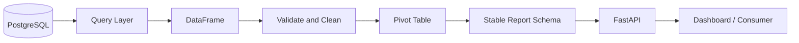
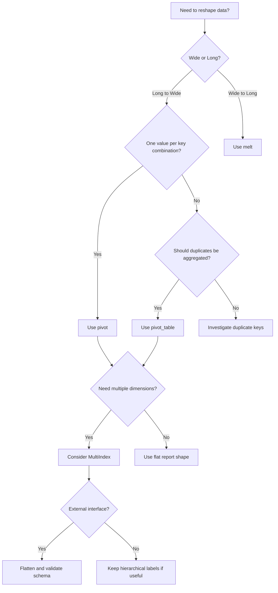

# 11- Pivot And Pivot Table

## Overview

`pivot()` and `pivot_table()` reshape a Pandas DataFrame from a long representation into a wide representation. They are particularly useful for reporting, dashboards, matrix-style outputs, and analytical views where values need to be arranged across rows and columns.

The key distinction is semantic:

- `pivot()` performs a strict reshape and requires each `index` + `columns` combination to identify at most one value.
- `pivot_table()` performs a reshape with aggregation, making it suitable when multiple records exist for the same grouping.

Both operations are transformations of the DataFrame. They do not modify the original object in place.

For backend and data-engineering workloads, the important question is not merely "which function produces the desired shape?" It is:

> What is the grain of the input data, what should the grain of the output be, and what should happen when multiple records map to the same output cell?

That question determines whether `pivot()`, `pivot_table()`, `groupby()`, or another transformation is appropriate.

---

## Long Data Versus Wide Data

Consider transactional data:

```python
import pandas as pd

orders = pd.DataFrame(
    {
        "order_date": ["2026-01-01", "2026-01-01", "2026-01-02", "2026-01-02"],
        "region": ["East", "West", "East", "West"],
        "product": ["Laptop", "Laptop", "Laptop", "Laptop"],
        "revenue": [1200, 900, 1500, 1100],
    }
)
```

Long-form data stores each observation as a row:

| order_date | region | product | revenue |
| --- | --- | --- | ---: |
| 2026-01-01 | East | Laptop | 1200 |
| 2026-01-01 | West | Laptop | 900 |
| 2026-01-02 | East | Laptop | 1500 |
| 2026-01-02 | West | Laptop | 1100 |

A reporting system might need this instead:

| order_date | East | West |
| --- | ---: | ---: |
| 2026-01-01 | 1200 | 900 |
| 2026-01-02 | 1500 | 1100 |

This is a wide representation.

The transformation is conceptually:

```text
Long Data
    │
    │ index = order_date
    │ columns = region
    │ values = revenue
    ▼
Wide Data
```

Wide output can be convenient for humans and reporting systems, while long input is usually easier to store, validate, join, and process.

---

## Why Pivoting Exists

Pivoting solves a dimensional reshaping problem.

Suppose a source system provides:

```text
date | region | metric | value
```

while a reporting consumer expects:

```text
date | East | West | North | South
```

The underlying business data is the same, but the representation is different.

Common use cases include:

- Operational reports.
- Financial summaries.
- KPI dashboards.
- Cross-tab reports.
- Spreadsheet exports.
- Monthly regional summaries.
- Product-by-region matrices.
- Time-period comparison reports.

Pivoting should generally happen near the reporting or presentation boundary rather than being used as the canonical storage representation.

---

## `pivot()` Syntax

The basic syntax is:

```python
DataFrame.pivot(
    index=...,
    columns=...,
    values=...,
)
```

Example:

```python
wide_orders = orders.pivot(
    index="order_date",
    columns="region",
    values="revenue",
)

print(wide_orders)
```

Result:

```text
region       East  West
order_date
2026-01-01   1200   900
2026-01-02   1500  1100
```

The operation moves values from a column into the DataFrame's column axis.

---

## How `pivot()` Works

A pivot can be understood as a mapping:

```text
(index value, column value) -> value
```

For the example:

```text
("2026-01-01", "East") -> 1200
("2026-01-01", "West") -> 900
("2026-01-02", "East") -> 1500
("2026-01-02", "West") -> 1100
```

Each combination must identify a single value.

If the source contains:

```text
order_date  region  revenue
----------  ------  -------
2026-01-01  East    1200
2026-01-01  East    300
```

then:

```python
orders.pivot(
    index="order_date",
    columns="region",
    values="revenue",
)
```

cannot determine which value should occupy:

```text
2026-01-01 / East
```

This produces a duplicate-entry error rather than silently aggregating data.

That behavior is intentional. It protects against accidental data loss.

---

## Duplicate Keys with `pivot()`

The most common `pivot()` mistake is assuming that duplicate rows will automatically be summed.

They will not.

Example:

```python
orders = pd.DataFrame(
    {
        "order_date": ["2026-01-01", "2026-01-01"],
        "region": ["East", "East"],
        "revenue": [1200, 300],
    }
)
```

This is invalid for a strict pivot:

```python
orders.pivot(
    index="order_date",
    columns="region",
    values="revenue",
)
```

The correct approach depends on business semantics.

If both rows represent legitimate transactions and the report needs total revenue:

```python
revenue_report = orders.pivot_table(
    index="order_date",
    columns="region",
    values="revenue",
    aggfunc="sum",
)
```

If duplicates indicate a data-quality problem, investigate and validate them instead of aggregating blindly.

```python
duplicate_keys = (
    orders.groupby(["order_date", "region"])
    .size()
    .loc[lambda values: values > 1]
)

if not duplicate_keys.empty:
    raise ValueError(
        "Duplicate order_date + region combinations detected."
    )
```

The distinction matters because aggregation can hide upstream data defects.

---

## `pivot_table()`

`pivot_table()` extends the pivot operation with aggregation.

Basic syntax:

```python
DataFrame.pivot_table(
    values=...,
    index=...,
    columns=...,
    aggfunc="mean",
)
```

Example:

```python
orders = pd.DataFrame(
    {
        "order_date": [
            "2026-01-01",
            "2026-01-01",
            "2026-01-01",
            "2026-01-02",
        ],
        "region": ["East", "East", "West", "East"],
        "revenue": [1200, 300, 900, 1500],
    }
)

daily_revenue = orders.pivot_table(
    index="order_date",
    columns="region",
    values="revenue",
    aggfunc="sum",
)

print(daily_revenue)
```

Conceptually:

```text
                    region
                     ┌───────┬───────┐
                     │ East  │ West  │
┌──────────────┐     ├───────┼───────┤
│ 2026-01-01   │     │ 1500  │  900  │
├──────────────┤     ├───────┼───────┤
│ 2026-01-02   │     │ 1500  │  NaN  │
└──────────────┘     └───────┴───────┘
```

The aggregation defines what should happen when multiple rows share the same index-column combination.

---

## `pivot()` Versus `pivot_table()`

| Aspect | `pivot()` | `pivot_table()` |
| --- | --- | --- |
| Duplicate index/column combinations | Error | Aggregates |
| Aggregation | No | Yes |
| Primary purpose | Strict reshape | Reshape + summarize |
| Typical use | Unique observations | Transactional/reporting data |
| Data-quality protection | Strong | Easier to accidentally hide duplicates |
| Multiple aggregation functions | No | Yes |
| Missing combinations | Represented as missing | Configurable |
| Best fit | Deterministic one-to-one reshape | Reporting and grouped metrics |

A useful engineering rule:

> Use `pivot()` when uniqueness is part of the data contract. Use `pivot_table()` when aggregation is part of the business requirement.

---

## `pivot_table()` Aggregation

The default aggregation is usually:

```python
aggfunc="mean"
```

For financial and transactional data, explicitly specify the aggregation instead of relying on the default.

```python
daily_revenue = orders.pivot_table(
    index="order_date",
    columns="region",
    values="revenue",
    aggfunc="sum",
)
```

Other common aggregation functions include:

```python
aggfunc="count"
```

```python
aggfunc="mean"
```

```python
aggfunc="min"
```

```python
aggfunc="max"
```

```python
aggfunc="median"
```

A callable can also be used:

```python
daily_revenue = orders.pivot_table(
    index="order_date",
    columns="region",
    values="revenue",
    aggfunc=["sum", "mean"],
)
```

---

## Multiple Aggregations

Production reports often require several metrics.

```python
summary = orders.pivot_table(
    index="order_date",
    columns="region",
    values="revenue",
    aggfunc=["sum", "mean", "count"],
)
```

This typically produces MultiIndex columns:

```text
             sum              mean              count
region       East  West        East  West         East  West
order_date
2026-01-01   1500  900        750.0  900.0          2     1
2026-01-02   1500  NaN       1500.0    NaN          1     0
```

MultiIndex output can be useful for analytical processing but may be inconvenient for APIs and downstream systems.

---

## Flattening MultiIndex Columns

When a pivoted DataFrame is consumed by an API, CSV export, or database layer, flat column names are often easier to manage.

Example:

```python
summary = orders.pivot_table(
    index="order_date",
    columns="region",
    values="revenue",
    aggfunc=["sum", "mean"],
)

summary.columns = [
    "_".join(str(part) for part in column if str(part) != "")
    for column in summary.columns.to_flat_index()
]

summary = summary.reset_index()
```

A more controlled production approach is to define the naming rule explicitly:

```python
summary = orders.pivot_table(
    index="order_date",
    columns="region",
    values="revenue",
    aggfunc=["sum", "mean"],
)

summary.columns = [
    f"{metric}_{region}"
    for metric, region in summary.columns
]

summary = summary.reset_index()
```

For a public API, stable and documented column names are preferable to exposing Pandas-specific MultiIndex structures.

---

## Multiple `index` Levels

More than one dimension can be used for rows.

```python
orders = pd.DataFrame(
    {
        "order_date": [
            "2026-01-01",
            "2026-01-01",
            "2026-01-02",
            "2026-01-02",
        ],
        "region": ["East", "West", "East", "West"],
        "product": ["Laptop", "Laptop", "Phone", "Phone"],
        "revenue": [1200, 900, 700, 500],
    }
)

report = orders.pivot_table(
    index=["order_date", "product"],
    columns="region",
    values="revenue",
    aggfunc="sum",
)

print(report)
```

The resulting index becomes hierarchical:

```text
                         region
                         East   West
order_date  product
2026-01-01  Laptop      1200    900
2026-01-02  Phone        700    500
```

This is useful when the output grain is explicitly:

```text
one row per date + product
```

---

## Multiple `columns` Levels

Multiple dimensions can also be placed on the column axis.

```python
orders = pd.DataFrame(
    {
        "order_date": ["2026-01-01", "2026-01-01"],
        "region": ["East", "West"],
        "channel": ["Online", "Retail"],
        "revenue": [1200, 900],
    }
)

report = orders.pivot_table(
    index="order_date",
    columns=["region", "channel"],
    values="revenue",
    aggfunc="sum",
)
```

This produces hierarchical columns representing:

```text
region
    ├── East
    │   └── Online
    └── West
        └── Retail
```

Multi-level columns should be handled deliberately because they complicate:

- API serialization.
- CSV exports.
- Schema validation.
- SQL inserts.
- Downstream transformations.

For internal analytical processing, MultiIndex can be appropriate. For external interfaces, flatten the structure explicitly.

---

## Missing Combinations

A very important distinction is the difference between:

1. A combination that does not exist.
2. A combination that exists but has a null value.
3. A combination whose business value is genuinely zero.

Suppose:

```text
date       region   revenue
---------  -------  -------
2026-01-01 East      1000
2026-01-01 West       500
2026-01-02 East       700
```

There is no West record for `2026-01-02`.

The pivot output will typically contain a missing value:

```text
             East   West
2026-01-01   1000    500
2026-01-02    700    NaN
```

Do not automatically convert this to zero unless the business semantics explicitly say:

> Missing combination means zero activity.

---

## `fill_value`

`pivot_table()` supports `fill_value` for replacing missing values in the resulting table.

```python
report = orders.pivot_table(
    index="order_date",
    columns="region",
    values="revenue",
    aggfunc="sum",
    fill_value=0,
)
```

Result:

```text
             East   West
2026-01-01   1000    500
2026-01-02    700      0
```

Use this only when zero is semantically correct.

For example, filling missing revenue with zero may be valid for a report that represents:

```text
total sales generated by each region
```

It may be incorrect for:

```text
average customer satisfaction score
```

where a missing observation does not mean zero satisfaction.

---

## `dropna`

`pivot_table()` supports controls that determine how missing values participate in the output.

For example:

```python
report = orders.pivot_table(
    index="order_date",
    columns="region",
    values="revenue",
    aggfunc="sum",
    dropna=False,
)
```

The exact output depends on the combinations present and the categorical/index structure.

The important principle is that output shape is part of the report contract. A production report should not rely on implicit category ordering or incidental combinations.

---

## `observed` and Categorical Dimensions

Large reporting datasets frequently use categorical columns such as:

```text
region
product_category
sales_channel
customer_segment
```

If these columns are represented using Pandas categorical dtype, category handling can affect pivot and grouping behavior.

Example:

```python
orders["region"] = orders["region"].astype(
    pd.CategoricalDtype(
        categories=["East", "West", "North", "South"],
        ordered=False,
    )
)
```

Then:

```python
report = orders.pivot_table(
    index="order_date",
    columns="region",
    values="revenue",
    aggfunc="sum",
    observed=True,
)
```

This can be useful when category metadata is intentionally controlled.

For production pipelines, explicitly define category semantics rather than depending on whatever distinct values happen to appear in an individual batch.

---

## Stable Report Columns

A common production problem is unstable output schemas.

Suppose one day's data contains:

```text
East
West
```

and the next day's data contains:

```text
East
West
North
```

The resulting pivot can have a different set of columns.

For APIs, scheduled reports, and downstream jobs, it is often better to enforce the expected schema.

```python
expected_regions = ["East", "West", "North", "South"]

report = orders.pivot_table(
    index="order_date",
    columns="region",
    values="revenue",
    aggfunc="sum",
)

report = report.reindex(
    columns=expected_regions,
    fill_value=0,
)
```

This makes the output contract deterministic.

A report schema should generally be versioned and validated just like an API schema.

---

## Pivoting Time-Series Data

Pivoting is frequently used to compare periods.

Example:

```python
sales = pd.DataFrame(
    {
        "month": [
            "2026-01",
            "2026-01",
            "2026-02",
            "2026-02",
        ],
        "region": [
            "East",
            "West",
            "East",
            "West",
        ],
        "revenue": [
            1200,
            900,
            1400,
            1100,
        ],
    }
)

monthly_report = sales.pivot(
    index="month",
    columns="region",
    values="revenue",
)
```

For actual datetime processing, parse dates before reshaping:

```python
sales["month"] = pd.to_datetime(sales["month"])

monthly_report = sales.pivot(
    index="month",
    columns="region",
    values="revenue",
)
```

Keeping time columns as real datetime values rather than strings improves:

- Sorting.
- Filtering.
- Resampling.
- Validation.
- Time-based calculations.

---

## `pivot()` Versus `groupby()`

Many pivot operations can be expressed using `groupby()` followed by `unstack()`.

For example:

```python
report = (
    orders.groupby(
        ["order_date", "region"],
        as_index=True,
    )["revenue"]
    .sum()
    .unstack("region")
)
```

This is conceptually equivalent to:

```python
report = orders.pivot_table(
    index="order_date",
    columns="region",
    values="revenue",
    aggfunc="sum",
)
```

Use `groupby()` + `unstack()` when:

- You need more complex grouping logic.
- You want explicit control over aggregation.
- The intermediate grouped result is useful elsewhere.
- You are already operating in a MultiIndex workflow.

Use `pivot_table()` when the intent is clearly:

```text
aggregate + reshape
```

Readability matters more than choosing the shortest expression.

---

## `pivot()` Versus `melt()`

These operations solve opposite reshaping problems.

| Operation | Direction | Typical Purpose |
| --- | --- | --- |
| `melt()` | Wide → Long | Normalize repeated columns into rows |
| `pivot()` | Long → Wide | Reshape unique observations |
| `pivot_table()` | Long → Wide | Aggregate and reshape |
| `stack()` | Columns → Index | Move column levels into the index |
| `unstack()` | Index → Columns | Move index levels into columns |

Example:

```python
wide = pd.DataFrame(
    {
        "region": ["East", "West"],
        "revenue": [1200, 900],
        "profit": [300, 200],
    }
)
```

Convert wide to long:

```python
long = wide.melt(
    id_vars="region",
    var_name="metric",
    value_name="amount",
)
```

Then long data can potentially be reconstructed into a wide representation with a pivot operation.

---

## Round-Trip Transformations

A common pattern is:

```text
wide
  │
  ▼
melt()
  │
  ▼
long
  │
  ▼
pivot()
  │
  ▼
wide
```

Example:

```python
wide = pd.DataFrame(
    {
        "region": ["East", "West"],
        "revenue": [1200, 900],
        "profit": [300, 200],
    }
)

long = wide.melt(
    id_vars="region",
    var_name="metric",
    value_name="amount",
)

restored = long.pivot(
    index="region",
    columns="metric",
    values="amount",
).reset_index()

restored.columns.name = None
```

Round-trip transformations are only lossless when the original data is sufficiently well-structured and unique.

Aggregation during `pivot_table()` can permanently remove row-level detail.

---

## Data Types

Pivoting can change the shape of the data and sometimes influence resulting dtypes.

For example:

```python
orders["revenue"] = pd.to_numeric(
    orders["revenue"],
    errors="coerce",
)
```

Before pivoting, validate the numeric field:

```python
invalid_revenue = orders["revenue"].isna()

if invalid_revenue.any():
    raise ValueError("Revenue contains invalid or missing values.")
```

Do not use pivoting as a data-cleaning operation. Clean and validate data before reshaping whenever practical.

After reshaping, inspect important dtypes:

```python
print(report.dtypes)
```

This is particularly important before:

- Database writes.
- Parquet serialization.
- API responses.
- Financial calculations.

---

## Index Behavior

Both `pivot()` and `pivot_table()` typically create an index from the `index` argument.

For example:

```python
report = orders.pivot_table(
    index="order_date",
    columns="region",
    values="revenue",
    aggfunc="sum",
)
```

`order_date` becomes the DataFrame index, while `region` becomes column labels.

If downstream code expects ordinary columns, reset the index:

```python
report = report.reset_index()
```

This often makes the result easier to serialize:

```python
records = report.to_dict(orient="records")
```

Without `reset_index()`, the report date may remain part of the index rather than a regular serialized field.

---

## Column Metadata

Pivoted DataFrames may contain a name on the column index:

```python
print(report.columns.name)
```

For example:

```text
region
```

This is valid Pandas metadata, but it can become inconvenient in downstream systems.

For a plain tabular output:

```python
report.columns.name = None
```

This can be useful before exporting the data to CSV or JSON.

---

## Common Production Pattern

A robust reporting transformation often follows this sequence:

```text
Raw Data
   │
   ▼
Validate Schema
   │
   ▼
Clean Types / Values
   │
   ▼
Validate Business Grain
   │
   ▼
Aggregate if Required
   │
   ▼
Pivot / Reshape
   │
   ▼
Enforce Output Schema
   │
   ▼
Validate Metrics
   │
   ▼
Export / API / Storage
```

Example:

```python
import pandas as pd


def build_regional_revenue_report(
    orders: pd.DataFrame,
    expected_regions: list[str],
) -> pd.DataFrame:
    required_columns = {
        "order_date",
        "region",
        "revenue",
    }

    missing_columns = required_columns.difference(orders.columns)

    if missing_columns:
        raise ValueError(
            f"Missing required columns: {sorted(missing_columns)}"
        )

    frame = orders.copy()

    frame["order_date"] = pd.to_datetime(
        frame["order_date"],
        errors="coerce",
    )

    frame["revenue"] = pd.to_numeric(
        frame["revenue"],
        errors="coerce",
    )

    if frame["order_date"].isna().any():
        raise ValueError("Invalid order dates detected.")

    if frame["revenue"].isna().any():
        raise ValueError("Invalid revenue values detected.")

    report = frame.pivot_table(
        index="order_date",
        columns="region",
        values="revenue",
        aggfunc="sum",
        fill_value=0,
    )

    report = report.reindex(
        columns=expected_regions,
        fill_value=0,
    )

    report = report.reset_index()
    report.columns.name = None

    return report
```

This structure is preferable to putting the entire transformation into an opaque one-liner.

---

## Backend API Example

A FastAPI service may generate a region-by-day report.

```python
from fastapi import FastAPI

app = FastAPI()


@app.get("/reports/revenue")
def get_revenue_report() -> list[dict[str, object]]:
    orders = load_orders_from_database()

    report = build_regional_revenue_report(
        orders=orders,
        expected_regions=["East", "West", "North", "South"],
    )

    return report.to_dict(orient="records")
```

The architecture might look like:



The Pandas layer should generally be isolated from HTTP concerns. API handlers should orchestrate the workflow rather than embedding complex transformation logic directly in route functions.

---

## SQL Versus Pandas Pivoting

A frequent production mistake is extracting millions of raw database rows into Pandas and then performing an aggregation that PostgreSQL could have executed more efficiently.

Suppose the report requires:

```text
order_date
region
SUM(revenue)
```

The database can often perform the aggregation first:

```sql
SELECT
    DATE(order_timestamp) AS order_date,
    region,
    SUM(revenue) AS revenue
FROM orders
WHERE order_timestamp >= %(start_date)s
  AND order_timestamp < %(end_date)s
GROUP BY
    DATE(order_timestamp),
    region
ORDER BY
    order_date,
    region;
```

Then Pandas can reshape the already-aggregated result:

```python
summary = pd.read_sql_query(
    sql,
    connection,
    params={
        "start_date": start_date,
        "end_date": end_date,
    },
)

report = summary.pivot(
    index="order_date",
    columns="region",
    values="revenue",
)
```

This approach reduces:

- Rows transferred from the database.
- Network traffic.
- Pandas memory usage.
- CPU spent in Python processes.

A useful rule is:

> Push filtering and aggregation into SQL when the database is the authoritative source and can execute the operation efficiently; use Pandas when reshaping or downstream transformation is materially easier there.

---

## Pivoting API Data

API responses often arrive in long or nested forms.

Example normalized data:

```python
events = pd.DataFrame(
    {
        "service": ["payments", "payments", "orders", "orders"],
        "environment": ["prod", "staging", "prod", "staging"],
        "error_count": [12, 3, 7, 2],
    }
)
```

A matrix-style operational report:

```python
error_matrix = events.pivot(
    index="service",
    columns="environment",
    values="error_count",
)
```

If multiple API records can exist per service/environment combination:

```python
error_matrix = events.pivot_table(
    index="service",
    columns="environment",
    values="error_count",
    aggfunc="sum",
)
```

For unreliable APIs, validate the schema before pivoting. A missing field or unexpected duplicate event can otherwise produce confusing downstream failures.

---

## Reporting Example with Multiple Metrics

A reporting pipeline may need revenue, order count, and average order value.

```python
orders = pd.DataFrame(
    {
        "order_date": [
            "2026-01-01",
            "2026-01-01",
            "2026-01-02",
            "2026-01-02",
        ],
        "region": [
            "East",
            "East",
            "West",
            "West",
        ],
        "order_id": [101, 102, 103, 104],
        "revenue": [1200, 300, 900, 1100],
    }
)

report = orders.pivot_table(
    index="order_date",
    columns="region",
    values="revenue",
    aggfunc=["sum", "mean", "count"],
)

report.columns = [
    f"{metric}_{region}"
    for metric, region in report.columns
]

report = report.reset_index()
```

This produces report-oriented fields such as:

```text
order_date
sum_East
sum_West
mean_East
mean_West
count_East
count_West
```

For external consumers, these names should be treated as part of the report schema and tested accordingly.

---

## When Not to Use a Pivot

Pivoting is not always the correct solution.

Avoid pivoting when:

- The data is naturally transactional and should remain long-form.
- The number of distinct column categories is very large.
- The consumer can work with grouped rows directly.
- The operation creates a huge sparse matrix.
- You are using pivoting to compensate for poor upstream schema design.
- The same report is rebuilt repeatedly without caching or precomputation.
- SQL or a distributed processing framework is better suited to the workload.

For example, millions of dynamic customer IDs as columns is usually a schema design problem rather than a Pandas problem.

---

## Performance and Memory

Pivoting can increase the number of columns substantially.

Suppose the input contains:

```text
10,000 dates
×
500 regions
```

A wide representation could approach:

```text
5,000,000 cells
```

even when many combinations are missing.

The memory cost can therefore grow significantly.

Before pivoting large datasets, consider:

- Number of distinct index values.
- Number of distinct column values.
- Expected output cardinality.
- Density of combinations.
- Numeric versus object/string dtypes.
- Whether aggregation can happen upstream.
- Whether the output truly needs to be wide.

Inspect cardinality first:

```python
date_count = orders["order_date"].nunique()
region_count = orders["region"].nunique()

print(f"Dates: {date_count}")
print(f"Regions: {region_count}")
print(f"Potential cells: {date_count * region_count}")
```

This simple calculation can reveal an unexpectedly large output before allocating it.

---

## Avoiding Unnecessary Copies

A pivot itself returns a new DataFrame.

Avoid making additional full-size copies unless they are required.

Prefer:

```python
report = orders.pivot_table(
    index="order_date",
    columns="region",
    values="revenue",
    aggfunc="sum",
)
```

over creating several intermediate copies that are used only once.

For large data:

```python
print(orders.memory_usage(deep=True).sum())
print(report.memory_usage(deep=True).sum())
```

can help identify unexpected memory growth.

---

## Large Dataset Strategy

Pandas is in-memory, so pivoting is bounded by available memory.

For larger workloads:

```text
Source
  │
  ├── SQL aggregation
  │
  ├── Partitioning / date filtering
  │
  ├── Chunked ingestion where practical
  │
  ▼
Reduced Dataset
  │
  ▼
Pandas Pivot
```

Do not assume that chunking automatically makes every pivot safe.

A pivot usually needs to reason about the global set of index and column keys. Processing each chunk independently can produce partial matrices that require another aggregation or merge.

For very large workloads, consider:

- PostgreSQL aggregation.
- Precomputed reporting tables.
- Parquet with partitioning.
- Spark or another distributed engine.
- DuckDB for local analytical workloads.
- A warehouse such as Redshift, BigQuery, or Snowflake.
- Materialized views.

The correct solution depends on data volume, latency requirements, and operational architecture.

---

## Sparse and High-Cardinality Outputs

Wide outputs become problematic when the Cartesian product is large.

For example:

```text
1,000,000 users
×
10,000 products
```

would imply up to:

```text
10,000,000,000 cells
```

A DataFrame with that shape is not a reasonable representation for most applications.

Store and process such data in long form:

```text
user_id | product_id | value
```

and only construct smaller reporting views where necessary.

This is one of the most important senior-level considerations when working with reshape operations:

> The logical number of cells matters more than the number of input rows.

---

## Validation Before Pivoting

For strict `pivot()` workflows, explicitly validate uniqueness.

```python
key_columns = ["order_date", "region"]

duplicate_keys = (
    orders.duplicated(subset=key_columns, keep=False)
)

if duplicate_keys.any():
    duplicates = orders.loc[
        duplicate_keys,
        key_columns,
    ]

    raise ValueError(
        f"Duplicate pivot keys detected:\n{duplicates}"
    )
```

For `pivot_table()`, validate that aggregation semantics are intentional.

A strong production pipeline should be able to answer:

```text
What does one input row represent?
What should one output row represent?
What should one output cell represent?
What happens when multiple rows map to one cell?
What does a missing cell mean?
```

---

## Output Validation

After pivoting, validate the resulting DataFrame.

```python
expected_columns = {
    "order_date",
    "East",
    "West",
    "North",
    "South",
}

actual_columns = set(report.columns)

missing = expected_columns - actual_columns

if missing:
    raise ValueError(
        f"Missing report columns: {sorted(missing)}"
    )
```

Validate metrics as well:

```python
if (report[["East", "West"]] < 0).any().any():
    raise ValueError(
        "Revenue report contains negative values."
    )
```

For production reporting, validate:

- Required columns.
- Column order where contractual.
- Dtypes.
- Row count.
- Null counts.
- Numeric ranges.
- Expected categories.
- Aggregate totals.

---

## Testing Pivot Logic

Tests should validate business semantics rather than merely confirming that `pivot_table()` executes.

Example with `pytest`:

```python
import pandas as pd
import pytest


def build_report(orders: pd.DataFrame) -> pd.DataFrame:
    return (
        orders.pivot_table(
            index="order_date",
            columns="region",
            values="revenue",
            aggfunc="sum",
            fill_value=0,
        )
        .reset_index()
        .rename_axis(columns=None)
    )


def test_pivot_table_aggregates_duplicate_keys() -> None:
    orders = pd.DataFrame(
        {
            "order_date": [
                "2026-01-01",
                "2026-01-01",
                "2026-01-01",
            ],
            "region": [
                "East",
                "East",
                "West",
            ],
            "revenue": [
                100,
                50,
                200,
            ],
        }
    )

    report = build_report(orders)

    east_revenue = report.loc[
        report["order_date"].eq("2026-01-01"),
        "East",
    ].iloc[0]

    west_revenue = report.loc[
        report["order_date"].eq("2026-01-01"),
        "West",
    ].iloc[0]

    assert east_revenue == 150
    assert west_revenue == 200


def test_pivot_table_fills_missing_region_with_zero() -> None:
    orders = pd.DataFrame(
        {
            "order_date": ["2026-01-01"],
            "region": ["East"],
            "revenue": [100],
        }
    )

    report = build_report(orders)

    assert report.loc[0, "East"] == 100
    assert report["West"].iloc[0] == 0


def test_pivot_rejects_duplicate_keys() -> None:
    orders = pd.DataFrame(
        {
            "order_date": ["2026-01-01", "2026-01-01"],
            "region": ["East", "East"],
            "revenue": [100, 50],
        }
    )

    with pytest.raises(ValueError):
        orders.pivot(
            index="order_date",
            columns="region",
            values="revenue",
        )
```

Testing duplicate-key behavior is particularly important because duplicate handling defines the semantics of a pivot.

---

## Common Mistakes

### Using `pivot()` When Duplicates Are Expected

Incorrect assumption:

```python
report = orders.pivot(
    index="date",
    columns="region",
    values="revenue",
)
```

when multiple transactions can exist per date and region.

Use `pivot_table()` with an explicit aggregation:

```python
report = orders.pivot_table(
    index="date",
    columns="region",
    values="revenue",
    aggfunc="sum",
)
```

---

### Aggregating Just to Hide Data Quality Problems

The opposite mistake is also common.

If there should be one record per customer and region, but duplicates suddenly appear, this:

```python
pivot_table(..., aggfunc="sum")
```

may conceal a broken upstream pipeline.

Validate expected grain before aggregating.

---

### Treating Missing Values as Zero

This can produce incorrect business metrics.

Bad:

```python
report = orders.pivot_table(
    ...,
    fill_value=0,
)
```

when missing means "metric was not measured."

Better:

```python
report = orders.pivot_table(
    ...
)
```

and apply zero-filling only when the data contract explicitly defines missing as zero.

---

### Forgetting `reset_index()`

This is often missed before API or file serialization.

```python
report = report.reset_index()
```

makes the index column an ordinary DataFrame column.

---

### Relying on Dynamic Column Sets

A pivot can produce different columns as source categories change.

Avoid assuming that:

```python
report["North"]
```

always exists unless the report explicitly guarantees it.

Use a stable schema:

```python
report = report.reindex(
    columns=["East", "West", "North", "South"],
    fill_value=0,
)
```

---

### Flattening MultiIndex Columns Poorly

Generic string conversion can produce unstable or confusing field names.

Prefer explicit naming rules:

```python
report.columns = [
    f"{metric}_{region}"
    for metric, region in report.columns
]
```

Then test the schema.

---

### Pivoting Before Cleaning

This:

```python
report = orders.pivot_table(...)
```

should not be used as a substitute for:

- Type conversion.
- Invalid-value handling.
- Duplicate validation.
- Business-rule validation.

Clean first, reshape second.

---

## Interview Traps

### Does `pivot()` aggregate duplicate values?

No.

It expects uniqueness for the specified index/column combinations. Duplicate combinations cause an error.

### What is the main difference between `pivot()` and `pivot_table()`?

`pivot()` performs a strict reshape. `pivot_table()` performs an aggregation-based reshape.

### Why can `pivot_table()` hide data-quality issues?

Because duplicate rows are combined according to `aggfunc`. An unintended duplicate can therefore appear as a valid aggregate.

### How do you create a pivot with multiple aggregations?

Pass a list of aggregation functions:

```python
orders.pivot_table(
    index="order_date",
    columns="region",
    values="revenue",
    aggfunc=["sum", "mean", "count"],
)
```

### Why does a pivot often produce a MultiIndex?

Multiple index levels or multiple column dimensions create hierarchical labels.

### How do you flatten pivoted MultiIndex columns?

Convert the tuples from `to_flat_index()` into a controlled naming convention:

```python
report.columns = [
    "_".join(map(str, column))
    for column in report.columns.to_flat_index()
]
```

### When should pivoting happen in SQL instead of Pandas?

When the database can efficiently filter and aggregate a large dataset before transfer, especially when reducing rows substantially decreases network and memory costs.

---

## Production Checklist

Before using `pivot()` or `pivot_table()` in a production pipeline, verify:

- The input grain is explicitly understood.
- The intended output grain is documented.
- Duplicate-key behavior is intentional.
- `aggfunc` is explicitly specified for `pivot_table()`.
- Missing values have defined business semantics.
- Expected output columns are stable.
- Data types are validated before and after reshaping.
- MultiIndex output is intentional or flattened.
- Output cardinality is reasonable.
- Large database aggregations are pushed upstream where practical.
- Report totals are validated against source totals.
- Tests cover duplicates, missing combinations, empty input, and schema changes.
- The transformation is separated from API, storage, and transport concerns.

---

## Empty DataFrames and Unexpected Input

Production data pipelines must handle empty inputs explicitly.

Example:

```python
def build_report(orders: pd.DataFrame) -> pd.DataFrame:
    required_columns = {
        "order_date",
        "region",
        "revenue",
    }

    if orders.empty:
        return pd.DataFrame(
            columns=[
                "order_date",
                "East",
                "West",
                "North",
                "South",
            ]
        )

    missing = required_columns.difference(orders.columns)

    if missing:
        raise ValueError(
            f"Missing columns: {sorted(missing)}"
        )

    return (
        orders.pivot_table(
            index="order_date",
            columns="region",
            values="revenue",
            aggfunc="sum",
            fill_value=0,
        )
        .reindex(
            columns=["East", "West", "North", "South"],
            fill_value=0,
        )
        .reset_index()
        .rename_axis(columns=None)
    )
```

Returning a stable empty schema is often safer for scheduled pipelines and APIs than returning an empty DataFrame with an unpredictable set of columns.

---

## Reliability and Observability

Pivoting belongs inside a larger data-processing workflow, so operational visibility matters.

Useful metrics include:

```text
input_row_count
output_row_count
input_distinct_index_count
input_distinct_column_count
duplicate_key_count
null_value_count
output_column_count
output_memory_bytes
aggregation_duration
total_revenue_before_pivot
total_revenue_after_pivot
```

For example:

```python
input_total = orders["revenue"].sum()

report = orders.pivot_table(
    index="order_date",
    columns="region",
    values="revenue",
    aggfunc="sum",
    fill_value=0,
)

output_total = report.sum(numeric_only=True).sum()

if input_total != output_total:
    raise ValueError(
        "Revenue reconciliation failed."
    )
```

For financial or operational reporting, reconciliation checks are often more valuable than checking that the transformation merely completed successfully.

---

## Idempotency

Pivot operations are naturally deterministic when:

- Input data is deterministic.
- Aggregation functions are deterministic.
- Category ordering is controlled.
- Business rules are explicit.

A pipeline can therefore safely rerun the same transformation for the same input.

For recurring batch jobs, maintain:

```text
raw input
    │
    ▼
validated normalized data
    │
    ▼
aggregated data
    │
    ▼
pivoted report
```

Keeping canonical source data separate from generated reports makes backfills and disaster recovery easier.

Do not use a generated wide report as the only persisted representation of the underlying business data.

---

## Security Considerations

Pivoting itself is not a security feature, but report generation can introduce security risks.

Be careful with:

- User-controlled column names.
- Sensitive dimensions such as customer identifiers.
- Exported CSV files.
- API serialization.
- Multi-tenant data boundaries.
- Dynamic report generation.

For example, if a report endpoint accepts a tenant identifier, authorization must be enforced before querying the DataFrame source.

```text
Request
  │
  ▼
Authenticate
  │
  ▼
Authorize Tenant / Role
  │
  ▼
Query Allowed Data
  │
  ▼
Transform with Pandas
  │
  ▼
Return Report
```

Do not rely on Pandas filtering as a replacement for authorization at the data-access boundary.

---

## Cost and Deployment Considerations

Pandas transformations consume application CPU and memory. In containerized environments, a wide pivot can cause memory spikes.

For Docker or Kubernetes deployments:

- Set realistic memory requests and limits.
- Monitor process memory.
- Avoid loading unnecessary columns before pivoting.
- Push high-volume aggregations into databases when possible.
- Use background workers such as Celery for expensive asynchronous reports.
- Cache frequently requested reports in Redis when appropriate.
- Precompute recurring reports rather than rebuilding them for every API request.

A common architecture is:


For repeated workloads, precomputation is usually more reliable than running an expensive pivot synchronously for every HTTP request.

---

## Choosing the Right Operation

| Requirement | Preferred Operation |
| --- | --- |
| Strict long → wide reshape with unique keys | `pivot()` |
| Long → wide with aggregation | `pivot_table()` |
| Wide → long | `melt()` |
| Group and aggregate without reshaping | `groupby()` |
| Move index levels to columns | `unstack()` |
| Move column levels to index | `stack()` |
| Add a reference dataset | `merge()` / `join()` |
| Create a fixed report schema | `reindex()` after transformation |

The most maintainable implementation is usually the one whose operation name matches the business intent.

---

## Practical Decision Flow



---

## Recommended Engineering Pattern

A good Pandas reporting implementation separates the responsibilities:

```python
def load_orders() -> pd.DataFrame:
    ...


def validate_orders(orders: pd.DataFrame) -> pd.DataFrame:
    ...


def aggregate_orders(orders: pd.DataFrame) -> pd.DataFrame:
    ...


def pivot_report(
    aggregated: pd.DataFrame,
) -> pd.DataFrame:
    ...


def validate_report(report: pd.DataFrame) -> None:
    ...


def build_report() -> pd.DataFrame:
    orders = load_orders()
    validated = validate_orders(orders)
    aggregated = aggregate_orders(validated)
    report = pivot_report(aggregated)
    validate_report(report)
    return report
```

This approach provides:

- Clear ownership of each responsibility.
- Easier unit testing.
- Easier debugging.
- Better observability.
- Easier replacement of Pandas with another processing engine later.
- Less coupling between business rules and DataFrame mechanics.

For senior backend engineering work, this separation is more important than minimizing the number of lines of Pandas code.

---

## Key Takeaways

- `pivot()` is a strict long-to-wide reshape and requires unique index/column combinations; `pivot_table()` adds explicit aggregation for duplicate combinations.
- Always define the input grain, output grain, duplicate semantics, and missing-value semantics before pivoting.
- Wide DataFrames can grow rapidly in memory; push filtering and aggregation into SQL or another scalable engine when that materially reduces the dataset.
- Production reports should enforce stable schemas, validate metrics and dtypes, reconcile totals, and handle empty or unexpected input deterministically.
- Treat pivoting as a reporting or transformation concern rather than a replacement for canonical long-form storage or upstream data-quality validation.
```
```