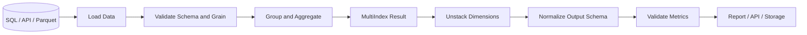

# 12- Stack And Unstack

## Overview

`stack()` and `unstack()` reshape Pandas data by moving levels between the DataFrame's columns and index axes.

The core relationship is:

```text
stack()
Columns → Index

unstack()
Index → Columns
```

They are particularly important when working with `MultiIndex` objects, grouped data, hierarchical reports, and intermediate representations produced by `groupby()`.

Unlike `pivot()` and `pivot_table()`, which primarily express a business-oriented reshape from explicit data columns, `stack()` and `unstack()` operate directly on index and column levels. They are therefore especially useful when the data is already organized hierarchically.

A practical mental model is:

```text
DataFrame
┌─────────────────────────────┐
│ Index     │ Column A │ B    │
├─────────────────────────────┤
│ row 1     │ value    │ value│
│ row 2     │ value    │ value│
└─────────────────────────────┘

stack()
    │
    ▼
Move a column level into the row index

unstack()
    │
    ▼
Move an index level into the column axis
```

These operations become most useful after understanding `MultiIndex`, `groupby()`, `pivot_table()`, and reshaping patterns.

---

## What `stack()` Does

`stack()` moves one or more column levels into the row index.

Basic syntax:

```python
DataFrame.stack(
    level=-1,
    dropna=True,
    sort=True,
)
```

Example:

```python
import pandas as pd

sales = pd.DataFrame(
    {
        "region": ["East", "West"],
        "revenue": [1200, 900],
        "profit": [300, 200],
    }
).set_index("region")

stacked = sales.stack()

print(stacked)
```

Conceptually:

```text
Before:

        revenue  profit
region
East       1200     300
West        900     200

After stack():

region
East    revenue    1200
        profit      300
West    revenue     900
        profit      200
```

The column labels become another level of the row index.

The result is typically a `Series` when stacking a single column level from an ordinary DataFrame.

---

## Why `stack()` Exists

Many Pandas operations naturally produce hierarchical columns.

For example:

```python
report = sales.groupby("region").agg(
    revenue=("revenue", "sum"),
    profit=("profit", "sum"),
)
```

More complex aggregations can produce MultiIndex columns:

```python
report = sales.groupby("region").agg(
    {
        "revenue": ["sum", "mean"],
        "profit": ["sum", "mean"],
    }
)
```

The result may have columns such as:

```text
revenue        profit
sum    mean    sum    mean
```

`stack()` provides a way to move one of those column levels into the row index so that hierarchical data can be processed more naturally.

---

## `stack()` with MultiIndex Columns

Create a DataFrame with hierarchical columns:

```python
orders = pd.DataFrame(
    {
        ("revenue", "online"): [1200, 900],
        ("revenue", "retail"): [800, 700],
        ("orders", "online"): [10, 8],
        ("orders", "retail"): [6, 7],
    },
    index=["East", "West"],
)

orders.index.name = "region"
```

The structure is:

```text
             revenue          orders
             online retail    online retail
region
East           1200    800       10      6
West            900    700        8      7
```

Stack the second column level:

```python
stacked = orders.stack(level=1)
```

The resulting structure is approximately:

```text
region  channel
East    online      1200   10
        retail       800    6
West    online       900    8
        retail       700    7
```

This is useful because the channel dimension becomes an ordinary hierarchical row dimension.

---

## Selecting the Level to Stack

Use `level` to choose which column level should move into the index.

By position:

```python
stacked = orders.stack(level=0)
```

```python
stacked = orders.stack(level=1)
```

By name is generally clearer when levels are named:

```python
orders.columns = pd.MultiIndex.from_tuples(
    orders.columns,
    names=["metric", "channel"],
)

stacked = orders.stack(level="channel")
```

For production code, named levels are usually preferable to numeric positions because they communicate intent and are less fragile when the column structure changes.

---

## `stack()` Input and Output Behavior

The important behavior is:

| Property | Behavior |
| --- | --- |
| Input | DataFrame or compatible tabular structure |
| Main operation | Columns → Index |
| Output | Usually a Series or DataFrame depending on input/levels |
| Original object | Not modified |
| Index | Gains one or more levels |
| Columns | Corresponding level(s) are removed |
| Missing values | Behavior depends on stacking configuration |
| Memory | Creates a reshaped object and may allocate substantial memory |

Always inspect the result:

```python
print(stacked.index)
print(stacked.columns if hasattr(stacked, "columns") else None)
```

When working with hierarchical data, inspecting both `index` and `columns` is often more useful than only inspecting `shape`.

---

## Missing Values and `stack()`

Stacking can encounter missing combinations.

Example:

```python
sales = pd.DataFrame(
    {
        "online": [1000, None],
        "retail": [500, 700],
    },
    index=["East", "West"],
)

sales.index.name = "region"
```

Then:

```python
stacked = sales.stack()
```

By default, missing values may be omitted depending on the stack configuration.

This means:

```text
original cells
    ↓
missing cells
    ↓
may disappear from stacked output
```

That is significant when row count itself carries business meaning.

For workflows where missing combinations must be preserved, use the appropriate `dropna` behavior and validate the resulting shape.

```python
stacked = sales.stack(dropna=False)
```

Do not assume that a missing source cell and an absent row in the stacked result have identical semantics.

---

## Sorting Behavior

Stacking interacts with index ordering.

```python
stacked = sales.stack(sort=True)
```

Sorting can make output deterministic and easier to inspect.

For large datasets, however, sorting may add computational cost.

If ordering is not required by the business contract, avoid unnecessary sorting and explicitly sort later only when needed:

```python
stacked = sales.stack(sort=False)
```

Then:

```python
stacked = stacked.sort_index()
```

This separates transformation from presentation concerns.

---

## What `unstack()` Does

`unstack()` moves one or more index levels into the columns.

Basic syntax:

```python
Series.unstack(
    level=-1,
    fill_value=None,
    sort=True,
)
```

It is also available for DataFrames.

Consider a Series with a MultiIndex:

```python
sales = pd.Series(
    [1200, 900, 1500, 1100],
    index=pd.MultiIndex.from_tuples(
        [
            ("2026-01-01", "East"),
            ("2026-01-01", "West"),
            ("2026-01-02", "East"),
            ("2026-01-02", "West"),
        ],
        names=["date", "region"],
    ),
    name="revenue",
)
```

The data is:

```text
date        region
2026-01-01  East       1200
            West        900
2026-01-02  East       1500
            West        1100
```

Unstack the region level:

```python
wide = sales.unstack("region")
```

Result:

```text
region        East   West
date
2026-01-01   1200    900
2026-01-02   1500   1100
```

The `region` index level becomes columns.

---

## Why `unstack()` Exists

`unstack()` is particularly useful after grouping.

Example:

```python
orders = pd.DataFrame(
    {
        "date": [
            "2026-01-01",
            "2026-01-01",
            "2026-01-02",
            "2026-01-02",
        ],
        "region": [
            "East",
            "West",
            "East",
            "West",
        ],
        "revenue": [
            1200,
            900,
            1500,
            1100,
        ],
    }
)

grouped = (
    orders.groupby(["date", "region"])["revenue"]
    .sum()
)
```

The grouped result has a MultiIndex:

```text
date        region
2026-01-01  East       1200
            West        900
2026-01-02  East       1500
            West        1100
```

Convert it to wide format:

```python
report = grouped.unstack("region")
```

This is one of the most important real-world uses of `unstack()`.

---

## `groupby()` + `unstack()`

A common Pandas reporting pattern is:

```python
report = (
    orders.groupby(["date", "region"])["revenue"]
    .sum()
    .unstack("region")
)
```

This is closely related to:

```python
report = orders.pivot_table(
    index="date",
    columns="region",
    values="revenue",
    aggfunc="sum",
)
```

Both can produce equivalent results.

The difference is mainly in how the intent is expressed.

Use `pivot_table()` when the business operation is naturally described as:

```text
aggregate + reshape
```

Use `groupby()` + `unstack()` when you already have or need the grouped MultiIndex representation.

---

## `stack()` and `unstack()` Are Conceptual Inverses

For compatible data:

```text
DataFrame
   │
   │ stack()
   ▼
Series / DataFrame with MultiIndex
   │
   │ unstack()
   ▼
DataFrame
```

Example:

```python
wide = pd.DataFrame(
    {
        "East": [1200, 1500],
        "West": [900, 1100],
    },
    index=["2026-01-01", "2026-01-02"],
)

wide.index.name = "date"
wide.columns.name = "region"

long_like = wide.stack()
restored = long_like.unstack()
```

The values can be restored when the transformation does not discard information.

However, round-tripping is not always perfectly identical because of:

- Missing values.
- Dropped combinations.
- Sorting.
- Index names.
- Column names.
- Dtype changes.
- Multiple index/column levels.
- Duplicate or aggregated source data.

For production pipelines, validate the actual contract rather than assuming that `stack().unstack()` always reproduces every metadata detail.

---

## Multiple Levels with `unstack()`

Multiple index levels can be moved to columns.

```python
data = pd.Series(
    [100, 200, 300, 400],
    index=pd.MultiIndex.from_tuples(
        [
            ("East", "Online"),
            ("East", "Retail"),
            ("West", "Online"),
            ("West", "Retail"),
        ],
        names=["region", "channel"],
    ),
    name="revenue",
)

report = data.unstack(["region", "channel"])
```

This can produce hierarchical columns:

```text
region    East         West
channel  Online Retail Online Retail
```

Multiple-level unstacking is powerful but can create difficult-to-manage schemas.

For APIs and external storage, consider flattening the column structure:

```python
report.columns = [
    "_".join(str(part) for part in column)
    for column in report.columns.to_flat_index()
]
```

---

## MultiIndex Fundamentals

`stack()` and `unstack()` make much more sense when `MultiIndex` is understood.

A MultiIndex stores multiple levels of labels:

```python
index = pd.MultiIndex.from_tuples(
    [
        ("East", "Online"),
        ("East", "Retail"),
        ("West", "Online"),
        ("West", "Retail"),
    ],
    names=["region", "channel"],
)
```

The index contains:

```text
region × channel
```

Each row is addressed by a tuple-like combination:

```text
("East", "Online")
("East", "Retail")
("West", "Online")
("West", "Retail")
```

`unstack("channel")` moves the channel level from this address space into the columns.

`stack("channel")` performs the opposite movement when channel exists on the column axis.

---

## Named Levels

Always name important MultiIndex levels.

Prefer:

```python
index = pd.MultiIndex.from_tuples(
    values,
    names=["region", "channel"],
)
```

over:

```python
index = pd.MultiIndex.from_tuples(values)
```

Named levels improve:

- Readability.
- Refactoring safety.
- Debugging.
- `stack()` and `unstack()` calls.
- Data validation.
- Code reviews.

Then write:

```python
result = data.unstack("channel")
```

instead of:

```python
result = data.unstack(1)
```

---

## Selecting Specific Levels

You can inspect MultiIndex metadata:

```python
print(data.index.names)
print(data.columns.names)
```

You can also select specific levels by name:

```python
result = data.unstack("region")
```

For several levels:

```python
result = data.unstack(["region", "channel"])
```

This is more maintainable than relying on positional indexes when the structure is likely to evolve.

---

## `fill_value` with `unstack()`

When an index combination does not exist, unstacking can produce missing cells.

Example:

```python
data = pd.Series(
    [100, 200, 300],
    index=pd.MultiIndex.from_tuples(
        [
            ("East", "Online"),
            ("East", "Retail"),
            ("West", "Online"),
        ],
        names=["region", "channel"],
    ),
    name="revenue",
)

report = data.unstack("channel")
```

The result contains a missing value for:

```text
West / Retail
```

When zero is semantically appropriate:

```python
report = data.unstack(
    "channel",
    fill_value=0,
)
```

Again, this should represent a business rule, not merely a desire to remove `NaN`.

---

## `stack()` Versus `melt()`

These operations can look similar but operate at different abstraction levels.

| Operation | Main Input Structure | Main Purpose |
| --- | --- | --- |
| `stack()` | Columns / MultiIndex columns | Move column levels into index |
| `unstack()` | Index / MultiIndex index | Move index levels into columns |
| `melt()` | Ordinary columns | Wide → long using named columns |
| `pivot()` | Ordinary columns | Long → wide with unique combinations |
| `pivot_table()` | Ordinary columns | Long → wide with aggregation |

Example:

```python
wide = pd.DataFrame(
    {
        "region": ["East", "West"],
        "revenue": [1200, 900],
        "profit": [300, 200],
    }
)
```

For business-oriented wide-to-long transformation:

```python
long = wide.melt(
    id_vars="region",
    var_name="metric",
    value_name="amount",
)
```

For a DataFrame whose columns already represent a hierarchical axis, `stack()` is generally a better conceptual fit.

---

## `stack()` Versus `pivot()`

`pivot()` operates using ordinary data columns:

```python
orders.pivot(
    index="date",
    columns="region",
    values="revenue",
)
```

`stack()` operates on the existing column axis:

```python
report.stack()
```

The distinction is:

```text
pivot()
"Use these columns as dimensions."

stack()
"Move an existing column level into the index."
```

Choose the operation that matches the current data structure rather than converting between representations unnecessarily.

---

## `unstack()` Versus `pivot_table()`

These can also solve similar problems.

Using `pivot_table()`:

```python
report = orders.pivot_table(
    index="date",
    columns="region",
    values="revenue",
    aggfunc="sum",
)
```

Using `groupby()` + `unstack()`:

```python
report = (
    orders.groupby(["date", "region"])["revenue"]
    .sum()
    .unstack("region")
)
```

The latter exposes the intermediate grouped Series.

That can be useful when additional operations are needed:

```python
grouped = (
    orders.groupby(["date", "region"])["revenue"]
    .sum()
)

validated = grouped[lambda values: values >= 0]

report = validated.unstack("region")
```

This is often easier to debug in a complex ETL pipeline.

---

## DataFrame `unstack()`

`unstack()` can operate on a DataFrame with a MultiIndex.

```python
data = pd.DataFrame(
    {
        "revenue": [1200, 900, 1500, 1100],
        "orders": [10, 8, 12, 9],
    },
    index=pd.MultiIndex.from_tuples(
        [
            ("2026-01-01", "East"),
            ("2026-01-01", "West"),
            ("2026-01-02", "East"),
            ("2026-01-02", "West"),
        ],
        names=["date", "region"],
    ),
)

report = data.unstack("region")
```

The resulting DataFrame has MultiIndex columns:

```text
             revenue       orders
region        East  West   East  West
date
2026-01-01   1200   900     10     8
2026-01-02   1500  1100     12     9
```

This is useful when several metrics share the same dimensions.

---

## Flattening MultiIndex Results

MultiIndex columns are often convenient internally but awkward externally.

Example:

```python
report = data.unstack("region")
```

Flatten them for API or CSV consumers:

```python
report.columns = [
    f"{metric}_{region}"
    for metric, region in report.columns.to_flat_index()
]

report = report.reset_index()
```

The result may look like:

```text
date       revenue_East  revenue_West  orders_East  orders_West
2026-01-01        1200          900           10            8
2026-01-02        1500         1100           12            9
```

Define naming rules centrally when multiple reports use the same transformation.

---

## Database Workflow

A typical backend pipeline may start with SQL:

```python
query = """
SELECT
    order_date,
    region,
    revenue
FROM daily_region_sales
WHERE order_date >= %(start_date)s
  AND order_date < %(end_date)s
"""

orders = pd.read_sql_query(
    query,
    connection,
    params={
        "start_date": start_date,
        "end_date": end_date,
    },
)
```

Aggregate and unstack:

```python
report = (
    orders.groupby(["order_date", "region"])["revenue"]
    .sum()
    .unstack("region")
)
```

Then enforce a stable schema:

```python
expected_regions = [
    "East",
    "West",
    "North",
    "South",
]

report = report.reindex(
    columns=expected_regions,
    fill_value=0,
)
```

This pattern is useful for scheduled reporting because:

1. PostgreSQL performs filtering.
2. Pandas receives a reduced dataset.
3. `groupby()` expresses the aggregation.
4. `unstack()` performs the final shape transformation.
5. `reindex()` enforces the report contract.

---

## API Reporting Example

Suppose a FastAPI endpoint returns service metrics by environment.

```python
metrics = pd.DataFrame(
    {
        "service": [
            "payments",
            "payments",
            "orders",
            "orders",
        ],
        "environment": [
            "prod",
            "staging",
            "prod",
            "staging",
        ],
        "error_count": [
            12,
            3,
            7,
            2,
        ],
    }
)
```

Create a grouped MultiIndex:

```python
grouped = (
    metrics.groupby(["service", "environment"])["error_count"]
    .sum()
)
```

Move environment into columns:

```python
report = grouped.unstack("environment", fill_value=0)
```

Convert to API-safe records:

```python
response = report.reset_index().to_dict(
    orient="records"
)
```

This results in stable records such as:

```json
[
  {
    "service": "orders",
    "prod": 7,
    "staging": 2
  },
  {
    "service": "payments",
    "prod": 12,
    "staging": 3
  }
]
```

The transformation layer remains independent from the FastAPI transport layer.

---

## ETL Pattern

A practical ETL flow is:



The key engineering decision is to construct the MultiIndex intentionally rather than treating it as an accidental side effect of an operation.

---

## Performance Considerations

`stack()` and `unstack()` are vectorized Pandas operations, but reshaping still requires memory and can become expensive on large or high-dimensional data.

Cost drivers include:

- Number of rows.
- Number of unique index levels.
- Number of unique column levels.
- Number of resulting cells.
- Missing combinations.
- Number of levels being reshaped.
- Sorting requirements.
- Object-heavy dtypes.

Before unstacking, inspect cardinality:

```python
region_count = data.index.get_level_values("region").nunique()
channel_count = data.index.get_level_values("channel").nunique()

print(
    "Potential region/channel combinations:",
    region_count * channel_count,
)
```

As with pivoting, the resulting logical matrix can be much larger than the input.

---

## Avoiding Wide Explosions

Consider:

```text
1,000,000 customers
×
5,000 products
```

Unstacking product IDs into columns could theoretically produce billions of cells.

That is usually a poor representation.

Prefer long-form data:

```text
customer_id | product_id | metric
```

and only unstack for a bounded reporting dimension.

Wide output should be treated as a presentation or analytical shape, not automatically as the canonical storage model.

---

## Sorting Trade-Offs

Both operations may sort index levels depending on the configuration.

For large data:

```python
result = data.unstack(
    "region",
    sort=False,
)
```

can avoid unnecessary ordering work.

If deterministic output is required:

```python
result = result.sort_index(axis=1)
```

Explicit sorting makes the ordering requirement visible.

For APIs and files, deterministic ordering can simplify:

- Snapshot testing.
- Schema comparisons.
- Diffing.
- Reproducibility.

---

## Memory Considerations

Monitor memory around expensive reshapes.

```python
before = data.memory_usage(
    index=True,
    deep=True,
).sum()

result = data.unstack("region")

after = result.memory_usage(
    index=True,
    deep=True,
).sum()

print(f"Before: {before:,} bytes")
print(f"After:  {after:,} bytes")
```

If the reshaped output is substantially larger, consider:

- Reducing columns before transformation.
- Filtering the time range.
- Aggregating before reshaping.
- Using efficient dtypes.
- Moving the operation into SQL.
- Using Parquet partitions.
- Using a distributed engine for genuinely large workloads.

---

## Empty DataFrames

Empty input should be handled explicitly when a pipeline requires a stable output schema.

For example:

```python
def build_region_report(data: pd.DataFrame) -> pd.DataFrame:
    expected_regions = [
        "East",
        "West",
        "North",
        "South",
    ]

    if data.empty:
        return pd.DataFrame(
            columns=[
                "order_date",
                *expected_regions,
            ]
        )

    report = (
        data.groupby(["order_date", "region"])["revenue"]
        .sum()
        .unstack("region", fill_value=0)
        .reindex(
            columns=expected_regions,
            fill_value=0,
        )
        .reset_index()
    )

    return report
```

This prevents downstream consumers from receiving unpredictable schemas during low-volume or empty data periods.

---

## Duplicate Data Considerations

Unlike `pivot()`, `unstack()` does not perform the original long-form duplicate validation because it operates on index structure.

Duplicates become important earlier:

```python
duplicate_index = data.index.duplicated(keep=False)

if duplicate_index.any():
    raise ValueError(
        "Duplicate index combinations detected."
    )
```

When the DataFrame represents:

```text
one row per date + region
```

that invariant should be enforced before transformations that depend on unique hierarchical keys.

If aggregation is required:

```python
grouped = (
    data.groupby(["date", "region"])["revenue"]
    .sum()
)

report = grouped.unstack("region")
```

The aggregation step makes the intended duplicate semantics explicit.

---

## Testing Stack and Unstack

Tests should validate both values and structure.

```python
import pandas as pd
from pandas.testing import assert_frame_equal


def test_unstack_creates_expected_region_columns() -> None:
    data = pd.Series(
        [100, 200, 300, 400],
        index=pd.MultiIndex.from_tuples(
            [
                ("2026-01-01", "East"),
                ("2026-01-01", "West"),
                ("2026-01-02", "East"),
                ("2026-01-02", "West"),
            ],
            names=["date", "region"],
        ),
        name="revenue",
    )

    actual = data.unstack("region")

    expected = pd.DataFrame(
        {
            "East": [100, 300],
            "West": [200, 400],
        },
        index=pd.Index(
            ["2026-01-01", "2026-01-02"],
            name="date",
        ),
    )

    expected.columns.name = "region"

    assert_frame_equal(actual, expected)
```

For transformations that are intended to round-trip:

```python
def test_stack_unstack_round_trip() -> None:
    original = pd.DataFrame(
        {
            "East": [100, 300],
            "West": [200, 400],
        },
        index=pd.Index(
            ["2026-01-01", "2026-01-02"],
            name="date",
        ),
    )

    original.columns.name = "region"

    restored = original.stack().unstack()

    assert_frame_equal(restored, original)
```

Tests should verify:

- Index names.
- Column names.
- Expected shape.
- Values.
- Missing-value behavior.
- Dtypes where important.
- Stable ordering where contractual.

---

## Common Mistakes

### Treating `stack()` as a Generic Replacement for `melt()`

`stack()` is designed around column levels and MultiIndex structure.

For ordinary wide data:

```python
df.melt(...)
```

is usually clearer when the transformation is defined by named business columns.

---

### Using Numeric Levels Instead of Names

Fragile:

```python
data.unstack(1)
```

Preferred:

```python
data.unstack("region")
```

Named levels survive structural changes more reliably.

---

### Forgetting That `unstack()` Creates Columns

Before:

```text
Index:
date + region
```

After:

```text
Index:
date

Columns:
region
```

Code that expects `region` to remain in the index will fail.

---

### Accidentally Dropping Missing Combinations

A missing cell can disappear during stacking depending on `dropna`.

Validate row counts and expected dimensions after the transformation.

---

### Filling Missing Values Without Business Semantics

This:

```python
data.unstack("region", fill_value=0)
```

is only correct when an absent combination means zero.

It is not universally correct.

---

### Ignoring MultiIndex Metadata

Code may appear to work while producing confusing names:

```text
columns.name = "region"
index.names = ["date", "channel"]
```

Inspect and normalize metadata when exposing the result to other systems.

---

### Creating an Unmanageably Wide DataFrame

A technically valid `unstack()` can still be operationally invalid.

Always check cardinality before converting a dimension into columns.

---

## Production Pitfalls

### Unbounded Dimension Values

Using a high-cardinality field such as:

```text
customer_id
request_id
transaction_id
```

as a column level can cause extreme memory growth.

Use bounded dimensions such as:

```text
region
environment
channel
month
```

when a wide report is actually required.

---

### Unstable Schemas

Dynamic dimensions can cause different batches to return different columns.

Enforce expected dimensions:

```python
report = report.reindex(
    columns=[
        "East",
        "West",
        "North",
        "South",
    ],
    fill_value=0,
)
```

---

### Running Expensive Reshapes Per HTTP Request

Do not automatically perform large `unstack()` operations inside a synchronous API request.

For expensive reports:

```text
Scheduler
   │
   ▼
Celery Worker
   │
   ▼
Database Aggregation
   │
   ▼
Pandas Reshape
   │
   ▼
Persisted Report
   │
   ▼
FastAPI
```

This improves request latency and isolates expensive CPU/memory work.

---

### Losing the Canonical Representation

Do not persist only the wide result.

Keep the canonical long-form or normalized dataset so that reports can be regenerated after:

- Business-rule changes.
- Backfills.
- Corrections.
- Historical reprocessing.
- Disaster recovery.

---

## Security Considerations

`stack()` and `unstack()` do not provide authorization or data-isolation guarantees.

Security must be enforced before transformation.

For multi-tenant systems:

```text
Authenticate
    │
    ▼
Authorize tenant
    │
    ▼
Query allowed records
    │
    ▼
Transform with Pandas
    │
    ▼
Serialize report
```

Do not retrieve multiple tenants' data and attempt to secure it solely through DataFrame filtering.

Also avoid exposing sensitive identifiers as dynamic columns in APIs or exported reports.

---

## Operational Monitoring

For production pipelines, monitor the transformation rather than only its success status.

Useful metrics include:

```text
input_rows
output_rows
input_index_cardinality
output_column_count
missing_combination_count
duplicate_key_count
transformation_duration_ms
memory_usage_bytes
```

For financial reporting, reconciliation can detect silent reshape errors:

```python
source_total = grouped.sum()

report_total = report.sum(axis=1).sum()

if source_total != report_total:
    raise ValueError(
        "Revenue reconciliation failed."
    )
```

A pipeline that produces a DataFrame successfully can still produce an incorrect report. Business invariants should therefore be validated explicitly.

---

## Choosing the Right Reshape

| Situation | Preferred Tool |
| --- | --- |
| Move column level into index | `stack()` |
| Move index level into columns | `unstack()` |
| Wide columns → long rows using ordinary columns | `melt()` |
| Long → wide with unique keys | `pivot()` |
| Long → wide with aggregation | `pivot_table()` |
| Group and aggregate | `groupby()` |
| Grouped result → wide | `groupby()` + `unstack()` |

A useful decision rule is:

```text
Already have hierarchical index/columns?
    │
    ├── Columns → Index → stack()
    │
    └── Index → Columns → unstack()

Still have ordinary business columns?
    │
    ├── Unique keys → pivot()
    └── Aggregation required → pivot_table()
```

---

## Key Takeaways

- `stack()` moves column levels into the index, while `unstack()` moves index levels into columns; both are fundamentally `MultiIndex` reshaping operations.
- `groupby()` followed by `unstack()` is a powerful reporting pattern when grouped data already has the required hierarchical index.
- Missing combinations, duplicate keys, level names, and output schema must be handled explicitly because reshaping can change both structure and semantics.
- High-cardinality unstacking can produce enormous wide DataFrames; check output cardinality and prefer SQL aggregation, long-form data, or scalable processing when appropriate.
- Treat reshaping as part of a validated data pipeline: enforce stable schemas, test index/column structure, reconcile important metrics, and keep canonical source data for regeneration.