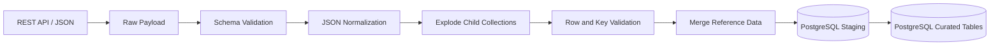

# 13- Explode

## Overview

`explode()` transforms list-like values inside DataFrame cells into separate rows.

It is most useful when a dataset contains nested or repeated attributes such as:

- Product tags.
- Customer permissions.
- Order line items.
- API response arrays.
- Event attributes.
- Employee skills.
- Category paths.
- Kafka or JSON payload fields.

For example, an API may return:

```text
customer_id | tags
------------|-------------------------
101         | ["premium", "active"]
102         | ["trial"]
```

`explode()` converts this into:

```text
customer_id | tags
------------|---------
101         | premium
101         | active
102         | trial
```

The operation changes the row grain. That is the most important engineering consideration.

> One input row can become many output rows.

Because of that, `explode()` should be treated as a structural transformation rather than a simple formatting operation.

---

## What Problem `explode()` Solves

Relational datasets normally represent repeated values as separate rows:

```text
customer_id | tag
------------|---------
101         | premium
101         | active
102         | trial
```

API responses and semi-structured data often represent the same information as arrays:

```json
[
  {
    "customer_id": 101,
    "tags": ["premium", "active"]
  },
  {
    "customer_id": 102,
    "tags": ["trial"]
  }
]
```

After loading into Pandas:

```python
import pandas as pd

customers = pd.DataFrame(
    {
        "customer_id": [101, 102],
        "tags": [
            ["premium", "active"],
            ["trial"],
        ],
    }
)
```

`explode()` normalizes the repeated values:

```python
exploded = customers.explode("tags")
```

Result:

```text
   customer_id      tags
0          101   premium
0          101    active
1          102     trial
```

The duplicated index is intentional because the original row produced multiple records.

---

## Basic Syntax

The common form is:

```python
DataFrame.explode(
    column,
    ignore_index=False,
)
```

Example:

```python
exploded = customers.explode(
    "tags",
    ignore_index=True,
)
```

Result:

```text
   customer_id      tags
0          101   premium
1          101    active
2          102     trial
```

For production transformations, `ignore_index=True` is often convenient when the original index has no business meaning.

---

## How `explode()` Works

Conceptually:

```text
Input row

customer_id = 101
tags = ["premium", "active"]

            │
            ▼
       explode("tags")

            │
       ┌────┴────┐
       ▼         ▼
premium       active

            │
            ▼

customer_id | tags
------------|---------
101         | premium
101         | active
```

All non-exploded columns are repeated for every resulting element.

If one row contains five tags, that row becomes five rows.

---

## Input Expectations

The target column should contain list-like values or scalars.

For example:

```python
data = pd.DataFrame(
    {
        "order_id": [1, 2],
        "items": [
            ["laptop", "mouse"],
            ["keyboard"],
        ],
    }
)
```

This is well suited to:

```python
result = data.explode(
    "items",
    ignore_index=True,
)
```

A scalar value is treated as a value that does not need expansion:

```python
data = pd.DataFrame(
    {
        "order_id": [1, 2],
        "items": [
            ["laptop", "mouse"],
            "keyboard",
        ],
    }
)
```

The second row remains a single output row for `keyboard`.

This is useful for tolerant ingestion, but production pipelines should still validate that the input structure matches the expected source contract.

---

## Output Behavior

| Property | Behavior |
| --- | --- |
| Input | DataFrame with a list-like column |
| Output | New DataFrame |
| Row count | Can increase substantially |
| Non-exploded columns | Repeated |
| Exploded column | One element per resulting row |
| Original DataFrame | Not modified |
| Index | Preserved by default |
| Index with `ignore_index=True` | Rebuilt as a sequential index |
| Missing / empty list behavior | Requires explicit validation because it affects output semantics |
| Dtype | May become more generic, especially with mixed element types |

A critical implication is that `explode()` does not merely "split a cell." It changes the cardinality of the DataFrame.

---

## Exploding a Series

`explode()` is also available on a Series.

```python
tags = pd.Series(
    [
        ["premium", "active"],
        ["trial"],
    ],
    name="tags",
)

exploded_tags = tags.explode(ignore_index=True)
```

Result:

```text
0    premium
1     active
2      trial
Name: tags, dtype: object
```

Use Series `explode()` when only one column is being processed and the surrounding DataFrame is not required.

---

## Real-World Order Example

Consider an orders API returning nested line-item identifiers:

```python
orders = pd.DataFrame(
    {
        "order_id": [1001, 1002, 1003],
        "customer_id": [501, 502, 503],
        "product_ids": [
            [101, 102, 103],
            [201],
            [301, 302],
        ],
    }
)
```

Explode the products:

```python
order_products = orders.explode(
    "product_ids",
    ignore_index=True,
)

order_products = order_products.rename(
    columns={"product_ids": "product_id"},
)
```

Result:

```text
   order_id  customer_id  product_id
0      1001          501          101
1      1001          501          102
2      1001          501          103
3      1002          502          201
4      1003          503          301
5      1003          503          302
```

This is now much easier to join with a product dimension table.

---

## Explode Before a Join

A common ETL pattern is:

```text
API / JSON
    │
    ▼
Nested DataFrame
    │
    ▼
explode()
    │
    ▼
Normalized rows
    │
    ▼
merge()
    │
    ▼
Enriched dataset
```

Example:

```python
products = pd.DataFrame(
    {
        "product_id": [101, 102, 103, 201],
        "product_name": [
            "Laptop",
            "Mouse",
            "Keyboard",
            "Monitor",
        ],
    }
)

order_products = (
    orders
    .explode("product_ids", ignore_index=True)
    .rename(columns={"product_ids": "product_id"})
)

enriched = order_products.merge(
    products,
    on="product_id",
    how="left",
    validate="many_to_one",
)
```

This is a practical way to normalize API arrays before relational processing.

---

## Exploding Tags

Tags are another common use case.

```python
events = pd.DataFrame(
    {
        "event_id": [1, 2, 3],
        "service": ["payments", "orders", "payments"],
        "tags": [
            ["latency", "timeout"],
            ["validation"],
            ["retry", "timeout"],
        ],
    }
)

event_tags = events.explode(
    "tags",
    ignore_index=True,
)
```

The normalized result can then support:

```python
tag_counts = (
    event_tags["tags"]
    .value_counts()
    .rename_axis("tag")
    .reset_index(name="event_count")
)
```

This is much simpler than repeatedly parsing individual list cells with Python loops.

---

## Exploding Permissions

A backend authorization system may provide:

```python
users = pd.DataFrame(
    {
        "user_id": [101, 102],
        "roles": [
            ["admin", "billing"],
            ["support"],
        ],
    }
)
```

Normalize it:

```python
user_roles = users.explode(
    "roles",
    ignore_index=True,
)
```

Result:

```text
   user_id     roles
0      101     admin
1      101   billing
2      102   support
```

This structure can then be validated or joined against a role metadata table.

---

## Exploding API Responses

Many REST APIs return nested arrays.

For example:

```json
{
  "orders": [
    {
      "order_id": 1001,
      "items": [
        {"product_id": 101, "quantity": 2},
        {"product_id": 102, "quantity": 1}
      ]
    }
  ]
}
```

After normalization with `json_normalize()`:

```python
from pandas import json_normalize

orders = json_normalize(
    payload["orders"],
)

print(orders.columns)
```

You may have a nested structure that requires normalization before exploding.

A typical workflow is:

```text
JSON payload
    │
    ▼
json_normalize()
    │
    ▼
DataFrame containing list-like columns
    │
    ▼
explode()
    │
    ▼
Normalized records
```

For nested dictionaries inside each list element, additional `json_normalize()` processing may be required after exploding.

---

## Exploding Nested Dictionaries

Suppose:

```python
orders = pd.DataFrame(
    {
        "order_id": [1001, 1002],
        "items": [
            [
                {"product_id": 101, "quantity": 2},
                {"product_id": 102, "quantity": 1},
            ],
            [
                {"product_id": 201, "quantity": 4},
            ],
        ],
    }
)
```

First explode:

```python
items = orders.explode(
    "items",
    ignore_index=True,
)
```

Then normalize the dictionaries:

```python
item_details = pd.json_normalize(
    items["items"],
)

result = pd.concat(
    [
        items.drop(columns="items").reset_index(drop=True),
        item_details.reset_index(drop=True),
    ],
    axis=1,
)
```

Result:

```text
   order_id  product_id  quantity
0      1001         101         2
1      1001         102         1
2      1002         201         4
```

This is a practical pattern for converting nested API structures into relational-style data.

---

## Exploding Multiple Columns

Recent Pandas versions support exploding multiple columns simultaneously.

Example:

```python
orders = pd.DataFrame(
    {
        "order_id": [1001, 1002],
        "product_ids": [
            [101, 102],
            [201],
        ],
        "quantities": [
            [2, 1],
            [4],
        ],
    }
)

result = orders.explode(
    ["product_ids", "quantities"],
    ignore_index=True,
)
```

The corresponding list-like columns must have matching lengths within each row.

For example:

```text
product_ids       quantities
[101, 102]        [2, 1]
```

is valid.

This would be invalid:

```text
product_ids       quantities
[101, 102, 103]   [2, 1]
```

because Pandas cannot determine which quantity belongs to product `103`.

---

## Validating Parallel List Lengths

When multiple columns are exploded together, validate their lengths.

```python
orders = pd.DataFrame(
    {
        "order_id": [1001, 1002],
        "product_ids": [
            [101, 102],
            [201],
        ],
        "quantities": [
            [2, 1],
            [4],
        ],
    }
)

valid_lengths = (
    orders["product_ids"].map(len)
    == orders["quantities"].map(len)
)

if not valid_lengths.all():
    raise ValueError(
        "Product and quantity lists have mismatched lengths."
    )

result = orders.explode(
    ["product_ids", "quantities"],
    ignore_index=True,
)
```

This validation makes the failure mode explicit and gives a clearer operational error than allowing malformed source data to propagate.

---

## Empty Lists

Empty lists deserve special attention.

Consider:

```python
data = pd.DataFrame(
    {
        "customer_id": [101, 102],
        "tags": [
            ["premium", "active"],
            [],
        ],
    }
)
```

Then:

```python
result = data.explode(
    "tags",
    ignore_index=True,
)
```

An empty list can produce a row with a missing exploded value.

Conceptually:

```text
Input:
102 -> []

Output:
102 -> NaN
```

Whether that is correct depends on the business meaning.

Possible interpretations include:

```text
[] = no tags
[] = source omitted tags
[] = invalid source data
```

Do not automatically drop the resulting row without deciding which interpretation applies.

For a "customer has zero tags" business model, retaining the customer may be correct. For a normalized many-to-many table, filtering the missing exploded value may be more appropriate.

---

## Missing Values

Missing values and empty lists are not necessarily equivalent.

These inputs represent different states:

```python
data = pd.DataFrame(
    {
        "customer_id": [101, 102, 103],
        "tags": [
            ["premium"],
            [],
            None,
        ],
    }
)
```

They can mean:

```text
["premium"] → one known tag
[]          → explicitly no tags
None        → unknown or missing tag information
```

A production pipeline should define these semantics before exploding.

For example:

```python
unknown_tags = data["tags"].isna().sum()
empty_lists = data["tags"].map(
    lambda value: isinstance(value, list) and not value
).sum()

print("Missing tag collections:", unknown_tags)
print("Empty tag collections:", empty_lists)
```

Avoid a broad `fillna([])` approach unless the semantics are explicitly correct.

---

## Filtering Empty Exploded Values

If the goal is a normalized child table containing only actual tags:

```python
tag_rows = (
    data
    .explode("tags", ignore_index=True)
    .dropna(subset=["tags"])
)
```

This produces only real tag values.

However, that operation intentionally removes parent rows whose list was empty or missing.

Document this decision in the transformation layer.

---

## Index Behavior

By default:

```python
result = data.explode("tags")
```

preserves the original index.

Example:

```text
Original index:
0
1

After explode:
0
0
1
```

This can be useful because it retains a relationship with the source row.

When the original index has no business meaning, use:

```python
result = data.explode(
    "tags",
    ignore_index=True,
)
```

This creates:

```text
0
1
2
3
```

For backend pipelines, `ignore_index=True` is often easier to reason about when the DataFrame will subsequently be merged, exported, or loaded into another system.

---

## Preserving Parent Identifiers

Never depend on the Pandas index as the parent-child relationship when a real identifier exists.

Prefer:

```python
data = pd.DataFrame(
    {
        "order_id": [1001],
        "items": [[101, 102]],
    }
)

items = data.explode(
    "items",
    ignore_index=True,
)
```

The important relationship is:

```text
order_id -> item
```

not:

```text
DataFrame index -> item
```

Stable business keys make downstream joins, deduplication, database writes, and debugging much safer.

---

## Data Types After `explode()`

The exploded column can have a different dtype after transformation.

Check explicitly:

```python
print(result.dtypes)
```

For example, an integer list combined with missing values may result in a nullable or more generic representation depending on the input.

If the business field must be numeric:

```python
result["product_id"] = pd.to_numeric(
    result["product_id"],
    errors="raise",
)
```

If it is an identifier:

```python
result["product_id"] = result["product_id"].astype("string")
```

The correct dtype depends on semantics. Product IDs may need to remain strings if leading zeros or non-numeric identifiers are possible.

---

## Duplicate Records

`explode()` can legitimately create duplicate-looking rows.

Example:

```python
orders = pd.DataFrame(
    {
        "order_id": [1001],
        "product_ids": [[101, 101]],
    }
)
```

After exploding:

```text
order_id  product_ids
1001      101
1001      101
```

Do not automatically call:

```python
.drop_duplicates()
```

The duplicate may represent:

- Two units of the same product.
- Two separate line items.
- A duplicate source record.
- A source-system anomaly.

Deduplication is a business rule, not a generic cleanup step.

---

## Explode and Quantities

Suppose an order stores:

```python
orders = pd.DataFrame(
    {
        "order_id": [1001],
        "product_ids": [[101, 101, 102]],
    }
)
```

Exploding preserves each occurrence:

```python
items = orders.explode(
    "product_ids",
    ignore_index=True,
)
```

Result:

```text
order_id  product_ids
1001      101
1001      101
1001      102
```

If the source intends repeated product IDs to represent quantity, aggregate afterward:

```python
item_quantities = (
    items.groupby(
        ["order_id", "product_ids"],
        as_index=False,
    )
    .size()
    .rename(columns={"size": "quantity"})
)
```

This creates:

```text
order_id  product_ids  quantity
1001      101               2
1001      102               1
```

This is an example of why row-grain decisions matter.

---

## Row Cardinality

One of the most important properties of `explode()` is output cardinality.

Suppose:

```text
Input rows = 100,000
Average list length = 8
```

The output may approach:

```text
800,000 rows
```

before filtering or handling empty lists.

A simple estimate is:

```python
estimated_rows = (
    data["items"]
    .map(
        lambda value: len(value)
        if isinstance(value, (list, tuple, set))
        else 1
    )
    .sum()
)

print("Estimated output rows:", estimated_rows)
```

For production datasets, inspect this before performing expensive downstream joins.

---

## Performance Considerations

`explode()` is vectorized at the Pandas operation level, but it still has potentially significant cost because it increases row count.

The main performance risks are:

- Large input DataFrames.
- Very long lists.
- Repeating wide parent columns.
- Exploding multiple dimensions.
- Joining the exploded result to large tables.
- Creating excessive intermediate copies.

For example, a DataFrame with 100 columns and one million rows can become expensive to explode because every resulting row repeats the non-exploded columns.

Reduce the working dataset first:

```python
items = (
    orders[
        [
            "order_id",
            "customer_id",
            "product_ids",
        ]
    ]
    .explode(
        "product_ids",
        ignore_index=True,
    )
)
```

Avoid carrying unrelated columns through the row-expansion step.

---

## Memory Amplification

Suppose:

```text
100,000 input rows
×
10 average elements
=
~1,000,000 output rows
```

If several large string columns are repeated across those rows, memory usage can grow dramatically.

Check memory before and after:

```python
before = data.memory_usage(
    index=True,
    deep=True,
).sum()

result = data.explode(
    "items",
    ignore_index=True,
)

after = result.memory_usage(
    index=True,
    deep=True,
).sum()

print(f"Before: {before:,} bytes")
print(f"After:  {after:,} bytes")
```

A practical optimization is to select only the columns required downstream before exploding.

---

## Large Dataset Strategy

For very large nested datasets, avoid assuming that Pandas should perform every stage.

A production architecture may use:

```text
API / Object Storage
        │
        ▼
Raw JSON / Parquet
        │
        ▼
Schema Validation
        │
        ▼
Database / Distributed Processing
        │
        ▼
Explode / Normalize
        │
        ▼
Curated Dataset
```

Consider moving the transformation upstream when:

- The source is already in a database.
- The database supports array or JSON operations efficiently.
- The dataset exceeds comfortable Pandas memory limits.
- The exploded dataset is much larger than the source.
- The transformation is repeatedly executed.

For AWS-based systems, storing raw JSON or normalized Parquet in S3 and performing larger transformations with an appropriate query or processing engine may be more scalable than loading the entire nested dataset into an API worker.

---

## SQL Relationship

Relational databases often represent repeated child records in normalized tables rather than arrays in one row.

For example:

```text
orders
------
order_id
customer_id

order_items
-----------
order_id
product_id
quantity
```

The normalized database model is often preferable to keeping:

```text
order_id | product_ids
---------|--------------------
1001     | [101, 102, 103]
```

However, when an API or JSON document provides arrays, `explode()` can bridge the gap:

```text
JSON array
    │
    ▼
Pandas explode()
    │
    ▼
order_items-like DataFrame
    │
    ▼
PostgreSQL
```

Example database write:

```python
item_rows.to_sql(
    "order_items",
    engine,
    if_exists="append",
    index=False,
)
```

Before writing, validate keys, dtypes, nullability, and uniqueness according to the database schema.

---

## Transactional Loading After `explode()`

A normalized child table should generally use a stable key.

Example:

```python
item_rows = (
    orders[
        ["order_id", "product_ids"]
    ]
    .explode(
        "product_ids",
        ignore_index=True,
    )
    .rename(
        columns={"product_ids": "product_id"}
    )
)
```

Validate:

```python
required_columns = {
    "order_id",
    "product_id",
}

if not required_columns.issubset(item_rows.columns):
    raise ValueError("Invalid order item schema.")
```

Then write using an appropriate transactional strategy.

For high-volume ingestion, consider staging into PostgreSQL first, validating there, and then merging into the final table rather than directly appending unvalidated records.

---

## Incremental Processing

For daily API ingestion:

```text
Day N API response
       │
       ▼
Validate payload
       │
       ▼
Normalize nested fields
       │
       ▼
Explode child collections
       │
       ▼
Deduplicate using business keys
       │
       ▼
Load child table
```

A useful business key might be:

```text
order_id + line_item_id
```

rather than relying on DataFrame row numbers.

This enables idempotent reruns if the same API batch is processed again.

---

## Idempotency

`explode()` itself is deterministic, but the resulting rows must still be deduplicated according to the source contract when the pipeline can receive duplicate payloads.

For example:

```python
items = (
    orders
    .explode("items", ignore_index=True)
)

items = items.drop_duplicates(
    subset=["order_id", "items"],
)
```

Only use this when the pair:

```text
order_id + items
```

is actually the unique business key.

If the source provides a line-item identifier, prefer it:

```python
items = items.drop_duplicates(
    subset=["order_id", "line_item_id"],
)
```

---

## Nested Structures and `json_normalize()`

`explode()` and `json_normalize()` often work together.

A common pattern is:

```python
from pandas import json_normalize

orders = json_normalize(
    payload["orders"],
)

items = orders.explode(
    "items",
    ignore_index=True,
)

item_details = json_normalize(
    items["items"],
)
```

The roles are different:

| Operation | Purpose |
| --- | --- |
| `json_normalize()` | Flatten nested dictionaries |
| `explode()` | Expand repeated list elements into rows |
| `merge()` | Combine normalized dimensions |
| `groupby()` | Aggregate normalized records |

Understanding these responsibilities avoids trying to solve every nested-data problem with one operation.

---

## Production Validation

Before exploding, validate the column.

```python
def validate_list_column(
    data: pd.DataFrame,
    column: str,
) -> None:
    if column not in data.columns:
        raise ValueError(
            f"Missing required column: {column}"
        )

    invalid_values = data[column].map(
        lambda value: (
            value is not None
            and not isinstance(
                value,
                (list, tuple, set),
            )
        )
    )

    if invalid_values.any():
        raise ValueError(
            f"Column {column!r} contains invalid list values."
        )
```

This is useful when the upstream API schema is expected to provide arrays consistently.

The exact accepted types should match the source contract. Do not blindly accept every iterable because strings and mappings have different semantics.

---

## Output Validation

After exploding, validate expected cardinality.

```python
input_rows = len(orders)

items = orders.explode(
    "product_ids",
    ignore_index=True,
)

if len(items) < input_rows:
    raise ValueError(
        "Unexpected row reduction after explode."
    )
```

A stronger check is to calculate expected output cardinality before transformation:

```python
def expected_exploded_rows(
    series: pd.Series,
) -> int:
    total = 0

    for value in series:
        if isinstance(value, (list, tuple, set)):
            total += max(len(value), 1)
        else:
            total += 1

    return total
```

Then:

```python
expected = expected_exploded_rows(
    orders["product_ids"]
)

items = orders.explode(
    "product_ids",
    ignore_index=True,
)

if len(items) != expected:
    raise ValueError(
        "Exploded row count does not match expectation."
    )
```

For critical pipelines, row-count reconciliation is an inexpensive integrity check.

---

## Testing `explode()`

Tests should verify transformation semantics rather than only execution.

```python
import pandas as pd
from pandas.testing import assert_frame_equal


def test_explode_order_items() -> None:
    orders = pd.DataFrame(
        {
            "order_id": [1001, 1002],
            "product_ids": [
                [101, 102],
                [201],
            ],
        }
    )

    actual = orders.explode(
        "product_ids",
        ignore_index=True,
    )

    expected = pd.DataFrame(
        {
            "order_id": [1001, 1001, 1002],
            "product_ids": [101, 102, 201],
        }
    )

    assert_frame_equal(actual, expected)
```

Test edge cases explicitly:

```python
def test_explode_handles_empty_list() -> None:
    orders = pd.DataFrame(
        {
            "order_id": [1001],
            "product_ids": [[]],
        }
    )

    result = orders.explode(
        "product_ids",
        ignore_index=True,
    )

    assert len(result) == 1
    assert pd.isna(result.loc[0, "product_ids"])
```

For multiple columns:

```python
import pytest


def test_explode_rejects_mismatched_parallel_lists() -> None:
    orders = pd.DataFrame(
        {
            "order_id": [1001],
            "product_ids": [[101, 102]],
            "quantities": [[2]],
        }
    )

    with pytest.raises(ValueError):
        orders.explode(
            ["product_ids", "quantities"],
            ignore_index=True,
        )
```

Meaningful tests should cover:

- One-to-many expansion.
- Empty lists.
- Missing values.
- Duplicate values.
- Multiple parallel lists.
- Incorrect list lengths.
- Empty input.
- Unexpected scalar values.
- Resulting dtypes.
- Business-key preservation.

---

## Common Mistakes

### Treating `explode()` as a String-Splitting Function

This is incorrect:

```python
data.explode("tags")
```

when `tags` contains:

```text
"premium,active"
```

as a single string.

A string is not equivalent to a list of values.

Convert the source representation first:

```python
data["tags"] = (
    data["tags"]
    .str.split(",")
)
```

Then:

```python
data = data.explode(
    "tags",
    ignore_index=True,
)
```

Clean whitespace when required:

```python
data["tags"] = (
    data["tags"]
    .str.split(",")
    .map(
        lambda values: [
            value.strip()
            for value in values
        ]
        if isinstance(values, list)
        else values
    )
)
```

For production ingestion, validate the actual source format before applying this pattern.

---

### Dropping `NaN` Without Understanding Why It Exists

This:

```python
data.explode("tags").dropna(subset=["tags"])
```

can remove legitimate parent records.

Decide whether missing tags mean:

```text
no tags
unknown tags
invalid source
```

before dropping them.

---

### Calling `drop_duplicates()` Immediately

Repeated values after exploding are not automatically duplicates.

For example:

```text
order 1001
product 101
quantity 2
```

may legitimately represent two units.

Use business keys and domain semantics to determine whether deduplication is required.

---

### Carrying Too Many Columns

This increases memory consumption because non-exploded columns are repeated.

Prefer:

```python
items = orders[
    [
        "order_id",
        "customer_id",
        "product_ids",
    ]
].explode(
    "product_ids",
    ignore_index=True,
)
```

rather than exploding a very wide DataFrame unnecessarily.

---

### Ignoring Parallel List Lengths

This:

```text
products  = [101, 102, 103]
quantities = [2, 1]
```

does not define a valid one-to-one relationship.

Validate first.

---

### Depending on the Pandas Index as a Business Key

Index values are transformation metadata.

Persist and join using explicit identifiers such as:

```text
order_id
customer_id
line_item_id
event_id
```

---

## Performance Pitfalls

### Exploding Before Filtering

Avoid:

```python
all_items = orders.explode("items")
all_items = all_items[all_items["status"] == "active"]
```

when the inactive parent records can be removed first.

Prefer:

```python
active_orders = orders.loc[
    orders["status"].eq("active")
]

all_items = active_orders.explode(
    "items",
    ignore_index=True,
)
```

This reduces the number of rows entering the expansion stage.

---

### Exploding Before Selecting Required Columns

Avoid carrying:

```text
large JSON blobs
debug metadata
unused descriptions
large text fields
```

through the expansion.

Select only the required fields first.

---

### Exploding Multiple High-Cardinality Collections

Do not casually explode independent list columns one after another.

For example:

```python
data.explode("tags").explode("products")
```

can generate a multiplicative result.

If a row has:

```text
5 tags
×
10 products
```

it may become:

```text
50 rows
```

rather than 15.

This can be a serious data-quality and performance problem.

---

## Sequential Explodes and Cartesian Effects

Consider:

```python
data = pd.DataFrame(
    {
        "customer_id": [101],
        "tags": [["premium", "active"]],
        "products": [[101, 102, 103]],
    }
)
```

Sequentially:

```python
result = (
    data
    .explode("tags", ignore_index=True)
    .explode("products", ignore_index=True)
)
```

can produce:

```text
customer_id  tags      products
101          premium   101
101          premium   102
101          premium   103
101          active    101
101          active    102
101          active    103
```

This is a Cartesian expansion.

It is correct only when every tag/product pair represents a legitimate record.

For independent relationships, normalize them separately:

```python
customer_tags = data[
    ["customer_id", "tags"]
].explode(
    "tags",
    ignore_index=True,
)

customer_products = data[
    ["customer_id", "products"]
].explode(
    "products",
    ignore_index=True,
)
```

This preserves the intended one-to-many relationships.

---

## Empty Input

Handle empty DataFrames deliberately.

```python
def explode_order_items(
    orders: pd.DataFrame,
) -> pd.DataFrame:
    expected_columns = [
        "order_id",
        "product_id",
    ]

    if orders.empty:
        return pd.DataFrame(
            columns=expected_columns
        )

    result = (
        orders[
            ["order_id", "product_ids"]
        ]
        .explode(
            "product_ids",
            ignore_index=True,
        )
        .rename(
            columns={
                "product_ids": "product_id",
            }
        )
    )

    return result
```

Returning a stable schema makes downstream database writes and tests more predictable.

---

## Reliability and Observability

For production pipelines, record metrics before and after expansion:

```text
input_rows
output_rows
average_items_per_parent
max_items_per_parent
empty_collection_count
missing_collection_count
invalid_collection_count
duplicate_child_key_count
processing_duration_ms
memory_usage_bytes
```

Useful anomaly detection includes maximum list length:

```python
max_items = orders["product_ids"].map(
    lambda value: len(value)
    if isinstance(value, list)
    else 0
).max()

if max_items > 1_000:
    raise ValueError(
        "Unexpectedly large product collection."
    )
```

An unexpectedly large array may indicate:

- Corrupt source data.
- A broken API response.
- A missing filter.
- A serialization bug.
- An upstream query issue.

Monitoring cardinality can therefore detect upstream failures early.

---

## Security Considerations

`explode()` does not enforce authorization or tenant isolation.

For multi-tenant data:

```text
Authenticate
    │
    ▼
Authorize tenant
    │
    ▼
Load permitted records
    │
    ▼
Explode nested values
    │
    ▼
Persist / return normalized records
```

Do not retrieve unrestricted nested data and attempt to enforce tenant boundaries afterward through DataFrame transformations.

Also consider whether exploded attributes contain sensitive data. A nested API field that was previously hidden inside a payload may become a separate database row or API field after normalization.

Apply data-classification and retention policies to the normalized output as well as the raw source.

---

## Production Architecture

A reliable API-to-database pipeline can use `explode()` as a normalization boundary:



This design separates:

- Raw-source preservation.
- Structural normalization.
- Business validation.
- Enrichment.
- Persistence.

That separation makes retries, auditing, and backfills easier.

---

## Best Practices

Prefer these patterns:

```python
# Filter first.
filtered = orders.loc[
    orders["status"].eq("active")
]

# Select only required columns.
items = filtered[
    ["order_id", "customer_id", "product_ids"]
]

# Explode intentionally.
items = items.explode(
    "product_ids",
    ignore_index=True,
)

# Rename to the target schema.
items = items.rename(
    columns={"product_ids": "product_id"}
)
```

Then validate:

```python
if items["product_id"].isna().any():
    raise ValueError(
        "Exploded records contain missing product IDs."
    )
```

This is preferable to a long chain that performs filtering, mutation, expansion, enrichment, and persistence without intermediate validation.

---

## Interview Traps

### What does `explode()` do?

It expands list-like values into separate rows while repeating the values from non-exploded columns.

### Does `explode()` modify the original DataFrame?

No. It returns a new DataFrame or Series.

### What happens to the index?

The original index is preserved by default. Use:

```python
ignore_index=True
```

to create a new sequential index.

### Can multiple columns be exploded together?

Yes, provided the corresponding list-like values have matching lengths within each row.

### Does `explode()` aggregate values?

No. It expands values. Any aggregation must be performed separately with operations such as `groupby()`.

### Why can `explode()` create a memory problem?

Because one input row can become many output rows, and all non-exploded columns are repeated.

### Why is `explode()` dangerous on multiple list columns?

Sequentially exploding independent lists can create a Cartesian product rather than preserving independent one-to-many relationships.

### How does `explode()` differ from `melt()`?

`melt()` reshapes multiple ordinary columns from wide to long. `explode()` expands list-like values stored inside individual cells.

---

## Key Takeaways

- `explode()` converts list-like cell values into separate rows, changing the row grain while repeating the non-exploded columns.
- Treat empty lists, missing values, duplicate values, and parallel-list length mismatches as explicit business and data-quality cases rather than generic cleanup problems.
- Filter and project columns before exploding to reduce memory usage, and always estimate output cardinality for large or high-cardinality collections.
- Avoid sequentially exploding independent list columns unless a Cartesian expansion is explicitly intended; normalize separate one-to-many relationships independently.
- In production ETL pipelines, combine `explode()` with schema validation, stable business keys, deduplication rules, observability, and idempotent database loading.