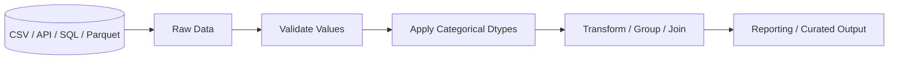
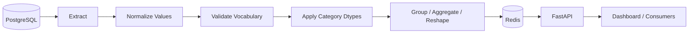

# 15- Categorical Data

## Overview

Pandas categorical data represents values from a finite, explicitly defined set of categories.

Instead of treating every value as an independent Python string or object, Pandas can store:

```text
Low
Medium
High
```

as a categorical column whose allowed values are explicitly known.

Categoricals are useful for two primary reasons:

1. **Semantic correctness** — a field such as `status`, `region`, or `customer_segment` has a known set of values.
2. **Efficiency** — repeated categorical values can often be represented more efficiently than generic object/string data.

Typical categorical fields include:

```text
status
region
country
customer_segment
order_state
environment
priority
department
```

Categorical data is particularly relevant to ETL and reporting pipelines because it combines schema validation, business semantics, ordering, grouping behavior, and memory optimization.

A useful mental model is:

```text
Raw values
    │
    ▼
Validate allowed values
    │
    ▼
Define category vocabulary
    │
    ▼
Convert to categorical dtype
    │
    ├── unordered categories
    │
    └── ordered categories
    │
    ▼
Group / sort / filter / report
```

---

## What Is a Categorical Column?

Consider:

```python
import pandas as pd

orders = pd.DataFrame(
    {
        "order_id": [1001, 1002, 1003, 1004],
        "status": [
            "pending",
            "completed",
            "pending",
            "cancelled",
        ],
    }
)
```

By default, `status` may be represented as a string-like dtype.

Convert it to categorical:

```python
orders["status"] = orders["status"].astype("category")
```

Inspect:

```python
print(orders["status"].dtype)
```

Typical output:

```text
category
```

The column now has an explicit category vocabulary:

```python
print(orders["status"].cat.categories)
```

Result:

```text
Index(['cancelled', 'completed', 'pending'], dtype='object')
```

The data values remain the same, but Pandas now knows that the column is categorical.

---

## Why Categorical Data Exists

A categorical column represents:

```text
values + category vocabulary
```

rather than only:

```text
values
```

For example:

```text
status values:
pending
completed
pending
cancelled
```

can be understood as:

```text
Categories:
pending
completed
cancelled

Rows:
0 → pending
1 → completed
2 → pending
3 → cancelled
```

This representation is especially useful when the same labels repeat many times.

The semantic benefit is equally important. A column declared as:

```text
priority = Low | Medium | High
```

communicates an expected vocabulary that can be validated and ordered.

---

## Converting to Categorical

The simplest approach is:

```python
orders["status"] = orders["status"].astype("category")
```

For controlled production schemas, define the categories explicitly.

```python
status_dtype = pd.CategoricalDtype(
    categories=[
        "pending",
        "processing",
        "completed",
        "cancelled",
    ],
    ordered=False,
)

orders["status"] = orders["status"].astype(status_dtype)
```

This is preferable when the valid vocabulary is part of the business contract.

---

## Explicit Categories Versus Inferred Categories

There is an important distinction between:

```python
orders["status"].astype("category")
```

and:

```python
status_dtype = pd.CategoricalDtype(
    categories=[
        "pending",
        "processing",
        "completed",
        "cancelled",
    ],
)

orders["status"] = orders["status"].astype(status_dtype)
```

The first form infers categories from the current data.

The second defines the allowed category set explicitly.

Suppose a batch only contains:

```text
pending
completed
```

Inferred categories contain only those observed values.

An explicit dtype can still contain:

```text
pending
processing
completed
cancelled
```

even when some categories do not occur in the current batch.

For stable ETL and reporting schemas, explicit category vocabularies are often safer.

---

## Ordered Versus Unordered Categories

Categories can be:

```text
unordered
```

or:

```text
ordered
```

For example:

```text
red
green
blue
```

normally has no natural ordering.

But:

```text
Low
Medium
High
```

does.

Create an ordered categorical dtype:

```python
priority_dtype = pd.CategoricalDtype(
    categories=[
        "Low",
        "Medium",
        "High",
    ],
    ordered=True,
)

tickets = pd.DataFrame(
    {
        "ticket_id": [1, 2, 3],
        "priority": [
            "Medium",
            "Low",
            "High",
        ],
    }
)

tickets["priority"] = tickets["priority"].astype(
    priority_dtype
)
```

Now comparisons and sorting can follow the defined category order.

---

## Why Ordering Matters

Without categorical ordering, string sorting produces lexical order:

```text
High
Low
Medium
```

That is usually not the desired business order.

With:

```python
ordered=True
```

Pandas understands:

```text
Low < Medium < High
```

For example:

```python
sorted_tickets = tickets.sort_values(
    "priority"
)
```

Result:

```text
Low
Medium
High
```

This is valuable for reporting, dashboards, queues, and operational workflows.

---

## Comparing Ordered Categories

Ordered categorical values can participate in comparisons:

```python
high_priority = tickets.loc[
    tickets["priority"] >= "Medium"
]
```

This works because `priority` has an explicit order.

Without an ordered categorical dtype, comparing strings using business meaning is unsafe:

```python
tickets["priority"] >= "Medium"
```

would be a lexical comparison rather than:

```text
priority severity
```

Do not rely on string ordering for domain semantics.

---

## Category Accessor

Categorical-specific operations are available through `.cat`.

Example:

```python
orders["status"].cat.categories
```

Useful properties and operations include:

```python
orders["status"].cat.categories
orders["status"].cat.ordered
orders["status"].cat.codes
```

The accessor provides methods for modifying category metadata and values.

---

## Category Codes

Categorical values are internally associated with integer-like codes.

Example:

```python
statuses = pd.Series(
    [
        "pending",
        "completed",
        "pending",
        "cancelled",
    ],
    dtype="category",
)

print(statuses.cat.codes)
```

The exact numeric codes depend on category ordering.

For example, conceptually:

```text
cancelled → 0
completed → 1
pending   → 2
```

The important point is:

> Category codes are implementation-oriented identifiers, not business values.

Do not persist or expose `cat.codes` as if the numbers themselves represented stable domain meanings.

Category ordering changes can change the codes.

---

## Never Use `cat.codes` as a Business ID

Avoid:

```python
orders["status_id"] = orders["status"].cat.codes
```

when `status_id` is expected to be a stable external identifier.

The code:

```text
0
1
2
```

is dependent on the category vocabulary and ordering.

Instead, use an explicit reference mapping:

```python
status_ids = {
    "pending": 10,
    "processing": 20,
    "completed": 30,
    "cancelled": 40,
}

orders["status_id"] = orders["status"].map(
    status_ids
)
```

This separates Pandas storage representation from business identifiers.

---

## Adding Categories

You can add categories with:

```python
orders["status"] = orders["status"].cat.add_categories(
    ["refunded"]
)
```

Now:

```python
print(orders["status"].cat.categories)
```

contains the new value.

Adding a category does not automatically insert it into any row.

This distinction is important:

```text
category vocabulary
```

and:

```text
observed values
```

are separate concepts.

---

## Removing Categories

Remove unused or obsolete categories:

```python
orders["status"] = orders["status"].cat.remove_categories(
    ["cancelled"]
)
```

If rows still contain the removed category, those values can become missing.

For example, if:

```text
cancelled
```

is removed from the vocabulary while records still use it, those observations cannot remain valid members of the categorical dtype.

Use this operation only when changing the category contract intentionally.

---

## Removing Unused Categories

A common batch-processing situation is:

```text
Configured categories:
pending
processing
completed
cancelled

Current batch:
completed
completed
pending
```

The current DataFrame may contain categories that are not observed.

Use:

```python
orders["status"] = (
    orders["status"]
    .cat.remove_unused_categories()
)
```

This can reduce category metadata.

However, do not remove unused categories if downstream code expects the full controlled vocabulary to remain available for reporting or validation.

---

## Renaming Categories

Rename category labels without changing the underlying grouping structure:

```python
orders["status"] = orders["status"].cat.rename_categories(
    {
        "pending": "Pending",
        "processing": "Processing",
        "completed": "Completed",
        "cancelled": "Cancelled",
    }
)
```

This is useful when internal codes and presentation labels differ.

A production system should still distinguish:

```text
canonical internal value
```

from:

```text
human-readable display label
```

when APIs, databases, or integrations depend on stable identifiers.

---

## Setting Categories

You can replace the category vocabulary:

```python
orders["status"] = orders["status"].cat.set_categories(
    [
        "pending",
        "processing",
        "completed",
        "cancelled",
        "refunded",
    ]
)
```

This can be useful when a stable schema must include categories that are absent from the current batch.

Be careful: changing the category set can turn values that are no longer valid into missing values.

Validate after changing categories:

```python
if orders["status"].isna().any():
    raise ValueError(
        "Invalid status values detected."
    )
```

---

## Category Validation

Explicit categories can be used as a validation boundary.

```python
allowed_statuses = [
    "pending",
    "processing",
    "completed",
    "cancelled",
]

status_dtype = pd.CategoricalDtype(
    categories=allowed_statuses,
    ordered=False,
)

orders["status"] = orders["status"].astype(
    status_dtype
)
```

Then detect invalid values:

```python
invalid = orders["status"].isna()

if invalid.any():
    raise ValueError(
        "Orders contain invalid status values."
    )
```

This works because values outside the declared category vocabulary cannot remain valid category members.

However, missing source values also become missing, so distinguish:

```text
missing source value
```

from:

```text
invalid category
```

before applying this pattern.

---

## Preserving Missing Versus Invalid Values

Suppose:

```python
orders = pd.DataFrame(
    {
        "status": [
            "pending",
            None,
            "unknown",
        ],
    }
)
```

Applying the categorical dtype:

```python
status_dtype = pd.CategoricalDtype(
    categories=[
        "pending",
        "completed",
    ],
)

orders["status"] = orders["status"].astype(
    status_dtype
)
```

produces missing values for both:

```text
None
unknown
```

At this point, the two failure modes are no longer distinguishable from the transformed column alone.

For strict validation, inspect the raw values first:

```python
raw_status = orders["status"]

allowed = {
    "pending",
    "completed",
}

missing_status = raw_status.isna()

invalid_status = (
    raw_status.notna()
    & ~raw_status.isin(allowed)
)

if invalid_status.any():
    raise ValueError(
        "Invalid status values detected."
    )
```

Then convert to categorical.

This preserves better error diagnostics.

---

## Categorical Data and Missing Values

Missing values can exist alongside categories.

Example:

```python
status_dtype = pd.CategoricalDtype(
    categories=[
        "pending",
        "completed",
        "cancelled",
    ],
)

statuses = pd.Series(
    [
        "pending",
        None,
        "completed",
    ],
    dtype=status_dtype,
)
```

The missing value is not itself a category.

Inspect:

```python
print(statuses.cat.categories)
```

The categories remain:

```text
pending
completed
cancelled
```

while:

```python
statuses.isna()
```

identifies missing observations.

This distinction is important when calculating report counts.

---

## Grouping Categorical Data

Categoricals can be particularly useful for grouped reporting.

Example:

```python
orders = pd.DataFrame(
    {
        "status": [
            "pending",
            "completed",
            "completed",
            "cancelled",
        ],
        "revenue": [
            100,
            500,
            700,
            50,
        ],
    }
)

orders["status"] = orders["status"].astype(
    pd.CategoricalDtype(
        categories=[
            "pending",
            "processing",
            "completed",
            "cancelled",
        ]
    )
)
```

Group:

```python
summary = (
    orders.groupby(
        "status",
        observed=True,
    )["revenue"]
    .sum()
)
```

`observed=True` is important when working with categorical groupers and only the categories actually present in the current data should participate in the grouping.

Depending on the report contract, you may intentionally want unobserved categories included instead. The choice is semantic, not merely a performance setting.

---

## Categories and `groupby()`

Suppose the configured category set is:

```text
pending
processing
completed
cancelled
```

but today's data only contains:

```text
completed
cancelled
```

A grouped result can either focus on observed categories or account for the complete category vocabulary.

For observed values:

```python
summary = (
    orders.groupby(
        "status",
        observed=True,
    )
    .size()
)
```

When a report requires all known categories, define the full output explicitly:

```python
summary = (
    orders.groupby(
        "status",
        observed=True,
    )
    .size()
    .reindex(
        [
            "pending",
            "processing",
            "completed",
            "cancelled",
        ],
        fill_value=0,
    )
)
```

This makes report behavior deterministic.

---

## Categorical Data and Sorting

Ordered categories are particularly useful in reports.

```python
priority_dtype = pd.CategoricalDtype(
    categories=[
        "Low",
        "Medium",
        "High",
        "Critical",
    ],
    ordered=True,
)

tickets["priority"] = tickets["priority"].astype(
    priority_dtype
)

tickets = tickets.sort_values(
    "priority"
)
```

The output follows the business-defined order:

```text
Low
Medium
High
Critical
```

This avoids repeated custom sorting expressions throughout the codebase.

---

## Category Ordering and Business Logic

A category order should represent a real domain rule.

Good:

```text
draft
review
approved
published
```

Questionable:

```text
apple
banana
orange
```

unless the ordering has business meaning.

Do not introduce `ordered=True` merely because it is available. An ordered categorical creates semantics that affect comparisons and sorting.

---

## Categorical Data and `value_counts()`

Categoricals work naturally with frequency analysis:

```python
status_counts = orders["status"].value_counts(
    sort=False
)
```

With an explicit category vocabulary, you can preserve expected category ordering.

For reporting:

```python
status_counts = (
    orders["status"]
    .value_counts(sort=False)
    .reindex(
        orders["status"].cat.categories,
        fill_value=0,
    )
)
```

This produces a deterministic category order.

---

## Categorical Data and Memory

Categoricals can reduce memory usage when:

- The column contains repeated values.
- The number of unique categories is relatively small.
- The category vocabulary is reused frequently.

Compare:

```python
orders["status"].memory_usage(
    deep=True
)
```

before and after:

```python
orders["status"] = orders["status"].astype(
    "category"
)

print(
    orders["status"].memory_usage(
        deep=True
    )
)
```

The actual savings depend on:

- Number of rows.
- Number of categories.
- String lengths.
- Existing dtype.
- Missing-value patterns.

Do not assume that categorical conversion always improves memory.

A high-cardinality column with nearly unique values may provide little benefit or may complicate processing unnecessarily.

---

## When Categorical Data Helps Most

Categoricals are particularly effective for columns such as:

```text
status
region
country
environment
department
channel
priority
customer_segment
```

when the dataset looks like:

```text
10 million rows
50 regions
```

rather than:

```text
10 million rows
9.5 million unique IDs
```

A useful heuristic is:

```text
Repeated low-cardinality values → strong categorical candidate
Mostly unique values → often poor categorical candidate
```

Measure actual memory usage rather than relying only on the heuristic.

---

## Categorical Data and Strings

Pandas also supports a dedicated `string` dtype:

```python
orders["status"] = orders["status"].astype("string")
```

This is appropriate when the column contains arbitrary textual values.

Use categorical when:

```text
finite vocabulary + repeated values + explicit category semantics
```

Use string when:

```text
arbitrary text + potentially unbounded values
```

---

## `category` Versus `string`

| Requirement | `string` | `category` |
| --- | --- | --- |
| Arbitrary text | Yes | Usually not ideal |
| Finite vocabulary | Possible | Excellent |
| Business ordering | No | Yes |
| Explicit categories | No | Yes |
| Memory optimization for repeated labels | Limited | Often strong |
| Category-specific operations | No | Yes |
| High-cardinality unique values | Often better | Usually unnecessary |
| Stable category contract | No | Yes |

The choice should be driven by data semantics and workload, not only memory optimization.

---

## Categorical Data and `cut()`

`cut()` naturally produces categorical output.

Example:

```python
orders["value_band"] = pd.cut(
    orders["order_value"],
    bins=[
        0,
        100,
        500,
        float("inf"),
    ],
    labels=[
        "Low",
        "Medium",
        "High",
    ],
    ordered=True,
)
```

This means the earlier `cut()` topic and categorical data are directly connected.

The resulting categories encode:

```text
Low < Medium < High
```

which can be reused for sorting and grouping.

---

## Categorical Data and `qcut()`

`qcut()` also produces categorical results:

```python
customers["value_quartile"] = pd.qcut(
    customers["lifetime_value"],
    q=4,
    labels=[
        "Q1",
        "Q2",
        "Q3",
        "Q4",
    ],
)
```

Inspect:

```python
print(
    customers["value_quartile"].cat.categories
)
```

This makes categorical operations useful for:

- Ranking.
- Reporting.
- Segment counts.
- Distribution analysis.

Remember that quantile-derived categories are distribution-dependent unless boundaries are subsequently frozen.

---

## Categorical Data in ETL

A robust ETL pipeline can establish category contracts early.



The key principle is:

```text
raw source values
    ↓
validate
    ↓
canonical category vocabulary
    ↓
transform
```

This prevents downstream code from independently inventing category values.

---

## API Normalization Example

Suppose a REST API returns:

```python
orders = pd.DataFrame(
    {
        "order_id": [1001, 1002, 1003],
        "status": [
            "pending",
            "completed",
            "completed",
        ],
        "channel": [
            "online",
            "retail",
            "online",
        ],
    }
)
```

Define canonical categories:

```python
status_dtype = pd.CategoricalDtype(
    categories=[
        "pending",
        "processing",
        "completed",
        "cancelled",
    ],
    ordered=False,
)

channel_dtype = pd.CategoricalDtype(
    categories=[
        "online",
        "retail",
        "partner",
    ],
    ordered=False,
)
```

Apply them:

```python
orders["status"] = orders["status"].astype(
    status_dtype
)

orders["channel"] = orders["channel"].astype(
    channel_dtype
)
```

Now the transformation layer has a controlled vocabulary for both dimensions.

---

## Database Integration

A PostgreSQL schema may constrain statuses:

```sql
CREATE TABLE orders (
    order_id BIGINT PRIMARY KEY,
    status TEXT NOT NULL,
    order_value NUMERIC(12, 2) NOT NULL
);
```

Pandas can mirror the application-level vocabulary:

```python
STATUS_VALUES = [
    "pending",
    "processing",
    "completed",
    "cancelled",
]

status_dtype = pd.CategoricalDtype(
    categories=STATUS_VALUES,
)
```

The database remains authoritative for persistence constraints, while Pandas validates the incoming batch earlier.

For systems with a dedicated reference table:

```text
order_status
------------
status_code
display_name
sort_order
active
```

a database or reference-data join may be preferable to hard-coding the vocabulary in multiple applications.

---

## Reference Tables Versus Categorical Dtypes

A categorical dtype is good for local representation and controlled transformations.

It is not a replacement for an authoritative reference table.

For example:

```text
PostgreSQL
order_status
    │
    ├── status_code
    ├── display_name
    ├── sort_order
    └── active
          │
          ▼
Pandas DataFrame
category dtype
```

Use a reference table when the vocabulary:

- Changes operationally.
- Has metadata.
- Is shared across services.
- Requires ownership and auditing.
- Has effective dates.
- Needs database-level governance.

Use categorical dtype to represent the already-established vocabulary efficiently inside Pandas.

---

## Categorical Data and Joins

Categoricals can participate in joins, but category metadata should be understood before relying on dtype-specific behavior.

Example:

```python
orders["region"] = orders["region"].astype(
    pd.CategoricalDtype(
        categories=[
            "East",
            "West",
            "North",
            "South",
        ]
    )
)

regions = pd.DataFrame(
    {
        "region": [
            "East",
            "West",
            "North",
            "South",
        ],
        "manager": [
            "Alice",
            "Bob",
            "Carol",
            "David",
        ],
    }
)

enriched = orders.merge(
    regions,
    on="region",
    how="left",
    validate="many_to_one",
)
```

The important concern is not the category dtype itself but ensuring that join keys have consistent canonical values.

Do not assume categorical typing automatically validates referential integrity.

---

## Category Alignment

Two categorical Series can represent the same logical field but have different category definitions.

For example:

```python
left["region"] = left["region"].astype(
    pd.CategoricalDtype(
        categories=["East", "West"]
    )
)

right["region"] = right["region"].astype(
    pd.CategoricalDtype(
        categories=["East", "West", "North"]
    )
)
```

These are not identical category definitions.

When category alignment matters, define the dtype once and reuse it:

```python
REGION_DTYPE = pd.CategoricalDtype(
    categories=[
        "East",
        "West",
        "North",
        "South",
    ],
    ordered=False,
)

left["region"] = left["region"].astype(
    REGION_DTYPE
)

right["region"] = right["region"].astype(
    REGION_DTYPE
)
```

This reduces subtle inconsistencies across pipeline stages.

---

## Centralizing Category Definitions

For a production application, category definitions should usually have one authoritative source.

Example:

```python
import pandas as pd

ORDER_STATUSES = [
    "pending",
    "processing",
    "completed",
    "cancelled",
]

ORDER_STATUS_DTYPE = pd.CategoricalDtype(
    categories=ORDER_STATUSES,
    ordered=False,
)
```

Then:

```python
orders["status"] = orders["status"].astype(
    ORDER_STATUS_DTYPE
)
```

This is preferable to recreating category lists independently in multiple modules.

For large systems, the source of truth may be:

```text
configuration
database reference table
schema registry
domain model
shared package
```

depending on the architecture.

---

## Categorical Data in Reporting

Suppose a report must always contain:

```text
Low
Medium
High
Critical
```

even when one category has zero observations.

Define:

```python
priority_dtype = pd.CategoricalDtype(
    categories=[
        "Low",
        "Medium",
        "High",
        "Critical",
    ],
    ordered=True,
)
```

Then:

```python
tickets["priority"] = tickets["priority"].astype(
    priority_dtype
)
```

Build the report:

```python
report = (
    tickets.groupby(
        "priority",
        observed=True,
    )
    .size()
    .reindex(
        priority_dtype.categories,
        fill_value=0,
    )
    .rename("ticket_count")
    .reset_index()
)
```

The output schema remains stable:

```text
priority   ticket_count
Low        15
Medium     24
High        8
Critical    0
```

This is particularly useful for dashboards and APIs.

---

## Performance and Grouping

Categorical grouping can provide performance benefits when the category set is small and reused heavily, but the exact performance depends on the workload and Pandas version.

Measure actual performance with representative data:

```python
import time

start = time.perf_counter()

result = (
    orders.groupby(
        "status",
        observed=True,
    )["revenue"]
    .sum()
)

elapsed = time.perf_counter() - start

print(f"Grouping took {elapsed:.3f}s")
```

Do not introduce categorical conversion solely because it is theoretically faster. Confirm the effect on the actual pipeline.

---

## Performance and Memory Strategy

For large ETL workloads:

```text
Load only required columns
        │
        ▼
Validate source values
        │
        ▼
Convert repeated dimensions to category
        │
        ▼
Filter / group / aggregate
        │
        ▼
Persist efficient format
```

Example:

```python
orders = pd.read_parquet(
    "orders.parquet",
    columns=[
        "order_id",
        "region",
        "status",
        "revenue",
    ],
)

orders["region"] = orders["region"].astype(
    "category"
)

orders["status"] = orders["status"].astype(
    "category"
)
```

This can reduce memory pressure when the dimensions have low cardinality.

---

## High-Cardinality Warning

Avoid categoricals indiscriminately.

Suppose:

```text
request_id
```

is unique for almost every row.

Converting it to `category` provides little benefit because the category vocabulary becomes nearly as large as the dataset itself.

Better:

```python
events["request_id"] = events["request_id"].astype(
    "string"
)
```

Use categorical dtype for bounded dimensions, not arbitrary identifiers.

---

## Copy and Mutation Behavior

Converting a column returns a new Series representation.

For example:

```python
orders["status"] = orders["status"].astype(
    "category"
)
```

mutates the DataFrame through explicit assignment.

Categorical-specific methods generally return a transformed object:

```python
normalized = orders["status"].cat.rename_categories(
    str.upper
)
```

The original Series is not modified unless you assign the result:

```python
orders["status"] = normalized
```

Make assignments explicit to avoid unclear transformation state.

---

## Data Cleaning Before Categorization

Do not categorize dirty input without first normalizing it.

Bad:

```python
orders["status"] = orders["status"].astype(
    status_dtype
)
```

when the source may contain:

```text
Pending
pending
 pending
PENDING
```

Normalize first:

```python
orders["status"] = (
    orders["status"]
    .astype("string")
    .str.strip()
    .str.lower()
)
```

Then apply the categorical dtype:

```python
orders["status"] = orders["status"].astype(
    status_dtype
)
```

Categorical dtype should usually be the canonical representation, not the first stage of messy-input cleanup.

---

## Case Normalization

A strong ETL pattern is:

```text
raw value
   ↓
trim whitespace
   ↓
normalize case
   ↓
map aliases
   ↓
validate allowed vocabulary
   ↓
categorical dtype
```

Example:

```python
STATUS_ALIASES = {
    "done": "completed",
    "complete": "completed",
    "in progress": "processing",
}

orders["status"] = (
    orders["status"]
    .astype("string")
    .str.strip()
    .str.lower()
    .replace(STATUS_ALIASES)
)
```

Then:

```python
orders["status"] = orders["status"].astype(
    ORDER_STATUS_DTYPE
)
```

This keeps source normalization separate from category enforcement.

---

## Invalid and Unexpected Categories

Monitor unexpected categories at ingestion.

```python
allowed = set(ORDER_STATUSES)

observed = set(
    orders["status"]
    .dropna()
    .unique()
)

unexpected = observed - allowed

if unexpected:
    raise ValueError(
        f"Unexpected order statuses: {sorted(unexpected)}"
    )
```

This is often more informative than discovering the same issue after conversion to categorical, where invalid values may simply become missing.

---

## Empty DataFrames

Empty datasets should preserve the intended categorical schema when downstream logic depends on it.

```python
orders = pd.DataFrame(
    {
        "order_id": pd.Series(dtype="int64"),
        "status": pd.Series(
            dtype=ORDER_STATUS_DTYPE
        ),
    }
)
```

Now:

```python
print(orders["status"].cat.categories)
```

still exposes the full allowed vocabulary.

This is valuable for scheduled jobs where one time window may legitimately contain zero rows.

---

## Parquet and Categorical Data

Categorical columns are often useful in analytical pipelines that eventually write Parquet.

Example:

```python
orders["status"] = orders["status"].astype(
    ORDER_STATUS_DTYPE
)

orders.to_parquet(
    "processed/orders.parquet",
    index=False,
)
```

When reading the data later, verify the resulting schema because downstream systems may represent categorical semantics differently.

Treat the file format schema and the application-level category contract as separate concerns.

For long-lived data pipelines, schema validation should occur after reading as well as before writing.

---

## CSV and Categorical Data

CSV is text-based and does not inherently preserve Pandas categorical metadata.

For example:

```python
orders.to_csv(
    "orders.csv",
    index=False,
)
```

When reloading:

```python
orders = pd.read_csv(
    "orders.csv",
)
```

the category dtype should not be assumed to be restored automatically.

Reapply the schema:

```python
orders["status"] = orders["status"].astype(
    ORDER_STATUS_DTYPE
)
```

This is an important distinction between the logical schema and the physical file format.

---

## Backend API Output

Do not expose the internal categorical dtype as an API concept.

A DataFrame can be converted to records:

```python
payload = orders.to_dict(
    orient="records"
)
```

The API contract should contain domain values:

```json
{
  "order_id": 1001,
  "status": "completed"
}
```

rather than:

```json
{
  "order_id": 1001,
  "status_code": 2
}
```

unless `2` is an explicitly defined domain identifier.

Categorical codes are storage details, not automatically API fields.

---

## Production Architecture

A practical reporting service might use categorical dimensions as part of a transformation layer:



The important separation is:

```text
database/reference schema
        ↓
canonical application values
        ↓
Pandas categorical representation
        ↓
reporting representation
```

Each layer has a different responsibility.

---

## Monitoring Categorical Data

Useful data-quality metrics include:

```text
invalid_category_count
missing_category_count
category_distribution
unused_category_count
unknown_source_value_count
category_cardinality
```

Example:

```python
distribution = (
    orders["status"]
    .value_counts(
        normalize=True,
        dropna=False,
        sort=False,
    )
)

print(distribution)
```

For an operational pipeline, alert on:

- Unexpected new categories.
- Large shifts in category proportions.
- Excessive missing values.
- Categories disappearing unexpectedly.
- Category cardinality increasing beyond the expected contract.

Category distribution can be an effective data-drift signal.

---

## Reliability Considerations

A category vocabulary should be treated as part of the data contract.

Suppose one service starts sending:

```text
completed
```

while another expects:

```text
complete
```

The resulting invalid or missing values may silently affect reports.

Use:

```text
canonical vocabulary
```

across the pipeline.

For distributed systems, consider maintaining the category vocabulary in a shared contract or reference-data service rather than allowing each producer and consumer to define slightly different values.

---

## Security Considerations

Categorical dtype itself does not provide security.

However, categories may represent sensitive classifications:

```text
fraud_risk
credit_risk
employee_level
customer_tier
medical_status
```

Do not assume that replacing raw numeric data with categories makes it safe to expose.

Apply the same:

- Authentication.
- Authorization.
- Tenant isolation.
- Data minimization.
- Audit.
- Retention policies.

to categorical fields as to the underlying source data.

---

## Common Mistakes

### Treating `category` as a Universal Optimization

Not every string column should become categorical.

High-cardinality or mostly unique fields may gain little from categorical representation.

Measure memory and performance with real data.

---

### Using `cat.codes` as a Persistent Identifier

This is unsafe:

```python
orders["status_id"] = orders["status"].cat.codes
```

Category codes are implementation-dependent.

Use explicit domain identifiers instead.

---

### Forgetting Category Ordering

This:

```python
status = status.astype("category")
```

does not automatically create business ordering.

For:

```text
Low
Medium
High
```

define an ordered categorical dtype.

---

### Removing Categories Without Checking Existing Values

This:

```python
orders["status"].cat.remove_categories(
    ["completed"]
)
```

can turn existing `completed` values into missing values.

Validate after modifying the category vocabulary.

---

### Applying Categories Before Cleaning

Values such as:

```text
" Pending "
"pending"
"PENDING"
```

can all represent the same business value but fail category validation if normalization has not occurred first.

Normalize before categorizing.

---

### Confusing Missing and Invalid Values

Converting raw data directly into a restrictive categorical dtype can turn both:

```text
None
```

and:

```text
unknown_status
```

into missing values.

Validate raw input before category conversion when distinguishing these cases matters.

---

### Assuming CSV Preserves Categories

CSV stores text, not Pandas categorical metadata.

Reapply the category schema after reading.

---

## Interview Traps

### What is a categorical dtype?

It represents values from a finite vocabulary of categories and can optionally define an ordering.

### Why can categoricals use less memory?

Repeated values can be represented through category metadata and compact codes rather than storing each repeated label independently.

### Should every string column be categorical?

No. Categoricals are most useful for low-cardinality, repeatedly occurring values with stable semantics.

### What is the difference between ordered and unordered categories?

Ordered categories define meaningful comparison and sorting semantics. Unordered categories do not.

### Are `cat.codes` stable IDs?

No. Category codes are representation details and can change when category definitions or ordering change.

### How do you define a controlled category vocabulary?

Use:

```python
pd.CategoricalDtype(
    categories=[...],
    ordered=...,
)
```

and apply it with `astype()`.

### Why validate before converting to categorical?

Invalid and missing values can both become missing after conversion, which can destroy useful error diagnostics.

### How do categoricals relate to `cut()`?

`cut()` returns categorical results, often with ordered categories when the bins have a natural sequence.

### How do categoricals affect `groupby()`?

Categorical groupers can use the defined category vocabulary, and `observed=True` can restrict grouping to categories actually present in the data.

---

## Recommended Engineering Pattern

Centralize category definitions and apply them after source normalization.

```python
import pandas as pd


ORDER_STATUSES = [
    "pending",
    "processing",
    "completed",
    "cancelled",
]

ORDER_STATUS_DTYPE = pd.CategoricalDtype(
    categories=ORDER_STATUSES,
    ordered=False,
)


def normalize_orders(
    orders: pd.DataFrame,
) -> pd.DataFrame:
    required_columns = {
        "order_id",
        "status",
        "order_value",
    }

    missing_columns = (
        required_columns.difference(orders.columns)
    )

    if missing_columns:
        raise ValueError(
            f"Missing columns: {sorted(missing_columns)}"
        )

    result = orders.copy()

    result["status"] = (
        result["status"]
        .astype("string")
        .str.strip()
        .str.lower()
    )

    allowed = set(ORDER_STATUSES)

    invalid = (
        result["status"].notna()
        & ~result["status"].isin(allowed)
    )

    if invalid.any():
        invalid_values = (
            result.loc[
                invalid,
                "status",
            ]
            .drop_duplicates()
            .tolist()
        )

        raise ValueError(
            f"Invalid status values: {invalid_values}"
        )

    result["status"] = result["status"].astype(
        ORDER_STATUS_DTYPE
    )

    result["order_value"] = pd.to_numeric(
        result["order_value"],
        errors="coerce",
    )

    if result["order_value"].isna().any():
        raise ValueError(
            "Invalid order_value values detected."
        )

    return result
```

This separates:

```text
schema validation
        ↓
value normalization
        ↓
business validation
        ↓
categorical representation
        ↓
downstream transformation
```

That separation makes the pipeline easier to test, debug, and evolve.

---

## Practical Checklist

Before introducing categorical data into a production pipeline, verify:

- The column has a finite or intentionally controlled vocabulary.
- Category definitions are owned and versioned appropriately.
- Raw values are normalized before category conversion.
- Missing values and invalid values are distinguished when required.
- Ordered categories are used only when ordering has domain meaning.
- `cat.codes` is never treated as a stable business identifier.
- High-cardinality columns are not converted without measuring the benefit.
- Grouping behavior with `observed` is intentional.
- CSV or other text formats do not rely on automatic dtype preservation.
- Empty batches preserve the intended schema where necessary.
- Category distributions are monitored for drift.
- Reference tables remain the authoritative source when categories have metadata or lifecycle rules.

---

## Key Takeaways

- Categorical dtype represents a controlled vocabulary and can improve both semantic correctness and memory efficiency for repeated, low-cardinality values.
- Define categories explicitly when the vocabulary is part of a production data contract; use ordered categories only when business ordering has real meaning.
- Normalize and validate raw values before converting to categorical so missing and invalid inputs are not conflated.
- Never use `cat.codes` as persistent business identifiers, and do not assume categorical conversion is beneficial for high-cardinality columns.
- Categorical data integrates naturally with `groupby()`, `cut()`, reporting, and ETL pipelines, but category definitions should remain consistent, testable, and observable across the system.