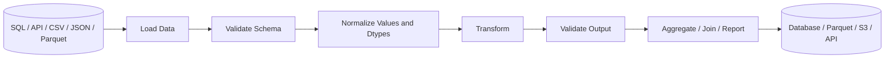
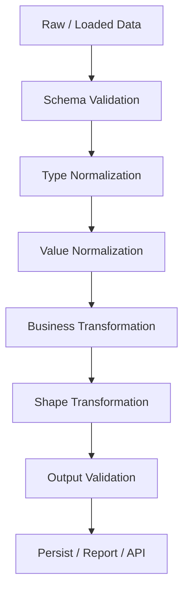

# Data Transformation

## Overview

Data transformation is the stage where validated Pandas data is converted into the structure required by downstream processing, reporting, analytics, APIs, databases, or other data systems.

The topics in this section focus on changing **values, labels, shape, and representation** without losing control of data semantics.

The section progresses from direct column transformations to more structural operations:

```text
Assignment and Transformation
        │
        ▼
Rename / Astype
        │
        ▼
Map / Apply / Elementwise Operations
        │
        ▼
Replace / Where / Mask
        │
        ▼
Assign
        │
        ▼
Melt / Pivot / Stack / Unstack
        │
        ▼
Explode
        │
        ▼
Cut / Qcut / Categorical Data

```

## Navigation

| # | File | Description |
|---|---|---|
| 01 | [01- Assignment And Transformation](./01-%20Assignment%20And%20Transformation.md) | Modify or derive columns |
| 02 | [02- Rename](./02-%20Rename.md) | Change labels | Schema normalization |
| 03 | [03- Astype](./03-%20Astype.md) | Enforce dtypes | Type normalization |
| 04 | [04- Map](./04-%20Map.md) | One-value-to-one-value mapping |
| 05 | [05- Apply](./05-%20Apply.md) | Custom Python transformation | Complex row/Series logic |
| 06 | [06- Applymap And Elementwise Operations](./06-%20Applymap%20And%20Elementwise%20Operations.md) | Apply map on elementwise operations |
| 07 | [07- Replace.md](./07-%20Replace.md) | Targeted value substitution | Canonicalization |
| 08 | [08- Where And Mask.md](./08-%20Where%20And%20Mask.md) | Conditional replacement | Business rules |
| 09 | [09- Assign.md](./09-%20Assign.md) | Chainable transformations | Transformation pipelines |
| 10 | [10- Melt.md](./10-%20Melt.md) | Wide → long | Data normalization |
| 11 | [11- Pivot And Pivot Table.md](./11-%20Pivot%20And%20Pivot%20Table.md) | Long → wide | Reporting |
| 12 | [12- Stack And Unstack.md](./12-%20Stack%20And%20Unstack.md) | Move axis levels | MultiIndex reshaping |
| 13 | [13- Explode.md](./13-%20Explode.md) | List values → rows | Nested API normalization |
| 14 | [14- Cut And Qcut.md](./14-%20Cut%20And%20Qcut.md) | Numeric → categories | Bucketing and segmentation |
| 15 | [15- Categorical Data.md](./15-%20Categorical%20Data.md) | Controlled category vocabulary | Memory and schema semantics |


The goal is not to memorize Pandas methods. The goal is to understand:

```text
Input schema
    ↓
Transformation semantics
    ↓
Output schema
    ↓
Business validation
    ↓
Performance and memory impact
```

---

## Why Data Transformation Matters

Real-world data rarely arrives in exactly the shape required by the next system.

An API may return:

```text
customer_id
name
status_code
```

while the application requires:

```text
customer_id
customer_name
status
```

A database may provide:

```text
order_date | region | revenue
```

while a report requires:

```text
order_date | East | West | North | South
```

A JSON payload may contain:

```text
order_id | product_ids
```

where `product_ids` is a list that must become multiple rows.

Data transformation provides the controlled boundary between these representations.

---

## Where This Section Fits

The broader Pandas progression is:

```text
Fundamentals
        ↓
Reading and Writing Data
        ↓
Selecting and Filtering
        ↓
Data Cleaning
        ↓
Data Transformation
        ↓
Grouping and Aggregation
        ↓
Combining Data
        ↓
Sorting, Ranking and Statistics
        ↓
Strings and Datetime
        ↓
Performance and Memory
        ↓
Backend and Data Engineering
        ↓
Interview Preparation
```

This section depends on concepts from:

- Pandas DataFrames and Series.
- Indexing and selection.
- Missing-value handling.
- Dtypes.
- Data cleaning.

It prepares the reader for:

- Grouped transformations.
- Joins and merges.
- Reporting.
- Large-dataset optimization.
- ETL pipelines.
- Backend integration.

---

## Section Structure

| Topic | Primary Concern | Typical Use |
| --- | --- | --- |
| Assignment And Transformation | Modify or derive columns | Calculated fields |
| Rename | Change labels | Schema normalization |
| Astype | Enforce dtypes | Type normalization |
| Map | One-value-to-one-value mapping | Code translation |
| Apply | Custom Python transformation | Complex row/Series logic |
| Applymap And Elementwise Operations | Cell-level transformation | Specialized scalar operations |
| Replace | Targeted value substitution | Canonicalization |
| Where And Mask | Conditional replacement | Business rules |
| Assign | Chainable transformations | Transformation pipelines |
| Melt | Wide → long | Data normalization |
| Pivot And Pivot Table | Long → wide | Reporting |
| Stack And Unstack | Move axis levels | MultiIndex reshaping |
| Explode | List values → rows | Nested API normalization |
| Cut And Qcut | Numeric → categories | Bucketing and segmentation |
| Categorical Data | Controlled category vocabulary | Memory and schema semantics |

---

## Transformation Principles

### Preserve Meaning

A transformation should not silently change the meaning of a field.

For example:

```python
orders["revenue"] = orders["revenue"] * 100
```

is dangerous if the original values were already stored in the required currency unit.

Before transforming, know:

```text
What does the source value mean?
What does the output value mean?
What unit does it use?
What dtype should it have?
```

---

### Keep Raw and Canonical Fields Distinct

For important pipelines, avoid overwriting source information unnecessarily.

Instead of:

```python
orders["status"] = (
    orders["status"]
    .str.lower()
)
```

consider retaining raw input when auditing is important:

```python
orders["status_raw"] = orders["status"]

orders["status"] = (
    orders["status"]
    .astype("string")
    .str.strip()
    .str.lower()
)
```

This is particularly useful for:

- External APIs.
- Financial pipelines.
- Data-quality investigations.
- Backfills.
- Compliance-sensitive workflows.

---

### Prefer Vectorized Operations

Prefer:

```python
orders["total"] = (
    orders["quantity"] * orders["unit_price"]
)
```

over:

```python
orders["total"] = orders.apply(
    lambda row: row["quantity"] * row["unit_price"],
    axis=1,
)
```

Vectorized Pandas operations are generally clearer and more efficient because they operate through optimized array-oriented implementations rather than invoking Python code once per row.

`apply()` remains useful when the transformation cannot be expressed naturally through vectorized operations.

---

### Make Transformations Explicit

Good:

```python
orders["gross_revenue"] = (
    orders["quantity"] * orders["unit_price"]
)

orders["net_revenue"] = (
    orders["gross_revenue"]
    - orders["discount"]
)
```

This is easier to test and debug than a deeply nested expression.

Explicit intermediate variables are especially valuable when transformation logic represents business rules.

---

## Transformation Categories

The operations in this section can be understood through five broad categories.

### Value Transformation

Changes values while preserving the overall table shape.

Examples:

```text
map()
apply()
replace()
where()
mask()
```

Example:

```python
orders["status"] = orders["status"].replace(
    {
        "done": "completed",
        "cancelled_by_user": "cancelled",
    }
)
```

---

### Schema Transformation

Changes labels or dtypes without necessarily changing row cardinality.

Examples:

```text
rename()
astype()
```

Example:

```python
orders = orders.rename(
    columns={
        "cust_id": "customer_id",
        "amt": "amount",
    }
)
```

These changes can affect downstream interfaces and should be treated as schema changes when the DataFrame crosses system boundaries.

---

### Derived-Column Transformation

Creates new fields from existing data.

Examples:

```text
assignment
assign()
vectorized arithmetic
conditional expressions
```

Example:

```python
orders["line_total"] = (
    orders["quantity"]
    * orders["unit_price"]
)
```

---

### Shape Transformation

Changes the arrangement or cardinality of the DataFrame.

Examples:

```text
melt()
pivot()
pivot_table()
stack()
unstack()
explode()
```

These operations require special attention because they can change:

- Row count.
- Column count.
- Index structure.
- Data grain.
- Memory consumption.

---

### Semantic Categorization

Transforms continuous or arbitrary values into controlled categories.

Examples:

```text
cut()
qcut()
CategoricalDtype
```

These operations are useful for reporting and segmentation but can introduce business semantics that should be explicitly defined and versioned.

---

## Transformation Data Flow

A typical production workflow is:



Transformation should normally happen after basic parsing and validation, not before the system understands what the incoming values represent.

---

## Assignment And Transformation

Assignment is the foundation of many Pandas transformations.

```python
orders["line_total"] = (
    orders["quantity"]
    * orders["unit_price"]
)
```

Important behavior includes:

- Assignment can align a Series by index.
- Lists and arrays are positional.
- Existing columns can be replaced.
- New columns can be created.
- Conditional assignment is commonly performed through `.loc`.
- The original DataFrame is mutated when direct assignment is used.

For more complex workflows:

```python
orders = orders.assign(
    line_total=lambda frame:
        frame["quantity"] * frame["unit_price"]
)
```

Use `assign()` when method chaining improves readability; direct assignment is often simpler for local mutations.

---

## Rename

`rename()` changes labels rather than row values.

```python
orders = orders.rename(
    columns={
        "cust_id": "customer_id",
        "amt": "amount",
    }
)
```

It is useful for:

- Normalizing API field names.
- Aligning database and application schemas.
- Preparing DataFrames for downstream interfaces.

A rename is more than cosmetic when a DataFrame feeds another system. Treat canonical column names as part of the interface contract.

---

## Astype

`astype()` explicitly converts dtype.

```python
orders["customer_id"] = orders["customer_id"].astype(
    "string"
)
```

For messy input, specialized parsers may be better:

```python
orders["amount"] = pd.to_numeric(
    orders["amount"],
    errors="coerce",
)
```

```python
orders["created_at"] = pd.to_datetime(
    orders["created_at"],
    errors="coerce",
    utc=True,
)
```

Keep dtype enforcement separate from business validation.

A value can have the correct dtype and still be invalid:

```text
-100
```

may be a valid integer but an invalid order amount.

---

## Map

`map()` is appropriate for one-value-to-one-value mappings.

```python
status_map = {
    "P": "pending",
    "C": "completed",
    "X": "cancelled",
}

orders["status"] = orders["status"].map(
    status_map
)
```

This is useful for:

- Status codes.
- Small reference mappings.
- Canonicalization.

Be aware that unmapped non-null values can become missing.

For large relational reference data, `merge()` is often more appropriate.

---

## Apply

`apply()` allows custom Python logic.

```python
def calculate_priority(row: pd.Series) -> str:
    if row["amount"] >= 5_000:
        return "high"

    if row["amount"] >= 1_000:
        return "medium"

    return "low"


orders["priority"] = orders.apply(
    calculate_priority,
    axis=1,
)
```

Use it when business logic is genuinely difficult to express with vectorized operations.

Avoid:

- Database calls inside `apply()`.
- HTTP requests inside `apply()`.
- Expensive external I/O.
- Large row-wise transformations when vectorization is possible.

Row-wise `apply(axis=1)` is Python-level execution and can become a major performance bottleneck.

---

## Elementwise Operations

Elementwise operations transform individual values.

Prefer native vectorized operations when possible:

```python
orders["amount_with_tax"] = (
    orders["amount"] * 1.18
)
```

For more specialized elementwise DataFrame behavior, modern Pandas provides DataFrame-level scalar mapping operations.

The engineering principle is:

```text
Native vectorized operation
    >
DataFrame-level elementwise operation
    >
row-wise apply()
    >
explicit Python loop
```

This is a guideline rather than an absolute rule. Readability and correctness remain primary.

---

## Replace, Where And Mask

These operations solve different transformation problems.

| Operation | Best Fit |
| --- | --- |
| `replace()` | Replace specific values |
| `where()` | Keep values meeting a condition |
| `mask()` | Replace values meeting a condition |

Example:

```python
orders["status"] = orders["status"].replace(
    {
        "done": "completed",
    }
)
```

Conditional replacement:

```python
orders["amount"] = orders["amount"].where(
    orders["amount"] >= 0
)
```

Equivalent replacement using `mask()`:

```python
orders["amount"] = orders["amount"].mask(
    orders["amount"] < 0
)
```

The distinction becomes important when implementing validation and business rules.

---

## Assign And Method Chaining

`assign()` is especially useful when transformations naturally form a sequence.

```python
result = (
    orders
    .assign(
        line_total=lambda frame:
            frame["quantity"] * frame["unit_price"]
    )
    .assign(
        discount_amount=lambda frame:
            frame["line_total"] * frame["discount_rate"]
    )
)
```

Later expressions in the same `assign()` call can reference columns created earlier in that call.

Use method chaining when it makes the pipeline easier to understand. Do not force every transformation into a chain.

---

## Reshaping Operations

Reshaping operations deserve additional care because they can change the grain of the dataset.

```text
Wide
  │
  ├── melt() ──────► Long
  │
  └── stack() ─────► MultiIndex representation

Long
  │
  ├── pivot() ─────► Wide
  ├── pivot_table() ► Aggregated Wide
  └── groupby()
          │
          └── unstack() ─► Wide
```

Before reshaping, answer:

```text
What is one row?
What should one output row represent?
What identifies a unique output cell?
Can duplicates exist?
What does a missing combination mean?
```

---

## Melt

`melt()` converts wide data into long data.

```python
long_data = sales.melt(
    id_vars=["region"],
    value_vars=["revenue", "profit"],
    var_name="metric",
    value_name="amount",
)
```

Use it when repeated measurements currently exist as separate columns.

Long format is often preferable for:

- Canonical storage.
- Grouping.
- Aggregation.
- Generic ETL transformations.

---

## Pivot And Pivot Table

`pivot()` performs strict long-to-wide reshaping:

```python
report = sales.pivot(
    index="date",
    columns="region",
    values="revenue",
)
```

`pivot_table()` adds aggregation:

```python
report = sales.pivot_table(
    index="date",
    columns="region",
    values="revenue",
    aggfunc="sum",
)
```

The main engineering distinction is duplicate-key behavior:

```text
pivot()
    → duplicate key → error

pivot_table()
    → duplicate key → aggregate according to aggfunc
```

Do not use aggregation merely to hide unexpected duplicates.

---

## Stack And Unstack

These operations work directly with index and column levels.

```text
stack()
Columns → Index

unstack()
Index → Columns
```

Example:

```python
grouped = (
    orders.groupby(
        ["date", "region"]
    )["revenue"]
    .sum()
)

report = grouped.unstack(
    "region"
)
```

This is particularly useful when working with MultiIndex results produced by grouping.

---

## Explode

`explode()` expands list-like values into rows.

```python
orders = pd.DataFrame(
    {
        "order_id": [1001, 1002],
        "product_ids": [
            [101, 102],
            [201],
        ],
    }
)

items = orders.explode(
    "product_ids",
    ignore_index=True,
)
```

The transformation changes row cardinality:

```text
1 input row
    ↓
N output rows
```

This is common for nested API responses and JSON normalization.

Be especially careful when multiple list columns are exploded independently because the result can become a Cartesian product.

---

## Cut And Qcut

`cut()` creates bins from explicit or equal-width boundaries.

```python
orders["value_band"] = pd.cut(
    orders["order_value"],
    bins=[
        0,
        100,
        500,
        float("inf"),
    ],
    labels=[
        "Low",
        "Medium",
        "High",
    ],
)
```

`qcut()` creates approximately equal-sized quantile groups:

```python
customers["value_quartile"] = pd.qcut(
    customers["lifetime_value"],
    q=4,
    labels=[
        "Q1",
        "Q2",
        "Q3",
        "Q4",
    ],
)
```

Use:

```text
cut()
    → business-defined boundaries

qcut()
    → distribution-relative boundaries
```

Do not use `qcut()` for a classification that must remain stable across changing datasets unless reference boundaries are deliberately frozen.

---

## Categorical Data

Categorical dtype represents a controlled vocabulary.

```python
status_dtype = pd.CategoricalDtype(
    categories=[
        "pending",
        "processing",
        "completed",
        "cancelled",
    ],
    ordered=False,
)

orders["status"] = orders["status"].astype(
    status_dtype
)
```

Categoricals are useful for:

- Low-cardinality dimensions.
- Stable vocabularies.
- Business ordering.
- Grouping.
- Memory optimization.

Avoid converting high-cardinality identifiers to categorical without measuring the benefit.

---

## Choosing the Right Transformation

Use the simplest operation that accurately represents the business intent.

```text
Need a new or modified column?
        │
        ├── Vectorized expression
        ├── map()
        ├── replace()
        ├── where() / mask()
        └── apply() when custom logic is necessary

Need to change labels?
        │
        └── rename()

Need to change dtype?
        │
        └── astype() / specialized parser

Need to change shape?
        │
        ├── melt()
        ├── pivot()
        ├── pivot_table()
        ├── stack()
        ├── unstack()
        └── explode()

Need numeric categories?
        │
        ├── cut()
        └── qcut()

Need controlled repeated categories?
        │
        └── categorical dtype
```

---

## Production Data Flow

A robust transformation layer should look like:



The important idea is that transformations occur in a deliberate order.

For example:

```text
CSV
 ↓
read_csv()
 ↓
dtype validation
 ↓
string normalization
 ↓
numeric parsing
 ↓
business transformation
 ↓
explode / pivot / melt
 ↓
output validation
 ↓
Parquet / PostgreSQL / API
```

---

## Data Quality During Transformation

Transformation code should validate the assumptions it depends on.

Example:

```python
required_columns = {
    "order_id",
    "quantity",
    "unit_price",
}

missing_columns = (
    required_columns.difference(orders.columns)
)

if missing_columns:
    raise ValueError(
        f"Missing columns: {sorted(missing_columns)}"
    )
```

After transformation:

```python
if orders["line_total"].isna().any():
    raise ValueError(
        "line_total contains unexpected missing values."
    )
```

Useful validation dimensions include:

| Validation | Example |
| --- | --- |
| Schema | Required columns exist |
| Type | Revenue is numeric |
| Range | Quantity is non-negative |
| Cardinality | Explode row count is expected |
| Uniqueness | Business keys remain unique |
| Completeness | Required values are not missing |
| Categories | Status belongs to allowed vocabulary |
| Reconciliation | Totals match before and after transformation |

---

## Performance Considerations

Transformations should be designed with data volume in mind.

### Prefer Vectorization

```python
orders["total"] = (
    orders["quantity"]
    * orders["unit_price"]
)
```

### Filter Before Expensive Expansion

```python
active_orders = orders.loc[
    orders["status"].eq("active")
]

items = active_orders.explode(
    "product_ids",
    ignore_index=True,
)
```

### Reduce Columns Before Reshaping

```python
items = orders[
    [
        "order_id",
        "customer_id",
        "product_ids",
    ]
].explode(
    "product_ids",
    ignore_index=True,
)
```

### Push Heavy Aggregation to SQL

Instead of loading millions of transactions:

```text
PostgreSQL
    ↓
filter + aggregate
    ↓
smaller result
    ↓
Pandas reshape
```

This can reduce network transfer, memory consumption, and processing time.

---

## Memory Considerations

Several operations can increase memory significantly:

```text
explode()
pivot()
pivot_table()
unstack()
melt()
```

The main risks are:

- Increased row count.
- Increased column count.
- Repeated parent fields.
- MultiIndex structures.
- Object-heavy data.
- Large intermediate DataFrames.

Measure memory:

```python
memory_bytes = orders.memory_usage(
    index=True,
    deep=True,
).sum()

print(f"{memory_bytes:,} bytes")
```

For large transformations, reduce unnecessary columns before reshaping and avoid retaining multiple large intermediate copies.

---

## Backend Integration

Transformation often sits between external systems and application or storage layers.

A typical service may be:

```text
REST API
   │
   ▼
JSON
   │
   ▼
Pandas
   │
   ├── normalize
   ├── transform
   ├── validate
   │
   ▼
PostgreSQL / Parquet / S3
```

For asynchronous processing:

```text
API / Event
    │
    ▼
Kafka / Queue
    │
    ▼
Celery Worker
    │
    ▼
Pandas Transformation
    │
    ▼
Database / Object Storage
```

Pandas should generally remain in the processing layer rather than becoming coupled to HTTP or message-transport concerns.

---

## Stable Schemas

A production transformation should produce predictable output.

For example, a regional report may require:

```python
expected_regions = [
    "East",
    "West",
    "North",
    "South",
]
```

After a pivot:

```python
report = report.reindex(
    columns=expected_regions,
    fill_value=0,
)
```

Stable schemas reduce failures in:

- APIs.
- CSV consumers.
- Automated report generation.
- Database loads.
- Data contracts.
- Snapshot tests.

---

## Idempotent Transformations

Many transformation functions should be deterministic:

```text
same input
    +
same transformation rules
    =
same output
```

This is especially important for:

- Batch processing.
- Backfills.
- Retryable jobs.
- Celery workers.
- Airflow-style workflows.
- CI/CD validation.

Avoid transformations that depend on:

```text
current wall-clock time
random state
external mutable services
unordered external responses
```

unless those dependencies are explicit inputs.

---

## Testing Strategy

Transformation tests should verify behavior, not merely successful execution.

Test:

```text
input schema
output schema
column names
row count
values
dtypes
missing-value behavior
duplicate handling
boundary conditions
empty input
invalid input
```

Example:

```python
def test_line_total_is_calculated() -> None:
    orders = pd.DataFrame(
        {
            "quantity": [2, 3],
            "unit_price": [100, 50],
        }
    )

    result = orders.assign(
        line_total=lambda frame:
            frame["quantity"] * frame["unit_price"]
    )

    assert result["line_total"].tolist() == [
        200,
        150,
    ]
```

For structural transformations, use Pandas testing utilities:

```python
from pandas.testing import assert_frame_equal
```

This allows tests to verify index, columns, values, and dtypes.

---

## Common Mistakes Across This Section

### Using `apply()` for Everything

Why it happens:

```text
Python function
```

feels easier than vectorized Pandas.

Better:

```text
native Pandas operation first
apply() only when necessary
```

---

### Mutating Data Without Understanding Index Alignment

Series assignment aligns by index.

```python
orders["discount"] = discounts
```

may not assign values positionally if the indexes differ.

Validate indexes before assignment.

---

### Hiding Data Quality Problems with Aggregation

Using:

```python
pivot_table(..., aggfunc="sum")
```

can hide unexpected duplicates.

Validate the expected grain first.

---

### Changing Shape Without Documenting Grain

After:

```python
explode()
```

or:

```python
groupby().unstack()
```

the meaning of one row can change.

Document and test the new grain.

---

### Converting Everything to Strings

Blind conversion:

```python
df = df.astype("string")
```

can destroy numeric and datetime semantics.

Choose dtypes according to business meaning.

---

### Using Too Many Intermediate Copies

Repeated:

```python
df = df.copy()
```

can increase memory pressure on large datasets.

Copy intentionally when isolation is needed; avoid defensive copying everywhere.

---

## Interview Focus

This section contains several common interview themes.

| Topic | Core Question |
| --- | --- |
| Assignment | How does Series index alignment affect assignment? |
| Rename | Does `rename()` modify values or dtypes? |
| Astype | When should `astype()` be replaced by parsing functions? |
| Map | What happens to unmapped values? |
| Apply | Why is row-wise `apply()` often slow? |
| Replace | How does it differ from `map()`? |
| Where / Mask | Which rows are replaced? |
| Assign | Why is it useful in method chains? |
| Melt | When should wide data become long? |
| Pivot | Why do duplicate keys fail? |
| Pivot Table | Why can aggregation hide data problems? |
| Stack / Unstack | How do they interact with MultiIndex? |
| Explode | How does it change row cardinality? |
| Cut / Qcut | Fixed thresholds versus quantiles |
| Categorical | When does category dtype improve memory and semantics? |

The strongest interview answers explain not only the API but also:

```text
data grain
index behavior
missing values
dtype behavior
performance
memory
production implications
```

---

## Recommended Engineering Pattern

For complex transformations, separate stages:

```python
def normalize_input(
    data: pd.DataFrame,
) -> pd.DataFrame:
    ...


def validate_input(
    data: pd.DataFrame,
) -> None:
    ...


def transform(
    data: pd.DataFrame,
) -> pd.DataFrame:
    ...


def validate_output(
    data: pd.DataFrame,
) -> None:
    ...


def build_dataset(
    data: pd.DataFrame,
) -> pd.DataFrame:
    validate_input(data)

    normalized = normalize_input(data)
    transformed = transform(normalized)

    validate_output(transformed)

    return transformed
```

This structure gives each transformation a clear responsibility and makes unit tests more targeted.

---

## Section Completion Standard

A strong understanding of this section means being able to take a realistic dataset and reason about its transformation without relying on trial and error.

The expected progression is:

```text
Understand DataFrame structure
        ↓
Perform safe column transformations
        ↓
Normalize labels and dtypes
        ↓
Apply controlled value mappings
        ↓
Implement conditional business rules
        ↓
Reshape long and wide data
        ↓
Normalize nested collections
        ↓
Create stable categories
        ↓
Validate output shape and semantics
        ↓
Optimize memory and execution
```

The objective is practical engineering competence: selecting the correct transformation based on data semantics, preserving correctness, and understanding the operational consequences of changing a dataset's values or shape.

---

## Key Takeaways

- Data transformation is the boundary where validated Pandas data is converted into the representation required by downstream systems, reports, or storage.
- Choose transformations based on semantics: value changes, schema changes, derived fields, shape changes, and categorical classification have different operational implications.
- Prefer vectorized operations, explicit intermediate transformations, stable schemas, and validation of row grain, dtypes, duplicates, and missing values.
- Reshaping operations such as `melt()`, `pivot_table()`, `stack()`, `unstack()`, and `explode()` can dramatically change cardinality and memory usage, so output shape must be reasoned about before execution.
- Production-quality transformation code should be deterministic, testable, observable, and separated from transport or persistence concerns.