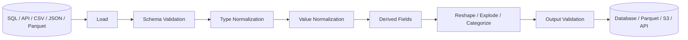
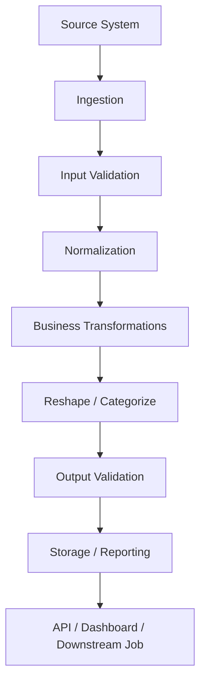

# Data Transformation

## Overview

The Data Transformation section covers the Pandas operations used to convert validated data into the structure, representation, and semantics required by downstream systems.

Transformation is where a DataFrame moves from:

```text
loaded and cleaned data
        ↓
canonical business representation
        ↓
derived fields
        ↓
reshaped structures
        ↓
reporting / storage / API output
```

The emphasis is on understanding the behavior and trade-offs of each operation rather than memorizing Pandas syntax.

Production transformation code should make four things explicit:

```text
Input grain
    ↓
Transformation rule
    ↓
Output grain / schema
    ↓
Validation
```

This becomes especially important when transformations change row cardinality, create hierarchical indexes, introduce categories, or alter dtypes.

---

## Why Data Transformation Matters

Real-world data rarely arrives in the exact representation required by downstream systems.

An API may return:

```text
cust_id
status_code
amount
```

while the application expects:

```text
customer_id
status
amount
```

A database may provide:

```text
date | region | revenue
```

while a report requires:

```text
date | East | West | North | South
```

A JSON API may return:

```text
order_id | product_ids
```

where `product_ids` contains multiple values and must become several rows.

Transformation provides the controlled boundary between these representations.

---

## Section Goals

This section develops the ability to:

```text
Modify DataFrames safely
        ↓
Create derived fields
        ↓
Normalize labels and dtypes
        ↓
Map and replace values
        ↓
Apply conditional business rules
        ↓
Reshape data
        ↓
Normalize nested structures
        ↓
Create categorical representations
        ↓
Validate transformed output
        ↓
Optimize transformation performance
```

The goal is practical engineering competence rather than isolated API knowledge.

---

## Topic Map

| File | Topic | Primary Purpose |
| --- | --- | --- |
| `01- Assignment And Transformation.md` | Assignment and transformation | Modify and derive columns |
| `02- Rename.md` | Rename | Normalize labels and schemas |
| `03- Astype.md` | Astype | Convert and enforce dtypes |
| `04- Map.md` | Map | One-to-one value mapping |
| `05- Apply.md` | Apply | Custom Python transformations |
| `06- Applymap And Elementwise Operations.md` | Elementwise operations | Scalar-level transformations |
| `07- Replace.md` | Replace | Targeted value substitution |
| `08- Where And Mask.md` | Where and mask | Conditional replacement |
| `09- Assign.md` | Assign | Chainable derived transformations |
| `10- Melt.md` | Melt | Wide → long reshaping |
| `11- Pivot And Pivot Table.md` | Pivot and pivot table | Long → wide reshaping |
| `12- Stack And Unstack.md` | Stack and unstack | MultiIndex reshaping |
| `13- Explode.md` | Explode | List-like values → rows |
| `14- Cut And Qcut.md` | Cut and qcut | Numeric bucketing |
| `15- Categorical Data.md` | Categorical data | Controlled categories and memory efficiency |

---

## How the Topics Fit Together

The section progresses from low-risk column operations toward transformations that can significantly change data shape.

```text
Assignment
    │
    ├── Create / modify values
    │
    ▼
Rename + Astype
    │
    ├── Normalize schema
    ├── Normalize dtypes
    │
    ▼
Map + Replace + Where + Mask
    │
    ├── Normalize values
    ├── Apply business rules
    │
    ▼
Apply + Assign
    │
    ├── Custom transformations
    ├── Maintainable transformation pipelines
    │
    ▼
Melt + Pivot + Stack + Unstack
    │
    ├── Change data shape
    ├── Change index / column structure
    │
    ▼
Explode
    │
    ├── Normalize nested collections
    ├── Increase row cardinality
    │
    ▼
Cut + Qcut + Categorical
    │
    ├── Create business segments
    ├── Represent controlled dimensions
    ▼
Production-ready transformed data
```

Each topic builds on concepts introduced earlier.

---

## Transformation Taxonomy

The operations in this section can be grouped by what they change.

| Transformation Type | Examples | Main Concern |
| --- | --- | --- |
| Value transformation | `map()`, `replace()`, `where()`, `mask()` | Correctness of values |
| Derived columns | assignment, `assign()`, vectorized expressions | Business logic |
| Custom logic | `apply()` | Flexibility vs performance |
| Schema transformation | `rename()`, `astype()` | Interface and dtype stability |
| Wide/long reshaping | `melt()`, `pivot()` | Data representation |
| Hierarchical reshaping | `stack()`, `unstack()` | MultiIndex structure |
| Cardinality transformation | `explode()` | Row-count growth |
| Numeric categorization | `cut()`, `qcut()` | Boundary semantics |
| Controlled dimensions | categorical dtype | Vocabulary, ordering, memory |

---

## Input and Output Grain

The most important question before any transformation is:

> What does one row represent?

For example:

```text
orders
------
one row = one order
```

After exploding line items:

```text
order_items
-----------
one row = one order item
```

After grouping:

```text
daily_region_sales
------------------
one row = one date + region
```

After pivoting:

```text
regional_report
---------------
one row = one date
one column = one region
```

These are different grains.

Transformation logic should document grain changes because many serious data-quality bugs are caused by applying the correct Pandas method to the wrong assumed grain.

---

## Transformation Data Flow

A production-oriented transformation layer commonly follows:



The order is not universal, but the general principle is:

```text
parse
→ validate
→ normalize
→ transform
→ reshape
→ validate again
```

Avoid performing complicated transformations on data whose basic schema and types are still uncertain.

---

## Value Transformations

### Assignment

Use direct assignment for straightforward derived fields:

```python
orders["line_total"] = (
    orders["quantity"]
    * orders["unit_price"]
)
```

This is usually the clearest option for simple local mutations.

---

### Map

Use `map()` for small, one-value-to-one-value mappings:

```python
status_map = {
    "P": "pending",
    "C": "completed",
    "X": "cancelled",
}

orders["status"] = orders["status"].map(
    status_map
)
```

Use a join against reference data when the lookup is relational, large, or contains additional attributes.

---

### Replace

Use `replace()` for targeted substitutions while preserving non-targeted values:

```python
orders["status"] = orders["status"].replace(
    {
        "done": "completed",
        "cancelled_by_user": "cancelled",
    }
)
```

This is often preferable when unknown values should remain visible rather than becoming missing.

---

### Where and Mask

Use conditional replacement when the rule depends on a boolean condition.

```python
orders["amount"] = orders["amount"].where(
    orders["amount"] >= 0
)
```

or:

```python
orders["amount"] = orders["amount"].mask(
    orders["amount"] < 0
)
```

The choice should reflect the business rule:

```text
where(condition)
    → preserve valid values

mask(condition)
    → replace invalid / targeted values
```

---

## Custom Transformations

### Apply

`apply()` is useful for logic that cannot be expressed cleanly with native Pandas operations.

```python
def classify_order(amount: float) -> str:
    if amount >= 5_000:
        return "high"

    if amount >= 1_000:
        return "medium"

    return "low"


orders["priority"] = orders["amount"].apply(
    classify_order
)
```

However, prefer vectorized operations whenever possible.

Avoid using `apply()` for:

- Database calls.
- HTTP requests.
- Redis operations.
- Kafka publishing.
- File I/O.
- Other expensive external operations.

The transformation layer should not turn one DataFrame operation into millions of external calls.

---

## Vectorization

Prefer:

```python
orders["total"] = (
    orders["quantity"]
    * orders["unit_price"]
)
```

over:

```python
orders["total"] = orders.apply(
    lambda row:
        row["quantity"] * row["unit_price"],
    axis=1,
)
```

Vectorization usually provides better performance and clearer intent.

The preferred hierarchy is generally:

```text
Native vectorized operation
        ↓
Specialized Pandas method
        ↓
DataFrame / Series apply
        ↓
Explicit Python loop
```

This is a practical optimization guideline rather than a requirement to sacrifice readability.

---

## Schema Transformations

### Rename

Use `rename()` to establish canonical field names:

```python
orders = orders.rename(
    columns={
        "cust_id": "customer_id",
        "amt": "amount",
    }
)
```

Schema changes matter when a DataFrame feeds:

- APIs.
- Database loaders.
- Parquet datasets.
- Other services.
- Scheduled reports.

A column rename should therefore be treated as an interface change when the DataFrame crosses a system boundary.

---

### Astype

Use `astype()` for explicit dtype conversion:

```python
orders["customer_id"] = orders["customer_id"].astype(
    "string"
)
```

For messy input, specialized parsing is often safer:

```python
orders["amount"] = pd.to_numeric(
    orders["amount"],
    errors="coerce",
)
```

```python
orders["created_at"] = pd.to_datetime(
    orders["created_at"],
    errors="coerce",
    utc=True,
)
```

Keep parsing, dtype enforcement, and business validation conceptually separate.

---

## Assign and Method Chaining

`assign()` is useful when transformations form a logical pipeline:

```python
result = (
    orders
    .assign(
        line_total=lambda frame:
            frame["quantity"] * frame["unit_price"]
    )
    .assign(
        net_total=lambda frame:
            frame["line_total"] - frame["discount"]
    )
)
```

It can improve:

- Readability.
- Composability.
- Testability.
- Reuse of intermediate transformations.

Do not use method chaining merely to reduce line count. A sequence of explicit assignments may be clearer for complex business logic.

---

## Reshaping Data

Reshaping changes how information is represented.

```text
Wide
 ├── melt() ─────────► Long
 └── stack() ────────► MultiIndex-oriented form

Long
 ├── pivot() ────────► Wide
 ├── pivot_table() ──► Aggregated Wide
 └── groupby()
       └── unstack() ─► Wide
```

Reshaping deserves more validation than a simple column calculation because it can change:

- Row count.
- Column count.
- Index structure.
- Data grain.
- Memory requirements.

---

## Melt

Use `melt()` when multiple columns represent repeated measurements.

```python
long_data = sales.melt(
    id_vars=["region"],
    value_vars=["revenue", "profit"],
    var_name="metric",
    value_name="amount",
)
```

Typical flow:

```text
Reporting table
       │
       ▼
     melt()
       │
       ▼
Canonical long representation
       │
       ▼
Group / filter / aggregate
```

Long form is frequently easier to store and transform.

---

## Pivot and Pivot Table

Use `pivot()` when each index/column combination is unique:

```python
report = sales.pivot(
    index="date",
    columns="region",
    values="revenue",
)
```

Use `pivot_table()` when aggregation is required:

```python
report = sales.pivot_table(
    index="date",
    columns="region",
    values="revenue",
    aggfunc="sum",
)
```

The central distinction is:

```text
pivot()
    duplicate key → error

pivot_table()
    duplicate key → aggregate
```

Do not use `pivot_table()` as a convenient way to conceal unexpected duplicate records.

---

## Stack and Unstack

These operations work with axis levels.

```text
stack()
Columns → Index

unstack()
Index → Columns
```

A common reporting pattern is:

```python
report = (
    orders.groupby(
        ["order_date", "region"]
    )["revenue"]
    .sum()
    .unstack("region")
)
```

This is particularly useful after `groupby()` produces a MultiIndex.

---

## Explode

Use `explode()` to convert list-like values into rows.

```python
orders = pd.DataFrame(
    {
        "order_id": [1001, 1002],
        "product_ids": [
            [101, 102],
            [201],
        ],
    }
)

items = orders.explode(
    "product_ids",
    ignore_index=True,
)
```

The transformation changes cardinality:

```text
one order
   ↓
many item rows
```

The most important concerns are:

- Output row count.
- Parent-key preservation.
- Empty lists.
- Missing values.
- Duplicate items.
- Memory amplification.

---

## Cut and Qcut

`cut()` creates bins using fixed boundaries:

```python
orders["value_band"] = pd.cut(
    orders["order_value"],
    bins=[
        0,
        100,
        500,
        float("inf"),
    ],
    labels=[
        "Low",
        "Medium",
        "High",
    ],
)
```

`qcut()` creates approximately equal-population bins:

```python
customers["value_quartile"] = pd.qcut(
    customers["lifetime_value"],
    q=4,
    labels=[
        "Q1",
        "Q2",
        "Q3",
        "Q4",
    ],
)
```

Use:

```text
cut()
    → stable business thresholds

qcut()
    → relative population segmentation
```

For production classification, determine whether the rules must remain stable across batches.

---

## Categorical Data

Categorical dtype represents a controlled vocabulary.

```python
status_dtype = pd.CategoricalDtype(
    categories=[
        "pending",
        "processing",
        "completed",
        "cancelled",
    ],
    ordered=False,
)

orders["status"] = orders["status"].astype(
    status_dtype
)
```

This provides:

- Explicit vocabulary.
- Optional ordering.
- Potential memory savings.
- Better semantics for low-cardinality dimensions.

Categorical dtype is especially useful for fields such as:

```text
status
region
channel
environment
priority
department
customer_segment
```

Avoid blindly converting high-cardinality identifiers.

---

## Transformation Contracts

For production pipelines, transformations should have explicit contracts.

A transformation contract should define:

```text
Input columns
Input dtypes
Input grain
Allowed values
Null behavior
Transformation rule
Output columns
Output dtypes
Output grain
Expected cardinality
Failure conditions
```

Example:

```text
Input:
    order_id: integer
    quantity: integer
    unit_price: decimal

Rule:
    line_total = quantity × unit_price

Output:
    order_id: integer
    quantity: integer
    unit_price: decimal
    line_total: decimal

Invariant:
    quantity >= 0
    unit_price >= 0
    line_total is not null
```

Explicit contracts make transformations easier to test and operate.

---

## Validation Strategy

Validate both before and after transformation.

### Input Validation

```python
required_columns = {
    "order_id",
    "quantity",
    "unit_price",
}

missing_columns = (
    required_columns.difference(orders.columns)
)

if missing_columns:
    raise ValueError(
        f"Missing columns: {sorted(missing_columns)}"
    )
```

### Business Validation

```python
if (orders["quantity"] < 0).any():
    raise ValueError(
        "Quantity cannot be negative."
    )
```

### Output Validation

```python
if orders["line_total"].isna().any():
    raise ValueError(
        "line_total contains unexpected nulls."
    )
```

For reshape operations, also validate:

```text
row count
column count
index structure
column structure
business-key uniqueness
aggregate reconciliation
```

---

## Missing Values

Transformations should distinguish between:

```text
missing
invalid
not applicable
zero
unknown
```

For example:

```python
orders["discount"] = orders["discount"].fillna(0)
```

is only correct if:

```text
missing discount = no discount
```

Likewise:

```python
report = orders.pivot_table(
    ...,
    fill_value=0,
)
```

is only correct when:

```text
missing combination = zero activity
```

Do not use missing-value replacement merely to eliminate `NaN` from output.

---

## Duplicate Records

Transformation does not automatically imply deduplication.

A duplicate row may represent:

- A legitimate repeated transaction.
- Two line items.
- A retry from an external API.
- A genuine source-system duplicate.

Use business keys:

```python
duplicate_mask = orders.duplicated(
    subset=["order_id"],
    keep=False,
)
```

Then decide whether duplicates should be:

```text
rejected
deduplicated
aggregated
retained
```

according to domain semantics.

---

## Unexpected Input

External input should be treated as untrusted data.

Examples include:

```text
unexpected status values
new API fields
missing columns
wrong dtypes
negative amounts
malformed timestamps
unexpected list lengths
new report dimensions
```

A reliable transformation pipeline should fail clearly when assumptions are violated.

Prefer:

```python
raise ValueError(
    "Unexpected order status values detected."
)
```

over allowing invalid data to propagate silently.

---

## Empty DataFrames

Empty input is a normal production condition for:

- Date ranges with no transactions.
- APIs returning no records.
- New accounts.
- Inactive tenants.
- Backfill gaps.
- Partitioned datasets.

Return a stable schema where downstream consumers depend on it.

```python
if orders.empty:
    return pd.DataFrame(
        columns=[
            "order_id",
            "line_total",
        ]
    )
```

For categorical or report-oriented output, preserve the intended categories and columns even when there are zero rows.

---

## SQL Integration

Many transformations can be partially or completely pushed into PostgreSQL.

For example, instead of transferring every transaction:

```sql
SELECT
    order_date,
    region,
    SUM(revenue) AS revenue
FROM orders
WHERE order_date >= %(start_date)s
  AND order_date < %(end_date)s
GROUP BY
    order_date,
    region;
```

Pandas can then perform the final report reshape:

```python
report = summary.pivot(
    index="order_date",
    columns="region",
    values="revenue",
)
```

This reduces:

- Network transfer.
- Pandas memory consumption.
- CPU usage in application workers.

Use Pandas where it provides meaningful transformation value rather than reproducing database functionality unnecessarily.

---

## API Integration

A common API-processing workflow is:

```text
REST API
   │
   ▼
JSON
   │
   ▼
json_normalize()
   │
   ▼
DataFrame
   │
   ├── clean
   ├── validate
   ├── map
   ├── explode
   └── categorize
   │
   ▼
Curated DataFrame
```

For nested responses:

```python
from pandas import json_normalize

records = json_normalize(
    payload["orders"]
)

records = records.explode(
    "items",
    ignore_index=True,
)
```

Additional normalization may then be required for nested dictionaries.

Keep API transport and Pandas transformation concerns separate.

---

## Parquet and Object Storage

Parquet is often a better intermediate representation for analytical pipelines than CSV because it preserves richer schema information and supports column-oriented access.

A transformation pipeline may be:

```text
S3 / Object Storage
       │
       ▼
Parquet
       │
       ▼
Pandas
       │
       ├── select columns
       ├── normalize
       ├── transform
       └── validate
       │
       ▼
Curated Parquet
```

Read only required columns:

```python
orders = pd.read_parquet(
    "orders.parquet",
    columns=[
        "order_id",
        "status",
        "quantity",
        "unit_price",
    ],
)
```

Reducing input width is often a simple and effective optimization.

---

## Performance Principles

### Filter Early

Prefer:

```python
active = orders.loc[
    orders["status"].eq("active")
]
```

before an expensive expansion.

---

### Select Required Columns

Prefer:

```python
items = orders[
    [
        "order_id",
        "customer_id",
        "product_ids",
    ]
]
```

before:

```python
items = items.explode(
    "product_ids",
    ignore_index=True,
)
```

---

### Aggregate Before Reshaping

Prefer:

```python
summary = (
    orders.groupby(
        ["date", "region"]
    )["revenue"]
    .sum()
)

report = summary.unstack("region")
```

when the report does not need transaction-level detail.

---

### Avoid Unnecessary Copies

Each intermediate DataFrame can consume additional memory.

Prefer a small number of intentional transformations over repeatedly calling:

```python
df = df.copy()
```

without a clear ownership reason.

---

## Memory Risk by Operation

| Operation | Typical Risk |
| --- | --- |
| Assignment | Usually low |
| `rename()` | Usually low |
| `astype()` | Can allocate new representation |
| `map()` | Depends on output dtype |
| `apply()` | CPU-heavy, potentially memory-heavy |
| `melt()` | Row count increases |
| `pivot()` | Column count can increase sharply |
| `pivot_table()` | Aggregation + wide output |
| `stack()` | New hierarchical representation |
| `unstack()` | Wide output explosion |
| `explode()` | Row count can increase dramatically |
| `cut()` | Usually moderate |
| Categorical conversion | Can reduce memory for suitable columns |

For large workloads, estimate output cardinality before executing expansive transformations.

---

## Scalability Boundaries

Pandas is an in-memory processing library.

Consider another execution engine when:

```text
dataset exceeds available memory
        OR
transformation is distributed by nature
        OR
database can execute the operation more efficiently
        OR
the output cardinality is too large for one process
```

Potential alternatives include:

- PostgreSQL.
- DuckDB.
- Spark.
- Distributed data-processing systems.
- Data warehouses.
- Precomputed reporting tables.

A common architecture is:

```text
Large Source Dataset
        │
        ▼
SQL / Distributed Aggregation
        │
        ▼
Reduced Dataset
        │
        ▼
Pandas Transformation
        │
        ▼
Report / API / Curated Storage
```

Pandas should be one component in the system, not automatically the entire system.

---

## Reliability and Idempotency

Transformation functions should ideally be deterministic:

```text
same input
+
same configuration
=
same output
```

Avoid hidden dependencies on:

```text
current time
random values
mutable external services
unordered external inputs
```

When transformations involve configurable rules, persist those rules alongside the processing metadata.

For recurring ETL jobs, this improves:

- Reproducibility.
- Backfills.
- Debugging.
- Incident recovery.
- Auditability.

---

## Monitoring

Transformation pipelines should expose operational metrics.

Useful metrics include:

```text
input_row_count
output_row_count
input_memory_bytes
output_memory_bytes
invalid_record_count
duplicate_record_count
missing_value_count
category_distribution
exploded_row_count
processing_duration
```

For financial or transactional datasets, include reconciliation metrics:

```text
source_total
transformed_total
output_total
```

Example:

```python
source_total = orders["revenue"].sum()

report_total = report.select_dtypes(
    include="number"
).sum().sum()

if source_total != report_total:
    raise ValueError(
        "Revenue reconciliation failed."
    )
```

The exact reconciliation logic depends on report dimensions and aggregation semantics.

---

## Testing Strategy

Each transformation should have focused automated tests.

Test:

```text
normal input
empty input
missing columns
invalid values
missing values
duplicates
boundary values
unexpected categories
row-count changes
dtypes
index behavior
column behavior
business invariants
```

For DataFrames, use:

```python
from pandas.testing import assert_frame_equal
```

Example:

```python
def test_total_calculation() -> None:
    orders = pd.DataFrame(
        {
            "quantity": [2, 3],
            "unit_price": [100, 50],
        }
    )

    result = orders.assign(
        line_total=lambda frame:
            frame["quantity"]
            * frame["unit_price"]
    )

    expected = pd.Series(
        [200, 150],
        name="line_total",
    )

    from pandas.testing import assert_series_equal

    assert_series_equal(
        result["line_total"],
        expected,
    )
```

Tests should verify business behavior, not merely whether Pandas raises an exception.

---

## Production Architecture

For a substantial transformation pipeline, keep responsibilities separated:



A practical Python project might separate:

```text
src/
├── ingestion.py
├── validation.py
├── normalization.py
├── transformation.py
├── reporting.py
└── pipeline.py
```

This makes individual transformation rules independently testable.

---

## Common Engineering Pitfalls

### Using `apply()` for Vectorizable Logic

Why it happens:

```text
Python functions feel easier to express.
```

Better:

```text
Check for native Pandas operations first.
```

---

### Treating Aggregation as Deduplication

Why it happens:

```text
pivot_table() eliminates duplicate-key errors.
```

Why it is dangerous:

```text
unexpected duplicates may indicate upstream corruption.
```

Validate expected grain before aggregation.

---

### Ignoring Row-Count Changes

Operations such as:

```text
explode()
melt()
groupby()
pivot()
```

can materially change dataset cardinality.

Always reason about expected input and output row counts.

---

### Using Dynamic Categories Without Schema Control

A report whose columns depend on the current batch can break downstream consumers.

Enforce expected categories or columns when the schema is contractual.

---

### Performing Heavy Pandas Work Inside HTTP Requests

Large transformations inside FastAPI or Django request handlers can cause:

- High latency.
- Worker exhaustion.
- Memory spikes.
- Timeouts.

Move expensive work to:

```text
Celery
scheduled jobs
batch pipelines
precomputed reports
```

and let the API serve prepared results.

---

## Security Considerations

Transformation code should not be responsible for establishing authorization boundaries.

For multi-tenant systems:

```text
Authenticate
    ↓
Authorize tenant / role
    ↓
Query permitted records
    ↓
Transform with Pandas
    ↓
Persist or return output
```

Do not load unrestricted data into Pandas and assume a later DataFrame filter is sufficient to enforce tenant isolation.

Also consider whether transformed data exposes sensitive attributes that were not present in the original interface.

For example:

```text
nested private metadata
        ↓
explode()
        ↓
separate database rows
        ↓
new API exposure risk
```

Data classification and access controls should apply to both raw and transformed representations.

---

## Practical Transformation Checklist

Before promoting a transformation to production, verify:

### Input

- Required columns exist.
- Dtypes are correct.
- Input grain is known.
- Allowed values are defined.
- Missing-value semantics are understood.
- Duplicate semantics are understood.

### Transformation

- The selected Pandas operation matches the intended business rule.
- Vectorized alternatives were considered.
- Row and column cardinality changes are understood.
- The transformation does not introduce unintended external I/O.
- Intermediate copies are justified.

### Output

- Column names are stable.
- Dtypes are appropriate.
- Row grain is documented.
- Business keys remain valid.
- Missing values are intentional.
- Important aggregates reconcile.
- External consumers receive the expected schema.

### Operations

- Processing duration is measurable.
- Memory usage is understood.
- Failure conditions are observable.
- Batch reruns are safe.
- Business rules are reproducible.
- Expensive work is not unnecessarily performed in synchronous API requests.

---

## Recommended Learning Order

Work through the files in order because the concepts build on one another:

```text
01- Assignment And Transformation
        ↓
02- Rename
        ↓
03- Astype
        ↓
04- Map
        ↓
05- Apply
        ↓
06- Applymap And Elementwise Operations
        ↓
07- Replace
        ↓
08- Where And Mask
        ↓
09- Assign
        ↓
10- Melt
        ↓
11- Pivot And Pivot Table
        ↓
12- Stack And Unstack
        ↓
13- Explode
        ↓
14- Cut And Qcut
        ↓
15- Categorical Data
```

The first half focuses primarily on values and schemas. The second half introduces increasingly structural transformations.

By the end of the section, the reader should be comfortable reasoning about both:

```text
"What value should this column contain?"
```

and:

```text
"What should one row and one column represent?"
```

The second question becomes increasingly important as transformation complexity increases.

---

## Section Completion Standard

A strong understanding of this section means being able to take a real dataset and determine:

```text
1. What is the input grain?
2. What is the desired output grain?
3. Which transformation expresses the business intent?
4. What happens to missing and invalid values?
5. What happens to duplicates?
6. How does the transformation affect dtypes?
7. How does it affect row and column cardinality?
8. What is the memory cost?
9. How should the result be validated?
10. Should the work happen in Pandas, SQL, or another processing engine?
```

The end state is not memorizing 15 APIs. It is being able to choose an appropriate transformation deliberately and defend that choice in a production code review.

---

## Key Takeaways

- Data transformation should be driven by explicit input grain, business semantics, output grain, schema requirements, and validation rules.
- Prefer vectorized Pandas operations and keep custom `apply()` logic for cases where native operations do not express the requirement clearly.
- Reshaping operations can change row cardinality, column cardinality, index structure, and memory usage, so structural effects must be treated as part of the transformation contract.
- Production transformation pipelines should validate values, dtypes, duplicates, missing data, output schemas, and important business invariants.
- Pandas is one processing layer within a larger system; push suitable filtering and aggregation into SQL or scalable processing engines when that improves performance, reliability, or cost.