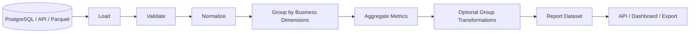

# README

## Overview

The Grouping and Aggregation section covers how Pandas converts row-level records into grouped summaries and group-aware transformations.

Grouping is one of the most important operations in data processing because many backend and analytics workloads require questions such as:

```text
How much revenue did each region generate?
How many orders did each customer place?
What is the average transaction value by payment method?
Which products exceeded a threshold within each category?
How should each row be transformed relative to its group?
```

The core Pandas abstraction is:

```text
Raw rows
   │
   ▼
Define grouping keys
   │
   ▼
Partition rows into groups
   │
   ├── aggregate each group
   ├── transform within each group
   ├── filter groups
   └── perform named / hierarchical aggregations
   │
   ▼
Grouped result
```

This section builds from the mechanics of `groupby()` toward production-oriented aggregation, transformation, validation, performance optimization, and interview problem solving.

---

## Why Grouping Matters

A transactional dataset is usually stored at a detailed grain:

```text
order_id | customer_id | region | product | revenue
---------|-------------|--------|---------|--------
1001     | 501         | East   | Laptop  | 1200
1002     | 501         | East   | Mouse   | 100
1003     | 502         | West   | Laptop  | 900
```

Business reporting often requires a different grain:

```text
customer_id | total_revenue | order_count
------------|---------------|------------
501         | 1300          | 2
502         | 900           | 1
```

Grouping provides the transition:

```text
transaction grain
      ↓
grouping keys
      ↓
group grain
      ↓
aggregation / transformation
```

The same concept appears throughout backend systems:

- SQL `GROUP BY`.
- Analytics pipelines.
- Financial reporting.
- Operational dashboards.
- Data quality checks.
- Event aggregation.
- Customer segmentation.
- Batch ETL.

---

## Section Structure

| File | Topic | Primary Concern |
| --- | --- | --- |
| `01- Groupby.md` | Groupby | Core grouping mechanics |
| `02- Groupby Keys.md` | Groupby keys | Choosing and controlling grouping dimensions |
| `03- Aggregation.md` | Aggregation | Reduce groups to summary values |
| `04- Agg.md` | `agg()` | Multiple aggregations and flexible aggregation |
| `05- Transform.md` | `transform()` | Group-aware results aligned to original rows |
| `06- Filter.md` | `filter()` | Keep or remove groups based on group-level rules |
| `07- Named Aggregation.md` | Named aggregation | Explicit output schemas |
| `08- Multiple Aggregations.md` | Multiple aggregations | Compute several metrics together |
| `09- Grouped Transformations.md` | Grouped transformations | Advanced per-group business logic |
| `10- Hierarchical Grouping.md` | Hierarchical grouping | Multi-level dimensions and MultiIndex |

---

## How the Topics Fit Together

The section progresses from grouping mechanics to increasingly sophisticated group-aware processing.

```text
groupby()
   │
   ▼
Choose grouping keys
   │
   ▼
Aggregate
   │
   ├── sum
   ├── mean
   ├── count
   ├── min / max
   └── custom metrics
   │
   ▼
agg()
   │
   ▼
Multiple / named aggregations
   │
   ▼
transform()
   │
   └── keep original row grain
   │
   ▼
filter()
   │
   └── filter complete groups
   │
   ▼
Hierarchical grouping
   │
   ▼
Production reporting / ETL
```

The critical distinction is whether a grouped operation:

```text
reduces rows
```

or:

```text
returns a result aligned to the original rows
```

That distinction drives the choice between `agg()`, `transform()`, and `filter()`.

---

## Core Grouping Mental Model

A `groupby()` operation can be understood as:

```text
split
  ↓
apply
  ↓
combine
```

For example:

```python
summary = (
    orders.groupby("region")["revenue"]
    .sum()
)
```

Conceptually:

```text
Input
───────────────────────────────
East   1200
East    800
West    900
West    700

        │
        ▼

Groups
───────────────────────────────
East → [1200, 800]
West → [900, 700]

        │
        ▼

Aggregation
───────────────────────────────
East → 2000
West → 1600
```

The resulting object has a different grain:

```text
one row per region
```

This is the fundamental behavior to understand before learning more advanced grouped operations.

---

## Grouping and Data Grain

Always identify the grain before grouping.

Suppose:

```text
orders
one row = one order
```

Grouping by:

```python
["customer_id"]
```

produces:

```text
one row = one customer
```

Grouping by:

```python
["customer_id", "month"]
```

produces:

```text
one row = one customer + month
```

Grouping by:

```python
["region", "product"]
```

produces:

```text
one row = one region + product
```

This is the same reasoning used when designing SQL queries and database schemas.

---

## SQL Equivalent

The Pandas expression:

```python
orders.groupby(
    "region"
)["revenue"].sum()
```

is conceptually similar to:

```sql
SELECT
    region,
    SUM(revenue) AS revenue
FROM orders
GROUP BY region;
```

Pandas is often useful after data is extracted from SQL:

```text
PostgreSQL
    │
    ▼
Filtered / pre-aggregated result
    │
    ▼
Pandas
    │
    ▼
Additional transformation
    │
    ▼
Report / API / Parquet
```

For very large datasets, prefer pushing appropriate filtering and aggregation into SQL before loading into Pandas.

---

## Groupby Syntax

The general structure is:

```python
data.groupby(
    by,
    as_index=True,
    sort=True,
    group_keys=True,
    observed=False,
    dropna=True,
)
```

The exact parameters required depend on the use case.

Basic example:

```python
summary = (
    orders.groupby("region")["revenue"]
    .sum()
)
```

Group by multiple columns:

```python
summary = (
    orders.groupby(
        ["region", "product"]
    )["revenue"]
    .sum()
)
```

Group several columns:

```python
summary = (
    orders.groupby("region")[
        ["revenue", "discount"]
    ]
    .sum()
)
```

---

## `as_index`

By default, grouping keys become the result index.

```python
summary = (
    orders.groupby("region")["revenue"]
    .sum()
)
```

Result:

```text
region
East    2000
West    1600
```

If an ordinary tabular result is preferred:

```python
summary = (
    orders.groupby(
        "region",
        as_index=False,
    )["revenue"]
    .sum()
)
```

Result:

```text
region  revenue
East      2000
West      1600
```

This is often convenient for downstream APIs, database writes, and CSV exports.

An alternative is:

```python
summary = (
    orders.groupby("region")["revenue"]
    .sum()
    .reset_index()
)
```

Choose one style consistently within a codebase.

---

## `sort`

Grouping results are commonly sorted by group keys.

If ordering is not required:

```python
summary = (
    orders.groupby(
        "region",
        sort=False,
    )["revenue"]
    .sum()
)
```

Skipping unnecessary sorting can reduce processing cost.

If deterministic ordering is part of a report contract, make it explicit:

```python
summary = (
    orders.groupby(
        "region",
        sort=False,
    )["revenue"]
    .sum()
    .sort_index()
)
```

This separates grouping from final presentation ordering.

---

## `dropna`

By default, missing grouping keys may be excluded from the grouping result.

Example:

```python
orders = pd.DataFrame(
    {
        "region": [
            "East",
            "West",
            None,
        ],
        "revenue": [
            1000,
            900,
            500,
        ],
    }
)
```

Grouping:

```python
summary = (
    orders.groupby(
        "region",
        dropna=False,
    )["revenue"]
    .sum()
)
```

The missing key can now be represented as a group.

This is important for data-quality reporting because dropping null grouping keys can hide records.

---

## Grouping by Multiple Keys

Multiple grouping keys create a hierarchical result.

```python
summary = (
    orders.groupby(
        ["region", "product"],
        as_index=False,
    )["revenue"]
    .sum()
)
```

Result:

```text
region  product    revenue
East    Laptop       2000
East    Mouse         300
West    Laptop       1600
West    Mouse         250
```

This produces a new grain:

```text
one row = one region + product
```

Before using the result, verify that this grain is actually what the downstream consumer expects.

---

## Grouping by the Index

Grouping can also operate on index levels.

```python
orders = orders.set_index(
    ["region", "product"]
)

summary = (
    orders.groupby(
        level="region"
    )["revenue"]
    .sum()
)
```

This becomes particularly useful when working with MultiIndex data produced by:

- `groupby()`.
- `pivot_table()`.
- `stack()`.
- `unstack()`.

Named index levels are easier to maintain than positional references:

```python
level="region"
```

is generally clearer than:

```python
level=0
```

---

## Grouping by Index Levels and Columns

You can combine different grouping dimensions.

For example:

```python
summary = (
    data.groupby(
        [
            "region",
            pd.Grouper(key="created_at", freq="M"),
        ]
    )["revenue"]
    .sum()
)
```

This is useful for time-aware reporting:

```text
region × month
```

The important principle is that grouping keys define the dimensional grain of the result.

---

## Grouping with Functions

A grouping key can be derived from another structure.

For example:

```python
orders["created_at"] = pd.to_datetime(
    orders["created_at"],
    utc=True,
)

summary = (
    orders.groupby(
        orders["created_at"].dt.to_period("M")
    )["revenue"]
    .sum()
)
```

For production pipelines, prefer explicit derived columns when the grouping rule is complex or reused:

```python
orders["order_month"] = (
    orders["created_at"].dt.to_period("M")
)

summary = (
    orders.groupby("order_month")["revenue"]
    .sum()
)
```

This makes the intermediate business concept visible and easier to test.

---

## Grouping by Categorical Data

Categorical dimensions such as:

```text
region
status
channel
priority
environment
```

can be effective grouping keys.

Example:

```python
status_dtype = pd.CategoricalDtype(
    categories=[
        "pending",
        "processing",
        "completed",
        "cancelled",
    ]
)

orders["status"] = orders["status"].astype(
    status_dtype
)

summary = (
    orders.groupby(
        "status",
        observed=True,
    )
    .size()
)
```

`observed=True` restricts the result to categories that occur in the current data.

For a report that needs every known category, explicitly reindex the result:

```python
summary = (
    orders.groupby(
        "status",
        observed=True,
    )
    .size()
    .reindex(
        status_dtype.categories,
        fill_value=0,
    )
)
```

---

## Groupby Objects

Calling `groupby()` does not immediately produce the final aggregated result.

```python
grouped = orders.groupby("region")
```

`grouped` is a grouped object that represents the partitioning operation.

You can then apply operations:

```python
grouped["revenue"].sum()
```

or:

```python
grouped["revenue"].mean()
```

This separation is useful when exploring or building reusable transformation stages.

Avoid assuming that creating a `GroupBy` object itself performs the expensive aggregation.

---

## Aggregation

Aggregation reduces each group to one or more summary values.

Common operations include:

```python
grouped["revenue"].sum()
```

```python
grouped["revenue"].mean()
```

```python
grouped["revenue"].min()
```

```python
grouped["revenue"].max()
```

```python
grouped["revenue"].count()
```

```python
grouped["customer_id"].nunique()
```

The central property is:

```text
many input rows
      ↓
one output row per group
```

---

## Multiple Aggregations

Use `agg()` when several metrics are required.

```python
summary = (
    orders.groupby("region")
    .agg(
        total_revenue=("revenue", "sum"),
        average_revenue=("revenue", "mean"),
        order_count=("order_id", "count"),
    )
    .reset_index()
)
```

Result:

```text
region  total_revenue  average_revenue  order_count
East          2000           1000.0            2
West          1600            800.0            2
```

Named aggregation produces a clean, stable output schema.

---

## Named Aggregation

Explicit output names are preferable for production reports.

```python
summary = (
    orders.groupby("customer_id")
    .agg(
        total_spend=("revenue", "sum"),
        order_count=("order_id", "nunique"),
        average_order_value=("revenue", "mean"),
    )
    .reset_index()
)
```

This avoids difficult-to-consume MultiIndex columns.

The result can be sent directly to:

- APIs.
- DataFrames used by downstream code.
- Parquet.
- Database staging tables.
- Reporting systems.

---

## `transform()`

`transform()` differs from aggregation because it returns a result aligned to the original DataFrame's index.

Example:

```python
orders["region_total"] = (
    orders.groupby("region")["revenue"]
    .transform("sum")
)
```

If the input is:

```text
region  revenue
East    1200
East     800
West     900
West     700
```

the transformed column becomes:

```text
region  revenue  region_total
East    1200          2000
East     800          2000
West     900          1600
West     700          1600
```

This is the key mental model:

```text
agg()
    group-level result

transform()
    original row count + group-aware values
```

---

## Group-Level Percentage Example

A common business calculation is each order's percentage of regional revenue.

```python
orders["region_total"] = (
    orders.groupby("region")["revenue"]
    .transform("sum")
)

orders["region_share"] = (
    orders["revenue"]
    / orders["region_total"]
)
```

This would be much harder to implement cleanly with a group-level aggregate because the result needs to remain aligned with every original order.

---

## `filter()`

`filter()` keeps or removes entire groups based on a group-level rule.

Example:

```python
large_regions = orders.groupby(
    "region"
).filter(
    lambda group:
        group["revenue"].sum() >= 10_000
)
```

The result retains complete rows from qualifying groups.

This differs from row-level filtering:

```python
orders.loc[
    orders["revenue"] >= 10_000
]
```

The latter filters individual records, while grouped `filter()` evaluates a condition for the whole group.

---

## Grouped Ranking

Group-aware ranking is a common transformation.

```python
orders["customer_rank"] = (
    orders.groupby("customer_id")["revenue"]
    .rank(
        ascending=False,
        method="dense",
    )
)
```

This produces a rank within each customer group.

The result remains aligned to the original rows.

Grouped ranking is useful for:

- Top products per category.
- Highest-value orders per customer.
- Regional performance rankings.
- Leaderboards.

---

## Grouped Top-N

Suppose each region should return its top three orders.

A grouped transformation can use:

```python
top_orders = (
    orders.sort_values(
        ["region", "revenue"],
        ascending=[True, False],
    )
    .groupby("region")
    .head(3)
)
```

This is generally clearer than trying to express every ranking requirement through a single aggregation.

The important point is to sort before selecting the group-level top rows.

---

## Grouped Cumulative Operations

Cumulative values can be calculated within groups.

```python
orders = orders.sort_values(
    ["customer_id", "created_at"]
)

orders["customer_running_total"] = (
    orders.groupby("customer_id")["revenue"]
    .cumsum()
)
```

This is useful for:

- Customer lifetime accumulation.
- Account balances.
- Inventory movement.
- Running operational metrics.

The ordering is part of the calculation. Always sort explicitly when the cumulative operation depends on chronology.

---

## Hierarchical Grouping

Multiple grouping dimensions create hierarchical results.

```python
summary = (
    orders.groupby(
        [
            "region",
            "channel",
            "product_category",
        ]
    )["revenue"]
    .sum()
)
```

Conceptually:

```text
region
  └── channel
       └── product_category
            └── revenue
```

This is useful when reporting dimensions naturally form multiple levels.

However, excessive dimensions can dramatically increase the number of groups and the size of the result.

---

## Group Cardinality

Before grouping, inspect the approximate number of groups.

```python
group_count = (
    orders[
        ["region", "channel", "product_category"]
    ]
    .drop_duplicates()
    .shape[0]
)

print(f"Expected group combinations: {group_count:,}")
```

High-cardinality grouping keys can create many groups:

```text
customer_id
× product_id
× timestamp
```

This may produce an enormous result and should be evaluated before executing the transformation on large datasets.

---

## Groupby and Missing Data

Missing grouping keys need explicit semantics.

For example:

```python
summary = (
    orders.groupby(
        "region",
        dropna=False,
    )["revenue"]
    .sum()
)
```

Now missing regions are not silently excluded.

For a data-quality report, this may be essential.

For a business report, you may instead intentionally exclude them.

The correct choice depends on the meaning of missing data.

---

## Aggregating Missing Values

Aggregation functions have their own missing-value behavior.

Example:

```python
summary = (
    orders.groupby("region")["revenue"]
    .sum()
)
```

Pandas generally ignores missing numeric observations during common aggregations.

If the distinction between:

```text
no observations
```

and:

```text
observations exist but values are missing
```

matters, validate missingness before aggregation.

For example:

```python
missing_revenue = orders["revenue"].isna().sum()

if missing_revenue:
    raise ValueError(
        f"Found {missing_revenue} missing revenue values."
    )
```

---

## `count()` Versus `size()`

These are common interview and production distinctions.

```python
orders.groupby("region")["revenue"].count()
```

counts non-null values in `revenue`.

Whereas:

```python
orders.groupby("region").size()
```

counts rows in each group.

Example:

```text
region  revenue
East    100
East    NaN
West    200
```

Then:

```text
count(revenue)
East    1
West    1
```

while:

```text
size()
East    2
West    1
```

Choose based on whether the metric means:

```text
number of rows
```

or:

```text
number of non-null observations
```

---

## `nunique()`

Use `nunique()` when the metric requires distinct entities.

```python
summary = (
    orders.groupby("region")
    ["customer_id"]
    .nunique()
)
```

This answers:

```text
How many unique customers purchased in each region?
```

It is different from:

```python
orders.groupby("region").size()
```

which counts rows.

---

## Combining Grouping Operations

A practical reporting workflow can combine grouping, transformation, and aggregation.

```python
orders = orders.copy()

orders["region_total"] = (
    orders.groupby("region")["revenue"]
    .transform("sum")
)

orders["regional_share"] = (
    orders["revenue"]
    / orders["region_total"]
)

summary = (
    orders.groupby("region")
    .agg(
        total_revenue=("revenue", "sum"),
        order_count=("order_id", "nunique"),
        average_share=("regional_share", "mean"),
    )
    .reset_index()
)
```

Each stage has a distinct responsibility.

This is easier to test than one large expression that hides multiple business rules.

---

## Groupby and Reporting

A report pipeline often follows:



Grouping should happen after the dimensions and measures have been normalized.

For example:

```text
region
status
channel
```

should be canonical before they become grouping keys.

---

## SQL Pushdown

If PostgreSQL can perform an aggregation efficiently, consider doing it in SQL.

Instead of:

```python
orders = pd.read_sql_query(
    "SELECT * FROM orders",
    connection,
)

summary = (
    orders.groupby("region")["revenue"]
    .sum()
)
```

prefer a query such as:

```sql
SELECT
    region,
    SUM(revenue) AS total_revenue
FROM orders
WHERE order_date >= %(start_date)s
  AND order_date < %(end_date)s
GROUP BY region;
```

and load only the reduced result:

```python
summary = pd.read_sql_query(
    query,
    connection,
    params={
        "start_date": start_date,
        "end_date": end_date,
    },
)
```

This can significantly reduce:

- Rows transferred.
- Pandas memory usage.
- Application CPU time.

Pandas remains useful when additional transformations are required after the database aggregation.

---

## Groupby and API Data

API ingestion often produces event-level records:

```python
events = pd.DataFrame(
    {
        "service": [
            "payments",
            "payments",
            "orders",
            "orders",
        ],
        "environment": [
            "prod",
            "staging",
            "prod",
            "staging",
        ],
        "latency_ms": [
            120,
            150,
            90,
            110,
        ],
    }
)
```

Aggregate by service and environment:

```python
summary = (
    events.groupby(
        ["service", "environment"]
    )
    .agg(
        average_latency_ms=(
            "latency_ms",
            "mean",
        ),
        max_latency_ms=(
            "latency_ms",
            "max",
        ),
        event_count=(
            "latency_ms",
            "count",
        ),
    )
    .reset_index()
)
```

The result is directly suitable for operational reporting or further reshaping.

---

## Groupby in Batch Processing

A daily ETL process might follow:

```text
Raw transactions
       │
       ▼
Filter / validate
       │
       ▼
Normalize dimensions
       │
       ▼
Group by reporting grain
       │
       ▼
Aggregate measures
       │
       ▼
Validate totals
       │
       ▼
Write curated dataset
```

Example:

```python
daily_sales = (
    orders.groupby(
        ["order_date", "region"]
    )
    .agg(
        total_revenue=("revenue", "sum"),
        order_count=("order_id", "nunique"),
    )
    .reset_index()
)
```

This output has an explicit grain:

```text
one row = one date + region
```

That should be part of the pipeline contract.

---

## Reconciliation

For financial or transactional reporting, validate the aggregate against source totals.

```python
source_total = orders["revenue"].sum()

daily_total = daily_sales["total_revenue"].sum()

if source_total != daily_total:
    raise ValueError(
        "Revenue reconciliation failed."
    )
```

The exact comparison may require tolerance for floating-point arithmetic or currency represented with decimal semantics.

For monetary data, prefer appropriate decimal or integer-unit representations where financial accuracy matters.

---

## Performance

Groupby performance depends on:

- Number of rows.
- Number of groups.
- Number of grouping keys.
- Key cardinality.
- Data types.
- Sorting.
- Aggregation functions.
- Memory availability.

A practical hierarchy is:

```text
Reduce input rows
    ↓
Reduce unnecessary columns
    ↓
Use efficient dtypes
    ↓
Use vectorized aggregations
    ↓
Avoid unnecessary sorting
    ↓
Push suitable work to SQL
```

---

## Avoid Row-Wise Grouping Logic

Avoid Python loops such as:

```python
results = []

for region in orders["region"].unique():
    region_orders = orders.loc[
        orders["region"] == region
    ]

    results.append(
        {
            "region": region,
            "revenue": region_orders["revenue"].sum(),
        }
    )
```

Prefer:

```python
results = (
    orders.groupby("region")
    .agg(
        revenue=("revenue", "sum"),
    )
    .reset_index()
)
```

The grouped expression is shorter, clearer, and generally more efficient.

---

## Memory Considerations

Grouping requires internal structures for:

- Grouping keys.
- Group membership.
- Aggregation state.
- Result construction.

High-cardinality group keys can consume substantial memory.

Avoid grouping on columns that are not required:

```python
orders.groupby(
    [
        "region",
        "channel",
        "product_category",
        "customer_id",
        "session_id",
    ]
)
```

unless the output grain truly requires every dimension.

Reducing dimensionality before grouping can dramatically reduce the number of groups.

---

## High-Cardinality Groups

This pattern is potentially expensive:

```python
summary = (
    events.groupby(
        [
            "customer_id",
            "request_id",
            "timestamp",
        ]
    )["latency_ms"]
    .mean()
)
```

If `request_id` and `timestamp` are nearly unique, grouping may produce almost one group per row.

In that case, the grouping operation provides little reduction and may consume significant memory for little benefit.

Review the intended grain before writing the groupby.

---

## Categorical Groupers and Memory

Categorical dimensions can reduce memory usage and may improve grouping efficiency for suitable low-cardinality datasets.

Example:

```python
orders["region"] = orders["region"].astype(
    "category"
)
```

Then:

```python
summary = (
    orders.groupby(
        "region",
        observed=True,
    )["revenue"]
    .sum()
)
```

Measure the effect using representative data rather than assuming categorical conversion always improves performance.

---

## Copy and Mutation Considerations

Grouped operations generally return new results.

For example:

```python
summary = (
    orders.groupby("region")["revenue"]
    .sum()
)
```

does not mutate `orders`.

A transformation can explicitly create a new column:

```python
orders["region_total"] = (
    orders.groupby("region")["revenue"]
    .transform("sum")
)
```

This mutation is intentional and visible.

Keep grouping logic separate from side effects where possible.

---

## Empty DataFrames

Empty batches should be handled deliberately.

A grouped aggregation may return an empty result with inferred structure that differs from the production contract.

For stable reporting:

```python
def build_region_summary(
    orders: pd.DataFrame,
) -> pd.DataFrame:
    columns = [
        "region",
        "total_revenue",
        "order_count",
    ]

    if orders.empty:
        return pd.DataFrame(
            columns=columns
        )

    return (
        orders.groupby(
            "region",
            as_index=False,
        )
        .agg(
            total_revenue=("revenue", "sum"),
            order_count=("order_id", "nunique"),
        )
    )
```

Stable schemas simplify downstream processing.

---

## Unexpected Input

Validate grouping columns before processing.

```python
required_columns = {
    "region",
    "revenue",
    "order_id",
}

missing = required_columns.difference(
    orders.columns
)

if missing:
    raise ValueError(
        f"Missing required columns: {sorted(missing)}"
    )
```

Validate values too:

```python
if orders["revenue"].isna().any():
    raise ValueError(
        "Revenue contains missing values."
    )
```

Groupby should not be used as a substitute for input validation.

---

## Testing Grouped Logic

Tests should validate the resulting business grain and metrics.

```python
import pandas as pd
from pandas.testing import assert_frame_equal


def test_region_summary() -> None:
    orders = pd.DataFrame(
        {
            "region": [
                "East",
                "East",
                "West",
            ],
            "order_id": [
                1001,
                1002,
                1003,
            ],
            "revenue": [
                100,
                200,
                300,
            ],
        }
    )

    actual = (
        orders.groupby(
            "region",
            as_index=False,
        )
        .agg(
            total_revenue=("revenue", "sum"),
            order_count=("order_id", "nunique"),
        )
        .sort_values("region")
        .reset_index(drop=True)
    )

    expected = pd.DataFrame(
        {
            "region": [
                "East",
                "West",
            ],
            "total_revenue": [
                300,
                300,
            ],
            "order_count": [
                2,
                1,
            ],
        }
    )

    assert_frame_equal(
        actual,
        expected,
    )
```

Tests should cover:

- Multiple groups.
- Single group.
- Missing grouping keys.
- Missing metric values.
- Duplicate business records.
- Empty input.
- High-cardinality input.
- Expected output grain.

---

## Testing `transform()`

For `transform()`, verify that the output remains aligned with the source row count.

```python
def test_region_total_is_aligned_to_rows() -> None:
    orders = pd.DataFrame(
        {
            "region": [
                "East",
                "East",
                "West",
            ],
            "revenue": [
                100,
                200,
                300,
            ],
        }
    )

    actual = (
        orders.groupby("region")["revenue"]
        .transform("sum")
    )

    expected = pd.Series(
        [300, 300, 300],
        name="revenue",
    )

    from pandas.testing import assert_series_equal

    assert_series_equal(
        actual,
        expected,
    )
```

The critical invariant is:

```text
len(transform_result) == len(source)
```

with corresponding index alignment.

---

## Common Mistakes

### Forgetting the Output Grain

Grouping by:

```python
["customer_id", "region"]
```

does not produce one row per customer.

It produces:

```text
one row per customer + region
```

Always document the output grain.

---

### Confusing `count()` and `size()`

`count()` usually ignores missing values in the selected column.

`size()` counts rows.

Choose according to the metric definition.

---

### Using `sum()` When Missing Means Unknown

A sum may hide missing observations depending on the data.

Validate completeness when missing values affect business correctness.

---

### Using `transform()` When Aggregation Is Required

`transform()` preserves the original row count.

If the desired result is:

```text
one row per group
```

use aggregation instead.

---

### Using Aggregation When Row-Level Values Are Required

If every order needs the regional total:

```python
orders["region_total"] = (
    orders.groupby("region")["revenue"]
    .transform("sum")
)
```

A plain `groupby().sum()` produces one value per group and cannot directly replace the original row-level data.

---

### Grouping on Too Many Dimensions

Excessive grouping keys can produce huge group cardinality.

Ask:

```text
Does every key belong in the desired output grain?
```

before grouping.

---

### Relying on Implicit Ordering

Do not assume grouped output is ordered in the way a report requires.

Sort explicitly when ordering is part of the output contract.

---

### Ignoring Null Grouping Keys

Default grouping behavior can exclude missing keys.

Use:

```python
dropna=False
```

when missing groups must be visible.

---

## Production Pitfalls

### Hidden Data Duplication

Suppose an upstream join accidentally duplicates every order.

A grouped sum can still execute successfully while producing an incorrect total.

Always validate the input grain before critical aggregations.

---

### Silent Schema Changes

Adding a grouping dimension changes output grain:

```text
region
```

becomes:

```text
region + channel
```

That can break downstream consumers even though the code still runs.

Treat grouping keys as part of the output schema.

---

### Expensive Python Aggregation Functions

Built-in aggregation functions such as:

```python
"sum"
"mean"
"count"
"min"
"max"
```

are generally preferable to custom Python functions when they express the requirement.

Custom Python aggregation can become a performance bottleneck on large datasets.

---

### Running Large Groupbys in API Workers

Avoid executing expensive aggregations synchronously inside request handlers.

A better architecture is:

```text
Scheduler / Event
        │
        ▼
Celery Worker
        │
        ▼
SQL filter / aggregate
        │
        ▼
Pandas transformation
        │
        ▼
Persisted result
        │
        ▼
FastAPI / Django
```

This protects request latency and application-worker capacity.

---

## Reliability and Idempotency

Grouping operations are naturally deterministic when:

- Input data is deterministic.
- Grouping keys are canonical.
- Aggregation functions are deterministic.
- Transformation parameters are fixed.

For batch processing, this makes retries and backfills easier.

Persist:

```text
source partition
processing date
rule/configuration version
input row count
output row count
```

when the transformation is operationally important.

---

## Monitoring Grouped Pipelines

Useful metrics include:

```text
input_row_count
output_group_count
distinct_key_count
null_group_key_count
duplicate_business_key_count
aggregation_duration
output_memory_bytes
source_total
output_total
```

Example:

```python
group_count = (
    orders[["region"]]
    .drop_duplicates()
    .shape[0]
)

print("Groups:", group_count)
```

Unexpected group-count changes can indicate:

- New source dimensions.
- Data duplication.
- Missing partition filters.
- Upstream schema changes.
- Data drift.

---

## Security Considerations

Grouping does not provide authorization or tenant isolation.

For multi-tenant data:

```text
Authenticate
    ↓
Authorize tenant
    ↓
Query permitted records
    ↓
Group / aggregate
    ↓
Return permitted metrics
```

Never load cross-tenant raw records and assume a later groupby will protect tenant boundaries.

Also consider aggregation-based information leakage. Highly granular reports can expose individual customer behavior even when no direct identifier is returned.

Apply access-control and aggregation policies appropriate to the data's sensitivity.

---

## Cost Considerations

Grouping large datasets consumes CPU and memory.

Costs can be reduced by:

- Filtering early.
- Selecting only required columns.
- Aggregating in SQL where appropriate.
- Using efficient dtypes.
- Avoiding unnecessary sorting.
- Processing only required time partitions.
- Precomputing recurring reports.
- Caching stable summary results.

For AWS-based pipelines, a common pattern is:

```text
S3 / PostgreSQL
      │
      ▼
Partition-pruned input
      │
      ▼
SQL / distributed aggregation
      │
      ▼
Reduced dataset
      │
      ▼
Pandas
      │
      ▼
Curated Parquet / report
```

The cheapest computation is often the one performed after unnecessary data has already been eliminated.

---

## Choosing Between Group Operations

| Requirement | Operation |
| --- | --- |
| Group records | `groupby()` |
| Reduce each group to metrics | `agg()` / aggregation |
| Return group metric for every original row | `transform()` |
| Keep only groups satisfying a condition | `filter()` |
| Compute several named metrics | named `agg()` |
| Work across multiple dimensions | multi-key `groupby()` |
| Work with hierarchical indexes | grouping by index levels |
| Reshape grouped results | `unstack()` |
| Create report matrices | `pivot_table()` |

The key distinction is output cardinality:

```text
Aggregation
    ↓
one result per group

Transform
    ↓
one result per original row

Filter
    ↓
original rows from qualifying groups
```

---

## Recommended Learning Path

Work through the files in order:

```text
01- Groupby
    ↓
02- Groupby Keys
    ↓
03- Aggregation
    ↓
04- Agg
    ↓
05- Transform
    ↓
06- Filter
    ↓
07- Named Aggregation
    ↓
08- Multiple Aggregations
    ↓
09- Grouped Transformations
    ↓
10- Hierarchical Grouping
```

The first topics establish the grouping model. The middle topics focus on producing reliable metrics and group-aware values. The final topics deal with more complex dimensions and hierarchical data.

---

## Section Completion Standard

After completing this section, the reader should be able to reason about grouping in terms of:

```text
Input grain
    ↓
Grouping keys
    ↓
Group cardinality
    ↓
Aggregation / transformation / filtering
    ↓
Output grain
    ↓
Validation
    ↓
Performance
```

Given a real production problem, the reader should be able to determine:

```text
Which columns define the group?
What does one output row represent?
Should the operation reduce rows?
Should the result remain aligned to the original rows?
How should null keys behave?
How should duplicates be handled?
Can the operation be pushed into SQL?
What cardinality and memory cost should be expected?
How should the result be validated?
```

This is the practical skill the section is intended to build: using Pandas grouping as a deliberate data-processing operation rather than treating `groupby()` as a collection of unrelated methods.

---

## Key Takeaways

- Grouping starts with defining the correct business grain; grouping keys determine what one output group and, therefore, one output row represent.
- Use aggregation when reducing each group to summary metrics, `transform()` when group-level values must remain aligned with original rows, and `filter()` when entire groups should be retained or removed.
- Treat null keys, duplicate records, category behavior, ordering, and high-cardinality dimensions as explicit data-engineering concerns rather than incidental Pandas behavior.
- For large workloads, reduce data before grouping, use efficient dtypes, avoid unnecessary sorting, and push suitable filtering and aggregation into SQL or scalable processing engines.
- Production grouped pipelines should validate input grain, output grain, row and group counts, important aggregates, schemas, and business invariants while keeping transformation logic deterministic and testable.