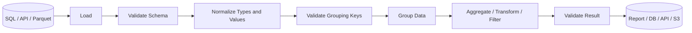
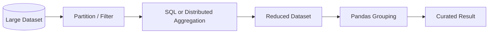

# README

## Overview

The Grouping and Aggregation section covers how Pandas partitions records into logical groups and then computes group-level metrics or group-aware transformations.

Grouping is fundamental to backend data processing because transactional data is usually stored at a detailed grain, while reports and business operations require summarized views.

Typical questions include:

```text
How much revenue did each region generate?
How many orders did each customer place?
What is the average transaction value by channel?
Which products are the top performers within each category?
Which groups meet a business threshold?
What is each row's percentage of its group total?
```

The central Pandas operation is `groupby()`:

```text
Detailed rows
     │
     ▼
Grouping keys
     │
     ▼
Logical groups
     │
     ├── Aggregate
     ├── Transform
     ├── Filter
     └── Reshape
     │
     ▼
Business result
```

The section moves from basic grouping mechanics to multi-dimensional grouping, custom aggregations, group-aware transformations, and production-oriented performance and validation.

---

## Why Grouping Matters

Consider an order dataset:

```text
order_id | customer_id | region | product | revenue
---------|-------------|--------|---------|--------
1001     | 501         | East   | Laptop  | 1200
1002     | 501         | East   | Mouse   | 100
1003     | 502         | West   | Laptop  | 900
1004     | 503         | West   | Phone   | 700
```

The source grain is:

```text
one row = one order
```

A business report may require:

```text
customer_id | total_revenue | order_count
------------|---------------|------------
501         | 1300          | 2
502         | 900           | 1
503         | 700           | 1
```

Grouping changes the analytical grain:

```text
order
  ↓
customer
```

Or:

```text
order
  ↓
region + month
```

The same reasoning applies to SQL `GROUP BY`, data warehouses, financial systems, event processing, and operational dashboards.

---

## Section Structure

| File | Topic | Primary Concern |
| --- | --- | --- |
| `01- Groupby.md` | `groupby()` | Core grouping mechanics |
| `02- Groupby Keys.md` | Grouping keys | Choosing and controlling dimensions |
| `03- Aggregation.md` | Aggregation | Reducing groups to metrics |
| `04- Agg.md` | `agg()` | Multiple and custom aggregations |
| `05- Transform.md` | `transform()` | Group-aware values aligned to source rows |
| `06- Filter.md` | `filter()` | Filtering complete groups |
| `07- Named Aggregation.md` | Named aggregation | Stable output schemas |
| `08- Multiple Aggregations.md` | Multiple aggregations | Several metrics from the same groups |
| `09- Grouped Transformations.md` | Grouped transformations | Advanced per-group logic |
| `10- Hierarchical Grouping.md` | Hierarchical grouping | Multi-level dimensions and MultiIndex |

---

## How the Topics Fit Together

The topics build on a single core model:

```text
groupby()
   │
   ▼
Define grouping keys
   │
   ▼
Understand groups
   │
   ├── aggregate
   │      ↓
   │   one result per group
   │
   ├── transform
   │      ↓
   │   one result per original row
   │
   └── filter
          ↓
      retain qualifying groups
```

More advanced topics extend this model:

```text
Single grouping key
        ↓
Multiple grouping keys
        ↓
Multiple metrics
        ↓
Named output schema
        ↓
Group-relative calculations
        ↓
Hierarchical / MultiIndex grouping
```

The most important distinction is whether a grouped operation:

```text
reduces the number of rows
```

or:

```text
preserves the original row alignment
```

That determines whether an aggregation or transformation is appropriate.

---

## Core Concepts

### Grouping Keys

Grouping keys define the dimensions of the result.

Example:

```python
orders.groupby("region")
```

produces:

```text
one group per region
```

While:

```python
orders.groupby(
    ["region", "channel"]
)
```

produces:

```text
one group per region + channel combination
```

The number and cardinality of grouping keys directly affect:

- Output grain.
- Number of groups.
- Memory usage.
- Processing time.
- Result size.

---

### Aggregation

Aggregation reduces each group to one or more values.

```python
summary = (
    orders.groupby("region")["revenue"]
    .sum()
)
```

Conceptually:

```text
many orders
    ↓
one region
    ↓
one revenue total
```

Common aggregations include:

```text
sum
mean
min
max
count
nunique
median
std
var
```

Aggregation is appropriate when the output grain is group-level.

---

### Transform

`transform()` computes a group-aware value while preserving the original row count.

```python
orders["region_total"] = (
    orders.groupby("region")["revenue"]
    .transform("sum")
)
```

Result:

```text
region  revenue  region_total
East    1200          1300
East     100          1300
West     900          1600
West     700          1600
```

This is useful when each original row needs access to a group-level metric.

---

### Filter

`filter()` decides whether an entire group should remain.

```python
large_regions = orders.groupby(
    "region"
).filter(
    lambda group:
        group["revenue"].sum() >= 10000
)
```

This differs from row filtering:

```python
orders.loc[
    orders["revenue"] >= 10000
]
```

The first evaluates groups. The second evaluates individual rows.

---

## Data Grain

Grain should be treated as an explicit design concept.

Example:

```text
Source:
one row = one transaction

Group by:
customer_id

Output:
one row = one customer
```

Another:

```text
Source:
one row = one order

Group by:
region + order_month

Output:
one row = one region + month
```

Before writing a grouped transformation, answer:

```text
What does one input row represent?
What should one output row represent?
Which keys define that output?
Can duplicate keys exist?
How should missing keys behave?
```

This prevents many subtle reporting and financial-data errors.

---

## SQL Relationship

Pandas grouping closely corresponds to SQL aggregation.

Pandas:

```python
summary = (
    orders.groupby("region")["revenue"]
    .sum()
)
```

SQL:

```sql
SELECT
    region,
    SUM(revenue) AS total_revenue
FROM orders
GROUP BY region;
```

Pandas becomes especially useful when the processing pipeline is:

```text
PostgreSQL
    ↓
filtered query
    ↓
Pandas DataFrame
    ↓
additional grouping / transformation
    ↓
report / Parquet / API
```

For large datasets, perform appropriate filtering and aggregation in the database first.

---

## Grouping Workflow

A robust grouped pipeline often looks like:



Grouping should be treated as one stage within the larger processing workflow.

---

## `groupby()` to Aggregation

A basic pattern is:

```python
summary = (
    orders.groupby("region")
    .agg(
        total_revenue=("revenue", "sum"),
        order_count=("order_id", "nunique"),
    )
    .reset_index()
)
```

This produces a stable result:

```text
region | total_revenue | order_count
-------|---------------|------------
East   | 1300          | 2
West   | 1600          | 2
```

The group keys define the result grain.

---

## Multiple Grouping Dimensions

Many real reports require several dimensions.

```python
summary = (
    orders.groupby(
        ["region", "channel"],
        as_index=False,
    )
    .agg(
        revenue=("revenue", "sum"),
        order_count=("order_id", "nunique"),
    )
)
```

The result grain becomes:

```text
one row = one region + channel
```

Do not add dimensions simply because they are available. Every grouping key increases cardinality and can increase computational cost.

---

## Groupby and Time

Grouping by time is common in operational and financial reporting.

```python
orders["created_at"] = pd.to_datetime(
    orders["created_at"],
    utc=True,
)

orders["order_month"] = (
    orders["created_at"]
    .dt.to_period("M")
)

monthly_sales = (
    orders.groupby(
        ["order_month", "region"],
        as_index=False,
    )
    .agg(
        revenue=("revenue", "sum"),
        order_count=("order_id", "nunique"),
    )
)
```

The intermediate `order_month` column makes the business grouping rule explicit and reusable.

For timezone-sensitive applications, normalize timestamps before deriving reporting periods.

---

## Missing Grouping Keys

Missing grouping keys require an explicit decision.

Example:

```python
summary = (
    orders.groupby(
        "region",
        dropna=False,
    )["revenue"]
    .sum()
)
```

This retains a group representing missing `region` values.

This is useful for:

- Data-quality reports.
- Reconciliation.
- Detecting incomplete upstream data.

For a business report where unknown regions should be excluded, the default behavior may be appropriate.

The correct choice is driven by semantics, not convenience.

---

## Grouping with Categories

Categorical dimensions are common grouping keys:

```text
status
region
channel
priority
environment
department
```

Example:

```python
status_dtype = pd.CategoricalDtype(
    categories=[
        "pending",
        "processing",
        "completed",
        "cancelled",
    ],
)

orders["status"] = orders["status"].astype(
    status_dtype
)

summary = (
    orders.groupby(
        "status",
        observed=True,
    )
    .size()
)
```

For reports that require all known categories, reindex explicitly:

```python
summary = (
    orders.groupby(
        "status",
        observed=True,
    )
    .size()
    .reindex(
        status_dtype.categories,
        fill_value=0,
    )
)
```

This produces a predictable schema.

---

## Choosing `count()`, `size()`, and `nunique()`

These operations answer different questions.

| Operation | Meaning |
| --- | --- |
| `size()` | Number of rows in each group |
| `count()` | Number of non-null values in the selected column |
| `nunique()` | Number of distinct non-null values |

Example:

```python
row_count = (
    orders.groupby("region")
    .size()
)
```

```python
revenue_count = (
    orders.groupby("region")["revenue"]
    .count()
)
```

```python
customer_count = (
    orders.groupby("region")["customer_id"]
    .nunique()
)
```

Do not substitute one for another without considering nulls and business meaning.

---

## Grouped Transformations

Grouped transformations retain source-row alignment.

Example:

```python
orders["region_total"] = (
    orders.groupby("region")["revenue"]
    .transform("sum")
)

orders["region_share"] = (
    orders["revenue"]
    / orders["region_total"]
)
```

This is a standard pattern for:

```text
row metric
÷
group metric
```

Other examples include:

- Group-relative percentages.
- Group averages.
- Group-level ranks.
- Group-normalized values.
- Running totals within entities.

---

## Grouped Ranking

Group-based ranking is useful for top-N problems.

```python
orders["rank_in_region"] = (
    orders.groupby("region")["revenue"]
    .rank(
        ascending=False,
        method="dense",
    )
)
```

This ranks each order within its region.

For top-three records per region:

```python
top_orders = (
    orders.sort_values(
        ["region", "revenue"],
        ascending=[True, False],
    )
    .groupby("region")
    .head(3)
)
```

The ordering requirement should be explicit because top-N selection depends on sorting.

---

## Grouped Cumulative Operations

Cumulative calculations depend on row ordering.

```python
orders = orders.sort_values(
    ["customer_id", "created_at"]
)

orders["running_revenue"] = (
    orders.groupby("customer_id")["revenue"]
    .cumsum()
)
```

This is useful for:

- Customer lifetime totals.
- Account balances.
- Inventory movement.
- Running usage.
- Progressive billing calculations.

Never assume that the existing DataFrame order represents business chronology.

---

## Hierarchical Grouping

Grouping by multiple dimensions naturally creates hierarchical structure.

```python
summary = (
    orders.groupby(
        [
            "region",
            "channel",
            "product_category",
        ]
    )["revenue"]
    .sum()
)
```

Conceptually:

```text
region
  └── channel
       └── product_category
            └── revenue
```

This can result in a MultiIndex.

Hierarchical grouping is powerful for analytical workflows but requires care when the resulting structure will be consumed by APIs or external systems.

---

## Reshaping Grouped Results

Grouped results can be reshaped with `unstack()`.

```python
summary = (
    orders.groupby(
        ["date", "region"]
    )["revenue"]
    .sum()
    .unstack("region")
)
```

Result:

```text
region       East   West
date
2026-01-01   1200    900
2026-01-02   1500   1100
```

This connects grouping directly to the reshaping topics in the Data Transformation section.

---

## Groupby Versus Pivot Table

The following can express similar business logic.

Using `pivot_table()`:

```python
report = orders.pivot_table(
    index="date",
    columns="region",
    values="revenue",
    aggfunc="sum",
)
```

Using `groupby()` + `unstack()`:

```python
report = (
    orders.groupby(
        ["date", "region"]
    )["revenue"]
    .sum()
    .unstack("region")
)
```

Prefer `pivot_table()` when the primary intent is:

```text
aggregate + reshape
```

Prefer `groupby()` + `unstack()` when the grouped intermediate representation is useful or additional group-level processing is required.

---

## Group Cardinality

The number of groups is a critical performance factor.

For example:

```python
group_count = (
    orders[
        ["region", "channel", "category"]
    ]
    .drop_duplicates()
    .shape[0]
)

print(
    f"Group combinations: {group_count:,}"
)
```

A grouping such as:

```text
region
×
channel
×
category
```

may be inexpensive.

A grouping such as:

```text
customer_id
×
request_id
×
timestamp
```

can approach one group per row.

High cardinality reduces the benefit of aggregation and can increase memory and CPU consumption.

---

## Performance Principles

For large datasets:

```text
Filter early
    ↓
Select required columns
    ↓
Normalize efficient dtypes
    ↓
Reduce grouping dimensions
    ↓
Aggregate using built-in operations
    ↓
Avoid unnecessary sorting
    ↓
Push suitable work into SQL
```

Example:

```python
relevant = orders.loc[
    orders["order_date"].ge(start_date)
    & orders["order_date"].lt(end_date),
    [
        "order_id",
        "region",
        "revenue",
    ],
]

summary = (
    relevant.groupby("region")
    .agg(
        revenue=("revenue", "sum"),
        order_count=("order_id", "nunique"),
    )
    .reset_index()
)
```

This avoids grouping unnecessary historical or unused data.

---

## SQL Pushdown

When PostgreSQL is the authoritative source, use SQL for operations it can execute efficiently.

Instead of:

```python
orders = pd.read_sql_query(
    "SELECT * FROM orders",
    connection,
)

summary = (
    orders.groupby("region")["revenue"]
    .sum()
)
```

prefer:

```sql
SELECT
    region,
    SUM(revenue) AS revenue,
    COUNT(DISTINCT order_id) AS order_count
FROM orders
WHERE order_date >= %(start_date)s
  AND order_date < %(end_date)s
GROUP BY region;
```

Then:

```python
summary = pd.read_sql_query(
    query,
    connection,
    params={
        "start_date": start_date,
        "end_date": end_date,
    },
)
```

This reduces data transferred into the Python process.

Pandas should add value where in-memory transformation is useful rather than duplicating database computation unnecessarily.

---

## Memory Considerations

Grouping can require memory for:

- Grouping keys.
- Group membership.
- Aggregation state.
- Result construction.

Avoid carrying unnecessary columns:

```python
summary = (
    orders[
        ["region", "revenue", "order_id"]
    ]
    .groupby("region")
    .agg(
        revenue=("revenue", "sum"),
        order_count=("order_id", "nunique"),
    )
)
```

Efficient dtypes can also help:

```python
orders["region"] = orders["region"].astype(
    "category"
)
```

when `region` is genuinely low-cardinality.

Measure actual impact using representative data.

---

## Grouping Large Datasets

Pandas is an in-memory engine, so the grouping strategy must account for available memory.

A production architecture can reduce the workload before Pandas:



Potential alternatives include:

- PostgreSQL.
- DuckDB.
- Spark.
- Data warehouses.
- Precomputed summary tables.
- Partitioned Parquet datasets.

Use Pandas when the working set fits comfortably in memory and the transformation benefits from Python-level processing.

---

## Incremental Processing

For large time-partitioned datasets, process only the required partition.

```python
daily = pd.read_parquet(
    "sales/2026-09-10.parquet",
)

daily_summary = (
    daily.groupby("region")
    .agg(
        revenue=("revenue", "sum"),
        order_count=("order_id", "nunique"),
    )
    .reset_index()
)
```

Persisting daily summaries can avoid repeatedly processing the entire history.

For long-running systems:

```text
daily raw data
    ↓
daily grouped metrics
    ↓
partitioned summary
    ↓
monthly / quarterly aggregation
```

This hierarchical aggregation strategy can reduce repeated full-history processing.

---

## Reconciliation

For financial reporting, validate grouped totals against source totals.

```python
source_total = orders["revenue"].sum()

grouped_total = (
    summary["revenue"].sum()
)

if source_total != grouped_total:
    raise ValueError(
        "Revenue reconciliation failed."
    )
```

For floating-point values, use an appropriate tolerance. For monetary systems, prefer representations that preserve currency accuracy.

A grouped result can be technically valid while still being business-invalid, so reconciliation is an important production safeguard.

---

## Validation of Grouping Keys

Before grouping, validate that keys are canonical.

For example:

```python
orders["region"] = (
    orders["region"]
    .astype("string")
    .str.strip()
    .str.upper()
)
```

Then validate allowed values:

```python
allowed_regions = {
    "EAST",
    "WEST",
    "NORTH",
    "SOUTH",
}

unexpected = set(
    orders["region"]
    .dropna()
    .unique()
) - allowed_regions

if unexpected:
    raise ValueError(
        f"Unexpected regions: {sorted(unexpected)}"
    )
```

Grouping before canonicalization can split logically identical groups:

```text
East
EAST
 east
```

into separate groups.

---

## Testing Grouping Logic

Tests should verify:

- Grouping keys.
- Output grain.
- Aggregated values.
- Row count.
- Null behavior.
- Duplicate behavior.
- Empty input.
- Output schema.

Example:

```python
import pandas as pd
from pandas.testing import assert_frame_equal


def test_customer_revenue_summary() -> None:
    orders = pd.DataFrame(
        {
            "customer_id": [101, 101, 102],
            "revenue": [100, 200, 300],
        }
    )

    actual = (
        orders.groupby(
            "customer_id",
            as_index=False,
        )
        .agg(
            total_revenue=("revenue", "sum"),
            order_count=("customer_id", "size"),
        )
        .sort_values("customer_id")
        .reset_index(drop=True)
    )

    expected = pd.DataFrame(
        {
            "customer_id": [101, 102],
            "total_revenue": [300, 300],
            "order_count": [2, 1],
        }
    )

    assert_frame_equal(
        actual,
        expected,
    )
```

The test validates business behavior instead of merely checking that `groupby()` executes.

---

## Empty DataFrames

Empty input is normal in batch systems.

Example:

```python
def summarize_orders(
    orders: pd.DataFrame,
) -> pd.DataFrame:
    columns = [
        "region",
        "total_revenue",
        "order_count",
    ]

    if orders.empty:
        return pd.DataFrame(
            columns=columns
        )

    return (
        orders.groupby(
            "region",
            as_index=False,
        )
        .agg(
            total_revenue=("revenue", "sum"),
            order_count=("order_id", "nunique"),
        )
    )
```

A stable empty schema is preferable when downstream consumers depend on fixed columns.

---

## Unexpected Input

Grouped processing should fail clearly when required assumptions are violated.

```python
required_columns = {
    "region",
    "order_id",
    "revenue",
}

missing = (
    required_columns.difference(orders.columns)
)

if missing:
    raise ValueError(
        f"Missing required columns: {sorted(missing)}"
    )
```

Also validate:

```text
numeric measures
allowed key values
null semantics
duplicate business keys
expected date ranges
```

Do not depend on aggregation to discover upstream data-quality problems.

---

## Reliability and Idempotency

Grouping operations are deterministic when:

```text
input data
+
grouping configuration
+
aggregation rules
```

are deterministic.

This makes them well suited to retryable batch pipelines.

A robust batch system should record enough metadata to reproduce the grouped result:

```text
source partition
processing timestamp
configuration version
input row count
output group count
validation status
```

Keep canonical raw or normalized data so reports can be regenerated after logic changes.

---

## Monitoring

Useful grouped-pipeline metrics include:

```text
input_row_count
output_group_count
distinct_key_count
null_group_key_count
duplicate_key_count
aggregation_duration_ms
memory_usage_bytes
source_total
output_total
```

Monitor group distributions as well:

```python
group_sizes = (
    orders.groupby("region")
    .size()
)

print(group_sizes)
```

Unexpected changes in group counts can indicate:

- Data duplication.
- New categories.
- Missing partitions.
- Upstream schema changes.
- Data drift.

---

## API and Background Processing

Large aggregations should generally not run synchronously inside every FastAPI or Django request.

Prefer:

```text
Scheduler / API trigger
        │
        ▼
Celery worker
        │
        ▼
SQL filtering / aggregation
        │
        ▼
Pandas processing
        │
        ▼
Persisted report
        │
        ▼
Redis / API
```

This separates:

```text
long-running computation
```

from:

```text
request/response latency
```

and reduces the risk of exhausting web-server workers.

---

## Security Considerations

Grouping does not provide authorization.

For multi-tenant systems:

```text
Authenticate
    ↓
Authorize tenant / role
    ↓
Query permitted records
    ↓
Group and aggregate
    ↓
Return permitted metrics
```

Never rely on a DataFrame filter after loading unrestricted records as the primary tenant-isolation mechanism.

Also consider aggregation leakage. A report with sufficiently granular groups can reveal sensitive behavior even when direct identifiers are removed.

Use appropriate:

- Access controls.
- Tenant filtering.
- Data minimization.
- Aggregation thresholds.
- Audit logging.

---

## Cost Considerations

Grouping large datasets consumes CPU and memory.

Reduce costs by:

```text
Filter before grouping
    ↓
Select required columns
    ↓
Use efficient dtypes
    ↓
Aggregate close to the source
    ↓
Cache repeated reports
    ↓
Precompute recurring summaries
```

For AWS-based systems, a common architecture is:

```text
S3 / PostgreSQL
      │
      ▼
Partition pruning
      │
      ▼
SQL / distributed aggregation
      │
      ▼
Reduced dataset
      │
      ▼
Pandas
      │
      ▼
Curated Parquet / report
```

Avoid repeatedly processing historical data when only the latest partition has changed.

---

## Common Mistakes

### Forgetting Output Grain

```python
orders.groupby(
    ["customer_id", "region"]
)
```

does not mean:

```text
one row per customer
```

It means:

```text
one row per customer + region
```

---

### Confusing `size()`, `count()`, and `nunique()`

These measure different things.

Always define whether the metric represents:

```text
rows
non-null values
unique entities
```

---

### Ignoring Null Grouping Keys

Missing groups may be excluded by default.

Use:

```python
dropna=False
```

when the missing-key group is analytically important.

---

### Grouping Before Normalization

These values:

```text
East
EAST
 east
```

can become separate groups.

Normalize keys before grouping.

---

### Using Custom Python Aggregations Unnecessarily

Prefer built-in operations:

```python
.sum()
.mean()
.count()
.nunique()
```

when they express the business requirement.

Custom Python aggregation can be considerably slower at scale.

---

### Grouping on Too Many Columns

High-cardinality group combinations can produce large intermediate structures and little aggregation benefit.

Review the intended grain before adding dimensions.

---

### Assuming DataFrame Ordering

Grouped output order should not be treated as a business guarantee unless explicitly controlled.

Sort deliberately when ordering matters.

---

## Interview Focus

Important questions include:

| Question | Core Concept |
| --- | --- |
| What does `groupby()` do? | Partitions rows by keys |
| What determines output grain? | Grouping keys |
| What does `agg()` do? | Reduces each group |
| What is `transform()` for? | Group-aware result aligned to original rows |
| What does `filter()` do? | Keeps/removes complete groups |
| `size()` vs `count()`? | Rows vs non-null values |
| What does `nunique()` measure? | Distinct values |
| How do missing group keys behave? | Depends on `dropna` |
| Why can groupby be expensive? | High cardinality and memory |
| How do you optimize large groupby workloads? | Filter, project, efficient dtypes, SQL pushdown |
| How does Pandas groupby compare with SQL `GROUP BY`? | Same core aggregation model, different execution environment |
| How do grouped results become wide? | `unstack()` / `pivot_table()` |
| Why sort before grouped top-N? | Ranking depends on deterministic order |

Strong interview answers should discuss not only syntax but also:

```text
grain
null handling
duplicates
cardinality
memory
performance
SQL pushdown
validation
```

---

## Recommended Learning Path

Work through the topics in this order:

```text
01- Groupby
    ↓
02- Groupby Keys
    ↓
03- Aggregation
    ↓
04- Agg
    ↓
05- Transform
    ↓
06- Filter
    ↓
07- Named Aggregation
    ↓
08- Multiple Aggregations
    ↓
09- Grouped Transformations
    ↓
10- Hierarchical Grouping
```

The progression is intentional:

```text
Understand grouping
        ↓
Choose correct keys
        ↓
Aggregate groups
        ↓
Produce multiple metrics
        ↓
Create stable output schemas
        ↓
Keep row-level alignment
        ↓
Filter groups
        ↓
Perform advanced group transformations
        ↓
Handle hierarchical dimensions
```

---

## Section Completion Standard

A strong understanding of this section means being able to take a production dataset and reason through:

```text
What is the input grain?
        ↓
What defines a group?
        ↓
How many groups will exist?
        ↓
Should the result reduce rows?
        ↓
Should original rows remain?
        ↓
How should null keys behave?
        ↓
How should duplicates behave?
        ↓
What metrics are required?
        ↓
Can SQL perform the expensive portion?
        ↓
What validation proves the result is correct?
```

The practical objective is to move from:

```text
"I know groupby() syntax."
```

to:

```text
"I can design, implement, validate, and optimize
a grouped data pipeline with explicit business semantics."
```

That distinction is important for backend and data-engineering work because grouping is not merely a Pandas API feature. It is a data-modeling and computation decision.

---

## Key Takeaways

- Grouping keys define the output grain, so `groupby()` design should begin with a precise definition of what one output row represents.
- Use aggregation to reduce groups, `transform()` to return group-aware values aligned with original rows, and `filter()` to retain or discard complete groups.
- Null keys, duplicate records, categorical dimensions, group cardinality, and ordering must be treated as explicit data-quality and correctness concerns.
- For large workloads, filter and project early, use efficient dtypes, avoid unnecessary sorting, and push suitable filtering and aggregation into SQL or scalable processing engines.
- Production grouped pipelines should validate schemas, grain, counts, totals, and business invariants while remaining deterministic, observable, and safe to rerun.