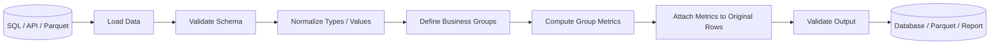

# 05- Transform

## Overview

`transform()` is a Pandas group-aware operation that computes a result for each group while preserving the original DataFrame's shape and index alignment.

Its defining property is:

```text
grouped input
    ↓
group-level computation
    ↓
result aligned back to original rows
```

For example, if each order needs to know its customer's total revenue:

```python
orders["customer_total"] = (
    orders.groupby("customer_id")["revenue"]
    .transform("sum")
)
```

The aggregation is performed per customer, but the resulting value is returned for every original order belonging to that customer.

This makes `transform()` fundamentally different from `agg()`:

```text
agg()
    many rows → one result per group

transform()
    many rows → one result per original row
```

`transform()` is especially useful for:

- Group-relative metrics.
- Percent-of-group calculations.
- Group-level normalization.
- Row-level filtering based on group statistics.
- Group-aware imputation.
- Ranking and scoring.
- ETL transformations where the source row grain must be preserved.

---

## Why `transform()` Exists

A normal aggregation reduces the number of rows.

Suppose:

```python
orders = pd.DataFrame(
    {
        "customer_id": [101, 101, 102, 102],
        "order_id": [1, 2, 3, 4],
        "revenue": [100, 200, 300, 400],
    }
)
```

An aggregation:

```python
customer_totals = (
    orders.groupby("customer_id")["revenue"]
    .sum()
)
```

produces:

```text
customer_id
101    300
102    700
```

But suppose every order needs the customer's total:

```text
customer_id | order_id | revenue | customer_total
------------|----------|---------|---------------
101         | 1        | 100     | 300
101         | 2        | 200     | 300
102         | 3        | 300     | 700
102         | 4        | 400     | 700
```

`transform()` solves that alignment problem without manually merging the aggregate back.

---

## Core Mental Model

Think of `transform()` as:

```text
1. Partition rows into groups.
2. Compute a value for each group.
3. Broadcast that group result back to each member row.
4. Preserve the original index alignment.
```

Example:

```text
Input

customer  revenue
--------  -------
101          100
101          200
102          300
102          400

        │
        ▼

Groups

101 → [100, 200]
102 → [300, 400]

        │
        ▼

Group calculation

101 → 300
102 → 700

        │
        ▼

Aligned output

300
300
700
700
```

This "group result → original rows" behavior is the most important property to remember.

---

## Basic Syntax

The common form is:

```python
DataFrame.groupby(...)[column].transform(function)
```

Example:

```python
orders["customer_total"] = (
    orders.groupby("customer_id")["revenue"]
    .transform("sum")
)
```

You can also transform a DataFrame:

```python
orders[["revenue", "discount"]] = (
    orders.groupby("customer_id")[
        ["revenue", "discount"]
    ]
    .transform("mean")
)
```

For production code, use the narrowest grouping and selection needed for the calculation.

---

## Output Shape

The defining contract of `transform()` is shape preservation.

For a Series:

```text
input length == transform result length
```

For a DataFrame:

```text
same number of rows
```

Example:

```python
result = (
    orders.groupby("customer_id")["revenue"]
    .transform("sum")
)

assert len(result) == len(orders)
```

The result is aligned to the original index.

This makes it suitable for direct assignment:

```python
orders["customer_total"] = result
```

---

## Index Alignment

`transform()` preserves the original index alignment.

Example:

```python
orders = pd.DataFrame(
    {
        "customer_id": [101, 101, 102],
        "revenue": [100, 200, 300],
    },
    index=[10, 20, 30],
)

orders["customer_total"] = (
    orders.groupby("customer_id")["revenue"]
    .transform("sum")
)
```

The result remains aligned to:

```text
index
10
20
30
```

This is a major reason why `transform()` is safer than manually constructing a list and assigning it positionally.

---

## `agg()` Versus `transform()`

| Operation | Result Grain | Row Count |
| --- | --- | ---: |
| `agg()` | One row per group | Reduced |
| `transform()` | Original rows | Preserved |
| `filter()` | Original rows from selected groups | Variable |
| `apply()` | Depends on function | Variable |

Example:

```python
aggregated = (
    orders.groupby("customer_id")
    .agg(
        customer_total=("revenue", "sum")
    )
)
```

produces one row per customer.

Whereas:

```python
orders["customer_total"] = (
    orders.groupby("customer_id")["revenue"]
    .transform("sum")
)
```

keeps one row per order.

Use `transform()` when the derived result must remain attached to each source row.

---

## Group Percentage

One of the most common uses is calculating each record's share of its group.

```python
orders["customer_total"] = (
    orders.groupby("customer_id")["revenue"]
    .transform("sum")
)

orders["customer_share"] = (
    orders["revenue"]
    / orders["customer_total"]
)
```

Example:

```text
customer_id | revenue | customer_total | customer_share
------------|---------|----------------|---------------
101         | 100     | 300            | 0.3333
101         | 200     | 300            | 0.6667
102         | 300     | 700            | 0.4286
102         | 400     | 700            | 0.5714
```

This pattern is common in:

- Revenue analysis.
- Allocation calculations.
- Resource utilization.
- Regional contribution reports.
- Product-share metrics.

---

## Percentage of Group Example

A reusable implementation:

```python
def add_customer_share(
    orders: pd.DataFrame,
) -> pd.DataFrame:
    result = orders.copy()

    customer_total = (
        result.groupby("customer_id")["revenue"]
        .transform("sum")
    )

    result["customer_share"] = (
        result["revenue"]
        / customer_total
    )

    return result
```

If a group total can be zero, handle the denominator deliberately:

```python
customer_total = (
    result.groupby("customer_id")["revenue"]
    .transform("sum")
)

result["customer_share"] = (
    result["revenue"]
    .div(customer_total.where(customer_total.ne(0)))
)
```

This produces missing values for zero-denominator groups rather than silently generating infinite values.

---

## Group Mean

A common normalization pattern is subtracting the group mean.

```python
orders["customer_average"] = (
    orders.groupby("customer_id")["revenue"]
    .transform("mean")
)

orders["difference_from_customer_average"] = (
    orders["revenue"]
    - orders["customer_average"]
)
```

This is useful for:

- Comparing individual transactions to customer behavior.
- Regional performance analysis.
- Group-relative deviation.
- Quality monitoring.

---

## Group Standardization

You can normalize observations relative to their group.

Conceptually:

```text
value
  -
group mean
  ÷
group standard deviation
```

Example:

```python
group_mean = (
    orders.groupby("region")["revenue"]
    .transform("mean")
)

group_std = (
    orders.groupby("region")["revenue"]
    .transform("std")
)

orders["region_z_score"] = (
    orders["revenue"]
    .sub(group_mean)
    .div(group_std)
)
```

This is useful when the same raw value has different meanings across groups.

For production use, handle groups with zero standard deviation explicitly.

```python
orders["region_z_score"] = (
    orders["region_z_score"]
    .replace([float("inf"), -float("inf")], pd.NA)
)
```

---

## Group Rank

Grouped ranking is another transformation pattern.

```python
orders["rank_in_customer"] = (
    orders.groupby("customer_id")["revenue"]
    .rank(
        ascending=False,
        method="dense",
    )
)
```

Each order receives a rank relative to other orders from the same customer.

This is useful for:

- Top purchases.
- Product rankings.
- Regional performance.
- Leaderboards.

The result remains aligned to each original order.

---

## Rank Methods

The `method` parameter controls ties.

Common choices:

| Method | Tie Behavior |
| --- | --- |
| `average` | Average rank assigned to ties |
| `min` | Lowest rank in the tie |
| `max` | Highest rank in the tie |
| `first` | Rank based on original order |
| `dense` | Equal rank for ties, no gaps after the tie |

Example:

```python
orders["rank"] = (
    orders.groupby("region")["revenue"]
    .rank(
        ascending=False,
        method="dense",
    )
)
```

For deterministic business rankings, define the tie policy explicitly.

---

## Group Cumulative Operations

`transform()` works naturally with grouped cumulative operations.

For example:

```python
orders = orders.sort_values(
    ["customer_id", "created_at"]
)

orders["customer_running_revenue"] = (
    orders.groupby("customer_id")["revenue"]
    .cumsum()
)
```

The result remains aligned with the original rows after sorting.

Ordering is critical:

```text
wrong ordering
    ↓
wrong cumulative metric
```

Always sort by the business chronology before performing cumulative group calculations.

---

## Grouped Difference

You can calculate changes between observations within each group:

```python
orders = orders.sort_values(
    ["customer_id", "created_at"]
)

orders["revenue_change"] = (
    orders.groupby("customer_id")["revenue"]
    .diff()
)
```

This is particularly useful for:

- Customer spending changes.
- Account balances.
- Inventory movements.
- Event metrics.
- Time-series comparisons.

Although `diff()` is not itself written as a `transform()` call, it follows the same group-preserving transformation pattern.

---

## Grouped Fill Operations

Group-aware transformations can also be used for imputation.

Suppose each product's missing price should be replaced with that product's average known price:

```python
products["price"] = products["price"].fillna(
    products.groupby("product_id")["price"]
    .transform("mean")
)
```

This preserves the original row count.

However, imputation must be based on valid business semantics. Do not use group statistics to fill values merely because they are available.

---

## Group-Level Thresholds

A common pattern is filtering rows based on group-level statistics.

For example, retain orders above the customer's average order value:

```python
customer_average = (
    orders.groupby("customer_id")["revenue"]
    .transform("mean")
)

high_value_orders = orders.loc[
    orders["revenue"] > customer_average
]
```

This is a strong use case for `transform()` because both:

```text
order revenue
```

and:

```text
customer average
```

need to exist at the order grain.

---

## Group-Based Filtering

Another example:

```python
customer_total = (
    orders.groupby("customer_id")["revenue"]
    .transform("sum")
)

large_customer_orders = orders.loc[
    customer_total >= 10_000
]
```

This keeps all rows belonging to customers whose group total exceeds the threshold.

Compare this with:

```python
orders.groupby("customer_id").filter(
    lambda group:
        group["revenue"].sum() >= 10_000
)
```

Both can solve the problem.

Use `transform()` when the group metric itself is also useful as a column or when multiple row-level conditions will reference it.

---

## Groupwise Normalization

Suppose regional revenue has different scales.

```python
region_min = (
    orders.groupby("region")["revenue"]
    .transform("min")
)

region_max = (
    orders.groupby("region")["revenue"]
    .transform("max")
)

denominator = region_max - region_min

orders["region_normalized"] = (
    orders["revenue"]
    .sub(region_min)
    .div(denominator.where(denominator.ne(0)))
)
```

This produces values relative to each region's own range.

For production metrics, explicitly define behavior when all group values are identical.

---

## Grouped String or Category Transformation

`transform()` is not restricted to numeric metrics.

For example, derive the canonical category from the most common value in each group:

```python
mode_by_customer = (
    orders.groupby("customer_id")["channel"]
    .transform(
        lambda values:
            values.mode().iat[0]
            if not values.mode().empty
            else pd.NA
    )
)

orders["customer_primary_channel"] = (
    mode_by_customer
)
```

This is flexible but uses Python code and can be expensive.

Prefer specialized vectorized operations whenever possible.

---

## Multiple Transformations

Several group-level metrics can be created:

```python
grouped_revenue = orders.groupby(
    "region"
)["revenue"]

orders["region_total"] = grouped_revenue.transform(
    "sum"
)

orders["region_mean"] = grouped_revenue.transform(
    "mean"
)

orders["region_max"] = grouped_revenue.transform(
    "max"
)
```

This makes the relationship between the group and derived fields explicit.

For large pipelines, avoid repeating expensive grouping logic unnecessarily when a single well-designed transformation can provide the required values.

---

## Transforming Multiple Columns

You can apply transformations to multiple columns:

```python
result = (
    orders.groupby("region")[
        ["revenue", "discount"]
    ]
    .transform("mean")
)
```

The resulting DataFrame retains:

```text
same row count
same index
selected columns
```

For explicit output fields, it is often clearer to assign named results separately:

```python
orders["region_avg_revenue"] = (
    orders.groupby("region")["revenue"]
    .transform("mean")
)

orders["region_avg_discount"] = (
    orders.groupby("region")["discount"]
    .transform("mean")
)
```

This makes the business meaning more obvious.

---

## Custom `transform()` Functions

A custom callable can implement group-specific logic.

Example:

```python
def normalize_group(values: pd.Series) -> pd.Series:
    minimum = values.min()
    maximum = values.max()

    if minimum == maximum:
        return pd.Series(
            0.0,
            index=values.index,
        )

    return (
        values - minimum
    ) / (
        maximum - minimum
    )


orders["normalized_revenue"] = (
    orders.groupby("region")["revenue"]
    .transform(normalize_group)
)
```

The callable should return a result that can be aligned with the input group.

This is powerful but should be used carefully because Python-level group functions can be substantially slower than optimized built-in transformations.

---

## Return Shape Requirements

A key `transform()` rule is that the transformation must produce something compatible with the original group shape.

For a Series grouped by key:

```python
result = (
    orders.groupby("region")["revenue"]
    .transform(
        lambda values: values - values.mean()
    )
)
```

The function returns one value for every input value.

Invalid patterns that return an unrelated scalar structure may not satisfy the intended transformation contract.

When writing custom functions, test:

```text
input group length
output group length
index alignment
dtype
missing-value behavior
```

---

## Index Preservation with Custom Functions

Example:

```python
def center(values: pd.Series) -> pd.Series:
    return values - values.mean()


result = (
    orders.groupby("region")["revenue"]
    .transform(center)
)
```

The returned Series remains aligned with the original rows.

This is critical when assigning directly:

```python
orders["centered_revenue"] = result
```

Do not return a new Series with unrelated index labels from a custom transformation unless you deliberately understand the alignment semantics.

---

## Missing Values

Group transformations inherit the missing-value behavior of the operation being applied.

For example:

```python
orders["region_average"] = (
    orders.groupby("region")["revenue"]
    .transform("mean")
)
```

`mean()` generally ignores missing values.

If a group contains:

```text
100
200
NaN
```

the group mean is based on the available observations.

If the entire group is missing, the transformed value can remain missing.

For business-critical calculations, validate missingness before and after transformation.

---

## Zero and Missing Group Metrics

Suppose:

```python
orders["region_total"] = (
    orders.groupby("region")["revenue"]
    .transform("sum")
)
```

If revenue values are all zero:

```text
region_total = 0
```

This is not the same as:

```text
region_total = NaN
```

When the transformed metric is later used as a denominator:

```python
orders["share"] = (
    orders["revenue"]
    / orders["region_total"]
)
```

handle zero denominators explicitly.

```python
region_total = (
    orders.groupby("region")["revenue"]
    .transform("sum")
)

orders["share"] = (
    orders["revenue"]
    .div(region_total.where(region_total.ne(0)))
)
```

---

## Categorical Grouping

`transform()` works with categorical grouping keys.

```python
orders["region"] = orders["region"].astype(
    "category"
)

orders["region_total"] = (
    orders.groupby(
        "region",
        observed=True,
    )["revenue"]
    .transform("sum")
)
```

For categorical dimensions, choose `observed` deliberately based on whether unobserved categories should participate in the grouping behavior.

---

## Grouping by Multiple Keys

Multiple grouping keys are supported:

```python
orders["region_channel_total"] = (
    orders.groupby(
        ["region", "channel"]
    )["revenue"]
    .transform("sum")
)
```

Now the group is defined as:

```text
region + channel
```

Every order receives the total revenue for its own region/channel combination.

This is useful for:

- Regional channel share.
- Category-level normalization.
- Store/product analysis.
- Customer/product metrics.

---

## Time-Based Transformations

Group-aware time calculations are common.

```python
orders["created_at"] = pd.to_datetime(
    orders["created_at"],
    utc=True,
)

orders = orders.sort_values(
    ["customer_id", "created_at"]
)

orders["customer_running_total"] = (
    orders.groupby("customer_id")["revenue"]
    .cumsum()
)
```

For period-based group statistics:

```python
orders["order_month"] = (
    orders["created_at"]
    .dt.to_period("M")
)

orders["monthly_customer_total"] = (
    orders.groupby(
        ["customer_id", "order_month"]
    )["revenue"]
    .transform("sum")
)
```

The resulting row-level value represents each order's contribution to its customer's monthly total.

---

## Grouped `transform()` in ETL

A common ETL pattern is:



`transform()` is valuable here because the original row grain can be preserved while adding derived group metrics.

---

## SQL Equivalent

Some `transform()` patterns correspond directly to SQL window functions.

For example:

```python
orders["customer_total"] = (
    orders.groupby("customer_id")["revenue"]
    .transform("sum")
)
```

is conceptually similar to:

```sql
SELECT
    order_id,
    customer_id,
    revenue,
    SUM(revenue) OVER (
        PARTITION BY customer_id
    ) AS customer_total
FROM orders;
```

This is an important backend engineering connection.

Pandas `groupby().transform()` often corresponds more closely to a SQL window function than to a SQL `GROUP BY`.

---

## Window Function Mental Model

The distinction can be represented as:

```text
SQL GROUP BY
    ↓
one row per group

SQL window function
    ↓
original rows + group-aware metric

Pandas groupby().agg()
    ↓
one row per group

Pandas groupby().transform()
    ↓
original rows + group-aware metric
```

Recognizing this relationship makes it easier to move logic between PostgreSQL and Pandas.

---

## Pushdown to SQL

If PostgreSQL can calculate the window metric efficiently, consider doing it before loading the data into Pandas.

Example:

```sql
SELECT
    order_id,
    customer_id,
    revenue,
    SUM(revenue) OVER (
        PARTITION BY customer_id
    ) AS customer_total
FROM orders
WHERE order_date >= %(start_date)s
  AND order_date < %(end_date)s;
```

Then Pandas can perform later transformations.

This can reduce:

- Application CPU.
- Python memory pressure.
- Data movement.
- Overall pipeline latency.

Do not automatically move everything to SQL; choose the execution layer that best fits the workload and surrounding transformation requirements.

---

## `transform()` Versus Merge

A common alternative is:

```python
customer_totals = (
    orders.groupby("customer_id", as_index=False)
    .agg(
        customer_total=("revenue", "sum")
    )
)

orders = orders.merge(
    customer_totals,
    on="customer_id",
    how="left",
    validate="many_to_one",
)
```

This is valid but more verbose.

For a simple group metric, `transform()` is often clearer:

```python
orders["customer_total"] = (
    orders.groupby("customer_id")["revenue"]
    .transform("sum")
)
```

Use `merge()` when the group summary contains multiple independent attributes or when the summary is needed as a standalone dataset.

Use `transform()` when the primary requirement is:

```text
calculate group metric
+
keep original row grain
```

---

## Performance

Built-in transformations such as:

```python
sum
mean
min
max
count
median
```

are generally preferable to custom Python functions.

Prefer:

```python
orders.groupby(
    "customer_id"
)["revenue"].transform("sum")
```

over:

```python
orders.groupby(
    "customer_id"
)["revenue"].transform(
    lambda values: values.sum()
)
```

Both express the same logic, but the built-in operation communicates intent more clearly and can use optimized implementations.

---

## Avoid Repeated Grouping

This pattern can repeat grouping work:

```python
orders["total"] = (
    orders.groupby("customer_id")["revenue"]
    .transform("sum")
)

orders["average"] = (
    orders.groupby("customer_id")["revenue"]
    .transform("mean")
)

orders["maximum"] = (
    orders.groupby("customer_id")["revenue"]
    .transform("max")
)
```

For a small dataset this is usually fine.

For performance-sensitive workloads, evaluate whether several required group statistics can be computed more efficiently through a grouped aggregation followed by a merge, or another appropriate design.

For example:

```python
customer_metrics = (
    orders.groupby("customer_id")
    .agg(
        total=("revenue", "sum"),
        average=("revenue", "mean"),
        maximum=("revenue", "max"),
    )
)

orders = orders.join(
    customer_metrics,
    on="customer_id",
    rsuffix="_customer",
)
```

The best approach depends on the number of metrics, dataset size, and downstream use.

---

## Memory Considerations

`transform()` preserves the original number of rows while adding derived columns.

If a dataset contains:

```text
20 million rows
```

and you create:

```text
5 group-level metrics
```

you are potentially adding five large Series to the DataFrame.

Reduce memory pressure by:

- Selecting only required columns.
- Using efficient dtypes.
- Avoiding unnecessary intermediate copies.
- Persisting only required outputs.
- Aggregating upstream when row-level metrics are not needed.

---

## High-Cardinality Groups

High-cardinality grouping can be expensive.

For example:

```python
events.groupby(
    [
        "customer_id",
        "request_id",
        "timestamp",
    ]
)["latency_ms"].transform("mean")
```

If nearly every combination is unique, the group-level metric provides little value while still requiring grouping infrastructure.

Before using `transform()`, verify that the grouping dimensions correspond to meaningful business entities.

---

## Avoid Python I/O Inside `transform()`

Do not use:

```python
orders.groupby("customer_id")[
    "customer_id"
].transform(
    lambda customer_id:
        call_external_service(customer_id)
)
```

This can create a huge number of external calls and makes the transformation:

- Slow.
- Unreliable.
- Difficult to retry.
- Hard to test.
- Dependent on network availability.

Fetch external reference data separately and join it into the DataFrame.

---

## Empty DataFrames

Handle empty input explicitly when the transformation feeds a fixed downstream schema.

```python
def add_customer_total(
    orders: pd.DataFrame,
) -> pd.DataFrame:
    result = orders.copy()

    result["customer_total"] = pd.Series(
        pd.NA,
        index=result.index,
        dtype="Float64",
    )

    if result.empty:
        return result

    result["customer_total"] = (
        result.groupby("customer_id")["revenue"]
        .transform("sum")
    )

    return result
```

This makes the output predictable even when no input rows are present.

---

## Testing `transform()`

Tests should validate:

- Output row count.
- Index alignment.
- Group-level values.
- Null behavior.
- Multiple groups.
- Single-row groups.
- Zero-denominator cases.
- Empty input.
- Duplicate rows.
- Output dtype where important.

Example:

```python
import pandas as pd
from pandas.testing import assert_series_equal


def test_customer_total_preserves_row_alignment() -> None:
    orders = pd.DataFrame(
        {
            "customer_id": [101, 101, 102],
            "revenue": [100, 200, 300],
        },
        index=[10, 20, 30],
    )

    actual = (
        orders.groupby("customer_id")["revenue"]
        .transform("sum")
    )

    expected = pd.Series(
        [300, 300, 300],
        index=[10, 20, 30],
        name="revenue",
    )

    assert_series_equal(
        actual,
        expected,
    )
```

The index assertion is important because alignment is part of `transform()` semantics.

---

## Testing Group-Relative Metrics

```python
def test_customer_revenue_share() -> None:
    orders = pd.DataFrame(
        {
            "customer_id": [101, 101, 102],
            "revenue": [100, 300, 200],
        }
    )

    customer_total = (
        orders.groupby("customer_id")["revenue"]
        .transform("sum")
    )

    actual = orders["revenue"] / customer_total

    expected = pd.Series(
        [0.25, 0.75, 1.0],
        name="revenue",
    )

    assert_series_equal(
        actual,
        expected,
        check_names=False,
    )
```

For business-critical metrics, also test:

```text
share sum per group ≈ 1
```

when the denominator is valid.

---

## Common Mistakes

### Using `agg()` When the Original Rows Are Needed

This:

```python
customer_total = (
    orders.groupby("customer_id")["revenue"]
    .sum()
)
```

produces one value per customer.

If every order needs the value:

```python
orders["customer_total"] = (
    orders.groupby("customer_id")["revenue"]
    .transform("sum")
)
```

---

### Using `transform()` When Only a Summary Is Needed

If the output only needs one row per customer:

```python
summary = (
    orders.groupby("customer_id")
    .agg(
        total_revenue=("revenue", "sum")
    )
)
```

Creating a repeated value for every source row wastes memory.

---

### Forgetting Sort Order

Cumulative operations such as:

```python
cumsum()
diff()
```

depend on row ordering.

Sort by the business sequence first.

---

### Ignoring Zero Denominators

Group shares can generate invalid results when group totals are zero.

Use explicit zero-denominator handling.

---

### Returning Incorrectly Sized Custom Results

Custom transformations must produce a result compatible with each group's shape.

Test custom functions independently.

---

### Repeating Expensive Groupings Excessively

Multiple independent transformations over the same large grouping can increase processing cost.

Measure performance and consider grouped aggregation plus joining when many metrics are required.

---

## Production Pitfalls

### Group Metrics Can Be Misleading

A group total may include records that should have been filtered first.

For example:

```python
orders.groupby("customer_id")["revenue"].transform("sum")
```

will include every row in `orders`.

If the business metric is:

```text
completed-order revenue
```

filter first:

```python
completed = orders.loc[
    orders["status"].eq("completed")
].copy()

completed["customer_total"] = (
    completed.groupby("customer_id")["revenue"]
    .transform("sum")
)
```

The filter is part of the metric definition.

---

### Aggregating Across Invalid Records

If invalid or duplicate records are included in the group, every transformed row can inherit the incorrect group metric.

Validate source data before calculating group statistics.

---

### Changing Grouping Keys

Changing:

```python
groupby("customer_id")
```

to:

```python
groupby(["customer_id", "region"])
```

changes the meaning of every transformed metric.

Treat grouping keys as part of the business contract.

---

### Running Large Transformations Per API Request

Avoid recalculating expensive group metrics synchronously for every request.

For repeated reporting workloads:

```text
Scheduled job
    ↓
Compute group metrics
    ↓
Persist / cache
    ↓
API reads prepared result
```

Celery can handle background computation, while Redis can cache frequently requested summaries.

---

## Reliability and Idempotency

Group transformations are deterministic when:

```text
input data
+
grouping keys
+
transformation logic
```

are deterministic.

This makes them suitable for:

- Batch processing.
- Retryable ETL jobs.
- Backfills.
- Reprocessing.

For reproducibility, version important business rules and preserve the canonical input dataset.

Do not rely on the current dataset distribution when the transformation is expected to produce historically reproducible metrics unless that behavior is intentional.

---

## Monitoring

Useful metrics include:

```text
input_row_count
output_row_count
group_count
null_group_key_count
transformed_null_count
zero_denominator_count
processing_duration_ms
memory_usage_bytes
```

For group-relative metrics, also monitor distributions:

```python
orders["customer_share"].describe()
```

Unexpected values can reveal:

- Missing revenue.
- Duplicate records.
- Incorrect filtering.
- Invalid grouping keys.
- Zero denominators.
- Data drift.

---

## Security Considerations

`transform()` does not provide authorization or tenant isolation.

For multi-tenant workloads:

```text
Authenticate
    ↓
Authorize tenant
    ↓
Filter permitted data
    ↓
Group / transform
    ↓
Return permitted result
```

Tenant filtering must occur before the transformation if group metrics must represent only authorized records.

Otherwise, a transformed metric can accidentally include another tenant's data even if the final raw identifiers are hidden.

---

## Cost Considerations

For large data-processing workloads:

```text
Filter early
    ↓
Select required columns
    ↓
Use efficient dtypes
    ↓
Reduce unnecessary grouping dimensions
    ↓
Use built-in transformations
    ↓
Push suitable window calculations to SQL
    ↓
Precompute repeated reports
```

If PostgreSQL can perform a required window calculation efficiently, SQL may be preferable to transferring millions of rows to Pandas.

For repeated reporting, precomputation is often cheaper and more predictable than recalculation per request.

---

## Recommended Engineering Pattern

Keep group-level metric creation explicit and reusable.

```python
import pandas as pd


def add_customer_metrics(
    orders: pd.DataFrame,
) -> pd.DataFrame:
    required_columns = {
        "customer_id",
        "revenue",
    }

    missing = required_columns.difference(
        orders.columns
    )

    if missing:
        raise ValueError(
            f"Missing columns: {sorted(missing)}"
        )

    result = orders.copy()

    result["revenue"] = pd.to_numeric(
        result["revenue"],
        errors="coerce",
    )

    if result["revenue"].isna().any():
        raise ValueError(
            "Invalid revenue values detected."
        )

    customer_total = (
        result.groupby("customer_id")["revenue"]
        .transform("sum")
    )

    result["customer_total"] = customer_total

    result["customer_share"] = (
        result["revenue"]
        .div(
            customer_total.where(
                customer_total.ne(0)
            )
        )
    )

    return result
```

This separates:

```text
input validation
    ↓
type normalization
    ↓
group metric calculation
    ↓
row-level derived metric
```

and makes the transformation straightforward to test.

---

## Decision Framework

Use this model when deciding whether to use `transform()`:

```mermaid
flowchart TD
    A[Need group-aware calculation?] --> B{Need one result per group?}

    B -->|Yes| C[Use groupby().agg()]
    B -->|No| D{Need one result per original row?}

    D -->|Yes| E[Use groupby().transform()]
    D -->|No| F[Consider filter / apply / merge]

    E --> G{Built-in operation available?}
    G -->|Yes| H[Use built-in transform]
    G -->|No| I[Use custom transform carefully]

    H --> J[Validate alignment and semantics]
    I --> J
```

The core decision is:

```text
Do I need a group-level metric attached to every source row?
```

If yes, `transform()` is often the most direct Pandas operation.

---

## `transform()` Versus Alternatives

| Requirement | Preferred Operation |
| --- | --- |
| One row per group | `groupby().agg()` |
| Group metric for every source row | `groupby().transform()` |
| Remove/retain entire groups | `groupby().filter()` |
| Complex grouped custom logic | `groupby().apply()` where appropriate |
| Attach an independent group summary | `merge()` / `join()` |
| Grouped time-window calculations | Grouped `rolling()` / related operations |
| SQL-backed large dataset | SQL window function or aggregation |

Use the simplest operation that expresses the intended grain and semantics.

---

## Section Completion Standard

A strong understanding of `transform()` means being able to recognize problems of the form:

```text
I need a group-level calculation
        +
I need the result on every original row
```

Examples include:

```text
customer total
regional average
percentage of group revenue
rank within category
group-normalized score
group-level threshold
group running total
group-specific imputation
```

The reasoning process should be:

```text
Define source grain
    ↓
Choose grouping keys
    ↓
Choose group metric
    ↓
Preserve original alignment with transform()
    ↓
Handle missing / zero / invalid cases
    ↓
Validate result shape
    ↓
Measure performance
    ↓
Consider SQL window-function pushdown
```

This makes `transform()` a core tool for adding group-aware business metrics without losing the detail-level structure of the original dataset.

---

## Key Takeaways

- `groupby().transform()` computes group-aware values while preserving the original row count and index alignment, making it ideal for attaching group metrics to source records.
- Use `transform()` for metrics such as group totals, averages, shares, ranks, normalized values, and thresholds; use `agg()` when the desired output is one row per group.
- Grouping keys, filtering rules, null semantics, zero denominators, sort order, and duplicate handling directly determine whether a transformed metric is correct.
- Prefer built-in transformations over custom Python functions for performance, and consider SQL window functions when PostgreSQL can efficiently perform the same calculation on large datasets.
- Treat transformed metrics as production business logic: validate schemas and alignment, monitor cardinality and metric distributions, test edge cases, and avoid expensive repeated computation inside synchronous API requests.