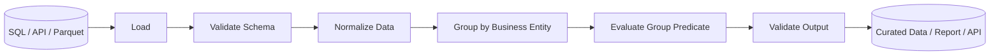

# 06- Filter

## Overview

`GroupBy.filter()` removes or retains **entire groups** based on a condition evaluated against each group.

This makes it fundamentally different from ordinary row filtering:

```text
Boolean row filtering
    ↓
decides for each row

groupby().filter()
    ↓
decides for each group
    ↓
all rows in qualifying groups are retained
```

For example, suppose orders are grouped by customer and the requirement is:

> Keep every order belonging to customers whose total revenue is at least 10,000.

This is a group-level rule:

```python
large_customer_orders = (
    orders.groupby("customer_id")
    .filter(
        lambda group:
            group["revenue"].sum() >= 10_000
    )
)
```

The entire customer group is kept or removed.

`filter()` is particularly useful when the business rule depends on properties of a complete group but the output must retain the original row-level records.

---

## Why Grouped Filtering Exists

Ordinary filtering evaluates one record at a time:

```python
high_value_orders = orders.loc[
    orders["revenue"] >= 5_000
]
```

That answers:

```text
Which orders are individually worth at least 5,000?
```

A grouped filter answers a different question:

```text
Which customers have total revenue of at least 10,000?
Keep every order from those customers.
```

These are not interchangeable.

Example input:

```text
customer_id | order_id | revenue
------------|----------|--------
101         | 1        | 4000
101         | 2        | 7000
102         | 3        | 12000
103         | 4        | 3000
103         | 5        | 2000
```

Customer totals:

```text
101 → 11000
102 → 12000
103 →  5000
```

A grouped filter with `>= 10000` keeps:

```text
customer_id | order_id | revenue
------------|----------|--------
101         | 1        | 4000
101         | 2        | 7000
102         | 3        | 12000
```

Both orders for customer `101` remain because the decision was made at the customer-group level.

---

## Basic Syntax

The common form is:

```python
DataFrame.groupby(
    keys
).filter(
    function
)
```

Example:

```python
filtered = (
    orders.groupby("region")
    .filter(
        lambda group:
            group["revenue"].sum() >= 50_000
    )
)
```

The function receives one group at a time and should return a boolean indicating whether that group should be retained.

---

## How `filter()` Works

Conceptually:

```text
DataFrame
   │
   ▼
groupby(keys)
   │
   ├── Group A → evaluate condition → keep
   ├── Group B → evaluate condition → discard
   ├── Group C → evaluate condition → keep
   └── Group D → evaluate condition → discard
   │
   ▼
Concatenate rows from kept groups
```

The filter is therefore group-oriented but the returned DataFrame still contains the original rows from qualifying groups.

---

## Input and Output Behavior

| Property | Behavior |
| --- | --- |
| Input | DataFrame or Series grouped by one or more keys |
| Decision level | Group |
| Output | DataFrame or Series containing rows from qualifying groups |
| Row count | Same or smaller than input |
| Grouping columns | Remain ordinary columns when originally present |
| Original input | Not modified |
| Index | Usually preserved from the source |
| Dtypes | Generally preserved, subject to normal Pandas behavior |
| Group order | Depends on grouping and source ordering |

Unlike aggregation:

```text
groupby().agg()
```

reduces the data to group-level rows.

`filter()` preserves the detailed records belonging to groups that satisfy the predicate.

---

## Group-Level Revenue Threshold

A common business use case:

```python
large_regions = (
    orders.groupby("region")
    .filter(
        lambda group:
            group["revenue"].sum() >= 100_000
    )
)
```

This means:

```text
Calculate revenue per region
        ↓
Check threshold
        ↓
Keep every order from qualifying regions
```

The result remains at the order grain.

---

## Group-Level Record Count

Suppose a region is operationally important only when it has at least 100 orders:

```python
active_regions = (
    orders.groupby("region")
    .filter(
        lambda group:
            len(group) >= 100
    )
)
```

This keeps all records from regions with at least 100 rows.

This is useful for:

- Activity thresholds.
- Minimum sample requirements.
- Customer cohorts.
- Operational eligibility.
- Data-quality checks.

---

## Group-Level Unique Customers

The group condition does not have to use row count.

```python
active_regions = (
    orders.groupby("region")
    .filter(
        lambda group:
            group["customer_id"].nunique() >= 50
    )
)
```

The rule is now:

```text
keep region if at least 50 unique customers are represented
```

The distinction between:

```text
rows
```

and:

```text
unique entities
```

is important.

---

## Group-Level Average

```python
healthy_products = (
    transactions.groupby("product_id")
    .filter(
        lambda group:
            group["amount"].mean() >= 100
    )
)
```

This keeps all transactions for products whose average transaction value meets the threshold.

Be careful with missing values because `mean()` generally ignores them.

If missing values indicate an invalid dataset, validate before applying the grouped filter.

---

## Combining Conditions

A group can be filtered using several conditions:

```python
qualified_customers = (
    orders.groupby("customer_id")
    .filter(
        lambda group:
            (
                group["revenue"].sum() >= 10_000
                and group["order_id"].nunique() >= 3
            )
    )
)
```

The group must satisfy both:

```text
total revenue >= 10,000
AND
at least 3 orders
```

For complex business rules, move the logic into a named function rather than writing a long lambda.

---

## Named Predicate Functions

Prefer a named function when the rule has business meaning.

```python
def is_qualified_customer(
    group: pd.DataFrame,
) -> bool:
    total_revenue = group["revenue"].sum()
    order_count = group["order_id"].nunique()

    return (
        total_revenue >= 10_000
        and order_count >= 3
    )


qualified_orders = (
    orders.groupby("customer_id")
    .filter(is_qualified_customer)
)
```

Advantages:

- Easier testing.
- Clearer business semantics.
- Better code review.
- Easier reuse.
- Easier instrumentation.

---

## Grouped Filter Versus Row Filter

These operations answer different questions.

### Row Filter

```python
orders.loc[
    orders["revenue"] >= 10_000
]
```

Question:

```text
Which individual orders are at least 10,000?
```

### Grouped Filter

```python
orders.groupby("customer_id").filter(
    lambda group:
        group["revenue"].sum() >= 10_000
)
```

Question:

```text
Which customers have total revenue of at least 10,000?
```

The second returns all orders belonging to qualifying customers.

---

## Grouped Filter Versus `transform()`

The same business rule can sometimes be expressed with `transform()`.

Using `filter()`:

```python
large_customers = (
    orders.groupby("customer_id")
    .filter(
        lambda group:
            group["revenue"].sum() >= 10_000
    )
)
```

Using `transform()`:

```python
customer_total = (
    orders.groupby("customer_id")["revenue"]
    .transform("sum")
)

large_customers = orders.loc[
    customer_total >= 10_000
]
```

Both can produce the same rows.

The distinction is intent:

```text
filter()
    → keep or discard complete groups

transform()
    → calculate a group-aware value for each row
```

Use `transform()` when the group metric itself is useful downstream or when several row-level conditions depend on it.

---

## Grouped Filter Versus Aggregation

Aggregation:

```python
summary = (
    orders.groupby("customer_id")
    .agg(
        revenue=("revenue", "sum"),
    )
)
```

returns:

```text
one row per customer
```

Grouped filtering:

```python
result = (
    orders.groupby("customer_id")
    .filter(
        lambda group:
            group["revenue"].sum() >= 10_000
    )
)
```

returns:

```text
original order rows belonging to qualifying customers
```

Use aggregation when the desired output grain is group-level.

Use `filter()` when the desired output remains at the original row grain.

---

## Grouped Filter Versus `query()`

`query()` is row-oriented:

```python
orders.query("revenue >= 10000")
```

It cannot directly express:

```text
keep all orders for customers
whose total revenue is at least 10,000
```

without first creating a group-level metric.

For that requirement:

```python
customer_total = (
    orders.groupby("customer_id")["revenue"]
    .transform("sum")
)

result = orders.loc[
    customer_total >= 10_000
]
```

or:

```python
result = (
    orders.groupby("customer_id")
    .filter(
        lambda group:
            group["revenue"].sum() >= 10_000
    )
)
```

---

## Filtering by Group Size

A concise pattern:

```python
large_groups = (
    events.groupby("service")
    .filter(lambda group: len(group) >= 1_000)
)
```

This can support operational logic such as:

```text
only analyze services with enough observations
```

However, the threshold should come from a documented business or statistical requirement rather than being arbitrary.

---

## Filtering by Data Quality

Grouped filtering can also identify valid entities.

Example:

```python
valid_customers = (
    orders.groupby("customer_id")
    .filter(
        lambda group:
            group["email"].notna().all()
    )
)
```

This keeps only customers whose orders all have non-null email values.

For production data quality pipelines, consider calculating an explicit quality metric first when the logic becomes complex.

---

## Group Completeness

Suppose each customer is expected to have records for every month in a reporting period.

A simple grouped predicate can check the number of distinct months:

```python
complete_customers = (
    orders.groupby("customer_id")
    .filter(
        lambda group:
            group["order_month"].nunique() == 12
    )
)
```

This is useful for cohort and longitudinal datasets.

However, checking only distinct counts does not prove that the exact expected months are present. For strict validation, compare against the required set of periods.

---

## Grouped Filter with Multiple Keys

Multiple grouping keys are supported:

```python
result = (
    orders.groupby(
        ["region", "channel"]
    )
    .filter(
        lambda group:
            group["revenue"].sum() >= 20_000
    )
)
```

The group is:

```text
region + channel
```

not:

```text
region
```

and not:

```text
channel
```

The output retains original records from qualifying region/channel combinations.

---

## Output Grain

The input might be:

```text
one row = one order
```

After:

```python
orders.groupby("customer_id").filter(...)
```

the output is still:

```text
one row = one order
```

The set of included customers changes, but the row grain does not.

This is a useful distinction:

```text
Aggregation
    → changes grain

Filter
    → changes which records survive
```

---

## Missing Group Keys

Grouping keys can contain missing values.

Example:

```python
result = (
    orders.groupby(
        "region",
        dropna=False,
    )
    .filter(
        lambda group:
            group["revenue"].sum() >= 10_000
    )
)
```

Whether records with missing keys should participate depends on the business rule.

For data-quality reporting, retaining a missing-key group can be important.

For a business-facing report, excluding unknown regions may be intentional.

Define this behavior explicitly.

---

## Missing Metrics

Suppose:

```text
region | revenue
East   | 1000
East   | NaN
```

Then:

```python
group["revenue"].sum()
```

generally ignores the missing value.

This can lead to:

```text
revenue total = 1000
```

even though one record lacks a revenue value.

If revenue completeness is required:

```python
def is_valid_region(
    group: pd.DataFrame,
) -> bool:
    if group["revenue"].isna().any():
        return False

    return group["revenue"].sum() >= 10_000
```

This makes data-quality requirements explicit.

---

## Null and Empty Groups

An empty DataFrame returns an empty result:

```python
filtered = (
    orders.groupby("customer_id")
    .filter(is_qualified_customer)
)
```

For production reports, ensure that downstream consumers can handle:

```text
zero qualifying groups
```

without assuming at least one group exists.

---

## Custom Predicate Requirements

A predicate should return a scalar boolean per group:

```python
def is_large_group(
    group: pd.DataFrame,
) -> bool:
    return group["revenue"].sum() >= 10_000
```

Avoid predicates that:

- Perform external I/O.
- Depend on mutable external state.
- Return inconsistent types.
- Modify the group.
- Perform unnecessarily expensive calculations.

Keep the predicate deterministic and side-effect free.

---

## Production Data Flow

Grouped filtering commonly appears in a pipeline like:



The predicate should operate only after the required fields and semantics are known.

---

## SQL Equivalent

A grouped filter often corresponds to SQL using `HAVING` when the output is group-level:

```sql
SELECT
    customer_id
FROM orders
GROUP BY customer_id
HAVING SUM(revenue) >= 10000;
```

However, `groupby().filter()` returns the original detailed rows, so the equivalent SQL often requires a subquery or window function.

For example:

```sql
SELECT *
FROM orders
WHERE customer_id IN (
    SELECT customer_id
    FROM orders
    GROUP BY customer_id
    HAVING SUM(revenue) >= 10000
);
```

Or with a window function:

```sql
SELECT *
FROM (
    SELECT
        orders.*,
        SUM(revenue) OVER (
            PARTITION BY customer_id
        ) AS customer_total
    FROM orders
) ranked
WHERE customer_total >= 10000;
```

This relationship is important when deciding where the operation should execute.

---

## SQL Pushdown

If the data is already in PostgreSQL, it may be cheaper to perform the grouped filter there.

For example:

```sql
SELECT *
FROM orders
WHERE customer_id IN (
    SELECT customer_id
    FROM orders
    WHERE order_date >= %(start_date)s
      AND order_date < %(end_date)s
    GROUP BY customer_id
    HAVING SUM(revenue) >= %(minimum_revenue)s
);
```

This avoids transferring all records into Pandas.

Use Pandas filtering when:

- The data is already in memory.
- The rule is easier to express in Python.
- The source is an API or file.
- Additional Pandas processing is required.

---

## Performance Characteristics

`groupby().filter()` evaluates a Python callable for each group.

For many groups, this can become expensive.

For example:

```python
orders.groupby("customer_id").filter(
    lambda group:
        group["revenue"].sum() >= 10_000
)
```

may process a very large number of groups through Python-level function calls.

When possible, prefer a vectorized `transform()` approach:

```python
customer_total = (
    orders.groupby("customer_id")["revenue"]
    .transform("sum")
)

result = orders.loc[
    customer_total >= 10_000
]
```

This can be more efficient when the condition can be expressed through a built-in group operation.

The choice should be driven by both performance and clarity.

---

## When `filter()` Is Appropriate

`filter()` is a good fit when the predicate is inherently group-oriented and readability matters.

Example:

```python
qualified = (
    transactions.groupby("account_id")
    .filter(
        lambda group:
            (
                group["transaction_id"].nunique() >= 10
                and group["amount"].sum() >= 50_000
            )
    )
)
```

This directly communicates:

```text
Keep accounts satisfying the complete business predicate.
```

If the same predicate becomes difficult to read or expensive to execute, calculate explicit group metrics and filter from them instead.

---

## Avoid Repeated Calculations

This predicate:

```python
lambda group: (
    group["revenue"].sum() >= 10_000
    and group["order_id"].nunique() >= 3
    and group["customer_id"].nunique() == 1
)
```

performs several calculations for every group.

For a large dataset, consider:

```python
metrics = (
    orders.groupby("customer_id")
    .agg(
        total_revenue=("revenue", "sum"),
        order_count=("order_id", "nunique"),
    )
)

qualified_ids = metrics.loc[
    metrics["total_revenue"].ge(10_000)
    & metrics["order_count"].ge(3)
].index

result = orders.loc[
    orders["customer_id"].isin(qualified_ids)
]
```

This separates:

```text
metric calculation
```

from:

```text
row filtering
```

and can be easier to optimize and test.

---

## Memory Considerations

`filter()` returns the retained rows, so memory usage is usually proportional to the retained subset plus grouping overhead.

Still, avoid applying it to unnecessary columns.

Prefer:

```python
working = orders[
    [
        "customer_id",
        "order_id",
        "revenue",
    ]
]

result = (
    working.groupby("customer_id")
    .filter(
        lambda group:
            group["revenue"].sum() >= 10_000
    )
)
```

If the full original DataFrame must ultimately be returned, measure whether the filtering predicate is better computed from a narrow aggregation and then applied to the original records.

---

## Large Dataset Strategy

For large data:

```text
Large Source
    │
    ▼
SQL filter / aggregation
    │
    ▼
Reduced dataset
    │
    ▼
Pandas grouped filtering
```

For example:

```text
PostgreSQL
    │
    ├── date partition filter
    ├── business predicates
    └── grouped metrics
    │
    ▼
Pandas
    │
    └── final transformation
```

This is often preferable to loading the entire source table into a Pandas process.

For datasets that exceed comfortable memory limits, consider:

- PostgreSQL.
- DuckDB.
- Spark.
- Data warehouses.
- Precomputed reporting tables.

---

## Categorical Grouping

Grouped filters can be applied to categorical dimensions:

```python
orders["region"] = orders["region"].astype(
    "category"
)

result = (
    orders.groupby(
        "region",
        observed=True,
    )
    .filter(
        lambda group:
            group["revenue"].sum() >= 100_000
    )
)
```

For large low-cardinality dimensions, categorical representation can reduce memory overhead.

Use category settings intentionally because unobserved categories can affect grouping behavior.

---

## Grouped Filter and Sorting

Filtering preserves source row ordering for retained records in typical use.

If output order is contractual, sort explicitly:

```python
result = result.sort_values(
    ["region", "created_at"]
)
```

Do not rely on incidental group or input ordering for API or report guarantees.

---

## Testing Grouped Filters

Tests should verify:

- Entire groups are retained or removed.
- Group-level predicates are evaluated correctly.
- Original rows remain intact.
- Multiple grouping keys work correctly.
- Null behavior is intentional.
- Empty input behaves predictably.
- Output grain remains unchanged.

Example:

```python
import pandas as pd
from pandas.testing import assert_frame_equal


def test_filter_keeps_qualifying_customers() -> None:
    orders = pd.DataFrame(
        {
            "customer_id": [101, 101, 102, 103],
            "order_id": [1, 2, 3, 4],
            "revenue": [6_000, 5_000, 12_000, 2_000],
        }
    )

    actual = (
        orders.groupby("customer_id")
        .filter(
            lambda group:
                group["revenue"].sum() >= 10_000
        )
        .reset_index(drop=True)
    )

    expected = pd.DataFrame(
        {
            "customer_id": [101, 101, 102],
            "order_id": [1, 2, 3],
            "revenue": [6_000, 5_000, 12_000],
        }
    )

    assert_frame_equal(
        actual,
        expected,
    )
```

The test verifies group semantics, not just function execution.

---

## Testing Group Grain

An important invariant is that filtering does not change the grain of retained rows.

For example:

```python
result = (
    orders.groupby("customer_id")
    .filter(
        lambda group:
            group["revenue"].sum() >= 10_000
    )
)

assert set(result.columns) == set(
    orders.columns
)
```

For business-specific grain, also validate that identifiers remain unique where expected.

---

## Common Mistakes

### Confusing Row Filtering with Group Filtering

Incorrect for group-level requirements:

```python
orders.loc[
    orders["revenue"] >= 10_000
]
```

This removes individual rows.

Use grouped filtering when the decision applies to the entire group.

---

### Using `filter()` for a Simple Threshold

If the logic is:

```text
group total >= threshold
```

this may be clearer and faster:

```python
group_total = (
    orders.groupby("customer_id")["revenue"]
    .transform("sum")
)

result = orders.loc[
    group_total >= 10_000
]
```

Use `filter()` when its group-level intent is clearer.

---

### Returning a Series from the Predicate

The predicate should return a scalar boolean describing the group.

Good:

```python
lambda group:
    group["revenue"].sum() >= 10_000
```

Not:

```python
lambda group:
    group["revenue"] >= 10_000
```

The latter produces row-level booleans rather than one decision for the group.

---

### Ignoring Missing Values

A group with missing metrics may pass a rule unexpectedly if aggregation ignores nulls.

Validate completeness when required.

---

### Performing I/O in the Predicate

Avoid:

```python
lambda group:
    external_service_check(group)
```

This can generate one external request per group.

Fetch reference data separately and join it into the DataFrame.

---

### Excessive Group Cardinality

Filtering by nearly unique keys can be expensive and provide little benefit.

Review the group grain first.

---

## Production Pitfalls

### Business Rule Hidden in a Lambda

This is harder to review:

```python
filter(
    lambda g:
        g["revenue"].sum() >= 10_000
        and g["order_id"].nunique() >= 3
)
```

For important business logic, use a named predicate:

```python
def is_qualified_customer(
    group: pd.DataFrame,
) -> bool:
    ...
```

---

### Changing the Grouping Keys

Changing:

```python
groupby("customer_id")
```

to:

```python
groupby(["customer_id", "region"])
```

changes the meaning of the filter.

Treat grouping dimensions as part of the business contract.

---

### Filtering After Cross-Tenant Aggregation

In multi-tenant systems, tenant isolation must be enforced before the grouping stage.

Otherwise:

```text
tenant A data
tenant B data
    ↓
groupby(customer)
    ↓
combined metric
```

can produce incorrect or unauthorized metrics.

---

### Synchronous API Processing

Large grouped filters should not automatically run inside every FastAPI or Django request.

For expensive report generation:

```text
Request / Scheduler
       │
       ▼
Celery Worker
       │
       ▼
SQL reduction
       │
       ▼
Pandas processing
       │
       ▼
Persist / Cache
       │
       ▼
API response
```

---

## Reliability and Idempotency

Grouped filtering is deterministic when:

```text
input data
+
grouping keys
+
predicate logic
```

are deterministic.

This makes it appropriate for:

- Retryable ETL jobs.
- Batch processing.
- Backfills.
- Scheduled reports.

Keep the source data and business-rule configuration available so filtered datasets can be reproduced.

---

## Monitoring

Useful metrics include:

```text
input_row_count
output_row_count
input_group_count
retained_group_count
filtered_group_count
null_group_key_count
predicate_failure_count
processing_duration_ms
memory_usage_bytes
```

A sudden change in retained group percentage may indicate:

- Data drift.
- Upstream duplication.
- Business-rule changes.
- Missing data.
- Incorrect source filtering.

For critical pipelines, monitor both:

```text
absolute counts
```

and:

```text
retention percentage
```

---

## Security Considerations

`groupby().filter()` provides no authorization guarantees.

For multi-tenant data:

```text
Authenticate
    ↓
Authorize tenant
    ↓
Load permitted data
    ↓
Apply grouped filter
    ↓
Return / persist result
```

Do not depend on filtering to isolate tenants after unrestricted data has been loaded.

Also review whether group-level metrics could reveal sensitive information when small groups are retained.

---

## Choosing the Right Technique

| Requirement | Preferred Approach |
| --- | --- |
| Filter individual rows | Boolean filtering / `loc` |
| Filter rows using a group metric | `transform()` + boolean filtering |
| Keep or remove complete groups | `groupby().filter()` |
| Create one result per group | `groupby().agg()` |
| Return group metrics to every row | `groupby().transform()` |
| Filter grouped summary | `groupby().agg()` + boolean filtering |
| Large SQL-backed dataset | SQL `HAVING`, subquery, or window function |

The choice should reflect the intended output grain and the cost of computing the predicate.

---

## Recommended Engineering Pattern

For simple group predicates:

```python
def filter_large_customers(
    orders: pd.DataFrame,
    minimum_revenue: float,
) -> pd.DataFrame:
    required_columns = {
        "customer_id",
        "revenue",
    }

    missing = required_columns.difference(
        orders.columns
    )

    if missing:
        raise ValueError(
            f"Missing columns: {sorted(missing)}"
        )

    if orders.empty:
        return orders.copy()

    return (
        orders.groupby("customer_id")
        .filter(
            lambda group:
                group["revenue"].sum()
                >= minimum_revenue
        )
    )
```

For more complex predicates, calculate group metrics explicitly:

```python
def filter_qualified_customers(
    orders: pd.DataFrame,
) -> pd.DataFrame:
    metrics = (
        orders.groupby("customer_id")
        .agg(
            total_revenue=("revenue", "sum"),
            order_count=("order_id", "nunique"),
        )
    )

    qualified_ids = metrics.loc[
        metrics["total_revenue"].ge(10_000)
        & metrics["order_count"].ge(3)
    ].index

    return orders.loc[
        orders["customer_id"].isin(qualified_ids)
    ]
```

The second pattern is often easier to extend, optimize, and test as the business rules become more complex.

---

## Decision Flow

```mermaid
flowchart TD
    A[Need to select records?] --> B{Condition is per row?}

    B -->|Yes| C[Boolean filtering / loc]
    B -->|No| D{Condition depends on complete group?}

    D -->|Yes| E{Need original detailed rows?}
    D -->|No| F[Reassess transformation]

    E -->|Yes| G{Simple group metric?}
    E -->|No| H[Use groupby().agg()]

    G -->|Yes| I[Consider transform() + boolean filter]
    G -->|No| J[Use groupby().filter() or explicit group metrics]

    I --> K[Validate output]
    J --> K
    H --> K
    C --> K
```

The main design question is:

> Is the selection decision made per row or per complete group?

Once that is clear, choosing between row filtering, `transform()`, `filter()`, and aggregation becomes much easier.

---

## Key Takeaways

- `groupby().filter()` evaluates a predicate at the group level and retains the original rows belonging to groups that satisfy the condition.
- Use `filter()` when the business rule is inherently about complete groups; use `transform()` plus boolean filtering when a simple group metric can be calculated efficiently and attached to each row.
- Always define grouping keys, output grain, null behavior, duplicate semantics, and the exact business predicate before implementing grouped filtering.
- For large datasets, prefer vectorized group metrics, reduce data before grouping, and consider SQL `HAVING`, subqueries, or window functions when the source database can perform the work efficiently.
- Production grouped filters should be deterministic, testable, observable, tenant-safe, and explicit about retention counts and changes in group-level distributions.