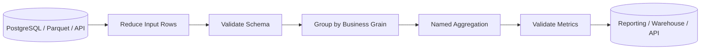

# 07- Named Aggregation

## Overview

Named aggregation is a Pandas pattern for producing **group-level metrics with explicit output column names**.

It is primarily used with `GroupBy.agg()`:

```python
summary = (
    orders.groupby("customer_id")
    .agg(
        total_revenue=("revenue", "sum"),
        average_order_value=("revenue", "mean"),
        order_count=("order_id", "nunique"),
    )
)
```

Instead of allowing Pandas to generate metric columns from source column names and aggregation functions, named aggregation lets you define the resulting schema directly.

This matters in production systems because aggregated DataFrames are often consumed by:

- REST APIs.
- Reporting jobs.
- Database loaders.
- Parquet datasets.
- BI tools.
- Downstream ETL stages.
- Automated validation and monitoring.

Explicit metric names make those interfaces easier to understand, validate, and maintain.

---

## Why Named Aggregation Exists

A conventional aggregation can produce hierarchical column names:

```python
summary = (
    orders.groupby("customer_id")
    .agg({
        "revenue": ["sum", "mean"],
        "order_id": ["count", "nunique"],
    })
)
```

The resulting columns can resemble:

```text
revenue                order_id
sum        mean        count     nunique
```

This creates a `MultiIndex` on the columns.

For analysis this may be acceptable, but for production pipelines it often creates additional work.

Named aggregation produces a flat, intentional schema:

```text
customer_id
total_revenue
average_order_value
order_count
unique_orders
```

The output schema itself communicates the business meaning of each metric.

---

## Standard Syntax

The core syntax is:

```python
DataFrameGroupBy.agg(
    output_name=("source_column", "aggregation_function")
)
```

Example:

```python
summary = (
    orders.groupby("customer_id")
    .agg(
        total_revenue=("revenue", "sum"),
        average_revenue=("revenue", "mean"),
    )
)
```

Each named aggregation has the form:

```python
new_column=("existing_column", "function")
```

The left side defines the output column name.

The right side identifies:

1. The source column.
2. The aggregation function.

---

## Basic Example

Consider an order dataset:

```python
import pandas as pd


orders = pd.DataFrame(
    {
        "customer_id": [101, 101, 102, 102, 102],
        "order_id": [1, 2, 3, 4, 5],
        "revenue": [120.0, 80.0, 250.0, 150.0, 100.0],
    }
)
```

Aggregate by customer:

```python
customer_summary = (
    orders.groupby("customer_id")
    .agg(
        total_revenue=("revenue", "sum"),
        average_order_value=("revenue", "mean"),
        order_count=("order_id", "count"),
    )
)
```

Result:

```text
             total_revenue  average_order_value  order_count
customer_id
101                   200.0               100.0            2
102                   500.0               166.7            3
```

The aggregation changes the grain from:

```text
one row = one order
```

to:

```text
one row = one customer
```

Named aggregation controls the metric schema at that new grain.

---

## Multiple Metrics from One Column

Multiple aggregations can use the same source column:

```python
customer_summary = (
    orders.groupby("customer_id")
    .agg(
        total_revenue=("revenue", "sum"),
        average_revenue=("revenue", "mean"),
        maximum_revenue=("revenue", "max"),
        minimum_revenue=("revenue", "min"),
    )
)
```

This is common for reporting and operational analytics.

The important distinction is that the source column can be reused while every output metric receives an independent name.

---

## Aggregating Different Source Columns

Named aggregation is especially useful when metrics come from different fields:

```python
customer_summary = (
    orders.groupby("customer_id")
    .agg(
        total_revenue=("revenue", "sum"),
        order_count=("order_id", "nunique"),
        average_discount=("discount_amount", "mean"),
    )
)
```

The output schema is explicit:

```text
customer_id
total_revenue
order_count
average_discount
```

This is easier to consume than an automatically generated hierarchy of source-column/function combinations.

---

## Named Aggregation with `as_index=False`

For many ETL pipelines, a flat DataFrame is more convenient:

```python
customer_summary = (
    orders.groupby(
        "customer_id",
        as_index=False,
    )
    .agg(
        total_revenue=("revenue", "sum"),
        order_count=("order_id", "nunique"),
    )
)
```

Result:

```text
customer_id | total_revenue | order_count
------------|---------------|------------
101         | 200.0         | 2
102         | 500.0         | 3
```

This is useful when the result will be:

- Written to CSV.
- Written to Parquet.
- Inserted into a database.
- Serialized as JSON.
- Passed to another transformation stage.

---

## Named Aggregation with Multiple Grouping Keys

Multiple grouping dimensions are supported:

```python
regional_summary = (
    orders.groupby(
        ["region", "sales_channel"],
        as_index=False,
    )
    .agg(
        total_revenue=("revenue", "sum"),
        order_count=("order_id", "nunique"),
    )
)
```

The resulting grain is:

```text
one row = one region + sales channel
```

Always document or validate this grain when the DataFrame becomes part of a production data contract.

---

## Common Aggregation Functions

Named aggregation works with standard Pandas aggregation functions:

| Function | Purpose |
| --- | --- |
| `sum` | Total |
| `mean` | Average |
| `median` | Median |
| `min` | Minimum |
| `max` | Maximum |
| `count` | Non-null values |
| `size` | Number of rows |
| `nunique` | Number of unique non-null values |
| `std` | Standard deviation |
| `var` | Variance |
| `first` | First value |
| `last` | Last value |

Example:

```python
summary = (
    orders.groupby("customer_id")
    .agg(
        total_revenue=("revenue", "sum"),
        average_revenue=("revenue", "mean"),
        order_count=("order_id", "count"),
        unique_products=("product_id", "nunique"),
        earliest_order=("created_at", "min"),
        latest_order=("created_at", "max"),
    )
)
```

---

## `count()` Versus `size()`

This distinction is important.

`count()` counts non-null values in the selected column:

```python
order_count = (
    orders.groupby("customer_id")
    .agg(
        order_count=("order_id", "count")
    )
)
```

`size()` counts rows regardless of whether a specific column is null.

Named aggregation does not directly use:

```python
("order_id", "size")
```

for the same semantic reason that `size()` operates on group size rather than non-null values of the selected column.

A useful pattern is:

```python
order_counts = (
    orders.groupby("customer_id")
    .size()
    .rename("order_count")
    .reset_index()
)
```

Choose based on the business definition of "count".

---

## `nunique()` for Entity Counts

For entity-level metrics:

```python
customer_summary = (
    orders.groupby("region")
    .agg(
        unique_customers=("customer_id", "nunique"),
        unique_products=("product_id", "nunique"),
        total_revenue=("revenue", "sum"),
    )
)
```

This prevents duplicate transaction rows from inflating entity counts.

Be explicit about whether duplicates are legitimate or indicate an upstream data-quality problem.

---

## Missing Values

Aggregation functions have different null behavior.

For example:

```python
summary = (
    orders.groupby("customer_id")
    .agg(
        total_revenue=("revenue", "sum"),
        average_revenue=("revenue", "mean"),
        order_count=("order_id", "count"),
        unique_orders=("order_id", "nunique"),
    )
)
```

Typically:

- `sum()` ignores missing values.
- `mean()` ignores missing values.
- `count()` excludes missing values.
- `nunique()` excludes missing values by default.

This means:

```text
revenue = [100, NaN]
```

can produce:

```text
sum  = 100
mean = 100
```

A production pipeline must distinguish:

```text
missing because no value exists
```

from:

```text
missing because upstream data is invalid
```

Aggregation semantics should not silently replace data-quality rules.

---

## Explicit Missing-Value Validation

When completeness matters, validate before aggregation:

```python
required_columns = [
    "customer_id",
    "revenue",
]

missing_revenue = orders["revenue"].isna()

if missing_revenue.any():
    raise ValueError(
        "Revenue contains missing values."
    )
```

Or produce a data-quality metric alongside the business metrics:

```python
summary = (
    orders.groupby("customer_id")
    .agg(
        total_revenue=("revenue", "sum"),
        missing_revenue_count=(
            "revenue",
            lambda values: values.isna().sum(),
        ),
    )
)
```

For performance-sensitive pipelines, built-in aggregations are generally preferable to Python lambdas when equivalent operations exist.

---

## Custom Aggregation Functions

Named aggregation can call custom functions:

```python
def revenue_range(values: pd.Series) -> float:
    return values.max() - values.min()


summary = (
    orders.groupby("customer_id")
    .agg(
        revenue_range=("revenue", revenue_range),
    )
)
```

Use custom aggregation when the metric cannot be expressed cleanly with an existing Pandas aggregation.

Keep custom functions:

- Deterministic.
- Side-effect free.
- Small.
- Independently testable.
- Explicit about null behavior.

Avoid external API calls, database queries, or other I/O inside aggregation functions.

---

## Lambda Aggregations

Lambdas are useful for short calculations:

```python
summary = (
    orders.groupby("customer_id")
    .agg(
        revenue_range=(
            "revenue",
            lambda values:
                values.max() - values.min(),
        ),
    )
)
```

However, named functions are often better for important business metrics:

```python
def revenue_range(values: pd.Series) -> float:
    return values.max() - values.min()
```

Then:

```python
summary = (
    orders.groupby("customer_id")
    .agg(
        revenue_range=("revenue", revenue_range),
    )
)
```

Named functions improve:

- Unit testing.
- Stack traces.
- Code review.
- Reuse.
- Documentation.

---

## Business Metrics with Named Aggregation

Named aggregation is well suited to reporting models.

Example:

```python
sales_report = (
    orders.groupby(
        ["region", "order_date"],
        as_index=False,
    )
    .agg(
        gross_revenue=("revenue", "sum"),
        order_count=("order_id", "nunique"),
        unique_customers=("customer_id", "nunique"),
        average_order_value=("revenue", "mean"),
    )
)
```

This output can become a reporting table:

```text
region
order_date
gross_revenue
order_count
unique_customers
average_order_value
```

The metric names form part of the interface between the Pandas transformation and the reporting system.

---

## Designing Stable Output Schemas

A production aggregation should have an intentional schema.

For example:

```python
summary = (
    orders.groupby("customer_id", as_index=False)
    .agg(
        total_revenue=("revenue", "sum"),
        order_count=("order_id", "nunique"),
        average_order_value=("revenue", "mean"),
    )
)
```

Define expected columns explicitly:

```python
expected_columns = [
    "customer_id",
    "total_revenue",
    "order_count",
    "average_order_value",
]

if summary.columns.tolist() != expected_columns:
    raise ValueError(
        "Unexpected aggregation schema."
    )
```

This catches accidental changes before the data reaches downstream systems.

---

## Data Types

Aggregation can change data types depending on the source dtype, nullability, and function.

For example:

```python
summary = (
    orders.groupby("customer_id", as_index=False)
    .agg(
        total_revenue=("revenue", "sum"),
        order_count=("order_id", "nunique"),
    )
)
```

Do not assume that every aggregation returns the exact dtype you want for storage.

Validate important fields explicitly:

```python
summary["order_count"] = summary[
    "order_count"
].astype("Int64")
```

For financial data, validate the numeric representation and rounding policy before exporting or persisting results.

---

## Aggregation and Index Behavior

By default:

```python
summary = (
    orders.groupby("customer_id")
    .agg(
        total_revenue=("revenue", "sum")
    )
)
```

produces a grouped index:

```text
             total_revenue
customer_id
101                 200.0
102                 500.0
```

For flat relational-style output:

```python
summary = (
    orders.groupby(
        "customer_id",
        as_index=False,
    )
    .agg(
        total_revenue=("revenue", "sum")
    )
)
```

Alternatively:

```python
summary = (
    orders.groupby("customer_id")
    .agg(
        total_revenue=("revenue", "sum")
    )
    .reset_index()
)
```

Both can be valid; `as_index=False` often communicates the desired output shape more directly at the grouping stage.

---

## Avoiding `MultiIndex` Columns

Without named aggregation:

```python
summary = (
    orders.groupby("customer_id")
    .agg({
        "revenue": ["sum", "mean"],
        "order_id": ["count", "nunique"],
    })
)
```

the result may contain:

```text
MultiIndex(
    [
        ("revenue", "sum"),
        ("revenue", "mean"),
        ("order_id", "count"),
        ("order_id", "nunique"),
    ]
)
```

Flattening later is possible:

```python
summary.columns = [
    "_".join(column).strip("_")
    for column in summary.columns
]
```

But when the output schema is known in advance, named aggregation is usually cleaner:

```python
summary = (
    orders.groupby("customer_id")
    .agg(
        total_revenue=("revenue", "sum"),
        average_revenue=("revenue", "mean"),
        order_count=("order_id", "count"),
        unique_orders=("order_id", "nunique"),
    )
)
```

Define the schema at the point where the aggregation is created rather than repairing it afterward.

---

## Named Aggregation Versus Dictionary Aggregation

| Requirement | Dictionary Aggregation | Named Aggregation |
| --- | --- | --- |
| Simple single metric | Good | Good |
| Multiple functions on one source column | Good | Excellent |
| Explicit business-oriented names | Less direct | Excellent |
| Flat output schema | May require post-processing | Natural |
| Avoiding `MultiIndex` columns | Less convenient | Excellent |
| Reusable production schema | Moderate | Strong |
| Complex custom functions | Supported | Supported |

Named aggregation is generally the preferred pattern for production reporting and ETL code where output column names are part of the contract.

---

## Named Aggregation Versus `transform()`

Named aggregation reduces each group:

```python
summary = (
    orders.groupby("customer_id")
    .agg(
        total_revenue=("revenue", "sum"),
    )
)
```

`transform()` preserves the original row count:

```python
orders["customer_total_revenue"] = (
    orders.groupby("customer_id")[
        "revenue"
    ]
    .transform("sum")
)
```

The choice depends on output grain:

```text
agg()
    → one row per group

transform()
    → one result per original row
```

Do not use named aggregation when the downstream operation needs a value aligned to every original record.

---

## Named Aggregation Versus `filter()`

`filter()` decides which groups survive:

```python
result = (
    orders.groupby("customer_id")
    .filter(
        lambda group:
            group["revenue"].sum() >= 10_000
    )
)
```

Named aggregation produces group-level metrics:

```python
summary = (
    orders.groupby("customer_id")
    .agg(
        total_revenue=("revenue", "sum"),
    )
)
```

If you need both a metric and a qualification rule, calculate the metric first when that makes the pipeline easier to inspect and validate:

```python
customer_summary = (
    orders.groupby("customer_id", as_index=False)
    .agg(
        total_revenue=("revenue", "sum"),
        order_count=("order_id", "nunique"),
    )
)

qualified_customers = customer_summary.loc[
    customer_summary["total_revenue"].ge(10_000)
]
```

---

## SQL Relationship

Named aggregation maps naturally to SQL aggregate expressions:

```python
summary = (
    orders.groupby("customer_id", as_index=False)
    .agg(
        total_revenue=("revenue", "sum"),
        order_count=("order_id", "nunique"),
        average_order_value=("revenue", "mean"),
    )
)
```

Comparable SQL:

```sql
SELECT
    customer_id,
    SUM(revenue) AS total_revenue,
    COUNT(DISTINCT order_id) AS order_count,
    AVG(revenue) AS average_order_value
FROM orders
GROUP BY customer_id;
```

This similarity is useful when moving logic between PostgreSQL and Pandas.

The metric name after `AS` corresponds directly to the named aggregation output.

---

## Database Pushdown

When the source data is already in PostgreSQL, aggregation is often a good candidate for pushdown.

Instead of:

```text
PostgreSQL
    ↓
millions of raw rows
    ↓
Pandas
    ↓
groupby().agg()
```

prefer, where practical:

```text
PostgreSQL
    ↓
GROUP BY
    ↓
small aggregated result
    ↓
Pandas
```

Example:

```python
query = """
SELECT
    customer_id,
    SUM(revenue) AS total_revenue,
    COUNT(DISTINCT order_id) AS order_count,
    AVG(revenue) AS average_order_value
FROM orders
WHERE order_date >= %(start_date)s
  AND order_date < %(end_date)s
GROUP BY customer_id
"""
```

This can significantly reduce:

- Network transfer.
- Pandas memory usage.
- Python processing time.
- Database-to-application serialization overhead.

The database should not be bypassed merely because the same aggregation can be expressed in Pandas.

---

## REST API and JSON Output

Named aggregation is useful when generating API-ready records.

Example:

```python
customer_summary = (
    orders.groupby(
        "customer_id",
        as_index=False,
    )
    .agg(
        total_revenue=("revenue", "sum"),
        order_count=("order_id", "nunique"),
    )
)

response_payload = customer_summary.to_dict(
    orient="records"
)
```

The resulting records have predictable keys:

```json
[
  {
    "customer_id": 101,
    "total_revenue": 200.0,
    "order_count": 2
  }
]
```

For FastAPI or Django APIs, validate the final schema before serialization rather than relying on dynamically generated column names.

---

## Parquet and Data Warehouse Outputs

Named aggregation is useful before writing curated datasets:

```python
daily_metrics = (
    orders.groupby(
        ["order_date", "region"],
        as_index=False,
    )
    .agg(
        gross_revenue=("revenue", "sum"),
        order_count=("order_id", "nunique"),
        customer_count=("customer_id", "nunique"),
    )
)

daily_metrics.to_parquet(
    "output/daily_metrics.parquet",
    index=False,
)
```

Stable names help downstream jobs read the dataset consistently.

For partitioned datasets, also validate that the grouping keys and partition columns have compatible types.

---

## Performance Considerations

Named aggregation itself is not primarily a performance feature.

Its main advantage is **schema clarity**.

Performance depends primarily on:

- Number of rows.
- Number of groups.
- Grouping-key cardinality.
- Number of metrics.
- Aggregation functions.
- Source dtypes.
- Whether the data has already been reduced.
- Whether the work could be pushed into SQL.

Prefer built-in aggregations:

```python
("revenue", "sum")
```

over custom Python functions when possible.

Built-in operations generally allow Pandas to use optimized internal implementations.

---

## Avoid Unnecessary Custom Functions

Prefer:

```python
summary = (
    orders.groupby("customer_id")
    .agg(
        total_revenue=("revenue", "sum"),
    )
)
```

over:

```python
summary = (
    orders.groupby("customer_id")
    .agg(
        total_revenue=(
            "revenue",
            lambda values: values.sum(),
        ),
    )
)
```

The lambda adds no business value and may introduce unnecessary Python-level work.

Custom functions should exist because custom logic is required, not because the function name was wrapped unnecessarily.

---

## Large Dataset Considerations

For large datasets, named aggregation should be treated as one stage in a broader pipeline:



The biggest performance improvement may come from reducing the data before Pandas receives it.

Examples:

```text
Date partition filtering
Column projection
SQL aggregation
Parquet column pruning
Incremental processing
```

---

## Memory Management

Aggregation creates a new result DataFrame.

The result may be much smaller than the input:

```text
10 million orders
       ↓
group by customer
       ↓
500,000 customers
```

But the input still needs to fit in memory unless processing is performed incrementally or pushed down to another engine.

Select only the columns needed by the aggregation:

```python
working = orders[
    [
        "customer_id",
        "order_id",
        "revenue",
    ]
]

summary = (
    working.groupby(
        "customer_id",
        as_index=False,
    )
    .agg(
        total_revenue=("revenue", "sum"),
        order_count=("order_id", "nunique"),
    )
)
```

Avoid carrying large unused columns through the grouping stage.

---

## Reliability and Data Contracts

Aggregated datasets frequently become internal APIs.

Define the contract explicitly:

```text
Grain:
    one row per customer

Required dimensions:
    customer_id

Metrics:
    total_revenue
    order_count
    average_order_value
```

Then validate:

```python
expected_columns = {
    "customer_id",
    "total_revenue",
    "order_count",
    "average_order_value",
}

actual_columns = set(
    customer_summary.columns
)

if actual_columns != expected_columns:
    raise ValueError(
        "Customer summary schema changed."
    )
```

Also validate semantic invariants where relevant:

```python
if (
    customer_summary["total_revenue"] < 0
).any():
    raise ValueError(
        "Negative revenue detected."
    )
```

Column existence alone does not guarantee data correctness.

---

## Duplicate Input Records

Aggregation naturally combines duplicate rows.

That can be correct or dangerous.

Suppose the input accidentally contains:

```text
order_id = 1001
revenue = 500
```

twice.

Then:

```python
total_revenue=("revenue", "sum")
```

will count both rows.

If `order_id` is expected to be unique, validate it before aggregation:

```python
duplicate_orders = orders.duplicated(
    subset=["order_id"]
)

if duplicate_orders.any():
    raise ValueError(
        "Duplicate order IDs detected."
    )
```

Do not rely on aggregation to repair upstream data-quality problems.

---

## Empty DataFrames

An empty input should be handled deliberately.

Example:

```python
if orders.empty:
    customer_summary = pd.DataFrame(
        columns=[
            "customer_id",
            "total_revenue",
            "order_count",
        ]
    )
else:
    customer_summary = (
        orders.groupby(
            "customer_id",
            as_index=False,
        )
        .agg(
            total_revenue=("revenue", "sum"),
            order_count=("order_id", "nunique"),
        )
    )
```

For reusable pipelines, define whether an empty dataset means:

- No data for this reporting interval.
- Valid zero-result output.
- Upstream failure.
- Invalid input.

Those states should not be conflated.

---

## Testing Named Aggregation

Tests should validate:

- Output column names.
- Output grain.
- Metric values.
- Null behavior.
- Duplicate semantics.
- Empty input behavior.
- Data types where contractual.
- Grouping-key behavior.

Example:

```python
import pandas as pd
from pandas.testing import assert_frame_equal


def test_customer_summary() -> None:
    orders = pd.DataFrame(
        {
            "customer_id": [101, 101, 102],
            "order_id": [1, 2, 3],
            "revenue": [100.0, 50.0, 200.0],
        }
    )

    actual = (
        orders.groupby(
            "customer_id",
            as_index=False,
        )
        .agg(
            total_revenue=("revenue", "sum"),
            order_count=("order_id", "nunique"),
        )
    )

    expected = pd.DataFrame(
        {
            "customer_id": [101, 102],
            "total_revenue": [150.0, 200.0],
            "order_count": [2, 1],
        }
    )

    assert_frame_equal(
        actual,
        expected,
    )
```

The test verifies the business transformation rather than merely asserting that `.agg()` executes successfully.

---

## Testing the Output Schema

Schema tests are valuable for downstream consumers:

```python
expected_columns = [
    "customer_id",
    "total_revenue",
    "order_count",
]

assert customer_summary.columns.tolist() == (
    expected_columns
)
```

This catches accidental renaming that may otherwise break:

- SQL inserts.
- API serialization.
- BI dashboards.
- Parquet readers.
- Data contracts.

---

## Production Monitoring

Useful metrics for an aggregation job include:

```text
input_row_count
output_group_count
input_distinct_group_count
null_key_count
duplicate_key_count
processing_duration_ms
memory_usage_bytes
```

Business-level monitoring is also useful:

```text
total_revenue
average_order_value
orders_per_customer
group_retention_rate
```

Unexpected changes can indicate:

- Missing source data.
- Duplicate records.
- Schema changes.
- Incorrect filters.
- Changed grouping dimensions.
- Upstream ingestion failures.

---

## Security Considerations

Named aggregation does not provide access control.

Before aggregation in a multi-tenant system, make sure the input data has already been authorized:

```text
Authenticate
    ↓
Authorize tenant / user
    ↓
Restrict source rows
    ↓
Aggregate
    ↓
Return or persist metrics
```

Do not load unauthorized tenant records and assume aggregation will make them safe.

For sensitive reporting, also consider whether group sizes are large enough to avoid exposing information about individual records.

---

## Common Mistakes

### Using Generic Output Names

This is less useful:

```python
.agg(
    revenue_sum=("revenue", "sum"),
    revenue_mean=("revenue", "mean"),
)
```

when the business vocabulary is:

```text
gross_revenue
average_order_value
```

Use names that describe the actual metric.

---

### Relying on Source Column Names

A source field called:

```text
amount
```

could mean:

- Gross amount.
- Net amount.
- Tax amount.
- Refund amount.

Named aggregation should reflect the semantic meaning of the metric, not merely echo the source field name.

---

### Forgetting the Output Grain

This:

```python
orders.groupby("customer_id").agg(...)
```

means one row per customer.

If the report expects:

```text
customer + month
```

the grouping must include the month:

```python
orders.groupby(
    ["customer_id", "order_month"]
).agg(...)
```

Grouping keys define the output grain.

---

### Aggregating Without Validating Duplicates

Duplicate transaction rows can silently inflate sums and counts.

Validate entity keys when uniqueness is part of the data contract.

---

### Using Python Lambdas for Built-In Operations

Avoid:

```python
lambda values: values.sum()
```

when:

```python
"sum"
```

already expresses the operation.

Use built-in aggregators whenever available.

---

### Assuming Null Semantics Are Obvious

`sum`, `mean`, `count`, and `nunique` treat missing values differently.

Document and test the intended behavior.

---

## Interview Traps

### What Is Named Aggregation?

Named aggregation is a way to specify:

```python
output_name=("source_column", "aggregation_function")
```

inside `.agg()` so that grouped metrics receive explicit output names.

---

### Why Is Named Aggregation Useful?

It:

- Produces readable output schemas.
- Avoids unnecessary `MultiIndex` columns.
- Makes business metrics explicit.
- Simplifies downstream integration.
- Improves maintainability.

---

### What Is the Difference Between These?

```python
orders.groupby("customer_id").agg(
    revenue=("revenue", "sum")
)
```

and:

```python
orders.groupby("customer_id").transform("sum")
```

The first returns one row per customer.

The second returns one value aligned with every original row.

---

### Why Might Named Aggregation Be Better Than Dictionary Aggregation?

Compare:

```python
orders.groupby("customer_id").agg({
    "revenue": ["sum", "mean"]
})
```

with:

```python
orders.groupby("customer_id").agg(
    total_revenue=("revenue", "sum"),
    average_revenue=("revenue", "mean"),
)
```

The second directly defines a flat and business-oriented output schema.

---

## Recommended Production Pattern

A production aggregation function should make the grouping grain and schema obvious:

```python
import pandas as pd


def build_customer_summary(
    orders: pd.DataFrame,
) -> pd.DataFrame:
    required_columns = {
        "customer_id",
        "order_id",
        "revenue",
    }

    missing_columns = required_columns.difference(
        orders.columns
    )

    if missing_columns:
        raise ValueError(
            "Missing required columns: "
            f"{sorted(missing_columns)}"
        )

    if orders.empty:
        return pd.DataFrame(
            columns=[
                "customer_id",
                "total_revenue",
                "order_count",
                "average_order_value",
            ]
        )

    duplicate_orders = orders.duplicated(
        subset=["order_id"]
    )

    if duplicate_orders.any():
        raise ValueError(
            "Duplicate order IDs detected."
        )

    summary = (
        orders.groupby(
            "customer_id",
            as_index=False,
        )
        .agg(
            total_revenue=("revenue", "sum"),
            order_count=("order_id", "nunique"),
            average_order_value=("revenue", "mean"),
        )
    )

    return summary
```

This pattern provides:

```text
schema validation
    ↓
empty-input handling
    ↓
duplicate validation
    ↓
explicit grouping grain
    ↓
named metrics
    ↓
stable output schema
```

The exact validation rules should match the business contract rather than being copied blindly into every pipeline.

---

## Practical Decision Guide

| Situation | Recommended Pattern |
| --- | --- |
| One metric per group | Named aggregation |
| Multiple metrics with explicit names | Named aggregation |
| Existing code creates `MultiIndex` columns | Consider named aggregation |
| Need one row per source record | `transform()` |
| Need to keep/discard groups | `filter()` |
| Need group-level output plus later row filtering | `agg()` then filter |
| Aggregation already belongs in PostgreSQL | Push aggregation into SQL when practical |
| Custom metric unavailable as built-in | Named aggregation with tested function |
| Very large data | Reduce input and consider SQL/warehouse/distributed processing |

---

## Key Takeaways

- Named aggregation defines explicit output names with `output_name=("source_column", "aggregation")`, producing readable group-level schemas.
- It is particularly valuable for production ETL, reporting, APIs, Parquet datasets, and database workflows because metric names become part of a stable data contract.
- Grouping keys determine output grain; always make the intended grain explicit and validate it when the result is consumed downstream.
- Prefer built-in aggregation functions over unnecessary Python lambdas, and push aggregation into SQL or another scalable engine when the dataset makes in-memory Pandas processing inefficient.
- Treat nulls, duplicates, empty inputs, data types, schema changes, and authorization boundaries as separate engineering concerns rather than assuming aggregation resolves them automatically.