# 08- Multiple Aggregations

## Overview

Multiple aggregation means calculating **several metrics for each group in a single grouped operation**.

For example, an order dataset may need:

- Total revenue.
- Average order value.
- Number of orders.
- Number of unique customers.
- Minimum and maximum transaction values.

Pandas supports calculating these metrics together:

```python
customer_summary = (
    orders.groupby("customer_id")
    .agg(
        total_revenue=("revenue", "sum"),
        average_order_value=("revenue", "mean"),
        order_count=("order_id", "nunique"),
        minimum_order_value=("revenue", "min"),
        maximum_order_value=("revenue", "max"),
    )
)
```

Multiple aggregations are fundamental to reporting, ETL, analytics, and feature-generation pipelines because several related metrics can be produced at the same business grain in one transformation.

The important engineering concerns are not just syntax. You also need to reason about:

```text
grouping keys
    ↓
output grain
    ↓
metric definitions
    ↓
null semantics
    ↓
duplicate semantics
    ↓
data types
    ↓
performance
    ↓
output contract
```

---

## Why Multiple Aggregations Matter

A production report rarely needs only one metric.

For example, a customer reporting table might require:

```text
customer_id
total_revenue
order_count
average_order_value
unique_products
first_order_at
last_order_at
```

Computing these metrics together makes the transformation easier to understand and keeps all metrics aligned to the same grouping definition.

Instead of:

```python
total_revenue = (
    orders.groupby("customer_id")["revenue"]
    .sum()
)

order_count = (
    orders.groupby("customer_id")["order_id"]
    .nunique()
)

average_order_value = (
    orders.groupby("customer_id")["revenue"]
    .mean()
)
```

prefer a single aggregation when the metrics share the same grouping:

```python
customer_summary = (
    orders.groupby("customer_id")
    .agg(
        total_revenue=("revenue", "sum"),
        order_count=("order_id", "nunique"),
        average_order_value=("revenue", "mean"),
    )
)
```

This makes the intended output schema much clearer.

---

## Standard Syntax

The most readable modern form is named aggregation:

```python
result = (
    dataframe.groupby(group_keys)
    .agg(
        output_metric_1=("source_column_1", "function"),
        output_metric_2=("source_column_2", "function"),
        output_metric_3=("source_column_3", "function"),
    )
)
```

Example:

```python
summary = (
    orders.groupby("region")
    .agg(
        total_revenue=("revenue", "sum"),
        average_revenue=("revenue", "mean"),
        order_count=("order_id", "nunique"),
    )
)
```

Each metric is defined independently.

---

## Example Dataset

Consider an order table:

```python
import pandas as pd


orders = pd.DataFrame(
    {
        "order_id": [1001, 1002, 1003, 1004, 1005],
        "customer_id": [101, 101, 102, 102, 103],
        "region": [
            "North",
            "North",
            "South",
            "South",
            "North",
        ],
        "revenue": [
            120.0,
            80.0,
            250.0,
            150.0,
            200.0,
        ],
        "discount": [
            10.0,
            5.0,
            20.0,
            10.0,
            15.0,
        ],
    }
)
```

We can produce several customer metrics:

```python
customer_summary = (
    orders.groupby(
        "customer_id",
        as_index=False,
    )
    .agg(
        total_revenue=("revenue", "sum"),
        average_order_value=("revenue", "mean"),
        total_discount=("discount", "sum"),
        order_count=("order_id", "nunique"),
    )
)
```

The output grain is:

```text
one row = one customer
```

---

## Multiple Aggregations on the Same Column

A common requirement is to calculate several statistics from one column:

```python
summary = (
    orders.groupby("region")
    .agg(
        total_revenue=("revenue", "sum"),
        average_revenue=("revenue", "mean"),
        median_revenue=("revenue", "median"),
        minimum_revenue=("revenue", "min"),
        maximum_revenue=("revenue", "max"),
    )
)
```

This is useful for operational dashboards and reporting because one source metric can generate several business indicators.

---

## Multiple Aggregations Across Different Columns

Different metrics can operate on different source fields:

```python
summary = (
    orders.groupby("region")
    .agg(
        total_revenue=("revenue", "sum"),
        total_discount=("discount", "sum"),
        unique_customers=("customer_id", "nunique"),
        order_count=("order_id", "nunique"),
    )
)
```

There is no requirement that all metrics use the same source column.

---

## Aggregation Function Selection

The aggregation function must match the metric definition.

| Requirement | Typical Aggregation |
| --- | --- |
| Total monetary value | `sum` |
| Average value | `mean` |
| Typical middle value | `median` |
| Smallest value | `min` |
| Largest value | `max` |
| Number of non-null values | `count` |
| Number of rows | `size` |
| Number of unique entities | `nunique` |
| Earliest timestamp | `min` |
| Latest timestamp | `max` |
| Variability | `std` or `var` |

Do not select an aggregation merely because it is available. Define what the metric means first.

---

## Count Semantics

Count-related metrics are especially easy to get wrong.

### Counting Non-Null Values

```python
summary = (
    orders.groupby("customer_id")
    .agg(
        order_count=("order_id", "count"),
    )
)
```

This counts non-null `order_id` values.

### Counting Unique Orders

```python
summary = (
    orders.groupby("customer_id")
    .agg(
        order_count=("order_id", "nunique"),
    )
)
```

This protects against repeated identifiers when duplicates exist.

### Counting Rows

For raw group size:

```python
row_counts = (
    orders.groupby("customer_id")
    .size()
    .rename("row_count")
    .reset_index()
)
```

The difference matters when the source contains nulls or duplicate records.

---

## Distinct Entity Metrics

For business reporting, `nunique()` is often more meaningful than `count()`.

Example:

```python
regional_summary = (
    orders.groupby("region")
    .agg(
        order_count=("order_id", "nunique"),
        customer_count=("customer_id", "nunique"),
        product_count=("product_id", "nunique"),
    )
)
```

This distinguishes:

```text
number of rows
```

from:

```text
number of unique business entities
```

---

## Grouping by Multiple Dimensions

Multiple aggregations become particularly useful with multidimensional reports:

```python
regional_summary = (
    orders.groupby(
        ["region", "sales_channel"],
        as_index=False,
    )
    .agg(
        total_revenue=("revenue", "sum"),
        order_count=("order_id", "nunique"),
        customer_count=("customer_id", "nunique"),
        average_order_value=("revenue", "mean"),
    )
)
```

The output grain is:

```text
one row = one region + one sales channel
```

Adding a grouping key can substantially change the result.

Treat grouping keys as part of the data contract.

---

## Named Aggregation

For production code, named aggregation is usually the clearest style:

```python
summary = (
    orders.groupby("customer_id")
    .agg(
        total_revenue=("revenue", "sum"),
        average_order_value=("revenue", "mean"),
        order_count=("order_id", "nunique"),
    )
)
```

The left-hand names become the output columns.

This avoids output such as:

```text
revenue_sum
revenue_mean
order_id_nunique
```

or more complex `MultiIndex` column structures generated by older aggregation styles.

---

## Dictionary-Based Aggregation

Pandas also supports dictionary-style definitions:

```python
summary = (
    orders.groupby("customer_id")
    .agg(
        {
            "revenue": ["sum", "mean", "max"],
            "order_id": ["count", "nunique"],
        }
    )
)
```

This can be compact, but typically produces hierarchical columns.

For example:

```text
revenue           order_id
sum  mean  max    count  nunique
```

That can require additional normalization before sending the result to a database, API, or file.

For production-facing schemas, named aggregation is usually preferable.

---

## `as_index=False`

For a relational-style result:

```python
summary = (
    orders.groupby(
        "customer_id",
        as_index=False,
    )
    .agg(
        total_revenue=("revenue", "sum"),
        order_count=("order_id", "nunique"),
    )
)
```

The grouping key remains a column:

```text
customer_id | total_revenue | order_count
```

This is often convenient for:

- CSV exports.
- Parquet datasets.
- Database inserts.
- JSON serialization.
- Data validation.
- API responses.

Without `as_index=False`, the group key becomes part of the index.

---

## Index Behavior

Default behavior:

```python
summary = (
    orders.groupby("customer_id")
    .agg(
        total_revenue=("revenue", "sum")
    )
)
```

The result uses:

```text
customer_id
```

as its index.

To restore a regular column:

```python
summary = (
    orders.groupby("customer_id")
    .agg(
        total_revenue=("revenue", "sum")
    )
    .reset_index()
)
```

Or use:

```python
summary = (
    orders.groupby(
        "customer_id",
        as_index=False,
    )
    .agg(
        total_revenue=("revenue", "sum")
    )
)
```

Choose deliberately based on downstream usage.

---

## Missing Values

Different aggregation functions have different null behavior.

Example:

```python
summary = (
    orders.groupby("customer_id")
    .agg(
        total_revenue=("revenue", "sum"),
        average_revenue=("revenue", "mean"),
        order_count=("order_id", "count"),
        unique_customers=("customer_id", "nunique"),
    )
)
```

Common behavior includes:

```text
sum()
    → ignores missing values

mean()
    → ignores missing values

count()
    → excludes null values

nunique()
    → excludes null values by default
```

This means missing values can materially affect business metrics.

If revenue completeness is a requirement, validate it separately instead of assuming aggregation detects the problem.

---

## Missing Group Keys

Grouping keys containing null values require an explicit decision.

By default:

```python
orders.groupby("region")
```

does not include missing group keys in the same way as an explicit null group.

When missing grouping keys should be retained:

```python
summary = (
    orders.groupby(
        "region",
        dropna=False,
    )
    .agg(
        total_revenue=("revenue", "sum"),
        order_count=("order_id", "nunique"),
    )
)
```

This is useful for data-quality and reconciliation reports.

For customer-facing reports, an unknown region may instead need to be rejected or mapped to a controlled category.

---

## Invalid Values

Aggregation does not validate business correctness.

Consider:

```python
orders["revenue"] = pd.to_numeric(
    orders["revenue"],
    errors="coerce",
)
```

Invalid values may become missing.

Then:

```python
summary = (
    orders.groupby("region")
    .agg(
        total_revenue=("revenue", "sum"),
    )
)
```

can produce a valid-looking result while silently excluding invalid values from the sum.

For critical financial pipelines:

```python
if orders["revenue"].isna().any():
    raise ValueError(
        "Revenue contains invalid or missing values."
    )
```

Validate before aggregation when invalid input must fail the job.

---

## Duplicate Input Records

Multiple aggregations can magnify the impact of duplicates.

Suppose the same order appears twice:

```text
order_id = 1001
revenue  = 500
```

Then:

```python
.agg(
    total_revenue=("revenue", "sum"),
    order_count=("order_id", "nunique"),
)
```

produces:

```text
total_revenue → inflated
order_count   → possibly unchanged
```

This is particularly dangerous because some metrics may still appear reasonable.

Validate expected uniqueness:

```python
duplicate_orders = orders.duplicated(
    subset=["order_id"]
)

if duplicate_orders.any():
    raise ValueError(
        "Duplicate order IDs detected."
    )
```

---

## Custom Aggregations

Multiple aggregations can include custom functions:

```python
def revenue_range(values: pd.Series) -> float:
    return values.max() - values.min()


summary = (
    orders.groupby("customer_id")
    .agg(
        total_revenue=("revenue", "sum"),
        average_revenue=("revenue", "mean"),
        revenue_range=("revenue", revenue_range),
    )
)
```

Keep custom functions small and deterministic.

Avoid:

```python
def calculate_metric(values):
    call_external_api()
    update_database()
    return ...
```

Aggregation functions are not an appropriate place for external side effects.

---

## Prefer Built-In Aggregations

Prefer:

```python
summary = (
    orders.groupby("customer_id")
    .agg(
        total_revenue=("revenue", "sum"),
        average_revenue=("revenue", "mean"),
    )
)
```

over:

```python
summary = (
    orders.groupby("customer_id")
    .agg(
        total_revenue=(
            "revenue",
            lambda values: values.sum(),
        ),
        average_revenue=(
            "revenue",
            lambda values: values.mean(),
        ),
    )
)
```

The built-in form is clearer and allows Pandas to use optimized implementations.

Use custom functions only when the metric actually requires custom logic.

---

## Output Schema Design

A good multiple-aggregation result has an explicit schema.

Example:

```python
customer_summary = (
    orders.groupby(
        "customer_id",
        as_index=False,
    )
    .agg(
        total_revenue=("revenue", "sum"),
        order_count=("order_id", "nunique"),
        average_order_value=("revenue", "mean"),
        first_order_at=("created_at", "min"),
        last_order_at=("created_at", "max"),
    )
)
```

The schema is:

```text
customer_id
total_revenue
order_count
average_order_value
first_order_at
last_order_at
```

This is much easier to reason about than a dynamically generated schema.

---

## Metric Naming

Names should express business meaning.

Prefer:

```python
gross_revenue=("revenue", "sum")
```

over:

```python
revenue_sum=("revenue", "sum")
```

Prefer:

```python
unique_customers=("customer_id", "nunique")
```

over:

```python
customer_count=("customer_id", "count")
```

when the actual metric means unique customers.

Naming is not cosmetic. It prevents semantic ambiguity in downstream systems.

---

## Financial Reporting Example

A daily regional report might use:

```python
daily_regional_metrics = (
    orders.groupby(
        ["order_date", "region"],
        as_index=False,
    )
    .agg(
        gross_revenue=("revenue", "sum"),
        total_discount=("discount", "sum"),
        order_count=("order_id", "nunique"),
        customer_count=("customer_id", "nunique"),
        average_order_value=("revenue", "mean"),
        minimum_order_value=("revenue", "min"),
        maximum_order_value=("revenue", "max"),
    )
)
```

The resulting dataset can be consumed by:

```text
Pandas
   ↓
Parquet
   ↓
S3
   ↓
Data warehouse
   ↓
BI dashboard
```

The grouping dimensions and metric names form the semantic contract of the report.

---

## API Reporting Example

A FastAPI service may expose aggregated metrics:

```python
customer_summary = (
    orders.groupby(
        "customer_id",
        as_index=False,
    )
    .agg(
        total_revenue=("revenue", "sum"),
        order_count=("order_id", "nunique"),
        average_order_value=("revenue", "mean"),
    )
)

payload = customer_summary.to_dict(
    orient="records"
)
```

Example output:

```json
[
  {
    "customer_id": 101,
    "total_revenue": 200.0,
    "order_count": 2,
    "average_order_value": 100.0
  }
]
```

For an API, validate the output schema through the API's response model rather than assuming the DataFrame schema will remain unchanged forever.

---

## SQL Equivalent

Multiple Pandas aggregations map naturally to SQL:

```python
summary = (
    orders.groupby(
        "customer_id",
        as_index=False,
    )
    .agg(
        total_revenue=("revenue", "sum"),
        order_count=("order_id", "nunique"),
        average_order_value=("revenue", "mean"),
    )
)
```

Equivalent SQL:

```sql
SELECT
    customer_id,
    SUM(revenue) AS total_revenue,
    COUNT(DISTINCT order_id) AS order_count,
    AVG(revenue) AS average_order_value
FROM orders
GROUP BY customer_id;
```

This makes it easier to decide whether the computation belongs in PostgreSQL or Pandas.

---

## SQL Pushdown

If the source is PostgreSQL and the aggregation can be expressed efficiently in SQL, pushing the work into the database may be preferable.

Instead of:

```text
Database
    ↓
raw rows
    ↓
network
    ↓
Pandas
    ↓
groupby + multiple aggregations
```

prefer:

```text
Database
    ↓
WHERE / GROUP BY / aggregation
    ↓
small result
    ↓
Pandas
```

This can reduce:

- Network traffic.
- Application memory.
- Serialization overhead.
- Python processing time.

The trade-off is that database execution plans, indexes, partitioning, and workload contention must also be considered.

---

## API Data Example

Suppose an external API returns transaction records:

```python
transactions = pd.DataFrame(api_response)

transactions["amount"] = pd.to_numeric(
    transactions["amount"],
    errors="coerce",
)

regional_metrics = (
    transactions.groupby(
        "region",
        as_index=False,
    )
    .agg(
        total_amount=("amount", "sum"),
        average_amount=("amount", "mean"),
        transaction_count=("transaction_id", "nunique"),
    )
)
```

Before aggregation, validate that:

```text
region
transaction_id
amount
```

have the expected meaning and types.

API payloads should be treated as untrusted external input rather than assumed to match the DataFrame schema.

---

## Parquet Output

Multiple aggregations are often used to create compact reporting datasets:

```python
daily_metrics = (
    orders.groupby(
        ["order_date", "region"],
        as_index=False,
    )
    .agg(
        total_revenue=("revenue", "sum"),
        order_count=("order_id", "nunique"),
        customer_count=("customer_id", "nunique"),
    )
)

daily_metrics.to_parquet(
    "output/daily_metrics.parquet",
    index=False,
)
```

Compared with storing every raw order, the aggregated dataset can be substantially smaller and faster for reporting workloads.

Still validate:

- Column names.
- Dtypes.
- Partition strategy.
- Date boundaries.
- Null handling.

---

## Performance

Multiple aggregations are typically more efficient than repeatedly grouping the same DataFrame for separate metrics.

Less desirable:

```python
total_revenue = (
    orders.groupby("customer_id")["revenue"]
    .sum()
)

order_count = (
    orders.groupby("customer_id")["order_id"]
    .nunique()
)

average_revenue = (
    orders.groupby("customer_id")["revenue"]
    .mean()
)
```

Preferred:

```python
summary = (
    orders.groupby("customer_id")
    .agg(
        total_revenue=("revenue", "sum"),
        order_count=("order_id", "nunique"),
        average_revenue=("revenue", "mean"),
    )
)
```

The exact runtime depends on the grouping keys, dtypes, functions, and dataset characteristics, but combining related metrics is generally a cleaner and more efficient design than repeatedly reconstructing the same grouped operation.

---

## Expensive Aggregations

Not all aggregations have the same cost.

For example:

```python
nunique
```

may require substantially more work than:

```python
sum
```

especially with high-cardinality values.

Similarly, custom Python functions can be significantly more expensive than built-in aggregations.

When processing large datasets:

```text
cheap built-in aggregations
    ↓
usually preferable

Python-level custom aggregation
    ↓
use only when necessary
```

Profile real workloads rather than assuming every aggregation has the same cost.

---

## Group Cardinality

Aggregation cost depends heavily on the number of distinct groups.

Grouping by:

```python
customer_id
```

might create hundreds of thousands of groups.

Grouping by:

```python
country
```

might create only hundreds.

High-cardinality grouping increases memory and processing overhead.

Ask:

```text
What is the output grain?
How many distinct groups should exist?
Is this aggregation actually necessary at this layer?
```

before processing very large datasets.

---

## Categorical Grouping

For low-cardinality dimensions, categorical dtypes can reduce memory usage:

```python
orders["region"] = orders["region"].astype(
    "category"
)

summary = (
    orders.groupby(
        "region",
        observed=True,
        as_index=False,
    )
    .agg(
        total_revenue=("revenue", "sum"),
        order_count=("order_id", "nunique"),
    )
)
```

`observed=True` is often useful when you only want combinations represented by the data rather than all possible category combinations.

Use categorical types deliberately and centralize category definitions when they form part of a business contract.

---

## Memory Optimization

Before aggregation:

```python
working = orders[
    [
        "customer_id",
        "order_id",
        "revenue",
        "discount",
        "created_at",
    ]
]
```

Avoid carrying large unused columns through the groupby operation.

For large ETL pipelines:

```text
Source
  ↓
Column projection
  ↓
Row filtering
  ↓
Type normalization
  ↓
Grouping
  ↓
Multiple aggregations
  ↓
Small result
```

Reducing input size often matters more than micro-optimizing the aggregation syntax.

---

## Large Dataset Strategy

When the DataFrame is too large for comfortable in-memory processing, consider:

```text
PostgreSQL
    → aggregate in SQL

Parquet
    → filter/project early

DuckDB
    → query local files efficiently

Spark
    → distributed aggregation

Warehouse
    → centralized analytical aggregation
```

Pandas remains appropriate when the working set fits in memory and the transformation complexity benefits from Python/Pandas semantics.

---

## Empty DataFrames

An empty input can occur legitimately during:

- A date range with no events.
- A failed upstream partition.
- An incremental job with no new records.
- A valid filter that removes all rows.

Handle it explicitly when downstream systems distinguish between no data and failure.

```python
if orders.empty:
    return pd.DataFrame(
        columns=[
            "customer_id",
            "total_revenue",
            "order_count",
            "average_order_value",
        ]
    )
```

A pipeline should not treat an empty result as an exception unless the business contract requires data to exist.

---

## Testing Multiple Aggregations

Tests should validate the metrics independently.

Example:

```python
import pandas as pd
from pandas.testing import assert_frame_equal


def test_customer_metrics() -> None:
    orders = pd.DataFrame(
        {
            "customer_id": [101, 101, 102],
            "order_id": [1, 2, 3],
            "revenue": [100.0, 50.0, 200.0],
        }
    )

    actual = (
        orders.groupby(
            "customer_id",
            as_index=False,
        )
        .agg(
            total_revenue=("revenue", "sum"),
            order_count=("order_id", "nunique"),
            average_order_value=("revenue", "mean"),
        )
    )

    expected = pd.DataFrame(
        {
            "customer_id": [101, 102],
            "total_revenue": [150.0, 200.0],
            "order_count": [2, 1],
            "average_order_value": [75.0, 200.0],
        }
    )

    assert_frame_equal(
        actual,
        expected,
    )
```

This catches incorrect metric definitions even when the output DataFrame looks structurally valid.

---

## Testing Null Semantics

Test missing values explicitly:

```python
def test_missing_revenue_is_not_counted_in_mean() -> None:
    orders = pd.DataFrame(
        {
            "customer_id": [101, 101],
            "order_id": [1, 2],
            "revenue": [100.0, None],
        }
    )

    result = (
        orders.groupby("customer_id")
        .agg(
            total_revenue=("revenue", "sum"),
            average_revenue=("revenue", "mean"),
            order_count=("order_id", "count"),
        )
    )

    assert result.loc[101, "total_revenue"] == 100.0
    assert result.loc[101, "average_revenue"] == 100.0
    assert result.loc[101, "order_count"] == 2
```

Tests should match the intended business semantics rather than simply documenting Pandas defaults.

---

## Testing Data Grain

The output grain should be explicit.

For customer-level metrics:

```python
assert (
    customer_summary["customer_id"].is_unique
)
```

For region/channel-level metrics:

```python
assert not customer_summary.duplicated(
    subset=["region", "sales_channel"]
).any()
```

This protects against accidental duplication caused by earlier joins or incorrect grouping keys.

---

## Production Data Flow

A robust reporting pipeline may look like:

```mermaid
flowchart LR
    Source[(PostgreSQL / API / Parquet)]
    Source --> Ingest[Ingest]
    Ingest --> Validate[Validate Schema]
    Validate --> Clean[Clean and Normalize]
    Clean --> Filter[Apply Row-Level Filters]
    Filter --> Group[Define Output Grain]
    Group --> Aggregate[Multiple Aggregations]
    Aggregate --> Quality[Metric and Schema Checks]
    Quality --> Store[(Parquet / Warehouse)]
    Store --> API[API / BI / Reporting]
```



The aggregation stage should not be responsible for fixing upstream schema or data-quality failures unless that behavior is explicitly part of the pipeline design.

---

## Reliability and Reproducibility

Multiple aggregations should be deterministic given:

```text
input dataset
+
grouping dimensions
+
metric definitions
```

For batch jobs, make the inputs reproducible through:

- Versioned source partitions.
- Explicit reporting windows.
- Stable transformation code.
- Configuration-controlled thresholds.
- Deterministic aggregation functions.

This is important for:

- Backfills.
- Audits.
- Financial reconciliation.
- Incident investigation.
- Retryable ETL jobs.

---

## Monitoring

Useful pipeline metrics include:

```text
input_rows
output_groups
distinct_group_keys
null_group_keys
duplicate_business_keys
processing_duration_ms
memory_usage_bytes
```

Business-level reconciliation can include:

```text
sum of regional revenue == overall revenue
```

within the expected precision and filtering scope.

For example:

```python
overall_revenue = orders["revenue"].sum()

regional_revenue = (
    regional_summary["total_revenue"].sum()
)

if not pd.Series(
    [overall_revenue]
).equals(
    pd.Series([regional_revenue])
):
    raise ValueError(
        "Regional revenue does not reconcile."
    )
```

For floating-point financial data, use an appropriate tolerance or decimal-based policy rather than relying on exact binary floating-point equality.

---

## Security Considerations

Aggregation does not enforce authorization.

A multi-tenant reporting pipeline should establish the security boundary before grouping:

```text
Authenticate
    ↓
Authorize scope
    ↓
Load only permitted rows
    ↓
Aggregate
    ↓
Persist / return result
```

Never aggregate unrestricted multi-tenant data and assume that the resulting totals are automatically safe to expose.

For sensitive reporting, also consider whether small groups can reveal information about individual entities.

---

## Common Mistakes

### Repeating `groupby()` for Every Metric

Less maintainable:

```python
revenue = orders.groupby("customer_id")["revenue"].sum()
orders_count = orders.groupby("customer_id")["order_id"].nunique()
avg_revenue = orders.groupby("customer_id")["revenue"].mean()
```

Prefer one grouped aggregation when the metrics share the same grain.

---

### Using the Wrong Count Function

These metrics are different:

```python
("order_id", "count")
```

```python
("order_id", "nunique")
```

```python
groupby(...).size()
```

Choose based on whether the business metric means:

```text
non-null values
unique identifiers
or physical rows
```

---

### Creating `MultiIndex` Columns Unnecessarily

This:

```python
.agg({
    "revenue": ["sum", "mean"],
})
```

may create additional schema-normalization work.

Prefer:

```python
.agg(
    total_revenue=("revenue", "sum"),
    average_revenue=("revenue", "mean"),
)
```

when the output is consumed by another system.

---

### Ignoring Duplicate Records

Duplicate input rows can inflate some metrics while leaving others unchanged.

Always understand whether the input grain is trustworthy.

---

### Assuming All Aggregations Share the Same Null Semantics

They do not.

Validate and test metrics involving null values explicitly.

---

### Aggregating Before Applying Required Filters

Suppose the report is for:

```text
January 2026
```

but the code aggregates the entire dataset first.

The metric becomes incorrect.

Prefer:

```text
load
↓
filter reporting scope
↓
validate
↓
group
↓
aggregate
```

unless the aggregation is intentionally over the entire source population.

---

## Production Pitfalls

### Metric Drift

A metric such as:

```text
order_count
```

can silently change meaning if someone switches:

```python
nunique
```

to:

```python
count
```

Treat important metric definitions as business logic and test them.

---

### Changing Grouping Dimensions

Changing:

```python
groupby("customer_id")
```

to:

```python
groupby(["customer_id", "region"])
```

changes the output grain.

This can invalidate dashboards and downstream joins even if all metric values look plausible.

---

### Joining Aggregated Results Incorrectly

Suppose:

```text
customer summary
```

is later joined to:

```text
customer profile
```

The customer identifier must have compatible uniqueness and dtype semantics.

Validate join cardinality before combining datasets.

---

### Silent Schema Changes

Changing:

```python
average_order_value
```

to:

```python
avg_order_value
```

can break downstream consumers.

Treat metric names as API-like contracts.

---

## Interview Questions

### What Does Multiple Aggregation Mean?

It means calculating several group-level metrics in one `groupby().agg()` operation.

Example:

```python
orders.groupby("customer_id").agg(
    total_revenue=("revenue", "sum"),
    order_count=("order_id", "nunique"),
)
```

---

### Why Is One Aggregation Usually Better Than Several Separate Groupbys?

When all metrics share the same grouping keys, a single aggregation is:

- Easier to read.
- Easier to maintain.
- Less repetitive.
- Usually more efficient than repeatedly rebuilding the same grouping.

---

### What Is the Difference Between `count`, `size`, and `nunique`?

```text
count
    → non-null values in a column

size
    → rows in each group

nunique
    → distinct non-null values by default
```

This is one of the most common Pandas interview traps.

---

### How Do You Avoid `MultiIndex` Columns?

Use named aggregation:

```python
.agg(
    total_revenue=("revenue", "sum"),
    average_revenue=("revenue", "mean"),
)
```

---

### How Would You Aggregate a Large PostgreSQL Dataset?

First consider pushing:

```text
filtering
projection
grouping
aggregation
```

into PostgreSQL when practical, then pass the reduced result to Pandas.

The right boundary depends on query cost, transformation complexity, data volume, and operational architecture.

---

## Recommended Pattern

A production-oriented multiple-aggregation function should make the contract obvious:

```python
import pandas as pd


def build_customer_metrics(
    orders: pd.DataFrame,
) -> pd.DataFrame:
    required_columns = {
        "customer_id",
        "order_id",
        "revenue",
    }

    missing_columns = required_columns.difference(
        orders.columns
    )

    if missing_columns:
        raise ValueError(
            "Missing required columns: "
            f"{sorted(missing_columns)}"
        )

    if orders.empty:
        return pd.DataFrame(
            columns=[
                "customer_id",
                "total_revenue",
                "order_count",
                "average_order_value",
            ]
        )

    if orders["order_id"].duplicated().any():
        raise ValueError(
            "Duplicate order IDs detected."
        )

    if orders["revenue"].isna().any():
        raise ValueError(
            "Revenue contains missing values."
        )

    result = (
        orders.groupby(
            "customer_id",
            as_index=False,
        )
        .agg(
            total_revenue=("revenue", "sum"),
            order_count=("order_id", "nunique"),
            average_order_value=("revenue", "mean"),
        )
    )

    expected_columns = [
        "customer_id",
        "total_revenue",
        "order_count",
        "average_order_value",
    ]

    if result.columns.tolist() != expected_columns:
        raise ValueError(
            "Unexpected aggregation schema."
        )

    return result
```

This demonstrates the broader engineering pattern:

```text
validate schema
    ↓
handle empty input
    ↓
validate business keys
    ↓
validate required metric fields
    ↓
aggregate at explicit grain
    ↓
validate output schema
    ↓
return stable dataset
```

The exact validation rules should be adapted to the source system and business contract.

---

## Choosing the Right Aggregation Strategy

| Requirement | Recommended Approach |
| --- | --- |
| Several metrics at the same group grain | One `groupby().agg()` |
| Business-friendly metric names | Named aggregation |
| Group-level output | `agg()` |
| Row-level group metrics | `transform()` |
| Keep/discard complete groups | `filter()` |
| Custom metric unavailable in built-ins | Tested custom aggregation |
| Database-backed large dataset | SQL aggregation where practical |
| Complex downstream reporting schema | Explicit named output columns |
| Large in-memory workload | Reduce columns and rows before grouping |

The most important decision is not the aggregation syntax. It is defining the correct **grouping grain and metric semantics**.

---

## Key Takeaways

- Multiple aggregations let one `groupby().agg()` operation produce several aligned metrics at the same business grain.
- Prefer named aggregation for production code because explicit metric names create a stable, readable output schema and avoid unnecessary `MultiIndex` columns.
- Carefully distinguish `count()`, `size()`, and `nunique()`, and explicitly define how missing and duplicate records affect each metric.
- For large datasets, reduce rows and columns before grouping and consider pushing aggregation into PostgreSQL, a warehouse, or another scalable execution engine.
- Treat grouping keys, metric definitions, output columns, data-quality rules, and reconciliation checks as part of the production data contract.