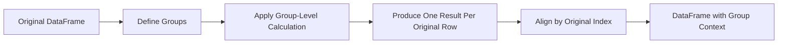

# 09- Grouped Transformations

## Overview

Grouped transformations apply calculations **within each group while preserving the original row-level structure**.

They build on `groupby()` and `transform()` to solve problems such as:

- Adding customer totals to every order.
- Calculating each transaction's percentage of a regional total.
- Normalizing values within a customer, product, or region.
- Calculating groupwise ranks.
- Computing cumulative metrics.
- Filling missing values using group-specific statistics.
- Comparing each record with its group average or previous group record.

The central distinction is:

```text
groupby().agg()
    ↓
reduces each group
    ↓
one result per group

groupby().transform()
    ↓
calculates within each group
    ↓
one result per original row
```

This makes grouped transformations particularly useful when a row-level DataFrame must retain its original grain while gaining context derived from other rows in the same group.

---

## Why Grouped Transformations Matter

Suppose an order DataFrame contains:

```text
customer_id | order_id | revenue
------------|----------|--------
101         | 1        | 400
101         | 2        | 600
102         | 3        | 300
```

The customer total revenue is:

```text
101 → 1000
102 →  300
```

A grouped aggregation produces:

```text
customer_id | total_revenue
------------|--------------
101         | 1000
102         | 300
```

But an order-level pipeline may need:

```text
customer_id | order_id | revenue | customer_total
------------|----------|---------|---------------
101         | 1        | 400     | 1000
101         | 2        | 600     | 1000
102         | 3        | 300     | 300
```

This is exactly the problem grouped transformations solve.

---

## Core Model

A grouped transformation follows this conceptual process:



The critical property is **alignment**.

The transformed result is aligned back to the original rows using the relevant index semantics, allowing it to be assigned to the DataFrame safely.

---

## Basic Syntax

The common pattern is:

```python
result = (
    dataframe.groupby("group_key")["value"]
    .transform("sum")
)
```

Example:

```python
orders["customer_total"] = (
    orders.groupby("customer_id")["revenue"]
    .transform("sum")
)
```

The output is a `Series` with the same row count and index as `orders`.

---

## Basic Example

```python
import pandas as pd


orders = pd.DataFrame(
    {
        "customer_id": [101, 101, 102, 102],
        "order_id": [1, 2, 3, 4],
        "revenue": [400.0, 600.0, 300.0, 200.0],
    }
)

orders["customer_total_revenue"] = (
    orders.groupby("customer_id")["revenue"]
    .transform("sum")
)
```

Result:

```text
customer_id | order_id | revenue | customer_total_revenue
------------|----------|---------|----------------------
101         | 1        | 400.0   | 1000.0
101         | 2        | 600.0   | 1000.0
102         | 3        | 300.0   | 500.0
102         | 4        | 200.0   | 500.0
```

No aggregation rows were removed.

The DataFrame remains at:

```text
one row = one order
```

---

## Common Grouped Transformations

| Requirement | Example |
| --- | --- |
| Group total | `transform("sum")` |
| Group average | `transform("mean")` |
| Group minimum | `transform("min")` |
| Group maximum | `transform("max")` |
| Group count | `transform("count")` |
| Group standard deviation | `transform("std")` |
| Cumulative sum | `transform(...)` or grouped `cumsum()` |
| Rank within group | grouped `rank()` |
| Difference from group metric | arithmetic with transformed values |
| Groupwise normalization | custom/vectorized transformation |
| Group-specific missing-value fill | grouped `transform()` |

Use the simplest built-in operation that expresses the required transformation.

---

## Group Total and Share of Group

A frequent business requirement is each row's share of its group.

```python
customer_total = (
    orders.groupby("customer_id")["revenue"]
    .transform("sum")
)

orders["customer_revenue_share"] = (
    orders["revenue"]
    .div(customer_total)
)
```

Result:

```text
customer_id | revenue | customer_total | customer_revenue_share
------------|---------|----------------|-----------------------
101         | 400     | 1000           | 0.40
101         | 600     | 1000           | 0.60
102         | 300     | 500            | 0.60
102         | 200     | 500            | 0.40
```

This pattern appears in:

- Revenue attribution.
- Sales contribution.
- Budget allocation.
- Traffic distribution.
- Event analysis.

---

## Avoiding Division by Zero

Group-relative metrics must define behavior for zero denominators.

```python
customer_total = (
    orders.groupby("customer_id")["revenue"]
    .transform("sum")
)

orders["revenue_share"] = (
    orders["revenue"]
    .div(customer_total.where(customer_total.ne(0)))
)
```

Now groups with a zero total produce missing values rather than infinite results.

For production systems, decide whether zero denominators should become:

```text
NaN
0
error
```

based on the business definition.

Do not silently choose one.

---

## Group Mean and Difference from Mean

```python
region_average = (
    orders.groupby("region")["revenue"]
    .transform("mean")
)

orders["revenue_vs_region_average"] = (
    orders["revenue"] - region_average
)
```

The output answers:

```text
How far above or below the regional average is this order?
```

This is useful for:

- Anomaly detection.
- Sales performance.
- Operational monitoring.
- Feature engineering.

---

## Groupwise Normalization

A simple normalization pattern is:

```python
group_mean = (
    orders.groupby("region")["revenue"]
    .transform("mean")
)

group_std = (
    orders.groupby("region")["revenue"]
    .transform("std")
)

orders["revenue_z_score"] = (
    orders["revenue"] - group_mean
).div(group_std)
```

Be careful when the group has:

- One observation.
- Zero variance.
- Mostly missing values.

In such cases, the standard deviation may be missing or zero and should be handled according to the metric definition.

---

## Groupwise Minimum and Maximum

```python
region_min = (
    orders.groupby("region")["revenue"]
    .transform("min")
)

region_max = (
    orders.groupby("region")["revenue"]
    .transform("max")
)

orders["region_range_position"] = (
    orders["revenue"] - region_min
).div(
    (region_max - region_min).where(
        region_max.ne(region_min)
    )
)
```

This creates a relative position inside each region.

---

## Grouped Rank

Ranking within groups is another important grouped transformation:

```python
orders["customer_order_rank"] = (
    orders.groupby("customer_id")["revenue"]
    .rank(
        method="dense",
        ascending=False,
    )
)
```

This produces a rank for each order relative to orders from the same customer.

Common use cases include:

- Top products per customer.
- Best-performing employees within a department.
- Highest-value orders per region.
- Event ranking within a partition.

---

## Grouped Cumulative Sum

For running totals within each group:

```python
orders = orders.sort_values(
    ["customer_id", "created_at"]
)

orders["customer_running_revenue"] = (
    orders.groupby("customer_id")["revenue"]
    .cumsum()
)
```

Sorting is critical when the cumulative metric depends on time or sequence.

Without deterministic ordering, a running total may not represent the intended business process.

---

## Grouped Difference

Compare each row with the previous row within its group:

```python
orders = orders.sort_values(
    ["customer_id", "created_at"]
)

orders["revenue_change"] = (
    orders.groupby("customer_id")["revenue"]
    .diff()
)
```

This can be used for:

- Sequential transaction changes.
- Inventory movement.
- Balance changes.
- Event deltas.

The first row of each group normally has no previous value and therefore receives a missing value.

---

## Grouped Percentage Change

```python
orders = orders.sort_values(
    ["customer_id", "created_at"]
)

orders["revenue_pct_change"] = (
    orders.groupby("customer_id")["revenue"]
    .pct_change()
)
```

This calculates percentage change relative to the previous record within each customer.

Check zero denominators and missing values before using the result in financial or operational reporting.

---

## Group-Specific Missing-Value Imputation

Grouped transformations are useful for filling missing values using a group-specific statistic.

For example:

```python
orders["revenue"] = orders["revenue"].fillna(
    orders.groupby("customer_id")["revenue"]
    .transform("median")
)
```

This means:

```text
missing order revenue
    ↓
use median revenue for that customer
```

This can be appropriate when the missing-value policy explicitly permits group-based imputation.

Do not use it blindly for financial values where missingness may indicate a source-system defect.

---

## Group-Specific Forward Fill

For time-series-like data:

```python
events = events.sort_values(
    ["customer_id", "event_time"]
)

events["status"] = (
    events.groupby("customer_id")["status"]
    .ffill()
)
```

This propagates the last known status within each customer.

The ordering must be deterministic.

---

## Group-Specific Backward Fill

Similarly:

```python
events = events.sort_values(
    ["customer_id", "event_time"]
)

events["status"] = (
    events.groupby("customer_id")["status"]
    .bfill()
)
```

Use this only when future values are legitimately allowed to populate earlier records.

It would be inappropriate in a historical reporting pipeline if it introduces information that was not known at that point in time.

---

## Multiple Grouping Keys

Grouped transformations support multiple dimensions:

```python
orders["region_channel_total"] = (
    orders.groupby(
        ["region", "sales_channel"]
    )["revenue"]
    .transform("sum")
)
```

The transformation is now calculated independently for each:

```text
region + sales_channel
```

combination.

This is important when reporting logic operates at a composite business grain.

---

## Transforming Multiple Columns

A grouped transformation can operate on multiple columns:

```python
group_metrics = (
    orders.groupby("region")[
        ["revenue", "discount"]
    ]
    .transform("mean")
)
```

This produces a DataFrame aligned with the original rows.

For example:

```text
revenue_mean | discount_mean
-------------|--------------
...          | ...
```

When assigning results back, make the intended column names explicit:

```python
group_means = (
    orders.groupby("region")[
        ["revenue", "discount"]
    ]
    .transform("mean")
)

orders["region_average_revenue"] = (
    group_means["revenue"]
)

orders["region_average_discount"] = (
    group_means["discount"]
)
```

This is clearer than relying on implicit positional assumptions.

---

## Custom Grouped Transformations

`transform()` can use custom functions:

```python
def normalize(values: pd.Series) -> pd.Series:
    minimum = values.min()
    maximum = values.max()

    denominator = maximum - minimum

    if denominator == 0:
        return pd.Series(
            0.0,
            index=values.index,
        )

    return (values - minimum) / denominator


orders["normalized_revenue"] = (
    orders.groupby("region")["revenue"]
    .transform(normalize)
)
```

A custom transform must produce output compatible with the original group shape.

The result must be aligned appropriately with the group's index.

---

## Transform Return Shape

For grouped transformations, shape matters.

Suppose a group contains:

```text
10 rows
```

A transformation should generally produce:

```text
10 values
```

for that group.

This is what makes the result assignable back to the original DataFrame.

Conceptually:

```text
group size = N
      ↓
transform
      ↓
output size = N
```

Aggregation behaves differently:

```text
group size = N
      ↓
aggregate
      ↓
output size = 1
```

Understanding this shape contract is one of the most important parts of grouped transformations.

---

## Transform Versus Aggregation

| Operation | Output per group | Preserves original row count? |
| --- | ---: | --- |
| `agg()` | Usually one row | No |
| `transform()` | One result per original row | Yes |
| `filter()` | Original rows if group retained | Sometimes |
| `apply()` | Depends on function | Not guaranteed |

Example:

```python
summary = (
    orders.groupby("customer_id")
    .agg(
        total_revenue=("revenue", "sum")
    )
)
```

produces one row per customer.

Whereas:

```python
orders["customer_total"] = (
    orders.groupby("customer_id")["revenue"]
    .transform("sum")
)
```

produces one value for every order.

---

## Transform Versus Merge

A common alternative is:

```python
customer_totals = (
    orders.groupby("customer_id", as_index=False)
    .agg(
        customer_total=("revenue", "sum")
    )
)

orders = orders.merge(
    customer_totals,
    on="customer_id",
    how="left",
    validate="many_to_one",
)
```

This is valid, but it introduces an explicit join.

For a simple group metric, `transform()` is often clearer:

```python
orders["customer_total"] = (
    orders.groupby("customer_id")["revenue"]
    .transform("sum")
)
```

Use an explicit aggregation plus merge when:

- The summary is independently useful.
- Many group attributes will be reused.
- The group table is a separate data product.
- You need explicit relational validation.
- The metric was already computed elsewhere.

---

## Transform Versus Filter

`filter()` removes entire groups:

```python
large_customers = (
    orders.groupby("customer_id")
    .filter(
        lambda group:
            group["revenue"].sum() >= 10_000
    )
)
```

`transform()` calculates a group metric for every row:

```python
customer_total = (
    orders.groupby("customer_id")["revenue"]
    .transform("sum")
)

large_customers = orders.loc[
    customer_total >= 10_000
]
```

Both can solve similar selection problems, but their intent is different.

Use `filter()` when group retention is the primary operation.

Use `transform()` when the group metric itself is part of the row-level processing.

---

## Grouped Transformation and Sorting

Some grouped transformations depend on order:

```python
events = events.sort_values(
    ["customer_id", "event_time"]
)

events["running_value"] = (
    events.groupby("customer_id")["value"]
    .cumsum()
)
```

Others do not:

```python
orders["customer_total"] = (
    orders.groupby("customer_id")["revenue"]
    .transform("sum")
)
```

Senior-level Pandas code distinguishes between:

```text
order-independent group metrics
```

and:

```text
order-dependent transformations
```

Always define ordering explicitly when the metric is sequential.

---

## Grouped Transformations with Time

Suppose transactions contain:

```text
customer_id
transaction_time
amount
```

A running metric can be calculated after sorting:

```python
transactions = transactions.sort_values(
    ["customer_id", "transaction_time"]
)

transactions["running_spend"] = (
    transactions.groupby("customer_id")["amount"]
    .cumsum()
)
```

For time-window analysis, consider whether Pandas `groupby()` is sufficient or whether a specialized time-series operation or database window function is more appropriate.

---

## SQL Equivalent

Many grouped transformations correspond directly to SQL window functions.

Pandas:

```python
orders["customer_total"] = (
    orders.groupby("customer_id")["revenue"]
    .transform("sum")
)
```

SQL:

```sql
SELECT
    orders.*,
    SUM(revenue) OVER (
        PARTITION BY customer_id
    ) AS customer_total
FROM orders;
```

Grouped mean:

```python
orders["customer_average"] = (
    orders.groupby("customer_id")["revenue"]
    .transform("mean")
)
```

SQL:

```sql
AVG(revenue) OVER (
    PARTITION BY customer_id
)
```

This is a valuable bridge between Pandas and PostgreSQL analytics.

---

## SQL Window Functions

More advanced grouped transformations often map to:

```sql
SUM(...)
OVER (PARTITION BY ...)

AVG(...)
OVER (PARTITION BY ...)

ROW_NUMBER()
OVER (PARTITION BY ... ORDER BY ...)

RANK()
OVER (PARTITION BY ... ORDER BY ...)

LAG(...)
OVER (PARTITION BY ... ORDER BY ...)
```

This relationship matters when processing data close to the database.

For large PostgreSQL datasets, it may be substantially better to execute the window operation in SQL rather than transferring raw rows to Pandas.

---

## ETL Example

A daily customer report may need both raw order data and customer context:

```python
orders["customer_total_revenue"] = (
    orders.groupby("customer_id")["revenue"]
    .transform("sum")
)

orders["customer_order_count"] = (
    orders.groupby("customer_id")["order_id"]
    .transform("nunique")
)

orders["customer_revenue_share"] = (
    orders["revenue"]
    .div(
        orders["customer_total_revenue"].where(
            orders["customer_total_revenue"].ne(0)
        )
    )
)
```

The data remains:

```text
one row = one order
```

while gaining customer-level context.

This pattern is useful for downstream feature creation, reporting, and rule evaluation.

---

## API Processing Example

An API may return transaction records that need group-relative fields before serialization:

```python
transactions["account_total"] = (
    transactions.groupby("account_id")[
        "amount"
    ]
    .transform("sum")
)

transactions["account_share"] = (
    transactions["amount"]
    .div(
        transactions["account_total"].where(
            transactions["account_total"].ne(0)
        )
    )
)

payload = transactions.to_dict(
    orient="records"
)
```

Before serving the result through FastAPI or Django, validate:

- Required columns.
- Numeric dtypes.
- Null behavior.
- Denominator behavior.
- Output schema.

---

## Performance

Prefer built-in grouped transformations:

```python
orders.groupby("customer_id")[
    "revenue"
].transform("sum")
```

over custom Python functions when possible.

Built-in operations generally benefit from optimized Pandas implementations.

A transformation such as:

```python
orders.groupby("customer_id")[
    "revenue"
].transform(
    lambda values: values.sum()
)
```

adds unnecessary Python-level work when `"sum"` already expresses the operation.

---

## Repeated Grouping

This is readable but repeats grouping work:

```python
orders["customer_total"] = (
    orders.groupby("customer_id")["revenue"]
    .transform("sum")
)

orders["customer_average"] = (
    orders.groupby("customer_id")["revenue"]
    .transform("mean")
)

orders["customer_min"] = (
    orders.groupby("customer_id")["revenue"]
    .transform("min")
)
```

Whether this matters depends on dataset size and workload.

For many metrics, an explicit summary plus merge can sometimes provide a better architecture:

```python
customer_metrics = (
    orders.groupby("customer_id")
    .agg(
        customer_total=("revenue", "sum"),
        customer_average=("revenue", "mean"),
        customer_min=("revenue", "min"),
    )
)

orders = orders.join(
    customer_metrics,
    on="customer_id",
)
```

The decision should consider:

```text
number of metrics
dataset size
memory usage
readability
reuse of summary metrics
```

Do not optimize prematurely, but avoid repeated expensive grouping in large pipelines without measuring.

---

## Memory Considerations

Every transformed column added to a DataFrame consumes additional memory.

This matters when:

```text
large input
+
many grouped metrics
```

creates a wide intermediate DataFrame.

Prefer to create only the metrics required by downstream stages:

```python
orders["customer_total"] = (
    orders.groupby("customer_id")["revenue"]
    .transform("sum")
)

orders["customer_share"] = (
    orders["revenue"]
    .div(orders["customer_total"])
)
```

Drop temporary columns when they are no longer needed:

```python
orders = orders.drop(
    columns=["customer_total"]
)
```

only when that intermediate value is not part of the final contract.

---

## High-Cardinality Groups

Grouping by nearly unique identifiers can be expensive:

```python
events.groupby("request_id")
```

when most request IDs occur only once.

Before using grouped transformations, ask:

```text
Does grouping actually provide useful context?
How many groups are there?
How many rows are in each group?
Could the operation be performed earlier or in SQL?
```

High cardinality can increase grouping overhead without providing meaningful reuse.

---

## Categorical Grouping

For low-cardinality dimensions:

```python
orders["region"] = orders["region"].astype(
    "category"
)

orders["region_total"] = (
    orders.groupby(
        "region",
        observed=True,
    )["revenue"]
    .transform("sum")
)
```

Categorical representation can reduce memory use and improve grouping efficiency for suitable datasets.

Use `observed=True` intentionally when only categories present in the data should participate.

---

## Missing Values in Grouped Metrics

For:

```python
orders["customer_average"] = (
    orders.groupby("customer_id")["revenue"]
    .transform("mean")
)
```

missing `revenue` values are generally excluded from the mean calculation.

Therefore:

```text
customer revenue values
[100, NaN, 300]
```

can produce:

```text
mean = 200
```

and that value may be assigned to all rows in the customer group.

If missing data should invalidate the customer metric, validate before transformation.

---

## Empty DataFrames

An empty DataFrame produces an empty transformed result.

Still, production pipelines should explicitly decide how downstream systems handle:

```text
zero rows
```

For reusable functions:

```python
def add_customer_total(
    orders: pd.DataFrame,
) -> pd.DataFrame:
    result = orders.copy()

    if result.empty:
        result["customer_total"] = (
            pd.Series(dtype="float64")
        )
        return result

    result["customer_total"] = (
        result.groupby("customer_id")["revenue"]
        .transform("sum")
    )

    return result
```

For stable APIs and ETL outputs, preserve the expected schema even when there are no records.

---

## Unexpected Input

Validate required columns before grouped transformations:

```python
required_columns = {
    "customer_id",
    "revenue",
}

missing_columns = required_columns.difference(
    orders.columns
)

if missing_columns:
    raise ValueError(
        "Missing columns: "
        f"{sorted(missing_columns)}"
    )
```

Also validate important dtypes:

```python
if not pd.api.types.is_numeric_dtype(
    orders["revenue"]
):
    raise TypeError(
        "revenue must be numeric."
    )
```

Grouped transformations assume that source columns have the intended semantics.

---

## Testing Grouped Transformations

Tests should validate both:

```text
metric correctness
```

and:

```text
row alignment
```

Example:

```python
import pandas as pd
from pandas.testing import assert_series_equal


def test_customer_total_is_aligned_to_orders() -> None:
    orders = pd.DataFrame(
        {
            "customer_id": [101, 101, 102],
            "revenue": [100.0, 50.0, 200.0],
        }
    )

    actual = (
        orders.groupby("customer_id")["revenue"]
        .transform("sum")
    )

    expected = pd.Series(
        [150.0, 150.0, 200.0],
        index=orders.index,
        name="revenue",
    )

    assert_series_equal(
        actual,
        expected,
    )
```

The index comparison is important because alignment is part of the transformation's semantics.

---

## Testing Group Grain

Grouped transformations should preserve row count:

```python
result = orders.copy()

result["customer_total"] = (
    result.groupby("customer_id")["revenue"]
    .transform("sum")
)

assert len(result) == len(orders)
```

Also verify:

```python
assert result.index.equals(
    orders.index
)
```

when the pipeline contract requires the original index to remain unchanged.

---

## Testing Edge Cases

Test scenarios such as:

```text
single-row group
multiple-row group
missing metric value
missing grouping key
zero denominator
empty input
duplicate source records
high-cardinality grouping
```

Example:

```python
def test_zero_group_total_does_not_create_infinity() -> None:
    orders = pd.DataFrame(
        {
            "customer_id": [101, 101],
            "revenue": [0.0, 0.0],
        }
    )

    total = (
        orders.groupby("customer_id")["revenue"]
        .transform("sum")
    )

    share = orders["revenue"].div(
        total.where(total.ne(0))
    )

    assert share.isna().all()
```

Tests should define the intended business behavior for edge cases rather than merely accepting Pandas defaults.

---

## Production Data Flow

A production pipeline may use grouped transformations like this:

```mermaid
flowchart LR
    Source[(SQL / API / Parquet)]
    Source --> Load[Load Data]
    Load --> Validate[Schema and Quality Checks]
    Validate --> Clean[Clean and Normalize]
    Clean --> Group[Define Business Group]
    Group --> Transform[Add Group-Level Context]
    Transform --> ValidateOutput[Validate Row Count and Metrics]
    ValidateOutput --> Store[(Curated Dataset)]
    Store --> Consumers[API / BI / Reporting]
```



The important invariant is:

```text
row grain remains unchanged
```

unless a later operation explicitly changes it.

---

## Reliability

Grouped transformations are naturally suitable for deterministic batch processing when:

```text
input
+
grouping keys
+
transformation rules
```

are stable.

This supports:

- Retries.
- Backfills.
- Reprocessing.
- Auditability.
- Reconciliation.

For incremental pipelines, make sure the grouping scope matches the reporting requirement.

For example, computing:

```python
orders.groupby("customer_id")["revenue"].transform("sum")
```

over only today's orders does **not** produce lifetime customer totals.

The input scope defines the meaning of the metric.

---

## Incremental Processing Considerations

Suppose a customer has historical orders:

```text
January → 100
February → 200
```

A March-only batch contains:

```text
March → 300
```

Running:

```python
march_orders.groupby("customer_id")[
    "revenue"
].transform("sum")
```

produces:

```text
300
```

not:

```text
600
```

For incremental pipelines, distinguish:

```text
batch-local metric
```

from:

```text
historical metric
```

Historical group metrics may require:

- Reading prior aggregates.
- Querying the database.
- Maintaining state.
- Recomputing affected groups.

---

## Monitoring

Useful metrics include:

```text
input_row_count
output_row_count
distinct_group_count
null_group_key_count
null_metric_count
temporary_columns_created
processing_duration_ms
memory_usage_bytes
```

For derived metrics, monitor distributions such as:

```text
group sizes
group totals
share sums
rank distributions
null transformation results
```

Unexpected changes can reveal upstream data drift or changes in grouping semantics.

---

## Security Considerations

Grouped transformations do not enforce authorization.

In a multi-tenant backend:

```text
Authenticate
    ↓
Authorize tenant scope
    ↓
Load permitted records
    ↓
Group within authorized scope
    ↓
Transform
    ↓
Return / persist
```

A customer-level metric calculated across tenants can become a data-isolation failure.

Tenant or account boundaries should therefore be part of the input scope and, where appropriate, part of the grouping key.

---

## Common Mistakes

### Expecting `transform()` to Reduce Rows

This is incorrect:

```python
orders.groupby("customer_id")[
    "revenue"
].transform("sum")
```

does not produce one result per customer.

It produces one value per original row.

Use `agg()` when the desired output is one row per group.

---

### Forgetting Alignment

Grouped transformations are designed to align with the original data.

Avoid manually assigning results after changing the index unless you fully understand the alignment implications.

Prefer:

```python
orders["customer_total"] = (
    orders.groupby("customer_id")["revenue"]
    .transform("sum")
)
```

---

### Using `apply()` for Simple Transformations

Avoid:

```python
orders.groupby("customer_id")[
    "revenue"
].apply(
    lambda values: values - values.mean()
)
```

when a direct transformation can express the logic more efficiently and predictably.

Prefer:

```python
group_mean = (
    orders.groupby("customer_id")["revenue"]
    .transform("mean")
)

orders["revenue_vs_mean"] = (
    orders["revenue"] - group_mean
)
```

---

### Ignoring Sort Order for Sequential Operations

Incorrect:

```python
orders.groupby("customer_id")[
    "revenue"
].cumsum()
```

when the intended meaning is chronological and the input is not sorted.

Prefer:

```python
orders = orders.sort_values(
    ["customer_id", "created_at"]
)

orders["running_revenue"] = (
    orders.groupby("customer_id")["revenue"]
    .cumsum()
)
```

---

### Confusing Batch-Local and Global Metrics

A grouped transformation only sees the rows it receives.

If the DataFrame contains only:

```text
today's events
```

then the group metric is:

```text
today's group metric
```

unless historical state is incorporated separately.

---

## Production Pitfalls

### Grouping by an Incorrect Grain

Consider:

```python
orders.groupby("customer_id")[
    "revenue"
].transform("sum")
```

versus:

```python
orders.groupby(
    ["customer_id", "region"]
)["revenue"].transform("sum")
```

These answer different business questions.

A grouping-key change can alter every derived metric while leaving the code syntactically valid.

---

### Leakage in Feature Engineering

When grouped transformations are used to generate machine-learning or behavioral features, ensure that future records do not influence historical rows.

For example, lifetime customer totals may leak future information into a historical feature.

Use time-bounded aggregation when temporal correctness matters.

---

### Repeated Expensive Transformations

Creating dozens of `transform()` columns independently can make large pipelines expensive.

Measure the workload and consider:

```text
precomputed group summary
    +
explicit join
```

when many metrics must be reused.

---

### Hidden Business Semantics

A column such as:

```text
customer_total
```

is ambiguous unless its scope is defined.

It could mean:

```text
all-time total
month-to-date total
batch total
filtered total
tenant-scoped total
```

Use explicit names where necessary:

```text
customer_monthly_revenue
customer_lifetime_revenue
customer_batch_revenue
```

---

## Interview Traps

### Why Use `transform()` Instead of `agg()`?

Because `transform()` returns results aligned to the original rows.

For example:

```python
orders["customer_total"] = (
    orders.groupby("customer_id")["revenue"]
    .transform("sum")
)
```

The DataFrame remains at order grain.

---

### What Shape Must a Grouped Transform Return?

The result for each group must be compatible with that group's original shape.

A group with `N` rows generally needs `N` transformed values.

---

### How Would You Calculate Each Order's Share of Customer Revenue?

```python
customer_total = (
    orders.groupby("customer_id")["revenue"]
    .transform("sum")
)

orders["customer_share"] = (
    orders["revenue"]
    .div(
        customer_total.where(
            customer_total.ne(0)
        )
    )
)
```

The key idea is to broadcast the group total back to every original row.

---

### How Does This Map to SQL?

`groupby().transform()` often corresponds to a window function:

```sql
SUM(revenue) OVER (
    PARTITION BY customer_id
)
```

This is one of the most useful conceptual bridges between Pandas and SQL.

---

## Recommended Production Pattern

A reusable grouped transformation function should validate inputs and make its semantics explicit:

```python
import pandas as pd


def add_customer_metrics(
    orders: pd.DataFrame,
) -> pd.DataFrame:
    required_columns = {
        "customer_id",
        "order_id",
        "revenue",
    }

    missing_columns = required_columns.difference(
        orders.columns
    )

    if missing_columns:
        raise ValueError(
            "Missing required columns: "
            f"{sorted(missing_columns)}"
        )

    result = orders.copy()

    if result.empty:
        result["customer_total_revenue"] = (
            pd.Series(
                index=result.index,
                dtype="float64",
            )
        )
        result["customer_order_count"] = (
            pd.Series(
                index=result.index,
                dtype="Int64",
            )
        )
        result["customer_revenue_share"] = (
            pd.Series(
                index=result.index,
                dtype="float64",
            )
        )
        return result

    if not pd.api.types.is_numeric_dtype(
        result["revenue"]
    ):
        raise TypeError(
            "revenue must be numeric."
        )

    result["customer_total_revenue"] = (
        result.groupby("customer_id")[
            "revenue"
        ]
        .transform("sum")
    )

    result["customer_order_count"] = (
        result.groupby("customer_id")[
            "order_id"
        ]
        .transform("nunique")
        .astype("Int64")
    )

    denominator = (
        result["customer_total_revenue"]
        .where(
            result["customer_total_revenue"].ne(0)
        )
    )

    result["customer_revenue_share"] = (
        result["revenue"].div(denominator)
    )

    return result
```

This pattern makes several contracts explicit:

```text
required columns
    ↓
empty-input behavior
    ↓
dtype validation
    ↓
grouping scope
    ↓
row-preserving transformations
    ↓
zero-denominator handling
```

For more complex pipelines, move validation into dedicated validation functions and keep transformation functions focused on transformation logic.

---

## Choosing the Right Grouped Operation

| Requirement | Preferred Operation |
| --- | --- |
| One row per group | `groupby().agg()` |
| Add group metric to every row | `groupby().transform()` |
| Keep or discard complete groups | `groupby().filter()` |
| Custom row/group logic with flexible output | `groupby().apply()` |
| Compare row with group total | `transform()` |
| Group-relative percentage | `transform()` |
| Running total within group | `groupby().cumsum()` |
| Previous value within group | `groupby().diff()` |
| Rank within group | grouped `rank()` |
| Large SQL-backed dataset | SQL window functions when practical |

The correct operation depends primarily on the required output shape and business grain.

---

## Key Takeaways

- Grouped transformations calculate group-aware values while preserving the original row count and alignment, making them ideal for adding group context to row-level data.
- `transform()` is the key tool for broadcasting group metrics such as totals, averages, counts, and normalized values back to every original record.
- Order-dependent transformations such as `cumsum()`, `diff()`, and `pct_change()` require deterministic sorting and careful temporal semantics.
- For large datasets, prefer built-in vectorized transformations, avoid unnecessary repeated grouping, and consider SQL window functions or precomputed group summaries when appropriate.
- Production grouped transformations must define grouping scope, null behavior, duplicate semantics, temporal boundaries, authorization boundaries, output schema, and batch-versus-historical meaning explicitly.