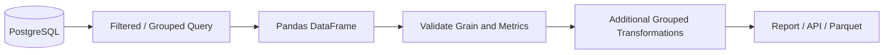

# 10- Hierarchical Grouping

## Overview

Hierarchical grouping in Pandas means grouping data across **multiple dimensions or levels**, such as:

```text
region
    ↓
sales_channel
    ↓
product_category
```

A hierarchical grouping produces metrics at the intersection of multiple grouping keys while preserving those dimensions in the result.

For example:

```python
summary = (
    orders.groupby(
        ["region", "sales_channel"],
    )
    .agg(
        total_revenue=("revenue", "sum"),
        order_count=("order_id", "nunique"),
    )
)
```

The result has one row for each:

```text
region + sales_channel
```

combination.

Hierarchical grouping becomes especially important when working with:

- Multi-dimensional reporting.
- Regional and departmental analytics.
- Financial reporting.
- Product/category/channel metrics.
- Multi-level indexes.
- Pivoted datasets.
- OLAP-style data.
- SQL `GROUP BY` across multiple dimensions.

The engineering challenge is not simply knowing how to pass multiple columns to `groupby()`. You need to understand how grouping levels define **output grain**, how Pandas represents those levels internally, and when a hierarchical index is useful versus when a flat relational schema is preferable.

---

## Why Hierarchical Grouping Exists

A single grouping key answers questions such as:

```text
How much revenue did each region generate?
```

```python
orders.groupby("region")[
    "revenue"
].sum()
```

Multiple grouping keys answer more detailed questions:

```text
How much revenue did each region generate
through each sales channel?
```

```python
orders.groupby(
    ["region", "sales_channel"]
)["revenue"].sum()
```

Now the reporting grain is:

```text
one row = one region + one sales channel
```

Adding dimensions gives increasingly granular output:

```text
region
    ↓
region + channel
    ↓
region + channel + category
```

Each added grouping key changes the grain and potentially increases the number of groups.

---

## Basic Syntax

The standard form is:

```python
grouped = dataframe.groupby(
    ["group_key_1", "group_key_2"]
)
```

Then aggregate:

```python
result = (
    dataframe.groupby(
        ["region", "sales_channel"]
    )
    .agg(
        total_revenue=("revenue", "sum"),
        order_count=("order_id", "nunique"),
    )
)
```

The grouping keys can be:

- Columns.
- Index levels.
- Categorical columns.
- Derived grouping expressions.
- Combinations of these.

---

## Example Dataset

Consider an e-commerce order dataset:

```python
import pandas as pd


orders = pd.DataFrame(
    {
        "order_id": [1, 2, 3, 4, 5, 6],
        "region": [
            "North",
            "North",
            "North",
            "South",
            "South",
            "South",
        ],
        "sales_channel": [
            "Web",
            "Web",
            "Retail",
            "Web",
            "Retail",
            "Retail",
        ],
        "category": [
            "Laptop",
            "Phone",
            "Laptop",
            "Phone",
            "Tablet",
            "Phone",
        ],
        "revenue": [
            1200.0,
            800.0,
            900.0,
            700.0,
            500.0,
            650.0,
        ],
    }
)
```

A single-level aggregation:

```python
region_summary = (
    orders.groupby("region", as_index=False)
    .agg(
        total_revenue=("revenue", "sum"),
        order_count=("order_id", "nunique"),
    )
)
```

A hierarchical aggregation:

```python
regional_channel_summary = (
    orders.groupby(
        ["region", "sales_channel"],
        as_index=False,
    )
    .agg(
        total_revenue=("revenue", "sum"),
        order_count=("order_id", "nunique"),
    )
)
```

The second result provides more granular operational information.

---

## Output Grain

The most important concept is **grain**.

For:

```python
orders.groupby("region")
```

the grain is:

```text
one row = one region
```

For:

```python
orders.groupby(
    ["region", "sales_channel"]
)
```

the grain is:

```text
one row = one region + one sales channel
```

For:

```python
orders.groupby(
    ["region", "sales_channel", "category"]
)
```

the grain becomes:

```text
one row = one region + one sales channel + one category
```

A large percentage of aggregation bugs are actually grain-definition bugs.

Before writing grouped code, state the grain explicitly.

---

## Multiple Grouping Keys

A direct hierarchical grouping is:

```python
summary = (
    orders.groupby(
        ["region", "sales_channel"]
    )
    .agg(
        total_revenue=("revenue", "sum"),
    )
)
```

You can use any number of grouping dimensions:

```python
summary = (
    orders.groupby(
        [
            "region",
            "sales_channel",
            "category",
        ]
    )
    .agg(
        total_revenue=("revenue", "sum"),
        order_count=("order_id", "nunique"),
    )
)
```

However, more dimensions are not automatically better.

Each dimension increases granularity and can substantially increase the number of groups.

---

## Hierarchical Grouping and MultiIndex

By default, grouping on multiple columns generally produces a `MultiIndex`:

```python
summary = (
    orders.groupby(
        ["region", "sales_channel"]
    )
    .agg(
        total_revenue=("revenue", "sum")
    )
)
```

The result is conceptually:

```text
                          total_revenue
region  sales_channel
North   Retail                  900.0
        Web                    2000.0
South   Retail                1150.0
        Web                     700.0
```

The index contains multiple levels:

```text
Level 0 → region
Level 1 → sales_channel
```

This is one of the core relationships between hierarchical grouping and Pandas `MultiIndex`.

---

## Inspecting the Index Levels

You can inspect the resulting hierarchy:

```python
summary.index.names
```

Example:

```text
['region', 'sales_channel']
```

You can also inspect:

```python
summary.index.nlevels
```

which indicates the number of index levels.

This is useful when debugging complex analytical DataFrames.

---

## Flattening the Result

For APIs, CSV files, Parquet datasets, and database loads, a flat schema is often easier to consume.

Use:

```python
summary = (
    orders.groupby(
        ["region", "sales_channel"],
        as_index=False,
    )
    .agg(
        total_revenue=("revenue", "sum"),
        order_count=("order_id", "nunique"),
    )
)
```

The output becomes:

```text
region | sales_channel | total_revenue | order_count
```

Instead of:

```text
MultiIndex:
region
sales_channel
```

For production pipelines, use `as_index=False` when the downstream contract is relational and you do not need index-based hierarchical operations.

---

## `reset_index()`

If the grouped result already has a hierarchical index:

```python
summary = (
    orders.groupby(
        ["region", "sales_channel"]
    )
    .agg(
        total_revenue=("revenue", "sum")
    )
)
```

convert it to regular columns:

```python
summary = summary.reset_index()
```

Result:

```text
region
sales_channel
total_revenue
```

Both approaches are valid:

```python
as_index=False
```

and:

```python
reset_index()
```

Use whichever makes the intended output shape clearer.

---

## Hierarchical Named Aggregation

Named aggregation works naturally with multiple grouping levels:

```python
summary = (
    orders.groupby(
        ["region", "sales_channel"],
        as_index=False,
    )
    .agg(
        total_revenue=("revenue", "sum"),
        average_order_value=("revenue", "mean"),
        order_count=("order_id", "nunique"),
        category_count=("category", "nunique"),
    )
)
```

This produces a clean multidimensional reporting table:

```text
region
sales_channel
total_revenue
average_order_value
order_count
category_count
```

The grouping keys define dimensions.

The named aggregations define measures.

This is essentially a small analytical data model.

---

## Hierarchical Grouping as Dimensions and Measures

A useful mental model is:

```text
Dimensions
    region
    sales_channel
    category

Measures
    total_revenue
    order_count
    average_order_value
```

The grouping keys define the analytical dimensions.

The aggregations define the measures calculated at their intersection.

This is similar to dimensional reporting systems and SQL analytical queries.

---

## SQL Equivalent

Pandas:

```python
summary = (
    orders.groupby(
        ["region", "sales_channel"],
        as_index=False,
    )
    .agg(
        total_revenue=("revenue", "sum"),
        order_count=("order_id", "nunique"),
    )
)
```

Equivalent SQL:

```sql
SELECT
    region,
    sales_channel,
    SUM(revenue) AS total_revenue,
    COUNT(DISTINCT order_id) AS order_count
FROM orders
GROUP BY
    region,
    sales_channel;
```

This is a direct conceptual mapping:

```text
Pandas groupby keys
        ↕
SQL GROUP BY columns
```

Understanding this mapping is useful when deciding whether a transformation should execute in PostgreSQL or in Pandas.

---

## Hierarchical Grouping and SQL Rollups

Pandas `groupby()` with multiple keys computes one specific grouping grain.

SQL can additionally support hierarchical subtotal constructs such as:

```sql
GROUP BY ROLLUP(region, sales_channel)
```

which can generate:

```text
region + channel
region subtotal
grand total
```

Standard Pandas grouping does not automatically produce equivalent subtotal rows.

If a report requires:

```text
detail
+
subtotals
+
grand total
```

implement those levels explicitly or use an analytical database/query engine that supports the desired rollup semantics.

---

## Multiple Reporting Levels

Suppose the business needs:

```text
North / Web
North / Retail
South / Web
South / Retail
```

plus:

```text
North total
South total
Grand total
```

A clean approach is to compute the levels separately:

```python
detail = (
    orders.groupby(
        ["region", "sales_channel"],
        as_index=False,
    )
    .agg(
        total_revenue=("revenue", "sum"),
        order_count=("order_id", "nunique"),
    )
)

region_total = (
    orders.groupby(
        "region",
        as_index=False,
    )
    .agg(
        total_revenue=("revenue", "sum"),
        order_count=("order_id", "nunique"),
    )
)

grand_total = pd.DataFrame(
    {
        "total_revenue": [
            orders["revenue"].sum()
        ],
        "order_count": [
            orders["order_id"].nunique()
        ],
    }
)
```

This is more explicit than trying to force multiple reporting grains into one ambiguous grouping.

---

## `level` with Existing MultiIndex Data

Hierarchical grouping can also operate on an existing index level.

Example:

```python
indexed = orders.set_index(
    ["region", "sales_channel"]
)
```

Then:

```python
summary = (
    indexed.groupby(level="region")
    .agg(
        total_revenue=("revenue", "sum")
    )
)
```

You can group by:

```python
level="region"
```

or multiple index levels:

```python
level=["region", "sales_channel"]
```

This is useful when the hierarchy is already represented in the index.

---

## Grouping by Index and Column Together

Pandas allows mixed grouping specifications.

For example, if `region` is an index level and `category` remains a column:

```python
orders = orders.set_index("region")

summary = (
    orders.groupby(
        [pd.Grouper(level="region"), "category"]
    )
    .agg(
        total_revenue=("revenue", "sum")
    )
)
```

Use mixed index/column grouping carefully because it can make the data model harder to understand.

For production ETL, explicit columns are often easier to reason about than deeply encoded index hierarchies.

---

## Grouping by Time Hierarchies

Hierarchical grouping commonly appears in time-based reporting.

For example:

```python
orders["order_date"] = pd.to_datetime(
    orders["order_date"]
)

orders["year"] = orders["order_date"].dt.year
orders["month"] = orders["order_date"].dt.month
```

Then:

```python
monthly_summary = (
    orders.groupby(
        ["year", "month", "region"],
        as_index=False,
    )
    .agg(
        total_revenue=("revenue", "sum"),
        order_count=("order_id", "nunique"),
    )
)
```

This produces:

```text
year + month + region
```

as the analytical grain.

For larger time-series pipelines, `pd.Grouper` and resampling can provide more appropriate temporal grouping semantics.

---

## Using `pd.Grouper`

For monthly regional reporting:

```python
monthly_summary = (
    orders.groupby(
        [
            pd.Grouper(
                key="created_at",
                freq="MS",
            ),
            "region",
        ],
        as_index=False,
    )
    .agg(
        total_revenue=("revenue", "sum"),
        order_count=("order_id", "nunique"),
    )
)
```

This avoids manually creating year and month columns when the reporting requirement is naturally time-based.

---

## Categorical Hierarchies

Suppose:

```text
region
sales_channel
```

are categorical dimensions.

You can use categorical dtypes:

```python
orders["region"] = orders["region"].astype(
    "category"
)

orders["sales_channel"] = orders[
    "sales_channel"
].astype("category")
```

Then:

```python
summary = (
    orders.groupby(
        ["region", "sales_channel"],
        observed=True,
        as_index=False,
    )
    .agg(
        total_revenue=("revenue", "sum"),
    )
)
```

`observed=True` is important when you want to work only with category combinations that actually occur in the data.

This can prevent unnecessary combinations from appearing and can reduce work for suitable datasets.

---

## Sparse Versus Dense Combinations

Consider categories:

```text
Regions:
North, South, West

Channels:
Web, Retail, Partner
```

Not every combination may exist.

For example:

```text
West + Partner
```

might have no records.

This distinction matters:

```text
combination absent from data
```

versus:

```text
combination exists with zero activity
```

A production report may need to represent missing combinations explicitly.

Do not assume an absent group automatically means zero.

---

## Constructing Complete Hierarchies

When the reporting contract requires every possible combination, you may need to construct the full dimensional space explicitly.

For example:

```python
regions = pd.Index(
    ["North", "South", "West"],
    name="region",
)

channels = pd.Index(
    ["Web", "Retail", "Partner"],
    name="sales_channel",
)

complete_index = pd.MultiIndex.from_product(
    [regions, channels]
)
```

Then join the actual aggregated metrics onto the complete index.

This is useful for dashboards where:

```text
missing combination
```

must be displayed as:

```text
0 activity
```

after the business semantics have been established.

Do not fill missing combinations with zero automatically unless zero is truly the correct interpretation.

---

## Hierarchical Grouping and Missing Values

Suppose:

```text
region = NaN
sales_channel = "Web"
```

The missing region value affects the grouping key.

If null grouping keys must be retained:

```python
summary = (
    orders.groupby(
        ["region", "sales_channel"],
        dropna=False,
        as_index=False,
    )
    .agg(
        total_revenue=("revenue", "sum"),
    )
)
```

This creates a group representing the missing `region` value.

Whether that is appropriate depends on the reporting contract.

---

## Missing Metrics

Aggregation functions generally skip missing values.

For example:

```python
summary = (
    orders.groupby(
        ["region", "sales_channel"],
        as_index=False,
    )
    .agg(
        total_revenue=("revenue", "sum"),
        average_revenue=("revenue", "mean"),
    )
)
```

A group containing:

```text
100
NaN
300
```

can produce:

```text
sum  = 400
mean = 200
```

This may be mathematically valid but operationally misleading if missing revenue means a broken upstream record.

Validate data completeness independently when necessary.

---

## Duplicate Records

Hierarchical grouping does not remove duplicate business records automatically.

Suppose a duplicate order exists:

```text
order_id = 1001
region = North
channel = Web
revenue = 500
```

twice.

Then:

```python
total_revenue=("revenue", "sum")
```

counts both records.

Validate uniqueness before aggregation:

```python
if orders["order_id"].duplicated().any():
    raise ValueError(
        "Duplicate order IDs detected."
    )
```

The more dimensions a report has, the harder silent duplication can be to spot.

---

## Hierarchical Grouping After Joins

A common production issue is accidental row multiplication before grouping.

For example:

```text
orders
    ↓
many-to-many merge
    ↓
duplicated order rows
    ↓
groupby
    ↓
inflated totals
```

Validate join cardinality before hierarchical aggregation:

```python
orders = orders.merge(
    customers,
    on="customer_id",
    how="left",
    validate="many_to_one",
)
```

Then perform the grouping.

Aggregation is downstream of data modeling. It should not be expected to repair incorrect join cardinality.

---

## Hierarchical Filtering

You can filter hierarchical group results after aggregation.

Example:

```python
summary = (
    orders.groupby(
        ["region", "sales_channel"],
        as_index=False,
    )
    .agg(
        total_revenue=("revenue", "sum"),
        order_count=("order_id", "nunique"),
    )
)

qualified = summary.loc[
    summary["total_revenue"].ge(100_000)
]
```

The filter now operates on the aggregated grain:

```text
one row = region + channel
```

This is often clearer than filtering raw records before grouping when the condition itself is based on group-level metrics.

---

## Hierarchical Filtering Before Aggregation

Row-level filters should generally occur before grouping when they define the reporting scope.

Example:

```python
reporting_orders = orders.loc[
    orders["status"].eq("completed")
]

summary = (
    reporting_orders.groupby(
        ["region", "sales_channel"],
        as_index=False,
    )
    .agg(
        total_revenue=("revenue", "sum"),
    )
)
```

The order matters:

```text
filter source population
    ↓
define grouping grain
    ↓
aggregate
```

Filtering after aggregation is appropriate only when the filter concerns aggregated metrics.

---

## Hierarchical Grouping and `transform()`

Hierarchical grouping also works with `transform()`:

```python
orders["region_channel_total"] = (
    orders.groupby(
        ["region", "sales_channel"]
    )["revenue"]
    .transform("sum")
)
```

Every original row receives the total for its region/channel group.

This is different from:

```python
summary = (
    orders.groupby(
        ["region", "sales_channel"]
    )
    .agg(
        total_revenue=("revenue", "sum")
    )
)
```

The first preserves order-level grain.

The second produces group-level grain.

---

## Hierarchical Grouping and Ranking

You can calculate rankings within a hierarchy:

```python
orders["channel_order_rank"] = (
    orders.groupby(
        ["region", "sales_channel"]
    )["revenue"]
    .rank(
        method="dense",
        ascending=False,
    )
)
```

This can answer:

```text
Which orders are highest value
within each region/channel combination?
```

The grouping hierarchy defines the ranking partition.

---

## Hierarchical Grouping and Cumulative Metrics

For a cumulative metric within each hierarchy:

```python
orders = orders.sort_values(
    [
        "region",
        "sales_channel",
        "created_at",
    ]
)

orders["running_revenue"] = (
    orders.groupby(
        ["region", "sales_channel"]
    )["revenue"]
    .cumsum()
)
```

The sort order is part of the metric definition.

Without deterministic ordering, a running total may not reflect the intended business sequence.

---

## Hierarchical Grouping and `filter()`

Entire multi-level groups can be retained using `filter()`:

```python
qualified_orders = (
    orders.groupby(
        ["region", "sales_channel"]
    )
    .filter(
        lambda group:
            group["revenue"].sum() >= 100_000
    )
)
```

The unit being filtered is:

```text
region + sales_channel
```

not just:

```text
region
```

This distinction matters when nested dimensions have independent business meaning.

---

## Hierarchical Grouping and `apply()`

`apply()` provides flexible custom behavior, but it should not be the default when built-in group operations are sufficient.

Prefer:

```python
summary = (
    orders.groupby(
        ["region", "sales_channel"]
    )
    .agg(
        total_revenue=("revenue", "sum")
    )
)
```

over a custom `apply()` implementation that manually reconstructs the same result.

Built-in grouped operations are generally clearer and more efficient.

Use `apply()` when the desired transformation genuinely cannot be expressed through simpler grouped operations.

---

## Hierarchical Aggregation with Different Metrics

Different levels can require different metrics.

For example:

```python
summary = (
    orders.groupby(
        ["region", "sales_channel"],
        as_index=False,
    )
    .agg(
        total_revenue=("revenue", "sum"),
        average_order_value=("revenue", "mean"),
        unique_orders=("order_id", "nunique"),
        unique_categories=("category", "nunique"),
    )
)
```

This creates a multi-dimensional analytical table suitable for reporting.

The important design question is:

```text
Are all metrics valid at this exact grain?
```

Some metrics should not simply be summed again at a higher level.

---

## Non-Additive Metrics

Metrics such as:

```text
average_order_value
```

are not generally additive.

Suppose:

```text
Region A average = 100
Region B average = 200
```

The combined average is not necessarily:

```text
150
```

unless the groups have equal weights.

Similarly:

```text
distinct_customer_count
```

cannot generally be summed across overlapping groups.

For hierarchical reports, distinguish between:

```text
additive metrics
semi-additive metrics
non-additive metrics
```

Example:

```text
Revenue
    → generally additive

Account balance
    → semi-additive across time

Distinct customers
    → non-additive across overlapping groups

Average order value
    → non-additive
```

This becomes critical when building multi-level reporting systems.

---

## Re-Aggregating Hierarchical Results

Suppose:

```python
channel_summary = (
    orders.groupby(
        ["region", "sales_channel"],
        as_index=False,
    )
    .agg(
        total_revenue=("revenue", "sum"),
        order_count=("order_id", "nunique"),
    )
)
```

It is safe to aggregate:

```python
region_revenue = (
    channel_summary.groupby("region")
    ["total_revenue"]
    .sum()
)
```

because revenue is additive.

But this is generally unsafe:

```python
region_average = (
    channel_summary.groupby("region")
    ["average_order_value"]
    .mean()
)
```

because an unweighted mean of channel averages is usually not the true regional average.

Always understand metric algebra before rolling metrics up a hierarchy.

---

## Weighted Averages

If you have:

```text
average_order_value
order_count
```

you can reconstruct a weighted average:

```python
weighted_average = (
    channel_summary["average_order_value"]
    * channel_summary["order_count"]
).sum() / channel_summary[
    "order_count"
].sum()
```

In many cases, however, it is safer to aggregate the underlying additive quantities:

```python
summary = (
    orders.groupby("region")
    .agg(
        total_revenue=("revenue", "sum"),
        order_count=("order_id", "nunique"),
    )
)

summary["average_order_value"] = (
    summary["total_revenue"]
    .div(summary["order_count"])
)
```

This avoids compounding approximation or weighting mistakes.

---

## Hierarchical Index Selection

When using a `MultiIndex`, you can select specific levels.

Example:

```python
summary = (
    orders.groupby(
        ["region", "sales_channel"]
    )
    .agg(
        total_revenue=("revenue", "sum")
    )
)
```

Select one region:

```python
north = summary.loc["North"]
```

Select a specific combination:

```python
north_web = summary.loc[
    ("North", "Web")
]
```

For complex production pipelines, explicit columns may be easier to work with than repeated tuple-based index selection.

---

## `xs()` for Cross-Section Selection

`xs()` provides convenient selection by index level:

```python
north = summary.xs(
    "North",
    level="region",
)
```

Select a specific channel:

```python
web = summary.xs(
    "Web",
    level="sales_channel",
)
```

This is useful when a `MultiIndex` is intentionally part of the analytical data model.

---

## Ordering Hierarchical Groups

You can control source grouping behavior:

```python
summary = (
    orders.groupby(
        ["region", "sales_channel"],
        sort=True,
    )
    .agg(
        total_revenue=("revenue", "sum")
    )
)
```

If output order is part of an API or report contract, sort explicitly afterward rather than depending on incidental ordering.

For example:

```python
summary = summary.sort_values(
    ["region", "sales_channel"]
)
```

---

## Performance and Cardinality

Hierarchical grouping becomes more expensive as the number of dimensions and unique combinations increases.

Approximate group count can approach:

```text
unique(region)
× unique(channel)
× unique(category)
```

although actual groups depend on which combinations exist.

For example:

```text
100 regions
× 20 channels
× 500 categories
```

creates a theoretical space of:

```text
1,000,000 combinations
```

The data may contain far fewer observed combinations, but the potential cardinality illustrates why dimensional growth can become expensive.

---

## Reduce Before Grouping

For large datasets:

```python
working = orders.loc[
    orders["status"].eq("completed"),
    [
        "region",
        "sales_channel",
        "category",
        "order_id",
        "revenue",
    ],
]
```

Then:

```python
summary = (
    working.groupby(
        ["region", "sales_channel", "category"],
        as_index=False,
    )
    .agg(
        total_revenue=("revenue", "sum"),
        order_count=("order_id", "nunique"),
    )
)
```

Filtering rows and projecting only needed columns before grouping can significantly reduce memory pressure.

---

## SQL Pushdown

If the source data is PostgreSQL, hierarchical grouping can often be performed directly in SQL:

```sql
SELECT
    region,
    sales_channel,
    category,
    SUM(revenue) AS total_revenue,
    COUNT(DISTINCT order_id) AS order_count
FROM orders
WHERE status = 'completed'
GROUP BY
    region,
    sales_channel,
    category;
```

This can be preferable when the raw dataset is much larger than the aggregated result.

Pandas is then used for:

```text
post-query transformation
validation
formatting
report generation
```

rather than transporting millions of unnecessary source rows into the application.

---

## API and Reporting Pipeline

A common architecture is:



For example:

```text
PostgreSQL
    ↓
region + channel + category metrics
    ↓
Pandas
    ↓
business-specific post-processing
    ↓
Parquet / API / dashboard
```

This minimizes unnecessary data movement.

---

## Parquet Output

Hierarchical summaries are often persisted as flat Parquet datasets:

```python
summary = (
    orders.groupby(
        [
            "region",
            "sales_channel",
            "category",
        ],
        as_index=False,
    )
    .agg(
        total_revenue=("revenue", "sum"),
        order_count=("order_id", "nunique"),
    )
)

summary.to_parquet(
    "output/regional_metrics.parquet",
    index=False,
)
```

A flat schema is usually easier for downstream tools than storing a complex `MultiIndex`.

---

## Validation of Hierarchical Output

Validate both structure and semantics.

Example:

```python
expected_columns = [
    "region",
    "sales_channel",
    "category",
    "total_revenue",
    "order_count",
]

if summary.columns.tolist() != expected_columns:
    raise ValueError(
        "Unexpected summary schema."
    )
```

Validate uniqueness at the intended grain:

```python
if summary.duplicated(
    subset=[
        "region",
        "sales_channel",
        "category",
    ]
).any():
    raise ValueError(
        "Duplicate hierarchy keys detected."
    )
```

The second check is effectively asserting:

```text
one row = one region + channel + category
```

---

## Reconciliation

For additive metrics, hierarchical reports should reconcile.

For example:

```python
overall_revenue = orders["revenue"].sum()

hierarchical_revenue = summary[
    "total_revenue"
].sum()
```

Then validate using an appropriate numeric tolerance:

```python
if not abs(
    overall_revenue - hierarchical_revenue
) < 1e-9:
    raise ValueError(
        "Hierarchical revenue does not reconcile."
    )
```

For floating-point data, use a tolerance appropriate to the application's numeric precision.

For financial systems, establish an explicit rounding and precision policy.

---

## Incremental Processing

Hierarchical aggregations can be challenging in incremental pipelines because some metrics require historical state.

For additive metrics:

```text
previous total
+
new batch total
=
updated total
```

may be valid.

For distinct counts:

```text
previous unique customers
+
new unique customers
```

is not generally valid because the sets may overlap.

Similarly, averages cannot be incremented safely by averaging prior averages.

A production incremental design should retain the necessary additive state or recompute affected groups.

---

## Hierarchical Grouping and Incremental Windows

Suppose the reporting grain is:

```text
month + region + channel
```

Process only the required period:

```python
monthly_orders = orders.loc[
    orders["created_at"].between(
        start_date,
        end_date,
        inclusive="left",
    )
]

summary = (
    monthly_orders.groupby(
        [
            pd.Grouper(
                key="created_at",
                freq="MS",
            ),
            "region",
            "sales_channel",
        ],
        as_index=False,
    )
    .agg(
        total_revenue=("revenue", "sum"),
        order_count=("order_id", "nunique"),
    )
)
```

Be explicit about whether metrics are:

```text
batch-local
month-local
year-to-date
lifetime
```

The grouping hierarchy alone does not define the temporal scope.

---

## Testing Hierarchical Grouping

Tests should verify:

- Correct grouping keys.
- Correct output grain.
- Correct metric values.
- No duplicate hierarchy keys.
- Null-group behavior.
- Empty-input behavior.
- Correct metric reconciliation.
- Correct handling of duplicate source records.

Example:

```python
import pandas as pd
from pandas.testing import assert_frame_equal


def test_region_channel_summary() -> None:
    orders = pd.DataFrame(
        {
            "region": [
                "North",
                "North",
                "South",
            ],
            "sales_channel": [
                "Web",
                "Web",
                "Retail",
            ],
            "order_id": [1, 2, 3],
            "revenue": [100.0, 200.0, 300.0],
        }
    )

    actual = (
        orders.groupby(
            ["region", "sales_channel"],
            as_index=False,
        )
        .agg(
            total_revenue=("revenue", "sum"),
            order_count=("order_id", "nunique"),
        )
    )

    expected = pd.DataFrame(
        {
            "region": [
                "North",
                "South",
            ],
            "sales_channel": [
                "Web",
                "Retail",
            ],
            "total_revenue": [
                300.0,
                300.0,
            ],
            "order_count": [
                2,
                1,
            ],
        }
    )

    assert_frame_equal(
        actual,
        expected,
    )
```

---

## Testing Missing Hierarchy Keys

When `dropna=False` is required:

```python
def test_missing_region_is_retained() -> None:
    orders = pd.DataFrame(
        {
            "region": ["North", None],
            "sales_channel": ["Web", "Web"],
            "revenue": [100.0, 50.0],
        }
    )

    result = (
        orders.groupby(
            ["region", "sales_channel"],
            dropna=False,
            as_index=False,
        )
        .agg(
            total_revenue=("revenue", "sum")
        )
    )

    assert len(result) == 2
```

Tests should make null-group policy explicit.

---

## Common Mistakes

### Forgetting the Output Grain

This:

```python
groupby(
    ["region", "sales_channel"]
)
```

does not mean:

```text
regional totals
```

It means:

```text
region + channel totals
```

The distinction must be explicit.

---

### Adding Too Many Dimensions

Adding:

```python
["region", "channel", "category", "product", "customer"]
```

creates increasingly granular groups.

This can create:

- Many groups.
- Larger result sets.
- Higher memory usage.
- More difficult interpretation.
- Potentially expensive downstream joins.

Only group by dimensions required by the reporting requirement.

---

### Treating Missing Combinations as Zero

A missing:

```text
West + Partner
```

group does not automatically mean:

```text
revenue = 0
```

It may mean:

```text
no data
```

Determine the semantic difference first.

---

### Summing Non-Additive Metrics

Do not automatically roll up:

```text
average
distinct count
ratio
percentage
```

as if they were additive measures.

Recompute or use the appropriate underlying components.

---

### Ignoring Duplicate Rows

A duplicate order can inflate:

```text
sum
count
```

while possibly leaving:

```text
nunique(order_id)
```

unchanged.

This creates inconsistent-looking metrics.

Validate source grain before aggregation.

---

### Using `MultiIndex` When a Flat Schema Is Required

A `MultiIndex` can be useful for analytical manipulation, but it may complicate:

- JSON serialization.
- CSV output.
- SQL insertion.
- API response models.
- Data contracts.

Use `as_index=False` when a relational output is required.

---

## Production Pitfalls

### Hierarchy Drift

A reporting pipeline can silently change when someone adds or removes a grouping key.

For example:

```python
["region", "channel"]
```

becoming:

```python
["region", "channel", "category"]
```

changes the output grain and can break:

- Dashboards.
- BI models.
- Data warehouse tables.
- Downstream joins.

Treat grouping dimensions as part of the schema contract.

---

### Incorrect Rollups

A lower-level metric may not be mathematically valid to aggregate upward.

For example:

```text
channel average
```

should not necessarily be averaged to produce:

```text
regional average
```

without appropriate weighting.

---

### Accidental Cross-Tenant Aggregation

In multi-tenant systems, ensure tenant scoping happens before grouping:

```text
authorize tenant
    ↓
restrict rows
    ↓
group
    ↓
aggregate
```

or include tenant identity in the grouping dimensions when appropriate.

Do not calculate shared metrics across unauthorized tenant data.

---

### Many-to-Many Join Explosion

A many-to-many merge before hierarchical grouping can inflate the input cardinality.

Protect joins with:

```python
validate="many_to_one"
```

or other appropriate cardinality validation.

---

## Performance Guidance

Use this sequence for large datasets:

```text
1. Filter rows.
2. Select required columns.
3. Normalize dtypes.
4. Validate keys.
5. Group at the required grain.
6. Use built-in aggregations.
7. Validate the result.
```

Example:

```python
working = orders.loc[
    orders["status"].eq("completed"),
    [
        "region",
        "sales_channel",
        "category",
        "order_id",
        "revenue",
    ],
]

summary = (
    working.groupby(
        [
            "region",
            "sales_channel",
            "category",
        ],
        as_index=False,
        observed=True,
    )
    .agg(
        total_revenue=("revenue", "sum"),
        order_count=("order_id", "nunique"),
    )
)
```

For very large source data, perform the initial filtering and aggregation in PostgreSQL, a warehouse, DuckDB, or another scalable engine when appropriate.

---

## Recommended Production Pattern

A reusable hierarchical reporting function can keep the grain and schema explicit:

```python
import pandas as pd


def build_regional_channel_summary(
    orders: pd.DataFrame,
) -> pd.DataFrame:
    required_columns = {
        "region",
        "sales_channel",
        "order_id",
        "revenue",
    }

    missing_columns = required_columns.difference(
        orders.columns
    )

    if missing_columns:
        raise ValueError(
            "Missing required columns: "
            f"{sorted(missing_columns)}"
        )

    output_columns = [
        "region",
        "sales_channel",
        "total_revenue",
        "order_count",
        "average_order_value",
    ]

    if orders.empty:
        return pd.DataFrame(
            columns=output_columns
        )

    if orders["order_id"].duplicated().any():
        raise ValueError(
            "Duplicate order IDs detected."
        )

    if not pd.api.types.is_numeric_dtype(
        orders["revenue"]
    ):
        raise TypeError(
            "revenue must be numeric."
        )

    if orders["revenue"].isna().any():
        raise ValueError(
            "revenue contains missing values."
        )

    summary = (
        orders.groupby(
            ["region", "sales_channel"],
            as_index=False,
        )
        .agg(
            total_revenue=("revenue", "sum"),
            order_count=("order_id", "nunique"),
            average_order_value=(
                "revenue",
                "mean",
            ),
        )
    )

    duplicate_groups = summary.duplicated(
        subset=[
            "region",
            "sales_channel",
        ]
    )

    if duplicate_groups.any():
        raise ValueError(
            "Duplicate hierarchy keys detected."
        )

    return summary
```

The function explicitly defines:

```text
required input schema
    ↓
empty-input behavior
    ↓
source-key validation
    ↓
metric validation
    ↓
grouping dimensions
    ↓
output metrics
    ↓
output grain
```

This makes the hierarchy part of the transformation contract rather than an implicit implementation detail.

---

## Decision Guide

| Requirement | Recommended Approach |
| --- | --- |
| Group by one dimension | `groupby("key")` |
| Group by several dimensions | `groupby(["key1", "key2"])` |
| Preserve group keys as columns | `as_index=False` |
| Need hierarchical index behavior | Keep `MultiIndex` |
| API / database / Parquet output | Prefer flat columns |
| Add hierarchical metric to original rows | `groupby(...).transform()` |
| Filter complete hierarchical groups | `groupby(...).filter()` |
| Produce multiple reporting levels | Separate explicit aggregations |
| Create subtotals and grand totals | Explicit levels or SQL rollups |
| Large database-backed dataset | Push filtering/aggregation into SQL when practical |
| Missing dimension combinations | Decide whether absent means missing or zero |

The primary design question is always:

> What is the exact grain of one output row?

Once the grain is clear, the grouping dimensions and aggregation strategy become much easier to choose.

---

## Key Takeaways

- Hierarchical grouping uses multiple dimensions such as region, channel, and category to calculate metrics at a defined multi-level grain.
- Grouping keys define the output grain; adding or removing a key changes the meaning and cardinality of the result and should be treated as a schema-level change.
- Pandas may represent multi-key groupings with a `MultiIndex`; use `as_index=False` or `reset_index()` when downstream systems require a flat relational schema.
- Additive metrics can often be rolled up safely, but averages, ratios, distinct counts, and other non-additive metrics require careful recomputation or mathematically correct weighting.
- Production hierarchical aggregations should validate source grain, duplicate and null behavior, join cardinality, output uniqueness, reconciliation, tenant scope, and performance before publishing results.