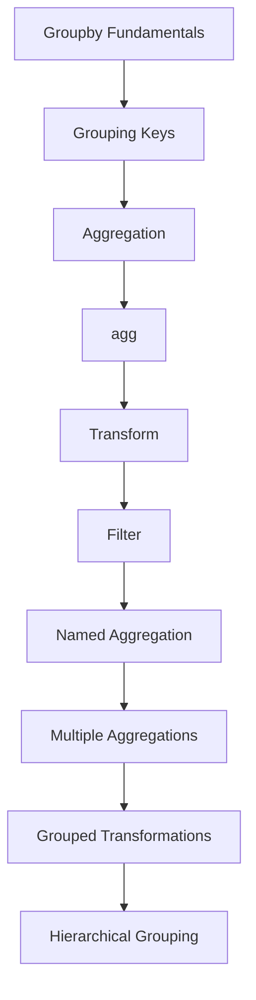
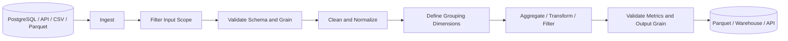

# README

## Overview

Grouping and aggregation are core Pandas capabilities for converting row-level data into meaningful business metrics.

This section focuses on how to:

```text
Raw records
    ↓
Define grouping dimensions
    ↓
Partition data into logical groups
    ↓
Calculate group-level metrics
    ↓
Transform or filter groups
    ↓
Produce validated analytical datasets
```

| # | File | Description |
|---|---|---|
| 01 | [01- Groupby Fundamentals](./01-%20Groupby.md) | Grouping mechanics and the split-apply-combine model |
| 02 | [02- Groupby Keys](./02-%20Groupby%20Keys.md) | Choosing and interpreting grouping dimensions |
| 03 | [03- Aggregation](./03-%20Aggregation.md) | Reducing groups to metrics |
| 04 | [04- Agg](./04-%20Agg.md) | General-purpose aggregation API |
| 05 | [05- Transform](./05-%20Transform.md) | Group-aware values aligned to source rows |
| 06 | [06- Filter](./06-%20Filter.md) | Retaining or removing complete groups |
| 07 | [07- Named Aggregation](./07-%20Named%20Aggregation.md) | Explicit metric naming |
| 08 | [08- Multiple Aggregations](./08-%20Multiple%20Aggregations.md) | Several metrics at one grain |
| 09 | [09- Grouped Transformations](./09-%20Grouped%20Transformations.md) | Practical group-relative calculations |
| 10 | [10- Hierarchical Grouping](./10-%20Hierarchical%20Grouping.md) | Multiple grouping dimensions and levels |

The concepts build progressively from the mechanics of `groupby()` to production-oriented multidimensional reporting.

Typical datasets include:

- Orders and transactions.
- Customer activity.
- Product performance.
- Employee metrics.
- Financial records.
- Event and service telemetry.
- API-derived business data.

The central engineering question throughout this section is:

> What is the intended grain of the output, and what operation preserves or changes that grain?

---

## Section Structure

```text
06- Grouping and Aggregation/
│
├── 01- Groupby.md
├── 02- Groupby Keys.md
├── 03- Aggregation.md
├── 04- Agg.md
├── 05- Transform.md
├── 06- Filter.md
├── 07- Named Aggregation.md
├── 08- Multiple Aggregations.md
├── 09- Grouped Transformations.md
├── 10- Hierarchical Grouping.md
└── README.md
```

The topics intentionally overlap in capability but differ in intent and output shape.

---

## Learning Flow



The progression moves from:

```text
How grouping works
    ↓
What defines a group
    ↓
How groups are reduced
    ↓
How results are named
    ↓
How group metrics return to source rows
    ↓
How groups are filtered
    ↓
How multidimensional groupings are modeled
```

---

## Topic Map

| Topic | Primary Focus | Typical Output |
| --- | --- | --- |
| `01- Groupby.md` | Grouping mechanics and the split-apply-combine model | Grouped object |
| `02- Groupby Keys.md` | Choosing and interpreting grouping dimensions | Defined group grain |
| `03- Aggregation.md` | Reducing groups to metrics | One result per group |
| `04- Agg.md` | General-purpose aggregation API | Group-level metrics |
| `05- Transform.md` | Group-aware values aligned to source rows | Same row count |
| `06- Filter.md` | Retaining or removing complete groups | Subset of original rows |
| `07- Named Aggregation.md` | Explicit metric naming | Flat, readable schema |
| `08- Multiple Aggregations.md` | Several metrics at one grain | Multi-metric summary |
| `09- Grouped Transformations.md` | Practical group-relative calculations | Enriched row-level data |
| `10- Hierarchical Grouping.md` | Multiple grouping dimensions and levels | Multi-dimensional summary |

---

## Core Mental Model

Pandas grouping follows the split-apply-combine model:

```text
Split
    ↓
Partition records by grouping keys

Apply
    ↓
Aggregate, transform, filter, rank, or calculate

Combine
    ↓
Construct the resulting Series or DataFrame
```

For example:

```python
customer_summary = (
    orders.groupby("customer_id")
    .agg(
        total_revenue=("revenue", "sum"),
        order_count=("order_id", "nunique"),
    )
)
```

The stages are:

```text
orders
    ↓
group by customer_id
    ↓
North? No — customer 101, 102, 103, ...
    ↓
calculate metrics per customer
    ↓
one row per customer
```

This mental model is more important than memorizing individual Pandas methods.

---

## Output Grain

Grain is the most important design concept in this section.

Consider:

```python
orders.groupby("customer_id")
```

The resulting group grain is:

```text
one group = one customer
```

Add another dimension:

```python
orders.groupby(
    ["customer_id", "region"]
)
```

The grain becomes:

```text
one group = one customer + one region
```

The operation:

```python
.agg(...)
```

usually produces one result row per group.

The operation:

```python
.transform(...)
```

produces a result aligned with every source row.

The operation:

```python
.filter(...)
```

keeps or removes complete groups.

Understanding this distinction prevents many subtle reporting and ETL bugs.

---

## Aggregation Versus Transformation

The section is built around an important distinction:

```text
Aggregation
    ↓
reduces the number of rows

Transformation
    ↓
preserves the source row structure
```

Example aggregation:

```python
summary = (
    orders.groupby("customer_id")
    .agg(
        total_revenue=("revenue", "sum")
    )
)
```

Result:

```text
one row per customer
```

Example transformation:

```python
orders["customer_total"] = (
    orders.groupby("customer_id")["revenue"]
    .transform("sum")
)
```

Result:

```text
one row per order
```

The metric is the same, but the output shape is different.

---

## `groupby()` Fundamentals

`groupby()` defines how records are partitioned.

Typical patterns include:

```python
orders.groupby("customer_id")
```

```python
orders.groupby(
    ["region", "sales_channel"]
)
```

```python
orders.groupby(
    "region",
    dropna=False,
)
```

```python
orders.groupby(
    "region",
    observed=True,
)
```

Important grouping decisions include:

- Grouping columns.
- Index levels.
- Missing grouping keys.
- Categorical dimensions.
- Sorting behavior.
- Output index behavior.
- Number of unique groups.

Grouping keys are not merely implementation details. They define the business meaning of the result.

---

## Grouping Keys

A grouping key represents a dimension by which records are partitioned.

Common examples:

```text
customer_id
product_id
region
sales_channel
department
status
order_date
```

Composite keys are common:

```python
orders.groupby(
    ["region", "sales_channel", "category"]
)
```

This creates a hierarchy of dimensions.

When defining grouping keys, ask:

```text
What business entity does one group represent?
How many groups should exist?
Can grouping keys be null?
Are grouping keys unique where expected?
Is the grouping scope tenant-safe?
```

---

## Aggregation

Aggregation reduces each group to one or more metrics.

Examples:

```python
summary = (
    orders.groupby("region")
    .agg(
        total_revenue=("revenue", "sum"),
        average_revenue=("revenue", "mean"),
        order_count=("order_id", "nunique"),
    )
)
```

Typical metrics include:

```text
sum
mean
median
min
max
count
nunique
std
var
first
last
```

Aggregation is appropriate when the required output grain is the group itself.

---

## `agg()` as the General Aggregation API

`agg()` provides a flexible interface for defining multiple metrics:

```python
summary = (
    orders.groupby("customer_id")
    .agg(
        total_revenue=("revenue", "sum"),
        order_count=("order_id", "nunique"),
    )
)
```

It supports:

- Single metrics.
- Multiple metrics.
- Different source columns.
- Custom aggregation functions.
- Named output fields.

For production reporting code, named aggregation is generally the clearest pattern because it makes the output schema explicit.

---

## `transform()`

`transform()` calculates group-aware values while maintaining row-level alignment.

Example:

```python
orders["customer_total"] = (
    orders.groupby("customer_id")["revenue"]
    .transform("sum")
)
```

This is useful for:

- Group-relative percentages.
- Group averages.
- Running metrics.
- Normalization.
- Row-level feature generation.
- Business rules based on group context.

A useful SQL analogy is the window function:

```sql
SUM(revenue) OVER (
    PARTITION BY customer_id
)
```

---

## `filter()`

`groupby().filter()` evaluates a predicate against each complete group:

```python
large_customers = (
    orders.groupby("customer_id")
    .filter(
        lambda group:
            group["revenue"].sum() >= 10_000
    )
)
```

The result retains:

```text
all rows
```

for qualifying customers and removes:

```text
all rows
```

for customers that do not qualify.

This is different from ordinary row-level boolean filtering.

---

## Named Aggregation

Named aggregation gives explicit names to output metrics:

```python
summary = (
    orders.groupby("customer_id")
    .agg(
        total_revenue=("revenue", "sum"),
        average_order_value=("revenue", "mean"),
        order_count=("order_id", "nunique"),
    )
)
```

The resulting schema is explicit:

```text
customer_id
total_revenue
average_order_value
order_count
```

This is particularly useful for:

- APIs.
- Parquet datasets.
- Data warehouses.
- Database loaders.
- Reporting pipelines.
- Data contracts.

---

## Multiple Aggregations

Production reports commonly require multiple metrics at the same grain:

```python
summary = (
    orders.groupby(
        "region",
        as_index=False,
    )
    .agg(
        total_revenue=("revenue", "sum"),
        average_order_value=("revenue", "mean"),
        order_count=("order_id", "nunique"),
        customer_count=("customer_id", "nunique"),
    )
)
```

The important design rule is:

> Metrics sharing the same grouping grain should generally be defined together.

This improves readability and helps make the output contract explicit.

---

## Grouped Transformations

Grouped transformations combine grouping with row-level calculations.

Common examples:

```python
group_total = (
    orders.groupby("customer_id")["revenue"]
    .transform("sum")
)

orders["revenue_share"] = (
    orders["revenue"].div(
        group_total.where(group_total.ne(0))
    )
)
```

Other patterns include:

```text
difference from group mean
rank within group
running total
previous value
group-specific imputation
group normalization
```

These are particularly useful when raw records need additional analytical context without changing their grain.

---

## Hierarchical Grouping

Multiple grouping keys create multidimensional analytical outputs:

```python
summary = (
    orders.groupby(
        ["region", "sales_channel", "category"],
        as_index=False,
    )
    .agg(
        total_revenue=("revenue", "sum"),
        order_count=("order_id", "nunique"),
    )
)
```

The resulting grain is:

```text
one row =
one region
+
one sales channel
+
one category
```

Hierarchical grouping is commonly used in:

- Regional reporting.
- Product analytics.
- Financial reporting.
- Operational dashboards.
- OLAP-style datasets.

---

## Choosing the Correct Operation

| Business Requirement | Pandas Pattern |
| --- | --- |
| Group records | `groupby()` |
| Produce one row per group | `groupby().agg()` |
| Produce several metrics per group | `groupby().agg(...)` |
| Add group metric to each row | `groupby().transform()` |
| Keep or discard complete groups | `groupby().filter()` |
| Calculate within-group rank | Grouped `rank()` |
| Calculate within-group running total | Grouped `cumsum()` |
| Calculate previous value | Grouped `diff()` |
| Group by several dimensions | `groupby([...])` |
| Produce an API/database-friendly schema | Named aggregation + `as_index=False` |

---

## Missing-Value Semantics

Grouping and aggregation must define null behavior explicitly.

For grouping keys:

```python
orders.groupby(
    "region",
    dropna=False,
)
```

can retain missing-key groups.

For aggregation:

```python
.agg(
    total_revenue=("revenue", "sum"),
    order_count=("order_id", "count"),
)
```

different functions have different null behavior.

Typical examples:

```text
sum()
    ignores missing values

mean()
    ignores missing values

count()
    counts non-null values

nunique()
    counts distinct non-null values by default
```

Do not assume that an aggregation automatically validates missing input.

---

## Duplicate Records

Grouping does not correct duplicate source records.

If:

```text
order_id = 1001
```

appears twice, then:

```python
total_revenue=("revenue", "sum")
```

can double-count the revenue.

Validate the expected source grain before aggregation:

```python
if orders["order_id"].duplicated().any():
    raise ValueError(
        "Duplicate order IDs detected."
    )
```

This is especially important after joins, API normalization, or event ingestion.

---

## Aggregation After Joins

A common production failure is:

```text
orders
    ↓
many-to-many join
    ↓
row multiplication
    ↓
groupby
    ↓
inflated totals
```

Validate joins before aggregating:

```python
orders = orders.merge(
    customers,
    on="customer_id",
    how="left",
    validate="many_to_one",
)
```

Then define the grouping grain.

The aggregation step should not be used to conceal relational data-quality problems.

---

## Filtering Before and After Aggregation

Filtering raw records before aggregation:

```python
completed = orders.loc[
    orders["status"].eq("completed")
]

summary = (
    completed.groupby("region")
    .agg(
        total_revenue=("revenue", "sum")
    )
)
```

means:

```text
aggregate only completed orders
```

Filtering after aggregation:

```python
summary = summary.loc[
    summary["total_revenue"].ge(100_000)
]
```

means:

```text
calculate all regional totals
then keep high-revenue regions
```

These are different business operations.

The order of filtering and aggregation must follow the reporting definition.

---

## SQL Relationship

Many grouping operations have direct SQL equivalents.

Pandas:

```python
orders.groupby(
    ["region", "sales_channel"]
).agg(
    total_revenue=("revenue", "sum"),
)
```

SQL:

```sql
SELECT
    region,
    sales_channel,
    SUM(revenue) AS total_revenue
FROM orders
GROUP BY
    region,
    sales_channel;
```

Grouped transformations often map to SQL window functions:

```python
orders["customer_total"] = (
    orders.groupby("customer_id")["revenue"]
    .transform("sum")
)
```

```sql
SUM(revenue) OVER (
    PARTITION BY customer_id
)
```

This makes group operations an important bridge between Pandas and relational databases.

---

## When to Push Grouping into SQL

If data originates in PostgreSQL and the result can be computed efficiently there, push filtering and aggregation toward the database when practical.

Prefer:

```text
PostgreSQL
    ↓
filter
    ↓
group
    ↓
aggregate
    ↓
small result
    ↓
Pandas
```

over:

```text
PostgreSQL
    ↓
millions of raw rows
    ↓
network
    ↓
Pandas
    ↓
groupby
```

Database-side execution can reduce:

- Network transfer.
- Application memory.
- Python processing.
- Serialization costs.

Pandas remains valuable for transformations that are easier to express or validate in Python.

---

## Performance Principles

Grouping is often one of the more expensive operations in a Pandas pipeline.

Performance is affected by:

- Number of input rows.
- Number of groups.
- Grouping-key cardinality.
- Number of dimensions.
- Source dtypes.
- Number of aggregations.
- Use of Python-level custom functions.
- Whether the input was reduced first.

Prefer:

```text
filter early
project required columns
normalize dtypes
use built-in group operations
avoid unnecessary copies
```

For example:

```python
working = orders.loc[
    orders["status"].eq("completed"),
    [
        "customer_id",
        "region",
        "order_id",
        "revenue",
    ],
]

summary = (
    working.groupby(
        ["region", "customer_id"],
        as_index=False,
    )
    .agg(
        total_revenue=("revenue", "sum"),
        order_count=("order_id", "nunique"),
    )
)
```

---

## Cardinality

High-cardinality grouping can increase memory and processing costs.

For example:

```python
events.groupby("request_id")
```

may produce nearly one group per row.

A useful diagnostic is:

```python
group_count = (
    events["request_id"].nunique()
)

row_count = len(events)
```

If:

```text
group_count ≈ row_count
```

the grouping may provide limited reuse while still incurring grouping overhead.

Always ask whether the chosen grouping grain is necessary.

---

## Categorical Dimensions

For repeated low-cardinality dimensions such as:

```text
region
status
sales_channel
```

categorical dtypes may reduce memory usage:

```python
orders["region"] = orders["region"].astype(
    "category"
)
```

Then:

```python
summary = (
    orders.groupby(
        "region",
        observed=True,
        as_index=False,
    )
    .agg(
        total_revenue=("revenue", "sum")
    )
)
```

Use categoricals intentionally, particularly when categories form part of a controlled vocabulary.

---

## Large Dataset Strategy

Pandas grouping is appropriate when the working dataset comfortably fits in memory.

For larger datasets, use a tiered strategy:

```text
Small / moderate
    ↓
Pandas

Large SQL-backed
    ↓
PostgreSQL / warehouse aggregation

Large local files
    ↓
Parquet / DuckDB

Distributed workloads
    ↓
Spark or distributed engines
```

Do not scale a Pandas process indefinitely when the workload belongs naturally in a database or distributed system.

---

## Data Validation

Before aggregation, validate the source contract.

Typical checks include:

```text
required columns exist
grouping keys have valid types
business identifiers are unique where required
metric columns are numeric
unexpected nulls are understood
duplicate records are handled
reporting scope is correct
```

Example:

```python
required_columns = {
    "customer_id",
    "order_id",
    "revenue",
}

missing_columns = required_columns.difference(
    orders.columns
)

if missing_columns:
    raise ValueError(
        f"Missing columns: {sorted(missing_columns)}"
)
```

---

## Output Validation

After aggregation, validate the resulting contract.

Example:

```python
expected_columns = [
    "customer_id",
    "total_revenue",
    "order_count",
]

if summary.columns.tolist() != expected_columns:
    raise ValueError(
        "Unexpected output schema."
    )
```

Validate grain:

```python
if summary["customer_id"].duplicated().any():
    raise ValueError(
        "Customer summary contains duplicate keys."
    )
```

Where applicable, reconcile additive metrics:

```text
sum(detail-level revenue)
    =
expected overall revenue
```

within the system's filtering and precision rules.

---

## Production Data Flow

A typical grouped Pandas pipeline may look like:



Grouping belongs inside a broader data-quality and data-contract workflow rather than being treated as an isolated transformation.

---

## Reporting Design

For reporting systems, distinguish between:

```text
dimensions
```

and:

```text
measures
```

Example:

```text
Dimensions:
    date
    region
    sales_channel
    category

Measures:
    revenue
    orders
    customers
    average_order_value
```

A grouped query defines the relationship between those dimensions and measures.

This makes Pandas aggregation directly relevant to analytical data modeling.

---

## Additive and Non-Additive Metrics

Not every metric can safely be aggregated again.

Typically additive:

```text
revenue
units_sold
transaction_count
```

Often non-additive:

```text
average_order_value
conversion_rate
percentage
distinct_customer_count
```

For example, do not calculate a regional average by blindly averaging channel averages:

```python
regional_average = (
    channel_summary.groupby("region")
    ["average_order_value"]
    .mean()
)
```

Instead, aggregate the underlying components:

```python
regional = (
    orders.groupby("region")
    .agg(
        total_revenue=("revenue", "sum"),
        order_count=("order_id", "nunique"),
    )
)

regional["average_order_value"] = (
    regional["total_revenue"]
    .div(regional["order_count"])
)
```

This distinction becomes increasingly important at senior engineering and analytics levels.

---

## Incremental Processing

Grouped metrics can behave differently in incremental pipelines.

For additive values:

```text
previous total
+
new batch total
=
new total
```

may be valid.

For averages:

```text
previous average
+
new average
```

is not enough.

For distinct counts:

```text
previous distinct count
+
new distinct count
```

can overcount overlapping entities.

Incremental systems should store appropriate state or recompute affected groups rather than assuming every metric is incrementally additive.

---

## Reliability and Idempotency

Grouping operations are deterministic when:

```text
input data
+
grouping keys
+
aggregation/transformation logic
```

are deterministic.

This makes them suitable for:

- Scheduled ETL.
- Backfills.
- Retryable batch jobs.
- Reporting refreshes.
- Reconciliation pipelines.

For reproducibility, define:

- Reporting windows.
- Input partitions.
- Grouping keys.
- Metric definitions.
- Null-handling rules.
- Duplicate-handling rules.

---

## Monitoring

Operational monitoring should cover both technical and business dimensions.

Useful technical metrics:

```text
input_row_count
output_group_count
processing_duration_ms
memory_usage_bytes
null_group_key_count
duplicate_key_count
```

Useful business metrics:

```text
total_revenue
order_count
customer_count
average_order_value
group_retention_rate
```

Unexpected changes can reveal:

- Upstream ingestion failures.
- Schema changes.
- Duplicate records.
- Changed filters.
- Grouping-key changes.
- Data drift.

---

## Security and Multi-Tenant Processing

Grouping does not enforce access control.

For tenant-aware systems:

```text
Authenticate
    ↓
Authorize
    ↓
Restrict rows
    ↓
Group
    ↓
Aggregate / transform
    ↓
Persist or return
```

Do not aggregate unrestricted tenant data and rely on later filtering to restore isolation.

Where appropriate, tenant identity should be part of the grouping scope:

```python
summary = (
    orders.groupby(
        ["tenant_id", "customer_id"],
        as_index=False,
    )
    .agg(
        total_revenue=("revenue", "sum")
    )
)
```

Only do this when it matches the actual data model and authorization boundary.

---

## Testing Strategy

Tests in this section should validate business behavior rather than merely successful execution.

A strong grouping test suite checks:

```text
grouping keys
output grain
metric values
column names
dtypes where contractual
null behavior
duplicate behavior
empty input
invalid input
edge cases
reconciliation
```

Example:

```python
def test_customer_summary() -> None:
    summary = (
        orders.groupby(
            "customer_id",
            as_index=False,
        )
        .agg(
            total_revenue=("revenue", "sum"),
            order_count=("order_id", "nunique"),
        )
    )

    assert summary["customer_id"].is_unique
    assert summary.columns.tolist() == [
        "customer_id",
        "total_revenue",
        "order_count",
    ]
```

For production code, compare expected metric values with representative fixtures.

---

## Common Mistakes

### Forgetting the Grain

A result can be numerically correct and still have the wrong grain.

Always ask:

```text
What does one output row represent?
```

---

### Using `count()` Instead of `nunique()`

These are not interchangeable:

```python
("order_id", "count")
```

```python
("order_id", "nunique")
```

The first counts non-null values.

The second counts distinct identifiers.

---

### Using `agg()` When Row Alignment Is Required

If the output must preserve one row per order, aggregation alone is the wrong operation.

Use:

```python
transform()
```

when the group metric must be broadcast back to source rows.

---

### Using `filter()` for Row-Level Conditions

`groupby().filter()` is for group-level predicates.

For:

```text
revenue >= 1000
```

use ordinary boolean filtering.

For:

```text
customer total >= 10000
```

use grouped filtering or a group metric with `transform()`.

---

### Ignoring Duplicate Input Rows

Aggregation can hide duplicated source records because the output still looks structurally valid.

Validate source grain before trusting totals.

---

### Ignoring Grouping Scope

A metric computed over:

```text
one day
```

is not the same as a metric computed over:

```text
all historical records
```

The input scope is part of the metric definition.

---

## Production Pitfalls

### Grouping After an Unvalidated Join

Many-to-many joins can inflate rows and therefore inflate aggregates.

Use merge validation where the relationship is known:

```python
merge(
    ...,
    validate="many_to_one",
)
```

---

### Silent Metric Definition Changes

Changing:

```python
"nunique"
```

to:

```python
"count"
```

can change the meaning of a production KPI without changing the schema.

Metric definitions should be reviewed like application logic.

---

### Overly Wide Intermediate DataFrames

Carrying unnecessary columns into groupby operations increases memory pressure.

Project only required columns before expensive transformations.

---

### Relying on Implicit Ordering

Cumulative and sequential grouped calculations require deterministic sorting.

Do not rely on incidental DataFrame order.

---

### Using Pandas for Database-Scale Aggregation

A technically valid Pandas solution can still be the wrong architecture when the source contains hundreds of millions of rows.

Evaluate whether the operation belongs in:

```text
PostgreSQL
warehouse
DuckDB
Spark
```

before moving the entire dataset into memory.

---

## Recommended Engineering Workflow

For production grouped-data processing, use this sequence:

```text
1. Define the required output grain.
2. Identify grouping dimensions.
3. Define each metric semantically.
4. Filter the source population.
5. Validate schema and source grain.
6. Normalize required dtypes.
7. Group and calculate metrics.
8. Validate output schema and grain.
9. Reconcile important metrics.
10. Persist or publish the result.
```

Example:

```python
working = orders.loc[
    orders["status"].eq("completed"),
    [
        "customer_id",
        "order_id",
        "region",
        "revenue",
    ],
]

if working["order_id"].duplicated().any():
    raise ValueError(
        "Duplicate order IDs detected."
    )

summary = (
    working.groupby(
        ["region", "customer_id"],
        as_index=False,
    )
    .agg(
        total_revenue=("revenue", "sum"),
        order_count=("order_id", "nunique"),
    )
)
```

This sequence keeps business semantics visible and reduces the risk of producing plausible but incorrect metrics.

---

## Completion Standard

After completing this section, you should be able to:

```text
Understand groupby()
        ↓
Choose correct grouping keys
        ↓
Define output grain
        ↓
Build single and multiple aggregations
        ↓
Use named aggregation
        ↓
Apply group-aware transformations
        ↓
Filter complete groups
        ↓
Build hierarchical summaries
        ↓
Validate grouped results
        ↓
Decide between Pandas and SQL execution
        ↓
Build production-ready grouped ETL workflows
```

The goal is not to memorize `groupby()` syntax. The goal is to reliably translate a business requirement into:

```text
correct grouping dimensions
+
correct metric definitions
+
correct output grain
+
correct data-quality semantics
+
appropriate execution layer
```

## Key Takeaways

- Grouping and aggregation are fundamentally about defining the correct **output grain** and calculating metrics at that grain.
- Use `agg()` for group-level results, `transform()` for group-aware row-level values, and `filter()` for retaining or removing complete groups.
- Treat grouping keys, metric definitions, null behavior, duplicate handling, and output schemas as explicit production data contracts.
- Prefer efficient vectorized operations and push large SQL-friendly aggregations toward PostgreSQL or analytical engines when that reduces data movement and memory pressure.
- Reliable grouped-data pipelines require validation, reconciliation, deterministic logic, monitoring, and clear handling of incremental and multi-tenant processing.