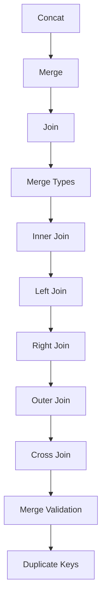
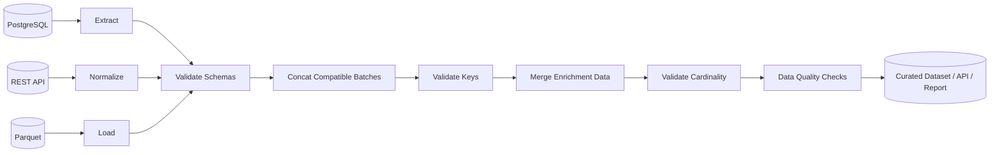

# README

## Overview

The Combining Data section covers how Pandas brings multiple DataFrames and Series together into a single reliable dataset.

Combining data is a core operation in backend data processing because production pipelines rarely operate on one isolated table. Data commonly arrives from:

- PostgreSQL and other databases.
- REST APIs.
- CSV and JSON files.
- Parquet datasets.
- Batch-processing jobs.
- Kafka-derived event datasets.
- Independently maintained service outputs.

The primary operations in this section are:

```text
Concat
    ↓
append compatible datasets

Merge
    ↓
combine datasets through relational keys

Join
    ↓
combine data using index-oriented semantics

Join types
    ↓
control which keys survive

Validation
    ↓
prove relationship assumptions

Duplicate-key handling
    ↓
prevent accidental row multiplication
```

The goal is not merely to learn syntax. The goal is to understand **data relationships, cardinality, grain, alignment, and correctness** well enough to build reliable ETL and backend data workflows.

---

## Section Structure

```text
07- Combining Data/
│
├── 01- Concat.md
├── 02- Merge.md
├── 03- Join.md
├── 04- Merge Types.md
├── 05- Inner Join.md
├── 06- Left Join.md
├── 07- Right Join.md
├── 08- Outer Join.md
├── 09- Cross Join.md
├── 10- Merge Validation.md
├── 11- Duplicate Keys.md
└── README.md
```

The topics progress from basic vertical and horizontal combination into relational joins and production-grade validation.

---

## Learning Flow



The progression is intentional:

```text
combine compatible datasets
    ↓
understand relational matching
    ↓
choose join semantics
    ↓
understand each join type
    ↓
handle Cartesian products
    ↓
validate relationship cardinality
    ↓
detect and control duplicate-key failures
```

---

## Core Mental Model

There are two fundamentally different ways to combine tabular data.

### Concatenation

Concatenation places datasets next to or below one another based primarily on their axes.

```text
DataFrame A
    ↓
DataFrame B
    ↓
DataFrame C
    ↓
concat()
```

Typical use cases:

```text
January data
+
February data
+
March data
```

### Relational Combination

A merge combines records based on keys:

```text
Customers
    +
Orders
    ↓
customer_id
    ↓
Merged dataset
```

The distinction is:

```text
concat()
    → append or align datasets

merge()
    → match records through keys
```

Choosing the wrong model is a common source of data corruption.

---

## Concat

`pd.concat()` combines multiple Pandas objects along an axis.

Vertical concatenation is common:

```python
all_orders = pd.concat(
    [january_orders, february_orders],
    ignore_index=True,
)
```

Conceptually:

```text
January orders
     ↓
February orders
     ↓
combined order table
```

Use concatenation when datasets represent the same logical schema across different:

- Time periods.
- Files.
- API pages.
- Partitions.
- Batch outputs.
- Sources with compatible structures.

---

## Vertical Concatenation

Example:

```python
combined = pd.concat(
    [
        north_orders,
        south_orders,
    ],
    ignore_index=True,
)
```

This produces:

```text
North rows
South rows
```

The columns are aligned by column labels.

Therefore, column order does not need to match, but column names do determine alignment.

---

## Handling Different Columns with `concat()`

Suppose:

```python
north_orders.columns
# ["order_id", "customer_id", "revenue"]

south_orders.columns
# ["order_id", "customer_id", "discount"]
```

Then:

```python
combined = pd.concat(
    [
        north_orders,
        south_orders,
    ],
    ignore_index=True,
)
```

The result contains the union of columns and missing values where a source does not provide a field.

This can be useful during schema evolution but may also hide upstream schema inconsistencies.

For production ETL, validate schemas before concatenating when a stable schema is expected.

---

## Horizontal Concatenation

`concat()` can also combine objects along columns:

```python
combined = pd.concat(
    [
        customer_features,
        customer_scores,
    ],
    axis=1,
)
```

This aligns by index.

That is fundamentally different from a relational merge:

```text
concat(axis=1)
    → index alignment

merge()
    → key-based matching
```

Do not use `axis=1` simply because two DataFrames happen to have the same row count.

The indices must represent compatible entities.

---

## `ignore_index`

When vertically concatenating independent batches:

```python
combined = pd.concat(
    [batch_a, batch_b],
    ignore_index=True,
)
```

the resulting index becomes a new sequential index.

Without `ignore_index=True`, the original indices are preserved.

This matters because repeated indices can be valid or problematic depending on downstream processing.

For ingestion batches, a fresh index is often clearer.

---

## `keys` with `concat()`

You can preserve source identity:

```python
combined = pd.concat(
    {
        "north": north_orders,
        "south": south_orders,
    }
)
```

This creates a hierarchical index containing the source key.

This can be useful for:

- Auditability.
- Debugging.
- Source tracking.
- Temporary analysis.

For durable production datasets, explicit source columns are often easier for downstream systems:

```python
north_orders = north_orders.assign(
    source_region="north"
)
```

---

## Merge

`merge()` is the primary relational combination operation.

Example:

```python
customer_orders = orders.merge(
    customers,
    on="customer_id",
    how="left",
)
```

This means:

```text
orders
    ↓
match customer_id
    ↓
customers
    ↓
enriched orders
```

The operation resembles SQL joins.

---

## Standard Merge Syntax

```python
result = left.merge(
    right,
    on="key",
    how="left",
)
```

Important parameters include:

| Parameter | Purpose |
| --- | --- |
| `right` | DataFrame being joined |
| `how` | Join type |
| `on` | Same key name on both sides |
| `left_on` | Left-side key |
| `right_on` | Right-side key |
| `suffixes` | Resolve overlapping non-key column names |
| `validate` | Enforce expected relationship cardinality |
| `indicator` | Track merge membership |

---

## Joining Different Key Names

Keys do not need identical names.

```python
result = orders.merge(
    customers,
    left_on="customer_id",
    right_on="id",
    how="left",
)
```

This is useful when integrating schemas from different systems.

Validate that the two columns represent the same business identifier before joining them.

---

## Merge Types

The major join types are:

| Join | Retains |
| --- | --- |
| Inner | Keys present in both datasets |
| Left | All keys from left dataset |
| Right | All keys from right dataset |
| Outer | All keys from both datasets |
| Cross | Cartesian product |

SQL provides the same conceptual join categories.

The correct type depends on the business requirement, not on which result "looks right" after execution.

---

## Inner Join

```python
result = orders.merge(
    customers,
    on="customer_id",
    how="inner",
)
```

Only matching keys remain.

Use this when:

```text
records without a match should be excluded
```

Example:

```text
Orders:
101
102
103

Customers:
101
103
104
```

Result keys:

```text
101
103
```

An inner join is appropriate when referential integrity requires a customer record to exist.

---

## Left Join

```python
result = orders.merge(
    customers,
    on="customer_id",
    how="left",
)
```

All orders remain.

Customer fields become null when the corresponding customer does not exist.

This is often the safest default for enrichment pipelines because the primary dataset is preserved.

Use it when:

```text
orders are the source of truth
customers provide optional enrichment
```

---

## Right Join

```python
result = orders.merge(
    customers,
    on="customer_id",
    how="right",
)
```

All customer records remain.

Right joins are valid but often less readable than swapping the left and right DataFrames and using a left join.

For example:

```python
result = customers.merge(
    orders,
    on="customer_id",
    how="left",
)
```

This often makes the preserved dataset explicit.

---

## Outer Join

```python
result = orders.merge(
    customers,
    on="customer_id",
    how="outer",
)
```

All keys from both datasets remain.

This is useful for:

- Reconciliation.
- Data-quality analysis.
- Full inventory comparisons.
- Detecting orphan records.
- Identifying missing records on either side.

For production reconciliation, add:

```python
indicator=True
```

to identify which side contributed each record.

---

## Merge Indicator

```python
comparison = orders.merge(
    customers,
    on="customer_id",
    how="outer",
    indicator=True,
)
```

The `_merge` column identifies membership such as:

```text
left_only
right_only
both
```

This is valuable when auditing source-system mismatches.

Example:

```python
unmatched_orders = comparison.loc[
    comparison["_merge"].eq("left_only")
]
```

This gives records present in orders but missing from customers.

---

## Cross Join

A cross join produces every possible pair:

```python
result = products.merge(
    regions,
    how="cross",
)
```

If:

```text
products = 10,000 rows
regions  = 100 rows
```

the result has:

```text
1,000,000 rows
```

Cross joins are appropriate for controlled scenarios such as:

- Pricing matrices.
- Scheduling combinations.
- Configuration expansion.
- Scenario generation.

They can become an accidental denial-of-service against your own process when performed on large inputs.

---

## Cartesian Product Risk

Always estimate:

```text
left_rows × right_rows
```

before a cross join.

For a 5-million-row table and a 100,000-row table:

```text
5,000,000 × 100,000
=
500,000,000,000
```

That is not a reasonable Pandas workload.

For large Cartesian operations, reconsider the data model or move the computation to a system designed for large-scale relational processing.

---

## Join Cardinality

Cardinality describes how rows relate across the join key.

Common relationships:

```text
one-to-one
one-to-many
many-to-one
many-to-many
```

Example:

```text
Customer
    1
    │
    ├── Order A
    ├── Order B
    └── Order C
```

This is:

```text
customer → orders
one-to-many
```

From the orders side, merging customers is:

```text
many-to-one
```

Understanding cardinality is more important than memorizing join syntax.

---

## Merge Validation

Pandas can enforce the expected relationship:

```python
result = orders.merge(
    customers,
    on="customer_id",
    how="left",
    validate="many_to_one",
)
```

This asserts:

```text
many orders
    →
one customer
```

If the customers table contains duplicate customer IDs, the merge fails instead of silently multiplying rows.

This is one of the most valuable production features in Pandas joins.

---

## Why Many-to-Many Joins Are Dangerous

Suppose:

```text
orders
customer_id = 101
appears 3 times

customers
customer_id = 101
appears 2 times
```

The merged result can contain:

```text
3 × 2 = 6 rows
```

This is a Cartesian multiplication within the key.

The input tables may look valid individually, yet the resulting metrics can become completely wrong.

Always understand key uniqueness before merging.

---

## Duplicate Keys

Duplicate keys should be treated as an explicit data-quality concern.

Check:

```python
duplicates = customers.loc[
    customers["customer_id"].duplicated(
        keep=False
    )
]
```

For an entity table expected to be unique:

```python
if customers["customer_id"].duplicated().any():
    raise ValueError(
        "customer_id must be unique."
    )
```

Do this before relying on a `many_to_one` relationship.

---

## Duplicate Keys After Joins

After a merge, validate the resulting grain:

```python
if result.duplicated(
    subset=["order_id"]
).any():
    raise ValueError(
        "Merge duplicated order records."
    )
```

This is particularly important when:

- Source uniqueness is uncertain.
- A new upstream source was introduced.
- Join keys changed.
- Lookup tables evolved.

A join can preserve syntactic validity while violating the business grain.

---

## Suffixes

When both DataFrames contain the same non-key column name:

```python
result = orders.merge(
    customer_snapshot,
    on="customer_id",
    how="left",
    suffixes=(
        "_order",
        "_customer",
    ),
)
```

Avoid leaving ambiguous fields such as:

```text
status_x
status_y
```

in a production dataset.

Use domain-specific names when possible:

```text
order_status
customer_status
```

---

## Merge on Index

Pandas can also combine data through index-based semantics:

```python
result = orders.merge(
    customer_features,
    left_on="customer_id",
    right_index=True,
    how="left",
)
```

This is useful when the lookup DataFrame is intentionally indexed by its join key.

Index-based joins can be convenient but should still have explicit cardinality expectations.

---

## `join()`

`join()` provides index-oriented combination:

```python
result = orders.join(
    customer_features,
    on="customer_id",
    how="left",
)
```

It is particularly convenient when one side is indexed appropriately.

Conceptually:

```text
merge()
    → relational key-oriented API

join()
    → convenient index-oriented API
```

Use the form that makes the intended relationship easiest to understand.

---

## `concat()` Versus `merge()` Versus `join()`

| Operation | Primary Semantics | Typical Use |
| --- | --- | --- |
| `concat()` | Axis combination | Append batches/files |
| `merge()` | Relational key matching | Enrich or reconcile datasets |
| `join()` | Index/key combination | Combine index-oriented data |

A useful rule:

```text
Same logical records, additional columns
    → merge/join

Same logical schema, additional records
    → concat
```

---

## Data Grain Before Combining

Before combining datasets, document each input's grain.

Example:

```text
orders
    one row = one order

customers
    one row = one customer
```

Then:

```python
orders.merge(
    customers,
    on="customer_id",
    how="left",
    validate="many_to_one",
)
```

The expected output grain remains:

```text
one row = one order
```

If `customers` contains duplicate customer IDs, that assumption fails.

---

## Data Grain After Combining

Always verify the expected result.

For an order enrichment:

```python
enriched_orders = orders.merge(
    customers,
    on="customer_id",
    how="left",
    validate="many_to_one",
)

if enriched_orders["order_id"].duplicated().any():
    raise ValueError(
        "Order grain was not preserved."
    )
```

The combination operation should preserve the intended grain unless a multiplication is explicitly required.

---

## Key Dtypes

Join keys should have compatible semantic and technical types.

Check:

```python
orders["customer_id"].dtype
customers["customer_id"].dtype
```

A common ingestion problem is:

```text
orders.customer_id → int64
customers.id       → string
```

Normalize them before merging:

```python
orders["customer_id"] = (
    orders["customer_id"]
    .astype("string")
)

customers["id"] = (
    customers["id"]
    .astype("string")
)
```

Do not blindly cast identifiers to numeric types.

Identifiers are often better represented as strings because:

- Leading zeros may be meaningful.
- They are not quantities.
- Large identifiers may exceed assumptions about numeric representation.

---

## Missing Join Keys

Null join keys require deliberate semantics.

For example:

```python
result = orders.merge(
    customers,
    on="customer_id",
    how="left",
)
```

Orders with missing customer IDs will not represent valid customer matches.

Treat null identifiers as a data-quality condition when the relationship requires a customer.

---

## Schema Validation Before Combining

Before merging production datasets, validate:

```text
required columns exist
join keys exist
join keys have compatible dtypes
expected uniqueness holds
duplicate semantics are understood
null keys are acceptable
```

Example:

```python
required_order_columns = {
    "order_id",
    "customer_id",
}

missing = required_order_columns.difference(
    orders.columns
)

if missing:
    raise ValueError(
        f"Missing order columns: {sorted(missing)}"
)
```

Validation failures should be explicit rather than allowing incorrect data to propagate.

---

## Combining API Results

Paginated API responses are often combined with `concat()`:

```python
pages = [
    pd.DataFrame(page["items"])
    for page in api_pages
]

transactions = pd.concat(
    pages,
    ignore_index=True,
)
```

Then reference data may be merged:

```python
transactions = transactions.merge(
    customers,
    on="customer_id",
    how="left",
    validate="many_to_one",
)
```

This illustrates two different operations in one pipeline:

```text
API pages
    ↓
concat()
    ↓
one transaction dataset
    ↓
merge()
    ↓
customer enrichment
```

---

## Combining Database Results

Suppose two source systems produce compatible order extracts:

```python
orders = pd.concat(
    [
        postgres_orders,
        warehouse_orders,
    ],
    ignore_index=True,
)
```

If customer attributes are stored separately:

```python
orders = orders.merge(
    customers,
    on="customer_id",
    how="left",
    validate="many_to_one",
)
```

The distinction remains:

```text
concat
    combines rows

merge
    combines attributes
```

---

## CSV and Parquet Pipelines

Multiple files with the same logical schema can be concatenated:

```python
frames = [
    pd.read_csv(path)
    for path in input_paths
]

orders = pd.concat(
    frames,
    ignore_index=True,
)
```

For Parquet partitions:

```python
frames = [
    pd.read_parquet(path)
    for path in partition_paths
]

orders = pd.concat(
    frames,
    ignore_index=True,
)
```

For many files, avoid loading all partitions simultaneously when memory is constrained. Prefer partition-aware processing or a query engine capable of scanning only required data.

---

## Merge Validation in ETL

A strong ETL pattern is:

```python
enriched_orders = orders.merge(
    customers,
    on="customer_id",
    how="left",
    validate="many_to_one",
)
```

Then monitor unmatched keys:

```python
unmatched_rate = (
    enriched_orders["customer_name"]
    .isna()
    .mean()
)
```

A sudden increase in unmatched records may indicate:

- Missing customer ingestion.
- Identifier format changes.
- Referential-integrity failures.
- Data latency.
- Upstream schema changes.

---

## Data Reconciliation

Outer joins are useful for source reconciliation:

```python
comparison = source_a.merge(
    source_b,
    on="order_id",
    how="outer",
    indicator=True,
)
```

Then:

```python
missing_from_b = comparison.loc[
    comparison["_merge"].eq("left_only")
]

missing_from_a = comparison.loc[
    comparison["_merge"].eq("right_only")
]
```

This pattern is useful for migration validation and data-quality investigations.

---

## Performance

Combining operations can be expensive because they may require:

- Hashing join keys.
- Sorting or alignment.
- Allocating new DataFrames.
- Copying columns.
- Handling duplicate combinations.

Before a large join:

```python
left_rows = len(orders)
right_rows = len(customers)

print(left_rows, right_rows)
```

More useful production diagnostics include:

```text
rows on each side
unique key counts
duplicate key counts
expected cardinality
estimated output rows
```

Do not optimize only the function call. Optimize the data model and workload.

---

## Reduce Before Merge

Project only required columns:

```python
customer_lookup = customers[
    [
        "customer_id",
        "customer_name",
        "segment",
    ]
]

enriched_orders = orders.merge(
    customer_lookup,
    on="customer_id",
    how="left",
    validate="many_to_one",
)
```

This reduces:

- Memory usage.
- Data copying.
- Result width.
- Serialization overhead.

Column projection is especially useful before large joins.

---

## Filter Before Merge

If only active customers are relevant:

```python
active_customers = customers.loc[
    customers["status"].eq("active"),
    [
        "customer_id",
        "segment",
    ],
]
```

Then:

```python
orders = orders.merge(
    active_customers,
    on="customer_id",
    how="left",
    validate="many_to_one",
)
```

Filtering before a join can reduce the right-side dataset substantially.

Be careful: filtering the lookup side changes business semantics. Confirm that excluding inactive records is actually intended.

---

## Categorical Keys

For repeated low-cardinality join dimensions, categoricals may reduce memory use in suitable workloads.

However, do not convert arbitrary identifiers to categories solely because they are join keys.

Consider:

```text
region
channel
status
```

versus:

```text
customer_id
order_id
request_id
```

Low-cardinality dimensions are generally better candidates than near-unique identifiers.

Measure performance rather than assuming categoricals always improve joins.

---

## Large Joins

Pandas joins require the working data to fit within the available memory.

For large relational datasets:

```text
PostgreSQL
    ↓
SQL join
    ↓
filtered / projected result
    ↓
Pandas
```

may be preferable.

Other options include:

- DuckDB.
- Data warehouses.
- Spark.
- Distributed processing systems.

Pandas is excellent for moderate-sized in-memory transformations, but it is not a replacement for a distributed query engine.

---

## SQL Relationship

Pandas:

```python
orders.merge(
    customers,
    on="customer_id",
    how="left",
    validate="many_to_one",
)
```

SQL:

```sql
SELECT
    o.*,
    c.customer_name,
    c.segment
FROM orders AS o
LEFT JOIN customers AS c
    ON o.customer_id = c.customer_id;
```

Understanding the SQL equivalent helps determine whether the operation belongs in:

```text
application memory
```

or:

```text
database execution
```

---

## Production Data Flow

Combining data commonly fits into a pipeline like:



Each combination stage should have a known input grain and output contract.

---

## Reliability

Combining operations should be deterministic and reproducible.

For batch pipelines, record:

```text
source partitions
source timestamps
input row counts
unique key counts
join type
join validation rule
output row counts
unmatched key counts
```

This makes failed runs and data discrepancies easier to investigate.

---

## Idempotent Processing

Appending the same batch twice is a common ETL failure mode:

```python
combined = pd.concat(
    [existing, new_batch],
    ignore_index=True,
)
```

If the batch is retried without deduplication, records may be duplicated.

A stronger ingestion design uses:

- Batch IDs.
- Source event IDs.
- Idempotency keys.
- Deduplication rules.
- Partition-aware writes.

Do not assume `concat()` is idempotent.

---

## Transaction and Batch Boundaries

If data arrives in batches:

```text
batch_001
batch_002
batch_003
```

preserve batch metadata when useful:

```python
batch = batch.assign(
    batch_id=batch_id
)
```

Then combine:

```python
combined = pd.concat(
    batches,
    ignore_index=True,
)
```

This helps support auditing and replay.

---

## Testing Combination Logic

Tests should verify:

- Expected rows.
- Expected columns.
- Join cardinality.
- Duplicate behavior.
- Null handling.
- Key dtype compatibility.
- Output grain.
- Unmatched records.
- Empty inputs.

Example:

```python
def test_order_customer_merge_preserves_order_grain() -> None:
    result = orders.merge(
        customers,
        on="customer_id",
        how="left",
        validate="many_to_one",
    )

    assert len(result) == len(orders)
    assert not result["order_id"].duplicated().any()
```

A row-count assertion is particularly useful when a left enrichment is expected to preserve the left-side grain.

---

## Testing Concatenation

For vertical concatenation:

```python
def test_concat_preserves_all_batches() -> None:
    result = pd.concat(
        [batch_a, batch_b],
        ignore_index=True,
    )

    assert len(result) == (
        len(batch_a) + len(batch_b)
    )
```

Also verify the expected schema:

```python
assert result.columns.tolist() == [
    "order_id",
    "customer_id",
    "revenue",
]
```

If the schema is contractual, fail on unexpected columns rather than silently accepting them.

---

## Common Mistakes

### Using `concat()` Instead of `merge()`

Incorrect when records must be matched by key:

```python
pd.concat(
    [orders, customers]
)
```

This appends rows rather than enriching orders with customer attributes.

Use:

```python
orders.merge(
    customers,
    on="customer_id",
)
```

---

### Using `merge()` Instead of `concat()`

If monthly files represent the same logical table:

```text
January
February
March
```

a merge is generally inappropriate.

Use:

```python
pd.concat(
    monthly_frames,
    ignore_index=True,
)
```

---

### Ignoring Duplicate Keys

A merge can silently multiply rows.

Use:

```python
validate="many_to_one"
```

or another appropriate cardinality rule.

---

### Joining on the Wrong Column

A syntactically valid join can still be semantically incorrect.

Examples of dangerous keys:

```text
customer name
email address
free-form text
```

Prefer stable identifiers such as:

```text
customer_id
order_id
product_id
```

when available.

---

### Assuming Equal Row Counts Mean Rows Match

This is dangerous:

```python
pd.concat(
    [left.reset_index(drop=True),
     right.reset_index(drop=True)],
    axis=1,
)
```

Equal lengths do not prove that row `N` on the left belongs to row `N` on the right.

Use an explicit key-based merge when entity relationships matter.

---

### Ignoring Null Keys

Missing identifiers can cause records to remain unmatched.

Treat missing keys according to the data contract rather than assuming the join handles the problem automatically.

---

## Production Pitfalls

### Many-to-Many Explosion

A many-to-many merge may create orders of magnitude more rows than either source.

Estimate:

```text
duplicate count per key
×
duplicate count per matching key
```

when assessing worst-case multiplication.

---

### Schema Drift During Concatenation

One API version may produce:

```text
customer_id
revenue
```

while another produces:

```text
customer_id
amount
```

`concat()` can produce a dataset with both columns and missing values.

That may look valid but be semantically broken.

Validate schemas at ingestion boundaries.

---

### Join-Key Type Drift

An upstream system may change:

```text
customer_id: integer
```

to:

```text
customer_id: string
```

without changing the business meaning.

Normalize identifiers explicitly before combining data.

---

### Unbounded Cross Joins

A cross join can consume all available memory.

Treat cross joins as operations requiring explicit cardinality estimation.

---

### Aggregating After a Row-Multiplying Join

A dangerous pattern is:

```text
orders
    ↓
many-to-many merge
    ↓
duplicated orders
    ↓
groupby().sum()
    ↓
inflated revenue
```

Validate joins before aggregation, especially when combining this section with the previous Grouping and Aggregation section.

---

## Security Considerations

Combining datasets can create data-exposure risks.

A merge may introduce fields such as:

```text
email
phone
account_status
internal_flags
```

into a DataFrame that will later be exported or returned by an API.

Project only required columns:

```python
customer_lookup = customers[
    [
        "customer_id",
        "segment",
    ]
]
```

Do not carry sensitive columns merely because they happen to be present in the source.

Authorization should be established before loading or combining restricted tenant data.

---

## Multi-Tenant Data

For tenant-aware systems, grouping and joins must respect tenant boundaries.

Unsafe conceptual model:

```text
orders
    customer_id
    ↓
global customer lookup
```

when `customer_id` is only unique within a tenant.

A safer key may be:

```python
orders.merge(
    customers,
    on=[
        "tenant_id",
        "customer_id",
    ],
    how="left",
    validate="many_to_one",
)
```

Use composite keys when the underlying data model requires them.

---

## Monitoring

Useful operational metrics include:

```text
left_input_rows
right_input_rows
left_unique_keys
right_unique_keys
duplicate_left_keys
duplicate_right_keys
output_rows
unmatched_left_rows
unmatched_right_rows
join_duration_ms
memory_usage_bytes
```

For concatenation:

```text
batch_count
input_rows_per_batch
total_input_rows
output_rows
schema_mismatch_count
duplicate_business_keys
```

Unexpected changes in these metrics often identify data-quality failures before downstream reports do.

---

## Cost Considerations

The most expensive combination operation is often the one that produces the largest intermediate dataset.

Reduce:

```text
rows
+
columns
+
duplicate keys
```

before the combination where business semantics allow.

For cloud workloads, unnecessary data movement into application containers can also increase:

- Network cost.
- Compute cost.
- Memory pressure.
- Job duration.

Database-side joins are often preferable when the data already resides in the same database.

---

## Recommended Workflow

A production combination workflow should generally follow:

```text
1. Define the grain of each input.
2. Identify the intended relationship.
3. Validate required columns.
4. Normalize join-key dtypes.
5. Validate uniqueness assumptions.
6. Project required columns.
7. Filter unnecessary rows.
8. Perform concat or merge.
9. Validate output cardinality.
10. Check unmatched records.
11. Validate output schema.
12. Persist or publish.
```

Example:

```python
customer_lookup = customers.loc[
    customers["status"].eq("active"),
    [
        "tenant_id",
        "customer_id",
        "segment",
    ],
].copy()

if customer_lookup.duplicated(
    subset=["tenant_id", "customer_id"]
).any():
    raise ValueError(
        "Customer lookup contains duplicate keys."
    )

enriched_orders = orders.merge(
    customer_lookup,
    on=[
        "tenant_id",
        "customer_id",
    ],
    how="left",
    validate="many_to_one",
)

if len(enriched_orders) != len(orders):
    raise ValueError(
        "Order grain changed during enrichment."
    )
```

This turns join assumptions into executable checks.

---

## Decision Guide

| Question | Recommended Operation |
| --- | --- |
| Do datasets represent the same logical records across time/files? | `concat()` |
| Do datasets represent different attributes of the same entities? | `merge()` |
| Is one dataset naturally indexed by the lookup key? | `join()` or `merge()` |
| Must all left records remain? | Left join |
| Only matched records should remain? | Inner join |
| Need all records for reconciliation? | Outer join |
| Need every possible combination? | Cross join, with cardinality review |
| Relationship should be one-to-one | `validate="one_to_one"` |
| Relationship should be one-to-many | `validate="one_to_many"` |
| Relationship should be many-to-one | `validate="many_to_one"` |
| Duplicate keys are unexpected | Validate before joining |
| Large database-resident datasets | Prefer SQL join where practical |

---

## Completion Standard

After completing this section, you should be able to:

```text
Recognize append versus join problems
    ↓
Use concat() correctly
    ↓
Use merge() for relational enrichment
    ↓
Understand inner/left/right/outer joins
    ↓
Use cross joins intentionally
    ↓
Reason about one-to-one and one-to-many relationships
    ↓
Validate join cardinality
    ↓
Detect duplicate-key problems
    ↓
Preserve output grain
    ↓
Build reliable multi-source ETL pipelines
```

The target skill is not memorizing the syntax of `concat()` or `merge()`.

The target skill is being able to answer:

```text
What does one row represent?
What key relates these datasets?
What cardinality should exist?
Which records must survive?
Can this operation multiply rows?
What happens to unmatched records?
Where should this computation execute?
```

Once these questions are answered, the correct Pandas combination operation is usually straightforward.

## Key Takeaways

- Use `concat()` to combine compatible datasets along an axis and `merge()` or `join()` when records must be related through keys.
- Always define the grain and cardinality of both inputs before combining them; a syntactically valid join can still produce incorrect data.
- Use `validate=` aggressively for expected one-to-one, one-to-many, or many-to-one relationships, and treat duplicate keys as explicit data-quality conditions.
- Reduce rows and columns before expensive joins, estimate cross-join and many-to-many cardinality, and push large SQL-friendly joins toward PostgreSQL or analytical engines when practical.
- Production data-combination pipelines should validate schemas, key dtypes, unmatched records, output grain, sensitive-field exposure, and operational metrics before publishing results.