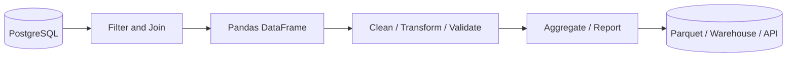
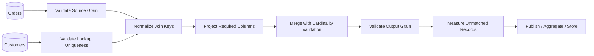

# 02- Merge

## Overview

`DataFrame.merge()` is Pandas' primary operation for **combining tabular data through relational keys**.

It is conceptually similar to SQL `JOIN` and is used when two datasets contain different attributes about related entities.

Typical examples include:

```text
Orders + Customers
Transactions + Accounts
Employees + Departments
Products + Categories
Events + Service Metadata
```

A merge answers questions such as:

```text
Which customer attributes belong to this order?
Which department does this employee belong to?
Which product metadata belongs to this transaction?
Which records exist in both source systems?
```

The central engineering concerns are:

```text
join key
    ↓
relationship cardinality
    ↓
join type
    ↓
row multiplication
    ↓
unmatched records
    ↓
output grain
    ↓
schema correctness
```

A merge can execute successfully while producing completely incorrect business data. Correctness therefore depends more on understanding the data relationship than on memorizing the syntax.

---

## Why `merge()` Exists

Production datasets are commonly normalized across several tables.

For example:

```text
customers
    one row = one customer

orders
    one row = one order
```

The order dataset may contain only:

```text
order_id
customer_id
revenue
```

while customer information contains:

```text
customer_id
name
segment
country
```

To enrich orders:

```python
enriched_orders = orders.merge(
    customers,
    on="customer_id",
    how="left",
)
```

The result combines columns from both datasets while matching records through `customer_id`.

This is fundamentally different from concatenating rows.

---

## `merge()` Versus `concat()`

The distinction should be clear:

```text
concat()
    → combine rows or columns along an axis

merge()
    → match related records through keys
```

Example of appending monthly datasets:

```python
all_orders = pd.concat(
    [january_orders, february_orders],
    ignore_index=True,
)
```

Example of enriching orders:

```python
orders = orders.merge(
    customers,
    on="customer_id",
    how="left",
)
```

A useful rule is:

```text
Same logical table + more records
    → concat()

Related tables + additional attributes
    → merge()
```

---

## Basic Syntax

The common form is:

```python
result = left.merge(
    right,
    on="key",
    how="left",
)
```

Example:

```python
enriched_orders = orders.merge(
    customers,
    on="customer_id",
    how="left",
)
```

The main parameters are:

| Parameter | Purpose |
| --- | --- |
| `right` | DataFrame being combined with the left DataFrame |
| `how` | Join strategy |
| `on` | Shared key name |
| `left_on` | Key column on the left |
| `right_on` | Key column on the right |
| `left_index` | Use left index as key |
| `right_index` | Use right index as key |
| `suffixes` | Resolve overlapping non-key columns |
| `validate` | Enforce expected cardinality |
| `indicator` | Add merge membership information |

---

## Example Dataset

Consider:

```python
import pandas as pd


orders = pd.DataFrame(
    {
        "order_id": [1001, 1002, 1003, 1004],
        "customer_id": [101, 102, 101, 103],
        "revenue": [250.0, 180.0, 420.0, 150.0],
    }
)

customers = pd.DataFrame(
    {
        "customer_id": [101, 102, 103],
        "customer_name": [
            "Acme Ltd",
            "Globex Corp",
            "Initech",
        ],
        "segment": [
            "Enterprise",
            "SMB",
            "Enterprise",
        ],
    }
)
```

Merge them:

```python
enriched_orders = orders.merge(
    customers,
    on="customer_id",
    how="left",
)
```

The result contains:

```text
order_id | customer_id | revenue | customer_name | segment
---------|-------------|---------|---------------|----------
1001     | 101         | 250.0   | Acme Ltd      | Enterprise
1002     | 102         | 180.0   | Globex Corp   | SMB
1003     | 101         | 420.0   | Acme Ltd      | Enterprise
1004     | 103         | 150.0   | Initech       | Enterprise
```

The original order grain remains:

```text
one row = one order
```

because the customer table has one row per customer.

---

## Join Keys

A join key identifies corresponding records across datasets.

Prefer stable identifiers such as:

```text
customer_id
order_id
product_id
account_id
employee_id
```

Avoid joining on descriptive attributes when a stable identifier exists:

```text
customer_name
email
phone
address
free-form text
```

Names and other business attributes can change, collide, or contain formatting differences.

---

## Shared Key with `on`

When both DataFrames use the same column name:

```python
orders.merge(
    customers,
    on="customer_id",
    how="left",
)
```

This is the simplest and most readable form.

For multiple shared keys:

```python
orders.merge(
    customers,
    on=[
        "tenant_id",
        "customer_id",
    ],
    how="left",
)
```

Composite keys are required when an identifier is only unique within another scope.

---

## Different Key Names

Source systems frequently use different field names.

For example:

```text
orders.customer_id
customers.id
```

Use:

```python
enriched_orders = orders.merge(
    customers,
    left_on="customer_id",
    right_on="id",
    how="left",
)
```

If both identifiers represent the same entity, normalize the schema before merging when practical:

```python
customers = customers.rename(
    columns={"id": "customer_id"}
)

enriched_orders = orders.merge(
    customers,
    on="customer_id",
    how="left",
)
```

A common schema is usually easier to maintain than carrying source-specific names throughout the pipeline.

---

## Multiple Join Keys

A composite relationship can be represented directly:

```python
result = orders.merge(
    customer_accounts,
    on=[
        "tenant_id",
        "customer_id",
    ],
    how="left",
    validate="many_to_one",
)
```

This is common in multi-tenant systems where:

```text
customer_id
```

is unique only within:

```text
tenant_id
```

Never omit part of a composite business key merely because one field happens to look unique in a sample.

---

## Join Types

The `how` parameter determines which keys survive.

| `how` | Keys retained |
| --- | --- |
| `inner` | Matching keys on both sides |
| `left` | All left keys |
| `right` | All right keys |
| `outer` | All keys from both sides |
| `cross` | Every possible pair |

The join type is a business decision.

Do not choose it based only on which result happens to look complete.

---

## Inner Join

```python
result = orders.merge(
    customers,
    on="customer_id",
    how="inner",
)
```

Only records with matching keys on both sides are retained.

Example:

```text
Orders:
101
102
103

Customers:
101
103
104
```

Result:

```text
101
103
```

Use an inner join when unmatched records should not participate in the result.

---

## Left Join

```python
result = orders.merge(
    customers,
    on="customer_id",
    how="left",
)
```

All rows from the left DataFrame remain.

If a customer is missing:

```text
customer_name → NaN
segment        → NaN
```

This is a common enrichment pattern:

```text
fact table
    +
optional dimension attributes
```

It is often preferable to an inner join when losing source records would be dangerous.

---

## Right Join

```python
result = orders.merge(
    customers,
    on="customer_id",
    how="right",
)
```

All rows from the right DataFrame remain.

In practice, right joins are often less readable because the same logic can frequently be expressed by swapping the DataFrames:

```python
result = customers.merge(
    orders,
    on="customer_id",
    how="left",
)
```

The latter often communicates the preserved dataset more clearly.

---

## Outer Join

```python
result = orders.merge(
    customers,
    on="customer_id",
    how="outer",
)
```

All keys from both datasets are retained.

This is useful for:

- Source reconciliation.
- Migration validation.
- Detecting orphan records.
- Comparing datasets.
- Auditing synchronization gaps.

For operational reconciliation, combine it with:

```python
indicator=True
```

---

## Merge Indicator

```python
comparison = orders.merge(
    customers,
    on="customer_id",
    how="outer",
    indicator=True,
)
```

The `_merge` column identifies the source membership.

Typical values are:

```text
left_only
right_only
both
```

Example:

```python
missing_customers = comparison.loc[
    comparison["_merge"].eq("left_only")
]
```

This identifies orders whose customer key was not present in the customer dataset.

---

## Cardinality

Cardinality describes how records relate across the join key.

Common relationships are:

```text
one-to-one
one-to-many
many-to-one
many-to-many
```

Example:

```text
Customer 101
    │
    ├── Order 1001
    ├── Order 1002
    └── Order 1003
```

From:

```text
orders → customers
```

the relationship is:

```text
many-to-one
```

Understanding cardinality is one of the most important skills in production Pandas work.

---

## One-to-One Merge

Both sides contain unique keys:

```python
result = left.merge(
    right,
    on="customer_id",
    how="inner",
    validate="one_to_one",
)
```

This asserts:

```text
one left record
↔
one right record
```

Use this when both DataFrames represent unique entity tables.

---

## One-to-Many Merge

A single left record may match multiple right records:

```python
result = customers.merge(
    orders,
    on="customer_id",
    how="left",
    validate="one_to_many",
)
```

Here:

```text
customer
    1
    │
    ├── order
    ├── order
    └── order
```

The output naturally contains repeated customer attributes.

This is expected when the output grain becomes:

```text
one row = one order
```

---

## Many-to-One Merge

This is one of the most common enrichment patterns:

```python
result = orders.merge(
    customers,
    on="customer_id",
    how="left",
    validate="many_to_one",
)
```

It asserts that:

```text
many orders
    →
one customer
```

This protects against an accidentally duplicated customer lookup table.

---

## Many-to-Many Merge

A many-to-many relationship may be legitimate, but it can produce rapid row multiplication.

Suppose:

```text
left:
key 101 appears 3 times

right:
key 101 appears 4 times
```

The output can contain:

```text
3 × 4 = 12
```

rows for that key.

If this multiplication is not explicitly intended, it is usually a data-quality or modeling problem.

---

## `validate=`

Use `validate` to turn relationship assumptions into executable checks.

Example:

```python
result = orders.merge(
    customers,
    on="customer_id",
    how="left",
    validate="many_to_one",
)
```

Common values:

```text
"one_to_one"
"one_to_many"
"many_to_one"
"many_to_many"
```

Do not use `"many_to_many"` merely to suppress validation errors.

Use it only when many-to-many behavior is actually intended.

---

## Why Cardinality Validation Matters

Without validation:

```python
result = orders.merge(
    customers,
    on="customer_id",
    how="left",
)
```

a duplicated customer key can silently multiply orders.

With:

```python
validate="many_to_one"
```

Pandas raises an error when the relationship violates the declared assumption.

That converts:

```text
silent data corruption
```

into:

```text
visible pipeline failure
```

This is exactly the behavior desired in production ETL.

---

## Join Key Dtypes

Join keys should have compatible dtypes.

Check:

```python
print(orders["customer_id"].dtype)
print(customers["customer_id"].dtype)
```

Normalize explicitly:

```python
orders["customer_id"] = (
    orders["customer_id"]
    .astype("string")
)

customers["customer_id"] = (
    customers["customer_id"]
    .astype("string")
)
```

This is particularly important when combining:

- Database results.
- API payloads.
- CSV files.
- Excel files.
- Parquet datasets.

Do not assume two visually identical keys have identical technical representations.

---

## Identifier Types

Identifiers should generally be treated as identifiers, not quantities.

For example:

```text
customer_id = "000123"
```

must not become:

```text
123
```

if the leading zeros are meaningful.

Using:

```python
astype("string")
```

can preserve identifier semantics more reliably than numeric conversion.

This is especially important when the same key is produced by systems with different schema conventions.

---

## Missing Join Keys

Rows with missing join keys generally cannot represent a valid business relationship.

For a left join:

```python
result = orders.merge(
    customers,
    on="customer_id",
    how="left",
)
```

an order with a missing `customer_id` will not receive normal customer attributes.

Treat missing keys according to the data contract:

```text
optional relationship
    → retain unmatched row

required relationship
    → fail validation or quarantine the record
```

---

## Duplicate Keys

Check uniqueness explicitly when the model expects it:

```python
if customers["customer_id"].duplicated().any():
    raise ValueError(
        "customer_id must be unique in customers."
    )
```

To inspect duplicates:

```python
duplicates = customers.loc[
    customers["customer_id"].duplicated(
        keep=False
    )
].sort_values("customer_id")
```

Do not deduplicate automatically without understanding why duplicates exist.

Possible causes include:

- Multiple snapshots.
- Multiple customer versions.
- Data corruption.
- Slowly changing dimensions.
- Incorrect upstream joins.

---

## Preserving the Left-Hand Grain

Suppose:

```text
orders
one row = one order
```

and:

```text
customers
one row = one customer
```

Then:

```python
enriched_orders = orders.merge(
    customers,
    on="customer_id",
    how="left",
    validate="many_to_one",
)
```

should preserve:

```text
one row = one order
```

Verify it:

```python
if len(enriched_orders) != len(orders):
    raise ValueError(
        "Merge changed the expected order grain."
    )
```

A row-count change during a left many-to-one enrichment is a useful signal that the relationship assumption has been violated.

---

## Output Row Count

Row count after a merge depends on join type and cardinality.

| Relationship | Potential output behavior |
| --- | --- |
| One-to-one | Usually bounded by matching rows |
| Many-to-one | At most approximately the left-row count for a left join |
| One-to-many | Can increase above left-row count |
| Many-to-many | Can increase substantially |
| Cross join | Exactly `left_rows × right_rows` |

Never assume:

```python
len(result) == len(left)
```

unless the relationship guarantees it.

For a left many-to-one enrichment, however, preserving left row count is normally expected.

---

## Column Name Collisions

If both DataFrames contain the same non-key column:

```python
result = orders.merge(
    customer_snapshot,
    on="customer_id",
    how="left",
    suffixes=(
        "_order",
        "_customer",
    ),
)
```

Without explicit naming, Pandas can produce columns such as:

```text
status_x
status_y
```

These names are technically valid but often poor for production datasets.

Prefer domain-specific names before merging when the fields have different meanings.

---

## Suffixes

The `suffixes` parameter controls collisions:

```python
result = orders.merge(
    customers,
    on="customer_id",
    how="left",
    suffixes=(
        "_order",
        "_customer",
    ),
)
```

Use meaningful suffixes when the duplicate fields must coexist.

Avoid suffixes that conceal ambiguous semantics.

For example:

```text
created_at_order
created_at_customer
```

is clearer than:

```text
created_at_x
created_at_y
```

---

## Selecting Columns Before Merge

Do not merge the entire right-hand DataFrame when only a few attributes are needed.

Prefer:

```python
customer_lookup = customers[
    [
        "customer_id",
        "customer_name",
        "segment",
    ]
]

enriched_orders = orders.merge(
    customer_lookup,
    on="customer_id",
    how="left",
    validate="many_to_one",
)
```

This reduces:

- Memory usage.
- Result width.
- Copying.
- Serialization overhead.
- Accidental sensitive-data exposure.

---

## Filtering Before Merge

When appropriate, reduce the lookup dataset first:

```python
active_customers = customers.loc[
    customers["status"].eq("active"),
    [
        "customer_id",
        "segment",
    ],
]

result = orders.merge(
    active_customers,
    on="customer_id",
    how="left",
    validate="many_to_one",
)
```

This can improve performance.

However, filtering the right side changes semantics. A customer may exist but be excluded because of the status condition.

Make sure that is actually what the business rule requires.

---

## Merge on Index

You can merge using an index:

```python
customer_features = customer_features.set_index(
    "customer_id"
)

result = orders.merge(
    customer_features,
    left_on="customer_id",
    right_index=True,
    how="left",
    validate="many_to_one",
)
```

This is useful when the right-hand dataset is intentionally modeled as an index-based lookup.

Still validate the relationship.

An index does not automatically mean that business uniqueness is correct.

---

## Joining Multiple DataFrames

Multiple merges can be chained:

```python
enriched_orders = (
    orders
    .merge(
        customers,
        on="customer_id",
        how="left",
        validate="many_to_one",
    )
    .merge(
        products,
        on="product_id",
        how="left",
        validate="many_to_one",
    )
)
```

This is useful for staged enrichment.

However, after each merge, verify:

```text
expected grain
expected row count
expected cardinality
```

A later aggregation can hide an earlier row-multiplication problem.

---

## Merge Ordering

The order of merges can affect both performance and semantics.

For example:

```text
orders
    ↓
customer enrichment
    ↓
product enrichment
    ↓
reporting aggregation
```

may be appropriate.

But if a huge lookup can be reduced first:

```text
filter lookup
    ↓
project required columns
    ↓
merge
```

that can substantially reduce memory usage.

Plan joins around:

```text
data volume
cardinality
required output columns
filtering opportunities
```

---

## Merge and Aggregation

A common backend pipeline is:

```text
Orders
    ↓
Customer enrichment
    ↓
Product enrichment
    ↓
Group by region/category
    ↓
Aggregate revenue
```

Example:

```python
enriched_orders = (
    orders
    .merge(
        customers[
            ["customer_id", "region"]
        ],
        on="customer_id",
        how="left",
        validate="many_to_one",
    )
    .merge(
        products[
            ["product_id", "category"]
        ],
        on="product_id",
        how="left",
        validate="many_to_one",
    )
)

report = (
    enriched_orders.groupby(
        ["region", "category"],
        as_index=False,
    )
    .agg(
        total_revenue=("revenue", "sum"),
        order_count=("order_id", "nunique"),
    )
)
```

The merge correctness directly determines the correctness of the downstream report.

---

## Merge and Grouped Transformations

The same pattern appears when adding context to source rows:

```python
orders = orders.merge(
    customers[
        ["customer_id", "segment"]
    ],
    on="customer_id",
    how="left",
    validate="many_to_one",
)
```

Then:

```python
orders["segment_revenue"] = (
    orders.groupby("segment")["revenue"]
    .transform("sum")
)
```

This demonstrates how combining and grouping sections interact:

```text
merge()
    ↓
enrich source rows
    ↓
groupby()
    ↓
transform()
    ↓
derive group-aware metrics
```

---

## Merge and API Data

External API data often requires schema normalization before merging.

Example:

```python
customers = pd.DataFrame(
    api_response["customers"]
)

customers = customers.rename(
    columns={
        "id": "customer_id",
    }
)

customers["customer_id"] = (
    customers["customer_id"]
    .astype("string")
)

orders["customer_id"] = (
    orders["customer_id"]
    .astype("string")
)

orders = orders.merge(
    customers[
        [
            "customer_id",
            "segment",
        ]
    ],
    on="customer_id",
    how="left",
    validate="many_to_one",
)
```

Treat API data as untrusted external input.

Validate its schema and uniqueness before merging.

---

## Merge and PostgreSQL

If both datasets already reside in PostgreSQL, consider performing the join there:

```sql
SELECT
    o.order_id,
    o.customer_id,
    o.revenue,
    c.segment
FROM orders AS o
LEFT JOIN customers AS c
    ON o.customer_id = c.customer_id;
```

This may be preferable for large datasets because PostgreSQL can use:

- Indexes.
- Query planning.
- Parallel execution.
- Predicate pushdown.
- Database-local data movement.

Pandas is often better used after the database has reduced the dataset to a manageable working set.

---

## Database-to-Pandas Pattern

A common production architecture is:



If the join can be done efficiently in PostgreSQL, do not automatically move both full tables into Pandas just because the merge syntax is familiar.

---

## Local Data Pipeline

For files:

```text
orders.parquet
customers.parquet
```

load only required fields:

```python
orders = pd.read_parquet(
    "orders.parquet",
    columns=[
        "order_id",
        "customer_id",
        "revenue",
    ],
)

customers = pd.read_parquet(
    "customers.parquet",
    columns=[
        "customer_id",
        "segment",
    ],
)
```

Then:

```python
orders = orders.merge(
    customers,
    on="customer_id",
    how="left",
    validate="many_to_one",
)
```

Column projection before merging can substantially reduce memory use.

---

## Performance

Merge operations can be expensive because Pandas must:

```text
read keys
    ↓
build lookup structures / align keys
    ↓
match records
    ↓
allocate output
    ↓
copy resulting columns
```

Performance depends on:

- Number of rows.
- Key cardinality.
- Duplicate frequency.
- Number of columns.
- Data types.
- Join type.
- Output size.

The largest optimization opportunity is often reducing the data before the merge.

---

## Performance Strategy

A practical sequence is:

```text
Filter rows
    ↓
Select required columns
    ↓
Normalize key dtypes
    ↓
Validate uniqueness
    ↓
Merge
    ↓
Validate output
```

Example:

```python
customer_lookup = customers.loc[
    customers["status"].eq("active"),
    [
        "customer_id",
        "segment",
    ],
].copy()

if customer_lookup["customer_id"].duplicated().any():
    raise ValueError(
        "Customer keys are not unique."
    )

enriched_orders = orders.merge(
    customer_lookup,
    on="customer_id",
    how="left",
    validate="many_to_one",
)
```

---

## Avoiding Unnecessary Copies

Do not create multiple full DataFrame copies merely to rename or select fields.

Prefer targeted projection:

```python
customer_lookup = customers[
    ["customer_id", "segment"]
]
```

rather than:

```python
customer_lookup = customers.copy()
customer_lookup = customer_lookup[
    ["customer_id", "segment"]
]
```

The exact memory behavior depends on the operation and Pandas version, but minimizing unnecessary intermediate objects is a useful production practice.

Measure memory for large workloads rather than relying on assumptions.

---

## High-Cardinality Keys

A join on:

```text
customer_id
```

might be manageable.

A join on:

```text
event_id
```

where nearly every key is unique may still be expensive if both sides are large.

Before merging, inspect:

```python
left_unique = orders["customer_id"].nunique()
right_unique = customers["customer_id"].nunique()

left_rows = len(orders)
right_rows = len(customers)
```

For suspiciously duplicated keys, inspect frequency distributions:

```python
orders["customer_id"].value_counts()
```

This can expose keys that would create large local Cartesian products.

---

## Cross Join

A cross join intentionally creates all combinations:

```python
result = regions.merge(
    products,
    how="cross",
)
```

If:

```text
regions = 100
products = 50,000
```

then:

```text
100 × 50,000 = 5,000,000
```

rows.

Only use cross joins when the Cartesian product is actually required.

For large combinations, estimate output cardinality first.

---

## Memory and Output Explosion

Even if both inputs fit comfortably in memory, the output may not.

Example:

```text
left  = 2 million rows
right = 1 million rows
```

A many-to-many relationship can produce an output far larger than either source.

This can cause:

- Process termination.
- Container OOM kills.
- Slow garbage collection.
- Kubernetes pod restarts.
- Extremely high cloud compute costs.

Cardinality validation and output-size estimation are therefore operational controls, not just correctness checks.

---

## Missing and Unmatched Records

For a left join:

```python
result = orders.merge(
    customers,
    on="customer_id",
    how="left",
)
```

measure unmatched records:

```python
unmatched_rate = (
    result["segment"]
    .isna()
    .mean()
)
```

For a required enrichment, a sudden increase may indicate:

```text
identifier format change
missing source data
ingestion lag
referential-integrity failure
schema drift
```

Monitor the metric rather than allowing the issue to remain invisible.

---

## Reconciliation with `indicator`

For source reconciliation:

```python
comparison = source_a.merge(
    source_b,
    on="order_id",
    how="outer",
    indicator=True,
)
```

Then:

```python
counts = comparison[
    "_merge"
].value_counts()
```

A reconciliation report can expose:

```text
both
left_only
right_only
```

This is useful during:

- Migrations.
- Backfills.
- Data warehouse cutovers.
- Service synchronization.
- ETL audits.

---

## Testing Merge Behavior

Tests should verify:

- Correct join keys.
- Expected join type.
- Expected row count.
- Expected output grain.
- Cardinality constraints.
- Unmatched-record behavior.
- Column names.
- Key dtypes where contractual.
- Duplicate-key failures.

Example:

```python
def test_order_customer_merge_preserves_grain() -> None:
    result = orders.merge(
        customers,
        on="customer_id",
        how="left",
        validate="many_to_one",
    )

    assert len(result) == len(orders)
    assert not result["order_id"].duplicated().any()
```

This test captures the business invariant:

```text
one row = one order
```

---

## Testing Cardinality Failure

A production test should also prove that invalid relationships fail:

```python
import pandas as pd
import pytest


def test_duplicate_customer_key_fails() -> None:
    customers = pd.DataFrame(
        {
            "customer_id": [101, 101],
            "segment": [
                "Enterprise",
                "SMB",
            ],
        }
    )

    with pytest.raises(
        pd.errors.MergeError
    ):
        orders.merge(
            customers,
            on="customer_id",
            how="left",
            validate="many_to_one",
        )
```

This protects the pipeline against future regressions in upstream source quality.

---

## Testing Unmatched Keys

Example:

```python
def test_unmatched_customer_is_retained() -> None:
    orders = pd.DataFrame(
        {
            "order_id": [1],
            "customer_id": [999],
        }
    )

    customers = pd.DataFrame(
        {
            "customer_id": [101],
            "segment": ["Enterprise"],
        }
    )

    result = orders.merge(
        customers,
        on="customer_id",
        how="left",
        validate="many_to_one",
    )

    assert len(result) == 1
    assert pd.isna(result.loc[0, "segment"])
```

This verifies the expected semantics of a left enrichment.

---

## Empty DataFrames

Merge behavior with empty inputs should be part of pipeline design.

For example:

```python
if orders.empty:
    return orders.copy()
```

may be appropriate when there is nothing to enrich.

An empty lookup table may still need to preserve the left-side schema:

```python
result = orders.merge(
    customers[
        [
            "customer_id",
            "segment",
        ]
    ],
    on="customer_id",
    how="left",
    validate="many_to_one",
)
```

Explicitly test empty inputs if the pipeline can legitimately encounter them.

---

## Data Type Preservation

Merges may affect the resulting dtypes depending on:

- Missing values.
- Source dtypes.
- Nullable types.
- Duplicate columns.
- Backend extension types.

For contractual columns, validate after merging:

```python
if not pd.api.types.is_string_dtype(
    result["segment"]
):
    raise TypeError(
        "segment has an unexpected dtype."
    )
```

Do not assume a merge leaves every dtype exactly as it appeared on the source side.

---

## Security Considerations

A merge can unintentionally expose sensitive attributes.

For example, a customer lookup may contain:

```text
email
phone
address
internal_risk_score
payment_status
```

but the resulting API only needs:

```text
customer_id
segment
```

Project the minimum required columns:

```python
customer_lookup = customers[
    [
        "customer_id",
        "segment",
    ]
]
```

This follows least-privilege principles at the data level.

---

## Multi-Tenant Joins

In a multi-tenant application, joining only on `customer_id` may be unsafe when identifiers are scoped per tenant.

Prefer:

```python
result = orders.merge(
    customers,
    on=[
        "tenant_id",
        "customer_id",
    ],
    how="left",
    validate="many_to_one",
)
```

This prevents records from different tenants from being matched accidentally.

Tenant boundaries should be part of the data model, not added as an afterthought.

---

## Reliability and Idempotency

Merging itself is deterministic when its inputs and keys are deterministic.

However, repeated enrichment can create problems if the upstream datasets contain:

```text
duplicate source records
versioned records
multiple snapshots
```

For reliable processing:

```text
identify source grain
    ↓
validate keys
    ↓
perform merge
    ↓
validate output grain
```

If an ETL job is retried, the same source snapshots should produce the same result.

---

## Operational Monitoring

Useful merge metrics include:

```text
left_row_count
right_row_count
left_unique_key_count
right_unique_key_count
duplicate_right_key_count
output_row_count
unmatched_left_count
unmatched_right_count
unmatched_rate
merge_duration_ms
memory_usage_bytes
```

For a `many_to_one` left join, monitor:

```text
output rows / left rows
```

A ratio greater than `1.0` should normally be treated as suspicious unless the business relationship explicitly permits multiplication.

---

## Production Data Flow

A robust merge stage often looks like:



The merge is only one stage in a reliable data pipeline.

---

## Common Mistakes

### Choosing `inner` by Default

An inner join can silently discard source records.

For enrichment pipelines where every order should survive, a left join is often safer:

```python
orders.merge(
    customers,
    on="customer_id",
    how="left",
)
```

---

### Ignoring Cardinality

This is dangerous:

```python
orders.merge(
    customers,
    on="customer_id",
)
```

when the expected relationship is many-to-one.

Prefer:

```python
validate="many_to_one"
```

---

### Joining on Names

Avoid:

```python
orders.merge(
    customers,
    left_on="customer_name",
    right_on="name",
)
```

when a stable customer identifier exists.

Names are not reliable relational keys.

---

### Ignoring Duplicate Lookup Records

If the customer table contains two rows for one customer, every matching order can be duplicated.

Validate the lookup table before joining or use `validate=`.

---

### Carrying All Columns

Merging entire tables can introduce unnecessary memory usage and accidental sensitive-field exposure.

Project only required columns.

---

### Ignoring Key Dtypes

A key represented as:

```text
int64
```

on one side and:

```text
string
```

on the other may cause mismatches or errors depending on the specific values and Pandas behavior.

Normalize explicitly.

---

### Checking Only That the Merge Executed

A successful merge does not prove:

```text
correct cardinality
correct grain
complete enrichment
correct key semantics
```

Always validate business invariants.

---

## Production Pitfalls

### Many-to-Many Row Explosion

This is the most serious merge failure mode.

A duplicated key on each side can multiply records:

```text
3 matching left rows
×
4 matching right rows
=
12 output rows
```

Use cardinality validation and source-key uniqueness checks.

---

### Hidden Slowly Changing Dimensions

A lookup table may contain historical versions:

```text
customer_id | effective_from | segment
101         | 2025-01-01      | SMB
101         | 2026-01-01      | Enterprise
```

A direct merge on `customer_id` becomes one-to-many.

The correct design may require an effective-date or temporal join rather than a simple key merge.

Do not deduplicate historical records merely to force `many_to_one`.

---

### Aggregating After a Bad Merge

A dangerous pattern is:

```text
orders
    ↓
incorrect many-to-many merge
    ↓
duplicated revenue
    ↓
groupby().sum()
```

The aggregation may hide the original problem.

Validate merges before calculating downstream metrics.

---

### Unmatched Records Becoming Silent Nulls

A left join can produce valid-looking rows with null enrichment fields.

If the enrichment is mandatory, define a threshold or failure policy.

For example:

```python
unmatched_rate = (
    result["segment"].isna().mean()
)

if unmatched_rate > 0.01:
    raise ValueError(
        "Customer enrichment failure rate "
        f"is {unmatched_rate:.2%}."
    )
```

The threshold should come from the business and operational contract.

---

## Interview Questions

### What Is `merge()` in Pandas?

`merge()` combines DataFrames through one or more relational keys and supports SQL-like join semantics.

---

### What Is the Difference Between `merge()` and `concat()`?

```text
merge()
    → key-based relational combination

concat()
    → axis-based combination
```

---

### What Is the Difference Between `left` and `inner` Join?

A left join preserves every left-side record.

An inner join keeps only records with matching keys on both sides.

---

### What Does `validate="many_to_one"` Mean?

It asserts:

```text
many rows on the left
    →
at most one matching row on the right
```

This is common when enriching transactions with entity metadata.

---

### Why Can a Many-to-Many Merge Produce More Rows Than Either Input?

Because every matching left row can pair with every matching right row.

For a key appearing:

```text
m times on the left
n times on the right
```

the key can produce up to:

```text
m × n
```

rows.

---

### How Would You Preserve Every Order While Enriching It with Customer Data?

```python
result = orders.merge(
    customers,
    on="customer_id",
    how="left",
    validate="many_to_one",
)
```

The left join preserves orders, while cardinality validation protects the expected grain.

---

### How Would You Detect Source-System Mismatches?

```python
comparison = source_a.merge(
    source_b,
    on="order_id",
    how="outer",
    indicator=True,
)
```

Then inspect:

```python
comparison["_merge"].value_counts()
```

---

## Recommended Production Pattern

A reusable enrichment function should make its relationship and output contract explicit:

```python
import pandas as pd


def enrich_orders(
    orders: pd.DataFrame,
    customers: pd.DataFrame,
) -> pd.DataFrame:
    required_order_columns = {
        "order_id",
        "customer_id",
        "revenue",
    }

    required_customer_columns = {
        "customer_id",
        "segment",
    }

    missing_order_columns = (
        required_order_columns
        - set(orders.columns)
    )

    if missing_order_columns:
        raise ValueError(
            "Missing order columns: "
            f"{sorted(missing_order_columns)}"
        )

    missing_customer_columns = (
        required_customer_columns
        - set(customers.columns)
    )

    if missing_customer_columns:
        raise ValueError(
            "Missing customer columns: "
            f"{sorted(missing_customer_columns)}"
        )

    customer_lookup = customers[
        [
            "customer_id",
            "segment",
        ]
    ]

    if customer_lookup["customer_id"].duplicated().any():
        raise ValueError(
            "customer_id must be unique "
            "in the customer lookup."
        )

    result = orders.merge(
        customer_lookup,
        on="customer_id",
        how="left",
        validate="many_to_one",
    )

    if len(result) != len(orders):
        raise ValueError(
            "Order grain changed during merge."
        )

    return result
```

The important properties are:

```text
validate input schema
    ↓
project minimum required columns
    ↓
validate lookup uniqueness
    ↓
normalize relationship through merge
    ↓
validate cardinality
    ↓
validate output grain
```

This pattern is more reliable than treating `merge()` as a one-line convenience operation.

---

## Decision Guide

| Requirement | Recommended Pattern |
| --- | --- |
| Enrich all left records | `how="left"` |
| Keep only matching records | `how="inner"` |
| Preserve all records from both sources | `how="outer"` |
| Compare source populations | `how="outer", indicator=True` |
| One left row matches one right row | `validate="one_to_one"` |
| Many left rows match one right row | `validate="many_to_one"` |
| One left row matches many right rows | `validate="one_to_many"` |
| Deliberate Cartesian product | `how="cross"` |
| Shared key names | `on=` |
| Different key names | `left_on=` + `right_on=` |
| Index-based relationship | `left_index=` / `right_index=` |
| Reduce memory before join | Project/filter first |
| Large database-resident data | Prefer SQL join where practical |

---

## Key Takeaways

- `merge()` is the Pandas equivalent of a relational join and should be chosen when datasets represent related entities that must be matched through explicit keys.
- The most important merge concept is **cardinality**; use `validate=` to turn assumptions such as `many_to_one` into executable correctness checks.
- Always reason about output grain, duplicate keys, unmatched records, key dtypes, and potential row multiplication before trusting a merge result.
- Reduce rows and columns before expensive joins, and prefer PostgreSQL or another query engine for large joins when the data already resides in the database.
- Production merge pipelines should validate schemas and key uniqueness, preserve required grain, monitor unmatched rates, protect tenant boundaries, and minimize unnecessary or sensitive columns.