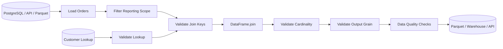

# 03- Join

## Overview

`DataFrame.join()` is a Pandas operation for combining DataFrames primarily through **index-based alignment**.

It overlaps conceptually with `merge()`, but the API is optimized for cases where the right-hand dataset is already indexed by the key used for the relationship.

Typical examples include:

```text
Orders
    ↓
customer_id
    ↓
Customer feature lookup indexed by customer_id
    ↓
join()
```

`join()` is particularly useful when working with:

- Indexed lookup tables.
- Feature matrices.
- Time-series data.
- DataFrames whose indexes already represent the relational key.
- Multiple DataFrames that share a common index.

The key engineering distinction is:

```text
join()
    → primarily index-oriented combination

merge()
    → primarily column/key-oriented relational combination

concat()
    → axis-oriented combination
```

The operation itself is simple. Correct use requires understanding index semantics, join cardinality, duplicate indexes, null behavior, overlapping columns, output grain, and performance.

---

## Why `join()` Exists

Many Pandas workflows naturally produce indexed DataFrames.

For example:

```python
customer_features = customer_features.set_index(
    "customer_id"
)
```

Now the customer ID is the index.

If orders contain:

```text
customer_id
```

you can attach the customer features with:

```python
enriched_orders = orders.join(
    customer_features,
    on="customer_id",
    how="left",
)
```

This avoids explicitly writing:

```python
left_on="customer_id"
right_on="customer_id"
```

because the right-hand key is already represented by its index.

---

## Basic Syntax

The common form is:

```python
result = left.join(
    right,
    on="key",
    how="left",
)
```

When the left and right indexes already represent the relationship:

```python
result = left.join(
    right,
    how="left",
)
```

Important parameters include:

| Parameter | Purpose |
| --- | --- |
| `other` | DataFrame or list of DataFrames to join |
| `on` | Column or columns from the caller used to match the other object's index |
| `how` | Join strategy |
| `lsuffix` | Suffix for overlapping columns from the left |
| `rsuffix` | Suffix for overlapping columns from the right |
| `sort` | Whether to sort the resulting index |
| `validate` | Enforce expected relationship cardinality |

---

## Example Dataset

Consider:

```python
import pandas as pd


orders = pd.DataFrame(
    {
        "order_id": [1001, 1002, 1003, 1004],
        "customer_id": [101, 102, 101, 103],
        "revenue": [250.0, 180.0, 420.0, 150.0],
    }
)

customer_features = pd.DataFrame(
    {
        "customer_id": [101, 102, 103],
        "segment": [
            "Enterprise",
            "SMB",
            "Enterprise",
        ],
        "credit_limit": [
            100_000.0,
            20_000.0,
            75_000.0,
        ],
    }
).set_index("customer_id")
```

Now the customer ID is the index of `customer_features`:

```python
enriched_orders = orders.join(
    customer_features,
    on="customer_id",
    how="left",
    validate="many_to_one",
)
```

Result:

```text
order_id | customer_id | revenue | segment    | credit_limit
---------|-------------|---------|------------|-------------
1001     | 101         | 250.0   | Enterprise | 100000.0
1002     | 102         | 180.0   | SMB        | 20000.0
1003     | 101         | 420.0   | Enterprise | 100000.0
1004     | 103         | 150.0   | Enterprise | 75000.0
```

The output remains at:

```text
one row = one order
```

because the customer index contains one row per customer.

---

## `join()` Versus `merge()`

Both operations can perform similar work.

Using `merge()`:

```python
enriched_orders = orders.merge(
    customer_features.reset_index(),
    on="customer_id",
    how="left",
    validate="many_to_one",
)
```

Using `join()`:

```python
enriched_orders = orders.join(
    customer_features,
    on="customer_id",
    how="left",
    validate="many_to_one",
)
```

The second is more natural when the lookup DataFrame is intentionally indexed by the join key.

A practical rule:

```text
right side already indexed by the relationship key
    → join()

both sides use explicit relational columns
    → merge()
```

Do not choose `join()` merely because it is shorter. Use it when the index-based data model is meaningful.

---

## Joining on the Caller’s Column

The `on` parameter specifies the left-side column.

Example:

```python
result = orders.join(
    customer_features,
    on="customer_id",
    how="left",
)
```

Semantics:

```text
orders.customer_id
        ↓
match against
        ↓
customer_features.index
```

This is one of the most important `join()` behaviors to understand.

The right-side key is not a normal column in this example. It is the index.

---

## Joining Index to Index

If both DataFrames use compatible indexes:

```python
orders_by_id = orders.set_index("order_id")
shipping_status = shipping_status.set_index(
    "order_id"
)

result = orders_by_id.join(
    shipping_status,
    how="left",
)
```

Now the relationship is:

```text
left index
    ↕
right index
```

This is particularly useful in index-oriented analytical workflows.

---

## Joining Multiple Columns to a MultiIndex

A MultiIndex can represent a composite key.

For example:

```python
customer_features = customer_features.set_index(
    ["tenant_id", "customer_id"]
)
```

Then:

```python
result = orders.join(
    customer_features,
    on=["tenant_id", "customer_id"],
    how="left",
)
```

The left-side composite key is matched against the right-side MultiIndex.

This is useful when identifiers are scoped by tenant or another parent dimension.

---

## MultiIndex on the Right

Suppose:

```python
customer_features.index.names
```

returns:

```text
["tenant_id", "customer_id"]
```

Then:

```python
orders.join(
    customer_features,
    on=["tenant_id", "customer_id"],
    how="left",
)
```

requires those left-side columns to correspond to the right MultiIndex levels.

The order and semantics of the levels matter.

Do not rearrange index levels casually in production pipelines.

---

## Join Types

`join()` supports the major relational join types:

| `how` | Meaning |
| --- | --- |
| `left` | Preserve the caller's rows |
| `right` | Preserve the other DataFrame's rows |
| `outer` | Preserve rows from both sides |
| `inner` | Keep matching keys |
| `cross` | Cartesian product |

The exact behavior depends on whether the operation is index-to-index or left-column-to-right-index.

---

## Left Join

The most common pattern:

```python
result = orders.join(
    customer_features,
    on="customer_id",
    how="left",
    validate="many_to_one",
)
```

All rows from `orders` remain.

If no customer exists:

```text
customer attributes → NaN
```

This is appropriate for optional enrichment.

---

## Inner Join

```python
result = orders.join(
    customer_features,
    on="customer_id",
    how="inner",
    validate="many_to_one",
)
```

Only matching orders remain.

Use this when records without corresponding lookup data should be excluded.

For mandatory reference data, an inner join can be appropriate, but verify that dropping unmatched records is actually intended.

---

## Outer Join

```python
result = left.join(
    right,
    how="outer",
)
```

All keys from both sides remain.

This is useful for:

- Reconciliation.
- Auditing.
- Dataset comparison.
- Synchronization checks.

For source-system reconciliation, combine an outer join with explicit membership analysis when necessary.

---

## Right Join

```python
result = orders.join(
    customer_features,
    on="customer_id",
    how="right",
)
```

This preserves the rows from the right-hand dataset.

Right joins are valid, but the resulting index and output semantics may be less intuitive.

Often it is clearer to restructure the operation around a left join:

```python
result = customer_features.join(
    orders.set_index("customer_id"),
    how="left",
)
```

provided the intended relationship and output grain support that design.

---

## Cross Join

A Cartesian product is also possible:

```python
result = products.join(
    regions,
    how="cross",
)
```

The output size is:

```text
len(products) × len(regions)
```

Estimate this before execution.

A cross join can easily produce an output large enough to exhaust container or worker memory.

---

## Cardinality

Although `join()` is index-oriented, the same relational cardinality concepts apply:

```text
one-to-one
one-to-many
many-to-one
many-to-many
```

For example:

```text
orders
    many
    ↓
customer_features
    one
```

is a:

```text
many-to-one
```

relationship.

This means multiple orders can point to the same customer feature record.

---

## `validate=`

Use validation to make cardinality assumptions executable:

```python
result = orders.join(
    customer_features,
    on="customer_id",
    how="left",
    validate="many_to_one",
)
```

Common values include:

```text
"one_to_one"
"one_to_many"
"many_to_one"
"many_to_many"
```

If the right-side index unexpectedly contains duplicate customer IDs, `many_to_one` will fail rather than silently multiplying order rows.

This is a critical production safeguard.

---

## Duplicate Indexes

The right DataFrame's index is effectively the join key.

Check uniqueness:

```python
if not customer_features.index.is_unique:
    raise ValueError(
        "Customer feature index must be unique."
    )
```

Without this validation, a single left row can match multiple right rows.

Example:

```text
orders.customer_id = 101

customer_features:
101 → Enterprise
101 → SMB
```

A join can produce multiple output rows for the same order.

---

## Why Duplicate Indexes Are Dangerous

Suppose:

```text
orders:
customer_id = 101
appears 5 times

lookup:
customer_id = 101
appears 3 times
```

The matching portion can produce:

```text
5 × 3 = 15
```

rows.

Downstream:

```python
groupby().sum()
```

may then inflate revenue.

The failure occurs at the join, not at the aggregation stage.

Validate before performing downstream calculations.

---

## Preserving Output Grain

Suppose:

```text
orders
one row = one order
```

and:

```text
customer_features
one row = one customer
```

Then:

```python
result = orders.join(
    customer_features,
    on="customer_id",
    how="left",
    validate="many_to_one",
)
```

should preserve:

```text
one row = one order
```

Validate:

```python
if len(result) != len(orders):
    raise ValueError(
        "Join changed the expected order grain."
    )
```

This is especially important in ETL jobs where the output is later aggregated.

---

## Joining Multiple DataFrames

`join()` can join multiple DataFrames:

```python
result = base.join(
    [
        customer_features,
        customer_scores,
        customer_segments,
    ],
    how="left",
)
```

This can be convenient when all DataFrames are aligned on the same index.

However, each DataFrame's index semantics and uniqueness must be understood.

For complex pipelines, explicit sequential joins may be easier to validate.

---

## Joining a List of DataFrames

Example:

```python
result = customer_profiles.join(
    [
        customer_scores,
        customer_segments,
    ],
    how="left",
)
```

This can be concise when all lookup DataFrames share the same index.

Use it only when:

```text
same index semantics
compatible uniqueness
compatible output schema
```

are already established.

Otherwise, explicit merges or joins make relationship assumptions clearer.

---

## Overlapping Columns

Suppose both DataFrames contain:

```text
status
```

Then a join requires collision handling.

Use:

```python
result = left.join(
    right,
    lsuffix="_left",
    rsuffix="_right",
)
```

Example:

```python
result = orders.join(
    customer_features,
    on="customer_id",
    how="left",
    lsuffix="_order",
    rsuffix="_customer",
)
```

Choose meaningful names when the fields have different business semantics.

Avoid leaving ambiguous columns in a production dataset.

---

## Column Projection Before Join

Select only required lookup fields:

```python
customer_lookup = customer_features[
    [
        "segment",
        "credit_limit",
    ]
]

result = orders.join(
    customer_lookup,
    on="customer_id",
    how="left",
    validate="many_to_one",
)
```

Because the lookup key is the index, it does not need to be selected as a normal column.

Projecting the required fields reduces:

- Output width.
- Memory usage.
- Copying.
- Accidental sensitive-data exposure.

---

## Joining Sensitive Data

Suppose the indexed customer table contains:

```text
segment
email
phone
internal_risk_score
```

but the order pipeline only needs:

```text
segment
```

Project first:

```python
customer_lookup = customer_features[
    ["segment"]
]

result = orders.join(
    customer_lookup,
    on="customer_id",
    how="left",
    validate="many_to_one",
)
```

This follows a least-data-needed approach.

Data combination operations should not become a mechanism for unnecessarily propagating sensitive fields.

---

## Key Dtypes

If `orders["customer_id"]` is:

```text
string
```

while the lookup index is:

```text
integer
```

the values may not match as intended.

Check:

```python
print(orders["customer_id"].dtype)
print(customer_features.index.dtype)
```

Normalize explicitly:

```python
orders["customer_id"] = (
    orders["customer_id"]
    .astype("string")
)

customer_features.index = (
    customer_features.index
    .astype("string")
)
```

Do this deliberately rather than relying on implicit conversions.

---

## Identifier Semantics

Identifiers such as:

```text
customer_id
account_id
postal_code
SKU
```

should generally not be treated as measurements.

A value such as:

```text
"000123"
```

can lose semantic information if converted to an integer.

For external data sources, normalize identifiers consistently before joining.

---

## Missing Join Keys

A missing left-side key cannot provide a normal relationship to the right-side lookup.

Example:

```python
result = orders.join(
    customer_features,
    on="customer_id",
    how="left",
)
```

Rows with missing customer IDs remain in a left join but generally have missing lookup attributes.

The business rule should define whether this means:

```text
optional enrichment
```

or:

```text
invalid input that should be quarantined
```

Do not silently treat missing relationships as valid data.

---

## Index Names

Index names can improve maintainability:

```python
customer_features.index.name
```

For example:

```python
customer_features.index.name = "customer_id"
```

Named indexes make debugging and multi-level operations easier to understand.

However, the index name itself is not a substitute for validating the actual key values and relationship semantics.

---

## Index Uniqueness

Index uniqueness is one of the most important properties when using `join()` as a lookup operation.

Check:

```python
customer_features.index.is_unique
```

For a one-record-per-customer lookup:

```python
if not customer_features.index.is_unique:
    raise ValueError(
        "customer_id index must be unique."
    )
```

This should ideally be enforced by upstream database constraints as well.

---

## Time-Series Join

`join()` is particularly natural for time-indexed data.

Example:

```python
orders = orders.set_index("created_at")
daily_targets = daily_targets.set_index(
    "date"
)

result = orders.join(
    daily_targets,
    how="left",
)
```

However, direct index alignment is not the same as an as-of or nearest-time relationship.

If timestamps need:

```text
nearest previous value
nearest timestamp
time-window matching
```

consider `merge_asof()` or another explicitly temporal operation.

---

## `join()` Versus `merge_asof()`

A normal join requires an exact key/index relationship.

Example:

```text
2026-01-10 10:00
```

matches:

```text
2026-01-10 10:00
```

only.

A temporal requirement such as:

```text
use the most recent configuration available before the event
```

is a different problem.

Use a time-aware operation such as `merge_asof()` rather than forcing approximate temporal semantics into a normal join.

---

## MultiIndex and Hierarchical Data

`join()` works naturally with MultiIndex structures.

Example:

```python
features = features.set_index(
    ["region", "customer_id"]
)

orders = orders.join(
    features,
    on=["region", "customer_id"],
    how="left",
)
```

This can be useful for hierarchical dimensions.

However, MultiIndex-heavy code can become harder to maintain than explicit relational columns.

Use hierarchical indexes when they provide meaningful analytical value, not simply because Pandas supports them.

---

## Join and Aggregation

A common data pipeline is:

```text
orders
    ↓
join customer attributes
    ↓
join product attributes
    ↓
group by reporting dimensions
    ↓
aggregate
```

Example:

```python
orders = orders.join(
    customer_features[
        ["segment"]
    ],
    on="customer_id",
    how="left",
    validate="many_to_one",
)

report = (
    orders.groupby("segment", as_index=False)
    .agg(
        total_revenue=("revenue", "sum"),
        order_count=("order_id", "nunique"),
    )
)
```

The correctness of the aggregation depends on the join preserving the intended order grain.

---

## Join and Grouped Transformations

After enrichment:

```python
orders = orders.join(
    customer_features[
        ["segment"]
    ],
    on="customer_id",
    how="left",
    validate="many_to_one",
)
```

you can compute group-aware metrics:

```python
orders["segment_revenue"] = (
    orders.groupby("segment")["revenue"]
    .transform("sum")
)
```

This illustrates how:

```text
join()
    ↓
enrich records

groupby()
    ↓
derive group context
```

often form consecutive stages in an ETL pipeline.

---

## SQL Equivalent

When `customer_features` is indexed by `customer_id`:

```python
orders.join(
    customer_features,
    on="customer_id",
    how="left",
)
```

is conceptually similar to:

```sql
SELECT
    o.*,
    c.segment,
    c.credit_limit
FROM orders AS o
LEFT JOIN customer_features AS c
    ON o.customer_id = c.customer_id;
```

The database representation is relational, while the Pandas representation uses the right-side index as the lookup key.

---

## PostgreSQL Considerations

If both datasets originate in PostgreSQL, consider whether the join should happen in the database:

```sql
SELECT
    o.order_id,
    o.customer_id,
    o.revenue,
    c.segment
FROM orders AS o
LEFT JOIN customer_features AS c
    ON o.customer_id = c.customer_id;
```

Database-side joins can avoid transferring unnecessary rows into Pandas.

Use Pandas `join()` when:

- Data is already loaded.
- The lookup is intentionally index-oriented.
- Additional Pandas transformations are required.
- The working set is appropriately sized.

---

## REST API Enrichment

Suppose an API returns orders and another endpoint provides customer metadata:

```python
orders = pd.DataFrame(
    orders_response["items"]
)

customers = pd.DataFrame(
    customer_response["items"]
).set_index("customer_id")
```

Then:

```python
orders = orders.join(
    customers[
        ["segment", "region"]
    ],
    on="customer_id",
    how="left",
    validate="many_to_one",
)
```

Validate external data before the join:

```python
if not customers.index.is_unique:
    raise ValueError(
        "API customer IDs are not unique."
    )
```

External API payloads should be treated as untrusted inputs.

---

## Parquet Workflow

An indexed lookup can be loaded from Parquet:

```python
customer_features = pd.read_parquet(
    "customer_features.parquet"
).set_index("customer_id")
```

Then:

```python
orders = orders.join(
    customer_features[
        ["segment"]
    ],
    on="customer_id",
    how="left",
    validate="many_to_one",
)
```

For large datasets, avoid loading unnecessarily wide lookup tables when only a few fields are needed.

---

## Performance

Join performance depends on:

- Left row count.
- Right row count.
- Index cardinality.
- Duplicate keys.
- Number of columns.
- Join type.
- Output size.
- Dtype compatibility.

Index-oriented joins can be efficient for suitable lookup patterns, but an index is not a guarantee of high performance.

The most important optimization steps are usually:

```text
reduce rows
    ↓
project columns
    ↓
normalize key types
    ↓
validate key uniqueness
    ↓
join
```

---

## Memory Considerations

A join creates a result DataFrame.

Even if the right-side lookup is small:

```text
5 million orders
+
5 customer attributes
```

the resulting DataFrame still contains those attributes across the output rows.

Keep lookup tables narrow:

```python
customer_lookup = customer_features[
    [
        "segment",
        "region",
    ]
]
```

This limits the width of the resulting DataFrame.

---

## High-Cardinality Indexes

A large unique index is not inherently wrong:

```text
10 million customer IDs
```

may be a legitimate lookup.

But it increases memory requirements.

Before using an indexed lookup, determine:

```text
How many rows?
How many unique keys?
How many columns?
How many rows actually need enrichment?
```

Filter the left-side dataset first when the business scope allows it.

---

## Large Dataset Strategy

For large relational workloads:

```text
Database
    ↓
SQL filtering
    ↓
SQL join
    ↓
Reduced result
    ↓
Pandas
```

is often more scalable than:

```text
Database
    ↓
load full left table
load full right table
    ↓
Pandas join
```

For very large local datasets, consider:

- DuckDB.
- Polars.
- Spark.
- Data warehouses.

Pandas `join()` should be selected because it fits the working-set size and data model, not because it is familiar.

---

## Empty DataFrames

Joining an empty DataFrame should be part of pipeline testing.

Example:

```python
empty_orders = orders.iloc[0:0].copy()

result = empty_orders.join(
    customer_features,
    on="customer_id",
    how="left",
    validate="many_to_one",
)
```

The result should retain the expected schema.

For API and reporting systems, distinguish:

```text
valid empty result
```

from:

```text
upstream failure
```

---

## Unexpected Input

Validate:

```python
required_columns = {
    "order_id",
    "customer_id",
    "revenue",
}

missing = required_columns.difference(
    orders.columns
)

if missing:
    raise ValueError(
        f"Missing columns: {sorted(missing)}"
)
```

For the indexed lookup:

```python
if "segment" not in customer_features.columns:
    raise ValueError(
        "Customer segment is required."
    )
```

And:

```python
if not customer_features.index.is_unique:
    raise ValueError(
        "Customer lookup index must be unique."
    )
```

Make data contracts executable where practical.

---

## Testing Join Semantics

A strong test should verify:

```text
expected row count
expected output columns
expected enrichment
expected grain
cardinality behavior
unmatched-key behavior
```

Example:

```python
from pandas.testing import assert_frame_equal


def test_customer_join_preserves_orders() -> None:
    orders = pd.DataFrame(
        {
            "order_id": [1, 2, 3],
            "customer_id": [101, 102, 101],
            "revenue": [100.0, 200.0, 50.0],
        }
    )

    customer_features = pd.DataFrame(
        {
            "customer_id": [101, 102],
            "segment": [
                "Enterprise",
                "SMB",
            ],
        }
    ).set_index("customer_id")

    actual = orders.join(
        customer_features,
        on="customer_id",
        how="left",
        validate="many_to_one",
    )

    expected = pd.DataFrame(
        {
            "order_id": [1, 2, 3],
            "customer_id": [101, 102, 101],
            "revenue": [100.0, 200.0, 50.0],
            "segment": [
                "Enterprise",
                "SMB",
                "Enterprise",
            ],
        }
    )

    assert_frame_equal(
        actual,
        expected,
    )
```

---

## Testing Invalid Cardinality

Verify that duplicate lookup keys fail:

```python
import pytest
import pandas as pd


def test_duplicate_lookup_index_fails() -> None:
    orders = pd.DataFrame(
        {
            "order_id": [1],
            "customer_id": [101],
        }
    )

    customer_features = pd.DataFrame(
        {
            "customer_id": [101, 101],
            "segment": [
                "Enterprise",
                "SMB",
            ],
        }
    ).set_index("customer_id")

    with pytest.raises(
        pd.errors.MergeError
    ):
        orders.join(
            customer_features,
            on="customer_id",
            how="left",
            validate="many_to_one",
        )
```

This proves the relationship assumption is enforced rather than merely documented.

---

## Testing Unmatched Records

For optional enrichment:

```python
def test_unmatched_customer_is_preserved() -> None:
    orders = pd.DataFrame(
        {
            "order_id": [1],
            "customer_id": [999],
        }
    )

    customer_features = pd.DataFrame(
        {
            "customer_id": [101],
            "segment": ["Enterprise"],
        }
    ).set_index("customer_id")

    result = orders.join(
        customer_features,
        on="customer_id",
        how="left",
        validate="many_to_one",
    )

    assert len(result) == 1
    assert pd.isna(
        result.loc[0, "segment"]
    )
```

This captures the intended left-join semantics.

---

## Common Mistakes

### Forgetting That the Right Key Is the Index

This:

```python
orders.join(
    customers,
    on="customer_id",
)
```

does not automatically search for a right-side column named `customer_id`.

The right-side relationship is index-oriented.

Use:

```python
customers = customers.set_index(
    "customer_id"
)
```

when appropriate.

---

### Using `join()` Without Understanding the Index

An index can represent:

```text
row position
```

or:

```text
business identity
```

Do not assume an existing index is a valid relational key.

Inspect:

```python
customers.index.name
customers.index.is_unique
```

before using it for joins.

---

### Ignoring Duplicate Indexes

A duplicated lookup index can multiply rows.

Protect with:

```python
validate="many_to_one"
```

when that relationship is expected.

---

### Using `join()` for Arbitrary Column-to-Column Relationships

If both sides use explicit columns:

```text
left.customer_id
right.customer_id
```

and neither side is naturally index-oriented, `merge()` is usually clearer:

```python
left.merge(
    right,
    on="customer_id",
    how="left",
)
```

Do not force relational data into an index merely to use `join()`.

---

### Assuming Row Counts Are Always Preserved

A left join preserves the left rows only when the right relationship does not multiply matches.

A duplicated right index can increase the output.

Validate cardinality instead of assuming preservation.

---

### Ignoring Overlapping Columns

Ambiguous suffixes can make downstream processing difficult.

Use:

```python
lsuffix="_left"
rsuffix="_right"
```

or rename the fields before joining.

---

## Production Pitfalls

### Treating an Accidental Index as a Business Key

A DataFrame may have:

```text
RangeIndex
```

simply because it was loaded from a file.

That does not make it a relational key.

Use an explicit business identifier unless the index was intentionally designed for the relationship.

---

### Historical Lookup Rows

A customer feature table may contain multiple versions:

```text
customer_id | effective_from | segment
101         | 2025-01-01     | SMB
101         | 2026-01-01     | Enterprise
```

Using:

```python
set_index("customer_id")
```

creates a duplicate index.

Do not arbitrarily drop one record to force uniqueness.

The correct solution may require:

- Temporal filtering.
- Effective-date logic.
- `merge_asof()`.
- A current-state lookup table.

---

### Joining Before Aggregation Without Validation

A duplicated lookup can inflate:

```text
revenue
order count
event count
```

when the result is later grouped.

Always validate the join before downstream aggregation.

---

### Excessive Index Complexity

Deep MultiIndex structures can make production code harder to debug and serialize.

Use index hierarchies when they provide real analytical value.

For relational ETL outputs, explicit columns are often easier to integrate.

---

### Large In-Memory Joins

Loading several large DataFrames into a FastAPI, Django, or Celery worker can cause:

```text
high memory usage
container OOM
worker restarts
slow processing
```

Use database-side joins or a scalable analytical engine when appropriate.

---

## Security Considerations

A join can propagate sensitive customer or account attributes to datasets that were not originally authorized to contain them.

Use column projection:

```python
customer_lookup = customer_features[
    ["segment"]
]
```

and establish authorization before data combination.

For multi-tenant systems, ensure the relationship includes the tenant boundary:

```python
customer_features = customer_features.set_index(
    ["tenant_id", "customer_id"]
)

result = orders.join(
    customer_features,
    on=["tenant_id", "customer_id"],
    how="left",
    validate="many_to_one",
)
```

Do not rely on `customer_id` alone when it is scoped to a tenant.

---

## Monitoring

Useful join metrics include:

```text
left_row_count
right_row_count
right_unique_index_count
duplicate_right_index_count
output_row_count
unmatched_left_count
unmatched_rate
join_duration_ms
memory_usage_bytes
```

For a left many-to-one enrichment:

```text
output_row_count
    should normally equal
left_row_count
```

A sudden increase may indicate:

- Duplicate lookup keys.
- Unexpected source changes.
- Identifier normalization problems.
- Join-key corruption.

---

## Reliability and Idempotency

`join()` is deterministic when:

```text
left input
+
right lookup
+
join keys
+
join type
```

are deterministic.

For reliable ETL:

```text
validate lookup
    ↓
join
    ↓
validate output grain
    ↓
publish
```

Do not silently deduplicate lookup rows just to make a failed join pass. That can hide upstream data corruption.

---

## Production Data Flow

A typical enrichment pipeline is:



The join stage should be surrounded by validation rather than treated as an isolated DataFrame operation.

---

## Choosing `join()` or `merge()`

| Situation | Preferred Operation |
| --- | --- |
| Right side is indexed by the lookup key | `join()` |
| Both sides have explicit key columns | `merge()` |
| Left column maps to right index | `join(on=...)` |
| Index-to-index alignment | `join()` |
| Multiple relational columns require explicit mapping | `merge()` |
| Need explicit relational semantics | `merge()` |
| Building an index-oriented analytical structure | `join()` |
| Need detailed `left_on` / `right_on` control | `merge()` |

The goal is not to always prefer one API. The goal is to choose the API that makes the data relationship easiest to understand.

---

## Recommended Production Pattern

A reusable index-based enrichment function can make its assumptions explicit:

```python
import pandas as pd


def enrich_orders(
    orders: pd.DataFrame,
    customer_features: pd.DataFrame,
) -> pd.DataFrame:
    required_order_columns = {
        "order_id",
        "customer_id",
    }

    missing_order_columns = (
        required_order_columns
        - set(orders.columns)
    )

    if missing_order_columns:
        raise ValueError(
            "Missing order columns: "
            f"{sorted(missing_order_columns)}"
        )

    if "segment" not in customer_features.columns:
        raise ValueError(
            "Customer segment is required."
        )

    if customer_features.index.name != (
        "customer_id"
    ):
        raise ValueError(
            "Customer features must be indexed "
            "by customer_id."
        )

    if not customer_features.index.is_unique:
        raise ValueError(
            "Customer feature index must be unique."
        )

    customer_lookup = customer_features[
        ["segment"]
    ]

    result = orders.join(
        customer_lookup,
        on="customer_id",
        how="left",
        validate="many_to_one",
    )

    if len(result) != len(orders):
        raise ValueError(
            "Join changed the expected order grain."
        )

    return result
```

This makes the relationship explicit:

```text
customer_id
    ↓
right-side index
    ↓
many-to-one lookup
    ↓
original order grain preserved
```

It is appropriate for pipelines where the right-hand DataFrame is intentionally modeled as an index-based lookup.

---

## Decision Guide

| Requirement | Recommended Approach |
| --- | --- |
| Enrich rows using a right-side index | `join()` |
| Join explicit columns | `merge()` |
| Preserve every left record | `how="left"` |
| Keep only matches | `how="inner"` |
| Reconcile both datasets | `how="outer"` |
| Left column maps to right index | `on=` |
| Composite key maps to MultiIndex | `on=[...]` |
| Expected lookup is unique | `validate="many_to_one"` |
| Both indexes are unique | `validate="one_to_one"` |
| Need Cartesian combinations | `how="cross"` |
| Large database-resident join | Prefer SQL where practical |
| Time-nearest matching | Consider `merge_asof()` |
| API-facing relational output | Prefer explicit columns when possible |

---

## Key Takeaways

- `DataFrame.join()` is primarily an index-oriented combination operation and is especially useful when the right-hand DataFrame is intentionally indexed by the lookup key.
- Treat the right-side index as a relational key: validate its uniqueness, dtype, scope, and business meaning before joining.
- Use `validate=` to enforce cardinality assumptions and verify that an enrichment preserves the expected output grain.
- Prefer `merge()` when both datasets naturally use explicit relational columns; use `join()` when index-based semantics make the relationship clearer.
- Production joins should minimize columns, handle unmatched and duplicate keys explicitly, protect tenant and sensitive data boundaries, monitor row counts and match rates, and move large database-resident joins into SQL when appropriate.